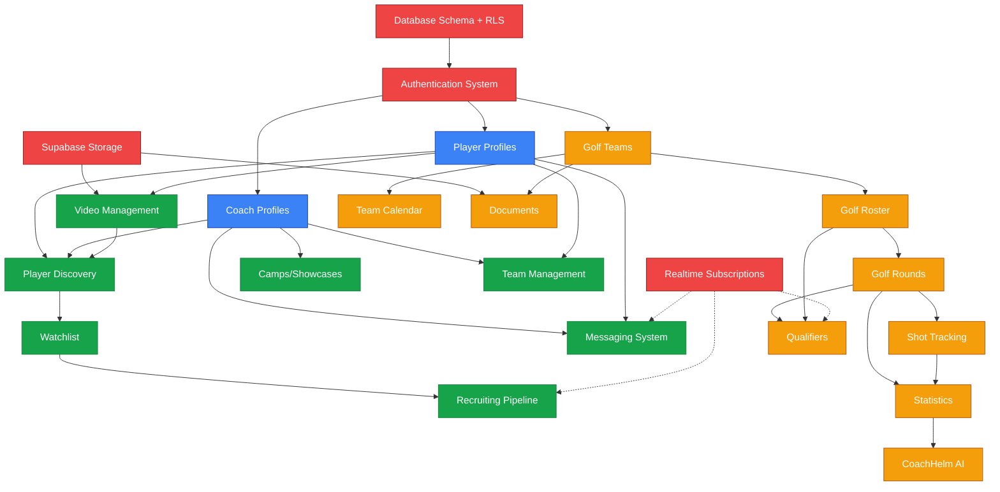

# Helm v3 - Feature Dependency Graph
**Understanding What Depends on What**

Last Updated: 2026-01-08
Platform: Helm Sports Labs v3

This document maps all feature dependencies across the platform. Use this to:
- Understand impact of changes
- Plan implementation order
- Identify critical path features
- Avoid breaking dependencies

---

## 📊 Dependency Visualization

---

## 🔴 CRITICAL PATH FEATURES

These features are foundational. If they break, multiple features break.

### 1. Authentication System
**Depends On:** Supabase Auth, Database users table
**Depended On By:** ALL features (100% dependency)

**What It Provides:**
- User signup/login
- Session management
- Role determination (coach/player)
- Platform routing (baseball/golf)

**If It Breaks:**
- 🔴 Nobody can log in
- 🔴 ALL features inaccessible
- 🔴 Complete platform outage

**Files:**
- src/lib/supabase/server.ts
- src/lib/supabase/client.ts
- src/lib/supabase/middleware.ts
- src/stores/auth-store.ts
- src/app/baseball/(auth)/
- src/app/golf/(auth)/

**Test Coverage:** ✅ E2E tests exist

---

### 2. Database Schema + RLS
**Depends On:** PostgreSQL, Supabase
**Depended On By:** ALL data operations (100% dependency)

**What It Provides:**
- 86 tables with complete schema
- Row-Level Security for authorization
- Data integrity via constraints
- Query performance via indexes

**If It Breaks:**
- 🔴 Data corruption possible
- 🔴 Authorization bypass (RLS issues)
- 🔴 Feature breakage (missing tables/columns)
- 🔴 Performance degradation (missing indexes)

**Critical Tables:**
- users (auth foundation)
- coaches, players (profile foundation)
- golf_teams (golf platform foundation)
- conversations, messages (messaging foundation)

**Current Issues:**
- 🔴 RLS-001: Golf tables RLS disabled
- 🔴 RLS-004: 15 tables missing policies

**Files:**
- supabase/migrations/* (51 migrations)
- src/types/supabase.ts (generated types)

---

### 3. Supabase Storage
**Depends On:** Supabase Storage service
**Depended On By:** Videos, Golf Documents, Profile Pictures

**What It Provides:**
- File upload/download
- Public/private buckets
- CDN-backed delivery
- RLS policies on buckets

**Buckets:**
- `videos` - Player highlight videos (public read)
- `avatars` - User profile pictures (public read)
- `documents` - Golf team documents (private, team-scoped)
- `course-maps` - Golf course maps/scorecards

**If It Breaks:**
- 🟠 Videos cannot be uploaded/viewed
- 🟠 Documents inaccessible
- 🟡 Profile pictures broken (minor)

**Files:**
- src/lib/storage/* (storage helpers)
- src/components/video/VideoUploader.tsx

---

### 4. Realtime Subscriptions
**Depends On:** Supabase Realtime, PostgreSQL notifications
**Depended On By:** Messaging (critical), Pipeline (nice-to-have), Qualifiers (nice-to-have)

**What It Provides:**
- Live message delivery
- Pipeline board real-time updates
- Qualifier leaderboard live updates
- Multi-user collaboration

**If It Breaks:**
- 🟠 Messages delayed (fallback to polling)
- 🟡 Pipeline board doesn't update live
- 🟡 Qualifiers need manual refresh

**Files:**
- src/hooks/use-messages-subscription.ts
- src/hooks/use-pipeline-subscription.ts
- src/hooks/golf/use-qualifier-subscription.ts

**Note:** Features have polling fallbacks, so not CRITICAL, but UX degrades significantly.

---

## ⚾ BASEBALL FEATURES DEPENDENCY CHAIN

### Foundation: Player & Coach Profiles

#### Player Profiles
**Depends On:** Auth, Database
**Depended On By:** Discovery, Watchlist, Pipeline, Videos, Messaging

**What It Provides:**
- Player demographics (name, grad year, position)
- School information
- Physical stats (height, weight)
- Performance metrics (velocity, exit velo, 60-yard dash)
- Academic data (GPA, test scores)
- Recruiting activation flag

**If It Breaks:**
- 🔴 Discovery cannot function (no players to discover)
- 🔴 Watchlist cannot function (no players to add)
- 🔴 Pipeline cannot function (no player data)

**Database Tables:**
- players (core profile)
- player_metrics (performance data)
- high_schools (school reference)

---

#### Coach Profiles
**Depends On:** Auth, Database
**Depended On By:** Discovery, Watchlist, Pipeline, Camps, Teams, Messaging

**What It Provides:**
- Coach demographics
- Coach type (college/hs/juco/showcase)
- Organization/school affiliation
- Program details (division, conference)
- Contact information

**If It Breaks:**
- 🔴 Recruiting features inaccessible to coaches
- 🔴 Cannot create camps
- 🔴 Cannot manage teams

**Database Tables:**
- coaches (core profile)
- organizations (school/org reference)
- colleges (college-specific data)

---

### Feature: Player Discovery

**Depends On:**
- ✅ Player Profiles (CRITICAL)
- ✅ Coach Profiles (CRITICAL)
- ✅ Videos (enhances discovery but not required)
- ✅ Database indexes (PERF-001 for speed)

**Depended On By:**
- Watchlist (players added from discovery)
- Profile Views tracking

**What It Provides:**
- Search/filter players by:
  - Position
  - Grad year
  - State/region
  - Velocity/metrics
  - GPA/academics
- USA map visualization
- Player cards with quick actions
- "Add to Watchlist" button

**If It Breaks:**
- 🔴 Coaches cannot find players
- 🔴 Platform core value prop broken
- 🔴 No revenue (coaches won't pay)

**Files:**
- src/app/baseball/(dashboard)/dashboard/discover/page.tsx
- src/components/coach/discover/FilterPanel.tsx
- src/components/coach/discover/DiscoverResults.tsx
- src/components/coach/discover/PlayerCard.tsx

**Current Issues:**
- 🟠 PERF-001: Slow with filters (2-3s)

---

### Feature: Watchlist

**Depends On:**
- ✅ Player Profiles (CRITICAL)
- ✅ Coach Profiles (CRITICAL)
- ✅ Discovery (players added from here)

**Depended On By:**
- Pipeline (players moved from watchlist to pipeline)
- Comparison Tool (compare watchlist players)

**What It Provides:**
- Save prospects for later review
- Add notes per player
- Tag players
- Bulk actions (move to pipeline, remove, export)
- Table view with inline editing
- Real-time updates (via Realtime)

**If It Breaks:**
- 🔴 Coaches lose prospect tracking
- 🔴 Pipeline cannot be populated
- 🔴 Core recruiting workflow broken

**Database Tables:**
- watchlists (many-to-many: coaches ↔ players)

**Files:**
- src/app/baseball/(dashboard)/dashboard/watchlist/page.tsx
- src/components/coach/watchlist/WatchlistTable.tsx

**Current Issues:**
- 🟠 PERF-002: Slow with 100+ players

---

### Feature: Recruiting Pipeline

**Depends On:**
- ✅ Watchlist (CRITICAL - players come from here)
- ✅ Player Profiles (CRITICAL)
- ✅ Coach Profiles (CRITICAL)
- ✅ @dnd-kit library (for drag-and-drop)
- ✅ Realtime (optional - for multi-coach teams)

**Depended On By:**
- Dashboard analytics (pipeline stats)
- Messaging (context for conversations)

**What It Provides:**
- Visual kanban board
- 5 stages:
  1. Watchlist
  2. High Priority
  3. Offer Extended
  4. Committed
  5. Uninterested
- Drag-and-drop stage changes
- Notes per stage
- Timeline per prospect
- Export to CSV

**If It Breaks:**
- 🔴 Core recruiting workflow broken
- 🔴 Coaches cannot manage pipeline
- 🔴 Major revenue impact

**Database Tables:**
- watchlists.pipeline_stage (stores current stage)

**Files:**
- src/app/baseball/(dashboard)/dashboard/pipeline/page.tsx
- src/components/pipeline/PipelineBoard.tsx
- src/components/pipeline/PipelineColumn.tsx
- src/components/pipeline/PipelineCard.tsx

**Current Issues:**
- 🟡 ISSUE-MINOR-002: Mobile drag-drop suboptimal

---

### Feature: Messaging System

**Depends On:**
- ✅ Auth (CRITICAL)
- ✅ Coach Profiles (CRITICAL)
- ✅ Player Profiles (CRITICAL)
- ✅ can_users_message() function (authorization logic)
- ✅ Realtime (optional - for instant delivery)

**Depended On By:**
- Recruiting workflow (coach-player communication)
- Team collaboration (coach-coach, player-player)

**What It Provides:**
- Direct messages between users
- Conversation threads
- Read receipts
- Message history
- Real-time delivery (when Realtime works)
- Fallback polling

**Authorization Rules** (via can_users_message function):
- College coaches ↔ Recruiting-activated players
- HS coaches ↔ Players on their roster
- JUCO coaches ↔ Depends on mode (recruiting vs team)
- Teammates ↔ Each other

**If It Breaks:**
- 🔴 Cannot communicate for recruiting
- 🔴 Major UX degradation
- 🔴 Users switch to external channels (bad)

**Database Tables:**
- conversations (thread metadata)
- conversation_participants (who's in each thread)
- messages (individual messages)

**Files:**
- src/app/baseball/(dashboard)/dashboard/messages/
- src/components/messages/
- src/hooks/use-messages.ts
- src/hooks/use-messages-subscription.ts

**Current Issues:**
- 🟠 RLS-002: conversation_participants had RLS disabled (now fixed but monitor)
- 🟠 RLS-003: Permissive conversation creation
- 🟠 RLS-005: Complex SECURITY DEFINER functions need audit logging

---

### Feature: Video Management

**Depends On:**
- ✅ Player Profiles (CRITICAL)
- ✅ Supabase Storage (CRITICAL)

**Depended On By:**
- Discovery (videos shown on player cards)
- Player profiles (video showcase)

**What It Provides:**
- Upload videos (MP4, MOV, etc.)
- Video metadata (title, description, date)
- Video types (hitting, pitching, fielding)
- Primary video selection
- Video views tracking

**If It Breaks:**
- 🟠 Players cannot showcase skills
- 🟠 Coaches cannot evaluate players
- 🟡 Discovery still works but less effective

**Database Tables:**
- videos (metadata + storage URLs)
- video_views (tracking)

**Files:**
- src/app/baseball/(dashboard)/dashboard/videos/
- src/components/video/VideoUploader.tsx

**Current Issues:**
- 🟡 FEAT-PARTIAL-001: Missing clipping tool, transcoding, analytics

---

### Feature: Camps/Showcases

**Depends On:**
- ✅ Coach Profiles (CRITICAL)
- ✅ Auth (CRITICAL)

**Depended On By:**
- Dashboard (upcoming camps widget)

**What It Provides:**
- Create/manage camps
- Registration system
- Capacity management
- Pricing (but no payment processing)
- Attendee list

**If It Breaks:**
- 🟡 Cannot host camps
- 🟡 Minor revenue impact (secondary feature)

**Database Tables:**
- camps (camp metadata)
- camp_registrations (attendees)

**Files:**
- src/app/baseball/(dashboard)/dashboard/camps/

**Current Issues:**
- 🟡 FEAT-PARTIAL-002: No payment processing (Stripe not integrated)

---

### Feature: Team Management (Baseball)

**Depends On:**
- ✅ Coach Profiles (CRITICAL)
- ✅ Player Profiles (CRITICAL)
- ✅ Organizations (school/org data)

**Depended On By:**
- Messaging (team context for authorization)

**What It Provides:**
- Roster management
- Team invitations (via invite codes)
- Coach staff management
- Multiple teams per organization (showcase coaches)

**If It Breaks:**
- 🟠 CORE-001: JUCO coaches blocked (no team mode)
- 🟠 CORE-002: Showcase coaches blocked (no multi-team)
- 🟠 CORE-003: HS coaches blocked (dashboard incomplete)

**Database Tables:**
- teams (team metadata)
- team_members (player roster)
- team_coach_staff (coaching staff)
- team_invitations (invite codes)
- organizations (school/org metadata)

**Files:**
- src/app/baseball/(dashboard)/dashboard/roster/
- src/app/baseball/(dashboard)/dashboard/team/

**Current Issues:**
- 🔴 CORE-001: JUCO mode toggle not implemented
- 🔴 CORE-002: Multi-team support incomplete
- 🔴 CORE-003: HS coach dashboard incomplete

---

## ⛳ GOLF FEATURES DEPENDENCY CHAIN

### Foundation: Golf Teams & Roster

#### Golf Teams
**Depends On:** Auth, Database
**Depended On By:** ALL golf features (100% dependency within golf)

**What It Provides:**
- Team entity (Men's/Women's teams)
- Organization affiliation
- Season tracking
- Invite codes for players to join

**If It Breaks:**
- 🔴 Entire golf platform inaccessible
- 🔴 No roster, rounds, qualifiers, etc.

**Database Tables:**
- golf_teams (team metadata)
- golf_organizations (schools)

**Current Issues:**
- 🔴 RLS-001: RLS disabled on golf_teams

---

#### Golf Roster
**Depends On:** Golf Teams (CRITICAL)
**Depended On By:** Rounds, Qualifiers, Stats, Calendar, Documents

**What It Provides:**
- Player list for team
- Player year (freshman/sophomore/etc.)
- Player status (active/injured/redshirt)
- Scholarship tracking
- Handicap tracking

**If It Breaks:**
- 🔴 Cannot log rounds (no players)
- 🔴 Cannot create qualifiers (no players)
- 🔴 Stats broken (no player data)

**Database Tables:**
- golf_players (player metadata + team_id)

**Files:**
- src/app/golf/(dashboard)/dashboard/roster/
- src/components/golf/roster/RosterTable.tsx

**Current Issues:**
- 🔴 RLS-001: RLS disabled on golf_players

---

### Feature: Golf Rounds (Shot Tracking)

**Depends On:**
- ✅ Golf Roster (CRITICAL)
- ✅ Golf Teams (CRITICAL)

**Depended On By:**
- Golf Stats (calculates from rounds)
- Golf Qualifiers (rounds submitted for qualifiers)
- CoachHelm AI (analyzes round data)

**What It Provides:**
- Hole-by-hole score entry
- Shot-by-shot tracking (optional, detailed)
- Course data (name, par, yardage)
- Round types (tournament, practice, casual, qualifier)
- Coach verification
- Round summary stats

**If It Breaks:**
- 🔴 Core golf platform feature broken
- 🔴 No data for stats/AI
- 🔴 Qualifiers cannot function

**Database Tables:**
- golf_rounds (round metadata + total score)
- golf_holes (hole-by-hole data)
- golf_shots (shot-by-shot detail)
- putt_details (putting-specific data)
- golf_courses (course reference)
- golf_course_holes (hole details per course)

**Files:**
- src/app/golf/(dashboard)/dashboard/rounds/
- src/components/golf/rounds/ScoreCard.tsx
- src/components/golf/rounds/ShotTracker.tsx

**Current Issues:**
- 🔴 RLS-001: RLS disabled on golf_rounds, golf_shots, golf_holes

---

### Feature: Golf Statistics

**Depends On:**
- ✅ Golf Rounds (CRITICAL - data source)
- ✅ Golf Shots (optional - for advanced stats)

**Depended On By:**
- CoachHelm AI (uses stats for insights)
- Qualifiers (displays stats on leaderboards)
- Dashboard widgets

**What It Provides:**
- Scoring average
- Scoring trends over time
- Putting stats (putts per round, make %)
- Fairways hit %
- Greens in regulation %
- Best rounds
- Strokes gained analysis
- Comparison to team average

**If It Breaks:**
- 🟡 Stats dashboard blank
- 🟡 CoachHelm insights degraded
- 🟡 Qualifiers less informative

**Database Tables:**
- Calculated from golf_rounds, golf_holes, golf_shots
- golf_player_stats (cached aggregates)

**Files:**
- src/app/golf/(dashboard)/dashboard/stats/
- src/lib/golf/stats-calculator.ts

**Current Issues:**
- 🔴 RLS-004: golf_player_stats missing policies

---

### Feature: Golf Qualifiers

**Depends On:**
- ✅ Golf Roster (CRITICAL)
- ✅ Golf Rounds (CRITICAL - data source)
- ✅ Golf Teams (CRITICAL)

**Depended On By:**
- Lineup selection (who travels to tournament)

**What It Provides:**
- Create qualifier events
- Define number of rounds
- Define spots available (e.g., top 5 travel)
- Players submit rounds for qualifier
- Automatic leaderboard calculation
- Coach finalizes lineup

**If It Breaks:**
- 🟠 Cannot select traveling lineup objectively
- 🟠 Coaches revert to manual tracking

**Database Tables:**
- golf_qualifiers (qualifier metadata)
- golf_qualifier_entries (player participation)
- golf_rounds (with qualifier_id link)

**Files:**
- src/app/golf/(dashboard)/dashboard/qualifiers/
- src/components/golf/qualifiers/Leaderboard.tsx

**Current Issues:**
- 🔴 RLS-004: golf_qualifiers, golf_qualifier_entries missing policies
- 🟡 FEAT-003: Create UI missing (can view but not create)

---

### Feature: CoachHelm AI (Golf Coaching Intelligence)

**Depends On:**
- ✅ Golf Rounds (CRITICAL - data source)
- ✅ Golf Shots (CRITICAL - detailed data)
- ✅ Golf Stats (CRITICAL - aggregates)

**Depended On By:**
- Nothing (end feature)

**What It Provides:**
- Pattern recognition (e.g., "struggles with approach shots from 100-150 yards")
- Tendency analysis (e.g., "consistently leaves putts short")
- Coaching recommendations
- Performance predictions
- Causal discovery (what factors affect scoring)
- Confidence calibration (ML model accuracy tracking)

**If It Breaks:**
- 🟡 Loses premium AI feature
- 🟡 Coaches get raw stats only
- 🟡 Competitive disadvantage

**Database Tables:**
- golf_patterns_v2 (identified patterns)
- golf_causal_relationships (causal links)
- golf_predictions (predictions + outcomes)
- golf_learned_behavior (behavioral patterns)
- golf_validations (prediction accuracy)
- golf_global_patterns (cross-team patterns)
- golf_confidence_calibration (ML calibration)

**Files:**
- src/lib/coachhelm/* (10+ modules)
- src/app/api/golf/rounds/generate-review/route.ts

**Current Issues:**
- 🟠 RLS-006: golf_global_patterns, golf_confidence_calibration use USING (true) - IP leak risk

---

### Feature: Team Calendar

**Depends On:**
- ✅ Golf Teams (CRITICAL)

**Depended On By:**
- Travel management
- Availability polling

**What It Provides:**
- Schedule practices, tournaments, meetings
- Event types
- RSVP system
- Attendance tracking
- iCal feed export
- Calendar sync (planned)

**If It Breaks:**
- 🟡 Manual scheduling required
- 🟡 Attendance tracking manual

**Database Tables:**
- golf_events (event metadata)
- golf_event_rsvps (player responses)
- golf_event_attendance (actual attendance)
- golf_calendar_feeds (iCal tokens)

**Files:**
- src/app/golf/(dashboard)/dashboard/calendar/
- src/app/api/calendar/feeds/[token]/route.ts

**Current Issues:**
- 🔴 RLS-001: golf_events RLS disabled
- 🔴 RLS-004: golf_event_rsvps, golf_event_attendance missing policies
- 🟠 ISSUE-C003: iCal format invalid (won't sync to Google/Apple Calendar)

---

### Feature: Team Documents

**Depends On:**
- ✅ Golf Teams (CRITICAL)
- ✅ Supabase Storage (CRITICAL)

**Depended On By:**
- Nothing (end feature)

**What It Provides:**
- Upload/share documents
- Document types (policy, travel info, roster, etc.)
- Player visibility controls
- Coach-only documents
- Folder organization

**If It Breaks:**
- 🟡 Manual document sharing (email)
- 🟡 Minor inconvenience

**Database Tables:**
- golf_documents (metadata + storage URLs)

**Files:**
- src/app/golf/(dashboard)/dashboard/documents/

**Current Issues:**
- 🔴 RLS-004: golf_documents missing policies

---

## 🔗 CROSS-PLATFORM DEPENDENCIES

### Shared Infrastructure

#### Authentication
- Used by: Baseball AND Golf
- Single auth system, user role determines platform access
- `user.role` = 'coach' or 'player'
- Additional fields: `coach_type`, `platform` (baseball/golf/both)

#### Messaging
- Potentially shared between platforms (future)
- Currently separate (baseball messages vs golf team messages)
- Could be unified in future

#### Storage
- Shared Supabase Storage
- Separate buckets per platform
- `videos` (baseball), `documents` (golf), `avatars` (both)

---

## 🎯 CRITICAL PATH ANALYSIS

If you need to build from scratch, here's the order:

### Phase 1: Foundation (Week 1)
1. ✅ Auth system (login/signup)
2. ✅ Database schema (all 86 tables + RLS)
3. ✅ User profiles (coaches, players)

**Cannot proceed without these.**

---

### Phase 2: Baseball Core (Week 2-3)
4. ✅ Player profiles (extended)
5. ✅ Coach profiles (extended)
6. ✅ Discovery system
7. ✅ Watchlist
8. ✅ Pipeline

**Enables basic recruiting workflow.**

---

### Phase 3: Golf Core (Week 4-5)
9. ✅ Golf teams
10. ✅ Golf roster
11. ✅ Golf rounds
12. ✅ Golf stats

**Enables basic golf team management.**

---

### Phase 4: Communication & Collaboration (Week 6)
13. ✅ Messaging system
14. ✅ Realtime subscriptions
15. ✅ Video uploads

**Enables full recruiting and team collaboration.**

---

### Phase 5: Advanced Features (Week 7-8)
16. ✅ Golf qualifiers
17. ✅ Golf calendar
18. ✅ Camps
19. ✅ CoachHelm AI
20. ✅ Team documents

**Adds premium features and differentiation.**

---

## 🚨 WHAT BREAKS WHAT

### If Database Migration Fails:
- 🔴 EVERYTHING breaks
- Application cannot connect to DB
- Need rollback + fix + retry

### If Auth Service Down:
- 🔴 EVERYTHING breaks
- Cannot log in
- Existing sessions may work until they expire
- Need Supabase status check

### If RLS Policies Broken:
- 🔴 CRITICAL SECURITY ISSUE
- Users might see other users' data
- Authorization bypassed
- Need immediate fix + security audit

### If Storage Service Down:
- 🟠 Videos, documents inaccessible
- 🟠 Profile pictures broken
- 🟡 Core features (discovery, rounds) still work

### If Realtime Service Down:
- 🟡 Messages delayed (falls back to polling)
- 🟡 Pipeline updates delayed
- 🟡 Qualifiers need manual refresh
- Everything still works, just slower

---

## 📊 DEPENDENCY MATRIX

| Feature | Auth | DB | Storage | Realtime | Players | Coaches | Teams | Rounds |
|---------|------|----|---------|---------|---------|---------| ------|--------|
| **Auth** | - | ✅ | - | - | - | - | - | - |
| **Players** | ✅ | ✅ | - | - | - | - | - | - |
| **Coaches** | ✅ | ✅ | - | - | - | - | - | - |
| **Discovery** | ✅ | ✅ | - | - | ✅ | ✅ | - | - |
| **Watchlist** | ✅ | ✅ | - | - | ✅ | ✅ | - | - |
| **Pipeline** | ✅ | ✅ | - | 🟡 | ✅ | ✅ | - | - |
| **Messaging** | ✅ | ✅ | - | 🟡 | ✅ | ✅ | - | - |
| **Videos** | ✅ | ✅ | ✅ | - | ✅ | - | - | - |
| **Camps** | ✅ | ✅ | - | - | - | ✅ | - | - |
| **Golf Rounds** | ✅ | ✅ | - | - | - | - | ✅ | - |
| **Golf Stats** | ✅ | ✅ | - | - | - | - | ✅ | ✅ |
| **CoachHelm** | ✅ | ✅ | - | - | - | - | ✅ | ✅ |
| **Qualifiers** | ✅ | ✅ | - | 🟡 | - | - | ✅ | ✅ |

**Legend:**
- ✅ = Hard dependency (breaks without it)
- 🟡 = Soft dependency (degrades without it)
- - = No dependency

---

## 🛠️ USING THIS DOCUMENT

### When Planning a Feature:
1. Check "Depends On" section
2. Ensure all dependencies are implemented
3. Implement dependencies first if not

### When Fixing a Bug:
1. Check "Depended On By" section
2. Test ALL dependent features after fix
3. Watch for cascading issues

### When Refactoring:
1. Check both "Depends On" AND "Depended On By"
2. Impact analysis: how many features affected?
3. Update all dependent features if interface changes

### When Deprecating a Feature:
1. Check "Depended On By"
2. Cannot remove if dependencies exist
3. Must migrate dependents first

---

## 📝 MAINTENANCE

### Keep This Document Updated:
- ✅ When adding new features
- ✅ When adding dependencies
- ✅ When removing features
- ✅ After major refactors
- ✅ Monthly review for accuracy

### Red Flags:
- 🚨 Circular dependencies (A depends on B depends on A)
- 🚨 Too many dependencies (feature is too coupled)
- 🚨 No dependents (feature might be unused)
- 🚨 Missing from diagram (feature not documented)

---

**Last Updated:** 2026-01-08
**Next Review:** Monthly or after major feature additions
**Owner:** Architecture team lead

---

## 🎓 LEARNING RESOURCES

For new developers, read dependencies in this order:
1. This document (DEPENDENCIES.md) - You are here! ✅
2. UNDERSTANDING.json - High-level platform overview
3. ACTIONS.md - What needs to be built/fixed
4. ISSUES.md - Known problems
5. Individual feature specs in `.helm/features/*.spec.md`
6. Code exploration starting from critical path features

**Remember:** Understanding dependencies is key to making safe changes. When in doubt, check this document!
