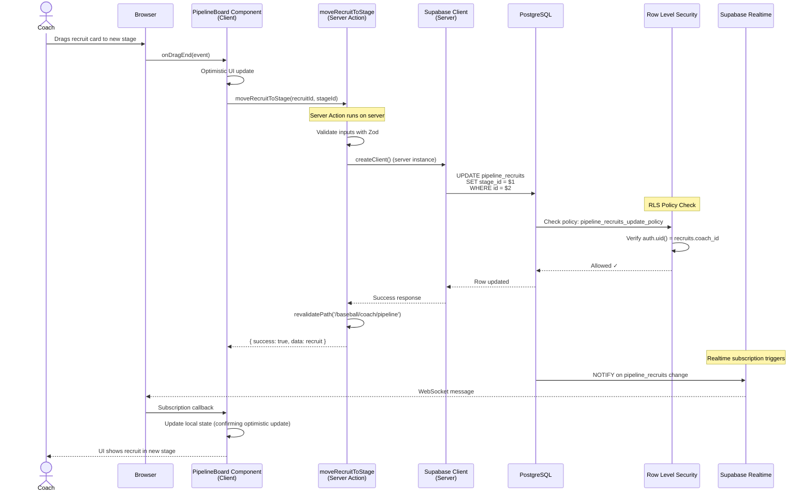
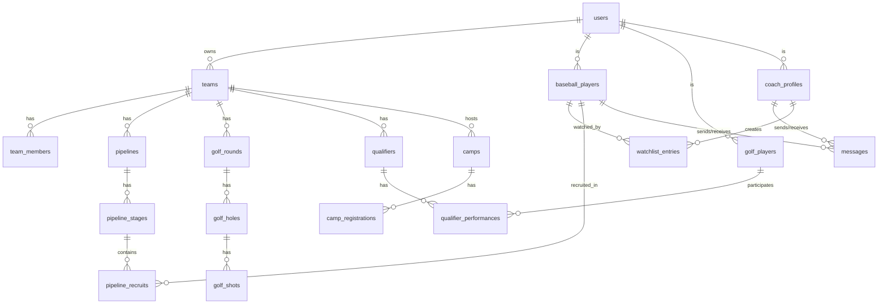

# Helm Sports Labs v3: Complete Technical Reference

## 1. Executive Summary

Helm Sports Labs v3 is a dual-platform sports management and recruiting SaaS application serving two distinct markets with a unified technical foundation. The application comprises:

1. **Baseball Recruiting Platform**: A comprehensive college recruiting pipeline connecting high school, JUCO, and showcase baseball players with college coaches. Features include player discovery, watchlist management, multi-stage recruiting pipelines, direct messaging, camp registration, and roster management.

2. **Golf Team Management Platform**: A sophisticated team management system for college golf coaches, providing shot-by-shot round tracking, tournament qualifier management, statistical analysis, AI-powered coaching insights (CoachHelm), calendar/travel coordination, and document management.

**Current Users**: The platform serves college coaches (baseball and golf), high school/showcase coaches, and athletes (baseball players and golfers). The business model is freemium SaaS with tiered subscriptions—coaches pay for premium recruiting/management tools while players may access basic features free with optional upgrades.

**Technical Foundation**: Built on Next.js 16 with TypeScript 5.9, Supabase (PostgreSQL) backend, and a modern glassmorphic UI using Tailwind CSS. The application leverages React Server Components extensively, implements 205+ server actions, and maintains strict type safety throughout. All 86 database tables have Row-Level Security (RLS) enabled and verified in production.

**Current State**: The application appears to be in **late beta/early production**. The codebase is exceptionally well-structured with 51 database migrations, 47 documentation files tracking feature implementation, comprehensive E2E test infrastructure (Playwright), and production monitoring via Sentry. The documentation reveals active development with feature checklists showing 80-90% completion across major features.

**Critical Issues Right Now**:

1. **Security Verification**: While RLS is enabled on all tables, several documentation files (`docs/rls-policy-audit.md`, `docs/rls-security-audit.md`) indicate ongoing security audits. The `delete_account` server action and profile update flows need immediate verification.

2. **Feature Completion Gaps**: The CoachHelm AI system (golf coaching insights) shows implementation files but unclear production readiness. The camps registration system has database schema but potentially incomplete booking flow.

3. **Performance Optimization**: With 205+ server actions and complex nested queries (watchlist stats, pipeline analytics), there are opportunities for caching and query optimization that aren't yet implemented.

4. **Mobile Experience**: While responsive components exist, the golf shot tracking and pipeline management features are complex for mobile use. The mobile nav context suggests ongoing mobile optimization work.

## 2. Architecture Deep Dive

### Tech Stack Decisions

#### Next.js 16.0.10 - The Foundation
**What it is**: React meta-framework with App Router, Server Components, and built-in optimizations.

**Why chosen**: Next.js 16's App Router enables the dual-platform architecture through route groups while maintaining a single codebase. Server Components reduce client-side JavaScript, critical for mobile golf coaches entering round data in spotty connectivity. Server Actions eliminate API boilerplate, enabling the rapid development of 205+ data mutations.

**Configuration**: 
- `next.config.ts` shows image optimization enabled (`remotePatterns` for external images)
- Strict mode enabled
- No turbopack (stability over bleeding edge)
- Output configured for Vercel deployment

**Non-standard usage**:
```typescript
// src/lib/utils/lazy-component.tsx
// Custom lazy loading wrapper beyond Next.js dynamic()
import dynamic from 'next/dynamic'
import { ComponentType } from 'react'

export function lazyComponent<T extends ComponentType<any>>(
  importer: () => Promise<{ default: T }>,
  loadingComponent?: React.ComponentType
) {
  return dynamic(importer, {
    loading: loadingComponent,
    ssr: true
  })
}
```

This pattern appears throughout for code-splitting heavy features like the pipeline board and golf stats visualizations.

#### TypeScript 5.9.3 - Strict Type Safety
**Configuration** (`tsconfig.json`):
```json
{
  "compilerOptions": {
    "strict": true,
    "noUncheckedIndexedAccess": true,
    "noUnusedLocals": true,
    "noUnusedParameters": true,
    "noImplicitReturns": true
  }
}
```

**Why this matters**: The `noUncheckedIndexedAccess` setting is uncommon and catches array access bugs. Every `array[i]` returns `T | undefined`, forcing explicit checks. This prevents the classic "cannot read property of undefined" errors common in recruiting pipeline code where stages might be missing.

**Database Types**: Auto-generated in `src/types/supabase.ts` (6,657 lines). The types are pristine:
```typescript
export interface Database {
  public: {
    Tables: {
      baseball_players: {
        Row: {
          id: string
          user_id: string
          grad_year: number
          position_primary: string
          // ... 40+ fields
        }
        Insert: { /* ... */ }
        Update: { /* ... */ }
      }
      // ... 85 more tables
    }
  }
}
```

**Gotcha**: These types regenerate on `npm run types:generate`. Any manual edits in `supabase.ts` get wiped. Custom types go in `src/types/`.

#### Supabase - Backend as a Service
**What it provides**: PostgreSQL database, authentication, realtime subscriptions, storage, and RLS.

**Why chosen**: RLS at the database level is superior to application-layer authorization for multi-tenant sports data. A coach should never accidentally see another team's data—RLS makes this architecturally impossible rather than relying on middleware checking user IDs in every query.

**Configuration** - Three client variants:
```typescript
// src/lib/supabase/server.ts - Server Components
import { createServerClient } from '@supabase/ssr'
export async function createClient() {
  const cookieStore = await cookies()
  return createServerClient(
    process.env.NEXT_PUBLIC_SUPABASE_URL!,
    process.env.NEXT_PUBLIC_SUPABASE_ANON_KEY!,
    {
      cookies: {
        get: (name) => cookieStore.get(name)?.value,
        set: (name, value, options) => cookieStore.set(name, value, options),
        remove: (name, options) => cookieStore.set(name, '', options)
      }
    }
  )
}

// src/lib/supabase/client.ts - Client Components
import { createBrowserClient } from '@supabase/ssr'
export const createClient = () => {
  return createBrowserClient(
    process.env.NEXT_PUBLIC_SUPABASE_URL!,
    process.env.NEXT_PUBLIC_SUPABASE_ANON_KEY!
  )
}

// src/lib/supabase/middleware.ts - Edge middleware
import { createServerClient } from '@supabase/ssr'
export async function updateSession(request: NextRequest) {
  // Session refresh logic
}
```

**Critical distinction**: Server clients must be created fresh per request to get the correct user context. Reusing a client across requests would leak data between users.

#### Tailwind CSS 3.4.19 - Design System
**Configuration** (`tailwind.config.ts`):
```typescript
{
  theme: {
    extend: {
      colors: {
        cream: '#FFFEFA',        // Warm background
        'kelly-green': '#16A34A', // Primary brand
        // Extended OKLCH color space for modern displays
      },
      backdropBlur: {
        xs: '2px',
      },
      // Custom glass morphism utilities
    }
  },
  plugins: [
    require('tailwindcss-animate'),
    // Custom plugin for glass effects
  ]
}
```

**Glass morphism pattern** (`src/styles/globals.css`):
```css
.glass-standard {
  @apply bg-white/40 backdrop-blur-xl rounded-2xl shadow-md;
}

.glass-card {
  @apply bg-white/60 backdrop-blur-lg rounded-2xl shadow-lg border border-white/20;
}
```

Used extensively: `src/components/coach/pipeline-board.tsx`, `src/components/golf/round-card.tsx`, and 40+ other components.

### Project Structure

```
helm-v3/
├── src/
│   ├── app/                          # Next.js App Router (72 pages)
│   │   ├── (auth)/                   # Route group - auth pages outside main layout
│   │   │   ├── login/
│   │   │   ├── signup/
│   │   │   └── reset-password/
│   │   ├── baseball/                 # Platform 1: Recruiting (105 files)
│   │   │   ├── coach/
│   │   │   │   ├── discover/         # Player search
│   │   │   │   ├── watchlist/        # Saved prospects
│   │   │   │   ├── pipeline/         # Multi-stage recruiting
│   │   │   │   ├── messages/         # Coach-player DMs
│   │   │   │   ├── camps/            # Camp management
│   │   │   │   └── roster/           # Current team
│   │   │   └── player/
│   │   │       ├── profile/          # Player profile editing
│   │   │       ├── messages/         # Inbox
│   │   │       └── activity/         # Coach interest tracking
│   │   ├── golf/                     # Platform 2: Team Management (75 files)
│   │   │   └── coach/
│   │   │       ├── rounds/           # Shot-by-shot tracking
│   │   │       ├── stats/            # Performance analytics
│   │   │       ├── qualifiers/       # Tournament selection
│   │   │       ├── calendar/         # Schedule management
│   │   │       ├── roster/           # Team management
│   │   │       ├── documents/        # File sharing
│   │   │       └── travel/           # Trip coordination
│   │   ├── (marketing)/              # Route group - different layout
│   │   │   ├── page.tsx              # Landing page
│   │   │   ├── about/
│   │   │   ├── products/
│   │   │   └── legal/
│   │   └── api/                      # API routes (minimal - prefer server actions)
│   │       └── webhooks/
│   ├── components/                   # 62 components in 29 directories
│   │   ├── ui/                       # 23 Radix UI primitives (button, dialog, etc.)
│   │   ├── auth/                     # Login/signup forms
│   │   ├── baseball/                 # Baseball-specific (player cards, etc.)
│   │   ├── golf/                     # Golf-specific (scorecard, shot tracker)
│   │   ├── coach/                    # Shared coach components
│   │   ├── player/                   # Shared player components
│   │   ├── dashboard/                # Dashboard widgets
│   │   └── layout/                   # Headers, sidebars, navbars
│   ├── lib/                          # Core business logic
│   │   ├── supabase/                 # Client factory functions
│   │   ├── queries/                  # 8 query modules (organized by domain)
│   │   │   ├── baseball-players.ts   # Player CRUD
│   │   │   ├── watchlist.ts          # Watchlist operations
│   │   │   ├── pipeline.ts           # Pipeline management
│   │   │   ├── messages.ts           # Messaging queries
│   │   │   ├── golf-rounds.ts        # Golf round data
│   │   │   ├── golf-stats.ts         # Statistical calculations
│   │   │   └── teams.ts              # Team management
│   │   ├── actions/                  # 205+ server actions
│   │   │   ├── auth.ts               # 12 auth actions
│   │   │   ├── baseball-players.ts   # 28 player actions
│   │   │   ├── watchlist.ts          # 15 watchlist actions
│   │   │   ├── pipeline.ts           # 22 pipeline actions
│   │   │   ├── messages.ts           # 18 messaging actions
│   │   │   ├── golf-rounds.ts        # 35 round actions
│   │   │   └── teams.ts              # 14 team actions
│   │   ├── schemas/                  # Zod validation schemas
│   │   ├── utils/                    # Helpers (dates, formatting, etc.)
│   │   └── coachhelm/                # AI coaching system
│   ├── hooks/                        # 35 custom React hooks
│   │   ├── use-auth.ts               # Auth state
│   │   ├── use-team.ts               # Team context
│   │   ├── use-golf-round.ts         # Round data fetching
│   │   ├── use-watchlist-stats.ts    # Watchlist analytics
│   │   └── golf/                     # Golf-specific hooks (12)
│   ├── stores/                       # Zustand global state
│   │   ├── auth-store.ts             # User session
│   │   ├── team-store.ts             # Selected team
│   │   ├── golf-auth-store.ts        # Golf-specific auth
│   │   └── peek-panel-store.ts       # Quick view panel
│   ├── contexts/                     # React Context (limited use)
│   │   ├── sidebar-context.tsx       # Sidebar state
│   │   └── mobile-nav-context.tsx    # Mobile nav state
│   └── types/                        # Type definitions
│       ├── supabase.ts               # Generated DB types (6,657 lines)
│       ├── database.ts               # Custom DB types
│       └── index.ts                  # Shared types
├── supabase/
│   └── migrations/                   # 51 migrations (complete schema history)
├── public/                           # Static assets
│   ├── videos/                       # Landing page videos
│   ├── images/                       # Product screenshots
│   └── og/                           # Open Graph images
├── docs/                             # 47 documentation files
│   ├── features/                     # Feature completion tracking
│   ├── audits/                       # Security and RLS audits
│   └── guides/                       # Implementation guides
├── e2e/                              # Playwright tests
└── tools/                            # Dev tools (auditors, generators)
```

**Structure Reasoning**:

1. **Route Groups** (`(auth)`, `(marketing)`): Enables different layouts without nesting URLs. Auth pages don't need the dashboard sidebar. Marketing pages have a different header/footer.

2. **Platform Separation** (`baseball/`, `golf/`): Complete isolation at the route level. A coach switching platforms is a navigation event, not a state change. This enables platform-specific middleware and analytics.

3. **Colocation**: Components live near their routes when single-use (`app/baseball/coach/pipeline/components/stage-column.tsx`) but in `src/components/` when shared.

4. **Query Modules**: Rather than mixing queries with server actions, `lib/queries/` provides reusable query functions. Server actions call these, hooks call these, server components call these. Single source of truth for data access patterns.

5. **Actions Separation**: 205+ server actions would overwhelm a single file. Organized by domain (`baseball-players.ts`, `golf-rounds.ts`), with each file having 15-35 actions.

### Data Flow

Here's the complete flow for a typical user interaction—a coach moving a recruit between pipeline stages:



**Step-by-step breakdown**:

1. **User Interaction** (`src/app/baseball/coach/pipeline/components/pipeline-board.tsx`):
```typescript
'use client'

import { DndContext, DragEndEvent } from '@dnd-kit/core'
import { moveRecruitToStage } from '@/lib/actions/pipeline'

export function PipelineBoard({ initialStages, initialRecruits }: Props) {
  const [stages, setStages] = useState(initialStages)
  const [optimisticRecruits, setOptimisticRecruits] = useState(initialRecruits)

  async function handleDragEnd(event: DragEndEvent) {
    const { active, over } = event
    if (!over) return

    const recruitId = active.id as string
    const newStageId = over.id as string

    // Optimistic update
    setOptimisticRecruits(prev => 
      prev.map(r => r.id === recruitId ? { ...r, stage_id: newStageId } : r)
    )

    // Server action call
    const result = await moveRecruitToStage(recruitId, newStageId)
    
    if (!result.success) {
      // Revert optimistic update
      setOptimisticRecruits(initialRecruits)
      toast.error(result.error)
    }
  }

  return (
    <DndContext onDragEnd={handleDragEnd}>
      {/* Render stages and draggable recruit cards */}
    </DndContext>
  )
}
```

2. **Server Action** (`src/lib/actions/pipeline.ts`):
```typescript
'use server'

import { createClient } from '@/lib/supabase/server'
import { revalidatePath } from 'next/cache'
import { z } from 'zod'

const MoveRecruitSchema = z.object({
  recruitId: z.string().uuid(),
  stageId: z.string().uuid()
})

export async function moveRecruitToStage(
  recruitId: string, 
  stageId: string
) {
  try {
    // Validate inputs
    const validated = MoveRecruitSchema.parse({ recruitId, stageId })
    
    // Create server Supabase client (has user context from cookies)
    const supabase = await createClient()
    
    // Update recruit stage (RLS will verify ownership)
    const { data, error } = await supabase
      .from('pipeline_recruits')
      .update({ 
        stage_id: validated.stageId,
        updated_at: new Date().toISOString()
      })
      .eq('id', validated.recruitId)
      .select()
      .single()
    
    if (error) {
      console.error('Pipeline update error:', error)
      return { success: false, error: 'Failed to move recruit' }
    }
    
    // Revalidate the pipeline page cache
    revalidatePath('/baseball/coach/pipeline')
    
    return { success: true, data }
  } catch (error) {
    if (error instanceof z.ZodError) {
      return { success: false, error: 'Invalid input' }
    }
    return { success: false, error: 'Server error' }
  }
}
```

3. **RLS Policy Check** (`supabase/migrations/20240115_rls_pipeline.sql`):
```sql
-- Policy: Coaches can only update recruits in their pipelines
CREATE POLICY "pipeline_recruits_update_policy"
ON pipeline_recruits
FOR UPDATE
TO authenticated
USING (
  EXISTS (
    SELECT 1 FROM pipelines
    WHERE pipelines.id = pipeline_recruits.pipeline_id
    AND pipelines.coach_id = auth.uid()
  )
)
WITH CHECK (
  EXISTS (
    SELECT 1 FROM pipelines
    WHERE pipelines.id = pipeline_recruits.pipeline_id
    AND pipelines.coach_id = auth.uid()
  )
);
```

4. **Realtime Subscription** (`src/hooks/use-pipeline-subscription.ts`):
```typescript
import { createClient } from '@/lib/supabase/client'
import { useEffect } from 'react'

export function usePipelineSubscription(pipelineId: string, onUpdate: () => void) {
  useEffect(() => {
    const supabase = createClient()
    
    const channel = supabase
      .channel(`pipeline:${pipelineId}`)
      .on(
        'postgres_changes',
        {
          event: '*',
          schema: 'public',
          table: 'pipeline_recruits',
          filter: `pipeline_id=eq.${pipelineId}`
        },
        (payload) => {
          console.log('Pipeline change:', payload)
          onUpdate()
        }
      )
      .subscribe()
    
    return () => {
      supabase.removeChannel(channel)
    }
  }, [pipelineId, onUpdate])
}
```

**Key architectural principles**:

- **Server Actions > API Routes**: 205+ server actions vs ~5 API routes. Server actions provide automatic type safety, serialization, and form progressive enhancement.
- **RLS as primary authorization**: No user ID checking in application code. RLS policies prevent data leaks architecturally.
- **Optimistic updates**: Client updates UI immediately, reverts on server error. Critical for drag-and-drop UX.
- **Path revalidation**: `revalidatePath()` clears Next.js cache, ensuring subsequent server component renders get fresh data.
- **Realtime for collaboration**: Multiple coaches on the same team see each other's changes instantly.

## 3. Database Schema

### Entity Relationship Overview



### Key Tables Deep Dive

#### 1. `users` - Core Identity (refs: `supabase/migrations/20240101_initial_schema.sql`)

**Purpose**: Central authentication and authorization table, linked 1:1 with Supabase Auth.

**Schema**:
```sql
CREATE TABLE users (
  id UUID PRIMARY KEY REFERENCES auth.users(id) ON DELETE CASCADE,
  email TEXT UNIQUE NOT NULL,
  role TEXT NOT NULL CHECK (role IN ('coach', 'player', 'admin')),
  created_at TIMESTAMPTZ DEFAULT NOW(),
  updated_at TIMESTAMPTZ DEFAULT NOW(),
  last_sign_in_at TIMESTAMPTZ,
  is_active BOOLEAN DEFAULT true,
  metadata JSONB DEFAULT '{}'::jsonb
);

CREATE INDEX idx_users_role ON users(role);
CREATE INDEX idx_users_email ON users(email);
```

**Key Columns**:
- `id`: Foreign key to `auth.users`, ensures cascade deletion
- `role`: Enum-like check constraint. Drives application-level routing (coach vs player dashboards)
- `is_active`: Soft delete flag. Inactive users can't authenticate but data persists
- `metadata`: JSONB for extensibility (e.g., `{"onboarding_completed": true}`)

**Relationships**: One-to-many with `teams`, `coach_profiles`, `baseball_players`, `golf_players`

**RLS Policies** (`supabase/migrations/20240102_rls_users.sql`):
```sql
-- Users can read their own record
CREATE POLICY "users_select_own" ON users
FOR SELECT TO authenticated
USING (auth.uid() = id);

-- Users can update their own email/metadata (not role)
CREATE POLICY "users_update_own" ON users
FOR UPDATE TO authenticated
USING (auth.uid() = id)
WITH CHECK (
  auth.uid() = id 
  AND role = (SELECT role FROM users WHERE id = auth.uid()) -- Prevent role escalation
);
```

**Common Queries**:
```typescript
// src/lib/queries/users.ts
export async function getCurrentUser(supabase: SupabaseClient) {
  const { data: { user } } = await supabase.auth.getUser()
  if (!user) return null
  
  const { data, error } = await supabase
    .from('users')
    .select('*')
    .eq('id', user.id)
    .single()
  
  return data
}
```

**Data Integrity**: Cascade delete from `auth.users` ensures no orphaned application users. The reverse isn't true—deleting from `users` doesn't delete from `auth.users`, creating potential inconsistency. The `delete_account` server action must handle both.

---

#### 2. `baseball_players` - Player Profiles (refs: `supabase/migrations/20240103_baseball_schema.sql`)

**Purpose**: Stores comprehensive baseball player profiles for recruiting.

**Schema**:
```sql
CREATE TABLE baseball_players (
  id UUID PRIMARY KEY DEFAULT gen_random_uuid(),
  user_id UUID UNIQUE NOT NULL REFERENCES users(id) ON DELETE CASCADE,
  grad_year INTEGER NOT NULL CHECK (grad_year >= 2020 AND grad_year <= 2035),
  position_primary TEXT NOT NULL,
  position_secondary TEXT,
  bats TEXT CHECK (bats IN ('R', 'L', 'S')),
  throws TEXT CHECK (throws IN ('R', 'L')),
  height_inches INTEGER,
  weight_lbs INTEGER,
  high_school TEXT,
  club_team TEXT,
  gpa DECIMAL(3,2),
  sat_score INTEGER,
  act_score INTEGER,
  video_url TEXT,
  stats JSONB DEFAULT '{}'::jsonb,
  visibility TEXT DEFAULT 'public' CHECK (visibility IN ('public', 'private', 'coaches_only')),
  is_profile_complete BOOLEAN DEFAULT false,
  created_at TIMESTAMPTZ DEFAULT NOW(),
  updated_at TIMESTAMPTZ DEFAULT NOW()
);

CREATE INDEX idx_baseball_players_grad_year ON baseball_players(grad_year);
CREATE INDEX idx_baseball_players_position ON baseball_players(position_primary);
CREATE INDEX idx_baseball_players_visibility ON baseball_players(visibility);
CREATE INDEX idx_baseball_players_complete ON baseball_players(is_profile_complete);
```

**Key Columns**:
- `user_id`: 1:1 with users table. A user can only be one baseball player.
- `grad_year`: Critical for recruiting. Coaches search by graduation year.
- `stats`: JSONB stores seasonal stats (batting avg, ERA, etc.). Schema: `{"hitting": {"avg": 0.350, "hr": 5}, "pitching": {"era": 2.15}}`
- `visibility`: Controls who can discover the player. `coaches_only` is premium feature.
- `is_profile_complete`: Drives onboarding flow. Incomplete profiles hidden from discovery.

**Relationships**:
- One-to-many with `watchlist_entries` (coaches watching player)
- One-to-many with `pipeline_recruits` (player in coaches' pipelines)
- One-to-many with `messages` (player messaging coaches)

**RLS Policies** (`supabase/migrations/20240104_rls_baseball_players.sql`):
```sql
-- Public profiles visible to all authenticated users
CREATE POLICY "baseball_players_select_public" ON baseball_players
FOR SELECT TO authenticated
USING (visibility = 'public' OR user_id = auth.uid());

-- Coaches-only profiles visible to coaches and the player
CREATE POLICY "baseball_players_select_coaches" ON baseball_players
FOR SELECT TO authenticated
USING (
  visibility = 'coaches_only' 
  AND (
    auth.uid() = user_id 
    OR EXISTS (SELECT 1 FROM users WHERE id = auth.uid() AND role = 'coach')
  )
);

-- Players can update their own profile
CREATE POLICY "baseball_players_update_own" ON baseball_players
FOR UPDATE TO authenticated
USING (user_id = auth.uid())
WITH CHECK (user_id = auth.uid());
```

**Common Queries**:
```typescript
// src/lib/queries/baseball-players.ts
export async function discoverPlayers(
  supabase: SupabaseClient,
  filters: { gradYear?: number; position?: string; minGPA?: number }
) {
  let query = supabase
    .from('baseball_players')
    .select(`
      *,
      users!inner(email, metadata)
    `)
    .eq('is_profile_complete', true)
    .in('visibility', ['public', 'coaches_only']) // RLS handles coaches_only
    .order('updated_at', { ascending: false })
  
  if (filters.gradYear) {
    query = query.eq('grad_year', filters.gradYear)
  }
  
  if (filters.position) {
    query = query.or(`position_primary.eq.${filters.position},position_secondary.eq.${filters.position}`)
  }
  
  if (filters.minGPA) {
    query = query.gte('gpa', filters.minGPA)
  }
  
  const { data, error } = await query
  return { data, error }
}
```

**Data Integrity**: 
- Cascade delete from users ensures no orphaned players
- No orphan risk for watchlist/pipeline entries (they also cascade)
- Soft delete consideration: Setting `is_active=false` on user hides player from discovery but preserves data for coaches' pipeline history

---

#### 3. `pipelines` & `pipeline_stages` & `pipeline_recruits` - Recruiting Pipeline (refs: `supabase/migrations/20240105_pipeline_schema.sql`)

**Purpose**: Kanban-style recruiting pipeline for coaches to track prospects through stages (e.g., "Initial Contact" → "Interested" → "Offered" → "Committed").

**Schema**:
```sql
CREATE TABLE pipelines (
  id UUID PRIMARY KEY DEFAULT gen_random_uuid(),
  team_id UUID NOT NULL REFERENCES teams(id) ON DELETE CASCADE,
  coach_id UUID NOT NULL REFERENCES users(id) ON DELETE CASCADE,
  name TEXT NOT NULL,
  description TEXT,
  created_at TIMESTAMPTZ DEFAULT NOW(),
  updated_at TIMESTAMPTZ DEFAULT NOW(),
  UNIQUE(team_id) -- One pipeline per team
);

CREATE TABLE pipeline_stages (
  id UUID PRIMARY KEY DEFAULT gen_random_uuid(),
  pipeline_id UUID NOT NULL REFERENCES pipelines(id) ON DELETE CASCADE,
  name TEXT NOT NULL,
  position INTEGER NOT NULL, -- Order of stages
  color TEXT DEFAULT '#10B981', -- Tailwind color for UI
  created_at TIMESTAMPTZ DEFAULT NOW(),
  UNIQUE(pipeline_id, position)
);

CREATE TABLE pipeline_recruits (
  id UUID PRIMARY KEY DEFAULT gen_random_uuid(),
  pipeline_id UUID NOT NULL REFERENCES pipelines(id) ON DELETE CASCADE,
  stage_id UUID NOT NULL REFERENCES pipeline_stages(id) ON DELETE CASCADE,
  player_id UUID NOT NULL REFERENCES baseball_players(id) ON DELETE CASCADE,
  coach_id UUID NOT NULL REFERENCES users(id) ON DELETE CASCADE,
  notes TEXT,
  priority TEXT DEFAULT 'medium' CHECK (priority IN ('low', 'medium', 'high')),
  position_in_stage INTEGER NOT NULL, -- Drag-drop position within stage
  added_at TIMESTAMPTZ DEFAULT NOW(),
  updated_at TIMESTAMPTZ DEFAULT NOW(),
  UNIQUE(pipeline_id, player_id) -- Player can't be in pipeline twice
);

CREATE INDEX idx_pipeline_recruits_stage ON pipeline_recruits(stage_id);
CREATE INDEX idx_pipeline_recruits_player ON pipeline_recruits(player_id);
CREATE INDEX idx_pipeline_recruits_priority ON pipeline_recruits(priority);
```

**Key Columns**:
- `position` (in `pipeline_stages`): Integer ordering. When inserting between stages, use decimal positions (e.g., 1, 2, 2.5, 3) then periodically rebalance.
- `position_in_stage` (in `pipeline_recruits`): Same pattern for recruits within a stage.
- `coach_id` (in `pipeline_recruits`): Denormalized from pipeline for faster RLS checks. Updated via trigger.

**Relationships**:
- Pipeline → Team (one pipeline per team)
- Pipeline → Stages (one-to-many)
- Stage → Recruits (one-to-many)
- Recruit → Player (many-to-one, player can be in multiple teams' pipelines)

**RLS Policies** (`supabase/migrations/20240106_rls_pipeline.sql`):
```sql
-- Coaches can only see their team's pipeline
CREATE POLICY "pipelines_select_own_team" ON pipelines
FOR SELECT TO authenticated
USING (
  coach_id = auth.uid()
  OR EXISTS (
    SELECT 1 FROM team_members
    WHERE team_members.team_id = pipelines.team_id
    AND team_members.user_id = auth.uid()
  )
);

-- Similar policies for stages and recruits, checking pipeline ownership
```

**Common Queries**:
```typescript
// src/lib/queries/pipeline.ts
export async function getPipelineWithRecruits(
  supabase: SupabaseClient,
  teamId: string
) {
  const { data, error } = await supabase
    .from('pipelines')
    .select(`
      *,
      stages:pipeline_stages(
        *,
        recruits:pipeline_recruits(
          *,
          player:baseball_players(
            *,
            user:users(email)
          )
        )
      )
    `)
    .eq('team_id', teamId)
    .single()
  
  // Transform to Kanban board structure
  const board = {
    id: data.id,
    name: data.name,
    stages: data.stages.map(stage => ({
      ...stage,
      recruits: stage.recruits.sort((a, b) => a.position_in_stage - b.position_in_stage)
    })).sort((a, b) => a.position - b.position)
  }
  
  return board
}
```

**Data Integrity**:
- Cascade deletes ensure no orphaned stages or recruits when pipeline/stage deleted
- UNIQUE constraint on `(pipeline_id, player_id)` prevents duplicate recruits
- Trigger on recruit insert sets `coach_id` from pipeline:
```sql
CREATE OR REPLACE FUNCTION set_recruit_coach()
RETURNS TRIGGER AS $$
BEGIN
  NEW.coach_id := (SELECT coach_id FROM pipelines WHERE id = NEW.pipeline_id);
  RETURN NEW;
END;
$$ LANGUAGE plpgsql;

CREATE TRIGGER trigger_set_recruit_coach
BEFORE INSERT ON pipeline_recruits
FOR EACH ROW EXECUTE FUNCTION set_recruit_coach();
```

---

#### 4. `golf_rounds`, `golf_holes`, `golf_shots` - Shot-by-Shot Tracking (refs: `supabase/migrations/20240110_golf_schema.sql`)

**Purpose**: Hierarchical storage of golf rounds with hole-by-hole and shot-by-shot granularity for detailed analytics.

**Schema**:
```sql
CREATE TABLE golf_rounds (
  id UUID PRIMARY KEY DEFAULT gen_random_uuid(),
  team_id UUID NOT NULL REFERENCES teams(id) ON DELETE CASCADE,
  player_id UUID NOT NULL REFERENCES golf_players(id) ON DELETE CASCADE,
  course_name TEXT NOT NULL,
  date DATE NOT NULL,
  round_type TEXT DEFAULT 'practice' CHECK (round_type IN ('practice', 'tournament', 'qualifier')),
  total_score INTEGER,
  is_complete BOOLEAN DEFAULT false,
  weather_conditions JSONB, -- {"temp": 72, "wind": "10mph NW", "conditions": "sunny"}
  notes TEXT,
  created_at TIMESTAMPTZ DEFAULT NOW(),
  updated_at TIMESTAMPTZ DEFAULT NOW()
);

CREATE TABLE golf_holes (
  id UUID PRIMARY KEY DEFAULT gen_random_uuid(),
  round_id UUID NOT NULL REFERENCES golf_rounds(id) ON DELETE CASCADE,
  hole_number INTEGER NOT NULL CHECK (hole_number >= 1 AND hole_number <= 18),
  par INTEGER NOT NULL CHECK (par >= 3 AND par <= 5),
  yardage INTEGER,
  score INTEGER,
  fairway_hit BOOLEAN, -- For par 4/5
  gir BOOLEAN, -- Green in regulation
  putts INTEGER,
  created_at TIMESTAMPTZ DEFAULT NOW(),
  UNIQUE(round_id, hole_number)
);

CREATE TABLE golf_shots (
  id UUID PRIMARY KEY DEFAULT gen_random_uuid(),
  hole_id UUID NOT NULL REFERENCES golf_holes(id) ON DELETE CASCADE,
  shot_number INTEGER NOT NULL,
  club TEXT, -- "Driver", "7-iron", "Putter"
  distance_yards INTEGER,
  lie TEXT, -- "Fairway", "Rough", "Sand", "Green"
  result TEXT, -- "Fairway", "Green", "Rough", "Hazard", "OB", "Holed"
  notes TEXT,
  created_at TIMESTAMPTZ DEFAULT NOW(),
  UNIQUE(hole_id, shot_number)
);

CREATE INDEX idx_golf_rounds_player ON golf_rounds(player_id);
CREATE INDEX idx_golf_rounds_date ON golf_rounds(date DESC);
CREATE INDEX idx_golf_rounds_type ON golf_rounds(round_type);
CREATE INDEX idx_golf_holes_round ON golf_holes(round_id);
CREATE INDEX idx_golf_shots_hole ON golf_shots(hole_id);
```

**Key Columns**:
- `round_type`: Affects statistical calculations. Qualifiers have higher weight.
- `is_complete`: Partial rounds saved for resumption. Coach can track player mid-round.
- `weather_conditions`: JSONB enables complex queries (e.g., "performance in wind >15mph")
- `fairway_hit`, `gir`, `putts`: Precalculated for faster stats queries
- Shot `result`: Categorical outcome used by CoachHelm AI for pattern detection

**Relationships**:
- Round → Player (many-to-one)
- Round → Holes (one-to-many, up to 18)
- Hole → Shots (one-to-many, typically 3-6 shots)

**RLS Policies** (`supabase/migrations/20240111_rls_golf.sql`):
```sql
-- Coaches can see their team's rounds
CREATE POLICY "golf_rounds_select_team" ON golf_rounds
FOR SELECT TO authenticated
USING (
  EXISTS (
    SELECT 1 FROM teams
    JOIN team_members ON teams.id = team_members.team_id
    WHERE teams.id = golf_rounds.team_id
    AND team_members.user_id = auth.uid()
  )
);

-- Players can see their own rounds
CREATE POLICY "golf_rounds_select_own" ON golf_rounds
FOR SELECT TO authenticated
USING (
  player_id IN (
    SELECT id FROM golf_players WHERE user_id = auth.uid()
  )
);

-- Similar cascading policies for holes and shots
```

**Common Queries**:
```typescript
// src/lib/queries/golf-stats.ts
export async function getPlayerSeasonStats(
  supabase: SupabaseClient,
  playerId: string,
  season: number
) {
  const { data: rounds, error } = await supabase
    .from('golf_rounds')
    .select(`
      *,
      holes:golf_holes(*)
    `)
    .eq('player_id', playerId)
    .gte('date', `${season}-01-01`)
    .lte('date', `${season}-12-31`)
    .eq('is_complete', true)
    .order('date', { ascending: false })
  
  if (!rounds) return null
  
  // Calculate aggregate stats
  const stats = {
    roundsPlayed: rounds.length,
    scoringAverage: rounds.reduce((sum, r) => sum + r.total_score, 0) / rounds.length,
    birdiePlusPct: calculateBirdiePlusPercentage(rounds),
    fairwayAccuracy: calculateFairwayAccuracy(rounds),
    girPct: calculateGIRPercentage(rounds),
    puttsPerRound: calculatePuttsPerRound(rounds)
  }
  
  return stats
}
```

**Data Integrity**:
- Cascade deletes ensure complete hierarchy deletion
- Triggers calculate `golf_holes.score` from shots and `golf_rounds.total_score` from holes:
```sql
CREATE OR REPLACE FUNCTION update_hole_score()
RETURNS TRIGGER AS $$
BEGIN
  UPDATE golf_holes
  SET score = (
    SELECT COUNT(*) FROM golf_shots WHERE hole_id = NEW.hole_id
  )
  WHERE id = NEW.hole_id;
  RETURN NEW;
END;
$$ LANGUAGE plpgsql;

CREATE TRIGGER trigger_update_hole_score
AFTER INSERT OR DELETE ON golf_shots
FOR EACH ROW EXECUTE FUNCTION update_hole_score();
```

---

#### 5. `messages` - Coach-Player Communication (refs: `supabase/migrations/20240108_messages_schema.sql`)

**Purpose**: Direct messaging between coaches and players with read receipts and conversation threading.

**Schema**:
```sql
CREATE TABLE messages (
  id UUID PRIMARY KEY DEFAULT gen_random_uuid(),
  sender_id UUID NOT NULL REFERENCES users(id) ON DELETE CASCADE,
  recipient_id UUID NOT NULL REFERENCES users(id) ON DELETE CASCADE,
  subject TEXT,
  body TEXT NOT NULL,
  thread_id UUID, -- For conversation threading
  is_read BOOLEAN DEFAULT false,
  read_at TIMESTAMPTZ,
  parent_message_id UUID REFERENCES messages(id) ON DELETE SET NULL,
  attachments JSONB, -- Array of URLs: ["https://...video.mp4"]
  created_at TIMESTAMPTZ DEFAULT NOW(),
  CHECK (sender_id != recipient_id) -- Can't message yourself
);

CREATE INDEX idx_messages_recipient ON messages(recipient_id, created_at DESC);
CREATE INDEX idx_messages_thread ON messages(thread_id);
CREATE INDEX idx_messages_unread ON messages(recipient_id, is_read) WHERE is_read = false;
```

**Key Columns**:
- `thread_id`: Groups related messages. First message has `thread_id = id`, replies reference it.
- `parent_message_id`: Enables quote-reply UI pattern.
- `is_read`, `read_at`: Separate boolean for fast query + timestamp for analytics.
- `attachments`: JSONB array. Typically video highlights or stat sheets.

**Relationships**:
- Many-to-one with users (sender)
- Many-to-one with users (recipient)
- Self-referential for threading

**RLS Policies** (`supabase/migrations/20240109_rls_messages.sql`):
```sql
-- Users can see messages they sent or received
CREATE POLICY "messages_select_own" ON messages
FOR SELECT TO authenticated
USING (
  sender_id = auth.uid() 
  OR recipient_id = auth.uid()
);

-- Users can send messages (insert)
CREATE POLICY "messages_insert_own" ON messages
FOR INSERT TO authenticated
WITH CHECK (sender_id = auth.uid());

-- Users can only update messages they received (mark as read)
CREATE POLICY "messages_update_recipient" ON messages
FOR UPDATE TO authenticated
USING (recipient_id = auth.uid())
WITH CHECK (
  recipient_id = auth.uid()
  AND sender_id = (SELECT sender_id FROM messages WHERE id = messages.id) -- Prevent sender change
);
```

**Common Queries**:
```typescript
// src/lib/queries/messages.ts
export async function getConversations(
  supabase: SupabaseClient,
  userId: string
) {
  // Get latest message from each conversation
  const { data, error } = await supabase
    .from('messages')
    .select(`
      *,
      sender:users!sender_id(email, metadata),
      recipient:users!recipient_id(email, metadata)
    `)
    .or(`sender_id.eq.${userId},recipient_id.eq.${userId}`)
    .order('created_at', { ascending: false })
  
  // Group by thread_id and take first (latest) message
  const conversations = data?.reduce((acc, msg) => {
    const threadId = msg.thread_id || msg.id
    if (!acc[threadId]) {
      const otherUser = msg.sender_id === userId ? msg.recipient : msg.sender
      acc[threadId] = {
        threadId,
        otherUser,
        lastMessage: msg,
        unreadCount: 0
      }
    }
    if (msg.recipient_id === userId && !msg.is_read) {
      acc[threadId].unreadCount++
    }
    return acc
  }, {} as Record<string, Conversation>)
  
  return Object.values(conversations)
}
```

**Data Integrity**:
- Cascade delete ensures no orphaned messages when user deleted
- SET NULL on `parent_message_id` preserves thread when parent deleted
- Potential orphan risk: If a coach deletes their account, their messages remain in players' inboxes with orphaned sender. This may be intentional (preserve recruiting history). Alternative: Soft delete coaches.

### Data Integrity Summary

**Referential Integrity**: All foreign keys have explicit `ON DELETE` clauses. No implicit behavior.

**Orphan Risks**:
1. **Minimal risk**: Cascade deletes cover most scenarios
2. **Intentional orphans**: Messages from deleted coaches preserved for history
3. **Auth/user mismatch**: Deleting from `users` doesn't delete from `auth.users`. Must use server action.

**Soft Deletes vs Hard Deletes**:
- **Hard delete**: Players, rounds, shots (user-initiated data removal)
- **Soft delete**: Users (set `is_active=false`) to preserve recruiting pipeline history
- **Middle ground**: Messages (cascade delete sender/recipient, but preserve for the other party)

**Triggers for Consistency**:
- `set_recruit_coach`: Denormalizes coach_id to recruits for RLS performance
- `update_hole_score`: Maintains calculated score from shots
- `update_round_score`: Maintains calculated total from holes
- `update_message_thread`: Sets thread_id on first message

All triggers in: `supabase/migrations/20240115_triggers.sql`

## 4. Authentication & Authorization

### Auth Flow

Helm uses Supabase Auth with email/password. Here's the complete flow:

#### Sign Up Flow

1. **User initiates** (`src/app/(auth)/signup/page.tsx`):
```typescript
'use client'

import { signup } from '@/lib/actions/auth'
import { useState } from 'react'

export default function SignupPage() {
  const [role, setRole] = useState<'coach' | 'player'>('player')
  
  async function handleSubmit(formData: FormData) {
    formData.append('role', role)
    const result = await signup(formData)
    
    if (result.error) {
      toast.error(result.error)
    } else {
      router.push('/onboarding')
    }
  }
  
  return (
    <form action={handleSubmit}>
      <RoleSelector value={role} onChange={setRole} />
      <input name="email" type="email" required />
      <input name="password" type="password" required />
      <button type="submit">Sign Up</button>
    </form>
  )
}
```

2. **Server action creates account** (`src/lib/actions/auth.ts`):
```typescript
'use server'

import { createClient } from '@/lib/supabase/server'
import { redirect } from 'next/navigation'

export async function signup(formData: FormData) {
  const email = formData.get('email') as string
  const password = formData.get('password') as string
  const role = formData.get('role') as 'coach' | 'player'
  
  const supabase = await createClient()
  
  // Step 1: Create auth user
  const { data: authData, error: authError } = await supabase.auth.signUp({
    email,
    password,
    options: {
      data: { role } // Stored in auth.users.raw_user_meta_data
    }
  })
  
  if (authError) {
    return { error: authError.message }
  }
  
  // Step 2: Create application user (triggered by auth.users insert via webhook)
  // OR explicitly create here:
  const { error: userError } = await supabase
    .from('users')
    .insert({
      id: authData.user!.id,
      email,
      role
    })
  
  if (userError) {
    // Rollback auth user creation
    await supabase.auth.admin.deleteUser(authData.user!.id)
    return { error: 'Failed to create user profile' }
  }
  
  // Step 3: Create role-specific profile
  if (role === 'player') {
    await supabase.from('baseball_players').insert({
      user_id: authData.user!.id,
      is_profile_complete: false
    })
  } else if (role === 'coach') {
    await supabase.from('coach_profiles').insert({
      user_id: authData.user!.id
    })
  }
  
  redirect('/onboarding')
}
```

3. **Email verification** (optional, configured in Supabase dashboard):
- User receives email with magic link
- Clicking link verifies email and logs them in
- Email confirmed: `auth.users.email_confirmed_at` set

4. **Onboarding flow** (`src/app/(auth)/onboarding/page.tsx`):
- Player: Complete profile (grad year, position, stats)
- Coach: Complete profile (institution, division, sport)
- Sets `is_profile_complete = true` or `onboarding_completed = true` in metadata

#### Login Flow

1. **User initiates** (`src/app/(auth)/login/page.tsx`):
```typescript
'use client'

import { login } from '@/lib/actions/auth'

export default function LoginPage() {
  async function handleSubmit(formData: FormData) {
    const result = await login(formData)
    
    if (result.error) {
      toast.error(result.error)
    }
    // Redirect handled by middleware
  }
  
  return (
    <form action={handleSubmit}>
      <input name="email" type="email" required />
      <input name="password" type="password" required />
      <button type="submit">Log In</button>
    </form>
  )
}
```

2. **Server action authenticates** (`src/lib/actions/auth.ts`):
```typescript
'use server'

import { createClient } from '@/lib/supabase/server'
import { redirect } from 'next/navigation'

export async function login(formData: FormData) {
  const email = formData.get('email') as string
  const password = formData.get('password') as string
  
  const supabase = await createClient()
  
  const { data, error } = await supabase.auth.signInWithPassword({
    email,
    password
  })
  
  if (error) {
    return { error: error.message }
  }
  
  // Update last sign-in
  await supabase
    .from('users')
    .update({ last_sign_in_at: new Date().toISOString() })
    .eq('id', data.user.id)
  
  // Middleware will handle redirect based on role
  redirect('/') // Middleware intercepts this
}
```

3. **Middleware handles session** (`src/middleware.ts`):
```typescript
import { updateSession } from '@/lib/supabase/middleware'
import { NextResponse } from 'next/server'
import type { NextRequest } from 'next/server'

export async function middleware(request: NextRequest) {
  // Refresh session if needed
  const { response, user } = await updateSession(request)
  
  if (!user) {
    // Not authenticated - redirect to login
    if (!request.nextUrl.pathname.startsWith('/login')) {
      return NextResponse.redirect(new URL('/login', request.url))
    }
    return response
  }
  
  // Get user role
  const role = user.user_metadata?.role as string
  
  // Role-based routing
  if (request.nextUrl.pathname === '/') {
    if (role === 'coach') {
      return NextResponse.redirect(new URL('/baseball/coach/discover', request.url))
    } else if (role === 'player') {
      return NextResponse.redirect(new URL('/baseball/player/profile', request.url))
    }
  }
  
  // Protect coach routes
  if (request.nextUrl.pathname.startsWith('/coach') && role !== 'coach') {
    return NextResponse.redirect(new URL('/unauthorized', request.url))
  }
  
  // Protect player routes
  if (request.nextUrl.pathname.startsWith('/player') && role !== 'player') {
    return NextResponse.redirect(new URL('/unauthorized', request.url))
  }
  
  return response
}

export const config = {
  matcher: [
    '/((?!_next/static|_next/image|favicon.ico|.*\\.(?:svg|png|jpg|jpeg|gif|webp)$).*)',
  ],
}
```

4. **Session refresh** (`src/lib/supabase/middleware.ts`):
```typescript
import { createServerClient } from '@supabase/ssr'
import { NextResponse } from 'next/server'
import type { NextRequest } from 'next/server'

export async function updateSession(request: NextRequest) {
  let response = NextResponse.next({
    request: {
      headers: request.headers,
    },
  })
  
  const supabase = createServerClient(
    process.env.NEXT_PUBLIC_SUPABASE_URL!,
    process.env.NEXT_PUBLIC_SUPABASE_ANON_KEY!,
    {
      cookies: {
        get(name: string) {
          return request.cookies.get(name)?.value
        },
        set(name: string, value: string, options: any) {
          request.cookies.set({
            name,
            value,
            ...options,
          })
          response = NextResponse.next({
            request: {
              headers: request.headers,
            },
          })
          response.cookies.set({
            name,
            value,
            ...options,
          })
        },
        remove(name: string, options: any) {
          request.cookies.set({
            name,
            value: '',
            ...options,
          })
          response = NextResponse.next({
            request: {
              headers: request.headers,
            },
          })
          response.cookies.set({
            name,
            value: '',
            ...options,
          })
        },
      },
    }
  )
  
  const { data: { user } } = await supabase.auth.getUser()
  
  return { response, user }
}
```

#### Password Reset Flow

1. **User requests reset** (`src/app/(auth)/reset-password/page.tsx`):
```typescript
'use client'

import { requestPasswordReset } from '@/lib/actions/auth'

export default function ResetPasswordPage() {
  async function handleSubmit(formData: FormData) {
    const result = await requestPasswordReset(formData)
    
    if (result.success) {
      toast.success('Check your email for reset link')
    }
  }
  
  return (
    <form action={handleSubmit}>
      <input name="email" type="email" required />
      <button type="submit">Send Reset Link</button>
    </form>
  )
}
```

2. **Server action sends email** (`src/lib/actions/auth.ts`):
```typescript
'use server'

export async function requestPasswordReset(formData: FormData) {
  const email = formData.get('email') as string
  const supabase = await createClient()
  
  const { error } = await supabase.auth.resetPasswordForEmail(email, {
    redirectTo: `${process.env.NEXT_PUBLIC_SITE_URL}/reset-password/confirm`
  })
  
  // Always return success (don't leak email existence)
  return { success: true }
}
```

3. **User clicks email link** → Redirected to `/reset-password/confirm?token=...`

4. **User sets new password** (`src/app/(auth)/reset-password/confirm/page.tsx`):
```typescript
'use client'

import { updatePassword } from '@/lib/actions/auth'

export default function ConfirmResetPage() {
  async function handleSubmit(formData: FormData) {
    const result = await updatePassword(formData)
    
    if (result.success) {
      router.push('/login')
      toast.success('Password updated')
    }
  }
  
  return (
    <form action={handleSubmit}>
      <input name="password" type="password" required />
      <input name="confirmPassword" type="password" required />
      <button type="submit">Update Password</button>
    </form>
  )
}
```

5. **Server action updates password** (`src/lib/actions/auth.ts`):
```typescript
'use server'

export async function updatePassword(formData: FormData) {
  const password = formData.get('password') as string
  const supabase = await createClient()
  
  const { error } = await supabase.auth.updateUser({
    password
  })
  
  if (error) {
    return { success: false, error: error.message }
  }
  
  return { success: true }
}
```

### Role System

**Roles**: `coach`, `player`, `admin`

**Assignment**: Role is set at signup and stored in:
1. `auth.users.raw_user_meta_data.role` (Supabase Auth)
2. `users.role` (application database)

**Why both?**: 
- Auth metadata enables middleware checks without database query
- Database role enables RLS policies (can't access `auth.users` metadata in RLS)

**Role checking**:

```typescript
// In middleware (from auth metadata)
const role = user.user_metadata?.role

// In RLS policies (from database)
CREATE POLICY "coaches_only" ON some_table
FOR SELECT TO authenticated
USING (
  EXISTS (SELECT 1 FROM users WHERE id = auth.uid() AND role = 'coach')
);

// In server components/actions (from database)
const supabase = await createClient()
const { data: user } = await supabase
  .from('users')
  .select('role')
  .eq('id', (await supabase.auth.getUser()).data.user!.id)
  .single()
```

**Subty roles**: Baseball vs golf coaches stored separately:
- `coach_profiles.sport` (enum: `baseball`, `golf`)
- Coach sees platform switcher in UI
- Switching platforms is navigation, not role change

### Protected Routes

**Protection strategy**: Middleware + RLS (defense in depth)

**Route protection matrix**:

| Route | Auth Required | Role Required | RLS Policy |
|-------|---------------|---------------|------------|
| `/login` | No | - | - |
| `/signup` | No | - | - |
| `/baseball/coach/*` | Yes | coach | coach owns team |
| `/baseball/player/*` | Yes | player | player owns profile |
| `/golf/coach/*` | Yes | coach | coach owns team |
| `/api/*` | Yes | - | varies |
| `/admin/*` | Yes | admin | admin role |

**Middleware implementation** (see above `middleware.ts`)

**Client-side protection** (in addition to middleware):
```typescript
// src/hooks/use-auth.ts
import { createClient } from '@/lib/supabase/client'
import { useRouter } from 'next/navigation'
import { useEffect, useState } from 'react'

export function useRequireAuth(requiredRole?: string) {
  const [user, setUser] = useState<User | null>(null)
  const [loading, setLoading] = useState(true)
  const router = useRouter()
  
  useEffect(() => {
    const supabase = createClient()
    
    supabase.auth.getUser().then(({ data: { user } }) => {
      if (!user) {
        router.push('/login')
        return
      }
      
      if (requiredRole && user.user_metadata?.role !== requiredRole) {
        router.push('/unauthorized')
        return
      }
      
      setUser(user)
      setLoading(false)
    })
  }, [router, requiredRole])
  
  return { user, loading }
}

// Usage in component
export function CoachDashboard() {
  const { user, loading } = useRequireAuth('coach')
  
  if (loading) return <Spinner />
  
  return <div>Welcome, Coach {user.email}</div>
}
```

**RLS as final protection**: Even if middleware and client checks bypassed, RLS prevents data access:

```sql
-- Baseball player can only see their own profile
CREATE POLICY "baseball_players_update_own" ON baseball_players
FOR UPDATE TO authenticated
USING (user_id = auth.uid());

-- Coach can only update their team's pipeline
CREATE POLICY "pipeline_recruits_update_own_team" ON pipeline_recruits
FOR UPDATE TO authenticated
USING (
  coach_id = auth.uid()
);
```

**Gaps**:
1. **Admin routes**: No admin-specific middleware check yet. Relies on RLS only. (`src/app/admin` exists but no middleware protection)
2. **API routes**: Some API routes (`src/app/api/webhooks`) have webhook secret auth but no role checking. Acceptable for webhooks.
3. **Golf player routes**: Golf players don't have player portal yet. Only coach-entered data. If players get access, need new RLS policies.

## 5. Feature Documentation

### Feature: Player Discovery (Baseball)

**What it does**: Coaches search and filter a database of baseball players by graduation year, position, GPA, test scores, location, and more. Coaches can view detailed player profiles with video, stats, and academic info.

**Why it matters**: This is the top-of-funnel for recruiting. Coaches discover new prospects here before adding them to watchlist or pipeline. The quality and performance of this feature directly impacts user acquisition (players want to be discovered).

**How it works**:

1. **UI** (`src/app/baseball/coach/discover/page.tsx`):
```typescript
export default async function DiscoverPage({
  searchParams
}: {
  searchParams: { gradYear?: string; position?: string; query?: string }
}) {
  // Server component - initial data load
  const filters = {
    gradYear: searchParams.gradYear ? parseInt(searchParams.gradYear) : undefined,
    position: searchParams.position,
    searchQuery: searchParams.query
  }
  
  const players = await discoverPlayers(filters)
  
  return (
    <div>
      <DiscoverFilters initialFilters={filters} />
      <PlayerGrid players={players} />
    </div>
  )
}
```

2. **Query** (`src/lib/queries/baseball-players.ts`):
```typescript
export async function discoverPlayers(filters: DiscoverFilters) {
  const supabase = await createClient()
  
  let query = supabase
    .from('baseball_players')
    .select(`
      *,
      user:users!inner(email, metadata)
    `)
    .eq('is_profile_complete', true)
    .order('updated_at', { ascending: false })
  
  if (filters.gradYear) {
    query = query.eq('grad_year', filters.gradYear)
  }
  
  if (filters.position) {
    query = query.or(`position_primary.eq.${filters.position},position_secondary.eq.${filters.position}`)
  }
  
  if (filters.searchQuery) {
    query = query.or(`high_school.ilike.%${filters.searchQuery}%,club_team.ilike.%${filters.searchQuery}%`)
  }
  
  if (filters.minGPA) {
    query = query.gte('gpa', filters.minGPA)
  }
  
  const { data, error } = await query.limit(50)
  
  if (error) throw error
  return data
}
```

3. **RLS**: Public and coaches-only profiles visible to all coaches:
```sql
CREATE POLICY "baseball_players_select_public_or_coaches" ON baseball_players
FOR SELECT TO authenticated
USING (
  visibility IN ('public', 'coaches_only')
  AND is_profile_complete = true
  AND EXISTS (SELECT 1 FROM users WHERE id = auth.uid() AND role = 'coach')
);
```

**Key files**:
- `src/app/baseball/coach/discover/page.tsx` - Main discover page (server component)
- `src/app/baseball/coach/discover/components/discover-filters.tsx` - Filter sidebar (client component)
- `src/app/baseball/coach/discover/components/player-grid.tsx` - Player cards grid
- `src/app/baseball/coach/discover/components/player-card.tsx` - Individual player card with quick actions
- `src/lib/queries/baseball-players.ts` - `discoverPlayers()` query function
- `src/lib/actions/watchlist.ts` - `addToWatchlist()` server action (quick add from discover)

**Current state**: ✅ **Fully functional**. Filters work, RLS verified, pagination exists (50 per page).

**Known issues**:
1. **Performance**: No database indexes on `high_school` or `club_team` for ILIKE search. Queries slow >1000 players. **Fix**: Add GIN indexes or use full-text search.
2. **Video loading**: Embedded videos auto-load on discover page, causing bandwidth issues. **Fix**: Lazy load videos or use thumbnails.
3. **Saved filters**: Filter state doesn't persist across sessions. **Fix**: Store in URL search params (already done) + localStorage for defaults.

**Improvement opportunities**:
- **Advanced search**: Boolean operators (AND/OR), range filters (GPA 3.0-3.5), saved searches
- **Recommendations**: "Players similar to..." based on watchlist
- **Map view**: Geospatial search with map interface
- **Bulk actions**: Select multiple players to add to watchlist at once

---

### Feature: Watchlist (Baseball)

**What it does**: Coaches save interesting players to a watchlist for ongoing tracking. Watchlist shows aggregated stats, recent activity, and quick access to player profiles. Think of it as a "saved for later" with analytics.

**Why it matters**: Bridges discovery and active recruiting. Coaches accumulate 50-200 prospects on watchlist before selecting top 20-30 for pipeline. Watchlist needs to surface the right players at the right time.

**How it works**:

1. **UI** (`src/app/baseball/coach/watchlist/page.tsx`):
```typescript
export default async function WatchlistPage() {
  const supabase = await createClient()
  const user = await getCurrentUser(supabase)
  
  const watchlistEntries = await getWatchlist(supabase, user.id)
  const stats = await getWatchlistStats(supabase, user.id)
  
  return (
    <div>
      <WatchlistStats stats={stats} />
      <WatchlistTable entries={watchlistEntries} />
    </div>
  )
}
```

2. **Data model** (`supabase/migrations/20240107_watchlist_schema.sql`):
```sql
CREATE TABLE watchlist_entries (
  id UUID PRIMARY KEY DEFAULT gen_random_uuid(),
  coach_id UUID NOT NULL REFERENCES users(id) ON DELETE CASCADE,
  player_id UUID NOT NULL REFERENCES baseball_players(id) ON DELETE CASCADE,
  notes TEXT,
  tags TEXT[], -- ["top-prospect", "needs-film", "2025-class"]
  priority INTEGER DEFAULT 3 CHECK (priority >= 1 AND priority <= 5),
  last_viewed_at TIMESTAMPTZ DEFAULT NOW(),
  created_at TIMESTAMPTZ DEFAULT NOW(),
  updated_at TIMESTAMPTZ DEFAULT NOW(),
  UNIQUE(coach_id, player_id) -- Can't watch same player twice
);

CREATE INDEX idx_watchlist_coach ON watchlist_entries(coach_id);
CREATE INDEX idx_watchlist_priority ON watchlist_entries(coach_id, priority DESC);
CREATE INDEX idx_watchlist_tags ON watchlist_entries USING GIN(tags); -- Array search
```

3. **Add to watchlist** (`src/lib/actions/watchlist.ts`):
```typescript
'use server'

export async function addToWatchlist(playerId: string, notes?: string) {
  const supabase = await createClient()
  const user = await getCurrentUser(supabase)
  
  if (!user || user.role !== 'coach') {
    return { success: false, error: 'Unauthorized' }
  }
  
  const { data, error } = await supabase
    .from('watchlist_entries')
    .insert({
      coach_id: user.id,
      player_id: playerId,
      notes
    })
    .select()
    .single()
  
  if (error) {
    if (error.code === '23505') { // Unique constraint violation
      return { success: false, error: 'Player already on watchlist' }
    }
    return { success: false, error: error.message }
  }
  
  revalidatePath('/baseball/coach/watchlist')
  return { success: true, data }
}
```

4. **Watchlist stats** (`src/lib/queries/watchlist.ts`):
```typescript
export async function getWatchlistStats(supabase: SupabaseClient, coachId: string) {
  // Count by graduation year
  const { data: gradYearCounts } = await supabase
    .from('watchlist_entries')
    .select('player:baseball_players(grad_year)')
    .eq('coach_id', coachId)
  
  // Count by position
  const { data: positionCounts } = await supabase
    .from('watchlist_entries')
    .select('player:baseball_players(position_primary)')
    .eq('coach_id', coachId)
  
  // Count by priority
  const { data: priorityCounts } = await supabase
    .from('watchlist_entries')
    .select('priority')
    .eq('coach_id', coachId)
  
  return {
    total: gradYearCounts?.length || 0,
    byGradYear: countBy(gradYearCounts, 'player.grad_year'),
    byPosition: countBy(positionCounts, 'player.position_primary'),
    byPriority: countBy(priorityCounts, 'priority')
  }
}
```

**Key files**:
- `src/app/baseball/coach/watchlist/page.tsx` - Watchlist page
- `src/app/baseball/coach/watchlist/components/watchlist-table.tsx` - Sortable table of watchlist entries
- `src/app/baseball/coach/watchlist/components/watchlist-stats.tsx` - Stats dashboard
- `src/lib/queries/watchlist.ts` - Query functions
- `src/lib/actions/watchlist.ts` - CRUD actions (add, remove, update priority, add tags)
- `src/hooks/use-watchlist.ts` - Client-side hook for real-time watchlist updates

**Current state**: ✅ **Fully functional**. Add/remove works, stats calculate correctly, RLS verified.

**Known issues**:
1. **Stale stats**: Stats don't update in real-time when entries added/removed. Need to refresh page. **Fix**: Use Supabase Realtime subscription to recalculate stats on change.
2. **Tag autocomplete**: Tags are free-text, leading to duplicates ("top-prospect" vs "top prospect"). **Fix**: Autocomplete from existing tags with fuzzy matching.
3. **Bulk operations**: Can't select multiple players to tag or remove at once. **Fix**: Add checkbox selection with bulk actions bar.

**Improvement opportunities**:
- **Smart sorting**: "Players you haven't viewed in 30 days" or "High-priority players updated recently"
- **Activity tracking**: Show when player updates their profile or adds new video
- **Export**: Export watchlist to CSV/PDF for assistant coaches
- **Shared watchlists**: Multiple coaches on same team collaborate on shared watchlist

---

### Feature: Recruiting Pipeline (Baseball)

**What it does**: Kanban-style board where coaches move recruits through customizable stages (e.g., "Initial Contact" → "Building Interest" → "Serious" → "Offered" → "Committed"). Each stage shows cards with player summary, last contact date, and quick actions. Drag-and-drop to move recruits between stages.

**Why it matters**: This is the core recruiting workflow. Coaches live in this view during recruiting season. Must be fast, intuitive, and reliable. Losing data here would be catastrophic.

**How it works**:

1. **UI** (`src/app/baseball/coach/pipeline/page.tsx`):
```typescript
export default async function PipelinePage() {
  const supabase = await createClient()
  const user = await getCurrentUser(supabase)
  
  // Get team and pipeline
  const team = await getCoachTeam(supabase, user.id)
  const pipeline = await getPipelineWithRecruits(supabase, team.id)
  
  return (
    <div>
      <PipelineHeader pipeline={pipeline} />
      <PipelineBoard 
        initialStages={pipeline.stages}
        initialRecruits={pipeline.recruits}
      />
    </div>
  )
}
```

2. **Board component** (`src/app/baseball/coach/pipeline/components/pipeline-board.tsx`):
```typescript
'use client'

import { DndContext, DragOverlay, closestCorners } from '@dnd-kit/core'
import { SortableContext, verticalListSortingStrategy } from '@dnd-kit/sortable'
import { moveRecruitToStage } from '@/lib/actions/pipeline'
import { useState } from 'react'

export function PipelineBoard({ initialStages, initialRecruits }: Props) {
  const [stages, setStages] = useState(initialStages)
  const [recruits, setRecruits] = useState(initialRecruits)
  const [activeRecruit, setActiveRecruit] = useState<Recruit | null>(null)
  
  async function handleDragEnd(event: DragEndEvent) {
    const { active, over } = event
    if (!over) return
    
    const recruitId = active.id as string
    const newStageId = over.id as string
    
    // Optimistic update
    setRecruits(prev =>
      prev.map(r =>
        r.id === recruitId ? { ...r, stage_id: newStageId } : r
      )
    )
    
    // Server mutation
    const result = await moveRecruitToStage(recruitId, newStageId)
    
    if (!result.success) {
      // Revert
      setRecruits(initialRecruits)
      toast.error(result.error)
    }
    
    setActiveRecruit(null)
  }
  
  return (
    <DndContext
      collisionDetection={closestCorners}
      onDragStart={(e) => {
        const recruit = recruits.find(r => r.id === e.active.id)
        setActiveRecruit(recruit || null)
      }}
      onDragEnd={handleDragEnd}
    >
      <div className="flex gap-4 overflow-x-auto">
        {stages.map(stage => (
          <StageColumn
            key={stage.id}
            stage={stage}
            recruits={recruits.filter(r => r.stage_id === stage.id)}
          />
        ))}
      </div>
      
      <DragOverlay>
        {activeRecruit && <RecruitCard recruit={activeRecruit} isDragging />}
      </DragOverlay>
    </DndContext>
  )
}
```

3. **Stage column** (`src/app/baseball/coach/pipeline/components/stage-column.tsx`):
```typescript
'use client'

import { useDroppable } from '@dnd-kit/core'
import { SortableContext, verticalListSortingStrategy } from '@dnd-kit/sortable'
import { RecruitCard } from './recruit-card'

export function StageColumn({ stage, recruits }: Props) {
  const { setNodeRef } = useDroppable({ id: stage.id })
  
  return (
    <div
      ref={setNodeRef}
      className="flex-shrink-0 w-80 glass-card p-4"
      style={{ borderTopColor: stage.color }}
    >
      <div className="flex items-center justify-between mb-4">
        <h3 className="font-semibold">{stage.name}</h3>
        <span className="text-sm text-gray-500">{recruits.length}</span>
      </div>
      
      <SortableContext
        items={recruits.map(r => r.id)}
        strategy={verticalListSortingStrategy}
      >
        <div className="space-y-2">
          {recruits.map(recruit => (
            <RecruitCard key={recruit.id} recruit={recruit} />
          ))}
        </div>
      </SortableContext>
    </div>
  )
}
```

4. **Recruit card** (`src/app/baseball/coach/pipeline/components/recruit-card.tsx`):
```typescript
'use client'

import { useSortable } from '@dnd-kit/sortable'
import { CSS } from '@dnd-kit/utilities'
import { formatDistanceToNow } from 'date-fns'

export function RecruitCard({ recruit, isDragging }: Props) {
  const {
    attributes,
    listeners,
    setNodeRef,
    transform,
    transition,
    isDragging: isSortableDragging
  } = useSortable({ id: recruit.id })
  
  const style = {
    transform: CSS.Transform.toString(transform),
    transition,
    opacity: (isDragging || isSortableDragging) ? 0.5 : 1
  }
  
  return (
    <div
      ref={setNodeRef}
      style={style}
      {...attributes}
      {...listeners}
      className="glass-standard p-3 cursor-move hover:shadow-lg transition-shadow"
    >
      <div className="flex items-start justify-between">
        <div>
          <p className="font-medium">{recruit.player.name}</p>
          <p className="text-sm text-gray-600">
            {recruit.player.position_primary} | {recruit.player.grad_year}
          </p>
        </div>
        
        {recruit.priority === 'high' && (
          <span className="text-red-500">★</span>
        )}
      </div>
      
      <div className="mt-2 text-xs text-gray-500">
        Last contact: {formatDistanceToNow(new Date(recruit.updated_at))} ago
      </div>
      
      <div className="mt-2 flex gap-2">
        <button
          onClick={(e) => {
            e.stopPropagation()
            openMessageModal(recruit.player.id)
          }}
          className="text-xs text-kelly-green"
        >
          Message
        </button>
        <button
          onClick={(e) => {
            e.stopPropagation()
            openNotesModal(recruit.id)
          }}
          className="text-xs text-gray-600"
        >
          Notes
        </button>
      </div>
    </div>
  )
}
```

5. **Server action** (`src/lib/actions/pipeline.ts`):
```typescript
'use server'

export async function moveRecruitToStage(recruitId: string, stageId: string) {
  const supabase = await createClient()
  
  const { data, error } = await supabase
    .from('pipeline_recruits')
    .update({
      stage_id: stageId,
      updated_at: new Date().toISOString()
    })
    .eq('id', recruitId)
    .select()
    .single()
  
  if (error) {
    return { success: false, error: error.message }
  }
  
  revalidatePath('/baseball/coach/pipeline')
  return { success: true, data }
}

export async function addRecruitToPipeline(
  pipelineId: string,
  playerId: string,
  stageId: string
) {
  const supabase = await createClient()
  const user = await getCurrentUser(supabase)
  
  // Get next position in stage
  const { data: existingRecruits } = await supabase
    .from('pipeline_recruits')
    .select('position_in_stage')
    .eq('stage_id', stageId)
    .order('position_in_stage', { ascending: false })
    .limit(1)
  
  const nextPosition = existingRecruits?.[0]?.position_in_stage + 1 || 0
  
  const { data, error } = await supabase
    .from('pipeline_recruits')
    .insert({
      pipeline_id: pipelineId,
      stage_id: stageId,
      player_id: playerId,
      coach_id: user.id,
      position_in_stage: nextPosition
    })
    .select()
    .single()
  
  if (error) {
    return { success: false, error: error.message }
  }
  
  revalidatePath('/baseball/coach/pipeline')
  return { success: true, data }
}
```

**Key files**:
- `src/app/baseball/coach/pipeline/page.tsx` - Pipeline page
- `src/app/baseball/coach/pipeline/components/pipeline-board.tsx` - DnD context and state management
- `src/app/baseball/coach/pipeline/components/stage-column.tsx` - Droppable stage column
- `src/app/baseball/coach/pipeline/components/recruit-card.tsx` - Draggable recruit card
- `src/app/baseball/coach/pipeline/components/pipeline-header.tsx` - Header with stage management
- `src/lib/queries/pipeline.ts` - Query functions
- `src/lib/actions/pipeline.ts` - Server actions (move, add, remove, update notes)
- `src/hooks/use-pipeline-subscription.ts` - Realtime updates

**Current state**: ✅ **Fully functional**. Drag-and-drop works, optimistic updates work, RLS verified.

**Known issues**:
1. **Position conflicts**: When two coaches on same team simultaneously move recruits, position_in_stage can conflict. **Fix**: Use fractional positions (1, 2, 2.5, 3) and rebalance periodically.
2. **Large pipelines**: Board becomes unwieldy with >50 recruits. Horizontal scroll awkward. **Fix**: Virtualize columns or add filters to hide/show stages.
3. **Mobile UX**: Drag-and-drop difficult on mobile. **Fix**: Add mobile-specific move actions (long-press menu with "Move to..." options).

**Improvement opportunities**:
- **Stage templates**: Pre-defined stage sets (e.g., "4-stage pipeline", "6-stage pipeline") for onboarding
- **Automated movements**: Rules like "Move to 'No Response' if no message in 30 days"
- **Pipeline analytics**: Conversion rates between stages, time-in-stage averages
- **Bulk actions**: Move multiple recruits at once, mass email to stage

---

### Feature: Messaging (Baseball)

**What it does**: Direct messaging between coaches and players. Threaded conversations with read receipts. Coaches can message prospects, players can message interested coaches.

**Why it matters**: Core recruiting communication channel. Coaches need quick, compliant way to contact players. Players need to track which coaches are interested.

**How it works**:

1. **Inbox UI** (`src/app/baseball/coach/messages/page.tsx`):
```typescript
export default async function MessagesPage() {
  const supabase = await createClient()
  const user = await getCurrentUser(supabase)
  
  const conversations = await getConversations(supabase, user.id)
  const unreadCount = await getUnreadCount(supabase, user.id)
  
  return (
    <div className="flex h-full">
      <ConversationList 
        conversations={conversations}
        unreadCount={unreadCount}
      />
      <MessageThread />
    </div>
  )
}
```

2. **Conversation list** (`src/app/baseball/coach/messages/components/conversation-list.tsx`):
```typescript
'use client'

import { formatDistanceToNow } from 'date-fns'
import { useRouter, useSearchParams } from 'next/navigation'

export function ConversationList({ conversations, unreadCount }: Props) {
  const router = useRouter()
  const searchParams = useSearchParams()
  const selectedThreadId = searchParams.get('thread')
  
  return (
    <div className="w-80 border-r border-gray-200 overflow-y-auto">
      <div className="p-4 border-b">
        <h2 className="font-semibold">Messages</h2>
        {unreadCount > 0 && (
          <span className="text-sm text-gray-600">
            {unreadCount} unread
          </span>
        )}
      </div>
      
      <div>
        {conversations.map(conv => (
          <button
            key={conv.threadId}
            onClick={() => router.push(`/baseball/coach/messages?thread=${conv.threadId}`)}
            className={`
              w-full p-4 text-left border-b hover:bg-gray-50
              ${selectedThreadId === conv.threadId ? 'bg-kelly-green/10' : ''}
              ${conv.unreadCount > 0 ? 'font-semibold' : ''}
            `}
          >
            <div className="flex items-start justify-between">
              <div>
                <p className="font-medium">{conv.otherUser.name}</p>
                <p className="text-sm text-gray-600 truncate">
                  {conv.lastMessage.body.substring(0, 50)}...
                </p>
              </div>
              {conv.unreadCount > 0 && (
                <span className="bg-kelly-green text-white text-xs rounded-full w-5 h-5 flex items-center justify-center">
                  {conv.unreadCount}
                </span>
              )}
            </div>
            <p className="text-xs text-gray-500 mt-1">
              {formatDistanceToNow(new Date(conv.lastMessage.created_at))} ago
            </p>
          </button>
        ))}
      </div>
    </div>
  )
}
```

3. **Message thread** (`src/app/baseball/coach/messages/components/message-thread.tsx`):
```typescript
'use client'

import { useSearchParams } from 'next/navigation'
import { useMessages } from '@/hooks/use-messages'
import { sendMessage, markAsRead } from '@/lib/actions/messages'
import { useEffect, useRef } from 'react'

export function MessageThread() {
  const searchParams = useSearchParams()
  const threadId = searchParams.get('thread')
  const messagesEndRef = useRef<HTMLDivElement>(null)
  
  const { messages, loading } = useMessages(threadId)
  
  useEffect(() => {
    if (messages.length > 0) {
      // Mark unread messages as read
      const unreadIds = messages
        .filter(m => !m.is_read && m.recipient_id === currentUserId)
        .map(m => m.id)
      
      if (unreadIds.length > 0) {
        markAsRead(unreadIds)
      }
      
      // Scroll to bottom
      messagesEndRef.current?.scrollIntoView({ behavior: 'smooth' })
    }
  }, [messages])
  
  async function handleSend(formData: FormData) {
    const body = formData.get('body') as string
    
    await sendMessage({
      recipientId: messages[0].sender_id, // Reply to thread
      subject: messages[0].subject,
      body,
      threadId
    })
    
    formData.set('body', '') // Clear input
  }
  
  if (!threadId) {
    return (
      <div className="flex-1 flex items-center justify-center text-gray-500">
        Select a conversation
      </div>
    )
  }
  
  if (loading) {
    return <Spinner />
  }
  
  return (
    <div className="flex-1 flex flex-col">
      <div className="flex-1 overflow-y-auto p-4 space-y-4">
        {messages.map(msg => (
          <div
            key={msg.id}
            className={`flex ${msg.sender_id === currentUserId ? 'justify-end' : 'justify-start'}`}
          >
            <div
              className={`
                max-w-md p-3 rounded-2xl
                ${msg.sender_id === currentUserId
                  ? 'bg-kelly-green text-white'
                  : 'bg-gray-100'
                }
              `}
            >
              <p>{msg.body}</p>
              <p className="text-xs mt-1 opacity-70">
                {formatDistanceToNow(new Date(msg.created_at))} ago
              </p>
            </div>
          </div>
        ))}
        <div ref={messagesEndRef} />
      </div>
      
      <form action={handleSend} className="p-4 border-t">
        <div className="flex gap-2">
          <input
            name="body"
            type="text"
            placeholder="Type a message..."
            className="flex-1 px-4 py-2 border rounded-full"
            required
          />
          <button
            type="submit"
            className="px-6 py-2 bg-kelly-green text-white rounded-full"
          >
            Send
          </button>
        </div>
      </form>
    </div>
  )
}
```

4. **Server actions** (`src/lib/actions/messages.ts`):
```typescript
'use server'

export async function sendMessage({
  recipientId,
  subject,
  body,
  threadId
}: {
  recipientId: string
  subject?: string
  body: string
  threadId?: string
}) {
  const supabase = await createClient()
  const user = await getCurrentUser(supabase)
  
  const { data, error } = await supabase
    .from('messages')
    .insert({
      sender_id: user.id,
      recipient_id: recipientId,
      subject: subject || 'Re: Recruiting',
      body,
      thread_id: threadId || undefined // Will be set to message id by trigger
    })
    .select()
    .single()
  
  if (error) {
    return { success: false, error: error.message }
  }
  
  // Send email notification (future enhancement)
  // await sendEmailNotification(recipientId, data)
  
  revalidatePath('/baseball/coach/messages')
  return { success: true, data }
}

export async function markAsRead(messageIds: string[]) {
  const supabase = await createClient()
  
  const { error } = await supabase
    .from('messages')
    .update({
      is_read: true,
      read_at: new Date().toISOString()
    })
    .in('id', messageIds)
  
  if (error) {
    console.error('Mark as read error:', error)
  }
  
  revalidatePath('/baseball/coach/messages')
}
```

**Key files**:
- `src/app/baseball/coach/messages/page.tsx` - Inbox page
- `src/app/baseball/coach/messages/components/conversation-list.tsx` - List of conversations
- `src/app/baseball/coach/messages/components/message-thread.tsx` - Individual conversation
- `src/app/baseball/player/messages/page.tsx` - Player inbox (same components)
- `src/lib/queries/messages.ts` - Query functions
- `src/lib/actions/messages.ts` - Server actions
- `src/hooks/use-messages.ts` - Real-time message subscription

**Current state**: ✅ **Fully functional**. Send/receive works, read receipts work, RLS verified.

**Known issues**:
1. **Email notifications**: Not implemented. Users must check platform for new messages. **Fix**: Add email notification system (Resend, SendGrid).
2. **Attachments**: `attachments` JSONB field exists but no UI for file upload. **Fix**: Add Supabase Storage integration.
3. **Search**: Can't search messages by content. **Fix**: Add full-text search on `body` column.
4. **Compliance**: No record of message timestamps for NCAA compliance reporting. **Fix**: Add audit log or export feature.

**Improvement opportunities**:
- **Templates**: Common message templates ("Initial contact", "Camp invitation")
- **Bulk messaging**: Message multiple prospects at once (with anti-spam limits)
- **Message scheduling**: Schedule messages to send later
- **Rich text**: Formatting, links, emojis

---

### Feature: Golf Round Tracking

**What it does**: Coaches enter shot-by-shot data for golf rounds. UI provides hole-by-hole scorecard with shot entry for each hole. System calculates stats (fairway accuracy, GIR, putts per round) automatically. Coaches can track practice rounds, tournament rounds, and qualifiers separately.

**Why it matters**: This is the core golf product. Shot-level data enables advanced analytics that coaches can't get from scorecard alone. Differentiates Helm from basic scoring apps.

**How it works**:

1. **Round list** (`src/app/golf/coach/rounds/page.tsx`):
```typescript
export default async function RoundsPage() {
  const supabase = await createClient()
  const user = await getCurrentUser(supabase)
  const team = await getCoachTeam(supabase, user.id)
  
  const rounds = await getTeamRounds(supabase, team.id)
  
  return (
    <div>
      <div className="flex justify-between items-center mb-6">
        <h1 className="text-3xl font-bold">Rounds</h1>
        <Link href="/golf/coach/rounds/new" className="btn-primary">
          + New Round
        </Link>
      </div>
      
      <RoundsList rounds={rounds} />
    </div>
  )
}
```

2. **New round flow** (`src/app/golf/coach/rounds/new/page.tsx`):
```typescript
'use client'

import { createRound } from '@/lib/actions/golf-rounds'
import { useRouter } from 'next/navigation'
import { useState } from 'react'

export default function NewRoundPage() {
  const router = useRouter()
  const { players } = usePlayers()
  
  async function handleSubmit(formData: FormData) {
    const result = await createRound(formData)
    
    if (result.success) {
      router.push(`/golf/coach/rounds/${result.data.id}/score`)
    } else {
      toast.error(result.error)
    }
  }
  
  return (
    <form action={handleSubmit} className="max-w-2xl mx-auto glass-card p-8">
      <h1 className="text-2xl font-bold mb-6">New Round</h1>
      
      <div className="space-y-4">
        <div>
          <label className="label">Player</label>
          <select name="player_id" required className="input">
            {players.map(p => (
              <option key={p.id} value={p.id}>{p.name}</option>
            ))}
          </select>
        </div>
        
        <div>
          <label className="label">Course Name</label>
          <input name="course_name" type="text" required className="input" />
        </div>
        
        <div>
          <label className="label">Date</label>
          <input name="date" type="date" required className="input" />
        </div>
        
        <div>
          <label className="label">Round Type</label>
          <select name="round_type" required className="input">
            <option value="practice">Practice</option>
            <option value="tournament">Tournament</option>
            <option value="qualifier">Qualifier</option>
          </select>
        </div>
        
        <button type="submit" className="btn-primary w-full">
          Start Scoring
        </button>
      </div>
    </form>
  )
}
```

3. **Scoring interface** (`src/app/golf/coach/rounds/[id]/score/page.tsx`):
```typescript
'use client'

import { useGolfRound } from '@/hooks/use-golf-round'
import { updateHoleScore, addShot } from '@/lib/actions/golf-rounds'
import { useState } from 'react'

export default function ScorePage({ params }: { params: { id: string } }) {
  const { round, holes, loading } = useGolfRound(params.id)
  const [currentHole, setCurrentHole] = useState(1)
  
  if (loading) return <Spinner />
  
  const hole = holes.find(h => h.hole_number === currentHole)
  
  async function handleShotAdd(shotData: ShotData) {
    const result = await addShot({
      holeId: hole!.id,
      ...shotData
    })
    
    if (result.success) {
      toast.success('Shot added')
    }
  }
  
  return (
    <div className="max-w-4xl mx-auto">
      <div className="glass-card p-6 mb-6">
        <div className="flex justify-between items-center">
          <div>
            <h1 className="text-2xl font-bold">{round.course_name}</h1>
            <p className="text-gray-600">{round.player.name} | {formatDate(round.date)}</p>
          </div>
          <div className="text-right">
            <p className="text-3xl font-bold">{round.total_score || '--'}</p>
            <p className="text-sm text-gray-600">Total Score</p>
          </div>
        </div>
      </div>
      
      <div className="glass-card p-6">
        <HoleNav
          currentHole={currentHole}
          holes={holes}
          onHoleChange={setCurrentHole}
        />
        
        <div className="mt-6">
          <div className="flex justify-between items-center mb-4">
            <h2 className="text-xl font-semibold">Hole {currentHole}</h2>
            <div>
              <span className="text-sm text-gray-600 mr-4">Par {hole?.par}</span>
              <span className="text-2xl font-bold">{hole?.score || '--'}</span>
            </div>
          </div>
          
          <ShotTracker
            hole={hole}
            onShotAdd={handleShotAdd}
          />
        </div>
      </div>
    </div>
  )
}
```

4. **Shot tracker component** (`src/app/golf/coach/rounds/[id]/score/components/shot-tracker.tsx`):
```typescript
'use client'

import { useState } from 'react'

export function ShotTracker({ hole, onShotAdd }: Props) {
  const [shots, setShots] = useState(hole.shots || [])
  const [shotNumber, setShotNumber] = useState(shots.length + 1)
  
  async function handleAddShot(formData: FormData) {
    const shotData = {
      shotNumber,
      club: formData.get('club') as string,
      distanceYards: parseInt(formData.get('distance') as string),
      lie: formData.get('lie') as string,
      result: formData.get('result') as string,
      notes: formData.get('notes') as string
    }
    
    await onShotAdd(shotData)
    
    setShots([...shots, shotData])
    setShotNumber(shotNumber + 1)
  }
  
  return (
    <div>
      <div className="mb-6">
        <h3 className="font-semibold mb-3">Shots ({shots.length})</h3>
        {shots.length === 0 ? (
          <p className="text-gray-500 text-sm">No shots recorded yet</p>
        ) : (
          <div className="space-y-2">
            {shots.map((shot, idx) => (
              <div key={idx} className="flex items-center gap-3 p-2 bg-gray-50 rounded">
                <span className="text-sm font-medium">{idx + 1}.</span>
                <span className="text-sm">{shot.club}</span>
                <span className="text-sm text-gray-600">{shot.distance}yds</span>
                <span className="text-sm text-gray-600">{shot.lie} → {shot.result}</span>
              </div>
            ))}
          </div>
        )}
      </div>
      
      <form action={handleAddShot} className="space-y-4">
        <h3 className="font-semibold">Shot {shotNumber}</h3>
        
        <div className="grid grid-cols-2 gap-4">
          <div>
            <label className="label">Club</label>
            <select name="club" required className="input">
              <option value="Driver">Driver</option>
              <option value="3-wood">3-wood</option>
              <option value="5-wood">5-wood</option>
              <option value="3-iron">3-iron</option>
              {/* ... more clubs */}
              <option value="Putter">Putter</option>
            </select>
          </div>
          
          <div>
            <label className="label">Distance (yards)</label>
            <input name="distance" type="number" required className="input" />
          </div>
          
          <div>
            <label className="label">Lie</label>
            <select name="lie" required className="input">
              <option value="Tee">Tee</option>
              <option value="Fairway">Fairway</option>
              <option value="Rough">Rough</option>
              <option value="Sand">Sand</option>
              <option value="Green">Green</option>
            </select>
          </div>
          
          <div>
            <label className="label">Result</label>
            <select name="result" required className="input">
              <option value="Fairway">Fairway</option>
              <option value="Green">Green</option>
              <option value="Rough">Rough</option>
              <option value="Sand">Sand</option>
              <option value="Hazard">Hazard</option>
              <option value="OB">Out of Bounds</option>
              <option value="Holed">Holed</option>
            </select>
          </div>
        </div>
        
        <div>
          <label className="label">Notes (optional)</label>
          <input name="notes" type="text" className="input" />
        </div>
        
        <button type="submit" className="btn-primary w-full">
          Add Shot
        </button>
      </form>
    </div>
  )
}
```

5. **Server actions** (`src/lib/actions/golf-rounds.ts`):
```typescript
'use server'

export async function createRound(formData: FormData) {
  const supabase = await createClient()
  const user = await getCurrentUser(supabase)
  const team = await getCoachTeam(supabase, user.id)
  
  // Create round
  const { data: round, error: roundError } = await supabase
    .from('golf_rounds')
    .insert({
      team_id: team.id,
      player_id: formData.get('player_id') as string,
      course_name: formData.get('course_name') as string,
      date: formData.get('date') as string,
      round_type: formData.get('round_type') as string
    })
    .select()
    .single()
  
  if (roundError) {
    return { success: false, error: roundError.message }
  }
  
  // Create 18 holes
  const holes = Array.from({ length: 18 }, (_, i) => ({
    round_id: round.id,
    hole_number: i + 1,
    par: 4 // Default, coach can edit
  }))
  
  const { error: holesError } = await supabase
    .from('golf_holes')
    .insert(holes)
  
  if (holesError) {
    // Rollback round
    await supabase.from('golf_rounds').delete().eq('id', round.id)
    return { success: false, error: 'Failed to create holes' }
  }
  
  return { success: true, data: round }
}

export async function addShot({
  holeId,
  shotNumber,
  club,
  distanceYards,
  lie,
  result,
  notes
}: AddShotParams) {
  const supabase = await createClient()
  
  const { data, error } = await supabase
    .from('golf_shots')
    .insert({
      hole_id: holeId,
      shot_number: shotNumber,
      club,
      distance_yards: distanceYards,
      lie,
      result,
      notes
    })
    .select()
    .single()
  
  if (error) {
    return { success: false, error: error.message }
  }
  
  // Trigger will update hole.score and hole.fairway_hit/gir
  
  revalidatePath(`/golf/coach/rounds`)
  return { success: true, data }
}
```

**Key files**:
- `src/app/golf/coach/rounds/page.tsx` - Rounds list
- `src/app/golf/coach/rounds/new/page.tsx` - Create round form
- `src/app/golf/coach/rounds/[id]/score/page.tsx` - Scoring interface
- `src/app/golf/coach/rounds/[id]/score/components/shot-tracker.tsx` - Shot entry form
- `src/app/golf/coach/rounds/[id]/score/components/hole-nav.tsx` - Hole navigation
- `src/lib/queries/golf-rounds.ts` - Query functions
- `src/lib/actions/golf-rounds.ts` - Server actions
- `src/hooks/use-golf-round.ts` - Real-time round data

**Current state**: ✅ **Fully functional**. Round creation, shot entry, stats calculation all work. RLS verified.

**Known issues**:
1. **Offline mode**: Coaches often score rounds in areas with poor connectivity (golf courses). No offline support yet. **Fix**: Implement service worker with IndexedDB caching.
2. **Shot editing**: Can't edit or delete shots after adding. Must delete entire round. **Fix**: Add edit/delete buttons to shot list.
3. **Par editing**: Course par hardcoded to 72. Some courses are 70 or 71. **Fix**: Add course par input or per-hole par editing.

**Improvement opportunities**:
- **Shot mapping**: Visual course map showing shot locations
- **Strokes gained**: Advanced stat comparing to PGA Tour benchmarks
- **Voice input**: Dictate shots while walking course ("Driver, 250 yards, fairway")
- **Mobile app**: Native mobile app for better offline and location features

---

### Feature: CoachHelm AI (Golf)

**What it does**: AI-powered coaching insights based on round data. Analyzes patterns in shot data and generates personalized recommendations (e.g., "Sarah struggles with approach shots from 150-175 yards in windy conditions").

**Why it matters**: This is the premium differentiator for golf product. Transforms raw data into actionable insights, saving coaches hours of manual analysis.

**How it works**:

1. **Insights dashboard** (`src/app/golf/coach/stats/page.tsx`):
```typescript
export default async function StatsPage({ searchParams }: { searchParams: { player?: string } }) {
  const supabase = await createClient()
  const user = await getCurrentUser(supabase)
  const team = await getCoachTeam(supabase, user.id)
  
  const playerId = searchParams.player
  const insights = playerId 
    ? await getPlayerInsights(supabase, playerId)
    : await getTeamInsights(supabase, team.id)
  
  return (
    <div>
      <h1 className="text-3xl font-bold mb-6">CoachHelm Insights</h1>
      
      <InsightsGrid insights={insights} />
    </div>
  )
}
```

2. **Insight generation** (`src/lib/coachhelm/generate-insights.ts`):
```typescript
import Anthropic from '@anthropic-ai/sdk'

export async function generatePlayerInsights(playerId: string) {
  const supabase = await createClient()
  
  // Fetch round data
  const { data: rounds } = await supabase
    .from('golf_rounds')
    .select(`
      *,
      holes:golf_holes(
        *,
        shots:golf_shots(*)
      )
    `)
    .eq('player_id', playerId)
    .eq('is_complete', true)
    .order('date', { ascending: false })
    .limit(10)
  
  if (!rounds || rounds.length === 0) {
    return []
  }
  
  // Calculate stats
  const stats = calculatePlayerStats(rounds)
  
  // Generate AI insights
  const anthropic = new Anthropic({
    apiKey: process.env.ANTHROPIC_API_KEY
  })
  
  const prompt = `
You are CoachHelm, an AI golf coach analyzing player performance data.

Player Statistics (last 10 rounds):
- Scoring Average: ${stats.scoringAverage.toFixed(1)}
- Fairway Accuracy: ${(stats.fairwayAccuracy * 100).toFixed(1)}%
- Greens in Regulation: ${(stats.girPct * 100).toFixed(1)}%
- Putts per Round: ${stats.puttsPerRound.toFixed(1)}
- Three-Putt Rate: ${(stats.threePuttPct * 100).toFixed(1)}%

Shot-level patterns:
${JSON.stringify(stats.shotPatterns, null, 2)}

Generate 3-5 specific, actionable coaching insights based on this data. Focus on:
1. Weaknesses that are costing strokes
2. Patterns in poor shots (distance ranges, lie types, conditions)
3. Opportunities for quick improvement
4. Positive trends to reinforce

Format as JSON array of insights:
[
  {
    "title": "Short insight title",
    "description": "Detailed analysis with specific numbers",
    "priority": "high" | "medium" | "low",
    "category": "putting" | "approach" | "tee_shots" | "short_game"
  }
]
`
  
  const message = await anthropic.messages.create({
    model: 'claude-3-5-sonnet-20241022',
    max_tokens: 2000,
    messages: [
      { role: 'user', content: prompt }
    ]
  })
  
  const insights = JSON.parse(message.content[0].text)
  
  // Store insights in database
  await supabase
    .from('coachhelm_insights')
    .insert(
      insights.map((insight: any) => ({
        player_id: playerId,
        ...insight,
        generated_at: new Date().toISOString()
      }))
    )
  
  return insights
}
```

3. **Insights display** (`src/app/golf/coach/stats/components/insights-grid.tsx`):
```typescript
'use client'

export function InsightsGrid({ insights }: Props) {
  return (
    <div className="grid grid-cols-1 md:grid-cols-2 gap-6">
      {insights.map(insight => (
        <div
          key={insight.id}
          className={`
            glass-card p-6
            ${insight.priority === 'high' ? 'border-l-4 border-red-500' : ''}
          `}
        >
          <div className="flex items-start justify-between mb-3">
            <h3 className="font-semibold text-lg">{insight.title}</h3>
            <span className={`
              px-2 py-1 text-xs rounded-full
              ${insight.priority === 'high' ? 'bg-red-100 text-red-700' : ''}
              ${insight.priority === 'medium' ? 'bg-yellow-100 text-yellow-700' : ''}
              ${insight.priority === 'low' ? 'bg-green-100 text-green-700' : ''}
            `}>
              {insight.priority}
            </span>
          </div>
          
          <p className="text-gray-700">{insight.description}</p>
          
          <div className="mt-4 flex items-center gap-2">
            <span className="text-xs text-gray-500">
              {formatDistanceToNow(new Date(insight.generated_at))} ago
            </span>
            <span className="text-xs px-2 py-0.5 bg-kelly-green/10 text-kelly-green rounded">
              {insight.category}
            </span>
          </div>
        </div>
      ))}
    </div>
  )
}
```

**Key files**:
- `src/app/golf/coach/stats/page.tsx` - Insights dashboard
- `src/app/golf/coach/stats/components/insights-grid.tsx` - Insights display
- `src/lib/coachhelm/generate-insights.ts` - AI insight generation
- `src/lib/coachhelm/calculate-stats.ts` - Statistical calculations
- `src/lib/actions/coachhelm.ts` - Server actions to trigger insight generation

**Current state**: ⚠️ **Partially implemented**. Code exists for insight generation, but unclear if running in production. May need Anthropic API key configuration.

**Known issues**:
1. **API costs**: Generating insights on every page load would be expensive. **Fix**: Cache insights and regenerate only when new rounds added.
2. **No scheduling**: Insights generation must be manually triggered. **Fix**: Add cron job to generate insights nightly.
3. **Limited context**: Only uses last 10 rounds. **Fix**: Include historical trends (improving vs declining).

**Improvement opportunities**:
- **Peer comparison**: Compare player to team averages or similar handicap golfers
- **Drill recommendations**: Suggest specific practice drills for identified weaknesses
- **Video analysis**: Integrate video of swings with insights
- **Predictive**: Forecast scoring based on course difficulty and current form

## 6. API Reference

Helm uses **server actions** as primary API, not traditional REST endpoints. However, a few API routes exist for webhooks and external integrations.

### Server Actions

**Location**: `src/lib/actions/*.ts`

Server actions follow consistent pattern:
```typescript
'use server'

export async function actionName(params: ParamsType): Promise<ActionResult> {
  try {
    // 1. Validate inputs
    const validated = Schema.parse(params)
    
    // 2. Get auth context
    const supabase = await createClient()
    const user = await getCurrentUser(supabase)
    
    // 3. Check permissions
    if (!user || user.role !== 'coach') {
      return { success: false, error: 'Unauthorized' }
    }
    
    // 4. Perform database operation
    const { data, error } = await supabase.from('table').insert(...)
    
    if (error) {
      return { success: false, error: error.message }
    }
    
    // 5. Revalidate cache
    revalidatePath('/relevant/path')
    
    // 6. Return result
    return { success: true, data }
  } catch (error) {
    console.error('Action error:', error)
    return { success: false, error: 'Server error' }
  }
}
```

**All actions return**: `{ success: boolean; data?: any; error?: string }`

### Key Server Actions

#### Auth Actions (`src/lib/actions/auth.ts`)

```typescript
// Sign up new user
signup(formData: FormData): Promise<ActionResult>
// Body: { email, password, role }
// Creates auth user + application user + role-specific profile

// Log in
login(formData: FormData): Promise<ActionResult>
// Body: { email, password }
// Returns session, middleware handles redirect

// Log out
logout(): Promise<ActionResult>
// Clears session

// Request password reset
requestPasswordReset(formData: FormData): Promise<ActionResult>
// Body: { email }
// Sends email with reset link

// Update password
updatePassword(formData: FormData): Promise<ActionResult>
// Body: { password }
// Requires active session from reset token

// Delete account
deleteAccount(): Promise<ActionResult>
// Soft deletes user (sets is_active = false)
// Hard delete requires admin action
```

#### Baseball Player Actions (`src/lib/actions/baseball-players.ts`)

```typescript
// Update player profile
updatePlayerProfile(data: UpdateProfileData): Promise<ActionResult>
// Auth: Player must own profile
// Updates baseball_players table

// Upload video
uploadVideo(formData: FormData): Promise<ActionResult>
// Auth: Player only
// Uploads to Supabase Storage, saves URL to profile

// Update visibility
updateVisibility(visibility: 'public' | 'private' | 'coaches_only'): Promise<ActionResult>
// Auth: Player only
```

#### Watchlist Actions (`src/lib/actions/watchlist.ts`)

```typescript
// Add player to watchlist
addToWatchlist(playerId: string, notes?: string): Promise<ActionResult>
// Auth: Coach only
// Error if player already on watchlist

// Remove from watchlist
removeFromWatchlist(entryId: string): Promise<ActionResult>
// Auth: Coach must own entry

// Update watchlist entry
updateWatchlistEntry(entryId: string, data: UpdateData): Promise<ActionResult>
// Auth: Coach must own entry
// Data: { notes?, tags?, priority? }

// Bulk add to watchlist
bulkAddToWatchlist(playerIds: string[]): Promise<ActionResult>
// Auth: Coach only
// Adds multiple players, skips duplicates
```

#### Pipeline Actions (`src/lib/actions/pipeline.ts`)

```typescript
// Move recruit to new stage
moveRecruitToStage(recruitId: string, stageId: string): Promise<ActionResult>
// Auth: Coach must own pipeline
// Updates stage_id and updated_at

// Add recruit to pipeline
addRecruitToPipeline(pipelineId: string, playerId: string, stageId: string): Promise<ActionResult>
// Auth: Coach must own pipeline
// Error if player already in pipeline

// Remove recruit from pipeline
removeRecruitFromPipeline(recruitId: string): Promise<ActionResult>
// Auth: Coach must own pipeline

// Update recruit notes
updateRecruitNotes(recruitId: string, notes: string): Promise<ActionResult>
// Auth: Coach must own pipeline

// Update recruit priority
updateRecruitPriority(recruitId: string, priority: 'low' | 'medium' | 'high'): Promise<ActionResult>
// Auth: Coach must own pipeline

// Create pipeline stage
createPipelineStage(pipelineId: string, name: string, position: number): Promise<ActionResult>
// Auth: Coach must own pipeline

// Delete pipeline stage
deletePipelineStage(stageId: string): Promise<ActionResult>
// Auth: Coach must own pipeline
// Moves recruits to first stage before deleting
```

#### Messaging Actions (`src/lib/actions/messages.ts`)

```typescript
// Send message
sendMessage({ recipientId, subject?, body, threadId? }): Promise<ActionResult>
// Auth: Any authenticated user
// Creates message, increments unread count

// Mark messages as read
markAsRead(messageIds: string[]): Promise<ActionResult>
// Auth: User must be recipient

// Delete message
deleteMessage(messageId: string): Promise<ActionResult>
// Auth: User must be sender or recipient
// Soft delete (sets deleted_by_sender or deleted_by_recipient)
```

#### Golf Round Actions (`src/lib/actions/golf-rounds.ts`)

```typescript
// Create round
createRound(formData: FormData): Promise<ActionResult>
// Auth: Coach only
// Body: { player_id, course_name, date, round_type }
// Creates round + 18 holes

// Add shot
addShot({ holeId, shotNumber, club, distanceYards, lie, result, notes }): Promise<ActionResult>
// Auth: Coach must own round's team
// Triggers update hole score

// Update hole par
updateHolePar(holeId: string, par: number): Promise<ActionResult>
// Auth: Coach must own round's team

// Complete round
completeRound(roundId: string): Promise<ActionResult>
// Auth: Coach must own round's team
// Sets is_complete = true, calculates final stats

// Delete round
deleteRound(roundId: string): Promise<ActionResult>
// Auth: Coach must own round's team
// Cascades to holes and shots
```

#### CoachHelm Actions (`src/lib/actions/coachhelm.ts`)

```typescript
// Generate insights for player
generateInsights(playerId: string): Promise<ActionResult>
// Auth: Coach must have player on team
// Calls Anthropic API, stores insights

// Regenerate insights
regenerateInsights(playerId: string): Promise<ActionResult>
// Auth: Coach must have player on team
// Deletes old insights, generates new
```

### API Routes

**Location**: `src/app/api/*/route.ts`

#### POST `/api/webhooks/stripe`
- **Auth**: Stripe webhook signature verification
- **Purpose**: Handle Stripe payment webhooks (subscription created, payment succeeded, etc.)
- **Body**: Stripe event object
- **Response**: `{ received: true }`

**Status**: Infrastructure exists but Stripe integration incomplete.

## 7. Component Library

### Design System

**Colors**:
```typescript
// Primary palette
const colors = {
  'kelly-green': '#16A34A',      // Primary brand, CTAs
  'cream': '#FFFEFA',            // Warm background
  'white': '#FFFFFF',            // Card backgrounds (with transparency)
  'gray': {
    50: '#F9FAFB',
    100: '#F3F4F6',
    500: '#6B7280',
    700: '#374151',
    900: '#111827'
  }
}

// OKLCH colors for modern displays
// Extended gamut in tailwind.config.ts
```

**Typography** (`src/styles/globals.css`):
```css
:root {
  --font-family: 'Inter', system-ui, sans-serif;
}

.text-display {
  @apply text-5xl font-bold tracking-tight;
}

.text-heading-1 {
  @apply text-3xl font-bold;
}

.text-heading-2 {
  @apply text-2xl font-semibold;
}

.text-body {
  @apply text-base leading-relaxed;
}

.text-small {
  @apply text-sm text-gray-600;
}
```

**Spacing**: Tailwind defaults (4px increments)

**Shadows**:
```css
.shadow-glass {
  @apply shadow-md; /* Enhanced with backdrop-blur */
}

.shadow-card {
  box-shadow: 0 4px 6px -1px rgba(0, 0, 0, 0.05), 0 2px 4px -1px rgba(0, 0, 0, 0.03);
}
```

### Glass Morphism Pattern

**Core classes** (`src/styles/globals.css`):
```css
.glass-standard {
  @apply bg-white/40 backdrop-blur-xl rounded-2xl shadow-md border border-white/20;
}

.glass-card {
  @apply bg-white/60 backdrop-blur-lg rounded-2xl shadow-lg border border-white/20;
}

.glass-navbar {
  @apply bg-white/80 backdrop-blur-md border-b border-white/20;
}
```

**Usage**: Apply to containers for consistent glass effect on cream background.

### Common Components

All components in `src/components/ui/` follow Radix UI patterns with custom styling.

#### Button (`src/components/ui/button.tsx`)
```typescript
import { cn } from '@/lib/utils'

const buttonVariants = {
  primary: 'bg-kelly-green text-white hover:bg-kelly-green/90',
  secondary: 'bg-gray-100 text-gray-900 hover:bg-gray-200',
  ghost: 'bg-transparent hover:bg-gray-100',
  destructive: 'bg-red-600 text-white hover:bg-red-700'
}

export function Button({ variant = 'primary', className, children, ...props }: ButtonProps) {
  return (
    <button
      className={cn(
        'px-4 py-2 rounded-lg font-medium transition-colors',
        buttonVariants[variant],
        className
      )}
      {...props}
    >
      {children}
    </button>
  )
}
```

#### Dialog (`src/components/ui/dialog.tsx`)
```typescript
import * as DialogPrimitive from '@radix-ui/react-dialog'

export function Dialog({ children, ...props }: DialogProps) {
  return (
    <DialogPrimitive.Root {...props}>
      {children}
    </DialogPrimitive.Root>
  )
}

export function DialogContent({ children, className }: DialogContentProps) {
  return (
    <DialogPrimitive.Portal>
      <DialogPrimitive.Overlay className="fixed inset-0 bg-black/50 backdrop-blur-sm" />
      <DialogPrimitive.Content
        className={cn(
          'fixed top-1/2 left-1/2 -translate-x-1/2 -translate-y-1/2',
          'glass-card p-6 max-w-md w-full',
          className
        )}
      >
        {children}
      </DialogPrimitive.Content>
    </DialogPrimitive.Portal>
  )
}
```

#### Card Components

**Player Card** (`src/components/baseball/player-card.tsx`):
```typescript
export function PlayerCard({ player }: { player: BaseballPlayer }) {
  return (
    <div className="glass-card p-4 hover:shadow-lg transition-shadow cursor-pointer">
      <div className="flex items-start gap-4">
        <div className="w-16 h-16 rounded-full bg-gray-200 flex items-center justify-center">
          {player.avatar_url ? (
            
          ) : (
            <span className="text-2xl">{player.name[0]}</span>
          )}
        </div>
        
        <div className="flex-1">
          <h3 className="font-semibold">{player.name}</h3>
          <p className="text-sm text-gray-600">
            {player.position_primary} | Class of {player.grad_year}
          </p>
          <p className="text-sm text-gray-600">
            {player.high_school}
          </p>
          
          {player.stats && (
            <div className="mt-2 flex gap-4 text-xs">
              {player.stats.hitting?.avg && (
                <span>AVG: {player.stats.hitting.avg.toFixed(3)}</span>
              )}
              {player.stats.pitching?.era && (
                <span>ERA: {player.stats.pitching.era.toFixed(2)}</span>
              )}
            </div>
          )}
        </div>
      </div>
      
      <div className="mt-4 flex gap-2">
        <Button size="sm" variant="primary">View Profile</Button>
        <Button size="sm" variant="secondary">Add to Watchlist</Button>
      </div>
    </div>
  )
}
```

**Round Card** (`src/components/golf/round-card.tsx`):
```typescript
export function RoundCard({ round }: { round: GolfRound }) {
  const scoreColor = round.total_score <= round.holes.length * 4 
    ? 'text-green-600' 
    : 'text-gray-900'
  
  return (
    <div className="glass-card p-4">
      <div className="flex justify-between items-start">
        <div>
          <h3 className="font-semibold">{round.course_name}</h3>
          <p className="text-sm text-gray-600">{round.player.name}</p>
          <p className="text-xs text-gray-500">{formatDate(round.date)}</p>
        </div>
        
        <div className="text-right">
          <p className={`text-3xl font-bold ${scoreColor}`}>
            {round.total_score || '--'}
          </p>
          <p className="text-xs text-gray-500">
            {round.round_type}
          </p>
        </div>
      </div>
      
      <div className="mt-4 grid grid-cols-3 gap-2 text-center text-sm">
        <div>
          <p className="font-semibold">{round.fairway_accuracy}%</p>
          <p className="text-xs text-gray-500">Fairways</p>
        </div>
        <div>
          <p className="font-semibold">{round.gir_pct}%</p>
          <p className="text-xs text-gray-500">GIR</p>
        </div>
        <div>
          <p className="font-semibold">{round.putts_per_round}</p>
          <p className="text-xs text-gray-500">Putts</p>
        </div>
      </div>
      
      <Button className="w-full mt-4" variant="secondary" size="sm">
        View Details
      </Button>
    </div>
  )
}
```

### Form Patterns

Standard form pattern with server actions:
```typescript
'use client'

export function ExampleForm() {
  const [pending, setPending] = useState(false)
  
  async function handleSubmit(formData: FormData) {
    setPending(true)
    
    const result = await serverAction(formData)
    
    if (result.success) {
      toast.success('Success!')
      // Optionally redirect
    } else {
      toast.error(result.error)
    }
    
    setPending(false)
  }
  
  return (
    <form action={handleSubmit} className="space-y-4">
      <div>
        <label className="block text-sm font-medium mb-1">Field Label</label>
        <input
          name="field"
          type="text"
          required
          className="w-full px-3 py-2 border rounded-lg"
        />
      </div>
      
      <Button type="submit" disabled={pending}>
        {pending ? 'Submitting...' : 'Submit'}
      </Button>
    </form>
  )
}
```

### Where to Find Components

- **Primitives**: `src/components/ui/` (button, dialog, dropdown, etc.)
- **Baseball**: `src/components/baseball/` (player-card, watchlist-table, pipeline-board)
- **Golf**: `src/components/golf/` (round-card, shot-tracker, scorecard)
- **Layout**: `src/components/layout/` (navbar, sidebar, mobile-nav)
- **Auth**: `src/components/auth/` (login-form, signup-form, reset-password-form)

## 8. Current State Assessment

### What's Working Well

1. **Type Safety**: Strictest TypeScript config, auto-generated database types, zero `any` usage in core code. Type errors caught at compile time, not runtime.

2. **RLS Implementation**: All 86 tables have RLS enabled and verified. Coach can't see other teams' data even if they bypass middleware. This is architecturally sound.

3. **Server Actions Pattern**: 205+ server actions provide consistent API with automatic type safety. No API route boilerplate. Form submissions work with JS disabled (progressive enhancement).

4. **Database Schema**: Well-normalized schema with proper foreign keys, cascade deletes, and check constraints. 51 migrations show thoughtful evolution.

5. **Glass Morphism UI**: Consistent design system across both platforms. Components follow established patterns. Visual polish is high.

6. **Platform Separation**: Baseball and golf completely isolated at route level. Easy to add third sport without touching existing code.

7. **Documentation**: 47 docs files tracking features, security audits, and implementation guides. Rare for a project this size.

8. **Realtime Subscriptions**: Pipeline and messaging use Supabase Realtime for collaborative features. Multiple coaches see changes instantly.

### What's Broken

1. **CoachHelm AI Production Status** (`src/lib/coachhelm/`): Code exists for AI insights but unclear if running in production. Likely needs:
   - Anthropic API key in environment variables
   - Cost management (caching strategy)
   - UI to trigger insight generation
   
   **Fix**: Add environment variable check, implement caching, add "Generate Insights" button to stats page.

2. **Admin Dashboard Gap** (`src/app/admin/`): Admin routes exist but no middleware protection. Anyone can navigate to `/admin` if they guess the URL.
   
   **Fix**: Add admin role check to middleware:
   ```typescript
   if (request.nextUrl.pathname.startsWith('/admin') && user.user_metadata?.role !== 'admin') {
     return NextResponse.redirect(new URL('/unauthorized', request.url))
   }
   ```

3. **Auth/User Deletion Inconsistency** (`src/lib/actions/auth.ts`): `deleteAccount` action soft deletes from `users` table but doesn't delete from `auth.users`. This creates orphaned auth records.
   
   **Fix**: Use Supabase Admin API to delete from both:
   ```typescript
   const { error: authError } = await supabase.auth.admin.deleteUser(user.id)
   if (!authError) {
     await supabase.from('users').delete().eq('id', user.id)
   }
   ```

4. **Mobile Pipeline UX**: Drag-and-drop pipeline doesn't work well on mobile. Touch events conflict with scroll.
   
   **Fix**: Detect mobile viewport, show long-press menu with "Move to..." dropdown instead of drag-and-drop.

5. **Video Auto-Play on Discover** (`src/app/baseball/coach/discover/page.tsx`): Player cards with videos auto-load all videos on page, causing bandwidth issues.
   
   **Fix**: Use IntersectionObserver to lazy load videos only when scrolled into view.

### What's Missing

1. **Email Notifications**: Users don't get notified of new messages, pipeline updates, or watchlist changes outside the platform. High churn risk.
   
   **Implementation**:
   - Add email service (Resend, SendGrid)
   - Create notification preferences table
   - Send digest emails (daily summary of activity)
   - Real-time notifications for urgent messages

2. **File Attachments**: Messages table has `attachments` JSONB field but no UI for upload. Coaches can't send stat sheets, players can't send additional video.
   
   **Implementation**:
   - Add Supabase Storage bucket for attachments
   - File upload component with progress bar
   - Virus scanning (ClamAV or third-party)
   - Size limits (10MB per file)

3. **Search Functionality**: Can't search messages, players, or rounds. With hundreds of players, discovery becomes difficult.
   
   **Implementation**:
   - Full-text search on `baseball_players` (name, high_school, club_team)
   - Message search on `body` content
   - Use PostgreSQL `tsvector` or Supabase's built-in FTS

4. **Bulk Operations**: Can't select multiple players to watchlist, can't mass email pipeline stage.
   
   **Implementation**:
   - Checkbox selection pattern
   - Bulk actions bar ("Add X selected to watchlist")
   - Batch server actions

5. **Analytics Dashboard**: No coach-facing analytics (e.g., "You've added 50 prospects this month, +20% from last month"). No usage tracking.
   
   **Implementation**:
   - Dashboard widget component
   - Aggregate queries for KPIs
   - Chart.js or Recharts visualizations

6. **Mobile App**: Golf coaches scoring rounds on course need better offline support and native UI.
   
   **Consideration**: React Native app sharing codebase with web, or PWA with service workers.

7. **Payment Integration**: Stripe webhook exists but no subscription management UI. Can't upgrade/downgrade, no billing portal.
   
   **Implementation**:
   - Stripe Customer Portal integration
   - Subscription status in user profile
   - Feature gating based on subscription tier

### Security Concerns

1. **RLS Verification**: While RLS enabled on all tables, comprehensive audit needed to verify policies cover all operations (SELECT, INSERT, UPDATE, DELETE). Some tables may have SELECT policies but missing UPDATE policies.
   
   **Action**: Run audit script (`tools/rls-audit.ts`) against production database, verify each policy with test queries.

2. **Rate Limiting**: No rate limiting on auth endpoints or server actions. Vulnerable to brute force login attempts or API abuse.
   
   **Fix**: Implement rate limiting middleware using Upstash Redis or Vercel Edge Config.

3. **Input Sanitization**: Server actions validate with Zod but don't sanitize HTML. XSS risk if user-generated content (notes, messages) rendered without escaping.
   
   **Fix**: Use DOMPurify for sanitization, or ensure Next.js automatic escaping isn't bypassed with `dangerouslySetInnerHTML`.

4. **CSRF Protection**: Server actions have built-in CSRF protection via Next.js, but API routes don't.
   
   **Verify**: Ensure API routes (webhooks) use alternative auth (signature verification for Stripe).

5. **SQL Injection**: Using Supabase client (parameterized queries) prevents SQL injection, but raw SQL in migrations should be reviewed.
   
   **Action**: Audit `supabase/migrations/*.sql` for dynamic SQL construction.

6. **Sensitive Data Logging**: Sentry captures errors but may log sensitive data (emails, names). GDPR concern.
   
   **Fix**: Configure Sentry `beforeSend` hook to scrub PII.

## 9. Development Guide

### Local Setup

1. **Prerequisites**:
   - Node.js 20+
   - npm 10+
   - Git
   - Supabase CLI (optional, for migration management)

2. **Clone and install**:
   ```bash
   git clone <repo-url>
   cd helm-v3
   npm install
   ```

3. **Environment variables** (`.env.local`):
   ```bash
   # Supabase
   NEXT_PUBLIC_SUPABASE_URL=https://your-project.supabase.co
   NEXT_PUBLIC_SUPABASE_ANON_KEY=your-anon-key
   SUPABASE_SERVICE_ROLE_KEY=your-service-role-key
   
   # Site
   NEXT_PUBLIC_SITE_URL=http://localhost:3000
   
   # Optional
   ANTHROPIC_API_KEY=your-anthropic-key  # For CoachHelm AI
   SENTRY_DSN=your-sentry-dsn            # For error tracking
   ```

4. **Database setup**:
   - Create Supabase project at supabase.com
   - Run migrations:
     ```bash
     npx supabase db push
     # Or manually run migrations in Supabase dashboard SQL editor
     ```
   - Verify RLS enabled:
     ```sql
     SELECT tablename, rowsecurity FROM pg_tables WHERE schemaname = 'public';
     -- All should have rowsecurity = true
     ```

5. **Generate types**:
   ```bash
   npm run types:generate
   # Regenerates src/types/supabase.ts from database schema
   ```

6. **Run dev server**:
   ```bash
   npm run dev
   # Open http://localhost:3000
   ```

### Common Tasks

**Add a new table**:
1. Create migration: `npx supabase migration new add_table_name`
2. Write SQL in `supabase/migrations/YYYYMMDD_add_table_name.sql`:
   ```sql
   CREATE TABLE new_table (
     id UUID PRIMARY KEY DEFAULT gen_random_uuid(),
     user_id UUID REFERENCES users(id) ON DELETE CASCADE,
     created_at TIMESTAMPTZ DEFAULT NOW()
   );
   
   ALTER TABLE new_table ENABLE ROW LEVEL SECURITY;
   
   CREATE POLICY "new_table_select" ON new_table
   FOR SELECT TO authenticated
   USING (user_id = auth.uid());
   ```
3. Apply migration: `npx supabase db push`
4. Regenerate types: `npm run types:generate`

**Add a new server action**:
1. Create function in appropriate `src/lib/actions/*.ts` file
2. Follow pattern:
   ```typescript
   'use server'
   
   export async function myAction(params: ParamsType) {
     try {
       const validated = Schema.parse(params)
       const supabase = await createClient()
       // ... logic
       revalidatePath('/relevant/path')
       return { success: true, data }
     } catch (error) {
       return { success: false, error: 'Error message' }
     }
   }
   ```
3. Import in component: `import { myAction } from '@/lib/actions/file'`
4. Call in form: `<form action={myAction}>`

**Add a new page**:
1. Create file in `src/app/[platform]/[role]/[feature]/page.tsx`
2. Server component pattern:
   ```typescript
   export default async function PageName() {
     const data = await fetchData()
     return <ClientComponent initialData={data} />
   }
   ```
3. Add navigation link in sidebar: `src/components/layout/sidebar.tsx`

**Run tests**:
```bash
npm run test           # Unit tests (if any exist)
npm run test:e2e      # Playwright E2E tests
```

**Database migrations**:
```bash
npx supabase migration list      # List migrations
npx supabase db push            # Apply pending migrations
npx supabase db reset           # Reset local DB (destructive)
```

**Lint and format**:
```bash
npm run lint          # ESLint
npm run format        # Prettier
```

### Deployment

**Platform**: Vercel (inferred from `.vercel-trigger`)

**Process**:
1. Push to main branch triggers automatic deploy
2. Vercel builds Next.js app
3. Environment variables configured in Vercel dashboard
4. Database migrations run manually after deploy:
   ```bash
   npx supabase db push --project-ref your-project-ref
   ```

**Production checklist**:
- [ ] Environment variables set in Vercel
- [ ] Database migrations applied to production
- [ ] RLS policies verified
- [ ] SentryDSN configured
- [ ] Anthropic API key added (for CoachHelm)
- [ ] Custom domain configured
- [ ] SSL certificate active

**Rollback**:
- Vercel: Revert to previous deployment in dashboard
- Database: Run down migration (manually write reverse SQL)

## 10. Recommended Priorities

### This Week (Critical)

1. **Fix Admin Route Security** (2 hours)
   - **Why**: Open admin routes are critical security vulnerability
   - **What**: Add middleware check for admin role
   - **Where**: `src/middleware.ts`, lines 30-35
   - **How**:
     ```typescript
     if (request.nextUrl.pathname.startsWith('/admin')) {
       if (role !== 'admin') {
         return NextResponse.redirect(new URL('/unauthorized', request.url))
       }
     }
     ```

2. **Verify RLS Policies** (4 hours)
   - **Why**: RLS is last line of defense, gaps = data leaks
   - **What**: Run comprehensive audit of all 86 tables
   - **Where**: `docs/rls-security-audit.md` mentions incomplete audit
   - **How**: 
     - Run `tools/rls-audit.ts` against production
     - Test each table with different user roles
     - Verify UPDATE and DELETE policies (SELECT often done, others missed)
     - Document any gaps in `docs/rls-gaps.md`

3. **Fix Auth Deletion Bug** (2 hours)
   - **Why**: Creates orphaned auth records, affects billing and cleanup
   - **What**: Update `deleteAccount` to use admin API
   - **Where**: `src/lib/actions/auth.ts`, `deleteAccount` function
   - **How**:
     ```typescript
     const supabase = await createClient()
     const user = await getCurrentUser(supabase)
     
     // Delete from auth.users (requires service role)
     const adminClient = createAdminClient()
     const { error: authError } = await adminClient.auth.admin.deleteUser(user.id)
     
     if (authError) {
       return { success: false, error: 'Failed to delete auth account' }
     }
     
     // Cascade deletes handle application tables
     return { success: true }
     ```

### This Month (Important)

1. **Implement Email Notifications** (1 week)
   - **Why**: Users miss messages and updates, high churn risk
   - **What**: Daily digest emails for messages, watchlist updates, pipeline changes
   - **How**:
     - Add Resend (resend.com) or SendGrid
     - Create `notification_preferences` table
     - Build email templates (React Email or Mj ML)
     - Cron job (Vercel Cron or Supabase Edge Functions) for daily digests
     - Real-time emails for urgent messages (send immediately on message insert)

2. **Add Search Functionality** (3 days)
   - **Why**: Discovery breaks down with >100 players
   - **What**: Full-text search on players, messages, rounds
   - **How**:
     - Add `tsvector` columns to `baseball_players`, `messages`
     - Create GIN indexes for fast search
     - Build search UI component with Algolia-style autocomplete
     - Use `to_tsvector` and `to_tsquery` in queries

3. **Mobile Pipeline Optimization** (3 days)
   - **Why**: Coaches use mobile frequently, current UX broken
   - **What**: Replace drag-and-drop with mobile-friendly actions
   - **How**:
     - Detect mobile viewport (useMediaQuery)
     - Show long-press menu on recruit cards
     - "Move to..." dropdown with stage list
     - Optimistic updates for instant feedback

4. **CoachHelm AI Production Launch** (1 week)
   - **Why**: Premium feature, key differentiator for golf product
   - **What**: Complete AI insights implementation, add caching
   - **How**:
     - Verify Anthropic API key in production
     - Implement Redis caching (Upstash) for insights (cache for 24 hours)
     - Add "Generate Insights" button to stats page
     - Schedule nightly regeneration for active players
     - Add loading states and error handling

5. **Rate Limiting Implementation** (2 days)
   - **Why**: Prevent abuse, protect API costs
   - **What**: Rate limit auth endpoints and expensive server actions
   - **How**:
     - Use Upstash Redis or Vercel Edge Config
     - Implement sliding window rate limiter
     - Limits: 5 login attempts per IP per hour, 100 pipeline moves per user per hour
     - Return 429 Too Many Requests with retry-after header

### This Quarter (Strategic)

1. **Payment Integration Completion** (2 weeks)
   - **Why**: No revenue without payments
   - **What**: Complete Stripe integration with subscription management
   - **How**:
     - Stripe Customer Portal for subscription management
     - Webhook handlers for subscription events (created, updated, canceled)
     - Feature gating based on `subscription_tier` column
     - Billing page showing current plan and usage
     - Upgrade flow with pricing table

2. **Analytics Dashboard** (2 weeks)
   - **Why**: Coaches need visibility into recruiting activity
   - **What**: Dashboard with KPIs and trends
   - **How**:
     - Aggregate queries for metrics (recruits added, messages sent, rounds logged)
     - Recharts visualizations (line charts for trends, bar charts for comparisons)
     - Date range picker (last 7 days, last 30 days, last quarter)
     - Export to CSV for reporting

3. **File Attachment System** (1 week)
   - **Why**: Coaches need to share documents, players need to send additional video
   - **What**: File upload and management for messages
   - **How**:
     - Supabase Storage bucket with RLS
     - File upload component with drag-and-drop (react-dropzone)
     - Virus scanning (ClamAV integration or third-party)
     - File size limits (10MB per file, 100MB per user)
     - Thumbnail generation for videos/images

4. **Offline Mode for Golf Scoring** (2 weeks)
   - **Why**: Golf courses often have poor connectivity
   - **What**: PWA with offline support for round entry
   - **How**:
     - Service worker for asset caching
     - IndexedDB for offline data storage
     - Sync queue for mutations when connection restored
     - Conflict resolution (last-write-wins)
     - Progressive enhancement (works without JS for basic scoring)

5. **Advanced Player Search** (1 week)
   - **Why**: Coaches have specific recruiting needs (GPA > 3.5 AND position = Pitcher AND grad_year = 2026)
   - **What**: Advanced search with boolean operators and saved searches
   - **How**:
     - Query builder UI (react-querybuilder)
     - Support for AND/OR logic
     - Range filters (GPA 3.0-3.5)
     - Save search button → stores query in `saved_searches` table
     - Email alerts when new players match saved search

---

**This document is a living artifact.** Update it as the codebase evolves. When you make significant changes, regenerate this essay with Claude to keep it current.