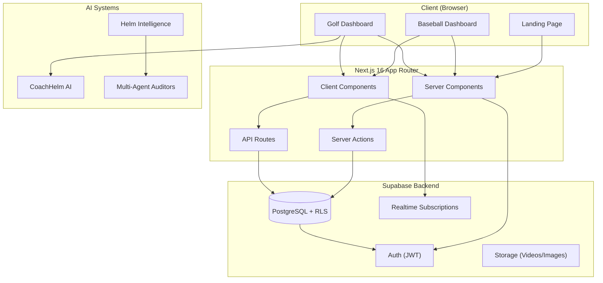
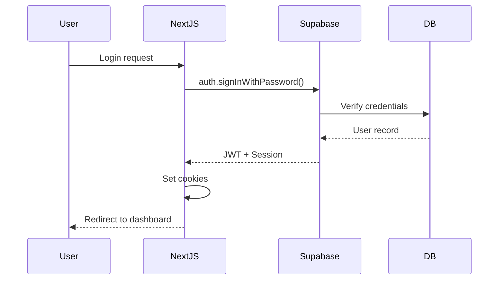
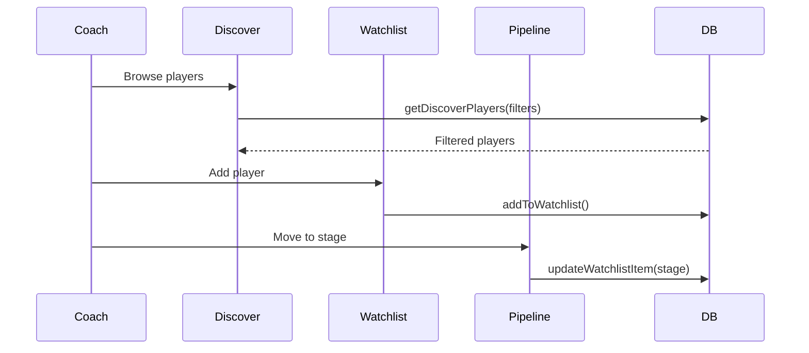
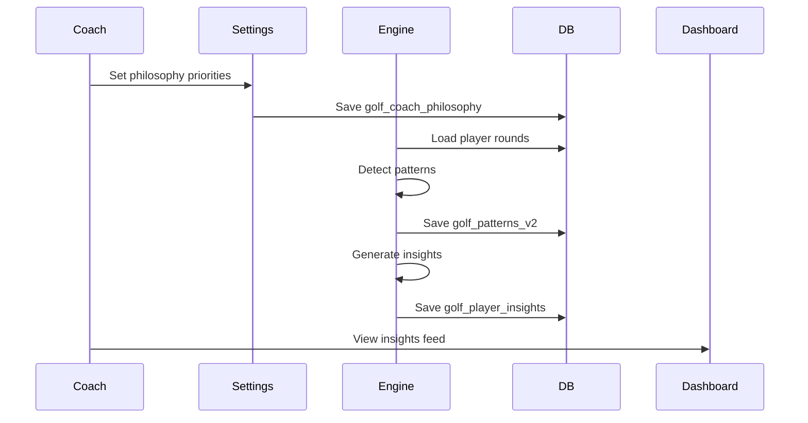

# Codebase Map - Helm Sports Labs

> Auto-generated by Cartographer. Last mapped: 2026-01-13

## System Overview

**Helm Sports Labs** is a multi-sport SaaS platform serving college recruiting and team management:

- **BaseballHelm**: College baseball recruiting (coaches ↔ players)
- **GolfHelm**: College golf team management + CoachHelm AI intelligence layer

**Tech Stack**: Next.js 16 (App Router) • TypeScript strict • Supabase • Tailwind CSS • Framer Motion



## Directory Structure

```
helmv3/
├── src/                          # Main application source
│   ├── app/                      # Next.js App Router (340 files, 454K tokens)
│   │   ├── baseball/             # Baseball product routes
│   │   │   ├── (auth)/           # Login, signup, password reset
│   │   │   ├── (onboarding)/     # Multi-step profile setup
│   │   │   ├── (dashboard)/      # Protected dashboard routes
│   │   │   ├── (public)/         # Public profiles
│   │   │   ├── actions/          # Baseball server actions (14 files)
│   │   │   └── join/[code]/      # Team join flow
│   │   ├── golf/                 # Golf product routes
│   │   │   ├── (auth)/           # Login, signup, password reset
│   │   │   ├── (onboarding)/     # Coach/player onboarding
│   │   │   ├── (dashboard)/      # Protected dashboard routes
│   │   │   └── actions/          # Golf server actions (19 files)
│   │   ├── api/                  # API route handlers
│   │   ├── auth/callback/        # OAuth handler
│   │   └── actions/              # Shared server actions
│   │
│   ├── components/               # React components (392 files, 618K tokens)
│   │   ├── ui/                   # Base primitives (63 files)
│   │   ├── baseball/             # Baseball features (33 files)
│   │   ├── golf/                 # Golf features (107 files)
│   │   ├── auth/                 # Sign-in/up forms
│   │   ├── layout/               # Sidebar, Header
│   │   ├── coach/                # Recruiting/discover tools
│   │   ├── player/               # Player profile components
│   │   ├── icons/                # 103+ custom SVG icons
│   │   └── features/             # Cross-product features
│   │
│   ├── lib/                      # Core infrastructure (98 files, 265K tokens)
│   │   ├── supabase/             # Database clients (server.ts, client.ts)
│   │   ├── types/                # ALL TypeScript types (index.ts)
│   │   ├── queries/              # Server-side query functions
│   │   ├── auth/                 # Authorization utilities
│   │   ├── coachhelm/            # CoachHelm AI system
│   │   ├── recruiting/           # Match scoring, pipeline stages
│   │   ├── cache/                # Redis caching layer
│   │   └── utils.ts              # cn(), formatters
│   │
│   └── hooks/                    # React hooks (41 files, 40K tokens)
│       ├── use-auth.ts           # Main auth hook (Zustand)
│       ├── use-players.ts        # Player discovery
│       ├── use-watchlist.ts      # Recruiting watchlist
│       ├── use-messages.ts       # Messaging system
│       └── golf/                 # Golf-specific hooks
│
├── supabase/                     # Database (205K tokens)
│   ├── migrations/               # 41 production migrations
│   └── migrations_archive/       # 80+ historical migrations
│
├── tools/                        # Development tools (600K tokens)
│   ├── ux-flow-auditor/          # Visual route auditor + dashboard
│   └── continuous-improvement/   # Closed-loop fix verification
│
├── docs/                         # Documentation (430K tokens)
│   ├── features/                 # Phase implementation guides
│   ├── architecture/             # System design docs
│   ├── setup/                    # Configuration guides
│   └── audits/                   # Security audit reports
│
├── helm-intelligence/            # AI multi-agent system
│   ├── agents/                   # 5 specialized agents
│   └── memory/                   # Persistent learning system
│
├── .claude/                      # Claude Code configuration
│   ├── skills/                   # AI skills library
│   └── commands.json             # Audit command orchestration
│
├── .production-team/             # Multi-agent audit prompts
│   └── memory/                   # Agent memory files
│
└── .helm/                        # Project intelligence
    ├── UNDERSTANDING.json        # Codebase knowledge graph
    └── HELM_ESSAY.md             # Product philosophy
```

## Module Guide

### `src/app/` - Application Routes

**Entry Points**: 340 TypeScript files handling all routing

| Route Group | Purpose | Key Routes |
|-------------|---------|------------|
| `/baseball/(auth)` | Authentication | `/login`, `/signup`, `/forgot-password` |
| `/baseball/(onboarding)` | Profile setup | `/coach-onboarding`, `/player` |
| `/baseball/(dashboard)` | Protected app | `/dashboard`, `/discover`, `/watchlist`, `/pipeline` |
| `/baseball/(public)` | Public profiles | `/player/[id]`, `/program/[id]` |
| `/golf/(auth)` | Golf auth | `/login`, `/signup` |
| `/golf/(dashboard)` | Golf app | `/dashboard`, `/roster`, `/calendar`, `/qualifiers` |

**Server Actions Pattern**:
```typescript
// src/app/baseball/actions/watchlist.ts
'use server';
import { createClient } from '@/lib/supabase/server';
import { revalidatePath } from 'next/cache';

export async function addToWatchlist(playerId: string) {
  const supabase = await createClient();
  const { data: { user } } = await supabase.auth.getUser();
  if (!user) throw new Error('Unauthorized');
  // ... mutation logic
  revalidatePath('/baseball/dashboard/watchlist');
}
```

---

### `src/components/` - React Components

**Total**: 392 files organized by domain

#### UI Primitives (`ui/` - 63 files)
| Component | Purpose | Key Features |
|-----------|---------|--------------|
| `Button` | Primary button | Variants: primary/secondary/ghost/danger, loading states |
| `GlassCard` | Glassmorphism card | `bg-glass backdrop-blur-glass`, glow effects |
| `Modal` | Accessible modal | Focus trap, keyboard nav, compound components |
| `Input` | Form input | Password toggle, icons, validation states |
| `DataTable` | Data tables | Sorting, pagination, selection |
| `SkeletonLoader` | Loading states | Contextual skeletons for all components |

#### Baseball Components (`baseball/` - 33 files)
- **Command Center**: `InsightsFeed`, `PlayerCommandCard`, `TeamStatsOverview`
- **Position Planner**: `BaseballDiamond`, `PositionPlayerPill`, drag-and-drop
- **Player Profile**: `PlayerInsightsPanel`, `PlayerNotesSection`, `PlayerStatsChart`
- **Recruiting Philosophy**: `RecruitingWeightDistributor`, `MatchScoreBadge`

#### Golf Components (`golf/` - 107 files)
- **Shot Tracking**: `ShotTrackingComprehensive` (1409 LOC) - hole-by-hole scoring
- **Calendar**: `PremiumCalendarClient` (602 LOC) - events, RSVP, recurring
- **CoachHelm**: `InsightsFeed`, `ReviewSummary`, `PriorityRanker`
- **Stats**: `GolfStatsDisplay` (878 LOC) - strokes gained, trends

---

### `src/lib/` - Core Infrastructure

#### Supabase Clients
```typescript
// Server-side (Server Components, Actions, Routes)
import { createClient } from '@/lib/supabase/server';
const supabase = await createClient(); // MUST await

// Client-side (Client Components, hooks)
import { createClient } from '@/lib/supabase/client';
const supabase = createClient(); // NOT async
```

#### Types (`types/index.ts`)
**Single source of truth** for all TypeScript types:
```typescript
import type { Player, Coach, Organization } from '@/lib/types';
// NEVER: @/types/database, @/types/supabase (don't exist)
```

Key types: `User`, `Coach`, `Player`, `Organization`, `Team`, `Watchlist`, `Video`, `Message`

#### Queries (`queries/`)
Server-side query functions:
- `coaches.ts`: `getCoachProfile()`, `getCoachTeams()`
- `players.ts`: `getDiscoverPlayers()`, `getPlayerProfile()`
- `watchlist.ts`: `getWatchlist()`, `addToWatchlist()`
- `teams.ts`: `getTeamDetails()`, `createTeamInvitation()`

#### CoachHelm AI (`coachhelm/`)
Golf AI intelligence system:
- `insight-engine.ts`: Generates player insights based on coach philosophy
- `types.ts`: `CoachPhilosophy`, `RoundReview`, patterns
- `v2/`: Advanced pattern mining, predictions, learning

---

### `src/hooks/` - React Hooks

| Hook | Purpose | Returns |
|------|---------|---------|
| `useAuth()` | Auth state (Zustand) | `user`, `coach`, `player`, `loading`, `signOut` |
| `usePlayers()` | Player discovery | `players`, `loading`, `refetch` |
| `useWatchlist()` | Coach watchlist | `watchlist`, `addToWatchlist`, `removeFromWatchlist` |
| `useMessages()` | Messaging | `messages`, `sendMessage`, real-time subscriptions |
| `useGolfMessages()` | Golf messaging | Team-scoped messaging with real-time |

---

### `supabase/migrations/` - Database Schema

**41 production migrations** in sequential order:

| Range | Purpose |
|-------|---------|
| 001-006 | Core foundation (users, organizations, coaches, players, teams) |
| 007-018 | Baseball features (watchlists, videos, messaging, analytics) |
| 019-030 | Golf core (teams, rounds, courses, events, qualifiers) |
| 031 | CoachHelm AI (13 tables for patterns, predictions, learning) |
| 032-041 | Advanced features, indexes, RLS policies |

**Key Tables**:
- Baseball: `baseball_*` prefix (coaches, players, teams, watchlists, videos, player_engagement_events)
- Golf: `golf_*` prefix (players, rounds, holes, events, qualifiers, coaches, teams)
- Shared: `users`, `organizations`, `messages`, `conversations`
- CoachHelm: `golf_patterns_v2`, `golf_predictions`, `golf_learned_behavior`

**RLS**: All tables have Row Level Security enabled (034_all_rls_policies.sql - 1805 lines)

---

### `tools/` - Development Tools

#### UX Flow Auditor (`ux-flow-auditor/`)
Visual dashboard for route analysis:
- Screenshot-first analysis with Claude Vision
- 40+ issue type detection
- Flow graph visualization
- MD implementation guides
- Dashboard at http://localhost:3333

#### Continuous Improvement (`continuous-improvement/`)
Closed-loop fix verification:
- Python + Claude Agent SDK
- Verify fixes by reading actual code
- Track issues across cycles
- Memory-based learning

---

### AI Systems

#### Helm Intelligence (`helm-intelligence/`)
Multi-agent codebase auditing:
- **5 Agents**: Orchestrator, Code Auditor, DB Auditor, UI Auditor, Enhancement
- **Memory**: Semantic + Episodic + Codebase knowledge
- **Budget**: $30 USD (~7 full audits)

#### Production Team (`.production-team/`)
AI audit system with persistent memory:
- **Agents**: Database Sentinel, Feature Maestro, Experience Architect, Code Janitor
- **Memory**: Per-agent learning files that compound across audit rounds

---

## Data Flow

### Authentication Flow


### Recruiting Flow (Baseball)


### CoachHelm AI Flow (Golf)


---

## Conventions

### Code Patterns

**Server vs Client**:
```typescript
// Server Component (default - no directive)
export default async function Page() {
  const supabase = await createClient();
  // ...
}

// Client Component (requires directive)
'use client';
export function InteractiveComponent() {
  const [state, setState] = useState();
  // ...
}
```

**Type Imports**:
```typescript
// CORRECT - single source
import type { Player, Coach } from '@/lib/types';

// WRONG - these don't exist
import type { Player } from '@/types/database';
```

**Server Actions**:
```typescript
'use server';
export async function mutateData() {
  const supabase = await createClient();
  const { data: { user } } = await supabase.auth.getUser();
  if (!user) throw new Error('Unauthorized');
  // ... mutation
  revalidatePath('/path');
}
```

### Design System

**Colors**:
- Primary: `#16A34A` (kelly green / green-600)
- Background: `#FFFEFA` (cream)
- Text: `#1c1917` (warm-900), `#78716c` (warm-500)

**Glassmorphism**:
```tsx
className="bg-white/70 backdrop-blur-xl border border-white/20 rounded-2xl shadow-glass"
```

**Typography**:
- Font: DM Sans (body), SF Pro Display (headings)
- Sizes: text-xs (12px) to text-3xl (30px)

**Spacing**:
- Card padding: `p-6` or `p-8`
- Card radius: `rounded-2xl`
- Button radius: `rounded-lg`

### Naming

**Files**: kebab-case (`player-card.tsx`, `use-auth.ts`)
**Components**: PascalCase (`PlayerCard`, `GlassCard`)
**Hooks**: camelCase with `use` prefix (`useAuth`, `usePlayers`)
**Types**: PascalCase (`Player`, `Coach`, `Organization`)

---

## Gotchas

### Critical Rules

1. **Server client MUST be awaited**: `await createClient()` not `createClient()`
2. **Client client is NOT async**: `createClient()` not `await createClient()`
3. **Type imports**: Use `@/lib/types` ONLY
4. **Pipeline stages**: Only 5 valid: `watchlist`, `high_priority`, `offer_extended`, `committed`, `uninterested`
5. **Table names**: Use prefixed names (`baseball_watchlists`, `baseball_coaches`, `golf_players`)
6. **`'use client'` required**: For any component using hooks, useState, useEffect

### Common Mistakes

- Forgetting `revalidatePath()` after mutations
- Not checking auth in server actions
- Using wrong Supabase client (server vs client)
- Importing types from wrong path
- Not handling loading/error states

### Performance

- Use server components for data fetching (default)
- Use client components only when needed for interactivity
- Batch queries with parallel fetching
- Use real-time subscriptions only where needed (messages)
- Cache expensive queries with `@/lib/cache`

---

## Navigation Guide

### To add a new Baseball feature:
1. Create route: `src/app/baseball/(dashboard)/dashboard/[feature]/page.tsx`
2. Add server action: `src/app/baseball/actions/[feature].ts`
3. Create components: `src/components/baseball/[feature]/`
4. Add types: `src/lib/types/index.ts`
5. Update sidebar: `src/components/layout/sidebar.tsx`

### To add a new Golf feature:
1. Create route: `src/app/golf/(dashboard)/dashboard/[feature]/page.tsx`
2. Add server action: `src/app/golf/actions/[feature].ts`
3. Create components: `src/components/golf/[feature]/`
4. If DB needed: Add migration in `supabase/migrations/`

### To modify auth:
1. Auth callbacks: `src/app/auth/callback/route.ts`
2. Auth actions: `src/app/baseball/actions/auth.ts`, `src/app/golf/actions/auth.ts`
3. Auth hook: `src/hooks/use-auth.ts`
4. Middleware: `src/lib/supabase/middleware.ts`

### To add database tables:
1. Create migration: `supabase/migrations/0XX_[name].sql`
2. Add RLS policies in migration
3. Regenerate types: `npm run db:types`
4. Add TypeScript types: `src/lib/types/index.ts`

### To run audits:
```bash
# UX Flow Auditor
cd tools/ux-flow-auditor && npm start

# Continuous Improvement
cd tools/continuous-improvement && python enhanced_cycle_agent.py --project ~/helmv3

# Claude Code audit
python3 .claude/run_audit.py audit-golf 1
```

---

## Key Files Reference

| What | File Path |
|------|-----------|
| Main types | `src/lib/types/index.ts` |
| Server Supabase | `src/lib/supabase/server.ts` |
| Client Supabase | `src/lib/supabase/client.ts` |
| Auth hook | `src/hooks/use-auth.ts` |
| Baseball sidebar | `src/components/layout/sidebar.tsx` |
| Golf sidebar | `src/components/golf/layout/GolfSidebar.tsx` |
| Design tokens | `tailwind.config.ts` |
| RLS policies | `supabase/migrations/034_all_rls_policies.sql` |
| CoachHelm AI | `src/lib/coachhelm/insight-engine.ts` |

---

*This codebase map was auto-generated by Cartographer analyzing 1,752 files (3.4M tokens) using 8 parallel Sonnet subagents.*
