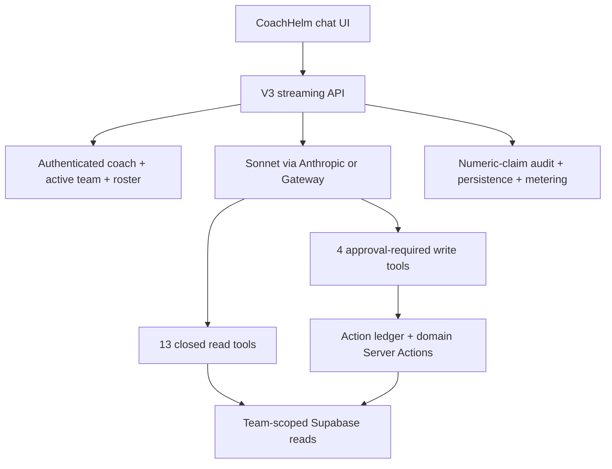

# Helm CoachHelm AI Map

## Architecture and models

CoachHelm V3 chat is implemented by [src/app/api/coachhelm/v3/chat/stream/route.ts](https://github.com/njrini99-code/helmv3/blob/887218526e4ee98f013a30378105fe012af88307/src/app/api/coachhelm/v3/chat/stream/route.ts). It uses AI SDK 7 with direct Anthropic when `ANTHROPIC_API_KEY` exists and otherwise the Vercel AI Gateway provider string. Configured models are `anthropic/claude-sonnet-5` / `claude-sonnet-5` for chat and `anthropic/claude-haiku-4-5` for round-review and hero narrative. No OpenAI model is active in the current chat path.

The system prompt lives in [src/lib/coachhelm/v3/chat/instructions.ts](https://github.com/njrini99-code/helmv3/blob/887218526e4ee98f013a30378105fe012af88307/src/lib/coachhelm/v3/chat/instructions.ts). It requires tool-backed numeric claims, a time window/sample, no unsupported benchmarks, concise language, no raw ids/tool names, and explicit preview/confirmation for writes. Server context resolution authenticates a Golf coach, resolves the cookie-aware active team, and loads the active roster. Tool inputs never accept a team id; player-targeted tools call a roster validator.

## Prompt, context, and persistence

- **Conversation context:** prior UI messages are persisted in `golf_coachhelm_chat_messages.ui_parts` and restored; `client_turn_id` provides turn idempotency.
- **Team/player data:** live database data is retrieved only when a tool is called; bounded metric catalogs and query windows reduce free-form access. No generic `executeQuery`, `runSQL`, `updateDatabase`, or `adminAction` tool exists.
- **Structured output:** read tools return typed objects/series; chart UI uses deterministic tool payloads. The model writes prose around them.
- **Numeric audit:** unsupported numeric claims cause a failed message/notice rather than an unverified final response. Round/hero narratives get one verification retry and otherwise use/discard to deterministic fallback.
- **History/token control:** chat has a bounded step count (8) and route duration (120 seconds); server restore/history handling and provider context limits determine truncation. Exact production token budgets are environment/data dependent.
- **Metering:** LLM calls and budget spend are stored; spend recording fails open if its database write fails.
- **Untrusted context:** player names, event/task/focus/insight text, course names, and narrative goals can enter the prompt. No explicit prompt-injection delimiter/sanitizer was found; write tools remain approval-gated.

**Evidence:** [src/lib/coachhelm/v3/chat/context.ts](https://github.com/njrini99-code/helmv3/blob/887218526e4ee98f013a30378105fe012af88307/src/lib/coachhelm/v3/chat/context.ts); [src/lib/coachhelm/v3/chat/instructions.ts](https://github.com/njrini99-code/helmv3/blob/887218526e4ee98f013a30378105fe012af88307/src/lib/coachhelm/v3/chat/instructions.ts); [src/lib/coachhelm/v3/chat/persistence.ts](https://github.com/njrini99-code/helmv3/blob/887218526e4ee98f013a30378105fe012af88307/src/lib/coachhelm/v3/chat/persistence.ts); [src/lib/coachhelm/v3/chat/restore.ts](https://github.com/njrini99-code/helmv3/blob/887218526e4ee98f013a30378105fe012af88307/src/lib/coachhelm/v3/chat/restore.ts); [src/lib/coachhelm/v3/llm/round-review.ts](https://github.com/njrini99-code/helmv3/blob/887218526e4ee98f013a30378105fe012af88307/src/lib/coachhelm/v3/llm/round-review.ts).

## Read-tool inventory

| Tool | Input schema summary | Output | Data | Action | Authorization | Side effect |
| --- | --- | --- | --- | --- | --- | --- |
| find_player | Name fragment | Matching roster players | Roster context/golf_players | Read | requireRosterPlayer/context | No write |
| get_team_overview | Optional window | Team/roster summary | golf_team_members, golf_rounds/cache | Read | Resolved active team | No write |
| get_player_metrics | player_id, metric/window | Typed metric/sample | golf_player_stats_cache, golf_rounds | Read | Roster player required | No write |
| get_player_trend | player_id, metric/window | Time series | golf_rounds/cache | Read | Roster player required | No write |
| get_putting_distance_profile | player_id/window | Distance buckets | golf_shots/putt details | Read | Roster player required | No write |
| compare_players | player_ids/metric/window | Comparable rows | round/cache data | Read | Every player in roster | No write |
| get_team_metric_ranking | metric/window | Ranked team rows | cache/round data | Read | Active team roster | No write |
| get_player_weakest_areas | player_id/window | Weak-area evidence | cache/round/shot data | Read | Roster player required | No write |
| get_recent_rounds | player_id/count | Bounded recent rounds | golf_rounds | Read | Roster player required | No write |
| get_player_insights | player_id/status | Visible insights | golf_coach_insights | Read | Roster + visibility helper | No write |
| get_focus_areas | player_id/status | Focus areas | golf_player_focus_areas | Read | Roster player required | No write |
| get_upcoming_events | window | Events/attendance | golf_events, attendance | Read | Active team | No write |
| get_open_tasks | player/status | Tasks/assignments | golf_tasks, assignments | Read | Active team/roster | No write |

## Write-tool inventory

| Tool | Input schema summary | Output | Authentication/authorization | Tables/effects | Confirmation | Idempotency | UI/error notes |
| --- | --- | --- | --- | --- | --- | --- | --- |
| create_focus_area | player_id, title/description/priority | Proposal → receipt/deep link | Coach session + exact roster validation + domain action/RLS | golf_player_focus_areas; notification best-effort | Required | Ledger conditional claim | Proposal/receipt; reload approval gap |
| create_task | title/description/due/priority/player_ids | Proposal → task receipt | Coach session + roster context; domain action checks org/team | golf_tasks + assignments + notifications | Required | Ledger claim; domain child writes not atomic | May overclaim assignments/notifications |
| create_team_announcement | title/content/recipient ids/link ids | Proposal → announcement receipt | Coach session + active team; domain action/RLS | golf_announcements + recipients/links/notifications | Required | Ledger claim; several child writes non-fatal | May overclaim recipients/links/notifications |
| create_recurring_practice | title, dates/times/timezone, player_ids | Proposal → series receipt | Coach session + active team; recurrence action/RLS | golf_events + attendance + notifications | Required | Ledger claim; cap 26; child/attendance partiality | Exact-date preview; receipt can overclaim side effects |

All four use the regular domain action rather than arbitrary SQL. However, tool-level success is only as truthful as the downstream action. The testing agent must verify the database graph and notification-provider mock; the model text and receipt are not authoritative.

## Approval, denial, reload, and stream behavior

1. `onInputAvailable` constructs a proposal and writes a proposed `golf_coachhelm_action_runs` row.
2. AI SDK tool approval suspends execution; the client renders the proposal.
3. Approval resubmits the conversation/tool part. A conditional ledger update claims the proposal so a retry cannot execute twice.
4. The domain Server Action performs the write and the ledger stores a receipt/deep link.
5. **Confirmed gap:** `recordDenial` exists and is unit tested but the denial path does not call it; live action-run aggregates were proposal-only at observation.
6. **Confirmed gap:** message restoration keeps `data-action-proposal` but its replay allowlist drops the SDK approval part/id, leaving a reloaded proposal without a working approval transport.
7. **Confirmed gap:** downstream tasks, announcements, events, and notifications have partial/non-fatal writes. Receipts can claim children/channels that did not complete.

## Insight architecture

V3 deterministic engines write `golf_coach_insights` with lifecycle states such as detected/matured/addressed/resolved and app-level visibility filtering. V2 insight rows remain but are hidden by the current product contract. Live aggregate inspection found 447 V3 and 103 V2 insights; V3 included active/archived/tentative/acknowledged states. These counts are operational context, not seed data.

The RLS policy does not enforce V3 lifecycle visibility; direct reads are therefore a required test. Several components and effectiveness/behavior-learning paths documented in [memory/context/coachhelm-ai.md](https://github.com/njrini99-code/helmv3/blob/887218526e4ee98f013a30378105fe012af88307/memory/context/coachhelm-ai.md) are dark, have no caller, or discard output; they are not treated as active features.

## AI workflow matrix

| Prompt/workflow | Required retrieval | Evidence shown | Proposed action | Database effect | Automated assertion |
| --- | --- | --- | --- | --- | --- |
| Coach asks why putting is poor | get_player_metrics + putting profile + trend | Metric/window/sample and evidence card | Suggest focus area | Approve creates one scoped focus row | Every number matches tool data; focus row/deep link after approval only |
| Coach asks who needs attention | team overview + ranking + weakest areas | Bounded roster ranking | Create tasks for selected players | Approve creates task/assignments | No other team/player ids; assignment counts exact |
| Coach asks about schedule | upcoming events/open tasks | Actual dates/status | Create recurring practice | Approve creates root/children/attendance | Timezone/26 cap/series graph; never trust prose count |
| Coach asks to notify team | team context/roster | Preview recipient intent | Create announcement | Approve parent/recipient/link rows | Database recipient set and provider mocks, not receipt text alone |
| Player round completes | Deterministic round/shot evidence | Verified narrative or fallback | Insight/review generation | Background writes terminal markers | Round markers, cache, review, insight; safety-net recovery |

## AI-specific tests

- Use a deterministic fake provider that emits known tool calls, numbers, approvals, denials, stream interruption, malformed tool inputs, and retry sequences.
- Run provider/model contract tests separately from product E2E; do not make the core scan depend on model wording.
- For every number, compare UI/chart/message against the exact seeded tool rows and window/sample.
- For every action, assert proposed → approved/denied/failed/completed ledger transitions and exact domain rows.
- Test wrong-team same-name players, modified approval payloads, another user/session approving, and a team switch between proposal and approval.
- Inject failure after the primary parent write and before each child/notification write; compare receipt to database truth.
- Reload at pending approval, during streaming, and after provider disconnect. Retry must not duplicate client turn, LLM call intent, action, or domain row.
- Seed prompt-injection strings into every retrieved text field and assert they cannot alter system policy, tools, team scope, or confirmation.
- Never trust “created,” “sent,” “assigned,” a displayed count, or a generated chart solely from model text.

## Existing AI coverage and gaps

Unit/integration coverage exists for read tools, evidence contracts, round triggers, approval delivery, idempotency helpers, insight engines, and Inngest routing. [src/test/coachhelm/v3/chat-approval-delivery.test.ts](https://github.com/njrini99-code/helmv3/blob/887218526e4ee98f013a30378105fe012af88307/src/test/coachhelm/v3/chat-approval-delivery.test.ts) specifically pins transport behavior after a prior silent production failure. Missing high-value E2E coverage includes denial wiring, reload of pending approval, full database verification for each action, partial child failures, cross-tenant tampering, provider interruption, prompt injection, and real chart-value comparison.
