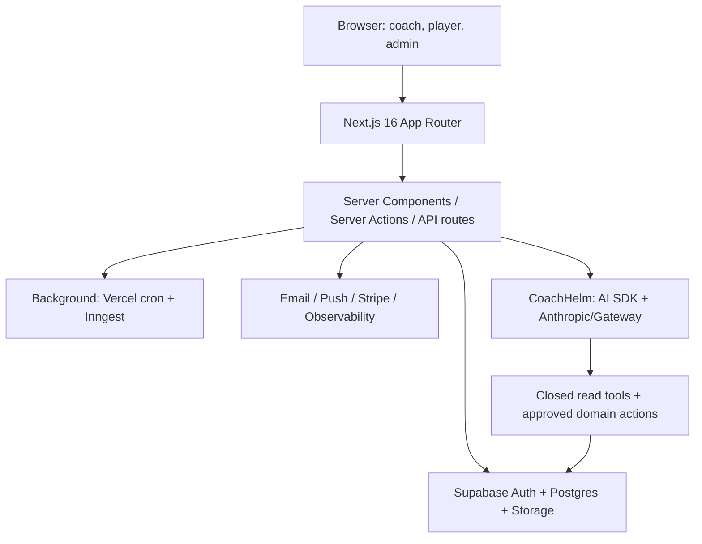

# Helm System Overview

## Research snapshot and confidence

This is a read-only reconstruction of njrini99-code/helmv3 at commit [887218526e4e](https://github.com/njrini99-code/helmv3/commit/887218526e4ee98f013a30378105fe012af88307) on 2026-07-26 and the connected live Supabase project `qmnssrrolpinvwjjnufo`. No application code, records, schema, policies, settings, providers, or credentials were changed. Runtime UI behavior was not exercised; conclusions labeled **Confirmed** are supported by source plus live metadata, **Strongly inferred** are supported by multiple static sources, **Tentative** have an unresolved runtime dependency, and **Unknown** lack sufficient evidence.

The expected repository is correct: `njrini99-code/helmv3`, default branch `main`. The active application is the root Next.js app under `src/app`; `helm-website-ui` is a separate/excluded tree and was not treated as the production app. The inspected HEAD is the merge of PR #1072. Three non-archive remote branches exist (`feat/products-page-redesign`, `fix/coachhelm-approval-delivery`, `fix/ui-stability-audit-0722`), but none had an open PR and none was treated as deployed/current behavior. **Deployment branch/environment mapping remains Unknown** because repository configuration disables automatic Git deployments and no read-only deployment-to-commit record was available.

**Evidence:** [AGENTS.md](https://github.com/njrini99-code/helmv3/blob/887218526e4ee98f013a30378105fe012af88307/AGENTS.md); [docs/REPO_MAP.md](https://github.com/njrini99-code/helmv3/blob/887218526e4ee98f013a30378105fe012af88307/docs/REPO_MAP.md); [package.json](https://github.com/njrini99-code/helmv3/blob/887218526e4ee98f013a30378105fe012af88307/package.json); [vercel.json](https://github.com/njrini99-code/helmv3/blob/887218526e4ee98f013a30378105fe012af88307/vercel.json).

## Executive summary

Helm currently contains three production-shaped product areas:

1. **BaseballHelm** — coach/team operations, roster/staff capabilities, calendar/practices, attendance, statistics/imports, recruiting/discovery, academics, video, travel, documents, direct messages, player Today/timeline, development, signals/decision room, and a bridge into lifting.
2. **GolfHelm** — coach/player onboarding, roster/recruiting, calendar/RSVP/recurrence, tasks/announcements/messages/documents/travel, course/tee data, round and shot tracking, statistics, qualifiers, player development, and CoachHelm.
3. **Helm Lifting** — programs, exercise prescriptions, assignments, groups, sessions/live room, set results/PRs/maxes, readiness, soreness, weight check-ins, nutrition, imports, and invitations. It is a route group/product but also accepts Baseball/Golf organization bridges.

CoachHelm is primarily a Golf product today. V3 chat is evidence-backed and uses 13 narrow read tools plus four confirmation-required write tools. Baseball has files named CoachHelm/actions, but no equivalent active conversational AI architecture was found. Billing is not a subscription product: only an admin one-off Stripe invoice path exists, with live persistence absent. Arccos ingestion is backend-only/dormant; Garmin/TrackMan are stubs; GameChanger/Presto/Sidearm are file import formats rather than confirmed live APIs.

**Evidence:** [memory/registry.yml](https://github.com/njrini99-code/helmv3/blob/887218526e4ee98f013a30378105fe012af88307/memory/registry.yml); [docs/REPO_MAP.md](https://github.com/njrini99-code/helmv3/blob/887218526e4ee98f013a30378105fe012af88307/docs/REPO_MAP.md); [memory/context/coachhelm-ai.md](https://github.com/njrini99-code/helmv3/blob/887218526e4ee98f013a30378105fe012af88307/memory/context/coachhelm-ai.md); [src/app/admin/actions/billing.ts](https://github.com/njrini99-code/helmv3/blob/887218526e4ee98f013a30378105fe012af88307/src/app/admin/actions/billing.ts); [src/lib/coachhelm/v3/ingest/providers/arccos.ts](https://github.com/njrini99-code/helmv3/blob/887218526e4ee98f013a30378105fe012af88307/src/lib/coachhelm/v3/ingest/providers/arccos.ts).

## Architecture

### Major technologies

| Layer | Observed technology | Evidence/confidence |
| --- | --- | --- |
| Runtime/framework | Next.js 16.2.11 App Router; React 19.2.7; TypeScript 5.9.3 strict; Node >=22; npm | [package.json](https://github.com/njrini99-code/helmv3/blob/887218526e4ee98f013a30378105fe012af88307/package.json); [tsconfig.json](https://github.com/njrini99-code/helmv3/blob/887218526e4ee98f013a30378105fe012af88307/tsconfig.json) — Confirmed |
| UI | Tailwind 3, Base UI/Radix, Recharts, Visx, Framer Motion, GSAP, dnd-kit, TanStack Table | [package.json](https://github.com/njrini99-code/helmv3/blob/887218526e4ee98f013a30378105fe012af88307/package.json) — Confirmed |
| Client state/data | Local React state, Zustand, Server Components/Actions, direct Supabase clients, router refresh/cache tags; no React Query or SWR dependency found | [package.json](https://github.com/njrini99-code/helmv3/blob/887218526e4ee98f013a30378105fe012af88307/package.json); static imports — Confirmed |
| Validation/forms | Zod 4 plus native/component-managed forms; no React Hook Form dependency found | [package.json](https://github.com/njrini99-code/helmv3/blob/887218526e4ee98f013a30378105fe012af88307/package.json) — Confirmed |
| Backend | Supabase Auth/Postgres 17.6/Storage/Realtime/Edge Functions; Vercel Functions and cron; Inngest | Live project metadata; package/vercel config — Confirmed |
| AI | AI SDK 7.0.37, Anthropic SDK 4.0.20; direct Anthropic or Vercel AI Gateway | [src/app/api/coachhelm/v3/chat/stream/route.ts](https://github.com/njrini99-code/helmv3/blob/887218526e4ee98f013a30378105fe012af88307/src/app/api/coachhelm/v3/chat/stream/route.ts) — Confirmed |
| Quality | Vitest, Playwright, SQL RLS tests, GitHub Actions, CircleCI, axe, Lighthouse, promptfoo, mutation and knip lanes | [vitest.config.ts](https://github.com/njrini99-code/helmv3/blob/887218526e4ee98f013a30378105fe012af88307/vitest.config.ts); [playwright.config.ts](https://github.com/njrini99-code/helmv3/blob/887218526e4ee98f013a30378105fe012af88307/playwright.config.ts); [.github/workflows](https://github.com/njrini99-code/helmv3/tree/887218526e4ee98f013a30378105fe012af88307/.github/workflows) — Confirmed |

## Deployment model

- **Target:** Vercel for the root Next.js app. `vercel.json` defines scheduled CoachHelm, event/task reminder, integrity, CRM, and maintenance endpoints.
- **Git deployments:** explicitly disabled/ignored in repository configuration; production promotion appears manual. The exact production commit is therefore **Unknown**.
- **Preview/production:** environment-dependent provider keys and test credentials differ; previews are not proven to use a separate Supabase project. Only one connected Supabase project was visible.
- **Database:** live project `Helm-Production` in `us-east-1`. No connected development branch/project was found. Repository migrations and live history are materially drifted.
- **Product selection:** Baseball, Golf, and Lifting are route trees in one app and share identity/organizations; they are not separate repositories or tenants. Active-team cookies/context choose team, not an environment variable.

**Evidence:** [vercel.json](https://github.com/njrini99-code/helmv3/blob/887218526e4ee98f013a30378105fe012af88307/vercel.json); [next.config.mjs](https://github.com/njrini99-code/helmv3/blob/887218526e4ee98f013a30378105fe012af88307/next.config.mjs); [.env.example](https://github.com/njrini99-code/helmv3/blob/887218526e4ee98f013a30378105fe012af88307/.env.example); [docs/audits/SUPABASE_DRIFT_REPORT_2026-07-03.md](https://github.com/njrini99-code/helmv3/blob/887218526e4ee98f013a30378105fe012af88307/docs/audits/SUPABASE_DRIFT_REPORT_2026-07-03.md).

### Feature flags and product modes

- Baseball/Golf/Lifting are route products, not environment-selected builds.
- Baseball program/season module settings are database-backed toggles, but issues #503/#504 show that saving a toggle does not consistently enforce routes/actions.
- CoachHelm V2 has global/coach/team gate logic and V3 has team/settings/budget state; provider selection and Inngest durability also switch by environment variables.
- `ENABLE_DEBUG_ROLLUP=1` guards one admin diagnostic endpoint. Demo access has its own session/read-only mode.
- Optional `NEXT_PUBLIC_ENABLE_ANALYTICS`, `NEXT_PUBLIC_ENABLE_CAMPS`, `NEXT_PUBLIC_ENABLE_MESSAGING`, and GrowthBook variables appear in `.env.example`, but no active GrowthBook runtime dependency/use was found. The Fairway redesign flag is explicitly removed and Fairway is the sole current tree.

**Evidence:** [.env.example](https://github.com/njrini99-code/helmv3/blob/887218526e4ee98f013a30378105fe012af88307/.env.example); [src/lib/redesign/flag.ts](https://github.com/njrini99-code/helmv3/blob/887218526e4ee98f013a30378105fe012af88307/src/lib/redesign/flag.ts); [src/lib/coachhelm/v2/gate.ts](https://github.com/njrini99-code/helmv3/blob/887218526e4ee98f013a30378105fe012af88307/src/lib/coachhelm/v2/gate.ts); [src/app/api/admin/debug-rollup/route.ts](https://github.com/njrini99-code/helmv3/blob/887218526e4ee98f013a30378105fe012af88307/src/app/api/admin/debug-rollup/route.ts); [src/app/baseball/actions/team-season-settings.ts](https://github.com/njrini99-code/helmv3/blob/887218526e4ee98f013a30378105fe012af88307/src/app/baseball/actions/team-season-settings.ts).

## Authentication, roles, and tenancy

Supabase Auth provides identity. The shared `users` row stores global `admin|coach|player`; sport-specific coach/player tables carry product profiles. Team authorization is relationship-based:

- Baseball: `baseball_team_coach_staff` and `baseball_team_members`; staff rows include granular capabilities and player/group scopes. `withBaseballAction` validates the authenticated user, active context, capability, target team/player scope, and demo read-only state.
- Golf: `golf_team_coach_staff` and `golf_team_members`; many actions rely on team resolver + RLS rather than one uniform wrapper. Head/assistant roles exist on staff rows. A Golf player is currently restricted to one team, while a primary coach may staff a second same-organization gender team.
- Lifting: `helm_lifting_coaches`, `helm_lifting_athletes`, `helm_lifting_org_viewers`, and bridge resolution from Baseball/Golf. `withLiftingAction` distinguishes edit/view/self access.
- Admin: `/admin` uses the server-only `SUPER_ADMIN_USER_IDS` gate, while `/golf/admin` uses global `users.role=admin`; this disagreement is a P0 boundary to test. The live `admin_allowlist` table had no direct active source reference and is not part of the observed gate.

No active parent role or parent-child relationship was found. “Guardian access” appears as a player/guardian settings concept rather than a confirmed identity role.

**Evidence:** [src/lib/baseball/with-baseball-action.ts](https://github.com/njrini99-code/helmv3/blob/887218526e4ee98f013a30378105fe012af88307/src/lib/baseball/with-baseball-action.ts); [src/lib/baseball/active-context.ts](https://github.com/njrini99-code/helmv3/blob/887218526e4ee98f013a30378105fe012af88307/src/lib/baseball/active-context.ts); [src/lib/golf/resolve-team-server.ts](https://github.com/njrini99-code/helmv3/blob/887218526e4ee98f013a30378105fe012af88307/src/lib/golf/resolve-team-server.ts); [src/lib/lifting/with-lifting-action.ts](https://github.com/njrini99-code/helmv3/blob/887218526e4ee98f013a30378105fe012af88307/src/lib/lifting/with-lifting-action.ts); [src/lib/admin/require-super-admin.ts](https://github.com/njrini99-code/helmv3/blob/887218526e4ee98f013a30378105fe012af88307/src/lib/admin/require-super-admin.ts); `users`, `baseball_team_coach_staff`, `baseball_team_members`, `golf_team_coach_staff`, `golf_team_members`.

## Data flow and synchronization

The normal flow is Server Component read → client interaction → Server Action/API → Supabase session/authorization → Postgres/RPC/Storage → cache-tag/path revalidation and/or router refresh. Optimistic UI is used in team switching, attendance, tasks, Player Today, course preferences, and other focused controls; these paths generally attempt rollback and then refresh.

Live Realtime publication evidence conflicts with several subscriptions: only admin/email and Golf messaging tables are published, while hooks subscribe to `golf_events`, `golf_event_attendance`, `golf_tasks`, `golf_task_assignments`, and Baseball messaging tables. Tests must therefore assert persistence after reload even when immediate UI appears correct, and should characterize whether live updates are absent.

**Evidence:** [src/hooks/golf/use-calendar-range-events.ts](https://github.com/njrini99-code/helmv3/blob/887218526e4ee98f013a30378105fe012af88307/src/hooks/golf/use-calendar-range-events.ts); [src/hooks/golf/use-task-realtime.ts](https://github.com/njrini99-code/helmv3/blob/887218526e4ee98f013a30378105fe012af88307/src/hooks/golf/use-task-realtime.ts); [src/hooks/useRSVP.ts](https://github.com/njrini99-code/helmv3/blob/887218526e4ee98f013a30378105fe012af88307/src/hooks/useRSVP.ts); [src/hooks/use-messages.ts](https://github.com/njrini99-code/helmv3/blob/887218526e4ee98f013a30378105fe012af88307/src/hooks/use-messages.ts); [src/hooks/golf/use-golf-messages.ts](https://github.com/njrini99-code/helmv3/blob/887218526e4ee98f013a30378105fe012af88307/src/hooks/golf/use-golf-messages.ts); `supabase_realtime publication`.

## CoachHelm architecture

CoachHelm V3 chat uses `claude-sonnet-5` for chat and `claude-haiku-4-5` for round-review/hero narratives. It chooses direct Anthropic when `ANTHROPIC_API_KEY` is present and otherwise uses the Vercel AI Gateway model name. The server resolves coach/team/roster context; tools do not accept a team id. Numeric claims must originate in tool results and are audited before a message is finalized. Conversation/messages, UI parts, model calls, spend, and action runs persist in Supabase.

The four write tools are `create_focus_area`, `create_task`, `create_team_announcement`, and `create_recurring_practice`. Each creates a preview/action ledger row and requires approval. Important gaps are confirmed: denial is not wired to `recordDenial`; reload restoration drops SDK approval parts; and non-transactional secondary failures can make a success receipt overstate assignments/recipients/notifications.

**Evidence:** [src/app/api/coachhelm/v3/chat/stream/route.ts](https://github.com/njrini99-code/helmv3/blob/887218526e4ee98f013a30378105fe012af88307/src/app/api/coachhelm/v3/chat/stream/route.ts); [src/lib/coachhelm/v3/chat/instructions.ts](https://github.com/njrini99-code/helmv3/blob/887218526e4ee98f013a30378105fe012af88307/src/lib/coachhelm/v3/chat/instructions.ts); [src/lib/coachhelm/v3/chat/read-tools.ts](https://github.com/njrini99-code/helmv3/blob/887218526e4ee98f013a30378105fe012af88307/src/lib/coachhelm/v3/chat/read-tools.ts); [src/lib/coachhelm/v3/chat/agent-tools.ts](https://github.com/njrini99-code/helmv3/blob/887218526e4ee98f013a30378105fe012af88307/src/lib/coachhelm/v3/chat/agent-tools.ts); [docs/architecture/coachhelm-evidence-contract.md](https://github.com/njrini99-code/helmv3/blob/887218526e4ee98f013a30378105fe012af88307/docs/architecture/coachhelm-evidence-contract.md); `golf_coachhelm_chat_conversations`, `golf_coachhelm_chat_messages`, `golf_coachhelm_action_runs`, `golf_coachhelm_llm_calls`.

## External integrations

| Service | Purpose | Entry/config | Environment variables | Auth | Safe scan strategy | Status |
| --- | --- | --- | --- | --- | --- | --- |
| Supabase Auth/DB/Storage/Realtime/Edge | Core identity, data, files, subscriptions, serverless helpers | Supabase SSR/browser/admin clients; migrations; functions | NEXT_PUBLIC_SUPABASE_URL, NEXT_PUBLIC_SUPABASE_ANON_KEY, SUPABASE_SERVICE_ROLE_KEY | JWT/RLS; service role on trusted server | Use isolated branch/local project; never expose service role to browser | Core dependency |
| Anthropic direct / Vercel AI Gateway | CoachHelm chat and verified narratives | chat stream route; round-review/hero LLM modules | ANTHROPIC_API_KEY; AI_GATEWAY_API_KEY/provider config | Server key | Deterministic fake model/tool transcripts for E2E; separate provider contract tests | Active with fallback routing |
| Stripe | Admin-created one-off invoices | admin billing action; webhook route | STRIPE_SECRET_KEY, STRIPE_WEBHOOK_SECRET | Server key + webhook signature | Stripe test mode + signed fixture events | Partial; no live tables/webhook persistence |
| Resend | Transactional/outbound/inbound email | notification email helper; CRM actions; webhooks | RESEND_API_KEY, RESEND_WEBHOOK_SECRET | Server key + webhook signature | Provider mock/mailbox sink; assert queued payload and DB event | Active |
| Gmail service account | CRM outbound/reply ingestion | crm-gmail-send; ingest-gmail-replies cron | GOOGLE_SERVICE_ACCOUNT_* / delegated mailbox variables | Service account/domain delegation | Fake Gmail adapter; never send from E2E | Active internal CRM |
| Web Push / APNs | Browser and iOS push | push helper; push subscriptions API; send-apns-push Edge Function | VAPID_*; APNS_* | Server credentials/JWT | Mock provider; assert invalid-token deactivation | Active; live 410 failures observed |
| Sentry | Errors/traces | instrumentation and server logger | SENTRY_* | DSN/auth token server/build | Disable outbound or use test project; assert local logger hooks | Active |
| Datadog | Operational telemetry | instrumentation/admin observed actions | DD_* | Server/client tokens | No outbound in E2E; capture instrumentation calls | Active |
| PostHog / Vercel Analytics | Product analytics | providers/hooks/layout | NEXT_PUBLIC_POSTHOG_* | Client project key | Stub endpoints; assert only critical event schema | Active |
| Inngest | Durable post-round CoachHelm analysis | api/inngest; post-round submission | INNGEST_EVENT_KEY, INNGEST_SIGNING_KEY | Signed events | Local dev server or fake client; exercise fallback and retry | Conditionally active by env |
| Upstash Redis | Rate limiting/cache/coordination | server libraries | UPSTASH_REDIS_REST_URL, UPSTASH_REDIS_REST_TOKEN | Server token | In-memory fake or dedicated namespace | Environment-dependent |
| Google Calendar | CRM booking/sync | crm Google OAuth API routes | GOOGLE_CALENDAR_CLIENT_ID, GOOGLE_CALENDAR_CLIENT_SECRET, GOOGLE_CALENDAR_REDIRECT_URI | OAuth | Stub OAuth/token/calendar API | CRM-only |
| Arccos | Golf round ingest | v3 ingest provider | ARCCOS_* provider variables where configured | OAuth/token | Recorded provider fixtures against isolated DB | Backend-only/dormant |
| GameChanger / Presto / Sidearm | Baseball exported-stat parsing | baseball import adapters/actions | No live API credential path found | Uploaded files | Static fixture files | Active as file formats, not live APIs |
| Mapbox / Tambo / Garmin / TrackMan | Reserved mapping/AI UI/ingest names | .env.example or provider stubs | Reserved variables only | Not active | No E2E until product path exists | Absent/stubbed |

## Repository and live-database scale

| Inventory | Observed |
| --- | --- |
| Pages | 229 page routes (229 inventoried) |
| API routes | 52 |
| Server-action files / exported actions | 192 files / 1020 exports (static scan) |
| Referenced public tables / RPCs | 217 / 68 |
| Tests | 944 files; 22 Playwright specs; approximately 7,783 parsed test/it declarations |
| Live public tables | 264; all RLS-enabled |
| Live public policies | 940 |
| Live public functions | 267; 142 SECURITY DEFINER |
| Live public columns/constraints/indexes | 4030 / 1362 / 1281 |
| Views/materialized views | 7 |
| Storage buckets/policies | 8 / 27 |

## Recent change and known-intent evidence

### Recent merged pull requests

| PR | Area | Research implication |
| --- | --- | --- |
| [#1072](https://github.com/njrini99-code/helmv3/pull/1072) | Notification/DM delivery fixes | Merged into inspected HEAD |
| [#1071](https://github.com/njrini99-code/helmv3/pull/1071) | Schedule screenshot import | Merged immediately before HEAD |
| [#1070](https://github.com/njrini99-code/helmv3/pull/1070) | Teardown race | Recent test-data hygiene change |
| [#1069](https://github.com/njrini99-code/helmv3/pull/1069) | CoachHelm retry/metering | Recent AI reliability change |
| [#1063](https://github.com/njrini99-code/helmv3/pull/1063) | CoachHelm confirmation/charts | Recent consequential-action behavior |
| [#1058](https://github.com/njrini99-code/helmv3/pull/1058) | CoachHelm command center | Recent product surface |
| [#1055](https://github.com/njrini99-code/helmv3/pull/1055) | Golf round setup | Recent round workflow |
| [#1050](https://github.com/njrini99-code/helmv3/pull/1050) | CoachHelm fixes | Recent AI behavior |
| [#1056](https://github.com/njrini99-code/helmv3/pull/1056) / [#1064](https://github.com/njrini99-code/helmv3/pull/1064) | Mobile behavior | Recent responsive changes |

No open pull request was returned at the observation time. Non-archive branches were inspected only for orientation and were excluded from current behavior.

### Open issues relevant to product truth

| Issue | Area | Implication |
| --- | --- | --- |
| [#379](https://github.com/njrini99-code/helmv3/issues/379) | Seeded Baseball stats mismatch | Known data/test fixture truth gap |
| [#382](https://github.com/njrini99-code/helmv3/issues/382) | Production stats smoke | Requested verification |
| [#430](https://github.com/njrini99-code/helmv3/issues/430) | Teams pagination/count | Known page/count risk |
| [#431](https://github.com/njrini99-code/helmv3/issues/431) | Player sort only current page | Known pagination correctness risk |
| [#503](https://github.com/njrini99-code/helmv3/issues/503) | Season module toggles write-only | Settings/enforcement mismatch |
| [#504](https://github.com/njrini99-code/helmv3/issues/504) | Program module toggles not enforced | Settings/enforcement mismatch |
| [#372](https://github.com/njrini99-code/helmv3/issues/372) | Mandatory Baseball smoke | QA intent |
| [#373](https://github.com/njrini99-code/helmv3/issues/373) | Authenticated route crawler | QA intent |
| [#377](https://github.com/njrini99-code/helmv3/issues/377) | Product-truth contracts | QA intent |
| [#483](https://github.com/njrini99-code/helmv3/issues/483) | Safe area | Mobile risk |
| [#484](https://github.com/njrini99-code/helmv3/issues/484) | Player Today CTA | Player workflow risk |
| [#485](https://github.com/njrini99-code/helmv3/issues/485) | Calendar height | Calendar/mobile risk |

## Existing testing and quality infrastructure

No suite was executed during this read-only research pass, so current pass/fail status is **Unknown**. Counts describe discovery, not meaningful coverage.

| Suite/lane | Observed scope | How it runs | Required environment | Current pass status | Maintenance evidence | Major gap |
| --- | --- | --- | --- | --- | --- | --- |
| Vitest unit | Approximately 817 statically classified unit files across actions, hooks, components, read models, CoachHelm, and admin | npm run test:run or npm test | Node/jsdom; mocked Next/Supabase/provider modules | Unknown — not run | Large recent test volume and named project | Mock-heavy tests do not prove live RLS, routing, or persistence |
| Vitest integration | 5 *.integration.test files in static classification | npm run test:integration | 30s timeout; mocked/local dependencies per test | Unknown — not run | Dedicated project | Sparse relative to 1,020 exported actions |
| Vitest RLS-named | *.rls.test files under src | npm run test:rls | 30s timeout; setup varies | Unknown — not run | Dedicated project | Does not replace live restricted-client SQL/Storage/RPC characterization |
| Business contracts | 7 statically classified contract files | npm run test:business | Node/jsdom | Unknown — not run | Dedicated required lane | Limited product-truth breadth |
| Supabase SQL tests | 48 SQL/database test files including Baseball RLS | Supabase local CI workflow/scripts | Local Supabase/Docker-compatible environment | Unknown — not run | CI RLS/lint jobs | Live schema/policy drift can make local results non-representative |
| Playwright | 22 E2E specs; anonymous Chromium, Baseball coach/player, and mobile public/coach/player projects | npm run test:e2e | Built app or PLAYWRIGHT_BASE_URL; auth/env credentials; seeded data | Unknown — not run | Recent smoke/crawler/mobile/teardown work | Firefox/WebKit commented; Golf/Lifting/admin auth states not root-wired; CI worker=1 |
| Accessibility | axe Playwright specs for public/general and CRM plus mobile geometry checks | Playwright/PR workflow | Stable deployment and auth where needed | Unknown — not run | Dedicated specs and @axe-core/playwright | Not a complete keyboard/focus/error-announcement matrix |
| Visual/UI intelligence | Gated visual-audit crawl and screenshot/atlas scripts | VISUAL_AUDIT=1 and ui:* scripts | Authenticated deployment, deterministic data/fonts/time | Unknown — not run | Recent mobile/visual PRs | No broad toHaveScreenshot baseline suite; some workflow jobs are non-blocking |
| Script node:test files | About 46 scripts/__tests__ files; one secrets guard explicitly wired into Vitest | Mostly documented node --test commands | Node and task-specific fixtures | Unknown — most not run by standard scripts | Source comments explicitly identify dead-test gap | Large discovery/CI coverage hole |
| Prompt/quality/performance | promptfoo round-review eval, Lighthouse, mutation, knip, SQL lint, npm audit, iOS checks | npm run evals/lighthouse and CircleCI weekly lanes | Provider/test deployment depending on lane | Unknown — not run | Configured recurring jobs | Not blocking every PR; provider nondeterminism |
| Storybook/MSW/testcontainers | No active dependency/config found | N/A | N/A | Absent | N/A | Component catalog, standardized HTTP mocks, and disposable DB containers are missing |

**Evidence:** [vitest.config.ts](https://github.com/njrini99-code/helmv3/blob/887218526e4ee98f013a30378105fe012af88307/vitest.config.ts); [playwright.config.ts](https://github.com/njrini99-code/helmv3/blob/887218526e4ee98f013a30378105fe012af88307/playwright.config.ts); [package.json](https://github.com/njrini99-code/helmv3/blob/887218526e4ee98f013a30378105fe012af88307/package.json); [e2e/accessibility.spec.ts](https://github.com/njrini99-code/helmv3/blob/887218526e4ee98f013a30378105fe012af88307/e2e/accessibility.spec.ts); [.github/workflows](https://github.com/njrini99-code/helmv3/tree/887218526e4ee98f013a30378105fe012af88307/.github/workflows).

## Primary risks

The highest-risk boundaries are live RLS/RPC/Edge authorization, cross-team active-context/caching, CoachHelm consequential actions, recurring events, round/background side effects, notification delivery, and database/type/migration drift. The top confirmed exposures are summarized in `helm-bug-risk-register.md`; the first ten are direct authorization or data-isolation checks and should precede broad UI regression coverage.

## Research limitations

- No UI workflow or provider call was executed; tests were not run. “Currently passes” is therefore **Unknown**, even where a suite exists.
- No production records or PII were copied. Live data inspection was limited to schema, policy/function definitions, aggregate counts, and safe logs.
- Exact Supabase Auth dashboard settings/OAuth provider enablement and Vercel deployment-to-commit mapping were not exposed.
- Feature flags whose value is supplied only at deployment time cannot be confirmed as enabled.
- Source shows intended behavior; live runtime may differ where deployment drift exists.

## Final research summary

1. **What Helm does:** three connected sports/team products, with Baseball team/recruiting operations, Golf round/team/development operations plus CoachHelm, and a shared Lifting product.
2. **Complete-looking features:** core auth, team/roster, Baseball practice/stats/imports, Golf rounds/stats/qualifiers/calendar, messaging UIs, Lifting programs/sessions, and CoachHelm read chat are source-and-schema complete enough to test.
3. **Partial/disconnected:** subscription billing, Stripe webhooks, Arccos setup, Garmin/TrackMan, multiple dark CoachHelm V2/effectiveness components, denial/reload approval behavior, and settings toggles.
4. **Greatest risk:** cross-conversation/team access, raw Baseball directory policies, invite/RPC bypasses, broad document storage, orphan Edge Functions, CoachHelm action truth, recurrence, and team-switch cache isolation.
5. **Permission boundaries:** Baseball scoped staff capabilities, Golf organization-vs-team coach checks, admin gate mismatch, player-visible versus coach-only notes/insights, and all service-role paths.
6. **Database suitability:** the connected live production project is **not suitable** for deterministic destructive E2E testing. The schema is testable, but requires an isolated branch/local project and deterministic reset.
7. **Required before deep scan:** isolated Supabase target, seed/reset contract, CI-only verifier, provider fakes, all role accounts, test-data namespace/teardown, Firefox/WebKit projects, and a defined expected-failure policy for current security findings.
8. **Implementation order:** database/RLS contract harness → auth/personas/tenant seeds → P0 authorization → core round/practice/team workflows → CoachHelm approval/actions → notifications/jobs → mobile/a11y/visual → long-tail P2.
9. **First 20 tests:** the exact ordered set appears in the feature-scan blueprint and begins with the ten direct authorization probes, followed by CoachHelm, recurrence, team-switch, task-assignment, and realtime/persistence checks.
10. **Blockers:** no isolated connected database, no confirmed production deployment SHA, missing Golf root auth setup, provider test credentials/fakes, and unresolved desired behavior for several live authorization mismatches.
