# Helm Workflow Specifications

## Assertion standard

Every workflow below must be verified at four layers: visible UI, network/server result, restricted-client or CI database assertion, and forbidden-side-effect assertion. A toast alone is never success. After each write, reload and re-query with the actor's restricted credentials; use a Node-only CI verifier for cross-row invariants.

## WF-AUTH-01 — Baseball coach sign-up and team onboarding (P0)

- **Actors:** New Baseball coach
- **Entry:** /baseball/signup → /baseball/onboarding/coach → /baseball/onboarding/team
- **Preconditions:** Fresh confirmed auth user; no coach/team; isolated database.
- **Tables/effects:** users, organizations, baseball_coaches, baseball_teams, baseball_team_coach_staff

### Sequence

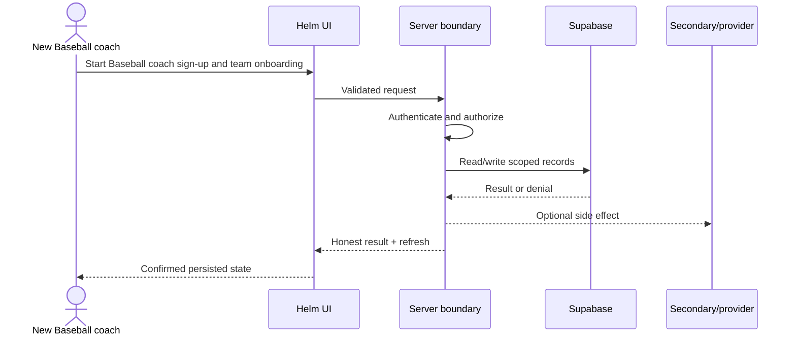

### Happy path

1. Create Supabase session
2. Create/complete users and baseball_coaches profile
3. Create organization and baseball_teams row
4. Create primary baseball_team_coach_staff row
5. Resolve active context
6. Redirect to dashboard

### Success criteria and Playwright assertions

- One coherent organization/team/primary staff graph; dashboard queries only that team.
- Assert page URL/modal/toast/disabled state, then reload and assert the same domain state.
- Assert expected request status/body and fail on unhandled exceptions, hydration errors, unexpected 401/403/500, CORS failures, or request loops.
- Query exact fixture ids: correct team/organization/player/creator/status and dependent-row counts; assert zero foreign-tenant and duplicate rows.

### Failure behavior

- Any intermediate error must not leave an unusable partial graph; retry must be idempotent.
- Database/provider fault injection must leave the UI in an error/retry state and preserve a reconcilable database state.
- Authorization failures must not disclose record existence through different status/copy/timing.

### Edge cases

- Back/refresh, duplicate submit, existing profile, lost session, team-name duplicate.
- Small/large iPhone, tablet, desktop; keyboard focus and accessible errors; backward navigation and refresh.

### Evidence

- [src/app/baseball/actions/auth.ts](https://github.com/njrini99-code/helmv3/blob/887218526e4ee98f013a30378105fe012af88307/src/app/baseball/actions/auth.ts)
- [src/app/baseball/actions/onboarding.ts](https://github.com/njrini99-code/helmv3/blob/887218526e4ee98f013a30378105fe012af88307/src/app/baseball/actions/onboarding.ts)
- [src/app/baseball/actions/teams.ts](https://github.com/njrini99-code/helmv3/blob/887218526e4ee98f013a30378105fe012af88307/src/app/baseball/actions/teams.ts)

## WF-AUTH-02 — Baseball staff invitation (P0)

- **Actors:** Primary coach; invited coach
- **Entry:** /baseball/dashboard/settings/staff → /baseball/staff-invite/[token]
- **Preconditions:** Primary coach/team; invitee email/auth persona; scoped capability fixture.
- **Tables/effects:** baseball_staff_invitations, baseball_coaches, baseball_team_coach_staff, baseball_staff_audit_events

### Sequence

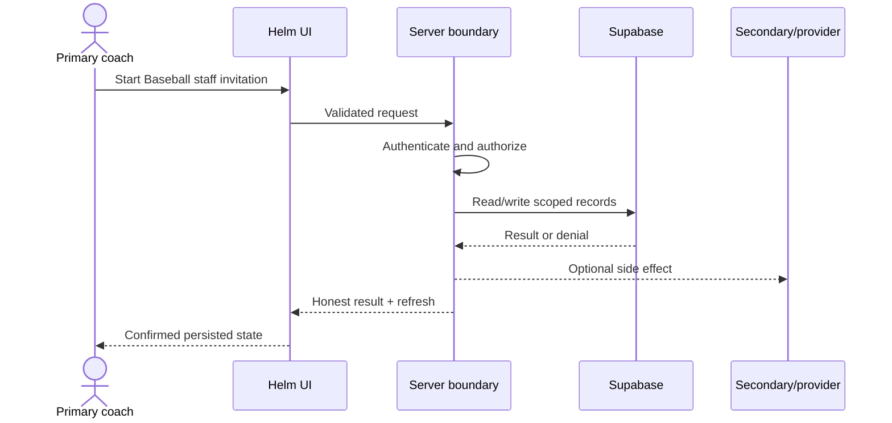

### Happy path

1. Primary coach creates invitation
2. Invite link is delivered/stubbed
3. Invitee authenticates
4. Server binds auth email to invitation
5. Acceptance RPC creates coach/staff row
6. Capabilities/scope become effective

### Success criteria and Playwright assertions

- Exactly one active staff row for intended auth identity/team with requested capabilities.
- Assert page URL/modal/toast/disabled state, then reload and assert the same domain state.
- Assert expected request status/body and fail on unhandled exceptions, hydration errors, unexpected 401/403/500, CORS failures, or request loops.
- Query exact fixture ids: correct team/organization/player/creator/status and dependent-row counts; assert zero foreign-tenant and duplicate rows.

### Failure behavior

- Wrong email, expired/revoked token, retry, and direct RPC must not create membership.
- Database/provider fault injection must leave the UI in an error/retry state and preserve a reconcilable database state.
- Authorization failures must not disclose record existence through different status/copy/timing.

### Edge cases

- Role changed before acceptance; token used twice; membership removed after acceptance.
- Small/large iPhone, tablet, desktop; keyboard focus and accessible errors; backward navigation and refresh.

### Evidence

- [src/app/baseball/actions/staff.ts](https://github.com/njrini99-code/helmv3/blob/887218526e4ee98f013a30378105fe012af88307/src/app/baseball/actions/staff.ts)
- [src/lib/baseball/with-baseball-action.ts](https://github.com/njrini99-code/helmv3/blob/887218526e4ee98f013a30378105fe012af88307/src/lib/baseball/with-baseball-action.ts)

## WF-AUTH-03 — Golf player onboarding and join (P0)

- **Actors:** New Golf player
- **Entry:** /golf/onboarding/player; /golf/join/[code]
- **Preconditions:** Fresh confirmed auth user; active team code/request fixture.
- **Tables/effects:** golf_players, golf_team_members, golf_team_join_requests

### Sequence

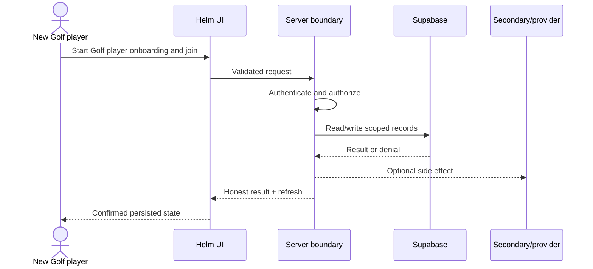

### Happy path

1. Create golf_players profile
2. Validate code/team
3. Create active membership or pending join request
4. Resolve player team
5. Render player hub

### Success criteria and Playwright assertions

- Player profile and exactly one intended membership; team data visible.
- Assert page URL/modal/toast/disabled state, then reload and assert the same domain state.
- Assert expected request status/body and fail on unhandled exceptions, hydration errors, unexpected 401/403/500, CORS failures, or request loops.
- Query exact fixture ids: correct team/organization/player/creator/status and dependent-row counts; assert zero foreign-tenant and duplicate rows.

### Failure behavior

- Current implementation may complete profile while join fails; UI must expose teamless state and retry.
- Database/provider fault injection must leave the UI in an error/retry state and preserve a reconcilable database state.
- Authorization failures must not disclose record existence through different status/copy/timing.

### Edge cases

- Expired/invalid code; second-team attempt; same name in second org.
- Small/large iPhone, tablet, desktop; keyboard focus and accessible errors; backward navigation and refresh.

### Evidence

- [src/app/golf/actions/onboarding.ts](https://github.com/njrini99-code/helmv3/blob/887218526e4ee98f013a30378105fe012af88307/src/app/golf/actions/onboarding.ts)
- [src/app/golf/actions/access-code.ts](https://github.com/njrini99-code/helmv3/blob/887218526e4ee98f013a30378105fe012af88307/src/app/golf/actions/access-code.ts)
- [src/app/golf/actions/teams.ts](https://github.com/njrini99-code/helmv3/blob/887218526e4ee98f013a30378105fe012af88307/src/app/golf/actions/teams.ts)

## WF-TEAM-01 — Active team switch (P0)

- **Actors:** Authorized multi-team coach
- **Entry:** Golf TeamSwitcher or Baseball team selector
- **Preconditions:** One user with two permitted teams containing intentionally similar records.
- **Tables/effects:** golf_team_coach_staff/baseball_team_coach_staff; active-team cookie/context

### Sequence

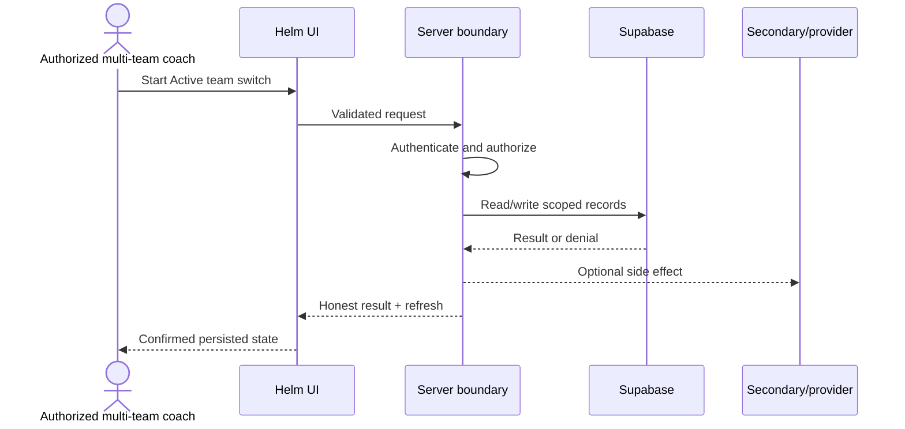

### Happy path

1. Load Team A
2. Select Team B
3. Server validates membership and writes active context
4. Client optimistically changes shell
5. router.refresh re-renders all Server Components
6. Reload and second tab converge

### Success criteria and Playwright assertions

- No Team A record remains in Team B DOM, responses, cache, or writes.
- Assert page URL/modal/toast/disabled state, then reload and assert the same domain state.
- Assert expected request status/body and fail on unhandled exceptions, hydration errors, unexpected 401/403/500, CORS failures, or request loops.
- Query exact fixture ids: correct team/organization/player/creator/status and dependent-row counts; assert zero foreign-tenant and duplicate rows.

### Failure behavior

- Invalid team id is denied and optimistic state reverts.
- Database/provider fault injection must leave the UI in an error/retry state and preserve a reconcilable database state.
- Authorization failures must not disclose record existence through different status/copy/timing.

### Edge cases

- Back button, parallel tabs, offline during switch, membership removed.
- Small/large iPhone, tablet, desktop; keyboard focus and accessible errors; backward navigation and refresh.

### Evidence

- [src/components/golf/TeamSwitcher.tsx](https://github.com/njrini99-code/helmv3/blob/887218526e4ee98f013a30378105fe012af88307/src/components/golf/TeamSwitcher.tsx)
- [src/app/golf/actions/team-switcher.ts](https://github.com/njrini99-code/helmv3/blob/887218526e4ee98f013a30378105fe012af88307/src/app/golf/actions/team-switcher.ts)
- [src/lib/golf/resolve-team-server.ts](https://github.com/njrini99-code/helmv3/blob/887218526e4ee98f013a30378105fe012af88307/src/lib/golf/resolve-team-server.ts)
- [src/lib/baseball/active-context.ts](https://github.com/njrini99-code/helmv3/blob/887218526e4ee98f013a30378105fe012af88307/src/lib/baseball/active-context.ts)

## WF-ROSTER-01 — Baseball roster add/edit/remove/import (P1)

- **Actors:** Coach with manage_roster/import capability
- **Entry:** /baseball/dashboard/roster; /baseball/dashboard/import
- **Preconditions:** Active team and scoped/non-scoped staff personas.
- **Tables/effects:** baseball_players, baseball_team_members, baseball_import_runs, baseball_import_sources

### Sequence

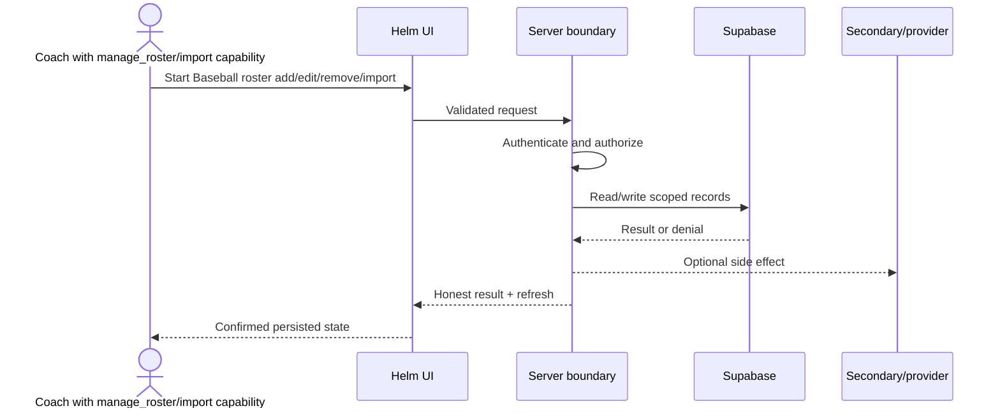

### Happy path

1. Open roster/import
2. Validate fields/file mapping
3. withBaseballAction validates capability/team
4. Create/update player and membership or stage import
5. Commit valid staged records
6. Refresh counts/list

### Success criteria and Playwright assertions

- Correct team membership and stable player identity; exact counts across pages.
- Assert page URL/modal/toast/disabled state, then reload and assert the same domain state.
- Assert expected request status/body and fail on unhandled exceptions, hydration errors, unexpected 401/403/500, CORS failures, or request loops.
- Query exact fixture ids: correct team/organization/player/creator/status and dependent-row counts; assert zero foreign-tenant and duplicate rows.

### Failure behavior

- Invalid/duplicate/foreign player data leaves no orphan profile/membership.
- Database/provider fault injection must leave the UI in an error/retry state and preserve a reconcilable database state.
- Authorization failures must not disclose record existence through different status/copy/timing.

### Edge cases

- >1,000 players, page-2 sort, concurrent edit/remove, retry.
- Small/large iPhone, tablet, desktop; keyboard focus and accessible errors; backward navigation and refresh.

### Evidence

- [src/app/baseball/actions/roster.ts](https://github.com/njrini99-code/helmv3/blob/887218526e4ee98f013a30378105fe012af88307/src/app/baseball/actions/roster.ts)
- [src/app/baseball/actions/imports.ts](https://github.com/njrini99-code/helmv3/blob/887218526e4ee98f013a30378105fe012af88307/src/app/baseball/actions/imports.ts)
- [src/app/baseball/(dashboard)/dashboard/roster/RosterClient.tsx](https://github.com/njrini99-code/helmv3/blob/887218526e4ee98f013a30378105fe012af88307/src/app/baseball/%28dashboard%29/dashboard/roster/RosterClient.tsx)

## WF-PRACTICE-01 — Baseball practice create/edit/delete (P1)

- **Actors:** Staff with manage_practice
- **Entry:** /baseball/dashboard/practice
- **Preconditions:** Active team, roster, season, drill/objective fixture.
- **Tables/effects:** baseball_practices, baseball_practice_blocks, baseball_practice_block_objectives, baseball_practice_lineup_slots, baseball_practice_scrimmages

### Sequence

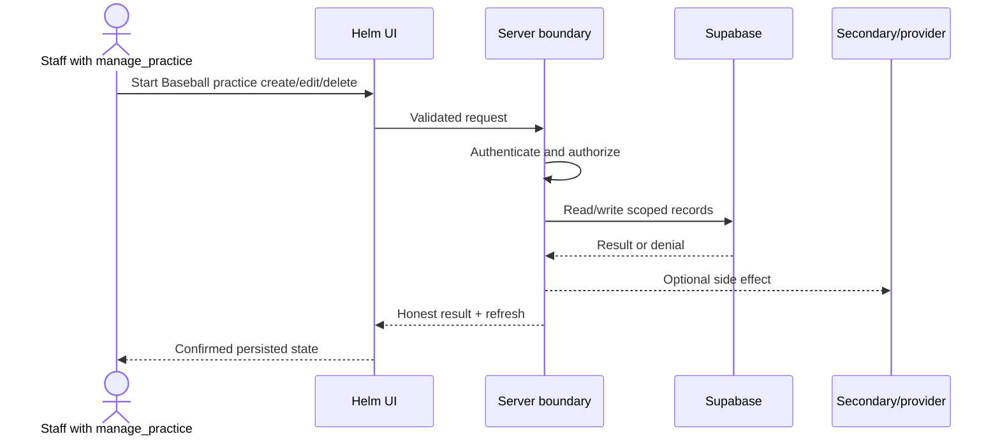

### Happy path

1. Create practice metadata
2. Add blocks/objectives/lineup/scrimmage/players
3. Capability and player-scope checks
4. Persist parent/dependents
5. Revalidate coach and player views

### Success criteria and Playwright assertions

- Reload reproduces exact practice structure and player assignments.
- Assert page URL/modal/toast/disabled state, then reload and assert the same domain state.
- Assert expected request status/body and fail on unhandled exceptions, hydration errors, unexpected 401/403/500, CORS failures, or request loops.
- Query exact fixture ids: correct team/organization/player/creator/status and dependent-row counts; assert zero foreign-tenant and duplicate rows.

### Failure behavior

- Partial block/attendance failure must be visible; unauthorized direct action denied.
- Database/provider fault injection must leave the UI in an error/retry state and preserve a reconcilable database state.
- Authorization failures must not disclose record existence through different status/copy/timing.

### Edge cases

- Duplicate/copy, time-zone date, edit deleted practice, mobile editor overflow.
- Small/large iPhone, tablet, desktop; keyboard focus and accessible errors; backward navigation and refresh.

### Evidence

- [src/app/baseball/actions/practice.ts](https://github.com/njrini99-code/helmv3/blob/887218526e4ee98f013a30378105fe012af88307/src/app/baseball/actions/practice.ts)
- [src/app/baseball/actions/practice-scrimmage.ts](https://github.com/njrini99-code/helmv3/blob/887218526e4ee98f013a30378105fe012af88307/src/app/baseball/actions/practice-scrimmage.ts)

## WF-STATS-01 — Baseball box score and event import (P0)

- **Actors:** Staff with manage_stats/imports
- **Entry:** /baseball/dashboard/stats/games/[gameId]; /baseball/dashboard/import
- **Preconditions:** Team/season/game/roster; scoped staff without stats capability negative persona.
- **Tables/effects:** baseball_games, baseball_box_score_batting, baseball_box_score_pitching, baseball_*_events, baseball_player_season_stats

### Sequence

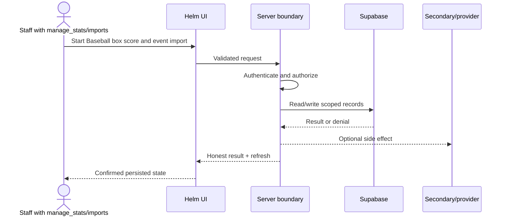

### Happy path

1. Enter/upload stats
2. Validate roster and event grain
3. Action wrapper checks capability
4. Atomic RPC writes box score/event rows
5. Recalculate aggregates
6. Revalidate stats pages

### Success criteria and Playwright assertions

- Exact player/game totals and no duplicate import; direct RPC matches action authorization.
- Assert page URL/modal/toast/disabled state, then reload and assert the same domain state.
- Assert expected request status/body and fail on unhandled exceptions, hydration errors, unexpected 401/403/500, CORS failures, or request loops.
- Query exact fixture ids: correct team/organization/player/creator/status and dependent-row counts; assert zero foreign-tenant and duplicate rows.

### Failure behavior

- Malformed/duplicate file and RPC denial produce no partial aggregate drift.
- Database/provider fault injection must leave the UI in an error/retry state and preserve a reconcilable database state.
- Authorization failures must not disclose record existence through different status/copy/timing.

### Edge cases

- Retry, wrong team_id/player_id, page >1, conflicting prior stats.
- Small/large iPhone, tablet, desktop; keyboard focus and accessible errors; backward navigation and refresh.

### Evidence

- [src/app/baseball/actions/games.ts](https://github.com/njrini99-code/helmv3/blob/887218526e4ee98f013a30378105fe012af88307/src/app/baseball/actions/games.ts)
- [src/app/baseball/actions/stat-event-imports.ts](https://github.com/njrini99-code/helmv3/blob/887218526e4ee98f013a30378105fe012af88307/src/app/baseball/actions/stat-event-imports.ts)
- [docs/baseball/stats-architecture.md](https://github.com/njrini99-code/helmv3/blob/887218526e4ee98f013a30378105fe012af88307/docs/baseball/stats-architecture.md)

## WF-CAL-01 — Golf one-off event and RSVP (P1)

- **Actors:** Golf coach; player
- **Entry:** /golf/dashboard/calendar; /golf/dashboard/hub
- **Preconditions:** Team roster and coach/player personas.
- **Tables/effects:** golf_events, golf_event_attendance, golf_calendar_notifications

### Sequence

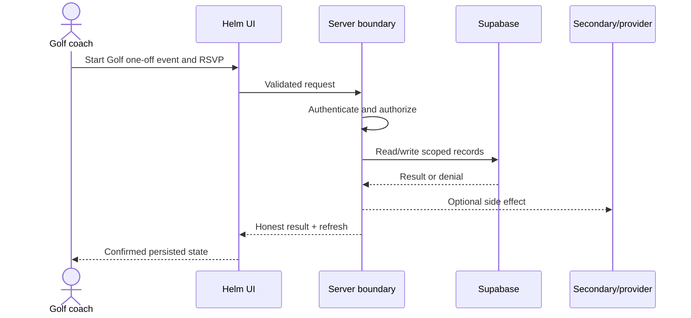

### Happy path

1. Coach creates confirmed event
2. Optional attendance invitations are added
3. after() queues in-app/email/push
4. Player submits/changes RSVP
5. Coach tracks attendance
6. Reload reconciles

### Success criteria and Playwright assertions

- Event and own RSVP have correct team/player/status/deadline; notifications are separately verified.
- Assert page URL/modal/toast/disabled state, then reload and assert the same domain state.
- Assert expected request status/body and fail on unhandled exceptions, hydration errors, unexpected 401/403/500, CORS failures, or request loops.
- Query exact fixture ids: correct team/organization/player/creator/status and dependent-row counts; assert zero foreign-tenant and duplicate rows.

### Failure behavior

- Notification failure cannot erase event but must be observable; invalid end time denied.
- Database/provider fault injection must leave the UI in an error/retry state and preserve a reconcilable database state.
- Authorization failures must not disclose record existence through different status/copy/timing.

### Edge cases

- No attendees, whole-team event, RSVP deadline/max attendees, cancel/restore/hard delete.
- Small/large iPhone, tablet, desktop; keyboard focus and accessible errors; backward navigation and refresh.

### Evidence

- [src/app/golf/actions/golf.ts](https://github.com/njrini99-code/helmv3/blob/887218526e4ee98f013a30378105fe012af88307/src/app/golf/actions/golf.ts)
- [src/app/golf/actions/attendance.ts](https://github.com/njrini99-code/helmv3/blob/887218526e4ee98f013a30378105fe012af88307/src/app/golf/actions/attendance.ts)
- [src/lib/calendar/rsvp.ts](https://github.com/njrini99-code/helmv3/blob/887218526e4ee98f013a30378105fe012af88307/src/lib/calendar/rsvp.ts)

## WF-CAL-02 — Golf recurring practice create and scoped edit/delete (P0)

- **Actors:** Golf team coach
- **Entry:** /golf/dashboard/calendar; CoachHelm create_recurring_practice
- **Preconditions:** IANA timezone, roster, recurrence rule producing <=26 occurrences.
- **Tables/effects:** golf_events, golf_event_attendance, golf_calendar_notifications

### Sequence

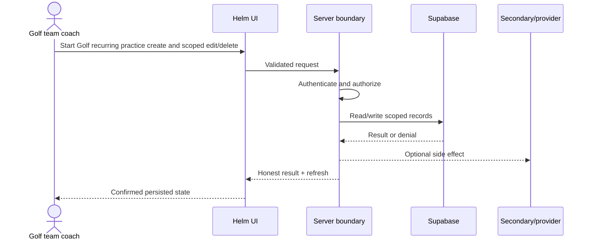

### Happy path

1. Validate RRULE/timezone and active team
2. Insert root with recurrence_rule
3. Insert children with parent_event_id
4. Create attendance rows
5. Choose this/this-and-future/all for edit/delete
6. Promote surviving root before destructive delete
7. Queue cancellation notifications

### Success criteria and Playwright assertions

- Exact series graph/timestamps/attendance; scope changes only intended rows.
- Assert page URL/modal/toast/disabled state, then reload and assert the same domain state.
- Assert expected request status/body and fail on unhandled exceptions, hydration errors, unexpected 401/403/500, CORS failures, or request loops.
- Query exact fixture ids: correct team/organization/player/creator/status and dependent-row counts; assert zero foreign-tenant and duplicate rows.

### Failure behavior

- Generation/child/attendance/root-promotion failures cannot silently wipe survivors or overclaim notification delivery.
- Database/provider fault injection must leave the UI in an error/retry state and preserve a reconcilable database state.
- Authorization failures must not disclose record existence through different status/copy/timing.

### Edge cases

- DST, root occurrence, legacy series heuristic, 26 cap, >1,000 attendance rows, double submit.
- Small/large iPhone, tablet, desktop; keyboard focus and accessible errors; backward navigation and refresh.

### Evidence

- [src/app/golf/actions/recurring-events.ts](https://github.com/njrini99-code/helmv3/blob/887218526e4ee98f013a30378105fe012af88307/src/app/golf/actions/recurring-events.ts)
- [src/app/golf/actions/__tests__/recurring-events.test.ts](https://github.com/njrini99-code/helmv3/blob/887218526e4ee98f013a30378105fe012af88307/src/app/golf/actions/__tests__/recurring-events.test.ts)

## WF-ROUND-01 — Golf partial round save, recovery, and submit (P0)

- **Actors:** Golf player
- **Entry:** /golf/dashboard/rounds/new; continue/[id]; recover/[id]
- **Preconditions:** Player/team/course/tee; 9- and 18-hole fixtures; provider mocks.
- **Tables/effects:** golf_rounds, golf_holes, golf_shots, putt_details, approach_miss_details, golf_*_stats_cache, golf_qualifier_entries

### Sequence

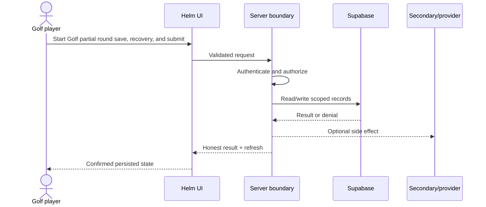

### Happy path

1. Start and auto-save partial data via save_partial_round_atomic
2. Resume owned non-completed round
3. Validate all scores/putts/qualifier constraints
4. submit_round_atomic writes completed round/holes/shots/details
5. Update qualifier stats
6. Refresh caches
7. Queue Inngest/direct CoachHelm analysis and coach push

### Success criteria and Playwright assertions

- One completed round with exact derived totals and children; aggregates/review eventually converge.
- Assert page URL/modal/toast/disabled state, then reload and assert the same domain state.
- Assert expected request status/body and fail on unhandled exceptions, hydration errors, unexpected 401/403/500, CORS failures, or request loops.
- Query exact fixture ids: correct team/organization/player/creator/status and dependent-row counts; assert zero foreign-tenant and duplicate rows.

### Failure behavior

- Double submit rejected; timeout/retry does not duplicate; background failures leave recoverable markers.
- Database/provider fault injection must leave the UI in an error/retry state and preserve a reconcilable database state.
- Authorization failures must not disclose record existence through different status/copy/timing.

### Edge cases

- Offline autosave, concurrent tabs, edited shot, incomplete hole, zero-putt/impossible score, qualifier round cap.
- Small/large iPhone, tablet, desktop; keyboard focus and accessible errors; backward navigation and refresh.

### Evidence

- [src/app/golf/actions/golf.ts](https://github.com/njrini99-code/helmv3/blob/887218526e4ee98f013a30378105fe012af88307/src/app/golf/actions/golf.ts)
- [src/app/golf/actions/round-drafts.ts](https://github.com/njrini99-code/helmv3/blob/887218526e4ee98f013a30378105fe012af88307/src/app/golf/actions/round-drafts.ts)
- [src/lib/cache/golf-stats-calculator.ts](https://github.com/njrini99-code/helmv3/blob/887218526e4ee98f013a30378105fe012af88307/src/lib/cache/golf-stats-calculator.ts)
- [src/lib/coachhelm/v2/post-round-trigger.ts](https://github.com/njrini99-code/helmv3/blob/887218526e4ee98f013a30378105fe012af88307/src/lib/coachhelm/v2/post-round-trigger.ts)

## WF-QUAL-01 — Golf qualifier lifecycle (P1)

- **Actors:** Coach; entered player
- **Entry:** /golf/dashboard/qualifiers; /my-qualifiers
- **Preconditions:** Qualifier with multiple entries/courses/round count.
- **Tables/effects:** golf_qualifiers, golf_qualifier_entries, golf_qualifier_round_courses, golf_qualifier_selections, golf_rounds

### Sequence

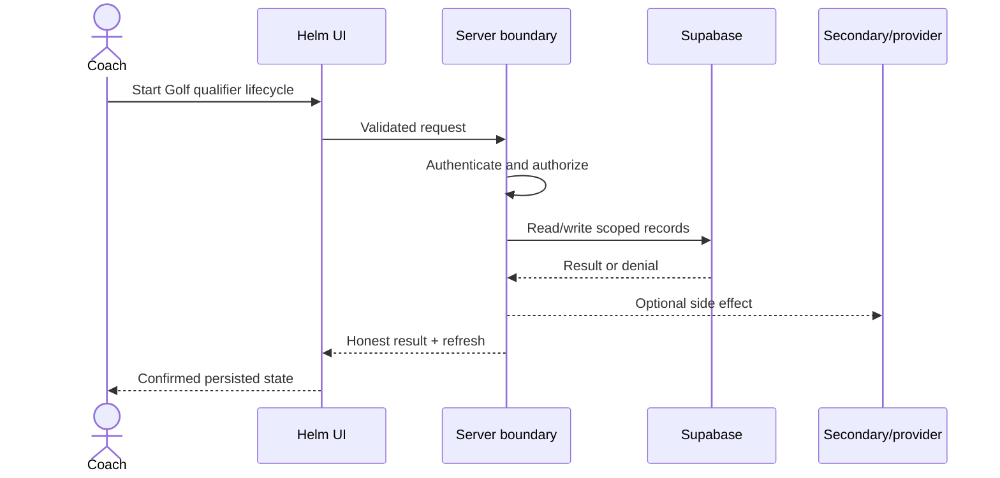

### Happy path

1. Coach creates qualifier and entries
2. Player submits tagged round within count
3. Entry statistics update
4. Realtime/refetch renders standing
5. Coach selects/advances/completes

### Success criteria and Playwright assertions

- Round count, entry aggregates, rank/selection and status agree.
- Assert page URL/modal/toast/disabled state, then reload and assert the same domain state.
- Assert expected request status/body and fail on unhandled exceptions, hydration errors, unexpected 401/403/500, CORS failures, or request loops.
- Query exact fixture ids: correct team/organization/player/creator/status and dependent-row counts; assert zero foreign-tenant and duplicate rows.

### Failure behavior

- Duplicate round number, completed qualifier, non-entry player, foreign team denied.
- Database/provider fault injection must leave the UI in an error/retry state and preserve a reconcilable database state.
- Authorization failures must not disclose record existence through different status/copy/timing.

### Edge cases

- Tie, withdrawal, partial data, realtime absent, concurrent completion.
- Small/large iPhone, tablet, desktop; keyboard focus and accessible errors; backward navigation and refresh.

### Evidence

- [src/app/golf/actions/golf.ts](https://github.com/njrini99-code/helmv3/blob/887218526e4ee98f013a30378105fe012af88307/src/app/golf/actions/golf.ts)
- [src/app/golf/actions/qualifier-progress.ts](https://github.com/njrini99-code/helmv3/blob/887218526e4ee98f013a30378105fe012af88307/src/app/golf/actions/qualifier-progress.ts)
- [src/hooks/golf/use-qualifier-realtime.ts](https://github.com/njrini99-code/helmv3/blob/887218526e4ee98f013a30378105fe012af88307/src/hooks/golf/use-qualifier-realtime.ts)

## WF-DEV-01 — Golf task assignment and player completion (P1)

- **Actors:** Golf coach; assigned player
- **Entry:** /golf/dashboard/tasks; /golf/dashboard/hub; CoachHelm
- **Preconditions:** Team roster with same-name foreign player; task/reminder provider mock.
- **Tables/effects:** golf_tasks, golf_task_assignments, golf_task_reminders

### Sequence

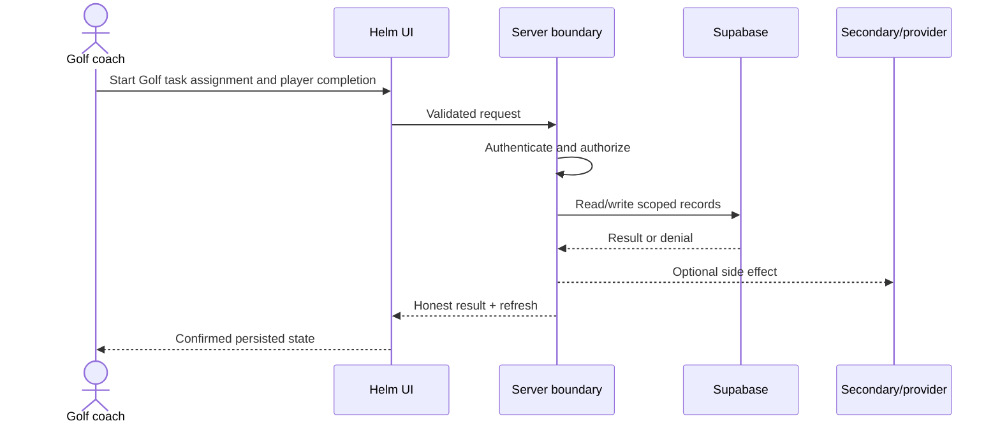

### Happy path

1. Coach creates task
2. Insert one assignment per validated team player
3. Notify best-effort
4. Player lists own assignment
5. Player marks completed
6. Coach derives N-of-M progress
7. Reminder queue dispatches

### Success criteria and Playwright assertions

- Task, assignments and completion match intended team; parent success is not shown when assignments fail.
- Assert page URL/modal/toast/disabled state, then reload and assert the same domain state.
- Assert expected request status/body and fail on unhandled exceptions, hydration errors, unexpected 401/403/500, CORS failures, or request loops.
- Query exact fixture ids: correct team/organization/player/creator/status and dependent-row counts; assert zero foreign-tenant and duplicate rows.

### Failure behavior

- Cross-team ids denied; assignment/notification/reminder second-write failures are explicitly partial and retry-safe.
- Database/provider fault injection must leave the UI in an error/retry state and preserve a reconcilable database state.
- Authorization failures must not disclose record existence through different status/copy/timing.

### Edge cases

- Unassigned team member attempts completion, overdue boundary, duplicate assignment, realtime publication absent.
- Small/large iPhone, tablet, desktop; keyboard focus and accessible errors; backward navigation and refresh.

### Evidence

- [src/app/golf/actions/tasks.ts](https://github.com/njrini99-code/helmv3/blob/887218526e4ee98f013a30378105fe012af88307/src/app/golf/actions/tasks.ts)
- [src/hooks/golf/use-task-realtime.ts](https://github.com/njrini99-code/helmv3/blob/887218526e4ee98f013a30378105fe012af88307/src/hooks/golf/use-task-realtime.ts)
- [src/app/golf/actions/task-reminders.ts](https://github.com/njrini99-code/helmv3/blob/887218526e4ee98f013a30378105fe012af88307/src/app/golf/actions/task-reminders.ts)

## WF-COMM-01 — Announcement and messaging delivery (P0)

- **Actors:** Coach; player recipient/participant
- **Entry:** Baseball/Golf announcements and messages
- **Preconditions:** Two isolated organizations with same-name users/conversations.
- **Tables/effects:** baseball_*announcements/messages/conversations; golf_*announcements/messages/conversations

### Sequence

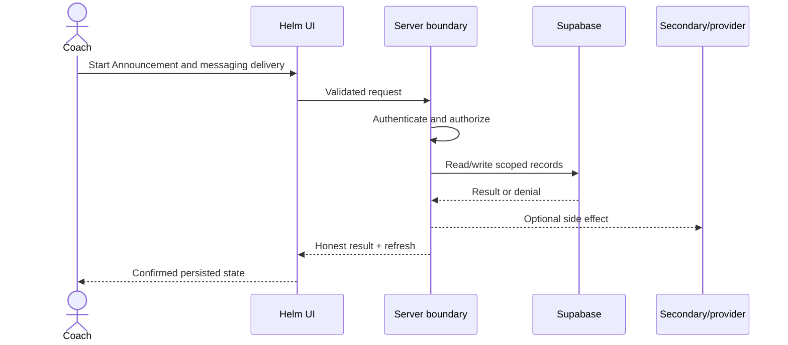

### Happy path

1. Create parent announcement/conversation
2. Validate participants/recipients/team
3. Insert child rows/message
4. Queue notifications/attachments
5. Recipient reads/acknowledges
6. Unread state updates

### Success criteria and Playwright assertions

- Only intended participants can read/write; recipient/ack/unread rows agree.
- Assert page URL/modal/toast/disabled state, then reload and assert the same domain state.
- Assert expected request status/body and fail on unhandled exceptions, hydration errors, unexpected 401/403/500, CORS failures, or request loops.
- Query exact fixture ids: correct team/organization/player/creator/status and dependent-row counts; assert zero foreign-tenant and duplicate rows.

### Failure behavior

- Foreign conversation/recipient ids denied at UI, action, RLS and RPC layers; partial recipient insert is honest.
- Database/provider fault injection must leave the UI in an error/retry state and preserve a reconcilable database state.
- Authorization failures must not disclose record existence through different status/copy/timing.

### Edge cases

- Removed participant, direct deep link, attachment failure, offline retry, duplicate message.
- Small/large iPhone, tablet, desktop; keyboard focus and accessible errors; backward navigation and refresh.

### Evidence

- [src/app/baseball/actions/messages.ts](https://github.com/njrini99-code/helmv3/blob/887218526e4ee98f013a30378105fe012af88307/src/app/baseball/actions/messages.ts)
- [src/app/golf/actions/messages.ts](https://github.com/njrini99-code/helmv3/blob/887218526e4ee98f013a30378105fe012af88307/src/app/golf/actions/messages.ts)
- [src/app/golf/actions/announcements.ts](https://github.com/njrini99-code/helmv3/blob/887218526e4ee98f013a30378105fe012af88307/src/app/golf/actions/announcements.ts)
- [src/hooks/use-messages.ts](https://github.com/njrini99-code/helmv3/blob/887218526e4ee98f013a30378105fe012af88307/src/hooks/use-messages.ts)
- [src/hooks/golf/use-golf-messages.ts](https://github.com/njrini99-code/helmv3/blob/887218526e4ee98f013a30378105fe012af88307/src/hooks/golf/use-golf-messages.ts)

## WF-AI-01 — CoachHelm evidence-backed question (P0)

- **Actors:** Golf team coach
- **Entry:** /golf/dashboard/coachhelm
- **Preconditions:** Team with deterministic rounds/cache/players; fake model transcript.
- **Tables/effects:** golf_coachhelm_chat_conversations/messages/llm_calls/budget; domain read tables

### Sequence

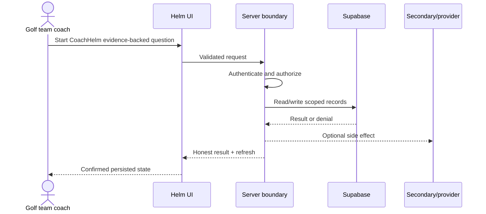

### Happy path

1. Resolve authenticated coach and active team
2. Persist/reuse conversation/client_turn_id
3. Model selects one of 13 read tools
4. Tool validates roster player and loads bounded data
5. Model responds
6. Numeric claim auditor verifies tool support
7. Persist complete or failed message and metering

### Success criteria and Playwright assertions

- Answer names correct player/team/window/sample and every number matches tool data.
- Assert page URL/modal/toast/disabled state, then reload and assert the same domain state.
- Assert expected request status/body and fail on unhandled exceptions, hydration errors, unexpected 401/403/500, CORS failures, or request loops.
- Query exact fixture ids: correct team/organization/player/creator/status and dependent-row counts; assert zero foreign-tenant and duplicate rows.

### Failure behavior

- Unsupported number marks message failed; tool/provider timeout is visible; retry does not duplicate turn.
- Database/provider fault injection must leave the UI in an error/retry state and preserve a reconcilable database state.
- Authorization failures must not disclose record existence through different status/copy/timing.

### Edge cases

- Same player name across orgs, stale team switch, malicious database text, long history/truncation, stream interruption.
- Small/large iPhone, tablet, desktop; keyboard focus and accessible errors; backward navigation and refresh.

### Evidence

- [src/app/api/coachhelm/v3/chat/stream/route.ts](https://github.com/njrini99-code/helmv3/blob/887218526e4ee98f013a30378105fe012af88307/src/app/api/coachhelm/v3/chat/stream/route.ts)
- [src/lib/coachhelm/v3/chat/read-tools.ts](https://github.com/njrini99-code/helmv3/blob/887218526e4ee98f013a30378105fe012af88307/src/lib/coachhelm/v3/chat/read-tools.ts)
- [src/lib/coachhelm/v3/chat/instructions.ts](https://github.com/njrini99-code/helmv3/blob/887218526e4ee98f013a30378105fe012af88307/src/lib/coachhelm/v3/chat/instructions.ts)

## WF-AI-02 — CoachHelm confirmed action (P0)

- **Actors:** Golf team coach
- **Entry:** Chat action proposal
- **Preconditions:** Deterministic player/team/action ledger; failure injection for each child side effect.
- **Tables/effects:** golf_coachhelm_action_runs plus focus area/task/announcement/event tables

### Sequence

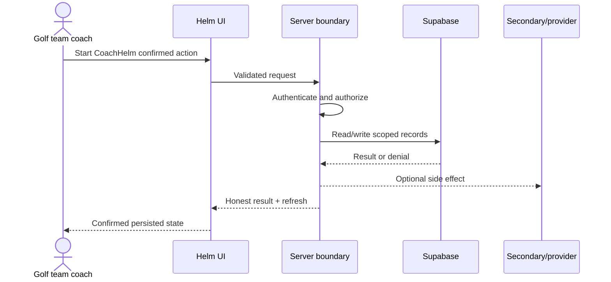

### Happy path

1. Model emits narrow action input
2. Server builds preview and proposed action run
3. UI asks approval
4. Approve/deny
5. Server claims idempotency key
6. Existing domain action executes
7. Receipt/deep link persisted and UI verifies database

### Success criteria and Playwright assertions

- One terminal ledger row and exactly one intended domain result; denial creates none.
- Assert page URL/modal/toast/disabled state, then reload and assert the same domain state.
- Assert expected request status/body and fail on unhandled exceptions, hydration errors, unexpected 401/403/500, CORS failures, or request loops.
- Query exact fixture ids: correct team/organization/player/creator/status and dependent-row counts; assert zero foreign-tenant and duplicate rows.

### Failure behavior

- Reload/deny/retry/secondary-write failure remains actionable and honest.
- Database/provider fault injection must leave the UI in an error/retry state and preserve a reconcilable database state.
- Authorization failures must not disclose record existence through different status/copy/timing.

### Edge cases

- Approval from another session/user, modified player id, timeout after write before receipt, double approval.
- Small/large iPhone, tablet, desktop; keyboard focus and accessible errors; backward navigation and refresh.

### Evidence

- [src/lib/coachhelm/v3/chat/agent-tools.ts](https://github.com/njrini99-code/helmv3/blob/887218526e4ee98f013a30378105fe012af88307/src/lib/coachhelm/v3/chat/agent-tools.ts)
- [src/lib/coachhelm/v3/chat/action-runs.ts](https://github.com/njrini99-code/helmv3/blob/887218526e4ee98f013a30378105fe012af88307/src/lib/coachhelm/v3/chat/action-runs.ts)
- [src/test/coachhelm/v3/chat-approval-delivery.test.ts](https://github.com/njrini99-code/helmv3/blob/887218526e4ee98f013a30378105fe012af88307/src/test/coachhelm/v3/chat-approval-delivery.test.ts)

## WF-LIFT-01 — Lifting program assignment and session completion (P1)

- **Actors:** Lifting coach; athlete
- **Entry:** /lifting/dashboard/programs; /lifting/dashboard/today; /sessions/live
- **Preconditions:** Lifting org, coach, athlete/group, exercises.
- **Tables/effects:** helm_lifting_programs/weeks/days/sections/prescriptions/assignments/sessions/set_results/prs

### Sequence

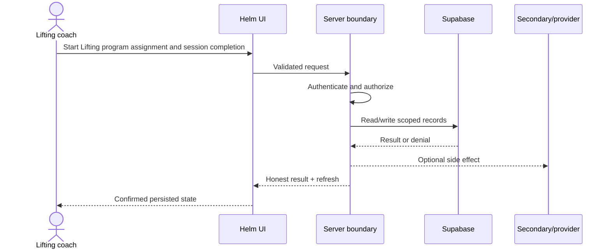

### Happy path

1. Coach builds program
2. Assign to athlete/group
3. Athlete opens today/session
4. Record sets/results
5. Complete session
6. PR/max/readiness surfaces update
7. Live room receives events

### Success criteria and Playwright assertions

- Athlete sees only own assignment; recorded sets persist; coach receives correct live/summary view.
- Assert page URL/modal/toast/disabled state, then reload and assert the same domain state.
- Assert expected request status/body and fail on unhandled exceptions, hydration errors, unexpected 401/403/500, CORS failures, or request loops.
- Query exact fixture ids: correct team/organization/player/creator/status and dependent-row counts; assert zero foreign-tenant and duplicate rows.

### Failure behavior

- Viewer/no-edit/foreign athlete writes denied; offline retry does not duplicate sets.
- Database/provider fault injection must leave the UI in an error/retry state and preserve a reconcilable database state.
- Authorization failures must not disclose record existence through different status/copy/timing.

### Edge cases

- Exercise substitution, group membership change, bridge organization, reconnect.
- Small/large iPhone, tablet, desktop; keyboard focus and accessible errors; backward navigation and refresh.

### Evidence

- [src/app/lifting/actions/programs.ts](https://github.com/njrini99-code/helmv3/blob/887218526e4ee98f013a30378105fe012af88307/src/app/lifting/actions/programs.ts)
- [src/app/lifting/actions/assignments.ts](https://github.com/njrini99-code/helmv3/blob/887218526e4ee98f013a30378105fe012af88307/src/app/lifting/actions/assignments.ts)
- [src/app/lifting/actions/sessions.ts](https://github.com/njrini99-code/helmv3/blob/887218526e4ee98f013a30378105fe012af88307/src/app/lifting/actions/sessions.ts)
- [src/components/lifting/sessions/LiveWeightRoomClient.tsx](https://github.com/njrini99-code/helmv3/blob/887218526e4ee98f013a30378105fe012af88307/src/components/lifting/sessions/LiveWeightRoomClient.tsx)

## WF-BILL-01 — Admin one-off invoice (P1)

- **Actors:** Platform super-admin
- **Entry:** /admin/billing
- **Preconditions:** Stripe test mode only; signed webhook fixtures; isolated DB after schema decision.
- **Tables/effects:** No live billing table; local billing migration only

### Sequence

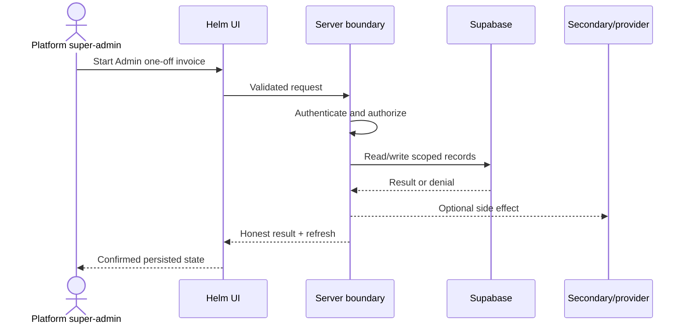

### Happy path

1. Super-admin submits invoice
2. Server calls Stripe
3. Provider returns invoice
4. Signed webhook reaches handler
5. Expected persistence/state transition

### Success criteria and Playwright assertions

- Provider test invoice and persisted state agree once implemented.
- Assert page URL/modal/toast/disabled state, then reload and assert the same domain state.
- Assert expected request status/body and fail on unhandled exceptions, hydration errors, unexpected 401/403/500, CORS failures, or request loops.
- Query exact fixture ids: correct team/organization/player/creator/status and dependent-row counts; assert zero foreign-tenant and duplicate rows.

### Failure behavior

- Current webhook TODO/live-schema gap must be reported as partial; never invoke production Stripe.
- Database/provider fault injection must leave the UI in an error/retry state and preserve a reconcilable database state.
- Authorization failures must not disclose record existence through different status/copy/timing.

### Edge cases

- Duplicate webhook, bad signature, failed payment, cancellation/upgrade are absent.
- Small/large iPhone, tablet, desktop; keyboard focus and accessible errors; backward navigation and refresh.

### Evidence

- [src/app/admin/actions/billing.ts](https://github.com/njrini99-code/helmv3/blob/887218526e4ee98f013a30378105fe012af88307/src/app/admin/actions/billing.ts)
- [src/app/api/webhooks/stripe/route.ts](https://github.com/njrini99-code/helmv3/blob/887218526e4ee98f013a30378105fe012af88307/src/app/api/webhooks/stripe/route.ts)
- [supabase/migrations/20260715120000_billing_invoices_stripe.sql](https://github.com/njrini99-code/helmv3/blob/887218526e4ee98f013a30378105fe012af88307/supabase/migrations/20260715120000_billing_invoices_stripe.sql)
