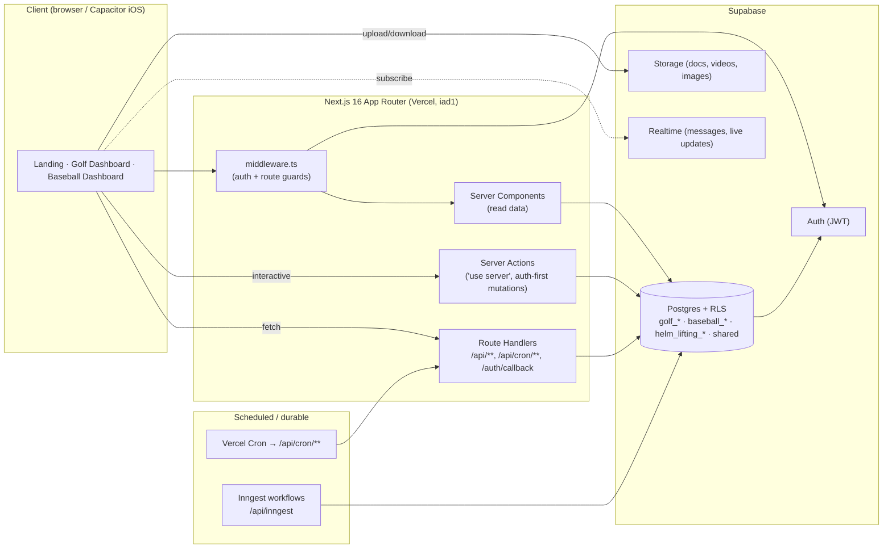

# Helm Systems & Data Map

> **What this is:** a one-page orientation to how Helm Sports Labs fits together end-to-end — the request path, the multi-tenant data model, and which product surface talks to which tables and integrations. It is a **map to the maps**: where a claim needs full detail, this doc points you to the authoritative source rather than duplicating it (the codebase is ~1,752 files / 3.4M tokens per the Codebase Map).
>
> **Audiences:** a non-technical partner (read the prose + tables) and an AI agent / n8n automation (use the pointer tables + "For Mission Control").
>
> **Ground-truth sources this doc summarizes:** [.devin/wiki.json](../../../.devin/wiki.json), [docs/CODEBASE_MAP.md](../../CODEBASE_MAP.md), [docs/archive/2026-01/architecture/ROUTE_INVENTORY.md](../../archive/2026-01/architecture/ROUTE_INVENTORY.md) (archived, stale), [memory/context/golfhelm-database.md](../../../memory/context/golfhelm-database.md), [memory/context/baseballhelm-database.md](../../../memory/context/baseballhelm-database.md), [memory/glossary.md](../../../memory/glossary.md).
>
> **No secrets, tokens, connection strings, or PII live in this doc — pointers only.**

---

## 1. The 30-second picture

**Helm Sports Labs** is a multi-sport SaaS platform. One Next.js codebase, one Supabase database, two products plus a shared strength-training system:

| Product | What it does | Prefix |
|---------|--------------|--------|
| **GolfHelm** | College golf team management + the **CoachHelm** AI intelligence layer (insights, patterns, predictions, round reviews) | `golf_*` |
| **BaseballHelm** | College baseball recruiting (coaches ↔ players) + team management | `baseball_*` |
| **Lift Lab** | Sport-agnostic strength/lifting system (shared identity, not a baseball rename). Exists in two forms — see §4. | `helm_lifting_*` |

**Stack:** Next.js 16 (App Router) · TypeScript strict · Supabase (Postgres + RLS, Auth, Storage, Realtime) · Tailwind · Framer Motion · Vercel (region `iad1`) · Inngest (durable workflows).

---

## 2. The request path (client → server → data → edge)



**Rules that make this path work (enforced in review):**
- Server client is `await createClient()` from [src/lib/supabase/server.ts](../../../src/lib/supabase/server.ts); client client is `createClient()` (no await) from [src/lib/supabase/client.ts](../../../src/lib/supabase/client.ts). Route guards in [src/lib/supabase/middleware.ts](../../../src/lib/supabase/middleware.ts).
- Server actions **auth before any DB call**, then `revalidatePath()`.
- Security is defense-in-depth: middleware guards routes, **RLS is the real boundary** in Postgres, and server actions re-check auth. Never rely on the UI alone.
- Types come from **one place**: [src/lib/types/index.ts](../../../src/lib/types/index.ts) (re-exports the generated [src/lib/types/database.ts](../../../src/lib/types/database.ts)). Never `@/types/database`.

---

## 3. Tenancy model (org → team → coach/player)

The whole platform hangs off one shared, **non**-sport-prefixed `organizations` table; everything else is sport-prefixed and reached through a team.

```
organizations  (shared — id, name, type: college|juco|high_school|showcase)
      │ organization_id  (nullable FK on each team)
      ├───────────────────────────────┬───────────────────────────────
      ▼                               ▼
  golf_teams                      baseball_teams
      │                               │
  coach ┤ golf_team_coach_staff   coach ┤ baseball_team_coach_staff
  player┤ golf_team_members       player┤ baseball_team_members
```

| Concept | Golf | Baseball | Notes |
|--------|------|----------|-------|
| Coach ↔ team | `golf_team_coach_staff` | `baseball_team_coach_staff` | Baseball's version is far richer (per-capability booleans like `can_manage_roster/lifting/imports/…`); golf's is minimal. **Team access flows through this join, not a column on the coach.** |
| Player ↔ team | `golf_team_members` | `baseball_team_members` | Both `.status` columns reuse the **shared** `team_member_status` DB enum (`pending·active·inactive·removed`). |
| Access enforcement | RLS helper fns: `is_golf_team_coach()`, `is_golf_team_player()`, `is_golf_team_head_coach()` | `is_baseball_team_coach()`, `is_baseball_team_member()`, `is_baseball_team_player()` | See the function list in [memory/glossary.md](../../../memory/glossary.md). |
| Roles | `user_role` enum: `coach · player · admin` | same | One shared enum. |

**Known tenancy caveats (do not treat as bugs to "fix" without reading source):**
- `baseball_players` has **no** team/org column — a player attaches only via the `baseball_team_members` join row (its only FK is `user_id → auth.users.id`).
- `baseball_players` SELECT is `USING (true)` for any authenticated user. The DB doc flags this as its **single most consequential live security finding** (Gotcha G6) — it exposes PII (email, phone, GPA, SAT/ACT) platform-wide and contradicts the opt-in recruiting model, so treat it as a concern to verify, **not** an intended design. `baseball_player_percentiles` SELECT is likewise `USING (true)` but lower-severity (percentile rows, no PII) and *may* be intentional platform-wide recruiting data. Both flagged in [memory/context/baseballhelm-database.md](../../../memory/context/baseballhelm-database.md) (Gotcha G6).
- Baseball app code currently assumes **one team per organization** even though the schema doesn't enforce it.

---

## 4. Products → surfaces → tables → integrations → telemetry

| Product / layer | Key surfaces (routes) | Primary tables | Integrations | Telemetry |
|---|---|---|---|---|
| **GolfHelm — team ops** | `/golf/dashboard` · `/roster` · `/calendar` · `/messages` · `/announcements` · `/tasks` · `/documents` · `/travel` | `golf_teams`, `golf_team_members`, `golf_events`, `golf_messages`, `golf_announcements`, `golf_tasks`, `golf_documents`, `golf_travel_itineraries` | Supabase Realtime (messages), Storage (docs), Mapbox (travel), iCal feeds | Sentry Replay; `admin_*` rollups |
| **GolfHelm — play & stats** | `/rounds/new` · `/rounds/[id]` · `/rounds/[id]/review` · `/stats` · `/qualifiers` | `golf_rounds`, `golf_holes`, `golf_shots`, `golf_player_stats_cache`, `golf_round_reviews`, `golf_qualifiers`, `golf_qualifier_entries` | SG engine (DB functions `calculate_round_strokes_gained`, `submit_round_atomic`) | `golf_platform_metrics_daily`, stats-cache freshness |
| **CoachHelm AI** (golf) | `/dashboard/intelligence` · `/insights` · `/patterns` · `/alerts` · `/coachhelm` (player) | `golf_coach_philosophy`, `golf_coach_insights`, `golf_patterns_v2`, `golf_predictions`, `golf_validations`, `golf_player_genome`, `golf_coachhelm_llm_calls/budget` | LLM via CoachHelm engine ([src/lib/coachhelm/](../../../src/lib/coachhelm/)); Promptfoo evals | `golf_coachhelm_llm_budget`, `golf_insight_effectiveness`, `get_admin_coachhelm_rollup()` |
| **BaseballHelm — recruiting** | `/baseball/dashboard/discover · /watchlist · /pipeline · /compare · /camps` | `baseball_players`, `baseball_watchlists`, `baseball_coach_recruiting_philosophy`, `baseball_player_percentiles` | Match scoring ([src/lib/recruiting/](../../../src/lib/recruiting/)) | `baseball_player_engagement_events` |
| **BaseballHelm — team ops** | `/baseball/dashboard/roster · /calendar · /messages · /videos · /analytics` | `baseball_teams`, `baseball_team_members`, `baseball_events`, `baseball_messages`, `baseball_videos`, `baseball_player_season_stats` | Storage (videos) | `get_admin_baseball_rollup()` |
| **Lift Lab** (cross-sport) | Standalone product at `/lifting/**`; **plus** an embedded Lift Lab under baseball at `/baseball/dashboard/performance/**` | Standalone: `helm_lifting_*` (40 tables — identity, sessions, soreness/weight/nutrition). Embedded: `baseball_lift_*` / `baseball_strength_*`. | One-time, one-directional backfill `baseball_lift_*` → `helm_lifting_*` (the two families are **not** kept in sync going forward — Gotcha G1) | — |
| **CRM / outreach** (internal) | `/api/crm/**`, `/api/cron/process-sequences` | `crm_coaches`, `crm_sequences`, `crm_email_templates`, `crm_events`, `email_events` | Resend / Gmail (send), Google Calendar tokens | `crm_coach_engagement` view, email open/click events |
| **Admin / platform** | `/golf/admin` | `admin_analytics_events`, `admin_api_perf_log`, `admin_client_errors`, `error_logs`, `api_call_logs`, `auth_metrics_hourly` | `get_admin_*_rollup()` DB functions | this **is** the telemetry layer |

*Table names above are verified against [memory/glossary.md](../../../memory/glossary.md), the `*-database.md` context docs, and/or the generated `src/lib/types/database.ts` (the `helm_lifting_*` family is only in the latter two — see §6). For every column of every table, use the `*-database.md` files.*

---

## 5. Scheduled & durable work (the "edge/cron" tier)

Two mechanisms, both pointing at the same Postgres:

- **Vercel Cron** → HTTP `GET /api/cron/**` route handlers. Defined in [vercel.json](../../../vercel.json) (**14 entries** as of this writing), e.g. `coachhelm-validation` (Sun 06:00), `coachhelm-calibration` (daily 03:30), `event-reminders` / `task-reminders` (hourly), `coach-morning-digest`, and the v3 batch (`v3/standing-refresh`, `v3/genome-nightly`, `v3/causality-attribute`, `v3/weekly-coach-email`, `v3/goal-suggestions-write`, `v3/goal-suggestions-evaluate`). Live handlers live under [src/app/api/cron/](../../../src/app/api/cron/).
- **Inngest** (durable workflows, retries) → client [src/lib/inngest/client.ts](../../../src/lib/inngest/client.ts), functions [src/lib/inngest/functions.ts](../../../src/lib/inngest/functions.ts), handler [src/app/api/inngest/route.ts](../../../src/app/api/inngest/route.ts). Intended home for the heavy weekly backfills (W12/W20/W27/W33/W35); currently a scheduled health-ping scaffold (`weeklyHealthPing`) with commented-out example workflows, not yet a live backfill.

---

## 6. Where the authoritative maps already live

Point automations and agents **here** instead of re-deriving structure. Note the "freshness" column — several maps are point-in-time snapshots and drift.

| Map | Path | What it authoritatively contains | Freshness |
|---|---|---|---|
| **Devin's wiki** | [.devin/wiki.json](../../../.devin/wiki.json) | Machine-readable index: 5 `repo_notes` (stack, priority feature areas, code roots, key docs, known product risks) + **15 titled wiki pages** with purposes/parent hierarchy (Architecture Overview, Feature Awareness, Golf Dashboard Routes, CoachHelm AI Engine, Coach Intelligence Triage, Player CoachHelm & Development, Shot Tracking & Round Lifecycle, Stats & Analytics, Qualifiers, Calendar & Events, Team Comms & Ops, Roster/Auth/Access Control, Settings & Admin, Supabase Schema/RLS/Migrations, Testing/CI & Review Gates). **Best "what matters and why" index.** | Living (Devin-generated) |
| **Codebase Map** | [docs/CODEBASE_MAP.md](../../CODEBASE_MAP.md) | Cartographer system overview: directory tree, module guide (`app/`, `components/`, `lib/`, `hooks/`, `supabase/`, tools, AI systems), Supabase-client + server-action patterns, design tokens, gotchas, navigation guide, and **mermaid** system + auth + recruiting + CoachHelm flow diagrams. Reports 1,752 files / 3.4M tokens. **Best "where does code live + how do I add a feature" map.** | Mapped **2026-01-13** |
| **Route Inventory** | [docs/archive/2026-01/architecture/ROUTE_INVENTORY.md](../../archive/2026-01/architecture/ROUTE_INVENTORY.md) | Every page/layout/route group, protection status, loading/error coverage, orphaned pages, broken links, middleware public/role-restricted route lists. **Archived — its "API Routes = 3" is stale;** the repo now has ~45 `/api/**` `route.ts` handlers incl. `/api/cron/**` (see §5). No fresher route inventory exists; treat as historical reference only. | Generated **2026-01-01**, archived 2026-07 |
| **Golf DB schema** | [memory/context/golfhelm-database.md](../../../memory/context/golfhelm-database.md) | Every column of every `golf_*` table (from the live production DB). Header count: **76** `golf_*` tables. | Verified **2026-04-21** (live DB query) |
| **Baseball DB schema** | [memory/context/baseballhelm-database.md](../../../memory/context/baseballhelm-database.md) | `baseball_*` (**119**) + `helm_lifting_*` (**40**) tables, tenancy chain, enums, RLS helpers, and **9 "gotchas" (G0–G8)**. Mined from **migrations**, not a live query — so "the migration exists" is necessary, not sufficient, proof it's live (Gotcha G8). | Mined **2026-06-30** |
| **Glossary** | [memory/glossary.md](../../../memory/glossary.md) | Decoder ring: table-name rule, tables-by-role, enums, TypeScript type locations, and an **AUTOGEN inventory** (181 tables / 2 views / 106 functions / 7 enums, sourced from `database.ts`). **The AUTOGEN block is stale** — it lists only 47 `baseball_*` tables and **no** `helm_lifting_*` tables, so it lags the migrations and the current `database.ts` (Gotcha G7). | AUTOGEN + curated; narrative last updated **2026-02-13** |
| **Feature registry & context** | [memory/registry.yml](../../../memory/registry.yml), [memory/context/golfhelm-features.md](../../../memory/context/golfhelm-features.md), [memory/context/coachhelm-ai.md](../../../memory/context/coachhelm-ai.md), [memory/projects/golfhelm.md](../../../memory/projects/golfhelm.md) | Code-path → feature routing, 28 golf feature deep-dives, CoachHelm V2 engine internals, all routes/action files/hooks. | Living |

**Reconciling the counts (they differ by scope *and* date — treat none as a live number):** the golf-DB doc's **76** counts only `golf_*` (as of 2026-04-21); the baseball-DB doc's **119 + 40** counts `baseball_*` and `helm_lifting_*` mined from migrations (2026-06-30); the glossary's AUTOGEN **181** is meant to be the whole DB from `database.ts` but is itself out of date — it predates the `helm_lifting_*` family and most post-baseline `baseball_*` tables (Gotcha G7), so `database.ts` today actually holds materially more tables than 181. **For an exact live number, regenerate the inventory (`npm run docs:regen`) and/or query the production DB — do not treat any single narrative count (including the glossary AUTOGEN) as authoritative.**

---

## 7. For Mission Control

**n8n (automation):**
- To discover structure without crawling 1,752 files, read the machine-readable indexes first: [.devin/wiki.json](../../../.devin/wiki.json) (page index) and the AUTOGEN block in [memory/glossary.md](../../../memory/glossary.md) (table/function/enum inventory — but see the staleness caveat in §6). Parse these; don't scrape code.
- To act on data, prefer the documented DB functions (e.g. `get_admin_*_rollup()`, `get_qualifier_leaderboard()`) and respect RLS — service-role access bypasses tenancy and must never be exposed client-side.
- Scheduled jobs already exist in [vercel.json](../../../vercel.json) and Inngest; add new recurring work as an Inngest function or a `/api/cron/**` handler, not a new external scheduler, so it inherits auth + observability.

**Huly (project/issue tracking):**
- Map issues to the feature areas named in `.devin/wiki.json` `repo_notes` and [memory/registry.yml](../../../memory/registry.yml) so tickets carry the same taxonomy as the code (CoachHelm AI, Shot Tracking, Calendar, Roster/Access Control, etc.).
- Use the "known product risks" in `.devin/wiki.json` and the DB-doc gotchas as a standing risk register (no DELETE-then-INSERT in save/sync paths; unscoped `USING (true)` SELECT on recruiting tables; migration-exists ≠ applied-in-prod; dual/unsynced Lift Lab schemas).

**Greptile (whole-codebase review):**
- This doc is a pointer, not a spec. Greptile's project context lives in [.greptile/config.json](../../../.greptile/config.json) (its `instructions` field + `rules` array + ignore patterns) with the high-signal review-context files listed in [.greptile/files.json](../../../.greptile/files.json), and the human-readable hard-rule set in [.greptile/rules.md](../../../.greptile/rules.md). Use **this** map to orient a review (request path, tenancy, product→table ownership) and **those** files to block on violations (service-role in client bundle, missing RLS on new tables, server action without auth, sport-prefix violations, destructive DELETE-then-INSERT, out-of-enum pipeline-stage writes, client-side LLM calls, edits to baseline migrations).
- When code and this map disagree, the code + the `*-database.md` / `database.ts` sources win; open a docs-drift note rather than trusting the prose here.
