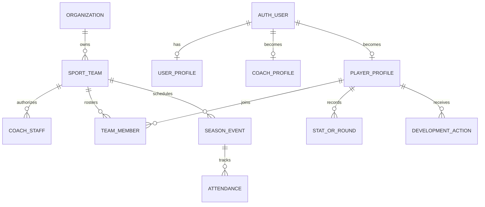

# Helm Database Map

## Live snapshot

Project `qmnssrrolpinvwjjnufo` (`Helm-Production`, PostgreSQL 17.6, `us-east-1`) had 264 public tables, 940 public RLS policies, 267 public functions, 7 views/materialized views, 1281 indexes, and 8 storage buckets at 2026-07-26T18:09:16.649216+00:00. All 264 public tables reported RLS enabled.

The application families are 93 `baseball_*` tables, 97 `golf_*` tables, 33 `helm_lifting_*` tables, plus shared/admin/CRM/email tables.

## Core relationship model

Actual table names differ by product: Baseball uses `baseball_teams/team_members/team_coach_staff/players/seasons/events/player_stats`; Golf uses `golf_teams/team_members/team_coach_staff/players/events/rounds`; Lifting uses `helm_lifting_*`. Organizations are shared.

## Views and materialized views

| View | Kind | Security mode | Finding |
| --- | --- | --- | --- |
| baseball_coaches_public | view | Definer/owner semantics | Supabase advisor ERROR: security-definer view |
| baseball_team_coach_staff_public | view | Definer/owner semantics | Supabase advisor ERROR: security-definer view |
| baseball_teams_public_profile | view | Definer/owner semantics | Supabase advisor ERROR: security-definer view |
| crm_coach_engagement | materialized_view | Definer/owner semantics | No specific advisor finding captured |
| crm_email_events | view | Invoker | No specific advisor finding captured |
| organizations_public_profile | view | Definer/owner semantics | Supabase advisor ERROR: security-definer view |
| v_crm_coaches_by_school | view | Invoker | No specific advisor finding captured |

## Enums

| Enum | Values |
| --- | --- |
| admin_event_severity | info, warning, error, critical |
| baseball_coach_type | college, juco, high_school, showcase |
| baseball_note_scope | staff_public, coach_group, strength, academic, player_visible, hidden_from_player |
| baseball_pipeline_stage | watchlist, high_priority, offer_extended, committed, uninterested |
| baseball_player_type | college, juco, high_school, showcase |
| coach_status | new_lead, contacted, engaged, proposal, won, lost, nurture |
| contact_type | email, call, demo, meeting, note |
| crm_event_type | demo, follow_up, call, meeting, email_reminder, other |
| email_status | valid, bounced, complained, unknown, unsubscribed |
| golf_expense_category | lodging, transportation, meals, entry_fees, equipment, other |
| golf_expense_paid_by | team, player, pending_reimbursement, split |
| ncaa_division | D2, D3, D1, NAIA, JUCO, JUCO_D1, JUCO_D2, JUCO_D3, CCCAA |
| notification_type | profile_view, watchlist_add, video_view, message, team_invite, team_join_request, team_join_approved, event_reminder, dev_plan_assigned, team_join, team_join_rejected |
| organization_type | college, juco, high_school, showcase |
| program_type | mens, womens, both |
| reminder_type | in_app, email, push, all |
| team_member_status | pending, active, inactive, removed |
| user_role | coach, player, admin |

## Edge Functions

| Function | Live status | JWT verification | Repository status | Observed purpose and risk |
| --- | --- | --- | --- | --- |
| create-admin-user | Active v5 | Disabled | Absent from repository | Uses service-role admin creation with no request-level authorization in deployed source; orphan P0 |
| send-apns-push | Active v5 | Enabled | Present at supabase/functions/send-apns-push | Sends caller-supplied token/payload; live 410 responses observed; deployed/repo token-deactivation behavior differs |
| personalize-email | Active | Enabled | Present in Supabase function source | Pure email-template personalization path; test with fictional content only |
| verify-emails | Active v4 | Enabled | Absent from repository | Any authenticated caller can trigger service-role CRM batch verification/update in deployed source; orphan P0/P1 |
| process-task-reminders | Not deployed | N/A | Removed from repository 2026-08-01 | Was repository-only and never invoked; reminder scheduling runs through `src/app/api/cron/task-reminders/route.ts`. Deleted as dead code — see #1175 |

Live-only/deployed-source conclusions are supported by the connected Supabase Edge Function list/source. Repository paths exist only for the rows marked present. No function was invoked.

## Storage buckets

| Bucket | Visibility | Size limit | MIME restriction |
| --- | --- | --- | --- |
| avatars | Public | 2097152 | image/jpeg, image/png, image/gif, image/webp |
| baseball-imports | Private | 26214400 | text/csv, text/plain, text/tab-separated-values, application/xml, text/xml, application/pdf, application/vnd.ms-excel, application/vnd.openxmlformats-officedocument.spreadsheetml.sheet, application/octet-stream |
| course-images | Public | 5242880 | image/jpeg, image/png, image/webp, image/avif |
| documents | Private | 52428800 | application/pdf, application/msword, application/vnd.openxmlformats-officedocument.wordprocessingml.document, application/vnd.ms-excel, application/vnd.openxmlformats-officedocument.spreadsheetml.sheet, application/vnd.ms-powerpoint, application/vnd.openxmlformats-officedocument.presentationml.presentation, image/jpeg, image/png, image/gif, image/webp, image/svg+xml, text/plain, text/csv, video/mp4, video/webm, video/quicktime, application/zip |
| helm-bridge-feedback | Private | 8388608 | image/png, image/jpeg, image/webp, image/gif |
| lifting-nutrition | Private | 26214400 | application/pdf, image/jpeg, image/png, image/webp, image/heic, image/gif, text/plain, application/msword, application/vnd.openxmlformats-officedocument.wordprocessingml.document, application/vnd.ms-excel, application/vnd.openxmlformats-officedocument.spreadsheetml.sheet, application/vnd.ms-powerpoint, application/vnd.openxmlformats-officedocument.presentationml.presentation |
| logos | Public | 2097152 | image/jpeg, image/png, image/webp, image/svg+xml |
| recruit-documents | Private | 26214400 | application/pdf, image/jpeg, image/png, image/webp, image/heic, image/gif, text/plain, text/csv, application/msword, application/vnd.openxmlformats-officedocument.wordprocessingml.document, application/vnd.ms-excel, application/vnd.openxmlformats-officedocument.spreadsheetml.sheet, application/vnd.ms-powerpoint, application/vnd.openxmlformats-officedocument.presentationml.presentation |

| Object table | Policy | Command | Roles | USING | WITH CHECK |
| --- | --- | --- | --- | --- | --- |
| objects | Authenticated users can delete documents | DELETE | authenticated | (bucket_id = 'documents'::text) |  |
| objects | Authenticated users can update documents | UPDATE | authenticated | (bucket_id = 'documents'::text) |  |
| objects | Authenticated users can upload documents | INSERT | authenticated |  | (bucket_id = 'documents'::text) |
| objects | Avatars accessible to authenticated | SELECT | authenticated | (bucket_id = 'avatars'::text) |  |
| objects | Documents accessible to authed users | SELECT | authenticated | (bucket_id = 'documents'::text) |  |
| objects | Users can delete their own avatar | DELETE | authenticated | ((bucket_id = 'avatars'::text) AND ((storage.foldername(name))[1] = (auth.uid())::text)) |  |
| objects | Users can update their own avatar | UPDATE | authenticated | ((bucket_id = 'avatars'::text) AND ((storage.foldername(name))[1] = (auth.uid())::text)) |  |
| objects | Users can upload their own avatar | INSERT | authenticated |  | ((bucket_id = 'avatars'::text) AND ((storage.foldername(name))[1] = (auth.uid())::text)) |
| objects | baseball_imports_staff_delete | DELETE | authenticated | ((bucket_id = 'baseball-imports'::text) AND is_baseball_team_coach(((storage.foldername(name))[1])::uuid)) |  |
| objects | baseball_imports_staff_insert | INSERT | authenticated |  | ((bucket_id = 'baseball-imports'::text) AND is_baseball_team_coach(((storage.foldername(name))[1])::uuid)) |
| objects | baseball_imports_staff_select | SELECT | authenticated | ((bucket_id = 'baseball-imports'::text) AND is_baseball_team_coach(((storage.foldername(name))[1])::uuid)) |  |
| objects | baseball_imports_staff_update | UPDATE | authenticated | ((bucket_id = 'baseball-imports'::text) AND is_baseball_team_coach(((storage.foldername(name))[1])::uuid)) | ((bucket_id = 'baseball-imports'::text) AND is_baseball_team_coach(((storage.foldername(name))[1])::uuid)) |
| objects | course_images_authenticated_insert | INSERT | authenticated |  | (bucket_id = 'course-images'::text) |
| objects | course_images_owner_delete | DELETE | authenticated | ((bucket_id = 'course-images'::text) AND (owner = auth.uid())) |  |
| objects | course_images_owner_update | UPDATE | authenticated | ((bucket_id = 'course-images'::text) AND (owner = auth.uid())) | ((bucket_id = 'course-images'::text) AND (owner = auth.uid())) |
| objects | lifting_nutrition_athlete_select | SELECT | authenticated | ((bucket_id = 'lifting-nutrition'::text) AND (EXISTS ( SELECT 1  FROM ((helm_lifting_nutrition_plan_assignments a  JOIN helm_lifting_nutrition_plans p ON ((p.id = a.plan_id)))  JOIN helm_lifting_athletes ath ON (((ath.id = a.athlete_id) AND (ath.user_id = auth.uid()))))  WHERE ((p.storage_path ~~ ('%'::text \|\| objects.name)) AND (p.status = 'published'::text) AND (a.athlete_id IS NOT NULL))))) |  |
| objects | lifting_nutrition_coach_delete | DELETE | authenticated | ((bucket_id = 'lifting-nutrition'::text) AND helm_lifting_can_edit_org(((storage.foldername(name))[1])::uuid)) |  |
| objects | lifting_nutrition_coach_insert | INSERT | authenticated |  | ((bucket_id = 'lifting-nutrition'::text) AND helm_lifting_can_edit_org(((storage.foldername(name))[1])::uuid)) |
| objects | lifting_nutrition_coach_select | SELECT | authenticated | ((bucket_id = 'lifting-nutrition'::text) AND helm_lifting_can_view_org(((storage.foldername(name))[1])::uuid, 'baseball'::text)) |  |
| objects | lifting_nutrition_coach_update | UPDATE | authenticated | ((bucket_id = 'lifting-nutrition'::text) AND helm_lifting_can_edit_org(((storage.foldername(name))[1])::uuid)) |  |
| objects | logos_coach_insert | INSERT | authenticated |  | ((bucket_id = 'logos'::text) AND (EXISTS ( SELECT 1  FROM baseball_coaches  WHERE (baseball_coaches.user_id = auth.uid())))) |
| objects | logos_owner_delete | DELETE | authenticated | ((bucket_id = 'logos'::text) AND (owner = auth.uid()) AND (EXISTS ( SELECT 1  FROM baseball_coaches  WHERE (baseball_coaches.user_id = auth.uid())))) |  |
| objects | logos_owner_update | UPDATE | authenticated | ((bucket_id = 'logos'::text) AND (owner = auth.uid()) AND (EXISTS ( SELECT 1  FROM baseball_coaches  WHERE (baseball_coaches.user_id = auth.uid())))) | ((bucket_id = 'logos'::text) AND (owner = auth.uid()) AND (EXISTS ( SELECT 1  FROM baseball_coaches  WHERE (baseball_coaches.user_id = auth.uid())))) |
| objects | recruit_documents_coach_delete | DELETE | authenticated | ((bucket_id = 'recruit-documents'::text) AND is_golf_team_coach(((storage.foldername(name))[1])::uuid)) |  |
| objects | recruit_documents_coach_insert | INSERT | authenticated |  | ((bucket_id = 'recruit-documents'::text) AND is_golf_team_coach(((storage.foldername(name))[1])::uuid)) |
| objects | recruit_documents_coach_select | SELECT | authenticated | ((bucket_id = 'recruit-documents'::text) AND is_golf_team_coach(((storage.foldername(name))[1])::uuid)) |  |
| objects | recruit_documents_coach_update | UPDATE | authenticated | ((bucket_id = 'recruit-documents'::text) AND is_golf_team_coach(((storage.foldername(name))[1])::uuid)) | ((bucket_id = 'recruit-documents'::text) AND is_golf_team_coach(((storage.foldername(name))[1])::uuid)) |

Critical storage finding: `documents` is private, but its object policies grant authenticated users broad object CRUD without owner/team predicates. `avatars` is public and its listing policy is advisor-flagged. Database metadata rows do not compensate for a broad object-layer policy.

## Realtime, triggers, and scheduled database work

Live `supabase_realtime` publication contains: `public.admin_events`, `public.email_clicks`, `public.email_events`, `public.emails`, `public.golf_conversation_participants`, `public.golf_conversations`, `public.golf_messages`, `realtime.messages_2026_07_23`, `realtime.messages_2026_07_24`, `realtime.messages_2026_07_25`, `realtime.messages_2026_07_26`, `realtime.messages_2026_07_27`, `realtime.messages_2026_07_28`, `realtime.messages_2026_07_29`. It does not include several tables to which application hooks subscribe, including Golf events/tasks/attendance and Baseball messages.

There are 67 non-internal public-table trigger associations in the compact inventory. They maintain updated timestamps, Golf round/hole totals and review state, Baseball recruiting/staff/lifting bridges, message attachments, document versions, CRM stage history, email/role/notification state, and other secondary invariants. The exact trigger names are included in each table entry below.

Only 1 pg_cron job was observed (`purge-admin-event-telemetry` `10 4 * * *` active=true), for admin telemetry purge. Product scheduling is primarily in `vercel.json` and Inngest.

## RLS/RPC security summary

- `baseball_messages` has duplicate permissive policies with a tautological conversation predicate; permissive policies OR together.
- `get_baseball_conversations_with_details(p_user_id)` and `user_conversation_ids(p_user_id)` are authenticated-executable SECURITY DEFINER functions that trust a user id parameter.
- Raw `baseball_players` and `baseball_teams` authenticated SELECT policies are broad.
- Team-invitation redemption functions, staff acceptance, and box-score functions do not reproduce all Server Action identity/capability checks.
- 142 functions are SECURITY DEFINER; 117 are executable by authenticated users. Each needs a contract test or an explicit non-user-facing justification.
- Supabase security advisors returned 128 findings, including one RLS-enabled table with no policy, four security-definer views, public extensions, always-true insert policies, a public avatar listing policy, and authenticated executable definer functions.

Advisor references: [security-definer view](https://supabase.com/docs/guides/database/database-linter?lint=0010_security_definer_view), [authenticated security-definer function](https://supabase.com/docs/guides/database/database-linter?lint=0029_authenticated_security_definer_function_executable), [RLS enabled/no policy](https://supabase.com/docs/guides/database/database-linter?lint=0008_rls_enabled_no_policy).

## Code-to-schema and migration drift

- Live public tables: 264; checked-in generated types: 263. Live-only `crm_unmatched_inbound`.
- Live-only columns: demo acquisition/quality fields on `baseball_demo_sessions`, `golf_demo_sessions`, and `demo_requests`; `coach_id` on `email_events`. Corresponding relationship metadata is absent from checked-in types.
- Local `20260715120000_billing_invoices_stripe.sql` has not been applied to live; no billing table is in live generated types.
- Live migration ledger count was 507 versus 256 local migration files. The repository drift audit documents restamped/systemic history differences.

**Evidence:** [src/lib/types/database.ts](https://github.com/njrini99-code/helmv3/blob/887218526e4ee98f013a30378105fe012af88307/src/lib/types/database.ts); [docs/audits/SUPABASE_DRIFT_REPORT_2026-07-03.md](https://github.com/njrini99-code/helmv3/blob/887218526e4ee98f013a30378105fe012af88307/docs/audits/SUPABASE_DRIFT_REPORT_2026-07-03.md); [supabase/migrations/20260715120000_billing_invoices_stripe.sql](https://github.com/njrini99-code/helmv3/blob/887218526e4ee98f013a30378105fe012af88307/supabase/migrations/20260715120000_billing_invoices_stripe.sql).

## Data-integrity risks

- Missing/unindexed ownership relationships: advisor returned 45 unindexed foreign keys, and one backup table lacks a primary key.
- Multiple permissive policies: 141 performance findings; combined with broad legacy policies this is a correctness/security risk, not only performance.
- 357 unused-index findings and a duplicate Baseball decision-log index indicate schema accretion.
- Nullable ownership/team fields and service-role fallbacks require exact orphan and wrong-tenant assertions.
- PostgREST 1,000-row limits have required `fetchAllRows` repairs; every roster/stats/series query must prove pagination.
- Soft cancellation/deletion is not uniform across entities; tests must assert both visible state and residual/dependent rows.

## Complete public-table data dictionary

Column notation: `name:type!` is non-null, `name:type?` is nullable, and `default=...` is the live default expression. Constraints, indexes, policy names/commands, triggers, and active source references are live/static evidence.

### public.admin_allowlist

- **Purpose/product:** Admin Allowlist; Platform/Admin.
- **Estimated rows:** statistics unavailable/empty estimate.
- **Primary key:** `user_id`.
- **Columns:** `user_id:uuid!`, `email:text!`, `note:text?`, `created_at:timestamptz! default=now()`.
- **Foreign keys:** `admin_allowlist_user_id_fkey` `FOREIGN KEY (user_id) REFERENCES auth.users(id) ON DELETE CASCADE`.
- **Unique/check constraints:** None.
- **Indexes (1):** `admin_allowlist_pkey`.
- **RLS:** enabled. Policies: `ALL` `admin_allowlist_no_client_access` roles=`{anon,authenticated}`.
- **Triggers:** None.
- **Active code usage:** No direct static source reference found; Tentative orphan-risk pending indirect/generated usage review.
- **Observed access surface:** No active src usage found. Service-role use is called out separately for high-risk paths; this static label does not prove all reads/writes use one client.

### public.admin_analytics_events

- **Purpose/product:** Admin Analytics Events; Platform/Admin.
- **Estimated rows:** 23913.
- **Primary key:** `id`.
- **Columns:** `id:uuid! default=gen_random_uuid()`, `user_id:uuid!`, `event_type:text!`, `page_path:text?`, `feature_name:text?`, `metadata:jsonb? default='{}'::jsonb`, `session_id:text?`, `duration_ms:int4?`, `created_at:timestamptz! default=now()`.
- **Foreign keys:** `admin_analytics_events_user_id_fkey` `FOREIGN KEY (user_id) REFERENCES auth.users(id) ON DELETE CASCADE`.
- **Unique/check constraints:** `admin_analytics_events_event_type_check` `CHECK (event_type = ANY (ARRAY['page_view'::text, 'feature_use'::text, 'session_start'::text, 'session_end'::text]))`.
- **Indexes (6):** `admin_analytics_events_pkey`, `idx_admin_analytics_events_created`, `idx_analytics_events_event_type`, `idx_analytics_events_page_path`, `idx_analytics_events_session_id`, `idx_analytics_events_user_id`.
- **RLS:** enabled. Policies: `INSERT` `Users can insert own analytics events` roles=`{public}`; `SELECT` `Admins can read all analytics events` roles=`{public}`.
- **Triggers:** None.
- **Active code usage:** No direct static source reference found; Tentative orphan-risk pending indirect/generated usage review.
- **Observed access surface:** No active src usage found. Service-role use is called out separately for high-risk paths; this static label does not prove all reads/writes use one client.

### public.admin_api_perf_log

- **Purpose/product:** Admin Api Perf Log; Platform/Admin.
- **Estimated rows:** statistics unavailable/empty estimate.
- **Primary key:** `id`.
- **Columns:** `id:uuid! default=gen_random_uuid()`, `action_name:text!`, `duration_ms:int4!`, `status:text!`, `error_message:text?`, `user_id:uuid?`, `metadata:jsonb? default='{}'::jsonb`, `created_at:timestamptz! default=now()`.
- **Foreign keys:** `admin_api_perf_log_user_id_fkey` `FOREIGN KEY (user_id) REFERENCES auth.users(id) ON DELETE SET NULL`.
- **Unique/check constraints:** `admin_api_perf_log_status_check` `CHECK (status = ANY (ARRAY['success'::text, 'error'::text]))`.
- **Indexes (4):** `admin_api_perf_log_pkey`, `admin_api_perf_log_user_id_idx`, `idx_api_perf_log_action_name`, `idx_api_perf_log_created_at`.
- **RLS:** enabled. Policies: `ALL` `Service role only for api perf log` roles=`{public}`.
- **Triggers:** None.
- **Active code usage:** No direct static source reference found; Tentative orphan-risk pending indirect/generated usage review.
- **Observed access surface:** No active src usage found. Service-role use is called out separately for high-risk paths; this static label does not prove all reads/writes use one client.

### public.admin_client_errors

- **Purpose/product:** Admin Client Errors; Platform/Admin.
- **Estimated rows:** statistics unavailable/empty estimate.
- **Primary key:** `id`.
- **Columns:** `id:uuid! default=gen_random_uuid()`, `user_id:uuid?`, `error_message:text!`, `error_stack:text?`, `page_url:text?`, `user_agent:text?`, `metadata:jsonb? default='{}'::jsonb`, `created_at:timestamptz! default=now()`.
- **Foreign keys:** `admin_client_errors_user_id_fkey` `FOREIGN KEY (user_id) REFERENCES auth.users(id) ON DELETE SET NULL`.
- **Unique/check constraints:** None.
- **Indexes (3):** `admin_client_errors_pkey`, `admin_client_errors_user_id_idx`, `idx_client_errors_created_at`.
- **RLS:** enabled. Policies: `INSERT` `Users can insert own client errors` roles=`{public}`; `SELECT` `Admins can read all client errors` roles=`{public}`.
- **Triggers:** None.
- **Active code usage:** No direct static source reference found; Tentative orphan-risk pending indirect/generated usage review.
- **Observed access surface:** No active src usage found. Service-role use is called out separately for high-risk paths; this static label does not prove all reads/writes use one client.

### public.admin_events

- **Purpose/product:** Admin Events; Platform/Admin.
- **Estimated rows:** 91246.
- **Primary key:** `id`.
- **Columns:** `id:uuid! default=gen_random_uuid()`, `event_type:text!`, `severity:admin_event_severity! default='info'::admin_event_severity`, `title:text!`, `message:text?`, `metadata:jsonb? default='{}'::jsonb`, `user_id:uuid?`, `user_email:text?`, `url:text?`, `stack_trace:text?`, `browser_info:jsonb?`, `resolved:bool? default=false`, `resolved_at:timestamptz?`, `resolved_by:uuid?`, `created_at:timestamptz? default=now()`, `sport:text?`, `team_id:uuid?`, `fingerprint:text?`, `source:text?`, `feature:text?`.
- **Foreign keys:** `admin_events_resolved_by_fkey` `FOREIGN KEY (resolved_by) REFERENCES users(id) ON DELETE SET NULL`; `admin_events_user_id_fkey` `FOREIGN KEY (user_id) REFERENCES users(id) ON DELETE SET NULL`.
- **Unique/check constraints:** `admin_events_source_check` `CHECK (source IS NULL OR (source = ANY (ARRAY['server_action'::text, 'route_handler'::text, 'server_component'::text, 'background_job'::text, 'request_hook'::text, 'rls_denial'::text, 'auth'::text, 'cron'::text, 'integrity'::text, 'client'::text, 'system'::text]))) NOT VALID`; `admin_events_sport_check` `CHECK (sport IS NULL OR (sport = ANY (ARRAY['golf'::text, 'baseball'::text, 'shared'::text]))) NOT VALID`.
- **Indexes (16):** `admin_events_pkey`, `idx_admin_events_created`, `idx_admin_events_dashboard`, `idx_admin_events_errors_only`, `idx_admin_events_feature_created`, `idx_admin_events_feature_unresolved`, `idx_admin_events_fingerprint`, `idx_admin_events_resolved_by`, `idx_admin_events_severity`, `idx_admin_events_severity_created`, `idx_admin_events_source_created`, `idx_admin_events_team`, `idx_admin_events_type`, `idx_admin_events_unresolved`, `idx_admin_events_unresolved_fingerprint`, `idx_admin_events_user`.
- **RLS:** enabled. Policies: `ALL` `Service role can manage admin_events` roles=`{service_role}`; `INSERT` `Service role can insert admin_events` roles=`{service_role}`; `SELECT` `Admins can read admin_events` roles=`{authenticated}`; `UPDATE` `Admins can update admin_events` roles=`{authenticated}`.
- **Triggers:** None.
- **Active code usage:** [src/app/admin/activity/_data.ts](https://github.com/njrini99-code/helmv3/blob/887218526e4ee98f013a30378105fe012af88307/src/app/admin/activity/_data.ts); [src/app/api/admin/log-event/route.ts](https://github.com/njrini99-code/helmv3/blob/887218526e4ee98f013a30378105fe012af88307/src/app/api/admin/log-event/route.ts); [src/app/api/crm/book-call/route.ts](https://github.com/njrini99-code/helmv3/blob/887218526e4ee98f013a30378105fe012af88307/src/app/api/crm/book-call/route.ts); [src/app/api/cron/admin-digest/route.ts](https://github.com/njrini99-code/helmv3/blob/887218526e4ee98f013a30378105fe012af88307/src/app/api/cron/admin-digest/route.ts); [src/app/api/cron/log-retention/route.ts](https://github.com/njrini99-code/helmv3/blob/887218526e4ee98f013a30378105fe012af88307/src/app/api/cron/log-retention/route.ts); [src/app/api/log-error/route.ts](https://github.com/njrini99-code/helmv3/blob/887218526e4ee98f013a30378105fe012af88307/src/app/api/log-error/route.ts); [src/app/golf/actions/admin-data.ts](https://github.com/njrini99-code/helmv3/blob/887218526e4ee98f013a30378105fe012af88307/src/app/golf/actions/admin-data.ts); [src/app/golf/actions/admin-tracer-data.ts](https://github.com/njrini99-code/helmv3/blob/887218526e4ee98f013a30378105fe012af88307/src/app/golf/actions/admin-tracer-data.ts); [src/lib/admin/auto-resolve.ts](https://github.com/njrini99-code/helmv3/blob/887218526e4ee98f013a30378105fe012af88307/src/lib/admin/auto-resolve.ts); [src/lib/admin/data/activity.ts](https://github.com/njrini99-code/helmv3/blob/887218526e4ee98f013a30378105fe012af88307/src/lib/admin/data/activity.ts); [src/lib/admin/data/auth.ts](https://github.com/njrini99-code/helmv3/blob/887218526e4ee98f013a30378105fe012af88307/src/lib/admin/data/auth.ts); [src/lib/admin/data/briefing.ts](https://github.com/njrini99-code/helmv3/blob/887218526e4ee98f013a30378105fe012af88307/src/lib/admin/data/briefing.ts); +16 more source references
- **Observed access surface:** Server Action, API/cron, Server/service library. Service-role use is called out separately for high-risk paths; this static label does not prove all reads/writes use one client.

### public.api_call_logs

- **Purpose/product:** Api Call Logs; Shared.
- **Estimated rows:** statistics unavailable/empty estimate.
- **Primary key:** `id`.
- **Columns:** `id:uuid! default=gen_random_uuid()`, `route:text!`, `method:text? default='POST'::text`, `request_count:int4? default=0`, `error_count:int4? default=0`, `avg_duration_ms:int4? default=0`, `p50_ms:int4? default=0`, `p95_ms:int4? default=0`, `p99_ms:int4? default=0`, `recorded_at:timestamptz? default=now()`.
- **Foreign keys:** None.
- **Unique/check constraints:** None.
- **Indexes (2):** `api_call_logs_pkey`, `idx_api_call_logs_recorded`.
- **RLS:** enabled. Policies: `ALL` `api_call_logs_service_write` roles=`{service_role}`; `SELECT` `api_call_logs_admin_read` roles=`{authenticated}`.
- **Triggers:** None.
- **Active code usage:** No direct static source reference found; Tentative orphan-risk pending indirect/generated usage review.
- **Observed access surface:** No active src usage found. Service-role use is called out separately for high-risk paths; this static label does not prove all reads/writes use one client.

### public.approach_miss_details

- **Purpose/product:** Approach Miss Details; Shared.
- **Estimated rows:** 1064.
- **Primary key:** `id`.
- **Columns:** `id:uuid! default=gen_random_uuid()`, `shot_id:uuid!`, `miss_direction:text?`, `lie_type:text?`, `distance_from_green_yards:numeric?`, `created_at:timestamptz? default=now()`, `updated_at:timestamptz? default=now()`.
- **Foreign keys:** `approach_miss_details_shot_id_fkey` `FOREIGN KEY (shot_id) REFERENCES golf_shots(id) ON DELETE CASCADE`.
- **Unique/check constraints:** `approach_miss_details_distance_from_green_yards_check` `CHECK (distance_from_green_yards IS NULL OR distance_from_green_yards >= 0::numeric)`; `approach_miss_details_lie_type_check` `CHECK (lie_type IS NULL OR (lie_type = ANY (ARRAY['fairway'::text, 'rough'::text, 'sand'::text, 'bunker'::text, 'recovery'::text, 'hazard'::text, 'green'::text, 'tee'::text, 'other'::text, 'penalty'::text, 'deep_rough'::text])))`; `approach_miss_details_miss_direction_check` `CHECK (miss_direction IS NULL OR (miss_direction = ANY (ARRAY['short'::text, 'long'::text, 'left'::text, 'right'::text, 'short_left'::text, 'short_right'::text, 'long_left'::text, 'long_right'::text])))`; `approach_miss_details_shot_id_unique` `UNIQUE (shot_id)`.
- **Indexes (3):** `approach_miss_details_pkey`, `approach_miss_details_shot_id_unique`, `idx_approach_miss_details_shot_id`.
- **RLS:** enabled. Policies: `DELETE` `approach_miss_details_delete_own` roles=`{authenticated}`; `INSERT` `approach_miss_details_insert_own` roles=`{authenticated}`; `SELECT` `approach_miss_details_select_own` roles=`{authenticated}`; `SELECT` `approach_miss_details_select_team` roles=`{authenticated}`; `UPDATE` `approach_miss_details_update_own` roles=`{authenticated}`.
- **Triggers:** `update_approach_miss_details_updated_at`.
- **Active code usage:** [src/app/golf/(dashboard)/dashboard/rounds/continue/[id]/page.tsx](https://github.com/njrini99-code/helmv3/blob/887218526e4ee98f013a30378105fe012af88307/src/app/golf/%28dashboard%29/dashboard/rounds/continue/[id]/page.tsx); [src/app/golf/actions/golf.ts](https://github.com/njrini99-code/helmv3/blob/887218526e4ee98f013a30378105fe012af88307/src/app/golf/actions/golf.ts); [src/lib/coachhelm/v2/mining/approach-analytics.ts](https://github.com/njrini99-code/helmv3/blob/887218526e4ee98f013a30378105fe012af88307/src/lib/coachhelm/v2/mining/approach-analytics.ts)
- **Observed access surface:** Server Action, Server/service library. Service-role use is called out separately for high-risk paths; this static label does not prove all reads/writes use one client.

### public.audit_log

- **Purpose/product:** Audit Log; Shared.
- **Estimated rows:** statistics unavailable/empty estimate.
- **Primary key:** `id`.
- **Columns:** `id:uuid! default=gen_random_uuid()`, `user_id:uuid?`, `action:text!`, `table_name:text?`, `record_id:uuid?`, `old_data:jsonb?`, `new_data:jsonb?`, `ip_address:text?`, `user_agent:text?`, `created_at:timestamptz? default=now()`.
- **Foreign keys:** `audit_log_user_id_fkey` `FOREIGN KEY (user_id) REFERENCES users(id) ON DELETE SET NULL`.
- **Unique/check constraints:** None.
- **Indexes (5):** `audit_log_pkey`, `idx_audit_log_action`, `idx_audit_log_created`, `idx_audit_log_table`, `idx_audit_log_user`.
- **RLS:** enabled. Policies: `ALL` `Service role can manage audit logs` roles=`{service_role}`; `INSERT` `Authenticated users can insert audit logs` roles=`{authenticated}`; `SELECT` `Admins can read audit logs` roles=`{authenticated}`.
- **Triggers:** None.
- **Active code usage:** [src/app/admin/actions/view-as.ts](https://github.com/njrini99-code/helmv3/blob/887218526e4ee98f013a30378105fe012af88307/src/app/admin/actions/view-as.ts)
- **Observed access surface:** Server Action. Service-role use is called out separately for high-risk paths; this static label does not prove all reads/writes use one client.

### public.auth_metrics_hourly

- **Purpose/product:** Auth Metrics Hourly; Shared.
- **Estimated rows:** statistics unavailable/empty estimate.
- **Primary key:** `id`.
- **Columns:** `id:uuid! default=gen_random_uuid()`, `hour:timestamptz!`, `successful_logins:int4? default=0`, `failed_logins:int4? default=0`, `active_sessions:int4? default=0`, `new_sessions:int4? default=0`, `created_at:timestamptz? default=now()`.
- **Foreign keys:** None.
- **Unique/check constraints:** None.
- **Indexes (2):** `auth_metrics_hourly_pkey`, `idx_auth_metrics_hour`.
- **RLS:** enabled. Policies: `ALL` `auth_metrics_hourly_service_write` roles=`{service_role}`; `SELECT` `auth_metrics_hourly_admin_read` roles=`{authenticated}`.
- **Triggers:** None.
- **Active code usage:** No direct static source reference found; Tentative orphan-risk pending indirect/generated usage review.
- **Observed access surface:** No active src usage found. Service-role use is called out separately for high-risk paths; this static label does not prove all reads/writes use one client.

### public.auth_rate_limits

- **Purpose/product:** Auth Rate Limits; Shared.
- **Estimated rows:** 13.
- **Primary key:** `key`.
- **Columns:** `key:text!`, `count:int4! default=0`, `window_start:timestamptz! default=now()`, `blocked_until:timestamptz?`, `updated_at:timestamptz! default=now()`.
- **Foreign keys:** None.
- **Unique/check constraints:** None.
- **Indexes (2):** `auth_rate_limits_pkey`, `idx_auth_rate_limits_blocked_until`.
- **RLS:** enabled. Policies: `ALL` `auth_rate_limits_no_client_access` roles=`{anon,authenticated}`.
- **Triggers:** None.
- **Active code usage:** [src/lib/auth/supabase-rate-limit.ts](https://github.com/njrini99-code/helmv3/blob/887218526e4ee98f013a30378105fe012af88307/src/lib/auth/supabase-rate-limit.ts)
- **Observed access surface:** Server/service library. Service-role use is called out separately for high-risk paths; this static label does not prove all reads/writes use one client.

### public.background_job_logs

- **Purpose/product:** Background Job Logs; Shared.
- **Estimated rows:** 6961.
- **Primary key:** `id`.
- **Columns:** `id:uuid! default=gen_random_uuid()`, `job_type:text!`, `job_id:text?`, `status:text! default='pending'::text`, `duration_ms:int4?`, `error_message:text?`, `retry_count:int4? default=0`, `metadata:jsonb?`, `started_at:timestamptz? default=now()`, `completed_at:timestamptz?`.
- **Foreign keys:** None.
- **Unique/check constraints:** None.
- **Indexes (3):** `background_job_logs_pkey`, `idx_background_job_logs_started_at`, `idx_bg_jobs_type_started`.
- **RLS:** enabled. Policies: `ALL` `background_job_logs_service_write` roles=`{service_role}`; `SELECT` `background_job_logs_admin_read` roles=`{authenticated}`.
- **Triggers:** None.
- **Active code usage:** [src/app/api/cron/admin-digest/route.ts](https://github.com/njrini99-code/helmv3/blob/887218526e4ee98f013a30378105fe012af88307/src/app/api/cron/admin-digest/route.ts); [src/app/api/cron/ingest-gmail-replies/route.ts](https://github.com/njrini99-code/helmv3/blob/887218526e4ee98f013a30378105fe012af88307/src/app/api/cron/ingest-gmail-replies/route.ts); [src/app/api/cron/log-retention/route.ts](https://github.com/njrini99-code/helmv3/blob/887218526e4ee98f013a30378105fe012af88307/src/app/api/cron/log-retention/route.ts); [src/lib/admin/data/jobs.ts](https://github.com/njrini99-code/helmv3/blob/887218526e4ee98f013a30378105fe012af88307/src/lib/admin/data/jobs.ts); [src/lib/admin/data/overview.ts](https://github.com/njrini99-code/helmv3/blob/887218526e4ee98f013a30378105fe012af88307/src/lib/admin/data/overview.ts); [src/lib/admin/job-log.ts](https://github.com/njrini99-code/helmv3/blob/887218526e4ee98f013a30378105fe012af88307/src/lib/admin/job-log.ts)
- **Observed access surface:** API/cron, Server/service library. Service-role use is called out separately for high-risk paths; this static label does not prove all reads/writes use one client.

### public.baseball_academic_eligibility

- **Purpose/product:** Baseball Academic Eligibility; BaseballHelm.
- **Estimated rows:** statistics unavailable/empty estimate.
- **Primary key:** `id`.
- **Columns:** `id:uuid! default=gen_random_uuid()`, `player_id:uuid!`, `semester:text!`, `gpa:numeric?`, `credits_completed:int4?`, `credits_required:int4?`, `is_eligible:bool? default=true`, `notes:text?`, `created_at:timestamptz? default=now()`, `updated_at:timestamptz? default=now()`, `team_id:uuid?`, `updated_by:uuid?`, `academic_standing:text?`.
- **Foreign keys:** `baseball_academic_eligibility_player_id_fkey` `FOREIGN KEY (player_id) REFERENCES baseball_players(id) ON DELETE CASCADE`; `baseball_academic_eligibility_team_id_fkey` `FOREIGN KEY (team_id) REFERENCES baseball_teams(id) ON DELETE SET NULL`; `baseball_academic_eligibility_updated_by_fkey` `FOREIGN KEY (updated_by) REFERENCES users(id) ON DELETE SET NULL`.
- **Unique/check constraints:** `baseball_academic_eligibility_academic_standing_check` `CHECK (academic_standing = ANY (ARRAY['good'::text, 'warning'::text, 'probation'::text]))`.
- **Indexes (5):** `baseball_academic_eligibility_pkey`, `idx_baseball_acad_elig_team`, `idx_baseball_academic_eligibility_player`, `idx_baseball_academic_eligibility_semester`, `idx_baseball_academic_eligibility_updated_by`.
- **RLS:** enabled. Policies: `DELETE` `baseball_acad_elig_delete` roles=`{authenticated}`; `INSERT` `baseball_acad_elig_insert` roles=`{authenticated}`; `INSERT` `baseball_academic_eligibility_insert` roles=`{authenticated}`; `SELECT` `baseball_acad_elig_select_coach` roles=`{authenticated}`; `SELECT` `baseball_acad_elig_select_player` roles=`{authenticated}`; `SELECT` `baseball_academic_eligibility_select` roles=`{authenticated}`; `UPDATE` `baseball_acad_elig_update` roles=`{authenticated}`.
- **Triggers:** None.
- **Active code usage:** [src/app/baseball/actions/academics.ts](https://github.com/njrini99-code/helmv3/blob/887218526e4ee98f013a30378105fe012af88307/src/app/baseball/actions/academics.ts); [src/lib/baseball/read-models/player-snapshot-cards.ts](https://github.com/njrini99-code/helmv3/blob/887218526e4ee98f013a30378105fe012af88307/src/lib/baseball/read-models/player-snapshot-cards.ts)
- **Observed access surface:** Server Action, Server/service library. Service-role use is called out separately for high-risk paths; this static label does not prove all reads/writes use one client.

### public.baseball_actions

- **Purpose/product:** Baseball Actions; BaseballHelm.
- **Estimated rows:** statistics unavailable/empty estimate.
- **Primary key:** `id`.
- **Columns:** `id:uuid! default=gen_random_uuid()`, `team_id:uuid!`, `signal_id:uuid?`, `player_id:uuid?`, `action_type:text! default='player_task'::text`, `title:text!`, `body:text?`, `source_refs:jsonb! default='[]'::jsonb`, `target_table:text?`, `target_id:uuid?`, `outcome_metric:text?`, `outcome_baseline_value:numeric?`, `outcome_observed_value:numeric?`, `outcome_sample_n:int4?`, `outcome_movement:text?`, `outcome_verdict:text?`, `status:text! default='open'::text`, `created_by:uuid?`, `created_at:timestamptz! default=now()`, `updated_at:timestamptz! default=now()`, `event_id:uuid?`, `detail:text?`, `owner_coach_id:uuid?`, `assignee_coach_id:uuid?`, `assignee_player_id:uuid?`, `due_date:date?`, `confidence:numeric?`, `visibility:text?`, `outcome:text?`, `outcome_recorded_at:timestamptz?`, `reviewed_by:uuid?`, `reviewed_at:timestamptz?`, `completed_at:timestamptz?`.
- **Foreign keys:** `baseball_actions_assignee_coach_id_fkey` `FOREIGN KEY (assignee_coach_id) REFERENCES baseball_coaches(id) ON DELETE SET NULL`; `baseball_actions_assignee_player_id_fkey` `FOREIGN KEY (assignee_player_id) REFERENCES baseball_players(id) ON DELETE SET NULL`; `baseball_actions_created_by_fkey` `FOREIGN KEY (created_by) REFERENCES auth.users(id) ON DELETE SET NULL`; `baseball_actions_owner_coach_id_fkey` `FOREIGN KEY (owner_coach_id) REFERENCES baseball_coaches(id) ON DELETE SET NULL`; `baseball_actions_player_id_fkey` `FOREIGN KEY (player_id) REFERENCES baseball_players(id) ON DELETE CASCADE`; `baseball_actions_reviewed_by_fkey` `FOREIGN KEY (reviewed_by) REFERENCES auth.users(id) ON DELETE SET NULL`; `baseball_actions_signal_id_fkey` `FOREIGN KEY (signal_id) REFERENCES baseball_signals(id) ON DELETE SET NULL`; `baseball_actions_team_id_fkey` `FOREIGN KEY (team_id) REFERENCES baseball_teams(id) ON DELETE CASCADE`.
- **Unique/check constraints:** `baseball_actions_action_type_check` `CHECK (action_type = ANY (ARRAY['player_task'::text, 'meeting_item'::text, 'practice_block'::text, 'player_note'::text, 'message'::text, 'lift_modification'::text, 'other'::text]))`; `baseball_actions_status_check` `CHECK (status = ANY (ARRAY['open'::text, 'completed'::text, 'dismissed'::text, 'archived'::text]))`; `baseball_actions_visibility_check` `CHECK (visibility IS NULL OR (visibility = ANY (ARRAY['team'::text, 'player_only'::text, 'staff_only'::text])))`.
- **Indexes (12):** `baseball_actions_assignee_coach_id_idx`, `baseball_actions_assignee_coach_idx`, `baseball_actions_assignee_player_id_idx`, `baseball_actions_assignee_player_idx`, `baseball_actions_created_by_idx`, `baseball_actions_owner_coach_id_idx`, `baseball_actions_pkey`, `baseball_actions_player_idx`, `baseball_actions_reviewed_by_idx`, `baseball_actions_signal_idx`, `baseball_actions_team_idx`, `baseball_actions_team_status_idx`.
- **RLS:** enabled. Policies: `DELETE` `baseball_actions_delete` roles=`{authenticated}`; `INSERT` `baseball_actions_insert` roles=`{authenticated}`; `SELECT` `baseball_actions_select` roles=`{authenticated}`; `UPDATE` `baseball_actions_update` roles=`{authenticated}`.
- **Triggers:** None.
- **Active code usage:** [src/app/baseball/actions/coachhelm-actions.ts](https://github.com/njrini99-code/helmv3/blob/887218526e4ee98f013a30378105fe012af88307/src/app/baseball/actions/coachhelm-actions.ts); [src/app/baseball/actions/decision-room.ts](https://github.com/njrini99-code/helmv3/blob/887218526e4ee98f013a30378105fe012af88307/src/app/baseball/actions/decision-room.ts); [src/app/baseball/actions/player-actions.ts](https://github.com/njrini99-code/helmv3/blob/887218526e4ee98f013a30378105fe012af88307/src/app/baseball/actions/player-actions.ts); [src/app/baseball/actions/signals.ts](https://github.com/njrini99-code/helmv3/blob/887218526e4ee98f013a30378105fe012af88307/src/app/baseball/actions/signals.ts); [src/app/baseball/actions/video-classes.ts](https://github.com/njrini99-code/helmv3/blob/887218526e4ee98f013a30378105fe012af88307/src/app/baseball/actions/video-classes.ts); [src/lib/baseball/coachhelm/outcome-sweep.ts](https://github.com/njrini99-code/helmv3/blob/887218526e4ee98f013a30378105fe012af88307/src/lib/baseball/coachhelm/outcome-sweep.ts); [src/lib/baseball/read-models/player-today.ts](https://github.com/njrini99-code/helmv3/blob/887218526e4ee98f013a30378105fe012af88307/src/lib/baseball/read-models/player-today.ts); [src/lib/baseball/read-models/signal-inbox.ts](https://github.com/njrini99-code/helmv3/blob/887218526e4ee98f013a30378105fe012af88307/src/lib/baseball/read-models/signal-inbox.ts); [src/test/fixtures/fake-supabase-fail-select.ts](https://github.com/njrini99-code/helmv3/blob/887218526e4ee98f013a30378105fe012af88307/src/test/fixtures/fake-supabase-fail-select.ts)
- **Observed access surface:** Server Action, Server/service library. Service-role use is called out separately for high-risk paths; this static label does not prove all reads/writes use one client.

### public.baseball_ai_audit

- **Purpose/product:** Baseball Ai Audit; BaseballHelm.
- **Estimated rows:** statistics unavailable/empty estimate.
- **Primary key:** `id`.
- **Columns:** `id:uuid! default=gen_random_uuid()`, `team_id:uuid!`, `player_id:uuid?`, `output_kind:text!`, `model_id:text?`, `prompt_hash:text?`, `output_hash:text?`, `dedupe_key:text?`, `input_token_count:int4?`, `output_token_count:int4?`, `latency_ms:int4?`, `cost_usd:numeric?`, `outcome:text?`, `outcome_at:timestamptz?`, `outcome_by:uuid?`, `metadata:jsonb! default='{}'::jsonb`, `error_message:text?`, `created_at:timestamptz! default=now()`, `generator:text?`, `output_table:text?`, `output_id:uuid?`, `model:text?`, `provider:text?`, `prompt_version:text?`, `source_refs:jsonb! default='[]'::jsonb`, `confidence:numeric?`, `visibility:text?`, `desired_visibility:text?`, `disposition:text?`, `withheld_reason:text?`, `guardrail_redacted:bool! default=false`, `guardrail_medical:bool! default=false`, `guardrail_academic:bool! default=false`, `generated_at:timestamptz! default=now()`, `created_by:uuid?`, `reviewed_by:uuid?`, `reviewed_at:timestamptz?`, `updated_at:timestamptz! default=now()`.
- **Foreign keys:** `baseball_ai_audit_outcome_by_fkey` `FOREIGN KEY (outcome_by) REFERENCES auth.users(id) ON DELETE SET NULL`; `baseball_ai_audit_player_id_fkey` `FOREIGN KEY (player_id) REFERENCES baseball_players(id) ON DELETE SET NULL`; `baseball_ai_audit_team_id_fkey` `FOREIGN KEY (team_id) REFERENCES baseball_teams(id) ON DELETE CASCADE`.
- **Unique/check constraints:** `baseball_ai_audit_outcome_check` `CHECK (outcome = ANY (ARRAY['accepted'::text, 'modified'::text, 'dismissed'::text, 'error'::text, 'pending'::text]))`; `baseball_ai_audit_output_kind_check` `CHECK (output_kind = ANY (ARRAY['insight'::text, 'signal'::text, 'action'::text, 'meeting_item'::text, 'practice_block'::text, 'lift_assignment'::text, 'coach_note'::text, 'passport'::text, 'class_conflict'::text, 'summary'::text, 'recommendation'::text, 'other'::text]))`; `baseball_ai_audit_visibility_check` `CHECK (visibility IS NULL OR (visibility = ANY (ARRAY['team'::text, 'player_only'::text, 'staff_only'::text]))) NOT VALID`.
- **Indexes (5):** `baseball_ai_audit_dedupe_uidx`, `baseball_ai_audit_outcome_by_idx`, `baseball_ai_audit_pkey`, `baseball_ai_audit_player_idx`, `baseball_ai_audit_team_kind_idx`.
- **RLS:** enabled. Policies: `INSERT` `baseball_ai_audit_insert` roles=`{authenticated}`; `SELECT` `baseball_ai_audit_select` roles=`{authenticated}`; `UPDATE` `baseball_ai_audit_update` roles=`{authenticated}`.
- **Triggers:** None.
- **Active code usage:** [src/app/baseball/actions/ai-governance.ts](https://github.com/njrini99-code/helmv3/blob/887218526e4ee98f013a30378105fe012af88307/src/app/baseball/actions/ai-governance.ts); [src/lib/baseball/coachhelm/engine-run.ts](https://github.com/njrini99-code/helmv3/blob/887218526e4ee98f013a30378105fe012af88307/src/lib/baseball/coachhelm/engine-run.ts)
- **Observed access surface:** Server Action, Server/service library. Service-role use is called out separately for high-risk paths; this static label does not prove all reads/writes use one client.

### public.baseball_announcement_acknowledgements

- **Purpose/product:** Baseball Announcement Acknowledgements; BaseballHelm.
- **Estimated rows:** statistics unavailable/empty estimate.
- **Primary key:** `id`.
- **Columns:** `id:uuid! default=gen_random_uuid()`, `announcement_id:uuid!`, `player_id:uuid!`, `acknowledged_at:timestamptz? default=now()`.
- **Foreign keys:** `baseball_announcement_acknowledgements_announcement_id_fkey` `FOREIGN KEY (announcement_id) REFERENCES baseball_announcements(id) ON DELETE CASCADE`; `baseball_announcement_acknowledgements_player_id_fkey` `FOREIGN KEY (player_id) REFERENCES baseball_players(id) ON DELETE CASCADE`.
- **Unique/check constraints:** `baseball_announcement_acknowledge_announcement_id_player_id_key` `UNIQUE (announcement_id, player_id)`.
- **Indexes (4):** `baseball_announcement_acknowledge_announcement_id_player_id_key`, `baseball_announcement_acknowledgements_pkey`, `idx_baseball_ann_acks_announcement`, `idx_baseball_ann_acks_player`.
- **RLS:** enabled. Policies: `INSERT` `baseball_ann_acks_insert` roles=`{authenticated}`; `SELECT` `baseball_ann_acks_select_coach` roles=`{authenticated}`; `SELECT` `baseball_ann_acks_select_player` roles=`{authenticated}`.
- **Triggers:** None.
- **Active code usage:** [src/app/baseball/actions/announcements.ts](https://github.com/njrini99-code/helmv3/blob/887218526e4ee98f013a30378105fe012af88307/src/app/baseball/actions/announcements.ts)
- **Observed access surface:** Server Action. Service-role use is called out separately for high-risk paths; this static label does not prove all reads/writes use one client.

### public.baseball_announcement_recipients

- **Purpose/product:** Baseball Announcement Recipients; BaseballHelm.
- **Estimated rows:** statistics unavailable/empty estimate.
- **Primary key:** `id`.
- **Columns:** `id:uuid! default=gen_random_uuid()`, `announcement_id:uuid!`, `player_id:uuid!`.
- **Foreign keys:** `baseball_announcement_recipients_announcement_id_fkey` `FOREIGN KEY (announcement_id) REFERENCES baseball_announcements(id) ON DELETE CASCADE`; `baseball_announcement_recipients_player_id_fkey` `FOREIGN KEY (player_id) REFERENCES baseball_players(id) ON DELETE CASCADE`.
- **Unique/check constraints:** `baseball_announcement_recipients_announcement_id_player_id_key` `UNIQUE (announcement_id, player_id)`.
- **Indexes (4):** `baseball_announcement_recipients_announcement_id_player_id_key`, `baseball_announcement_recipients_pkey`, `idx_baseball_ann_recipients_announcement`, `idx_baseball_ann_recipients_player`.
- **RLS:** enabled. Policies: `DELETE` `baseball_ann_recipients_delete` roles=`{authenticated}`; `INSERT` `baseball_ann_recipients_insert` roles=`{authenticated}`; `SELECT` `baseball_ann_recipients_select_coach` roles=`{authenticated}`; `SELECT` `baseball_ann_recipients_select_player` roles=`{authenticated}`.
- **Triggers:** None.
- **Active code usage:** [src/app/baseball/actions/announcements.ts](https://github.com/njrini99-code/helmv3/blob/887218526e4ee98f013a30378105fe012af88307/src/app/baseball/actions/announcements.ts)
- **Observed access surface:** Server Action. Service-role use is called out separately for high-risk paths; this static label does not prove all reads/writes use one client.

### public.baseball_announcements

- **Purpose/product:** Baseball Announcements; BaseballHelm.
- **Estimated rows:** statistics unavailable/empty estimate.
- **Primary key:** `id`.
- **Columns:** `id:uuid! default=gen_random_uuid()`, `team_id:uuid!`, `title:text!`, `content:text!`, `urgency:text! default='normal'::text`, `is_pinned:bool? default=false`, `published_at:timestamptz? default=now()`, `created_by_id:uuid!`, `created_at:timestamptz? default=now()`, `updated_at:timestamptz? default=now()`.
- **Foreign keys:** `baseball_announcements_created_by_id_fkey` `FOREIGN KEY (created_by_id) REFERENCES baseball_coaches(id) ON DELETE CASCADE`; `baseball_announcements_team_id_fkey` `FOREIGN KEY (team_id) REFERENCES baseball_teams(id) ON DELETE CASCADE`.
- **Unique/check constraints:** `baseball_announcements_urgency_check` `CHECK (urgency = ANY (ARRAY['low'::text, 'normal'::text, 'high'::text, 'urgent'::text]))`.
- **Indexes (4):** `baseball_announcements_pkey`, `idx_baseball_announcements_created_by`, `idx_baseball_announcements_published`, `idx_baseball_announcements_team`.
- **RLS:** enabled. Policies: `DELETE` `baseball_announcements_delete` roles=`{authenticated}`; `INSERT` `baseball_announcements_insert` roles=`{authenticated}`; `SELECT` `baseball_announcements_select_coach` roles=`{authenticated}`; `SELECT` `baseball_announcements_select_player` roles=`{authenticated}`; `UPDATE` `baseball_announcements_update` roles=`{authenticated}`.
- **Triggers:** None.
- **Active code usage:** [src/app/baseball/actions/announcements.ts](https://github.com/njrini99-code/helmv3/blob/887218526e4ee98f013a30378105fe012af88307/src/app/baseball/actions/announcements.ts)
- **Observed access surface:** Server Action. Service-role use is called out separately for high-risk paths; this static label does not prove all reads/writes use one client.

### public.baseball_baserunning_events

- **Purpose/product:** Baseball Baserunning Events; BaseballHelm.
- **Estimated rows:** statistics unavailable/empty estimate.
- **Primary key:** `id`.
- **Columns:** `id:uuid! default=gen_random_uuid()`, `team_id:uuid!`, `player_id:uuid!`, `game_id:uuid?`, `pa_id:uuid?`, `event_type:text?`, `from_base:text?`, `to_base:text?`, `result:text?`, `sprint_speed:numeric?`, `reaction_time:numeric?`, `stolen_base_attempt:bool! default=false`, `source_refs:jsonb! default='[]'::jsonb`, `created_at:timestamptz! default=now()`, `runner_id:uuid?`, `home_to_first:numeric?`, `data_context:text! default='official_game'::text`, `decision_quality:text?`, `measured_at:timestamptz?`.
- **Foreign keys:** `baseball_baserunning_events_game_id_fkey` `FOREIGN KEY (game_id) REFERENCES baseball_games(id) ON DELETE SET NULL`; `baseball_baserunning_events_pa_id_fkey` `FOREIGN KEY (pa_id) REFERENCES baseball_plate_appearances(id) ON DELETE SET NULL`; `baseball_baserunning_events_player_id_fkey` `FOREIGN KEY (player_id) REFERENCES baseball_players(id) ON DELETE CASCADE`; `baseball_baserunning_events_runner_id_fkey` `FOREIGN KEY (runner_id) REFERENCES baseball_players(id) ON DELETE SET NULL`; `baseball_baserunning_events_team_id_fkey` `FOREIGN KEY (team_id) REFERENCES baseball_teams(id) ON DELETE CASCADE`.
- **Unique/check constraints:** `baseball_baserunning_events_data_context_check` `CHECK (data_context = ANY (ARRAY['official_game'::text, 'scrimmage'::text, 'practice'::text, 'bullpen'::text, 'cage'::text, 'showcase'::text, 'sensor'::text, 'video'::text, 'lift'::text, 'readiness'::text, 'manual'::text]))`; `baseball_baserunning_events_from_base_check` `CHECK (from_base IS NULL OR (from_base = ANY (ARRAY['1B'::text, '2B'::text, '3B'::text, 'Home'::text])))`; `baseball_baserunning_events_to_base_check` `CHECK (to_base IS NULL OR (to_base = ANY (ARRAY['1B'::text, '2B'::text, '3B'::text, 'Home'::text, 'Out'::text])))`.
- **Indexes (6):** `baseball_baserunning_events_game_id_idx`, `baseball_baserunning_events_pa_id_idx`, `baseball_baserunning_events_pkey`, `baseball_baserunning_events_player_idx`, `baseball_baserunning_events_runner_id_idx`, `baseball_baserunning_events_team_idx`.
- **RLS:** enabled. Policies: `DELETE` `baseball_baserunning_events_delete` roles=`{authenticated}`; `INSERT` `baseball_baserunning_events_insert` roles=`{authenticated}`; `SELECT` `baseball_baserunning_events_select` roles=`{authenticated}`; `UPDATE` `baseball_baserunning_events_update` roles=`{authenticated}`.
- **Triggers:** None.
- **Active code usage:** [src/lib/baseball/coachhelm/engine-run.ts](https://github.com/njrini99-code/helmv3/blob/887218526e4ee98f013a30378105fe012af88307/src/lib/baseball/coachhelm/engine-run.ts); [src/lib/baseball/read-models/stats-center.ts](https://github.com/njrini99-code/helmv3/blob/887218526e4ee98f013a30378105fe012af88307/src/lib/baseball/read-models/stats-center.ts)
- **Observed access surface:** Server/service library. Service-role use is called out separately for high-risk paths; this static label does not prove all reads/writes use one client.

### public.baseball_batted_ball_events

- **Purpose/product:** Baseball Batted Ball Events; BaseballHelm.
- **Estimated rows:** statistics unavailable/empty estimate.
- **Primary key:** `id`.
- **Columns:** `id:uuid! default=gen_random_uuid()`, `team_id:uuid!`, `player_id:uuid!`, `pa_id:uuid?`, `game_id:uuid?`, `exit_velocity:numeric?`, `launch_angle:numeric?`, `spray_angle:numeric?`, `hit_distance:numeric?`, `batted_ball_type:text?`, `field_region:text?`, `hit_result:text?`, `xba:numeric?`, `xslg:numeric?`, `source_refs:jsonb! default='[]'::jsonb`, `created_at:timestamptz! default=now()`, `superseded_by_run_id:uuid?`, `superseded_at:timestamptz?`, `batter_id:uuid?`, `data_context:text! default='official_game'::text`, `distance:numeric?`, `hang_time:numeric?`, `is_hard_hit:bool?`, `is_barrel:bool?`, `is_sweet_spot:bool?`, `result:text?`, `pitch_type:text?`, `external_event_id:text?`, `import_run_id:uuid?`, `source_id:uuid?`, `trust_tier:text! default='unverified'::text`, `visibility:text! default='staff_only'::text`, `measured_at:timestamptz?`.
- **Foreign keys:** `baseball_batted_ball_events_batter_id_fkey` `FOREIGN KEY (batter_id) REFERENCES baseball_players(id) ON DELETE SET NULL`; `baseball_batted_ball_events_game_id_fkey` `FOREIGN KEY (game_id) REFERENCES baseball_games(id) ON DELETE SET NULL`; `baseball_batted_ball_events_import_run_id_fkey` `FOREIGN KEY (import_run_id) REFERENCES baseball_import_runs(id) ON DELETE SET NULL`; `baseball_batted_ball_events_pa_id_fkey` `FOREIGN KEY (pa_id) REFERENCES baseball_plate_appearances(id) ON DELETE CASCADE`; `baseball_batted_ball_events_player_id_fkey` `FOREIGN KEY (player_id) REFERENCES baseball_players(id) ON DELETE CASCADE`; `baseball_batted_ball_events_source_id_fkey` `FOREIGN KEY (source_id) REFERENCES baseball_stat_sources(id) ON DELETE SET NULL`; `baseball_batted_ball_events_superseded_by_run_id_fkey` `FOREIGN KEY (superseded_by_run_id) REFERENCES baseball_import_runs(id) ON DELETE SET NULL`; `baseball_batted_ball_events_team_id_fkey` `FOREIGN KEY (team_id) REFERENCES baseball_teams(id) ON DELETE CASCADE`.
- **Unique/check constraints:** `baseball_batted_ball_events_data_context_check` `CHECK (data_context = ANY (ARRAY['official_game'::text, 'scrimmage'::text, 'practice'::text, 'bullpen'::text, 'cage'::text, 'showcase'::text, 'sensor'::text, 'video'::text, 'lift'::text, 'readiness'::text, 'manual'::text]))`; `baseball_batted_ball_events_trust_tier_check` `CHECK (trust_tier = ANY (ARRAY['official'::text, 'verified_vendor'::text, 'coach_reviewed'::text, 'player_submitted'::text, 'unverified'::text, 'inferred'::text]))`; `baseball_batted_ball_events_visibility_check` `CHECK (visibility = ANY (ARRAY['staff_only'::text, 'player_visible'::text, 'restricted'::text]))`.
- **Indexes (10):** `baseball_batted_ball_events_batter_id_idx`, `baseball_batted_ball_events_game_id_idx`, `baseball_batted_ball_events_import_run_id_idx`, `baseball_batted_ball_events_pa_id_idx`, `baseball_batted_ball_events_pkey`, `baseball_batted_ball_events_player_idx`, `baseball_batted_ball_events_team_idx`, `idx_baseball_batted_ball_events_current`, `idx_baseball_batted_ball_events_superseded_by`, `uq_baseball_bb_external`.
- **RLS:** enabled. Policies: `DELETE` `baseball_batted_ball_events_delete` roles=`{authenticated}`; `INSERT` `baseball_batted_ball_events_insert` roles=`{authenticated}`; `SELECT` `baseball_batted_ball_events_select` roles=`{authenticated}`; `UPDATE` `baseball_batted_ball_events_update` roles=`{authenticated}`.
- **Triggers:** None.
- **Active code usage:** [src/lib/baseball/coachhelm/engine-event-derived.ts](https://github.com/njrini99-code/helmv3/blob/887218526e4ee98f013a30378105fe012af88307/src/lib/baseball/coachhelm/engine-event-derived.ts); [src/lib/baseball/coachhelm/engine-run.ts](https://github.com/njrini99-code/helmv3/blob/887218526e4ee98f013a30378105fe012af88307/src/lib/baseball/coachhelm/engine-run.ts)
- **Observed access surface:** Server/service library. Service-role use is called out separately for high-risk paths; this static label does not prove all reads/writes use one client.

### public.baseball_box_score_batting

- **Purpose/product:** Baseball Box Score Batting; BaseballHelm.
- **Estimated rows:** 179.
- **Primary key:** `id`.
- **Columns:** `id:uuid! default=gen_random_uuid()`, `game_id:uuid!`, `player_id:uuid!`, `team_id:uuid!`, `ab:int4! default=0`, `r:int4! default=0`, `h:int4! default=0`, `doubles:int4! default=0`, `triples:int4! default=0`, `hr:int4! default=0`, `rbi:int4! default=0`, `bb:int4! default=0`, `k:int4! default=0`, `sb:int4! default=0`, `cs:int4! default=0`, `hbp:int4! default=0`, `sac:int4! default=0`, `sf:int4! default=0`, `lob:int4! default=0`, `batting_order:int4?`, `avg:numeric?`, `obp:numeric?`, `slg:numeric?`, `ops:numeric?`, `created_at:timestamptz? default=now()`, `ibb:int4?`, `gidp:int4?`, `roe:int4?`, `ci:int4?`, `pickoffs:int4?`, `two_out_rbi:int4?`, `productive_outs:int4?`, `runners_advanced:int4?`, `ph_ab:int4?`, `ph_h:int4?`, `pr_app:int4?`, `def_position:text?`.
- **Foreign keys:** `baseball_box_score_batting_game_id_fkey` `FOREIGN KEY (game_id) REFERENCES baseball_games(id) ON DELETE CASCADE`; `baseball_box_score_batting_player_id_fkey` `FOREIGN KEY (player_id) REFERENCES baseball_players(id) ON DELETE CASCADE`; `baseball_box_score_batting_team_id_fkey` `FOREIGN KEY (team_id) REFERENCES baseball_teams(id) ON DELETE CASCADE`.
- **Unique/check constraints:** `baseball_box_score_batting_game_id_player_id_key` `UNIQUE (game_id, player_id)`.
- **Indexes (5):** `baseball_box_score_batting_game_id_player_id_key`, `baseball_box_score_batting_pkey`, `idx_baseball_bsb_game_id`, `idx_baseball_bsb_player_id`, `idx_baseball_bsb_team_id`.
- **RLS:** enabled. Policies: `DELETE` `baseball_box_score_batting_delete` roles=`{authenticated}`; `INSERT` `baseball_box_score_batting_insert` roles=`{authenticated}`; `SELECT` `Players see own + coaches see team batting` roles=`{public}`; `UPDATE` `baseball_box_score_batting_update` roles=`{authenticated}`.
- **Triggers:** None.
- **Active code usage:** [src/app/baseball/actions/games.ts](https://github.com/njrini99-code/helmv3/blob/887218526e4ee98f013a30378105fe012af88307/src/app/baseball/actions/games.ts); [src/app/baseball/actions/imports.ts](https://github.com/njrini99-code/helmv3/blob/887218526e4ee98f013a30378105fe012af88307/src/app/baseball/actions/imports.ts); [src/app/baseball/actions/postgame.ts](https://github.com/njrini99-code/helmv3/blob/887218526e4ee98f013a30378105fe012af88307/src/app/baseball/actions/postgame.ts); [src/app/baseball/actions/teams.ts](https://github.com/njrini99-code/helmv3/blob/887218526e4ee98f013a30378105fe012af88307/src/app/baseball/actions/teams.ts); [src/lib/baseball/coachhelm/engine-stat-rows.ts](https://github.com/njrini99-code/helmv3/blob/887218526e4ee98f013a30378105fe012af88307/src/lib/baseball/coachhelm/engine-stat-rows.ts); [src/lib/baseball/read-models/player-passport.ts](https://github.com/njrini99-code/helmv3/blob/887218526e4ee98f013a30378105fe012af88307/src/lib/baseball/read-models/player-passport.ts); [src/lib/baseball/read-models/player-today.ts](https://github.com/njrini99-code/helmv3/blob/887218526e4ee98f013a30378105fe012af88307/src/lib/baseball/read-models/player-today.ts); [src/lib/baseball/read-models/scout-packet.ts](https://github.com/njrini99-code/helmv3/blob/887218526e4ee98f013a30378105fe012af88307/src/lib/baseball/read-models/scout-packet.ts); [src/lib/baseball/read-models/stats-center.ts](https://github.com/njrini99-code/helmv3/blob/887218526e4ee98f013a30378105fe012af88307/src/lib/baseball/read-models/stats-center.ts); [src/lib/baseball/read-models/strength-groups.ts](https://github.com/njrini99-code/helmv3/blob/887218526e4ee98f013a30378105fe012af88307/src/lib/baseball/read-models/strength-groups.ts)
- **Observed access surface:** Server Action, Server/service library. Service-role use is called out separately for high-risk paths; this static label does not prove all reads/writes use one client.

### public.baseball_box_score_pitching

- **Purpose/product:** Baseball Box Score Pitching; BaseballHelm.
- **Estimated rows:** 53.
- **Primary key:** `id`.
- **Columns:** `id:uuid! default=gen_random_uuid()`, `game_id:uuid!`, `player_id:uuid!`, `team_id:uuid!`, `ip:numeric! default=0`, `h:int4! default=0`, `r:int4! default=0`, `er:int4! default=0`, `bb:int4! default=0`, `k:int4! default=0`, `hr:int4! default=0`, `pitch_count:int4?`, `strikes:int4?`, `result:text?`, `era:numeric?`, `whip:numeric?`, `k9:numeric?`, `bb9:numeric?`, `created_at:timestamptz? default=now()`, `gs:int4?`, `gf:int4?`, `holds:int4?`, `blown_saves:int4?`, `complete_game:bool?`, `shutout:bool?`, `bf:int4?`, `hbp:int4?`, `ibb:int4?`, `wp:int4?`, `balk:int4?`, `doubles_allowed:int4?`, `triples_allowed:int4?`, `first_pitch_strikes:int4?`, `inherited_runners:int4?`, `inherited_runners_scored:int4?`.
- **Foreign keys:** `baseball_box_score_pitching_game_id_fkey` `FOREIGN KEY (game_id) REFERENCES baseball_games(id) ON DELETE CASCADE`; `baseball_box_score_pitching_player_id_fkey` `FOREIGN KEY (player_id) REFERENCES baseball_players(id) ON DELETE CASCADE`; `baseball_box_score_pitching_team_id_fkey` `FOREIGN KEY (team_id) REFERENCES baseball_teams(id) ON DELETE CASCADE`.
- **Unique/check constraints:** `baseball_box_score_pitching_game_id_player_id_key` `UNIQUE (game_id, player_id)`; `baseball_box_score_pitching_result_check` `CHECK (result = ANY (ARRAY['W'::text, 'L'::text, 'S'::text, 'H'::text, 'BS'::text, 'ND'::text]))`.
- **Indexes (5):** `baseball_box_score_pitching_game_id_player_id_key`, `baseball_box_score_pitching_pkey`, `idx_baseball_bsp_game_id`, `idx_baseball_bsp_player_id`, `idx_baseball_bsp_team_id`.
- **RLS:** enabled. Policies: `DELETE` `baseball_box_score_pitching_delete` roles=`{authenticated}`; `INSERT` `baseball_box_score_pitching_insert` roles=`{authenticated}`; `SELECT` `Players see own + coaches see team pitching` roles=`{public}`; `UPDATE` `baseball_box_score_pitching_update` roles=`{authenticated}`.
- **Triggers:** None.
- **Active code usage:** [src/app/baseball/actions/games.ts](https://github.com/njrini99-code/helmv3/blob/887218526e4ee98f013a30378105fe012af88307/src/app/baseball/actions/games.ts); [src/app/baseball/actions/imports.ts](https://github.com/njrini99-code/helmv3/blob/887218526e4ee98f013a30378105fe012af88307/src/app/baseball/actions/imports.ts); [src/app/baseball/actions/postgame.ts](https://github.com/njrini99-code/helmv3/blob/887218526e4ee98f013a30378105fe012af88307/src/app/baseball/actions/postgame.ts); [src/app/baseball/actions/teams.ts](https://github.com/njrini99-code/helmv3/blob/887218526e4ee98f013a30378105fe012af88307/src/app/baseball/actions/teams.ts); [src/lib/baseball/coachhelm/engine-stat-rows.ts](https://github.com/njrini99-code/helmv3/blob/887218526e4ee98f013a30378105fe012af88307/src/lib/baseball/coachhelm/engine-stat-rows.ts); [src/lib/baseball/read-models/player-passport.ts](https://github.com/njrini99-code/helmv3/blob/887218526e4ee98f013a30378105fe012af88307/src/lib/baseball/read-models/player-passport.ts); [src/lib/baseball/read-models/player-snapshot-cards.ts](https://github.com/njrini99-code/helmv3/blob/887218526e4ee98f013a30378105fe012af88307/src/lib/baseball/read-models/player-snapshot-cards.ts); [src/lib/baseball/read-models/player-today.ts](https://github.com/njrini99-code/helmv3/blob/887218526e4ee98f013a30378105fe012af88307/src/lib/baseball/read-models/player-today.ts); [src/lib/baseball/read-models/scout-packet.ts](https://github.com/njrini99-code/helmv3/blob/887218526e4ee98f013a30378105fe012af88307/src/lib/baseball/read-models/scout-packet.ts); [src/lib/baseball/read-models/stats-center.ts](https://github.com/njrini99-code/helmv3/blob/887218526e4ee98f013a30378105fe012af88307/src/lib/baseball/read-models/stats-center.ts); [src/lib/baseball/read-models/strength-groups.ts](https://github.com/njrini99-code/helmv3/blob/887218526e4ee98f013a30378105fe012af88307/src/lib/baseball/read-models/strength-groups.ts)
- **Observed access surface:** Server Action, Server/service library. Service-role use is called out separately for high-risk paths; this static label does not prove all reads/writes use one client.

### public.baseball_box_score_uploads

- **Purpose/product:** Baseball Box Score Uploads; BaseballHelm.
- **Estimated rows:** statistics unavailable/empty estimate.
- **Primary key:** `id`.
- **Columns:** `id:uuid! default=gen_random_uuid()`, `team_id:uuid!`, `game_id:uuid?`, `coach_id:uuid!`, `filename:text!`, `upload_type:text! default='manual'::text`, `raw_content:text?`, `parsed_data:jsonb?`, `status:text! default='pending'::text`, `matched_players:jsonb? default='[]'::jsonb`, `unmatched_players:jsonb? default='[]'::jsonb`, `error_message:text?`, `created_at:timestamptz? default=now()`.
- **Foreign keys:** `baseball_box_score_uploads_coach_id_fkey` `FOREIGN KEY (coach_id) REFERENCES baseball_coaches(id)`; `baseball_box_score_uploads_game_id_fkey` `FOREIGN KEY (game_id) REFERENCES baseball_games(id) ON DELETE SET NULL`; `baseball_box_score_uploads_team_id_fkey` `FOREIGN KEY (team_id) REFERENCES baseball_teams(id) ON DELETE CASCADE`.
- **Unique/check constraints:** `baseball_box_score_uploads_status_check` `CHECK (status = ANY (ARRAY['pending'::text, 'processing'::text, 'review_needed'::text, 'completed'::text, 'failed'::text]))`; `baseball_box_score_uploads_upload_type_check` `CHECK (upload_type = ANY (ARRAY['csv'::text, 'pdf'::text, 'manual'::text]))`.
- **Indexes (4):** `baseball_box_score_uploads_pkey`, `idx_baseball_bsu_coach_id`, `idx_baseball_bsu_game_id`, `idx_baseball_bsu_team_id`.
- **RLS:** enabled. Policies: `DELETE` `baseball_box_score_uploads_delete` roles=`{authenticated}`; `INSERT` `baseball_box_score_uploads_insert` roles=`{authenticated}`; `SELECT` `baseball_box_score_uploads_select` roles=`{authenticated}`; `UPDATE` `baseball_box_score_uploads_update` roles=`{authenticated}`.
- **Triggers:** None.
- **Active code usage:** [src/app/baseball/actions/games.ts](https://github.com/njrini99-code/helmv3/blob/887218526e4ee98f013a30378105fe012af88307/src/app/baseball/actions/games.ts); [src/app/baseball/actions/teams.ts](https://github.com/njrini99-code/helmv3/blob/887218526e4ee98f013a30378105fe012af88307/src/app/baseball/actions/teams.ts)
- **Observed access surface:** Server Action. Service-role use is called out separately for high-risk paths; this static label does not prove all reads/writes use one client.

### public.baseball_camp_registrations

- **Purpose/product:** Baseball Camp Registrations; BaseballHelm.
- **Estimated rows:** 1.
- **Primary key:** `id`.
- **Columns:** `id:uuid! default=uuid_generate_v4()`, `camp_id:uuid!`, `player_id:uuid!`, `status:text? default='registered'::text`, `payment_status:text? default='pending'::text`, `notes:text?`, `created_at:timestamptz? default=now()`.
- **Foreign keys:** `baseball_camp_registrations_camp_id_fkey` `FOREIGN KEY (camp_id) REFERENCES baseball_camps(id) ON DELETE CASCADE`; `baseball_camp_registrations_player_id_fkey` `FOREIGN KEY (player_id) REFERENCES baseball_players(id) ON DELETE CASCADE`.
- **Unique/check constraints:** `baseball_camp_registrations_camp_id_player_id_key` `UNIQUE (camp_id, player_id)`.
- **Indexes (4):** `baseball_camp_registrations_camp_id_player_id_key`, `baseball_camp_registrations_pkey`, `idx_baseball_camp_regs_camp_id`, `idx_baseball_camp_regs_player_id`.
- **RLS:** enabled. Policies: `INSERT` `baseball_camp_regs_insert` roles=`{authenticated}`; `SELECT` `baseball_camp_regs_select` roles=`{authenticated}`; `UPDATE` `baseball_camp_regs_update` roles=`{authenticated}`.
- **Triggers:** None.
- **Active code usage:** [src/app/baseball/(dashboard)/dashboard/camps/CampsClient.tsx](https://github.com/njrini99-code/helmv3/blob/887218526e4ee98f013a30378105fe012af88307/src/app/baseball/%28dashboard%29/dashboard/camps/CampsClient.tsx); [src/app/baseball/(dashboard)/dashboard/camps/[id]/CampDetailClient.tsx](https://github.com/njrini99-code/helmv3/blob/887218526e4ee98f013a30378105fe012af88307/src/app/baseball/%28dashboard%29/dashboard/camps/[id]/CampDetailClient.tsx)
- **Observed access surface:** Route/component read. Service-role use is called out separately for high-risk paths; this static label does not prove all reads/writes use one client.

### public.baseball_camps

- **Purpose/product:** Baseball Camps; BaseballHelm.
- **Estimated rows:** 1.
- **Primary key:** `id`.
- **Columns:** `id:uuid! default=uuid_generate_v4()`, `coach_id:uuid!`, `organization_id:uuid?`, `name:text!`, `description:text?`, `location:text?`, `start_date:date!`, `end_date:date!`, `registration_deadline:date?`, `capacity:int4?`, `price_cents:int4?`, `is_free:bool? default=false`, `status:text? default='draft'::text`, `created_at:timestamptz? default=now()`, `updated_at:timestamptz? default=now()`.
- **Foreign keys:** `baseball_camps_coach_id_fkey` `FOREIGN KEY (coach_id) REFERENCES baseball_coaches(id) ON DELETE CASCADE`; `baseball_camps_organization_id_fkey` `FOREIGN KEY (organization_id) REFERENCES organizations(id) ON DELETE SET NULL`.
- **Unique/check constraints:** None.
- **Indexes (3):** `baseball_camps_pkey`, `idx_baseball_camps_coach_id`, `idx_baseball_camps_org_id`.
- **RLS:** enabled. Policies: `DELETE` `baseball_camps_delete` roles=`{authenticated}`; `INSERT` `baseball_camps_insert` roles=`{authenticated}`; `SELECT` `baseball_camps_select` roles=`{authenticated}`; `UPDATE` `baseball_camps_update` roles=`{authenticated}`.
- **Triggers:** None.
- **Active code usage:** [src/app/baseball/(dashboard)/dashboard/camps/CampsClient.tsx](https://github.com/njrini99-code/helmv3/blob/887218526e4ee98f013a30378105fe012af88307/src/app/baseball/%28dashboard%29/dashboard/camps/CampsClient.tsx); [src/app/baseball/(dashboard)/dashboard/camps/[id]/CampDetailClient.tsx](https://github.com/njrini99-code/helmv3/blob/887218526e4ee98f013a30378105fe012af88307/src/app/baseball/%28dashboard%29/dashboard/camps/[id]/CampDetailClient.tsx)
- **Observed access surface:** Route/component read. Service-role use is called out separately for high-risk paths; this static label does not prove all reads/writes use one client.

### public.baseball_catching_events

- **Purpose/product:** Baseball Catching Events; BaseballHelm.
- **Estimated rows:** statistics unavailable/empty estimate.
- **Primary key:** `id`.
- **Columns:** `id:uuid! default=gen_random_uuid()`, `team_id:uuid!`, `player_id:uuid!`, `game_id:uuid?`, `pitch_event_id:uuid?`, `framing_result:text?`, `framing_value:numeric?`, `blocking_result:text?`, `stolen_base_attempt:bool! default=false`, `caught_stealing:bool! default=false`, `throw_velocity:numeric?`, `pop_time_seconds:numeric?`, `source_refs:jsonb! default='[]'::jsonb`, `created_at:timestamptz! default=now()`, `catcher_id:uuid?`, `block_result:text?`, `steal_result:text?`, `pop_time:numeric?`, `throw_accuracy:text?`, `data_context:text! default='official_game'::text`, `measured_at:timestamptz?`, `event_type:text?`.
- **Foreign keys:** `baseball_catching_events_catcher_id_fkey` `FOREIGN KEY (catcher_id) REFERENCES baseball_players(id) ON DELETE SET NULL`; `baseball_catching_events_game_id_fkey` `FOREIGN KEY (game_id) REFERENCES baseball_games(id) ON DELETE SET NULL`; `baseball_catching_events_pitch_event_id_fkey` `FOREIGN KEY (pitch_event_id) REFERENCES baseball_pitch_events(id) ON DELETE SET NULL`; `baseball_catching_events_player_id_fkey` `FOREIGN KEY (player_id) REFERENCES baseball_players(id) ON DELETE CASCADE`; `baseball_catching_events_team_id_fkey` `FOREIGN KEY (team_id) REFERENCES baseball_teams(id) ON DELETE CASCADE`.
- **Unique/check constraints:** `baseball_catching_events_data_context_check` `CHECK (data_context = ANY (ARRAY['official_game'::text, 'scrimmage'::text, 'practice'::text, 'bullpen'::text, 'cage'::text, 'showcase'::text, 'sensor'::text, 'video'::text, 'lift'::text, 'readiness'::text, 'manual'::text]))`; `baseball_catching_events_event_type_check` `CHECK (event_type = ANY (ARRAY['receive'::text, 'block'::text, 'throwdown'::text, 'game_call'::text, 'mound_visit'::text]))`.
- **Indexes (6):** `baseball_catching_events_catcher_id_idx`, `baseball_catching_events_game_id_idx`, `baseball_catching_events_pitch_event_id_idx`, `baseball_catching_events_pkey`, `baseball_catching_events_player_idx`, `baseball_catching_events_team_idx`.
- **RLS:** enabled. Policies: `DELETE` `baseball_catching_events_delete` roles=`{authenticated}`; `INSERT` `baseball_catching_events_insert` roles=`{authenticated}`; `SELECT` `baseball_catching_events_select` roles=`{authenticated}`; `UPDATE` `baseball_catching_events_update` roles=`{authenticated}`.
- **Triggers:** None.
- **Active code usage:** [src/lib/baseball/coachhelm/engine-run.ts](https://github.com/njrini99-code/helmv3/blob/887218526e4ee98f013a30378105fe012af88307/src/lib/baseball/coachhelm/engine-run.ts); [src/lib/baseball/read-models/player-snapshot-cards.ts](https://github.com/njrini99-code/helmv3/blob/887218526e4ee98f013a30378105fe012af88307/src/lib/baseball/read-models/player-snapshot-cards.ts); [src/lib/baseball/read-models/stats-center.ts](https://github.com/njrini99-code/helmv3/blob/887218526e4ee98f013a30378105fe012af88307/src/lib/baseball/read-models/stats-center.ts)
- **Observed access surface:** Server/service library. Service-role use is called out separately for high-risk paths; this static label does not prove all reads/writes use one client.

### public.baseball_class_conflicts

- **Purpose/product:** Baseball Class Conflicts; BaseballHelm.
- **Estimated rows:** statistics unavailable/empty estimate.
- **Primary key:** `id`.
- **Columns:** `id:uuid! default=gen_random_uuid()`, `team_id:uuid!`, `player_id:uuid!`, `class_id:uuid?`, `class_name:text?`, `class_day:text?`, `class_start:time?`, `class_end:time?`, `obligation_kind:text! default='event'::text`, `event_id:uuid?`, `game_id:uuid?`, `practice_id:uuid?`, `obligation_label:text?`, `obligation_start:timestamptz?`, `obligation_end:timestamptz?`, `is_mandatory:bool? default=false`, `severity:text! default='informational'::text`, `overlap_minutes:int4?`, `confidence:numeric?`, `why_it_matters:text?`, `source_refs:jsonb! default='[]'::jsonb`, `recommended_action_label:text?`, `recommended_action_type:text?`, `signal_id:uuid?`, `visibility:text! default='staff_only'::text`, `disposition:text! default='open'::text`, `dedupe_key:text?`, `acknowledged_by:uuid?`, `acknowledged_at:timestamptz?`, `resolved_at:timestamptz?`, `expires_at:timestamptz?`, `created_by:uuid?`, `created_at:timestamptz! default=now()`, `updated_at:timestamptz! default=now()`.
- **Foreign keys:** `baseball_class_conflicts_class_id_fkey` `FOREIGN KEY (class_id) REFERENCES baseball_player_classes(id) ON DELETE CASCADE`; `baseball_class_conflicts_player_id_fkey` `FOREIGN KEY (player_id) REFERENCES baseball_players(id) ON DELETE CASCADE`; `baseball_class_conflicts_team_id_fkey` `FOREIGN KEY (team_id) REFERENCES baseball_teams(id) ON DELETE CASCADE`.
- **Unique/check constraints:** `baseball_class_conflicts_disposition_check` `CHECK (disposition = ANY (ARRAY['open'::text, 'acknowledged'::text, 'resolved'::text, 'dismissed'::text, 'expired'::text]))`; `baseball_class_conflicts_obligation_kind_check` `CHECK (obligation_kind = ANY (ARRAY['event'::text, 'game'::text, 'practice'::text, 'lift'::text, 'travel'::text, 'study_hall'::text]))`; `baseball_class_conflicts_recommended_action_type_check` `CHECK (recommended_action_type IS NULL OR (recommended_action_type = ANY (ARRAY['player_task'::text, 'meeting_item'::text, 'message'::text, 'player_note'::text, 'practice_block'::text, 'none'::text])))`; `baseball_class_conflicts_severity_check` `CHECK (severity = ANY (ARRAY['hard'::text, 'soft'::text, 'watch'::text, 'informational'::text]))`; `baseball_class_conflicts_visibility_check` `CHECK (visibility = ANY (ARRAY['team'::text, 'player_only'::text, 'staff_only'::text]))`.
- **Indexes (8):** `baseball_class_conflicts_class_id_idx`, `baseball_class_conflicts_dedupe_open_uidx`, `baseball_class_conflicts_event_idx`, `baseball_class_conflicts_pkey`, `baseball_class_conflicts_player_id_idx`, `baseball_class_conflicts_signal_idx`, `baseball_class_conflicts_team_disposition_idx`, `baseball_class_conflicts_team_player_idx`.
- **RLS:** enabled. Policies: `DELETE` `baseball_class_conflicts_delete` roles=`{authenticated}`; `INSERT` `baseball_class_conflicts_insert` roles=`{authenticated}`; `SELECT` `baseball_class_conflicts_select` roles=`{authenticated}`; `UPDATE` `baseball_class_conflicts_update` roles=`{authenticated}`.
- **Triggers:** None.
- **Active code usage:** [src/app/baseball/actions/practice.ts](https://github.com/njrini99-code/helmv3/blob/887218526e4ee98f013a30378105fe012af88307/src/app/baseball/actions/practice.ts); [src/app/baseball/actions/video-classes.ts](https://github.com/njrini99-code/helmv3/blob/887218526e4ee98f013a30378105fe012af88307/src/app/baseball/actions/video-classes.ts); [src/lib/baseball/read-models/decision-room/tasks-conflicts.ts](https://github.com/njrini99-code/helmv3/blob/887218526e4ee98f013a30378105fe012af88307/src/lib/baseball/read-models/decision-room/tasks-conflicts.ts)
- **Observed access surface:** Server Action, Server/service library. Service-role use is called out separately for high-risk paths; this static label does not prove all reads/writes use one client.

### public.baseball_coach_insights

- **Purpose/product:** Baseball Coach Insights; BaseballHelm.
- **Estimated rows:** 7.
- **Primary key:** `id`.
- **Columns:** `id:uuid! default=uuid_generate_v4()`, `coach_id:uuid!`, `team_id:uuid?`, `player_id:uuid?`, `insight_type:text!`, `title:text!`, `body:text?`, `priority:text? default='medium'::text`, `status:text? default='active'::text`, `metadata:jsonb? default='{}'::jsonb`, `created_at:timestamptz? default=now()`, `resolved_at:timestamptz?`, `source_refs:jsonb! default='[]'::jsonb`, `confidence:numeric?`, `lifecycle_state:text?`, `player_visible:bool! default=false`, `generated_by:text?`, `dedupe_key:text?`, `last_generated_at:timestamptz?`, `rank_score:numeric?`, `ranked_at:timestamptz?`, `observation_count:int4! default=1`, `first_detected_at:timestamptz?`, `last_seen_at:timestamptz?`.
- **Foreign keys:** `baseball_coach_insights_coach_id_fkey` `FOREIGN KEY (coach_id) REFERENCES baseball_coaches(id) ON DELETE CASCADE`; `baseball_coach_insights_player_id_fkey` `FOREIGN KEY (player_id) REFERENCES baseball_players(id) ON DELETE CASCADE`; `baseball_coach_insights_team_id_fkey` `FOREIGN KEY (team_id) REFERENCES baseball_teams(id) ON DELETE SET NULL`.
- **Unique/check constraints:** `uq_baseball_insights_dedupe` `UNIQUE (player_id, dedupe_key) DEFERRABLE INITIALLY DEFERRED`.
- **Indexes (10):** `baseball_coach_insights_pkey`, `idx_baseball_coach_insights_rank`, `idx_baseball_coach_insights_team_persisted`, `idx_baseball_insights_coach_id`, `idx_baseball_insights_lifecycle`, `idx_baseball_insights_player_id`, `idx_baseball_insights_player_visible`, `idx_baseball_insights_status`, `idx_baseball_insights_team_id`, `uq_baseball_insights_dedupe`.
- **RLS:** enabled. Policies: `INSERT` `baseball_coach_insights_insert` roles=`{authenticated}`; `INSERT` `baseball_insights_insert` roles=`{authenticated}`; `SELECT` `baseball_coach_insights_select` roles=`{authenticated}`; `SELECT` `baseball_coach_insights_staff_select` roles=`{authenticated}`; `SELECT` `baseball_insights_select` roles=`{authenticated}`; `UPDATE` `baseball_coach_insights_update` roles=`{authenticated}`; `UPDATE` `baseball_insights_update` roles=`{authenticated}`.
- **Triggers:** None.
- **Active code usage:** [src/app/baseball/(dashboard)/dashboard/players/[id]/page.tsx](https://github.com/njrini99-code/helmv3/blob/887218526e4ee98f013a30378105fe012af88307/src/app/baseball/%28dashboard%29/dashboard/players/[id]/page.tsx); [src/app/baseball/actions/coachhelm-actions.ts](https://github.com/njrini99-code/helmv3/blob/887218526e4ee98f013a30378105fe012af88307/src/app/baseball/actions/coachhelm-actions.ts); [src/app/baseball/actions/insights.ts](https://github.com/njrini99-code/helmv3/blob/887218526e4ee98f013a30378105fe012af88307/src/app/baseball/actions/insights.ts); [src/app/baseball/actions/operational-signals.ts](https://github.com/njrini99-code/helmv3/blob/887218526e4ee98f013a30378105fe012af88307/src/app/baseball/actions/operational-signals.ts); [src/lib/baseball/coachhelm/action-baseline.ts](https://github.com/njrini99-code/helmv3/blob/887218526e4ee98f013a30378105fe012af88307/src/lib/baseball/coachhelm/action-baseline.ts); [src/lib/baseball/coachhelm/engine-run.ts](https://github.com/njrini99-code/helmv3/blob/887218526e4ee98f013a30378105fe012af88307/src/lib/baseball/coachhelm/engine-run.ts); [src/lib/baseball/coachhelm/outcome-sweep.ts](https://github.com/njrini99-code/helmv3/blob/887218526e4ee98f013a30378105fe012af88307/src/lib/baseball/coachhelm/outcome-sweep.ts); [src/lib/baseball/read-models/command-center.ts](https://github.com/njrini99-code/helmv3/blob/887218526e4ee98f013a30378105fe012af88307/src/lib/baseball/read-models/command-center.ts)
- **Observed access surface:** Server Action, Server/service library. Service-role use is called out separately for high-risk paths; this static label does not prove all reads/writes use one client.

### public.baseball_coach_notes

- **Purpose/product:** Baseball Coach Notes; BaseballHelm.
- **Estimated rows:** statistics unavailable/empty estimate.
- **Primary key:** `id`.
- **Columns:** `id:uuid! default=gen_random_uuid()`, `team_id:uuid!`, `player_id:uuid?`, `author_coach_id:uuid?`, `scope:baseball_note_scope! default='staff_public'::baseball_note_scope`, `title:text?`, `body:text!`, `tags:_text? default='{}'::text[]`, `source_refs:jsonb! default='[]'::jsonb`, `pinned:bool! default=false`, `archived_at:timestamptz?`, `created_by:uuid?`, `created_at:timestamptz! default=now()`, `updated_at:timestamptz! default=now()`.
- **Foreign keys:** `baseball_coach_notes_author_coach_id_fkey` `FOREIGN KEY (author_coach_id) REFERENCES baseball_coaches(id) ON DELETE SET NULL`; `baseball_coach_notes_created_by_fkey` `FOREIGN KEY (created_by) REFERENCES auth.users(id) ON DELETE SET NULL`; `baseball_coach_notes_player_id_fkey` `FOREIGN KEY (player_id) REFERENCES baseball_players(id) ON DELETE CASCADE`; `baseball_coach_notes_team_id_fkey` `FOREIGN KEY (team_id) REFERENCES baseball_teams(id) ON DELETE CASCADE`.
- **Unique/check constraints:** None.
- **Indexes (6):** `baseball_coach_notes_author_idx`, `baseball_coach_notes_created_by_idx`, `baseball_coach_notes_pkey`, `baseball_coach_notes_player_id_idx`, `baseball_coach_notes_scope_idx`, `baseball_coach_notes_team_player_idx`.
- **RLS:** enabled. Policies: `DELETE` `baseball_coach_notes_delete` roles=`{authenticated}`; `INSERT` `baseball_coach_notes_insert` roles=`{authenticated}`; `SELECT` `baseball_coach_notes_select` roles=`{authenticated}`; `UPDATE` `baseball_coach_notes_update` roles=`{authenticated}`.
- **Triggers:** None.
- **Active code usage:** [src/app/baseball/actions/coach-notes.ts](https://github.com/njrini99-code/helmv3/blob/887218526e4ee98f013a30378105fe012af88307/src/app/baseball/actions/coach-notes.ts); [src/lib/baseball/read-models/coach-notes.ts](https://github.com/njrini99-code/helmv3/blob/887218526e4ee98f013a30378105fe012af88307/src/lib/baseball/read-models/coach-notes.ts); [src/lib/baseball/read-models/player-today.ts](https://github.com/njrini99-code/helmv3/blob/887218526e4ee98f013a30378105fe012af88307/src/lib/baseball/read-models/player-today.ts)
- **Observed access surface:** Server Action, Server/service library. Service-role use is called out separately for high-risk paths; this static label does not prove all reads/writes use one client.

### public.baseball_coach_philosophy

- **Purpose/product:** Baseball Coach Philosophy; BaseballHelm.
- **Estimated rows:** statistics unavailable/empty estimate.
- **Primary key:** `id`.
- **Columns:** `id:uuid! default=uuid_generate_v4()`, `coach_id:uuid!`, `alert_sensitivity:text? default='balanced'::text`, `decline_threshold:numeric? default=3.0`, `pressure_gap_threshold:numeric? default=2.0`, `bubble_zone_range:numeric? default=1.5`, `priority_hitting:int4? default=1`, `priority_power:int4? default=2`, `priority_plate_discipline:int4? default=3`, `priority_speed:int4? default=4`, `priority_defense:int4? default=5`, `looking_for_offense:text?`, `looking_for_defense:text?`, `looking_for_intangibles:text?`, `program_values:text?`, `created_at:timestamptz? default=now()`, `updated_at:timestamptz? default=now()`.
- **Foreign keys:** `baseball_coach_philosophy_coach_id_fkey` `FOREIGN KEY (coach_id) REFERENCES baseball_coaches(id) ON DELETE CASCADE`.
- **Unique/check constraints:** `baseball_coach_philosophy_coach_id_key` `UNIQUE (coach_id)`.
- **Indexes (3):** `baseball_coach_philosophy_coach_id_key`, `baseball_coach_philosophy_pkey`, `idx_baseball_coach_philosophy_coach_id`.
- **RLS:** enabled. Policies: `INSERT` `baseball_coach_philosophy_insert` roles=`{authenticated}`; `SELECT` `baseball_coach_philosophy_select` roles=`{authenticated}`; `UPDATE` `baseball_coach_philosophy_update` roles=`{authenticated}`.
- **Triggers:** None.
- **Active code usage:** [src/app/baseball/(dashboard)/dashboard/settings/philosophy/page.tsx](https://github.com/njrini99-code/helmv3/blob/887218526e4ee98f013a30378105fe012af88307/src/app/baseball/%28dashboard%29/dashboard/settings/philosophy/page.tsx); [src/app/baseball/actions/philosophy.ts](https://github.com/njrini99-code/helmv3/blob/887218526e4ee98f013a30378105fe012af88307/src/app/baseball/actions/philosophy.ts)
- **Observed access surface:** Server Action. Service-role use is called out separately for high-risk paths; this static label does not prove all reads/writes use one client.

### public.baseball_coach_player_notes

- **Purpose/product:** Baseball Coach Player Notes; BaseballHelm.
- **Estimated rows:** statistics unavailable/empty estimate.
- **Primary key:** `id`.
- **Columns:** `id:uuid! default=gen_random_uuid()`, `team_id:uuid!`, `player_id:uuid!`, `source_signal_id:uuid?`, `source_action_id:uuid?`, `title:text?`, `body:text!`, `source_refs:jsonb! default='[]'::jsonb`, `visibility:text! default='staff_only'::text`, `author_coach_id:uuid?`, `created_by:uuid?`, `created_at:timestamptz! default=now()`, `updated_at:timestamptz! default=now()`.
- **Foreign keys:** `baseball_coach_player_notes_author_coach_id_fkey` `FOREIGN KEY (author_coach_id) REFERENCES baseball_coaches(id) ON DELETE SET NULL`; `baseball_coach_player_notes_created_by_fkey` `FOREIGN KEY (created_by) REFERENCES auth.users(id) ON DELETE SET NULL`; `baseball_coach_player_notes_player_id_fkey` `FOREIGN KEY (player_id) REFERENCES baseball_players(id) ON DELETE CASCADE`; `baseball_coach_player_notes_source_action_id_fkey` `FOREIGN KEY (source_action_id) REFERENCES baseball_actions(id) ON DELETE SET NULL`; `baseball_coach_player_notes_source_signal_id_fkey` `FOREIGN KEY (source_signal_id) REFERENCES baseball_signals(id) ON DELETE SET NULL`; `baseball_coach_player_notes_team_id_fkey` `FOREIGN KEY (team_id) REFERENCES baseball_teams(id) ON DELETE CASCADE`.
- **Unique/check constraints:** `baseball_coach_player_notes_visibility_check` `CHECK (visibility = ANY (ARRAY['team'::text, 'player_only'::text, 'staff_only'::text]))`.
- **Indexes (7):** `baseball_coach_player_notes_author_coach_id_idx`, `baseball_coach_player_notes_created_by_idx`, `baseball_coach_player_notes_pkey`, `baseball_coach_player_notes_player_id_idx`, `baseball_coach_player_notes_signal_idx`, `baseball_coach_player_notes_source_action_id_idx`, `baseball_coach_player_notes_team_player_idx`.
- **RLS:** enabled. Policies: `DELETE` `baseball_coach_player_notes_delete` roles=`{authenticated}`; `INSERT` `baseball_coach_player_notes_insert` roles=`{authenticated}`; `SELECT` `baseball_coach_player_notes_select` roles=`{authenticated}`; `UPDATE` `baseball_coach_player_notes_update` roles=`{authenticated}`.
- **Triggers:** None.
- **Active code usage:** [src/app/baseball/actions/signals.ts](https://github.com/njrini99-code/helmv3/blob/887218526e4ee98f013a30378105fe012af88307/src/app/baseball/actions/signals.ts)
- **Observed access surface:** Server Action. Service-role use is called out separately for high-risk paths; this static label does not prove all reads/writes use one client.

### public.baseball_coach_recruiting_philosophy

- **Purpose/product:** Baseball Coach Recruiting Philosophy; BaseballHelm.
- **Estimated rows:** statistics unavailable/empty estimate.
- **Primary key:** `id`.
- **Columns:** `id:uuid! default=gen_random_uuid()`, `coach_id:uuid!`, `weight_exit_velocity:int4? default=20`, `weight_pitch_velocity:int4? default=20`, `weight_sixty_time:int4? default=15`, `weight_gpa:int4? default=15`, `weight_height:int4? default=10`, `weight_weight:int4? default=10`, `weight_arm_strength:int4? default=10`, `position_priorities:jsonb? default='[]'::jsonb`, `min_gpa:numeric?`, `min_exit_velocity:int4?`, `min_pitch_velocity:int4?`, `max_sixty_time:numeric?`, `preferred_states:jsonb? default='[]'::jsonb`, `max_distance_miles:int4?`, `target_grad_years:jsonb? default='[]'::jsonb`, `is_active:bool? default=true`, `created_at:timestamptz? default=now()`, `updated_at:timestamptz? default=now()`.
- **Foreign keys:** `baseball_coach_recruiting_philosophy_coach_id_fkey` `FOREIGN KEY (coach_id) REFERENCES baseball_coaches(id) ON DELETE CASCADE`.
- **Unique/check constraints:** `baseball_coach_recruiting_philosophy_coach_id_key` `UNIQUE (coach_id)`.
- **Indexes (3):** `baseball_coach_recruiting_philosophy_coach_id_key`, `baseball_coach_recruiting_philosophy_pkey`, `idx_baseball_recruiting_philosophy_coach`.
- **RLS:** enabled. Policies: `ALL` `Coaches can manage their own philosophy` roles=`{authenticated}`.
- **Triggers:** `update_baseball_coach_recruiting_philosophy_updated_at`.
- **Active code usage:** [src/app/baseball/(dashboard)/dashboard/settings/recruiting-preferences/page.tsx](https://github.com/njrini99-code/helmv3/blob/887218526e4ee98f013a30378105fe012af88307/src/app/baseball/%28dashboard%29/dashboard/settings/recruiting-preferences/page.tsx); [src/app/baseball/actions/recruiting-philosophy.ts](https://github.com/njrini99-code/helmv3/blob/887218526e4ee98f013a30378105fe012af88307/src/app/baseball/actions/recruiting-philosophy.ts)
- **Observed access surface:** Server Action. Service-role use is called out separately for high-risk paths; this static label does not prove all reads/writes use one client.

### public.baseball_coaches

- **Purpose/product:** Baseball Coaches; BaseballHelm.
- **Estimated rows:** 10.
- **Primary key:** `id`.
- **Columns:** `id:uuid! default=uuid_generate_v4()`, `user_id:uuid!`, `organization_id:uuid?`, `coach_type:baseball_coach_type!`, `full_name:text?`, `email:text?`, `phone:text?`, `avatar_url:text?`, `title:text?`, `bio:text?`, `onboarding_completed:bool? default=false`, `created_at:timestamptz? default=now()`, `updated_at:timestamptz? default=now()`.
- **Foreign keys:** `baseball_coaches_organization_id_fkey` `FOREIGN KEY (organization_id) REFERENCES organizations(id) ON DELETE SET NULL`; `baseball_coaches_user_id_fkey` `FOREIGN KEY (user_id) REFERENCES users(id) ON DELETE CASCADE`.
- **Unique/check constraints:** `baseball_coaches_user_id_key` `UNIQUE (user_id)`.
- **Indexes (5):** `baseball_coaches_pkey`, `baseball_coaches_user_id_key`, `idx_baseball_coaches_org_id`, `idx_baseball_coaches_type`, `idx_baseball_coaches_user_id`.
- **RLS:** enabled. Policies: `INSERT` `baseball_coaches_insert_own` roles=`{authenticated}`; `SELECT` `baseball_coaches_select` roles=`{authenticated}`; `UPDATE` `baseball_coaches_update_own` roles=`{authenticated}`.
- **Triggers:** `trg_bridge_baseball_coach_lifting`, `trg_bridge_baseball_coach_lifting_delete`.
- **Active code usage:** [src/app/api/account/delete/route.ts](https://github.com/njrini99-code/helmv3/blob/887218526e4ee98f013a30378105fe012af88307/src/app/api/account/delete/route.ts); [src/app/auth/callback/route.ts](https://github.com/njrini99-code/helmv3/blob/887218526e4ee98f013a30378105fe012af88307/src/app/auth/callback/route.ts); [src/app/baseball/(auth)/complete-signup/CompleteSignupClient.tsx](https://github.com/njrini99-code/helmv3/blob/887218526e4ee98f013a30378105fe012af88307/src/app/baseball/%28auth%29/complete-signup/CompleteSignupClient.tsx); [src/app/baseball/(dashboard)/dashboard/calendar/page.tsx](https://github.com/njrini99-code/helmv3/blob/887218526e4ee98f013a30378105fe012af88307/src/app/baseball/%28dashboard%29/dashboard/calendar/page.tsx); [src/app/baseball/(dashboard)/dashboard/compare/actions.ts](https://github.com/njrini99-code/helmv3/blob/887218526e4ee98f013a30378105fe012af88307/src/app/baseball/%28dashboard%29/dashboard/compare/actions.ts); [src/app/baseball/(dashboard)/dashboard/players/[id]/page.tsx](https://github.com/njrini99-code/helmv3/blob/887218526e4ee98f013a30378105fe012af88307/src/app/baseball/%28dashboard%29/dashboard/players/[id]/page.tsx); [src/app/baseball/(dashboard)/dashboard/players/[id]/stats/page.tsx](https://github.com/njrini99-code/helmv3/blob/887218526e4ee98f013a30378105fe012af88307/src/app/baseball/%28dashboard%29/dashboard/players/[id]/stats/page.tsx); [src/app/baseball/(dashboard)/dashboard/stats/games/[gameId]/page.tsx](https://github.com/njrini99-code/helmv3/blob/887218526e4ee98f013a30378105fe012af88307/src/app/baseball/%28dashboard%29/dashboard/stats/games/[gameId]/page.tsx); [src/app/baseball/(dashboard)/dashboard/stats/games/create/page.tsx](https://github.com/njrini99-code/helmv3/blob/887218526e4ee98f013a30378105fe012af88307/src/app/baseball/%28dashboard%29/dashboard/stats/games/create/page.tsx); [src/app/baseball/(dashboard)/dashboard/stats/games/page.tsx](https://github.com/njrini99-code/helmv3/blob/887218526e4ee98f013a30378105fe012af88307/src/app/baseball/%28dashboard%29/dashboard/stats/games/page.tsx); [src/app/baseball/(dashboard)/dashboard/travel/TravelPageClient.tsx](https://github.com/njrini99-code/helmv3/blob/887218526e4ee98f013a30378105fe012af88307/src/app/baseball/%28dashboard%29/dashboard/travel/TravelPageClient.tsx); [src/app/baseball/(onboarding)/coach-onboarding/page.tsx](https://github.com/njrini99-code/helmv3/blob/887218526e4ee98f013a30378105fe012af88307/src/app/baseball/%28onboarding%29/coach-onboarding/page.tsx); +41 more source references
- **Observed access surface:** Server Action, API/cron, Browser/realtime, Server/service library. Service-role use is called out separately for high-risk paths; this static label does not prove all reads/writes use one client.

### public.baseball_conversation_participants

- **Purpose/product:** Baseball Conversation Participants; BaseballHelm.
- **Estimated rows:** 13.
- **Primary key:** `id`.
- **Columns:** `id:uuid! default=uuid_generate_v4()`, `conversation_id:uuid!`, `user_id:uuid!`, `joined_at:timestamptz? default=now()`, `last_read_at:timestamptz?`.
- **Foreign keys:** `baseball_conversation_participants_conversation_id_fkey` `FOREIGN KEY (conversation_id) REFERENCES baseball_conversations(id) ON DELETE CASCADE`; `baseball_conversation_participants_user_id_fkey` `FOREIGN KEY (user_id) REFERENCES users(id) ON DELETE CASCADE`.
- **Unique/check constraints:** `baseball_conversation_participants_conversation_id_user_id_key` `UNIQUE (conversation_id, user_id)`.
- **Indexes (4):** `baseball_conversation_participants_conversation_id_user_id_key`, `baseball_conversation_participants_pkey`, `idx_baseball_conv_participants_conv`, `idx_baseball_conv_participants_user`.
- **RLS:** enabled. Policies: `INSERT` `baseball_participants_insert_by_creator` roles=`{authenticated}`; `SELECT` `baseball_conversation_participants_select` roles=`{authenticated}`; `UPDATE` `baseball_participants_update_own` roles=`{authenticated}`.
- **Triggers:** None.
- **Active code usage:** [src/hooks/use-unread-count.ts](https://github.com/njrini99-code/helmv3/blob/887218526e4ee98f013a30378105fe012af88307/src/hooks/use-unread-count.ts)
- **Observed access surface:** Browser/realtime. Service-role use is called out separately for high-risk paths; this static label does not prove all reads/writes use one client.

### public.baseball_conversations

- **Purpose/product:** Baseball Conversations; BaseballHelm.
- **Estimated rows:** statistics unavailable/empty estimate.
- **Primary key:** `id`.
- **Columns:** `id:uuid! default=uuid_generate_v4()`, `team_id:uuid?`, `is_team_chat:bool? default=false`, `title:text?`, `created_by:uuid!`, `created_at:timestamptz? default=now()`, `updated_at:timestamptz? default=now()`.
- **Foreign keys:** `baseball_conversations_created_by_fkey` `FOREIGN KEY (created_by) REFERENCES users(id) ON DELETE CASCADE`; `baseball_conversations_team_id_fkey` `FOREIGN KEY (team_id) REFERENCES baseball_teams(id) ON DELETE SET NULL`.
- **Unique/check constraints:** None.
- **Indexes (5):** `baseball_conversations_pkey`, `idx_baseball_conversations_created`, `idx_baseball_conversations_created_by`, `idx_baseball_conversations_team`, `idx_baseball_conversations_team_id`.
- **RLS:** enabled. Policies: `INSERT` `baseball_conversations_insert` roles=`{authenticated}`; `SELECT` `baseball_conversations_select` roles=`{authenticated}`.
- **Triggers:** `update_baseball_conversations_updated_at`.
- **Active code usage:** [src/lib/admin/data/team-scope.ts](https://github.com/njrini99-code/helmv3/blob/887218526e4ee98f013a30378105fe012af88307/src/lib/admin/data/team-scope.ts)
- **Observed access surface:** Server/service library. Service-role use is called out separately for high-risk paths; this static label does not prove all reads/writes use one client.

### public.baseball_decision_log

- **Purpose/product:** Baseball Decision Log; BaseballHelm.
- **Estimated rows:** statistics unavailable/empty estimate.
- **Primary key:** `id`.
- **Columns:** `id:uuid! default=gen_random_uuid()`, `team_id:uuid!`, `player_id:uuid?`, `meeting_item_id:uuid?`, `signal_id:uuid?`, `action_id:uuid?`, `decision_kind:text! default='program'::text`, `title:text!`, `rationale:text?`, `decided_by:uuid?`, `decided_at:timestamptz! default=now()`, `participants:_uuid? default='{}'::uuid[]`, `outcome_summary:text?`, `source_refs:jsonb! default='[]'::jsonb`, `tags:_text? default='{}'::text[]`, `created_by:uuid?`, `created_at:timestamptz! default=now()`, `detail:text?`.
- **Foreign keys:** `baseball_decision_log_action_id_fkey` `FOREIGN KEY (action_id) REFERENCES baseball_actions(id) ON DELETE SET NULL`; `baseball_decision_log_created_by_fkey` `FOREIGN KEY (created_by) REFERENCES auth.users(id) ON DELETE SET NULL`; `baseball_decision_log_decided_by_fkey` `FOREIGN KEY (decided_by) REFERENCES auth.users(id) ON DELETE SET NULL`; `baseball_decision_log_meeting_item_id_fkey` `FOREIGN KEY (meeting_item_id) REFERENCES baseball_meeting_items(id) ON DELETE SET NULL`; `baseball_decision_log_player_id_fkey` `FOREIGN KEY (player_id) REFERENCES baseball_players(id) ON DELETE SET NULL`; `baseball_decision_log_signal_id_fkey` `FOREIGN KEY (signal_id) REFERENCES baseball_signals(id) ON DELETE SET NULL`; `baseball_decision_log_team_id_fkey` `FOREIGN KEY (team_id) REFERENCES baseball_teams(id) ON DELETE CASCADE`.
- **Unique/check constraints:** `baseball_decision_log_decision_kind_check` `CHECK (decision_kind = ANY (ARRAY['program'::text, 'player'::text, 'staff'::text, 'roster'::text, 'travel'::text, 'scheduling'::text, 'administrative'::text, 'discussed'::text, 'resolved'::text, 'converted_task'::text, 'converted_note'::text, 'converted_practice'::text, 'raised'::text, 'reopened'::text, 'note'::text]))`.
- **Indexes (9):** `baseball_decision_log_action_id_idx`, `baseball_decision_log_created_by_idx`, `baseball_decision_log_decided_by_idx`, `baseball_decision_log_meeting_item_id_idx`, `baseball_decision_log_meeting_item_idx`, `baseball_decision_log_pkey`, `baseball_decision_log_player_idx`, `baseball_decision_log_signal_id_idx`, `baseball_decision_log_team_decided_at_idx`.
- **RLS:** enabled. Policies: `INSERT` `baseball_decision_log_insert` roles=`{authenticated}`; `SELECT` `baseball_decision_log_select` roles=`{authenticated}`.
- **Triggers:** None.
- **Active code usage:** [src/app/baseball/actions/decision-room.ts](https://github.com/njrini99-code/helmv3/blob/887218526e4ee98f013a30378105fe012af88307/src/app/baseball/actions/decision-room.ts); [src/lib/baseball/read-models/decision-room/agenda-ledger.ts](https://github.com/njrini99-code/helmv3/blob/887218526e4ee98f013a30378105fe012af88307/src/lib/baseball/read-models/decision-room/agenda-ledger.ts)
- **Observed access surface:** Server Action, Server/service library. Service-role use is called out separately for high-risk paths; this static label does not prove all reads/writes use one client.

### public.baseball_demo_sessions

- **Purpose/product:** Baseball Demo Sessions; BaseballHelm.
- **Estimated rows:** 2.
- **Primary key:** `id`.
- **Columns:** `id:uuid! default=gen_random_uuid()`, `name:text!`, `email:text!`, `program:text?`, `ip:text?`, `user_agent:text?`, `referrer:text?`, `entered_at:timestamptz! default=now()`, `metadata:jsonb! default='{}'::jsonb`, `traffic_quality:text?`, `quality_reason:text?`, `crm_coach_id:uuid?`.
- **Foreign keys:** `baseball_demo_sessions_crm_coach_id_fkey` `FOREIGN KEY (crm_coach_id) REFERENCES crm_coaches(id) ON DELETE SET NULL`.
- **Unique/check constraints:** `baseball_demo_sessions_traffic_quality_check` `CHECK (traffic_quality = ANY (ARRAY['automated'::text, 'likely_human'::text, 'unknown'::text]))`.
- **Indexes (5):** `baseball_demo_sessions_crm_coach_id_idx`, `baseball_demo_sessions_email_idx`, `baseball_demo_sessions_entered_at_idx`, `baseball_demo_sessions_pkey`, `baseball_demo_sessions_traffic_quality_entered_at_idx`.
- **RLS:** enabled. Policies: `ALL` `baseball_demo_sessions_deny_all` roles=`{public}`.
- **Triggers:** None.
- **Active code usage:** [src/app/baseball/actions/demo-access.ts](https://github.com/njrini99-code/helmv3/blob/887218526e4ee98f013a30378105fe012af88307/src/app/baseball/actions/demo-access.ts); [src/app/baseball/actions/demo-tracking.ts](https://github.com/njrini99-code/helmv3/blob/887218526e4ee98f013a30378105fe012af88307/src/app/baseball/actions/demo-tracking.ts); [src/lib/admin/data/activity.ts](https://github.com/njrini99-code/helmv3/blob/887218526e4ee98f013a30378105fe012af88307/src/lib/admin/data/activity.ts)
- **Observed access surface:** Server Action, Server/service library. Service-role use is called out separately for high-risk paths; this static label does not prove all reads/writes use one client.

### public.baseball_developmental_plans

- **Purpose/product:** Baseball Developmental Plans; BaseballHelm.
- **Estimated rows:** statistics unavailable/empty estimate.
- **Primary key:** `id`.
- **Columns:** `id:uuid! default=uuid_generate_v4()`, `coach_id:uuid!`, `player_id:uuid!`, `team_id:uuid?`, `title:text!`, `description:text?`, `status:text? default='draft'::text`, `start_date:date?`, `end_date:date?`, `goals:jsonb? default='[]'::jsonb`, `created_at:timestamptz? default=now()`, `updated_at:timestamptz? default=now()`.
- **Foreign keys:** `baseball_developmental_plans_coach_id_fkey` `FOREIGN KEY (coach_id) REFERENCES baseball_coaches(id) ON DELETE CASCADE`; `baseball_developmental_plans_player_id_fkey` `FOREIGN KEY (player_id) REFERENCES baseball_players(id) ON DELETE CASCADE`; `baseball_developmental_plans_team_id_fkey` `FOREIGN KEY (team_id) REFERENCES baseball_teams(id) ON DELETE SET NULL`.
- **Unique/check constraints:** None.
- **Indexes (4):** `baseball_developmental_plans_pkey`, `idx_baseball_dev_plans_coach_id`, `idx_baseball_dev_plans_player_id`, `idx_baseball_dev_plans_team_id`.
- **RLS:** enabled. Policies: `DELETE` `baseball_dev_plans_delete_coach` roles=`{authenticated}`; `INSERT` `baseball_dev_plans_insert_coach` roles=`{authenticated}`; `SELECT` `baseball_dev_plans_select` roles=`{authenticated}`; `UPDATE` `baseball_dev_plans_update_coach` roles=`{authenticated}`; `UPDATE` `baseball_dev_plans_update_player` roles=`{authenticated}`.
- **Triggers:** None.
- **Active code usage:** [src/app/baseball/(dashboard)/dashboard/dev-plans/DevPlansClient.tsx](https://github.com/njrini99-code/helmv3/blob/887218526e4ee98f013a30378105fe012af88307/src/app/baseball/%28dashboard%29/dashboard/dev-plans/DevPlansClient.tsx); [src/app/baseball/actions/__tests__/dev-plans-coach-gating.test.ts](https://github.com/njrini99-code/helmv3/blob/887218526e4ee98f013a30378105fe012af88307/src/app/baseball/actions/__tests__/dev-plans-coach-gating.test.ts); [src/app/baseball/actions/dev-plans.ts](https://github.com/njrini99-code/helmv3/blob/887218526e4ee98f013a30378105fe012af88307/src/app/baseball/actions/dev-plans.ts); [src/components/coach/CreateDevPlanModal.tsx](https://github.com/njrini99-code/helmv3/blob/887218526e4ee98f013a30378105fe012af88307/src/components/coach/CreateDevPlanModal.tsx); [src/lib/baseball/read-models/player-snapshot-cards.ts](https://github.com/njrini99-code/helmv3/blob/887218526e4ee98f013a30378105fe012af88307/src/lib/baseball/read-models/player-snapshot-cards.ts)
- **Observed access surface:** Server Action, Server/service library. Service-role use is called out separately for high-risk paths; this static label does not prove all reads/writes use one client.

### public.baseball_document_versions

- **Purpose/product:** Baseball Document Versions; BaseballHelm.
- **Estimated rows:** statistics unavailable/empty estimate.
- **Primary key:** `id`.
- **Columns:** `id:uuid! default=gen_random_uuid()`, `document_id:uuid!`, `file_url:text!`, `version_number:int4! default=1`, `uploaded_by:uuid!`, `created_at:timestamptz? default=now()`, `file_name:text?`, `file_size:int4?`, `mime_type:text?`, `storage_path:text?`, `change_notes:text?`.
- **Foreign keys:** `baseball_document_versions_document_id_fkey` `FOREIGN KEY (document_id) REFERENCES baseball_documents(id) ON DELETE CASCADE`; `baseball_document_versions_uploaded_by_fkey` `FOREIGN KEY (uploaded_by) REFERENCES users(id) ON DELETE SET NULL`.
- **Unique/check constraints:** `unique_baseball_document_version` `UNIQUE (document_id, version_number)`.
- **Indexes (4):** `baseball_document_versions_pkey`, `idx_baseball_document_versions_document`, `idx_baseball_document_versions_uploaded_by`, `unique_baseball_document_version`.
- **RLS:** enabled. Policies: `INSERT` `baseball_document_versions_insert` roles=`{authenticated}`; `SELECT` `baseball_document_versions_select` roles=`{authenticated}`.
- **Triggers:** None.
- **Active code usage:** [src/app/baseball/actions/__tests__/documents-write-capability.test.ts](https://github.com/njrini99-code/helmv3/blob/887218526e4ee98f013a30378105fe012af88307/src/app/baseball/actions/__tests__/documents-write-capability.test.ts); [src/app/baseball/actions/documents.ts](https://github.com/njrini99-code/helmv3/blob/887218526e4ee98f013a30378105fe012af88307/src/app/baseball/actions/documents.ts)
- **Observed access surface:** Server Action. Service-role use is called out separately for high-risk paths; this static label does not prove all reads/writes use one client.

### public.baseball_documents

- **Purpose/product:** Baseball Documents; BaseballHelm.
- **Estimated rows:** statistics unavailable/empty estimate.
- **Primary key:** `id`.
- **Columns:** `id:uuid! default=gen_random_uuid()`, `team_id:uuid!`, `title:text!`, `description:text?`, `file_url:text!`, `file_type:text?`, `file_size:int4?`, `category:text? default='general'::text`, `is_player_visible:bool? default=true`, `uploaded_by:uuid!`, `created_at:timestamptz? default=now()`, `updated_at:timestamptz? default=now()`, `version_count:int4? default=1`, `folder:text?`.
- **Foreign keys:** `baseball_documents_team_id_fkey` `FOREIGN KEY (team_id) REFERENCES baseball_teams(id) ON DELETE CASCADE`; `baseball_documents_uploaded_by_fkey` `FOREIGN KEY (uploaded_by) REFERENCES users(id) ON DELETE SET NULL`.
- **Unique/check constraints:** `baseball_documents_category_check` `CHECK (category = ANY (ARRAY['general'::text, 'playbook'::text, 'rules'::text, 'conditioning'::text, 'scouting'::text, 'academic'::text, 'administrative'::text, 'media'::text]))`.
- **Indexes (5):** `baseball_documents_pkey`, `idx_baseball_documents_category`, `idx_baseball_documents_team`, `idx_baseball_documents_uploaded_by`, `idx_baseball_documents_visible`.
- **RLS:** enabled. Policies: `DELETE` `baseball_documents_delete` roles=`{authenticated}`; `INSERT` `baseball_documents_insert` roles=`{authenticated}`; `SELECT` `baseball_documents_select_coach` roles=`{authenticated}`; `SELECT` `baseball_documents_select_player` roles=`{authenticated}`; `UPDATE` `baseball_documents_update` roles=`{authenticated}`.
- **Triggers:** None.
- **Active code usage:** [src/app/baseball/actions/__tests__/documents-write-capability.test.ts](https://github.com/njrini99-code/helmv3/blob/887218526e4ee98f013a30378105fe012af88307/src/app/baseball/actions/__tests__/documents-write-capability.test.ts); [src/app/baseball/actions/documents.ts](https://github.com/njrini99-code/helmv3/blob/887218526e4ee98f013a30378105fe012af88307/src/app/baseball/actions/documents.ts); [src/app/baseball/actions/operational-signals.ts](https://github.com/njrini99-code/helmv3/blob/887218526e4ee98f013a30378105fe012af88307/src/app/baseball/actions/operational-signals.ts); [src/app/baseball/actions/teams.ts](https://github.com/njrini99-code/helmv3/blob/887218526e4ee98f013a30378105fe012af88307/src/app/baseball/actions/teams.ts); [src/lib/admin/data/activity.ts](https://github.com/njrini99-code/helmv3/blob/887218526e4ee98f013a30378105fe012af88307/src/lib/admin/data/activity.ts)
- **Observed access surface:** Server Action, Server/service library. Service-role use is called out separately for high-risk paths; this static label does not prove all reads/writes use one client.

### public.baseball_event_acknowledgements

- **Purpose/product:** Baseball Event Acknowledgements; BaseballHelm.
- **Estimated rows:** 2.
- **Primary key:** `id`.
- **Columns:** `id:uuid! default=gen_random_uuid()`, `event_id:uuid!`, `user_id:uuid!`, `acknowledged_at:timestamptz! default=now()`.
- **Foreign keys:** `baseball_event_acknowledgements_event_id_fkey` `FOREIGN KEY (event_id) REFERENCES baseball_events(id) ON DELETE CASCADE`; `baseball_event_acknowledgements_user_id_fkey` `FOREIGN KEY (user_id) REFERENCES auth.users(id) ON DELETE CASCADE`.
- **Unique/check constraints:** `baseball_event_acknowledgements_event_user_key` `UNIQUE (event_id, user_id)`.
- **Indexes (4):** `baseball_event_acknowledgements_event_user_key`, `baseball_event_acknowledgements_pkey`, `idx_baseball_event_acks_event_id`, `idx_baseball_event_acks_user_id`.
- **RLS:** enabled. Policies: `DELETE` `baseball_event_acknowledgements_delete` roles=`{authenticated}`; `INSERT` `baseball_event_acknowledgements_insert` roles=`{authenticated}`; `SELECT` `baseball_event_acknowledgements_select` roles=`{authenticated}`; `UPDATE` `baseball_event_acknowledgements_update` roles=`{authenticated}`.
- **Triggers:** None.
- **Active code usage:** [src/app/baseball/actions/acknowledgements.ts](https://github.com/njrini99-code/helmv3/blob/887218526e4ee98f013a30378105fe012af88307/src/app/baseball/actions/acknowledgements.ts); [src/app/baseball/actions/operational-signals.ts](https://github.com/njrini99-code/helmv3/blob/887218526e4ee98f013a30378105fe012af88307/src/app/baseball/actions/operational-signals.ts); [src/lib/baseball/read-models/player-today.ts](https://github.com/njrini99-code/helmv3/blob/887218526e4ee98f013a30378105fe012af88307/src/lib/baseball/read-models/player-today.ts)
- **Observed access surface:** Server Action, Server/service library. Service-role use is called out separately for high-risk paths; this static label does not prove all reads/writes use one client.

### public.baseball_event_attendance

- **Purpose/product:** Baseball Event Attendance; BaseballHelm.
- **Estimated rows:** statistics unavailable/empty estimate.
- **Primary key:** `id`.
- **Columns:** `id:uuid! default=gen_random_uuid()`, `event_id:uuid!`, `player_id:uuid!`, `status:text! default='pending'::text`, `check_in_at:timestamptz?`, `absence_reason:text?`, `responded_at:timestamptz? default=now()`.
- **Foreign keys:** `baseball_event_attendance_event_id_fkey` `FOREIGN KEY (event_id) REFERENCES baseball_events(id) ON DELETE CASCADE`; `baseball_event_attendance_player_id_fkey` `FOREIGN KEY (player_id) REFERENCES baseball_players(id) ON DELETE CASCADE`.
- **Unique/check constraints:** `baseball_event_attendance_event_id_player_id_key` `UNIQUE (event_id, player_id)`; `baseball_event_attendance_status_check` `CHECK (status = ANY (ARRAY['going'::text, 'maybe'::text, 'not_going'::text, 'pending'::text]))`.
- **Indexes (5):** `baseball_event_attendance_event_id_player_id_key`, `baseball_event_attendance_pkey`, `idx_baseball_event_attendance_event`, `idx_baseball_event_attendance_player`, `idx_baseball_event_attendance_status`.
- **RLS:** enabled. Policies: `DELETE` `baseball_event_attendance_delete_coach` roles=`{authenticated}`; `INSERT` `baseball_event_attendance_insert` roles=`{authenticated}`; `SELECT` `baseball_event_attendance_select_coach` roles=`{authenticated}`; `SELECT` `baseball_event_attendance_select_player` roles=`{authenticated}`; `UPDATE` `baseball_event_attendance_update_coach` roles=`{authenticated}`; `UPDATE` `baseball_event_attendance_update_player` roles=`{authenticated}`.
- **Triggers:** None.
- **Active code usage:** [src/app/baseball/actions/calendar.ts](https://github.com/njrini99-code/helmv3/blob/887218526e4ee98f013a30378105fe012af88307/src/app/baseball/actions/calendar.ts); [src/lib/baseball/read-models/decision-room/readiness.ts](https://github.com/njrini99-code/helmv3/blob/887218526e4ee98f013a30378105fe012af88307/src/lib/baseball/read-models/decision-room/readiness.ts)
- **Observed access surface:** Server Action, Server/service library. Service-role use is called out separately for high-risk paths; this static label does not prove all reads/writes use one client.

### public.baseball_events

- **Purpose/product:** Baseball Events; BaseballHelm.
- **Estimated rows:** 28.
- **Primary key:** `id`.
- **Columns:** `id:uuid! default=uuid_generate_v4()`, `team_id:uuid!`, `created_by:uuid?`, `title:text!`, `description:text?`, `event_type:text!`, `location:text?`, `start_time:timestamptz!`, `end_time:timestamptz?`, `all_day:bool? default=false`, `recurring:bool? default=false`, `recurrence_rule:text?`, `metadata:jsonb? default='{}'::jsonb`, `created_at:timestamptz? default=now()`, `updated_at:timestamptz? default=now()`, `max_attendees:int4?`, `is_mandatory:bool? default=false`, `rsvp_deadline:timestamptz?`, `cancellation_reason:text?`, `is_recurring:bool? default=false`, `created_by_id:uuid?`, `status:text? default='scheduled'::text`, `cancelled_at:timestamptz?`.
- **Foreign keys:** `baseball_events_created_by_fkey` `FOREIGN KEY (created_by) REFERENCES baseball_coaches(id) ON DELETE SET NULL`; `baseball_events_team_id_fkey` `FOREIGN KEY (team_id) REFERENCES baseball_teams(id) ON DELETE CASCADE`.
- **Unique/check constraints:** `baseball_events_status_check` `CHECK (status = ANY (ARRAY['scheduled'::text, 'confirmed'::text, 'cancelled'::text]))`.
- **Indexes (5):** `baseball_events_pkey`, `idx_baseball_events_created_by`, `idx_baseball_events_start`, `idx_baseball_events_status`, `idx_baseball_events_team_id`.
- **RLS:** enabled. Policies: `DELETE` `baseball_events_delete_coach` roles=`{authenticated}`; `INSERT` `baseball_events_insert_coach` roles=`{authenticated}`; `SELECT` `baseball_events_select` roles=`{authenticated}`; `UPDATE` `baseball_events_update_coach` roles=`{authenticated}`.
- **Triggers:** None.
- **Active code usage:** [src/app/baseball/(dashboard)/dashboard/events/EventsClient.tsx](https://github.com/njrini99-code/helmv3/blob/887218526e4ee98f013a30378105fe012af88307/src/app/baseball/%28dashboard%29/dashboard/events/EventsClient.tsx); [src/app/baseball/actions/acknowledgements.ts](https://github.com/njrini99-code/helmv3/blob/887218526e4ee98f013a30378105fe012af88307/src/app/baseball/actions/acknowledgements.ts); [src/app/baseball/actions/calendar.ts](https://github.com/njrini99-code/helmv3/blob/887218526e4ee98f013a30378105fe012af88307/src/app/baseball/actions/calendar.ts); [src/app/baseball/actions/games.ts](https://github.com/njrini99-code/helmv3/blob/887218526e4ee98f013a30378105fe012af88307/src/app/baseball/actions/games.ts); [src/app/baseball/actions/lifting-v11.ts](https://github.com/njrini99-code/helmv3/blob/887218526e4ee98f013a30378105fe012af88307/src/app/baseball/actions/lifting-v11.ts); [src/app/baseball/actions/operational-signals.ts](https://github.com/njrini99-code/helmv3/blob/887218526e4ee98f013a30378105fe012af88307/src/app/baseball/actions/operational-signals.ts); [src/app/baseball/actions/video-classes.ts](https://github.com/njrini99-code/helmv3/blob/887218526e4ee98f013a30378105fe012af88307/src/app/baseball/actions/video-classes.ts); [src/components/baseball/showcase/OrgDashboard.tsx](https://github.com/njrini99-code/helmv3/blob/887218526e4ee98f013a30378105fe012af88307/src/components/baseball/showcase/OrgDashboard.tsx); [src/lib/admin/data/activity.ts](https://github.com/njrini99-code/helmv3/blob/887218526e4ee98f013a30378105fe012af88307/src/lib/admin/data/activity.ts); [src/lib/baseball/coachhelm/engine-run.ts](https://github.com/njrini99-code/helmv3/blob/887218526e4ee98f013a30378105fe012af88307/src/lib/baseball/coachhelm/engine-run.ts); [src/lib/baseball/read-models/command-center.ts](https://github.com/njrini99-code/helmv3/blob/887218526e4ee98f013a30378105fe012af88307/src/lib/baseball/read-models/command-center.ts); [src/lib/baseball/read-models/lift-builder.ts](https://github.com/njrini99-code/helmv3/blob/887218526e4ee98f013a30378105fe012af88307/src/lib/baseball/read-models/lift-builder.ts); +2 more source references
- **Observed access surface:** Server Action, Server/service library. Service-role use is called out separately for high-risk paths; this static label does not prove all reads/writes use one client.

### public.baseball_exercises

- **Purpose/product:** Baseball Exercises; BaseballHelm.
- **Estimated rows:** 7.
- **Primary key:** `id`.
- **Columns:** `id:uuid! default=gen_random_uuid()`, `team_id:uuid?`, `name:text!`, `category:text?`, `description:text?`, `is_global:bool! default=false`, `created_by_coach_id:uuid?`, `created_at:timestamptz! default=now()`, `updated_at:timestamptz! default=now()`.
- **Foreign keys:** `baseball_exercises_created_by_coach_id_fkey` `FOREIGN KEY (created_by_coach_id) REFERENCES baseball_coaches(id) ON DELETE SET NULL`; `baseball_exercises_team_id_fkey` `FOREIGN KEY (team_id) REFERENCES baseball_teams(id) ON DELETE CASCADE`.
- **Unique/check constraints:** `baseball_exercises_scope_ck` `CHECK (is_global AND team_id IS NULL OR NOT is_global AND team_id IS NOT NULL)`.
- **Indexes (4):** `baseball_exercises_created_by_coach_id_idx`, `baseball_exercises_global_idx`, `baseball_exercises_pkey`, `baseball_exercises_team_idx`.
- **RLS:** enabled. Policies: `DELETE` `baseball_exercises_delete` roles=`{authenticated}`; `INSERT` `baseball_exercises_insert` roles=`{authenticated}`; `SELECT` `baseball_exercises_select` roles=`{authenticated}`; `UPDATE` `baseball_exercises_update` roles=`{authenticated}`.
- **Triggers:** None.
- **Active code usage:** No direct static source reference found; Tentative orphan-risk pending indirect/generated usage review.
- **Observed access surface:** No active src usage found. Service-role use is called out separately for high-risk paths; this static label does not prove all reads/writes use one client.

### public.baseball_fielding_events

- **Purpose/product:** Baseball Fielding Events; BaseballHelm.
- **Estimated rows:** statistics unavailable/empty estimate.
- **Primary key:** `id`.
- **Columns:** `id:uuid! default=gen_random_uuid()`, `team_id:uuid!`, `player_id:uuid!`, `game_id:uuid?`, `inning:int4?`, `position:text?`, `event_type:text?`, `result:text?`, `error_type:text?`, `pop_time:numeric?`, `exchange_time:numeric?`, `arm_velocity:numeric?`, `source_refs:jsonb! default='[]'::jsonb`, `created_at:timestamptz! default=now()`, `chance_difficulty:text?`, `measured_at:timestamptz?`, `arm_accuracy:text?`, `throw_velocity:numeric?`, `data_context:text! default='official_game'::text`.
- **Foreign keys:** `baseball_fielding_events_game_id_fkey` `FOREIGN KEY (game_id) REFERENCES baseball_games(id) ON DELETE SET NULL`; `baseball_fielding_events_player_id_fkey` `FOREIGN KEY (player_id) REFERENCES baseball_players(id) ON DELETE CASCADE`; `baseball_fielding_events_team_id_fkey` `FOREIGN KEY (team_id) REFERENCES baseball_teams(id) ON DELETE CASCADE`.
- **Unique/check constraints:** `baseball_fielding_events_data_context_check` `CHECK (data_context = ANY (ARRAY['official_game'::text, 'scrimmage'::text, 'practice'::text, 'bullpen'::text, 'cage'::text, 'showcase'::text, 'sensor'::text, 'video'::text, 'lift'::text, 'readiness'::text, 'manual'::text]))`.
- **Indexes (4):** `baseball_fielding_events_game_id_idx`, `baseball_fielding_events_pkey`, `baseball_fielding_events_player_idx`, `baseball_fielding_events_team_idx`.
- **RLS:** enabled. Policies: `DELETE` `baseball_fielding_events_delete` roles=`{authenticated}`; `INSERT` `baseball_fielding_events_insert` roles=`{authenticated}`; `SELECT` `baseball_fielding_events_select` roles=`{authenticated}`; `UPDATE` `baseball_fielding_events_update` roles=`{authenticated}`.
- **Triggers:** None.
- **Active code usage:** [src/lib/baseball/coachhelm/engine-run.ts](https://github.com/njrini99-code/helmv3/blob/887218526e4ee98f013a30378105fe012af88307/src/lib/baseball/coachhelm/engine-run.ts); [src/lib/baseball/read-models/player-snapshot-cards.ts](https://github.com/njrini99-code/helmv3/blob/887218526e4ee98f013a30378105fe012af88307/src/lib/baseball/read-models/player-snapshot-cards.ts); [src/lib/baseball/read-models/stats-center.ts](https://github.com/njrini99-code/helmv3/blob/887218526e4ee98f013a30378105fe012af88307/src/lib/baseball/read-models/stats-center.ts)
- **Observed access surface:** Server/service library. Service-role use is called out separately for high-risk paths; this static label does not prove all reads/writes use one client.

### public.baseball_games

- **Purpose/product:** Baseball Games; BaseballHelm.
- **Estimated rows:** 46.
- **Primary key:** `id`.
- **Columns:** `id:uuid! default=gen_random_uuid()`, `team_id:uuid!`, `event_id:uuid?`, `game_date:date!`, `game_type:text! default='game'::text`, `opponent_name:text?`, `location:text?`, `home_away:text?`, `our_score:int4?`, `opponent_score:int4?`, `innings_played:int4? default=9`, `status:text! default='scheduled'::text`, `notes:text?`, `weather:text?`, `created_by:uuid?`, `created_at:timestamptz? default=now()`, `updated_at:timestamptz? default=now()`.
- **Foreign keys:** `baseball_games_created_by_fkey` `FOREIGN KEY (created_by) REFERENCES baseball_coaches(id)`; `baseball_games_event_id_fkey` `FOREIGN KEY (event_id) REFERENCES baseball_events(id) ON DELETE SET NULL`; `baseball_games_team_id_fkey` `FOREIGN KEY (team_id) REFERENCES baseball_teams(id) ON DELETE CASCADE`.
- **Unique/check constraints:** `baseball_games_game_type_check` `CHECK (game_type = ANY (ARRAY['game'::text, 'scrimmage'::text]))`; `baseball_games_home_away_check` `CHECK (home_away = ANY (ARRAY['home'::text, 'away'::text, 'neutral'::text]))`; `baseball_games_status_check` `CHECK (status = ANY (ARRAY['scheduled'::text, 'in_progress'::text, 'completed'::text, 'cancelled'::text, 'postponed'::text]))`.
- **Indexes (6):** `baseball_games_pkey`, `idx_baseball_games_created_by`, `idx_baseball_games_event_id`, `idx_baseball_games_game_date`, `idx_baseball_games_status`, `idx_baseball_games_team_id`.
- **RLS:** enabled. Policies: `DELETE` `Coaches can delete games` roles=`{public}`; `INSERT` `Coaches can insert games` roles=`{public}`; `SELECT` `Team members and coaches can view games` roles=`{public}`; `UPDATE` `Coaches can update games` roles=`{public}`.
- **Triggers:** None.
- **Active code usage:** [src/app/admin/activity/_data.ts](https://github.com/njrini99-code/helmv3/blob/887218526e4ee98f013a30378105fe012af88307/src/app/admin/activity/_data.ts); [src/app/api/cron/admin-digest/route.ts](https://github.com/njrini99-code/helmv3/blob/887218526e4ee98f013a30378105fe012af88307/src/app/api/cron/admin-digest/route.ts); [src/app/baseball/actions/calendar.ts](https://github.com/njrini99-code/helmv3/blob/887218526e4ee98f013a30378105fe012af88307/src/app/baseball/actions/calendar.ts); [src/app/baseball/actions/games.ts](https://github.com/njrini99-code/helmv3/blob/887218526e4ee98f013a30378105fe012af88307/src/app/baseball/actions/games.ts); [src/app/baseball/actions/imports.ts](https://github.com/njrini99-code/helmv3/blob/887218526e4ee98f013a30378105fe012af88307/src/app/baseball/actions/imports.ts); [src/app/baseball/actions/operational-signals.ts](https://github.com/njrini99-code/helmv3/blob/887218526e4ee98f013a30378105fe012af88307/src/app/baseball/actions/operational-signals.ts); [src/app/baseball/actions/postgame.ts](https://github.com/njrini99-code/helmv3/blob/887218526e4ee98f013a30378105fe012af88307/src/app/baseball/actions/postgame.ts); [src/app/baseball/actions/teams.ts](https://github.com/njrini99-code/helmv3/blob/887218526e4ee98f013a30378105fe012af88307/src/app/baseball/actions/teams.ts); [src/app/baseball/actions/videos.ts](https://github.com/njrini99-code/helmv3/blob/887218526e4ee98f013a30378105fe012af88307/src/app/baseball/actions/videos.ts); [src/lib/admin/data/activation-funnel.ts](https://github.com/njrini99-code/helmv3/blob/887218526e4ee98f013a30378105fe012af88307/src/lib/admin/data/activation-funnel.ts); [src/lib/admin/data/activity.ts](https://github.com/njrini99-code/helmv3/blob/887218526e4ee98f013a30378105fe012af88307/src/lib/admin/data/activity.ts); [src/lib/admin/data/auth.ts](https://github.com/njrini99-code/helmv3/blob/887218526e4ee98f013a30378105fe012af88307/src/lib/admin/data/auth.ts); +14 more source references
- **Observed access surface:** Server Action, API/cron, Server/service library. Service-role use is called out separately for high-risk paths; this static label does not prove all reads/writes use one client.

### public.baseball_import_runs

- **Purpose/product:** Baseball Import Runs; BaseballHelm.
- **Estimated rows:** 2.
- **Primary key:** `id`.
- **Columns:** `id:uuid! default=gen_random_uuid()`, `team_id:uuid!`, `source_id:text!`, `source_label:text! default=''::text`, `import_type:text! default='stats'::text`, `file_name:text?`, `file_url:text?`, `status:text! default='pending'::text`, `total_rows:int4! default=0`, `matched_rows:int4! default=0`, `unmatched_rows:int4! default=0`, `valid_row_count:int4! default=0`, `warning_count:int4! default=0`, `error_count:int4! default=0`, `created_by:uuid!`, `created_at:timestamptz! default=now()`, `committed_at:timestamptz?`, `rolled_back_at:timestamptz?`, `review_state:text! default='not_required'::text`, `source_config_id:uuid?`, `reviewed_by:uuid?`, `reviewed_at:timestamptz?`, `file_hash:text?`, `file_bytes:int4?`.
- **Foreign keys:** `baseball_import_runs_source_config_id_fkey` `FOREIGN KEY (source_config_id) REFERENCES baseball_import_sources(id) ON DELETE SET NULL`; `baseball_import_runs_team_id_fkey` `FOREIGN KEY (team_id) REFERENCES baseball_teams(id) ON DELETE CASCADE`.
- **Unique/check constraints:** `baseball_import_runs_review_state_check` `CHECK (review_state = ANY (ARRAY['not_required'::text, 'pending'::text, 'approved'::text, 'rejected'::text]))`; `baseball_import_runs_status_check` `CHECK (status = ANY (ARRAY['pending'::text, 'parsing'::text, 'matching'::text, 'review'::text, 'committed'::text, 'rolled_back'::text, 'failed'::text]))`.
- **Indexes (7):** `baseball_import_runs_pkey`, `baseball_import_runs_source_config_id_idx`, `idx_baseball_import_runs_file_hash`, `idx_baseball_import_runs_source`, `idx_baseball_import_runs_status`, `idx_baseball_import_runs_team`, `uq_baseball_import_runs_same_file`.
- **RLS:** enabled. Policies: `DELETE` `baseball_import_runs_delete` roles=`{authenticated}`; `INSERT` `baseball_import_runs_insert` roles=`{authenticated}`; `SELECT` `baseball_import_runs_select` roles=`{authenticated}`; `UPDATE` `baseball_import_runs_update` roles=`{authenticated}`.
- **Triggers:** None.
- **Active code usage:** [src/app/baseball/actions/imports.ts](https://github.com/njrini99-code/helmv3/blob/887218526e4ee98f013a30378105fe012af88307/src/app/baseball/actions/imports.ts); [src/app/baseball/actions/stat-event-imports.ts](https://github.com/njrini99-code/helmv3/blob/887218526e4ee98f013a30378105fe012af88307/src/app/baseball/actions/stat-event-imports.ts); [src/app/baseball/actions/stats.ts](https://github.com/njrini99-code/helmv3/blob/887218526e4ee98f013a30378105fe012af88307/src/app/baseball/actions/stats.ts); [src/lib/baseball/coachhelm/engine-run.ts](https://github.com/njrini99-code/helmv3/blob/887218526e4ee98f013a30378105fe012af88307/src/lib/baseball/coachhelm/engine-run.ts); [src/lib/baseball/read-models/decision-room/focus-imports.ts](https://github.com/njrini99-code/helmv3/blob/887218526e4ee98f013a30378105fe012af88307/src/lib/baseball/read-models/decision-room/focus-imports.ts); [src/lib/baseball/read-models/player-passport.ts](https://github.com/njrini99-code/helmv3/blob/887218526e4ee98f013a30378105fe012af88307/src/lib/baseball/read-models/player-passport.ts); [src/lib/baseball/read-models/player-today.ts](https://github.com/njrini99-code/helmv3/blob/887218526e4ee98f013a30378105fe012af88307/src/lib/baseball/read-models/player-today.ts); [src/lib/baseball/read-models/stat-visuals.ts](https://github.com/njrini99-code/helmv3/blob/887218526e4ee98f013a30378105fe012af88307/src/lib/baseball/read-models/stat-visuals.ts)
- **Observed access surface:** Server Action, Server/service library. Service-role use is called out separately for high-risk paths; this static label does not prove all reads/writes use one client.

### public.baseball_import_sources

- **Purpose/product:** Baseball Import Sources; BaseballHelm.
- **Estimated rows:** statistics unavailable/empty estimate.
- **Primary key:** `id`.
- **Columns:** `id:uuid! default=gen_random_uuid()`, `team_id:uuid!`, `source_name:text!`, `adapter_key:text!`, `trust_level:text! default='unreviewed'::text`, `default_visibility:text! default='staff_only'::text`, `required_review:bool! default=false`, `dedupe_strictness:text! default='strict'::text`, `player_match_strategy:text! default='name_fuzzy'::text`, `external_id_namespace:text?`, `config_json:jsonb! default='{}'::jsonb`, `is_active:bool! default=true`, `created_at:timestamptz! default=now()`, `updated_at:timestamptz! default=now()`.
- **Foreign keys:** `baseball_import_sources_team_id_fkey` `FOREIGN KEY (team_id) REFERENCES baseball_teams(id) ON DELETE CASCADE`.
- **Unique/check constraints:** `baseball_import_sources_dedupe_strictness_check` `CHECK (dedupe_strictness = ANY (ARRAY['strict'::text, 'loose'::text, 'off'::text]))`; `baseball_import_sources_default_visibility_check` `CHECK (default_visibility = ANY (ARRAY['staff_only'::text, 'player_visible'::text, 'restricted'::text]))`; `baseball_import_sources_player_match_strategy_check` `CHECK (player_match_strategy = ANY (ARRAY['name_exact'::text, 'name_fuzzy'::text, 'jersey_number'::text, 'external_id'::text]))`; `baseball_import_sources_trust_level_check` `CHECK (trust_level = ANY (ARRAY['official'::text, 'device_export'::text, 'staff_entered'::text, 'player_entered'::text, 'ai_derived'::text, 'unreviewed'::text]))`.
- **Indexes (2):** `baseball_import_sources_pkey`, `baseball_import_sources_team_idx`.
- **RLS:** enabled. Policies: `DELETE` `baseball_import_sources_delete` roles=`{authenticated}`; `INSERT` `baseball_import_sources_insert` roles=`{authenticated}`; `SELECT` `baseball_import_sources_select` roles=`{authenticated}`; `UPDATE` `baseball_import_sources_update` roles=`{authenticated}`.
- **Triggers:** None.
- **Active code usage:** [src/app/baseball/actions/imports.ts](https://github.com/njrini99-code/helmv3/blob/887218526e4ee98f013a30378105fe012af88307/src/app/baseball/actions/imports.ts); [src/lib/baseball/import-source-enabled.ts](https://github.com/njrini99-code/helmv3/blob/887218526e4ee98f013a30378105fe012af88307/src/lib/baseball/import-source-enabled.ts)
- **Observed access surface:** Server Action, Server/service library. Service-role use is called out separately for high-risk paths; this static label does not prove all reads/writes use one client.

### public.baseball_integration_configs

- **Purpose/product:** Baseball Integration Configs; BaseballHelm.
- **Estimated rows:** statistics unavailable/empty estimate.
- **Primary key:** `id`.
- **Columns:** `id:uuid! default=gen_random_uuid()`, `team_id:uuid!`, `integration_key:text?`, `config_json:jsonb! default='{}'::jsonb`, `is_active:bool! default=true`, `last_sync_at:timestamptz?`, `created_at:timestamptz! default=now()`, `updated_at:timestamptz! default=now()`, `provider_key:text?`, `display_name:text?`, `integration_level:int4! default=1`, `status:text! default='available'::text`, `config:jsonb! default='{}'::jsonb`, `last_synced_at:timestamptz?`, `last_sync_status:text?`, `created_by:uuid?`.
- **Foreign keys:** `baseball_integration_configs_created_by_fkey` `FOREIGN KEY (created_by) REFERENCES baseball_coaches(id) ON DELETE SET NULL`; `baseball_integration_configs_team_id_fkey` `FOREIGN KEY (team_id) REFERENCES baseball_teams(id) ON DELETE CASCADE`.
- **Unique/check constraints:** `baseball_integration_configs_integration_level_check` `CHECK (integration_level >= 1 AND integration_level <= 4)`; `baseball_integration_configs_status_check` `CHECK (status = ANY (ARRAY['available'::text, 'configured'::text, 'pending_pilot'::text, 'disabled'::text]))`; `baseball_integration_configs_team_provider_key` `UNIQUE (team_id, provider_key)`; `uq_baseball_integration_config` `UNIQUE (team_id, integration_key)`.
- **Indexes (5):** `baseball_integration_configs_created_by_idx`, `baseball_integration_configs_pkey`, `baseball_integration_configs_team_idx`, `baseball_integration_configs_team_provider_key`, `uq_baseball_integration_config`.
- **RLS:** enabled. Policies: `DELETE` `baseball_integration_configs_delete` roles=`{authenticated}`; `INSERT` `baseball_integration_configs_insert` roles=`{authenticated}`; `SELECT` `baseball_integration_configs_select` roles=`{authenticated}`; `UPDATE` `baseball_integration_configs_update` roles=`{authenticated}`.
- **Triggers:** None.
- **Active code usage:** No direct static source reference found; Tentative orphan-risk pending indirect/generated usage review.
- **Observed access surface:** No active src usage found. Service-role use is called out separately for high-risk paths; this static label does not prove all reads/writes use one client.

### public.baseball_lineup_positions

- **Purpose/product:** Baseball Lineup Positions; BaseballHelm.
- **Estimated rows:** statistics unavailable/empty estimate.
- **Primary key:** `id`.
- **Columns:** `id:uuid! default=gen_random_uuid()`, `lineup_id:uuid!`, `batting_order:int4!`, `player_id:uuid!`, `position:text?`, `created_at:timestamptz? default=now()`.
- **Foreign keys:** `baseball_lineup_positions_lineup_id_fkey` `FOREIGN KEY (lineup_id) REFERENCES baseball_team_lineups(id) ON DELETE CASCADE`; `baseball_lineup_positions_player_id_fkey` `FOREIGN KEY (player_id) REFERENCES baseball_players(id) ON DELETE CASCADE`.
- **Unique/check constraints:** `baseball_lineup_positions_batting_order_check` `CHECK (batting_order >= 1 AND batting_order <= 9)`; `baseball_lineup_positions_lineup_id_batting_order_key` `UNIQUE (lineup_id, batting_order)`; `baseball_lineup_positions_lineup_id_player_id_key` `UNIQUE (lineup_id, player_id)`.
- **Indexes (5):** `baseball_lineup_positions_lineup_id_batting_order_key`, `baseball_lineup_positions_lineup_id_player_id_key`, `baseball_lineup_positions_pkey`, `baseball_lineup_positions_player_id_idx`, `idx_baseball_lineup_positions_lineup`.
- **RLS:** enabled. Policies: `DELETE` `baseball_lineup_positions_delete` roles=`{authenticated}`; `INSERT` `baseball_lineup_positions_insert` roles=`{authenticated}`; `SELECT` `Players can view lineup positions` roles=`{authenticated}`; `SELECT` `baseball_lineup_positions_staff_select` roles=`{authenticated}`; `UPDATE` `baseball_lineup_positions_update` roles=`{authenticated}`.
- **Triggers:** None.
- **Active code usage:** [src/app/baseball/actions/lineups.ts](https://github.com/njrini99-code/helmv3/blob/887218526e4ee98f013a30378105fe012af88307/src/app/baseball/actions/lineups.ts)
- **Observed access surface:** Server Action. Service-role use is called out separately for high-risk paths; this static label does not prove all reads/writes use one client.

### public.baseball_meeting_items

- **Purpose/product:** Baseball Meeting Items; BaseballHelm.
- **Estimated rows:** statistics unavailable/empty estimate.
- **Primary key:** `id`.
- **Columns:** `id:uuid! default=gen_random_uuid()`, `team_id:uuid!`, `source_signal_id:uuid?`, `source_action_id:uuid?`, `player_id:uuid?`, `title:text!`, `detail:text?`, `source_refs:jsonb! default='[]'::jsonb`, `owner_coach_id:uuid?`, `status:text! default='open'::text`, `resolution:text?`, `resolved_at:timestamptz?`, `resolved_by:uuid?`, `discussed_at:timestamptz?`, `discussed_by:uuid?`, `created_by:uuid?`, `created_at:timestamptz! default=now()`, `updated_at:timestamptz! default=now()`.
- **Foreign keys:** `baseball_meeting_items_created_by_fkey` `FOREIGN KEY (created_by) REFERENCES auth.users(id) ON DELETE SET NULL`; `baseball_meeting_items_owner_coach_id_fkey` `FOREIGN KEY (owner_coach_id) REFERENCES baseball_coaches(id) ON DELETE SET NULL`; `baseball_meeting_items_player_id_fkey` `FOREIGN KEY (player_id) REFERENCES baseball_players(id) ON DELETE SET NULL`; `baseball_meeting_items_resolved_by_fkey` `FOREIGN KEY (resolved_by) REFERENCES auth.users(id) ON DELETE SET NULL`; `baseball_meeting_items_source_action_id_fkey` `FOREIGN KEY (source_action_id) REFERENCES baseball_actions(id) ON DELETE SET NULL`; `baseball_meeting_items_source_signal_id_fkey` `FOREIGN KEY (source_signal_id) REFERENCES baseball_signals(id) ON DELETE SET NULL`; `baseball_meeting_items_team_id_fkey` `FOREIGN KEY (team_id) REFERENCES baseball_teams(id) ON DELETE CASCADE`.
- **Unique/check constraints:** `baseball_meeting_items_status_check` `CHECK (status = ANY (ARRAY['open'::text, 'discussed'::text, 'resolved'::text, 'archived'::text]))`.
- **Indexes (8):** `baseball_meeting_items_action_idx`, `baseball_meeting_items_created_by_idx`, `baseball_meeting_items_owner_coach_id_idx`, `baseball_meeting_items_pkey`, `baseball_meeting_items_player_id_idx`, `baseball_meeting_items_resolved_by_idx`, `baseball_meeting_items_signal_idx`, `baseball_meeting_items_team_status_idx`.
- **RLS:** enabled. Policies: `DELETE` `baseball_meeting_items_delete` roles=`{authenticated}`; `INSERT` `baseball_meeting_items_insert` roles=`{authenticated}`; `SELECT` `baseball_meeting_items_select` roles=`{authenticated}`; `UPDATE` `baseball_meeting_items_update` roles=`{authenticated}`.
- **Triggers:** None.
- **Active code usage:** [src/app/baseball/actions/decision-room.ts](https://github.com/njrini99-code/helmv3/blob/887218526e4ee98f013a30378105fe012af88307/src/app/baseball/actions/decision-room.ts); [src/app/baseball/actions/signals.ts](https://github.com/njrini99-code/helmv3/blob/887218526e4ee98f013a30378105fe012af88307/src/app/baseball/actions/signals.ts); [src/lib/baseball/read-models/decision-room/agenda-ledger.ts](https://github.com/njrini99-code/helmv3/blob/887218526e4ee98f013a30378105fe012af88307/src/lib/baseball/read-models/decision-room/agenda-ledger.ts)
- **Observed access surface:** Server Action, Server/service library. Service-role use is called out separately for high-risk paths; this static label does not prove all reads/writes use one client.

### public.baseball_messages

- **Purpose/product:** Baseball Messages; BaseballHelm.
- **Estimated rows:** 72.
- **Primary key:** `id`.
- **Columns:** `id:uuid! default=uuid_generate_v4()`, `conversation_id:uuid!`, `sender_id:uuid!`, `content:text!`, `read:bool? default=false`, `created_at:timestamptz? default=now()`.
- **Foreign keys:** `baseball_messages_conversation_id_fkey` `FOREIGN KEY (conversation_id) REFERENCES baseball_conversations(id) ON DELETE CASCADE`; `baseball_messages_sender_id_fkey` `FOREIGN KEY (sender_id) REFERENCES users(id) ON DELETE CASCADE`.
- **Unique/check constraints:** None.
- **Indexes (5):** `baseball_messages_pkey`, `idx_baseball_messages_conv_id`, `idx_baseball_messages_conversation`, `idx_baseball_messages_sender`, `idx_baseball_messages_unread`.
- **RLS:** enabled. Policies: `INSERT` `Users can send baseball messages` roles=`{authenticated}`; `INSERT` `baseball_messages_insert` roles=`{authenticated}`; `SELECT` `Users can view baseball messages` roles=`{authenticated}`; `SELECT` `baseball_messages_select` roles=`{authenticated}`; `UPDATE` `Users can update baseball message read status` roles=`{authenticated}`; `UPDATE` `baseball_messages_update` roles=`{authenticated}`; `UPDATE` `baseball_messages_update_read` roles=`{authenticated}`.
- **Triggers:** None.
- **Active code usage:** [src/app/api/account/delete/route.ts](https://github.com/njrini99-code/helmv3/blob/887218526e4ee98f013a30378105fe012af88307/src/app/api/account/delete/route.ts); [src/hooks/use-messages.ts](https://github.com/njrini99-code/helmv3/blob/887218526e4ee98f013a30378105fe012af88307/src/hooks/use-messages.ts); [src/hooks/use-unread-count.ts](https://github.com/njrini99-code/helmv3/blob/887218526e4ee98f013a30378105fe012af88307/src/hooks/use-unread-count.ts); [src/lib/admin/data/activity.ts](https://github.com/njrini99-code/helmv3/blob/887218526e4ee98f013a30378105fe012af88307/src/lib/admin/data/activity.ts)
- **Observed access surface:** API/cron, Browser/realtime, Server/service library. Service-role use is called out separately for high-risk paths; this static label does not prove all reads/writes use one client.

### public.baseball_notifications

- **Purpose/product:** Baseball Notifications; BaseballHelm.
- **Estimated rows:** 51.
- **Primary key:** `id`.
- **Columns:** `id:uuid! default=gen_random_uuid()`, `user_id:uuid!`, `type:text!`, `title:text!`, `body:text?`, `data:jsonb? default='{}'::jsonb`, `read_at:timestamptz?`, `created_at:timestamptz? default=now()`.
- **Foreign keys:** `baseball_notifications_user_id_fkey` `FOREIGN KEY (user_id) REFERENCES auth.users(id) ON DELETE CASCADE`.
- **Unique/check constraints:** None.
- **Indexes (2):** `baseball_notifications_pkey`, `idx_baseball_notifications_user_unread`.
- **RLS:** enabled. Policies: `INSERT` `baseball_notifications_insert` roles=`{authenticated}`; `SELECT` `baseball_notifications_select` roles=`{public}`; `UPDATE` `baseball_notifications_update` roles=`{public}`.
- **Triggers:** None.
- **Active code usage:** [src/app/actions/messages.ts](https://github.com/njrini99-code/helmv3/blob/887218526e4ee98f013a30378105fe012af88307/src/app/actions/messages.ts); [src/app/baseball/actions/__tests__/practice.test.ts](https://github.com/njrini99-code/helmv3/blob/887218526e4ee98f013a30378105fe012af88307/src/app/baseball/actions/__tests__/practice.test.ts); [src/app/baseball/actions/lifting-v11.ts](https://github.com/njrini99-code/helmv3/blob/887218526e4ee98f013a30378105fe012af88307/src/app/baseball/actions/lifting-v11.ts); [src/app/baseball/actions/notifications.ts](https://github.com/njrini99-code/helmv3/blob/887218526e4ee98f013a30378105fe012af88307/src/app/baseball/actions/notifications.ts); [src/app/baseball/actions/practice.ts](https://github.com/njrini99-code/helmv3/blob/887218526e4ee98f013a30378105fe012af88307/src/app/baseball/actions/practice.ts)
- **Observed access surface:** Server Action. Service-role use is called out separately for high-risk paths; this static label does not prove all reads/writes use one client.

### public.baseball_pitch_events

- **Purpose/product:** Baseball Pitch Events; BaseballHelm.
- **Estimated rows:** statistics unavailable/empty estimate.
- **Primary key:** `id`.
- **Columns:** `id:uuid! default=gen_random_uuid()`, `team_id:uuid!`, `player_id:uuid!`, `pa_id:uuid?`, `game_id:uuid?`, `pitch_number:int4?`, `pitch_type:text?`, `velocity:numeric?`, `spin_rate:numeric?`, `location_x:numeric?`, `location_y:numeric?`, `result:text?`, `called_strike:bool! default=false`, `swinging_strike:bool! default=false`, `foul:bool! default=false`, `in_play:bool! default=false`, `source_trust_level:text?`, `source_refs:jsonb! default='[]'::jsonb`, `created_at:timestamptz! default=now()`, `superseded_by_run_id:uuid?`, `superseded_at:timestamptz?`, `pitcher_id:uuid?`, `data_context:text! default='official_game'::text`, `pitch_call:text?`, `pitch_result:text?`, `spin_axis:numeric?`, `spin_efficiency:numeric?`, `induced_vertical_break:numeric?`, `horizontal_break:numeric?`, `release_height:numeric?`, `release_side:numeric?`, `extension:numeric?`, `plate_height:numeric?`, `plate_side:numeric?`, `is_in_zone:bool?`, `is_swing:bool?`, `is_whiff:bool?`, `batter_handedness:text?`, `external_pitch_id:text?`, `import_run_id:uuid?`, `source_id:uuid?`, `trust_tier:text! default='unverified'::text`, `visibility:text! default='staff_only'::text`, `measured_at:timestamptz?`.
- **Foreign keys:** `baseball_pitch_events_game_id_fkey` `FOREIGN KEY (game_id) REFERENCES baseball_games(id) ON DELETE SET NULL`; `baseball_pitch_events_import_run_id_fkey` `FOREIGN KEY (import_run_id) REFERENCES baseball_import_runs(id) ON DELETE SET NULL`; `baseball_pitch_events_pa_id_fkey` `FOREIGN KEY (pa_id) REFERENCES baseball_plate_appearances(id) ON DELETE CASCADE`; `baseball_pitch_events_pitcher_id_fkey` `FOREIGN KEY (pitcher_id) REFERENCES baseball_players(id) ON DELETE SET NULL`; `baseball_pitch_events_player_id_fkey` `FOREIGN KEY (player_id) REFERENCES baseball_players(id) ON DELETE CASCADE`; `baseball_pitch_events_source_id_fkey` `FOREIGN KEY (source_id) REFERENCES baseball_stat_sources(id) ON DELETE SET NULL`; `baseball_pitch_events_superseded_by_run_id_fkey` `FOREIGN KEY (superseded_by_run_id) REFERENCES baseball_import_runs(id) ON DELETE SET NULL`; `baseball_pitch_events_team_id_fkey` `FOREIGN KEY (team_id) REFERENCES baseball_teams(id) ON DELETE CASCADE`.
- **Unique/check constraints:** `baseball_pitch_events_batter_handedness_check` `CHECK (batter_handedness = ANY (ARRAY['L'::text, 'R'::text, 'S'::text]))`; `baseball_pitch_events_data_context_check` `CHECK (data_context = ANY (ARRAY['official_game'::text, 'scrimmage'::text, 'practice'::text, 'bullpen'::text, 'cage'::text, 'showcase'::text, 'sensor'::text, 'video'::text, 'lift'::text, 'readiness'::text, 'manual'::text]))`; `baseball_pitch_events_source_trust_level_check` `CHECK (source_trust_level IS NULL OR (source_trust_level = ANY (ARRAY['official'::text, 'device_export'::text, 'staff_entered'::text, 'player_entered'::text, 'ai_derived'::text, 'unreviewed'::text]))) NOT VALID`; `baseball_pitch_events_trust_tier_check` `CHECK (trust_tier = ANY (ARRAY['official'::text, 'verified_vendor'::text, 'coach_reviewed'::text, 'player_submitted'::text, 'unverified'::text, 'inferred'::text]))`; `baseball_pitch_events_visibility_check` `CHECK (visibility = ANY (ARRAY['staff_only'::text, 'player_visible'::text, 'restricted'::text]))`.
- **Indexes (10):** `baseball_pitch_events_game_id_idx`, `baseball_pitch_events_import_run_id_idx`, `baseball_pitch_events_pa_idx`, `baseball_pitch_events_pitcher_id_idx`, `baseball_pitch_events_pkey`, `baseball_pitch_events_player_idx`, `baseball_pitch_events_team_idx`, `idx_baseball_pitch_events_current`, `idx_baseball_pitch_events_superseded_by`, `uq_baseball_pitch_external`.
- **RLS:** enabled. Policies: `DELETE` `baseball_pitch_events_delete` roles=`{authenticated}`; `INSERT` `baseball_pitch_events_insert` roles=`{authenticated}`; `SELECT` `baseball_pitch_events_select` roles=`{authenticated}`; `UPDATE` `baseball_pitch_events_update` roles=`{authenticated}`.
- **Triggers:** None.
- **Active code usage:** [src/lib/admin/data/users.ts](https://github.com/njrini99-code/helmv3/blob/887218526e4ee98f013a30378105fe012af88307/src/lib/admin/data/users.ts); [src/lib/baseball/coachhelm/engine-event-derived.ts](https://github.com/njrini99-code/helmv3/blob/887218526e4ee98f013a30378105fe012af88307/src/lib/baseball/coachhelm/engine-event-derived.ts); [src/lib/baseball/coachhelm/engine-run.ts](https://github.com/njrini99-code/helmv3/blob/887218526e4ee98f013a30378105fe012af88307/src/lib/baseball/coachhelm/engine-run.ts)
- **Observed access surface:** Server/service library. Service-role use is called out separately for high-risk paths; this static label does not prove all reads/writes use one client.

### public.baseball_plate_appearances

- **Purpose/product:** Baseball Plate Appearances; BaseballHelm.
- **Estimated rows:** statistics unavailable/empty estimate.
- **Primary key:** `id`.
- **Columns:** `id:uuid! default=gen_random_uuid()`, `team_id:uuid!`, `player_id:uuid!`, `game_id:uuid?`, `import_run_id:uuid?`, `pa_number:int4?`, `inning:int4?`, `inning_half:text?`, `result:text?`, `rbi:int4! default=0`, `runs_scored:int4! default=0`, `men_on_base:int4! default=0`, `outs_before:int4! default=0`, `pitcher_id:uuid?`, `source_trust_level:text?`, `source_visibility:text?`, `source_refs:jsonb! default='[]'::jsonb`, `created_at:timestamptz! default=now()`, `updated_at:timestamptz! default=now()`, `data_context:text! default='official_game'::text`.
- **Foreign keys:** `baseball_plate_appearances_game_id_fkey` `FOREIGN KEY (game_id) REFERENCES baseball_games(id) ON DELETE SET NULL`; `baseball_plate_appearances_pitcher_id_fkey` `FOREIGN KEY (pitcher_id) REFERENCES baseball_players(id) ON DELETE SET NULL`; `baseball_plate_appearances_player_id_fkey` `FOREIGN KEY (player_id) REFERENCES baseball_players(id) ON DELETE CASCADE`; `baseball_plate_appearances_team_id_fkey` `FOREIGN KEY (team_id) REFERENCES baseball_teams(id) ON DELETE CASCADE`.
- **Unique/check constraints:** `baseball_plate_appearances_data_context_check` `CHECK (data_context = ANY (ARRAY['official_game'::text, 'scrimmage'::text, 'practice'::text, 'bullpen'::text, 'cage'::text, 'showcase'::text, 'sensor'::text, 'video'::text, 'lift'::text, 'readiness'::text, 'manual'::text]))`; `baseball_plate_appearances_inning_half_check` `CHECK (inning_half IS NULL OR (inning_half = ANY (ARRAY['top'::text, 'bottom'::text])))`; `baseball_plate_appearances_source_trust_level_check` `CHECK (source_trust_level IS NULL OR (source_trust_level = ANY (ARRAY['official'::text, 'device_export'::text, 'staff_entered'::text, 'player_entered'::text, 'ai_derived'::text, 'unreviewed'::text]))) NOT VALID`; `baseball_plate_appearances_source_visibility_check` `CHECK (source_visibility IS NULL OR (source_visibility = ANY (ARRAY['staff_only'::text, 'player_visible'::text, 'restricted'::text]))) NOT VALID`.
- **Indexes (5):** `baseball_plate_appearances_game_idx`, `baseball_plate_appearances_pitcher_id_idx`, `baseball_plate_appearances_pkey`, `baseball_plate_appearances_player_idx`, `baseball_plate_appearances_team_idx`.
- **RLS:** enabled. Policies: `DELETE` `baseball_plate_appearances_delete` roles=`{authenticated}`; `INSERT` `baseball_plate_appearances_insert` roles=`{authenticated}`; `SELECT` `baseball_plate_appearances_select` roles=`{authenticated}`; `UPDATE` `baseball_plate_appearances_update` roles=`{authenticated}`.
- **Triggers:** None.
- **Active code usage:** No direct static source reference found; Tentative orphan-risk pending indirect/generated usage review.
- **Observed access surface:** No active src usage found. Service-role use is called out separately for high-risk paths; this static label does not prove all reads/writes use one client.

### public.baseball_player_aggregates

- **Purpose/product:** Baseball Player Aggregates; BaseballHelm.
- **Estimated rows:** 22.
- **Primary key:** `id`.
- **Columns:** `id:uuid! default=uuid_generate_v4()`, `player_id:uuid!`, `team_id:uuid?`, `career_avg:numeric?`, `last_5_avg:numeric?`, `last_10_avg:numeric?`, `practice_avg:numeric?`, `game_avg:numeric?`, `pressure_gap:numeric?`, `total_at_bats:int4? default=0`, `total_hits:int4? default=0`, `total_sessions:int4? default=0`, `recent_trend:text?`, `trend_data:jsonb? default='{}'::jsonb`, `last_session_at:timestamptz?`, `created_at:timestamptz? default=now()`, `updated_at:timestamptz? default=now()`, `career_obp:numeric?`, `career_slg:numeric?`, `career_ops:numeric?`.
- **Foreign keys:** `baseball_player_aggregates_player_id_fkey` `FOREIGN KEY (player_id) REFERENCES baseball_players(id) ON DELETE CASCADE`; `baseball_player_aggregates_team_id_fkey` `FOREIGN KEY (team_id) REFERENCES baseball_teams(id) ON DELETE SET NULL`.
- **Unique/check constraints:** `baseball_player_aggregates_player_id_team_id_key` `UNIQUE (player_id, team_id)`.
- **Indexes (4):** `baseball_player_aggregates_pkey`, `baseball_player_aggregates_player_id_team_id_key`, `idx_baseball_aggregates_player_id`, `idx_baseball_aggregates_team_id`.
- **RLS:** enabled. Policies: `INSERT` `baseball_aggregates_insert` roles=`{authenticated}`; `SELECT` `baseball_aggregates_select` roles=`{authenticated}`; `UPDATE` `baseball_aggregates_update` roles=`{authenticated}`.
- **Triggers:** None.
- **Active code usage:** [src/app/baseball/actions/operational-signals.ts](https://github.com/njrini99-code/helmv3/blob/887218526e4ee98f013a30378105fe012af88307/src/app/baseball/actions/operational-signals.ts); [src/app/baseball/actions/stats.ts](https://github.com/njrini99-code/helmv3/blob/887218526e4ee98f013a30378105fe012af88307/src/app/baseball/actions/stats.ts); [src/lib/baseball/read-models/command-center.ts](https://github.com/njrini99-code/helmv3/blob/887218526e4ee98f013a30378105fe012af88307/src/lib/baseball/read-models/command-center.ts); [src/lib/baseball/read-models/player-snapshot-cards.ts](https://github.com/njrini99-code/helmv3/blob/887218526e4ee98f013a30378105fe012af88307/src/lib/baseball/read-models/player-snapshot-cards.ts); [src/lib/baseball/read-models/roster-legacy-aggregates-source.ts](https://github.com/njrini99-code/helmv3/blob/887218526e4ee98f013a30378105fe012af88307/src/lib/baseball/read-models/roster-legacy-aggregates-source.ts)
- **Observed access surface:** Server Action, Server/service library. Service-role use is called out separately for high-risk paths; this static label does not prove all reads/writes use one client.

### public.baseball_player_classes

- **Purpose/product:** Baseball Player Classes; BaseballHelm.
- **Estimated rows:** statistics unavailable/empty estimate.
- **Primary key:** `id`.
- **Columns:** `id:uuid! default=gen_random_uuid()`, `player_id:uuid!`, `class_name:text!`, `instructor:text?`, `days:_text? default='{}'::text[]`, `start_time:time?`, `end_time:time?`, `building:text?`, `room:text?`, `credits:numeric?`, `semester:text?`, `color:text? default='#16A34A'::text`, `created_at:timestamptz? default=now()`, `updated_at:timestamptz? default=now()`, `team_id:uuid?`, `notes:text?`.
- **Foreign keys:** `baseball_player_classes_player_id_fkey` `FOREIGN KEY (player_id) REFERENCES baseball_players(id) ON DELETE CASCADE`; `baseball_player_classes_team_id_fkey` `FOREIGN KEY (team_id) REFERENCES baseball_teams(id) ON DELETE SET NULL`.
- **Unique/check constraints:** None.
- **Indexes (4):** `baseball_player_classes_pkey`, `idx_baseball_player_classes_player`, `idx_baseball_player_classes_semester`, `idx_baseball_player_classes_team`.
- **RLS:** enabled. Policies: `DELETE` `baseball_player_classes_delete` roles=`{authenticated}`; `INSERT` `baseball_player_classes_insert` roles=`{authenticated}`; `SELECT` `baseball_player_classes_select_coach` roles=`{authenticated}`; `SELECT` `baseball_player_classes_select_player` roles=`{authenticated}`; `UPDATE` `baseball_player_classes_update` roles=`{authenticated}`.
- **Triggers:** None.
- **Active code usage:** [src/app/baseball/actions/__tests__/academics-coach-gating.test.ts](https://github.com/njrini99-code/helmv3/blob/887218526e4ee98f013a30378105fe012af88307/src/app/baseball/actions/__tests__/academics-coach-gating.test.ts); [src/app/baseball/actions/academics.ts](https://github.com/njrini99-code/helmv3/blob/887218526e4ee98f013a30378105fe012af88307/src/app/baseball/actions/academics.ts); [src/app/baseball/actions/practice.ts](https://github.com/njrini99-code/helmv3/blob/887218526e4ee98f013a30378105fe012af88307/src/app/baseball/actions/practice.ts); [src/app/baseball/actions/video-classes.ts](https://github.com/njrini99-code/helmv3/blob/887218526e4ee98f013a30378105fe012af88307/src/app/baseball/actions/video-classes.ts); [src/lib/baseball/read-models/player-snapshot-cards.ts](https://github.com/njrini99-code/helmv3/blob/887218526e4ee98f013a30378105fe012af88307/src/lib/baseball/read-models/player-snapshot-cards.ts)
- **Observed access surface:** Server Action, Server/service library. Service-role use is called out separately for high-risk paths; this static label does not prove all reads/writes use one client.

### public.baseball_player_comparisons

- **Purpose/product:** Baseball Player Comparisons; BaseballHelm.
- **Estimated rows:** statistics unavailable/empty estimate.
- **Primary key:** `id`.
- **Columns:** `id:uuid! default=uuid_generate_v4()`, `coach_id:uuid!`, `name:text?`, `player_ids:_uuid!`, `notes:text?`, `created_at:timestamptz? default=now()`, `updated_at:timestamptz? default=now()`.
- **Foreign keys:** `baseball_player_comparisons_coach_id_fkey` `FOREIGN KEY (coach_id) REFERENCES baseball_coaches(id) ON DELETE CASCADE`.
- **Unique/check constraints:** None.
- **Indexes (2):** `baseball_player_comparisons_pkey`, `idx_baseball_comparisons_coach_id`.
- **RLS:** enabled. Policies: `DELETE` `baseball_comparisons_delete_own` roles=`{authenticated}`; `INSERT` `baseball_comparisons_insert_own` roles=`{authenticated}`; `SELECT` `baseball_comparisons_select_own` roles=`{authenticated}`; `UPDATE` `baseball_comparisons_update_own` roles=`{authenticated}`.
- **Triggers:** None.
- **Active code usage:** [src/app/baseball/(dashboard)/dashboard/compare/actions.ts](https://github.com/njrini99-code/helmv3/blob/887218526e4ee98f013a30378105fe012af88307/src/app/baseball/%28dashboard%29/dashboard/compare/actions.ts)
- **Observed access surface:** Route/component read. Service-role use is called out separately for high-risk paths; this static label does not prove all reads/writes use one client.

### public.baseball_player_daily_contracts

- **Purpose/product:** Baseball Player Daily Contracts; BaseballHelm.
- **Estimated rows:** statistics unavailable/empty estimate.
- **Primary key:** `id`.
- **Columns:** `id:uuid! default=gen_random_uuid()`, `player_id:uuid!`, `team_id:uuid!`, `contract_date:date! default=((now() AT TIME ZONE 'utc'::text))::date`, `status:text! default='draft'::text`, `items:jsonb! default='[]'::jsonb`, `reflection:text?`, `committed_at:timestamptz?`, `completed_at:timestamptz?`, `visibility:text! default='player_only'::text`, `created_at:timestamptz! default=now()`, `updated_at:timestamptz! default=now()`, `missed_at:timestamptz?`, `coach_acknowledged_at:timestamptz?`, `coach_acknowledged_by:uuid?`.
- **Foreign keys:** `baseball_player_daily_contracts_coach_acknowledged_by_fkey` `FOREIGN KEY (coach_acknowledged_by) REFERENCES auth.users(id) ON DELETE SET NULL`; `baseball_player_daily_contracts_player_id_fkey` `FOREIGN KEY (player_id) REFERENCES baseball_players(id) ON DELETE CASCADE`; `baseball_player_daily_contracts_team_id_fkey` `FOREIGN KEY (team_id) REFERENCES baseball_teams(id) ON DELETE CASCADE`.
- **Unique/check constraints:** `baseball_daily_contract_player_team_date_key` `UNIQUE (player_id, team_id, contract_date)`; `baseball_daily_contract_status_check` `CHECK (status = ANY (ARRAY['draft'::text, 'committed'::text, 'completed'::text, 'missed'::text]))`; `baseball_daily_contract_visibility_check` `CHECK (visibility = ANY (ARRAY['player_only'::text, 'team'::text, 'staff_only'::text]))`; `baseball_player_daily_contracts_visibility_check` `CHECK (visibility IS NULL OR (visibility = ANY (ARRAY['team'::text, 'player_only'::text, 'staff_only'::text]))) NOT VALID`.
- **Indexes (8):** `baseball_daily_contract_player_team_date_key`, `baseball_player_daily_contracts_coach_acknowledged_by_idx`, `baseball_player_daily_contracts_pkey`, `idx_baseball_daily_contract_player`, `idx_baseball_daily_contract_player_date`, `idx_baseball_daily_contract_team`, `idx_baseball_daily_contract_team_date_active`, `idx_baseball_daily_contract_team_date_shared`.
- **RLS:** enabled. Policies: `DELETE` `baseball_daily_contract_delete` roles=`{authenticated}`; `INSERT` `baseball_daily_contract_insert` roles=`{authenticated}`; `SELECT` `baseball_daily_contract_select` roles=`{authenticated}`; `UPDATE` `baseball_daily_contract_coach_ack_update` roles=`{authenticated}`; `UPDATE` `baseball_daily_contract_update` roles=`{authenticated}`.
- **Triggers:** None.
- **Active code usage:** [src/app/baseball/actions/daily-contract.ts](https://github.com/njrini99-code/helmv3/blob/887218526e4ee98f013a30378105fe012af88307/src/app/baseball/actions/daily-contract.ts); [src/lib/baseball/daily-contract/missed-sweep.ts](https://github.com/njrini99-code/helmv3/blob/887218526e4ee98f013a30378105fe012af88307/src/lib/baseball/daily-contract/missed-sweep.ts); [src/lib/baseball/read-models/coach-daily-contracts.ts](https://github.com/njrini99-code/helmv3/blob/887218526e4ee98f013a30378105fe012af88307/src/lib/baseball/read-models/coach-daily-contracts.ts); [src/lib/baseball/read-models/player-daily-contract.ts](https://github.com/njrini99-code/helmv3/blob/887218526e4ee98f013a30378105fe012af88307/src/lib/baseball/read-models/player-daily-contract.ts)
- **Observed access surface:** Server Action, Server/service library. Service-role use is called out separately for high-risk paths; this static label does not prove all reads/writes use one client.

### public.baseball_player_development_metrics

- **Purpose/product:** Baseball Player Development Metrics; BaseballHelm.
- **Estimated rows:** statistics unavailable/empty estimate.
- **Primary key:** `id`.
- **Columns:** `id:uuid! default=gen_random_uuid()`, `team_id:uuid!`, `player_id:uuid!`, `metric_key:text!`, `metric_value:numeric!`, `metric_context:jsonb! default='{}'::jsonb`, `measured_at:date?`, `source_refs:jsonb! default='[]'::jsonb`, `visibility:text! default='staff_only'::text`, `created_at:timestamptz! default=now()`.
- **Foreign keys:** `baseball_player_development_metrics_player_id_fkey` `FOREIGN KEY (player_id) REFERENCES baseball_players(id) ON DELETE CASCADE`; `baseball_player_development_metrics_team_id_fkey` `FOREIGN KEY (team_id) REFERENCES baseball_teams(id) ON DELETE CASCADE`.
- **Unique/check constraints:** `baseball_player_development_metrics_visibility_check` `CHECK (visibility = ANY (ARRAY['staff_only'::text, 'player_visible'::text, 'team'::text]))`.
- **Indexes (3):** `baseball_player_development_metrics_pkey`, `baseball_player_development_metrics_player_id_idx`, `baseball_player_development_metrics_team_player_idx`.
- **RLS:** enabled. Policies: `DELETE` `baseball_player_development_metrics_delete` roles=`{authenticated}`; `INSERT` `baseball_player_development_metrics_insert` roles=`{authenticated}`; `SELECT` `baseball_player_development_metrics_select` roles=`{authenticated}`; `UPDATE` `baseball_player_development_metrics_update` roles=`{authenticated}`.
- **Triggers:** None.
- **Active code usage:** No direct static source reference found; Tentative orphan-risk pending indirect/generated usage review.
- **Observed access surface:** No active src usage found. Service-role use is called out separately for high-risk paths; this static label does not prove all reads/writes use one client.

### public.baseball_player_engagement_events

- **Purpose/product:** Baseball Player Engagement Events; BaseballHelm.
- **Estimated rows:** statistics unavailable/empty estimate.
- **Primary key:** `id`.
- **Columns:** `id:uuid! default=uuid_generate_v4()`, `player_id:uuid!`, `coach_id:uuid?`, `engagement_type:text!`, `metadata:jsonb? default='{}'::jsonb`, `created_at:timestamptz? default=now()`, `engagement_date:timestamptz?`.
- **Foreign keys:** `baseball_player_engagement_events_coach_id_fkey` `FOREIGN KEY (coach_id) REFERENCES baseball_coaches(id) ON DELETE SET NULL`; `baseball_player_engagement_events_player_id_fkey` `FOREIGN KEY (player_id) REFERENCES baseball_players(id) ON DELETE CASCADE`.
- **Unique/check constraints:** None.
- **Indexes (10):** `baseball_player_engagement_events_pkey`, `idx_baseball_engagement_coach_id`, `idx_baseball_engagement_coach_type_date`, `idx_baseball_engagement_created`, `idx_baseball_engagement_events_coach_type_date`, `idx_baseball_engagement_events_date`, `idx_baseball_engagement_events_player_type_date`, `idx_baseball_engagement_player_id`, `idx_baseball_engagement_player_type_date`, `idx_baseball_engagement_type`.
- **RLS:** enabled. Policies: `INSERT` `baseball_engagement_insert` roles=`{authenticated}`; `SELECT` `baseball_engagement_select` roles=`{authenticated}`.
- **Triggers:** None.
- **Active code usage:** [src/app/api/account/delete/route.ts](https://github.com/njrini99-code/helmv3/blob/887218526e4ee98f013a30378105fe012af88307/src/app/api/account/delete/route.ts); [src/app/baseball/(dashboard)/dashboard/college-interest/CollegeInterestClient.tsx](https://github.com/njrini99-code/helmv3/blob/887218526e4ee98f013a30378105fe012af88307/src/app/baseball/%28dashboard%29/dashboard/college-interest/CollegeInterestClient.tsx); [src/app/baseball/(public)/player/[id]/page.tsx](https://github.com/njrini99-code/helmv3/blob/887218526e4ee98f013a30378105fe012af88307/src/app/baseball/%28public%29/player/[id]/page.tsx); [src/hooks/use-analytics.ts](https://github.com/njrini99-code/helmv3/blob/887218526e4ee98f013a30378105fe012af88307/src/hooks/use-analytics.ts); [src/hooks/use-journey.ts](https://github.com/njrini99-code/helmv3/blob/887218526e4ee98f013a30378105fe012af88307/src/hooks/use-journey.ts)
- **Observed access surface:** API/cron, Browser/realtime. Service-role use is called out separately for high-risk paths; this static label does not prove all reads/writes use one client.

### public.baseball_player_external_ids

- **Purpose/product:** Baseball Player External Ids; BaseballHelm.
- **Estimated rows:** 8.
- **Primary key:** `id`.
- **Columns:** `id:uuid! default=gen_random_uuid()`, `team_id:uuid!`, `player_id:uuid!`, `source_id:text!`, `external_id:text!`, `source_display_name:text?`, `confidence:numeric? default=1.0`, `verified:bool! default=false`, `created_by:uuid?`, `created_at:timestamptz! default=now()`, `updated_at:timestamptz?`.
- **Foreign keys:** `baseball_player_external_ids_player_id_fkey` `FOREIGN KEY (player_id) REFERENCES baseball_players(id) ON DELETE CASCADE`; `baseball_player_external_ids_team_id_fkey` `FOREIGN KEY (team_id) REFERENCES baseball_teams(id) ON DELETE CASCADE`.
- **Unique/check constraints:** `unique_baseball_player_external_id` `UNIQUE (team_id, source_id, external_id)`.
- **Indexes (5):** `baseball_player_external_ids_pkey`, `idx_baseball_player_external_ids_player`, `idx_baseball_player_external_ids_source`, `idx_baseball_player_external_ids_team_player`, `unique_baseball_player_external_id`.
- **RLS:** enabled. Policies: `DELETE` `baseball_player_external_ids_delete` roles=`{authenticated}`; `INSERT` `baseball_player_external_ids_insert` roles=`{authenticated}`; `SELECT` `baseball_player_external_ids_select` roles=`{authenticated}`; `UPDATE` `baseball_player_external_ids_update` roles=`{authenticated}`.
- **Triggers:** None.
- **Active code usage:** [src/app/baseball/actions/imports.ts](https://github.com/njrini99-code/helmv3/blob/887218526e4ee98f013a30378105fe012af88307/src/app/baseball/actions/imports.ts); [src/app/baseball/actions/operational-signals.ts](https://github.com/njrini99-code/helmv3/blob/887218526e4ee98f013a30378105fe012af88307/src/app/baseball/actions/operational-signals.ts); [src/app/baseball/actions/stat-event-imports.ts](https://github.com/njrini99-code/helmv3/blob/887218526e4ee98f013a30378105fe012af88307/src/app/baseball/actions/stat-event-imports.ts)
- **Observed access surface:** Server Action. Service-role use is called out separately for high-risk paths; this static label does not prove all reads/writes use one client.

### public.baseball_player_passport_settings

- **Purpose/product:** Baseball Player Passport Settings; BaseballHelm.
- **Estimated rows:** statistics unavailable/empty estimate.
- **Primary key:** `id`.
- **Columns:** `id:uuid! default=gen_random_uuid()`, `player_id:uuid!`, `team_id:uuid!`, `visibility_state:text! default='staff_only'::text`, `field_visibility:jsonb! default='{}'::jsonb`, `headline:text?`, `updated_by:uuid?`, `created_at:timestamptz! default=now()`, `updated_at:timestamptz! default=now()`.
- **Foreign keys:** `baseball_player_passport_settings_player_id_fkey` `FOREIGN KEY (player_id) REFERENCES baseball_players(id) ON DELETE CASCADE`; `baseball_player_passport_settings_team_id_fkey` `FOREIGN KEY (team_id) REFERENCES baseball_teams(id) ON DELETE CASCADE`; `baseball_player_passport_settings_updated_by_fkey` `FOREIGN KEY (updated_by) REFERENCES auth.users(id) ON DELETE SET NULL`.
- **Unique/check constraints:** `baseball_passport_settings_player_team_key` `UNIQUE (player_id, team_id)`; `baseball_passport_settings_visibility_check` `CHECK (visibility_state = ANY (ARRAY['staff_only'::text, 'player_visible'::text, 'public_profile'::text, 'scout_packet'::text]))`.
- **Indexes (5):** `baseball_passport_settings_player_team_key`, `baseball_player_passport_settings_pkey`, `baseball_player_passport_settings_updated_by_idx`, `idx_baseball_passport_settings_player`, `idx_baseball_passport_settings_team`.
- **RLS:** enabled. Policies: `DELETE` `baseball_passport_settings_delete` roles=`{authenticated}`; `INSERT` `baseball_passport_settings_insert` roles=`{authenticated}`; `SELECT` `baseball_passport_settings_select` roles=`{authenticated}`; `UPDATE` `baseball_passport_settings_update` roles=`{authenticated}`.
- **Triggers:** None.
- **Active code usage:** [src/app/baseball/(dashboard)/dashboard/players/[id]/scout-packet/page.tsx](https://github.com/njrini99-code/helmv3/blob/887218526e4ee98f013a30378105fe012af88307/src/app/baseball/%28dashboard%29/dashboard/players/[id]/scout-packet/page.tsx); [src/lib/baseball/read-models/player-passport.ts](https://github.com/njrini99-code/helmv3/blob/887218526e4ee98f013a30378105fe012af88307/src/lib/baseball/read-models/player-passport.ts); [src/lib/baseball/read-models/scout-packet.ts](https://github.com/njrini99-code/helmv3/blob/887218526e4ee98f013a30378105fe012af88307/src/lib/baseball/read-models/scout-packet.ts)
- **Observed access surface:** Server/service library. Service-role use is called out separately for high-risk paths; this static label does not prove all reads/writes use one client.

### public.baseball_player_passport_share_tokens

- **Purpose/product:** Baseball Player Passport Share Tokens; BaseballHelm.
- **Estimated rows:** statistics unavailable/empty estimate.
- **Primary key:** `id`.
- **Columns:** `id:uuid! default=gen_random_uuid()`, `team_id:uuid!`, `player_id:uuid!`, `token:text! default=encode(gen_random_bytes(32), 'hex'::text)`, `label:text?`, `packet_kind:text! default='passport'::text`, `section_allowlist:_text?`, `expires_at:timestamptz?`, `max_views:int4?`, `view_count:int4! default=0`, `last_viewed_at:timestamptz?`, `revoked_at:timestamptz?`, `created_by:uuid?`, `created_at:timestamptz! default=now()`, `updated_at:timestamptz! default=now()`.
- **Foreign keys:** `baseball_player_passport_share_tokens_created_by_fkey` `FOREIGN KEY (created_by) REFERENCES auth.users(id) ON DELETE SET NULL`; `baseball_player_passport_share_tokens_player_id_fkey` `FOREIGN KEY (player_id) REFERENCES baseball_players(id) ON DELETE CASCADE`; `baseball_player_passport_share_tokens_team_id_fkey` `FOREIGN KEY (team_id) REFERENCES baseball_teams(id) ON DELETE CASCADE`.
- **Unique/check constraints:** `baseball_player_passport_share_tokens_packet_kind_check` `CHECK (packet_kind = ANY (ARRAY['passport'::text, 'scout_packet'::text, 'recruiting_profile'::text, 'custom'::text]))`; `baseball_player_passport_share_tokens_token_key` `UNIQUE (token)`.
- **Indexes (6):** `baseball_passport_share_tokens_team_player_idx`, `baseball_passport_share_tokens_token_idx`, `baseball_player_passport_share_tokens_created_by_idx`, `baseball_player_passport_share_tokens_pkey`, `baseball_player_passport_share_tokens_player_id_idx`, `baseball_player_passport_share_tokens_token_key`.
- **RLS:** enabled. Policies: `DELETE` `baseball_passport_share_tokens_delete` roles=`{authenticated}`; `INSERT` `baseball_passport_share_tokens_insert` roles=`{authenticated}`; `SELECT` `baseball_passport_share_tokens_select` roles=`{authenticated}`; `UPDATE` `baseball_passport_share_tokens_update` roles=`{authenticated}`.
- **Triggers:** None.
- **Active code usage:** No direct static source reference found; Tentative orphan-risk pending indirect/generated usage review.
- **Observed access surface:** No active src usage found. Service-role use is called out separately for high-risk paths; this static label does not prove all reads/writes use one client.

### public.baseball_player_percentiles

- **Purpose/product:** Baseball Player Percentiles; BaseballHelm.
- **Estimated rows:** statistics unavailable/empty estimate.
- **Primary key:** `id`.
- **Columns:** `id:uuid! default=gen_random_uuid()`, `player_id:uuid!`, `grad_year:int4!`, `percentile_exit_velocity:int4?`, `percentile_pitch_velocity:int4?`, `percentile_sixty_time:int4?`, `percentile_gpa:int4?`, `composite_athletic:int4?`, `composite_academic:int4?`, `is_stale:bool? default=false`, `calculated_at:timestamptz? default=now()`, `created_at:timestamptz? default=now()`, `updated_at:timestamptz? default=now()`.
- **Foreign keys:** `baseball_player_percentiles_player_id_fkey` `FOREIGN KEY (player_id) REFERENCES baseball_players(id) ON DELETE CASCADE`.
- **Unique/check constraints:** `baseball_player_percentiles_composite_academic_check` `CHECK (composite_academic >= 0 AND composite_academic <= 100)`; `baseball_player_percentiles_composite_athletic_check` `CHECK (composite_athletic >= 0 AND composite_athletic <= 100)`; `baseball_player_percentiles_percentile_exit_velocity_check` `CHECK (percentile_exit_velocity >= 0 AND percentile_exit_velocity <= 100)`; `baseball_player_percentiles_percentile_gpa_check` `CHECK (percentile_gpa >= 0 AND percentile_gpa <= 100)`; `baseball_player_percentiles_percentile_pitch_velocity_check` `CHECK (percentile_pitch_velocity >= 0 AND percentile_pitch_velocity <= 100)`; `baseball_player_percentiles_percentile_sixty_time_check` `CHECK (percentile_sixty_time >= 0 AND percentile_sixty_time <= 100)`; `baseball_player_percentiles_player_id_key` `UNIQUE (player_id)`.
- **Indexes (3):** `baseball_player_percentiles_pkey`, `baseball_player_percentiles_player_id_key`, `idx_baseball_player_percentiles_grad_year`.
- **RLS:** enabled. Policies: `ALL` `System can manage percentiles` roles=`{service_role}`; `SELECT` `Anyone can view percentiles` roles=`{authenticated}`.
- **Triggers:** `update_baseball_player_percentiles_updated_at`.
- **Active code usage:** [src/app/baseball/actions/recruiting-philosophy.ts](https://github.com/njrini99-code/helmv3/blob/887218526e4ee98f013a30378105fe012af88307/src/app/baseball/actions/recruiting-philosophy.ts)
- **Observed access surface:** Server Action. Service-role use is called out separately for high-risk paths; this static label does not prove all reads/writes use one client.

### public.baseball_player_season_stats

- **Purpose/product:** Baseball Player Season Stats; BaseballHelm.
- **Estimated rows:** 26.
- **Primary key:** `id`.
- **Columns:** `id:uuid! default=gen_random_uuid()`, `player_id:uuid!`, `team_id:uuid!`, `season_year:int4! default=(EXTRACT(year FROM now()))::integer`, `g:int4! default=0`, `ab:int4! default=0`, `r:int4! default=0`, `h:int4! default=0`, `doubles:int4! default=0`, `triples:int4! default=0`, `hr:int4! default=0`, `rbi:int4! default=0`, `bb:int4! default=0`, `k:int4! default=0`, `sb:int4! default=0`, `cs:int4! default=0`, `hbp:int4! default=0`, `sac:int4! default=0`, `sf:int4! default=0`, `avg:numeric?`, `obp:numeric?`, `slg:numeric?`, `ops:numeric?`, `g_p:int4! default=0`, `gs:int4! default=0`, `w:int4! default=0`, `l:int4! default=0`, `sv:int4! default=0`, `ip:numeric! default=0`, `h_allowed:int4! default=0`, `r_allowed:int4! default=0`, `er:int4! default=0`, `bb_allowed:int4! default=0`, `k_thrown:int4! default=0`, `hr_allowed:int4! default=0`, `era:numeric?`, `whip:numeric?`, `k9:numeric?`, `bb9:numeric?`, `last_updated:timestamptz? default=now()`, `ibb:int4?`, `gidp:int4?`, `roe:int4?`, `two_out_rbi:int4?`, `lob:int4?`, `gf:int4?`, `holds:int4?`, `blown_saves:int4?`, `bf:int4?`, `p_hbp:int4?`, `wp:int4?`.
- **Foreign keys:** `baseball_player_season_stats_player_id_fkey` `FOREIGN KEY (player_id) REFERENCES baseball_players(id) ON DELETE CASCADE`; `baseball_player_season_stats_team_id_fkey` `FOREIGN KEY (team_id) REFERENCES baseball_teams(id) ON DELETE CASCADE`.
- **Unique/check constraints:** `baseball_player_season_stats_player_id_team_id_season_year_key` `UNIQUE (player_id, team_id, season_year)`.
- **Indexes (5):** `baseball_player_season_stats_pkey`, `baseball_player_season_stats_player_id_team_id_season_year_key`, `idx_baseball_pss_player_id`, `idx_baseball_pss_season_year`, `idx_baseball_pss_team_id`.
- **RLS:** enabled. Policies: `DELETE` `baseball_player_season_stats_delete` roles=`{authenticated}`; `INSERT` `baseball_player_season_stats_insert` roles=`{authenticated}`; `SELECT` `Players see own + coaches see team season stats` roles=`{public}`; `UPDATE` `baseball_player_season_stats_update` roles=`{authenticated}`.
- **Triggers:** None.
- **Active code usage:** [src/app/baseball/(dashboard)/dashboard/roster/RosterClient.tsx](https://github.com/njrini99-code/helmv3/blob/887218526e4ee98f013a30378105fe012af88307/src/app/baseball/%28dashboard%29/dashboard/roster/RosterClient.tsx); [src/app/baseball/actions/games.ts](https://github.com/njrini99-code/helmv3/blob/887218526e4ee98f013a30378105fe012af88307/src/app/baseball/actions/games.ts); [src/app/baseball/actions/imports.ts](https://github.com/njrini99-code/helmv3/blob/887218526e4ee98f013a30378105fe012af88307/src/app/baseball/actions/imports.ts); [src/app/baseball/actions/operational-signals.ts](https://github.com/njrini99-code/helmv3/blob/887218526e4ee98f013a30378105fe012af88307/src/app/baseball/actions/operational-signals.ts); [src/app/baseball/actions/postgame.ts](https://github.com/njrini99-code/helmv3/blob/887218526e4ee98f013a30378105fe012af88307/src/app/baseball/actions/postgame.ts); [src/app/baseball/actions/teams.ts](https://github.com/njrini99-code/helmv3/blob/887218526e4ee98f013a30378105fe012af88307/src/app/baseball/actions/teams.ts); [src/lib/baseball/read-models/player-snapshot-cards.ts](https://github.com/njrini99-code/helmv3/blob/887218526e4ee98f013a30378105fe012af88307/src/lib/baseball/read-models/player-snapshot-cards.ts); [src/lib/baseball/read-models/roster.ts](https://github.com/njrini99-code/helmv3/blob/887218526e4ee98f013a30378105fe012af88307/src/lib/baseball/read-models/roster.ts); [src/lib/baseball/read-models/stats-center.ts](https://github.com/njrini99-code/helmv3/blob/887218526e4ee98f013a30378105fe012af88307/src/lib/baseball/read-models/stats-center.ts)
- **Observed access surface:** Server Action, Server/service library. Service-role use is called out separately for high-risk paths; this static label does not prove all reads/writes use one client.

### public.baseball_player_settings

- **Purpose/product:** Baseball Player Settings; BaseballHelm.
- **Estimated rows:** statistics unavailable/empty estimate.
- **Primary key:** `id`.
- **Columns:** `id:uuid! default=uuid_generate_v4()`, `player_id:uuid!`, `profile_visibility:text? default='public'::text`, `show_academics:bool? default=true`, `show_contact_info:bool? default=false`, `show_dream_schools:bool? default=true`, `email_notifications:bool? default=true`, `push_notifications:bool? default=true`, `notify_profile_views:bool? default=true`, `notify_watchlist_adds:bool? default=true`, `notify_messages:bool? default=true`, `notify_team_activity:bool? default=true`, `timezone:text? default='America/Chicago'::text`, `created_at:timestamptz? default=now()`, `updated_at:timestamptz? default=now()`.
- **Foreign keys:** `baseball_player_settings_player_id_fkey` `FOREIGN KEY (player_id) REFERENCES baseball_players(id) ON DELETE CASCADE`.
- **Unique/check constraints:** `baseball_player_settings_player_id_key` `UNIQUE (player_id)`.
- **Indexes (3):** `baseball_player_settings_pkey`, `baseball_player_settings_player_id_key`, `idx_baseball_player_settings_player_id`.
- **RLS:** enabled. Policies: `INSERT` `baseball_player_settings_insert` roles=`{authenticated}`; `SELECT` `baseball_player_settings_select` roles=`{authenticated}`; `UPDATE` `baseball_player_settings_update` roles=`{authenticated}`.
- **Triggers:** None.
- **Active code usage:** [src/app/baseball/(dashboard)/dashboard/compare/actions.ts](https://github.com/njrini99-code/helmv3/blob/887218526e4ee98f013a30378105fe012af88307/src/app/baseball/%28dashboard%29/dashboard/compare/actions.ts); [src/app/baseball/(dashboard)/dashboard/settings/privacy/page.tsx](https://github.com/njrini99-code/helmv3/blob/887218526e4ee98f013a30378105fe012af88307/src/app/baseball/%28dashboard%29/dashboard/settings/privacy/page.tsx); [src/app/baseball/(public)/player/[id]/page.tsx](https://github.com/njrini99-code/helmv3/blob/887218526e4ee98f013a30378105fe012af88307/src/app/baseball/%28public%29/player/[id]/page.tsx); [src/app/baseball/actions/teams.ts](https://github.com/njrini99-code/helmv3/blob/887218526e4ee98f013a30378105fe012af88307/src/app/baseball/actions/teams.ts); [src/components/player/settings/PrivacySettingsForm.tsx](https://github.com/njrini99-code/helmv3/blob/887218526e4ee98f013a30378105fe012af88307/src/components/player/settings/PrivacySettingsForm.tsx); [src/lib/baseball/player-visibility.ts](https://github.com/njrini99-code/helmv3/blob/887218526e4ee98f013a30378105fe012af88307/src/lib/baseball/player-visibility.ts); [src/lib/baseball/public-profile-access.ts](https://github.com/njrini99-code/helmv3/blob/887218526e4ee98f013a30378105fe012af88307/src/lib/baseball/public-profile-access.ts)
- **Observed access surface:** Server Action, Server/service library. Service-role use is called out separately for high-risk paths; this static label does not prove all reads/writes use one client.

### public.baseball_player_stats

- **Purpose/product:** Baseball Player Stats; BaseballHelm.
- **Estimated rows:** 268.
- **Primary key:** `id`.
- **Columns:** `id:uuid! default=gen_random_uuid()`, `player_id:uuid!`, `team_id:uuid!`, `coach_id:uuid!`, `stat_type:text!`, `session_date:date!`, `session_name:text?`, `at_bats:int4? default=0`, `hits:int4? default=0`, `doubles:int4? default=0`, `triples:int4? default=0`, `home_runs:int4? default=0`, `rbis:int4? default=0`, `walks:int4? default=0`, `strikeouts:int4? default=0`, `stolen_bases:int4? default=0`, `innings_pitched:numeric? default=0`, `earned_runs:int4? default=0`, `hits_allowed:int4? default=0`, `walks_allowed:int4? default=0`, `strikeouts_thrown:int4? default=0`, `putouts:int4? default=0`, `assists:int4? default=0`, `errors:int4? default=0`, `exit_velocity:numeric?`, `pitch_velocity:numeric?`, `source:text? default='manual'::text`, `notes:text?`, `created_at:timestamptz? default=now()`, `updated_at:timestamptz? default=now()`, `source_trust_level:text?`, `source_visibility:text! default='staff_only'::text`, `source_match_confidence:numeric?`, `source_match_tier:text?`, `source_external_id:text?`, `import_run_id:uuid?`, `hit_by_pitch:int4! default=0`, `sacrifice_flies:int4! default=0`, `caught_stealing:int4?`, `sacrifice_bunts:int4?`, `runs_allowed:int4?`, `pitches_thrown:int4?`, `strikes_thrown:int4?`, `launch_angle:numeric?`, `spin_rate:numeric?`.
- **Foreign keys:** `baseball_player_stats_coach_id_fkey` `FOREIGN KEY (coach_id) REFERENCES baseball_coaches(id)`; `baseball_player_stats_import_run_id_fkey` `FOREIGN KEY (import_run_id) REFERENCES baseball_import_runs(id) ON DELETE SET NULL`; `baseball_player_stats_player_id_fkey` `FOREIGN KEY (player_id) REFERENCES baseball_players(id) ON DELETE CASCADE`; `baseball_player_stats_team_id_fkey` `FOREIGN KEY (team_id) REFERENCES baseball_teams(id) ON DELETE CASCADE`.
- **Unique/check constraints:** `baseball_player_stats_source_match_tier_check` `CHECK (source_match_tier IS NULL OR (source_match_tier = ANY (ARRAY['external_id'::text, 'exact_roster'::text, 'name_jersey_class'::text, 'fuzzy_name'::text, 'manual'::text, 'unmatched'::text]))) NOT VALID`; `baseball_player_stats_source_trust_level_check` `CHECK (source_trust_level IS NULL OR (source_trust_level = ANY (ARRAY['official'::text, 'device_export'::text, 'staff_entered'::text, 'player_entered'::text, 'ai_derived'::text, 'unreviewed'::text]))) NOT VALID`; `baseball_player_stats_source_visibility_check` `CHECK (source_visibility IS NULL OR (source_visibility = ANY (ARRAY['staff_only'::text, 'player_visible'::text, 'restricted'::text]))) NOT VALID`; `baseball_player_stats_stat_type_check` `CHECK (stat_type = ANY (ARRAY['practice'::text, 'game'::text, 'other'::text]))`.
- **Indexes (6):** `baseball_player_stats_import_run_id_idx`, `baseball_player_stats_pkey`, `idx_baseball_player_stats_coach_id`, `idx_baseball_player_stats_player`, `idx_baseball_player_stats_source_external_id`, `idx_baseball_player_stats_team_date`.
- **RLS:** enabled. Policies: `DELETE` `baseball_player_stats_delete` roles=`{authenticated}`; `INSERT` `baseball_player_stats_insert` roles=`{authenticated}`; `SELECT` `Players can view their own stats` roles=`{authenticated}`; `SELECT` `baseball_player_stats_select` roles=`{authenticated}`; `UPDATE` `baseball_player_stats_update` roles=`{authenticated}`.
- **Triggers:** `update_baseball_player_stats_updated_at`.
- **Active code usage:** [src/app/baseball/actions/imports.ts](https://github.com/njrini99-code/helmv3/blob/887218526e4ee98f013a30378105fe012af88307/src/app/baseball/actions/imports.ts); [src/app/baseball/actions/operational-signals.ts](https://github.com/njrini99-code/helmv3/blob/887218526e4ee98f013a30378105fe012af88307/src/app/baseball/actions/operational-signals.ts); [src/app/baseball/actions/practice-effectiveness.ts](https://github.com/njrini99-code/helmv3/blob/887218526e4ee98f013a30378105fe012af88307/src/app/baseball/actions/practice-effectiveness.ts); [src/app/baseball/actions/stats.ts](https://github.com/njrini99-code/helmv3/blob/887218526e4ee98f013a30378105fe012af88307/src/app/baseball/actions/stats.ts); [src/app/baseball/actions/teams.ts](https://github.com/njrini99-code/helmv3/blob/887218526e4ee98f013a30378105fe012af88307/src/app/baseball/actions/teams.ts); [src/lib/baseball/coachhelm/engine-stat-rows.ts](https://github.com/njrini99-code/helmv3/blob/887218526e4ee98f013a30378105fe012af88307/src/lib/baseball/coachhelm/engine-stat-rows.ts); [src/lib/baseball/read-models/player-passport.ts](https://github.com/njrini99-code/helmv3/blob/887218526e4ee98f013a30378105fe012af88307/src/lib/baseball/read-models/player-passport.ts); [src/lib/baseball/read-models/player-snapshot-cards.ts](https://github.com/njrini99-code/helmv3/blob/887218526e4ee98f013a30378105fe012af88307/src/lib/baseball/read-models/player-snapshot-cards.ts); [src/lib/baseball/read-models/player-today.ts](https://github.com/njrini99-code/helmv3/blob/887218526e4ee98f013a30378105fe012af88307/src/lib/baseball/read-models/player-today.ts)
- **Observed access surface:** Server Action, Server/service library. Service-role use is called out separately for high-risk paths; this static label does not prove all reads/writes use one client.

### public.baseball_player_timeline_events

- **Purpose/product:** Baseball Player Timeline Events; BaseballHelm.
- **Estimated rows:** 5.
- **Primary key:** `id`.
- **Columns:** `id:uuid! default=gen_random_uuid()`, `player_id:uuid!`, `team_id:uuid!`, `event_type:text!`, `title:text!`, `body:text?`, `source_type:text?`, `source_id:uuid?`, `confidence:numeric?`, `occurred_at:timestamptz! default=now()`, `created_by:uuid?`, `created_at:timestamptz! default=now()`, `visibility:text! default='team'::text`.
- **Foreign keys:** `baseball_player_timeline_events_created_by_fkey` `FOREIGN KEY (created_by) REFERENCES auth.users(id) ON DELETE SET NULL`; `baseball_player_timeline_events_player_id_fkey` `FOREIGN KEY (player_id) REFERENCES baseball_players(id) ON DELETE CASCADE`; `baseball_player_timeline_events_team_id_fkey` `FOREIGN KEY (team_id) REFERENCES baseball_teams(id) ON DELETE CASCADE`.
- **Unique/check constraints:** `baseball_player_timeline_events_visibility_check` `CHECK (visibility = ANY (ARRAY['team'::text, 'staff_only'::text, 'player_only'::text]))`.
- **Indexes (6):** `baseball_player_timeline_events_created_by_idx`, `baseball_player_timeline_events_pkey`, `idx_baseball_timeline_occurred_at`, `idx_baseball_timeline_player_id`, `idx_baseball_timeline_player_occurred`, `idx_baseball_timeline_team_id`.
- **RLS:** enabled. Policies: `DELETE` `baseball_timeline_delete` roles=`{authenticated}`; `INSERT` `baseball_timeline_insert` roles=`{authenticated}`; `SELECT` `baseball_timeline_select` roles=`{authenticated}`; `UPDATE` `baseball_timeline_update` roles=`{authenticated}`.
- **Triggers:** None.
- **Active code usage:** [src/app/baseball/actions/timeline-acks.ts](https://github.com/njrini99-code/helmv3/blob/887218526e4ee98f013a30378105fe012af88307/src/app/baseball/actions/timeline-acks.ts); [src/lib/admin/data/entity-thread.ts](https://github.com/njrini99-code/helmv3/blob/887218526e4ee98f013a30378105fe012af88307/src/lib/admin/data/entity-thread.ts); [src/lib/admin/data/users.ts](https://github.com/njrini99-code/helmv3/blob/887218526e4ee98f013a30378105fe012af88307/src/lib/admin/data/users.ts); [src/lib/baseball/read-models/scout-packet.ts](https://github.com/njrini99-code/helmv3/blob/887218526e4ee98f013a30378105fe012af88307/src/lib/baseball/read-models/scout-packet.ts); [src/lib/baseball/read-models/timeline.ts](https://github.com/njrini99-code/helmv3/blob/887218526e4ee98f013a30378105fe012af88307/src/lib/baseball/read-models/timeline.ts); [src/lib/baseball/timeline-writer.ts](https://github.com/njrini99-code/helmv3/blob/887218526e4ee98f013a30378105fe012af88307/src/lib/baseball/timeline-writer.ts)
- **Observed access surface:** Server Action, Server/service library. Service-role use is called out separately for high-risk paths; this static label does not prove all reads/writes use one client.

### public.baseball_players

- **Purpose/product:** Baseball Players; BaseballHelm.
- **Estimated rows:** 35.
- **Primary key:** `id`.
- **Columns:** `id:uuid! default=uuid_generate_v4()`, `user_id:uuid!`, `player_type:baseball_player_type!`, `first_name:text?`, `last_name:text?`, `email:text?`, `phone:text?`, `avatar_url:text?`, `city:text?`, `state:text?`, `primary_position:text?`, `secondary_position:text?`, `grad_year:int4?`, `bats:text?`, `throws:text?`, `height_feet:int4?`, `height_inches:int4?`, `weight_lbs:int4?`, `pitch_velo:numeric?`, `exit_velo:numeric?`, `sixty_time:numeric?`, `pop_time:numeric?`, `arm_strength:numeric?`, `gpa:numeric?`, `sat_score:int4?`, `act_score:int4?`, `high_school_name:text?`, `high_school_city:text?`, `high_school_state:text?`, `instagram:text?`, `twitter:text?`, `about_me:text?`, `has_video:bool? default=false`, `recruiting_activated:bool? default=false`, `recruiting_activated_at:timestamptz?`, `onboarding_completed:bool? default=false`, `profile_completion_percent:int4? default=0`, `created_at:timestamptz? default=now()`, `updated_at:timestamptz? default=now()`.
- **Foreign keys:** `baseball_players_user_id_fkey` `FOREIGN KEY (user_id) REFERENCES users(id) ON DELETE CASCADE`.
- **Unique/check constraints:** `baseball_players_college_no_recruiting` `CHECK (player_type <> 'college'::baseball_player_type OR recruiting_activated IS NOT TRUE)`; `baseball_players_college_recruiting_check` `CHECK (NOT (player_type = 'college'::baseball_player_type AND recruiting_activated = true))`; `baseball_players_user_id_key` `UNIQUE (user_id)`.
- **Indexes (8):** `baseball_players_pkey`, `baseball_players_user_id_key`, `idx_baseball_players_grad_year`, `idx_baseball_players_position`, `idx_baseball_players_recruiting`, `idx_baseball_players_state`, `idx_baseball_players_type`, `idx_baseball_players_user_id`.
- **RLS:** enabled. Policies: `INSERT` `baseball_players_insert_own` roles=`{authenticated}`; `SELECT` `baseball_players_select` roles=`{authenticated}`; `UPDATE` `baseball_players_update_own` roles=`{authenticated}`.
- **Triggers:** `baseball_players_guard_recruiting_activated_trg`.
- **Active code usage:** [src/app/auth/callback/route.ts](https://github.com/njrini99-code/helmv3/blob/887218526e4ee98f013a30378105fe012af88307/src/app/auth/callback/route.ts); [src/app/baseball/(auth)/complete-signup/CompleteSignupClient.tsx](https://github.com/njrini99-code/helmv3/blob/887218526e4ee98f013a30378105fe012af88307/src/app/baseball/%28auth%29/complete-signup/CompleteSignupClient.tsx); [src/app/baseball/(dashboard)/dashboard/compare/actions.ts](https://github.com/njrini99-code/helmv3/blob/887218526e4ee98f013a30378105fe012af88307/src/app/baseball/%28dashboard%29/dashboard/compare/actions.ts); [src/app/baseball/(dashboard)/dashboard/players/[id]/page.tsx](https://github.com/njrini99-code/helmv3/blob/887218526e4ee98f013a30378105fe012af88307/src/app/baseball/%28dashboard%29/dashboard/players/[id]/page.tsx); [src/app/baseball/(dashboard)/dashboard/players/[id]/scout-packet/page.tsx](https://github.com/njrini99-code/helmv3/blob/887218526e4ee98f013a30378105fe012af88307/src/app/baseball/%28dashboard%29/dashboard/players/[id]/scout-packet/page.tsx); [src/app/baseball/(dashboard)/dashboard/players/[id]/stats/page.tsx](https://github.com/njrini99-code/helmv3/blob/887218526e4ee98f013a30378105fe012af88307/src/app/baseball/%28dashboard%29/dashboard/players/[id]/stats/page.tsx); [src/app/baseball/(dashboard)/dashboard/travel/TravelPageClient.tsx](https://github.com/njrini99-code/helmv3/blob/887218526e4ee98f013a30378105fe012af88307/src/app/baseball/%28dashboard%29/dashboard/travel/TravelPageClient.tsx); [src/app/baseball/(player-dashboard)/player/passport/page.tsx](https://github.com/njrini99-code/helmv3/blob/887218526e4ee98f013a30378105fe012af88307/src/app/baseball/%28player-dashboard%29/player/passport/page.tsx); [src/app/baseball/(player-dashboard)/player/today/page.tsx](https://github.com/njrini99-code/helmv3/blob/887218526e4ee98f013a30378105fe012af88307/src/app/baseball/%28player-dashboard%29/player/today/page.tsx); [src/app/baseball/(public)/player/[id]/page.tsx](https://github.com/njrini99-code/helmv3/blob/887218526e4ee98f013a30378105fe012af88307/src/app/baseball/%28public%29/player/[id]/page.tsx); [src/app/baseball/actions/announcements.ts](https://github.com/njrini99-code/helmv3/blob/887218526e4ee98f013a30378105fe012af88307/src/app/baseball/actions/announcements.ts); [src/app/baseball/actions/auth.ts](https://github.com/njrini99-code/helmv3/blob/887218526e4ee98f013a30378105fe012af88307/src/app/baseball/actions/auth.ts); +48 more source references
- **Observed access surface:** Server Action, Browser/realtime, Server/service library. Service-role use is called out separately for high-risk paths; this static label does not prove all reads/writes use one client.

### public.baseball_postgame_review_items

- **Purpose/product:** Baseball Postgame Review Items; BaseballHelm.
- **Estimated rows:** statistics unavailable/empty estimate.
- **Primary key:** `id`.
- **Columns:** `id:uuid! default=gen_random_uuid()`, `review_id:uuid!`, `team_id:uuid!`, `player_id:uuid?`, `category:text! default='general'::text`, `item_type:text! default='observation'::text`, `body:text?`, `source_refs:jsonb! default='[]'::jsonb`, `visibility:text! default='staff_only'::text`, `created_at:timestamptz! default=now()`, `item_kind:text?`, `signal_source:text?`, `title:text?`, `detail:text?`, `action_label:text?`, `action_type:text! default='none'::text`, `owner_role:text?`, `priority:text! default='low'::text`, `confidence:numeric?`, `player_visible:bool! default=false`, `timeline_event_id:uuid?`, `disposition:text! default='new'::text`, `dedupe_key:text?`, `updated_at:timestamptz? default=now()`.
- **Foreign keys:** `baseball_postgame_review_items_player_id_fkey` `FOREIGN KEY (player_id) REFERENCES baseball_players(id) ON DELETE CASCADE`; `baseball_postgame_review_items_review_id_fkey` `FOREIGN KEY (review_id) REFERENCES baseball_postgame_reviews(id) ON DELETE CASCADE`; `baseball_postgame_review_items_team_id_fkey` `FOREIGN KEY (team_id) REFERENCES baseball_teams(id) ON DELETE CASCADE`; `baseball_postgame_review_items_timeline_event_id_fkey` `FOREIGN KEY (timeline_event_id) REFERENCES baseball_player_timeline_events(id) ON DELETE SET NULL`.
- **Unique/check constraints:** `baseball_postgame_review_items_action_type_check` `CHECK (action_type = ANY (ARRAY['task'::text, 'note'::text, 'practice_adjustment'::text, 'meeting_topic'::text, 'none'::text]))`; `baseball_postgame_review_items_confidence_check` `CHECK (confidence IS NULL OR confidence >= 0::numeric AND confidence <= 1::numeric)`; `baseball_postgame_review_items_disposition_check` `CHECK (disposition = ANY (ARRAY['new'::text, 'converted_to_task'::text, 'converted_to_timeline'::text, 'dismissed'::text, 'resolved'::text]))`; `baseball_postgame_review_items_item_kind_check` `CHECK (item_kind = ANY (ARRAY['timeline_update'::text, 'staff_decision'::text, 'practice_focus'::text, 'workload_update'::text, 'video_evidence'::text]))`; `baseball_postgame_review_items_item_type_check` `CHECK (item_type = ANY (ARRAY['observation'::text, 'positive'::text, 'improvement'::text, 'signal_raised'::text, 'action_created'::text]))`; `baseball_postgame_review_items_priority_check` `CHECK (priority = ANY (ARRAY['low'::text, 'medium'::text, 'high'::text, 'urgent'::text]))`; `baseball_postgame_review_items_visibility_check` `CHECK (visibility = ANY (ARRAY['staff_only'::text, 'player_visible'::text, 'team'::text]))`; `uq_baseball_postgame_item` `UNIQUE (review_id, dedupe_key)`.
- **Indexes (5):** `baseball_postgame_review_items_pkey`, `baseball_postgame_review_items_player_idx`, `baseball_postgame_review_items_review_idx`, `baseball_postgame_review_items_team_id_idx`, `uq_baseball_postgame_item`.
- **RLS:** enabled. Policies: `DELETE` `baseball_postgame_review_items_delete` roles=`{authenticated}`; `INSERT` `baseball_postgame_review_items_insert` roles=`{authenticated}`; `SELECT` `baseball_postgame_review_items_select` roles=`{authenticated}`; `UPDATE` `baseball_postgame_review_items_update` roles=`{authenticated}`.
- **Triggers:** None.
- **Active code usage:** [src/app/baseball/actions/__tests__/postgame.test.ts](https://github.com/njrini99-code/helmv3/blob/887218526e4ee98f013a30378105fe012af88307/src/app/baseball/actions/__tests__/postgame.test.ts); [src/app/baseball/actions/postgame.ts](https://github.com/njrini99-code/helmv3/blob/887218526e4ee98f013a30378105fe012af88307/src/app/baseball/actions/postgame.ts); [src/lib/baseball/read-models/postgame.ts](https://github.com/njrini99-code/helmv3/blob/887218526e4ee98f013a30378105fe012af88307/src/lib/baseball/read-models/postgame.ts)
- **Observed access surface:** Server Action, Server/service library. Service-role use is called out separately for high-risk paths; this static label does not prove all reads/writes use one client.

### public.baseball_postgame_reviews

- **Purpose/product:** Baseball Postgame Reviews; BaseballHelm.
- **Estimated rows:** statistics unavailable/empty estimate.
- **Primary key:** `id`.
- **Columns:** `id:uuid! default=gen_random_uuid()`, `team_id:uuid!`, `game_id:uuid!`, `created_by_coach_id:uuid?`, `status:text! default='draft'::text`, `overall_grade:text?`, `notes:text?`, `created_at:timestamptz! default=now()`, `updated_at:timestamptz! default=now()`, `coach_id:uuid?`, `source_status:text! default='official'::text`, `batting_lines_n:int4! default=0`, `pitching_lines_n:int4! default=0`, `import_warnings:jsonb! default='[]'::jsonb`, `title:text?`, `summary:text?`, `confidence:numeric?`, `visibility:text! default='staff_only'::text`, `disposition:text! default='new'::text`, `generated_by_model:text?`, `generated_at:timestamptz! default=now()`, `expires_at:timestamptz?`.
- **Foreign keys:** `baseball_postgame_reviews_coach_id_fkey` `FOREIGN KEY (coach_id) REFERENCES baseball_coaches(id)`; `baseball_postgame_reviews_created_by_coach_id_fkey` `FOREIGN KEY (created_by_coach_id) REFERENCES baseball_coaches(id) ON DELETE SET NULL`; `baseball_postgame_reviews_game_id_fkey` `FOREIGN KEY (game_id) REFERENCES baseball_games(id) ON DELETE CASCADE`; `baseball_postgame_reviews_team_id_fkey` `FOREIGN KEY (team_id) REFERENCES baseball_teams(id) ON DELETE CASCADE`.
- **Unique/check constraints:** `baseball_postgame_reviews_confidence_check` `CHECK (confidence IS NULL OR confidence >= 0::numeric AND confidence <= 1::numeric)`; `baseball_postgame_reviews_disposition_check` `CHECK (disposition = ANY (ARRAY['new'::text, 'reviewed'::text, 'dismissed'::text, 'resolved'::text]))`; `baseball_postgame_reviews_source_status_check` `CHECK (source_status = ANY (ARRAY['official'::text, 'partial'::text, 'imported'::text, 'manual'::text, 'missing'::text]))`; `baseball_postgame_reviews_status_check` `CHECK (status = ANY (ARRAY['draft'::text, 'published'::text, 'archived'::text]))`; `baseball_postgame_reviews_visibility_check` `CHECK (visibility = ANY (ARRAY['staff_only'::text, 'player_visible'::text, 'restricted'::text]))`; `uq_baseball_postgame_review` `UNIQUE (team_id, game_id)`.
- **Indexes (5):** `baseball_postgame_reviews_created_by_coach_id_idx`, `baseball_postgame_reviews_game_id_idx`, `baseball_postgame_reviews_pkey`, `baseball_postgame_reviews_team_idx`, `uq_baseball_postgame_review`.
- **RLS:** enabled. Policies: `DELETE` `baseball_postgame_reviews_delete` roles=`{authenticated}`; `INSERT` `baseball_postgame_reviews_insert` roles=`{authenticated}`; `SELECT` `baseball_postgame_reviews_select` roles=`{authenticated}`; `UPDATE` `baseball_postgame_reviews_update` roles=`{authenticated}`.
- **Triggers:** None.
- **Active code usage:** [src/app/baseball/actions/operational-signals.ts](https://github.com/njrini99-code/helmv3/blob/887218526e4ee98f013a30378105fe012af88307/src/app/baseball/actions/operational-signals.ts); [src/app/baseball/actions/postgame.ts](https://github.com/njrini99-code/helmv3/blob/887218526e4ee98f013a30378105fe012af88307/src/app/baseball/actions/postgame.ts); [src/lib/baseball/read-models/postgame.ts](https://github.com/njrini99-code/helmv3/blob/887218526e4ee98f013a30378105fe012af88307/src/lib/baseball/read-models/postgame.ts)
- **Observed access surface:** Server Action, Server/service library. Service-role use is called out separately for high-risk paths; this static label does not prove all reads/writes use one client.

### public.baseball_practice_attendance

- **Purpose/product:** Baseball Practice Attendance; BaseballHelm.
- **Estimated rows:** 22.
- **Primary key:** `id`.
- **Columns:** `id:uuid! default=gen_random_uuid()`, `team_id:uuid!`, `practice_id:uuid!`, `player_id:uuid!`, `status:text!`, `reason:text?`, `created_at:timestamptz! default=now()`, `updated_at:timestamptz? default=now()`.
- **Foreign keys:** `baseball_practice_attendance_player_id_fkey` `FOREIGN KEY (player_id) REFERENCES baseball_players(id)`; `baseball_practice_attendance_practice_id_fkey` `FOREIGN KEY (practice_id) REFERENCES baseball_practices(id) ON DELETE CASCADE`; `baseball_practice_attendance_team_id_fkey` `FOREIGN KEY (team_id) REFERENCES baseball_teams(id)`.
- **Unique/check constraints:** `baseball_practice_attendance_status_check` `CHECK (status = ANY (ARRAY['present'::text, 'limited'::text, 'absent'::text, 'excused'::text]))`; `uq_bpa` `UNIQUE (practice_id, player_id)`.
- **Indexes (5):** `baseball_practice_attendance_pkey`, `idx_bpa_player`, `idx_bpa_practice`, `idx_bpa_team`, `uq_bpa`.
- **RLS:** enabled. Policies: `DELETE` `baseball_practice_attendance_delete` roles=`{authenticated}`; `INSERT` `baseball_practice_attendance_insert` roles=`{authenticated}`; `SELECT` `baseball_practice_attendance_select` roles=`{authenticated}`; `UPDATE` `baseball_practice_attendance_update` roles=`{authenticated}`.
- **Triggers:** None.
- **Active code usage:** [src/lib/baseball/read-models/decision-room/readiness.ts](https://github.com/njrini99-code/helmv3/blob/887218526e4ee98f013a30378105fe012af88307/src/lib/baseball/read-models/decision-room/readiness.ts)
- **Observed access surface:** Server/service library. Service-role use is called out separately for high-risk paths; this static label does not prove all reads/writes use one client.

### public.baseball_practice_block_objectives

- **Purpose/product:** Baseball Practice Block Objectives; BaseballHelm.
- **Estimated rows:** statistics unavailable/empty estimate.
- **Primary key:** `id`.
- **Columns:** `id:uuid! default=gen_random_uuid()`, `block_id:uuid!`, `team_id:uuid!`, `objective:text!`, `focus_area:text?`, `player_group_ids:_uuid?`, `order_index:int4! default=0`, `created_at:timestamptz! default=now()`.
- **Foreign keys:** `baseball_practice_block_objectives_block_id_fkey` `FOREIGN KEY (block_id) REFERENCES baseball_practice_blocks(id) ON DELETE CASCADE`; `baseball_practice_block_objectives_team_id_fkey` `FOREIGN KEY (team_id) REFERENCES baseball_teams(id) ON DELETE CASCADE`.
- **Unique/check constraints:** None.
- **Indexes (3):** `baseball_practice_block_objectives_block_idx`, `baseball_practice_block_objectives_pkey`, `baseball_practice_block_objectives_team_id_idx`.
- **RLS:** enabled. Policies: `DELETE` `baseball_practice_block_objectives_delete` roles=`{authenticated}`; `INSERT` `baseball_practice_block_objectives_insert` roles=`{authenticated}`; `SELECT` `baseball_practice_block_objectives_select` roles=`{authenticated}`; `UPDATE` `baseball_practice_block_objectives_update` roles=`{authenticated}`.
- **Triggers:** None.
- **Active code usage:** [src/app/baseball/actions/__tests__/practice-effectiveness.test.ts](https://github.com/njrini99-code/helmv3/blob/887218526e4ee98f013a30378105fe012af88307/src/app/baseball/actions/__tests__/practice-effectiveness.test.ts)
- **Observed access surface:** Server Action. Service-role use is called out separately for high-risk paths; this static label does not prove all reads/writes use one client.

### public.baseball_practice_blocks

- **Purpose/product:** Baseball Practice Blocks; BaseballHelm.
- **Estimated rows:** 14.
- **Primary key:** `id`.
- **Columns:** `id:uuid! default=gen_random_uuid()`, `team_id:uuid!`, `practice_id:uuid!`, `start_offset_min:int4!`, `duration_min:int4!`, `activity:text!`, `location:text?`, `coach_owner_id:uuid?`, `created_at:timestamptz! default=now()`, `updated_at:timestamptz? default=now()`, `visibility:text! default='player_visible'::text`, `target_group_ids:_uuid?`, `source_reason:text?`, `source_insight_id:uuid?`, `completion_status:text! default='pending'::text`, `completion_notes:text?`, `actual_duration_minutes:int4?`, `reps_completed:int4?`, `quality_grade:text?`, `source_signal_id:uuid?`, `source_postgame_item_id:uuid?`, `description:text?`, `station_type:text?`, `group_label:text?`, `equipment:text?`, `measurement_target:text?`, `is_measured:bool! default=false`.
- **Foreign keys:** `baseball_practice_blocks_coach_owner_id_fkey` `FOREIGN KEY (coach_owner_id) REFERENCES baseball_coaches(id)`; `baseball_practice_blocks_practice_id_fkey` `FOREIGN KEY (practice_id) REFERENCES baseball_practices(id) ON DELETE CASCADE`; `baseball_practice_blocks_source_postgame_item_id_fkey` `FOREIGN KEY (source_postgame_item_id) REFERENCES baseball_postgame_review_items(id) ON DELETE SET NULL`; `baseball_practice_blocks_team_id_fkey` `FOREIGN KEY (team_id) REFERENCES baseball_teams(id)`.
- **Unique/check constraints:** `baseball_practice_blocks_completion_status_check` `CHECK (completion_status = ANY (ARRAY['pending'::text, 'completed'::text, 'skipped'::text, 'partial'::text]))`; `baseball_practice_blocks_quality_grade_check` `CHECK (quality_grade IS NULL OR (quality_grade = ANY (ARRAY['excellent'::text, 'good'::text, 'fair'::text, 'poor'::text])))`; `baseball_practice_blocks_visibility_check` `CHECK (visibility = ANY (ARRAY['player_visible'::text, 'staff_only'::text, 'restricted'::text]))`.
- **Indexes (6):** `baseball_practice_blocks_pkey`, `baseball_practice_blocks_source_postgame_item_idx`, `baseball_practice_blocks_source_signal_idx`, `idx_bpb_coach_owner`, `idx_bpb_practice`, `idx_bpb_team`.
- **RLS:** enabled. Policies: `DELETE` `baseball_practice_blocks_delete` roles=`{authenticated}`; `INSERT` `baseball_practice_blocks_insert` roles=`{authenticated}`; `SELECT` `baseball_practice_blocks_select` roles=`{authenticated}`; `UPDATE` `baseball_practice_blocks_update` roles=`{authenticated}`.
- **Triggers:** None.
- **Active code usage:** [src/app/baseball/actions/__tests__/practice.test.ts](https://github.com/njrini99-code/helmv3/blob/887218526e4ee98f013a30378105fe012af88307/src/app/baseball/actions/__tests__/practice.test.ts); [src/app/baseball/actions/operational-signals.ts](https://github.com/njrini99-code/helmv3/blob/887218526e4ee98f013a30378105fe012af88307/src/app/baseball/actions/operational-signals.ts)
- **Observed access surface:** Server Action. Service-role use is called out separately for high-risk paths; this static label does not prove all reads/writes use one client.

### public.baseball_practice_effectiveness_reviews

- **Purpose/product:** Baseball Practice Effectiveness Reviews; BaseballHelm.
- **Estimated rows:** statistics unavailable/empty estimate.
- **Primary key:** `id`.
- **Columns:** `id:uuid! default=gen_random_uuid()`, `practice_id:uuid!`, `team_id:uuid!`, `block_id:uuid?`, `reviewed_by_coach_id:uuid?`, `overall_grade:text?`, `reps_quality:int4?`, `energy_level:int4?`, `focus_level:int4?`, `objective_completion_pct:int4?`, `notes:text?`, `signal_raised:bool! default=false`, `source_refs:jsonb! default='[]'::jsonb`, `reviewed_at:timestamptz! default=now()`, `created_at:timestamptz! default=now()`, `verdict:text?`, `objective_id:uuid?`, `focus_area:text?`, `metric_id:text?`, `player_ids:_uuid! default='{}'::uuid[]`, `linked_signal_ids:_uuid! default='{}'::uuid[]`, `metric_before:numeric?`, `metric_after:numeric?`, `sample_before:int4! default=0`, `sample_after:int4! default=0`, `window_before_days:int4! default=0`, `window_after_days:int4! default=0`, `direction:text! default='insufficient_sample'::text`, `after_scope:text! default='unknown'::text`, `confidence:numeric?`, `confidence_tier:text! default='not_enough_sample'::text`, `confounders:jsonb! default='[]'::jsonb`, `conclusion:text?`, `recommended_next_action:jsonb?`, `visibility:text! default='staff_only'::text`, `disposition:text! default='new'::text`, `generated_by:text?`, `generated_by_model:text?`, `generated_at:timestamptz! default=now()`, `expires_at:timestamptz?`, `dedupe_key:text?`, `updated_at:timestamptz! default=now()`.
- **Foreign keys:** `baseball_practice_effectiveness_revie_reviewed_by_coach_id_fkey` `FOREIGN KEY (reviewed_by_coach_id) REFERENCES baseball_coaches(id) ON DELETE SET NULL`; `baseball_practice_effectiveness_reviews_block_id_fkey` `FOREIGN KEY (block_id) REFERENCES baseball_practice_blocks(id) ON DELETE SET NULL`; `baseball_practice_effectiveness_reviews_objective_id_fkey` `FOREIGN KEY (objective_id) REFERENCES baseball_practice_block_objectives(id) ON DELETE SET NULL`; `baseball_practice_effectiveness_reviews_practice_id_fkey` `FOREIGN KEY (practice_id) REFERENCES baseball_practices(id) ON DELETE CASCADE`; `baseball_practice_effectiveness_reviews_team_id_fkey` `FOREIGN KEY (team_id) REFERENCES baseball_teams(id) ON DELETE CASCADE`.
- **Unique/check constraints:** `baseball_practice_effectiveness__objective_completion_pct_check` `CHECK (objective_completion_pct IS NULL OR objective_completion_pct >= 0 AND objective_completion_pct <= 100)`; `baseball_practice_effectiveness_reviews_after_scope_check` `CHECK (after_scope = ANY (ARRAY['official_game'::text, 'scrimmage'::text, 'practice'::text, 'mixed'::text, 'unknown'::text]))`; `baseball_practice_effectiveness_reviews_confidence_tier_check` `CHECK (confidence_tier = ANY (ARRAY['too_early'::text, 'not_enough_sample'::text, 'correlated_not_proven'::text, 'no_signal'::text]))`; `baseball_practice_effectiveness_reviews_direction_check` `CHECK (direction = ANY (ARRAY['improved'::text, 'stable'::text, 'worse'::text, 'insufficient_sample'::text, 'too_early'::text, 'not_tracked'::text]))`; `baseball_practice_effectiveness_reviews_disposition_check` `CHECK (disposition = ANY (ARRAY['new'::text, 'dismissed'::text, 'resolved'::text, 'converted_to_task'::text]))`; `baseball_practice_effectiveness_reviews_energy_level_check` `CHECK (energy_level IS NULL OR energy_level >= 1 AND energy_level <= 5)`; `baseball_practice_effectiveness_reviews_focus_level_check` `CHECK (focus_level IS NULL OR focus_level >= 1 AND focus_level <= 5)`; `baseball_practice_effectiveness_reviews_overall_grade_check` `CHECK (overall_grade = ANY (ARRAY['excellent'::text, 'good'::text, 'satisfactory'::text, 'needs_work'::text]))`; `baseball_practice_effectiveness_reviews_reps_quality_check` `CHECK (reps_quality IS NULL OR reps_quality >= 1 AND reps_quality <= 5)`; `baseball_practice_effectiveness_reviews_verdict_check` `CHECK (verdict = ANY (ARRAY['worked'::text, 'needs_more_time'::text, 'not_enough_data'::text]))`; `baseball_practice_effectiveness_reviews_visibility_check` `CHECK (visibility = ANY (ARRAY['staff_only'::text, 'player_visible'::text, 'restricted'::text]))`; `uq_baseball_practice_eff_review` `UNIQUE (practice_id, block_id)`; `uq_baseball_practice_effectiveness_team_dedupe` `UNIQUE (team_id, dedupe_key)`.
- **Indexes (8):** `baseball_practice_effectiveness_revie_reviewed_by_coach_id_idx`, `baseball_practice_effectiveness_reviews_block_id_idx`, `baseball_practice_effectiveness_reviews_objective_id_idx`, `baseball_practice_effectiveness_reviews_pkey`, `baseball_practice_effectiveness_reviews_practice_idx`, `idx_baseball_practice_effectiveness_reviews_team_verdict`, `uq_baseball_practice_eff_review`, `uq_baseball_practice_effectiveness_team_dedupe`.
- **RLS:** enabled. Policies: `DELETE` `baseball_practice_effectiveness_reviews_delete` roles=`{authenticated}`; `INSERT` `baseball_practice_effectiveness_reviews_insert` roles=`{authenticated}`; `SELECT` `baseball_practice_effectiveness_reviews_select` roles=`{authenticated}`; `UPDATE` `baseball_practice_effectiveness_reviews_update` roles=`{authenticated}`.
- **Triggers:** None.
- **Active code usage:** [src/app/baseball/actions/__tests__/practice-effectiveness.test.ts](https://github.com/njrini99-code/helmv3/blob/887218526e4ee98f013a30378105fe012af88307/src/app/baseball/actions/__tests__/practice-effectiveness.test.ts); [src/lib/baseball/read-models/decision-room/effectiveness.ts](https://github.com/njrini99-code/helmv3/blob/887218526e4ee98f013a30378105fe012af88307/src/lib/baseball/read-models/decision-room/effectiveness.ts)
- **Observed access surface:** Server Action, Server/service library. Service-role use is called out separately for high-risk paths; this static label does not prove all reads/writes use one client.

### public.baseball_practice_lineup_slots

- **Purpose/product:** Baseball Practice Lineup Slots; BaseballHelm.
- **Estimated rows:** statistics unavailable/empty estimate.
- **Primary key:** `id`.
- **Columns:** `id:uuid! default=gen_random_uuid()`, `scrimmage_id:uuid!`, `team_id:uuid!`, `player_id:uuid!`, `side:text! default='blue'::text`, `batting_order:int4?`, `position:text?`, `notes:text?`, `created_at:timestamptz! default=now()`.
- **Foreign keys:** `baseball_practice_lineup_slots_player_id_fkey` `FOREIGN KEY (player_id) REFERENCES baseball_players(id) ON DELETE CASCADE`; `baseball_practice_lineup_slots_scrimmage_id_fkey` `FOREIGN KEY (scrimmage_id) REFERENCES baseball_practice_scrimmages(id) ON DELETE CASCADE`; `baseball_practice_lineup_slots_team_id_fkey` `FOREIGN KEY (team_id) REFERENCES baseball_teams(id) ON DELETE CASCADE`.
- **Unique/check constraints:** `baseball_practice_lineup_slots_side_check` `CHECK (side = ANY (ARRAY['blue'::text, 'white'::text, 'both'::text]))`.
- **Indexes (4):** `baseball_practice_lineup_slots_pkey`, `baseball_practice_lineup_slots_player_id_idx`, `baseball_practice_lineup_slots_scrimmage_idx`, `baseball_practice_lineup_slots_team_id_idx`.
- **RLS:** enabled. Policies: `DELETE` `baseball_practice_lineup_slots_delete` roles=`{authenticated}`; `INSERT` `baseball_practice_lineup_slots_insert` roles=`{authenticated}`; `SELECT` `baseball_practice_lineup_slots_select` roles=`{authenticated}`; `UPDATE` `baseball_practice_lineup_slots_update` roles=`{authenticated}`.
- **Triggers:** None.
- **Active code usage:** No direct static source reference found; Tentative orphan-risk pending indirect/generated usage review.
- **Observed access surface:** No active src usage found. Service-role use is called out separately for high-risk paths; this static label does not prove all reads/writes use one client.

### public.baseball_practice_scrimmages

- **Purpose/product:** Baseball Practice Scrimmages; BaseballHelm.
- **Estimated rows:** statistics unavailable/empty estimate.
- **Primary key:** `id`.
- **Columns:** `id:uuid! default=gen_random_uuid()`, `practice_id:uuid!`, `team_id:uuid!`, `block_id:uuid?`, `title:text?`, `format:text! default='intrasquad'::text`, `innings_planned:int4?`, `status:text! default='planned'::text`, `notes:text?`, `blue_score:int4?`, `white_score:int4?`, `innings_played:int4?`, `result_note:text?`, `completed_at:timestamptz?`, `created_at:timestamptz! default=now()`, `updated_at:timestamptz! default=now()`.
- **Foreign keys:** `baseball_practice_scrimmages_block_id_fkey` `FOREIGN KEY (block_id) REFERENCES baseball_practice_blocks(id) ON DELETE SET NULL`; `baseball_practice_scrimmages_practice_id_fkey` `FOREIGN KEY (practice_id) REFERENCES baseball_practices(id) ON DELETE CASCADE`; `baseball_practice_scrimmages_team_id_fkey` `FOREIGN KEY (team_id) REFERENCES baseball_teams(id) ON DELETE CASCADE`.
- **Unique/check constraints:** `baseball_practice_scrimmages_blue_score_check` `CHECK (blue_score IS NULL OR blue_score >= 0)`; `baseball_practice_scrimmages_format_check` `CHECK (format = ANY (ARRAY['intrasquad'::text, 'live_ab'::text, 'situational'::text, 'bp_live'::text, 'custom'::text]))`; `baseball_practice_scrimmages_innings_played_check` `CHECK (innings_played IS NULL OR innings_played >= 0)`; `baseball_practice_scrimmages_status_check` `CHECK (status = ANY (ARRAY['planned'::text, 'in_progress'::text, 'completed'::text, 'cancelled'::text]))`; `baseball_practice_scrimmages_white_score_check` `CHECK (white_score IS NULL OR white_score >= 0)`.
- **Indexes (4):** `baseball_practice_scrimmages_block_id_idx`, `baseball_practice_scrimmages_pkey`, `baseball_practice_scrimmages_practice_idx`, `idx_bps_completed`.
- **RLS:** enabled. Policies: `DELETE` `baseball_practice_scrimmages_delete` roles=`{authenticated}`; `INSERT` `baseball_practice_scrimmages_insert` roles=`{authenticated}`; `SELECT` `baseball_practice_scrimmages_select` roles=`{authenticated}`; `UPDATE` `baseball_practice_scrimmages_update` roles=`{authenticated}`.
- **Triggers:** None.
- **Active code usage:** No direct static source reference found; Tentative orphan-risk pending indirect/generated usage review.
- **Observed access surface:** No active src usage found. Service-role use is called out separately for high-risk paths; this static label does not prove all reads/writes use one client.

### public.baseball_practices

- **Purpose/product:** Baseball Practices; BaseballHelm.
- **Estimated rows:** 4.
- **Primary key:** `id`.
- **Columns:** `id:uuid! default=gen_random_uuid()`, `team_id:uuid!`, `event_id:uuid?`, `title:text!`, `focus:text?`, `status:text! default='draft'::text`, `published_at:timestamptz?`, `created_at:timestamptz! default=now()`, `updated_at:timestamptz? default=now()`, `is_backlog:bool! default=false`.
- **Foreign keys:** `baseball_practices_event_id_fkey` `FOREIGN KEY (event_id) REFERENCES baseball_events(id)`; `baseball_practices_team_id_fkey` `FOREIGN KEY (team_id) REFERENCES baseball_teams(id)`.
- **Unique/check constraints:** `baseball_practices_status_check` `CHECK (status = ANY (ARRAY['draft'::text, 'published'::text, 'completed'::text]))`.
- **Indexes (4):** `baseball_practices_one_backlog_per_team_uidx`, `baseball_practices_pkey`, `idx_bp_event`, `idx_bp_team`.
- **RLS:** enabled. Policies: `DELETE` `baseball_practices_delete` roles=`{authenticated}`; `INSERT` `baseball_practices_insert` roles=`{authenticated}`; `SELECT` `baseball_practices_select` roles=`{authenticated}`; `UPDATE` `baseball_practices_update` roles=`{authenticated}`.
- **Triggers:** None.
- **Active code usage:** [src/app/baseball/actions/__tests__/practice.test.ts](https://github.com/njrini99-code/helmv3/blob/887218526e4ee98f013a30378105fe012af88307/src/app/baseball/actions/__tests__/practice.test.ts); [src/app/baseball/actions/operational-signals.ts](https://github.com/njrini99-code/helmv3/blob/887218526e4ee98f013a30378105fe012af88307/src/app/baseball/actions/operational-signals.ts); [src/lib/baseball/read-models/player-today.ts](https://github.com/njrini99-code/helmv3/blob/887218526e4ee98f013a30378105fe012af88307/src/lib/baseball/read-models/player-today.ts)
- **Observed access surface:** Server Action, Server/service library. Service-role use is called out separately for high-risk paths; this static label does not prove all reads/writes use one client.

### public.baseball_program_settings

- **Purpose/product:** Baseball Program Settings; BaseballHelm.
- **Estimated rows:** 2.
- **Primary key:** `id`.
- **Columns:** `id:uuid! default=gen_random_uuid()`, `team_id:uuid!`, `ai_enabled:bool! default=true`, `ai_stale_after_days:int4! default=7`, `player_visible_ai_enabled:bool! default=false`, `require_coach_review:bool! default=true`, `announcement_tone:text! default='professional'::text`, `default_task_priority:text! default='medium'::text`, `max_roster_size:int4?`, `recruiting_active:bool! default=true`, `created_at:timestamptz! default=now()`, `updated_at:timestamptz! default=now()`, `required_document_categories:_text! default='{}'::text[]`, `notification_defaults:jsonb! default='{}'::jsonb`, `quiet_hours_start:text?`, `quiet_hours_end:text?`, `players_require_invite:bool! default=true`, `players_can_self_join:bool! default=false`, `players_can_edit_profile:bool! default=false`, `players_can_edit_public_profile:bool! default=false`, `players_can_view_team_stats:bool! default=true`, `players_can_self_log_lift:bool! default=true`, `players_can_self_report_availability:bool! default=true`, `players_can_upload_video:bool! default=false`, `players_can_see_ai_summaries:bool! default=false`, `academics_module_enabled:bool! default=true`, `travel_module_enabled:bool! default=true`, `performance_module_depth:text! default='standard'::text`, `recruiting_exposure_enabled:bool! default=false`, `public_profiles_enabled:bool! default=false`, `guardian_access_enabled:bool! default=false`, `guardian_can_view_schedule:bool! default=true`, `guardian_can_view_announcements:bool! default=true`, `guardian_can_view_travel:bool! default=true`, `scout_access_enabled:bool! default=false`, `scout_packet_visibility:text! default='private'::text`, `scout_can_export:bool! default=false`, `scout_show_unverified_metrics:bool! default=false`, `default_visibility:text! default='staff_only'::text`, `ai_staff_enabled:bool! default=true`, `ai_player_visible_enabled:bool! default=false`, `ai_require_staff_approval:bool! default=true`, `ai_require_source_refs:bool! default=true`, `ai_confidence_threshold:numeric! default=0.6`, `ai_medical_guardrail:bool! default=true`, `ai_academic_privacy_guardrail:bool! default=true`, `brand_accent:text?`, `appearance_theme:text! default='light'::text`, `season_archive_policy:text! default='keep'::text`, `import_retention_days:int4?`, `audit_retention_days:int4! default=365`, `demo_mode_enabled:bool! default=false`, `updated_by:uuid?`.
- **Foreign keys:** `baseball_program_settings_team_id_fkey` `FOREIGN KEY (team_id) REFERENCES baseball_teams(id) ON DELETE CASCADE`; `baseball_program_settings_updated_by_fkey` `FOREIGN KEY (updated_by) REFERENCES baseball_coaches(id) ON DELETE SET NULL`.
- **Unique/check constraints:** `baseball_program_settings_ai_confidence_threshold_check` `CHECK (ai_confidence_threshold >= 0::numeric AND ai_confidence_threshold <= 1::numeric)`; `baseball_program_settings_appearance_theme_check` `CHECK (appearance_theme = ANY (ARRAY['light'::text, 'dark'::text, 'system'::text]))`; `baseball_program_settings_audit_retention_days_check` `CHECK (audit_retention_days > 0)`; `baseball_program_settings_default_visibility_check` `CHECK (default_visibility = ANY (ARRAY['staff_only'::text, 'player_visible'::text, 'restricted'::text]))`; `baseball_program_settings_performance_module_depth_check` `CHECK (performance_module_depth = ANY (ARRAY['lite'::text, 'standard'::text, 'full'::text]))`; `baseball_program_settings_scout_packet_visibility_check` `CHECK (scout_packet_visibility = ANY (ARRAY['private'::text, 'event_only'::text, 'public'::text]))`; `baseball_program_settings_season_archive_policy_check` `CHECK (season_archive_policy = ANY (ARRAY['keep'::text, 'archive_after_season'::text]))`; `baseball_program_settings_team_id_key` `UNIQUE (team_id)`.
- **Indexes (4):** `baseball_program_settings_pkey`, `baseball_program_settings_team_id_key`, `baseball_program_settings_team_idx`, `baseball_program_settings_updated_by_idx`.
- **RLS:** enabled. Policies: `DELETE` `baseball_program_settings_delete` roles=`{authenticated}`; `INSERT` `baseball_program_settings_insert` roles=`{authenticated}`; `SELECT` `baseball_program_settings_select` roles=`{authenticated}`; `UPDATE` `baseball_program_settings_update` roles=`{authenticated}`.
- **Triggers:** None.
- **Active code usage:** [src/app/baseball/(dashboard)/dashboard/players/[id]/scout-packet/page.tsx](https://github.com/njrini99-code/helmv3/blob/887218526e4ee98f013a30378105fe012af88307/src/app/baseball/%28dashboard%29/dashboard/players/[id]/scout-packet/page.tsx); [src/app/baseball/actions/operational-signals.ts](https://github.com/njrini99-code/helmv3/blob/887218526e4ee98f013a30378105fe012af88307/src/app/baseball/actions/operational-signals.ts); [src/lib/supabase/middleware.ts](https://github.com/njrini99-code/helmv3/blob/887218526e4ee98f013a30378105fe012af88307/src/lib/supabase/middleware.ts)
- **Observed access surface:** Server Action, Server/service library. Service-role use is called out separately for high-risk paths; this static label does not prove all reads/writes use one client.

### public.baseball_recruiting_interests

- **Purpose/product:** Baseball Recruiting Interests; BaseballHelm.
- **Estimated rows:** statistics unavailable/empty estimate.
- **Primary key:** `id`.
- **Columns:** `id:uuid! default=uuid_generate_v4()`, `player_id:uuid!`, `organization_id:uuid!`, `interest_level:text?`, `notes:text?`, `status:text? default='interested'::text`, `created_at:timestamptz? default=now()`, `updated_at:timestamptz? default=now()`.
- **Foreign keys:** `baseball_recruiting_interests_organization_id_fkey` `FOREIGN KEY (organization_id) REFERENCES organizations(id) ON DELETE CASCADE`; `baseball_recruiting_interests_player_id_fkey` `FOREIGN KEY (player_id) REFERENCES baseball_players(id) ON DELETE CASCADE`.
- **Unique/check constraints:** `baseball_recruiting_interests_player_id_organization_id_key` `UNIQUE (player_id, organization_id)`.
- **Indexes (4):** `baseball_recruiting_interests_pkey`, `baseball_recruiting_interests_player_id_organization_id_key`, `idx_baseball_recruiting_interests_org_id`, `idx_baseball_recruiting_interests_player_id`.
- **RLS:** enabled. Policies: `DELETE` `baseball_recruiting_interests_delete_own` roles=`{authenticated}`; `INSERT` `baseball_recruiting_interests_insert_own` roles=`{authenticated}`; `SELECT` `baseball_recruiting_interests_select_own` roles=`{authenticated}`; `UPDATE` `baseball_recruiting_interests_update_own` roles=`{authenticated}`.
- **Triggers:** None.
- **Active code usage:** [src/app/baseball/(public)/player/[id]/page.tsx](https://github.com/njrini99-code/helmv3/blob/887218526e4ee98f013a30378105fe012af88307/src/app/baseball/%28public%29/player/[id]/page.tsx); [src/app/baseball/actions/interests.ts](https://github.com/njrini99-code/helmv3/blob/887218526e4ee98f013a30378105fe012af88307/src/app/baseball/actions/interests.ts); [src/hooks/use-colleges.ts](https://github.com/njrini99-code/helmv3/blob/887218526e4ee98f013a30378105fe012af88307/src/hooks/use-colleges.ts); [src/hooks/use-journey.ts](https://github.com/njrini99-code/helmv3/blob/887218526e4ee98f013a30378105fe012af88307/src/hooks/use-journey.ts)
- **Observed access surface:** Server Action, Browser/realtime. Service-role use is called out separately for high-risk paths; this static label does not prove all reads/writes use one client.

### public.baseball_seasons

- **Purpose/product:** Baseball Seasons; BaseballHelm.
- **Estimated rows:** 2.
- **Primary key:** `id`.
- **Columns:** `id:uuid! default=gen_random_uuid()`, `team_id:uuid!`, `season_year:int4!`, `season_name:text?`, `phase:text! default='preseason'::text`, `status:text! default='active'::text`, `start_date:date?`, `end_date:date?`, `recruiting_enabled:bool! default=true`, `lifting_enabled:bool! default=true`, `public_profiles_enabled:bool! default=false`, `created_by_coach_id:uuid?`, `created_at:timestamptz! default=now()`, `updated_at:timestamptz! default=now()`.
- **Foreign keys:** `baseball_seasons_created_by_coach_id_fkey` `FOREIGN KEY (created_by_coach_id) REFERENCES baseball_coaches(id) ON DELETE SET NULL`; `baseball_seasons_team_id_fkey` `FOREIGN KEY (team_id) REFERENCES baseball_teams(id) ON DELETE CASCADE`.
- **Unique/check constraints:** `baseball_seasons_phase_check` `CHECK (phase = ANY (ARRAY['fall'::text, 'winter'::text, 'preseason'::text, 'in_season'::text, 'postseason'::text, 'summer'::text, 'offseason'::text]))`; `baseball_seasons_status_check` `CHECK (status = ANY (ARRAY['active'::text, 'archived'::text, 'planned'::text]))`; `uq_baseball_season` `UNIQUE (team_id, season_year)`.
- **Indexes (4):** `baseball_seasons_created_by_coach_id_idx`, `baseball_seasons_pkey`, `baseball_seasons_team_idx`, `uq_baseball_season`.
- **RLS:** enabled. Policies: `DELETE` `baseball_seasons_delete` roles=`{authenticated}`; `INSERT` `baseball_seasons_insert` roles=`{authenticated}`; `SELECT` `baseball_seasons_select` roles=`{authenticated}`; `UPDATE` `baseball_seasons_update` roles=`{authenticated}`.
- **Triggers:** None.
- **Active code usage:** No direct static source reference found; Tentative orphan-risk pending indirect/generated usage review.
- **Observed access surface:** No active src usage found. Service-role use is called out separately for high-risk paths; this static label does not prove all reads/writes use one client.

### public.baseball_settings_audit_log

- **Purpose/product:** Baseball Settings Audit Log; BaseballHelm.
- **Estimated rows:** statistics unavailable/empty estimate.
- **Primary key:** `id`.
- **Columns:** `id:uuid! default=gen_random_uuid()`, `team_id:uuid!`, `changed_by:uuid?`, `setting_key:text?`, `old_value:jsonb?`, `new_value:jsonb?`, `created_at:timestamptz! default=now()`, `actor_user_id:uuid?`, `actor_coach_id:uuid?`, `event_type:text?`, `summary:text?`, `before_value:jsonb?`, `after_value:jsonb?`.
- **Foreign keys:** `baseball_settings_audit_log_actor_coach_id_fkey` `FOREIGN KEY (actor_coach_id) REFERENCES baseball_coaches(id) ON DELETE SET NULL`; `baseball_settings_audit_log_changed_by_fkey` `FOREIGN KEY (changed_by) REFERENCES auth.users(id) ON DELETE SET NULL`; `baseball_settings_audit_log_team_id_fkey` `FOREIGN KEY (team_id) REFERENCES baseball_teams(id) ON DELETE CASCADE`.
- **Unique/check constraints:** `baseball_settings_audit_log_event_type_check` `CHECK (event_type = ANY (ARRAY['program_type_changed'::text, 'role_changed'::text, 'capability_changed'::text, 'visibility_changed'::text, 'public_profile_changed'::text, 'guardian_access_changed'::text, 'scout_access_changed'::text, 'ai_settings_changed'::text, 'import_source_changed'::text, 'integration_changed'::text, 'notification_settings_changed'::text, 'data_retention_changed'::text, 'demo_mode_changed'::text, 'data_exported'::text, 'settings_changed'::text]))`.
- **Indexes (4):** `baseball_settings_audit_log_changed_by_idx`, `baseball_settings_audit_log_event_type_idx`, `baseball_settings_audit_log_pkey`, `baseball_settings_audit_log_team_idx`.
- **RLS:** enabled. Policies: `DELETE` `baseball_settings_audit_log_delete` roles=`{authenticated}`; `INSERT` `baseball_settings_audit_log_insert` roles=`{authenticated}`; `SELECT` `baseball_settings_audit_log_select` roles=`{authenticated}`; `UPDATE` `baseball_settings_audit_log_update` roles=`{authenticated}`.
- **Triggers:** None.
- **Active code usage:** No direct static source reference found; Tentative orphan-risk pending indirect/generated usage review.
- **Observed access surface:** No active src usage found. Service-role use is called out separately for high-risk paths; this static label does not prove all reads/writes use one client.

### public.baseball_signals

- **Purpose/product:** Baseball Signals; BaseballHelm.
- **Estimated rows:** statistics unavailable/empty estimate.
- **Primary key:** `id`.
- **Columns:** `id:uuid! default=gen_random_uuid()`, `team_id:uuid!`, `player_id:uuid?`, `signal_type:text!`, `category:text! default='performance'::text`, `title:text!`, `body:text?`, `severity:text! default='info'::text`, `source_kind:text! default='system'::text`, `source_refs:jsonb! default='[]'::jsonb`, `confidence:numeric?`, `visibility:text! default='staff_only'::text`, `status:text! default='active'::text`, `disposition:text! default='open'::text`, `dedupe_key:text?`, `expires_at:timestamptz?`, `created_at:timestamptz! default=now()`, `updated_at:timestamptz! default=now()`, `event_id:uuid?`, `why_it_matters:text?`, `evidence:text?`, `sample_n:int4?`, `recommended_action_label:text?`, `recommended_action_type:text?`, `recommended_owner_role:text?`, `owner_coach_id:uuid?`, `generated_by:text?`, `feedback:text?`, `acknowledged_by:uuid?`, `acknowledged_at:timestamptz?`, `resolved_at:timestamptz?`, `created_by:uuid?`.
- **Foreign keys:** `baseball_signals_acknowledged_by_fkey` `FOREIGN KEY (acknowledged_by) REFERENCES auth.users(id) ON DELETE SET NULL`; `baseball_signals_created_by_fkey` `FOREIGN KEY (created_by) REFERENCES auth.users(id) ON DELETE SET NULL`; `baseball_signals_owner_coach_id_fkey` `FOREIGN KEY (owner_coach_id) REFERENCES baseball_coaches(id) ON DELETE SET NULL`; `baseball_signals_player_id_fkey` `FOREIGN KEY (player_id) REFERENCES baseball_players(id) ON DELETE CASCADE`; `baseball_signals_team_id_fkey` `FOREIGN KEY (team_id) REFERENCES baseball_teams(id) ON DELETE CASCADE`.
- **Unique/check constraints:** `baseball_signals_category_check` `CHECK (category = ANY (ARRAY['hitting'::text, 'pitching'::text, 'catching'::text, 'defense'::text, 'baserunning'::text, 'strength'::text, 'readiness'::text, 'workload'::text, 'practice'::text, 'academics'::text, 'operations'::text, 'recruiting'::text, 'import_quality'::text, 'video_evidence'::text, 'roster'::text]))`; `baseball_signals_disposition_check` `CHECK (disposition = ANY (ARRAY['new'::text, 'acknowledged'::text, 'sample_too_small'::text, 'converted'::text, 'dismissed'::text, 'resolved'::text, 'expired'::text]))`; `baseball_signals_feedback_check` `CHECK (feedback IS NULL OR (feedback = ANY (ARRAY['useful'::text, 'not_useful'::text, 'wrong'::text])))`; `baseball_signals_recommended_action_type_check` `CHECK (recommended_action_type IS NULL OR (recommended_action_type = ANY (ARRAY['practice_block'::text, 'player_task'::text, 'video_request'::text, 'lift_modification'::text, 'meeting_item'::text, 'message'::text, 'player_note'::text, 'import_review'::text, 'none'::text])))`; `baseball_signals_severity_check` `CHECK (severity = ANY (ARRAY['critical'::text, 'warning'::text, 'info'::text, 'positive'::text]))`; `baseball_signals_source_kind_check` `CHECK (source_kind = ANY (ARRAY['system'::text, 'ai'::text, 'coach'::text, 'import'::text]))`; `baseball_signals_status_check` `CHECK (status = ANY (ARRAY['active'::text, 'dismissed'::text, 'resolved'::text, 'archived'::text]))`; `baseball_signals_visibility_check` `CHECK (visibility = ANY (ARRAY['team'::text, 'player_only'::text, 'staff_only'::text]))`; `uq_baseball_signal_dedupe` `UNIQUE (team_id, dedupe_key)`.
- **Indexes (10):** `baseball_signals_acknowledged_by_idx`, `baseball_signals_created_by_idx`, `baseball_signals_owner_coach_id_idx`, `baseball_signals_pkey`, `baseball_signals_player_idx`, `baseball_signals_team_category_idx`, `baseball_signals_team_disposition_idx`, `baseball_signals_team_idx`, `baseball_signals_team_player_idx`, `uq_baseball_signal_dedupe`.
- **RLS:** enabled. Policies: `DELETE` `baseball_signals_delete` roles=`{authenticated}`; `INSERT` `baseball_signals_insert` roles=`{authenticated}`; `SELECT` `baseball_signals_select` roles=`{authenticated}`; `UPDATE` `baseball_signals_update` roles=`{authenticated}`.
- **Triggers:** None.
- **Active code usage:** [src/app/baseball/actions/ai-governance.ts](https://github.com/njrini99-code/helmv3/blob/887218526e4ee98f013a30378105fe012af88307/src/app/baseball/actions/ai-governance.ts); [src/app/baseball/actions/imports.ts](https://github.com/njrini99-code/helmv3/blob/887218526e4ee98f013a30378105fe012af88307/src/app/baseball/actions/imports.ts); [src/app/baseball/actions/operational-signals.ts](https://github.com/njrini99-code/helmv3/blob/887218526e4ee98f013a30378105fe012af88307/src/app/baseball/actions/operational-signals.ts); [src/app/baseball/actions/signals.ts](https://github.com/njrini99-code/helmv3/blob/887218526e4ee98f013a30378105fe012af88307/src/app/baseball/actions/signals.ts); [src/app/baseball/actions/video-classes.ts](https://github.com/njrini99-code/helmv3/blob/887218526e4ee98f013a30378105fe012af88307/src/app/baseball/actions/video-classes.ts); [src/app/baseball/actions/videos.ts](https://github.com/njrini99-code/helmv3/blob/887218526e4ee98f013a30378105fe012af88307/src/app/baseball/actions/videos.ts); [src/lib/baseball/coachhelm/engine-run.ts](https://github.com/njrini99-code/helmv3/blob/887218526e4ee98f013a30378105fe012af88307/src/lib/baseball/coachhelm/engine-run.ts); [src/lib/baseball/coachhelm/outcome-sweep.ts](https://github.com/njrini99-code/helmv3/blob/887218526e4ee98f013a30378105fe012af88307/src/lib/baseball/coachhelm/outcome-sweep.ts); [src/lib/baseball/read-models/decision-room/focus-imports.ts](https://github.com/njrini99-code/helmv3/blob/887218526e4ee98f013a30378105fe012af88307/src/lib/baseball/read-models/decision-room/focus-imports.ts); [src/lib/baseball/read-models/decision-room/insights.ts](https://github.com/njrini99-code/helmv3/blob/887218526e4ee98f013a30378105fe012af88307/src/lib/baseball/read-models/decision-room/insights.ts); [src/lib/baseball/read-models/player-snapshot-cards.ts](https://github.com/njrini99-code/helmv3/blob/887218526e4ee98f013a30378105fe012af88307/src/lib/baseball/read-models/player-snapshot-cards.ts); [src/lib/baseball/read-models/signal-inbox.ts](https://github.com/njrini99-code/helmv3/blob/887218526e4ee98f013a30378105fe012af88307/src/lib/baseball/read-models/signal-inbox.ts)
- **Observed access surface:** Server Action, Server/service library. Service-role use is called out separately for high-risk paths; this static label does not prove all reads/writes use one client.

### public.baseball_staff_audit_events

- **Purpose/product:** Baseball Staff Audit Events; BaseballHelm.
- **Estimated rows:** statistics unavailable/empty estimate.
- **Primary key:** `id`.
- **Columns:** `id:uuid! default=gen_random_uuid()`, `team_id:uuid!`, `coach_id:uuid?`, `event_type:text! default='role_changed'::text`, `actor_coach_id:uuid?`, `detail:jsonb! default='{}'::jsonb`, `created_at:timestamptz! default=now()`.
- **Foreign keys:** `baseball_staff_audit_events_actor_coach_id_fkey` `FOREIGN KEY (actor_coach_id) REFERENCES baseball_coaches(id) ON DELETE SET NULL`; `baseball_staff_audit_events_coach_id_fkey` `FOREIGN KEY (coach_id) REFERENCES baseball_coaches(id) ON DELETE SET NULL`; `baseball_staff_audit_events_team_id_fkey` `FOREIGN KEY (team_id) REFERENCES baseball_teams(id) ON DELETE CASCADE`.
- **Unique/check constraints:** `baseball_staff_audit_events_event_type_check` `CHECK (event_type = ANY (ARRAY['invited'::text, 'accepted'::text, 'role_changed'::text, 'removed'::text, 'capability_changed'::text, 'scope_changed'::text, 'deactivated'::text, 'reactivated'::text]))`.
- **Indexes (4):** `baseball_staff_audit_events_actor_coach_id_idx`, `baseball_staff_audit_events_coach_id_idx`, `baseball_staff_audit_events_pkey`, `baseball_staff_audit_events_team_idx`.
- **RLS:** enabled. Policies: `INSERT` `baseball_staff_audit_insert` roles=`{authenticated}`; `SELECT` `baseball_staff_audit_select` roles=`{authenticated}`.
- **Triggers:** None.
- **Active code usage:** No direct static source reference found; Tentative orphan-risk pending indirect/generated usage review.
- **Observed access surface:** No active src usage found. Service-role use is called out separately for high-risk paths; this static label does not prove all reads/writes use one client.

### public.baseball_staff_invitations

- **Purpose/product:** Baseball Staff Invitations; BaseballHelm.
- **Estimated rows:** statistics unavailable/empty estimate.
- **Primary key:** `id`.
- **Columns:** `id:uuid! default=gen_random_uuid()`, `team_id:uuid!`, `email:text!`, `role:text?`, `capabilities:jsonb! default='{}'::jsonb`, `invited_by:uuid?`, `token:text! default=encode(gen_random_bytes(24), 'hex'::text)`, `status:text! default='pending'::text`, `expires_at:timestamptz! default=(now() + '14 days'::interval)`, `accepted_at:timestamptz?`, `created_at:timestamptz! default=now()`, `accepted_by_user_id:uuid?`, `invitee_name:text?`, `message:text?`, `invited_by_coach_id:uuid?`.
- **Foreign keys:** `baseball_staff_invitations_accepted_by_user_id_fkey` `FOREIGN KEY (accepted_by_user_id) REFERENCES auth.users(id) ON DELETE SET NULL`; `baseball_staff_invitations_invited_by_coach_id_fkey` `FOREIGN KEY (invited_by_coach_id) REFERENCES baseball_coaches(id) ON DELETE SET NULL`; `baseball_staff_invitations_invited_by_fkey` `FOREIGN KEY (invited_by) REFERENCES baseball_coaches(id) ON DELETE SET NULL`; `baseball_staff_invitations_team_id_fkey` `FOREIGN KEY (team_id) REFERENCES baseball_teams(id) ON DELETE CASCADE`.
- **Unique/check constraints:** `baseball_staff_invitations_status_check` `CHECK (status = ANY (ARRAY['pending'::text, 'accepted'::text, 'revoked'::text, 'expired'::text]))`.
- **Indexes (9):** `baseball_staff_invitations_accepted_by_idx`, `baseball_staff_invitations_email_idx`, `baseball_staff_invitations_invited_by_coach_id_idx`, `baseball_staff_invitations_invited_by_idx`, `baseball_staff_invitations_pkey`, `baseball_staff_invitations_status_idx`, `baseball_staff_invitations_team_id_idx`, `baseball_staff_invitations_token_key`, `idx_baseball_staff_invitations_pending_email`.
- **RLS:** enabled. Policies: `DELETE` `baseball_staff_invitations_delete` roles=`{authenticated}`; `INSERT` `baseball_staff_invitations_insert` roles=`{authenticated}`; `SELECT` `baseball_staff_invitations_invitee_select` roles=`{authenticated}`; `SELECT` `baseball_staff_invitations_select` roles=`{authenticated}`; `UPDATE` `baseball_staff_invitations_update` roles=`{authenticated}`.
- **Triggers:** None.
- **Active code usage:** [src/app/baseball/staff/join/[code]/page.tsx](https://github.com/njrini99-code/helmv3/blob/887218526e4ee98f013a30378105fe012af88307/src/app/baseball/staff/join/[code]/page.tsx); [src/lib/baseball/read-models/decision-room/staff-settings.ts](https://github.com/njrini99-code/helmv3/blob/887218526e4ee98f013a30378105fe012af88307/src/lib/baseball/read-models/decision-room/staff-settings.ts)
- **Observed access surface:** Server/service library. Service-role use is called out separately for high-risk paths; this static label does not prove all reads/writes use one client.

### public.baseball_stat_sources

- **Purpose/product:** Baseball Stat Sources; BaseballHelm.
- **Estimated rows:** statistics unavailable/empty estimate.
- **Primary key:** `id`.
- **Columns:** `id:uuid! default=gen_random_uuid()`, `team_id:uuid!`, `name:text?`, `source_type:text! default='manual'::text`, `trust_level:text! default='unreviewed'::text`, `external_id_namespace:text?`, `config_json:jsonb! default='{}'::jsonb`, `is_active:bool! default=true`, `created_at:timestamptz! default=now()`, `source_key:text?`, `source_name:text!`, `source_category:text?`, `trust_tier:text! default='unverified'::text`, `is_enabled:bool! default=true`, `default_visibility:text! default='staff_only'::text`, `requires_review:bool! default=true`, `ai_can_use:bool! default=false`, `expected_cadence_days:int4?`, `field_mapping_profile:jsonb?`, `created_by:uuid?`.
- **Foreign keys:** `baseball_stat_sources_team_id_fkey` `FOREIGN KEY (team_id) REFERENCES baseball_teams(id) ON DELETE CASCADE`.
- **Unique/check constraints:** `baseball_stat_sources_default_visibility_check` `CHECK (default_visibility = ANY (ARRAY['staff_only'::text, 'player_visible'::text, 'restricted'::text]))`; `baseball_stat_sources_source_category_check` `CHECK (source_category = ANY (ARRAY['official_game'::text, 'player_development'::text, 'tracking'::text, 'video'::text, 'strength'::text, 'academics'::text, 'operations'::text]))`; `baseball_stat_sources_source_key_check` `CHECK (source_key = ANY (ARRAY['manual'::text, 'gamechanger_xml'::text, 'statcrew_xml'::text, 'ncaa_live_stats'::text, 'prestosports_xml'::text, 'sidearm_xml'::text, 'statbroadcast_xml'::text, 'trackman_csv'::text, 'rapsodo_csv'::text, 'yakkertech_csv'::text, 'hittrax_csv'::text, 'pocket_radar_csv'::text, 'blast_csv'::text, 'diamond_kinetics_csv'::text, 'synergy_export'::text, 'six_four_three_export'::text, 'awre_video'::text, 'onform_export'::text, 'armcare_csv'::text, 'teambuildr_csv'::text, 'teamworks_csv'::text, 'google_sheets'::text, 'generic_csv'::text, 'generic_xlsx'::text, 'pdf_extract'::text]))`; `baseball_stat_sources_source_type_check` `CHECK (source_type = ANY (ARRAY['manual'::text, 'device'::text, 'api'::text, 'import'::text, 'official'::text, 'partner'::text]))`; `baseball_stat_sources_trust_level_check` `CHECK (trust_level = ANY (ARRAY['official'::text, 'device_export'::text, 'staff_entered'::text, 'player_entered'::text, 'ai_derived'::text, 'unreviewed'::text]))`; `baseball_stat_sources_trust_tier_check` `CHECK (trust_tier = ANY (ARRAY['official'::text, 'verified_vendor'::text, 'coach_reviewed'::text, 'player_submitted'::text, 'unverified'::text, 'inferred'::text]))`; `uq_baseball_stat_sources_team_key` `UNIQUE (team_id, source_key, source_name)`.
- **Indexes (3):** `baseball_stat_sources_pkey`, `baseball_stat_sources_team_idx`, `uq_baseball_stat_sources_team_key`.
- **RLS:** enabled. Policies: `DELETE` `baseball_stat_sources_delete` roles=`{authenticated}`; `INSERT` `baseball_stat_sources_insert` roles=`{authenticated}`; `SELECT` `baseball_stat_sources_select` roles=`{authenticated}`; `UPDATE` `baseball_stat_sources_update` roles=`{authenticated}`.
- **Triggers:** None.
- **Active code usage:** [src/app/baseball/actions/stat-event-imports.ts](https://github.com/njrini99-code/helmv3/blob/887218526e4ee98f013a30378105fe012af88307/src/app/baseball/actions/stat-event-imports.ts); [src/lib/baseball/read-models/stat-visuals.ts](https://github.com/njrini99-code/helmv3/blob/887218526e4ee98f013a30378105fe012af88307/src/lib/baseball/read-models/stat-visuals.ts)
- **Observed access surface:** Server Action, Server/service library. Service-role use is called out separately for high-risk paths; this static label does not prove all reads/writes use one client.

### public.baseball_stat_uploads

- **Purpose/product:** Baseball Stat Uploads; BaseballHelm.
- **Estimated rows:** statistics unavailable/empty estimate.
- **Primary key:** `id`.
- **Columns:** `id:uuid! default=uuid_generate_v4()`, `coach_id:uuid!`, `team_id:uuid!`, `filename:text!`, `file_url:text?`, `status:text? default='pending'::text`, `row_count:int4?`, `processed_count:int4? default=0`, `error_message:text?`, `created_at:timestamptz? default=now()`, `completed_at:timestamptz?`, `stat_type:text?`, `session_date:date?`, `session_name:text?`, `total_rows:int4? default=0`, `matched_rows:int4? default=0`, `unmatched_rows:int4? default=0`, `unmatched_data:jsonb? default='[]'::jsonb`, `import_run_id:uuid?`, `source_id:text?`, `mapping_config:jsonb?`, `match_confidence:numeric?`.
- **Foreign keys:** `baseball_stat_uploads_coach_id_fkey` `FOREIGN KEY (coach_id) REFERENCES baseball_coaches(id) ON DELETE CASCADE`; `baseball_stat_uploads_team_id_fkey` `FOREIGN KEY (team_id) REFERENCES baseball_teams(id) ON DELETE CASCADE`.
- **Unique/check constraints:** `baseball_stat_uploads_status_check` `CHECK (status = ANY (ARRAY['pending'::text, 'processing'::text, 'completed'::text, 'failed'::text, 'needs_review'::text]))`.
- **Indexes (10):** `baseball_stat_uploads_pkey`, `idx_baseball_stat_uploads_coach_id`, `idx_baseball_stat_uploads_import_run_id`, `idx_baseball_stat_uploads_session_date`, `idx_baseball_stat_uploads_source_id`, `idx_baseball_stat_uploads_stat_type`, `idx_baseball_stat_uploads_status`, `idx_baseball_stat_uploads_team_created`, `idx_baseball_stat_uploads_team_id`, `uq_baseball_stat_uploads_import_run_id`.
- **RLS:** enabled. Policies: `INSERT` `baseball_stat_uploads_insert` roles=`{authenticated}`; `SELECT` `baseball_stat_uploads_select` roles=`{authenticated}`; `UPDATE` `baseball_stat_uploads_update` roles=`{authenticated}`.
- **Triggers:** None.
- **Active code usage:** [src/app/baseball/actions/imports.ts](https://github.com/njrini99-code/helmv3/blob/887218526e4ee98f013a30378105fe012af88307/src/app/baseball/actions/imports.ts); [src/app/baseball/actions/operational-signals.ts](https://github.com/njrini99-code/helmv3/blob/887218526e4ee98f013a30378105fe012af88307/src/app/baseball/actions/operational-signals.ts); [src/app/baseball/actions/stat-event-imports.ts](https://github.com/njrini99-code/helmv3/blob/887218526e4ee98f013a30378105fe012af88307/src/app/baseball/actions/stat-event-imports.ts); [src/app/baseball/actions/stats.ts](https://github.com/njrini99-code/helmv3/blob/887218526e4ee98f013a30378105fe012af88307/src/app/baseball/actions/stats.ts); [src/app/baseball/actions/teams.ts](https://github.com/njrini99-code/helmv3/blob/887218526e4ee98f013a30378105fe012af88307/src/app/baseball/actions/teams.ts)
- **Observed access surface:** Server Action. Service-role use is called out separately for high-risk paths; this static label does not prove all reads/writes use one client.

### public.baseball_stat_visual_views

- **Purpose/product:** Baseball Stat Visual Views; BaseballHelm.
- **Estimated rows:** statistics unavailable/empty estimate.
- **Primary key:** `id`.
- **Columns:** `id:uuid! default=gen_random_uuid()`, `team_id:uuid!`, `player_id:uuid?`, `created_by_coach_id:uuid?`, `view_name:text!`, `view_type:text! default='chart'::text`, `config_json:jsonb! default='{}'::jsonb`, `stat_keys:_text! default='{}'::text[]`, `period_type:text! default='season'::text`, `visibility:text! default='staff_only'::text`, `is_pinned:bool! default=false`, `is_template:bool! default=false`, `created_at:timestamptz! default=now()`, `updated_at:timestamptz! default=now()`.
- **Foreign keys:** `baseball_stat_visual_views_created_by_coach_id_fkey` `FOREIGN KEY (created_by_coach_id) REFERENCES baseball_coaches(id) ON DELETE SET NULL`; `baseball_stat_visual_views_player_id_fkey` `FOREIGN KEY (player_id) REFERENCES baseball_players(id) ON DELETE CASCADE`; `baseball_stat_visual_views_team_id_fkey` `FOREIGN KEY (team_id) REFERENCES baseball_teams(id) ON DELETE CASCADE`.
- **Unique/check constraints:** `baseball_stat_visual_views_period_type_check` `CHECK (period_type = ANY (ARRAY['game'::text, 'season'::text, 'career'::text, 'custom'::text, 'rolling'::text]))`; `baseball_stat_visual_views_view_type_check` `CHECK (view_type = ANY (ARRAY['chart'::text, 'table'::text, 'heatmap'::text, 'spray_chart'::text, 'zone_map'::text, 'trend'::text, 'comparison'::text, 'custom'::text]))`; `baseball_stat_visual_views_visibility_check` `CHECK (visibility = ANY (ARRAY['staff_only'::text, 'player_visible'::text, 'team'::text]))`.
- **Indexes (4):** `baseball_stat_visual_views_created_by_coach_id_idx`, `baseball_stat_visual_views_pkey`, `baseball_stat_visual_views_player_idx`, `baseball_stat_visual_views_team_idx`.
- **RLS:** enabled. Policies: `DELETE` `baseball_stat_visual_views_delete` roles=`{authenticated}`; `INSERT` `baseball_stat_visual_views_insert` roles=`{authenticated}`; `SELECT` `baseball_stat_visual_views_select` roles=`{authenticated}`; `UPDATE` `baseball_stat_visual_views_update` roles=`{authenticated}`.
- **Triggers:** None.
- **Active code usage:** No direct static source reference found; Tentative orphan-risk pending indirect/generated usage review.
- **Observed access surface:** No active src usage found. Service-role use is called out separately for high-risk paths; this static label does not prove all reads/writes use one client.

### public.baseball_swing_events

- **Purpose/product:** Baseball Swing Events; BaseballHelm.
- **Estimated rows:** statistics unavailable/empty estimate.
- **Primary key:** `id`.
- **Columns:** `id:uuid! default=gen_random_uuid()`, `team_id:uuid!`, `player_id:uuid!`, `pa_id:uuid?`, `pitch_event_id:uuid?`, `bat_speed:numeric?`, `attack_angle:numeric?`, `contact_rate:numeric?`, `chase_swing:bool! default=false`, `source_refs:jsonb! default='[]'::jsonb`, `created_at:timestamptz! default=now()`, `superseded_by_run_id:uuid?`, `superseded_at:timestamptz?`, `game_id:uuid?`, `data_context:text! default='sensor'::text`, `vertical_bat_angle:numeric?`, `on_plane_efficiency:numeric?`, `time_to_contact:numeric?`, `rotational_acceleration:numeric?`, `connection_score:numeric?`, `early_connection:numeric?`, `connection_at_impact:numeric?`, `peak_hand_speed:numeric?`, `power_score:numeric?`, `max_barrel_speed:numeric?`, `max_acceleration:numeric?`, `impact_momentum:numeric?`, `contact_point:text?`, `external_swing_id:text?`, `import_run_id:uuid?`, `source_id:uuid?`, `trust_tier:text! default='unverified'::text`, `visibility:text! default='staff_only'::text`, `measured_at:timestamptz?`.
- **Foreign keys:** `baseball_swing_events_game_id_fkey` `FOREIGN KEY (game_id) REFERENCES baseball_games(id) ON DELETE SET NULL`; `baseball_swing_events_import_run_id_fkey` `FOREIGN KEY (import_run_id) REFERENCES baseball_import_runs(id) ON DELETE SET NULL`; `baseball_swing_events_pa_id_fkey` `FOREIGN KEY (pa_id) REFERENCES baseball_plate_appearances(id) ON DELETE CASCADE`; `baseball_swing_events_pitch_event_id_fkey` `FOREIGN KEY (pitch_event_id) REFERENCES baseball_pitch_events(id) ON DELETE CASCADE`; `baseball_swing_events_player_id_fkey` `FOREIGN KEY (player_id) REFERENCES baseball_players(id) ON DELETE CASCADE`; `baseball_swing_events_source_id_fkey` `FOREIGN KEY (source_id) REFERENCES baseball_stat_sources(id) ON DELETE SET NULL`; `baseball_swing_events_superseded_by_run_id_fkey` `FOREIGN KEY (superseded_by_run_id) REFERENCES baseball_import_runs(id) ON DELETE SET NULL`; `baseball_swing_events_team_id_fkey` `FOREIGN KEY (team_id) REFERENCES baseball_teams(id) ON DELETE CASCADE`.
- **Unique/check constraints:** `baseball_swing_events_data_context_check` `CHECK (data_context = ANY (ARRAY['official_game'::text, 'scrimmage'::text, 'practice'::text, 'bullpen'::text, 'cage'::text, 'showcase'::text, 'sensor'::text, 'video'::text, 'lift'::text, 'readiness'::text, 'manual'::text]))`; `baseball_swing_events_trust_tier_check` `CHECK (trust_tier <> 'official'::text)`; `baseball_swing_events_visibility_check` `CHECK (visibility = ANY (ARRAY['staff_only'::text, 'player_visible'::text, 'restricted'::text]))`.
- **Indexes (10):** `baseball_swing_events_game_id_idx`, `baseball_swing_events_import_run_id_idx`, `baseball_swing_events_pa_id_idx`, `baseball_swing_events_pitch_event_id_idx`, `baseball_swing_events_pkey`, `baseball_swing_events_player_idx`, `baseball_swing_events_team_idx`, `idx_baseball_swing_events_current`, `idx_baseball_swing_events_superseded_by`, `uq_baseball_swing_external`.
- **RLS:** enabled. Policies: `DELETE` `baseball_swing_events_delete` roles=`{authenticated}`; `INSERT` `baseball_swing_events_insert` roles=`{authenticated}`; `SELECT` `baseball_swing_events_select` roles=`{authenticated}`; `UPDATE` `baseball_swing_events_update` roles=`{authenticated}`.
- **Triggers:** None.
- **Active code usage:** No direct static source reference found; Tentative orphan-risk pending indirect/generated usage review.
- **Observed access surface:** No active src usage found. Service-role use is called out separately for high-risk paths; this static label does not prove all reads/writes use one client.

### public.baseball_task_assignments

- **Purpose/product:** Baseball Task Assignments; BaseballHelm.
- **Estimated rows:** statistics unavailable/empty estimate.
- **Primary key:** `id`.
- **Columns:** `id:uuid! default=gen_random_uuid()`, `task_id:uuid!`, `player_id:uuid!`, `status:text! default='pending'::text`, `completed_at:timestamptz?`, `notes:text?`.
- **Foreign keys:** `baseball_task_assignments_player_id_fkey` `FOREIGN KEY (player_id) REFERENCES baseball_players(id) ON DELETE CASCADE`; `baseball_task_assignments_task_id_fkey` `FOREIGN KEY (task_id) REFERENCES baseball_tasks(id) ON DELETE CASCADE`.
- **Unique/check constraints:** `baseball_task_assignments_status_check` `CHECK (status = ANY (ARRAY['pending'::text, 'in_progress'::text, 'completed'::text]))`; `baseball_task_assignments_task_id_player_id_key` `UNIQUE (task_id, player_id)`.
- **Indexes (4):** `baseball_task_assignments_pkey`, `baseball_task_assignments_task_id_player_id_key`, `idx_baseball_task_assignments_player`, `idx_baseball_task_assignments_task`.
- **RLS:** enabled. Policies: `DELETE` `baseball_task_assignments_delete` roles=`{authenticated}`; `INSERT` `baseball_task_assignments_insert` roles=`{authenticated}`; `SELECT` `baseball_task_assignments_select_coach` roles=`{authenticated}`; `SELECT` `baseball_task_assignments_select_player` roles=`{authenticated}`; `UPDATE` `baseball_task_assignments_update_coach` roles=`{authenticated}`; `UPDATE` `baseball_task_assignments_update_player` roles=`{authenticated}`.
- **Triggers:** None.
- **Active code usage:** [src/app/baseball/actions/tasks.ts](https://github.com/njrini99-code/helmv3/blob/887218526e4ee98f013a30378105fe012af88307/src/app/baseball/actions/tasks.ts); [src/lib/baseball/read-models/player-snapshot-cards.ts](https://github.com/njrini99-code/helmv3/blob/887218526e4ee98f013a30378105fe012af88307/src/lib/baseball/read-models/player-snapshot-cards.ts); [src/lib/baseball/read-models/player-today.ts](https://github.com/njrini99-code/helmv3/blob/887218526e4ee98f013a30378105fe012af88307/src/lib/baseball/read-models/player-today.ts); [src/lib/baseball/tasks/__tests__/reminder-sweep.test.ts](https://github.com/njrini99-code/helmv3/blob/887218526e4ee98f013a30378105fe012af88307/src/lib/baseball/tasks/__tests__/reminder-sweep.test.ts); [src/lib/baseball/tasks/reminder-sweep.ts](https://github.com/njrini99-code/helmv3/blob/887218526e4ee98f013a30378105fe012af88307/src/lib/baseball/tasks/reminder-sweep.ts)
- **Observed access surface:** Server Action, Server/service library. Service-role use is called out separately for high-risk paths; this static label does not prove all reads/writes use one client.

### public.baseball_task_templates

- **Purpose/product:** Baseball Task Templates; BaseballHelm.
- **Estimated rows:** statistics unavailable/empty estimate.
- **Primary key:** `id`.
- **Columns:** `id:uuid! default=gen_random_uuid()`, `team_id:uuid!`, `title:text!`, `description:text?`, `category:text? default='general'::text`, `created_by_id:uuid!`, `created_at:timestamptz? default=now()`.
- **Foreign keys:** `baseball_task_templates_created_by_id_fkey` `FOREIGN KEY (created_by_id) REFERENCES baseball_coaches(id) ON DELETE CASCADE`; `baseball_task_templates_team_id_fkey` `FOREIGN KEY (team_id) REFERENCES baseball_teams(id) ON DELETE CASCADE`.
- **Unique/check constraints:** None.
- **Indexes (3):** `baseball_task_templates_pkey`, `idx_baseball_task_templates_created_by_id`, `idx_baseball_task_templates_team`.
- **RLS:** enabled. Policies: `DELETE` `baseball_task_templates_delete` roles=`{authenticated}`; `INSERT` `baseball_task_templates_insert` roles=`{authenticated}`; `SELECT` `baseball_task_templates_select` roles=`{authenticated}`; `UPDATE` `baseball_task_templates_update` roles=`{authenticated}`.
- **Triggers:** None.
- **Active code usage:** [src/app/baseball/actions/tasks.ts](https://github.com/njrini99-code/helmv3/blob/887218526e4ee98f013a30378105fe012af88307/src/app/baseball/actions/tasks.ts)
- **Observed access surface:** Server Action. Service-role use is called out separately for high-risk paths; this static label does not prove all reads/writes use one client.

### public.baseball_tasks

- **Purpose/product:** Baseball Tasks; BaseballHelm.
- **Estimated rows:** statistics unavailable/empty estimate.
- **Primary key:** `id`.
- **Columns:** `id:uuid! default=gen_random_uuid()`, `team_id:uuid!`, `title:text!`, `description:text?`, `due_date:timestamptz?`, `status:text! default='pending'::text`, `category:text? default='general'::text`, `priority:text? default='normal'::text`, `reminder_at:timestamptz?`, `is_recurring:bool? default=false`, `recurrence_rule:text?`, `created_by_id:uuid!`, `created_at:timestamptz? default=now()`, `updated_at:timestamptz? default=now()`, `reminder_sent:bool! default=false`.
- **Foreign keys:** `baseball_tasks_created_by_id_fkey` `FOREIGN KEY (created_by_id) REFERENCES baseball_coaches(id) ON DELETE CASCADE`; `baseball_tasks_team_id_fkey` `FOREIGN KEY (team_id) REFERENCES baseball_teams(id) ON DELETE CASCADE`.
- **Unique/check constraints:** `baseball_tasks_category_check` `CHECK (category = ANY (ARRAY['general'::text, 'conditioning'::text, 'academic'::text, 'administrative'::text, 'practice'::text, 'game_prep'::text]))`; `baseball_tasks_priority_check` `CHECK (priority = ANY (ARRAY['low'::text, 'normal'::text, 'high'::text]))`; `baseball_tasks_status_check` `CHECK (status = ANY (ARRAY['pending'::text, 'in_progress'::text, 'completed'::text, 'overdue'::text, 'cancelled'::text]))`.
- **Indexes (6):** `baseball_tasks_pkey`, `idx_baseball_tasks_created_by`, `idx_baseball_tasks_due_date`, `idx_baseball_tasks_pending_reminder`, `idx_baseball_tasks_status`, `idx_baseball_tasks_team`.
- **RLS:** enabled. Policies: `DELETE` `baseball_tasks_delete` roles=`{authenticated}`; `INSERT` `baseball_tasks_insert` roles=`{authenticated}`; `SELECT` `baseball_tasks_select_coach` roles=`{authenticated}`; `SELECT` `baseball_tasks_select_player` roles=`{authenticated}`; `UPDATE` `baseball_tasks_update` roles=`{authenticated}`.
- **Triggers:** None.
- **Active code usage:** [src/app/baseball/actions/lifting-v11.ts](https://github.com/njrini99-code/helmv3/blob/887218526e4ee98f013a30378105fe012af88307/src/app/baseball/actions/lifting-v11.ts); [src/app/baseball/actions/operational-signals.ts](https://github.com/njrini99-code/helmv3/blob/887218526e4ee98f013a30378105fe012af88307/src/app/baseball/actions/operational-signals.ts); [src/app/baseball/actions/tasks.ts](https://github.com/njrini99-code/helmv3/blob/887218526e4ee98f013a30378105fe012af88307/src/app/baseball/actions/tasks.ts); [src/app/baseball/actions/teams.ts](https://github.com/njrini99-code/helmv3/blob/887218526e4ee98f013a30378105fe012af88307/src/app/baseball/actions/teams.ts); [src/lib/baseball/read-models/decision-room/tasks-conflicts.ts](https://github.com/njrini99-code/helmv3/blob/887218526e4ee98f013a30378105fe012af88307/src/lib/baseball/read-models/decision-room/tasks-conflicts.ts); [src/lib/baseball/tasks/__tests__/reminder-sweep.test.ts](https://github.com/njrini99-code/helmv3/blob/887218526e4ee98f013a30378105fe012af88307/src/lib/baseball/tasks/__tests__/reminder-sweep.test.ts); [src/lib/baseball/tasks/reminder-sweep.ts](https://github.com/njrini99-code/helmv3/blob/887218526e4ee98f013a30378105fe012af88307/src/lib/baseball/tasks/reminder-sweep.ts)
- **Observed access surface:** Server Action, Server/service library. Service-role use is called out separately for high-risk paths; this static label does not prove all reads/writes use one client.

### public.baseball_team_coach_staff

- **Purpose/product:** Baseball Team Coach Staff; BaseballHelm.
- **Estimated rows:** 7.
- **Primary key:** `id`.
- **Columns:** `id:uuid! default=uuid_generate_v4()`, `team_id:uuid!`, `coach_id:uuid!`, `role:text? default='head_coach'::text`, `is_primary:bool? default=false`, `created_at:timestamptz? default=now()`, `can_manage_roster:bool! default=false`, `can_manage_practice:bool! default=false`, `can_manage_lifting:bool! default=false`, `can_view_academics:bool! default=false`, `can_manage_imports:bool! default=false`, `can_manage_stats:bool! default=false`, `can_invite_staff:bool! default=false`, `can_manage_settings:bool! default=false`, `can_view_medical:bool! default=false`, `can_message_team:bool! default=false`, `can_manage_calendar:bool! default=false`, `is_head_coach:bool! default=false`, `capabilities:jsonb! default='{}'::jsonb`, `status:text! default='active'::text`, `title:text?`, `scope_player_ids:_uuid?`, `scope_group_ids:_uuid?`, `bio:text?`, `phone:text?`, `visible_to_players:bool! default=true`, `can_manage_documents:bool! default=false`, `can_manage_lineups:bool! default=false`, `can_view_readiness:bool! default=false`, `can_modify_availability:bool! default=false`, `can_view_private_notes:bool! default=false`, `can_message_players:bool! default=false`, `can_export_reports:bool! default=false`.
- **Foreign keys:** `baseball_team_coach_staff_coach_id_fkey` `FOREIGN KEY (coach_id) REFERENCES baseball_coaches(id) ON DELETE CASCADE`; `baseball_team_coach_staff_team_id_fkey` `FOREIGN KEY (team_id) REFERENCES baseball_teams(id) ON DELETE CASCADE`.
- **Unique/check constraints:** `baseball_team_coach_staff_team_id_coach_id_key` `UNIQUE (team_id, coach_id)`.
- **Indexes (4):** `baseball_team_coach_staff_pkey`, `baseball_team_coach_staff_team_id_coach_id_key`, `idx_baseball_team_coach_staff_coach_id`, `idx_baseball_team_coach_staff_team_id`.
- **RLS:** enabled. Policies: `DELETE` `baseball_team_coach_staff_delete` roles=`{authenticated}`; `INSERT` `baseball_team_coach_staff_insert` roles=`{authenticated}`; `SELECT` `baseball_team_coach_staff_select` roles=`{authenticated}`; `UPDATE` `baseball_team_coach_staff_update` roles=`{authenticated}`.
- **Triggers:** None.
- **Active code usage:** [src/app/baseball/(dashboard)/dashboard/compare/actions.ts](https://github.com/njrini99-code/helmv3/blob/887218526e4ee98f013a30378105fe012af88307/src/app/baseball/%28dashboard%29/dashboard/compare/actions.ts); [src/app/baseball/(dashboard)/dashboard/signals/page.tsx](https://github.com/njrini99-code/helmv3/blob/887218526e4ee98f013a30378105fe012af88307/src/app/baseball/%28dashboard%29/dashboard/signals/page.tsx); [src/app/baseball/(dashboard)/dashboard/teams/TeamsClient.tsx](https://github.com/njrini99-code/helmv3/blob/887218526e4ee98f013a30378105fe012af88307/src/app/baseball/%28dashboard%29/dashboard/teams/TeamsClient.tsx); [src/app/baseball/(public)/program/[id]/page.tsx](https://github.com/njrini99-code/helmv3/blob/887218526e4ee98f013a30378105fe012af88307/src/app/baseball/%28public%29/program/[id]/page.tsx); [src/app/baseball/(public)/team/[id]/page.tsx](https://github.com/njrini99-code/helmv3/blob/887218526e4ee98f013a30378105fe012af88307/src/app/baseball/%28public%29/team/[id]/page.tsx); [src/app/baseball/actions/discover.ts](https://github.com/njrini99-code/helmv3/blob/887218526e4ee98f013a30378105fe012af88307/src/app/baseball/actions/discover.ts); [src/app/baseball/actions/games.ts](https://github.com/njrini99-code/helmv3/blob/887218526e4ee98f013a30378105fe012af88307/src/app/baseball/actions/games.ts); [src/app/baseball/actions/onboarding.ts](https://github.com/njrini99-code/helmv3/blob/887218526e4ee98f013a30378105fe012af88307/src/app/baseball/actions/onboarding.ts); [src/app/baseball/actions/stats.ts](https://github.com/njrini99-code/helmv3/blob/887218526e4ee98f013a30378105fe012af88307/src/app/baseball/actions/stats.ts); [src/app/baseball/actions/teams.ts](https://github.com/njrini99-code/helmv3/blob/887218526e4ee98f013a30378105fe012af88307/src/app/baseball/actions/teams.ts); [src/app/lifting/actions/invites.ts](https://github.com/njrini99-code/helmv3/blob/887218526e4ee98f013a30378105fe012af88307/src/app/lifting/actions/invites.ts); [src/components/baseball/practice-planner/PracticePlannerClient.tsx](https://github.com/njrini99-code/helmv3/blob/887218526e4ee98f013a30378105fe012af88307/src/components/baseball/practice-planner/PracticePlannerClient.tsx); +21 more source references
- **Observed access surface:** Server Action, Browser/realtime, Server/service library. Service-role use is called out separately for high-risk paths; this static label does not prove all reads/writes use one client.

### public.baseball_team_invitations

- **Purpose/product:** Baseball Team Invitations; BaseballHelm.
- **Estimated rows:** statistics unavailable/empty estimate.
- **Primary key:** `id`.
- **Columns:** `id:uuid! default=gen_random_uuid()`, `team_id:uuid!`, `code:varchar!`, `created_by_coach_id:uuid!`, `max_uses:int4?`, `used_count:int4? default=0`, `expires_at:timestamptz?`, `is_active:bool? default=true`, `created_at:timestamptz? default=now()`, `updated_at:timestamptz? default=now()`.
- **Foreign keys:** `baseball_team_invitations_created_by_coach_id_fkey` `FOREIGN KEY (created_by_coach_id) REFERENCES baseball_coaches(id)`; `baseball_team_invitations_team_id_fkey` `FOREIGN KEY (team_id) REFERENCES baseball_teams(id) ON DELETE CASCADE`.
- **Unique/check constraints:** `baseball_team_invitations_code_key` `UNIQUE (code)`.
- **Indexes (5):** `baseball_team_invitations_code_key`, `baseball_team_invitations_pkey`, `idx_baseball_team_invitations_code`, `idx_baseball_team_invitations_created_by_coach_id`, `idx_baseball_team_invitations_team`.
- **RLS:** enabled. Policies: `DELETE` `baseball_team_invitations_delete` roles=`{authenticated}`; `INSERT` `baseball_team_invitations_insert` roles=`{authenticated}`; `SELECT` `Anyone can view active invitations by code` roles=`{authenticated}`; `UPDATE` `baseball_team_invitations_update` roles=`{authenticated}`.
- **Triggers:** `update_baseball_team_invitations_updated_at`.
- **Active code usage:** [src/app/api/account/delete/route.ts](https://github.com/njrini99-code/helmv3/blob/887218526e4ee98f013a30378105fe012af88307/src/app/api/account/delete/route.ts); [src/app/baseball/(dashboard)/dashboard/teams/TeamsClient.tsx](https://github.com/njrini99-code/helmv3/blob/887218526e4ee98f013a30378105fe012af88307/src/app/baseball/%28dashboard%29/dashboard/teams/TeamsClient.tsx); [src/app/baseball/actions/teams.ts](https://github.com/njrini99-code/helmv3/blob/887218526e4ee98f013a30378105fe012af88307/src/app/baseball/actions/teams.ts); [src/app/baseball/join/[code]/page.tsx](https://github.com/njrini99-code/helmv3/blob/887218526e4ee98f013a30378105fe012af88307/src/app/baseball/join/[code]/page.tsx); [src/components/coach/InviteModal.tsx](https://github.com/njrini99-code/helmv3/blob/887218526e4ee98f013a30378105fe012af88307/src/components/coach/InviteModal.tsx)
- **Observed access surface:** Server Action, API/cron. Service-role use is called out separately for high-risk paths; this static label does not prove all reads/writes use one client.

### public.baseball_team_lineups

- **Purpose/product:** Baseball Team Lineups; BaseballHelm.
- **Estimated rows:** statistics unavailable/empty estimate.
- **Primary key:** `id`.
- **Columns:** `id:uuid! default=gen_random_uuid()`, `team_id:uuid!`, `created_by_coach_id:uuid!`, `name:text!`, `created_at:timestamptz? default=now()`, `updated_at:timestamptz? default=now()`.
- **Foreign keys:** `baseball_team_lineups_created_by_coach_id_fkey` `FOREIGN KEY (created_by_coach_id) REFERENCES baseball_coaches(id) ON DELETE CASCADE`; `baseball_team_lineups_team_id_fkey` `FOREIGN KEY (team_id) REFERENCES baseball_teams(id) ON DELETE CASCADE`.
- **Unique/check constraints:** None.
- **Indexes (3):** `baseball_team_lineups_pkey`, `idx_baseball_team_lineups_created_by_coach_id`, `idx_baseball_team_lineups_team`.
- **RLS:** enabled. Policies: `DELETE` `baseball_team_lineups_delete` roles=`{authenticated}`; `INSERT` `baseball_team_lineups_insert` roles=`{authenticated}`; `SELECT` `Players can view their team lineups` roles=`{authenticated}`; `SELECT` `baseball_team_lineups_staff_select` roles=`{authenticated}`; `UPDATE` `baseball_team_lineups_update` roles=`{authenticated}`.
- **Triggers:** `update_baseball_team_lineups_updated_at`.
- **Active code usage:** [src/app/baseball/actions/lineups.ts](https://github.com/njrini99-code/helmv3/blob/887218526e4ee98f013a30378105fe012af88307/src/app/baseball/actions/lineups.ts); [src/app/baseball/actions/teams.ts](https://github.com/njrini99-code/helmv3/blob/887218526e4ee98f013a30378105fe012af88307/src/app/baseball/actions/teams.ts)
- **Observed access surface:** Server Action. Service-role use is called out separately for high-risk paths; this static label does not prove all reads/writes use one client.

### public.baseball_team_members

- **Purpose/product:** Baseball Team Members; BaseballHelm.
- **Estimated rows:** 34.
- **Primary key:** `id`.
- **Columns:** `id:uuid! default=uuid_generate_v4()`, `team_id:uuid!`, `player_id:uuid!`, `status:team_member_status? default='pending'::team_member_status`, `jersey_number:int4?`, `position:text?`, `joined_at:timestamptz?`, `approved_by:uuid?`, `approved_at:timestamptz?`, `created_at:timestamptz? default=now()`, `updated_at:timestamptz? default=now()`.
- **Foreign keys:** `baseball_team_members_approved_by_fkey` `FOREIGN KEY (approved_by) REFERENCES baseball_coaches(id) ON DELETE SET NULL`; `baseball_team_members_player_id_fkey` `FOREIGN KEY (player_id) REFERENCES baseball_players(id) ON DELETE CASCADE`; `baseball_team_members_team_id_fkey` `FOREIGN KEY (team_id) REFERENCES baseball_teams(id) ON DELETE CASCADE`.
- **Unique/check constraints:** `baseball_team_members_team_id_player_id_key` `UNIQUE (team_id, player_id)`.
- **Indexes (6):** `baseball_team_members_pkey`, `baseball_team_members_team_id_player_id_key`, `idx_baseball_team_members_approved_by`, `idx_baseball_team_members_player_id`, `idx_baseball_team_members_status`, `idx_baseball_team_members_team_id`.
- **RLS:** enabled. Policies: `DELETE` `baseball_team_members_delete_coach` roles=`{authenticated}`; `INSERT` `baseball_team_members_insert` roles=`{authenticated}`; `SELECT` `baseball_team_members_select` roles=`{public}`; `UPDATE` `baseball_team_members_update_coach` roles=`{authenticated}`.
- **Triggers:** None.
- **Active code usage:** [src/app/baseball/(dashboard)/dashboard/announcements/AnnouncementsClient.tsx](https://github.com/njrini99-code/helmv3/blob/887218526e4ee98f013a30378105fe012af88307/src/app/baseball/%28dashboard%29/dashboard/announcements/AnnouncementsClient.tsx); [src/app/baseball/(dashboard)/dashboard/calendar/page.tsx](https://github.com/njrini99-code/helmv3/blob/887218526e4ee98f013a30378105fe012af88307/src/app/baseball/%28dashboard%29/dashboard/calendar/page.tsx); [src/app/baseball/(dashboard)/dashboard/college-interest/CollegeInterestClient.tsx](https://github.com/njrini99-code/helmv3/blob/887218526e4ee98f013a30378105fe012af88307/src/app/baseball/%28dashboard%29/dashboard/college-interest/CollegeInterestClient.tsx); [src/app/baseball/(dashboard)/dashboard/compare/actions.ts](https://github.com/njrini99-code/helmv3/blob/887218526e4ee98f013a30378105fe012af88307/src/app/baseball/%28dashboard%29/dashboard/compare/actions.ts); [src/app/baseball/(dashboard)/dashboard/lift/_lift-athlete-context.ts](https://github.com/njrini99-code/helmv3/blob/887218526e4ee98f013a30378105fe012af88307/src/app/baseball/%28dashboard%29/dashboard/lift/_lift-athlete-context.ts); [src/app/baseball/(dashboard)/dashboard/performance/page.tsx](https://github.com/njrini99-code/helmv3/blob/887218526e4ee98f013a30378105fe012af88307/src/app/baseball/%28dashboard%29/dashboard/performance/page.tsx); [src/app/baseball/(dashboard)/dashboard/players/[id]/page.tsx](https://github.com/njrini99-code/helmv3/blob/887218526e4ee98f013a30378105fe012af88307/src/app/baseball/%28dashboard%29/dashboard/players/[id]/page.tsx); [src/app/baseball/(dashboard)/dashboard/players/[id]/stats/page.tsx](https://github.com/njrini99-code/helmv3/blob/887218526e4ee98f013a30378105fe012af88307/src/app/baseball/%28dashboard%29/dashboard/players/[id]/stats/page.tsx); [src/app/baseball/(dashboard)/dashboard/roster/RosterClient.tsx](https://github.com/njrini99-code/helmv3/blob/887218526e4ee98f013a30378105fe012af88307/src/app/baseball/%28dashboard%29/dashboard/roster/RosterClient.tsx); [src/app/baseball/(dashboard)/dashboard/signals/page.tsx](https://github.com/njrini99-code/helmv3/blob/887218526e4ee98f013a30378105fe012af88307/src/app/baseball/%28dashboard%29/dashboard/signals/page.tsx); [src/app/baseball/(dashboard)/dashboard/stats/games/[gameId]/page.tsx](https://github.com/njrini99-code/helmv3/blob/887218526e4ee98f013a30378105fe012af88307/src/app/baseball/%28dashboard%29/dashboard/stats/games/[gameId]/page.tsx); [src/app/baseball/(dashboard)/dashboard/tasks/TasksClient.tsx](https://github.com/njrini99-code/helmv3/blob/887218526e4ee98f013a30378105fe012af88307/src/app/baseball/%28dashboard%29/dashboard/tasks/TasksClient.tsx); +63 more source references
- **Observed access surface:** Server Action, Browser/realtime, Server/service library. Service-role use is called out separately for high-risk paths; this static label does not prove all reads/writes use one client.

### public.baseball_teams

- **Purpose/product:** Baseball Teams; BaseballHelm.
- **Estimated rows:** 13.
- **Primary key:** `id`.
- **Columns:** `id:uuid! default=uuid_generate_v4()`, `organization_id:uuid?`, `name:text!`, `team_type:baseball_coach_type!`, `join_code:text!`, `logo_url:text?`, `primary_color:text?`, `secondary_color:text?`, `description:text?`, `created_by:uuid?`, `created_at:timestamptz? default=now()`, `updated_at:timestamptz? default=now()`, `timezone:text! default='America/New_York'::text`, `season_year:int4?`, `season_start_date:date?`, `season_end_date:date?`, `website_url:text?`, `conference:text?`, `division:text?`, `public_profile_mode:text! default='unlisted'::text`, `player_account_policy:text! default='invite_only'::text`, `default_team_id:uuid?`, `invite_policy:text! default='invite_only'::text`, `allow_player_self_join:bool! default=false`, `require_coach_approval:bool! default=true`, `program_type:text! default='college'::text`, `competition_level:text?`, `region_state:text?`, `season_label:text?`.
- **Foreign keys:** `baseball_teams_created_by_fkey` `FOREIGN KEY (created_by) REFERENCES baseball_coaches(id) ON DELETE SET NULL`; `baseball_teams_organization_id_fkey` `FOREIGN KEY (organization_id) REFERENCES organizations(id) ON DELETE SET NULL`.
- **Unique/check constraints:** `baseball_teams_invite_policy_check` `CHECK (invite_policy = ANY (ARRAY['invite_only'::text, 'open'::text, 'approval_required'::text]))`; `baseball_teams_join_code_key` `UNIQUE (join_code)`; `baseball_teams_player_account_policy_check` `CHECK (player_account_policy = ANY (ARRAY['invite_only'::text, 'open'::text, 'approval_required'::text]))`; `baseball_teams_program_type_check` `CHECK (program_type = ANY (ARRAY['college'::text, 'high_school'::text, 'showcase'::text, 'juco'::text, 'academy'::text, 'club'::text]))`; `baseball_teams_public_profile_mode_check` `CHECK (public_profile_mode = ANY (ARRAY['unlisted'::text, 'recruiting'::text, 'alumni'::text, 'private'::text]))`.
- **Indexes (6):** `baseball_teams_join_code_key`, `baseball_teams_pkey`, `idx_baseball_teams_created_by`, `idx_baseball_teams_join_code`, `idx_baseball_teams_org_id`, `idx_baseball_teams_type`.
- **RLS:** enabled. Policies: `DELETE` `baseball_teams_delete` roles=`{authenticated}`; `INSERT` `baseball_teams_insert_coaches` roles=`{authenticated}`; `SELECT` `baseball_teams_select` roles=`{authenticated}`; `UPDATE` `baseball_teams_update` roles=`{authenticated}`; `UPDATE` `baseball_teams_update_own_coach` roles=`{authenticated}`.
- **Triggers:** None.
- **Active code usage:** [src/app/admin/activity/_data.ts](https://github.com/njrini99-code/helmv3/blob/887218526e4ee98f013a30378105fe012af88307/src/app/admin/activity/_data.ts); [src/app/baseball/(dashboard)/dashboard/calendar/page.tsx](https://github.com/njrini99-code/helmv3/blob/887218526e4ee98f013a30378105fe012af88307/src/app/baseball/%28dashboard%29/dashboard/calendar/page.tsx); [src/app/baseball/(dashboard)/dashboard/command-center/page.tsx](https://github.com/njrini99-code/helmv3/blob/887218526e4ee98f013a30378105fe012af88307/src/app/baseball/%28dashboard%29/dashboard/command-center/page.tsx); [src/app/baseball/(dashboard)/dashboard/compare/actions.ts](https://github.com/njrini99-code/helmv3/blob/887218526e4ee98f013a30378105fe012af88307/src/app/baseball/%28dashboard%29/dashboard/compare/actions.ts); [src/app/baseball/(dashboard)/dashboard/import/page.tsx](https://github.com/njrini99-code/helmv3/blob/887218526e4ee98f013a30378105fe012af88307/src/app/baseball/%28dashboard%29/dashboard/import/page.tsx); [src/app/baseball/(dashboard)/dashboard/performance/page.tsx](https://github.com/njrini99-code/helmv3/blob/887218526e4ee98f013a30378105fe012af88307/src/app/baseball/%28dashboard%29/dashboard/performance/page.tsx); [src/app/baseball/(dashboard)/dashboard/players/[id]/page.tsx](https://github.com/njrini99-code/helmv3/blob/887218526e4ee98f013a30378105fe012af88307/src/app/baseball/%28dashboard%29/dashboard/players/[id]/page.tsx); [src/app/baseball/(dashboard)/dashboard/players/[id]/stats/page.tsx](https://github.com/njrini99-code/helmv3/blob/887218526e4ee98f013a30378105fe012af88307/src/app/baseball/%28dashboard%29/dashboard/players/[id]/stats/page.tsx); [src/app/baseball/(dashboard)/dashboard/postgame/page.tsx](https://github.com/njrini99-code/helmv3/blob/887218526e4ee98f013a30378105fe012af88307/src/app/baseball/%28dashboard%29/dashboard/postgame/page.tsx); [src/app/baseball/(dashboard)/dashboard/roster/RosterClient.tsx](https://github.com/njrini99-code/helmv3/blob/887218526e4ee98f013a30378105fe012af88307/src/app/baseball/%28dashboard%29/dashboard/roster/RosterClient.tsx); [src/app/baseball/(dashboard)/dashboard/signals/page.tsx](https://github.com/njrini99-code/helmv3/blob/887218526e4ee98f013a30378105fe012af88307/src/app/baseball/%28dashboard%29/dashboard/signals/page.tsx); [src/app/baseball/(dashboard)/dashboard/stats/games/[gameId]/page.tsx](https://github.com/njrini99-code/helmv3/blob/887218526e4ee98f013a30378105fe012af88307/src/app/baseball/%28dashboard%29/dashboard/stats/games/[gameId]/page.tsx); +30 more source references
- **Observed access surface:** Server Action, Server/service library. Service-role use is called out separately for high-risk paths; this static label does not prove all reads/writes use one client.

### public.baseball_timeline_event_acks

- **Purpose/product:** Baseball Timeline Event Acks; BaseballHelm.
- **Estimated rows:** statistics unavailable/empty estimate.
- **Primary key:** `id`.
- **Columns:** `id:uuid! default=gen_random_uuid()`, `team_id:uuid!`, `timeline_event_id:uuid!`, `player_id:uuid!`, `acked_by:uuid!`, `acked_at:timestamptz! default=now()`, `reaction:text?`, `note:text?`.
- **Foreign keys:** `baseball_timeline_event_acks_acked_by_fkey` `FOREIGN KEY (acked_by) REFERENCES auth.users(id) ON DELETE CASCADE`; `baseball_timeline_event_acks_player_id_fkey` `FOREIGN KEY (player_id) REFERENCES baseball_players(id) ON DELETE CASCADE`; `baseball_timeline_event_acks_team_id_fkey` `FOREIGN KEY (team_id) REFERENCES baseball_teams(id) ON DELETE CASCADE`; `baseball_timeline_event_acks_timeline_event_id_fkey` `FOREIGN KEY (timeline_event_id) REFERENCES baseball_player_timeline_events(id) ON DELETE CASCADE`.
- **Unique/check constraints:** `baseball_timeline_event_acks_reaction_check` `CHECK (reaction = ANY (ARRAY['seen'::text, 'acknowledged'::text, 'flagged'::text, 'disputed'::text]))`; `baseball_timeline_event_acks_timeline_event_id_acked_by_key` `UNIQUE (timeline_event_id, acked_by)`.
- **Indexes (5):** `baseball_timeline_event_acks_acked_by_idx`, `baseball_timeline_event_acks_pkey`, `baseball_timeline_event_acks_player_idx`, `baseball_timeline_event_acks_team_event_idx`, `baseball_timeline_event_acks_timeline_event_id_acked_by_key`.
- **RLS:** enabled. Policies: `INSERT` `baseball_timeline_event_acks_insert` roles=`{authenticated}`; `SELECT` `baseball_timeline_event_acks_select` roles=`{authenticated}`; `UPDATE` `baseball_timeline_event_acks_update` roles=`{authenticated}`.
- **Triggers:** None.
- **Active code usage:** [src/app/baseball/actions/timeline-acks.ts](https://github.com/njrini99-code/helmv3/blob/887218526e4ee98f013a30378105fe012af88307/src/app/baseball/actions/timeline-acks.ts); [src/lib/baseball/read-models/timeline.ts](https://github.com/njrini99-code/helmv3/blob/887218526e4ee98f013a30378105fe012af88307/src/lib/baseball/read-models/timeline.ts)
- **Observed access surface:** Server Action, Server/service library. Service-role use is called out separately for high-risk paths; this static label does not prove all reads/writes use one client.

### public.baseball_travel_expenses

- **Purpose/product:** Baseball Travel Expenses; BaseballHelm.
- **Estimated rows:** statistics unavailable/empty estimate.
- **Primary key:** `id`.
- **Columns:** `id:uuid! default=gen_random_uuid()`, `itinerary_id:uuid!`, `category:text!`, `amount:numeric!`, `description:text?`, `paid_by:text?`, `created_at:timestamptz? default=now()`, `team_id:uuid?`, `expense_date:date?`, `vendor_name:text?`, `notes:text?`, `receipt_url:text?`, `created_by:uuid?`.
- **Foreign keys:** `baseball_travel_expenses_created_by_fkey` `FOREIGN KEY (created_by) REFERENCES users(id) ON DELETE SET NULL`; `baseball_travel_expenses_itinerary_id_fkey` `FOREIGN KEY (itinerary_id) REFERENCES baseball_travel_itineraries(id) ON DELETE CASCADE`; `baseball_travel_expenses_team_id_fkey` `FOREIGN KEY (team_id) REFERENCES baseball_teams(id) ON DELETE SET NULL`.
- **Unique/check constraints:** `baseball_travel_expenses_category_check` `CHECK (category = ANY (ARRAY['transport'::text, 'lodging'::text, 'meals'::text, 'equipment'::text, 'other'::text]))`.
- **Indexes (5):** `baseball_travel_expenses_pkey`, `idx_baseball_travel_expenses_category`, `idx_baseball_travel_expenses_created_by`, `idx_baseball_travel_expenses_itinerary`, `idx_baseball_travel_expenses_team`.
- **RLS:** enabled. Policies: `DELETE` `baseball_travel_exp_delete` roles=`{authenticated}`; `INSERT` `baseball_travel_exp_insert` roles=`{authenticated}`; `SELECT` `baseball_travel_exp_select_coach` roles=`{authenticated}`; `SELECT` `baseball_travel_exp_select_player` roles=`{authenticated}`; `UPDATE` `baseball_travel_exp_update` roles=`{authenticated}`.
- **Triggers:** None.
- **Active code usage:** [src/app/baseball/actions/__tests__/travel.test.ts](https://github.com/njrini99-code/helmv3/blob/887218526e4ee98f013a30378105fe012af88307/src/app/baseball/actions/__tests__/travel.test.ts); [src/app/baseball/actions/travel.ts](https://github.com/njrini99-code/helmv3/blob/887218526e4ee98f013a30378105fe012af88307/src/app/baseball/actions/travel.ts)
- **Observed access surface:** Server Action. Service-role use is called out separately for high-risk paths; this static label does not prove all reads/writes use one client.

### public.baseball_travel_itineraries

- **Purpose/product:** Baseball Travel Itineraries; BaseballHelm.
- **Estimated rows:** statistics unavailable/empty estimate.
- **Primary key:** `id`.
- **Columns:** `id:uuid! default=gen_random_uuid()`, `team_id:uuid!`, `event_name:text!`, `departure_date:date?`, `return_date:date?`, `location:text?`, `accommodation:text?`, `transportation:text?`, `notes:text?`, `created_by:uuid!`, `created_at:timestamptz? default=now()`, `updated_at:timestamptz? default=now()`.
- **Foreign keys:** `baseball_travel_itineraries_created_by_id_fkey` `FOREIGN KEY (created_by) REFERENCES baseball_coaches(id) ON DELETE CASCADE`; `baseball_travel_itineraries_team_id_fkey` `FOREIGN KEY (team_id) REFERENCES baseball_teams(id) ON DELETE CASCADE`.
- **Unique/check constraints:** None.
- **Indexes (4):** `baseball_travel_itineraries_pkey`, `idx_baseball_travel_itineraries_created_by`, `idx_baseball_travel_itineraries_departure`, `idx_baseball_travel_itineraries_team`.
- **RLS:** enabled. Policies: `DELETE` `baseball_travel_itin_delete` roles=`{authenticated}`; `INSERT` `baseball_travel_itin_insert` roles=`{authenticated}`; `SELECT` `baseball_travel_itin_select_coach` roles=`{authenticated}`; `SELECT` `baseball_travel_itin_select_player` roles=`{authenticated}`; `UPDATE` `baseball_travel_itin_update` roles=`{authenticated}`.
- **Triggers:** None.
- **Active code usage:** [src/app/baseball/actions/__tests__/travel.test.ts](https://github.com/njrini99-code/helmv3/blob/887218526e4ee98f013a30378105fe012af88307/src/app/baseball/actions/__tests__/travel.test.ts); [src/app/baseball/actions/operational-signals.ts](https://github.com/njrini99-code/helmv3/blob/887218526e4ee98f013a30378105fe012af88307/src/app/baseball/actions/operational-signals.ts); [src/app/baseball/actions/teams.ts](https://github.com/njrini99-code/helmv3/blob/887218526e4ee98f013a30378105fe012af88307/src/app/baseball/actions/teams.ts); [src/app/baseball/actions/travel.ts](https://github.com/njrini99-code/helmv3/blob/887218526e4ee98f013a30378105fe012af88307/src/app/baseball/actions/travel.ts)
- **Observed access surface:** Server Action. Service-role use is called out separately for high-risk paths; this static label does not prove all reads/writes use one client.

### public.baseball_video_events

- **Purpose/product:** Baseball Video Events; BaseballHelm.
- **Estimated rows:** statistics unavailable/empty estimate.
- **Primary key:** `id`.
- **Columns:** `id:uuid! default=gen_random_uuid()`, `team_id:uuid!`, `player_id:uuid!`, `game_id:uuid?`, `plate_appearance_id:uuid?`, `pitch_event_id:uuid?`, `video_url:text!`, `video_type:text! default='game'::text`, `frame_start:int4?`, `frame_end:int4?`, `timestamp_start:numeric?`, `timestamp_end:numeric?`, `notes:text?`, `tags:_text! default='{}'::text[]`, `visibility:text! default='staff_only'::text`, `source_refs:jsonb! default='[]'::jsonb`, `created_at:timestamptz! default=now()`, `source_vendor:text?`, `source_label:text?`, `source_external_id:text?`, `source_confidence:numeric?`, `owner_kind:text?`, `owner_coach_id:uuid?`, `owner_player_id:uuid?`, `players_tagged:_uuid? default='{}'::uuid[]`, `clip_title:text?`, `thumbnail_url:text?`, `duration_seconds:numeric?`, `captured_at:timestamptz?`, `transcript:text?`, `annotation_author_id:uuid?`, `linked_dev_plan_item_id:uuid?`, `linked_meeting_item_id:uuid?`, `linked_signal_id:uuid?`, `linked_action_id:uuid?`, `review_status:text? default='needs_review'::text`, `reviewed_by:uuid?`, `reviewed_at:timestamptz?`, `player_requested_feedback:bool? default=false`, `reviewed_by_player_at:timestamptz?`, `disposition:text? default='active'::text`, `created_by:uuid?`, `updated_at:timestamptz? default=now()`.
- **Foreign keys:** `baseball_video_events_game_id_fkey` `FOREIGN KEY (game_id) REFERENCES baseball_games(id) ON DELETE SET NULL`; `baseball_video_events_pitch_event_id_fkey` `FOREIGN KEY (pitch_event_id) REFERENCES baseball_pitch_events(id) ON DELETE SET NULL`; `baseball_video_events_plate_appearance_id_fkey` `FOREIGN KEY (plate_appearance_id) REFERENCES baseball_plate_appearances(id) ON DELETE SET NULL`; `baseball_video_events_player_id_fkey` `FOREIGN KEY (player_id) REFERENCES baseball_players(id) ON DELETE CASCADE`; `baseball_video_events_team_id_fkey` `FOREIGN KEY (team_id) REFERENCES baseball_teams(id) ON DELETE CASCADE`.
- **Unique/check constraints:** `baseball_video_events_disposition_check` `CHECK (disposition IS NULL OR (disposition = ANY (ARRAY['requested'::text, 'active'::text, 'dismissed'::text, 'resolved'::text])))`; `baseball_video_events_owner_kind_check` `CHECK (owner_kind IS NULL OR (owner_kind = ANY (ARRAY['team'::text, 'staff'::text, 'player'::text])))`; `baseball_video_events_review_status_check` `CHECK (review_status IS NULL OR (review_status = ANY (ARRAY['needs_review'::text, 'reviewed'::text, 'approved'::text, 'archived'::text])))`; `baseball_video_events_source_vendor_check` `CHECK (source_vendor IS NULL OR (source_vendor = ANY (ARRAY['uploaded'::text, 'phone'::text, 'synergy'::text, 'awre'::text, 'onform'::text, 'external_url'::text, 'manual'::text])))`; `baseball_video_events_video_type_check` `CHECK (video_type = ANY (ARRAY['game'::text, 'practice'::text, 'bullpen'::text, 'bp'::text, 'drill'::text, 'showcase'::text, 'training'::text]))`; `baseball_video_events_visibility_check` `CHECK (visibility = ANY (ARRAY['staff_only'::text, 'player_visible'::text, 'team'::text]))`.
- **Indexes (10):** `baseball_video_events_game_id_idx`, `baseball_video_events_pitch_event_id_idx`, `baseball_video_events_pkey`, `baseball_video_events_player_idx`, `baseball_video_events_team_idx`, `idx_baseball_video_game`, `idx_baseball_video_pa`, `idx_baseball_video_players_tagged`, `idx_baseball_video_review_status`, `idx_baseball_video_signal`.
- **RLS:** enabled. Policies: `DELETE` `baseball_video_events_delete` roles=`{authenticated}`; `INSERT` `baseball_video_events_insert` roles=`{authenticated}`; `SELECT` `baseball_video_events_select` roles=`{authenticated}`; `UPDATE` `baseball_video_events_update` roles=`{authenticated}`.
- **Triggers:** None.
- **Active code usage:** [src/app/baseball/actions/video-classes.ts](https://github.com/njrini99-code/helmv3/blob/887218526e4ee98f013a30378105fe012af88307/src/app/baseball/actions/video-classes.ts); [src/lib/baseball/coachhelm/engine-run.ts](https://github.com/njrini99-code/helmv3/blob/887218526e4ee98f013a30378105fe012af88307/src/lib/baseball/coachhelm/engine-run.ts); [src/lib/baseball/read-models/scout-packet.ts](https://github.com/njrini99-code/helmv3/blob/887218526e4ee98f013a30378105fe012af88307/src/lib/baseball/read-models/scout-packet.ts); [src/lib/baseball/read-models/video-classes.ts](https://github.com/njrini99-code/helmv3/blob/887218526e4ee98f013a30378105fe012af88307/src/lib/baseball/read-models/video-classes.ts)
- **Observed access surface:** Server Action, Server/service library. Service-role use is called out separately for high-risk paths; this static label does not prove all reads/writes use one client.

### public.baseball_videos

- **Purpose/product:** Baseball Videos; BaseballHelm.
- **Estimated rows:** statistics unavailable/empty estimate.
- **Primary key:** `id`.
- **Columns:** `id:uuid! default=uuid_generate_v4()`, `player_id:uuid!`, `team_id:uuid?`, `title:text!`, `description:text?`, `video_type:text?`, `url:text?`, `thumbnail_url:text?`, `duration:int4?`, `view_count:int4? default=0`, `is_primary:bool? default=false`, `is_clip:bool? default=false`, `parent_video_id:uuid?`, `clip_start_time:int4?`, `clip_end_time:int4?`, `created_at:timestamptz? default=now()`, `updated_at:timestamptz? default=now()`.
- **Foreign keys:** `baseball_videos_parent_video_id_fkey` `FOREIGN KEY (parent_video_id) REFERENCES baseball_videos(id) ON DELETE CASCADE`; `baseball_videos_player_id_fkey` `FOREIGN KEY (player_id) REFERENCES baseball_players(id) ON DELETE CASCADE`; `baseball_videos_team_id_fkey` `FOREIGN KEY (team_id) REFERENCES baseball_teams(id) ON DELETE SET NULL`.
- **Unique/check constraints:** None.
- **Indexes (5):** `baseball_videos_pkey`, `idx_baseball_videos_parent_video_id`, `idx_baseball_videos_player_id`, `idx_baseball_videos_primary`, `idx_baseball_videos_team_id`.
- **RLS:** enabled. Policies: `DELETE` `baseball_videos_delete_own` roles=`{authenticated}`; `INSERT` `baseball_videos_insert_own` roles=`{authenticated}`; `INSERT` `baseball_videos_insert_staff` roles=`{authenticated}`; `SELECT` `baseball_videos_select` roles=`{authenticated}`; `UPDATE` `baseball_videos_update_own` roles=`{authenticated}`.
- **Triggers:** None.
- **Active code usage:** [src/app/baseball/(dashboard)/dashboard/players/[id]/page.tsx](https://github.com/njrini99-code/helmv3/blob/887218526e4ee98f013a30378105fe012af88307/src/app/baseball/%28dashboard%29/dashboard/players/[id]/page.tsx); [src/app/baseball/actions/video-classes.ts](https://github.com/njrini99-code/helmv3/blob/887218526e4ee98f013a30378105fe012af88307/src/app/baseball/actions/video-classes.ts); [src/app/baseball/actions/videos.ts](https://github.com/njrini99-code/helmv3/blob/887218526e4ee98f013a30378105fe012af88307/src/app/baseball/actions/videos.ts); [src/components/baseball/showcase/OrgDashboard.tsx](https://github.com/njrini99-code/helmv3/blob/887218526e4ee98f013a30378105fe012af88307/src/components/baseball/showcase/OrgDashboard.tsx); [src/components/features/video-upload.tsx](https://github.com/njrini99-code/helmv3/blob/887218526e4ee98f013a30378105fe012af88307/src/components/features/video-upload.tsx); [src/lib/baseball/read-models/player-snapshot-cards.ts](https://github.com/njrini99-code/helmv3/blob/887218526e4ee98f013a30378105fe012af88307/src/lib/baseball/read-models/player-snapshot-cards.ts)
- **Observed access surface:** Server Action, Server/service library. Service-role use is called out separately for high-risk paths; this static label does not prove all reads/writes use one client.

### public.baseball_watchlists

- **Purpose/product:** Baseball Watchlists; BaseballHelm.
- **Estimated rows:** 9.
- **Primary key:** `id`.
- **Columns:** `id:uuid! default=uuid_generate_v4()`, `coach_id:uuid!`, `player_id:uuid!`, `pipeline_stage:baseball_pipeline_stage? default='watchlist'::baseball_pipeline_stage`, `notes:text?`, `priority:int4? default=0`, `tags:_text? default='{}'::text[]`, `fit_score:int4?`, `source:text?`, `last_contact:timestamptz?`, `added_at:timestamptz? default=now()`, `created_at:timestamptz? default=now()`, `updated_at:timestamptz? default=now()`.
- **Foreign keys:** `baseball_watchlists_coach_id_fkey` `FOREIGN KEY (coach_id) REFERENCES baseball_coaches(id) ON DELETE CASCADE`; `baseball_watchlists_player_id_fkey` `FOREIGN KEY (player_id) REFERENCES baseball_players(id) ON DELETE CASCADE`.
- **Unique/check constraints:** `baseball_watchlists_coach_id_player_id_key` `UNIQUE (coach_id, player_id)`.
- **Indexes (5):** `baseball_watchlists_coach_id_player_id_key`, `baseball_watchlists_pkey`, `idx_baseball_watchlists_coach_id`, `idx_baseball_watchlists_player_id`, `idx_baseball_watchlists_stage`.
- **RLS:** enabled. Policies: `DELETE` `baseball_watchlists_delete_own` roles=`{authenticated}`; `INSERT` `baseball_watchlists_insert_own` roles=`{authenticated}`; `SELECT` `baseball_watchlists_select_own` roles=`{authenticated}`; `UPDATE` `baseball_watchlists_update_own` roles=`{authenticated}`.
- **Triggers:** None.
- **Active code usage:** [src/app/baseball/(public)/player/[id]/page.tsx](https://github.com/njrini99-code/helmv3/blob/887218526e4ee98f013a30378105fe012af88307/src/app/baseball/%28public%29/player/[id]/page.tsx); [src/app/baseball/actions/discover.ts](https://github.com/njrini99-code/helmv3/blob/887218526e4ee98f013a30378105fe012af88307/src/app/baseball/actions/discover.ts); [src/app/baseball/actions/player-peek.ts](https://github.com/njrini99-code/helmv3/blob/887218526e4ee98f013a30378105fe012af88307/src/app/baseball/actions/player-peek.ts); [src/app/baseball/actions/watchlist.ts](https://github.com/njrini99-code/helmv3/blob/887218526e4ee98f013a30378105fe012af88307/src/app/baseball/actions/watchlist.ts); [src/components/panels/PlayerPeekPanel.tsx](https://github.com/njrini99-code/helmv3/blob/887218526e4ee98f013a30378105fe012af88307/src/components/panels/PlayerPeekPanel.tsx); [src/hooks/use-watchlist.ts](https://github.com/njrini99-code/helmv3/blob/887218526e4ee98f013a30378105fe012af88307/src/hooks/use-watchlist.ts); [src/lib/auth/ownership.ts](https://github.com/njrini99-code/helmv3/blob/887218526e4ee98f013a30378105fe012af88307/src/lib/auth/ownership.ts)
- **Observed access surface:** Server Action, Browser/realtime, Server/service library. Service-role use is called out separately for high-risk paths; this static label does not prove all reads/writes use one client.

### public.baseball_workload_events

- **Purpose/product:** Baseball Workload Events; BaseballHelm.
- **Estimated rows:** statistics unavailable/empty estimate.
- **Primary key:** `id`.
- **Columns:** `id:uuid! default=gen_random_uuid()`, `team_id:uuid!`, `player_id:uuid!`, `event_date:date!`, `event_type:text! default='pitching'::text`, `pitch_count:int4?`, `throw_count:int4?`, `max_velocity:numeric?`, `avg_velocity:numeric?`, `innings_pitched:numeric?`, `game_id:uuid?`, `source_refs:jsonb! default='[]'::jsonb`, `created_at:timestamptz! default=now()`.
- **Foreign keys:** `baseball_workload_events_game_id_fkey` `FOREIGN KEY (game_id) REFERENCES baseball_games(id) ON DELETE SET NULL`; `baseball_workload_events_player_id_fkey` `FOREIGN KEY (player_id) REFERENCES baseball_players(id) ON DELETE CASCADE`; `baseball_workload_events_team_id_fkey` `FOREIGN KEY (team_id) REFERENCES baseball_teams(id) ON DELETE CASCADE`.
- **Unique/check constraints:** `baseball_workload_events_event_type_check` `CHECK (event_type = ANY (ARRAY['pitching'::text, 'bullpen'::text, 'long_toss'::text, 'flat_ground'::text, 'catching'::text, 'throwing'::text, 'other'::text]))`.
- **Indexes (4):** `baseball_workload_events_game_id_idx`, `baseball_workload_events_pkey`, `baseball_workload_events_player_date_idx`, `baseball_workload_events_team_idx`.
- **RLS:** enabled. Policies: `DELETE` `baseball_workload_events_delete` roles=`{authenticated}`; `INSERT` `baseball_workload_events_insert` roles=`{authenticated}`; `SELECT` `baseball_workload_events_select` roles=`{authenticated}`; `UPDATE` `baseball_workload_events_update` roles=`{authenticated}`.
- **Triggers:** None.
- **Active code usage:** [src/lib/baseball/read-models/stat-visuals.ts](https://github.com/njrini99-code/helmv3/blob/887218526e4ee98f013a30378105fe012af88307/src/lib/baseball/read-models/stat-visuals.ts)
- **Observed access surface:** Server/service library. Service-role use is called out separately for high-risk paths; this static label does not prove all reads/writes use one client.

### public.crm_automations

- **Purpose/product:** Crm Automations; CRM/Shared communications.
- **Estimated rows:** 2.
- **Primary key:** `id`.
- **Columns:** `id:uuid! default=gen_random_uuid()`, `name:text!`, `description:text?`, `trigger_event:text!`, `conditions:jsonb! default='[]'::jsonb`, `actions:jsonb!`, `is_active:bool! default=true`, `priority:int2! default=100`, `created_by:uuid!`, `created_at:timestamptz! default=now()`, `updated_at:timestamptz! default=now()`.
- **Foreign keys:** `crm_automations_created_by_fkey` `FOREIGN KEY (created_by) REFERENCES auth.users(id)`.
- **Unique/check constraints:** `crm_automations_name_check` `CHECK (length(name) >= 1 AND length(name) <= 120)`; `crm_automations_trigger_event_check` `CHECK (trigger_event = ANY (ARRAY['email.opened'::text, 'email.clicked'::text, 'email.bounced'::text, 'email.complained'::text, 'email.unsubscribed'::text, 'email.replied'::text, 'status_change.engaged'::text, 'status_change.contacted'::text, 'no_contact_30d'::text]))`.
- **Indexes (3):** `crm_automations_created_by_idx`, `crm_automations_pkey`, `idx_crm_automations_event`.
- **RLS:** enabled. Policies: `DELETE` `Admins can delete automations` roles=`{public}`; `INSERT` `Admins can insert automations` roles=`{public}`; `SELECT` `Admins can view all automations` roles=`{public}`; `UPDATE` `Admins can update automations` roles=`{public}`.
- **Triggers:** `trg_crm_automations_updated_at`.
- **Active code usage:** [src/app/golf/actions/crm-automations.ts](https://github.com/njrini99-code/helmv3/blob/887218526e4ee98f013a30378105fe012af88307/src/app/golf/actions/crm-automations.ts)
- **Observed access surface:** Server Action. Service-role use is called out separately for high-risk paths; this static label does not prove all reads/writes use one client.

### public.crm_coaches

- **Purpose/product:** Crm Coaches; CRM/Shared communications.
- **Estimated rows:** 2401.
- **Primary key:** `id`.
- **Columns:** `id:uuid! default=gen_random_uuid()`, `name:text!`, `title:text?`, `email:text?`, `phone:text?`, `school:text!`, `conference:text?`, `division:ncaa_division!`, `program:program_type! default='both'::program_type`, `priority:int4? default=0`, `highlight_color:text?`, `is_starred:bool? default=false`, `notes:text?`, `internal_comments:text?`, `tags:_text?`, `team_size:int4?`, `current_software:text?`, `budget_range:text?`, `decision_timeline:text?`, `pain_points:_text?`, `best_contact_method:text?`, `best_contact_time:text?`, `timezone:text?`, `last_contacted_at:timestamptz?`, `next_follow_up_at:timestamptz?`, `created_at:timestamptz? default=now()`, `updated_at:timestamptz? default=now()`, `created_by:uuid?`, `status:coach_status! default='new_lead'::coach_status`, `source:text?`, `is_archived:bool? default=false`, `archived_at:timestamptz?`, `archived_by:uuid?`, `athletics_url:text?`, `last_email_event_type:text?`, `last_email_event_at:timestamptz?`, `email_status:email_status! default='valid'::email_status`, `role_level:text?`, `is_primary_contact:bool! default=false`, `assigned_to:text?`.
- **Foreign keys:** `crm_coaches_archived_by_fkey` `FOREIGN KEY (archived_by) REFERENCES users(id)`; `crm_coaches_created_by_fkey` `FOREIGN KEY (created_by) REFERENCES users(id)`.
- **Unique/check constraints:** None.
- **Indexes (13):** `crm_coaches_archived_by_idx`, `crm_coaches_pkey`, `idx_crm_coaches_archived`, `idx_crm_coaches_assigned_to`, `idx_crm_coaches_conference`, `idx_crm_coaches_created_at`, `idx_crm_coaches_created_by`, `idx_crm_coaches_division`, `idx_crm_coaches_email`, `idx_crm_coaches_last_email_event_at`, `idx_crm_coaches_list_sort`, `idx_crm_coaches_next_follow_up`, `idx_crm_coaches_school`.
- **RLS:** enabled. Policies: `DELETE` `Admins can delete coaches` roles=`{public}`; `INSERT` `Admins can insert coaches` roles=`{public}`; `SELECT` `Admins can view all coaches` roles=`{public}`; `UPDATE` `Admins can update coaches` roles=`{public}`.
- **Triggers:** `trg_crm_coaches_updated_at`, `trg_crm_stage_transition`.
- **Active code usage:** [src/app/actions/demo-request.ts](https://github.com/njrini99-code/helmv3/blob/887218526e4ee98f013a30378105fe012af88307/src/app/actions/demo-request.ts); [src/app/api/admin/crm/send-email/route.ts](https://github.com/njrini99-code/helmv3/blob/887218526e4ee98f013a30378105fe012af88307/src/app/api/admin/crm/send-email/route.ts); [src/app/api/crm/unsubscribe/route.ts](https://github.com/njrini99-code/helmv3/blob/887218526e4ee98f013a30378105fe012af88307/src/app/api/crm/unsubscribe/route.ts); [src/app/api/cron/ingest-gmail-replies/route.ts](https://github.com/njrini99-code/helmv3/blob/887218526e4ee98f013a30378105fe012af88307/src/app/api/cron/ingest-gmail-replies/route.ts); [src/app/api/cron/process-sequences/route.ts](https://github.com/njrini99-code/helmv3/blob/887218526e4ee98f013a30378105fe012af88307/src/app/api/cron/process-sequences/route.ts); [src/app/api/webhooks/resend/route.ts](https://github.com/njrini99-code/helmv3/blob/887218526e4ee98f013a30378105fe012af88307/src/app/api/webhooks/resend/route.ts); [src/app/baseball/actions/demo-access.ts](https://github.com/njrini99-code/helmv3/blob/887218526e4ee98f013a30378105fe012af88307/src/app/baseball/actions/demo-access.ts); [src/app/golf/actions/crm-assignee.ts](https://github.com/njrini99-code/helmv3/blob/887218526e4ee98f013a30378105fe012af88307/src/app/golf/actions/crm-assignee.ts); [src/app/golf/actions/crm-dedup.ts](https://github.com/njrini99-code/helmv3/blob/887218526e4ee98f013a30378105fe012af88307/src/app/golf/actions/crm-dedup.ts); [src/app/golf/actions/crm-demo-sessions.ts](https://github.com/njrini99-code/helmv3/blob/887218526e4ee98f013a30378105fe012af88307/src/app/golf/actions/crm-demo-sessions.ts); [src/app/golf/actions/crm-gmail-send.ts](https://github.com/njrini99-code/helmv3/blob/887218526e4ee98f013a30378105fe012af88307/src/app/golf/actions/crm-gmail-send.ts); [src/app/golf/actions/crm-manual-send.ts](https://github.com/njrini99-code/helmv3/blob/887218526e4ee98f013a30378105fe012af88307/src/app/golf/actions/crm-manual-send.ts); +18 more source references
- **Observed access surface:** Server Action, API/cron. Service-role use is called out separately for high-risk paths; this static label does not prove all reads/writes use one client.

### public.crm_contact_log

- **Purpose/product:** Crm Contact Log; CRM/Shared communications.
- **Estimated rows:** 1306.
- **Primary key:** `id`.
- **Columns:** `id:uuid! default=gen_random_uuid()`, `coach_id:uuid!`, `contact_type:contact_type!`, `contact_date:timestamptz! default=now()`, `subject:text?`, `notes:text?`, `next_action:text?`, `next_action_date:timestamptz?`, `created_at:timestamptz? default=now()`, `created_by:uuid?`, `resend_message_id:text?`, `metadata:jsonb?`.
- **Foreign keys:** `crm_contact_log_coach_id_fkey` `FOREIGN KEY (coach_id) REFERENCES crm_coaches(id) ON DELETE CASCADE`; `crm_contact_log_created_by_fkey` `FOREIGN KEY (created_by) REFERENCES users(id)`.
- **Unique/check constraints:** None.
- **Indexes (7):** `crm_contact_log_pkey`, `idx_crm_contact_log_coach`, `idx_crm_contact_log_created_by`, `idx_crm_contact_log_date`, `idx_crm_contact_log_metadata_sequence`, `idx_crm_contact_log_resend_msg`, `idx_crm_contact_log_type`.
- **RLS:** enabled. Policies: `DELETE` `Admins can delete contact logs` roles=`{public}`; `INSERT` `Admins can insert contact logs` roles=`{public}`; `SELECT` `Admins can view all contact logs` roles=`{public}`; `UPDATE` `Admins can update contact logs` roles=`{public}`.
- **Triggers:** None.
- **Active code usage:** [src/app/api/admin/crm/send-email/route.ts](https://github.com/njrini99-code/helmv3/blob/887218526e4ee98f013a30378105fe012af88307/src/app/api/admin/crm/send-email/route.ts); [src/app/api/cron/process-sequences/route.ts](https://github.com/njrini99-code/helmv3/blob/887218526e4ee98f013a30378105fe012af88307/src/app/api/cron/process-sequences/route.ts); [src/app/api/webhooks/resend/route.ts](https://github.com/njrini99-code/helmv3/blob/887218526e4ee98f013a30378105fe012af88307/src/app/api/webhooks/resend/route.ts); [src/app/api/webhooks/resend-inbound/route.ts](https://github.com/njrini99-code/helmv3/blob/887218526e4ee98f013a30378105fe012af88307/src/app/api/webhooks/resend-inbound/route.ts); [src/app/golf/actions/crm-gmail-send.ts](https://github.com/njrini99-code/helmv3/blob/887218526e4ee98f013a30378105fe012af88307/src/app/golf/actions/crm-gmail-send.ts); [src/app/golf/actions/crm-manual-send.ts](https://github.com/njrini99-code/helmv3/blob/887218526e4ee98f013a30378105fe012af88307/src/app/golf/actions/crm-manual-send.ts); [src/app/golf/actions/crm-replies.ts](https://github.com/njrini99-code/helmv3/blob/887218526e4ee98f013a30378105fe012af88307/src/app/golf/actions/crm-replies.ts); [src/app/golf/actions/crm-sequences.ts](https://github.com/njrini99-code/helmv3/blob/887218526e4ee98f013a30378105fe012af88307/src/app/golf/actions/crm-sequences.ts); [src/app/golf/actions/crm-timeline.ts](https://github.com/njrini99-code/helmv3/blob/887218526e4ee98f013a30378105fe012af88307/src/app/golf/actions/crm-timeline.ts); [src/app/golf/admin/crm/components/CoachDetailPanel.tsx](https://github.com/njrini99-code/helmv3/blob/887218526e4ee98f013a30378105fe012af88307/src/app/golf/admin/crm/components/CoachDetailPanel.tsx); [src/app/golf/admin/crm/components/ContactLogModal.tsx](https://github.com/njrini99-code/helmv3/blob/887218526e4ee98f013a30378105fe012af88307/src/app/golf/admin/crm/components/ContactLogModal.tsx); [src/app/golf/admin/crm/components/EmailTrackingView.tsx](https://github.com/njrini99-code/helmv3/blob/887218526e4ee98f013a30378105fe012af88307/src/app/golf/admin/crm/components/EmailTrackingView.tsx); +4 more source references
- **Observed access surface:** Server Action, API/cron. Service-role use is called out separately for high-risk paths; this static label does not prove all reads/writes use one client.

### public.crm_email_suppressions

- **Purpose/product:** Crm Email Suppressions; CRM/Shared communications.
- **Estimated rows:** 27.
- **Primary key:** `id`.
- **Columns:** `id:uuid! default=gen_random_uuid()`, `email:citext!`, `reason:text!`, `source:text!`, `metadata:jsonb? default='{}'::jsonb`, `suppressed_at:timestamptz! default=now()`, `suppressed_by:uuid?`.
- **Foreign keys:** `crm_email_suppressions_suppressed_by_fkey` `FOREIGN KEY (suppressed_by) REFERENCES auth.users(id)`.
- **Unique/check constraints:** `crm_email_suppressions_email_reason_key` `UNIQUE (email, reason)`; `crm_email_suppressions_reason_check` `CHECK (reason = ANY (ARRAY['unsubscribed'::text, 'hard_bounce'::text, 'complained'::text, 'manual'::text, 'invalid'::text]))`; `crm_email_suppressions_source_check` `CHECK (source = ANY (ARRAY['resend_webhook'::text, 'admin'::text, 'import'::text, 'system'::text]))`.
- **Indexes (5):** `crm_email_suppressions_email_reason_key`, `crm_email_suppressions_pkey`, `crm_email_suppressions_suppressed_by_idx`, `idx_suppressions_email`, `idx_suppressions_suppressed_at`.
- **RLS:** enabled. Policies: `DELETE` `Admins can delete suppressions` roles=`{public}`; `INSERT` `Admins can insert suppressions` roles=`{public}`; `SELECT` `Admins can view all suppressions` roles=`{public}`; `UPDATE` `Admins can update suppressions` roles=`{public}`.
- **Triggers:** None.
- **Active code usage:** [src/app/api/admin/crm/send-email/route.ts](https://github.com/njrini99-code/helmv3/blob/887218526e4ee98f013a30378105fe012af88307/src/app/api/admin/crm/send-email/route.ts); [src/app/api/crm/unsubscribe/route.ts](https://github.com/njrini99-code/helmv3/blob/887218526e4ee98f013a30378105fe012af88307/src/app/api/crm/unsubscribe/route.ts); [src/app/api/cron/process-sequences/route.ts](https://github.com/njrini99-code/helmv3/blob/887218526e4ee98f013a30378105fe012af88307/src/app/api/cron/process-sequences/route.ts); [src/app/api/webhooks/resend/route.ts](https://github.com/njrini99-code/helmv3/blob/887218526e4ee98f013a30378105fe012af88307/src/app/api/webhooks/resend/route.ts); [src/app/golf/actions/crm-foundations.ts](https://github.com/njrini99-code/helmv3/blob/887218526e4ee98f013a30378105fe012af88307/src/app/golf/actions/crm-foundations.ts); [src/app/golf/actions/crm-gmail-send.ts](https://github.com/njrini99-code/helmv3/blob/887218526e4ee98f013a30378105fe012af88307/src/app/golf/actions/crm-gmail-send.ts)
- **Observed access surface:** Server Action, API/cron. Service-role use is called out separately for high-risk paths; this static label does not prove all reads/writes use one client.

### public.crm_email_templates

- **Purpose/product:** Crm Email Templates; CRM/Shared communications.
- **Estimated rows:** 23.
- **Primary key:** `id`.
- **Columns:** `id:uuid! default=gen_random_uuid()`, `name:text!`, `subject:text!`, `body:text!`, `category:text! default='general'::text`, `merge_tags:_text? default='{}'::text[]`, `is_default:bool? default=false`, `usage_count:int4? default=0`, `created_by:uuid?`, `created_at:timestamptz? default=now()`, `updated_at:timestamptz? default=now()`, `format:text! default='plain'::text`, `last_used_at:timestamptz?`.
- **Foreign keys:** `crm_email_templates_created_by_fkey` `FOREIGN KEY (created_by) REFERENCES users(id)`.
- **Unique/check constraints:** `crm_email_templates_category_check` `CHECK (category = ANY (ARRAY['intro'::text, 'follow_up'::text, 'demo_invite'::text, 'proposal'::text, 'check_in'::text, 'general'::text, 'cold_outreach'::text, 'active_conversation'::text, 're_engage'::text, 'close'::text, 'post_close'::text]))`; `crm_email_templates_format_check` `CHECK (format = ANY (ARRAY['plain'::text, 'html'::text, 'text'::text]))`.
- **Indexes (2):** `crm_email_templates_created_by_idx`, `crm_email_templates_pkey`.
- **RLS:** enabled. Policies: `ALL` `Admins can manage templates` roles=`{public}`.
- **Triggers:** None.
- **Active code usage:** [src/app/api/cron/process-sequences/route.ts](https://github.com/njrini99-code/helmv3/blob/887218526e4ee98f013a30378105fe012af88307/src/app/api/cron/process-sequences/route.ts); [src/app/golf/actions/crm-gmail-send.ts](https://github.com/njrini99-code/helmv3/blob/887218526e4ee98f013a30378105fe012af88307/src/app/golf/actions/crm-gmail-send.ts); [src/app/golf/actions/crm-templates.ts](https://github.com/njrini99-code/helmv3/blob/887218526e4ee98f013a30378105fe012af88307/src/app/golf/actions/crm-templates.ts); [src/app/golf/admin/crm/components/TemplatePicker.tsx](https://github.com/njrini99-code/helmv3/blob/887218526e4ee98f013a30378105fe012af88307/src/app/golf/admin/crm/components/TemplatePicker.tsx); [src/app/golf/admin/crm/page.tsx](https://github.com/njrini99-code/helmv3/blob/887218526e4ee98f013a30378105fe012af88307/src/app/golf/admin/crm/page.tsx)
- **Observed access surface:** Server Action, API/cron. Service-role use is called out separately for high-risk paths; this static label does not prove all reads/writes use one client.

### public.crm_email_templates_backup_20260720

- **Purpose/product:** Crm Email Templates Backup 20260720; CRM/Shared communications.
- **Estimated rows:** statistics unavailable/empty estimate.
- **Primary key:** **None detected**.
- **Columns:** `id:uuid?`, `name:text?`, `subject:text?`, `body:text?`, `category:text?`, `merge_tags:_text?`, `is_default:bool?`, `usage_count:int4?`, `created_by:uuid?`, `created_at:timestamptz?`, `updated_at:timestamptz?`, `format:text?`, `last_used_at:timestamptz?`.
- **Foreign keys:** None.
- **Unique/check constraints:** None.
- **Indexes (0):** None.
- **RLS:** enabled. Policies: **no policy**.
- **Triggers:** None.
- **Active code usage:** No direct static source reference found; Tentative orphan-risk pending indirect/generated usage review.
- **Observed access surface:** No active src usage found. Service-role use is called out separately for high-risk paths; this static label does not prove all reads/writes use one client.

### public.crm_events

- **Purpose/product:** Crm Events; CRM/Shared communications.
- **Estimated rows:** statistics unavailable/empty estimate.
- **Primary key:** `id`.
- **Columns:** `id:uuid! default=gen_random_uuid()`, `title:text!`, `description:text?`, `event_type:crm_event_type! default='follow_up'::crm_event_type`, `start_time:timestamptz!`, `end_time:timestamptz!`, `all_day:bool? default=false`, `location:text?`, `meeting_url:text?`, `coach_id:uuid?`, `status:text? default='scheduled'::text`, `completed_at:timestamptz?`, `notes:text?`, `outcome:text?`, `google_event_id:text?`, `google_calendar_id:text?`, `google_sync_status:text? default='pending'::text`, `google_last_synced_at:timestamptz?`, `is_recurring:bool? default=false`, `recurrence_rule:text?`, `parent_event_id:uuid?`, `reminder_sent:bool? default=false`, `reminder_time:int4? default=30`, `created_at:timestamptz? default=now()`, `updated_at:timestamptz? default=now()`, `created_by:uuid?`.
- **Foreign keys:** `crm_events_coach_id_fkey` `FOREIGN KEY (coach_id) REFERENCES crm_coaches(id) ON DELETE SET NULL`; `crm_events_created_by_fkey` `FOREIGN KEY (created_by) REFERENCES users(id)`; `crm_events_parent_event_id_fkey` `FOREIGN KEY (parent_event_id) REFERENCES crm_events(id) ON DELETE SET NULL`.
- **Unique/check constraints:** None.
- **Indexes (8):** `crm_events_pkey`, `idx_crm_events_coach_id`, `idx_crm_events_created_by`, `idx_crm_events_event_type`, `idx_crm_events_google_event_id`, `idx_crm_events_parent_event_id`, `idx_crm_events_start_time`, `idx_crm_events_status`.
- **RLS:** enabled. Policies: `DELETE` `Admins can delete CRM events` roles=`{public}`; `INSERT` `Admins can insert CRM events` roles=`{public}`; `SELECT` `Admins can view all CRM events` roles=`{public}`; `UPDATE` `Admins can update CRM events` roles=`{public}`.
- **Triggers:** `trg_crm_events_updated_at`.
- **Active code usage:** [src/app/api/crm/google-calendar/sync/route.ts](https://github.com/njrini99-code/helmv3/blob/887218526e4ee98f013a30378105fe012af88307/src/app/api/crm/google-calendar/sync/route.ts); [src/app/golf/actions/crm-timeline.ts](https://github.com/njrini99-code/helmv3/blob/887218526e4ee98f013a30378105fe012af88307/src/app/golf/actions/crm-timeline.ts); [src/app/golf/admin/crm/components/CalendarView.tsx](https://github.com/njrini99-code/helmv3/blob/887218526e4ee98f013a30378105fe012af88307/src/app/golf/admin/crm/components/CalendarView.tsx); [src/app/golf/admin/crm/components/EventDetailModal.tsx](https://github.com/njrini99-code/helmv3/blob/887218526e4ee98f013a30378105fe012af88307/src/app/golf/admin/crm/components/EventDetailModal.tsx); [src/app/golf/admin/crm/components/QuickActionsPanel.tsx](https://github.com/njrini99-code/helmv3/blob/887218526e4ee98f013a30378105fe012af88307/src/app/golf/admin/crm/components/QuickActionsPanel.tsx); [src/app/golf/admin/crm/components/ScheduleEventModal.tsx](https://github.com/njrini99-code/helmv3/blob/887218526e4ee98f013a30378105fe012af88307/src/app/golf/admin/crm/components/ScheduleEventModal.tsx)
- **Observed access surface:** Server Action, API/cron. Service-role use is called out separately for high-risk paths; this static label does not prove all reads/writes use one client.

### public.crm_google_calendar_tokens

- **Purpose/product:** Crm Google Calendar Tokens; CRM/Shared communications.
- **Estimated rows:** statistics unavailable/empty estimate.
- **Primary key:** `id`.
- **Columns:** `id:uuid! default=gen_random_uuid()`, `user_id:uuid!`, `access_token:text!`, `refresh_token:text?`, `token_type:text? default='Bearer'::text`, `expires_at:timestamptz!`, `scope:text?`, `calendar_id:text? default='primary'::text`, `calendar_name:text?`, `is_active:bool? default=true`, `last_sync_at:timestamptz?`, `created_at:timestamptz? default=now()`, `updated_at:timestamptz? default=now()`.
- **Foreign keys:** `crm_google_calendar_tokens_user_id_fkey` `FOREIGN KEY (user_id) REFERENCES users(id) ON DELETE CASCADE`.
- **Unique/check constraints:** `unique_user_calendar` `UNIQUE (user_id)`.
- **Indexes (3):** `crm_google_calendar_tokens_pkey`, `idx_crm_google_tokens_user`, `unique_user_calendar`.
- **RLS:** enabled. Policies: `DELETE` `Admins can delete own calendar tokens` roles=`{public}`; `INSERT` `Admins can insert own calendar tokens` roles=`{public}`; `SELECT` `Admins can view own calendar tokens` roles=`{public}`; `UPDATE` `Admins can update own calendar tokens` roles=`{public}`.
- **Triggers:** `trg_crm_google_tokens_updated_at`.
- **Active code usage:** [src/app/api/crm/google-calendar/auth/route.ts](https://github.com/njrini99-code/helmv3/blob/887218526e4ee98f013a30378105fe012af88307/src/app/api/crm/google-calendar/auth/route.ts); [src/app/api/crm/google-calendar/callback/route.ts](https://github.com/njrini99-code/helmv3/blob/887218526e4ee98f013a30378105fe012af88307/src/app/api/crm/google-calendar/callback/route.ts); [src/app/api/crm/google-calendar/sync/route.ts](https://github.com/njrini99-code/helmv3/blob/887218526e4ee98f013a30378105fe012af88307/src/app/api/crm/google-calendar/sync/route.ts)
- **Observed access surface:** API/cron. Service-role use is called out separately for high-risk paths; this static label does not prove all reads/writes use one client.

### public.crm_notes

- **Purpose/product:** Crm Notes; CRM/Shared communications.
- **Estimated rows:** 22.
- **Primary key:** `id`.
- **Columns:** `id:uuid! default=gen_random_uuid()`, `coach_id:uuid!`, `author_id:uuid!`, `body:text!`, `kind:text! default='note'::text`, `is_pinned:bool! default=false`, `created_at:timestamptz! default=now()`, `updated_at:timestamptz! default=now()`.
- **Foreign keys:** `crm_notes_author_id_fkey` `FOREIGN KEY (author_id) REFERENCES auth.users(id)`; `crm_notes_coach_id_fkey` `FOREIGN KEY (coach_id) REFERENCES crm_coaches(id) ON DELETE CASCADE`.
- **Unique/check constraints:** `crm_notes_body_check` `CHECK (length(body) <= 8000)`; `crm_notes_kind_check` `CHECK (kind = ANY (ARRAY['note'::text, 'call_log'::text, 'meeting_summary'::text, 'internal'::text]))`.
- **Indexes (3):** `crm_notes_author_id_idx`, `crm_notes_pkey`, `idx_crm_notes_coach_created`.
- **RLS:** enabled. Policies: `DELETE` `Admins can delete notes` roles=`{public}`; `INSERT` `Admins can insert notes` roles=`{public}`; `SELECT` `Admins can view all notes` roles=`{public}`; `UPDATE` `Admins can update notes` roles=`{public}`.
- **Triggers:** `trg_crm_notes_updated_at`.
- **Active code usage:** [src/app/golf/actions/crm-foundations.ts](https://github.com/njrini99-code/helmv3/blob/887218526e4ee98f013a30378105fe012af88307/src/app/golf/actions/crm-foundations.ts); [src/app/golf/actions/crm-timeline.ts](https://github.com/njrini99-code/helmv3/blob/887218526e4ee98f013a30378105fe012af88307/src/app/golf/actions/crm-timeline.ts)
- **Observed access surface:** Server Action. Service-role use is called out separately for high-risk paths; this static label does not prove all reads/writes use one client.

### public.crm_replies

- **Purpose/product:** Crm Replies; CRM/Shared communications.
- **Estimated rows:** statistics unavailable/empty estimate.
- **Primary key:** `id`.
- **Columns:** `id:uuid! default=gen_random_uuid()`, `coach_id:uuid?`, `contact_log_id:uuid?`, `thread_id:text?`, `message_id:text!`, `in_reply_to:text?`, `from_address:text!`, `to_addresses:_text! default='{}'::text[]`, `subject:text?`, `body_text:text?`, `body_html:text?`, `received_at:timestamptz! default=now()`, `raw_payload:jsonb?`, `is_read:bool! default=false`.
- **Foreign keys:** `crm_replies_coach_id_fkey` `FOREIGN KEY (coach_id) REFERENCES crm_coaches(id) ON DELETE SET NULL`; `crm_replies_contact_log_id_fkey` `FOREIGN KEY (contact_log_id) REFERENCES crm_contact_log(id) ON DELETE SET NULL`.
- **Unique/check constraints:** `crm_replies_message_id_key` `UNIQUE (message_id)`.
- **Indexes (6):** `crm_replies_contact_log_id_idx`, `crm_replies_message_id_key`, `crm_replies_pkey`, `idx_crm_replies_coach`, `idx_crm_replies_thread`, `idx_crm_replies_unread`.
- **RLS:** enabled. Policies: `DELETE` `Admins can delete replies` roles=`{public}`; `INSERT` `Admins can insert replies` roles=`{public}`; `SELECT` `Admins can view all replies` roles=`{public}`; `UPDATE` `Admins can update replies` roles=`{public}`.
- **Triggers:** `trg_stop_sequences_on_reply`.
- **Active code usage:** [src/app/api/cron/ingest-gmail-replies/route.ts](https://github.com/njrini99-code/helmv3/blob/887218526e4ee98f013a30378105fe012af88307/src/app/api/cron/ingest-gmail-replies/route.ts); [src/app/golf/actions/crm-replies.ts](https://github.com/njrini99-code/helmv3/blob/887218526e4ee98f013a30378105fe012af88307/src/app/golf/actions/crm-replies.ts); [src/app/golf/actions/crm-sequences.ts](https://github.com/njrini99-code/helmv3/blob/887218526e4ee98f013a30378105fe012af88307/src/app/golf/actions/crm-sequences.ts)
- **Observed access surface:** Server Action, API/cron. Service-role use is called out separately for high-risk paths; this static label does not prove all reads/writes use one client.

### public.crm_segments

- **Purpose/product:** Crm Segments; CRM/Shared communications.
- **Estimated rows:** statistics unavailable/empty estimate.
- **Primary key:** `id`.
- **Columns:** `id:uuid! default=gen_random_uuid()`, `name:text!`, `description:text?`, `definition:jsonb!`, `created_by:uuid!`, `is_shared:bool! default=true`, `pin_order:int2?`, `created_at:timestamptz! default=now()`, `updated_at:timestamptz! default=now()`.
- **Foreign keys:** `crm_segments_created_by_fkey` `FOREIGN KEY (created_by) REFERENCES auth.users(id)`.
- **Unique/check constraints:** `crm_segments_created_by_name_key` `UNIQUE (created_by, name)`; `crm_segments_description_check` `CHECK (description IS NULL OR length(description) <= 500)`; `crm_segments_name_check` `CHECK (length(name) >= 1 AND length(name) <= 80)`.
- **Indexes (3):** `crm_segments_created_by_name_key`, `crm_segments_pkey`, `idx_crm_segments_pin`.
- **RLS:** enabled. Policies: `DELETE` `Admins can delete segments` roles=`{public}`; `INSERT` `Admins can insert segments` roles=`{public}`; `SELECT` `Admins can view all segments` roles=`{public}`; `UPDATE` `Admins can update segments` roles=`{public}`.
- **Triggers:** `trg_crm_segments_updated_at`.
- **Active code usage:** [src/app/golf/actions/crm-foundations.ts](https://github.com/njrini99-code/helmv3/blob/887218526e4ee98f013a30378105fe012af88307/src/app/golf/actions/crm-foundations.ts); [src/app/golf/actions/crm-sequences.ts](https://github.com/njrini99-code/helmv3/blob/887218526e4ee98f013a30378105fe012af88307/src/app/golf/actions/crm-sequences.ts)
- **Observed access surface:** Server Action. Service-role use is called out separately for high-risk paths; this static label does not prove all reads/writes use one client.

### public.crm_sequence_enrollments

- **Purpose/product:** Crm Sequence Enrollments; CRM/Shared communications.
- **Estimated rows:** 1756.
- **Primary key:** `id`.
- **Columns:** `id:uuid! default=gen_random_uuid()`, `sequence_id:uuid!`, `coach_id:uuid!`, `status:text! default='active'::text`, `current_step:int2! default=0`, `next_send_at:timestamptz?`, `enrolled_at:timestamptz! default=now()`, `completed_at:timestamptz?`, `stopped_at:timestamptz?`, `stop_reason:text?`, `enrolled_by:uuid!`, `metadata:jsonb? default='{}'::jsonb`.
- **Foreign keys:** `crm_sequence_enrollments_coach_id_fkey` `FOREIGN KEY (coach_id) REFERENCES crm_coaches(id) ON DELETE CASCADE`; `crm_sequence_enrollments_enrolled_by_fkey` `FOREIGN KEY (enrolled_by) REFERENCES auth.users(id)`; `crm_sequence_enrollments_sequence_id_fkey` `FOREIGN KEY (sequence_id) REFERENCES crm_sequences(id) ON DELETE CASCADE`.
- **Unique/check constraints:** `crm_sequence_enrollments_sequence_id_coach_id_key` `UNIQUE (sequence_id, coach_id)`; `crm_sequence_enrollments_status_check` `CHECK (status = ANY (ARRAY['active'::text, 'paused'::text, 'completed'::text, 'stopped'::text]))`; `crm_sequence_enrollments_stop_reason_check` `CHECK (stop_reason IS NULL OR (stop_reason = ANY (ARRAY['replied'::text, 'unsubscribed'::text, 'bounced'::text, 'manual'::text, 'sequence_completed'::text])))`.
- **Indexes (5):** `crm_sequence_enrollments_enrolled_by_idx`, `crm_sequence_enrollments_pkey`, `crm_sequence_enrollments_sequence_id_coach_id_key`, `idx_seq_enrollments_coach`, `idx_seq_enrollments_due`.
- **RLS:** enabled. Policies: `DELETE` `Admins can delete sequence enrollments` roles=`{public}`; `INSERT` `Admins can insert sequence enrollments` roles=`{public}`; `SELECT` `Admins can view all sequence enrollments` roles=`{public}`; `UPDATE` `Admins can update sequence enrollments` roles=`{public}`.
- **Triggers:** None.
- **Active code usage:** [src/app/api/cron/process-sequences/route.ts](https://github.com/njrini99-code/helmv3/blob/887218526e4ee98f013a30378105fe012af88307/src/app/api/cron/process-sequences/route.ts); [src/app/golf/actions/crm-gmail-send.ts](https://github.com/njrini99-code/helmv3/blob/887218526e4ee98f013a30378105fe012af88307/src/app/golf/actions/crm-gmail-send.ts); [src/app/golf/actions/crm-sequences.ts](https://github.com/njrini99-code/helmv3/blob/887218526e4ee98f013a30378105fe012af88307/src/app/golf/actions/crm-sequences.ts)
- **Observed access surface:** Server Action, API/cron. Service-role use is called out separately for high-risk paths; this static label does not prove all reads/writes use one client.

### public.crm_sequence_steps

- **Purpose/product:** Crm Sequence Steps; CRM/Shared communications.
- **Estimated rows:** 4.
- **Primary key:** `id`.
- **Columns:** `id:uuid! default=gen_random_uuid()`, `sequence_id:uuid!`, `step_order:int2!`, `delay_hours:int4! default=0`, `template_id:uuid?`, `subject_override:text?`, `body_override:text?`, `condition:jsonb? default='{}'::jsonb`, `created_at:timestamptz! default=now()`.
- **Foreign keys:** `crm_sequence_steps_sequence_id_fkey` `FOREIGN KEY (sequence_id) REFERENCES crm_sequences(id) ON DELETE CASCADE`; `crm_sequence_steps_template_id_fkey` `FOREIGN KEY (template_id) REFERENCES crm_email_templates(id) ON DELETE SET NULL`.
- **Unique/check constraints:** `crm_sequence_steps_delay_hours_check` `CHECK (delay_hours >= 0)`; `crm_sequence_steps_sequence_id_step_order_key` `UNIQUE (sequence_id, step_order)`; `crm_sequence_steps_step_order_check` `CHECK (step_order > 0)`.
- **Indexes (4):** `crm_sequence_steps_pkey`, `crm_sequence_steps_sequence_id_step_order_key`, `crm_sequence_steps_template_id_idx`, `idx_crm_sequence_steps_sequence`.
- **RLS:** enabled. Policies: `DELETE` `Admins can delete sequence steps` roles=`{public}`; `INSERT` `Admins can insert sequence steps` roles=`{public}`; `SELECT` `Admins can view all sequence steps` roles=`{public}`; `UPDATE` `Admins can update sequence steps` roles=`{public}`.
- **Triggers:** None.
- **Active code usage:** [src/app/api/cron/process-sequences/route.ts](https://github.com/njrini99-code/helmv3/blob/887218526e4ee98f013a30378105fe012af88307/src/app/api/cron/process-sequences/route.ts); [src/app/golf/actions/crm-sequences.ts](https://github.com/njrini99-code/helmv3/blob/887218526e4ee98f013a30378105fe012af88307/src/app/golf/actions/crm-sequences.ts)
- **Observed access surface:** Server Action, API/cron. Service-role use is called out separately for high-risk paths; this static label does not prove all reads/writes use one client.

### public.crm_sequences

- **Purpose/product:** Crm Sequences; CRM/Shared communications.
- **Estimated rows:** 1.
- **Primary key:** `id`.
- **Columns:** `id:uuid! default=gen_random_uuid()`, `name:text!`, `description:text?`, `trigger_kind:text! default='manual'::text`, `is_active:bool! default=true`, `created_by:uuid!`, `created_at:timestamptz! default=now()`, `updated_at:timestamptz! default=now()`.
- **Foreign keys:** `crm_sequences_created_by_fkey` `FOREIGN KEY (created_by) REFERENCES auth.users(id)`.
- **Unique/check constraints:** `crm_sequences_name_check` `CHECK (length(name) >= 1 AND length(name) <= 120)`; `crm_sequences_trigger_kind_check` `CHECK (trigger_kind = ANY (ARRAY['manual'::text, 'status_change'::text, 'segment_match'::text]))`.
- **Indexes (2):** `crm_sequences_created_by_idx`, `crm_sequences_pkey`.
- **RLS:** enabled. Policies: `DELETE` `Admins can delete sequences` roles=`{public}`; `INSERT` `Admins can insert sequences` roles=`{public}`; `SELECT` `Admins can view all sequences` roles=`{public}`; `UPDATE` `Admins can update sequences` roles=`{public}`.
- **Triggers:** `trg_crm_sequences_updated_at`.
- **Active code usage:** [src/app/api/cron/process-sequences/route.ts](https://github.com/njrini99-code/helmv3/blob/887218526e4ee98f013a30378105fe012af88307/src/app/api/cron/process-sequences/route.ts); [src/app/golf/actions/crm-sequences.ts](https://github.com/njrini99-code/helmv3/blob/887218526e4ee98f013a30378105fe012af88307/src/app/golf/actions/crm-sequences.ts)
- **Observed access surface:** Server Action, API/cron. Service-role use is called out separately for high-risk paths; this static label does not prove all reads/writes use one client.

### public.crm_stage_transitions

- **Purpose/product:** Crm Stage Transitions; CRM/Shared communications.
- **Estimated rows:** 2401.
- **Primary key:** `id`.
- **Columns:** `id:uuid! default=gen_random_uuid()`, `coach_id:uuid!`, `from_status:text?`, `to_status:text!`, `changed_at:timestamptz! default=now()`, `changed_by:uuid?`, `source:text! default='app'::text`.
- **Foreign keys:** `crm_stage_transitions_coach_id_fkey` `FOREIGN KEY (coach_id) REFERENCES crm_coaches(id) ON DELETE CASCADE`.
- **Unique/check constraints:** None.
- **Indexes (3):** `crm_stage_transitions_pkey`, `idx_crm_stage_transitions_coach`, `idx_crm_stage_transitions_to_status`.
- **RLS:** enabled. Policies: `SELECT` `crm_stage_transitions_admin_read` roles=`{authenticated}`.
- **Triggers:** None.
- **Active code usage:** No direct static source reference found; Tentative orphan-risk pending indirect/generated usage review.
- **Observed access surface:** No active src usage found. Service-role use is called out separately for high-risk paths; this static label does not prove all reads/writes use one client.

### public.crm_tasks

- **Purpose/product:** Crm Tasks; CRM/Shared communications.
- **Estimated rows:** statistics unavailable/empty estimate.
- **Primary key:** `id`.
- **Columns:** `id:uuid! default=gen_random_uuid()`, `coach_id:uuid!`, `assignee_id:uuid?`, `created_by:uuid!`, `title:text!`, `description:text?`, `due_at:timestamptz?`, `completed_at:timestamptz?`, `status:text! default='pending'::text`, `priority:text! default='normal'::text`, `kind:text? default='general'::text`, `source:text? default='manual'::text`, `reminder_at:timestamptz?`, `reminder_sent:bool! default=false`, `metadata:jsonb? default='{}'::jsonb`, `created_at:timestamptz! default=now()`, `updated_at:timestamptz! default=now()`.
- **Foreign keys:** `crm_tasks_assignee_id_fkey` `FOREIGN KEY (assignee_id) REFERENCES auth.users(id)`; `crm_tasks_coach_id_fkey` `FOREIGN KEY (coach_id) REFERENCES crm_coaches(id) ON DELETE CASCADE`; `crm_tasks_created_by_fkey` `FOREIGN KEY (created_by) REFERENCES auth.users(id)`.
- **Unique/check constraints:** `crm_tasks_description_check` `CHECK (description IS NULL OR length(description) <= 2000)`; `crm_tasks_kind_check` `CHECK (kind = ANY (ARRAY['general'::text, 'follow_up'::text, 'call'::text, 'demo'::text, 'email'::text, 'research'::text]))`; `crm_tasks_priority_check` `CHECK (priority = ANY (ARRAY['low'::text, 'normal'::text, 'high'::text, 'urgent'::text]))`; `crm_tasks_source_check` `CHECK (source = ANY (ARRAY['manual'::text, 'automation'::text, 'sequence'::text, 'ai_suggestion'::text]))`; `crm_tasks_status_check` `CHECK (status = ANY (ARRAY['pending'::text, 'in_progress'::text, 'completed'::text, 'canceled'::text]))`; `crm_tasks_title_check` `CHECK (length(title) <= 200)`.
- **Indexes (5):** `crm_tasks_created_by_idx`, `crm_tasks_pkey`, `idx_crm_tasks_assignee`, `idx_crm_tasks_coach`, `idx_crm_tasks_due`.
- **RLS:** enabled. Policies: `DELETE` `Admins can delete tasks` roles=`{public}`; `INSERT` `Admins can insert tasks` roles=`{public}`; `SELECT` `Admins can view all tasks` roles=`{public}`; `UPDATE` `Admins can update tasks` roles=`{public}`.
- **Triggers:** `trg_crm_tasks_updated_at`.
- **Active code usage:** [src/app/golf/actions/crm-foundations.ts](https://github.com/njrini99-code/helmv3/blob/887218526e4ee98f013a30378105fe012af88307/src/app/golf/actions/crm-foundations.ts); [src/app/golf/actions/crm-timeline.ts](https://github.com/njrini99-code/helmv3/blob/887218526e4ee98f013a30378105fe012af88307/src/app/golf/actions/crm-timeline.ts)
- **Observed access surface:** Server Action. Service-role use is called out separately for high-risk paths; this static label does not prove all reads/writes use one client.

### public.crm_unmatched_inbound

- **Purpose/product:** Crm Unmatched Inbound; CRM/Shared communications.
- **Estimated rows:** statistics unavailable/empty estimate.
- **Primary key:** `id`.
- **Columns:** `id:uuid! default=gen_random_uuid()`, `message_id:text!`, `thread_id:text?`, `from_address:text!`, `to_addresses:_text?`, `subject:text?`, `body_text:text?`, `body_html:text?`, `received_at:timestamptz!`, `raw_payload:jsonb! default='{}'::jsonb`, `promoted_coach_id:uuid?`, `reviewed:bool! default=false`, `created_at:timestamptz! default=now()`.
- **Foreign keys:** `crm_unmatched_inbound_promoted_coach_id_fkey` `FOREIGN KEY (promoted_coach_id) REFERENCES crm_coaches(id) ON DELETE SET NULL`.
- **Unique/check constraints:** `crm_unmatched_inbound_message_id_key` `UNIQUE (message_id)`.
- **Indexes (4):** `crm_unmatched_inbound_message_id_key`, `crm_unmatched_inbound_pkey`, `idx_crm_unmatched_inbound_promoted_coach_id`, `idx_crm_unmatched_inbound_reviewed_received_at`.
- **RLS:** enabled. Policies: `ALL` `crm_unmatched_inbound_deny_all` roles=`{public}`.
- **Triggers:** None.
- **Active code usage:** No direct static source reference found; Tentative orphan-risk pending indirect/generated usage review.
- **Observed access surface:** No active src usage found. Service-role use is called out separately for high-risk paths; this static label does not prove all reads/writes use one client.

### public.demo_requests

- **Purpose/product:** Demo Requests; CRM/Shared communications.
- **Estimated rows:** 4.
- **Primary key:** `id`.
- **Columns:** `id:uuid! default=gen_random_uuid()`, `email:text!`, `name:text?`, `organization:text?`, `phone:text?`, `interest_type:text?`, `message:text?`, `status:text? default='pending'::text`, `notes:text?`, `contacted_by:text?`, `contacted_at:timestamptz?`, `created_at:timestamptz? default=now()`, `updated_at:timestamptz? default=now()`, `source:text?`, `referer:text?`, `ip:text?`, `user_agent:text?`, `country:text?`, `city:text?`, `crm_coach_id:uuid?`.
- **Foreign keys:** `demo_requests_crm_coach_id_fkey` `FOREIGN KEY (crm_coach_id) REFERENCES crm_coaches(id) ON DELETE SET NULL`.
- **Unique/check constraints:** `demo_requests_interest_type_check` `CHECK (interest_type = ANY (ARRAY['baseball_coach'::text, 'baseball_player'::text, 'golf_coach'::text, 'golf_player'::text, 'organization'::text, 'other'::text]))`; `demo_requests_status_check` `CHECK (status = ANY (ARRAY['pending'::text, 'contacted'::text, 'scheduled'::text, 'completed'::text, 'declined'::text]))`.
- **Indexes (5):** `demo_requests_pkey`, `idx_demo_requests_created`, `idx_demo_requests_crm_coach_id`, `idx_demo_requests_email`, `idx_demo_requests_status`.
- **RLS:** enabled. Policies: `ALL` `Service role can manage demo requests` roles=`{service_role}`; `INSERT` `Anyone can create demo requests` roles=`{anon,authenticated}`; `SELECT` `Admins can view demo requests` roles=`{authenticated}`; `UPDATE` `Admins can update demo requests` roles=`{authenticated}`.
- **Triggers:** `update_demo_requests_updated_at`.
- **Active code usage:** [src/app/actions/demo-request.ts](https://github.com/njrini99-code/helmv3/blob/887218526e4ee98f013a30378105fe012af88307/src/app/actions/demo-request.ts); [src/app/api/cron/admin-digest/route.ts](https://github.com/njrini99-code/helmv3/blob/887218526e4ee98f013a30378105fe012af88307/src/app/api/cron/admin-digest/route.ts); [src/app/golf/admin/crm/components/InboundLeadsView.tsx](https://github.com/njrini99-code/helmv3/blob/887218526e4ee98f013a30378105fe012af88307/src/app/golf/admin/crm/components/InboundLeadsView.tsx); [src/lib/admin/data/golf.ts](https://github.com/njrini99-code/helmv3/blob/887218526e4ee98f013a30378105fe012af88307/src/lib/admin/data/golf.ts)
- **Observed access surface:** Server Action, API/cron, Server/service library. Service-role use is called out separately for high-risk paths; this static label does not prove all reads/writes use one client.

### public.device_tokens

- **Purpose/product:** Device Tokens; Shared.
- **Estimated rows:** 11.
- **Primary key:** `id`.
- **Columns:** `id:uuid! default=gen_random_uuid()`, `user_id:uuid!`, `token:text!`, `platform:text!`, `device_name:text?`, `active:bool? default=true`, `created_at:timestamptz? default=now()`, `updated_at:timestamptz? default=now()`, `last_push_at:timestamptz?`, `failed_count:int4? default=0`.
- **Foreign keys:** `device_tokens_user_id_fkey` `FOREIGN KEY (user_id) REFERENCES users(id) ON DELETE CASCADE`.
- **Unique/check constraints:** `device_tokens_platform_check` `CHECK (platform = ANY (ARRAY['ios'::text, 'android'::text, 'web'::text]))`; `device_tokens_token_key` `UNIQUE (token)`.
- **Indexes (4):** `device_tokens_pkey`, `device_tokens_token_key`, `idx_device_tokens_active`, `idx_device_tokens_user_id`.
- **RLS:** enabled. Policies: `ALL` `Service role full access` roles=`{service_role}`; `DELETE` `Users can delete own tokens` roles=`{public}`; `INSERT` `Users can insert own tokens` roles=`{public}`; `SELECT` `Users can view own tokens` roles=`{public}`; `UPDATE` `Users can update own tokens` roles=`{public}`.
- **Triggers:** `device_tokens_updated_at`.
- **Active code usage:** [src/app/golf/actions/push-notifications.ts](https://github.com/njrini99-code/helmv3/blob/887218526e4ee98f013a30378105fe012af88307/src/app/golf/actions/push-notifications.ts); [src/lib/notifications/push.ts](https://github.com/njrini99-code/helmv3/blob/887218526e4ee98f013a30378105fe012af88307/src/lib/notifications/push.ts)
- **Observed access surface:** Server Action, Server/service library. Service-role use is called out separately for high-risk paths; this static label does not prove all reads/writes use one client.

### public.email_clicks

- **Purpose/product:** Email Clicks; CRM/Shared communications.
- **Estimated rows:** 1216.
- **Primary key:** `id`.
- **Columns:** `id:uuid! default=gen_random_uuid()`, `email_event_id:uuid!`, `resend_message_id:text!`, `recipient_email:text!`, `clicked_url:text?`, `user_agent:text?`, `ip_address:text?`, `occurred_at:timestamptz!`, `inserted_at:timestamptz! default=now()`.
- **Foreign keys:** `email_clicks_email_event_id_fkey` `FOREIGN KEY (email_event_id) REFERENCES email_events(id) ON DELETE CASCADE`.
- **Unique/check constraints:** None.
- **Indexes (5):** `email_clicks_email_event_id_idx`, `email_clicks_pkey`, `idx_email_clicks_occurred_at`, `idx_email_clicks_recipient`, `idx_email_clicks_resend_msg`.
- **RLS:** enabled. Policies: `DELETE` `No direct deletes by users` roles=`{public}`; `INSERT` `No direct inserts by users` roles=`{public}`; `SELECT` `Admins can view email clicks` roles=`{public}`; `UPDATE` `No direct updates by users` roles=`{public}`.
- **Triggers:** None.
- **Active code usage:** [src/app/golf/actions/resend-activity.ts](https://github.com/njrini99-code/helmv3/blob/887218526e4ee98f013a30378105fe012af88307/src/app/golf/actions/resend-activity.ts)
- **Observed access surface:** Server Action. Service-role use is called out separately for high-risk paths; this static label does not prove all reads/writes use one client.

### public.email_events

- **Purpose/product:** Email Events; CRM/Shared communications.
- **Estimated rows:** 4059.
- **Primary key:** `id`.
- **Columns:** `id:uuid! default=gen_random_uuid()`, `contact_log_id:uuid?`, `resend_message_id:text!`, `event_type:text!`, `recipient_email:text?`, `occurred_at:timestamptz!`, `raw_payload:jsonb?`, `created_at:timestamptz? default=now()`, `coach_id:uuid?`.
- **Foreign keys:** `crm_email_events_contact_log_id_fkey` `FOREIGN KEY (contact_log_id) REFERENCES crm_contact_log(id) ON DELETE CASCADE`; `email_events_coach_id_fkey` `FOREIGN KEY (coach_id) REFERENCES crm_coaches(id) ON DELETE SET NULL`.
- **Unique/check constraints:** `email_events_dedup` `UNIQUE (resend_message_id, event_type, occurred_at)`.
- **Indexes (9):** `crm_email_events_pkey`, `email_events_dedup`, `idx_crm_email_events_created_at`, `idx_email_events_coach_id`, `idx_email_events_contact`, `idx_email_events_msg`, `idx_email_events_occurred_at`, `idx_email_events_type`, `idx_email_events_type_occurred`.
- **RLS:** enabled. Policies: `SELECT` `Admins can view email events` roles=`{public}`.
- **Triggers:** `email_events_extract_click`, `email_events_sync_coach`, `email_events_sync_snapshot`, `trg_write_suppression_on_unsubscribe`.
- **Active code usage:** [src/app/golf/actions/crm-sequences.ts](https://github.com/njrini99-code/helmv3/blob/887218526e4ee98f013a30378105fe012af88307/src/app/golf/actions/crm-sequences.ts); [src/app/golf/actions/crm-timeline.ts](https://github.com/njrini99-code/helmv3/blob/887218526e4ee98f013a30378105fe012af88307/src/app/golf/actions/crm-timeline.ts); [src/app/golf/actions/resend-activity.ts](https://github.com/njrini99-code/helmv3/blob/887218526e4ee98f013a30378105fe012af88307/src/app/golf/actions/resend-activity.ts)
- **Observed access surface:** Server Action. Service-role use is called out separately for high-risk paths; this static label does not prove all reads/writes use one client.

### public.emails

- **Purpose/product:** Emails; CRM/Shared communications.
- **Estimated rows:** 1128.
- **Primary key:** `resend_message_id`.
- **Columns:** `resend_message_id:text!`, `from_address:text?`, `to_addresses:_text! default='{}'::text[]`, `subject:text?`, `tags:jsonb?`, `contact_log_id:uuid?`, `source:text! default='unknown'::text`, `sent_at:timestamptz?`, `delivered_at:timestamptz?`, `delivery_delayed_at:timestamptz?`, `opened_at:timestamptz?`, `clicked_at:timestamptz?`, `bounced_at:timestamptz?`, `complained_at:timestamptz?`, `last_event_type:text?`, `last_event_at:timestamptz?`, `open_count:int4! default=0`, `click_count:int4! default=0`, `first_seen_at:timestamptz! default=now()`, `updated_at:timestamptz! default=now()`.
- **Foreign keys:** `emails_contact_log_id_fkey` `FOREIGN KEY (contact_log_id) REFERENCES crm_contact_log(id) ON DELETE SET NULL`.
- **Unique/check constraints:** None.
- **Indexes (8):** `emails_pkey`, `idx_emails_contact_log`, `idx_emails_first_seen_at`, `idx_emails_last_event_at`, `idx_emails_sent_at`, `idx_emails_source`, `idx_emails_subject_trgm`, `idx_emails_to_gin`.
- **RLS:** enabled. Policies: `DELETE` `No direct deletes by users` roles=`{public}`; `INSERT` `No direct inserts by users` roles=`{public}`; `SELECT` `Admins can view emails` roles=`{public}`; `UPDATE` `No direct updates by users` roles=`{public}`.
- **Triggers:** None.
- **Active code usage:** [src/app/api/webhooks/resend/route.ts](https://github.com/njrini99-code/helmv3/blob/887218526e4ee98f013a30378105fe012af88307/src/app/api/webhooks/resend/route.ts); [src/app/golf/actions/resend-activity.ts](https://github.com/njrini99-code/helmv3/blob/887218526e4ee98f013a30378105fe012af88307/src/app/golf/actions/resend-activity.ts); [src/app/golf/admin/crm/components/resend/actions.ts](https://github.com/njrini99-code/helmv3/blob/887218526e4ee98f013a30378105fe012af88307/src/app/golf/admin/crm/components/resend/actions.ts)
- **Observed access surface:** Server Action, API/cron. Service-role use is called out separately for high-risk paths; this static label does not prove all reads/writes use one client.

### public.error_logs

- **Purpose/product:** Error Logs; Platform/Admin.
- **Estimated rows:** 90375.
- **Primary key:** `id`.
- **Columns:** `id:uuid! default=gen_random_uuid()`, `message:text!`, `severity:text? default='error'::text`, `stack:text?`, `context:jsonb?`, `user_agent:text?`, `ip:text?`, `url:text?`, `user_id:uuid?`, `timestamp:timestamptz? default=now()`, `created_at:timestamptz? default=now()`.
- **Foreign keys:** `error_logs_user_id_fkey` `FOREIGN KEY (user_id) REFERENCES users(id) ON DELETE SET NULL`.
- **Unique/check constraints:** `error_logs_severity_check` `CHECK (severity = ANY (ARRAY['debug'::text, 'info'::text, 'warning'::text, 'error'::text, 'critical'::text]))`.
- **Indexes (5):** `error_logs_pkey`, `idx_error_logs_created`, `idx_error_logs_created_severity`, `idx_error_logs_severity`, `idx_error_logs_user`.
- **RLS:** enabled. Policies: `ALL` `Service role can manage error logs` roles=`{service_role}`; `INSERT` `error_logs_insert_authenticated_self` roles=`{authenticated}`; `SELECT` `Admins can read error logs` roles=`{authenticated}`.
- **Triggers:** None.
- **Active code usage:** [src/app/api/cron/log-retention/route.ts](https://github.com/njrini99-code/helmv3/blob/887218526e4ee98f013a30378105fe012af88307/src/app/api/cron/log-retention/route.ts); [src/app/api/log-error/route.ts](https://github.com/njrini99-code/helmv3/blob/887218526e4ee98f013a30378105fe012af88307/src/app/api/log-error/route.ts); [src/lib/admin/data/jobs.ts](https://github.com/njrini99-code/helmv3/blob/887218526e4ee98f013a30378105fe012af88307/src/lib/admin/data/jobs.ts); [src/lib/server-error-logger.ts](https://github.com/njrini99-code/helmv3/blob/887218526e4ee98f013a30378105fe012af88307/src/lib/server-error-logger.ts)
- **Observed access surface:** API/cron, Server/service library. Service-role use is called out separately for high-risk paths; this static label does not prove all reads/writes use one client.

### public.error_rate_hourly

- **Purpose/product:** Error Rate Hourly; Platform/Admin.
- **Estimated rows:** statistics unavailable/empty estimate.
- **Primary key:** `id`.
- **Columns:** `id:uuid! default=gen_random_uuid()`, `hour:timestamptz!`, `total_errors:int4? default=0`, `critical_errors:int4? default=0`, `user_facing_errors:int4? default=0`, `internal_errors:int4? default=0`, `affected_users:int4? default=0`, `created_at:timestamptz? default=now()`.
- **Foreign keys:** None.
- **Unique/check constraints:** None.
- **Indexes (2):** `error_rate_hourly_pkey`, `idx_error_rate_hour`.
- **RLS:** enabled. Policies: `ALL` `error_rate_hourly_service_write` roles=`{service_role}`; `SELECT` `error_rate_hourly_admin_read` roles=`{authenticated}`.
- **Triggers:** None.
- **Active code usage:** No direct static source reference found; Tentative orphan-risk pending indirect/generated usage review.
- **Observed access surface:** No active src usage found. Service-role use is called out separately for high-risk paths; this static label does not prove all reads/writes use one client.

### public.golf_academic_exclusions

- **Purpose/product:** Golf Academic Exclusions; GolfHelm.
- **Estimated rows:** statistics unavailable/empty estimate.
- **Primary key:** `id`.
- **Columns:** `id:uuid! default=gen_random_uuid()`, `player_id:uuid!`, `start_date:date!`, `end_date:date!`, `reason:text?`, `excluded_by:uuid?`, `created_at:timestamptz? default=now()`, `updated_at:timestamptz? default=now()`.
- **Foreign keys:** `golf_academic_exclusions_excluded_by_fkey` `FOREIGN KEY (excluded_by) REFERENCES golf_coaches(id)`; `golf_academic_exclusions_player_id_fkey` `FOREIGN KEY (player_id) REFERENCES golf_players(id) ON DELETE CASCADE`.
- **Unique/check constraints:** None.
- **Indexes (4):** `golf_academic_exclusions_pkey`, `idx_golf_academic_exclusions_dates`, `idx_golf_academic_exclusions_excluded_by`, `idx_golf_academic_exclusions_player`.
- **RLS:** enabled. Policies: `ALL` `Coaches can manage exclusions` roles=`{authenticated}`; `SELECT` `Players can view their own exclusions` roles=`{authenticated}`.
- **Triggers:** `update_golf_academic_exclusions_updated_at`.
- **Active code usage:** [src/app/golf/actions/recurring-events.ts](https://github.com/njrini99-code/helmv3/blob/887218526e4ee98f013a30378105fe012af88307/src/app/golf/actions/recurring-events.ts)
- **Observed access surface:** Server Action. Service-role use is called out separately for high-risk paths; this static label does not prove all reads/writes use one client.

### public.golf_announcement_acknowledgements

- **Purpose/product:** Golf Announcement Acknowledgements; GolfHelm.
- **Estimated rows:** 11.
- **Primary key:** `id`.
- **Columns:** `id:uuid! default=gen_random_uuid()`, `announcement_id:uuid!`, `player_id:uuid!`, `acknowledged_at:timestamptz? default=now()`.
- **Foreign keys:** `golf_announcement_acknowledgements_announcement_id_fkey` `FOREIGN KEY (announcement_id) REFERENCES golf_announcements(id) ON DELETE CASCADE`; `golf_announcement_acknowledgements_player_id_fkey` `FOREIGN KEY (player_id) REFERENCES golf_players(id) ON DELETE CASCADE`.
- **Unique/check constraints:** `golf_announcement_acknowledgement_announcement_id_player_id_key` `UNIQUE (announcement_id, player_id)`.
- **Indexes (4):** `golf_announcement_acknowledgement_announcement_id_player_id_key`, `golf_announcement_acknowledgements_pkey`, `idx_golf_acknowledgements_announcement`, `idx_golf_acknowledgements_player`.
- **RLS:** enabled. Policies: `INSERT` `golf_acks_insert_own` roles=`{authenticated}`; `SELECT` `golf_acks_select_coaches` roles=`{authenticated}`; `SELECT` `golf_acks_select_own` roles=`{authenticated}`.
- **Triggers:** None.
- **Active code usage:** [src/app/golf/actions/announcements.ts](https://github.com/njrini99-code/helmv3/blob/887218526e4ee98f013a30378105fe012af88307/src/app/golf/actions/announcements.ts); [src/app/golf/actions/communication.ts](https://github.com/njrini99-code/helmv3/blob/887218526e4ee98f013a30378105fe012af88307/src/app/golf/actions/communication.ts); [src/app/golf/actions/player-notifications.ts](https://github.com/njrini99-code/helmv3/blob/887218526e4ee98f013a30378105fe012af88307/src/app/golf/actions/player-notifications.ts)
- **Observed access surface:** Server Action. Service-role use is called out separately for high-risk paths; this static label does not prove all reads/writes use one client.

### public.golf_announcement_documents

- **Purpose/product:** Golf Announcement Documents; GolfHelm.
- **Estimated rows:** statistics unavailable/empty estimate.
- **Primary key:** `id`.
- **Columns:** `id:uuid! default=gen_random_uuid()`, `announcement_id:uuid!`, `document_id:uuid!`, `sort_order:int4? default=0`, `created_at:timestamptz? default=now()`.
- **Foreign keys:** `golf_announcement_documents_announcement_id_fkey` `FOREIGN KEY (announcement_id) REFERENCES golf_announcements(id) ON DELETE CASCADE`; `golf_announcement_documents_document_id_fkey` `FOREIGN KEY (document_id) REFERENCES golf_documents(id) ON DELETE CASCADE`.
- **Unique/check constraints:** `golf_announcement_documents_announcement_id_document_id_key` `UNIQUE (announcement_id, document_id)`.
- **Indexes (4):** `golf_announcement_documents_announcement_id_document_id_key`, `golf_announcement_documents_pkey`, `idx_golf_ann_documents_announcement`, `idx_golf_ann_documents_document`.
- **RLS:** enabled. Policies: `DELETE` `golf_ann_documents_delete_coaches` roles=`{authenticated}`; `INSERT` `golf_ann_documents_insert_coaches` roles=`{authenticated}`; `SELECT` `ann_documents_select_team` roles=`{authenticated}`.
- **Triggers:** None.
- **Active code usage:** [src/app/golf/actions/announcements.ts](https://github.com/njrini99-code/helmv3/blob/887218526e4ee98f013a30378105fe012af88307/src/app/golf/actions/announcements.ts)
- **Observed access surface:** Server Action. Service-role use is called out separately for high-risk paths; this static label does not prove all reads/writes use one client.

### public.golf_announcement_recipients

- **Purpose/product:** Golf Announcement Recipients; GolfHelm.
- **Estimated rows:** statistics unavailable/empty estimate.
- **Primary key:** `id`.
- **Columns:** `id:uuid! default=gen_random_uuid()`, `announcement_id:uuid!`, `player_id:uuid!`, `created_at:timestamptz? default=now()`.
- **Foreign keys:** `golf_announcement_recipients_announcement_id_fkey` `FOREIGN KEY (announcement_id) REFERENCES golf_announcements(id) ON DELETE CASCADE`; `golf_announcement_recipients_player_id_fkey` `FOREIGN KEY (player_id) REFERENCES golf_players(id) ON DELETE CASCADE`.
- **Unique/check constraints:** `golf_announcement_recipients_announcement_id_player_id_key` `UNIQUE (announcement_id, player_id)`.
- **Indexes (4):** `golf_announcement_recipients_announcement_id_player_id_key`, `golf_announcement_recipients_pkey`, `idx_golf_ann_recipients_announcement`, `idx_golf_ann_recipients_player`.
- **RLS:** enabled. Policies: `DELETE` `golf_ann_recipients_delete_coaches` roles=`{authenticated}`; `INSERT` `golf_ann_recipients_insert_coaches` roles=`{authenticated}`; `SELECT` `golf_ann_recipients_select_coaches` roles=`{authenticated}`; `SELECT` `golf_ann_recipients_select_own` roles=`{authenticated}`.
- **Triggers:** None.
- **Active code usage:** [src/app/golf/actions/announcements.ts](https://github.com/njrini99-code/helmv3/blob/887218526e4ee98f013a30378105fe012af88307/src/app/golf/actions/announcements.ts); [src/app/golf/actions/player-notifications.ts](https://github.com/njrini99-code/helmv3/blob/887218526e4ee98f013a30378105fe012af88307/src/app/golf/actions/player-notifications.ts)
- **Observed access surface:** Server Action. Service-role use is called out separately for high-risk paths; this static label does not prove all reads/writes use one client.

### public.golf_announcement_tasks

- **Purpose/product:** Golf Announcement Tasks; GolfHelm.
- **Estimated rows:** statistics unavailable/empty estimate.
- **Primary key:** `id`.
- **Columns:** `id:uuid! default=gen_random_uuid()`, `announcement_id:uuid!`, `task_id:uuid!`, `sort_order:int4? default=0`, `created_at:timestamptz? default=now()`.
- **Foreign keys:** `golf_announcement_tasks_announcement_id_fkey` `FOREIGN KEY (announcement_id) REFERENCES golf_announcements(id) ON DELETE CASCADE`; `golf_announcement_tasks_task_id_fkey` `FOREIGN KEY (task_id) REFERENCES golf_tasks(id) ON DELETE CASCADE`.
- **Unique/check constraints:** `golf_announcement_tasks_announcement_id_task_id_key` `UNIQUE (announcement_id, task_id)`.
- **Indexes (4):** `golf_announcement_tasks_announcement_id_task_id_key`, `golf_announcement_tasks_pkey`, `idx_golf_ann_tasks_announcement`, `idx_golf_ann_tasks_task`.
- **RLS:** enabled. Policies: `DELETE` `golf_ann_tasks_delete_coaches` roles=`{authenticated}`; `INSERT` `golf_ann_tasks_insert_coaches` roles=`{authenticated}`; `SELECT` `ann_tasks_select_team` roles=`{authenticated}`.
- **Triggers:** None.
- **Active code usage:** [src/app/golf/actions/announcements.ts](https://github.com/njrini99-code/helmv3/blob/887218526e4ee98f013a30378105fe012af88307/src/app/golf/actions/announcements.ts)
- **Observed access surface:** Server Action. Service-role use is called out separately for high-risk paths; this static label does not prove all reads/writes use one client.

### public.golf_announcements

- **Purpose/product:** Golf Announcements; GolfHelm.
- **Estimated rows:** 13.
- **Primary key:** `id`.
- **Columns:** `id:uuid! default=gen_random_uuid()`, `team_id:uuid!`, `title:text!`, `body:text?`, `urgency:text? default='normal'::text`, `requires_acknowledgement:bool? default=false`, `send_push:bool? default=false`, `send_email:bool? default=false`, `publish_at:timestamptz?`, `published_at:timestamptz? default=now()`, `created_by:uuid?`, `created_at:timestamptz? default=now()`, `updated_at:timestamptz? default=now()`.
- **Foreign keys:** `golf_announcements_created_by_fkey` `FOREIGN KEY (created_by) REFERENCES golf_coaches(id)`; `golf_announcements_team_id_fkey` `FOREIGN KEY (team_id) REFERENCES golf_teams(id) ON DELETE CASCADE`.
- **Unique/check constraints:** `golf_announcements_urgency_check` `CHECK (urgency = ANY (ARRAY['low'::text, 'normal'::text, 'high'::text, 'urgent'::text]))`.
- **Indexes (4):** `golf_announcements_pkey`, `idx_golf_announcements_created_by`, `idx_golf_announcements_published`, `idx_golf_announcements_team`.
- **RLS:** enabled. Policies: `ALL` `Coaches can manage announcements` roles=`{authenticated}`; `SELECT` `Team members can view announcements` roles=`{authenticated}`; `SELECT` `admin_read_all` roles=`{authenticated}`.
- **Triggers:** `update_golf_announcements_updated_at`.
- **Active code usage:** [src/app/golf/(dashboard)/dashboard/team/page.tsx](https://github.com/njrini99-code/helmv3/blob/887218526e4ee98f013a30378105fe012af88307/src/app/golf/%28dashboard%29/dashboard/team/page.tsx); [src/app/golf/actions/announcements.ts](https://github.com/njrini99-code/helmv3/blob/887218526e4ee98f013a30378105fe012af88307/src/app/golf/actions/announcements.ts); [src/app/golf/actions/communication.ts](https://github.com/njrini99-code/helmv3/blob/887218526e4ee98f013a30378105fe012af88307/src/app/golf/actions/communication.ts); [src/app/golf/actions/dashboard-data.ts](https://github.com/njrini99-code/helmv3/blob/887218526e4ee98f013a30378105fe012af88307/src/app/golf/actions/dashboard-data.ts); [src/app/golf/actions/golf.ts](https://github.com/njrini99-code/helmv3/blob/887218526e4ee98f013a30378105fe012af88307/src/app/golf/actions/golf.ts); [src/app/golf/actions/player-notifications.ts](https://github.com/njrini99-code/helmv3/blob/887218526e4ee98f013a30378105fe012af88307/src/app/golf/actions/player-notifications.ts)
- **Observed access surface:** Server Action. Service-role use is called out separately for high-risk paths; this static label does not prove all reads/writes use one client.

### public.golf_attendance_summary

- **Purpose/product:** Golf Attendance Summary; GolfHelm.
- **Estimated rows:** statistics unavailable/empty estimate.
- **Primary key:** `id`.
- **Columns:** `id:uuid! default=gen_random_uuid()`, `player_id:uuid!`, `team_id:uuid!`, `total_events:int4? default=0`, `attended_count:int4? default=0`, `absent_count:int4? default=0`, `excused_count:int4? default=0`, `attendance_percentage:numeric?`, `period_start_date:date?`, `period_end_date:date?`, `created_at:timestamptz? default=now()`, `updated_at:timestamptz? default=now()`.
- **Foreign keys:** `golf_attendance_summary_player_id_fkey` `FOREIGN KEY (player_id) REFERENCES golf_players(id) ON DELETE CASCADE`; `golf_attendance_summary_team_id_fkey` `FOREIGN KEY (team_id) REFERENCES golf_teams(id) ON DELETE CASCADE`.
- **Unique/check constraints:** `golf_attendance_summary_player_id_team_id_period_start_date_key` `UNIQUE (player_id, team_id, period_start_date, period_end_date)`.
- **Indexes (4):** `golf_attendance_summary_pkey`, `golf_attendance_summary_player_id_team_id_period_start_date_key`, `idx_golf_attendance_summary_player`, `idx_golf_attendance_summary_team`.
- **RLS:** enabled. Policies: `ALL` `Coaches can view team attendance` roles=`{authenticated}`; `SELECT` `Players can view their own attendance` roles=`{authenticated}`; `SELECT` `admin_read_all` roles=`{authenticated}`.
- **Triggers:** `update_golf_attendance_summary_updated_at`.
- **Active code usage:** No direct static source reference found; Tentative orphan-risk pending indirect/generated usage review.
- **Observed access surface:** No active src usage found. Service-role use is called out separately for high-risk paths; this static label does not prove all reads/writes use one client.

### public.golf_calendar_feeds

- **Purpose/product:** Golf Calendar Feeds; GolfHelm.
- **Estimated rows:** 2.
- **Primary key:** `id`.
- **Columns:** `id:uuid! default=gen_random_uuid()`, `user_id:uuid!`, `name:text! default='Calendar Feed'::text`, `feed_type:text? default='all_events'::text`, `feed_token:text! default=encode(gen_random_bytes(32), 'hex'::text)`, `team_id:uuid?`, `player_id:uuid?`, `is_active:bool? default=true`, `last_synced_at:timestamptz?`, `created_at:timestamptz? default=now()`, `updated_at:timestamptz? default=now()`.
- **Foreign keys:** `golf_calendar_feeds_player_id_fkey` `FOREIGN KEY (player_id) REFERENCES golf_players(id) ON DELETE CASCADE`; `golf_calendar_feeds_team_id_fkey` `FOREIGN KEY (team_id) REFERENCES golf_teams(id) ON DELETE CASCADE`; `golf_calendar_feeds_user_id_fkey` `FOREIGN KEY (user_id) REFERENCES users(id) ON DELETE CASCADE`.
- **Unique/check constraints:** `golf_calendar_feeds_feed_token_key` `UNIQUE (feed_token)`; `golf_calendar_feeds_feed_type_check` `CHECK (feed_type = ANY (ARRAY['all_events'::text, 'practices'::text, 'tournaments'::text, 'qualifying'::text]))`.
- **Indexes (7):** `golf_calendar_feeds_feed_token_key`, `golf_calendar_feeds_pkey`, `idx_golf_calendar_feeds_active_token`, `idx_golf_calendar_feeds_player_id`, `idx_golf_calendar_feeds_team_id`, `idx_golf_calendar_feeds_token`, `idx_golf_calendar_feeds_user`.
- **RLS:** enabled. Policies: `DELETE` `golf_calendar_feeds_delete_own` roles=`{authenticated}`; `INSERT` `golf_calendar_feeds_insert_own_team` roles=`{authenticated}`; `SELECT` `golf_calendar_feeds_select_own` roles=`{authenticated}`; `UPDATE` `golf_calendar_feeds_update_own_team` roles=`{authenticated}`.
- **Triggers:** `trigger_set_calendar_feed_token`, `update_golf_calendar_feeds_updated_at`.
- **Active code usage:** [src/app/api/calendar/coach/[token]/route.ts](https://github.com/njrini99-code/helmv3/blob/887218526e4ee98f013a30378105fe012af88307/src/app/api/calendar/coach/[token]/route.ts); [src/app/api/calendar/feeds/[token]/route.ts](https://github.com/njrini99-code/helmv3/blob/887218526e4ee98f013a30378105fe012af88307/src/app/api/calendar/feeds/[token]/route.ts); [src/app/golf/actions/calendar-feeds.ts](https://github.com/njrini99-code/helmv3/blob/887218526e4ee98f013a30378105fe012af88307/src/app/golf/actions/calendar-feeds.ts)
- **Observed access surface:** Server Action, API/cron. Service-role use is called out separately for high-risk paths; this static label does not prove all reads/writes use one client.

### public.golf_calendar_notifications

- **Purpose/product:** Golf Calendar Notifications; GolfHelm.
- **Estimated rows:** 503.
- **Primary key:** `id`.
- **Columns:** `id:uuid! default=gen_random_uuid()`, `event_id:uuid?`, `user_id:uuid!`, `notification_type:text!`, `message:text?`, `sent_at:timestamptz?`, `read_at:timestamptz?`, `created_at:timestamptz? default=now()`, `title:text?`, `action_url:text?`.
- **Foreign keys:** `golf_calendar_notifications_event_id_fkey` `FOREIGN KEY (event_id) REFERENCES golf_events(id) ON DELETE CASCADE`; `golf_calendar_notifications_user_id_fkey` `FOREIGN KEY (user_id) REFERENCES users(id) ON DELETE CASCADE`.
- **Unique/check constraints:** `golf_calendar_notifications_event_id_user_id_notification_t_key` `UNIQUE (event_id, user_id, notification_type)`; `golf_calendar_notifications_notification_type_check` `CHECK ((notification_type = ANY (ARRAY['event_invitation'::text, 'event_updated'::text, 'event_cancelled'::text, 'rsvp_response'::text, 'rsvp_reminder'::text, 'event_reminder'::text, 'event_reminder_24h'::text, 'event_reminder_1h'::text, 'event_reminder_manual'::text, 'message'::text, 'announcement'::text, 'task_assigned'::text, 'qualifier_created'::text, 'reminder'::text, 'update'::text, 'cancellation'::text, 'rsvp_request'::text])) OR notification_type ~~ 'rsvp_response:%'::text OR notification_type ~~ 'event_updated:%'::text)`.
- **Indexes (5):** `golf_calendar_notifications_event_id_user_id_notification_t_key`, `golf_calendar_notifications_pkey`, `idx_golf_calendar_notifications_event`, `idx_golf_calendar_notifications_user`, `idx_golf_calendar_notifications_user_unread_type`.
- **RLS:** enabled. Policies: `INSERT` `golf_calendar_notifications_insert_own` roles=`{authenticated}`; `INSERT` `golf_calendar_notifications_insert_policy` roles=`{authenticated}`; `SELECT` `Users can view their golf calendar notifications` roles=`{authenticated}`; `UPDATE` `Users can update their golf notifications` roles=`{authenticated}`.
- **Triggers:** None.
- **Active code usage:** [src/app/api/cron/event-reminders/route.ts](https://github.com/njrini99-code/helmv3/blob/887218526e4ee98f013a30378105fe012af88307/src/app/api/cron/event-reminders/route.ts); [src/app/golf/actions/coach-notifications.ts](https://github.com/njrini99-code/helmv3/blob/887218526e4ee98f013a30378105fe012af88307/src/app/golf/actions/coach-notifications.ts); [src/app/golf/actions/golf.ts](https://github.com/njrini99-code/helmv3/blob/887218526e4ee98f013a30378105fe012af88307/src/app/golf/actions/golf.ts); [src/app/golf/actions/player-notifications.ts](https://github.com/njrini99-code/helmv3/blob/887218526e4ee98f013a30378105fe012af88307/src/app/golf/actions/player-notifications.ts); [src/app/golf/actions/unified-notifications.ts](https://github.com/njrini99-code/helmv3/blob/887218526e4ee98f013a30378105fe012af88307/src/app/golf/actions/unified-notifications.ts); [src/lib/calendar/rsvp.ts](https://github.com/njrini99-code/helmv3/blob/887218526e4ee98f013a30378105fe012af88307/src/lib/calendar/rsvp.ts); [src/lib/notifications/golf-message-fanout.ts](https://github.com/njrini99-code/helmv3/blob/887218526e4ee98f013a30378105fe012af88307/src/lib/notifications/golf-message-fanout.ts)
- **Observed access surface:** Server Action, API/cron, Server/service library. Service-role use is called out separately for high-risk paths; this static label does not prove all reads/writes use one client.

### public.golf_causal_relationships

- **Purpose/product:** Golf Causal Relationships; GolfHelm.
- **Estimated rows:** 5636.
- **Primary key:** `id`.
- **Columns:** `id:uuid! default=gen_random_uuid()`, `player_id:uuid?`, `team_id:uuid?`, `cause:text!`, `cause_metric:text?`, `effect:text!`, `effect_metric:text?`, `relationship_type:text!`, `strength:numeric! default=0`, `confidence:numeric! default=0`, `mechanism:text!`, `confounders:jsonb! default='[]'::jsonb`, `dose_response:bool! default=false`, `intervention_potential:numeric! default=0`, `evidence:jsonb! default='{}'::jsonb`, `validation_count:int4! default=0`, `created_at:timestamptz! default=now()`, `updated_at:timestamptz! default=now()`, `is_active:bool! default=true`.
- **Foreign keys:** `golf_causal_relationships_player_id_fkey` `FOREIGN KEY (player_id) REFERENCES golf_players(id) ON DELETE CASCADE`; `golf_causal_relationships_team_id_fkey` `FOREIGN KEY (team_id) REFERENCES golf_teams(id) ON DELETE CASCADE`.
- **Unique/check constraints:** `golf_causal_relationships_relationship_type_check` `CHECK (relationship_type = ANY (ARRAY['direct'::text, 'mediated'::text, 'moderated'::text, 'bidirectional'::text]))`.
- **Indexes (4):** `golf_causal_relationships_pkey`, `idx_golf_causal_relationships_player`, `idx_golf_causal_relationships_player_active`, `idx_golf_causal_relationships_team`.
- **RLS:** enabled. Policies: `ALL` `golf_causal_relationships_service_role_all` roles=`{service_role}`; `SELECT` `golf_causal_relationships_select_coach` roles=`{authenticated}`; `SELECT` `golf_causal_relationships_select_player` roles=`{authenticated}`.
- **Triggers:** `update_golf_causal_relationships_timestamp`.
- **Active code usage:** No direct static source reference found; Tentative orphan-risk pending indirect/generated usage review.
- **Observed access surface:** No active src usage found. Service-role use is called out separately for high-risk paths; this static label does not prove all reads/writes use one client.

### public.golf_coach_behavior_log

- **Purpose/product:** Golf Coach Behavior Log; GolfHelm.
- **Estimated rows:** statistics unavailable/empty estimate.
- **Primary key:** `id`.
- **Columns:** `id:uuid! default=gen_random_uuid()`, `coach_id:uuid!`, `action_type:text!`, `target_id:text?`, `metadata:jsonb?`, `created_at:timestamptz? default=now()`.
- **Foreign keys:** None.
- **Unique/check constraints:** None.
- **Indexes (1):** `golf_coach_behavior_log_pkey`.
- **RLS:** enabled. Policies: `INSERT` `coach_behavior_insert_service` roles=`{authenticated}`; `SELECT` `coach_behavior_admin_read` roles=`{authenticated}`; `SELECT` `coach_behavior_select_own` roles=`{authenticated}`.
- **Triggers:** None.
- **Active code usage:** No direct static source reference found; Tentative orphan-risk pending indirect/generated usage review.
- **Observed access surface:** No active src usage found. Service-role use is called out separately for high-risk paths; this static label does not prove all reads/writes use one client.

### public.golf_coach_blocked_time

- **Purpose/product:** Golf Coach Blocked Time; GolfHelm.
- **Estimated rows:** statistics unavailable/empty estimate.
- **Primary key:** `id`.
- **Columns:** `id:uuid! default=gen_random_uuid()`, `coach_id:uuid!`, `start_date:date!`, `end_date:date!`, `start_time:time?`, `end_time:time?`, `reason:text?`, `is_recurring:bool? default=false`, `recurrence_rule:text?`, `created_at:timestamptz? default=now()`, `updated_at:timestamptz? default=now()`, `title:text?`, `all_day:bool? default=false`, `description:text?`.
- **Foreign keys:** `golf_coach_blocked_time_coach_id_fkey` `FOREIGN KEY (coach_id) REFERENCES golf_coaches(id) ON DELETE CASCADE`.
- **Unique/check constraints:** None.
- **Indexes (2):** `golf_coach_blocked_time_pkey`, `idx_golf_coach_blocked_time_coach`.
- **RLS:** enabled. Policies: `ALL` `Coaches can manage their own blocked time` roles=`{authenticated}`.
- **Triggers:** `update_golf_coach_blocked_time_updated_at`.
- **Active code usage:** [src/app/golf/actions/golf.ts](https://github.com/njrini99-code/helmv3/blob/887218526e4ee98f013a30378105fe012af88307/src/app/golf/actions/golf.ts); [src/lib/calendar/availability.ts](https://github.com/njrini99-code/helmv3/blob/887218526e4ee98f013a30378105fe012af88307/src/lib/calendar/availability.ts)
- **Observed access surface:** Server Action, Server/service library. Service-role use is called out separately for high-risk paths; this static label does not prove all reads/writes use one client.

### public.golf_coach_insights

- **Purpose/product:** Golf Coach Insights; GolfHelm.
- **Estimated rows:** 550.
- **Primary key:** `id`.
- **Columns:** `id:uuid! default=gen_random_uuid()`, `coach_id:uuid?`, `player_id:uuid?`, `team_id:uuid?`, `insight_type:text!`, `title:text!`, `content:text?`, `priority:text? default='medium'::text`, `status:text? default='active'::text`, `acknowledged_at:timestamptz?`, `dismissed:bool? default=false`, `dismissed_at:timestamptz?`, `resolved_at:timestamptz?`, `metadata:jsonb?`, `created_at:timestamptz? default=now()`, `updated_at:timestamptz? default=now()`, `source_type:text? default='system'::text`, `source_id:uuid?`, `action_taken:bool? default=false`, `action_type:text?`, `action_date:timestamptz?`, `outcome_status:text?`, `outcome_measured_at:timestamptz?`, `outcome_notes:text?`, `outcome_metric_name:text?`, `outcome_metric_before:numeric?`, `outcome_metric_after:numeric?`, `evidence:jsonb?`, `signature:text?`, `category:text?`, `lifecycle_state:text! default='detected'::text`, `addressed_at:timestamptz?`, `archived_at:timestamptz?`, `engine_version:text! default='v2'::text`.
- **Foreign keys:** `golf_coach_insights_coach_id_fkey` `FOREIGN KEY (coach_id) REFERENCES golf_coaches(id) ON DELETE CASCADE`; `golf_coach_insights_player_id_fkey` `FOREIGN KEY (player_id) REFERENCES golf_players(id) ON DELETE CASCADE`; `golf_coach_insights_team_id_fkey` `FOREIGN KEY (team_id) REFERENCES golf_teams(id) ON DELETE CASCADE`.
- **Unique/check constraints:** `golf_coach_insights_dedup_key` `UNIQUE NULLS NOT DISTINCT (signature, player_id, coach_id, team_id)`; `golf_coach_insights_engine_version_check` `CHECK (engine_version = ANY (ARRAY['v2'::text, 'v3'::text]))`; `golf_coach_insights_insight_type_check` `CHECK (insight_type = ANY (ARRAY['performance_decline'::text, 'performance_improvement'::text, 'pattern_detected'::text, 'practice_recommendation'::text, 'roster_alert'::text, 'qualifying_watch'::text, 'attendance_concern'::text, 'milestone_reached'::text, 'comparison_insight'::text, 'scoring_decline'::text, 'stat_regression'::text, 'tournament_pressure'::text, 'plateau'::text, 'bubble_player'::text, 'surge_player'::text, 'streak'::text, 'recurring_weakness'::text, 'closing_holes'::text, 'par_3_issues'::text, 'team_trend'::text, 'roster_recommendation'::text, 'putting'::text, 'tee'::text, 'approach'::text, 'short_game'::text, 'scoring'::text, 'pressure'::text, 'course_management'::text, 'approach_miss'::text, 'par_scoring'::text, 'pressure_gap'::text, 'putt_bias'::text, 'putt_distance'::text, 'scrambling'::text, 'warmup_hole'::text, 'composite'::text, 'tee_strategy'::text, 'performance_alert'::text, 'positive_highlight'::text]))`; `golf_coach_insights_lifecycle_state_check` `CHECK (lifecycle_state IS NULL OR (lifecycle_state = ANY (ARRAY['tentative'::text, 'detected'::text, 'matured'::text, 'addressed'::text, 'resolved'::text, 'archived'::text])))`; `golf_coach_insights_priority_check` `CHECK (priority = ANY (ARRAY['low'::text, 'medium'::text, 'high'::text, 'urgent'::text]))`; `golf_coach_insights_status_check` `CHECK (status = ANY (ARRAY['active'::text, 'acknowledged'::text, 'dismissed'::text, 'resolved'::text]))`.
- **Indexes (11):** `golf_coach_insights_dedup_key`, `golf_coach_insights_pkey`, `idx_coach_insights_engine_version`, `idx_golf_coach_insights_coach`, `idx_golf_coach_insights_coach_created`, `idx_golf_coach_insights_player`, `idx_golf_coach_insights_player_created`, `idx_golf_coach_insights_status`, `idx_golf_coach_insights_team_id`, `idx_insights_category_lifecycle`, `idx_insights_signature_recent`.
- **RLS:** enabled. Policies: `ALL` `Coaches can manage their insights` roles=`{authenticated}`; `SELECT` `Coaches can view their own insights` roles=`{authenticated}`; `SELECT` `admin_read_all` roles=`{authenticated}`; `SELECT` `coach_insights_select_player_own` roles=`{authenticated}`; `SELECT` `coach_insights_select_via_player_team` roles=`{authenticated}`; `UPDATE` `coach_insights_update_player_own` roles=`{authenticated}`.
- **Triggers:** `update_golf_coach_insights_updated_at`.
- **Active code usage:** [src/app/api/cron/coachhelm-insight-lifecycle/route.ts](https://github.com/njrini99-code/helmv3/blob/887218526e4ee98f013a30378105fe012af88307/src/app/api/cron/coachhelm-insight-lifecycle/route.ts); [src/app/api/cron/v3/causality-attribute/route.ts](https://github.com/njrini99-code/helmv3/blob/887218526e4ee98f013a30378105fe012af88307/src/app/api/cron/v3/causality-attribute/route.ts); [src/app/golf/(dashboard)/dashboard/intelligence/page.tsx](https://github.com/njrini99-code/helmv3/blob/887218526e4ee98f013a30378105fe012af88307/src/app/golf/%28dashboard%29/dashboard/intelligence/page.tsx); [src/app/golf/(dashboard)/dashboard/players/[playerId]/game/page.tsx](https://github.com/njrini99-code/helmv3/blob/887218526e4ee98f013a30378105fe012af88307/src/app/golf/%28dashboard%29/dashboard/players/[playerId]/game/page.tsx); [src/app/golf/(dashboard)/dashboard/roster/page.tsx](https://github.com/njrini99-code/helmv3/blob/887218526e4ee98f013a30378105fe012af88307/src/app/golf/%28dashboard%29/dashboard/roster/page.tsx); [src/app/golf/actions/admin-bi-data.ts](https://github.com/njrini99-code/helmv3/blob/887218526e4ee98f013a30378105fe012af88307/src/app/golf/actions/admin-bi-data.ts); [src/app/golf/actions/alerts.ts](https://github.com/njrini99-code/helmv3/blob/887218526e4ee98f013a30378105fe012af88307/src/app/golf/actions/alerts.ts); [src/app/golf/actions/coachhelm-analytics.ts](https://github.com/njrini99-code/helmv3/blob/887218526e4ee98f013a30378105fe012af88307/src/app/golf/actions/coachhelm-analytics.ts); [src/app/golf/actions/command-palette.ts](https://github.com/njrini99-code/helmv3/blob/887218526e4ee98f013a30378105fe012af88307/src/app/golf/actions/command-palette.ts); [src/app/golf/actions/development.ts](https://github.com/njrini99-code/helmv3/blob/887218526e4ee98f013a30378105fe012af88307/src/app/golf/actions/development.ts); [src/app/golf/actions/drills.ts](https://github.com/njrini99-code/helmv3/blob/887218526e4ee98f013a30378105fe012af88307/src/app/golf/actions/drills.ts); [src/app/golf/actions/insight-celebration.ts](https://github.com/njrini99-code/helmv3/blob/887218526e4ee98f013a30378105fe012af88307/src/app/golf/actions/insight-celebration.ts); +24 more source references
- **Observed access surface:** Server Action, API/cron, Server/service library. Service-role use is called out separately for high-risk paths; this static label does not prove all reads/writes use one client.

### public.golf_coach_philosophy

- **Purpose/product:** Golf Coach Philosophy; GolfHelm.
- **Estimated rows:** 1.
- **Primary key:** `id`.
- **Columns:** `id:uuid! default=uuid_generate_v4()`, `coach_id:uuid!`, `priority_ball_striking:int4? default=1`, `priority_short_game:int4? default=2`, `priority_putting:int4? default=3`, `priority_course_management:int4? default=4`, `priority_mental_game:int4? default=5`, `alert_sensitivity:text? default='balanced'::text`, `decline_threshold:numeric? default=2.0`, `pressure_gap_threshold:numeric? default=2.0`, `bubble_zone_range:numeric? default=1.5`, `coaching_philosophy:text?`, `expectations:text?`, `created_at:timestamptz? default=now()`, `updated_at:timestamptz? default=now()`, `weight_historical:int4! default=35`, `weight_recent_form:int4! default=30`, `weight_tournament:int4! default=20`, `weight_qualifying:int4! default=10`, `weight_subjective:int4! default=5`, `alert_scoring_decline:bool! default=true`, `alert_stat_regression:bool! default=true`, `alert_tournament_pressure:bool! default=true`, `alert_plateau:bool! default=false`, `alert_bubble_player:bool! default=true`, `alert_surge_player:bool! default=true`, `alert_streaks:bool! default=true`, `alert_recurring_weakness:bool! default=true`, `alert_closing_holes:bool! default=false`, `alert_par_3_issues:bool! default=false`, `show_strokes_gained:bool! default=true`, `show_advanced_stats:bool! default=true`, `insight_verbosity:text! default='detailed'::text`, `email_digest_enabled:bool! default=true`, `min_insight_confidence:numeric! default=0.30`, `min_rounds_for_signal:int2! default=3`, `alert_digest:text! default='immediate'::text`, `min_hole_plays_for_ranking:int2! default=3`, `pattern_lookback_days:int2! default=90`, `stats_benchmark_window_days:int2! default=30`.
- **Foreign keys:** `golf_coach_philosophy_coach_id_fkey` `FOREIGN KEY (coach_id) REFERENCES golf_coaches(id) ON DELETE CASCADE`.
- **Unique/check constraints:** `golf_coach_philosophy_alert_digest_values` `CHECK (alert_digest = ANY (ARRAY['immediate'::text, 'daily'::text, 'weekly'::text]))`; `golf_coach_philosophy_coach_id_key` `UNIQUE (coach_id)`; `golf_coach_philosophy_insight_verbosity_check` `CHECK (insight_verbosity = ANY (ARRAY['brief'::text, 'detailed'::text]))`; `golf_coach_philosophy_min_hole_plays_range` `CHECK (min_hole_plays_for_ranking >= 2 AND min_hole_plays_for_ranking <= 10)`; `golf_coach_philosophy_min_insight_confidence_range` `CHECK (min_insight_confidence >= 0.10 AND min_insight_confidence <= 0.90)`; `golf_coach_philosophy_min_rounds_for_signal_range` `CHECK (min_rounds_for_signal >= 1 AND min_rounds_for_signal <= 15)`; `golf_coach_philosophy_pattern_lookback_range` `CHECK (pattern_lookback_days >= 30 AND pattern_lookback_days <= 365)`; `golf_coach_philosophy_stats_benchmark_window_values` `CHECK (stats_benchmark_window_days = ANY (ARRAY[14, 30, 60, 90]))`.
- **Indexes (2):** `golf_coach_philosophy_coach_id_key`, `golf_coach_philosophy_pkey`.
- **RLS:** enabled. Policies: `DELETE` `golf_coach_philosophy_delete_coach` roles=`{authenticated}`; `INSERT` `golf_coach_philosophy_insert_coach` roles=`{authenticated}`; `SELECT` `admin_read_all` roles=`{authenticated}`; `SELECT` `golf_coach_philosophy_select_coach` roles=`{authenticated}`; `UPDATE` `golf_coach_philosophy_update_coach` roles=`{authenticated}`.
- **Triggers:** None.
- **Active code usage:** [src/app/api/cron/v3/weekly-coach-email/route.ts](https://github.com/njrini99-code/helmv3/blob/887218526e4ee98f013a30378105fe012af88307/src/app/api/cron/v3/weekly-coach-email/route.ts); [src/app/golf/actions/coaching-philosophy.ts](https://github.com/njrini99-code/helmv3/blob/887218526e4ee98f013a30378105fe012af88307/src/app/golf/actions/coaching-philosophy.ts); [src/app/golf/actions/insights.ts](https://github.com/njrini99-code/helmv3/blob/887218526e4ee98f013a30378105fe012af88307/src/app/golf/actions/insights.ts); [src/hooks/coachhelm/useCoachPhilosophy.ts](https://github.com/njrini99-code/helmv3/blob/887218526e4ee98f013a30378105fe012af88307/src/hooks/coachhelm/useCoachPhilosophy.ts); [src/lib/coachhelm/v2/orchestrator.ts](https://github.com/njrini99-code/helmv3/blob/887218526e4ee98f013a30378105fe012af88307/src/lib/coachhelm/v2/orchestrator.ts)
- **Observed access surface:** Server Action, API/cron, Browser/realtime, Server/service library. Service-role use is called out separately for high-risk paths; this static label does not prove all reads/writes use one client.

### public.golf_coach_player_intent

- **Purpose/product:** Golf Coach Player Intent; GolfHelm.
- **Estimated rows:** statistics unavailable/empty estimate.
- **Primary key:** `coach_id`, `player_id`.
- **Columns:** `coach_id:uuid!`, `player_id:uuid!`, `narrative_goal:text! default='develop'::text`, `alert_posture:text! default='balanced'::text`, `highlight_categories:_text! default='{}'::text[]`, `notes:text?`, `updated_at:timestamptz! default=now()`.
- **Foreign keys:** `golf_coach_player_intent_coach_id_fkey` `FOREIGN KEY (coach_id) REFERENCES golf_coaches(id) ON DELETE CASCADE`; `golf_coach_player_intent_player_id_fkey` `FOREIGN KEY (player_id) REFERENCES golf_players(id) ON DELETE CASCADE`.
- **Unique/check constraints:** `golf_coach_player_intent_narrative_check` `CHECK (narrative_goal = ANY (ARRAY['breakout'::text, 'maintain'::text, 'bubble'::text, 'develop'::text, 'rehabilitate'::text]))`; `golf_coach_player_intent_posture_check` `CHECK (alert_posture = ANY (ARRAY['aggressive'::text, 'balanced'::text, 'conservative'::text, 'silent'::text]))`.
- **Indexes (3):** `golf_coach_player_intent_pkey`, `golf_coach_player_intent_player_id_idx`, `idx_coach_player_intent_coach`.
- **RLS:** enabled. Policies: `ALL` `intent_coach_only` roles=`{authenticated}`.
- **Triggers:** None.
- **Active code usage:** No direct static source reference found; Tentative orphan-risk pending indirect/generated usage review.
- **Observed access surface:** No active src usage found. Service-role use is called out separately for high-risk paths; this static label does not prove all reads/writes use one client.

### public.golf_coaches

- **Purpose/product:** Golf Coaches; GolfHelm.
- **Estimated rows:** statistics unavailable/empty estimate.
- **Primary key:** `id`.
- **Columns:** `id:uuid! default=uuid_generate_v4()`, `user_id:uuid!`, `organization_id:uuid?`, `full_name:text?`, `email:text?`, `phone:text?`, `avatar_url:text?`, `title:text?`, `bio:text?`, `onboarding_completed:bool? default=false`, `created_at:timestamptz? default=now()`, `updated_at:timestamptz? default=now()`.
- **Foreign keys:** `golf_coaches_organization_id_fkey` `FOREIGN KEY (organization_id) REFERENCES organizations(id) ON DELETE SET NULL`; `golf_coaches_user_id_fkey` `FOREIGN KEY (user_id) REFERENCES users(id) ON DELETE CASCADE`.
- **Unique/check constraints:** `golf_coaches_user_id_key` `UNIQUE (user_id)`.
- **Indexes (4):** `golf_coaches_pkey`, `golf_coaches_user_id_key`, `idx_golf_coaches_org_id`, `idx_golf_coaches_user_id`.
- **RLS:** enabled. Policies: `DELETE` `golf_coaches_delete_own` roles=`{public}`; `INSERT` `golf_coaches_insert_own` roles=`{authenticated}`; `SELECT` `golf_coaches_select_all` roles=`{authenticated}`; `UPDATE` `golf_coaches_update_own` roles=`{authenticated}`.
- **Triggers:** None.
- **Active code usage:** [src/app/actions/messages.ts](https://github.com/njrini99-code/helmv3/blob/887218526e4ee98f013a30378105fe012af88307/src/app/actions/messages.ts); [src/app/api/account/delete/route.ts](https://github.com/njrini99-code/helmv3/blob/887218526e4ee98f013a30378105fe012af88307/src/app/api/account/delete/route.ts); [src/app/api/calendar/coach/[token]/route.ts](https://github.com/njrini99-code/helmv3/blob/887218526e4ee98f013a30378105fe012af88307/src/app/api/calendar/coach/[token]/route.ts); [src/app/api/calendar/events/route.ts](https://github.com/njrini99-code/helmv3/blob/887218526e4ee98f013a30378105fe012af88307/src/app/api/calendar/events/route.ts); [src/app/api/coachhelm/v3/chat/conversations/[id]/route.ts](https://github.com/njrini99-code/helmv3/blob/887218526e4ee98f013a30378105fe012af88307/src/app/api/coachhelm/v3/chat/conversations/[id]/route.ts); [src/app/api/coachhelm/v3/chat/conversations/route.ts](https://github.com/njrini99-code/helmv3/blob/887218526e4ee98f013a30378105fe012af88307/src/app/api/coachhelm/v3/chat/conversations/route.ts); [src/app/api/cron/v3/weekly-coach-email/route.ts](https://github.com/njrini99-code/helmv3/blob/887218526e4ee98f013a30378105fe012af88307/src/app/api/cron/v3/weekly-coach-email/route.ts); [src/app/api/golf/players/[playerId]/putt-tendencies/route.ts](https://github.com/njrini99-code/helmv3/blob/887218526e4ee98f013a30378105fe012af88307/src/app/api/golf/players/[playerId]/putt-tendencies/route.ts); [src/app/api/golf/rounds/generate-review/route.ts](https://github.com/njrini99-code/helmv3/blob/887218526e4ee98f013a30378105fe012af88307/src/app/api/golf/rounds/generate-review/route.ts); [src/app/auth/callback/route.ts](https://github.com/njrini99-code/helmv3/blob/887218526e4ee98f013a30378105fe012af88307/src/app/auth/callback/route.ts); [src/app/golf/(auth)/welcome/page.tsx](https://github.com/njrini99-code/helmv3/blob/887218526e4ee98f013a30378105fe012af88307/src/app/golf/%28auth%29/welcome/page.tsx); [src/app/golf/(dashboard)/dashboard/calendar/page.tsx](https://github.com/njrini99-code/helmv3/blob/887218526e4ee98f013a30378105fe012af88307/src/app/golf/%28dashboard%29/dashboard/calendar/page.tsx); +61 more source references
- **Observed access surface:** Server Action, API/cron, Browser/realtime, Server/service library. Service-role use is called out separately for high-risk paths; this static label does not prove all reads/writes use one client.

### public.golf_coachhelm_action_runs

- **Purpose/product:** Golf Coachhelm Action Runs; GolfHelm.
- **Estimated rows:** statistics unavailable/empty estimate.
- **Primary key:** `id`.
- **Columns:** `id:uuid! default=gen_random_uuid()`, `coach_id:uuid!`, `team_id:uuid!`, `conversation_id:uuid?`, `message_id:uuid?`, `tool_name:text!`, `proposed_input:jsonb!`, `status:text! default='proposed'::text`, `idempotency_key:text!`, `result:jsonb?`, `error_message:text?`, `partial_failures:jsonb?`, `proposed_at:timestamptz! default=now()`, `decided_at:timestamptz?`, `completed_at:timestamptz?`.
- **Foreign keys:** `golf_coachhelm_action_runs_coach_id_fkey` `FOREIGN KEY (coach_id) REFERENCES golf_coaches(id) ON DELETE CASCADE`; `golf_coachhelm_action_runs_conversation_id_fkey` `FOREIGN KEY (conversation_id) REFERENCES golf_coachhelm_chat_conversations(id) ON DELETE SET NULL`; `golf_coachhelm_action_runs_message_id_fkey` `FOREIGN KEY (message_id) REFERENCES golf_coachhelm_chat_messages(id) ON DELETE SET NULL`; `golf_coachhelm_action_runs_team_id_fkey` `FOREIGN KEY (team_id) REFERENCES golf_teams(id) ON DELETE CASCADE`.
- **Unique/check constraints:** `golf_coachhelm_action_runs_idem_unique` `UNIQUE (coach_id, idempotency_key)`; `golf_coachhelm_action_runs_status_check` `CHECK (status = ANY (ARRAY['proposed'::text, 'approved'::text, 'denied'::text, 'completed'::text, 'failed'::text]))`.
- **Indexes (4):** `golf_coachhelm_action_runs_idem_unique`, `golf_coachhelm_action_runs_pkey`, `idx_coachhelm_action_runs_coach_time`, `idx_coachhelm_action_runs_conversation`.
- **RLS:** enabled. Policies: `ALL` `coachhelm_action_runs_coach_only` roles=`{public}`.
- **Triggers:** None.
- **Active code usage:** No direct static source reference found; Tentative orphan-risk pending indirect/generated usage review.
- **Observed access surface:** No active src usage found. Service-role use is called out separately for high-risk paths; this static label does not prove all reads/writes use one client.

### public.golf_coachhelm_chat_conversations

- **Purpose/product:** Golf Coachhelm Chat Conversations; GolfHelm.
- **Estimated rows:** 27.
- **Primary key:** `id`.
- **Columns:** `id:uuid! default=gen_random_uuid()`, `coach_id:uuid!`, `title:text?`, `pinned:bool! default=false`, `archived_at:timestamptz?`, `created_at:timestamptz! default=now()`, `updated_at:timestamptz! default=now()`.
- **Foreign keys:** `golf_coachhelm_chat_conversations_coach_id_fkey` `FOREIGN KEY (coach_id) REFERENCES golf_coaches(id) ON DELETE CASCADE`.
- **Unique/check constraints:** None.
- **Indexes (2):** `golf_coachhelm_chat_conversations_coach_idx`, `golf_coachhelm_chat_conversations_pkey`.
- **RLS:** enabled. Policies: `ALL` `chat_conversations_coach_only` roles=`{authenticated}`.
- **Triggers:** None.
- **Active code usage:** [src/lib/coachhelm/v3/chat/persistence.ts](https://github.com/njrini99-code/helmv3/blob/887218526e4ee98f013a30378105fe012af88307/src/lib/coachhelm/v3/chat/persistence.ts); [src/lib/coachhelm/v3/qualifying/chat-push.ts](https://github.com/njrini99-code/helmv3/blob/887218526e4ee98f013a30378105fe012af88307/src/lib/coachhelm/v3/qualifying/chat-push.ts); [src/test/coachhelm/v3/chat-push.test.ts](https://github.com/njrini99-code/helmv3/blob/887218526e4ee98f013a30378105fe012af88307/src/test/coachhelm/v3/chat-push.test.ts); [src/test/coachhelm/v3/confirm-selection-chat.integration.test.ts](https://github.com/njrini99-code/helmv3/blob/887218526e4ee98f013a30378105fe012af88307/src/test/coachhelm/v3/confirm-selection-chat.integration.test.ts)
- **Observed access surface:** Server/service library. Service-role use is called out separately for high-risk paths; this static label does not prove all reads/writes use one client.

### public.golf_coachhelm_chat_messages

- **Purpose/product:** Golf Coachhelm Chat Messages; GolfHelm.
- **Estimated rows:** 53.
- **Primary key:** `id`.
- **Columns:** `id:uuid! default=gen_random_uuid()`, `conversation_id:uuid!`, `role:text!`, `content:text?`, `tool_calls:jsonb?`, `tool_results:jsonb?`, `cost_usd:numeric?`, `created_at:timestamptz! default=now()`, `client_turn_id:text?`, `status:text?`, `ui_parts:jsonb?`.
- **Foreign keys:** `golf_coachhelm_chat_messages_conversation_id_fkey` `FOREIGN KEY (conversation_id) REFERENCES golf_coachhelm_chat_conversations(id) ON DELETE CASCADE`.
- **Unique/check constraints:** `golf_coachhelm_chat_messages_cost_usd_check` `CHECK (cost_usd IS NULL OR cost_usd >= 0::numeric)`; `golf_coachhelm_chat_messages_role_check` `CHECK (role = ANY (ARRAY['user'::text, 'assistant'::text, 'tool'::text]))`.
- **Indexes (3):** `golf_coachhelm_chat_messages_conv_idx`, `golf_coachhelm_chat_messages_conv_turn_uniq`, `golf_coachhelm_chat_messages_pkey`.
- **RLS:** enabled. Policies: `ALL` `chat_messages_coach_only` roles=`{authenticated}`.
- **Triggers:** None.
- **Active code usage:** [src/test/coachhelm/v3/chat-push.test.ts](https://github.com/njrini99-code/helmv3/blob/887218526e4ee98f013a30378105fe012af88307/src/test/coachhelm/v3/chat-push.test.ts); [src/test/coachhelm/v3/confirm-selection-chat.integration.test.ts](https://github.com/njrini99-code/helmv3/blob/887218526e4ee98f013a30378105fe012af88307/src/test/coachhelm/v3/confirm-selection-chat.integration.test.ts)
- **Observed access surface:** Route/component read. Service-role use is called out separately for high-risk paths; this static label does not prove all reads/writes use one client.

### public.golf_coachhelm_coach_weights

- **Purpose/product:** Golf Coachhelm Coach Weights; GolfHelm.
- **Estimated rows:** 4.
- **Primary key:** `coach_id`, `insight_type`, `intent`.
- **Columns:** `coach_id:uuid!`, `insight_type:text!`, `intent:text!`, `weight:numeric! default=1.0`, `sample_n:int4! default=0`, `updated_at:timestamptz! default=now()`.
- **Foreign keys:** `golf_coachhelm_coach_weights_coach_id_fkey` `FOREIGN KEY (coach_id) REFERENCES golf_coaches(id) ON DELETE CASCADE`.
- **Unique/check constraints:** `golf_coachhelm_coach_weights_sample_n_check` `CHECK (sample_n >= 0)`; `golf_coachhelm_coach_weights_weight_check` `CHECK (weight >= 0::numeric)`.
- **Indexes (1):** `golf_coachhelm_coach_weights_pkey`.
- **RLS:** enabled. Policies: `SELECT` `coach_weights_coach_only` roles=`{authenticated}`.
- **Triggers:** None.
- **Active code usage:** [src/app/api/cron/v3/causality-attribute/route.ts](https://github.com/njrini99-code/helmv3/blob/887218526e4ee98f013a30378105fe012af88307/src/app/api/cron/v3/causality-attribute/route.ts); [src/lib/coachhelm/v3/ranking/score.ts](https://github.com/njrini99-code/helmv3/blob/887218526e4ee98f013a30378105fe012af88307/src/lib/coachhelm/v3/ranking/score.ts)
- **Observed access surface:** API/cron, Server/service library. Service-role use is called out separately for high-risk paths; this static label does not prove all reads/writes use one client.

### public.golf_coachhelm_llm_budget

- **Purpose/product:** Golf Coachhelm Llm Budget; GolfHelm.
- **Estimated rows:** 27.
- **Primary key:** `coach_id`, `date`.
- **Columns:** `coach_id:uuid!`, `date:date!`, `spent_usd:numeric! default=0`, `budget_usd:numeric!`, `task_class_usage:jsonb! default='{}'::jsonb`, `updated_at:timestamptz! default=now()`.
- **Foreign keys:** `golf_coachhelm_llm_budget_coach_id_fkey` `FOREIGN KEY (coach_id) REFERENCES golf_coaches(id) ON DELETE CASCADE`.
- **Unique/check constraints:** `golf_coachhelm_llm_budget_budget_usd_check` `CHECK (budget_usd >= 0::numeric)`; `golf_coachhelm_llm_budget_spent_usd_check` `CHECK (spent_usd >= 0::numeric)`.
- **Indexes (2):** `golf_coachhelm_llm_budget_date_idx`, `golf_coachhelm_llm_budget_pkey`.
- **RLS:** enabled. Policies: `SELECT` `llm_budget_coach_read` roles=`{authenticated}`.
- **Triggers:** None.
- **Active code usage:** [src/lib/admin/data/golf.ts](https://github.com/njrini99-code/helmv3/blob/887218526e4ee98f013a30378105fe012af88307/src/lib/admin/data/golf.ts); [src/lib/admin/data/team-detail.ts](https://github.com/njrini99-code/helmv3/blob/887218526e4ee98f013a30378105fe012af88307/src/lib/admin/data/team-detail.ts); [src/lib/coachhelm/v3/llm/budget.ts](https://github.com/njrini99-code/helmv3/blob/887218526e4ee98f013a30378105fe012af88307/src/lib/coachhelm/v3/llm/budget.ts)
- **Observed access surface:** Server/service library. Service-role use is called out separately for high-risk paths; this static label does not prove all reads/writes use one client.

### public.golf_coachhelm_llm_calls

- **Purpose/product:** Golf Coachhelm Llm Calls; GolfHelm.
- **Estimated rows:** 243.
- **Primary key:** `id`.
- **Columns:** `id:uuid! default=gen_random_uuid()`, `task:text!`, `coach_id:uuid?`, `player_id:uuid?`, `prompt_hash:text!`, `model_id:text!`, `prompt_tokens:int4!`, `completion_tokens:int4!`, `cost_usd:numeric!`, `citations:jsonb?`, `verified:bool!`, `fallback_to_template:bool! default=false`, `created_at:timestamptz! default=now()`.
- **Foreign keys:** `golf_coachhelm_llm_calls_coach_id_fkey` `FOREIGN KEY (coach_id) REFERENCES golf_coaches(id) ON DELETE SET NULL`; `golf_coachhelm_llm_calls_player_id_fkey` `FOREIGN KEY (player_id) REFERENCES golf_players(id) ON DELETE SET NULL`.
- **Unique/check constraints:** `golf_coachhelm_llm_calls_completion_tokens_check` `CHECK (completion_tokens >= 0)`; `golf_coachhelm_llm_calls_cost_usd_check` `CHECK (cost_usd >= 0::numeric)`; `golf_coachhelm_llm_calls_prompt_tokens_check` `CHECK (prompt_tokens >= 0)`; `golf_coachhelm_llm_calls_task_check` `CHECK (task = ANY (ARRAY['round_review'::text, 'hero_narrative'::text, 'coach_chat'::text]))`.
- **Indexes (4):** `golf_coachhelm_llm_calls_coach_task_idx`, `golf_coachhelm_llm_calls_created_idx`, `golf_coachhelm_llm_calls_pkey`, `golf_coachhelm_llm_calls_player_id_idx`.
- **RLS:** enabled. Policies: `SELECT` `llm_calls_coach_read` roles=`{authenticated}`.
- **Triggers:** None.
- **Active code usage:** [src/app/api/coachhelm/v3/chat/stream/route.ts](https://github.com/njrini99-code/helmv3/blob/887218526e4ee98f013a30378105fe012af88307/src/app/api/coachhelm/v3/chat/stream/route.ts); [src/lib/admin/data/golf.ts](https://github.com/njrini99-code/helmv3/blob/887218526e4ee98f013a30378105fe012af88307/src/lib/admin/data/golf.ts); [src/lib/admin/data/team-detail.ts](https://github.com/njrini99-code/helmv3/blob/887218526e4ee98f013a30378105fe012af88307/src/lib/admin/data/team-detail.ts); [src/lib/coachhelm/v3/llm/compose.ts](https://github.com/njrini99-code/helmv3/blob/887218526e4ee98f013a30378105fe012af88307/src/lib/coachhelm/v3/llm/compose.ts); [src/lib/golf/schedule-vision.ts](https://github.com/njrini99-code/helmv3/blob/887218526e4ee98f013a30378105fe012af88307/src/lib/golf/schedule-vision.ts)
- **Observed access surface:** API/cron, Server/service library. Service-role use is called out separately for high-risk paths; this static label does not prove all reads/writes use one client.

### public.golf_coachhelm_settings

- **Purpose/product:** Golf Coachhelm Settings; GolfHelm.
- **Estimated rows:** 9.
- **Primary key:** `id`.
- **Columns:** `id:uuid! default=uuid_generate_v4()`, `coach_id:uuid!`, `team_id:uuid?`, `enabled:bool? default=true`, `auto_insights:bool? default=true`, `weekly_summary:bool? default=true`, `trend_alerts:bool? default=true`, `insight_frequency:text? default='daily'::text`, `min_rounds_for_insights:int4? default=3`, `focus_areas:_text? default='{}'::text[]`, `created_at:timestamptz? default=now()`, `updated_at:timestamptz? default=now()`, `user_id:uuid?`, `disabled_at:timestamptz?`, `disabled_reason:text?`, `goal_assignment_default:text! default='suggested'::text`, `llm_narrative_enabled:bool! default=false`, `llm_budget_usd_per_day:numeric?`.
- **Foreign keys:** `golf_coachhelm_settings_coach_id_fkey` `FOREIGN KEY (coach_id) REFERENCES golf_coaches(id) ON DELETE CASCADE`; `golf_coachhelm_settings_team_id_fkey` `FOREIGN KEY (team_id) REFERENCES golf_teams(id) ON DELETE SET NULL`; `golf_coachhelm_settings_user_id_fkey` `FOREIGN KEY (user_id) REFERENCES users(id) ON DELETE CASCADE`.
- **Unique/check constraints:** `golf_coachhelm_settings_coach_id_key` `UNIQUE (coach_id)`; `golf_coachhelm_settings_goal_assignment_default_check` `CHECK (goal_assignment_default = ANY (ARRAY['mandatory'::text, 'suggested'::text]))`; `golf_coachhelm_settings_llm_budget_nonneg_check` `CHECK (llm_budget_usd_per_day IS NULL OR llm_budget_usd_per_day >= 0::numeric)`.
- **Indexes (5):** `golf_coachhelm_settings_coach_id_key`, `golf_coachhelm_settings_pkey`, `golf_coachhelm_settings_team_id_idx`, `idx_golf_coachhelm_settings_coach_id`, `idx_golf_coachhelm_settings_user_id`.
- **RLS:** enabled. Policies: `DELETE` `golf_coachhelm_settings_delete_coach` roles=`{authenticated}`; `INSERT` `golf_coachhelm_settings_insert_coach` roles=`{authenticated}`; `SELECT` `golf_coachhelm_settings_select_coach` roles=`{authenticated}`; `UPDATE` `golf_coachhelm_settings_update_coach` roles=`{authenticated}`.
- **Triggers:** None.
- **Active code usage:** [src/app/golf/actions/insights.ts](https://github.com/njrini99-code/helmv3/blob/887218526e4ee98f013a30378105fe012af88307/src/app/golf/actions/insights.ts); [src/lib/coachhelm/v2/gate.ts](https://github.com/njrini99-code/helmv3/blob/887218526e4ee98f013a30378105fe012af88307/src/lib/coachhelm/v2/gate.ts); [src/lib/coachhelm/v3/llm/budget.ts](https://github.com/njrini99-code/helmv3/blob/887218526e4ee98f013a30378105fe012af88307/src/lib/coachhelm/v3/llm/budget.ts)
- **Observed access surface:** Server Action, Server/service library. Service-role use is called out separately for high-risk paths; this static label does not prove all reads/writes use one client.

### public.golf_confidence_calibration

- **Purpose/product:** Golf Confidence Calibration; GolfHelm.
- **Estimated rows:** 7.
- **Primary key:** `bucket`, `prediction_type`.
- **Columns:** `bucket:numeric!`, `prediction_type:text!`, `predictions_count:int4! default=0`, `correct_count:int4! default=0`, `actual_accuracy:numeric! default=0`, `sample_size:int4! default=0`, `calibration_error:numeric! default=0`, `created_at:timestamptz! default=now()`, `updated_at:timestamptz! default=now()`.
- **Foreign keys:** None.
- **Unique/check constraints:** None.
- **Indexes (1):** `golf_confidence_calibration_pkey`.
- **RLS:** enabled. Policies: `ALL` `golf_confidence_calibration_service_role_all` roles=`{service_role}`; `SELECT` `golf_confidence_calibration_admin_read_all` roles=`{public}`.
- **Triggers:** `update_golf_confidence_calibration_timestamp`.
- **Active code usage:** [src/app/api/cron/coachhelm-calibration/route.ts](https://github.com/njrini99-code/helmv3/blob/887218526e4ee98f013a30378105fe012af88307/src/app/api/cron/coachhelm-calibration/route.ts); [src/lib/coachhelm/v2/reasoning/confidence-calibrator.ts](https://github.com/njrini99-code/helmv3/blob/887218526e4ee98f013a30378105fe012af88307/src/lib/coachhelm/v2/reasoning/confidence-calibrator.ts)
- **Observed access surface:** API/cron, Server/service library. Service-role use is called out separately for high-risk paths; this static label does not prove all reads/writes use one client.

### public.golf_conversation_participants

- **Purpose/product:** Golf Conversation Participants; GolfHelm.
- **Estimated rows:** 37.
- **Primary key:** `id`.
- **Columns:** `id:uuid! default=uuid_generate_v4()`, `conversation_id:uuid!`, `user_id:uuid!`, `joined_at:timestamptz? default=now()`, `last_read_at:timestamptz?`.
- **Foreign keys:** `golf_conversation_participants_conversation_id_fkey` `FOREIGN KEY (conversation_id) REFERENCES golf_conversations(id) ON DELETE CASCADE`; `golf_conversation_participants_user_id_fkey` `FOREIGN KEY (user_id) REFERENCES users(id) ON DELETE CASCADE`.
- **Unique/check constraints:** `golf_conversation_participants_conversation_id_user_id_key` `UNIQUE (conversation_id, user_id)`.
- **Indexes (4):** `golf_conversation_participants_conversation_id_user_id_key`, `golf_conversation_participants_pkey`, `idx_golf_conv_participants_conv_id`, `idx_golf_conv_participants_user_id`.
- **RLS:** enabled. Policies: `DELETE` `golf_participants_delete` roles=`{authenticated}`; `INSERT` `golf_participants_insert_v2` roles=`{public}`; `SELECT` `golf_participants_select_v2` roles=`{public}`; `UPDATE` `golf_participants_update` roles=`{authenticated}`.
- **Triggers:** None.
- **Active code usage:** [src/app/actions/messages.ts](https://github.com/njrini99-code/helmv3/blob/887218526e4ee98f013a30378105fe012af88307/src/app/actions/messages.ts); [src/app/golf/actions/coach-notifications.ts](https://github.com/njrini99-code/helmv3/blob/887218526e4ee98f013a30378105fe012af88307/src/app/golf/actions/coach-notifications.ts); [src/app/golf/actions/message-attachments.ts](https://github.com/njrini99-code/helmv3/blob/887218526e4ee98f013a30378105fe012af88307/src/app/golf/actions/message-attachments.ts); [src/app/golf/actions/player-notifications.ts](https://github.com/njrini99-code/helmv3/blob/887218526e4ee98f013a30378105fe012af88307/src/app/golf/actions/player-notifications.ts); [src/components/fairway/pages/messages/FairwayMessages.tsx](https://github.com/njrini99-code/helmv3/blob/887218526e4ee98f013a30378105fe012af88307/src/components/fairway/pages/messages/FairwayMessages.tsx); [src/hooks/golf/use-golf-messages.ts](https://github.com/njrini99-code/helmv3/blob/887218526e4ee98f013a30378105fe012af88307/src/hooks/golf/use-golf-messages.ts); [src/lib/notifications/golf-message-fanout.ts](https://github.com/njrini99-code/helmv3/blob/887218526e4ee98f013a30378105fe012af88307/src/lib/notifications/golf-message-fanout.ts)
- **Observed access surface:** Server Action, Browser/realtime, Server/service library. Service-role use is called out separately for high-risk paths; this static label does not prove all reads/writes use one client.

### public.golf_conversations

- **Purpose/product:** Golf Conversations; GolfHelm.
- **Estimated rows:** 7.
- **Primary key:** `id`.
- **Columns:** `id:uuid! default=uuid_generate_v4()`, `team_id:uuid?`, `is_team_chat:bool? default=false`, `title:text?`, `created_by:uuid!`, `created_at:timestamptz? default=now()`, `updated_at:timestamptz? default=now()`, `is_team_channel:bool? default=false`.
- **Foreign keys:** `golf_conversations_created_by_fkey` `FOREIGN KEY (created_by) REFERENCES users(id) ON DELETE CASCADE`; `golf_conversations_team_id_fkey` `FOREIGN KEY (team_id) REFERENCES golf_teams(id) ON DELETE SET NULL`.
- **Unique/check constraints:** None.
- **Indexes (5):** `golf_conversations_pkey`, `idx_golf_conversations_created_by`, `idx_golf_conversations_team_channel`, `idx_golf_conversations_team_id`, `idx_golf_conversations_team_updated`.
- **RLS:** enabled. Policies: `INSERT` `golf_conversations_insert_v2` roles=`{public}`; `SELECT` `golf_conversations_select_v2` roles=`{public}`; `UPDATE` `golf_conversations_update_v2` roles=`{public}`.
- **Triggers:** None.
- **Active code usage:** [src/app/actions/messages.ts](https://github.com/njrini99-code/helmv3/blob/887218526e4ee98f013a30378105fe012af88307/src/app/actions/messages.ts); [src/app/golf/actions/message-attachments.ts](https://github.com/njrini99-code/helmv3/blob/887218526e4ee98f013a30378105fe012af88307/src/app/golf/actions/message-attachments.ts); [src/lib/admin/data/team-scope.ts](https://github.com/njrini99-code/helmv3/blob/887218526e4ee98f013a30378105fe012af88307/src/lib/admin/data/team-scope.ts)
- **Observed access surface:** Server Action, Server/service library. Service-role use is called out separately for high-risk paths; this static label does not prove all reads/writes use one client.

### public.golf_course_edit_history

- **Purpose/product:** Golf Course Edit History; GolfHelm.
- **Estimated rows:** 3.
- **Primary key:** `id`.
- **Columns:** `id:uuid! default=gen_random_uuid()`, `course_id:uuid!`, `edited_by_user_id:uuid?`, `edited_by_team_id:uuid?`, `action:text!`, `changes:jsonb?`, `created_at:timestamptz! default=now()`.
- **Foreign keys:** `golf_course_edit_history_course_id_fkey` `FOREIGN KEY (course_id) REFERENCES golf_courses(id) ON DELETE CASCADE`; `golf_course_edit_history_edited_by_team_id_fkey` `FOREIGN KEY (edited_by_team_id) REFERENCES golf_teams(id) ON DELETE SET NULL`; `golf_course_edit_history_edited_by_user_id_fkey` `FOREIGN KEY (edited_by_user_id) REFERENCES auth.users(id) ON DELETE SET NULL`.
- **Unique/check constraints:** None.
- **Indexes (4):** `golf_course_edit_history_course_idx`, `golf_course_edit_history_edited_by_team_id_idx`, `golf_course_edit_history_edited_by_user_id_idx`, `golf_course_edit_history_pkey`.
- **RLS:** enabled. Policies: `INSERT` `golf_course_edit_history_insert` roles=`{authenticated}`; `SELECT` `golf_course_edit_history_select` roles=`{authenticated}`.
- **Triggers:** None.
- **Active code usage:** [src/app/golf/actions/course-library.ts](https://github.com/njrini99-code/helmv3/blob/887218526e4ee98f013a30378105fe012af88307/src/app/golf/actions/course-library.ts)
- **Observed access surface:** Server Action. Service-role use is called out separately for high-risk paths; this static label does not prove all reads/writes use one client.

### public.golf_course_holes

- **Purpose/product:** Golf Course Holes; GolfHelm.
- **Estimated rows:** statistics unavailable/empty estimate.
- **Primary key:** `id`.
- **Columns:** `id:uuid! default=gen_random_uuid()`, `course_id:uuid!`, `hole_number:int4!`, `par:int4!`, `yardage:int4?`, `handicap_index:int4?`, `created_at:timestamptz? default=now()`.
- **Foreign keys:** `golf_course_holes_course_id_fkey` `FOREIGN KEY (course_id) REFERENCES golf_courses(id) ON DELETE CASCADE`.
- **Unique/check constraints:** `golf_course_holes_course_id_hole_number_key` `UNIQUE (course_id, hole_number)`; `golf_course_holes_handicap_index_check` `CHECK (handicap_index >= 1 AND handicap_index <= 18)`; `golf_course_holes_hole_number_check` `CHECK (hole_number >= 1 AND hole_number <= 18)`; `golf_course_holes_par_check` `CHECK (par >= 3 AND par <= 6)`.
- **Indexes (3):** `golf_course_holes_course_id_hole_number_key`, `golf_course_holes_pkey`, `idx_golf_course_holes_course`.
- **RLS:** enabled. Policies: `ALL` `Coaches can manage course holes` roles=`{authenticated}`; `SELECT` `Anyone can view course holes` roles=`{authenticated}`.
- **Triggers:** None.
- **Active code usage:** [src/app/golf/(dashboard)/dashboard/rounds/continue/[id]/page.tsx](https://github.com/njrini99-code/helmv3/blob/887218526e4ee98f013a30378105fe012af88307/src/app/golf/%28dashboard%29/dashboard/rounds/continue/[id]/page.tsx); [src/app/golf/actions/courses.ts](https://github.com/njrini99-code/helmv3/blob/887218526e4ee98f013a30378105fe012af88307/src/app/golf/actions/courses.ts); [src/lib/coachhelm/v2/mining/course-management.ts](https://github.com/njrini99-code/helmv3/blob/887218526e4ee98f013a30378105fe012af88307/src/lib/coachhelm/v2/mining/course-management.ts)
- **Observed access surface:** Server Action, Server/service library. Service-role use is called out separately for high-risk paths; this static label does not prove all reads/writes use one client.

### public.golf_course_tee_edit_history

- **Purpose/product:** Golf Course Tee Edit History; GolfHelm.
- **Estimated rows:** 3.
- **Primary key:** `id`.
- **Columns:** `id:uuid! default=gen_random_uuid()`, `tee_id:uuid!`, `edited_by_user_id:uuid?`, `edited_by_team_id:uuid?`, `action:text!`, `changes:jsonb?`, `created_at:timestamptz! default=now()`.
- **Foreign keys:** `golf_course_tee_edit_history_edited_by_team_id_fkey` `FOREIGN KEY (edited_by_team_id) REFERENCES golf_teams(id) ON DELETE SET NULL`; `golf_course_tee_edit_history_edited_by_user_id_fkey` `FOREIGN KEY (edited_by_user_id) REFERENCES auth.users(id) ON DELETE SET NULL`; `golf_course_tee_edit_history_tee_id_fkey` `FOREIGN KEY (tee_id) REFERENCES golf_course_tees(id) ON DELETE CASCADE`.
- **Unique/check constraints:** None.
- **Indexes (4):** `golf_course_tee_edit_history_edited_by_team_id_idx`, `golf_course_tee_edit_history_edited_by_user_id_idx`, `golf_course_tee_edit_history_pkey`, `golf_course_tee_edit_history_tee_idx`.
- **RLS:** enabled. Policies: `INSERT` `golf_course_tee_edit_history_insert` roles=`{authenticated}`; `SELECT` `golf_course_tee_edit_history_select` roles=`{authenticated}`.
- **Triggers:** None.
- **Active code usage:** [src/app/golf/actions/course-library.ts](https://github.com/njrini99-code/helmv3/blob/887218526e4ee98f013a30378105fe012af88307/src/app/golf/actions/course-library.ts)
- **Observed access surface:** Server Action. Service-role use is called out separately for high-risk paths; this static label does not prove all reads/writes use one client.

### public.golf_course_tee_holes

- **Purpose/product:** Golf Course Tee Holes; GolfHelm.
- **Estimated rows:** 1152.
- **Primary key:** `id`.
- **Columns:** `id:uuid! default=gen_random_uuid()`, `tee_id:uuid!`, `hole_number:int4!`, `par:int4!`, `yardage:int4?`, `handicap_index:int4?`, `created_at:timestamptz! default=now()`, `updated_at:timestamptz! default=now()`.
- **Foreign keys:** `golf_course_tee_holes_tee_id_fkey` `FOREIGN KEY (tee_id) REFERENCES golf_course_tees(id) ON DELETE CASCADE`.
- **Unique/check constraints:** `golf_course_tee_holes_handicap_index_check` `CHECK (handicap_index IS NULL OR handicap_index >= 1 AND handicap_index <= 18)`; `golf_course_tee_holes_hole_number_check` `CHECK (hole_number >= 1 AND hole_number <= 18)`; `golf_course_tee_holes_par_check` `CHECK (par >= 3 AND par <= 6)`; `golf_course_tee_holes_yardage_check` `CHECK (yardage IS NULL OR yardage >= 30 AND yardage <= 800)`.
- **Indexes (2):** `golf_course_tee_holes_pkey`, `golf_course_tee_holes_tee_hole_uidx`.
- **RLS:** enabled. Policies: `DELETE` `golf_course_tee_holes_delete` roles=`{authenticated}`; `INSERT` `golf_course_tee_holes_insert` roles=`{authenticated}`; `SELECT` `golf_course_tee_holes_select` roles=`{authenticated}`; `UPDATE` `golf_course_tee_holes_update` roles=`{authenticated}`.
- **Triggers:** None.
- **Active code usage:** [src/app/golf/actions/course-library.ts](https://github.com/njrini99-code/helmv3/blob/887218526e4ee98f013a30378105fe012af88307/src/app/golf/actions/course-library.ts)
- **Observed access surface:** Server Action. Service-role use is called out separately for high-risk paths; this static label does not prove all reads/writes use one client.

### public.golf_course_tees

- **Purpose/product:** Golf Course Tees; GolfHelm.
- **Estimated rows:** 64.
- **Primary key:** `id`.
- **Columns:** `id:uuid! default=gen_random_uuid()`, `course_id:uuid!`, `tee_name:text!`, `normalized_tee_name:text!`, `tee_color:text?`, `category:text?`, `total_yards:int4?`, `total_par:int4?`, `course_rating:numeric?`, `slope_rating:int4?`, `holes_count:int4! default=18`, `source:text?`, `is_draft:bool! default=false`, `created_by_user_id:uuid?`, `created_by_team_id:uuid?`, `last_edited_by_user_id:uuid?`, `last_edited_by_team_id:uuid?`, `last_edited_at:timestamptz?`, `deleted_at:timestamptz?`, `created_at:timestamptz! default=now()`, `updated_at:timestamptz! default=now()`.
- **Foreign keys:** `golf_course_tees_course_id_fkey` `FOREIGN KEY (course_id) REFERENCES golf_courses(id) ON DELETE CASCADE`; `golf_course_tees_created_by_team_id_fkey` `FOREIGN KEY (created_by_team_id) REFERENCES golf_teams(id) ON DELETE SET NULL`; `golf_course_tees_created_by_user_id_fkey` `FOREIGN KEY (created_by_user_id) REFERENCES auth.users(id) ON DELETE SET NULL`; `golf_course_tees_last_edited_by_team_id_fkey` `FOREIGN KEY (last_edited_by_team_id) REFERENCES golf_teams(id) ON DELETE SET NULL`; `golf_course_tees_last_edited_by_user_id_fkey` `FOREIGN KEY (last_edited_by_user_id) REFERENCES auth.users(id) ON DELETE SET NULL`.
- **Unique/check constraints:** `golf_course_tees_holes_count_check` `CHECK (holes_count = ANY (ARRAY[9, 18]))`.
- **Indexes (7):** `golf_course_tees_course_idx`, `golf_course_tees_course_norm_uidx`, `golf_course_tees_created_by_team_id_idx`, `golf_course_tees_created_by_user_id_idx`, `golf_course_tees_last_edited_by_team_id_idx`, `golf_course_tees_last_edited_by_user_id_idx`, `golf_course_tees_pkey`.
- **RLS:** enabled. Policies: `INSERT` `golf_course_tees_insert` roles=`{authenticated}`; `SELECT` `golf_course_tees_select` roles=`{authenticated}`; `UPDATE` `golf_course_tees_update` roles=`{authenticated}`.
- **Triggers:** None.
- **Active code usage:** [src/app/golf/actions/course-library.ts](https://github.com/njrini99-code/helmv3/blob/887218526e4ee98f013a30378105fe012af88307/src/app/golf/actions/course-library.ts); [src/app/golf/actions/golf.ts](https://github.com/njrini99-code/helmv3/blob/887218526e4ee98f013a30378105fe012af88307/src/app/golf/actions/golf.ts)
- **Observed access surface:** Server Action. Service-role use is called out separately for high-risk paths; this static label does not prove all reads/writes use one client.

### public.golf_courses

- **Purpose/product:** Golf Courses; GolfHelm.
- **Estimated rows:** 27.
- **Primary key:** `id`.
- **Columns:** `id:uuid! default=uuid_generate_v4()`, `name:text!`, `city:text?`, `state:text?`, `country:text? default='USA'::text`, `holes:int4? default=18`, `par:int4?`, `course_rating:numeric?`, `slope_rating:int4?`, `created_at:timestamptz? default=now()`, `normalized_name:text?`, `slug:text?`, `address:text?`, `website:text?`, `image_url:text?`, `source:text?`, `created_by_user_id:uuid?`, `created_by_team_id:uuid?`, `last_edited_by_user_id:uuid?`, `last_edited_by_team_id:uuid?`, `last_edited_at:timestamptz?`, `deleted_at:timestamptz?`, `updated_at:timestamptz? default=now()`.
- **Foreign keys:** `golf_courses_created_by_team_id_fkey` `FOREIGN KEY (created_by_team_id) REFERENCES golf_teams(id) ON DELETE SET NULL`; `golf_courses_created_by_user_id_fkey` `FOREIGN KEY (created_by_user_id) REFERENCES auth.users(id) ON DELETE SET NULL`; `golf_courses_last_edited_by_team_id_fkey` `FOREIGN KEY (last_edited_by_team_id) REFERENCES golf_teams(id) ON DELETE SET NULL`; `golf_courses_last_edited_by_user_id_fkey` `FOREIGN KEY (last_edited_by_user_id) REFERENCES auth.users(id) ON DELETE SET NULL`.
- **Unique/check constraints:** None.
- **Indexes (8):** `golf_courses_created_by_team_id_idx`, `golf_courses_created_by_user_id_idx`, `golf_courses_last_edited_by_team_id_idx`, `golf_courses_last_edited_by_user_id_idx`, `golf_courses_normalized_name_key`, `golf_courses_pkey`, `idx_golf_courses_name`, `idx_golf_courses_state`.
- **RLS:** enabled. Policies: `INSERT` `golf_courses_insert_authenticated` roles=`{public}`; `SELECT` `golf_courses_select_all` roles=`{authenticated}`; `UPDATE` `golf_courses_update_authenticated` roles=`{authenticated}`.
- **Triggers:** `trg_golf_courses_set_normalized_name`.
- **Active code usage:** [src/app/golf/actions/course-library.ts](https://github.com/njrini99-code/helmv3/blob/887218526e4ee98f013a30378105fe012af88307/src/app/golf/actions/course-library.ts); [src/app/golf/actions/courses.ts](https://github.com/njrini99-code/helmv3/blob/887218526e4ee98f013a30378105fe012af88307/src/app/golf/actions/courses.ts); [src/app/golf/actions/golf.ts](https://github.com/njrini99-code/helmv3/blob/887218526e4ee98f013a30378105fe012af88307/src/app/golf/actions/golf.ts)
- **Observed access surface:** Server Action. Service-role use is called out separately for high-risk paths; this static label does not prove all reads/writes use one client.

### public.golf_demo_sessions

- **Purpose/product:** Golf Demo Sessions; GolfHelm.
- **Estimated rows:** 220.
- **Primary key:** `id`.
- **Columns:** `id:uuid! default=gen_random_uuid()`, `name:text!`, `email:text!`, `school:text?`, `ip:text?`, `user_agent:text?`, `referrer:text?`, `entered_at:timestamptz! default=now()`, `metadata:jsonb! default='{}'::jsonb`, `traffic_quality:text?`, `quality_reason:text?`, `crm_coach_id:uuid?`.
- **Foreign keys:** `golf_demo_sessions_crm_coach_id_fkey` `FOREIGN KEY (crm_coach_id) REFERENCES crm_coaches(id) ON DELETE SET NULL`.
- **Unique/check constraints:** `golf_demo_sessions_traffic_quality_check` `CHECK (traffic_quality = ANY (ARRAY['automated'::text, 'likely_human'::text, 'unknown'::text]))`.
- **Indexes (5):** `golf_demo_sessions_crm_coach_id_idx`, `golf_demo_sessions_email_idx`, `golf_demo_sessions_entered_at_idx`, `golf_demo_sessions_pkey`, `golf_demo_sessions_traffic_quality_entered_at_idx`.
- **RLS:** enabled. Policies: `ALL` `golf_demo_sessions_deny_all` roles=`{public}`.
- **Triggers:** None.
- **Active code usage:** [src/app/api/crm/book-call/route.ts](https://github.com/njrini99-code/helmv3/blob/887218526e4ee98f013a30378105fe012af88307/src/app/api/crm/book-call/route.ts); [src/app/golf/actions/crm-demo-sessions.ts](https://github.com/njrini99-code/helmv3/blob/887218526e4ee98f013a30378105fe012af88307/src/app/golf/actions/crm-demo-sessions.ts); [src/app/golf/actions/demo-access.ts](https://github.com/njrini99-code/helmv3/blob/887218526e4ee98f013a30378105fe012af88307/src/app/golf/actions/demo-access.ts); [src/app/golf/actions/demo-tracking.ts](https://github.com/njrini99-code/helmv3/blob/887218526e4ee98f013a30378105fe012af88307/src/app/golf/actions/demo-tracking.ts); [src/lib/admin/data/activity.ts](https://github.com/njrini99-code/helmv3/blob/887218526e4ee98f013a30378105fe012af88307/src/lib/admin/data/activity.ts); [src/lib/admin/data/golf.ts](https://github.com/njrini99-code/helmv3/blob/887218526e4ee98f013a30378105fe012af88307/src/lib/admin/data/golf.ts)
- **Observed access surface:** Server Action, API/cron, Server/service library. Service-role use is called out separately for high-risk paths; this static label does not prove all reads/writes use one client.

### public.golf_document_versions

- **Purpose/product:** Golf Document Versions; GolfHelm.
- **Estimated rows:** statistics unavailable/empty estimate.
- **Primary key:** `id`.
- **Columns:** `id:uuid! default=gen_random_uuid()`, `document_id:uuid!`, `version_number:int4!`, `file_url:text!`, `file_size:int8?`, `uploaded_by:uuid?`, `change_notes:text?`, `created_at:timestamptz? default=now()`, `file_name:text?`, `mime_type:text?`, `storage_path:text?`.
- **Foreign keys:** `golf_document_versions_document_id_fkey` `FOREIGN KEY (document_id) REFERENCES golf_documents(id) ON DELETE CASCADE`.
- **Unique/check constraints:** `unique_document_version` `UNIQUE (document_id, version_number)`.
- **Indexes (4):** `golf_document_versions_pkey`, `idx_golf_document_versions_created`, `idx_golf_document_versions_document`, `unique_document_version`.
- **RLS:** enabled. Policies: `DELETE` `Coaches can delete document versions` roles=`{authenticated}`; `INSERT` `Coaches can insert document versions` roles=`{authenticated}`; `SELECT` `Coaches can view document versions` roles=`{authenticated}`; `SELECT` `Players can view document versions for visible docs` roles=`{authenticated}`.
- **Triggers:** `set_document_version_number_trigger`, `update_document_version_info_trigger`.
- **Active code usage:** No direct static source reference found; Tentative orphan-risk pending indirect/generated usage review.
- **Observed access surface:** No active src usage found. Service-role use is called out separately for high-risk paths; this static label does not prove all reads/writes use one client.

### public.golf_documents

- **Purpose/product:** Golf Documents; GolfHelm.
- **Estimated rows:** 1.
- **Primary key:** `id`.
- **Columns:** `id:uuid! default=uuid_generate_v4()`, `team_id:uuid!`, `uploaded_by:uuid?`, `title:text!`, `description:text?`, `file_url:text!`, `file_type:text?`, `file_size:int4?`, `category:text?`, `is_public:bool? default=false`, `created_at:timestamptz? default=now()`, `current_version_id:uuid?`, `version_count:int4? default=1`, `folder:text?`, `updated_at:timestamptz? default=now()`.
- **Foreign keys:** `golf_documents_current_version_id_fkey` `FOREIGN KEY (current_version_id) REFERENCES golf_document_versions(id)`; `golf_documents_team_id_fkey` `FOREIGN KEY (team_id) REFERENCES golf_teams(id) ON DELETE CASCADE`; `golf_documents_uploaded_by_fkey` `FOREIGN KEY (uploaded_by) REFERENCES auth.users(id) ON DELETE SET NULL`.
- **Unique/check constraints:** None.
- **Indexes (5):** `golf_documents_pkey`, `idx_golf_documents_current_version`, `idx_golf_documents_folder`, `idx_golf_documents_team_id`, `idx_golf_documents_uploaded_by`.
- **RLS:** enabled. Policies: `DELETE` `golf_documents_delete_coach` roles=`{public}`; `INSERT` `golf_documents_insert_coach` roles=`{public}`; `SELECT` `admin_read_all` roles=`{authenticated}`; `SELECT` `golf_documents_select_team` roles=`{public}`; `UPDATE` `golf_documents_update_coach` roles=`{public}`.
- **Triggers:** None.
- **Active code usage:** [src/app/golf/(dashboard)/dashboard/announcements/page.tsx](https://github.com/njrini99-code/helmv3/blob/887218526e4ee98f013a30378105fe012af88307/src/app/golf/%28dashboard%29/dashboard/announcements/page.tsx); [src/app/golf/(dashboard)/dashboard/documents/page.tsx](https://github.com/njrini99-code/helmv3/blob/887218526e4ee98f013a30378105fe012af88307/src/app/golf/%28dashboard%29/dashboard/documents/page.tsx); [src/app/golf/actions/announcements.ts](https://github.com/njrini99-code/helmv3/blob/887218526e4ee98f013a30378105fe012af88307/src/app/golf/actions/announcements.ts); [src/app/golf/actions/documents.ts](https://github.com/njrini99-code/helmv3/blob/887218526e4ee98f013a30378105fe012af88307/src/app/golf/actions/documents.ts); [src/app/golf/actions/event-documents.ts](https://github.com/njrini99-code/helmv3/blob/887218526e4ee98f013a30378105fe012af88307/src/app/golf/actions/event-documents.ts); [src/components/fairway/pages/documents/FairwayDocuments.tsx](https://github.com/njrini99-code/helmv3/blob/887218526e4ee98f013a30378105fe012af88307/src/components/fairway/pages/documents/FairwayDocuments.tsx); [src/lib/admin/data/activity.ts](https://github.com/njrini99-code/helmv3/blob/887218526e4ee98f013a30378105fe012af88307/src/lib/admin/data/activity.ts)
- **Observed access surface:** Server Action, Server/service library. Service-role use is called out separately for high-risk paths; this static label does not prove all reads/writes use one client.

### public.golf_drills

- **Purpose/product:** Golf Drills; GolfHelm.
- **Estimated rows:** 63.
- **Primary key:** `id`.
- **Columns:** `id:uuid! default=gen_random_uuid()`, `slug:text!`, `title:text!`, `category:text!`, `tags:_text! default='{}'::text[]`, `description:text!`, `duration_min:int4!`, `difficulty:text!`, `video_url:text?`, `created_at:timestamptz? default=now()`, `impacts_metric_id:text?`.
- **Foreign keys:** `golf_drills_impacts_metric_id_fkey` `FOREIGN KEY (impacts_metric_id) REFERENCES golf_metrics(metric_id)`.
- **Unique/check constraints:** `golf_drills_difficulty_check` `CHECK (difficulty = ANY (ARRAY['beginner'::text, 'intermediate'::text, 'advanced'::text]))`; `golf_drills_slug_key` `UNIQUE (slug)`.
- **Indexes (5):** `golf_drills_impacts_metric_idx`, `golf_drills_pkey`, `golf_drills_slug_key`, `idx_drills_category`, `idx_drills_tags`.
- **RLS:** enabled. Policies: `SELECT` `drills_read_all_authenticated` roles=`{authenticated}`.
- **Triggers:** None.
- **Active code usage:** [src/app/golf/actions/v3/practice-rx.ts](https://github.com/njrini99-code/helmv3/blob/887218526e4ee98f013a30378105fe012af88307/src/app/golf/actions/v3/practice-rx.ts); [src/app/golf/actions/v3/team-practice-rx.ts](https://github.com/njrini99-code/helmv3/blob/887218526e4ee98f013a30378105fe012af88307/src/app/golf/actions/v3/team-practice-rx.ts); [src/lib/coachhelm/v2/insights/upsert.ts](https://github.com/njrini99-code/helmv3/blob/887218526e4ee98f013a30378105fe012af88307/src/lib/coachhelm/v2/insights/upsert.ts); [src/lib/coachhelm/v3/goals/suggestion-writer.ts](https://github.com/njrini99-code/helmv3/blob/887218526e4ee98f013a30378105fe012af88307/src/lib/coachhelm/v3/goals/suggestion-writer.ts)
- **Observed access surface:** Server Action, Server/service library. Service-role use is called out separately for high-risk paths; this static label does not prove all reads/writes use one client.

### public.golf_event_attendance

- **Purpose/product:** Golf Event Attendance; GolfHelm.
- **Estimated rows:** 453.
- **Primary key:** `id`.
- **Columns:** `id:uuid! default=uuid_generate_v4()`, `event_id:uuid!`, `player_id:uuid!`, `status:text? default='pending'::text`, `rsvp_at:timestamptz?`, `checked_in:bool? default=false`, `checked_in_at:timestamptz?`, `notes:text?`, `created_at:timestamptz? default=now()`, `notified_at:timestamptz?`, `attendance_status:text?`.
- **Foreign keys:** `golf_event_attendance_event_id_fkey` `FOREIGN KEY (event_id) REFERENCES golf_events(id) ON DELETE CASCADE`; `golf_event_attendance_player_id_fkey` `FOREIGN KEY (player_id) REFERENCES golf_players(id) ON DELETE CASCADE`.
- **Unique/check constraints:** `golf_event_attendance_attendance_status_check` `CHECK (attendance_status = ANY (ARRAY['present'::text, 'late'::text, 'no_show'::text]))`; `golf_event_attendance_event_id_player_id_key` `UNIQUE (event_id, player_id)`; `golf_event_attendance_status_check` `CHECK (status = ANY (ARRAY['pending'::text, 'accepted'::text, 'declined'::text, 'tentative'::text, 'attending'::text, 'not_attending'::text, 'maybe'::text, 'excused'::text, 'unexcused'::text]))`.
- **Indexes (6):** `golf_event_attendance_event_id_player_id_key`, `golf_event_attendance_pkey`, `idx_golf_event_attendance_event_id`, `idx_golf_event_attendance_event_status`, `idx_golf_event_attendance_player_event`, `idx_golf_event_attendance_player_id`.
- **RLS:** enabled. Policies: `DELETE` `golf_event_attendance_delete_coach` roles=`{public}`; `INSERT` `golf_event_attendance_insert_coach` roles=`{public}`; `INSERT` `golf_event_attendance_insert_self` roles=`{authenticated}`; `SELECT` `golf_event_attendance_select_team` roles=`{public}`; `UPDATE` `golf_event_attendance_update_coach_or_player` roles=`{public}`.
- **Triggers:** None.
- **Active code usage:** [src/app/api/cron/event-reminders/route.ts](https://github.com/njrini99-code/helmv3/blob/887218526e4ee98f013a30378105fe012af88307/src/app/api/cron/event-reminders/route.ts); [src/app/golf/actions/attendance.ts](https://github.com/njrini99-code/helmv3/blob/887218526e4ee98f013a30378105fe012af88307/src/app/golf/actions/attendance.ts); [src/app/golf/actions/dashboard-data.ts](https://github.com/njrini99-code/helmv3/blob/887218526e4ee98f013a30378105fe012af88307/src/app/golf/actions/dashboard-data.ts); [src/app/golf/actions/golf.ts](https://github.com/njrini99-code/helmv3/blob/887218526e4ee98f013a30378105fe012af88307/src/app/golf/actions/golf.ts); [src/app/golf/actions/recurring-events.ts](https://github.com/njrini99-code/helmv3/blob/887218526e4ee98f013a30378105fe012af88307/src/app/golf/actions/recurring-events.ts); [src/lib/calendar/availability.ts](https://github.com/njrini99-code/helmv3/blob/887218526e4ee98f013a30378105fe012af88307/src/lib/calendar/availability.ts); [src/lib/calendar/rsvp.ts](https://github.com/njrini99-code/helmv3/blob/887218526e4ee98f013a30378105fe012af88307/src/lib/calendar/rsvp.ts); [src/lib/coachhelm/v3/chat/program-pulse.ts](https://github.com/njrini99-code/helmv3/blob/887218526e4ee98f013a30378105fe012af88307/src/lib/coachhelm/v3/chat/program-pulse.ts); [src/lib/coachhelm/v3/chat/read-tools.ts](https://github.com/njrini99-code/helmv3/blob/887218526e4ee98f013a30378105fe012af88307/src/lib/coachhelm/v3/chat/read-tools.ts); [src/test/fixtures/fake-supabase.test.ts](https://github.com/njrini99-code/helmv3/blob/887218526e4ee98f013a30378105fe012af88307/src/test/fixtures/fake-supabase.test.ts)
- **Observed access surface:** Server Action, API/cron, Server/service library. Service-role use is called out separately for high-risk paths; this static label does not prove all reads/writes use one client.

### public.golf_event_documents

- **Purpose/product:** Golf Event Documents; GolfHelm.
- **Estimated rows:** statistics unavailable/empty estimate.
- **Primary key:** `event_id`, `document_id`.
- **Columns:** `event_id:uuid!`, `document_id:uuid!`, `attached_by:uuid?`, `attached_at:timestamptz! default=now()`, `note:text?`.
- **Foreign keys:** `golf_event_documents_attached_by_fkey` `FOREIGN KEY (attached_by) REFERENCES golf_coaches(id) ON DELETE SET NULL`; `golf_event_documents_document_id_fkey` `FOREIGN KEY (document_id) REFERENCES golf_documents(id) ON DELETE CASCADE`; `golf_event_documents_event_id_fkey` `FOREIGN KEY (event_id) REFERENCES golf_events(id) ON DELETE CASCADE`.
- **Unique/check constraints:** None.
- **Indexes (4):** `golf_event_documents_attached_by_idx`, `golf_event_documents_pkey`, `idx_golf_event_documents_document_id`, `idx_golf_event_documents_event_id`.
- **RLS:** enabled. Policies: `DELETE` `golf_event_documents_delete_coach` roles=`{public}`; `INSERT` `golf_event_documents_insert_coach` roles=`{public}`; `SELECT` `golf_event_documents_select_team` roles=`{public}`.
- **Triggers:** `golf_event_documents_team_consistency`.
- **Active code usage:** [src/app/golf/actions/event-documents.ts](https://github.com/njrini99-code/helmv3/blob/887218526e4ee98f013a30378105fe012af88307/src/app/golf/actions/event-documents.ts)
- **Observed access surface:** Server Action. Service-role use is called out separately for high-risk paths; this static label does not prove all reads/writes use one client.

### public.golf_events

- **Purpose/product:** Golf Events; GolfHelm.
- **Estimated rows:** 77.
- **Primary key:** `id`.
- **Columns:** `id:uuid! default=uuid_generate_v4()`, `team_id:uuid!`, `created_by:uuid?`, `title:text!`, `description:text?`, `event_type:text!`, `location:text?`, `course_id:uuid?`, `start_time:timestamptz!`, `end_time:timestamptz?`, `all_day:bool? default=false`, `recurring:bool? default=false`, `recurrence_rule:text?`, `parent_event_id:uuid?`, `status:text? default='scheduled'::text`, `cancelled_at:timestamptz?`, `cancellation_reason:text?`, `metadata:jsonb? default='{}'::jsonb`, `created_at:timestamptz? default=now()`, `updated_at:timestamptz? default=now()`, `requires_rsvp:bool? default=false`, `rsvp_deadline:timestamptz?`, `max_attendees:int4?`.
- **Foreign keys:** `golf_events_course_id_fkey` `FOREIGN KEY (course_id) REFERENCES golf_courses(id) ON DELETE SET NULL`; `golf_events_created_by_fkey` `FOREIGN KEY (created_by) REFERENCES golf_coaches(id) ON DELETE SET NULL`; `golf_events_parent_event_id_fkey` `FOREIGN KEY (parent_event_id) REFERENCES golf_events(id) ON DELETE CASCADE`; `golf_events_team_id_fkey` `FOREIGN KEY (team_id) REFERENCES golf_teams(id) ON DELETE CASCADE`.
- **Unique/check constraints:** `golf_events_end_after_start` `CHECK (end_time IS NULL OR start_time IS NULL OR end_time >= start_time)`.
- **Indexes (9):** `golf_events_pkey`, `idx_golf_events_course_id`, `idx_golf_events_created_by`, `idx_golf_events_parent_event_id`, `idx_golf_events_start_time`, `idx_golf_events_status`, `idx_golf_events_team_id`, `idx_golf_events_team_start`, `idx_golf_events_type`.
- **RLS:** enabled. Policies: `DELETE` `golf_events_delete_coach` roles=`{public}`; `INSERT` `golf_events_insert_coach` roles=`{public}`; `SELECT` `admin_read_all` roles=`{authenticated}`; `SELECT` `golf_events_select_team` roles=`{public}`; `UPDATE` `golf_events_update_coach` roles=`{public}`.
- **Triggers:** None.
- **Active code usage:** [src/app/api/calendar/coach/[token]/route.ts](https://github.com/njrini99-code/helmv3/blob/887218526e4ee98f013a30378105fe012af88307/src/app/api/calendar/coach/[token]/route.ts); [src/app/api/calendar/events/route.ts](https://github.com/njrini99-code/helmv3/blob/887218526e4ee98f013a30378105fe012af88307/src/app/api/calendar/events/route.ts); [src/app/api/calendar/feeds/[token]/route.ts](https://github.com/njrini99-code/helmv3/blob/887218526e4ee98f013a30378105fe012af88307/src/app/api/calendar/feeds/[token]/route.ts); [src/app/api/cron/event-reminders/route.ts](https://github.com/njrini99-code/helmv3/blob/887218526e4ee98f013a30378105fe012af88307/src/app/api/cron/event-reminders/route.ts); [src/app/golf/(dashboard)/dashboard/calendar/page.tsx](https://github.com/njrini99-code/helmv3/blob/887218526e4ee98f013a30378105fe012af88307/src/app/golf/%28dashboard%29/dashboard/calendar/page.tsx); [src/app/golf/(dashboard)/dashboard/travel/page.tsx](https://github.com/njrini99-code/helmv3/blob/887218526e4ee98f013a30378105fe012af88307/src/app/golf/%28dashboard%29/dashboard/travel/page.tsx); [src/app/golf/actions/__tests__/recurring-events.test.ts](https://github.com/njrini99-code/helmv3/blob/887218526e4ee98f013a30378105fe012af88307/src/app/golf/actions/__tests__/recurring-events.test.ts); [src/app/golf/actions/attendance.ts](https://github.com/njrini99-code/helmv3/blob/887218526e4ee98f013a30378105fe012af88307/src/app/golf/actions/attendance.ts); [src/app/golf/actions/calendar-sync.ts](https://github.com/njrini99-code/helmv3/blob/887218526e4ee98f013a30378105fe012af88307/src/app/golf/actions/calendar-sync.ts); [src/app/golf/actions/dashboard-data.ts](https://github.com/njrini99-code/helmv3/blob/887218526e4ee98f013a30378105fe012af88307/src/app/golf/actions/dashboard-data.ts); [src/app/golf/actions/event-documents.ts](https://github.com/njrini99-code/helmv3/blob/887218526e4ee98f013a30378105fe012af88307/src/app/golf/actions/event-documents.ts); [src/app/golf/actions/golf.ts](https://github.com/njrini99-code/helmv3/blob/887218526e4ee98f013a30378105fe012af88307/src/app/golf/actions/golf.ts); +9 more source references
- **Observed access surface:** Server Action, API/cron, Browser/realtime, Server/service library. Service-role use is called out separately for high-risk paths; this static label does not prove all reads/writes use one client.

### public.golf_global_patterns

- **Purpose/product:** Golf Global Patterns; GolfHelm.
- **Estimated rows:** 25.
- **Primary key:** `id`.
- **Columns:** `id:uuid! default=gen_random_uuid()`, `signature:text!`, `pattern_type:text!`, `conditions:jsonb! default='{}'::jsonb`, `outcomes:jsonb! default='{}'::jsonb`, `prevalence:numeric! default=0`, `average_impact:numeric! default=0`, `confidence:numeric! default=0`, `instance_count:int4! default=0`, `player_count:int4! default=0`, `varied_by_tier:jsonb! default='{}'::jsonb`, `varied_by_handicap:jsonb! default='{}'::jsonb`, `contributing_players:_uuid! default=ARRAY[]::uuid[]`, `created_at:timestamptz! default=now()`, `updated_at:timestamptz! default=now()`.
- **Foreign keys:** None.
- **Unique/check constraints:** `golf_global_patterns_signature_unique` `UNIQUE (signature)`.
- **Indexes (4):** `golf_global_patterns_pkey`, `golf_global_patterns_signature_unique`, `idx_golf_global_patterns_confidence`, `idx_golf_global_patterns_pattern_type`.
- **RLS:** enabled. Policies: `ALL` `global_patterns_write_service` roles=`{service_role}`; `SELECT` `global_patterns_select_authed` roles=`{authenticated}`.
- **Triggers:** `golf_global_patterns_touch`.
- **Active code usage:** [src/lib/coachhelm/v2/learning/cross-learner.ts](https://github.com/njrini99-code/helmv3/blob/887218526e4ee98f013a30378105fe012af88307/src/lib/coachhelm/v2/learning/cross-learner.ts)
- **Observed access surface:** Server/service library. Service-role use is called out separately for high-risk paths; this static label does not prove all reads/writes use one client.

### public.golf_goal_suggestions

- **Purpose/product:** Golf Goal Suggestions; GolfHelm.
- **Estimated rows:** 322.
- **Primary key:** `id`.
- **Columns:** `id:uuid! default=gen_random_uuid()`, `player_id:uuid!`, `metric_id:text!`, `suggested_at:timestamptz! default=now()`, `suggested_target_value:numeric?`, `suggested_window_days:int4! default=30`, `origin_insight_id:uuid?`, `state:text! default='pending'::text`, `acted_at:timestamptz?`, `snooze_until:timestamptz?`, `expires_at:timestamptz! default=(now() + '14 days'::interval)`.
- **Foreign keys:** `golf_goal_suggestions_metric_id_fkey` `FOREIGN KEY (metric_id) REFERENCES golf_metrics(metric_id)`; `golf_goal_suggestions_origin_insight_id_fkey` `FOREIGN KEY (origin_insight_id) REFERENCES golf_coach_insights(id)`; `golf_goal_suggestions_player_id_fkey` `FOREIGN KEY (player_id) REFERENCES golf_players(id) ON DELETE CASCADE`.
- **Unique/check constraints:** `golf_goal_suggestions_state_check` `CHECK (state = ANY (ARRAY['pending'::text, 'accepted'::text, 'dismissed'::text, 'snoozed'::text, 'expired'::text]))`; `golf_goal_suggestions_window_range` `CHECK (suggested_window_days >= 7 AND suggested_window_days <= 365)`.
- **Indexes (5):** `golf_goal_suggestions_metric_id_idx`, `golf_goal_suggestions_origin_insight_id_idx`, `golf_goal_suggestions_pkey`, `idx_goal_suggestions_due_expiry`, `idx_goal_suggestions_player_pending`.
- **RLS:** enabled. Policies: `ALL` `goal_suggestions_player_own` roles=`{authenticated}`.
- **Triggers:** None.
- **Active code usage:** [src/app/golf/actions/v3/goals.ts](https://github.com/njrini99-code/helmv3/blob/887218526e4ee98f013a30378105fe012af88307/src/app/golf/actions/v3/goals.ts); [src/lib/coachhelm/v3/goals/loader.ts](https://github.com/njrini99-code/helmv3/blob/887218526e4ee98f013a30378105fe012af88307/src/lib/coachhelm/v3/goals/loader.ts); [src/lib/coachhelm/v3/goals/suggestion-writer.ts](https://github.com/njrini99-code/helmv3/blob/887218526e4ee98f013a30378105fe012af88307/src/lib/coachhelm/v3/goals/suggestion-writer.ts)
- **Observed access surface:** Server Action, Server/service library. Service-role use is called out separately for high-risk paths; this static label does not prove all reads/writes use one client.

### public.golf_goals

- **Purpose/product:** Golf Goals; GolfHelm.
- **Estimated rows:** 18.
- **Primary key:** `id`.
- **Columns:** `id:uuid! default=gen_random_uuid()`, `player_id:uuid!`, `team_id:uuid?`, `created_by_user_id:uuid!`, `creator_role:text!`, `coach_id_if_assigned:uuid?`, `metric_id:text!`, `title:text!`, `category:text!`, `started_at:timestamptz! default=now()`, `ends_at:timestamptz!`, `window_days:int4?`, `baseline_value:numeric?`, `current_value:numeric?`, `target_value:numeric?`, `target_source:text?`, `state:text! default='active'::text`, `outcome_evaluated_at:timestamptz?`, `shared_with_coach:bool! default=false`, `shared_at:timestamptz?`, `coach_assignment_mode:text?`, `player_accepted_at:timestamptz?`, `player_declined_at:timestamptz?`, `player_decline_reason:text?`, `transfer_reason:text?`, `origin:text! default='manual'::text`, `origin_insight_id:uuid?`, `snapshots:jsonb! default='[]'::jsonb`, `created_at:timestamptz! default=now()`, `updated_at:timestamptz! default=now()`.
- **Foreign keys:** `golf_goals_coach_id_if_assigned_fkey` `FOREIGN KEY (coach_id_if_assigned) REFERENCES golf_coaches(id)`; `golf_goals_created_by_user_id_fkey` `FOREIGN KEY (created_by_user_id) REFERENCES users(id)`; `golf_goals_metric_id_fkey` `FOREIGN KEY (metric_id) REFERENCES golf_metrics(metric_id)`; `golf_goals_origin_insight_id_fkey` `FOREIGN KEY (origin_insight_id) REFERENCES golf_coach_insights(id)`; `golf_goals_player_id_fkey` `FOREIGN KEY (player_id) REFERENCES golf_players(id) ON DELETE CASCADE`; `golf_goals_team_id_fkey` `FOREIGN KEY (team_id) REFERENCES golf_teams(id) ON DELETE SET NULL`.
- **Unique/check constraints:** `golf_goals_coach_assignment_mode_check` `CHECK (coach_assignment_mode IS NULL OR (coach_assignment_mode = ANY (ARRAY['mandatory'::text, 'suggested'::text])))`; `golf_goals_creator_role_check` `CHECK (creator_role = ANY (ARRAY['player'::text, 'coach'::text]))`; `golf_goals_ends_after_started` `CHECK (ends_at > started_at)`; `golf_goals_origin_check` `CHECK (origin = ANY (ARRAY['manual'::text, 'engine_suggested'::text, 'from_insight'::text]))`; `golf_goals_state_check` `CHECK (state = ANY (ARRAY['active'::text, 'paused'::text, 'achieved'::text, 'missed'::text, 'partial'::text, 'abandoned'::text, 'pending_baseline'::text]))`; `golf_goals_target_source_check` `CHECK (target_source IS NULL OR (target_source = ANY (ARRAY['manual'::text, 'team_avg'::text, 'pga_value'::text, 'midpoint'::text])))`; `golf_goals_window_range` `CHECK (window_days >= 7 AND window_days <= 365)`.
- **Indexes (8):** `golf_goals_coach_id_if_assigned_idx`, `golf_goals_created_by_user_id_idx`, `golf_goals_metric_id_idx`, `golf_goals_origin_insight_id_idx`, `golf_goals_pkey`, `idx_goals_due_evaluation`, `idx_goals_player_active`, `idx_goals_team_active`.
- **RLS:** enabled. Policies: `ALL` `goals_player_own` roles=`{authenticated}`; `INSERT` `goals_coach_create` roles=`{authenticated}`; `SELECT` `goals_coach_view` roles=`{authenticated}`.
- **Triggers:** None.
- **Active code usage:** [src/app/golf/actions/v3/goals.ts](https://github.com/njrini99-code/helmv3/blob/887218526e4ee98f013a30378105fe012af88307/src/app/golf/actions/v3/goals.ts); [src/app/golf/actions/v3/llm.ts](https://github.com/njrini99-code/helmv3/blob/887218526e4ee98f013a30378105fe012af88307/src/app/golf/actions/v3/llm.ts); [src/app/golf/actions/v3/practice-rx.ts](https://github.com/njrini99-code/helmv3/blob/887218526e4ee98f013a30378105fe012af88307/src/app/golf/actions/v3/practice-rx.ts); [src/lib/coachhelm/v3/goals/loader.ts](https://github.com/njrini99-code/helmv3/blob/887218526e4ee98f013a30378105fe012af88307/src/lib/coachhelm/v3/goals/loader.ts); [src/lib/coachhelm/v3/goals/suggestion-writer.ts](https://github.com/njrini99-code/helmv3/blob/887218526e4ee98f013a30378105fe012af88307/src/lib/coachhelm/v3/goals/suggestion-writer.ts); [src/lib/coachhelm/v3/recap/builder.ts](https://github.com/njrini99-code/helmv3/blob/887218526e4ee98f013a30378105fe012af88307/src/lib/coachhelm/v3/recap/builder.ts)
- **Observed access surface:** Server Action, Server/service library. Service-role use is called out separately for high-risk paths; this static label does not prove all reads/writes use one client.

### public.golf_holes

- **Purpose/product:** Golf Holes; GolfHelm.
- **Estimated rows:** 5130.
- **Primary key:** `id`.
- **Columns:** `id:uuid! default=uuid_generate_v4()`, `round_id:uuid!`, `hole_number:int4!`, `par:int4!`, `score:int4?`, `putts:int4?`, `fairway_hit:bool?`, `gir:bool?`, `up_and_down:bool?`, `sand_save:bool?`, `penalty_strokes:int4? default=0`, `notes:text?`, `created_at:timestamptz? default=now()`, `yardage:int4?`.
- **Foreign keys:** `golf_holes_round_id_fkey` `FOREIGN KEY (round_id) REFERENCES golf_rounds(id) ON DELETE CASCADE`.
- **Unique/check constraints:** `golf_holes_hole_number_check` `CHECK (hole_number >= 1 AND hole_number <= 18)`; `golf_holes_round_id_hole_number_key` `UNIQUE (round_id, hole_number)`.
- **Indexes (4):** `golf_holes_pkey`, `golf_holes_round_id_hole_number_key`, `idx_golf_holes_round_id`, `idx_golf_holes_round_order`.
- **RLS:** enabled. Policies: `DELETE` `golf_holes_delete` roles=`{authenticated}`; `DELETE` `golf_holes_delete_coach` roles=`{public}`; `INSERT` `golf_holes_insert` roles=`{authenticated}`; `INSERT` `golf_holes_insert_coach` roles=`{public}`; `SELECT` `golf_holes_select` roles=`{authenticated}`; `SELECT` `golf_holes_select_team` roles=`{authenticated}`; `UPDATE` `golf_holes_update` roles=`{authenticated}`; `UPDATE` `golf_holes_update_coach` roles=`{public}`; `UPDATE` `golf_holes_update_team` roles=`{authenticated}`.
- **Triggers:** `golf_holes_recompute_round_totals`, `golf_holes_set_gir`.
- **Active code usage:** [src/app/golf/(dashboard)/dashboard/rounds/[id]/page.tsx](https://github.com/njrini99-code/helmv3/blob/887218526e4ee98f013a30378105fe012af88307/src/app/golf/%28dashboard%29/dashboard/rounds/[id]/page.tsx); [src/app/golf/(dashboard)/dashboard/rounds/continue/[id]/page.tsx](https://github.com/njrini99-code/helmv3/blob/887218526e4ee98f013a30378105fe012af88307/src/app/golf/%28dashboard%29/dashboard/rounds/continue/[id]/page.tsx); [src/app/golf/(dashboard)/dashboard/stats/team/page.tsx](https://github.com/njrini99-code/helmv3/blob/887218526e4ee98f013a30378105fe012af88307/src/app/golf/%28dashboard%29/dashboard/stats/team/page.tsx); [src/app/golf/actions/admin-tracer-data.ts](https://github.com/njrini99-code/helmv3/blob/887218526e4ee98f013a30378105fe012af88307/src/app/golf/actions/admin-tracer-data.ts); [src/app/golf/actions/coachhelm-data.ts](https://github.com/njrini99-code/helmv3/blob/887218526e4ee98f013a30378105fe012af88307/src/app/golf/actions/coachhelm-data.ts); [src/app/golf/actions/golf.ts](https://github.com/njrini99-code/helmv3/blob/887218526e4ee98f013a30378105fe012af88307/src/app/golf/actions/golf.ts); [src/app/golf/actions/player-profile-stats.ts](https://github.com/njrini99-code/helmv3/blob/887218526e4ee98f013a30378105fe012af88307/src/app/golf/actions/player-profile-stats.ts); [src/app/golf/actions/round-drafts.ts](https://github.com/njrini99-code/helmv3/blob/887218526e4ee98f013a30378105fe012af88307/src/app/golf/actions/round-drafts.ts); [src/app/golf/actions/round-review-system.ts](https://github.com/njrini99-code/helmv3/blob/887218526e4ee98f013a30378105fe012af88307/src/app/golf/actions/round-review-system.ts); [src/app/golf/actions/shot-analytics.ts](https://github.com/njrini99-code/helmv3/blob/887218526e4ee98f013a30378105fe012af88307/src/app/golf/actions/shot-analytics.ts); [src/app/golf/actions/stats-data.ts](https://github.com/njrini99-code/helmv3/blob/887218526e4ee98f013a30378105fe012af88307/src/app/golf/actions/stats-data.ts); [src/lib/coachhelm/v2/features/sequence.ts](https://github.com/njrini99-code/helmv3/blob/887218526e4ee98f013a30378105fe012af88307/src/lib/coachhelm/v2/features/sequence.ts); +8 more source references
- **Observed access surface:** Server Action, Server/service library. Service-role use is called out separately for high-risk paths; this static label does not prove all reads/writes use one client.

### public.golf_ingest_connections

- **Purpose/product:** Golf Ingest Connections; GolfHelm.
- **Estimated rows:** statistics unavailable/empty estimate.
- **Primary key:** `player_id`, `provider`.
- **Columns:** `player_id:uuid!`, `provider:text!`, `access_token_encrypted:text!`, `refresh_token_encrypted:text?`, `expires_at:timestamptz?`, `last_synced_at:timestamptz?`, `state:text! default='active'::text`, `created_at:timestamptz! default=now()`, `updated_at:timestamptz! default=now()`.
- **Foreign keys:** `golf_ingest_connections_player_id_fkey` `FOREIGN KEY (player_id) REFERENCES golf_players(id) ON DELETE CASCADE`.
- **Unique/check constraints:** `golf_ingest_connections_provider_check` `CHECK (provider = ANY (ARRAY['arccos'::text, 'garmin'::text, 'trackman'::text]))`; `golf_ingest_connections_state_check` `CHECK (state = ANY (ARRAY['active'::text, 'expired'::text, 'revoked'::text, 'error'::text]))`.
- **Indexes (1):** `golf_ingest_connections_pkey`.
- **RLS:** enabled. Policies: `ALL` `ingest_connections_player_only` roles=`{authenticated}`.
- **Triggers:** None.
- **Active code usage:** [src/app/api/cron/v3/ingest-sync/route.ts](https://github.com/njrini99-code/helmv3/blob/887218526e4ee98f013a30378105fe012af88307/src/app/api/cron/v3/ingest-sync/route.ts); [src/lib/coachhelm/v3/ingest/providers/arccos.ts](https://github.com/njrini99-code/helmv3/blob/887218526e4ee98f013a30378105fe012af88307/src/lib/coachhelm/v3/ingest/providers/arccos.ts)
- **Observed access surface:** API/cron, Server/service library. Service-role use is called out separately for high-risk paths; this static label does not prove all reads/writes use one client.

### public.golf_ingest_sync_log

- **Purpose/product:** Golf Ingest Sync Log; GolfHelm.
- **Estimated rows:** statistics unavailable/empty estimate.
- **Primary key:** `id`.
- **Columns:** `id:uuid! default=gen_random_uuid()`, `player_id:uuid!`, `provider:text!`, `shots_inserted:int4! default=0`, `rounds_inserted:int4! default=0`, `errors_count:int4! default=0`, `error_detail:text?`, `ran_at:timestamptz! default=now()`.
- **Foreign keys:** None.
- **Unique/check constraints:** `golf_ingest_sync_log_errors_count_check` `CHECK (errors_count >= 0)`; `golf_ingest_sync_log_rounds_inserted_check` `CHECK (rounds_inserted >= 0)`; `golf_ingest_sync_log_shots_inserted_check` `CHECK (shots_inserted >= 0)`.
- **Indexes (2):** `golf_ingest_sync_log_pkey`, `golf_ingest_sync_log_player_idx`.
- **RLS:** enabled. Policies: `SELECT` `ingest_sync_log_player_read` roles=`{authenticated}`.
- **Triggers:** None.
- **Active code usage:** [src/app/api/cron/v3/ingest-sync/route.ts](https://github.com/njrini99-code/helmv3/blob/887218526e4ee98f013a30378105fe012af88307/src/app/api/cron/v3/ingest-sync/route.ts)
- **Observed access surface:** API/cron. Service-role use is called out separately for high-risk paths; this static label does not prove all reads/writes use one client.

### public.golf_insight_action

- **Purpose/product:** Golf Insight Action; GolfHelm.
- **Estimated rows:** statistics unavailable/empty estimate.
- **Primary key:** `id`.
- **Columns:** `id:uuid! default=gen_random_uuid()`, `insight_id:uuid!`, `player_id:uuid!`, `actor_id:uuid?`, `actor_role:text?`, `action_type:text!`, `metadata:jsonb?`, `created_at:timestamptz! default=now()`.
- **Foreign keys:** `golf_insight_action_insight_id_fkey` `FOREIGN KEY (insight_id) REFERENCES golf_coach_insights(id) ON DELETE CASCADE`; `golf_insight_action_player_id_fkey` `FOREIGN KEY (player_id) REFERENCES golf_players(id) ON DELETE CASCADE`.
- **Unique/check constraints:** None.
- **Indexes (3):** `golf_insight_action_insight_idx`, `golf_insight_action_pkey`, `golf_insight_action_player_idx`.
- **RLS:** enabled. Policies: `SELECT` `golf_insight_action_coach_select_team` roles=`{authenticated}`; `SELECT` `golf_insight_action_player_select_own` roles=`{authenticated}`.
- **Triggers:** None.
- **Active code usage:** [src/lib/coachhelm/v3/effectiveness/event-ledger.ts](https://github.com/njrini99-code/helmv3/blob/887218526e4ee98f013a30378105fe012af88307/src/lib/coachhelm/v3/effectiveness/event-ledger.ts)
- **Observed access surface:** Server/service library. Service-role use is called out separately for high-risk paths; this static label does not prove all reads/writes use one client.

### public.golf_insight_drill_attachments

- **Purpose/product:** Golf Insight Drill Attachments; GolfHelm.
- **Estimated rows:** 132.
- **Primary key:** `insight_id`, `drill_id`.
- **Columns:** `insight_id:uuid!`, `drill_id:uuid!`, `rank:int4! default=0`.
- **Foreign keys:** `golf_insight_drill_attachments_drill_id_fkey` `FOREIGN KEY (drill_id) REFERENCES golf_drills(id) ON DELETE CASCADE`; `golf_insight_drill_attachments_insight_id_fkey` `FOREIGN KEY (insight_id) REFERENCES golf_coach_insights(id) ON DELETE CASCADE`.
- **Unique/check constraints:** None.
- **Indexes (3):** `golf_insight_drill_attachments_drill_id_idx`, `golf_insight_drill_attachments_pkey`, `idx_drill_attachments_insight`.
- **RLS:** enabled. Policies: `SELECT` `drill_attachments_read_via_insight` roles=`{authenticated}`.
- **Triggers:** None.
- **Active code usage:** [src/app/golf/actions/drills.ts](https://github.com/njrini99-code/helmv3/blob/887218526e4ee98f013a30378105fe012af88307/src/app/golf/actions/drills.ts); [src/lib/coachhelm/v2/insights/upsert.ts](https://github.com/njrini99-code/helmv3/blob/887218526e4ee98f013a30378105fe012af88307/src/lib/coachhelm/v2/insights/upsert.ts)
- **Observed access surface:** Server Action, Server/service library. Service-role use is called out separately for high-risk paths; this static label does not prove all reads/writes use one client.

### public.golf_insight_effectiveness

- **Purpose/product:** Golf Insight Effectiveness; GolfHelm.
- **Estimated rows:** 4807.
- **Primary key:** `id`.
- **Columns:** `id:uuid! default=gen_random_uuid()`, `team_id:uuid!`, `period_start:date!`, `period_end:date!`, `insight_type:text!`, `insights_generated:int4? default=0`, `insights_dismissed:int4? default=0`, `insights_acted_upon:int4? default=0`, `insights_with_outcome:int4? default=0`, `outcomes_improved:int4? default=0`, `outcomes_no_change:int4? default=0`, `outcomes_worsened:int4? default=0`, `action_rate:numeric?`, `improvement_rate:numeric?`, `effectiveness_score:numeric?`, `predictions_made:int4? default=0`, `predictions_accurate:int4? default=0`, `mean_absolute_error:numeric?`, `created_at:timestamptz? default=now()`, `updated_at:timestamptz? default=now()`.
- **Foreign keys:** `golf_insight_effectiveness_team_id_fkey` `FOREIGN KEY (team_id) REFERENCES golf_teams(id) ON DELETE CASCADE`.
- **Unique/check constraints:** None.
- **Indexes (3):** `golf_insight_effectiveness_natural_key`, `golf_insight_effectiveness_pkey`, `idx_golf_insight_effectiveness_team`.
- **RLS:** enabled. Policies: `INSERT` `effectiveness_insert_service` roles=`{authenticated}`; `SELECT` `effectiveness_select_admin` roles=`{authenticated}`; `SELECT` `effectiveness_select_team_coach` roles=`{authenticated}`.
- **Triggers:** None.
- **Active code usage:** [src/app/golf/actions/coachhelm-analytics.ts](https://github.com/njrini99-code/helmv3/blob/887218526e4ee98f013a30378105fe012af88307/src/app/golf/actions/coachhelm-analytics.ts); [src/lib/coachhelm/v2/analytics/effectiveness-writer.ts](https://github.com/njrini99-code/helmv3/blob/887218526e4ee98f013a30378105fe012af88307/src/lib/coachhelm/v2/analytics/effectiveness-writer.ts)
- **Observed access surface:** Server Action, Server/service library. Service-role use is called out separately for high-risk paths; this static label does not prove all reads/writes use one client.

### public.golf_insight_exposure

- **Purpose/product:** Golf Insight Exposure; GolfHelm.
- **Estimated rows:** 30938.
- **Primary key:** `id`.
- **Columns:** `id:uuid! default=gen_random_uuid()`, `insight_id:uuid!`, `player_id:uuid!`, `coach_id:uuid?`, `surface:text?`, `rank_position:int4?`, `rank_score:numeric?`, `shown_at:timestamptz! default=now()`, `created_at:timestamptz! default=now()`.
- **Foreign keys:** `golf_insight_exposure_insight_id_fkey` `FOREIGN KEY (insight_id) REFERENCES golf_coach_insights(id) ON DELETE CASCADE`; `golf_insight_exposure_player_id_fkey` `FOREIGN KEY (player_id) REFERENCES golf_players(id) ON DELETE CASCADE`.
- **Unique/check constraints:** None.
- **Indexes (3):** `golf_insight_exposure_insight_idx`, `golf_insight_exposure_pkey`, `golf_insight_exposure_player_idx`.
- **RLS:** enabled. Policies: `SELECT` `golf_insight_exposure_coach_select_team` roles=`{authenticated}`; `SELECT` `golf_insight_exposure_player_select_own` roles=`{authenticated}`.
- **Triggers:** None.
- **Active code usage:** [src/lib/coachhelm/v3/effectiveness/event-ledger.ts](https://github.com/njrini99-code/helmv3/blob/887218526e4ee98f013a30378105fe012af88307/src/lib/coachhelm/v3/effectiveness/event-ledger.ts)
- **Observed access surface:** Server/service library. Service-role use is called out separately for high-risk paths; this static label does not prove all reads/writes use one client.

### public.golf_insight_generation_log

- **Purpose/product:** Golf Insight Generation Log; GolfHelm.
- **Estimated rows:** 1851.
- **Primary key:** `id`.
- **Columns:** `id:uuid! default=gen_random_uuid()`, `team_id:uuid?`, `player_id:uuid?`, `insight_type:text?`, `rounds_analyzed:int4?`, `insights_generated:int4?`, `engine_version:text?`, `duration_ms:int4?`, `created_at:timestamptz? default=now()`.
- **Foreign keys:** `golf_insight_generation_log_player_id_fkey` `FOREIGN KEY (player_id) REFERENCES golf_players(id) ON DELETE CASCADE`; `golf_insight_generation_log_team_id_fkey` `FOREIGN KEY (team_id) REFERENCES golf_teams(id) ON DELETE CASCADE`.
- **Unique/check constraints:** None.
- **Indexes (4):** `golf_insight_generation_log_pkey`, `golf_insight_generation_log_team_id_idx`, `idx_golf_insight_gen_log_player_id`, `idx_golf_insight_log_created`.
- **RLS:** enabled. Policies: `INSERT` `Coaches can insert generation logs` roles=`{authenticated}`; `SELECT` `Coaches can view their team logs` roles=`{authenticated}`; `SELECT` `admin_read_all` roles=`{authenticated}`.
- **Triggers:** None.
- **Active code usage:** [src/app/api/golf/rounds/generate-review/route.ts](https://github.com/njrini99-code/helmv3/blob/887218526e4ee98f013a30378105fe012af88307/src/app/api/golf/rounds/generate-review/route.ts); [src/app/golf/actions/admin-bi-data.ts](https://github.com/njrini99-code/helmv3/blob/887218526e4ee98f013a30378105fe012af88307/src/app/golf/actions/admin-bi-data.ts); [src/app/golf/actions/insights.ts](https://github.com/njrini99-code/helmv3/blob/887218526e4ee98f013a30378105fe012af88307/src/app/golf/actions/insights.ts); [src/app/golf/actions/signal-groups.ts](https://github.com/njrini99-code/helmv3/blob/887218526e4ee98f013a30378105fe012af88307/src/app/golf/actions/signal-groups.ts)
- **Observed access surface:** Server Action, API/cron. Service-role use is called out separately for high-risk paths; this static label does not prove all reads/writes use one client.

### public.golf_insight_outcome

- **Purpose/product:** Golf Insight Outcome; GolfHelm.
- **Estimated rows:** statistics unavailable/empty estimate.
- **Primary key:** `id`.
- **Columns:** `id:uuid! default=gen_random_uuid()`, `insight_id:uuid!`, `player_id:uuid!`, `metric:text?`, `baseline_value:numeric?`, `outcome_value:numeric?`, `improvement:numeric?`, `window_days:int4?`, `related_round_id:uuid?`, `measured_at:timestamptz! default=now()`, `created_at:timestamptz! default=now()`.
- **Foreign keys:** `golf_insight_outcome_insight_id_fkey` `FOREIGN KEY (insight_id) REFERENCES golf_coach_insights(id) ON DELETE CASCADE`; `golf_insight_outcome_player_id_fkey` `FOREIGN KEY (player_id) REFERENCES golf_players(id) ON DELETE CASCADE`.
- **Unique/check constraints:** None.
- **Indexes (3):** `golf_insight_outcome_insight_idx`, `golf_insight_outcome_pkey`, `golf_insight_outcome_player_idx`.
- **RLS:** enabled. Policies: `SELECT` `golf_insight_outcome_coach_select_team` roles=`{authenticated}`; `SELECT` `golf_insight_outcome_player_select_own` roles=`{authenticated}`.
- **Triggers:** None.
- **Active code usage:** [src/lib/coachhelm/v3/effectiveness/event-ledger.ts](https://github.com/njrini99-code/helmv3/blob/887218526e4ee98f013a30378105fe012af88307/src/lib/coachhelm/v3/effectiveness/event-ledger.ts)
- **Observed access surface:** Server/service library. Service-role use is called out separately for high-risk paths; this static label does not prove all reads/writes use one client.

### public.golf_insight_outcome_attribution

- **Purpose/product:** Golf Insight Outcome Attribution; GolfHelm.
- **Estimated rows:** 0.
- **Primary key:** `insight_id`.
- **Columns:** `insight_id:uuid!`, `surfaced_at:timestamptz!`, `target_metric_id:text!`, `baseline_value:numeric!`, `post_value:numeric!`, `delta:numeric!`, `n_rounds_before:int4!`, `n_rounds_after:int4!`, `lift:numeric?`, `attributed_at:timestamptz! default=now()`.
- **Foreign keys:** `golf_insight_outcome_attribution_insight_id_fkey` `FOREIGN KEY (insight_id) REFERENCES golf_coach_insights(id) ON DELETE CASCADE`.
- **Unique/check constraints:** `golf_insight_outcome_attribution_n_rounds_after_check` `CHECK (n_rounds_after >= 0)`; `golf_insight_outcome_attribution_n_rounds_before_check` `CHECK (n_rounds_before >= 0)`.
- **Indexes (3):** `golf_insight_outcome_attribution_metric_idx`, `golf_insight_outcome_attribution_pkey`, `idx_golf_insight_outcome_attribution_metric`.
- **RLS:** enabled. Policies: `SELECT` `attribution_coach_read` roles=`{authenticated}`.
- **Triggers:** None.
- **Active code usage:** [src/app/api/cron/v3/causality-attribute/route.ts](https://github.com/njrini99-code/helmv3/blob/887218526e4ee98f013a30378105fe012af88307/src/app/api/cron/v3/causality-attribute/route.ts)
- **Observed access surface:** API/cron. Service-role use is called out separately for high-risk paths; this static label does not prove all reads/writes use one client.

### public.golf_insight_player_feedback

- **Purpose/product:** Golf Insight Player Feedback; GolfHelm.
- **Estimated rows:** 2.
- **Primary key:** `id`.
- **Columns:** `id:uuid! default=gen_random_uuid()`, `insight_id:uuid!`, `player_id:uuid!`, `rating:text!`, `note:text?`, `created_at:timestamptz! default=now()`.
- **Foreign keys:** `golf_insight_player_feedback_insight_id_fkey` `FOREIGN KEY (insight_id) REFERENCES golf_coach_insights(id) ON DELETE CASCADE`; `golf_insight_player_feedback_player_id_fkey` `FOREIGN KEY (player_id) REFERENCES golf_players(id) ON DELETE CASCADE`.
- **Unique/check constraints:** `golf_insight_player_feedback_rating_check` `CHECK (rating = ANY (ARRAY['helpful'::text, 'not_helpful'::text, 'dismissed'::text, 'acknowledged'::text]))`; `golf_insight_player_feedback_unique` `UNIQUE (insight_id, player_id)`.
- **Indexes (4):** `golf_insight_player_feedback_pkey`, `golf_insight_player_feedback_player_id_idx`, `golf_insight_player_feedback_unique`, `idx_golf_insight_player_feedback_insight`.
- **RLS:** enabled. Policies: `INSERT` `ipf_player_insert_own` roles=`{authenticated}`; `SELECT` `ipf_coach_select_team` roles=`{authenticated}`; `SELECT` `ipf_player_select_own` roles=`{authenticated}`; `UPDATE` `ipf_player_update_own` roles=`{authenticated}`.
- **Triggers:** None.
- **Active code usage:** [src/app/golf/actions/insight-delivery.ts](https://github.com/njrini99-code/helmv3/blob/887218526e4ee98f013a30378105fe012af88307/src/app/golf/actions/insight-delivery.ts); [src/app/golf/actions/player-feedback.ts](https://github.com/njrini99-code/helmv3/blob/887218526e4ee98f013a30378105fe012af88307/src/app/golf/actions/player-feedback.ts); [src/app/golf/actions/player-fingerprint.ts](https://github.com/njrini99-code/helmv3/blob/887218526e4ee98f013a30378105fe012af88307/src/app/golf/actions/player-fingerprint.ts)
- **Observed access surface:** Server Action. Service-role use is called out separately for high-risk paths; this static label does not prove all reads/writes use one client.

### public.golf_learned_behavior

- **Purpose/product:** Golf Learned Behavior; GolfHelm.
- **Estimated rows:** statistics unavailable/empty estimate.
- **Primary key:** `id`.
- **Columns:** `id:uuid! default=gen_random_uuid()`, `entity_id:uuid!`, `entity_type:text!`, `interaction_type:text!`, `target_type:text?`, `timestamp:timestamptz! default=now()`, `metadata:jsonb? default='{}'::jsonb`, `created_at:timestamptz? default=now()`.
- **Foreign keys:** None.
- **Unique/check constraints:** `golf_learned_behavior_entity_type_check` `CHECK (entity_type = ANY (ARRAY['coach'::text, 'player'::text]))`.
- **Indexes (3):** `golf_learned_behavior_pkey`, `idx_golf_learned_behavior_entity`, `idx_golf_learned_behavior_timestamp`.
- **RLS:** enabled. Policies: `ALL` `Service role can manage learned behavior` roles=`{service_role}`; `SELECT` `Coaches can view their own learned behavior` roles=`{public}`; `SELECT` `Players can view their own learned behavior` roles=`{public}`.
- **Triggers:** None.
- **Active code usage:** No direct static source reference found; Tentative orphan-risk pending indirect/generated usage review.
- **Observed access surface:** No active src usage found. Service-role use is called out separately for high-risk paths; this static label does not prove all reads/writes use one client.

### public.golf_message_attachments

- **Purpose/product:** Golf Message Attachments; GolfHelm.
- **Estimated rows:** statistics unavailable/empty estimate.
- **Primary key:** `id`.
- **Columns:** `id:uuid! default=gen_random_uuid()`, `message_id:uuid!`, `file_name:text!`, `file_type:text!`, `mime_type:text!`, `file_size:int4!`, `storage_path:text!`, `url:text?`, `thumbnail_url:text?`, `width:int4?`, `height:int4?`, `duration_seconds:int4?`, `created_at:timestamptz? default=now()`, `updated_at:timestamptz? default=now()`.
- **Foreign keys:** `golf_message_attachments_message_id_fkey` `FOREIGN KEY (message_id) REFERENCES golf_messages(id) ON DELETE CASCADE`.
- **Unique/check constraints:** None.
- **Indexes (4):** `golf_message_attachments_pkey`, `idx_golf_message_attachments_created`, `idx_golf_message_attachments_file_type`, `idx_golf_message_attachments_message`.
- **RLS:** enabled. Policies: `DELETE` `Users can delete their own attachments` roles=`{authenticated}`; `INSERT` `Users can add attachments to their own messages` roles=`{authenticated}`; `SELECT` `Users can view attachments in their conversations` roles=`{authenticated}`.
- **Triggers:** `trg_update_message_has_attachments`, `update_golf_message_attachments_updated_at`.
- **Active code usage:** [src/app/golf/actions/message-attachments.ts](https://github.com/njrini99-code/helmv3/blob/887218526e4ee98f013a30378105fe012af88307/src/app/golf/actions/message-attachments.ts)
- **Observed access surface:** Server Action. Service-role use is called out separately for high-risk paths; this static label does not prove all reads/writes use one client.

### public.golf_messages

- **Purpose/product:** Golf Messages; GolfHelm.
- **Estimated rows:** 20.
- **Primary key:** `id`.
- **Columns:** `id:uuid! default=uuid_generate_v4()`, `conversation_id:uuid!`, `sender_id:uuid!`, `content:text!`, `read:bool? default=false`, `created_at:timestamptz? default=now()`, `has_attachments:bool? default=false`, `edited_at:timestamptz?`, `is_deleted:bool? default=false`.
- **Foreign keys:** `golf_messages_conversation_id_fkey` `FOREIGN KEY (conversation_id) REFERENCES golf_conversations(id) ON DELETE CASCADE`; `golf_messages_sender_id_fkey` `FOREIGN KEY (sender_id) REFERENCES users(id) ON DELETE CASCADE`.
- **Unique/check constraints:** None.
- **Indexes (5):** `golf_messages_pkey`, `idx_golf_messages_conv_id`, `idx_golf_messages_conversation_created`, `idx_golf_messages_has_attachments`, `idx_golf_messages_sender_id`.
- **RLS:** enabled. Policies: `DELETE` `golf_messages_delete` roles=`{authenticated}`; `INSERT` `golf_messages_insert_v2` roles=`{public}`; `SELECT` `admin_read_all` roles=`{authenticated}`; `SELECT` `golf_messages_select_v2` roles=`{public}`; `UPDATE` `golf_messages_update_v2` roles=`{public}`.
- **Triggers:** None.
- **Active code usage:** [src/app/actions/messages.ts](https://github.com/njrini99-code/helmv3/blob/887218526e4ee98f013a30378105fe012af88307/src/app/actions/messages.ts); [src/app/api/account/delete/route.ts](https://github.com/njrini99-code/helmv3/blob/887218526e4ee98f013a30378105fe012af88307/src/app/api/account/delete/route.ts); [src/app/golf/actions/coach-notifications.ts](https://github.com/njrini99-code/helmv3/blob/887218526e4ee98f013a30378105fe012af88307/src/app/golf/actions/coach-notifications.ts); [src/app/golf/actions/message-attachments.ts](https://github.com/njrini99-code/helmv3/blob/887218526e4ee98f013a30378105fe012af88307/src/app/golf/actions/message-attachments.ts); [src/app/golf/actions/player-notifications.ts](https://github.com/njrini99-code/helmv3/blob/887218526e4ee98f013a30378105fe012af88307/src/app/golf/actions/player-notifications.ts); [src/hooks/golf/use-golf-messages.ts](https://github.com/njrini99-code/helmv3/blob/887218526e4ee98f013a30378105fe012af88307/src/hooks/golf/use-golf-messages.ts); [src/lib/admin/data/activity.ts](https://github.com/njrini99-code/helmv3/blob/887218526e4ee98f013a30378105fe012af88307/src/lib/admin/data/activity.ts)
- **Observed access surface:** Server Action, API/cron, Browser/realtime, Server/service library. Service-role use is called out separately for high-risk paths; this static label does not prove all reads/writes use one client.

### public.golf_metrics

- **Purpose/product:** Golf Metrics; GolfHelm.
- **Estimated rows:** statistics unavailable/empty estimate.
- **Primary key:** `metric_id`.
- **Columns:** `metric_id:text!`, `display_label:text!`, `unit:text!`, `direction:text!`, `category:text!`, `description:text?`, `introduced_in_wave:text! default='W9'::text`, `active:bool! default=true`, `created_at:timestamptz! default=now()`.
- **Foreign keys:** None.
- **Unique/check constraints:** `golf_metrics_category_check` `CHECK (category = ANY (ARRAY['sg'::text, 'putting'::text, 'approach'::text, 'short_game'::text, 'course_mgmt'::text, 'scoring'::text, 'pressure'::text]))`; `golf_metrics_direction_check` `CHECK (direction = ANY (ARRAY['higher_better'::text, 'lower_better'::text]))`; `golf_metrics_unit_check` `CHECK (unit = ANY (ARRAY['percent'::text, 'strokes'::text, 'yards'::text, 'feet'::text, 'count'::text]))`.
- **Indexes (2):** `golf_metrics_pkey`, `idx_golf_metrics_active_category`.
- **RLS:** enabled. Policies: `SELECT` `golf_metrics_authenticated_read` roles=`{authenticated}`.
- **Triggers:** None.
- **Active code usage:** [src/lib/coachhelm/v3/goals/suggestion-writer.ts](https://github.com/njrini99-code/helmv3/blob/887218526e4ee98f013a30378105fe012af88307/src/lib/coachhelm/v3/goals/suggestion-writer.ts)
- **Observed access surface:** Server/service library. Service-role use is called out separately for high-risk paths; this static label does not prove all reads/writes use one client.

### public.golf_patterns_v2

- **Purpose/product:** Golf Patterns V2; GolfHelm.
- **Estimated rows:** 493.
- **Primary key:** `id`.
- **Columns:** `id:uuid! default=gen_random_uuid()`, `player_id:uuid!`, `pattern_type:text!`, `conditions:jsonb! default='[]'::jsonb`, `outcome:jsonb?`, `support:numeric! default=0`, `confidence:numeric! default=0`, `lift:numeric? default=1`, `conviction:numeric? default=1`, `stroke_impact:numeric? default=0`, `actionability:numeric? default=0`, `sample_size:int4? default=0`, `first_detected:timestamptz? default=now()`, `last_occurrence:timestamptz? default=now()`, `occurrence_count:int4? default=1`, `trend:text?`, `is_active:bool? default=true`, `metadata:jsonb? default='{}'::jsonb`, `created_at:timestamptz? default=now()`, `updated_at:timestamptz? default=now()`, `severity:text? default='medium'::text`, `strokes_impact:numeric?`, `validated_by_coach:bool? default=false`, `validation_date:timestamptz?`, `validator_coach_id:uuid?`, `source_round_ids:_uuid? default='{}'::uuid[]`, `lifecycle_state:text? default='detected'::text`, `resolved_at:timestamptz?`, `resolution_notes:text?`, `dismissed_at:timestamptz?`, `dismissed_reason:text?`.
- **Foreign keys:** `golf_patterns_v2_player_id_fkey` `FOREIGN KEY (player_id) REFERENCES golf_players(id) ON DELETE CASCADE`; `golf_patterns_v2_validator_coach_id_fkey` `FOREIGN KEY (validator_coach_id) REFERENCES golf_coaches(id) ON DELETE SET NULL`.
- **Unique/check constraints:** `golf_patterns_v2_lifecycle_state_check` `CHECK (lifecycle_state = ANY (ARRAY['detected'::text, 'confirmed'::text, 'addressed'::text, 'resolved'::text, 'dismissed'::text]))`; `golf_patterns_v2_pattern_type_check` `CHECK (pattern_type = ANY (ARRAY['conditional'::text, 'compound'::text, 'anomaly'::text, 'regression'::text, 'temporal'::text, 'contextual'::text, 'sequence'::text, 'cluster'::text]))`; `golf_patterns_v2_severity_check` `CHECK (severity = ANY (ARRAY['low'::text, 'medium'::text, 'high'::text, 'critical'::text]))`; `golf_patterns_v2_trend_check` `CHECK (trend = ANY (ARRAY['strengthening'::text, 'stable'::text, 'weakening'::text, 'new'::text]))`.
- **Indexes (6):** `golf_patterns_v2_pkey`, `idx_golf_patterns_v2_active`, `idx_golf_patterns_v2_confidence`, `idx_golf_patterns_v2_lifecycle`, `idx_golf_patterns_v2_player_id`, `idx_golf_patterns_v2_validator_coach_id`.
- **RLS:** enabled. Policies: `INSERT` `Service role can insert patterns` roles=`{service_role}`; `INSERT` `patterns_v2_insert_coach` roles=`{authenticated}`; `SELECT` `Coaches can view patterns for their team players` roles=`{authenticated}`; `SELECT` `Players can view their own patterns` roles=`{authenticated}`; `SELECT` `admin_read_all` roles=`{authenticated}`; `UPDATE` `Service role can update patterns` roles=`{service_role}`; `UPDATE` `patterns_v2_update_coach` roles=`{authenticated}`.
- **Triggers:** None.
- **Active code usage:** [src/app/golf/(dashboard)/dashboard/players/[playerId]/game/page.tsx](https://github.com/njrini99-code/helmv3/blob/887218526e4ee98f013a30378105fe012af88307/src/app/golf/%28dashboard%29/dashboard/players/[playerId]/game/page.tsx); [src/app/golf/actions/coachhelm-analytics.ts](https://github.com/njrini99-code/helmv3/blob/887218526e4ee98f013a30378105fe012af88307/src/app/golf/actions/coachhelm-analytics.ts); [src/app/golf/actions/insight-evidence.ts](https://github.com/njrini99-code/helmv3/blob/887218526e4ee98f013a30378105fe012af88307/src/app/golf/actions/insight-evidence.ts); [src/app/golf/actions/intelligence-dashboard.ts](https://github.com/njrini99-code/helmv3/blob/887218526e4ee98f013a30378105fe012af88307/src/app/golf/actions/intelligence-dashboard.ts); [src/app/golf/actions/pattern-management.ts](https://github.com/njrini99-code/helmv3/blob/887218526e4ee98f013a30378105fe012af88307/src/app/golf/actions/pattern-management.ts); [src/app/golf/actions/player-fingerprint.ts](https://github.com/njrini99-code/helmv3/blob/887218526e4ee98f013a30378105fe012af88307/src/app/golf/actions/player-fingerprint.ts); [src/app/golf/actions/signal-groups.ts](https://github.com/njrini99-code/helmv3/blob/887218526e4ee98f013a30378105fe012af88307/src/app/golf/actions/signal-groups.ts); [src/app/golf/actions/whats-new.ts](https://github.com/njrini99-code/helmv3/blob/887218526e4ee98f013a30378105fe012af88307/src/app/golf/actions/whats-new.ts); [src/lib/coachhelm/v2/learning/cross-learner.ts](https://github.com/njrini99-code/helmv3/blob/887218526e4ee98f013a30378105fe012af88307/src/lib/coachhelm/v2/learning/cross-learner.ts); [src/lib/coachhelm/v2/mining/pattern-miner.ts](https://github.com/njrini99-code/helmv3/blob/887218526e4ee98f013a30378105fe012af88307/src/lib/coachhelm/v2/mining/pattern-miner.ts)
- **Observed access surface:** Server Action, Server/service library. Service-role use is called out separately for high-risk paths; this static label does not prove all reads/writes use one client.

### public.golf_pga_standards

- **Purpose/product:** Golf Pga Standards; GolfHelm.
- **Estimated rows:** 56.
- **Primary key:** `metric_id`, `season`, `tour`.
- **Columns:** `metric_id:text!`, `season:text!`, `display_label:text!`, `pga_tour_value:numeric?`, `korn_ferry_value:numeric?`, `div1_avg_value:numeric?`, `div2_avg_value:numeric?`, `div3_avg_value:numeric?`, `hs_avg_value:numeric?`, `pga_p25:numeric?`, `pga_p50:numeric?`, `pga_p75:numeric?`, `source:text?`, `updated_at:timestamptz! default=now()`, `tour:text! default='pga'::text`.
- **Foreign keys:** `golf_pga_standards_metric_id_fkey` `FOREIGN KEY (metric_id) REFERENCES golf_metrics(metric_id) ON DELETE RESTRICT`.
- **Unique/check constraints:** `golf_pga_standards_tour_check` `CHECK (tour = ANY (ARRAY['pga'::text, 'lpga'::text]))`.
- **Indexes (2):** `golf_pga_standards_pkey`, `idx_pga_standards_metric`.
- **RLS:** enabled. Policies: `SELECT` `golf_pga_standards_authenticated_read` roles=`{authenticated}`.
- **Triggers:** None.
- **Active code usage:** [src/app/golf/actions/stats-leak-maps.ts](https://github.com/njrini99-code/helmv3/blob/887218526e4ee98f013a30378105fe012af88307/src/app/golf/actions/stats-leak-maps.ts)
- **Observed access surface:** Server Action. Service-role use is called out separately for high-risk paths; this static label does not prove all reads/writes use one client.

### public.golf_platform_metrics_daily

- **Purpose/product:** Golf Platform Metrics Daily; GolfHelm.
- **Estimated rows:** statistics unavailable/empty estimate.
- **Primary key:** `id`.
- **Columns:** `id:uuid! default=gen_random_uuid()`, `snapshot_date:date!`, `daily_active_users:int4? default=0`, `weekly_active_users:int4? default=0`, `monthly_active_users:int4? default=0`, `total_users:int4? default=0`, `new_signups:int4? default=0`, `rounds_today:int4? default=0`, `rounds_this_week:int4? default=0`, `total_rounds:int4? default=0`, `avg_rounds_per_active_player:numeric?`, `insights_generated:int4? default=0`, `reviews_created:int4? default=0`, `patterns_detected:int4? default=0`, `active_teams:int4? default=0`, `avg_engagement_score:numeric?`, `churn_at_risk_count:int4? default=0`, `created_at:timestamptz? default=now()`.
- **Foreign keys:** None.
- **Unique/check constraints:** `golf_platform_metrics_daily_snapshot_date_key` `UNIQUE (snapshot_date)`.
- **Indexes (2):** `golf_platform_metrics_daily_pkey`, `golf_platform_metrics_daily_snapshot_date_key`.
- **RLS:** enabled. Policies: `ALL` `golf_platform_metrics_daily_service_write` roles=`{service_role}`; `SELECT` `golf_platform_metrics_daily_admin_read` roles=`{authenticated}`.
- **Triggers:** None.
- **Active code usage:** No direct static source reference found; Tentative orphan-risk pending indirect/generated usage review.
- **Observed access surface:** No active src usage found. Service-role use is called out separately for high-risk paths; this static label does not prove all reads/writes use one client.

### public.golf_player_classes

- **Purpose/product:** Golf Player Classes; GolfHelm.
- **Estimated rows:** 11.
- **Primary key:** `id`.
- **Columns:** `id:uuid! default=uuid_generate_v4()`, `player_id:uuid!`, `team_id:uuid?`, `class_name:text!`, `instructor:text?`, `days:_text?`, `start_time:time?`, `end_time:time?`, `building:text?`, `room:text?`, `credits:int4?`, `color:text?`, `notes:text?`, `created_at:timestamptz? default=now()`, `updated_at:timestamptz? default=now()`, `semester:text?`.
- **Foreign keys:** `golf_player_classes_player_id_fkey` `FOREIGN KEY (player_id) REFERENCES golf_players(id) ON DELETE CASCADE`; `golf_player_classes_team_id_fkey` `FOREIGN KEY (team_id) REFERENCES golf_teams(id) ON DELETE SET NULL`.
- **Unique/check constraints:** None.
- **Indexes (3):** `golf_player_classes_pkey`, `idx_golf_classes_player_id`, `idx_golf_player_classes_team_id`.
- **RLS:** enabled. Policies: `DELETE` `golf_player_classes_delete_player` roles=`{public}`; `INSERT` `golf_player_classes_insert_player` roles=`{public}`; `SELECT` `golf_classes_select_coaches` roles=`{authenticated}`; `SELECT` `golf_player_classes_select_team` roles=`{public}`; `UPDATE` `golf_player_classes_update_player` roles=`{public}`.
- **Triggers:** None.
- **Active code usage:** [src/app/golf/(dashboard)/dashboard/classes/page.tsx](https://github.com/njrini99-code/helmv3/blob/887218526e4ee98f013a30378105fe012af88307/src/app/golf/%28dashboard%29/dashboard/classes/page.tsx); [src/app/golf/(dashboard)/dashboard/team-hub/page.tsx](https://github.com/njrini99-code/helmv3/blob/887218526e4ee98f013a30378105fe012af88307/src/app/golf/%28dashboard%29/dashboard/team-hub/page.tsx); [src/app/golf/actions/calendar-sync.ts](https://github.com/njrini99-code/helmv3/blob/887218526e4ee98f013a30378105fe012af88307/src/app/golf/actions/calendar-sync.ts); [src/lib/calendar/availability.ts](https://github.com/njrini99-code/helmv3/blob/887218526e4ee98f013a30378105fe012af88307/src/lib/calendar/availability.ts)
- **Observed access surface:** Server Action, Server/service library. Service-role use is called out separately for high-risk paths; this static label does not prove all reads/writes use one client.

### public.golf_player_courses

- **Purpose/product:** Golf Player Courses; GolfHelm.
- **Estimated rows:** 33.
- **Primary key:** `id`.
- **Columns:** `id:uuid! default=gen_random_uuid()`, `player_id:uuid!`, `course_id:uuid?`, `course_name:text?`, `relationship:text? default='played'::text`, `rounds_played:int4? default=0`, `best_score:int4?`, `average_score:numeric?`, `last_played_at:date?`, `notes:text?`, `created_at:timestamptz? default=now()`, `updated_at:timestamptz? default=now()`.
- **Foreign keys:** `golf_player_courses_course_id_fkey` `FOREIGN KEY (course_id) REFERENCES golf_courses(id) ON DELETE SET NULL`; `golf_player_courses_player_id_fkey` `FOREIGN KEY (player_id) REFERENCES golf_players(id) ON DELETE CASCADE`.
- **Unique/check constraints:** `golf_player_courses_relationship_check` `CHECK (relationship = ANY (ARRAY['home'::text, 'frequent'::text, 'played'::text, 'favorite'::text]))`.
- **Indexes (3):** `golf_player_courses_pkey`, `idx_golf_player_courses_course`, `idx_golf_player_courses_player`.
- **RLS:** enabled. Policies: `ALL` `Players can manage their golf courses` roles=`{authenticated}`; `SELECT` `Coaches can view team player courses` roles=`{public}`.
- **Triggers:** None.
- **Active code usage:** [src/app/golf/actions/golf.ts](https://github.com/njrini99-code/helmv3/blob/887218526e4ee98f013a30378105fe012af88307/src/app/golf/actions/golf.ts)
- **Observed access surface:** Server Action. Service-role use is called out separately for high-risk paths; this static label does not prove all reads/writes use one client.

### public.golf_player_focus_areas

- **Purpose/product:** Golf Player Focus Areas; GolfHelm.
- **Estimated rows:** statistics unavailable/empty estimate.
- **Primary key:** `id`.
- **Columns:** `id:uuid! default=uuid_generate_v4()`, `player_id:uuid!`, `team_id:uuid?`, `coach_id:uuid?`, `area_type:text!`, `title:text!`, `description:text?`, `status:text? default='active'::text`, `target_metric:text?`, `current_value:numeric?`, `target_value:numeric?`, `started_at:timestamptz? default=now()`, `completed_at:timestamptz?`, `notes:text?`, `created_at:timestamptz? default=now()`, `updated_at:timestamptz? default=now()`, `from_review_id:uuid?`, `from_insight_id:uuid?`, `review_context:text?`, `progress_notes:jsonb? default='{"entries": []}'::jsonb`, `priority:int4? default=1`, `outcome_status:text?`, `target_kind:text?`, `target_date:date?`, `target_rounds:int4?`.
- **Foreign keys:** `golf_player_focus_areas_coach_id_fkey` `FOREIGN KEY (coach_id) REFERENCES golf_coaches(id) ON DELETE SET NULL`; `golf_player_focus_areas_from_review_id_fkey` `FOREIGN KEY (from_review_id) REFERENCES golf_round_reviews(id) ON DELETE SET NULL`; `golf_player_focus_areas_player_id_fkey` `FOREIGN KEY (player_id) REFERENCES golf_players(id) ON DELETE CASCADE`; `golf_player_focus_areas_team_id_fkey` `FOREIGN KEY (team_id) REFERENCES golf_teams(id) ON DELETE SET NULL`.
- **Unique/check constraints:** `golf_player_focus_areas_target_kind_check` `CHECK (target_kind = ANY (ARRAY['date'::text, 'rounds'::text]))`.
- **Indexes (5):** `golf_player_focus_areas_pkey`, `idx_golf_focus_areas_from_review`, `idx_golf_focus_areas_player_id`, `idx_golf_focus_areas_team_id`, `idx_golf_player_focus_areas_coach_id`.
- **RLS:** enabled. Policies: `DELETE` `golf_player_focus_areas_delete_coach` roles=`{authenticated}`; `INSERT` `golf_player_focus_areas_insert_coach` roles=`{authenticated}`; `SELECT` `focus_areas_select_coach` roles=`{authenticated}`; `SELECT` `golf_player_focus_areas_select_team` roles=`{authenticated}`; `UPDATE` `golf_player_focus_areas_update_coach` roles=`{authenticated}`; `UPDATE` `golf_player_focus_areas_update_player` roles=`{authenticated}`.
- **Triggers:** None.
- **Active code usage:** [src/app/golf/(dashboard)/dashboard/coachhelm/page.tsx](https://github.com/njrini99-code/helmv3/blob/887218526e4ee98f013a30378105fe012af88307/src/app/golf/%28dashboard%29/dashboard/coachhelm/page.tsx); [src/app/golf/(dashboard)/dashboard/intelligence/page.tsx](https://github.com/njrini99-code/helmv3/blob/887218526e4ee98f013a30378105fe012af88307/src/app/golf/%28dashboard%29/dashboard/intelligence/page.tsx); [src/app/golf/(dashboard)/dashboard/players/[playerId]/game/page.tsx](https://github.com/njrini99-code/helmv3/blob/887218526e4ee98f013a30378105fe012af88307/src/app/golf/%28dashboard%29/dashboard/players/[playerId]/game/page.tsx); [src/app/golf/(dashboard)/dashboard/players/[playerId]/genome/page.tsx](https://github.com/njrini99-code/helmv3/blob/887218526e4ee98f013a30378105fe012af88307/src/app/golf/%28dashboard%29/dashboard/players/[playerId]/genome/page.tsx); [src/app/golf/(dashboard)/dashboard/roster/page.tsx](https://github.com/njrini99-code/helmv3/blob/887218526e4ee98f013a30378105fe012af88307/src/app/golf/%28dashboard%29/dashboard/roster/page.tsx); [src/app/golf/actions/development.ts](https://github.com/njrini99-code/helmv3/blob/887218526e4ee98f013a30378105fe012af88307/src/app/golf/actions/development.ts); [src/app/golf/actions/insights.ts](https://github.com/njrini99-code/helmv3/blob/887218526e4ee98f013a30378105fe012af88307/src/app/golf/actions/insights.ts); [src/app/golf/actions/pattern-management.ts](https://github.com/njrini99-code/helmv3/blob/887218526e4ee98f013a30378105fe012af88307/src/app/golf/actions/pattern-management.ts); [src/app/golf/actions/round-reviews.ts](https://github.com/njrini99-code/helmv3/blob/887218526e4ee98f013a30378105fe012af88307/src/app/golf/actions/round-reviews.ts); [src/app/golf/actions/whats-new.ts](https://github.com/njrini99-code/helmv3/blob/887218526e4ee98f013a30378105fe012af88307/src/app/golf/actions/whats-new.ts); [src/lib/coachhelm/v3/chat/program-pulse.ts](https://github.com/njrini99-code/helmv3/blob/887218526e4ee98f013a30378105fe012af88307/src/lib/coachhelm/v3/chat/program-pulse.ts); [src/lib/coachhelm/v3/chat/read-tools.ts](https://github.com/njrini99-code/helmv3/blob/887218526e4ee98f013a30378105fe012af88307/src/lib/coachhelm/v3/chat/read-tools.ts)
- **Observed access surface:** Server Action, Server/service library. Service-role use is called out separately for high-risk paths; this static label does not prove all reads/writes use one client.

### public.golf_player_genome

- **Purpose/product:** Golf Player Genome; GolfHelm.
- **Estimated rows:** 45.
- **Primary key:** `player_id`.
- **Columns:** `player_id:uuid!`, `vector:jsonb!`, `computed_at:timestamptz! default=now()`, `rounds_basis:int4!`.
- **Foreign keys:** `golf_player_genome_player_id_fkey` `FOREIGN KEY (player_id) REFERENCES golf_players(id) ON DELETE CASCADE`.
- **Unique/check constraints:** `golf_player_genome_rounds_basis_check` `CHECK (rounds_basis >= 0)`.
- **Indexes (2):** `golf_player_genome_computed_idx`, `golf_player_genome_pkey`.
- **RLS:** enabled. Policies: `SELECT` `genome_coach_read` roles=`{authenticated}`; `SELECT` `genome_player_read` roles=`{authenticated}`.
- **Triggers:** None.
- **Active code usage:** [src/app/api/cron/v3/genome-nightly/route.ts](https://github.com/njrini99-code/helmv3/blob/887218526e4ee98f013a30378105fe012af88307/src/app/api/cron/v3/genome-nightly/route.ts); [src/lib/coachhelm/v3/genome/loader.ts](https://github.com/njrini99-code/helmv3/blob/887218526e4ee98f013a30378105fe012af88307/src/lib/coachhelm/v3/genome/loader.ts); [src/lib/coachhelm/v3/genome/orchestrator.ts](https://github.com/njrini99-code/helmv3/blob/887218526e4ee98f013a30378105fe012af88307/src/lib/coachhelm/v3/genome/orchestrator.ts)
- **Observed access surface:** API/cron, Server/service library. Service-role use is called out separately for high-risk paths; this static label does not prove all reads/writes use one client.

### public.golf_player_notification_state

- **Purpose/product:** Golf Player Notification State; GolfHelm.
- **Estimated rows:** 10.
- **Primary key:** `id`.
- **Columns:** `id:uuid! default=gen_random_uuid()`, `player_id:uuid!`, `last_announcements_seen_at:timestamptz? default=now()`, `created_at:timestamptz? default=now()`, `updated_at:timestamptz? default=now()`, `last_travel_seen_at:timestamptz? default=now()`, `prefs:jsonb! default='{"goal_missed": {"push": false, "email": false, "in_app": true}, "new_insight": {"push": false, "email": false, "in_app": true}, "goal_achieved": {"push": true, "email": false, "in_app": true}, "weekly_digest": {"push": false, "email": true, "in_app": false}, "coach_commented": {"push": true, "email": false, "in_app": true}, "composite_insight": {"push": true, "email": false, "in_app": true}, "round_review_ready": {"push": true, "email": false, "in_app": true}, "coach_assigned_goal": {"push": true, "email": false, "in_app": true}, "engine_suggested_goal": {"push": false, "email": false, "in_app": true}, "standing_percentile_changed": {"push": false, "email": false, "in_app": false}}'::jsonb`, `quiet_mode:bool! default=false`.
- **Foreign keys:** `golf_player_notification_state_player_id_fkey` `FOREIGN KEY (player_id) REFERENCES golf_players(id) ON DELETE CASCADE`.
- **Unique/check constraints:** `golf_player_notification_state_player_id_key` `UNIQUE (player_id)`.
- **Indexes (2):** `golf_player_notification_state_pkey`, `golf_player_notification_state_player_id_key`.
- **RLS:** enabled. Policies: `ALL` `Players manage own notification state` roles=`{public}`.
- **Triggers:** None.
- **Active code usage:** [src/app/golf/(dashboard)/dashboard/settings/notifications/page.tsx](https://github.com/njrini99-code/helmv3/blob/887218526e4ee98f013a30378105fe012af88307/src/app/golf/%28dashboard%29/dashboard/settings/notifications/page.tsx); [src/app/golf/actions/player-notifications.ts](https://github.com/njrini99-code/helmv3/blob/887218526e4ee98f013a30378105fe012af88307/src/app/golf/actions/player-notifications.ts); [src/app/golf/actions/v3/notification-prefs.ts](https://github.com/njrini99-code/helmv3/blob/887218526e4ee98f013a30378105fe012af88307/src/app/golf/actions/v3/notification-prefs.ts); [src/lib/coachhelm/v3/notifications/dispatch.ts](https://github.com/njrini99-code/helmv3/blob/887218526e4ee98f013a30378105fe012af88307/src/lib/coachhelm/v3/notifications/dispatch.ts)
- **Observed access surface:** Server Action, Server/service library. Service-role use is called out separately for high-risk paths; this static label does not prove all reads/writes use one client.

### public.golf_player_standing

- **Purpose/product:** Golf Player Standing; GolfHelm.
- **Estimated rows:** 464.
- **Primary key:** `player_id`, `metric_id`.
- **Columns:** `player_id:uuid!`, `metric_id:text!`, `player_value:numeric!`, `team_avg:numeric?`, `team_n:int4! default=0`, `team_pct:numeric?`, `level_avg:numeric?`, `level_n:int4! default=0`, `level_pct:numeric?`, `pga_value:numeric!`, `pga_delta:numeric?`, `computed_at:timestamptz! default=now()`.
- **Foreign keys:** `golf_player_standing_metric_id_fkey` `FOREIGN KEY (metric_id) REFERENCES golf_metrics(metric_id) ON DELETE RESTRICT`; `golf_player_standing_player_id_fkey` `FOREIGN KEY (player_id) REFERENCES golf_players(id) ON DELETE CASCADE`.
- **Unique/check constraints:** None.
- **Indexes (3):** `golf_player_standing_pkey`, `idx_standing_computed_at`, `idx_standing_team_metric`.
- **RLS:** enabled. Policies: `SELECT` `golf_player_standing_coach_read` roles=`{authenticated}`; `SELECT` `golf_player_standing_player_read` roles=`{authenticated}`.
- **Triggers:** None.
- **Active code usage:** [src/lib/coachhelm/v3/goals/suggestion-writer.ts](https://github.com/njrini99-code/helmv3/blob/887218526e4ee98f013a30378105fe012af88307/src/lib/coachhelm/v3/goals/suggestion-writer.ts)
- **Observed access surface:** Server/service library. Service-role use is called out separately for high-risk paths; this static label does not prove all reads/writes use one client.

### public.golf_player_stats_cache

- **Purpose/product:** Golf Player Stats Cache; GolfHelm.
- **Estimated rows:** 30.
- **Primary key:** `id`.
- **Columns:** `id:uuid! default=gen_random_uuid()`, `player_id:uuid!`, `scoring_average:numeric?`, `scoring_average_vs_par:numeric?`, `rounds_played:int4? default=0`, `best_round:int4?`, `worst_round:int4?`, `par3_average:numeric?`, `par4_average:numeric?`, `par5_average:numeric?`, `eagles:int4? default=0`, `birdies:int4? default=0`, `pars:int4? default=0`, `bogeys:int4? default=0`, `double_bogeys:int4? default=0`, `triple_plus:int4? default=0`, `strokes_gained_total:numeric?`, `strokes_gained_tee:numeric?`, `strokes_gained_approach:numeric?`, `strokes_gained_around_green:numeric?`, `strokes_gained_putting:numeric?`, `driving_accuracy_percentage:numeric?`, `fairways_hit:int4? default=0`, `fairways_total:int4? default=0`, `driving_distance_average:numeric?`, `gir_percentage:numeric?`, `greens_hit:int4? default=0`, `greens_total:int4? default=0`, `approach_proximity_average:numeric?`, `scrambling_percentage:numeric?`, `scrambles_converted:int4? default=0`, `scramble_attempts:int4? default=0`, `sand_save_percentage:numeric?`, `sand_saves:int4? default=0`, `sand_attempts:int4? default=0`, `up_and_down_percentage:numeric?`, `putts_per_round:numeric?`, `putts_per_gir:numeric?`, `one_putt_percentage:numeric?`, `three_putt_percentage:numeric?`, `total_putts:int4? default=0`, `putt_make_pct_0_3ft:numeric?`, `putt_make_pct_3_5ft:numeric?`, `putt_make_pct_5_10ft:numeric?`, `putt_make_pct_10_15ft:numeric?`, `putt_make_pct_15_20ft:numeric?`, `putt_make_pct_20_plus_ft:numeric?`, `putt_make_pct_left_to_right:numeric?`, `putt_make_pct_right_to_left:numeric?`, `putt_make_pct_straight:numeric?`, `penalty_strokes_per_round:numeric?`, `total_penalties:int4? default=0`, `approach_miss_left_pct:numeric?`, `approach_miss_right_pct:numeric?`, `approach_miss_short_pct:numeric?`, `approach_miss_long_pct:numeric?`, `last_round_date:date?`, `rounds_in_calculation:int4? default=0`, `calculation_period_start:date?`, `calculation_period_end:date?`, `engine_version:text? default='v2'::text`, `created_at:timestamptz? default=now()`, `updated_at:timestamptz? default=now()`, `rounds_this_season:int4? default=0`, `season_start_date:date?`, `last_5_average:numeric?`, `last_10_average:numeric?`, `improvement_trend:numeric?`, `trend_direction:text?`, `sg_total_per_round:numeric?`, `sg_tee_per_round:numeric?`, `sg_approach_per_round:numeric?`, `sg_around_green_per_round:numeric?`, `sg_putting_per_round:numeric?`, `is_stale:bool? default=false`, `next_refresh_due:timestamptz?`, `round_ids_included:_uuid?`, `putt_make_pct_15_25ft:numeric?`, `putt_make_pct_25_plus_ft:numeric?`, `putt_attempts_3_5ft:int4?`, `putt_attempts_5_10ft:int4?`, `putt_attempts_10_15ft:int4?`, `putt_attempts_15_25ft:int4?`, `putt_attempts_25_plus_ft:int4?`, `first_round_date:date?`.
- **Foreign keys:** `golf_player_stats_cache_player_id_fkey` `FOREIGN KEY (player_id) REFERENCES golf_players(id) ON DELETE CASCADE`.
- **Unique/check constraints:** `golf_player_stats_cache_player_id_key` `UNIQUE (player_id)`; `golf_player_stats_cache_trend_direction_check` `CHECK (trend_direction = ANY (ARRAY['improving'::text, 'stable'::text, 'declining'::text]))`.
- **Indexes (6):** `golf_player_stats_cache_pkey`, `golf_player_stats_cache_player_id_key`, `idx_golf_player_stats_cache_player`, `idx_golf_player_stats_cache_refresh`, `idx_golf_player_stats_cache_stale`, `idx_golf_player_stats_cache_updated`.
- **RLS:** enabled. Policies: `ALL` `Coaches can manage team stats cache` roles=`{authenticated}`; `SELECT` `Coaches can view team player stats` roles=`{authenticated}`; `SELECT` `Players can view own stats` roles=`{authenticated}`; `SELECT` `Players can view teammates stats cache` roles=`{authenticated}`; `SELECT` `admin_read_all` roles=`{authenticated}`.
- **Triggers:** `update_golf_player_stats_cache_updated_at`.
- **Active code usage:** [src/app/api/cron/v3/standing-refresh/route.ts](https://github.com/njrini99-code/helmv3/blob/887218526e4ee98f013a30378105fe012af88307/src/app/api/cron/v3/standing-refresh/route.ts); [src/app/golf/(dashboard)/dashboard/coachhelm/page.tsx](https://github.com/njrini99-code/helmv3/blob/887218526e4ee98f013a30378105fe012af88307/src/app/golf/%28dashboard%29/dashboard/coachhelm/page.tsx); [src/app/golf/(dashboard)/dashboard/intelligence/page.tsx](https://github.com/njrini99-code/helmv3/blob/887218526e4ee98f013a30378105fe012af88307/src/app/golf/%28dashboard%29/dashboard/intelligence/page.tsx); [src/app/golf/(dashboard)/dashboard/roster/page.tsx](https://github.com/njrini99-code/helmv3/blob/887218526e4ee98f013a30378105fe012af88307/src/app/golf/%28dashboard%29/dashboard/roster/page.tsx); [src/app/golf/actions/admin-tracer-data.ts](https://github.com/njrini99-code/helmv3/blob/887218526e4ee98f013a30378105fe012af88307/src/app/golf/actions/admin-tracer-data.ts); [src/app/golf/actions/coachhelm-data.ts](https://github.com/njrini99-code/helmv3/blob/887218526e4ee98f013a30378105fe012af88307/src/app/golf/actions/coachhelm-data.ts); [src/app/golf/actions/dashboard-data.ts](https://github.com/njrini99-code/helmv3/blob/887218526e4ee98f013a30378105fe012af88307/src/app/golf/actions/dashboard-data.ts); [src/app/golf/actions/insight-delivery.ts](https://github.com/njrini99-code/helmv3/blob/887218526e4ee98f013a30378105fe012af88307/src/app/golf/actions/insight-delivery.ts); [src/app/golf/actions/insights.ts](https://github.com/njrini99-code/helmv3/blob/887218526e4ee98f013a30378105fe012af88307/src/app/golf/actions/insights.ts); [src/app/golf/actions/player-fingerprint.ts](https://github.com/njrini99-code/helmv3/blob/887218526e4ee98f013a30378105fe012af88307/src/app/golf/actions/player-fingerprint.ts); [src/app/golf/actions/round-recap.ts](https://github.com/njrini99-code/helmv3/blob/887218526e4ee98f013a30378105fe012af88307/src/app/golf/actions/round-recap.ts); [src/app/golf/actions/stats-intelligence.ts](https://github.com/njrini99-code/helmv3/blob/887218526e4ee98f013a30378105fe012af88307/src/app/golf/actions/stats-intelligence.ts); +8 more source references
- **Observed access surface:** Server Action, API/cron, Server/service library. Service-role use is called out separately for high-risk paths; this static label does not prove all reads/writes use one client.

### public.golf_players

- **Purpose/product:** Golf Players; GolfHelm.
- **Estimated rows:** 52.
- **Primary key:** `id`.
- **Columns:** `id:uuid! default=uuid_generate_v4()`, `user_id:uuid!`, `first_name:text?`, `last_name:text?`, `email:text?`, `phone:text?`, `avatar_url:text?`, `hometown:text?`, `state:text?`, `handicap:numeric?`, `handicap_index:numeric?`, `high_school_name:text?`, `graduation_year:int4?`, `gpa:numeric?`, `onboarding_completed:bool? default=false`, `created_at:timestamptz? default=now()`, `updated_at:timestamptz? default=now()`, `profile_complete:bool? default=false`.
- **Foreign keys:** `golf_players_user_id_fkey` `FOREIGN KEY (user_id) REFERENCES users(id) ON DELETE CASCADE`.
- **Unique/check constraints:** `golf_players_user_id_key` `UNIQUE (user_id)`.
- **Indexes (4):** `golf_players_pkey`, `golf_players_user_id_key`, `idx_golf_players_state`, `idx_golf_players_user_id`.
- **RLS:** enabled. Policies: `INSERT` `golf_players_insert_own` roles=`{authenticated}`; `SELECT` `admin_read_all` roles=`{authenticated}`; `SELECT` `golf_players_select` roles=`{authenticated}`; `UPDATE` `golf_players_update_own` roles=`{authenticated}`.
- **Triggers:** None.
- **Active code usage:** [src/app/actions/messages.ts](https://github.com/njrini99-code/helmv3/blob/887218526e4ee98f013a30378105fe012af88307/src/app/actions/messages.ts); [src/app/api/calendar/events/route.ts](https://github.com/njrini99-code/helmv3/blob/887218526e4ee98f013a30378105fe012af88307/src/app/api/calendar/events/route.ts); [src/app/api/coachhelm/v3/genome/compute/route.ts](https://github.com/njrini99-code/helmv3/blob/887218526e4ee98f013a30378105fe012af88307/src/app/api/coachhelm/v3/genome/compute/route.ts); [src/app/api/cron/event-reminders/route.ts](https://github.com/njrini99-code/helmv3/blob/887218526e4ee98f013a30378105fe012af88307/src/app/api/cron/event-reminders/route.ts); [src/app/api/golf/players/[playerId]/putt-tendencies/route.ts](https://github.com/njrini99-code/helmv3/blob/887218526e4ee98f013a30378105fe012af88307/src/app/api/golf/players/[playerId]/putt-tendencies/route.ts); [src/app/auth/callback/route.ts](https://github.com/njrini99-code/helmv3/blob/887218526e4ee98f013a30378105fe012af88307/src/app/auth/callback/route.ts); [src/app/golf/(auth)/welcome/page.tsx](https://github.com/njrini99-code/helmv3/blob/887218526e4ee98f013a30378105fe012af88307/src/app/golf/%28auth%29/welcome/page.tsx); [src/app/golf/(dashboard)/dashboard/intelligence/page.tsx](https://github.com/njrini99-code/helmv3/blob/887218526e4ee98f013a30378105fe012af88307/src/app/golf/%28dashboard%29/dashboard/intelligence/page.tsx); [src/app/golf/(dashboard)/dashboard/players/[playerId]/game/page.tsx](https://github.com/njrini99-code/helmv3/blob/887218526e4ee98f013a30378105fe012af88307/src/app/golf/%28dashboard%29/dashboard/players/[playerId]/game/page.tsx); [src/app/golf/(dashboard)/dashboard/players/[playerId]/genome/page.tsx](https://github.com/njrini99-code/helmv3/blob/887218526e4ee98f013a30378105fe012af88307/src/app/golf/%28dashboard%29/dashboard/players/[playerId]/genome/page.tsx); [src/app/golf/(dashboard)/dashboard/roster/[id]/page.tsx](https://github.com/njrini99-code/helmv3/blob/887218526e4ee98f013a30378105fe012af88307/src/app/golf/%28dashboard%29/dashboard/roster/[id]/page.tsx); [src/app/golf/(dashboard)/dashboard/rounds/[id]/review/page.tsx](https://github.com/njrini99-code/helmv3/blob/887218526e4ee98f013a30378105fe012af88307/src/app/golf/%28dashboard%29/dashboard/rounds/[id]/review/page.tsx); +72 more source references
- **Observed access surface:** Server Action, API/cron, Browser/realtime, Server/service library. Service-role use is called out separately for high-risk paths; this static label does not prove all reads/writes use one client.

### public.golf_practice_sessions

- **Purpose/product:** Golf Practice Sessions; GolfHelm.
- **Estimated rows:** statistics unavailable/empty estimate.
- **Primary key:** `id`.
- **Columns:** `id:uuid! default=gen_random_uuid()`, `player_id:uuid!`, `source:text!`, `session_date:date!`, `shots_data:jsonb!`, `created_at:timestamptz! default=now()`.
- **Foreign keys:** `golf_practice_sessions_player_id_fkey` `FOREIGN KEY (player_id) REFERENCES golf_players(id) ON DELETE CASCADE`.
- **Unique/check constraints:** None.
- **Indexes (2):** `golf_practice_sessions_pkey`, `golf_practice_sessions_player_idx`.
- **RLS:** enabled. Policies: `ALL` `practice_sessions_player_only` roles=`{authenticated}`; `SELECT` `practice_sessions_coach_read` roles=`{authenticated}`.
- **Triggers:** None.
- **Active code usage:** No direct static source reference found; Tentative orphan-risk pending indirect/generated usage review.
- **Observed access surface:** No active src usage found. Service-role use is called out separately for high-risk paths; this static label does not prove all reads/writes use one client.

### public.golf_prediction_model_performance

- **Purpose/product:** Golf Prediction Model Performance; GolfHelm.
- **Estimated rows:** 321.
- **Primary key:** `id`.
- **Columns:** `id:uuid! default=gen_random_uuid()`, `team_id:uuid?`, `model_type:text!`, `model_version:text?`, `period_start:date!`, `period_end:date!`, `predictions_made:int4? default=0`, `predictions_validated:int4? default=0`, `accuracy_rate:numeric?`, `mean_absolute_error:numeric?`, `root_mean_square_error:numeric?`, `calibration_score:numeric?`, `overconfidence_rate:numeric?`, `underconfidence_rate:numeric?`, `accuracy_by_confidence:jsonb? default='{}'::jsonb`, `error_distribution:jsonb? default='{}'::jsonb`, `systematic_bias:numeric?`, `created_at:timestamptz? default=now()`, `updated_at:timestamptz? default=now()`.
- **Foreign keys:** `golf_prediction_model_performance_team_id_fkey` `FOREIGN KEY (team_id) REFERENCES golf_teams(id) ON DELETE CASCADE`.
- **Unique/check constraints:** `golf_prediction_model_perform_team_id_model_type_period_sta_key` `UNIQUE (team_id, model_type, period_start, period_end)`.
- **Indexes (2):** `golf_prediction_model_perform_team_id_model_type_period_sta_key`, `golf_prediction_model_performance_pkey`.
- **RLS:** enabled. Policies: `SELECT` `golf_prediction_model_performance_select` roles=`{authenticated}`.
- **Triggers:** None.
- **Active code usage:** [src/app/golf/actions/coachhelm-analytics.ts](https://github.com/njrini99-code/helmv3/blob/887218526e4ee98f013a30378105fe012af88307/src/app/golf/actions/coachhelm-analytics.ts); [src/lib/coachhelm/v2/analytics/prediction-performance-writer.ts](https://github.com/njrini99-code/helmv3/blob/887218526e4ee98f013a30378105fe012af88307/src/lib/coachhelm/v2/analytics/prediction-performance-writer.ts)
- **Observed access surface:** Server Action, Server/service library. Service-role use is called out separately for high-risk paths; this static label does not prove all reads/writes use one client.

### public.golf_prediction_validations

- **Purpose/product:** Golf Prediction Validations; GolfHelm.
- **Estimated rows:** 17.
- **Primary key:** `id`.
- **Columns:** `id:uuid! default=gen_random_uuid()`, `prediction_id:uuid?`, `player_id:uuid!`, `predicted_value:numeric?`, `actual_value:numeric?`, `error:numeric?`, `error_pct:numeric?`, `within_interval:bool?`, `direction:text?`, `validated_at:timestamptz? default=now()`.
- **Foreign keys:** `golf_prediction_validations_prediction_id_fkey` `FOREIGN KEY (prediction_id) REFERENCES golf_predictions(id) ON DELETE CASCADE NOT VALID`.
- **Unique/check constraints:** `golf_prediction_validations_direction_check` `CHECK (direction = ANY (ARRAY['overestimate'::text, 'underestimate'::text, 'accurate'::text]))`.
- **Indexes (4):** `golf_prediction_validations_pkey`, `golf_prediction_validations_prediction_id_idx`, `idx_pred_validations_date`, `idx_pred_validations_player`.
- **RLS:** enabled. Policies: `SELECT` `Admins and coaches can view validations` roles=`{public}`.
- **Triggers:** None.
- **Active code usage:** [src/app/api/cron/coachhelm-calibration/route.ts](https://github.com/njrini99-code/helmv3/blob/887218526e4ee98f013a30378105fe012af88307/src/app/api/cron/coachhelm-calibration/route.ts); [src/lib/coachhelm/v2/learning/outcome-validator.ts](https://github.com/njrini99-code/helmv3/blob/887218526e4ee98f013a30378105fe012af88307/src/lib/coachhelm/v2/learning/outcome-validator.ts)
- **Observed access surface:** API/cron, Server/service library. Service-role use is called out separately for high-risk paths; this static label does not prove all reads/writes use one client.

### public.golf_predictions

- **Purpose/product:** Golf Predictions; GolfHelm.
- **Estimated rows:** 515.
- **Primary key:** `id`.
- **Columns:** `id:uuid! default=gen_random_uuid()`, `player_id:uuid!`, `metric:text!`, `predicted_value:numeric!`, `confidence:numeric! default=0`, `confidence_interval_low:numeric?`, `confidence_interval_high:numeric?`, `prediction_window_days:int4? default=30`, `trend:text?`, `key_drivers:jsonb? default='[]'::jsonb`, `input_features:jsonb? default='[]'::jsonb`, `model_version:text? default='v2'::text`, `due_date:date?`, `validated_at:timestamptz?`, `actual_value:numeric?`, `was_accurate:bool?`, `created_at:timestamptz? default=now()`, `updated_at:timestamptz? default=now()`, `prediction_context:jsonb? default='{}'::jsonb`, `confidence_factors:jsonb? default='[]'::jsonb`, `error_analysis:jsonb? default='{}'::jsonb`, `error_category:text?`, `related_round_id:uuid?`, `related_event_id:uuid?`, `predicted_low:numeric?`, `predicted_high:numeric?`.
- **Foreign keys:** `golf_predictions_player_id_fkey` `FOREIGN KEY (player_id) REFERENCES golf_players(id) ON DELETE CASCADE`; `golf_predictions_related_event_id_fkey` `FOREIGN KEY (related_event_id) REFERENCES golf_events(id) ON DELETE SET NULL`; `golf_predictions_related_round_id_fkey` `FOREIGN KEY (related_round_id) REFERENCES golf_rounds(id) ON DELETE SET NULL`.
- **Unique/check constraints:** `golf_predictions_trend_check` `CHECK (trend = ANY (ARRAY['improving'::text, 'stable'::text, 'declining'::text]))`.
- **Indexes (7):** `golf_predictions_natural_key`, `golf_predictions_pkey`, `idx_golf_predictions_due_date`, `idx_golf_predictions_player_created`, `idx_golf_predictions_player_id`, `idx_golf_predictions_related_event_id`, `idx_golf_predictions_related_round_id`.
- **RLS:** enabled. Policies: `ALL` `Service role can manage predictions` roles=`{service_role}`; `SELECT` `Coaches can view predictions for their team players` roles=`{authenticated}`; `SELECT` `Players can view their own predictions` roles=`{authenticated}`; `SELECT` `admin_read_all` roles=`{authenticated}`.
- **Triggers:** None.
- **Active code usage:** [src/app/api/cron/coachhelm-calibration/route.ts](https://github.com/njrini99-code/helmv3/blob/887218526e4ee98f013a30378105fe012af88307/src/app/api/cron/coachhelm-calibration/route.ts); [src/app/api/cron/coachhelm-validation/route.ts](https://github.com/njrini99-code/helmv3/blob/887218526e4ee98f013a30378105fe012af88307/src/app/api/cron/coachhelm-validation/route.ts); [src/app/golf/(dashboard)/dashboard/players/[playerId]/game/page.tsx](https://github.com/njrini99-code/helmv3/blob/887218526e4ee98f013a30378105fe012af88307/src/app/golf/%28dashboard%29/dashboard/players/[playerId]/game/page.tsx); [src/app/golf/actions/coachhelm-analytics.ts](https://github.com/njrini99-code/helmv3/blob/887218526e4ee98f013a30378105fe012af88307/src/app/golf/actions/coachhelm-analytics.ts); [src/lib/coachhelm/v2/analytics/prediction-performance-writer.ts](https://github.com/njrini99-code/helmv3/blob/887218526e4ee98f013a30378105fe012af88307/src/lib/coachhelm/v2/analytics/prediction-performance-writer.ts); [src/lib/coachhelm/v2/learning/outcome-validator.ts](https://github.com/njrini99-code/helmv3/blob/887218526e4ee98f013a30378105fe012af88307/src/lib/coachhelm/v2/learning/outcome-validator.ts)
- **Observed access surface:** Server Action, API/cron, Server/service library. Service-role use is called out separately for high-risk paths; this static label does not prove all reads/writes use one client.

### public.golf_qualifier_entries

- **Purpose/product:** Golf Qualifier Entries; GolfHelm.
- **Estimated rows:** 13.
- **Primary key:** `id`.
- **Columns:** `id:uuid! default=uuid_generate_v4()`, `qualifier_id:uuid!`, `player_id:uuid!`, `round_id:uuid?`, `status:text? default='entered'::text`, `score:int4?`, `position:int4?`, `notes:text?`, `created_at:timestamptz? default=now()`, `updated_at:timestamptz? default=now()`, `total_score:int4?`, `total_to_par:int4?`, `rounds_completed:int4? default=0`, `is_tied:bool? default=false`.
- **Foreign keys:** `golf_qualifier_entries_player_id_fkey` `FOREIGN KEY (player_id) REFERENCES golf_players(id) ON DELETE CASCADE`; `golf_qualifier_entries_qualifier_id_fkey` `FOREIGN KEY (qualifier_id) REFERENCES golf_qualifiers(id) ON DELETE CASCADE`; `golf_qualifier_entries_round_id_fkey` `FOREIGN KEY (round_id) REFERENCES golf_rounds(id) ON DELETE SET NULL`.
- **Unique/check constraints:** `golf_qualifier_entries_qualifier_id_player_id_key` `UNIQUE (qualifier_id, player_id)`.
- **Indexes (5):** `golf_qualifier_entries_pkey`, `golf_qualifier_entries_qualifier_id_player_id_key`, `idx_golf_qualifier_entries_player_id`, `idx_golf_qualifier_entries_qualifier_id`, `idx_golf_qualifier_entries_round_id`.
- **RLS:** enabled. Policies: `DELETE` `golf_qualifier_entries_delete_coach` roles=`{public}`; `INSERT` `golf_qualifier_entries_insert_coach` roles=`{public}`; `SELECT` `golf_qualifier_entries_select_team` roles=`{public}`; `UPDATE` `golf_qualifier_entries_update_coach` roles=`{public}`.
- **Triggers:** None.
- **Active code usage:** [src/app/golf/(dashboard)/dashboard/my-qualifiers/page.tsx](https://github.com/njrini99-code/helmv3/blob/887218526e4ee98f013a30378105fe012af88307/src/app/golf/%28dashboard%29/dashboard/my-qualifiers/page.tsx); [src/app/golf/actions/golf.ts](https://github.com/njrini99-code/helmv3/blob/887218526e4ee98f013a30378105fe012af88307/src/app/golf/actions/golf.ts); [src/hooks/golf/use-qualifier-realtime.ts](https://github.com/njrini99-code/helmv3/blob/887218526e4ee98f013a30378105fe012af88307/src/hooks/golf/use-qualifier-realtime.ts)
- **Observed access surface:** Server Action, Browser/realtime. Service-role use is called out separately for high-risk paths; this static label does not prove all reads/writes use one client.

### public.golf_qualifier_round_courses

- **Purpose/product:** Golf Qualifier Round Courses; GolfHelm.
- **Estimated rows:** statistics unavailable/empty estimate.
- **Primary key:** `id`.
- **Columns:** `id:uuid! default=gen_random_uuid()`, `qualifier_id:uuid!`, `round_number:int4!`, `course_id:uuid?`, `course_name:text?`, `tee_id:uuid?`, `created_at:timestamptz! default=now()`.
- **Foreign keys:** `golf_qualifier_round_courses_course_id_fkey` `FOREIGN KEY (course_id) REFERENCES golf_courses(id)`; `golf_qualifier_round_courses_qualifier_id_fkey` `FOREIGN KEY (qualifier_id) REFERENCES golf_qualifiers(id) ON DELETE CASCADE`.
- **Unique/check constraints:** `golf_qualifier_round_courses_qualifier_id_round_number_key` `UNIQUE (qualifier_id, round_number)`.
- **Indexes (4):** `golf_qualifier_round_courses_course_id_idx`, `golf_qualifier_round_courses_pkey`, `golf_qualifier_round_courses_qualifier_id_round_number_key`, `idx_golf_qualifier_round_courses_qualifier_id`.
- **RLS:** enabled. Policies: `DELETE` `golf_qualifier_round_courses_delete_coach` roles=`{public}`; `INSERT` `golf_qualifier_round_courses_insert_coach` roles=`{public}`; `SELECT` `golf_qualifier_round_courses_select_team` roles=`{public}`; `UPDATE` `golf_qualifier_round_courses_update_coach` roles=`{public}`.
- **Triggers:** None.
- **Active code usage:** No direct static source reference found; Tentative orphan-risk pending indirect/generated usage review.
- **Observed access surface:** No active src usage found. Service-role use is called out separately for high-risk paths; this static label does not prove all reads/writes use one client.

### public.golf_qualifier_selections

- **Purpose/product:** Golf Qualifier Selections; GolfHelm.
- **Estimated rows:** statistics unavailable/empty estimate.
- **Primary key:** `qualifier_id`, `player_id`.
- **Columns:** `qualifier_id:uuid!`, `player_id:uuid!`, `selection_type:text!`, `coach_reasoning:text?`, `selected_at:timestamptz! default=now()`, `selected_by_user_id:uuid!`.
- **Foreign keys:** `golf_qualifier_selections_player_id_fkey` `FOREIGN KEY (player_id) REFERENCES golf_players(id) ON DELETE CASCADE`; `golf_qualifier_selections_qualifier_id_fkey` `FOREIGN KEY (qualifier_id) REFERENCES golf_qualifiers(id) ON DELETE CASCADE`; `golf_qualifier_selections_selected_by_user_id_fkey` `FOREIGN KEY (selected_by_user_id) REFERENCES users(id)`.
- **Unique/check constraints:** `golf_qualifier_selections_type_check` `CHECK (selection_type = ANY (ARRAY['top_score'::text, 'coach_pick'::text]))`.
- **Indexes (3):** `golf_qualifier_selections_pkey`, `golf_qualifier_selections_player_idx`, `golf_qualifier_selections_selected_by_user_id_idx`.
- **RLS:** enabled. Policies: `ALL` `qualifier_selections_coach_write` roles=`{authenticated}`; `SELECT` `qualifier_selections_player_read` roles=`{authenticated}`.
- **Triggers:** None.
- **Active code usage:** [src/app/golf/(dashboard)/dashboard/qualifiers/[id]/page.tsx](https://github.com/njrini99-code/helmv3/blob/887218526e4ee98f013a30378105fe012af88307/src/app/golf/%28dashboard%29/dashboard/qualifiers/[id]/page.tsx); [src/components/fairway/pages/qualifiers/FairwayQualifierLeaderboard.tsx](https://github.com/njrini99-code/helmv3/blob/887218526e4ee98f013a30378105fe012af88307/src/components/fairway/pages/qualifiers/FairwayQualifierLeaderboard.tsx); [src/lib/coachhelm/v3/qualifying/loader.ts](https://github.com/njrini99-code/helmv3/blob/887218526e4ee98f013a30378105fe012af88307/src/lib/coachhelm/v3/qualifying/loader.ts); [src/lib/coachhelm/v3/qualifying/player-notify.ts](https://github.com/njrini99-code/helmv3/blob/887218526e4ee98f013a30378105fe012af88307/src/lib/coachhelm/v3/qualifying/player-notify.ts); [src/lib/coachhelm/v3/qualifying/service.ts](https://github.com/njrini99-code/helmv3/blob/887218526e4ee98f013a30378105fe012af88307/src/lib/coachhelm/v3/qualifying/service.ts)
- **Observed access surface:** Server/service library. Service-role use is called out separately for high-risk paths; this static label does not prove all reads/writes use one client.

### public.golf_qualifiers

- **Purpose/product:** Golf Qualifiers; GolfHelm.
- **Estimated rows:** 4.
- **Primary key:** `id`.
- **Columns:** `id:uuid! default=uuid_generate_v4()`, `team_id:uuid!`, `created_by:uuid?`, `name:text!`, `description:text?`, `course_id:uuid?`, `course_name:text?`, `start_date:date!`, `end_date:date?`, `status:text? default='upcoming'::text`, `spots_available:int4?`, `entry_deadline:date?`, `rules:text?`, `created_at:timestamptz? default=now()`, `updated_at:timestamptz? default=now()`, `selection_slots_total:int4! default=5`, `selection_slots_coach_pick:int4! default=1`, `target_tournament_id:uuid?`, `selection_state:text! default='open'::text`, `num_rounds:int4! default=1`.
- **Foreign keys:** `golf_qualifiers_course_id_fkey` `FOREIGN KEY (course_id) REFERENCES golf_courses(id) ON DELETE SET NULL`; `golf_qualifiers_created_by_fkey` `FOREIGN KEY (created_by) REFERENCES golf_coaches(id) ON DELETE SET NULL`; `golf_qualifiers_target_tournament_id_fkey` `FOREIGN KEY (target_tournament_id) REFERENCES golf_events(id) ON DELETE SET NULL`; `golf_qualifiers_team_id_fkey` `FOREIGN KEY (team_id) REFERENCES golf_teams(id) ON DELETE CASCADE`.
- **Unique/check constraints:** `golf_qualifiers_check` `CHECK (selection_slots_coach_pick >= 0 AND selection_slots_coach_pick <= selection_slots_total)`; `golf_qualifiers_selection_slots_total_check` `CHECK (selection_slots_total >= 1 AND selection_slots_total <= 12)`; `golf_qualifiers_selection_state_check` `CHECK (selection_state = ANY (ARRAY['open'::text, 'scoring'::text, 'closed'::text, 'selected'::text]))`.
- **Indexes (8):** `golf_qualifiers_pkey`, `golf_qualifiers_selection_state_idx`, `golf_qualifiers_target_tournament_id_idx`, `idx_golf_qualifiers_course_id`, `idx_golf_qualifiers_created_by`, `idx_golf_qualifiers_status`, `idx_golf_qualifiers_team_id`, `idx_golf_qualifiers_team_status`.
- **RLS:** enabled. Policies: `DELETE` `golf_qualifiers_delete_coach` roles=`{public}`; `INSERT` `golf_qualifiers_insert_coach` roles=`{public}`; `SELECT` `admin_read_all` roles=`{authenticated}`; `SELECT` `golf_qualifiers_select_team` roles=`{public}`; `UPDATE` `golf_qualifiers_update_coach` roles=`{public}`.
- **Triggers:** None.
- **Active code usage:** [src/app/golf/(dashboard)/dashboard/coachhelm/qualifying/[id]/page.tsx](https://github.com/njrini99-code/helmv3/blob/887218526e4ee98f013a30378105fe012af88307/src/app/golf/%28dashboard%29/dashboard/coachhelm/qualifying/[id]/page.tsx); [src/app/golf/(dashboard)/dashboard/qualifiers/[id]/edit/page.tsx](https://github.com/njrini99-code/helmv3/blob/887218526e4ee98f013a30378105fe012af88307/src/app/golf/%28dashboard%29/dashboard/qualifiers/[id]/edit/page.tsx); [src/app/golf/(dashboard)/dashboard/qualifiers/[id]/page.tsx](https://github.com/njrini99-code/helmv3/blob/887218526e4ee98f013a30378105fe012af88307/src/app/golf/%28dashboard%29/dashboard/qualifiers/[id]/page.tsx); [src/app/golf/(dashboard)/dashboard/qualifiers/page.tsx](https://github.com/njrini99-code/helmv3/blob/887218526e4ee98f013a30378105fe012af88307/src/app/golf/%28dashboard%29/dashboard/qualifiers/page.tsx); [src/app/golf/actions/dashboard-data.ts](https://github.com/njrini99-code/helmv3/blob/887218526e4ee98f013a30378105fe012af88307/src/app/golf/actions/dashboard-data.ts); [src/app/golf/actions/golf.ts](https://github.com/njrini99-code/helmv3/blob/887218526e4ee98f013a30378105fe012af88307/src/app/golf/actions/golf.ts); [src/app/golf/actions/v3/qualifying.ts](https://github.com/njrini99-code/helmv3/blob/887218526e4ee98f013a30378105fe012af88307/src/app/golf/actions/v3/qualifying.ts); [src/components/fairway/pages/qualifiers/FairwayQualifierLeaderboard.tsx](https://github.com/njrini99-code/helmv3/blob/887218526e4ee98f013a30378105fe012af88307/src/components/fairway/pages/qualifiers/FairwayQualifierLeaderboard.tsx); [src/hooks/golf/use-qualifier-realtime.ts](https://github.com/njrini99-code/helmv3/blob/887218526e4ee98f013a30378105fe012af88307/src/hooks/golf/use-qualifier-realtime.ts); [src/lib/coachhelm/v3/qualifying/loader.ts](https://github.com/njrini99-code/helmv3/blob/887218526e4ee98f013a30378105fe012af88307/src/lib/coachhelm/v3/qualifying/loader.ts); [src/lib/coachhelm/v3/qualifying/service.ts](https://github.com/njrini99-code/helmv3/blob/887218526e4ee98f013a30378105fe012af88307/src/lib/coachhelm/v3/qualifying/service.ts); [src/test/coachhelm/v3/confirm-selection-chat.integration.test.ts](https://github.com/njrini99-code/helmv3/blob/887218526e4ee98f013a30378105fe012af88307/src/test/coachhelm/v3/confirm-selection-chat.integration.test.ts)
- **Observed access surface:** Server Action, Browser/realtime, Server/service library. Service-role use is called out separately for high-risk paths; this static label does not prove all reads/writes use one client.

### public.golf_recruit_documents

- **Purpose/product:** Golf Recruit Documents; GolfHelm.
- **Estimated rows:** statistics unavailable/empty estimate.
- **Primary key:** `id`.
- **Columns:** `id:uuid! default=gen_random_uuid()`, `recruit_id:uuid!`, `team_id:uuid!`, `title:text!`, `category:text! default='note'::text`, `file_name:text!`, `storage_path:text!`, `file_type:text?`, `file_size:int8?`, `uploaded_by:uuid?`, `created_at:timestamptz! default=now()`, `updated_at:timestamptz! default=now()`.
- **Foreign keys:** `golf_recruit_documents_recruit_id_fkey` `FOREIGN KEY (recruit_id) REFERENCES golf_recruits(id) ON DELETE CASCADE`; `golf_recruit_documents_team_id_fkey` `FOREIGN KEY (team_id) REFERENCES golf_teams(id) ON DELETE CASCADE`; `golf_recruit_documents_uploaded_by_fkey` `FOREIGN KEY (uploaded_by) REFERENCES auth.users(id) ON DELETE SET NULL`.
- **Unique/check constraints:** None.
- **Indexes (4):** `golf_recruit_documents_pkey`, `golf_recruit_documents_recruit_id_idx`, `golf_recruit_documents_team_id_idx`, `golf_recruit_documents_uploaded_by_idx`.
- **RLS:** enabled. Policies: `DELETE` `golf_recruit_documents_delete_coach` roles=`{authenticated}`; `INSERT` `golf_recruit_documents_insert_coach` roles=`{authenticated}`; `SELECT` `golf_recruit_documents_select_coach` roles=`{authenticated}`; `UPDATE` `golf_recruit_documents_update_coach` roles=`{authenticated}`.
- **Triggers:** `golf_recruit_documents_same_team`, `golf_recruit_documents_touch`.
- **Active code usage:** [src/app/golf/actions/recruit-documents.ts](https://github.com/njrini99-code/helmv3/blob/887218526e4ee98f013a30378105fe012af88307/src/app/golf/actions/recruit-documents.ts); [src/app/golf/actions/recruiting.ts](https://github.com/njrini99-code/helmv3/blob/887218526e4ee98f013a30378105fe012af88307/src/app/golf/actions/recruiting.ts)
- **Observed access surface:** Server Action. Service-role use is called out separately for high-risk paths; this static label does not prove all reads/writes use one client.

### public.golf_recruits

- **Purpose/product:** Golf Recruits; GolfHelm.
- **Estimated rows:** 6.
- **Primary key:** `id`.
- **Columns:** `id:uuid! default=gen_random_uuid()`, `team_id:uuid!`, `created_by:uuid?`, `first_name:text!`, `last_name:text?`, `hs_class:int4?`, `email:text?`, `phone:text?`, `hometown:text?`, `state:text?`, `notes:text?`, `status:text! default='recruiting'::text`, `created_at:timestamptz! default=now()`, `updated_at:timestamptz! default=now()`.
- **Foreign keys:** `golf_recruits_created_by_fkey` `FOREIGN KEY (created_by) REFERENCES golf_coaches(id) ON DELETE SET NULL`; `golf_recruits_team_id_fkey` `FOREIGN KEY (team_id) REFERENCES golf_teams(id) ON DELETE CASCADE`.
- **Unique/check constraints:** `golf_recruits_lengths` `CHECK (length(first_name) <= 120 AND (last_name IS NULL OR length(last_name) <= 120) AND (email IS NULL OR length(email) <= 254) AND (phone IS NULL OR length(phone) <= 40) AND (hometown IS NULL OR length(hometown) <= 120) AND (state IS NULL OR length(state) <= 2) AND (notes IS NULL OR length(notes) <= 5000) AND (hs_class IS NULL OR hs_class >= 2020 AND hs_class <= 2040))`; `golf_recruits_status_check` `CHECK (status = ANY (ARRAY['recruiting'::text, 'watched'::text, 'offered'::text, 'committed'::text]))`.
- **Indexes (4):** `golf_recruits_created_by_idx`, `golf_recruits_pkey`, `idx_golf_recruits_team_class`, `idx_golf_recruits_team_status`.
- **RLS:** enabled. Policies: `DELETE` `golf_recruits_delete_coach` roles=`{public}`; `INSERT` `golf_recruits_insert_coach` roles=`{public}`; `SELECT` `golf_recruits_select_coach` roles=`{public}`; `UPDATE` `golf_recruits_update_coach` roles=`{public}`.
- **Triggers:** None.
- **Active code usage:** [src/app/golf/actions/recruit-documents.ts](https://github.com/njrini99-code/helmv3/blob/887218526e4ee98f013a30378105fe012af88307/src/app/golf/actions/recruit-documents.ts); [src/app/golf/actions/recruiting.ts](https://github.com/njrini99-code/helmv3/blob/887218526e4ee98f013a30378105fe012af88307/src/app/golf/actions/recruiting.ts)
- **Observed access surface:** Server Action. Service-role use is called out separately for high-risk paths; this static label does not prove all reads/writes use one client.

### public.golf_review_events

- **Purpose/product:** Golf Review Events; GolfHelm.
- **Estimated rows:** statistics unavailable/empty estimate.
- **Primary key:** `id`.
- **Columns:** `id:uuid! default=gen_random_uuid()`, `review_id:uuid!`, `player_id:uuid!`, `actor_id:uuid?`, `event_type:text!`, `event_data:jsonb? default='{}'::jsonb`, `notes:text?`, `created_at:timestamptz? default=now()`.
- **Foreign keys:** `golf_review_events_actor_id_fkey` `FOREIGN KEY (actor_id) REFERENCES users(id) ON DELETE SET NULL`; `golf_review_events_player_id_fkey` `FOREIGN KEY (player_id) REFERENCES golf_players(id) ON DELETE CASCADE`; `golf_review_events_review_id_fkey` `FOREIGN KEY (review_id) REFERENCES golf_round_reviews(id) ON DELETE CASCADE`.
- **Unique/check constraints:** `golf_review_events_event_type_check` `CHECK (event_type = ANY (ARRAY['review_generated'::text, 'review_regenerated'::text, 'coach_viewed'::text, 'coach_annotated'::text, 'coach_published'::text, 'player_viewed'::text, 'player_acknowledged'::text, 'focus_area_created'::text, 'focus_area_completed'::text, 'insight_feedback_given'::text]))`.
- **Indexes (4):** `golf_review_events_pkey`, `idx_golf_review_events_actor_id`, `idx_golf_review_events_player`, `idx_golf_review_events_review`.
- **RLS:** enabled. Policies: `SELECT` `Users can view relevant review events` roles=`{public}`.
- **Triggers:** None.
- **Active code usage:** No direct static source reference found; Tentative orphan-risk pending indirect/generated usage review.
- **Observed access surface:** No active src usage found. Service-role use is called out separately for high-risk paths; this static label does not prove all reads/writes use one client.

### public.golf_round_reviews

- **Purpose/product:** Golf Round Reviews; GolfHelm.
- **Estimated rows:** 69.
- **Primary key:** `id`.
- **Columns:** `id:uuid! default=gen_random_uuid()`, `round_id:uuid!`, `player_id:uuid!`, `round_score:int4?`, `round_score_to_par:int4?`, `scoring_avg_before:numeric?`, `scoring_avg_after:numeric?`, `highlights:jsonb? default='[]'::jsonb`, `areas_to_review:jsonb? default='[]'::jsonb`, `round_stats:jsonb?`, `patterns_detected:jsonb? default='[]'::jsonb`, `summary:text?`, `primary_takeaway:text?`, `next_practice_priority:text?`, `coach_notes:text?`, `coach_viewed_at:timestamptz?`, `shared_with_coach:bool? default=false`, `shared_at:timestamptz?`, `engine_version:text? default='v2'::text`, `created_at:timestamptz? default=now()`, `updated_at:timestamptz? default=now()`, `ai_model_version:text?`, `sentiment_score:numeric?`, `regeneration_count:int4? default=0`, `last_regenerated_at:timestamptz?`, `insights_count:int4? default=0`, `highlights_count:int4? default=0`, `areas_count:int4? default=0`, `status:text? default='draft'::text`, `published_at:timestamptz?`, `published_by:uuid?`, `coach_rating:int4?`, `coach_feedback_text:text?`, `player_viewed_at:timestamptz?`, `player_acknowledged_at:timestamptz?`, `action_items:jsonb? default='[]'::jsonb`, `version:int4? default=1`, `generation_method:text? default='v1'::text`, `shared_with_player:bool? default=false`.
- **Foreign keys:** `golf_round_reviews_player_id_fkey` `FOREIGN KEY (player_id) REFERENCES golf_players(id) ON DELETE CASCADE`; `golf_round_reviews_published_by_fkey` `FOREIGN KEY (published_by) REFERENCES golf_coaches(id) ON DELETE SET NULL`; `golf_round_reviews_round_id_fkey` `FOREIGN KEY (round_id) REFERENCES golf_rounds(id) ON DELETE CASCADE`.
- **Unique/check constraints:** `golf_round_reviews_coach_rating_check` `CHECK (coach_rating >= 1 AND coach_rating <= 5)`; `golf_round_reviews_round_id_key` `UNIQUE (round_id)`; `golf_round_reviews_status_check` `CHECK (status = ANY (ARRAY['draft'::text, 'published'::text, 'archived'::text]))`.
- **Indexes (6):** `golf_round_reviews_pkey`, `golf_round_reviews_published_by_idx`, `golf_round_reviews_round_id_key`, `idx_golf_round_reviews_coach_workflow`, `idx_golf_round_reviews_created_at`, `idx_golf_round_reviews_player_created`.
- **RLS:** enabled. Policies: `INSERT` `Players can create their own reviews` roles=`{authenticated}`; `INSERT` `round_reviews_insert_coach` roles=`{authenticated}`; `SELECT` `admin_read_all` roles=`{authenticated}`; `SELECT` `round_reviews_select_coach` roles=`{authenticated}`; `SELECT` `round_reviews_select_player` roles=`{authenticated}`; `UPDATE` `Players can update their own reviews` roles=`{authenticated}`; `UPDATE` `round_reviews_write_coach` roles=`{authenticated}`.
- **Triggers:** `trigger_review_status_change`, `update_golf_round_reviews_updated_at`.
- **Active code usage:** [src/app/golf/(dashboard)/dashboard/coachhelm/page.tsx](https://github.com/njrini99-code/helmv3/blob/887218526e4ee98f013a30378105fe012af88307/src/app/golf/%28dashboard%29/dashboard/coachhelm/page.tsx); [src/app/golf/(dashboard)/dashboard/intelligence/page.tsx](https://github.com/njrini99-code/helmv3/blob/887218526e4ee98f013a30378105fe012af88307/src/app/golf/%28dashboard%29/dashboard/intelligence/page.tsx); [src/app/golf/(dashboard)/dashboard/rounds/[id]/page.tsx](https://github.com/njrini99-code/helmv3/blob/887218526e4ee98f013a30378105fe012af88307/src/app/golf/%28dashboard%29/dashboard/rounds/[id]/page.tsx); [src/app/golf/actions/round-review-system.ts](https://github.com/njrini99-code/helmv3/blob/887218526e4ee98f013a30378105fe012af88307/src/app/golf/actions/round-review-system.ts); [src/app/golf/actions/round-reviews.ts](https://github.com/njrini99-code/helmv3/blob/887218526e4ee98f013a30378105fe012af88307/src/app/golf/actions/round-reviews.ts); [src/hooks/coachhelm/useRoundReviewV2.ts](https://github.com/njrini99-code/helmv3/blob/887218526e4ee98f013a30378105fe012af88307/src/hooks/coachhelm/useRoundReviewV2.ts); [src/lib/admin/data/user-engagement.ts](https://github.com/njrini99-code/helmv3/blob/887218526e4ee98f013a30378105fe012af88307/src/lib/admin/data/user-engagement.ts)
- **Observed access surface:** Server Action, Browser/realtime, Server/service library. Service-role use is called out separately for high-risk paths; this static label does not prove all reads/writes use one client.

### public.golf_round_stats_cache

- **Purpose/product:** Golf Round Stats Cache; GolfHelm.
- **Estimated rows:** 283.
- **Primary key:** `id`.
- **Columns:** `id:uuid! default=gen_random_uuid()`, `round_id:uuid!`, `player_id:uuid!`, `total_score:int4?`, `score_to_par:int4?`, `front_nine:int4?`, `back_nine:int4?`, `strokes_gained_total:numeric?`, `strokes_gained_tee:numeric?`, `strokes_gained_approach:numeric?`, `strokes_gained_around_green:numeric?`, `strokes_gained_putting:numeric?`, `fairways_hit:int4?`, `fairways_total:int4?`, `driving_distance_avg:numeric?`, `greens_hit:int4?`, `greens_total:int4?`, `total_putts:int4?`, `one_putts:int4?`, `three_putts:int4?`, `scrambles_converted:int4?`, `scramble_attempts:int4?`, `sand_saves:int4?`, `sand_attempts:int4?`, `eagles:int4? default=0`, `birdies:int4? default=0`, `pars:int4? default=0`, `bogeys:int4? default=0`, `double_bogeys:int4? default=0`, `triple_plus:int4? default=0`, `penalty_strokes:int4? default=0`, `detailed_stats:jsonb?`, `created_at:timestamptz? default=now()`, `updated_at:timestamptz? default=now()`.
- **Foreign keys:** `golf_round_stats_cache_player_id_fkey` `FOREIGN KEY (player_id) REFERENCES golf_players(id) ON DELETE CASCADE`; `golf_round_stats_cache_round_id_fkey` `FOREIGN KEY (round_id) REFERENCES golf_rounds(id) ON DELETE CASCADE`.
- **Unique/check constraints:** `golf_round_stats_cache_round_id_key` `UNIQUE (round_id)`.
- **Indexes (5):** `golf_round_stats_cache_pkey`, `golf_round_stats_cache_round_id_key`, `idx_golf_round_stats_cache_player`, `idx_golf_round_stats_cache_player_date`, `idx_golf_round_stats_cache_round`.
- **RLS:** enabled. Policies: `ALL` `Coaches can manage round stats cache` roles=`{authenticated}`; `SELECT` `Coaches can view team round stats` roles=`{authenticated}`; `SELECT` `Players can view own round stats` roles=`{authenticated}`.
- **Triggers:** `trg_update_player_stats_complete`, `update_golf_round_stats_cache_updated_at`.
- **Active code usage:** [src/app/golf/actions/admin-tracer-data.ts](https://github.com/njrini99-code/helmv3/blob/887218526e4ee98f013a30378105fe012af88307/src/app/golf/actions/admin-tracer-data.ts); [src/app/golf/actions/v3/llm.ts](https://github.com/njrini99-code/helmv3/blob/887218526e4ee98f013a30378105fe012af88307/src/app/golf/actions/v3/llm.ts); [src/lib/cache/golf-stats-calculator.ts](https://github.com/njrini99-code/helmv3/blob/887218526e4ee98f013a30378105fe012af88307/src/lib/cache/golf-stats-calculator.ts); [src/lib/coachhelm/v3/causality/attribute.ts](https://github.com/njrini99-code/helmv3/blob/887218526e4ee98f013a30378105fe012af88307/src/lib/coachhelm/v3/causality/attribute.ts)
- **Observed access surface:** Server Action, Server/service library. Service-role use is called out separately for high-risk paths; this static label does not prove all reads/writes use one client.

### public.golf_rounds

- **Purpose/product:** Golf Rounds; GolfHelm.
- **Estimated rows:** 290.
- **Primary key:** `id`.
- **Columns:** `id:uuid! default=uuid_generate_v4()`, `player_id:uuid!`, `team_id:uuid?`, `course_id:uuid?`, `course_name:text?`, `course_city:text?`, `course_state:text?`, `course_rating:numeric?`, `course_slope:int4?`, `tees_played:text?`, `round_date:date!`, `round_type:text? default='practice'::text`, `holes_played:int4? default=18`, `total_score:int4?`, `front_nine:int4?`, `back_nine:int4?`, `score_to_par:int4?`, `status:text? default='in_progress'::text`, `current_hole:int4? default=1`, `total_putts:int4?`, `total_fairways_hit:int4?`, `total_fairways:int4?`, `total_gir:int4?`, `total_gir_possible:int4?`, `weather_conditions:text?`, `notes:text?`, `created_at:timestamptz? default=now()`, `updated_at:timestamptz? default=now()`, `strokes_gained_total:numeric?`, `strokes_gained_tee:numeric?`, `strokes_gained_approach:numeric?`, `strokes_gained_around_green:numeric?`, `strokes_gained_putting:numeric?`, `qualifier_id:uuid?`, `qualifier_round_number:int4?`, `draft_data:jsonb?`, `total_penalties:int4? default=0`, `ai_recap:text?`, `ai_recap_generated_at:timestamptz?`, `coachhelm_analyzed_at:timestamptz?`, `coachhelm_failed_at:timestamptz?`, `coachhelm_failure_reason:text?`, `tee_id:uuid?`.
- **Foreign keys:** `golf_rounds_course_id_fkey` `FOREIGN KEY (course_id) REFERENCES golf_courses(id) ON DELETE SET NULL`; `golf_rounds_player_id_fkey` `FOREIGN KEY (player_id) REFERENCES golf_players(id) ON DELETE CASCADE`; `golf_rounds_qualifier_id_fkey` `FOREIGN KEY (qualifier_id) REFERENCES golf_qualifiers(id) ON DELETE SET NULL`; `golf_rounds_team_id_fkey` `FOREIGN KEY (team_id) REFERENCES golf_teams(id) ON DELETE SET NULL`; `golf_rounds_tee_id_fkey` `FOREIGN KEY (tee_id) REFERENCES golf_course_tees(id) ON DELETE SET NULL`.
- **Unique/check constraints:** None.
- **Indexes (18):** `golf_rounds_pending_coachhelm_idx`, `golf_rounds_pkey`, `golf_rounds_tee_id_idx`, `idx_golf_rounds_course_id`, `idx_golf_rounds_date`, `idx_golf_rounds_player_completed`, `idx_golf_rounds_player_completed_scored`, `idx_golf_rounds_player_course`, `idx_golf_rounds_player_created`, `idx_golf_rounds_player_created_at`, `idx_golf_rounds_player_id`, `idx_golf_rounds_player_sg`, `idx_golf_rounds_player_type`, `idx_golf_rounds_qualifier`, `idx_golf_rounds_status`, `idx_golf_rounds_team_created`, `idx_golf_rounds_team_id`, `idx_golf_rounds_type`.
- **RLS:** enabled. Policies: `DELETE` `golf_rounds_delete` roles=`{authenticated}`; `DELETE` `golf_rounds_delete_coach` roles=`{public}`; `INSERT` `golf_rounds_insert` roles=`{authenticated}`; `INSERT` `golf_rounds_insert_coach` roles=`{public}`; `SELECT` `admin_read_all` roles=`{authenticated}`; `SELECT` `golf_rounds_select` roles=`{authenticated}`; `SELECT` `golf_rounds_select_team` roles=`{authenticated}`; `UPDATE` `golf_rounds_update` roles=`{authenticated}`; `UPDATE` `golf_rounds_update_coach` roles=`{public}`; `UPDATE` `golf_rounds_update_team` roles=`{authenticated}`.
- **Triggers:** `trg_update_round_stats_cache`.
- **Active code usage:** [src/app/admin/activity/_data.ts](https://github.com/njrini99-code/helmv3/blob/887218526e4ee98f013a30378105fe012af88307/src/app/admin/activity/_data.ts); [src/app/api/cron/admin-digest/route.ts](https://github.com/njrini99-code/helmv3/blob/887218526e4ee98f013a30378105fe012af88307/src/app/api/cron/admin-digest/route.ts); [src/app/api/cron/coachhelm-roster-sweep/route.ts](https://github.com/njrini99-code/helmv3/blob/887218526e4ee98f013a30378105fe012af88307/src/app/api/cron/coachhelm-roster-sweep/route.ts); [src/app/api/cron/coachhelm-safety-net/route.ts](https://github.com/njrini99-code/helmv3/blob/887218526e4ee98f013a30378105fe012af88307/src/app/api/cron/coachhelm-safety-net/route.ts); [src/app/api/cron/v3/standing-refresh/route.ts](https://github.com/njrini99-code/helmv3/blob/887218526e4ee98f013a30378105fe012af88307/src/app/api/cron/v3/standing-refresh/route.ts); [src/app/api/golf/rounds/generate-review/route.ts](https://github.com/njrini99-code/helmv3/blob/887218526e4ee98f013a30378105fe012af88307/src/app/api/golf/rounds/generate-review/route.ts); [src/app/golf/(dashboard)/dashboard/my-qualifiers/page.tsx](https://github.com/njrini99-code/helmv3/blob/887218526e4ee98f013a30378105fe012af88307/src/app/golf/%28dashboard%29/dashboard/my-qualifiers/page.tsx); [src/app/golf/(dashboard)/dashboard/players/[playerId]/game/page.tsx](https://github.com/njrini99-code/helmv3/blob/887218526e4ee98f013a30378105fe012af88307/src/app/golf/%28dashboard%29/dashboard/players/[playerId]/game/page.tsx); [src/app/golf/(dashboard)/dashboard/qualifiers/[id]/page.tsx](https://github.com/njrini99-code/helmv3/blob/887218526e4ee98f013a30378105fe012af88307/src/app/golf/%28dashboard%29/dashboard/qualifiers/[id]/page.tsx); [src/app/golf/(dashboard)/dashboard/roster/page.tsx](https://github.com/njrini99-code/helmv3/blob/887218526e4ee98f013a30378105fe012af88307/src/app/golf/%28dashboard%29/dashboard/roster/page.tsx); [src/app/golf/(dashboard)/dashboard/rounds/[id]/page.tsx](https://github.com/njrini99-code/helmv3/blob/887218526e4ee98f013a30378105fe012af88307/src/app/golf/%28dashboard%29/dashboard/rounds/[id]/page.tsx); [src/app/golf/(dashboard)/dashboard/rounds/[id]/review/page.tsx](https://github.com/njrini99-code/helmv3/blob/887218526e4ee98f013a30378105fe012af88307/src/app/golf/%28dashboard%29/dashboard/rounds/[id]/review/page.tsx); +69 more source references
- **Observed access surface:** Server Action, API/cron, Browser/realtime, Server/service library. Service-role use is called out separately for high-risk paths; this static label does not prove all reads/writes use one client.

### public.golf_shots

- **Purpose/product:** Golf Shots; GolfHelm.
- **Estimated rows:** 21262.
- **Primary key:** `id`.
- **Columns:** `id:uuid! default=uuid_generate_v4()`, `round_id:uuid!`, `hole_id:uuid?`, `hole_number:int4!`, `shot_number:int4!`, `shot_type:text?`, `distance_to_hole_before:numeric?`, `distance_to_hole_after:numeric?`, `distance_unit:text? default='yards'::text`, `shot_distance:numeric?`, `lie_before:text?`, `lie_after:text?`, `result:text?`, `is_penalty:bool? default=false`, `penalty_type:text?`, `putt_made:bool?`, `putt_distance_feet:numeric?`, `putt_break:text?`, `putt_slope:text?`, `notes:text?`, `created_at:timestamptz? default=now()`, `club_type:text?`, `distance_unit_before:text? default='yards'::text`, `distance_unit_after:text? default='yards'::text`, `miss_direction:text?`, `updated_at:timestamptz? default=now()`.
- **Foreign keys:** `golf_shots_hole_id_fkey` `FOREIGN KEY (hole_id) REFERENCES golf_holes(id) ON DELETE CASCADE`; `golf_shots_round_id_fkey` `FOREIGN KEY (round_id) REFERENCES golf_rounds(id) ON DELETE CASCADE`.
- **Unique/check constraints:** `golf_shots_club_type_check` `CHECK (club_type IS NULL OR (club_type = ANY (ARRAY['driver'::text, 'non_driver'::text, 'putter'::text])))`; `golf_shots_distance_unit_after_check` `CHECK (distance_unit_after IS NULL OR (distance_unit_after = ANY (ARRAY['yards'::text, 'feet'::text])))`; `golf_shots_distance_unit_before_check` `CHECK (distance_unit_before IS NULL OR (distance_unit_before = ANY (ARRAY['yards'::text, 'feet'::text])))`; `golf_shots_lie_after_check` `CHECK (lie_after IS NULL OR (lie_after = ANY (ARRAY['tee'::text, 'fairway'::text, 'rough'::text, 'sand'::text, 'green'::text, 'other'::text, 'penalty'::text])))`; `golf_shots_lie_before_check` `CHECK (lie_before IS NULL OR (lie_before = ANY (ARRAY['tee'::text, 'fairway'::text, 'rough'::text, 'sand'::text, 'green'::text, 'other'::text, 'penalty'::text])))`; `golf_shots_putt_break_check` `CHECK (putt_break IS NULL OR (putt_break = ANY (ARRAY['left_to_right'::text, 'right_to_left'::text, 'straight'::text, 'multiple'::text])))`; `golf_shots_result_check` `CHECK (result IS NULL OR (result = ANY (ARRAY['fairway'::text, 'rough'::text, 'deep_rough'::text, 'sand'::text, 'green'::text, 'hole'::text, 'other'::text, 'penalty'::text, 'recovery'::text])))`; `golf_shots_shot_type_check` `CHECK (shot_type IS NULL OR (shot_type = ANY (ARRAY['tee'::text, 'approach'::text, 'around_green'::text, 'putting'::text, 'penalty'::text])))`.
- **Indexes (14):** `golf_shots_pkey`, `idx_golf_shots_distance_before`, `idx_golf_shots_hole_id`, `idx_golf_shots_lie_after`, `idx_golf_shots_lie_before`, `idx_golf_shots_putt_made`, `idx_golf_shots_putting_analysis`, `idx_golf_shots_result`, `idx_golf_shots_round_created`, `idx_golf_shots_round_hole`, `idx_golf_shots_round_hole_shot`, `idx_golf_shots_round_id`, `idx_golf_shots_round_id_covering`, `idx_golf_shots_shot_type`.
- **RLS:** enabled. Policies: `DELETE` `golf_shots_delete` roles=`{authenticated}`; `DELETE` `golf_shots_delete_coach` roles=`{public}`; `DELETE` `golf_shots_delete_own` roles=`{authenticated}`; `INSERT` `golf_shots_insert` roles=`{authenticated}`; `INSERT` `golf_shots_insert_coach` roles=`{public}`; `INSERT` `golf_shots_insert_own` roles=`{authenticated}`; `SELECT` `admin_read_all` roles=`{authenticated}`; `SELECT` `golf_shots_select` roles=`{authenticated}`; `SELECT` `golf_shots_select_own` roles=`{authenticated}`; `SELECT` `golf_shots_select_team` roles=`{authenticated}`; `UPDATE` `golf_shots_update` roles=`{authenticated}`; `UPDATE` `golf_shots_update_coach` roles=`{public}`; `UPDATE` `golf_shots_update_own` roles=`{authenticated}`; `UPDATE` `golf_shots_update_team` roles=`{authenticated}`.
- **Triggers:** `update_golf_shots_updated_at`.
- **Active code usage:** [src/app/golf/(dashboard)/dashboard/rounds/continue/[id]/page.tsx](https://github.com/njrini99-code/helmv3/blob/887218526e4ee98f013a30378105fe012af88307/src/app/golf/%28dashboard%29/dashboard/rounds/continue/[id]/page.tsx); [src/app/golf/actions/admin-tracer-data.ts](https://github.com/njrini99-code/helmv3/blob/887218526e4ee98f013a30378105fe012af88307/src/app/golf/actions/admin-tracer-data.ts); [src/app/golf/actions/coachhelm-data.ts](https://github.com/njrini99-code/helmv3/blob/887218526e4ee98f013a30378105fe012af88307/src/app/golf/actions/coachhelm-data.ts); [src/app/golf/actions/golf.ts](https://github.com/njrini99-code/helmv3/blob/887218526e4ee98f013a30378105fe012af88307/src/app/golf/actions/golf.ts); [src/app/golf/actions/insight-delivery.ts](https://github.com/njrini99-code/helmv3/blob/887218526e4ee98f013a30378105fe012af88307/src/app/golf/actions/insight-delivery.ts); [src/app/golf/actions/player-profile-stats.ts](https://github.com/njrini99-code/helmv3/blob/887218526e4ee98f013a30378105fe012af88307/src/app/golf/actions/player-profile-stats.ts); [src/app/golf/actions/round-drafts.ts](https://github.com/njrini99-code/helmv3/blob/887218526e4ee98f013a30378105fe012af88307/src/app/golf/actions/round-drafts.ts); [src/app/golf/actions/round-review-system.ts](https://github.com/njrini99-code/helmv3/blob/887218526e4ee98f013a30378105fe012af88307/src/app/golf/actions/round-review-system.ts); [src/app/golf/actions/shot-analytics.ts](https://github.com/njrini99-code/helmv3/blob/887218526e4ee98f013a30378105fe012af88307/src/app/golf/actions/shot-analytics.ts); [src/app/golf/actions/stats-data.ts](https://github.com/njrini99-code/helmv3/blob/887218526e4ee98f013a30378105fe012af88307/src/app/golf/actions/stats-data.ts); [src/app/golf/actions/stats-leak-maps.ts](https://github.com/njrini99-code/helmv3/blob/887218526e4ee98f013a30378105fe012af88307/src/app/golf/actions/stats-leak-maps.ts); [src/app/golf/actions/team-category-insights.ts](https://github.com/njrini99-code/helmv3/blob/887218526e4ee98f013a30378105fe012af88307/src/app/golf/actions/team-category-insights.ts); +10 more source references
- **Observed access surface:** Server Action, Browser/realtime, Server/service library. Service-role use is called out separately for high-risk paths; this static label does not prove all reads/writes use one client.

### public.golf_task_assignments

- **Purpose/product:** Golf Task Assignments; GolfHelm.
- **Estimated rows:** 102.
- **Primary key:** `id`.
- **Columns:** `id:uuid! default=uuid_generate_v4()`, `task_id:uuid!`, `player_id:uuid!`, `status:text? default='pending'::text`, `completed_at:timestamptz?`, `upload_url:text?`, `notes:text?`, `assigned_at:timestamptz? default=now()`, `created_at:timestamptz? default=now()`, `updated_at:timestamptz? default=now()`.
- **Foreign keys:** `golf_task_assignments_player_id_fkey` `FOREIGN KEY (player_id) REFERENCES golf_players(id) ON DELETE CASCADE`; `golf_task_assignments_task_id_fkey` `FOREIGN KEY (task_id) REFERENCES golf_tasks(id) ON DELETE CASCADE`.
- **Unique/check constraints:** `golf_task_assignments_task_id_player_id_key` `UNIQUE (task_id, player_id)`.
- **Indexes (4):** `golf_task_assignments_pkey`, `golf_task_assignments_task_id_player_id_key`, `idx_golf_task_assignments_player_id`, `idx_golf_task_assignments_task_id`.
- **RLS:** enabled. Policies: `ALL` `golf_task_assignments_coach_all` roles=`{public}`; `INSERT` `golf_task_assignments_player_insert` roles=`{public}`; `SELECT` `golf_task_assignments_player_select` roles=`{public}`; `UPDATE` `golf_task_assignments_player_update` roles=`{public}`.
- **Triggers:** None.
- **Active code usage:** [src/app/golf/actions/dashboard-data.ts](https://github.com/njrini99-code/helmv3/blob/887218526e4ee98f013a30378105fe012af88307/src/app/golf/actions/dashboard-data.ts); [src/app/golf/actions/task-reminders.ts](https://github.com/njrini99-code/helmv3/blob/887218526e4ee98f013a30378105fe012af88307/src/app/golf/actions/task-reminders.ts); [src/app/golf/actions/tasks.ts](https://github.com/njrini99-code/helmv3/blob/887218526e4ee98f013a30378105fe012af88307/src/app/golf/actions/tasks.ts); [src/hooks/golf/use-task-realtime.ts](https://github.com/njrini99-code/helmv3/blob/887218526e4ee98f013a30378105fe012af88307/src/hooks/golf/use-task-realtime.ts)
- **Observed access surface:** Server Action, Browser/realtime. Service-role use is called out separately for high-risk paths; this static label does not prove all reads/writes use one client.

### public.golf_task_reminders

- **Purpose/product:** Golf Task Reminders; GolfHelm.
- **Estimated rows:** statistics unavailable/empty estimate.
- **Primary key:** `id`.
- **Columns:** `id:uuid! default=gen_random_uuid()`, `task_id:uuid!`, `scheduled_for:timestamptz!`, `reminder_type:reminder_type! default='in_app'::reminder_type`, `sent:bool! default=false`, `sent_at:timestamptz?`, `error:text?`, `created_at:timestamptz! default=now()`, `updated_at:timestamptz! default=now()`.
- **Foreign keys:** `golf_task_reminders_task_id_fkey` `FOREIGN KEY (task_id) REFERENCES golf_tasks(id) ON DELETE CASCADE`.
- **Unique/check constraints:** None.
- **Indexes (4):** `golf_task_reminders_pkey`, `idx_golf_task_reminders_pending`, `idx_golf_task_reminders_scheduled_for`, `idx_golf_task_reminders_task_id`.
- **RLS:** enabled. Policies: `ALL` `Service role full access` roles=`{service_role}`; `DELETE` `Coaches can delete team task reminders` roles=`{public}`; `INSERT` `Coaches can create team task reminders` roles=`{public}`; `SELECT` `Coaches can view team task reminders` roles=`{public}`; `UPDATE` `Coaches can update team task reminders` roles=`{public}`.
- **Triggers:** `golf_task_reminders_updated_at`.
- **Active code usage:** [src/app/golf/actions/task-reminders.ts](https://github.com/njrini99-code/helmv3/blob/887218526e4ee98f013a30378105fe012af88307/src/app/golf/actions/task-reminders.ts); [src/app/golf/actions/tasks.ts](https://github.com/njrini99-code/helmv3/blob/887218526e4ee98f013a30378105fe012af88307/src/app/golf/actions/tasks.ts)
- **Observed access surface:** Server Action. Service-role use is called out separately for high-risk paths; this static label does not prove all reads/writes use one client.

### public.golf_task_templates

- **Purpose/product:** Golf Task Templates; GolfHelm.
- **Estimated rows:** statistics unavailable/empty estimate.
- **Primary key:** `id`.
- **Columns:** `id:uuid! default=gen_random_uuid()`, `team_id:uuid!`, `title:text!`, `description:text?`, `default_assignee_type:text? default='all_players'::text`, `category:text?`, `default_priority:text? default='normal'::text`, `default_due_days:int4?`, `created_by:uuid?`, `created_at:timestamptz? default=now()`, `updated_at:timestamptz? default=now()`.
- **Foreign keys:** `golf_task_templates_created_by_fkey` `FOREIGN KEY (created_by) REFERENCES users(id)`; `golf_task_templates_team_id_fkey` `FOREIGN KEY (team_id) REFERENCES golf_teams(id) ON DELETE CASCADE`.
- **Unique/check constraints:** None.
- **Indexes (4):** `golf_task_templates_pkey`, `idx_golf_task_templates_category`, `idx_golf_task_templates_created_by`, `idx_golf_task_templates_team_id`.
- **RLS:** enabled. Policies: `DELETE` `golf_task_templates_delete_coaches` roles=`{authenticated}`; `INSERT` `golf_task_templates_insert_coaches` roles=`{authenticated}`; `SELECT` `golf_task_templates_select_coaches` roles=`{authenticated}`; `SELECT` `golf_task_templates_select_players` roles=`{authenticated}`; `UPDATE` `golf_task_templates_update_coaches` roles=`{authenticated}`.
- **Triggers:** `trg_golf_task_templates_updated_at`.
- **Active code usage:** [src/app/golf/actions/task-templates.ts](https://github.com/njrini99-code/helmv3/blob/887218526e4ee98f013a30378105fe012af88307/src/app/golf/actions/task-templates.ts); [src/app/golf/actions/tasks.ts](https://github.com/njrini99-code/helmv3/blob/887218526e4ee98f013a30378105fe012af88307/src/app/golf/actions/tasks.ts)
- **Observed access surface:** Server Action. Service-role use is called out separately for high-risk paths; this static label does not prove all reads/writes use one client.

### public.golf_tasks

- **Purpose/product:** Golf Tasks; GolfHelm.
- **Estimated rows:** 8.
- **Primary key:** `id`.
- **Columns:** `id:uuid! default=uuid_generate_v4()`, `team_id:uuid!`, `assigned_by:uuid?`, `assigned_to:uuid?`, `title:text!`, `description:text?`, `task_type:text?`, `due_date:date?`, `status:text? default='pending'::text`, `completed_at:timestamptz?`, `priority:text? default='medium'::text`, `created_at:timestamptz? default=now()`, `updated_at:timestamptz? default=now()`, `reminder_at:timestamptz?`, `reminder_type:reminder_type?`, `reminder_sent:bool? default=false`, `category:text?`.
- **Foreign keys:** `golf_tasks_assigned_by_fkey` `FOREIGN KEY (assigned_by) REFERENCES golf_coaches(id) ON DELETE SET NULL`; `golf_tasks_assigned_to_fkey` `FOREIGN KEY (assigned_to) REFERENCES golf_players(id) ON DELETE CASCADE`; `golf_tasks_team_id_fkey` `FOREIGN KEY (team_id) REFERENCES golf_teams(id) ON DELETE CASCADE`.
- **Unique/check constraints:** None.
- **Indexes (6):** `golf_tasks_pkey`, `idx_golf_tasks_assigned_by`, `idx_golf_tasks_assigned_to`, `idx_golf_tasks_reminder_pending`, `idx_golf_tasks_status`, `idx_golf_tasks_team_id`.
- **RLS:** enabled. Policies: `DELETE` `golf_tasks_delete_coach` roles=`{public}`; `INSERT` `golf_tasks_insert_coach` roles=`{public}`; `SELECT` `admin_read_all` roles=`{authenticated}`; `SELECT` `golf_tasks_select_team` roles=`{public}`; `UPDATE` `golf_tasks_update_coach` roles=`{public}`.
- **Triggers:** None.
- **Active code usage:** [src/app/golf/(dashboard)/dashboard/team-hub/page.tsx](https://github.com/njrini99-code/helmv3/blob/887218526e4ee98f013a30378105fe012af88307/src/app/golf/%28dashboard%29/dashboard/team-hub/page.tsx); [src/app/golf/actions/dashboard-data.ts](https://github.com/njrini99-code/helmv3/blob/887218526e4ee98f013a30378105fe012af88307/src/app/golf/actions/dashboard-data.ts); [src/app/golf/actions/player-hub-data.ts](https://github.com/njrini99-code/helmv3/blob/887218526e4ee98f013a30378105fe012af88307/src/app/golf/actions/player-hub-data.ts); [src/app/golf/actions/task-reminders.ts](https://github.com/njrini99-code/helmv3/blob/887218526e4ee98f013a30378105fe012af88307/src/app/golf/actions/task-reminders.ts); [src/app/golf/actions/tasks.ts](https://github.com/njrini99-code/helmv3/blob/887218526e4ee98f013a30378105fe012af88307/src/app/golf/actions/tasks.ts); [src/hooks/golf/use-task-realtime.ts](https://github.com/njrini99-code/helmv3/blob/887218526e4ee98f013a30378105fe012af88307/src/hooks/golf/use-task-realtime.ts); [src/lib/coachhelm/v3/chat/program-pulse.ts](https://github.com/njrini99-code/helmv3/blob/887218526e4ee98f013a30378105fe012af88307/src/lib/coachhelm/v3/chat/program-pulse.ts); [src/lib/coachhelm/v3/chat/read-tools.ts](https://github.com/njrini99-code/helmv3/blob/887218526e4ee98f013a30378105fe012af88307/src/lib/coachhelm/v3/chat/read-tools.ts)
- **Observed access surface:** Server Action, Browser/realtime, Server/service library. Service-role use is called out separately for high-risk paths; this static label does not prove all reads/writes use one client.

### public.golf_team_coach_staff

- **Purpose/product:** Golf Team Coach Staff; GolfHelm.
- **Estimated rows:** statistics unavailable/empty estimate.
- **Primary key:** `id`.
- **Columns:** `id:uuid! default=uuid_generate_v4()`, `team_id:uuid!`, `coach_id:uuid!`, `role:text? default='head_coach'::text`, `is_primary:bool? default=false`, `created_at:timestamptz? default=now()`.
- **Foreign keys:** `golf_team_coach_staff_coach_id_fkey` `FOREIGN KEY (coach_id) REFERENCES golf_coaches(id) ON DELETE CASCADE`; `golf_team_coach_staff_team_id_fkey` `FOREIGN KEY (team_id) REFERENCES golf_teams(id) ON DELETE CASCADE`.
- **Unique/check constraints:** `golf_team_coach_staff_team_id_coach_id_key` `UNIQUE (team_id, coach_id)`.
- **Indexes (4):** `golf_team_coach_staff_pkey`, `golf_team_coach_staff_team_id_coach_id_key`, `idx_golf_team_coach_staff_coach_id`, `idx_golf_team_coach_staff_team_id`.
- **RLS:** enabled. Policies: `DELETE` `golf_team_coach_staff_delete` roles=`{authenticated}`; `INSERT` `golf_team_coach_staff_insert` roles=`{authenticated}`; `SELECT` `golf_team_coach_staff_select` roles=`{authenticated}`.
- **Triggers:** None.
- **Active code usage:** [src/app/api/calendar/coach/[token]/route.ts](https://github.com/njrini99-code/helmv3/blob/887218526e4ee98f013a30378105fe012af88307/src/app/api/calendar/coach/[token]/route.ts); [src/app/api/cron/v3/weekly-coach-email/route.ts](https://github.com/njrini99-code/helmv3/blob/887218526e4ee98f013a30378105fe012af88307/src/app/api/cron/v3/weekly-coach-email/route.ts); [src/app/golf/(dashboard)/dashboard/team/page.tsx](https://github.com/njrini99-code/helmv3/blob/887218526e4ee98f013a30378105fe012af88307/src/app/golf/%28dashboard%29/dashboard/team/page.tsx); [src/app/golf/actions/attendance.ts](https://github.com/njrini99-code/helmv3/blob/887218526e4ee98f013a30378105fe012af88307/src/app/golf/actions/attendance.ts); [src/app/golf/actions/development.ts](https://github.com/njrini99-code/helmv3/blob/887218526e4ee98f013a30378105fe012af88307/src/app/golf/actions/development.ts); [src/app/golf/actions/golf.ts](https://github.com/njrini99-code/helmv3/blob/887218526e4ee98f013a30378105fe012af88307/src/app/golf/actions/golf.ts); [src/app/golf/actions/insights.ts](https://github.com/njrini99-code/helmv3/blob/887218526e4ee98f013a30378105fe012af88307/src/app/golf/actions/insights.ts); [src/app/golf/actions/onboarding.ts](https://github.com/njrini99-code/helmv3/blob/887218526e4ee98f013a30378105fe012af88307/src/app/golf/actions/onboarding.ts); [src/app/golf/actions/round-recap.ts](https://github.com/njrini99-code/helmv3/blob/887218526e4ee98f013a30378105fe012af88307/src/app/golf/actions/round-recap.ts); [src/app/golf/actions/teams.ts](https://github.com/njrini99-code/helmv3/blob/887218526e4ee98f013a30378105fe012af88307/src/app/golf/actions/teams.ts); [src/app/golf/actions/v3/llm.ts](https://github.com/njrini99-code/helmv3/blob/887218526e4ee98f013a30378105fe012af88307/src/app/golf/actions/v3/llm.ts); [src/app/golf/actions/v3/practice-rx.ts](https://github.com/njrini99-code/helmv3/blob/887218526e4ee98f013a30378105fe012af88307/src/app/golf/actions/v3/practice-rx.ts); +13 more source references
- **Observed access surface:** Server Action, API/cron, Server/service library. Service-role use is called out separately for high-risk paths; this static label does not prove all reads/writes use one client.

### public.golf_team_coachhelm_settings

- **Purpose/product:** Golf Team Coachhelm Settings; GolfHelm.
- **Estimated rows:** statistics unavailable/empty estimate.
- **Primary key:** `id`.
- **Columns:** `id:uuid! default=gen_random_uuid()`, `team_id:uuid!`, `enabled:bool! default=true`, `disabled_at:timestamptz?`, `disabled_by:uuid?`, `disabled_reason:text?`, `created_at:timestamptz! default=now()`, `updated_at:timestamptz! default=now()`, `preferences:jsonb! default='{}'::jsonb`.
- **Foreign keys:** `golf_team_coachhelm_settings_disabled_by_fkey` `FOREIGN KEY (disabled_by) REFERENCES users(id)`; `golf_team_coachhelm_settings_team_id_fkey` `FOREIGN KEY (team_id) REFERENCES golf_teams(id) ON DELETE CASCADE`.
- **Unique/check constraints:** `golf_team_coachhelm_settings_team_id_key` `UNIQUE (team_id)`.
- **Indexes (4):** `golf_team_coachhelm_settings_pkey`, `golf_team_coachhelm_settings_team_id_key`, `idx_golf_team_coachhelm_settings_disabled_by`, `idx_golf_team_coachhelm_settings_team`.
- **RLS:** enabled. Policies: `ALL` `team_chs_settings_write_team` roles=`{authenticated}`; `SELECT` `team_chs_settings_select_team` roles=`{authenticated}`.
- **Triggers:** `update_golf_team_coachhelm_settings_updated_at`.
- **Active code usage:** [src/app/golf/actions/insights.ts](https://github.com/njrini99-code/helmv3/blob/887218526e4ee98f013a30378105fe012af88307/src/app/golf/actions/insights.ts); [src/lib/coachhelm/v2/gate.ts](https://github.com/njrini99-code/helmv3/blob/887218526e4ee98f013a30378105fe012af88307/src/lib/coachhelm/v2/gate.ts)
- **Observed access surface:** Server Action, Server/service library. Service-role use is called out separately for high-risk paths; this static label does not prove all reads/writes use one client.

### public.golf_team_join_requests

- **Purpose/product:** Golf Team Join Requests; GolfHelm.
- **Estimated rows:** 10.
- **Primary key:** `id`.
- **Columns:** `id:uuid! default=gen_random_uuid()`, `team_id:uuid!`, `player_id:uuid!`, `status:text! default='pending'::text`, `message:text?`, `rejection_reason:text?`, `reviewed_by:uuid?`, `reviewed_at:timestamptz?`, `created_at:timestamptz? default=now()`, `updated_at:timestamptz? default=now()`.
- **Foreign keys:** `golf_team_join_requests_player_id_fkey` `FOREIGN KEY (player_id) REFERENCES golf_players(id) ON DELETE CASCADE`; `golf_team_join_requests_reviewed_by_fkey` `FOREIGN KEY (reviewed_by) REFERENCES golf_coaches(id) ON DELETE SET NULL`; `golf_team_join_requests_team_id_fkey` `FOREIGN KEY (team_id) REFERENCES golf_teams(id) ON DELETE CASCADE`.
- **Unique/check constraints:** `golf_team_join_requests_status_check` `CHECK (status = ANY (ARRAY['pending'::text, 'approved'::text, 'rejected'::text]))`; `golf_team_join_requests_team_id_player_id_status_key` `UNIQUE (team_id, player_id, status)`.
- **Indexes (7):** `golf_team_join_requests_pkey`, `golf_team_join_requests_team_id_player_id_status_key`, `idx_golf_team_join_requests_pending`, `idx_golf_team_join_requests_player`, `idx_golf_team_join_requests_reviewed_by`, `idx_golf_team_join_requests_status`, `idx_golf_team_join_requests_team`.
- **RLS:** enabled. Policies: `DELETE` `Players can cancel their pending requests` roles=`{authenticated}`; `INSERT` `Players can create their own join requests` roles=`{authenticated}`; `SELECT` `Coaches can view team join requests` roles=`{authenticated}`; `SELECT` `Players can view their own join requests` roles=`{authenticated}`; `UPDATE` `Coaches can review team join requests` roles=`{authenticated}`.
- **Triggers:** `golf_team_join_requests_updated_at`.
- **Active code usage:** No direct static source reference found; Tentative orphan-risk pending indirect/generated usage review.
- **Observed access surface:** No active src usage found. Service-role use is called out separately for high-risk paths; this static label does not prove all reads/writes use one client.

### public.golf_team_members

- **Purpose/product:** Golf Team Members; GolfHelm.
- **Estimated rows:** 30.
- **Primary key:** `id`.
- **Columns:** `id:uuid! default=uuid_generate_v4()`, `team_id:uuid!`, `player_id:uuid!`, `status:team_member_status? default='pending'::team_member_status`, `jersey_number:int4?`, `joined_at:timestamptz?`, `approved_by:uuid?`, `approved_at:timestamptz?`, `created_at:timestamptz? default=now()`, `updated_at:timestamptz? default=now()`.
- **Foreign keys:** `golf_team_members_approved_by_fkey` `FOREIGN KEY (approved_by) REFERENCES golf_coaches(id) ON DELETE SET NULL`; `golf_team_members_player_id_fkey` `FOREIGN KEY (player_id) REFERENCES golf_players(id) ON DELETE CASCADE`; `golf_team_members_team_id_fkey` `FOREIGN KEY (team_id) REFERENCES golf_teams(id) ON DELETE CASCADE`.
- **Unique/check constraints:** `golf_team_members_team_id_player_id_key` `UNIQUE (team_id, player_id)`.
- **Indexes (7):** `golf_team_members_pkey`, `golf_team_members_team_id_player_id_key`, `idx_golf_team_members_approved_by`, `idx_golf_team_members_player`, `idx_golf_team_members_status`, `idx_golf_team_members_team`, `idx_golf_team_members_team_active`.
- **RLS:** enabled. Policies: `DELETE` `Players can leave teams` roles=`{authenticated}`; `DELETE` `golf_team_members_delete_coach` roles=`{authenticated}`; `INSERT` `Players can join teams` roles=`{authenticated}`; `INSERT` `golf_team_members_insert_coach` roles=`{authenticated}`; `SELECT` `admin_read_all` roles=`{authenticated}`; `SELECT` `golf_team_members_select_v5` roles=`{public}`; `UPDATE` `golf_team_members_update_coach` roles=`{authenticated}`.
- **Triggers:** `update_golf_team_members_updated_at`.
- **Active code usage:** [src/app/actions/messages.ts](https://github.com/njrini99-code/helmv3/blob/887218526e4ee98f013a30378105fe012af88307/src/app/actions/messages.ts); [src/app/api/calendar/events/route.ts](https://github.com/njrini99-code/helmv3/blob/887218526e4ee98f013a30378105fe012af88307/src/app/api/calendar/events/route.ts); [src/app/api/coachhelm/v3/genome/compute/route.ts](https://github.com/njrini99-code/helmv3/blob/887218526e4ee98f013a30378105fe012af88307/src/app/api/coachhelm/v3/genome/compute/route.ts); [src/app/api/cron/coachhelm-roster-sweep/route.ts](https://github.com/njrini99-code/helmv3/blob/887218526e4ee98f013a30378105fe012af88307/src/app/api/cron/coachhelm-roster-sweep/route.ts); [src/app/api/cron/v3/genome-backfill/route.ts](https://github.com/njrini99-code/helmv3/blob/887218526e4ee98f013a30378105fe012af88307/src/app/api/cron/v3/genome-backfill/route.ts); [src/app/api/cron/v3/genome-nightly/route.ts](https://github.com/njrini99-code/helmv3/blob/887218526e4ee98f013a30378105fe012af88307/src/app/api/cron/v3/genome-nightly/route.ts); [src/app/api/cron/v3/standing-refresh/route.ts](https://github.com/njrini99-code/helmv3/blob/887218526e4ee98f013a30378105fe012af88307/src/app/api/cron/v3/standing-refresh/route.ts); [src/app/api/golf/players/[playerId]/putt-tendencies/route.ts](https://github.com/njrini99-code/helmv3/blob/887218526e4ee98f013a30378105fe012af88307/src/app/api/golf/players/[playerId]/putt-tendencies/route.ts); [src/app/api/golf/rounds/generate-review/route.ts](https://github.com/njrini99-code/helmv3/blob/887218526e4ee98f013a30378105fe012af88307/src/app/api/golf/rounds/generate-review/route.ts); [src/app/golf/(dashboard)/dashboard/announcements/page.tsx](https://github.com/njrini99-code/helmv3/blob/887218526e4ee98f013a30378105fe012af88307/src/app/golf/%28dashboard%29/dashboard/announcements/page.tsx); [src/app/golf/(dashboard)/dashboard/calendar/page.tsx](https://github.com/njrini99-code/helmv3/blob/887218526e4ee98f013a30378105fe012af88307/src/app/golf/%28dashboard%29/dashboard/calendar/page.tsx); [src/app/golf/(dashboard)/dashboard/coachhelm/genome/compare/page.tsx](https://github.com/njrini99-code/helmv3/blob/887218526e4ee98f013a30378105fe012af88307/src/app/golf/%28dashboard%29/dashboard/coachhelm/genome/compare/page.tsx); +85 more source references
- **Observed access surface:** Server Action, API/cron, Server/service library. Service-role use is called out separately for high-risk paths; this static label does not prove all reads/writes use one client.

### public.golf_team_saved_courses

- **Purpose/product:** Golf Team Saved Courses; GolfHelm.
- **Estimated rows:** 4.
- **Primary key:** `id`.
- **Columns:** `id:uuid! default=gen_random_uuid()`, `team_id:uuid!`, `course_id:uuid!`, `default_tee_id:uuid?`, `pinned:bool! default=false`, `last_played_at:timestamptz?`, `times_played:int4! default=0`, `created_by_user_id:uuid?`, `created_at:timestamptz! default=now()`, `updated_at:timestamptz! default=now()`.
- **Foreign keys:** `golf_team_saved_courses_course_id_fkey` `FOREIGN KEY (course_id) REFERENCES golf_courses(id) ON DELETE CASCADE`; `golf_team_saved_courses_created_by_user_id_fkey` `FOREIGN KEY (created_by_user_id) REFERENCES auth.users(id) ON DELETE SET NULL`; `golf_team_saved_courses_default_tee_id_fkey` `FOREIGN KEY (default_tee_id) REFERENCES golf_course_tees(id) ON DELETE SET NULL`; `golf_team_saved_courses_team_id_fkey` `FOREIGN KEY (team_id) REFERENCES golf_teams(id) ON DELETE CASCADE`.
- **Unique/check constraints:** None.
- **Indexes (5):** `golf_team_saved_courses_course_id_idx`, `golf_team_saved_courses_created_by_user_id_idx`, `golf_team_saved_courses_default_tee_id_idx`, `golf_team_saved_courses_pkey`, `golf_team_saved_courses_team_course_uidx`.
- **RLS:** enabled. Policies: `ALL` `golf_team_saved_courses_write` roles=`{authenticated}`; `SELECT` `golf_team_saved_courses_select` roles=`{authenticated}`.
- **Triggers:** None.
- **Active code usage:** [src/app/golf/actions/course-library.ts](https://github.com/njrini99-code/helmv3/blob/887218526e4ee98f013a30378105fe012af88307/src/app/golf/actions/course-library.ts)
- **Observed access surface:** Server Action. Service-role use is called out separately for high-risk paths; this static label does not prove all reads/writes use one client.

### public.golf_team_settings

- **Purpose/product:** Golf Team Settings; GolfHelm.
- **Estimated rows:** statistics unavailable/empty estimate.
- **Primary key:** `id`.
- **Columns:** `id:uuid! default=gen_random_uuid()`, `team_id:uuid!`, `scoring_format:text? default='stroke_play'::text`, `handicap_system:text? default='usga'::text`, `default_tees:text? default='blue'::text`, `timezone:text? default='America/New_York'::text`, `created_at:timestamptz? default=now()`, `updated_at:timestamptz? default=now()`, `sg_benchmark_level:text! default='scratch'::text`, `sg_baseline:text?`, `event_reminders_enabled:bool! default=true`, `event_reminder_early_hours:int2! default=24`, `event_reminder_late_minutes:int2! default=60`.
- **Foreign keys:** `golf_team_settings_team_id_fkey` `FOREIGN KEY (team_id) REFERENCES golf_teams(id) ON DELETE CASCADE`.
- **Unique/check constraints:** `golf_team_settings_event_reminder_early_range` `CHECK (event_reminder_early_hours >= 2 AND event_reminder_early_hours <= 168)`; `golf_team_settings_event_reminder_late_range` `CHECK (event_reminder_late_minutes >= 60 AND event_reminder_late_minutes <= 720)`; `golf_team_settings_event_reminder_ordering` `CHECK ((event_reminder_early_hours * 60) > event_reminder_late_minutes)`; `golf_team_settings_sg_baseline_check` `CHECK (sg_baseline IS NULL OR (sg_baseline = ANY (ARRAY['pga_tour'::text, 'womens'::text])))`; `golf_team_settings_sg_benchmark_level_check` `CHECK (sg_benchmark_level = ANY (ARRAY['pga_tour'::text, 'scratch'::text, 'ncaa_d1'::text, 'ncaa_d2'::text, 'ncaa_d3'::text, 'break_80'::text, 'break_90'::text, 'break_100'::text]))`; `golf_team_settings_team_id_key` `UNIQUE (team_id)`.
- **Indexes (2):** `golf_team_settings_pkey`, `golf_team_settings_team_id_key`.
- **RLS:** enabled. Policies: `ALL` `Coaches can manage settings` roles=`{authenticated}`; `SELECT` `Team members can view settings` roles=`{authenticated}`.
- **Triggers:** `update_golf_team_settings_updated_at`.
- **Active code usage:** [src/app/api/calendar/coach/[token]/route.ts](https://github.com/njrini99-code/helmv3/blob/887218526e4ee98f013a30378105fe012af88307/src/app/api/calendar/coach/[token]/route.ts); [src/app/api/calendar/feeds/[token]/route.ts](https://github.com/njrini99-code/helmv3/blob/887218526e4ee98f013a30378105fe012af88307/src/app/api/calendar/feeds/[token]/route.ts); [src/app/golf/(dashboard)/dashboard/calendar/page.tsx](https://github.com/njrini99-code/helmv3/blob/887218526e4ee98f013a30378105fe012af88307/src/app/golf/%28dashboard%29/dashboard/calendar/page.tsx); [src/app/golf/actions/dashboard-data.ts](https://github.com/njrini99-code/helmv3/blob/887218526e4ee98f013a30378105fe012af88307/src/app/golf/actions/dashboard-data.ts); [src/app/golf/actions/team-sg-baseline.ts](https://github.com/njrini99-code/helmv3/blob/887218526e4ee98f013a30378105fe012af88307/src/app/golf/actions/team-sg-baseline.ts); [src/lib/lifting/resolve-athlete-timezone.ts](https://github.com/njrini99-code/helmv3/blob/887218526e4ee98f013a30378105fe012af88307/src/lib/lifting/resolve-athlete-timezone.ts)
- **Observed access surface:** Server Action, API/cron, Server/service library. Service-role use is called out separately for high-risk paths; this static label does not prove all reads/writes use one client.

### public.golf_teams

- **Purpose/product:** Golf Teams; GolfHelm.
- **Estimated rows:** 12.
- **Primary key:** `id`.
- **Columns:** `id:uuid! default=uuid_generate_v4()`, `organization_id:uuid?`, `name:text!`, `join_code:text!`, `logo_url:text?`, `primary_color:text?`, `secondary_color:text?`, `description:text?`, `season:text?`, `created_by:uuid?`, `created_at:timestamptz? default=now()`, `updated_at:timestamptz? default=now()`, `timezone:text! default='America/New_York'::text`, `gender:text! default='mens'::text`, `season_active:bool! default=true`.
- **Foreign keys:** `golf_teams_created_by_fkey` `FOREIGN KEY (created_by) REFERENCES golf_coaches(id) ON DELETE SET NULL`; `golf_teams_organization_id_fkey` `FOREIGN KEY (organization_id) REFERENCES organizations(id) ON DELETE SET NULL`.
- **Unique/check constraints:** `golf_teams_gender_check` `CHECK (gender = ANY (ARRAY['mens'::text, 'womens'::text]))`; `golf_teams_join_code_key` `UNIQUE (join_code)`.
- **Indexes (6):** `golf_teams_join_code_key`, `golf_teams_org_gender_uidx`, `golf_teams_pkey`, `idx_golf_teams_created_by`, `idx_golf_teams_join_code`, `idx_golf_teams_org_id`.
- **RLS:** enabled. Policies: `DELETE` `golf_teams_delete_coach` roles=`{public}`; `DELETE` `golf_teams_delete_creator` roles=`{public}`; `INSERT` `golf_teams_insert_coaches` roles=`{authenticated}`; `SELECT` `admin_read_all` roles=`{authenticated}`; `SELECT` `golf_teams_select` roles=`{authenticated}`; `SELECT` `golf_teams_select_by_join_code` roles=`{authenticated}`; `UPDATE` `golf_teams_update_coach` roles=`{authenticated}`.
- **Triggers:** None.
- **Active code usage:** [src/app/actions/messages.ts](https://github.com/njrini99-code/helmv3/blob/887218526e4ee98f013a30378105fe012af88307/src/app/actions/messages.ts); [src/app/admin/activity/_data.ts](https://github.com/njrini99-code/helmv3/blob/887218526e4ee98f013a30378105fe012af88307/src/app/admin/activity/_data.ts); [src/app/api/calendar/coach/[token]/route.ts](https://github.com/njrini99-code/helmv3/blob/887218526e4ee98f013a30378105fe012af88307/src/app/api/calendar/coach/[token]/route.ts); [src/app/api/calendar/events/route.ts](https://github.com/njrini99-code/helmv3/blob/887218526e4ee98f013a30378105fe012af88307/src/app/api/calendar/events/route.ts); [src/app/api/cron/v3/standing-backfill/route.ts](https://github.com/njrini99-code/helmv3/blob/887218526e4ee98f013a30378105fe012af88307/src/app/api/cron/v3/standing-backfill/route.ts); [src/app/api/cron/v3/standing-refresh/route.ts](https://github.com/njrini99-code/helmv3/blob/887218526e4ee98f013a30378105fe012af88307/src/app/api/cron/v3/standing-refresh/route.ts); [src/app/api/cron/v3/weekly-coach-email/route.ts](https://github.com/njrini99-code/helmv3/blob/887218526e4ee98f013a30378105fe012af88307/src/app/api/cron/v3/weekly-coach-email/route.ts); [src/app/api/golf/rounds/generate-review/route.ts](https://github.com/njrini99-code/helmv3/blob/887218526e4ee98f013a30378105fe012af88307/src/app/api/golf/rounds/generate-review/route.ts); [src/app/golf/(dashboard)/dashboard/roster/page.tsx](https://github.com/njrini99-code/helmv3/blob/887218526e4ee98f013a30378105fe012af88307/src/app/golf/%28dashboard%29/dashboard/roster/page.tsx); [src/app/golf/(dashboard)/dashboard/stats/team/page.tsx](https://github.com/njrini99-code/helmv3/blob/887218526e4ee98f013a30378105fe012af88307/src/app/golf/%28dashboard%29/dashboard/stats/team/page.tsx); [src/app/golf/(dashboard)/dashboard/team/page.tsx](https://github.com/njrini99-code/helmv3/blob/887218526e4ee98f013a30378105fe012af88307/src/app/golf/%28dashboard%29/dashboard/team/page.tsx); [src/app/golf/(dashboard)/dashboard/team-hub/page.tsx](https://github.com/njrini99-code/helmv3/blob/887218526e4ee98f013a30378105fe012af88307/src/app/golf/%28dashboard%29/dashboard/team-hub/page.tsx); +33 more source references
- **Observed access surface:** Server Action, API/cron, Server/service library. Service-role use is called out separately for high-risk paths; this static label does not prove all reads/writes use one client.

### public.golf_travel_budgets

- **Purpose/product:** Golf Travel Budgets; GolfHelm.
- **Estimated rows:** statistics unavailable/empty estimate.
- **Primary key:** `id`.
- **Columns:** `id:uuid! default=gen_random_uuid()`, `itinerary_id:uuid!`, `category:golf_expense_category!`, `budgeted_amount:numeric!`, `created_at:timestamptz? default=now()`, `updated_at:timestamptz? default=now()`.
- **Foreign keys:** `golf_travel_budgets_itinerary_id_fkey` `FOREIGN KEY (itinerary_id) REFERENCES golf_travel_itineraries(id) ON DELETE CASCADE`.
- **Unique/check constraints:** `golf_travel_budgets_budgeted_amount_check` `CHECK (budgeted_amount >= 0::numeric)`; `golf_travel_budgets_itinerary_id_category_key` `UNIQUE (itinerary_id, category)`.
- **Indexes (3):** `golf_travel_budgets_itinerary_id_category_key`, `golf_travel_budgets_pkey`, `idx_golf_travel_budgets_itinerary`.
- **RLS:** enabled. Policies: `ALL` `golf_travel_budgets_coach_all` roles=`{public}`; `SELECT` `golf_travel_budgets_player_select` roles=`{public}`.
- **Triggers:** `update_golf_travel_budgets_updated_at`.
- **Active code usage:** [src/app/golf/actions/travel.ts](https://github.com/njrini99-code/helmv3/blob/887218526e4ee98f013a30378105fe012af88307/src/app/golf/actions/travel.ts)
- **Observed access surface:** Server Action. Service-role use is called out separately for high-risk paths; this static label does not prove all reads/writes use one client.

### public.golf_travel_expenses

- **Purpose/product:** Golf Travel Expenses; GolfHelm.
- **Estimated rows:** statistics unavailable/empty estimate.
- **Primary key:** `id`.
- **Columns:** `id:uuid! default=gen_random_uuid()`, `itinerary_id:uuid?`, `team_id:uuid!`, `category:golf_expense_category! default='other'::golf_expense_category`, `description:text!`, `amount:numeric!`, `receipt_url:text?`, `paid_by:golf_expense_paid_by! default='team'::golf_expense_paid_by`, `vendor_name:text?`, `expense_date:date?`, `notes:text?`, `created_by:uuid!`, `created_at:timestamptz? default=now()`, `updated_at:timestamptz? default=now()`.
- **Foreign keys:** `golf_travel_expenses_created_by_fkey` `FOREIGN KEY (created_by) REFERENCES users(id)`; `golf_travel_expenses_itinerary_id_fkey` `FOREIGN KEY (itinerary_id) REFERENCES golf_travel_itineraries(id) ON DELETE CASCADE`; `golf_travel_expenses_team_id_fkey` `FOREIGN KEY (team_id) REFERENCES golf_teams(id) ON DELETE CASCADE`.
- **Unique/check constraints:** `golf_travel_expenses_amount_check` `CHECK (amount >= 0::numeric)`.
- **Indexes (9):** `golf_travel_expenses_pkey`, `idx_golf_travel_expenses_category`, `idx_golf_travel_expenses_created_at`, `idx_golf_travel_expenses_created_by`, `idx_golf_travel_expenses_date`, `idx_golf_travel_expenses_itinerary`, `idx_golf_travel_expenses_itinerary_date`, `idx_golf_travel_expenses_team`, `idx_golf_travel_expenses_team_date`.
- **RLS:** enabled. Policies: `ALL` `golf_travel_expenses_coach_all` roles=`{public}`; `SELECT` `golf_travel_expenses_player_select` roles=`{public}`.
- **Triggers:** `update_golf_travel_expenses_updated_at`.
- **Active code usage:** [src/app/golf/actions/travel.ts](https://github.com/njrini99-code/helmv3/blob/887218526e4ee98f013a30378105fe012af88307/src/app/golf/actions/travel.ts)
- **Observed access surface:** Server Action. Service-role use is called out separately for high-risk paths; this static label does not prove all reads/writes use one client.

### public.golf_travel_itineraries

- **Purpose/product:** Golf Travel Itineraries; GolfHelm.
- **Estimated rows:** statistics unavailable/empty estimate.
- **Primary key:** `id`.
- **Columns:** `id:uuid! default=gen_random_uuid()`, `team_id:uuid!`, `event_id:uuid?`, `event_name:text?`, `destination:text?`, `transportation_type:text?`, `departure_date:date?`, `departure_time:time?`, `departure_location:text?`, `return_date:date?`, `return_time:time?`, `flight_info:jsonb?`, `hotel_name:text?`, `hotel_address:text?`, `hotel_phone:text?`, `hotel_confirmation:text?`, `room_assignments:jsonb?`, `uniform_requirements:text?`, `gear_list:_text?`, `notes:text?`, `created_by:uuid?`, `created_at:timestamptz? default=now()`, `updated_at:timestamptz? default=now()`.
- **Foreign keys:** `golf_travel_itineraries_created_by_fkey` `FOREIGN KEY (created_by) REFERENCES golf_coaches(id)`; `golf_travel_itineraries_event_id_fkey` `FOREIGN KEY (event_id) REFERENCES golf_events(id) ON DELETE SET NULL`; `golf_travel_itineraries_team_id_fkey` `FOREIGN KEY (team_id) REFERENCES golf_teams(id) ON DELETE CASCADE`.
- **Unique/check constraints:** `golf_travel_itineraries_transportation_type_check` `CHECK (transportation_type = ANY (ARRAY['bus'::text, 'van'::text, 'flight'::text, 'carpool'::text, 'other'::text]))`.
- **Indexes (5):** `golf_travel_itineraries_pkey`, `idx_golf_travel_departure`, `idx_golf_travel_itineraries_created_by`, `idx_golf_travel_itineraries_event_id`, `idx_golf_travel_team`.
- **RLS:** enabled. Policies: `ALL` `Coaches can manage travel` roles=`{authenticated}`; `SELECT` `Team members can view travel` roles=`{authenticated}`; `SELECT` `admin_read_all` roles=`{authenticated}`.
- **Triggers:** `update_golf_travel_itineraries_updated_at`.
- **Active code usage:** [src/app/golf/(dashboard)/dashboard/team-hub/page.tsx](https://github.com/njrini99-code/helmv3/blob/887218526e4ee98f013a30378105fe012af88307/src/app/golf/%28dashboard%29/dashboard/team-hub/page.tsx); [src/app/golf/(dashboard)/dashboard/travel/page.tsx](https://github.com/njrini99-code/helmv3/blob/887218526e4ee98f013a30378105fe012af88307/src/app/golf/%28dashboard%29/dashboard/travel/page.tsx); [src/app/golf/actions/player-hub-data.ts](https://github.com/njrini99-code/helmv3/blob/887218526e4ee98f013a30378105fe012af88307/src/app/golf/actions/player-hub-data.ts); [src/app/golf/actions/player-notifications.ts](https://github.com/njrini99-code/helmv3/blob/887218526e4ee98f013a30378105fe012af88307/src/app/golf/actions/player-notifications.ts); [src/app/golf/actions/travel.ts](https://github.com/njrini99-code/helmv3/blob/887218526e4ee98f013a30378105fe012af88307/src/app/golf/actions/travel.ts)
- **Observed access surface:** Server Action. Service-role use is called out separately for high-risk paths; this static label does not prove all reads/writes use one client.

### public.helm_lifting_athletes

- **Purpose/product:** Lifting Athletes; Helm Lifting.
- **Estimated rows:** statistics unavailable/empty estimate.
- **Primary key:** `id`.
- **Columns:** `id:uuid! default=gen_random_uuid()`, `organization_id:uuid!`, `sport:text!`, `sport_player_id:uuid?`, `user_id:uuid?`, `team_id:uuid?`, `first_name:text?`, `last_name:text?`, `position:text?`, `is_active:bool! default=true`, `created_at:timestamptz! default=now()`, `updated_at:timestamptz! default=now()`, `onboarded_at:timestamptz?`.
- **Foreign keys:** `helm_lifting_athletes_organization_id_fkey` `FOREIGN KEY (organization_id) REFERENCES organizations(id) ON DELETE CASCADE`; `helm_lifting_athletes_user_id_fkey` `FOREIGN KEY (user_id) REFERENCES users(id) ON DELETE SET NULL`.
- **Unique/check constraints:** `helm_lifting_athletes_sport_check` `CHECK (sport = ANY (ARRAY['baseball'::text, 'golf'::text]))`; `uq_helm_lifting_athlete` `UNIQUE (organization_id, sport, sport_player_id)`.
- **Indexes (5):** `helm_lifting_athletes_org_sport_idx`, `helm_lifting_athletes_pkey`, `helm_lifting_athletes_sport_player_idx`, `helm_lifting_athletes_user_idx`, `uq_helm_lifting_athlete`.
- **RLS:** enabled. Policies: `DELETE` `hla_delete` roles=`{authenticated}`; `INSERT` `hla_insert` roles=`{authenticated}`; `SELECT` `hla_select` roles=`{authenticated}`; `UPDATE` `hla_update` roles=`{authenticated}`.
- **Triggers:** None.
- **Active code usage:** [src/lib/admin/data/users.ts](https://github.com/njrini99-code/helmv3/blob/887218526e4ee98f013a30378105fe012af88307/src/lib/admin/data/users.ts); [src/lib/baseball/coachhelm/engine-run.ts](https://github.com/njrini99-code/helmv3/blob/887218526e4ee98f013a30378105fe012af88307/src/lib/baseball/coachhelm/engine-run.ts)
- **Observed access surface:** Server/service library. Service-role use is called out separately for high-risk paths; this static label does not prove all reads/writes use one client.

### public.helm_lifting_availability_statuses

- **Purpose/product:** Lifting Availability Statuses; Helm Lifting.
- **Estimated rows:** statistics unavailable/empty estimate.
- **Primary key:** `id`.
- **Columns:** `id:uuid! default=gen_random_uuid()`, `organization_id:uuid!`, `sport:text!`, `athlete_id:uuid!`, `status:text! default='available'::text`, `reason_category:text?`, `note:text?`, `visibility:text! default='performance_staff'::text`, `starts_at:timestamptz! default=now()`, `ends_at:timestamptz?`, `created_by_coach_id:uuid?`, `legacy_baseball_id:uuid?`, `created_at:timestamptz! default=now()`.
- **Foreign keys:** `helm_lifting_availability_statuses_athlete_id_fkey` `FOREIGN KEY (athlete_id) REFERENCES helm_lifting_athletes(id) ON DELETE CASCADE`; `helm_lifting_availability_statuses_created_by_coach_id_fkey` `FOREIGN KEY (created_by_coach_id) REFERENCES helm_lifting_coaches(id) ON DELETE SET NULL`; `helm_lifting_availability_statuses_organization_id_fkey` `FOREIGN KEY (organization_id) REFERENCES organizations(id) ON DELETE CASCADE`.
- **Unique/check constraints:** `helm_lifting_availability_statuses_reason_category_check` `CHECK (reason_category IS NULL OR (reason_category = ANY (ARRAY['soreness'::text, 'illness'::text, 'injury_note'::text, 'academic'::text, 'travel'::text, 'coach_decision'::text, 'other'::text])))`; `helm_lifting_availability_statuses_sport_check` `CHECK (sport = ANY (ARRAY['baseball'::text, 'golf'::text]))`; `helm_lifting_availability_statuses_status_check` `CHECK (status = ANY (ARRAY['available'::text, 'limited'::text, 'hold'::text, 'return_to_play'::text, 'unavailable'::text]))`; `helm_lifting_availability_statuses_visibility_check` `CHECK (visibility = ANY (ARRAY['staff'::text, 'performance_staff'::text, 'head_coach_only'::text]))`.
- **Indexes (5):** `helm_lifting_availability_statuses_athlete_idx`, `helm_lifting_availability_statuses_created_by_coach_id_idx`, `helm_lifting_availability_statuses_legacy_uq`, `helm_lifting_availability_statuses_org_idx`, `helm_lifting_availability_statuses_pkey`.
- **RLS:** enabled. Policies: `DELETE` `hlas_delete` roles=`{authenticated}`; `INSERT` `hlas_insert` roles=`{authenticated}`; `SELECT` `hlas_select` roles=`{authenticated}`; `UPDATE` `hlas_update` roles=`{authenticated}`.
- **Triggers:** None.
- **Active code usage:** No direct static source reference found; Tentative orphan-risk pending indirect/generated usage review.
- **Observed access surface:** No active src usage found. Service-role use is called out separately for high-risk paths; this static label does not prove all reads/writes use one client.

### public.helm_lifting_bodyweight_entries

- **Purpose/product:** Lifting Bodyweight Entries; Helm Lifting.
- **Estimated rows:** statistics unavailable/empty estimate.
- **Primary key:** `id`.
- **Columns:** `id:uuid! default=gen_random_uuid()`, `organization_id:uuid!`, `sport:text!`, `athlete_id:uuid!`, `entry_date:date!`, `weight_lbs:numeric!`, `source:text! default='player'::text`, `legacy_baseball_id:uuid?`, `created_at:timestamptz! default=now()`.
- **Foreign keys:** `helm_lifting_bodyweight_entries_athlete_id_fkey` `FOREIGN KEY (athlete_id) REFERENCES helm_lifting_athletes(id) ON DELETE CASCADE`; `helm_lifting_bodyweight_entries_organization_id_fkey` `FOREIGN KEY (organization_id) REFERENCES organizations(id) ON DELETE CASCADE`.
- **Unique/check constraints:** `helm_lifting_bodyweight_entries_source_check` `CHECK (source = ANY (ARRAY['player'::text, 'coach'::text, 'import'::text]))`; `helm_lifting_bodyweight_entries_sport_check` `CHECK (sport = ANY (ARRAY['baseball'::text, 'golf'::text]))`; `helm_lifting_bodyweight_entries_weight_lbs_check` `CHECK (weight_lbs > 0::numeric AND weight_lbs < 700::numeric)`; `uq_helm_lifting_bodyweight` `UNIQUE (athlete_id, entry_date)`.
- **Indexes (5):** `helm_lifting_bodyweight_entries_athlete_idx`, `helm_lifting_bodyweight_entries_legacy_uq`, `helm_lifting_bodyweight_entries_organization_id_idx`, `helm_lifting_bodyweight_entries_pkey`, `uq_helm_lifting_bodyweight`.
- **RLS:** enabled. Policies: `DELETE` `hlbw_delete` roles=`{authenticated}`; `INSERT` `hlbw_insert` roles=`{authenticated}`; `SELECT` `hlbw_select` roles=`{authenticated}`; `UPDATE` `hlbw_update` roles=`{authenticated}`.
- **Triggers:** None.
- **Active code usage:** No direct static source reference found; Tentative orphan-risk pending indirect/generated usage review.
- **Observed access surface:** No active src usage found. Service-role use is called out separately for high-risk paths; this static label does not prove all reads/writes use one client.

### public.helm_lifting_coach_assignments

- **Purpose/product:** Lifting Coach Assignments; Helm Lifting.
- **Estimated rows:** 2.
- **Primary key:** `id`.
- **Columns:** `id:uuid! default=gen_random_uuid()`, `coach_id:uuid!`, `organization_id:uuid!`, `sport:text!`, `team_id:uuid?`, `team_name_snapshot:text?`, `is_active:bool! default=true`, `assigned_by_user_id:uuid?`, `created_at:timestamptz! default=now()`, `updated_at:timestamptz! default=now()`.
- **Foreign keys:** `helm_lifting_coach_assignments_assigned_by_user_id_fkey` `FOREIGN KEY (assigned_by_user_id) REFERENCES users(id) ON DELETE SET NULL`; `helm_lifting_coach_assignments_coach_id_fkey` `FOREIGN KEY (coach_id) REFERENCES helm_lifting_coaches(id) ON DELETE CASCADE`; `helm_lifting_coach_assignments_organization_id_fkey` `FOREIGN KEY (organization_id) REFERENCES organizations(id) ON DELETE CASCADE`.
- **Unique/check constraints:** `helm_lifting_coach_assignments_sport_check` `CHECK (sport = ANY (ARRAY['baseball'::text, 'golf'::text]))`; `uq_helm_lifting_coach_assignment` `UNIQUE (coach_id, sport, team_id)`.
- **Indexes (5):** `helm_lifting_coach_assignments_assigned_by_user_id_idx`, `helm_lifting_coach_assignments_coach_idx`, `helm_lifting_coach_assignments_org_idx`, `helm_lifting_coach_assignments_pkey`, `uq_helm_lifting_coach_assignment`.
- **RLS:** enabled. Policies: `DELETE` `hlca_delete` roles=`{authenticated}`; `INSERT` `hlca_insert` roles=`{authenticated}`; `SELECT` `hlca_select` roles=`{authenticated}`; `UPDATE` `hlca_update` roles=`{authenticated}`.
- **Triggers:** None.
- **Active code usage:** No direct static source reference found; Tentative orphan-risk pending indirect/generated usage review.
- **Observed access surface:** No active src usage found. Service-role use is called out separately for high-risk paths; this static label does not prove all reads/writes use one client.

### public.helm_lifting_coach_invites

- **Purpose/product:** Lifting Coach Invites; Helm Lifting.
- **Estimated rows:** statistics unavailable/empty estimate.
- **Primary key:** `id`.
- **Columns:** `id:uuid! default=gen_random_uuid()`, `organization_id:uuid!`, `email:text!`, `token:uuid! default=gen_random_uuid()`, `invited_by_user_id:uuid?`, `invited_by_sport:text!`, `source_team_id:uuid?`, `role_title:text?`, `status:text! default='pending'::text`, `expires_at:timestamptz! default=(now() + '14 days'::interval)`, `created_at:timestamptz! default=now()`, `updated_at:timestamptz! default=now()`.
- **Foreign keys:** `helm_lifting_coach_invites_invited_by_user_id_fkey` `FOREIGN KEY (invited_by_user_id) REFERENCES users(id) ON DELETE SET NULL`; `helm_lifting_coach_invites_organization_id_fkey` `FOREIGN KEY (organization_id) REFERENCES organizations(id) ON DELETE CASCADE`.
- **Unique/check constraints:** `helm_lifting_coach_invites_invited_by_sport_check` `CHECK (invited_by_sport = ANY (ARRAY['baseball'::text, 'golf'::text]))`; `helm_lifting_coach_invites_status_check` `CHECK (status = ANY (ARRAY['pending'::text, 'accepted'::text, 'revoked'::text, 'expired'::text]))`.
- **Indexes (5):** `helm_lifting_coach_invites_email_idx`, `helm_lifting_coach_invites_invited_by_user_id_idx`, `helm_lifting_coach_invites_org_idx`, `helm_lifting_coach_invites_pkey`, `helm_lifting_coach_invites_token_uq`.
- **RLS:** enabled. Policies: `DELETE` `hlci_delete` roles=`{authenticated}`; `INSERT` `hlci_insert` roles=`{authenticated}`; `SELECT` `hlci_select` roles=`{authenticated}`; `UPDATE` `hlci_update` roles=`{authenticated}`.
- **Triggers:** None.
- **Active code usage:** No direct static source reference found; Tentative orphan-risk pending indirect/generated usage review.
- **Observed access surface:** No active src usage found. Service-role use is called out separately for high-risk paths; this static label does not prove all reads/writes use one client.

### public.helm_lifting_coaches

- **Purpose/product:** Lifting Coaches; Helm Lifting.
- **Estimated rows:** statistics unavailable/empty estimate.
- **Primary key:** `id`.
- **Columns:** `id:uuid! default=gen_random_uuid()`, `user_id:uuid!`, `organization_id:uuid!`, `full_name:text?`, `title:text?`, `email:text?`, `phone:text?`, `avatar_url:text?`, `status:text! default='active'::text`, `onboarding_completed:bool! default=false`, `created_at:timestamptz! default=now()`, `updated_at:timestamptz! default=now()`.
- **Foreign keys:** `helm_lifting_coaches_organization_id_fkey` `FOREIGN KEY (organization_id) REFERENCES organizations(id) ON DELETE CASCADE`; `helm_lifting_coaches_user_id_fkey` `FOREIGN KEY (user_id) REFERENCES users(id) ON DELETE CASCADE`.
- **Unique/check constraints:** `helm_lifting_coaches_status_check` `CHECK (status = ANY (ARRAY['active'::text, 'suspended'::text, 'removed'::text]))`; `uq_helm_lifting_coach_user_org` `UNIQUE (user_id, organization_id)`.
- **Indexes (4):** `helm_lifting_coaches_org_idx`, `helm_lifting_coaches_pkey`, `helm_lifting_coaches_user_idx`, `uq_helm_lifting_coach_user_org`.
- **RLS:** enabled. Policies: `DELETE` `hlc_delete` roles=`{authenticated}`; `SELECT` `hlc_select` roles=`{authenticated}`; `UPDATE` `hlc_update` roles=`{authenticated}`.
- **Triggers:** None.
- **Active code usage:** No direct static source reference found; Tentative orphan-risk pending indirect/generated usage review.
- **Observed access surface:** No active src usage found. Service-role use is called out separately for high-risk paths; this static label does not prove all reads/writes use one client.

### public.helm_lifting_days

- **Purpose/product:** Lifting Days; Helm Lifting.
- **Estimated rows:** statistics unavailable/empty estimate.
- **Primary key:** `id`.
- **Columns:** `id:uuid! default=gen_random_uuid()`, `week_id:uuid!`, `day_number:int4!`, `name:text?`, `day_type:text! default='full_body'::text`, `sport_context:text?`, `estimated_minutes:int4?`, `legacy_baseball_id:uuid?`, `created_at:timestamptz! default=now()`.
- **Foreign keys:** `helm_lifting_days_week_id_fkey` `FOREIGN KEY (week_id) REFERENCES helm_lifting_weeks(id) ON DELETE CASCADE`.
- **Unique/check constraints:** `helm_lifting_days_day_type_check` `CHECK (day_type = ANY (ARRAY['lower'::text, 'upper'::text, 'full_body'::text, 'recovery'::text, 'arm_care'::text, 'conditioning'::text, 'testing'::text, 'custom'::text]))`; `uq_helm_lifting_day` `UNIQUE (week_id, day_number)`.
- **Indexes (4):** `helm_lifting_days_legacy_uq`, `helm_lifting_days_pkey`, `helm_lifting_days_week_idx`, `uq_helm_lifting_day`.
- **RLS:** enabled. Policies: `DELETE` `hld_delete` roles=`{authenticated}`; `INSERT` `hld_insert` roles=`{authenticated}`; `SELECT` `hld_select` roles=`{authenticated}`; `UPDATE` `hld_update` roles=`{authenticated}`.
- **Triggers:** None.
- **Active code usage:** No direct static source reference found; Tentative orphan-risk pending indirect/generated usage review.
- **Observed access surface:** No active src usage found. Service-role use is called out separately for high-risk paths; this static label does not prove all reads/writes use one client.

### public.helm_lifting_exercise_substitutions

- **Purpose/product:** Lifting Exercise Substitutions; Helm Lifting.
- **Estimated rows:** statistics unavailable/empty estimate.
- **Primary key:** `id`.
- **Columns:** `id:uuid! default=gen_random_uuid()`, `organization_id:uuid!`, `sport:text!`, `exercise_id:uuid!`, `substitute_exercise_id:uuid!`, `reason:text?`, `created_by_coach_id:uuid?`, `legacy_baseball_id:uuid?`, `created_at:timestamptz! default=now()`.
- **Foreign keys:** `helm_lifting_exercise_substitutions_created_by_coach_id_fkey` `FOREIGN KEY (created_by_coach_id) REFERENCES helm_lifting_coaches(id) ON DELETE SET NULL`; `helm_lifting_exercise_substitutions_exercise_id_fkey` `FOREIGN KEY (exercise_id) REFERENCES helm_lifting_exercises(id) ON DELETE CASCADE`; `helm_lifting_exercise_substitutions_organization_id_fkey` `FOREIGN KEY (organization_id) REFERENCES organizations(id) ON DELETE CASCADE`; `helm_lifting_exercise_substitutions_substitute_exercise_id_fkey` `FOREIGN KEY (substitute_exercise_id) REFERENCES helm_lifting_exercises(id) ON DELETE CASCADE`.
- **Unique/check constraints:** `helm_lifting_exercise_substitutions_sport_check` `CHECK (sport = ANY (ARRAY['baseball'::text, 'golf'::text]))`; `helm_lifting_substitution_distinct` `CHECK (exercise_id <> substitute_exercise_id)`; `uq_helm_lifting_substitution` `UNIQUE (exercise_id, substitute_exercise_id)`.
- **Indexes (7):** `helm_lifting_exercise_subs_exercise_idx`, `helm_lifting_exercise_subs_legacy_uq`, `helm_lifting_exercise_substitutions_created_by_coach_id_idx`, `helm_lifting_exercise_substitutions_organization_id_idx`, `helm_lifting_exercise_substitutions_pkey`, `helm_lifting_exercise_substitutions_substitute_exercise_id_idx`, `uq_helm_lifting_substitution`.
- **RLS:** enabled. Policies: `DELETE` `hles_delete` roles=`{authenticated}`; `INSERT` `hles_insert` roles=`{authenticated}`; `SELECT` `hles_select` roles=`{authenticated}`; `UPDATE` `hles_update` roles=`{authenticated}`.
- **Triggers:** None.
- **Active code usage:** No direct static source reference found; Tentative orphan-risk pending indirect/generated usage review.
- **Observed access surface:** No active src usage found. Service-role use is called out separately for high-risk paths; this static label does not prove all reads/writes use one client.

### public.helm_lifting_exercises

- **Purpose/product:** Lifting Exercises; Helm Lifting.
- **Estimated rows:** 8.
- **Primary key:** `id`.
- **Columns:** `id:uuid! default=gen_random_uuid()`, `organization_id:uuid!`, `sport:text!`, `created_by_coach_id:uuid?`, `name:text!`, `category:text! default='strength'::text`, `primary_pattern:text?`, `body_region:text?`, `equipment:text?`, `unilateral:bool! default=false`, `sport_constraints:jsonb! default='{}'::jsonb`, `sport_tags:_text! default='{}'::text[]`, `default_unit:text! default='lb'::text`, `track_load:bool! default=true`, `track_reps:bool! default=true`, `track_sets:bool! default=true`, `track_velocity:bool! default=false`, `track_distance:bool! default=false`, `track_time:bool! default=false`, `track_rpe:bool! default=true`, `video_url:text?`, `instructions:text?`, `coaching_cues:_text! default='{}'::text[]`, `contraindication_notes:text?`, `is_global:bool! default=false`, `is_active:bool! default=true`, `legacy_baseball_id:uuid?`, `created_at:timestamptz! default=now()`, `updated_at:timestamptz! default=now()`, `throwing_arm_stress:text! default='none'::text`, `spine_loading:text! default='none'::text`, `lower_body_loading:text! default='none'::text`, `rotational_stress:text! default='none'::text`, `grip_stress:text! default='none'::text`, `is_pitcher_sensitive:bool! default=false`, `primary_body_regions:_text! default='{}'::text[]`, `secondary_body_regions:_text! default='{}'::text[]`, `stress_regions:_text! default='{}'::text[]`.
- **Foreign keys:** `helm_lifting_exercises_created_by_coach_id_fkey` `FOREIGN KEY (created_by_coach_id) REFERENCES helm_lifting_coaches(id) ON DELETE SET NULL`; `helm_lifting_exercises_organization_id_fkey` `FOREIGN KEY (organization_id) REFERENCES organizations(id) ON DELETE CASCADE`.
- **Unique/check constraints:** `helm_lifting_exercises_body_region_check` `CHECK (body_region IS NULL OR (body_region = ANY (ARRAY['lower'::text, 'upper'::text, 'trunk'::text, 'arm'::text, 'full_body'::text])))`; `helm_lifting_exercises_category_check` `CHECK (category = ANY (ARRAY['warmup'::text, 'power'::text, 'strength'::text, 'accessory'::text, 'arm_care'::text, 'mobility'::text, 'conditioning'::text, 'recovery'::text, 'test'::text]))`; `helm_lifting_exercises_default_unit_check` `CHECK (default_unit = ANY (ARRAY['lb'::text, 'kg'::text, 'bodyweight'::text, 'seconds'::text, 'yards'::text, 'reps'::text, 'mph'::text, 'watts'::text, 'mps'::text]))`; `helm_lifting_exercises_grip_stress_check` `CHECK (grip_stress = ANY (ARRAY['none'::text, 'low'::text, 'medium'::text, 'high'::text]))`; `helm_lifting_exercises_lower_body_loading_check` `CHECK (lower_body_loading = ANY (ARRAY['none'::text, 'low'::text, 'medium'::text, 'high'::text]))`; `helm_lifting_exercises_primary_pattern_check` `CHECK (primary_pattern IS NULL OR (primary_pattern = ANY (ARRAY['squat'::text, 'hinge'::text, 'push'::text, 'pull'::text, 'carry'::text, 'rotate'::text, 'anti_rotate'::text, 'sprint'::text, 'jump'::text, 'throw'::text, 'shoulder'::text, 'elbow'::text, 'hip'::text, 'ankle'::text])))`; `helm_lifting_exercises_rotational_stress_check` `CHECK (rotational_stress = ANY (ARRAY['none'::text, 'low'::text, 'medium'::text, 'high'::text]))`; `helm_lifting_exercises_scope_ck` `CHECK (is_global = true AND organization_id IS NOT NULL OR is_global = false AND organization_id IS NOT NULL)`; `helm_lifting_exercises_spine_loading_check` `CHECK (spine_loading = ANY (ARRAY['none'::text, 'low'::text, 'medium'::text, 'high'::text]))`; `helm_lifting_exercises_sport_check` `CHECK (sport = ANY (ARRAY['baseball'::text, 'golf'::text]))`; `helm_lifting_exercises_throwing_arm_stress_check` `CHECK (throwing_arm_stress = ANY (ARRAY['none'::text, 'low'::text, 'medium'::text, 'high'::text]))`.
- **Indexes (6):** `helm_lifting_exercises_created_by_coach_id_idx`, `helm_lifting_exercises_global_idx`, `helm_lifting_exercises_legacy_uq`, `helm_lifting_exercises_org_name_uq`, `helm_lifting_exercises_org_sport_idx`, `helm_lifting_exercises_pkey`.
- **RLS:** enabled. Policies: `DELETE` `hle_delete` roles=`{authenticated}`; `INSERT` `hle_insert` roles=`{authenticated}`; `SELECT` `hle_select` roles=`{authenticated}`; `UPDATE` `hle_update` roles=`{authenticated}`.
- **Triggers:** None.
- **Active code usage:** No direct static source reference found; Tentative orphan-risk pending indirect/generated usage review.
- **Observed access surface:** No active src usage found. Service-role use is called out separately for high-risk paths; this static label does not prove all reads/writes use one client.

### public.helm_lifting_group_audit

- **Purpose/product:** Lifting Group Audit; Helm Lifting.
- **Estimated rows:** statistics unavailable/empty estimate.
- **Primary key:** `id`.
- **Columns:** `id:uuid! default=gen_random_uuid()`, `organization_id:uuid!`, `sport:text! default='baseball'::text`, `team_id:uuid?`, `group_id:uuid?`, `action:text!`, `actor_id:uuid?`, `target_athlete_id:uuid?`, `before_state:jsonb?`, `after_state:jsonb?`, `note:text?`, `legacy_baseball_id:uuid?`, `created_at:timestamptz! default=now()`.
- **Foreign keys:** `helm_lifting_group_audit_group_id_fkey` `FOREIGN KEY (group_id) REFERENCES helm_lifting_groups(id) ON DELETE CASCADE`; `helm_lifting_group_audit_organization_id_fkey` `FOREIGN KEY (organization_id) REFERENCES organizations(id) ON DELETE CASCADE`; `helm_lifting_group_audit_target_athlete_id_fkey` `FOREIGN KEY (target_athlete_id) REFERENCES helm_lifting_athletes(id) ON DELETE SET NULL`.
- **Unique/check constraints:** None.
- **Indexes (4):** `helm_lifting_group_audit_pkey`, `helm_lifting_group_audit_target_athlete_id_idx`, `idx_hlga_group`, `idx_hlga_org`.
- **RLS:** enabled. Policies: `INSERT` `hlga_insert` roles=`{authenticated}`; `SELECT` `hlga_select` roles=`{authenticated}`.
- **Triggers:** None.
- **Active code usage:** No direct static source reference found; Tentative orphan-risk pending indirect/generated usage review.
- **Observed access surface:** No active src usage found. Service-role use is called out separately for high-risk paths; this static label does not prove all reads/writes use one client.

### public.helm_lifting_group_members

- **Purpose/product:** Lifting Group Members; Helm Lifting.
- **Estimated rows:** 6.
- **Primary key:** `id`.
- **Columns:** `id:uuid! default=gen_random_uuid()`, `group_id:uuid!`, `athlete_id:uuid!`, `source:text! default='manual'::text`, `added_by_coach_id:uuid?`, `starts_at:timestamptz?`, `ends_at:timestamptz?`, `legacy_baseball_id:uuid?`, `created_at:timestamptz! default=now()`.
- **Foreign keys:** `helm_lifting_group_members_added_by_coach_id_fkey` `FOREIGN KEY (added_by_coach_id) REFERENCES helm_lifting_coaches(id) ON DELETE SET NULL`; `helm_lifting_group_members_athlete_id_fkey` `FOREIGN KEY (athlete_id) REFERENCES helm_lifting_athletes(id) ON DELETE CASCADE`; `helm_lifting_group_members_group_id_fkey` `FOREIGN KEY (group_id) REFERENCES helm_lifting_groups(id) ON DELETE CASCADE`.
- **Unique/check constraints:** `helm_lifting_group_members_source_check` `CHECK (source = ANY (ARRAY['manual'::text, 'rule'::text, 'import'::text]))`; `uq_helm_lifting_group_member` `UNIQUE (group_id, athlete_id)`.
- **Indexes (6):** `helm_lifting_group_members_added_by_coach_id_idx`, `helm_lifting_group_members_athlete_idx`, `helm_lifting_group_members_group_idx`, `helm_lifting_group_members_legacy_uq`, `helm_lifting_group_members_pkey`, `uq_helm_lifting_group_member`.
- **RLS:** enabled. Policies: `DELETE` `hlgm_delete` roles=`{authenticated}`; `INSERT` `hlgm_insert` roles=`{authenticated}`; `SELECT` `hlgm_select` roles=`{authenticated}`; `UPDATE` `hlgm_update` roles=`{authenticated}`.
- **Triggers:** None.
- **Active code usage:** No direct static source reference found; Tentative orphan-risk pending indirect/generated usage review.
- **Observed access surface:** No active src usage found. Service-role use is called out separately for high-risk paths; this static label does not prove all reads/writes use one client.

### public.helm_lifting_groups

- **Purpose/product:** Lifting Groups; Helm Lifting.
- **Estimated rows:** 2.
- **Primary key:** `id`.
- **Columns:** `id:uuid! default=gen_random_uuid()`, `organization_id:uuid!`, `sport:text!`, `team_id:uuid?`, `name:text!`, `description:text?`, `group_type:text! default='static'::text`, `rule_json:jsonb! default='{}'::jsonb`, `created_by_coach_id:uuid?`, `is_active:bool! default=true`, `legacy_baseball_id:uuid?`, `created_at:timestamptz! default=now()`, `updated_at:timestamptz! default=now()`.
- **Foreign keys:** `helm_lifting_groups_created_by_coach_id_fkey` `FOREIGN KEY (created_by_coach_id) REFERENCES helm_lifting_coaches(id) ON DELETE SET NULL`; `helm_lifting_groups_organization_id_fkey` `FOREIGN KEY (organization_id) REFERENCES organizations(id) ON DELETE CASCADE`.
- **Unique/check constraints:** `helm_lifting_groups_group_type_check` `CHECK (group_type = ANY (ARRAY['static'::text, 'dynamic'::text, 'imported'::text, 'temporary'::text]))`; `helm_lifting_groups_sport_check` `CHECK (sport = ANY (ARRAY['baseball'::text, 'golf'::text]))`.
- **Indexes (4):** `helm_lifting_groups_created_by_coach_id_idx`, `helm_lifting_groups_legacy_uq`, `helm_lifting_groups_org_sport_idx`, `helm_lifting_groups_pkey`.
- **RLS:** enabled. Policies: `DELETE` `hlg_delete` roles=`{authenticated}`; `INSERT` `hlg_insert` roles=`{authenticated}`; `SELECT` `hlg_select` roles=`{authenticated}`; `UPDATE` `hlg_update` roles=`{authenticated}`.
- **Triggers:** None.
- **Active code usage:** No direct static source reference found; Tentative orphan-risk pending indirect/generated usage review.
- **Observed access surface:** No active src usage found. Service-role use is called out separately for high-risk paths; this static label does not prove all reads/writes use one client.

### public.helm_lifting_import_rows

- **Purpose/product:** Lifting Import Rows; Helm Lifting.
- **Estimated rows:** statistics unavailable/empty estimate.
- **Primary key:** `id`.
- **Columns:** `id:uuid! default=gen_random_uuid()`, `import_run_id:uuid!`, `organization_id:uuid!`, `sport:text!`, `row_number:int4!`, `raw_json:jsonb! default='{}'::jsonb`, `matched_athlete_id:uuid?`, `match_status:text! default='unmatched'::text`, `validation_error:text?`, `legacy_baseball_id:uuid?`, `created_at:timestamptz! default=now()`.
- **Foreign keys:** `helm_lifting_import_rows_import_run_id_fkey` `FOREIGN KEY (import_run_id) REFERENCES helm_lifting_import_runs(id) ON DELETE CASCADE`; `helm_lifting_import_rows_matched_athlete_id_fkey` `FOREIGN KEY (matched_athlete_id) REFERENCES helm_lifting_athletes(id) ON DELETE SET NULL`; `helm_lifting_import_rows_organization_id_fkey` `FOREIGN KEY (organization_id) REFERENCES organizations(id) ON DELETE CASCADE`.
- **Unique/check constraints:** `helm_lifting_import_rows_match_status_check` `CHECK (match_status = ANY (ARRAY['matched'::text, 'unmatched'::text, 'ambiguous'::text, 'skipped'::text]))`; `helm_lifting_import_rows_sport_check` `CHECK (sport = ANY (ARRAY['baseball'::text, 'golf'::text]))`.
- **Indexes (5):** `helm_lifting_import_rows_legacy_uq`, `helm_lifting_import_rows_matched_athlete_id_idx`, `helm_lifting_import_rows_organization_id_idx`, `helm_lifting_import_rows_pkey`, `helm_lifting_import_rows_run_idx`.
- **RLS:** enabled. Policies: `DELETE` `hlirw_delete` roles=`{authenticated}`; `INSERT` `hlirw_insert` roles=`{authenticated}`; `SELECT` `hlirw_select` roles=`{authenticated}`; `UPDATE` `hlirw_update` roles=`{authenticated}`.
- **Triggers:** None.
- **Active code usage:** No direct static source reference found; Tentative orphan-risk pending indirect/generated usage review.
- **Observed access surface:** No active src usage found. Service-role use is called out separately for high-risk paths; this static label does not prove all reads/writes use one client.

### public.helm_lifting_import_runs

- **Purpose/product:** Lifting Import Runs; Helm Lifting.
- **Estimated rows:** statistics unavailable/empty estimate.
- **Primary key:** `id`.
- **Columns:** `id:uuid! default=gen_random_uuid()`, `organization_id:uuid!`, `sport:text!`, `created_by_coach_id:uuid?`, `source:text! default='csv'::text`, `import_kind:text! default='lift_result'::text`, `file_name:text?`, `file_hash:text?`, `mapping_json:jsonb! default='{}'::jsonb`, `units_json:jsonb! default='{}'::jsonb`, `total_rows:int4! default=0`, `matched_rows:int4! default=0`, `unmatched_rows:int4! default=0`, `status:text! default='staged'::text`, `source_confidence:text! default='reported'::text`, `committed_at:timestamptz?`, `rolled_back_at:timestamptz?`, `legacy_baseball_id:uuid?`, `created_at:timestamptz! default=now()`, `updated_at:timestamptz! default=now()`.
- **Foreign keys:** `helm_lifting_import_runs_created_by_coach_id_fkey` `FOREIGN KEY (created_by_coach_id) REFERENCES helm_lifting_coaches(id) ON DELETE SET NULL`; `helm_lifting_import_runs_organization_id_fkey` `FOREIGN KEY (organization_id) REFERENCES organizations(id) ON DELETE CASCADE`.
- **Unique/check constraints:** `helm_lifting_import_runs_import_kind_check` `CHECK (import_kind = ANY (ARRAY['lift_assignment'::text, 'lift_result'::text, 'testing'::text, 'wellness'::text, 'attendance'::text]))`; `helm_lifting_import_runs_source_check` `CHECK (source = ANY (ARRAY['teambuildr'::text, 'trainheroic'::text, 'bridge'::text, 'volt'::text, 'google_sheets'::text, 'csv'::text, 'manual'::text]))`; `helm_lifting_import_runs_source_confidence_check` `CHECK (source_confidence = ANY (ARRAY['verified'::text, 'reported'::text, 'inferred'::text]))`; `helm_lifting_import_runs_sport_check` `CHECK (sport = ANY (ARRAY['baseball'::text, 'golf'::text]))`; `helm_lifting_import_runs_status_check` `CHECK (status = ANY (ARRAY['staged'::text, 'validated'::text, 'committed'::text, 'rolled_back'::text, 'failed'::text]))`.
- **Indexes (4):** `helm_lifting_import_runs_created_by_coach_id_idx`, `helm_lifting_import_runs_legacy_uq`, `helm_lifting_import_runs_org_idx`, `helm_lifting_import_runs_pkey`.
- **RLS:** enabled. Policies: `DELETE` `hlir_delete` roles=`{authenticated}`; `INSERT` `hlir_insert` roles=`{authenticated}`; `SELECT` `hlir_select` roles=`{authenticated}`; `UPDATE` `hlir_update` roles=`{authenticated}`.
- **Triggers:** None.
- **Active code usage:** No direct static source reference found; Tentative orphan-risk pending indirect/generated usage review.
- **Observed access surface:** No active src usage found. Service-role use is called out separately for high-risk paths; this static label does not prove all reads/writes use one client.

### public.helm_lifting_maxes

- **Purpose/product:** Lifting Maxes; Helm Lifting.
- **Estimated rows:** statistics unavailable/empty estimate.
- **Primary key:** `id`.
- **Columns:** `id:uuid! default=gen_random_uuid()`, `organization_id:uuid!`, `sport:text!`, `athlete_id:uuid!`, `exercise_id:uuid!`, `max_type:text! default='training_max'::text`, `value:numeric!`, `unit:text! default='lb'::text`, `test_date:date?`, `source:text! default='coach_test'::text`, `confidence:numeric?`, `legacy_baseball_id:uuid?`, `created_at:timestamptz! default=now()`, `updated_at:timestamptz! default=now()`.
- **Foreign keys:** `helm_lifting_maxes_athlete_id_fkey` `FOREIGN KEY (athlete_id) REFERENCES helm_lifting_athletes(id) ON DELETE CASCADE`; `helm_lifting_maxes_exercise_id_fkey` `FOREIGN KEY (exercise_id) REFERENCES helm_lifting_exercises(id) ON DELETE CASCADE`; `helm_lifting_maxes_organization_id_fkey` `FOREIGN KEY (organization_id) REFERENCES organizations(id) ON DELETE CASCADE`.
- **Unique/check constraints:** `helm_lifting_maxes_max_type_check` `CHECK (max_type = ANY (ARRAY['estimated_1rm'::text, 'tested_1rm'::text, 'training_max'::text, 'velocity_profile'::text]))`; `helm_lifting_maxes_source_check` `CHECK (source = ANY (ARRAY['coach_test'::text, 'player_entry'::text, 'import'::text, 'calculated'::text]))`; `helm_lifting_maxes_sport_check` `CHECK (sport = ANY (ARRAY['baseball'::text, 'golf'::text]))`.
- **Indexes (5):** `helm_lifting_maxes_athlete_idx`, `helm_lifting_maxes_exercise_id_idx`, `helm_lifting_maxes_legacy_uq`, `helm_lifting_maxes_organization_id_idx`, `helm_lifting_maxes_pkey`.
- **RLS:** enabled. Policies: `DELETE` `hlmax_delete` roles=`{authenticated}`; `INSERT` `hlmax_insert` roles=`{authenticated}`; `SELECT` `hlmax_select` roles=`{authenticated}`; `UPDATE` `hlmax_update` roles=`{authenticated}`.
- **Triggers:** None.
- **Active code usage:** No direct static source reference found; Tentative orphan-risk pending indirect/generated usage review.
- **Observed access surface:** No active src usage found. Service-role use is called out separately for high-risk paths; this static label does not prove all reads/writes use one client.

### public.helm_lifting_nutrition_plan_assignments

- **Purpose/product:** Lifting Nutrition Plan Assignments; Helm Lifting.
- **Estimated rows:** statistics unavailable/empty estimate.
- **Primary key:** `id`.
- **Columns:** `id:uuid! default=gen_random_uuid()`, `plan_id:uuid!`, `organization_id:uuid!`, `sport:text!`, `assignment_type:text!`, `team_id:uuid?`, `group_id:uuid?`, `athlete_id:uuid?`, `assigned_by_coach_id:uuid?`, `assigned_at:timestamptz! default=now()`, `acknowledged_at:timestamptz?`, `created_at:timestamptz! default=now()`.
- **Foreign keys:** `helm_lifting_nutrition_plan_assignmen_assigned_by_coach_id_fkey` `FOREIGN KEY (assigned_by_coach_id) REFERENCES helm_lifting_coaches(id) ON DELETE SET NULL`; `helm_lifting_nutrition_plan_assignments_athlete_id_fkey` `FOREIGN KEY (athlete_id) REFERENCES helm_lifting_athletes(id) ON DELETE CASCADE`; `helm_lifting_nutrition_plan_assignments_group_id_fkey` `FOREIGN KEY (group_id) REFERENCES helm_lifting_groups(id) ON DELETE SET NULL`; `helm_lifting_nutrition_plan_assignments_organization_id_fkey` `FOREIGN KEY (organization_id) REFERENCES organizations(id) ON DELETE CASCADE`; `helm_lifting_nutrition_plan_assignments_plan_id_fkey` `FOREIGN KEY (plan_id) REFERENCES helm_lifting_nutrition_plans(id) ON DELETE CASCADE`.
- **Unique/check constraints:** `helm_lifting_nutrition_plan_assignments_assignment_type_check` `CHECK (assignment_type = ANY (ARRAY['team'::text, 'group'::text, 'athlete'::text]))`; `helm_lifting_nutrition_plan_assignments_sport_check` `CHECK (sport = ANY (ARRAY['baseball'::text, 'golf'::text]))`.
- **Indexes (6):** `helm_lifting_nutrition_plan_assignmen_assigned_by_coach_id_idx`, `helm_lifting_nutrition_plan_assignments_pkey`, `hlnpa_athlete_idx`, `hlnpa_group_idx`, `hlnpa_org_sport_idx`, `hlnpa_plan_idx`.
- **RLS:** enabled. Policies: `DELETE` `hlnpa_delete` roles=`{authenticated}`; `INSERT` `hlnpa_insert` roles=`{authenticated}`; `SELECT` `hlnpa_select` roles=`{authenticated}`; `UPDATE` `hlnpa_update` roles=`{authenticated}`.
- **Triggers:** None.
- **Active code usage:** No direct static source reference found; Tentative orphan-risk pending indirect/generated usage review.
- **Observed access surface:** No active src usage found. Service-role use is called out separately for high-risk paths; this static label does not prove all reads/writes use one client.

### public.helm_lifting_nutrition_plans

- **Purpose/product:** Lifting Nutrition Plans; Helm Lifting.
- **Estimated rows:** statistics unavailable/empty estimate.
- **Primary key:** `id`.
- **Columns:** `id:uuid! default=gen_random_uuid()`, `organization_id:uuid!`, `sport:text!`, `team_id:uuid?`, `created_by_coach_id:uuid?`, `title:text!`, `description:text?`, `plan_type:text! default='document'::text`, `storage_path:text?`, `file_name:text?`, `file_type:text?`, `file_size:int4?`, `external_url:text?`, `visibility:text! default='athlete_and_performance_staff'::text`, `status:text! default='draft'::text`, `published_at:timestamptz?`, `created_at:timestamptz! default=now()`, `updated_at:timestamptz! default=now()`.
- **Foreign keys:** `helm_lifting_nutrition_plans_created_by_coach_id_fkey` `FOREIGN KEY (created_by_coach_id) REFERENCES helm_lifting_coaches(id) ON DELETE SET NULL`; `helm_lifting_nutrition_plans_organization_id_fkey` `FOREIGN KEY (organization_id) REFERENCES organizations(id) ON DELETE CASCADE`.
- **Unique/check constraints:** `helm_lifting_nutrition_plans_plan_type_check` `CHECK (plan_type = ANY (ARRAY['document'::text, 'link'::text, 'note'::text]))`; `helm_lifting_nutrition_plans_sport_check` `CHECK (sport = ANY (ARRAY['baseball'::text, 'golf'::text]))`; `helm_lifting_nutrition_plans_status_check` `CHECK (status = ANY (ARRAY['draft'::text, 'published'::text, 'archived'::text]))`; `helm_lifting_nutrition_plans_visibility_check` `CHECK (visibility = ANY (ARRAY['athlete_and_performance_staff'::text, 'performance_staff'::text, 'head_coach_only'::text]))`.
- **Indexes (3):** `helm_lifting_nutrition_plans_pkey`, `hlnp_created_by_idx`, `hlnp_org_sport_idx`.
- **RLS:** enabled. Policies: `DELETE` `hlnp_delete` roles=`{authenticated}`; `INSERT` `hlnp_insert` roles=`{authenticated}`; `SELECT` `hlnp_select` roles=`{authenticated}`; `UPDATE` `hlnp_update` roles=`{authenticated}`.
- **Triggers:** None.
- **Active code usage:** No direct static source reference found; Tentative orphan-risk pending indirect/generated usage review.
- **Observed access surface:** No active src usage found. Service-role use is called out separately for high-risk paths; this static label does not prove all reads/writes use one client.

### public.helm_lifting_org_viewers

- **Purpose/product:** Lifting Org Viewers; Helm Lifting.
- **Estimated rows:** 9.
- **Primary key:** `id`.
- **Columns:** `id:uuid! default=gen_random_uuid()`, `organization_id:uuid!`, `user_id:uuid!`, `sport:text!`, `source_team_id:uuid?`, `granted_by:text! default='invite_accept'::text`, `can_edit:bool! default=false`, `created_at:timestamptz! default=now()`.
- **Foreign keys:** `helm_lifting_org_viewers_organization_id_fkey` `FOREIGN KEY (organization_id) REFERENCES organizations(id) ON DELETE CASCADE`; `helm_lifting_org_viewers_user_id_fkey` `FOREIGN KEY (user_id) REFERENCES users(id) ON DELETE CASCADE`.
- **Unique/check constraints:** `helm_lifting_org_viewers_sport_check` `CHECK (sport = ANY (ARRAY['baseball'::text, 'golf'::text]))`; `uq_helm_lifting_org_viewer` `UNIQUE (organization_id, user_id, sport)`.
- **Indexes (4):** `helm_lifting_org_viewers_org_idx`, `helm_lifting_org_viewers_pkey`, `helm_lifting_org_viewers_user_idx`, `uq_helm_lifting_org_viewer`.
- **RLS:** enabled. Policies: `DELETE` `hlov_delete` roles=`{authenticated}`; `INSERT` `hlov_insert` roles=`{authenticated}`; `SELECT` `hlov_select` roles=`{authenticated}`; `UPDATE` `hlov_update` roles=`{authenticated}`.
- **Triggers:** None.
- **Active code usage:** No direct static source reference found; Tentative orphan-risk pending indirect/generated usage review.
- **Observed access surface:** No active src usage found. Service-role use is called out separately for high-risk paths; this static label does not prove all reads/writes use one client.

### public.helm_lifting_prescriptions

- **Purpose/product:** Lifting Prescriptions; Helm Lifting.
- **Estimated rows:** 14.
- **Primary key:** `id`.
- **Columns:** `id:uuid! default=gen_random_uuid()`, `section_id:uuid!`, `exercise_id:uuid?`, `order_index:int4! default=0`, `prescription_type:text! default='fixed'::text`, `sets:int4?`, `reps:int4?`, `load_value:numeric?`, `load_unit:text?`, `percent_1rm:numeric?`, `target_rpe:numeric?`, `target_rir:numeric?`, `target_velocity_min:numeric?`, `target_velocity_max:numeric?`, `rest_seconds:int4?`, `tempo:text?`, `coaching_note:text?`, `substitution_group_id:uuid?`, `legacy_baseball_id:uuid?`, `created_at:timestamptz! default=now()`.
- **Foreign keys:** `helm_lifting_prescriptions_exercise_id_fkey` `FOREIGN KEY (exercise_id) REFERENCES helm_lifting_exercises(id) ON DELETE SET NULL`; `helm_lifting_prescriptions_section_id_fkey` `FOREIGN KEY (section_id) REFERENCES helm_lifting_sections(id) ON DELETE CASCADE`; `helm_lifting_prescriptions_substitution_group_id_fkey` `FOREIGN KEY (substitution_group_id) REFERENCES helm_lifting_exercise_substitutions(id) ON DELETE SET NULL`.
- **Unique/check constraints:** `helm_lifting_prescriptions_prescription_type_check` `CHECK (prescription_type = ANY (ARRAY['fixed'::text, 'percent_1rm'::text, 'rpe'::text, 'velocity'::text, 'coach_load'::text, 'player_select'::text]))`.
- **Indexes (5):** `helm_lifting_prescriptions_exercise_id_idx`, `helm_lifting_prescriptions_legacy_uq`, `helm_lifting_prescriptions_pkey`, `helm_lifting_prescriptions_section_idx`, `helm_lifting_prescriptions_substitution_group_id_idx`.
- **RLS:** enabled. Policies: `DELETE` `hlpr_delete` roles=`{authenticated}`; `INSERT` `hlpr_insert` roles=`{authenticated}`; `SELECT` `hlpr_select` roles=`{authenticated}`; `UPDATE` `hlpr_update` roles=`{authenticated}`.
- **Triggers:** None.
- **Active code usage:** No direct static source reference found; Tentative orphan-risk pending indirect/generated usage review.
- **Observed access surface:** No active src usage found. Service-role use is called out separately for high-risk paths; this static label does not prove all reads/writes use one client.

### public.helm_lifting_program_assignments

- **Purpose/product:** Lifting Program Assignments; Helm Lifting.
- **Estimated rows:** 8.
- **Primary key:** `id`.
- **Columns:** `id:uuid! default=gen_random_uuid()`, `organization_id:uuid!`, `sport:text!`, `team_id:uuid?`, `program_id:uuid!`, `lift_day_id:uuid!`, `assigned_by_coach_id:uuid?`, `assignment_type:text! default='group'::text`, `group_id:uuid?`, `athlete_id:uuid?`, `scheduled_date:date!`, `scheduled_start:timestamptz?`, `scheduled_end:timestamptz?`, `status:text! default='draft'::text`, `player_visible_at:timestamptz?`, `legacy_baseball_id:uuid?`, `created_at:timestamptz! default=now()`, `updated_at:timestamptz! default=now()`.
- **Foreign keys:** `helm_lifting_program_assignments_assigned_by_coach_id_fkey` `FOREIGN KEY (assigned_by_coach_id) REFERENCES helm_lifting_coaches(id) ON DELETE SET NULL`; `helm_lifting_program_assignments_athlete_id_fkey` `FOREIGN KEY (athlete_id) REFERENCES helm_lifting_athletes(id) ON DELETE SET NULL`; `helm_lifting_program_assignments_group_id_fkey` `FOREIGN KEY (group_id) REFERENCES helm_lifting_groups(id) ON DELETE SET NULL`; `helm_lifting_program_assignments_lift_day_id_fkey` `FOREIGN KEY (lift_day_id) REFERENCES helm_lifting_days(id) ON DELETE CASCADE`; `helm_lifting_program_assignments_organization_id_fkey` `FOREIGN KEY (organization_id) REFERENCES organizations(id) ON DELETE CASCADE`; `helm_lifting_program_assignments_program_id_fkey` `FOREIGN KEY (program_id) REFERENCES helm_lifting_programs(id) ON DELETE CASCADE`.
- **Unique/check constraints:** `helm_lifting_program_assignments_assignment_type_check` `CHECK (assignment_type = ANY (ARRAY['team'::text, 'group'::text, 'player'::text]))`; `helm_lifting_program_assignments_sport_check` `CHECK (sport = ANY (ARRAY['baseball'::text, 'golf'::text]))`; `helm_lifting_program_assignments_status_check` `CHECK (status = ANY (ARRAY['draft'::text, 'published'::text, 'cancelled'::text]))`.
- **Indexes (8):** `helm_lifting_program_assignments_assigned_by_coach_id_idx`, `helm_lifting_program_assignments_athlete_id_idx`, `helm_lifting_program_assignments_group_id_idx`, `helm_lifting_program_assignments_legacy_uq`, `helm_lifting_program_assignments_lift_day_id_idx`, `helm_lifting_program_assignments_org_date_idx`, `helm_lifting_program_assignments_pkey`, `helm_lifting_program_assignments_program_idx`.
- **RLS:** enabled. Policies: `DELETE` `hlpa_delete` roles=`{authenticated}`; `INSERT` `hlpa_insert` roles=`{authenticated}`; `SELECT` `hlpa_select` roles=`{authenticated}`; `UPDATE` `hlpa_update` roles=`{authenticated}`.
- **Triggers:** None.
- **Active code usage:** No direct static source reference found; Tentative orphan-risk pending indirect/generated usage review.
- **Observed access surface:** No active src usage found. Service-role use is called out separately for high-risk paths; this static label does not prove all reads/writes use one client.

### public.helm_lifting_programs

- **Purpose/product:** Lifting Programs; Helm Lifting.
- **Estimated rows:** 2.
- **Primary key:** `id`.
- **Columns:** `id:uuid! default=gen_random_uuid()`, `organization_id:uuid!`, `sport:text!`, `team_id:uuid?`, `name:text!`, `description:text?`, `phase:text! default='in_season'::text`, `goal:text! default='strength'::text`, `created_by_coach_id:uuid?`, `visibility:text! default='staff_only'::text`, `status:text! default='draft'::text`, `is_template:bool! default=false`, `start_date:date?`, `end_date:date?`, `legacy_baseball_id:uuid?`, `created_at:timestamptz! default=now()`, `updated_at:timestamptz! default=now()`.
- **Foreign keys:** `helm_lifting_programs_created_by_coach_id_fkey` `FOREIGN KEY (created_by_coach_id) REFERENCES helm_lifting_coaches(id) ON DELETE SET NULL`; `helm_lifting_programs_organization_id_fkey` `FOREIGN KEY (organization_id) REFERENCES organizations(id) ON DELETE CASCADE`.
- **Unique/check constraints:** `helm_lifting_programs_goal_check` `CHECK (goal = ANY (ARRAY['strength'::text, 'power'::text, 'hypertrophy'::text, 'speed'::text, 'maintenance'::text, 'recovery'::text, 'arm_care'::text, 'testing'::text]))`; `helm_lifting_programs_phase_check` `CHECK (phase = ANY (ARRAY['fall'::text, 'winter'::text, 'preseason'::text, 'in_season'::text, 'postseason'::text, 'summer'::text, 'return_to_play'::text, 'testing'::text]))`; `helm_lifting_programs_sport_check` `CHECK (sport = ANY (ARRAY['baseball'::text, 'golf'::text]))`; `helm_lifting_programs_status_check` `CHECK (status = ANY (ARRAY['draft'::text, 'active'::text, 'archived'::text]))`; `helm_lifting_programs_visibility_check` `CHECK (visibility = ANY (ARRAY['staff_only'::text, 'assigned_players'::text]))`.
- **Indexes (4):** `helm_lifting_programs_created_by_coach_id_idx`, `helm_lifting_programs_legacy_uq`, `helm_lifting_programs_org_sport_idx`, `helm_lifting_programs_pkey`.
- **RLS:** enabled. Policies: `DELETE` `hlp_delete` roles=`{authenticated}`; `INSERT` `hlp_insert` roles=`{authenticated}`; `SELECT` `hlp_select` roles=`{authenticated}`; `UPDATE` `hlp_update` roles=`{authenticated}`.
- **Triggers:** None.
- **Active code usage:** [src/lib/admin/data/lifting.ts](https://github.com/njrini99-code/helmv3/blob/887218526e4ee98f013a30378105fe012af88307/src/lib/admin/data/lifting.ts)
- **Observed access surface:** Server/service library. Service-role use is called out separately for high-risk paths; this static label does not prove all reads/writes use one client.

### public.helm_lifting_prs

- **Purpose/product:** Lifting Prs; Helm Lifting.
- **Estimated rows:** statistics unavailable/empty estimate.
- **Primary key:** `id`.
- **Columns:** `id:uuid! default=gen_random_uuid()`, `organization_id:uuid!`, `sport:text!`, `athlete_id:uuid!`, `exercise_id:uuid!`, `pr_type:text! default='load'::text`, `value:numeric!`, `unit:text! default='lb'::text`, `achieved_at:timestamptz! default=now()`, `lift_session_id:uuid?`, `verified_by_coach_id:uuid?`, `legacy_baseball_id:uuid?`, `created_at:timestamptz! default=now()`.
- **Foreign keys:** `helm_lifting_prs_athlete_id_fkey` `FOREIGN KEY (athlete_id) REFERENCES helm_lifting_athletes(id) ON DELETE CASCADE`; `helm_lifting_prs_exercise_id_fkey` `FOREIGN KEY (exercise_id) REFERENCES helm_lifting_exercises(id) ON DELETE CASCADE`; `helm_lifting_prs_lift_session_id_fkey` `FOREIGN KEY (lift_session_id) REFERENCES helm_lifting_sessions(id) ON DELETE SET NULL`; `helm_lifting_prs_organization_id_fkey` `FOREIGN KEY (organization_id) REFERENCES organizations(id) ON DELETE CASCADE`; `helm_lifting_prs_verified_by_coach_id_fkey` `FOREIGN KEY (verified_by_coach_id) REFERENCES helm_lifting_coaches(id) ON DELETE SET NULL`.
- **Unique/check constraints:** `helm_lifting_prs_pr_type_check` `CHECK (pr_type = ANY (ARRAY['load'::text, 'reps'::text, 'estimated_1rm'::text, 'velocity'::text, 'volume'::text]))`; `helm_lifting_prs_sport_check` `CHECK (sport = ANY (ARRAY['baseball'::text, 'golf'::text]))`.
- **Indexes (7):** `helm_lifting_prs_athlete_idx`, `helm_lifting_prs_exercise_id_idx`, `helm_lifting_prs_legacy_uq`, `helm_lifting_prs_lift_session_id_idx`, `helm_lifting_prs_organization_id_idx`, `helm_lifting_prs_pkey`, `helm_lifting_prs_verified_by_coach_id_idx`.
- **RLS:** enabled. Policies: `DELETE` `hlpr_delete` roles=`{authenticated}`; `INSERT` `hlpr_insert` roles=`{authenticated}`; `SELECT` `hlpr_select` roles=`{authenticated}`; `UPDATE` `hlpr_update` roles=`{authenticated}`.
- **Triggers:** None.
- **Active code usage:** [src/lib/admin/data/lifting.ts](https://github.com/njrini99-code/helmv3/blob/887218526e4ee98f013a30378105fe012af88307/src/lib/admin/data/lifting.ts)
- **Observed access surface:** Server/service library. Service-role use is called out separately for high-risk paths; this static label does not prove all reads/writes use one client.

### public.helm_lifting_readiness_checkins

- **Purpose/product:** Lifting Readiness Checkins; Helm Lifting.
- **Estimated rows:** 15.
- **Primary key:** `id`.
- **Columns:** `id:uuid! default=gen_random_uuid()`, `organization_id:uuid!`, `sport:text!`, `athlete_id:uuid!`, `checkin_date:date!`, `sleep_quality:int4?`, `energy_level:int4?`, `soreness_overall:int4?`, `stress_level:int4?`, `lower_body_status:int4?`, `illness_flag:bool! default=false`, `mood:int4?`, `notes:text?`, `readiness_score:numeric?`, `readiness_band:text?`, `lift_session_id:uuid?`, `visibility:text! default='performance_staff'::text`, `legacy_baseball_id:uuid?`, `created_at:timestamptz! default=now()`, `updated_at:timestamptz! default=now()`, `soreness_status:text?`, `submitted_from:text?`.
- **Foreign keys:** `helm_lifting_readiness_checkins_athlete_id_fkey` `FOREIGN KEY (athlete_id) REFERENCES helm_lifting_athletes(id) ON DELETE CASCADE`; `helm_lifting_readiness_checkins_organization_id_fkey` `FOREIGN KEY (organization_id) REFERENCES organizations(id) ON DELETE CASCADE`.
- **Unique/check constraints:** `helm_lifting_readiness_checkins_energy_level_check` `CHECK (energy_level IS NULL OR energy_level >= 1 AND energy_level <= 5)`; `helm_lifting_readiness_checkins_lower_body_status_check` `CHECK (lower_body_status IS NULL OR lower_body_status >= 1 AND lower_body_status <= 5)`; `helm_lifting_readiness_checkins_mood_check` `CHECK (mood IS NULL OR mood >= 1 AND mood <= 5)`; `helm_lifting_readiness_checkins_readiness_band_check` `CHECK (readiness_band IS NULL OR (readiness_band = ANY (ARRAY['green'::text, 'yellow'::text, 'orange_lower'::text, 'orange_upper'::text, 'red'::text, 'blue'::text])))`; `helm_lifting_readiness_checkins_sleep_quality_check` `CHECK (sleep_quality IS NULL OR sleep_quality >= 1 AND sleep_quality <= 5)`; `helm_lifting_readiness_checkins_soreness_overall_check` `CHECK (soreness_overall IS NULL OR soreness_overall >= 0 AND soreness_overall <= 10)`; `helm_lifting_readiness_checkins_soreness_status_check` `CHECK (soreness_status IS NULL OR (soreness_status = ANY (ARRAY['ready_to_go'::text, 'reported_soreness'::text])))`; `helm_lifting_readiness_checkins_sport_check` `CHECK (sport = ANY (ARRAY['baseball'::text, 'golf'::text]))`; `helm_lifting_readiness_checkins_stress_level_check` `CHECK (stress_level IS NULL OR stress_level >= 1 AND stress_level <= 5)`; `helm_lifting_readiness_checkins_submitted_from_check` `CHECK (submitted_from IS NULL OR (submitted_from = ANY (ARRAY['player_today'::text, 'lift_session'::text, 'coach_entry'::text])))`; `helm_lifting_readiness_checkins_visibility_check` `CHECK (visibility = ANY (ARRAY['staff'::text, 'performance_staff'::text, 'head_coach_only'::text]))`; `uq_helm_lifting_checkin` `UNIQUE (athlete_id, checkin_date)`.
- **Indexes (5):** `helm_lifting_readiness_checkins_athlete_idx`, `helm_lifting_readiness_checkins_legacy_uq`, `helm_lifting_readiness_checkins_org_idx`, `helm_lifting_readiness_checkins_pkey`, `uq_helm_lifting_checkin`.
- **RLS:** enabled. Policies: `DELETE` `hlrc_delete` roles=`{authenticated}`; `INSERT` `hlrc_insert` roles=`{authenticated}`; `SELECT` `hlrc_select` roles=`{authenticated}`; `UPDATE` `hlrc_update` roles=`{authenticated}`.
- **Triggers:** None.
- **Active code usage:** [src/lib/baseball/coachhelm/engine-run.ts](https://github.com/njrini99-code/helmv3/blob/887218526e4ee98f013a30378105fe012af88307/src/lib/baseball/coachhelm/engine-run.ts)
- **Observed access surface:** Server/service library. Service-role use is called out separately for high-risk paths; this static label does not prove all reads/writes use one client.

### public.helm_lifting_sections

- **Purpose/product:** Lifting Sections; Helm Lifting.
- **Estimated rows:** statistics unavailable/empty estimate.
- **Primary key:** `id`.
- **Columns:** `id:uuid! default=gen_random_uuid()`, `lift_day_id:uuid!`, `section_order:int4! default=0`, `name:text!`, `section_type:text! default='main_strength'::text`, `instructions:text?`, `legacy_baseball_id:uuid?`, `created_at:timestamptz! default=now()`.
- **Foreign keys:** `helm_lifting_sections_lift_day_id_fkey` `FOREIGN KEY (lift_day_id) REFERENCES helm_lifting_days(id) ON DELETE CASCADE`.
- **Unique/check constraints:** `helm_lifting_sections_section_type_check` `CHECK (section_type = ANY (ARRAY['warmup'::text, 'movement_prep'::text, 'power'::text, 'main_strength'::text, 'accessory'::text, 'arm_care'::text, 'mobility'::text, 'conditioning'::text]))`.
- **Indexes (3):** `helm_lifting_sections_day_idx`, `helm_lifting_sections_legacy_uq`, `helm_lifting_sections_pkey`.
- **RLS:** enabled. Policies: `DELETE` `hlsec_delete` roles=`{authenticated}`; `INSERT` `hlsec_insert` roles=`{authenticated}`; `SELECT` `hlsec_select` roles=`{authenticated}`; `UPDATE` `hlsec_update` roles=`{authenticated}`.
- **Triggers:** None.
- **Active code usage:** No direct static source reference found; Tentative orphan-risk pending indirect/generated usage review.
- **Observed access surface:** No active src usage found. Service-role use is called out separately for high-risk paths; this static label does not prove all reads/writes use one client.

### public.helm_lifting_session_exercises

- **Purpose/product:** Lifting Session Exercises; Helm Lifting.
- **Estimated rows:** 154.
- **Primary key:** `id`.
- **Columns:** `id:uuid! default=gen_random_uuid()`, `session_id:uuid!`, `prescription_id:uuid?`, `exercise_id:uuid?`, `exercise_name_snapshot:text!`, `section_name_snapshot:text?`, `section_type_snapshot:text?`, `order_index:int4! default=0`, `prescribed_sets:int4?`, `prescribed_reps:int4?`, `prescribed_load:numeric?`, `prescribed_load_unit:text?`, `prescribed_rpe:numeric?`, `modified_by_coach_id:uuid?`, `modification_reason:text?`, `status:text! default='assigned'::text`, `legacy_baseball_id:uuid?`, `created_at:timestamptz! default=now()`, `updated_at:timestamptz! default=now()`.
- **Foreign keys:** `helm_lifting_session_exercises_exercise_id_fkey` `FOREIGN KEY (exercise_id) REFERENCES helm_lifting_exercises(id) ON DELETE SET NULL`; `helm_lifting_session_exercises_modified_by_coach_id_fkey` `FOREIGN KEY (modified_by_coach_id) REFERENCES helm_lifting_coaches(id) ON DELETE SET NULL`; `helm_lifting_session_exercises_prescription_id_fkey` `FOREIGN KEY (prescription_id) REFERENCES helm_lifting_prescriptions(id) ON DELETE SET NULL`; `helm_lifting_session_exercises_session_id_fkey` `FOREIGN KEY (session_id) REFERENCES helm_lifting_sessions(id) ON DELETE CASCADE`.
- **Unique/check constraints:** `helm_lifting_session_exercises_status_check` `CHECK (status = ANY (ARRAY['assigned'::text, 'completed'::text, 'skipped'::text, 'substituted'::text]))`.
- **Indexes (6):** `helm_lifting_session_exercises_exercise_idx`, `helm_lifting_session_exercises_legacy_uq`, `helm_lifting_session_exercises_modified_by_coach_id_idx`, `helm_lifting_session_exercises_pkey`, `helm_lifting_session_exercises_prescription_id_idx`, `helm_lifting_session_exercises_session_idx`.
- **RLS:** enabled. Policies: `DELETE` `hlse_delete` roles=`{authenticated}`; `INSERT` `hlse_insert` roles=`{authenticated}`; `SELECT` `hlse_select` roles=`{authenticated}`; `UPDATE` `hlse_update` roles=`{authenticated}`.
- **Triggers:** None.
- **Active code usage:** No direct static source reference found; Tentative orphan-risk pending indirect/generated usage review.
- **Observed access surface:** No active src usage found. Service-role use is called out separately for high-risk paths; this static label does not prove all reads/writes use one client.

### public.helm_lifting_sessions

- **Purpose/product:** Lifting Sessions; Helm Lifting.
- **Estimated rows:** 88.
- **Primary key:** `id`.
- **Columns:** `id:uuid! default=gen_random_uuid()`, `program_assignment_id:uuid?`, `organization_id:uuid!`, `sport:text!`, `team_id:uuid?`, `athlete_id:uuid!`, `title:text?`, `day_type:text?`, `sport_context:text?`, `scheduled_date:date!`, `estimated_minutes:int4?`, `status:text! default='assigned'::text`, `started_at:timestamptz?`, `completed_at:timestamptz?`, `readiness_checkin_id:uuid?`, `coach_review_status:text! default='none'::text`, `player_note:text?`, `coach_note:text?`, `legacy_baseball_id:uuid?`, `created_at:timestamptz! default=now()`, `updated_at:timestamptz! default=now()`.
- **Foreign keys:** `helm_lifting_sessions_athlete_id_fkey` `FOREIGN KEY (athlete_id) REFERENCES helm_lifting_athletes(id) ON DELETE CASCADE`; `helm_lifting_sessions_organization_id_fkey` `FOREIGN KEY (organization_id) REFERENCES organizations(id) ON DELETE CASCADE`; `helm_lifting_sessions_program_assignment_id_fkey` `FOREIGN KEY (program_assignment_id) REFERENCES helm_lifting_program_assignments(id) ON DELETE CASCADE`.
- **Unique/check constraints:** `helm_lifting_sessions_coach_review_status_check` `CHECK (coach_review_status = ANY (ARRAY['none'::text, 'needs_review'::text, 'reviewed'::text]))`; `helm_lifting_sessions_sport_check` `CHECK (sport = ANY (ARRAY['baseball'::text, 'golf'::text]))`; `helm_lifting_sessions_status_check` `CHECK (status = ANY (ARRAY['assigned'::text, 'started'::text, 'completed'::text, 'missed'::text, 'excused'::text, 'modified'::text]))`; `uq_helm_lifting_session` `UNIQUE (program_assignment_id, athlete_id)`.
- **Indexes (7):** `helm_lifting_sessions_athlete_idx`, `helm_lifting_sessions_legacy_uq`, `helm_lifting_sessions_null_program_dedupe_uq`, `helm_lifting_sessions_org_date_idx`, `helm_lifting_sessions_pkey`, `helm_lifting_sessions_status_idx`, `uq_helm_lifting_session`.
- **RLS:** enabled. Policies: `DELETE` `hlsess_delete` roles=`{authenticated}`; `INSERT` `hlsess_insert` roles=`{authenticated}`; `SELECT` `hlsess_select` roles=`{authenticated}`; `UPDATE` `hlsess_update` roles=`{authenticated}`.
- **Triggers:** None.
- **Active code usage:** [src/app/api/cron/admin-digest/route.ts](https://github.com/njrini99-code/helmv3/blob/887218526e4ee98f013a30378105fe012af88307/src/app/api/cron/admin-digest/route.ts); [src/lib/admin/data/activity.ts](https://github.com/njrini99-code/helmv3/blob/887218526e4ee98f013a30378105fe012af88307/src/lib/admin/data/activity.ts); [src/lib/admin/data/auth.ts](https://github.com/njrini99-code/helmv3/blob/887218526e4ee98f013a30378105fe012af88307/src/lib/admin/data/auth.ts); [src/lib/admin/data/baseball.ts](https://github.com/njrini99-code/helmv3/blob/887218526e4ee98f013a30378105fe012af88307/src/lib/admin/data/baseball.ts); [src/lib/admin/data/entity-thread.ts](https://github.com/njrini99-code/helmv3/blob/887218526e4ee98f013a30378105fe012af88307/src/lib/admin/data/entity-thread.ts); [src/lib/admin/data/golf.ts](https://github.com/njrini99-code/helmv3/blob/887218526e4ee98f013a30378105fe012af88307/src/lib/admin/data/golf.ts); [src/lib/admin/data/lifting.ts](https://github.com/njrini99-code/helmv3/blob/887218526e4ee98f013a30378105fe012af88307/src/lib/admin/data/lifting.ts); [src/lib/admin/data/overview.ts](https://github.com/njrini99-code/helmv3/blob/887218526e4ee98f013a30378105fe012af88307/src/lib/admin/data/overview.ts); [src/lib/admin/data/pulse-grid.ts](https://github.com/njrini99-code/helmv3/blob/887218526e4ee98f013a30378105fe012af88307/src/lib/admin/data/pulse-grid.ts); [src/lib/admin/data/users.ts](https://github.com/njrini99-code/helmv3/blob/887218526e4ee98f013a30378105fe012af88307/src/lib/admin/data/users.ts); [src/lib/baseball/coachhelm/engine-run.ts](https://github.com/njrini99-code/helmv3/blob/887218526e4ee98f013a30378105fe012af88307/src/lib/baseball/coachhelm/engine-run.ts)
- **Observed access surface:** API/cron, Server/service library. Service-role use is called out separately for high-risk paths; this static label does not prove all reads/writes use one client.

### public.helm_lifting_set_results

- **Purpose/product:** Lifting Set Results; Helm Lifting.
- **Estimated rows:** 286.
- **Primary key:** `id`.
- **Columns:** `id:uuid! default=gen_random_uuid()`, `session_exercise_id:uuid!`, `organization_id:uuid!`, `sport:text!`, `athlete_id:uuid!`, `set_number:int4!`, `prescribed_reps:int4?`, `actual_reps:int4?`, `prescribed_load:numeric?`, `actual_load:numeric?`, `load_unit:text?`, `rpe:numeric?`, `rir:numeric?`, `velocity:numeric?`, `completed_at:timestamptz?`, `player_note:text?`, `coach_observed:bool! default=false`, `legacy_baseball_id:uuid?`, `created_at:timestamptz! default=now()`.
- **Foreign keys:** `helm_lifting_set_results_athlete_id_fkey` `FOREIGN KEY (athlete_id) REFERENCES helm_lifting_athletes(id) ON DELETE CASCADE`; `helm_lifting_set_results_organization_id_fkey` `FOREIGN KEY (organization_id) REFERENCES organizations(id) ON DELETE CASCADE`; `helm_lifting_set_results_session_exercise_id_fkey` `FOREIGN KEY (session_exercise_id) REFERENCES helm_lifting_session_exercises(id) ON DELETE CASCADE`.
- **Unique/check constraints:** `helm_lifting_set_results_sport_check` `CHECK (sport = ANY (ARRAY['baseball'::text, 'golf'::text]))`; `uq_helm_lifting_set` `UNIQUE (session_exercise_id, set_number)`.
- **Indexes (6):** `helm_lifting_set_results_athlete_idx`, `helm_lifting_set_results_legacy_uq`, `helm_lifting_set_results_organization_id_idx`, `helm_lifting_set_results_pkey`, `helm_lifting_set_results_session_exercise_idx`, `uq_helm_lifting_set`.
- **RLS:** enabled. Policies: `DELETE` `hlsr_delete` roles=`{authenticated}`; `INSERT` `hlsr_insert` roles=`{authenticated}`; `SELECT` `hlsr_select` roles=`{authenticated}`; `UPDATE` `hlsr_update` roles=`{authenticated}`.
- **Triggers:** None.
- **Active code usage:** [src/lib/baseball/coachhelm/engine-run.ts](https://github.com/njrini99-code/helmv3/blob/887218526e4ee98f013a30378105fe012af88307/src/lib/baseball/coachhelm/engine-run.ts)
- **Observed access surface:** Server/service library. Service-role use is called out separately for high-risk paths; this static label does not prove all reads/writes use one client.

### public.helm_lifting_soreness_check_requests

- **Purpose/product:** Lifting Soreness Check Requests; Helm Lifting.
- **Estimated rows:** statistics unavailable/empty estimate.
- **Primary key:** `id`.
- **Columns:** `id:uuid! default=gen_random_uuid()`, `schedule_id:uuid?`, `organization_id:uuid!`, `sport:text!`, `team_id:uuid?`, `athlete_id:uuid!`, `due_date:date!`, `due_at:timestamptz?`, `status:text! default='pending'::text`, `readiness_checkin_id:uuid?`, `completed_at:timestamptz?`, `reminder_sent_at:timestamptz?`, `created_at:timestamptz! default=now()`, `updated_at:timestamptz! default=now()`.
- **Foreign keys:** `helm_lifting_soreness_check_requests_athlete_id_fkey` `FOREIGN KEY (athlete_id) REFERENCES helm_lifting_athletes(id) ON DELETE CASCADE`; `helm_lifting_soreness_check_requests_organization_id_fkey` `FOREIGN KEY (organization_id) REFERENCES organizations(id) ON DELETE CASCADE`; `helm_lifting_soreness_check_requests_schedule_id_fkey` `FOREIGN KEY (schedule_id) REFERENCES helm_lifting_soreness_check_schedules(id) ON DELETE CASCADE`.
- **Unique/check constraints:** `helm_lifting_soreness_check_requests_sport_check` `CHECK (sport = ANY (ARRAY['baseball'::text, 'golf'::text]))`; `helm_lifting_soreness_check_requests_status_check` `CHECK (status = ANY (ARRAY['pending'::text, 'ready_to_go'::text, 'completed'::text, 'missed'::text, 'excused'::text]))`; `uq_helm_lifting_soreness_request` `UNIQUE (schedule_id, athlete_id, due_date)`.
- **Indexes (6):** `helm_lifting_soreness_check_requests_pkey`, `hlscr_athlete_due_idx`, `hlscr_org_due_idx`, `hlscr_schedule_idx`, `hlscr_status_due_idx`, `uq_helm_lifting_soreness_request`.
- **RLS:** enabled. Policies: `DELETE` `hlscr_delete` roles=`{authenticated}`; `INSERT` `hlscr_insert` roles=`{authenticated}`; `SELECT` `hlscr_select` roles=`{authenticated}`; `UPDATE` `hlscr_update` roles=`{authenticated}`.
- **Triggers:** None.
- **Active code usage:** No direct static source reference found; Tentative orphan-risk pending indirect/generated usage review.
- **Observed access surface:** No active src usage found. Service-role use is called out separately for high-risk paths; this static label does not prove all reads/writes use one client.

### public.helm_lifting_soreness_check_schedules

- **Purpose/product:** Lifting Soreness Check Schedules; Helm Lifting.
- **Estimated rows:** statistics unavailable/empty estimate.
- **Primary key:** `id`.
- **Columns:** `id:uuid! default=gen_random_uuid()`, `organization_id:uuid!`, `sport:text!`, `team_id:uuid?`, `created_by_coach_id:uuid?`, `title:text!`, `assignment_type:text!`, `group_id:uuid?`, `athlete_id:uuid?`, `frequency_type:text!`, `days_of_week:_int4?`, `start_date:date!`, `end_date:date?`, `due_time:time?`, `due_window_start:time?`, `due_window_end:time?`, `body_focus:text! default='full_body'::text`, `custom_regions:_text?`, `instructions:text?`, `visibility:text! default='performance_staff'::text`, `status:text! default='draft'::text`, `created_at:timestamptz! default=now()`, `updated_at:timestamptz! default=now()`.
- **Foreign keys:** `helm_lifting_soreness_check_schedules_athlete_id_fkey` `FOREIGN KEY (athlete_id) REFERENCES helm_lifting_athletes(id) ON DELETE SET NULL`; `helm_lifting_soreness_check_schedules_created_by_coach_id_fkey` `FOREIGN KEY (created_by_coach_id) REFERENCES helm_lifting_coaches(id) ON DELETE SET NULL`; `helm_lifting_soreness_check_schedules_group_id_fkey` `FOREIGN KEY (group_id) REFERENCES helm_lifting_groups(id) ON DELETE SET NULL`; `helm_lifting_soreness_check_schedules_organization_id_fkey` `FOREIGN KEY (organization_id) REFERENCES organizations(id) ON DELETE CASCADE`.
- **Unique/check constraints:** `helm_lifting_soreness_check_schedules_assignment_type_check` `CHECK (assignment_type = ANY (ARRAY['team'::text, 'group'::text, 'athlete'::text]))`; `helm_lifting_soreness_check_schedules_body_focus_check` `CHECK (body_focus = ANY (ARRAY['full_body'::text, 'throwing_arm'::text, 'lower_body'::text, 'custom'::text]))`; `helm_lifting_soreness_check_schedules_frequency_type_check` `CHECK (frequency_type = ANY (ARRAY['once'::text, 'daily'::text, 'weekly'::text, 'custom'::text]))`; `helm_lifting_soreness_check_schedules_sport_check` `CHECK (sport = ANY (ARRAY['baseball'::text, 'golf'::text]))`; `helm_lifting_soreness_check_schedules_status_check` `CHECK (status = ANY (ARRAY['draft'::text, 'published'::text, 'archived'::text]))`; `helm_lifting_soreness_check_schedules_visibility_check` `CHECK (visibility = ANY (ARRAY['staff'::text, 'performance_staff'::text, 'head_coach_only'::text]))`.
- **Indexes (6):** `helm_lifting_soreness_check_schedules_created_by_coach_id_idx`, `helm_lifting_soreness_check_schedules_pkey`, `hlscs_athlete_idx`, `hlscs_group_idx`, `hlscs_org_sport_idx`, `hlscs_start_date_idx`.
- **RLS:** enabled. Policies: `DELETE` `hlscs_delete` roles=`{authenticated}`; `INSERT` `hlscs_insert` roles=`{authenticated}`; `SELECT` `hlscs_select` roles=`{authenticated}`; `UPDATE` `hlscs_update` roles=`{authenticated}`.
- **Triggers:** None.
- **Active code usage:** No direct static source reference found; Tentative orphan-risk pending indirect/generated usage review.
- **Observed access surface:** No active src usage found. Service-role use is called out separately for high-risk paths; this static label does not prove all reads/writes use one client.

### public.helm_lifting_soreness_maps

- **Purpose/product:** Lifting Soreness Maps; Helm Lifting.
- **Estimated rows:** 7.
- **Primary key:** `id`.
- **Columns:** `id:uuid! default=gen_random_uuid()`, `checkin_id:uuid!`, `organization_id:uuid!`, `sport:text!`, `athlete_id:uuid!`, `body_region:text!`, `side:text! default='both'::text`, `severity:int4! default=0`, `note:text?`, `legacy_baseball_id:uuid?`, `created_at:timestamptz! default=now()`.
- **Foreign keys:** `helm_lifting_soreness_maps_athlete_id_fkey` `FOREIGN KEY (athlete_id) REFERENCES helm_lifting_athletes(id) ON DELETE CASCADE`; `helm_lifting_soreness_maps_checkin_id_fkey` `FOREIGN KEY (checkin_id) REFERENCES helm_lifting_readiness_checkins(id) ON DELETE CASCADE`; `helm_lifting_soreness_maps_organization_id_fkey` `FOREIGN KEY (organization_id) REFERENCES organizations(id) ON DELETE CASCADE`.
- **Unique/check constraints:** `helm_lifting_soreness_maps_severity_check` `CHECK (severity >= 0 AND severity <= 10)`; `helm_lifting_soreness_maps_side_check` `CHECK (side = ANY (ARRAY['left'::text, 'right'::text, 'both'::text, 'center'::text]))`; `helm_lifting_soreness_maps_sport_check` `CHECK (sport = ANY (ARRAY['baseball'::text, 'golf'::text]))`.
- **Indexes (5):** `helm_lifting_soreness_maps_athlete_idx`, `helm_lifting_soreness_maps_checkin_idx`, `helm_lifting_soreness_maps_legacy_uq`, `helm_lifting_soreness_maps_organization_id_idx`, `helm_lifting_soreness_maps_pkey`.
- **RLS:** enabled. Policies: `DELETE` `hlsm_delete` roles=`{authenticated}`; `INSERT` `hlsm_insert` roles=`{authenticated}`; `SELECT` `hlsm_select` roles=`{authenticated}`; `UPDATE` `hlsm_update` roles=`{authenticated}`.
- **Triggers:** None.
- **Active code usage:** No direct static source reference found; Tentative orphan-risk pending indirect/generated usage review.
- **Observed access surface:** No active src usage found. Service-role use is called out separately for high-risk paths; this static label does not prove all reads/writes use one client.

### public.helm_lifting_weeks

- **Purpose/product:** Lifting Weeks; Helm Lifting.
- **Estimated rows:** statistics unavailable/empty estimate.
- **Primary key:** `id`.
- **Columns:** `id:uuid! default=gen_random_uuid()`, `program_id:uuid!`, `week_number:int4!`, `name:text?`, `theme:text?`, `deload:bool! default=false`, `legacy_baseball_id:uuid?`, `created_at:timestamptz! default=now()`.
- **Foreign keys:** `helm_lifting_weeks_program_id_fkey` `FOREIGN KEY (program_id) REFERENCES helm_lifting_programs(id) ON DELETE CASCADE`.
- **Unique/check constraints:** `uq_helm_lifting_week` `UNIQUE (program_id, week_number)`.
- **Indexes (4):** `helm_lifting_weeks_legacy_uq`, `helm_lifting_weeks_pkey`, `helm_lifting_weeks_program_idx`, `uq_helm_lifting_week`.
- **RLS:** enabled. Policies: `DELETE` `hlw_delete` roles=`{authenticated}`; `INSERT` `hlw_insert` roles=`{authenticated}`; `SELECT` `hlw_select` roles=`{authenticated}`; `UPDATE` `hlw_update` roles=`{authenticated}`.
- **Triggers:** None.
- **Active code usage:** No direct static source reference found; Tentative orphan-risk pending indirect/generated usage review.
- **Observed access surface:** No active src usage found. Service-role use is called out separately for high-risk paths; this static label does not prove all reads/writes use one client.

### public.helm_lifting_weight_checkin_requests

- **Purpose/product:** Lifting Weight Checkin Requests; Helm Lifting.
- **Estimated rows:** statistics unavailable/empty estimate.
- **Primary key:** `id`.
- **Columns:** `id:uuid! default=gen_random_uuid()`, `schedule_id:uuid?`, `organization_id:uuid!`, `sport:text!`, `team_id:uuid?`, `athlete_id:uuid!`, `due_date:date!`, `due_at:timestamptz?`, `status:text! default='pending'::text`, `bodyweight_entry_id:uuid?`, `completed_at:timestamptz?`, `reminder_sent_at:timestamptz?`, `created_at:timestamptz! default=now()`, `updated_at:timestamptz! default=now()`.
- **Foreign keys:** `helm_lifting_weight_checkin_requests_athlete_id_fkey` `FOREIGN KEY (athlete_id) REFERENCES helm_lifting_athletes(id) ON DELETE CASCADE`; `helm_lifting_weight_checkin_requests_bodyweight_entry_id_fkey` `FOREIGN KEY (bodyweight_entry_id) REFERENCES helm_lifting_bodyweight_entries(id) ON DELETE SET NULL`; `helm_lifting_weight_checkin_requests_organization_id_fkey` `FOREIGN KEY (organization_id) REFERENCES organizations(id) ON DELETE CASCADE`; `helm_lifting_weight_checkin_requests_schedule_id_fkey` `FOREIGN KEY (schedule_id) REFERENCES helm_lifting_weight_checkin_schedules(id) ON DELETE CASCADE`.
- **Unique/check constraints:** `helm_lifting_weight_checkin_requests_sport_check` `CHECK (sport = ANY (ARRAY['baseball'::text, 'golf'::text]))`; `helm_lifting_weight_checkin_requests_status_check` `CHECK (status = ANY (ARRAY['pending'::text, 'completed'::text, 'missed'::text, 'excused'::text]))`; `uq_helm_lifting_weight_request` `UNIQUE (schedule_id, athlete_id, due_date)`.
- **Indexes (6):** `helm_lifting_weight_checkin_requests_pkey`, `hlwcr_athlete_due_idx`, `hlwcr_bodyweight_entry_idx`, `hlwcr_org_due_idx`, `hlwcr_schedule_idx`, `uq_helm_lifting_weight_request`.
- **RLS:** enabled. Policies: `DELETE` `hlwcr_delete` roles=`{authenticated}`; `INSERT` `hlwcr_insert` roles=`{authenticated}`; `SELECT` `hlwcr_select` roles=`{authenticated}`; `UPDATE` `hlwcr_update` roles=`{authenticated}`.
- **Triggers:** None.
- **Active code usage:** No direct static source reference found; Tentative orphan-risk pending indirect/generated usage review.
- **Observed access surface:** No active src usage found. Service-role use is called out separately for high-risk paths; this static label does not prove all reads/writes use one client.

### public.helm_lifting_weight_checkin_schedules

- **Purpose/product:** Lifting Weight Checkin Schedules; Helm Lifting.
- **Estimated rows:** statistics unavailable/empty estimate.
- **Primary key:** `id`.
- **Columns:** `id:uuid! default=gen_random_uuid()`, `organization_id:uuid!`, `sport:text!`, `team_id:uuid?`, `created_by_coach_id:uuid?`, `title:text!`, `assignment_type:text!`, `group_id:uuid?`, `athlete_id:uuid?`, `frequency_type:text!`, `days_of_week:_int4?`, `start_date:date!`, `end_date:date?`, `due_time:time?`, `due_window_start:time?`, `due_window_end:time?`, `instructions:text?`, `visibility:text! default='performance_staff'::text`, `status:text! default='draft'::text`, `created_at:timestamptz! default=now()`, `updated_at:timestamptz! default=now()`.
- **Foreign keys:** `helm_lifting_weight_checkin_schedules_athlete_id_fkey` `FOREIGN KEY (athlete_id) REFERENCES helm_lifting_athletes(id) ON DELETE SET NULL`; `helm_lifting_weight_checkin_schedules_created_by_coach_id_fkey` `FOREIGN KEY (created_by_coach_id) REFERENCES helm_lifting_coaches(id) ON DELETE SET NULL`; `helm_lifting_weight_checkin_schedules_group_id_fkey` `FOREIGN KEY (group_id) REFERENCES helm_lifting_groups(id) ON DELETE SET NULL`; `helm_lifting_weight_checkin_schedules_organization_id_fkey` `FOREIGN KEY (organization_id) REFERENCES organizations(id) ON DELETE CASCADE`.
- **Unique/check constraints:** `helm_lifting_weight_checkin_schedules_assignment_type_check` `CHECK (assignment_type = ANY (ARRAY['team'::text, 'group'::text, 'athlete'::text]))`; `helm_lifting_weight_checkin_schedules_frequency_type_check` `CHECK (frequency_type = ANY (ARRAY['once'::text, 'daily'::text, 'weekly'::text, 'custom'::text]))`; `helm_lifting_weight_checkin_schedules_sport_check` `CHECK (sport = ANY (ARRAY['baseball'::text, 'golf'::text]))`; `helm_lifting_weight_checkin_schedules_status_check` `CHECK (status = ANY (ARRAY['draft'::text, 'published'::text, 'archived'::text]))`; `helm_lifting_weight_checkin_schedules_visibility_check` `CHECK (visibility = ANY (ARRAY['staff'::text, 'performance_staff'::text, 'head_coach_only'::text]))`.
- **Indexes (6):** `helm_lifting_weight_checkin_schedules_created_by_coach_id_idx`, `helm_lifting_weight_checkin_schedules_pkey`, `hlwcs_athlete_idx`, `hlwcs_group_idx`, `hlwcs_org_sport_idx`, `hlwcs_start_date_idx`.
- **RLS:** enabled. Policies: `DELETE` `hlwcs_delete` roles=`{authenticated}`; `INSERT` `hlwcs_insert` roles=`{authenticated}`; `SELECT` `hlwcs_select` roles=`{authenticated}`; `UPDATE` `hlwcs_update` roles=`{authenticated}`.
- **Triggers:** None.
- **Active code usage:** No direct static source reference found; Tentative orphan-risk pending indirect/generated usage review.
- **Observed access surface:** No active src usage found. Service-role use is called out separately for high-risk paths; this static label does not prove all reads/writes use one client.

### public.login_attempts

- **Purpose/product:** Login Attempts; Shared.
- **Estimated rows:** 7.
- **Primary key:** `id`.
- **Columns:** `id:uuid! default=gen_random_uuid()`, `email:text!`, `failed_attempts:int4? default=0`, `last_attempt:timestamptz? default=now()`, `last_ip:text?`, `last_user_agent:text?`, `locked_until:timestamptz?`, `created_at:timestamptz? default=now()`, `updated_at:timestamptz? default=now()`.
- **Foreign keys:** None.
- **Unique/check constraints:** None.
- **Indexes (4):** `idx_login_attempts_email`, `idx_login_attempts_last_attempt`, `idx_login_attempts_locked`, `login_attempts_pkey`.
- **RLS:** enabled. Policies: `ALL` `Service role can manage login attempts` roles=`{service_role}`; `SELECT` `Admins can read login attempts` roles=`{authenticated}`.
- **Triggers:** `update_login_attempts_updated_at`.
- **Active code usage:** [src/lib/admin/data/auth.ts](https://github.com/njrini99-code/helmv3/blob/887218526e4ee98f013a30378105fe012af88307/src/lib/admin/data/auth.ts); [src/lib/admin/data/briefing.ts](https://github.com/njrini99-code/helmv3/blob/887218526e4ee98f013a30378105fe012af88307/src/lib/admin/data/briefing.ts); [src/lib/auth/account-lockout.ts](https://github.com/njrini99-code/helmv3/blob/887218526e4ee98f013a30378105fe012af88307/src/lib/auth/account-lockout.ts)
- **Observed access surface:** Server/service library. Service-role use is called out separately for high-risk paths; this static label does not prove all reads/writes use one client.

### public.notifications

- **Purpose/product:** Notifications; CRM/Shared communications.
- **Estimated rows:** statistics unavailable/empty estimate.
- **Primary key:** `id`.
- **Columns:** `id:uuid! default=uuid_generate_v4()`, `user_id:uuid!`, `type:notification_type!`, `title:text!`, `body:text?`, `data:jsonb? default='{}'::jsonb`, `read:bool? default=false`, `read_at:timestamptz?`, `created_at:timestamptz? default=now()`, `action_url:text?`.
- **Foreign keys:** `notifications_user_id_fkey` `FOREIGN KEY (user_id) REFERENCES users(id) ON DELETE CASCADE`.
- **Unique/check constraints:** None.
- **Indexes (3):** `idx_notifications_user_id`, `idx_notifications_user_unread`, `notifications_pkey`.
- **RLS:** enabled. Policies: `DELETE` `notifications_delete_own` roles=`{authenticated}`; `INSERT` `notifications_insert_own` roles=`{authenticated}`; `SELECT` `notifications_select_own` roles=`{public}`; `UPDATE` `notifications_update_own` roles=`{public}`.
- **Triggers:** None.
- **Active code usage:** [src/app/golf/actions/task-reminders.ts](https://github.com/njrini99-code/helmv3/blob/887218526e4ee98f013a30378105fe012af88307/src/app/golf/actions/task-reminders.ts); [src/app/golf/actions/unified-notifications.ts](https://github.com/njrini99-code/helmv3/blob/887218526e4ee98f013a30378105fe012af88307/src/app/golf/actions/unified-notifications.ts); [src/lib/coachhelm/v3/notifications/dispatch.ts](https://github.com/njrini99-code/helmv3/blob/887218526e4ee98f013a30378105fe012af88307/src/lib/coachhelm/v3/notifications/dispatch.ts)
- **Observed access surface:** Server Action, Server/service library. Service-role use is called out separately for high-risk paths; this static label does not prove all reads/writes use one client.

### public.organizations

- **Purpose/product:** Organizations; Shared.
- **Estimated rows:** 27.
- **Primary key:** `id`.
- **Columns:** `id:uuid! default=uuid_generate_v4()`, `name:text!`, `type:organization_type!`, `division:text?`, `conference:text?`, `location_city:text?`, `location_state:text?`, `logo_url:text?`, `banner_url:text?`, `website_url:text?`, `description:text?`, `primary_color:text? default='#16A34A'::text`, `secondary_color:text? default='#FFFFFF'::text`, `created_at:timestamptz? default=now()`, `updated_at:timestamptz? default=now()`.
- **Foreign keys:** None.
- **Unique/check constraints:** None.
- **Indexes (4):** `idx_organizations_state`, `idx_organizations_type`, `organizations_normalized_name_uidx`, `organizations_pkey`.
- **RLS:** enabled. Policies: `DELETE` `organizations_delete_own_coach` roles=`{public}`; `INSERT` `organizations_insert_coaches` roles=`{authenticated}`; `SELECT` `organizations_select_all` roles=`{authenticated}`; `UPDATE` `organizations_update_own` roles=`{authenticated}`.
- **Triggers:** None.
- **Active code usage:** [src/app/baseball/(dashboard)/dashboard/compare/actions.ts](https://github.com/njrini99-code/helmv3/blob/887218526e4ee98f013a30378105fe012af88307/src/app/baseball/%28dashboard%29/dashboard/compare/actions.ts); [src/app/baseball/(dashboard)/dashboard/program/ProgramClient.tsx](https://github.com/njrini99-code/helmv3/blob/887218526e4ee98f013a30378105fe012af88307/src/app/baseball/%28dashboard%29/dashboard/program/ProgramClient.tsx); [src/app/baseball/(public)/program/[id]/page.tsx](https://github.com/njrini99-code/helmv3/blob/887218526e4ee98f013a30378105fe012af88307/src/app/baseball/%28public%29/program/[id]/page.tsx); [src/app/baseball/actions/discover.ts](https://github.com/njrini99-code/helmv3/blob/887218526e4ee98f013a30378105fe012af88307/src/app/baseball/actions/discover.ts); [src/app/baseball/actions/interests.ts](https://github.com/njrini99-code/helmv3/blob/887218526e4ee98f013a30378105fe012af88307/src/app/baseball/actions/interests.ts); [src/app/baseball/actions/onboarding.ts](https://github.com/njrini99-code/helmv3/blob/887218526e4ee98f013a30378105fe012af88307/src/app/baseball/actions/onboarding.ts); [src/app/baseball/actions/player-peek.ts](https://github.com/njrini99-code/helmv3/blob/887218526e4ee98f013a30378105fe012af88307/src/app/baseball/actions/player-peek.ts); [src/app/baseball/actions/program-settings.ts](https://github.com/njrini99-code/helmv3/blob/887218526e4ee98f013a30378105fe012af88307/src/app/baseball/actions/program-settings.ts); [src/app/baseball/actions/watchlist.ts](https://github.com/njrini99-code/helmv3/blob/887218526e4ee98f013a30378105fe012af88307/src/app/baseball/actions/watchlist.ts); [src/app/golf/actions/onboarding.ts](https://github.com/njrini99-code/helmv3/blob/887218526e4ee98f013a30378105fe012af88307/src/app/golf/actions/onboarding.ts); [src/app/lifting/(dashboard)/dashboard/settings/page.tsx](https://github.com/njrini99-code/helmv3/blob/887218526e4ee98f013a30378105fe012af88307/src/app/lifting/%28dashboard%29/dashboard/settings/page.tsx); [src/app/lifting/(onboarding)/coach/page.tsx](https://github.com/njrini99-code/helmv3/blob/887218526e4ee98f013a30378105fe012af88307/src/app/lifting/%28onboarding%29/coach/page.tsx); +8 more source references
- **Observed access surface:** Server Action, Browser/realtime, Server/service library. Service-role use is called out separately for high-risk paths; this static label does not prove all reads/writes use one client.

### public.push_subscriptions

- **Purpose/product:** Push Subscriptions; CRM/Shared communications.
- **Estimated rows:** statistics unavailable/empty estimate.
- **Primary key:** `id`.
- **Columns:** `id:uuid! default=gen_random_uuid()`, `user_id:uuid!`, `endpoint:text!`, `expiration_time:timestamptz?`, `keys:jsonb!`, `user_agent:text?`, `device_name:text?`, `created_at:timestamptz! default=now()`, `updated_at:timestamptz! default=now()`, `last_push_at:timestamptz?`, `failed_count:int4! default=0`.
- **Foreign keys:** `push_subscriptions_user_id_fkey` `FOREIGN KEY (user_id) REFERENCES users(id) ON DELETE CASCADE`.
- **Unique/check constraints:** `push_subscriptions_endpoint_key` `UNIQUE (endpoint)`.
- **Indexes (5):** `idx_push_subscriptions_endpoint`, `idx_push_subscriptions_failed`, `idx_push_subscriptions_user_id`, `push_subscriptions_endpoint_key`, `push_subscriptions_pkey`.
- **RLS:** enabled. Policies: `ALL` `Service role full access on push_subscriptions` roles=`{service_role}`; `DELETE` `Users can delete own push subscriptions` roles=`{public}`; `INSERT` `Users can create own push subscriptions` roles=`{public}`; `SELECT` `Users can view own push subscriptions` roles=`{public}`; `UPDATE` `Users can update own push subscriptions` roles=`{public}`.
- **Triggers:** `push_subscriptions_updated_at`.
- **Active code usage:** No direct static source reference found; Tentative orphan-risk pending indirect/generated usage review.
- **Observed access surface:** No active src usage found. Service-role use is called out separately for high-risk paths; this static label does not prove all reads/writes use one client.

### public.putt_details

- **Purpose/product:** Putt Details; Shared.
- **Estimated rows:** 3341.
- **Primary key:** `id`.
- **Columns:** `id:uuid! default=gen_random_uuid()`, `shot_id:uuid!`, `miss_tags:_text? default='{}'::text[]`, `break_direction:text?`, `estimated_break_inches:int4?`, `distance_feet:numeric?`, `made:bool! default=false`, `created_at:timestamptz? default=now()`, `updated_at:timestamptz? default=now()`.
- **Foreign keys:** `putt_details_shot_id_fkey` `FOREIGN KEY (shot_id) REFERENCES golf_shots(id) ON DELETE CASCADE`.
- **Unique/check constraints:** `putt_details_break_direction_check` `CHECK (break_direction IS NULL OR (break_direction = ANY (ARRAY['left_to_right'::text, 'right_to_left'::text, 'straight'::text, 'multiple'::text])))`; `putt_details_distance_feet_check` `CHECK (distance_feet IS NULL OR distance_feet >= 0::numeric AND distance_feet <= 500::numeric)`; `putt_details_estimated_break_inches_check` `CHECK (estimated_break_inches IS NULL OR estimated_break_inches >= 0 AND estimated_break_inches <= 120)`; `putt_details_shot_id_unique` `UNIQUE (shot_id)`.
- **Indexes (3):** `idx_putt_details_shot_id`, `putt_details_pkey`, `putt_details_shot_id_unique`.
- **RLS:** enabled. Policies: `DELETE` `putt_details_delete_own` roles=`{authenticated}`; `INSERT` `putt_details_insert_own` roles=`{authenticated}`; `SELECT` `putt_details_select_own` roles=`{authenticated}`; `SELECT` `putt_details_select_team` roles=`{authenticated}`; `UPDATE` `putt_details_update_own` roles=`{authenticated}`.
- **Triggers:** `update_putt_details_updated_at`.
- **Active code usage:** [src/app/api/golf/players/[playerId]/putt-tendencies/route.ts](https://github.com/njrini99-code/helmv3/blob/887218526e4ee98f013a30378105fe012af88307/src/app/api/golf/players/[playerId]/putt-tendencies/route.ts); [src/app/golf/(dashboard)/dashboard/rounds/continue/[id]/page.tsx](https://github.com/njrini99-code/helmv3/blob/887218526e4ee98f013a30378105fe012af88307/src/app/golf/%28dashboard%29/dashboard/rounds/continue/[id]/page.tsx); [src/app/golf/actions/golf.ts](https://github.com/njrini99-code/helmv3/blob/887218526e4ee98f013a30378105fe012af88307/src/app/golf/actions/golf.ts)
- **Observed access surface:** Server Action, API/cron. Service-role use is called out separately for high-risk paths; this static label does not prove all reads/writes use one client.

### public.users

- **Purpose/product:** Users; Shared.
- **Estimated rows:** 123.
- **Primary key:** `id`.
- **Columns:** `id:uuid!`, `email:text!`, `role:user_role!`, `created_at:timestamptz? default=now()`, `updated_at:timestamptz? default=now()`, `notification_preferences:jsonb? default='{"push_events": true, "push_enabled": true, "push_messages": true, "email_messages": true, "digest_frequency": "daily", "email_announcements": true, "email_profile_views": false, "email_event_reminders": true, "email_pipeline_updates": true}'::jsonb`, `last_seen:timestamptz?`.
- **Foreign keys:** `users_id_fkey` `FOREIGN KEY (id) REFERENCES auth.users(id) ON DELETE CASCADE`.
- **Unique/check constraints:** `users_email_key` `UNIQUE (email)`.
- **Indexes (7):** `idx_users_email`, `idx_users_last_seen`, `idx_users_notification_prefs`, `idx_users_notification_prefs_email_messages`, `idx_users_role`, `users_email_key`, `users_pkey`.
- **RLS:** enabled. Policies: `INSERT` `users_insert_own` roles=`{authenticated}`; `SELECT` `admin_read_all` roles=`{authenticated}`; `SELECT` `users_select_own` roles=`{public}`; `UPDATE` `users_update_own` roles=`{public}`.
- **Triggers:** `trg_guard_users_role_self_change`, `validate_notification_preferences_trigger`.
- **Active code usage:** [src/app/actions/notification-preferences.ts](https://github.com/njrini99-code/helmv3/blob/887218526e4ee98f013a30378105fe012af88307/src/app/actions/notification-preferences.ts); [src/app/admin/activity/_data.ts](https://github.com/njrini99-code/helmv3/blob/887218526e4ee98f013a30378105fe012af88307/src/app/admin/activity/_data.ts); [src/app/api/account/delete/route.ts](https://github.com/njrini99-code/helmv3/blob/887218526e4ee98f013a30378105fe012af88307/src/app/api/account/delete/route.ts); [src/app/api/admin/crm/send-email/route.ts](https://github.com/njrini99-code/helmv3/blob/887218526e4ee98f013a30378105fe012af88307/src/app/api/admin/crm/send-email/route.ts); [src/app/api/admin/debug-rollup/route.ts](https://github.com/njrini99-code/helmv3/blob/887218526e4ee98f013a30378105fe012af88307/src/app/api/admin/debug-rollup/route.ts); [src/app/api/cron/admin-digest/route.ts](https://github.com/njrini99-code/helmv3/blob/887218526e4ee98f013a30378105fe012af88307/src/app/api/cron/admin-digest/route.ts); [src/app/api/cron/event-reminders/route.ts](https://github.com/njrini99-code/helmv3/blob/887218526e4ee98f013a30378105fe012af88307/src/app/api/cron/event-reminders/route.ts); [src/app/api/cron/v3/weekly-coach-email/route.ts](https://github.com/njrini99-code/helmv3/blob/887218526e4ee98f013a30378105fe012af88307/src/app/api/cron/v3/weekly-coach-email/route.ts); [src/app/api/health/route.ts](https://github.com/njrini99-code/helmv3/blob/887218526e4ee98f013a30378105fe012af88307/src/app/api/health/route.ts); [src/app/baseball/actions/auth.ts](https://github.com/njrini99-code/helmv3/blob/887218526e4ee98f013a30378105fe012af88307/src/app/baseball/actions/auth.ts); [src/app/baseball/actions/demo-tracking.ts](https://github.com/njrini99-code/helmv3/blob/887218526e4ee98f013a30378105fe012af88307/src/app/baseball/actions/demo-tracking.ts); [src/app/baseball/actions/onboarding.ts](https://github.com/njrini99-code/helmv3/blob/887218526e4ee98f013a30378105fe012af88307/src/app/baseball/actions/onboarding.ts); +45 more source references
- **Observed access surface:** Server Action, API/cron, Browser/realtime, Server/service library. Service-role use is called out separately for high-risk paths; this static label does not prove all reads/writes use one client.

## Complete live RLS policy ledger

| Table | Policy | Command | Roles | USING | WITH CHECK |
| --- | --- | --- | --- | --- | --- |
| admin_allowlist | admin_allowlist_no_client_access | ALL | {anon,authenticated} | false | false |
| admin_analytics_events | Users can insert own analytics events | INSERT | {public} |  | (( SELECT auth.uid() AS uid) = user_id) |
| admin_analytics_events | Admins can read all analytics events | SELECT | {public} | (EXISTS ( SELECT 1  FROM users  WHERE ((users.id = ( SELECT auth.uid() AS uid)) AND (users.role = 'admin'::user_role)))) |  |
| admin_api_perf_log | Service role only for api perf log | ALL | {public} | (EXISTS ( SELECT 1  FROM users  WHERE ((users.id = ( SELECT auth.uid() AS uid)) AND (users.role = 'admin'::user_role)))) |  |
| admin_client_errors | Users can insert own client errors | INSERT | {public} |  | (( SELECT auth.uid() AS uid) = user_id) |
| admin_client_errors | Admins can read all client errors | SELECT | {public} | (EXISTS ( SELECT 1  FROM users  WHERE ((users.id = ( SELECT auth.uid() AS uid)) AND (users.role = 'admin'::user_role)))) |  |
| admin_events | Service role can manage admin_events | ALL | {service_role} | true |  |
| admin_events | Service role can insert admin_events | INSERT | {service_role} |  | true |
| admin_events | Admins can read admin_events | SELECT | {authenticated} | (EXISTS ( SELECT 1  FROM users  WHERE ((users.id = ( SELECT auth.uid() AS uid)) AND (users.role = 'admin'::user_role)))) |  |
| admin_events | Admins can update admin_events | UPDATE | {authenticated} | (EXISTS ( SELECT 1  FROM users  WHERE ((users.id = ( SELECT auth.uid() AS uid)) AND (users.role = 'admin'::user_role)))) |  |
| api_call_logs | api_call_logs_service_write | ALL | {service_role} | (( SELECT auth.role() AS role) = 'service_role'::text) | (( SELECT auth.role() AS role) = 'service_role'::text) |
| api_call_logs | api_call_logs_admin_read | SELECT | {authenticated} | is_admin() |  |
| approach_miss_details | approach_miss_details_delete_own | DELETE | {authenticated} | (shot_id IN ( SELECT gs.id  FROM (((golf_shots gs  JOIN golf_holes gh ON ((gh.id = gs.hole_id)))  JOIN golf_rounds gr ON ((gr.id = gh.round_id)))  JOIN golf_players gp ON ((gp.id = gr.player_id)))  WHERE (gp.user_id = ( SELECT auth.uid() AS uid)))) |  |
| approach_miss_details | approach_miss_details_insert_own | INSERT | {authenticated} |  | (shot_id IN ( SELECT gs.id  FROM (((golf_shots gs  JOIN golf_holes gh ON ((gh.id = gs.hole_id)))  JOIN golf_rounds gr ON ((gr.id = gh.round_id)))  JOIN golf_players gp ON ((gp.id = gr.player_id)))  WHERE (gp.user_id = ( SELECT auth.uid() AS uid)))) |
| approach_miss_details | approach_miss_details_select_own | SELECT | {authenticated} | (shot_id IN ( SELECT gs.id  FROM (((golf_shots gs  JOIN golf_holes gh ON ((gh.id = gs.hole_id)))  JOIN golf_rounds gr ON ((gr.id = gh.round_id)))  JOIN golf_players gp ON ((gp.id = gr.player_id)))  WHERE (gp.user_id = ( SELECT auth.uid() AS uid)))) |  |
| approach_miss_details | approach_miss_details_select_team | SELECT | {authenticated} | (shot_id IN ( SELECT gs.id  FROM ((((((golf_shots gs  JOIN golf_holes gh ON ((gh.id = gs.hole_id)))  JOIN golf_rounds gr ON ((gr.id = gh.round_id)))  JOIN golf_players gp ON ((gp.id = gr.player_id)))  JOIN golf_team_members gtm ON ((gtm.player_id = gp.id)))  JOIN golf_teams gt ON ((gt.id = gtm.team_id)))  JOIN golf_coaches gc ON ((gc.organization_id = gt.organization_id)))  WHERE (gc.user_id = ( SELECT auth.uid() AS uid)))) |  |
| approach_miss_details | approach_miss_details_update_own | UPDATE | {authenticated} | (shot_id IN ( SELECT gs.id  FROM (((golf_shots gs  JOIN golf_holes gh ON ((gh.id = gs.hole_id)))  JOIN golf_rounds gr ON ((gr.id = gh.round_id)))  JOIN golf_players gp ON ((gp.id = gr.player_id)))  WHERE (gp.user_id = ( SELECT auth.uid() AS uid)))) | (shot_id IN ( SELECT gs.id  FROM (((golf_shots gs  JOIN golf_holes gh ON ((gh.id = gs.hole_id)))  JOIN golf_rounds gr ON ((gr.id = gh.round_id)))  JOIN golf_players gp ON ((gp.id = gr.player_id)))  WHERE (gp.user_id = ( SELECT auth.uid() AS uid)))) |
| audit_log | Service role can manage audit logs | ALL | {service_role} | true |  |
| audit_log | Authenticated users can insert audit logs | INSERT | {authenticated} |  | (user_id = ( SELECT auth.uid() AS uid)) |
| audit_log | Admins can read audit logs | SELECT | {authenticated} | is_admin() |  |
| auth_metrics_hourly | auth_metrics_hourly_service_write | ALL | {service_role} | (( SELECT auth.role() AS role) = 'service_role'::text) | (( SELECT auth.role() AS role) = 'service_role'::text) |
| auth_metrics_hourly | auth_metrics_hourly_admin_read | SELECT | {authenticated} | is_admin() |  |
| auth_rate_limits | auth_rate_limits_no_client_access | ALL | {anon,authenticated} | false | false |
| background_job_logs | background_job_logs_service_write | ALL | {service_role} | (( SELECT auth.role() AS role) = 'service_role'::text) | (( SELECT auth.role() AS role) = 'service_role'::text) |
| background_job_logs | background_job_logs_admin_read | SELECT | {authenticated} | is_admin() |  |
| baseball_academic_eligibility | baseball_acad_elig_delete | DELETE | {authenticated} | (((team_id IS NOT NULL) AND is_baseball_team_coach(team_id)) OR (EXISTS ( SELECT 1  FROM baseball_team_members btm  WHERE ((btm.player_id = baseball_academic_eligibility.player_id) AND is_baseball_team_coach(btm.team_id))))) |  |
| baseball_academic_eligibility | baseball_acad_elig_insert | INSERT | {authenticated} |  | (((team_id IS NOT NULL) AND is_baseball_team_coach(team_id)) OR (EXISTS ( SELECT 1  FROM baseball_team_members btm  WHERE ((btm.player_id = baseball_academic_eligibility.player_id) AND is_baseball_team_coach(btm.team_id))))) |
| baseball_academic_eligibility | baseball_academic_eligibility_insert | INSERT | {authenticated} |  | has_baseball_staff_capability(team_id, 'can_view_academics'::text) |
| baseball_academic_eligibility | baseball_acad_elig_select_coach | SELECT | {authenticated} | ((EXISTS ( SELECT 1  FROM baseball_team_members btm  WHERE ((btm.player_id = baseball_academic_eligibility.player_id) AND is_baseball_team_coach(btm.team_id)))) OR ((team_id IS NOT NULL) AND is_baseball_team_coach(team_id))) |  |
| baseball_academic_eligibility | baseball_acad_elig_select_player | SELECT | {authenticated} | (player_id IN ( SELECT baseball_players.id  FROM baseball_players  WHERE (baseball_players.user_id = ( SELECT auth.uid() AS uid)))) |  |
| baseball_academic_eligibility | baseball_academic_eligibility_select | SELECT | {authenticated} | (has_baseball_staff_capability(team_id, 'can_view_academics'::text) OR (player_id = get_my_baseball_player_id())) |  |
| baseball_academic_eligibility | baseball_acad_elig_update | UPDATE | {authenticated} | (((team_id IS NOT NULL) AND is_baseball_team_coach(team_id)) OR (EXISTS ( SELECT 1  FROM baseball_team_members btm  WHERE ((btm.player_id = baseball_academic_eligibility.player_id) AND is_baseball_team_coach(btm.team_id))))) |  |
| baseball_actions | baseball_actions_delete | DELETE | {authenticated} | is_baseball_primary_coach(team_id) |  |
| baseball_actions | baseball_actions_insert | INSERT | {authenticated} |  | is_baseball_team_staff(team_id) |
| baseball_actions | baseball_actions_select | SELECT | {authenticated} | is_baseball_team_staff(team_id) |  |
| baseball_actions | baseball_actions_update | UPDATE | {authenticated} | is_baseball_team_staff(team_id) | is_baseball_team_staff(team_id) |
| baseball_ai_audit | baseball_ai_audit_insert | INSERT | {authenticated} |  | is_baseball_team_staff(team_id) |
| baseball_ai_audit | baseball_ai_audit_select | SELECT | {authenticated} | is_baseball_team_staff(team_id) |  |
| baseball_ai_audit | baseball_ai_audit_update | UPDATE | {authenticated} | is_baseball_team_staff(team_id) | is_baseball_team_staff(team_id) |
| baseball_announcement_acknowledgements | baseball_ann_acks_insert | INSERT | {authenticated} |  | (player_id = get_my_player_id()) |
| baseball_announcement_acknowledgements | baseball_ann_acks_select_coach | SELECT | {authenticated} | (announcement_id IN ( SELECT baseball_announcements.id  FROM baseball_announcements  WHERE is_baseball_team_coach(baseball_announcements.team_id))) |  |
| baseball_announcement_acknowledgements | baseball_ann_acks_select_player | SELECT | {authenticated} | (player_id = get_my_player_id()) |  |
| baseball_announcement_recipients | baseball_ann_recipients_delete | DELETE | {authenticated} | baseball_is_announcement_coach(announcement_id) |  |
| baseball_announcement_recipients | baseball_ann_recipients_insert | INSERT | {authenticated} |  | baseball_is_announcement_coach(announcement_id) |
| baseball_announcement_recipients | baseball_ann_recipients_select_coach | SELECT | {authenticated} | baseball_is_announcement_coach(announcement_id) |  |
| baseball_announcement_recipients | baseball_ann_recipients_select_player | SELECT | {authenticated} | (player_id = get_my_player_id()) |  |
| baseball_announcements | baseball_announcements_delete | DELETE | {authenticated} | is_baseball_team_coach(team_id) |  |
| baseball_announcements | baseball_announcements_insert | INSERT | {authenticated} |  | is_baseball_team_coach(team_id) |
| baseball_announcements | baseball_announcements_select_coach | SELECT | {authenticated} | is_baseball_team_coach(team_id) |  |
| baseball_announcements | baseball_announcements_select_player | SELECT | {authenticated} | (is_baseball_team_member(team_id) AND ((NOT baseball_announcement_has_recipients(id)) OR baseball_announcement_is_recipient(id))) |  |
| baseball_announcements | baseball_announcements_update | UPDATE | {authenticated} | is_baseball_team_coach(team_id) | is_baseball_team_coach(team_id) |
| baseball_baserunning_events | baseball_baserunning_events_delete | DELETE | {authenticated} | is_baseball_team_staff(team_id) |  |
| baseball_baserunning_events | baseball_baserunning_events_insert | INSERT | {authenticated} |  | is_baseball_team_staff(team_id) |
| baseball_baserunning_events | baseball_baserunning_events_select | SELECT | {authenticated} | is_baseball_team_staff(team_id) |  |
| baseball_baserunning_events | baseball_baserunning_events_update | UPDATE | {authenticated} | is_baseball_team_staff(team_id) | is_baseball_team_staff(team_id) |
| baseball_batted_ball_events | baseball_batted_ball_events_delete | DELETE | {authenticated} | is_baseball_team_staff(team_id) |  |
| baseball_batted_ball_events | baseball_batted_ball_events_insert | INSERT | {authenticated} |  | is_baseball_team_staff(team_id) |
| baseball_batted_ball_events | baseball_batted_ball_events_select | SELECT | {authenticated} | is_baseball_team_staff(team_id) |  |
| baseball_batted_ball_events | baseball_batted_ball_events_update | UPDATE | {authenticated} | is_baseball_team_staff(team_id) | is_baseball_team_staff(team_id) |
| baseball_box_score_batting | baseball_box_score_batting_delete | DELETE | {authenticated} | has_baseball_staff_capability(team_id, 'can_manage_stats'::text) |  |
| baseball_box_score_batting | baseball_box_score_batting_insert | INSERT | {authenticated} |  | has_baseball_staff_capability(team_id, 'can_manage_stats'::text) |
| baseball_box_score_batting | Players see own + coaches see team batting | SELECT | {public} | ((player_id = ( SELECT baseball_players.id  FROM baseball_players  WHERE (baseball_players.user_id = ( SELECT auth.uid() AS uid))  LIMIT 1)) OR is_baseball_team_coach_v2(team_id)) |  |
| baseball_box_score_batting | baseball_box_score_batting_update | UPDATE | {authenticated} | has_baseball_staff_capability(team_id, 'can_manage_stats'::text) | has_baseball_staff_capability(team_id, 'can_manage_stats'::text) |
| baseball_box_score_pitching | baseball_box_score_pitching_delete | DELETE | {authenticated} | has_baseball_staff_capability(team_id, 'can_manage_stats'::text) |  |
| baseball_box_score_pitching | baseball_box_score_pitching_insert | INSERT | {authenticated} |  | has_baseball_staff_capability(team_id, 'can_manage_stats'::text) |
| baseball_box_score_pitching | Players see own + coaches see team pitching | SELECT | {public} | ((player_id = ( SELECT baseball_players.id  FROM baseball_players  WHERE (baseball_players.user_id = ( SELECT auth.uid() AS uid))  LIMIT 1)) OR is_baseball_team_coach_v2(team_id)) |  |
| baseball_box_score_pitching | baseball_box_score_pitching_update | UPDATE | {authenticated} | has_baseball_staff_capability(team_id, 'can_manage_stats'::text) | has_baseball_staff_capability(team_id, 'can_manage_stats'::text) |
| baseball_box_score_uploads | baseball_box_score_uploads_delete | DELETE | {authenticated} | has_baseball_staff_capability(team_id, 'can_manage_imports'::text) |  |
| baseball_box_score_uploads | baseball_box_score_uploads_insert | INSERT | {authenticated} |  | has_baseball_staff_capability(team_id, 'can_manage_imports'::text) |
| baseball_box_score_uploads | baseball_box_score_uploads_select | SELECT | {authenticated} | is_baseball_team_staff(team_id) |  |
| baseball_box_score_uploads | baseball_box_score_uploads_update | UPDATE | {authenticated} | has_baseball_staff_capability(team_id, 'can_manage_imports'::text) | has_baseball_staff_capability(team_id, 'can_manage_imports'::text) |
| baseball_camp_registrations | baseball_camp_regs_insert | INSERT | {authenticated} |  | (EXISTS ( SELECT 1  FROM baseball_players  WHERE ((baseball_players.id = baseball_camp_registrations.player_id) AND (baseball_players.user_id = ( SELECT auth.uid() AS uid))))) |
| baseball_camp_registrations | baseball_camp_regs_select | SELECT | {authenticated} | ((EXISTS ( SELECT 1  FROM baseball_players  WHERE ((baseball_players.id = baseball_camp_registrations.player_id) AND (baseball_players.user_id = ( SELECT auth.uid() AS uid))))) OR (EXISTS ( SELECT 1  FROM (baseball_camps bc  JOIN baseball_coaches bco ON ((bco.id = bc.coach_id)))  WHERE ((bc.id = baseball_camp_registrations.camp_id) AND (bco.user_id = ( SELECT auth.uid() AS uid)))))) |  |
| baseball_camp_registrations | baseball_camp_regs_update | UPDATE | {authenticated} | ((EXISTS ( SELECT 1  FROM baseball_players  WHERE ((baseball_players.id = baseball_camp_registrations.player_id) AND (baseball_players.user_id = ( SELECT auth.uid() AS uid))))) OR (EXISTS ( SELECT 1  FROM (baseball_camps bc  JOIN baseball_coaches bco ON ((bco.id = bc.coach_id)))  WHERE ((bc.id = baseball_camp_registrations.camp_id) AND (bco.user_id = ( SELECT auth.uid() AS uid)))))) |  |
| baseball_camps | baseball_camps_delete | DELETE | {authenticated} | (EXISTS ( SELECT 1  FROM baseball_coaches  WHERE ((baseball_coaches.id = baseball_camps.coach_id) AND (baseball_coaches.user_id = ( SELECT auth.uid() AS uid))))) |  |
| baseball_camps | baseball_camps_insert | INSERT | {authenticated} |  | (EXISTS ( SELECT 1  FROM baseball_coaches  WHERE ((baseball_coaches.id = baseball_camps.coach_id) AND (baseball_coaches.user_id = ( SELECT auth.uid() AS uid))))) |
| baseball_camps | baseball_camps_select | SELECT | {authenticated} | ((EXISTS ( SELECT 1  FROM baseball_coaches  WHERE ((baseball_coaches.id = baseball_camps.coach_id) AND (baseball_coaches.user_id = ( SELECT auth.uid() AS uid))))) OR (status = 'published'::text)) |  |
| baseball_camps | baseball_camps_update | UPDATE | {authenticated} | (EXISTS ( SELECT 1  FROM baseball_coaches  WHERE ((baseball_coaches.id = baseball_camps.coach_id) AND (baseball_coaches.user_id = ( SELECT auth.uid() AS uid))))) |  |
| baseball_catching_events | baseball_catching_events_delete | DELETE | {authenticated} | is_baseball_team_staff(team_id) |  |
| baseball_catching_events | baseball_catching_events_insert | INSERT | {authenticated} |  | is_baseball_team_staff(team_id) |
| baseball_catching_events | baseball_catching_events_select | SELECT | {authenticated} | is_baseball_team_staff(team_id) |  |
| baseball_catching_events | baseball_catching_events_update | UPDATE | {authenticated} | is_baseball_team_staff(team_id) | is_baseball_team_staff(team_id) |
| baseball_class_conflicts | baseball_class_conflicts_delete | DELETE | {authenticated} | is_baseball_primary_coach(team_id) |  |
| baseball_class_conflicts | baseball_class_conflicts_insert | INSERT | {authenticated} |  | ((get_my_coach_id() IS NOT NULL) AND has_baseball_staff_capability(team_id, 'can_view_academics'::text) AND can_view_baseball_player(team_id, player_id)) |
| baseball_class_conflicts | baseball_class_conflicts_select | SELECT | {authenticated} | (((get_my_coach_id() IS NOT NULL) AND has_baseball_staff_capability(team_id, 'can_view_academics'::text) AND can_view_baseball_player(team_id, player_id)) OR ((player_id = get_my_baseball_player_id()) AND (visibility <> 'staff_only'::text))) |  |
| baseball_class_conflicts | baseball_class_conflicts_update | UPDATE | {authenticated} | ((get_my_coach_id() IS NOT NULL) AND has_baseball_staff_capability(team_id, 'can_view_academics'::text) AND can_view_baseball_player(team_id, player_id)) | ((get_my_coach_id() IS NOT NULL) AND has_baseball_staff_capability(team_id, 'can_view_academics'::text) AND can_view_baseball_player(team_id, player_id)) |
| baseball_coach_insights | baseball_coach_insights_insert | INSERT | {authenticated} |  | is_baseball_team_staff(team_id) |
| baseball_coach_insights | baseball_insights_insert | INSERT | {authenticated} |  | (EXISTS ( SELECT 1  FROM baseball_coaches  WHERE ((baseball_coaches.id = baseball_coach_insights.coach_id) AND (baseball_coaches.user_id = ( SELECT auth.uid() AS uid))))) |
| baseball_coach_insights | baseball_coach_insights_select | SELECT | {authenticated} | (is_baseball_team_staff(team_id) OR ((player_visible = true) AND (player_id IS NOT NULL) AND (player_id = get_my_baseball_player_id()))) |  |
| baseball_coach_insights | baseball_coach_insights_staff_select | SELECT | {authenticated} | is_baseball_team_staff(team_id) |  |
| baseball_coach_insights | baseball_insights_select | SELECT | {authenticated} | (EXISTS ( SELECT 1  FROM baseball_coaches  WHERE ((baseball_coaches.id = baseball_coach_insights.coach_id) AND (baseball_coaches.user_id = ( SELECT auth.uid() AS uid))))) |  |
| baseball_coach_insights | baseball_coach_insights_update | UPDATE | {authenticated} | is_baseball_team_staff(team_id) | is_baseball_team_staff(team_id) |
| baseball_coach_insights | baseball_insights_update | UPDATE | {authenticated} | (EXISTS ( SELECT 1  FROM baseball_coaches  WHERE ((baseball_coaches.id = baseball_coach_insights.coach_id) AND (baseball_coaches.user_id = ( SELECT auth.uid() AS uid))))) |  |
| baseball_coach_notes | baseball_coach_notes_delete | DELETE | {authenticated} | is_baseball_primary_coach(team_id) |  |
| baseball_coach_notes | baseball_coach_notes_insert | INSERT | {authenticated} |  | is_baseball_team_staff(team_id) |
| baseball_coach_notes | baseball_coach_notes_select | SELECT | {authenticated} |  CASE scope  WHEN 'staff_public'::baseball_note_scope THEN is_baseball_team_staff(team_id)  WHEN 'coach_group'::baseball_note_scope THEN is_baseball_team_staff(team_id)  WHEN 'strength'::baseball_note_scope THEN baseball_staff_has_note_capability(team_id, 'strength'::text)  WHEN 'academic'::baseball_note_scope THEN baseball_staff_has_note_capability(team_id, 'can_view_academics'::text)  WHEN 'player_visible'::baseball_note_scope THEN (is_baseball_team_staff(team_id) OR ((player_id IS NOT NULL) AND (player_id = get_my_baseball_player_id())))  WHEN 'hidden_from_player'::baseball_note_scope THEN is_baseball_team_staff(team_id)  ELSE false END |  |
| baseball_coach_notes | baseball_coach_notes_update | UPDATE | {authenticated} | is_baseball_team_staff(team_id) | is_baseball_team_staff(team_id) |
| baseball_coach_philosophy | baseball_coach_philosophy_insert | INSERT | {authenticated} |  | (EXISTS ( SELECT 1  FROM baseball_coaches  WHERE ((baseball_coaches.id = baseball_coach_philosophy.coach_id) AND (baseball_coaches.user_id = ( SELECT auth.uid() AS uid))))) |
| baseball_coach_philosophy | baseball_coach_philosophy_select | SELECT | {authenticated} | (EXISTS ( SELECT 1  FROM baseball_coaches  WHERE ((baseball_coaches.id = baseball_coach_philosophy.coach_id) AND (baseball_coaches.user_id = ( SELECT auth.uid() AS uid))))) |  |
| baseball_coach_philosophy | baseball_coach_philosophy_update | UPDATE | {authenticated} | (EXISTS ( SELECT 1  FROM baseball_coaches  WHERE ((baseball_coaches.id = baseball_coach_philosophy.coach_id) AND (baseball_coaches.user_id = ( SELECT auth.uid() AS uid))))) |  |
| baseball_coach_player_notes | baseball_coach_player_notes_delete | DELETE | {authenticated} | is_baseball_primary_coach(team_id) |  |
| baseball_coach_player_notes | baseball_coach_player_notes_insert | INSERT | {authenticated} |  | is_baseball_team_staff(team_id) |
| baseball_coach_player_notes | baseball_coach_player_notes_select | SELECT | {authenticated} | (is_baseball_team_staff(team_id) OR ((visibility = ANY (ARRAY['team'::text, 'player_only'::text])) AND (player_id IS NOT NULL) AND (player_id = get_my_baseball_player_id()))) |  |
| baseball_coach_player_notes | baseball_coach_player_notes_update | UPDATE | {authenticated} | is_baseball_team_staff(team_id) | is_baseball_team_staff(team_id) |
| baseball_coach_recruiting_philosophy | Coaches can manage their own philosophy | ALL | {authenticated} | (EXISTS ( SELECT 1  FROM baseball_coaches c  WHERE ((c.user_id = ( SELECT auth.uid() AS uid)) AND (c.id = baseball_coach_recruiting_philosophy.coach_id)))) |  |
| baseball_coaches | baseball_coaches_insert_own | INSERT | {authenticated} |  | (user_id = ( SELECT auth.uid() AS uid)) |
| baseball_coaches | baseball_coaches_select | SELECT | {authenticated} | ((( SELECT auth.uid() AS uid) = user_id) OR (get_my_coach_id() IS NOT NULL)) |  |
| baseball_coaches | baseball_coaches_update_own | UPDATE | {authenticated} | (user_id = ( SELECT auth.uid() AS uid)) |  |
| baseball_conversation_participants | baseball_participants_insert_by_creator | INSERT | {authenticated} |  | ((user_id = ( SELECT auth.uid() AS uid)) OR (EXISTS ( SELECT 1  FROM baseball_conversations  WHERE ((baseball_conversations.id = baseball_conversation_participants.conversation_id) AND (baseball_conversations.created_by = ( SELECT auth.uid() AS uid)))))) |
| baseball_conversation_participants | baseball_conversation_participants_select | SELECT | {authenticated} | ((user_id = ( SELECT auth.uid() AS uid)) OR (conversation_id IN ( SELECT get_my_baseball_conversation_ids() AS get_my_baseball_conversation_ids))) |  |
| baseball_conversation_participants | baseball_participants_update_own | UPDATE | {authenticated} | (user_id = ( SELECT auth.uid() AS uid)) | (user_id = ( SELECT auth.uid() AS uid)) |
| baseball_conversations | baseball_conversations_insert | INSERT | {authenticated} |  | (created_by = ( SELECT auth.uid() AS uid)) |
| baseball_conversations | baseball_conversations_select | SELECT | {authenticated} | (EXISTS ( SELECT 1  FROM baseball_conversation_participants  WHERE ((baseball_conversation_participants.conversation_id = baseball_conversations.id) AND (baseball_conversation_participants.user_id = ( SELECT auth.uid() AS uid))))) |  |
| baseball_decision_log | baseball_decision_log_insert | INSERT | {authenticated} |  | is_baseball_team_staff(team_id) |
| baseball_decision_log | baseball_decision_log_select | SELECT | {authenticated} | is_baseball_team_staff(team_id) |  |
| baseball_demo_sessions | baseball_demo_sessions_deny_all | ALL | {public} | false | false |
| baseball_developmental_plans | baseball_dev_plans_delete_coach | DELETE | {authenticated} | (EXISTS ( SELECT 1  FROM baseball_coaches  WHERE ((baseball_coaches.id = baseball_developmental_plans.coach_id) AND (baseball_coaches.user_id = ( SELECT auth.uid() AS uid))))) |  |
| baseball_developmental_plans | baseball_dev_plans_insert_coach | INSERT | {authenticated} |  | (EXISTS ( SELECT 1  FROM baseball_coaches  WHERE ((baseball_coaches.id = baseball_developmental_plans.coach_id) AND (baseball_coaches.user_id = ( SELECT auth.uid() AS uid))))) |
| baseball_developmental_plans | baseball_dev_plans_select | SELECT | {authenticated} | ((EXISTS ( SELECT 1  FROM baseball_coaches  WHERE ((baseball_coaches.id = baseball_developmental_plans.coach_id) AND (baseball_coaches.user_id = ( SELECT auth.uid() AS uid))))) OR (EXISTS ( SELECT 1  FROM baseball_players  WHERE ((baseball_players.id = baseball_developmental_plans.player_id) AND (baseball_players.user_id = ( SELECT auth.uid() AS uid)))))) |  |
| baseball_developmental_plans | baseball_dev_plans_update_coach | UPDATE | {authenticated} | (EXISTS ( SELECT 1  FROM baseball_coaches  WHERE ((baseball_coaches.id = baseball_developmental_plans.coach_id) AND (baseball_coaches.user_id = ( SELECT auth.uid() AS uid))))) |  |
| baseball_developmental_plans | baseball_dev_plans_update_player | UPDATE | {authenticated} | (EXISTS ( SELECT 1  FROM baseball_players  WHERE ((baseball_players.id = baseball_developmental_plans.player_id) AND (baseball_players.user_id = ( SELECT auth.uid() AS uid))))) | (EXISTS ( SELECT 1  FROM baseball_players  WHERE ((baseball_players.id = baseball_developmental_plans.player_id) AND (baseball_players.user_id = ( SELECT auth.uid() AS uid))))) |
| baseball_document_versions | baseball_document_versions_insert | INSERT | {authenticated} |  | (document_id IN ( SELECT baseball_documents.id  FROM baseball_documents  WHERE is_baseball_team_coach(baseball_documents.team_id))) |
| baseball_document_versions | baseball_document_versions_select | SELECT | {authenticated} | (document_id IN ( SELECT baseball_documents.id  FROM baseball_documents  WHERE (is_baseball_team_coach(baseball_documents.team_id) OR ((baseball_documents.is_player_visible = true) AND is_baseball_team_player(baseball_documents.team_id))))) |  |
| baseball_documents | baseball_documents_delete | DELETE | {authenticated} | is_baseball_team_coach(team_id) |  |
| baseball_documents | baseball_documents_insert | INSERT | {authenticated} |  | is_baseball_team_coach(team_id) |
| baseball_documents | baseball_documents_select_coach | SELECT | {authenticated} | is_baseball_team_coach(team_id) |  |
| baseball_documents | baseball_documents_select_player | SELECT | {authenticated} | ((is_player_visible = true) AND is_baseball_team_player(team_id)) |  |
| baseball_documents | baseball_documents_update | UPDATE | {authenticated} | is_baseball_team_coach(team_id) | is_baseball_team_coach(team_id) |
| baseball_event_acknowledgements | baseball_event_acknowledgements_delete | DELETE | {authenticated} | (user_id = ( SELECT auth.uid() AS uid)) |  |
| baseball_event_acknowledgements | baseball_event_acknowledgements_insert | INSERT | {authenticated} |  | (user_id = ( SELECT auth.uid() AS uid)) |
| baseball_event_acknowledgements | baseball_event_acknowledgements_select | SELECT | {authenticated} | ((user_id = ( SELECT auth.uid() AS uid)) OR (EXISTS ( SELECT 1  FROM baseball_events e  WHERE ((e.id = baseball_event_acknowledgements.event_id) AND is_baseball_team_staff(e.team_id))))) |  |
| baseball_event_acknowledgements | baseball_event_acknowledgements_update | UPDATE | {authenticated} | (user_id = ( SELECT auth.uid() AS uid)) | (user_id = ( SELECT auth.uid() AS uid)) |
| baseball_event_attendance | baseball_event_attendance_delete_coach | DELETE | {authenticated} | (event_id IN ( SELECT baseball_events.id  FROM baseball_events  WHERE is_baseball_team_coach(baseball_events.team_id))) |  |
| baseball_event_attendance | baseball_event_attendance_insert | INSERT | {authenticated} |  | ((event_id IN ( SELECT be.id  FROM baseball_events be  WHERE is_baseball_team_coach(be.team_id))) OR (player_id = get_my_player_id())) |
| baseball_event_attendance | baseball_event_attendance_select_coach | SELECT | {authenticated} | (event_id IN ( SELECT baseball_events.id  FROM baseball_events  WHERE is_baseball_team_coach(baseball_events.team_id))) |  |
| baseball_event_attendance | baseball_event_attendance_select_player | SELECT | {authenticated} | (player_id IN ( SELECT baseball_players.id  FROM baseball_players  WHERE (baseball_players.user_id = ( SELECT auth.uid() AS uid)))) |  |
| baseball_event_attendance | baseball_event_attendance_update_coach | UPDATE | {authenticated} | (event_id IN ( SELECT baseball_events.id  FROM baseball_events  WHERE is_baseball_team_coach(baseball_events.team_id))) |  |
| baseball_event_attendance | baseball_event_attendance_update_player | UPDATE | {authenticated} | (player_id IN ( SELECT baseball_players.id  FROM baseball_players  WHERE (baseball_players.user_id = ( SELECT auth.uid() AS uid)))) |  |
| baseball_events | baseball_events_delete_coach | DELETE | {authenticated} | is_baseball_team_coach(team_id) |  |
| baseball_events | baseball_events_insert_coach | INSERT | {authenticated} |  | is_baseball_team_coach(team_id) |
| baseball_events | baseball_events_select | SELECT | {authenticated} | (is_baseball_team_coach(team_id) OR is_baseball_team_player(team_id)) |  |
| baseball_events | baseball_events_update_coach | UPDATE | {authenticated} | is_baseball_team_coach(team_id) |  |
| baseball_exercises | baseball_exercises_delete | DELETE | {authenticated} | ((team_id IS NOT NULL) AND has_baseball_staff_capability(team_id, 'can_manage_lifting'::text)) |  |
| baseball_exercises | baseball_exercises_insert | INSERT | {authenticated} |  | ((team_id IS NOT NULL) AND (is_global = false) AND has_baseball_staff_capability(team_id, 'can_manage_lifting'::text)) |
| baseball_exercises | baseball_exercises_select | SELECT | {authenticated} | (((is_global = true) AND (EXISTS ( SELECT 1  FROM baseball_team_coach_staff tcs  WHERE (tcs.coach_id = get_my_coach_id())))) OR ((team_id IS NOT NULL) AND is_baseball_team_staff(team_id)) OR ((team_id IS NOT NULL) AND is_baseball_team_member(team_id))) |  |
| baseball_exercises | baseball_exercises_update | UPDATE | {authenticated} | ((team_id IS NOT NULL) AND has_baseball_staff_capability(team_id, 'can_manage_lifting'::text)) | ((team_id IS NOT NULL) AND has_baseball_staff_capability(team_id, 'can_manage_lifting'::text)) |
| baseball_fielding_events | baseball_fielding_events_delete | DELETE | {authenticated} | is_baseball_team_staff(team_id) |  |
| baseball_fielding_events | baseball_fielding_events_insert | INSERT | {authenticated} |  | is_baseball_team_staff(team_id) |
| baseball_fielding_events | baseball_fielding_events_select | SELECT | {authenticated} | is_baseball_team_staff(team_id) |  |
| baseball_fielding_events | baseball_fielding_events_update | UPDATE | {authenticated} | is_baseball_team_staff(team_id) | is_baseball_team_staff(team_id) |
| baseball_games | Coaches can delete games | DELETE | {public} | is_baseball_team_coach_v2(team_id) |  |
| baseball_games | Coaches can insert games | INSERT | {public} |  | is_baseball_team_coach_v2(team_id) |
| baseball_games | Team members and coaches can view games | SELECT | {public} | (is_baseball_team_member_v2(team_id) OR is_baseball_team_coach_v2(team_id)) |  |
| baseball_games | Coaches can update games | UPDATE | {public} | is_baseball_team_coach_v2(team_id) |  |
| baseball_import_runs | baseball_import_runs_delete | DELETE | {authenticated} | is_baseball_team_coach(team_id) |  |
| baseball_import_runs | baseball_import_runs_insert | INSERT | {authenticated} |  | has_baseball_staff_capability(team_id, 'can_manage_imports'::text) |
| baseball_import_runs | baseball_import_runs_select | SELECT | {authenticated} | is_baseball_team_staff(team_id) |  |
| baseball_import_runs | baseball_import_runs_update | UPDATE | {authenticated} | has_baseball_staff_capability(team_id, 'can_manage_imports'::text) | has_baseball_staff_capability(team_id, 'can_manage_imports'::text) |
| baseball_import_sources | baseball_import_sources_delete | DELETE | {authenticated} | is_baseball_primary_coach(team_id) |  |
| baseball_import_sources | baseball_import_sources_insert | INSERT | {authenticated} |  | is_baseball_primary_coach(team_id) |
| baseball_import_sources | baseball_import_sources_select | SELECT | {authenticated} | is_baseball_team_staff(team_id) |  |
| baseball_import_sources | baseball_import_sources_update | UPDATE | {authenticated} | is_baseball_primary_coach(team_id) | is_baseball_primary_coach(team_id) |
| baseball_integration_configs | baseball_integration_configs_delete | DELETE | {authenticated} | is_baseball_primary_coach(team_id) |  |
| baseball_integration_configs | baseball_integration_configs_insert | INSERT | {authenticated} |  | is_baseball_primary_coach(team_id) |
| baseball_integration_configs | baseball_integration_configs_select | SELECT | {authenticated} | is_baseball_team_staff(team_id) |  |
| baseball_integration_configs | baseball_integration_configs_update | UPDATE | {authenticated} | is_baseball_primary_coach(team_id) | is_baseball_primary_coach(team_id) |
| baseball_lineup_positions | baseball_lineup_positions_delete | DELETE | {authenticated} | (EXISTS ( SELECT 1  FROM baseball_team_lineups l  WHERE ((l.id = baseball_lineup_positions.lineup_id) AND has_baseball_staff_capability(l.team_id, 'can_manage_lineups'::text)))) |  |
| baseball_lineup_positions | baseball_lineup_positions_insert | INSERT | {authenticated} |  | (EXISTS ( SELECT 1  FROM baseball_team_lineups l  WHERE ((l.id = baseball_lineup_positions.lineup_id) AND has_baseball_staff_capability(l.team_id, 'can_manage_lineups'::text)))) |
| baseball_lineup_positions | Players can view lineup positions | SELECT | {authenticated} | (EXISTS ( SELECT 1  FROM ((baseball_team_lineups l  JOIN baseball_team_members tm ON ((tm.team_id = l.team_id)))  JOIN baseball_players p ON ((p.id = tm.player_id)))  WHERE ((l.id = baseball_lineup_positions.lineup_id) AND (p.user_id = ( SELECT auth.uid() AS uid))))) |  |
| baseball_lineup_positions | baseball_lineup_positions_staff_select | SELECT | {authenticated} | (EXISTS ( SELECT 1  FROM baseball_team_lineups l  WHERE ((l.id = baseball_lineup_positions.lineup_id) AND is_baseball_team_staff(l.team_id)))) |  |
| baseball_lineup_positions | baseball_lineup_positions_update | UPDATE | {authenticated} | (EXISTS ( SELECT 1  FROM baseball_team_lineups l  WHERE ((l.id = baseball_lineup_positions.lineup_id) AND has_baseball_staff_capability(l.team_id, 'can_manage_lineups'::text)))) | (EXISTS ( SELECT 1  FROM baseball_team_lineups l  WHERE ((l.id = baseball_lineup_positions.lineup_id) AND has_baseball_staff_capability(l.team_id, 'can_manage_lineups'::text)))) |
| baseball_meeting_items | baseball_meeting_items_delete | DELETE | {authenticated} | is_baseball_primary_coach(team_id) |  |
| baseball_meeting_items | baseball_meeting_items_insert | INSERT | {authenticated} |  | is_baseball_team_staff(team_id) |
| baseball_meeting_items | baseball_meeting_items_select | SELECT | {authenticated} | is_baseball_team_staff(team_id) |  |
| baseball_meeting_items | baseball_meeting_items_update | UPDATE | {authenticated} | is_baseball_team_staff(team_id) | is_baseball_team_staff(team_id) |
| baseball_messages | Users can send baseball messages | INSERT | {authenticated} |  | ((sender_id = ( SELECT auth.uid() AS uid)) AND (EXISTS ( SELECT 1  FROM baseball_conversation_participants cp  WHERE ((cp.conversation_id = cp.conversation_id) AND (cp.user_id = ( SELECT auth.uid() AS uid)))))) |
| baseball_messages | baseball_messages_insert | INSERT | {authenticated} |  | ((sender_id = ( SELECT auth.uid() AS uid)) AND (EXISTS ( SELECT 1  FROM baseball_conversation_participants  WHERE ((baseball_conversation_participants.conversation_id = baseball_messages.conversation_id) AND (baseball_conversation_participants.user_id = ( SELECT auth.uid() AS uid)))))) |
| baseball_messages | Users can view baseball messages | SELECT | {authenticated} | (EXISTS ( SELECT 1  FROM baseball_conversation_participants cp  WHERE ((cp.conversation_id = cp.conversation_id) AND (cp.user_id = ( SELECT auth.uid() AS uid))))) |  |
| baseball_messages | baseball_messages_select | SELECT | {authenticated} | (EXISTS ( SELECT 1  FROM baseball_conversation_participants  WHERE ((baseball_conversation_participants.conversation_id = baseball_messages.conversation_id) AND (baseball_conversation_participants.user_id = ( SELECT auth.uid() AS uid))))) |  |
| baseball_messages | Users can update baseball message read status | UPDATE | {authenticated} | (EXISTS ( SELECT 1  FROM baseball_conversation_participants cp  WHERE ((cp.conversation_id = cp.conversation_id) AND (cp.user_id = ( SELECT auth.uid() AS uid))))) |  |
| baseball_messages | baseball_messages_update | UPDATE | {authenticated} | (EXISTS ( SELECT 1  FROM baseball_conversation_participants  WHERE ((baseball_conversation_participants.conversation_id = baseball_messages.conversation_id) AND (baseball_conversation_participants.user_id = ( SELECT auth.uid() AS uid))))) |  |
| baseball_messages | baseball_messages_update_read | UPDATE | {authenticated} | (conversation_id IN ( SELECT baseball_conversation_participants.conversation_id  FROM baseball_conversation_participants  WHERE (baseball_conversation_participants.user_id = ( SELECT auth.uid() AS uid)))) | (conversation_id IN ( SELECT baseball_conversation_participants.conversation_id  FROM baseball_conversation_participants  WHERE (baseball_conversation_participants.user_id = ( SELECT auth.uid() AS uid)))) |
| baseball_notifications | baseball_notifications_insert | INSERT | {authenticated} |  | ((user_id = ( SELECT auth.uid() AS uid)) OR (EXISTS ( SELECT 1  FROM (baseball_team_members tm  JOIN baseball_players p ON ((p.id = tm.player_id)))  WHERE ((p.user_id = baseball_notifications.user_id) AND is_baseball_team_coach_v2(tm.team_id))))) |
| baseball_notifications | baseball_notifications_select | SELECT | {public} | (( SELECT auth.uid() AS uid) = user_id) |  |
| baseball_notifications | baseball_notifications_update | UPDATE | {public} | (( SELECT auth.uid() AS uid) = user_id) |  |
| baseball_pitch_events | baseball_pitch_events_delete | DELETE | {authenticated} | is_baseball_team_staff(team_id) |  |
| baseball_pitch_events | baseball_pitch_events_insert | INSERT | {authenticated} |  | is_baseball_team_staff(team_id) |
| baseball_pitch_events | baseball_pitch_events_select | SELECT | {authenticated} | is_baseball_team_staff(team_id) |  |
| baseball_pitch_events | baseball_pitch_events_update | UPDATE | {authenticated} | is_baseball_team_staff(team_id) | is_baseball_team_staff(team_id) |
| baseball_plate_appearances | baseball_plate_appearances_delete | DELETE | {authenticated} | is_baseball_team_staff(team_id) |  |
| baseball_plate_appearances | baseball_plate_appearances_insert | INSERT | {authenticated} |  | is_baseball_team_staff(team_id) |
| baseball_plate_appearances | baseball_plate_appearances_select | SELECT | {authenticated} | is_baseball_team_staff(team_id) |  |
| baseball_plate_appearances | baseball_plate_appearances_update | UPDATE | {authenticated} | is_baseball_team_staff(team_id) | is_baseball_team_staff(team_id) |
| baseball_player_aggregates | baseball_aggregates_insert | INSERT | {authenticated} |  | ((team_id IS NOT NULL) AND is_baseball_team_coach(team_id)) |
| baseball_player_aggregates | baseball_aggregates_select | SELECT | {authenticated} | ((EXISTS ( SELECT 1  FROM baseball_players  WHERE ((baseball_players.id = baseball_player_aggregates.player_id) AND (baseball_players.user_id = ( SELECT auth.uid() AS uid))))) OR ((team_id IS NOT NULL) AND is_baseball_team_coach(team_id))) |  |
| baseball_player_aggregates | baseball_aggregates_update | UPDATE | {authenticated} | ((team_id IS NOT NULL) AND is_baseball_team_coach(team_id)) |  |
| baseball_player_classes | baseball_player_classes_delete | DELETE | {authenticated} | (player_id IN ( SELECT baseball_players.id  FROM baseball_players  WHERE (baseball_players.user_id = ( SELECT auth.uid() AS uid)))) |  |
| baseball_player_classes | baseball_player_classes_insert | INSERT | {authenticated} |  | ((player_id = get_my_player_id()) OR ((team_id IS NOT NULL) AND is_baseball_team_coach(team_id)) OR (EXISTS ( SELECT 1  FROM baseball_team_members btm  WHERE ((btm.player_id = baseball_player_classes.player_id) AND is_baseball_team_coach(btm.team_id))))) |
| baseball_player_classes | baseball_player_classes_select_coach | SELECT | {authenticated} | ((EXISTS ( SELECT 1  FROM baseball_team_members btm  WHERE ((btm.player_id = baseball_player_classes.player_id) AND is_baseball_team_coach(btm.team_id)))) OR ((team_id IS NOT NULL) AND is_baseball_team_coach(team_id))) |  |
| baseball_player_classes | baseball_player_classes_select_player | SELECT | {authenticated} | (player_id IN ( SELECT baseball_players.id  FROM baseball_players  WHERE (baseball_players.user_id = ( SELECT auth.uid() AS uid)))) |  |
| baseball_player_classes | baseball_player_classes_update | UPDATE | {authenticated} | (player_id IN ( SELECT baseball_players.id  FROM baseball_players  WHERE (baseball_players.user_id = ( SELECT auth.uid() AS uid)))) |  |
| baseball_player_comparisons | baseball_comparisons_delete_own | DELETE | {authenticated} | (EXISTS ( SELECT 1  FROM baseball_coaches  WHERE ((baseball_coaches.id = baseball_player_comparisons.coach_id) AND (baseball_coaches.user_id = ( SELECT auth.uid() AS uid))))) |  |
| baseball_player_comparisons | baseball_comparisons_insert_own | INSERT | {authenticated} |  | (EXISTS ( SELECT 1  FROM baseball_coaches  WHERE ((baseball_coaches.id = baseball_player_comparisons.coach_id) AND (baseball_coaches.user_id = ( SELECT auth.uid() AS uid))))) |
| baseball_player_comparisons | baseball_comparisons_select_own | SELECT | {authenticated} | (EXISTS ( SELECT 1  FROM baseball_coaches  WHERE ((baseball_coaches.id = baseball_player_comparisons.coach_id) AND (baseball_coaches.user_id = ( SELECT auth.uid() AS uid))))) |  |
| baseball_player_comparisons | baseball_comparisons_update_own | UPDATE | {authenticated} | (EXISTS ( SELECT 1  FROM baseball_coaches  WHERE ((baseball_coaches.id = baseball_player_comparisons.coach_id) AND (baseball_coaches.user_id = ( SELECT auth.uid() AS uid))))) |  |
| baseball_player_daily_contracts | baseball_daily_contract_delete | DELETE | {authenticated} | (player_id = get_my_baseball_player_id()) |  |
| baseball_player_daily_contracts | baseball_daily_contract_insert | INSERT | {authenticated} |  | ((player_id = get_my_baseball_player_id()) AND is_baseball_team_member_v2(team_id)) |
| baseball_player_daily_contracts | baseball_daily_contract_select | SELECT | {authenticated} | ((player_id = get_my_baseball_player_id()) OR ((visibility <> 'player_only'::text) AND is_baseball_team_coach_v2(team_id))) |  |
| baseball_player_daily_contracts | baseball_daily_contract_coach_ack_update | UPDATE | {authenticated} | (is_baseball_team_coach_v2(team_id) AND (visibility = ANY (ARRAY['coach'::text, 'team'::text, 'staff_only'::text]))) | (is_baseball_team_coach_v2(team_id) AND (visibility = ANY (ARRAY['coach'::text, 'team'::text, 'staff_only'::text]))) |
| baseball_player_daily_contracts | baseball_daily_contract_update | UPDATE | {authenticated} | (player_id = get_my_baseball_player_id()) | (player_id = get_my_baseball_player_id()) |
| baseball_player_development_metrics | baseball_player_development_metrics_delete | DELETE | {authenticated} | is_baseball_team_staff(team_id) |  |
| baseball_player_development_metrics | baseball_player_development_metrics_insert | INSERT | {authenticated} |  | is_baseball_team_staff(team_id) |
| baseball_player_development_metrics | baseball_player_development_metrics_select | SELECT | {authenticated} | is_baseball_team_staff(team_id) |  |
| baseball_player_development_metrics | baseball_player_development_metrics_update | UPDATE | {authenticated} | is_baseball_team_staff(team_id) | is_baseball_team_staff(team_id) |
| baseball_player_engagement_events | baseball_engagement_insert | INSERT | {authenticated} |  | (EXISTS ( SELECT 1  FROM baseball_coaches  WHERE ((baseball_coaches.id = baseball_player_engagement_events.coach_id) AND (baseball_coaches.user_id = ( SELECT auth.uid() AS uid))))) |
| baseball_player_engagement_events | baseball_engagement_select | SELECT | {authenticated} | ((EXISTS ( SELECT 1  FROM baseball_players  WHERE ((baseball_players.id = baseball_player_engagement_events.player_id) AND (baseball_players.user_id = ( SELECT auth.uid() AS uid))))) OR (EXISTS ( SELECT 1  FROM baseball_coaches  WHERE ((baseball_coaches.id = baseball_player_engagement_events.coach_id) AND (baseball_coaches.user_id = ( SELECT auth.uid() AS uid)))))) |  |
| baseball_player_external_ids | baseball_player_external_ids_delete | DELETE | {authenticated} | (EXISTS ( SELECT 1  FROM baseball_team_members tm  WHERE ((tm.player_id = baseball_player_external_ids.player_id) AND is_baseball_team_coach(tm.team_id)))) |  |
| baseball_player_external_ids | baseball_player_external_ids_insert | INSERT | {authenticated} |  | (EXISTS ( SELECT 1  FROM baseball_team_members tm  WHERE ((tm.player_id = baseball_player_external_ids.player_id) AND has_baseball_staff_capability(tm.team_id, 'can_manage_imports'::text))  LIMIT 1)) |
| baseball_player_external_ids | baseball_player_external_ids_select | SELECT | {authenticated} | can_view_baseball_player(player_id) |  |
| baseball_player_external_ids | baseball_player_external_ids_update | UPDATE | {authenticated} | (EXISTS ( SELECT 1  FROM baseball_team_members tm  WHERE ((tm.player_id = baseball_player_external_ids.player_id) AND is_baseball_team_coach(tm.team_id)))) | (EXISTS ( SELECT 1  FROM baseball_team_members tm  WHERE ((tm.player_id = baseball_player_external_ids.player_id) AND is_baseball_team_coach(tm.team_id)))) |
| baseball_player_passport_settings | baseball_passport_settings_delete | DELETE | {authenticated} | is_baseball_team_coach_v2(team_id) |  |
| baseball_player_passport_settings | baseball_passport_settings_insert | INSERT | {authenticated} |  | (is_baseball_team_coach_v2(team_id) OR (player_id = get_my_baseball_player_id())) |
| baseball_player_passport_settings | baseball_passport_settings_select | SELECT | {authenticated} | (is_baseball_team_coach_v2(team_id) OR (player_id = get_my_baseball_player_id())) |  |
| baseball_player_passport_settings | baseball_passport_settings_update | UPDATE | {authenticated} | (is_baseball_team_coach_v2(team_id) OR (player_id = get_my_baseball_player_id())) | (is_baseball_team_coach_v2(team_id) OR (player_id = get_my_baseball_player_id())) |
| baseball_player_passport_share_tokens | baseball_passport_share_tokens_delete | DELETE | {authenticated} | is_baseball_primary_coach(team_id) |  |
| baseball_player_passport_share_tokens | baseball_passport_share_tokens_insert | INSERT | {authenticated} |  | is_baseball_team_coach_v2(team_id) |
| baseball_player_passport_share_tokens | baseball_passport_share_tokens_select | SELECT | {authenticated} | is_baseball_team_coach_v2(team_id) |  |
| baseball_player_passport_share_tokens | baseball_passport_share_tokens_update | UPDATE | {authenticated} | is_baseball_team_coach_v2(team_id) | is_baseball_team_coach_v2(team_id) |
| baseball_player_percentiles | System can manage percentiles | ALL | {service_role} | true |  |
| baseball_player_percentiles | Anyone can view percentiles | SELECT | {authenticated} | true |  |
| baseball_player_season_stats | baseball_player_season_stats_delete | DELETE | {authenticated} | has_baseball_staff_capability(team_id, 'can_manage_stats'::text) |  |
| baseball_player_season_stats | baseball_player_season_stats_insert | INSERT | {authenticated} |  | has_baseball_staff_capability(team_id, 'can_manage_stats'::text) |
| baseball_player_season_stats | Players see own + coaches see team season stats | SELECT | {public} | ((player_id = ( SELECT baseball_players.id  FROM baseball_players  WHERE (baseball_players.user_id = ( SELECT auth.uid() AS uid))  LIMIT 1)) OR is_baseball_team_coach_v2(team_id)) |  |
| baseball_player_season_stats | baseball_player_season_stats_update | UPDATE | {authenticated} | has_baseball_staff_capability(team_id, 'can_manage_stats'::text) | has_baseball_staff_capability(team_id, 'can_manage_stats'::text) |
| baseball_player_settings | baseball_player_settings_insert | INSERT | {authenticated} |  | (EXISTS ( SELECT 1  FROM baseball_players  WHERE ((baseball_players.id = baseball_player_settings.player_id) AND (baseball_players.user_id = ( SELECT auth.uid() AS uid))))) |
| baseball_player_settings | baseball_player_settings_select | SELECT | {authenticated} | (EXISTS ( SELECT 1  FROM baseball_players  WHERE ((baseball_players.id = baseball_player_settings.player_id) AND (baseball_players.user_id = ( SELECT auth.uid() AS uid))))) |  |
| baseball_player_settings | baseball_player_settings_update | UPDATE | {authenticated} | (EXISTS ( SELECT 1  FROM baseball_players  WHERE ((baseball_players.id = baseball_player_settings.player_id) AND (baseball_players.user_id = ( SELECT auth.uid() AS uid))))) |  |
| baseball_player_stats | baseball_player_stats_delete | DELETE | {authenticated} | has_baseball_staff_capability(team_id, 'can_manage_stats'::text) |  |
| baseball_player_stats | baseball_player_stats_insert | INSERT | {authenticated} |  | has_baseball_staff_capability(team_id, 'can_manage_stats'::text) |
| baseball_player_stats | Players can view their own stats | SELECT | {authenticated} | (EXISTS ( SELECT 1  FROM baseball_players p  WHERE ((p.user_id = ( SELECT auth.uid() AS uid)) AND (p.id = baseball_player_stats.player_id)))) |  |
| baseball_player_stats | baseball_player_stats_select | SELECT | {authenticated} | (is_baseball_team_staff(team_id) OR (player_id = get_my_baseball_player_id())) |  |
| baseball_player_stats | baseball_player_stats_update | UPDATE | {authenticated} | has_baseball_staff_capability(team_id, 'can_manage_stats'::text) | has_baseball_staff_capability(team_id, 'can_manage_stats'::text) |
| baseball_player_timeline_events | baseball_timeline_delete | DELETE | {authenticated} | is_baseball_team_staff(team_id) |  |
| baseball_player_timeline_events | baseball_timeline_insert | INSERT | {authenticated} |  | is_baseball_team_staff(team_id) |
| baseball_player_timeline_events | baseball_timeline_select | SELECT | {authenticated} | (is_baseball_team_staff(team_id) OR ((visibility <> 'staff_only'::text) AND (player_id = get_my_baseball_player_id()))) |  |
| baseball_player_timeline_events | baseball_timeline_update | UPDATE | {authenticated} | is_baseball_team_staff(team_id) | is_baseball_team_staff(team_id) |
| baseball_players | baseball_players_insert_own | INSERT | {authenticated} |  | (user_id = ( SELECT auth.uid() AS uid)) |
| baseball_players | baseball_players_select | SELECT | {authenticated} | true |  |
| baseball_players | baseball_players_update_own | UPDATE | {authenticated} | (user_id = ( SELECT auth.uid() AS uid)) |  |
| baseball_postgame_review_items | baseball_postgame_review_items_delete | DELETE | {authenticated} | is_baseball_primary_coach(team_id) |  |
| baseball_postgame_review_items | baseball_postgame_review_items_insert | INSERT | {authenticated} |  | is_baseball_team_staff(team_id) |
| baseball_postgame_review_items | baseball_postgame_review_items_select | SELECT | {authenticated} | (is_baseball_team_staff(team_id) OR ((visibility = ANY (ARRAY['player_visible'::text, 'team'::text])) AND (player_id IS NOT NULL) AND (player_id = get_my_baseball_player_id()))) |  |
| baseball_postgame_review_items | baseball_postgame_review_items_update | UPDATE | {authenticated} | is_baseball_team_staff(team_id) | is_baseball_team_staff(team_id) |
| baseball_postgame_reviews | baseball_postgame_reviews_delete | DELETE | {authenticated} | is_baseball_primary_coach(team_id) |  |
| baseball_postgame_reviews | baseball_postgame_reviews_insert | INSERT | {authenticated} |  | is_baseball_team_staff(team_id) |
| baseball_postgame_reviews | baseball_postgame_reviews_select | SELECT | {authenticated} | is_baseball_team_staff(team_id) |  |
| baseball_postgame_reviews | baseball_postgame_reviews_update | UPDATE | {authenticated} | is_baseball_team_staff(team_id) | is_baseball_team_staff(team_id) |
| baseball_practice_attendance | baseball_practice_attendance_delete | DELETE | {authenticated} | (EXISTS ( SELECT 1  FROM baseball_practices p  WHERE ((p.id = baseball_practice_attendance.practice_id) AND (baseball_practice_attendance.team_id = p.team_id) AND has_baseball_staff_capability(p.team_id, 'can_manage_practice'::text)))) |  |
| baseball_practice_attendance | baseball_practice_attendance_insert | INSERT | {authenticated} |  | (EXISTS ( SELECT 1  FROM baseball_practices p  WHERE ((p.id = baseball_practice_attendance.practice_id) AND (baseball_practice_attendance.team_id = p.team_id) AND has_baseball_staff_capability(p.team_id, 'can_manage_practice'::text)))) |
| baseball_practice_attendance | baseball_practice_attendance_select | SELECT | {authenticated} | ((EXISTS ( SELECT 1  FROM baseball_practices p  WHERE ((p.id = baseball_practice_attendance.practice_id) AND (baseball_practice_attendance.team_id = p.team_id) AND has_baseball_staff_capability(p.team_id, 'can_manage_practice'::text)))) OR ((player_id = get_my_baseball_player_id()) AND (EXISTS ( SELECT 1  FROM baseball_practices p  WHERE ((p.id = baseball_practice_attendance.practice_id) AND (baseball_practice_attendance.team_id = p.team_id)))))) |  |
| baseball_practice_attendance | baseball_practice_attendance_update | UPDATE | {authenticated} | (EXISTS ( SELECT 1  FROM baseball_practices p  WHERE ((p.id = baseball_practice_attendance.practice_id) AND (baseball_practice_attendance.team_id = p.team_id) AND has_baseball_staff_capability(p.team_id, 'can_manage_practice'::text)))) | (EXISTS ( SELECT 1  FROM baseball_practices p  WHERE ((p.id = baseball_practice_attendance.practice_id) AND (baseball_practice_attendance.team_id = p.team_id) AND has_baseball_staff_capability(p.team_id, 'can_manage_practice'::text)))) |
| baseball_practice_block_objectives | baseball_practice_block_objectives_delete | DELETE | {authenticated} | has_baseball_staff_capability(team_id, 'can_manage_practice'::text) |  |
| baseball_practice_block_objectives | baseball_practice_block_objectives_insert | INSERT | {authenticated} |  | has_baseball_staff_capability(team_id, 'can_manage_practice'::text) |
| baseball_practice_block_objectives | baseball_practice_block_objectives_select | SELECT | {authenticated} | is_baseball_team_staff(team_id) |  |
| baseball_practice_block_objectives | baseball_practice_block_objectives_update | UPDATE | {authenticated} | has_baseball_staff_capability(team_id, 'can_manage_practice'::text) | has_baseball_staff_capability(team_id, 'can_manage_practice'::text) |
| baseball_practice_blocks | baseball_practice_blocks_delete | DELETE | {authenticated} | (EXISTS ( SELECT 1  FROM baseball_practices p  WHERE ((p.id = baseball_practice_blocks.practice_id) AND (baseball_practice_blocks.team_id = p.team_id) AND has_baseball_staff_capability(p.team_id, 'can_manage_practice'::text)))) |  |
| baseball_practice_blocks | baseball_practice_blocks_insert | INSERT | {authenticated} |  | (EXISTS ( SELECT 1  FROM baseball_practices p  WHERE ((p.id = baseball_practice_blocks.practice_id) AND (baseball_practice_blocks.team_id = p.team_id) AND has_baseball_staff_capability(p.team_id, 'can_manage_practice'::text)))) |
| baseball_practice_blocks | baseball_practice_blocks_select | SELECT | {authenticated} | (EXISTS ( SELECT 1  FROM baseball_practices p  WHERE ((p.id = baseball_practice_blocks.practice_id) AND (baseball_practice_blocks.team_id = p.team_id) AND (is_baseball_team_staff(p.team_id) OR ((p.status = 'published'::text) AND is_baseball_team_member(p.team_id) AND ((baseball_practice_blocks.visibility IS NULL) OR (baseball_practice_blocks.visibility = 'player_visible'::text))))))) |  |
| baseball_practice_blocks | baseball_practice_blocks_update | UPDATE | {authenticated} | (EXISTS ( SELECT 1  FROM baseball_practices p  WHERE ((p.id = baseball_practice_blocks.practice_id) AND (baseball_practice_blocks.team_id = p.team_id) AND has_baseball_staff_capability(p.team_id, 'can_manage_practice'::text)))) | (EXISTS ( SELECT 1  FROM baseball_practices p  WHERE ((p.id = baseball_practice_blocks.practice_id) AND (baseball_practice_blocks.team_id = p.team_id) AND has_baseball_staff_capability(p.team_id, 'can_manage_practice'::text)))) |
| baseball_practice_effectiveness_reviews | baseball_practice_effectiveness_reviews_delete | DELETE | {authenticated} | has_baseball_staff_capability(team_id, 'can_manage_practice'::text) |  |
| baseball_practice_effectiveness_reviews | baseball_practice_effectiveness_reviews_insert | INSERT | {authenticated} |  | has_baseball_staff_capability(team_id, 'can_manage_practice'::text) |
| baseball_practice_effectiveness_reviews | baseball_practice_effectiveness_reviews_select | SELECT | {authenticated} | is_baseball_team_staff(team_id) |  |
| baseball_practice_effectiveness_reviews | baseball_practice_effectiveness_reviews_update | UPDATE | {authenticated} | has_baseball_staff_capability(team_id, 'can_manage_practice'::text) | has_baseball_staff_capability(team_id, 'can_manage_practice'::text) |
| baseball_practice_lineup_slots | baseball_practice_lineup_slots_delete | DELETE | {authenticated} | has_baseball_staff_capability(team_id, 'can_manage_practice'::text) |  |
| baseball_practice_lineup_slots | baseball_practice_lineup_slots_insert | INSERT | {authenticated} |  | has_baseball_staff_capability(team_id, 'can_manage_practice'::text) |
| baseball_practice_lineup_slots | baseball_practice_lineup_slots_select | SELECT | {authenticated} | (is_baseball_team_staff(team_id) OR is_baseball_team_member(team_id)) |  |
| baseball_practice_lineup_slots | baseball_practice_lineup_slots_update | UPDATE | {authenticated} | has_baseball_staff_capability(team_id, 'can_manage_practice'::text) | has_baseball_staff_capability(team_id, 'can_manage_practice'::text) |
| baseball_practice_scrimmages | baseball_practice_scrimmages_delete | DELETE | {authenticated} | has_baseball_staff_capability(team_id, 'can_manage_practice'::text) |  |
| baseball_practice_scrimmages | baseball_practice_scrimmages_insert | INSERT | {authenticated} |  | has_baseball_staff_capability(team_id, 'can_manage_practice'::text) |
| baseball_practice_scrimmages | baseball_practice_scrimmages_select | SELECT | {authenticated} | (is_baseball_team_staff(team_id) OR is_baseball_team_member(team_id)) |  |
| baseball_practice_scrimmages | baseball_practice_scrimmages_update | UPDATE | {authenticated} | has_baseball_staff_capability(team_id, 'can_manage_practice'::text) | has_baseball_staff_capability(team_id, 'can_manage_practice'::text) |
| baseball_practices | baseball_practices_delete | DELETE | {authenticated} | has_baseball_staff_capability(team_id, 'can_manage_practice'::text) |  |
| baseball_practices | baseball_practices_insert | INSERT | {authenticated} |  | has_baseball_staff_capability(team_id, 'can_manage_practice'::text) |
| baseball_practices | baseball_practices_select | SELECT | {authenticated} | (is_baseball_team_staff(team_id) OR ((status = 'published'::text) AND is_baseball_team_member(team_id))) |  |
| baseball_practices | baseball_practices_update | UPDATE | {authenticated} | has_baseball_staff_capability(team_id, 'can_manage_practice'::text) | has_baseball_staff_capability(team_id, 'can_manage_practice'::text) |
| baseball_program_settings | baseball_program_settings_delete | DELETE | {authenticated} | is_baseball_primary_coach(team_id) |  |
| baseball_program_settings | baseball_program_settings_insert | INSERT | {authenticated} |  | is_baseball_primary_coach(team_id) |
| baseball_program_settings | baseball_program_settings_select | SELECT | {authenticated} | is_baseball_team_staff(team_id) |  |
| baseball_program_settings | baseball_program_settings_update | UPDATE | {authenticated} | is_baseball_primary_coach(team_id) | is_baseball_primary_coach(team_id) |
| baseball_recruiting_interests | baseball_recruiting_interests_delete_own | DELETE | {authenticated} | (EXISTS ( SELECT 1  FROM baseball_players  WHERE ((baseball_players.id = baseball_recruiting_interests.player_id) AND (baseball_players.user_id = ( SELECT auth.uid() AS uid))))) |  |
| baseball_recruiting_interests | baseball_recruiting_interests_insert_own | INSERT | {authenticated} |  | (EXISTS ( SELECT 1  FROM baseball_players  WHERE ((baseball_players.id = baseball_recruiting_interests.player_id) AND (baseball_players.user_id = ( SELECT auth.uid() AS uid))))) |
| baseball_recruiting_interests | baseball_recruiting_interests_select_own | SELECT | {authenticated} | (EXISTS ( SELECT 1  FROM baseball_players  WHERE ((baseball_players.id = baseball_recruiting_interests.player_id) AND (baseball_players.user_id = ( SELECT auth.uid() AS uid))))) |  |
| baseball_recruiting_interests | baseball_recruiting_interests_update_own | UPDATE | {authenticated} | (EXISTS ( SELECT 1  FROM baseball_players  WHERE ((baseball_players.id = baseball_recruiting_interests.player_id) AND (baseball_players.user_id = ( SELECT auth.uid() AS uid))))) |  |
| baseball_seasons | baseball_seasons_delete | DELETE | {authenticated} | is_baseball_primary_coach(team_id) |  |
| baseball_seasons | baseball_seasons_insert | INSERT | {authenticated} |  | is_baseball_primary_coach(team_id) |
| baseball_seasons | baseball_seasons_select | SELECT | {authenticated} | is_baseball_team_staff(team_id) |  |
| baseball_seasons | baseball_seasons_update | UPDATE | {authenticated} | is_baseball_primary_coach(team_id) | is_baseball_primary_coach(team_id) |
| baseball_settings_audit_log | baseball_settings_audit_log_delete | DELETE | {authenticated} | is_baseball_primary_coach(team_id) |  |
| baseball_settings_audit_log | baseball_settings_audit_log_insert | INSERT | {authenticated} |  | (has_baseball_staff_capability(team_id, 'can_manage_settings'::text) AND (actor_user_id = auth.uid())) |
| baseball_settings_audit_log | baseball_settings_audit_log_select | SELECT | {authenticated} | is_baseball_team_staff(team_id) |  |
| baseball_settings_audit_log | baseball_settings_audit_log_update | UPDATE | {authenticated} | is_baseball_primary_coach(team_id) | is_baseball_primary_coach(team_id) |
| baseball_signals | baseball_signals_delete | DELETE | {authenticated} | is_baseball_primary_coach(team_id) |  |
| baseball_signals | baseball_signals_insert | INSERT | {authenticated} |  | is_baseball_team_staff(team_id) |
| baseball_signals | baseball_signals_select | SELECT | {authenticated} | (is_baseball_team_staff(team_id) OR ((visibility = ANY (ARRAY['team'::text, 'player_only'::text])) AND (player_id IS NOT NULL) AND (player_id = get_my_baseball_player_id()))) |  |
| baseball_signals | baseball_signals_update | UPDATE | {authenticated} | is_baseball_team_staff(team_id) | is_baseball_team_staff(team_id) |
| baseball_staff_audit_events | baseball_staff_audit_insert | INSERT | {authenticated} |  | is_baseball_team_staff(team_id) |
| baseball_staff_audit_events | baseball_staff_audit_select | SELECT | {authenticated} | is_baseball_primary_coach(team_id) |  |
| baseball_staff_invitations | baseball_staff_invitations_delete | DELETE | {authenticated} | has_baseball_staff_capability(team_id, 'can_invite_staff'::text) |  |
| baseball_staff_invitations | baseball_staff_invitations_insert | INSERT | {authenticated} |  | has_baseball_staff_capability(team_id, 'can_invite_staff'::text) |
| baseball_staff_invitations | baseball_staff_invitations_invitee_select | SELECT | {authenticated} | ((status = 'pending'::text) AND (expires_at > now()) AND (lower(email) = lower(COALESCE((( SELECT auth.jwt() AS jwt) ->> 'email'::text), ''::text)))) |  |
| baseball_staff_invitations | baseball_staff_invitations_select | SELECT | {authenticated} | is_baseball_team_staff(team_id) |  |
| baseball_staff_invitations | baseball_staff_invitations_update | UPDATE | {authenticated} | has_baseball_staff_capability(team_id, 'can_invite_staff'::text) | has_baseball_staff_capability(team_id, 'can_invite_staff'::text) |
| baseball_stat_sources | baseball_stat_sources_delete | DELETE | {authenticated} | is_baseball_team_staff(team_id) |  |
| baseball_stat_sources | baseball_stat_sources_insert | INSERT | {authenticated} |  | is_baseball_team_staff(team_id) |
| baseball_stat_sources | baseball_stat_sources_select | SELECT | {authenticated} | is_baseball_team_staff(team_id) |  |
| baseball_stat_sources | baseball_stat_sources_update | UPDATE | {authenticated} | is_baseball_team_staff(team_id) | is_baseball_team_staff(team_id) |
| baseball_stat_uploads | baseball_stat_uploads_insert | INSERT | {authenticated} |  | has_baseball_staff_capability(team_id, 'can_manage_imports'::text) |
| baseball_stat_uploads | baseball_stat_uploads_select | SELECT | {authenticated} | is_baseball_team_staff(team_id) |  |
| baseball_stat_uploads | baseball_stat_uploads_update | UPDATE | {authenticated} | has_baseball_staff_capability(team_id, 'can_manage_imports'::text) | has_baseball_staff_capability(team_id, 'can_manage_imports'::text) |
| baseball_stat_visual_views | baseball_stat_visual_views_delete | DELETE | {authenticated} | is_baseball_team_staff(team_id) |  |
| baseball_stat_visual_views | baseball_stat_visual_views_insert | INSERT | {authenticated} |  | is_baseball_team_staff(team_id) |
| baseball_stat_visual_views | baseball_stat_visual_views_select | SELECT | {authenticated} | (is_baseball_team_staff(team_id) OR ((visibility = ANY (ARRAY['player_visible'::text, 'team'::text])) AND (player_id IS NOT NULL) AND (player_id = get_my_baseball_player_id()))) |  |
| baseball_stat_visual_views | baseball_stat_visual_views_update | UPDATE | {authenticated} | is_baseball_team_staff(team_id) | is_baseball_team_staff(team_id) |
| baseball_swing_events | baseball_swing_events_delete | DELETE | {authenticated} | is_baseball_team_staff(team_id) |  |
| baseball_swing_events | baseball_swing_events_insert | INSERT | {authenticated} |  | is_baseball_team_staff(team_id) |
| baseball_swing_events | baseball_swing_events_select | SELECT | {authenticated} | is_baseball_team_staff(team_id) |  |
| baseball_swing_events | baseball_swing_events_update | UPDATE | {authenticated} | is_baseball_team_staff(team_id) | is_baseball_team_staff(team_id) |
| baseball_task_assignments | baseball_task_assignments_delete | DELETE | {authenticated} | (task_id IN ( SELECT baseball_tasks.id  FROM baseball_tasks  WHERE is_baseball_team_coach(baseball_tasks.team_id))) |  |
| baseball_task_assignments | baseball_task_assignments_insert | INSERT | {authenticated} |  | (task_id IN ( SELECT baseball_tasks.id  FROM baseball_tasks  WHERE is_baseball_team_coach(baseball_tasks.team_id))) |
| baseball_task_assignments | baseball_task_assignments_select_coach | SELECT | {authenticated} | (task_id IN ( SELECT baseball_tasks.id  FROM baseball_tasks  WHERE is_baseball_team_coach(baseball_tasks.team_id))) |  |
| baseball_task_assignments | baseball_task_assignments_select_player | SELECT | {authenticated} | (player_id = get_my_player_id()) |  |
| baseball_task_assignments | baseball_task_assignments_update_coach | UPDATE | {authenticated} | (task_id IN ( SELECT baseball_tasks.id  FROM baseball_tasks  WHERE is_baseball_team_coach(baseball_tasks.team_id))) |  |
| baseball_task_assignments | baseball_task_assignments_update_player | UPDATE | {authenticated} | (player_id = get_my_player_id()) | (player_id = get_my_player_id()) |
| baseball_task_templates | baseball_task_templates_delete | DELETE | {authenticated} | is_baseball_team_coach(team_id) |  |
| baseball_task_templates | baseball_task_templates_insert | INSERT | {authenticated} |  | is_baseball_team_coach(team_id) |
| baseball_task_templates | baseball_task_templates_select | SELECT | {authenticated} | is_baseball_team_coach(team_id) |  |
| baseball_task_templates | baseball_task_templates_update | UPDATE | {authenticated} | is_baseball_team_coach(team_id) | is_baseball_team_coach(team_id) |
| baseball_tasks | baseball_tasks_delete | DELETE | {authenticated} | is_baseball_team_coach(team_id) |  |
| baseball_tasks | baseball_tasks_insert | INSERT | {authenticated} |  | is_baseball_team_coach(team_id) |
| baseball_tasks | baseball_tasks_select_coach | SELECT | {authenticated} | is_baseball_team_coach(team_id) |  |
| baseball_tasks | baseball_tasks_select_player | SELECT | {authenticated} | is_baseball_team_player(team_id) |  |
| baseball_tasks | baseball_tasks_update | UPDATE | {authenticated} | is_baseball_team_coach(team_id) | is_baseball_team_coach(team_id) |
| baseball_team_coach_staff | baseball_team_coach_staff_delete | DELETE | {authenticated} | (is_baseball_primary_coach(team_id) OR has_baseball_staff_capability(team_id, 'can_invite_staff'::text) OR ((coach_id = get_my_coach_id()) AND (is_primary = false))) |  |
| baseball_team_coach_staff | baseball_team_coach_staff_insert | INSERT | {authenticated} |  | has_baseball_staff_capability(team_id, 'can_invite_staff'::text) |
| baseball_team_coach_staff | baseball_team_coach_staff_select | SELECT | {authenticated} | (is_baseball_team_staff(team_id) OR is_baseball_team_member(team_id)) |  |
| baseball_team_coach_staff | baseball_team_coach_staff_update | UPDATE | {authenticated} | has_baseball_staff_capability(team_id, 'can_invite_staff'::text) | has_baseball_staff_capability(team_id, 'can_invite_staff'::text) |
| baseball_team_invitations | baseball_team_invitations_delete | DELETE | {authenticated} | has_baseball_staff_capability(team_id, 'can_manage_roster'::text) |  |
| baseball_team_invitations | baseball_team_invitations_insert | INSERT | {authenticated} |  | has_baseball_staff_capability(team_id, 'can_manage_roster'::text) |
| baseball_team_invitations | Anyone can view active invitations by code | SELECT | {authenticated} | (is_active = true) |  |
| baseball_team_invitations | baseball_team_invitations_update | UPDATE | {authenticated} | has_baseball_staff_capability(team_id, 'can_manage_roster'::text) | has_baseball_staff_capability(team_id, 'can_manage_roster'::text) |
| baseball_team_lineups | baseball_team_lineups_delete | DELETE | {authenticated} | has_baseball_staff_capability(team_id, 'can_manage_lineups'::text) |  |
| baseball_team_lineups | baseball_team_lineups_insert | INSERT | {authenticated} |  | has_baseball_staff_capability(team_id, 'can_manage_lineups'::text) |
| baseball_team_lineups | Players can view their team lineups | SELECT | {authenticated} | (EXISTS ( SELECT 1  FROM (baseball_team_members tm  JOIN baseball_players p ON ((p.id = tm.player_id)))  WHERE ((p.user_id = ( SELECT auth.uid() AS uid)) AND (tm.team_id = baseball_team_lineups.team_id)))) |  |
| baseball_team_lineups | baseball_team_lineups_staff_select | SELECT | {authenticated} | is_baseball_team_staff(team_id) |  |
| baseball_team_lineups | baseball_team_lineups_update | UPDATE | {authenticated} | has_baseball_staff_capability(team_id, 'can_manage_lineups'::text) | has_baseball_staff_capability(team_id, 'can_manage_lineups'::text) |
| baseball_team_members | baseball_team_members_delete_coach | DELETE | {authenticated} | (EXISTS ( SELECT 1  FROM (baseball_team_coach_staff btcs  JOIN baseball_coaches bc ON ((bc.id = btcs.coach_id)))  WHERE ((btcs.team_id = baseball_team_members.team_id) AND (bc.user_id = ( SELECT auth.uid() AS uid))))) |  |
| baseball_team_members | baseball_team_members_insert | INSERT | {authenticated} |  | ((EXISTS ( SELECT 1  FROM baseball_players  WHERE ((baseball_players.id = baseball_team_members.player_id) AND (baseball_players.user_id = ( SELECT auth.uid() AS uid))))) AND can_insert_baseball_team_member(team_id, status)) |
| baseball_team_members | baseball_team_members_select | SELECT | {public} | ((EXISTS ( SELECT 1  FROM (baseball_team_coach_staff btcs  JOIN baseball_coaches bc ON ((bc.id = btcs.coach_id)))  WHERE ((btcs.team_id = baseball_team_members.team_id) AND (bc.user_id = ( SELECT auth.uid() AS uid))))) OR is_baseball_team_member(team_id)) |  |
| baseball_team_members | baseball_team_members_update_coach | UPDATE | {authenticated} | (EXISTS ( SELECT 1  FROM (baseball_team_coach_staff btcs  JOIN baseball_coaches bc ON ((bc.id = btcs.coach_id)))  WHERE ((btcs.team_id = baseball_team_members.team_id) AND (bc.user_id = ( SELECT auth.uid() AS uid))))) |  |
| baseball_teams | baseball_teams_delete | DELETE | {authenticated} | is_baseball_primary_coach(id) |  |
| baseball_teams | baseball_teams_insert_coaches | INSERT | {authenticated} |  | (EXISTS ( SELECT 1  FROM baseball_coaches  WHERE (baseball_coaches.user_id = ( SELECT auth.uid() AS uid)))) |
| baseball_teams | baseball_teams_select | SELECT | {authenticated} | true |  |
| baseball_teams | baseball_teams_update | UPDATE | {authenticated} | is_baseball_primary_coach(id) | is_baseball_primary_coach(id) |
| baseball_teams | baseball_teams_update_own_coach | UPDATE | {authenticated} | (EXISTS ( SELECT 1  FROM (baseball_team_coach_staff btcs  JOIN baseball_coaches bc ON ((bc.id = btcs.coach_id)))  WHERE ((btcs.team_id = baseball_teams.id) AND (bc.user_id = ( SELECT auth.uid() AS uid))))) |  |
| baseball_timeline_event_acks | baseball_timeline_event_acks_insert | INSERT | {authenticated} |  | (acked_by = ( SELECT auth.uid() AS uid)) |
| baseball_timeline_event_acks | baseball_timeline_event_acks_select | SELECT | {authenticated} | (is_baseball_team_coach_v2(team_id) OR (acked_by = ( SELECT auth.uid() AS uid))) |  |
| baseball_timeline_event_acks | baseball_timeline_event_acks_update | UPDATE | {authenticated} | (acked_by = ( SELECT auth.uid() AS uid)) | (acked_by = ( SELECT auth.uid() AS uid)) |
| baseball_travel_expenses | baseball_travel_exp_delete | DELETE | {authenticated} | ((itinerary_id IN ( SELECT baseball_travel_itineraries.id  FROM baseball_travel_itineraries  WHERE is_baseball_team_coach(baseball_travel_itineraries.team_id))) OR ((team_id IS NOT NULL) AND is_baseball_team_coach(team_id))) |  |
| baseball_travel_expenses | baseball_travel_exp_insert | INSERT | {authenticated} |  | (((team_id IS NOT NULL) AND is_baseball_team_coach(team_id)) OR (itinerary_id IN ( SELECT bti.id  FROM baseball_travel_itineraries bti  WHERE is_baseball_team_coach(bti.team_id)))) |
| baseball_travel_expenses | baseball_travel_exp_select_coach | SELECT | {authenticated} | ((itinerary_id IN ( SELECT baseball_travel_itineraries.id  FROM baseball_travel_itineraries  WHERE is_baseball_team_coach(baseball_travel_itineraries.team_id))) OR ((team_id IS NOT NULL) AND is_baseball_team_coach(team_id))) |  |
| baseball_travel_expenses | baseball_travel_exp_select_player | SELECT | {authenticated} | ((itinerary_id IN ( SELECT baseball_travel_itineraries.id  FROM baseball_travel_itineraries  WHERE is_baseball_team_player(baseball_travel_itineraries.team_id))) OR ((team_id IS NOT NULL) AND is_baseball_team_player(team_id))) |  |
| baseball_travel_expenses | baseball_travel_exp_update | UPDATE | {authenticated} | ((itinerary_id IN ( SELECT baseball_travel_itineraries.id  FROM baseball_travel_itineraries  WHERE is_baseball_team_coach(baseball_travel_itineraries.team_id))) OR ((team_id IS NOT NULL) AND is_baseball_team_coach(team_id))) |  |
| baseball_travel_itineraries | baseball_travel_itin_delete | DELETE | {authenticated} | is_baseball_team_coach(team_id) |  |
| baseball_travel_itineraries | baseball_travel_itin_insert | INSERT | {authenticated} |  | is_baseball_team_coach(team_id) |
| baseball_travel_itineraries | baseball_travel_itin_select_coach | SELECT | {authenticated} | is_baseball_team_coach(team_id) |  |
| baseball_travel_itineraries | baseball_travel_itin_select_player | SELECT | {authenticated} | is_baseball_team_player(team_id) |  |
| baseball_travel_itineraries | baseball_travel_itin_update | UPDATE | {authenticated} | is_baseball_team_coach(team_id) |  |
| baseball_video_events | baseball_video_events_delete | DELETE | {authenticated} | is_baseball_team_staff(team_id) |  |
| baseball_video_events | baseball_video_events_insert | INSERT | {authenticated} |  | is_baseball_team_staff(team_id) |
| baseball_video_events | baseball_video_events_select | SELECT | {authenticated} | (is_baseball_team_staff(team_id) OR ((visibility = ANY (ARRAY['player_visible'::text, 'team'::text])) AND (player_id IS NOT NULL) AND (player_id = get_my_baseball_player_id()))) |  |
| baseball_video_events | baseball_video_events_update | UPDATE | {authenticated} | is_baseball_team_staff(team_id) | is_baseball_team_staff(team_id) |
| baseball_videos | baseball_videos_delete_own | DELETE | {authenticated} | (EXISTS ( SELECT 1  FROM baseball_players  WHERE ((baseball_players.id = baseball_videos.player_id) AND (baseball_players.user_id = ( SELECT auth.uid() AS uid))))) |  |
| baseball_videos | baseball_videos_insert_own | INSERT | {authenticated} |  | (EXISTS ( SELECT 1  FROM baseball_players  WHERE ((baseball_players.id = baseball_videos.player_id) AND (baseball_players.user_id = ( SELECT auth.uid() AS uid))))) |
| baseball_videos | baseball_videos_insert_staff | INSERT | {authenticated} |  | ((team_id IS NOT NULL) AND has_baseball_staff_capability(team_id, 'can_manage_roster'::text)) |
| baseball_videos | baseball_videos_select | SELECT | {authenticated} | ((EXISTS ( SELECT 1  FROM baseball_players  WHERE ((baseball_players.id = baseball_videos.player_id) AND (baseball_players.user_id = ( SELECT auth.uid() AS uid))))) OR ((team_id IS NOT NULL) AND is_baseball_team_coach(team_id)) OR ((team_id IS NOT NULL) AND is_baseball_team_player(team_id)) OR (EXISTS ( SELECT 1  FROM baseball_players  WHERE ((baseball_players.id = baseball_videos.player_id) AND (baseball_players.recruiting_activated = true) AND (baseball_players.player_type = ANY (ARRAY['high_school'::baseball_player_type, 'showcase'::baseball_player_type, 'juco'::baseball_player_type])))))) |  |
| baseball_videos | baseball_videos_update_own | UPDATE | {authenticated} | (EXISTS ( SELECT 1  FROM baseball_players  WHERE ((baseball_players.id = baseball_videos.player_id) AND (baseball_players.user_id = ( SELECT auth.uid() AS uid))))) |  |
| baseball_watchlists | baseball_watchlists_delete_own | DELETE | {authenticated} | (EXISTS ( SELECT 1  FROM baseball_coaches  WHERE ((baseball_coaches.id = baseball_watchlists.coach_id) AND (baseball_coaches.user_id = ( SELECT auth.uid() AS uid))))) |  |
| baseball_watchlists | baseball_watchlists_insert_own | INSERT | {authenticated} |  | (EXISTS ( SELECT 1  FROM baseball_coaches  WHERE ((baseball_coaches.id = baseball_watchlists.coach_id) AND (baseball_coaches.user_id = ( SELECT auth.uid() AS uid))))) |
| baseball_watchlists | baseball_watchlists_select_own | SELECT | {authenticated} | (EXISTS ( SELECT 1  FROM baseball_coaches  WHERE ((baseball_coaches.id = baseball_watchlists.coach_id) AND (baseball_coaches.user_id = ( SELECT auth.uid() AS uid))))) |  |
| baseball_watchlists | baseball_watchlists_update_own | UPDATE | {authenticated} | (EXISTS ( SELECT 1  FROM baseball_coaches  WHERE ((baseball_coaches.id = baseball_watchlists.coach_id) AND (baseball_coaches.user_id = ( SELECT auth.uid() AS uid))))) |  |
| baseball_workload_events | baseball_workload_events_delete | DELETE | {authenticated} | is_baseball_team_staff(team_id) |  |
| baseball_workload_events | baseball_workload_events_insert | INSERT | {authenticated} |  | is_baseball_team_staff(team_id) |
| baseball_workload_events | baseball_workload_events_select | SELECT | {authenticated} | is_baseball_team_staff(team_id) |  |
| baseball_workload_events | baseball_workload_events_update | UPDATE | {authenticated} | is_baseball_team_staff(team_id) | is_baseball_team_staff(team_id) |
| crm_automations | Admins can delete automations | DELETE | {public} | (EXISTS ( SELECT 1  FROM users  WHERE ((users.id = ( SELECT auth.uid() AS uid)) AND (users.role = 'admin'::user_role)))) |  |
| crm_automations | Admins can insert automations | INSERT | {public} |  | (EXISTS ( SELECT 1  FROM users  WHERE ((users.id = ( SELECT auth.uid() AS uid)) AND (users.role = 'admin'::user_role)))) |
| crm_automations | Admins can view all automations | SELECT | {public} | (EXISTS ( SELECT 1  FROM users  WHERE ((users.id = ( SELECT auth.uid() AS uid)) AND (users.role = 'admin'::user_role)))) |  |
| crm_automations | Admins can update automations | UPDATE | {public} | (EXISTS ( SELECT 1  FROM users  WHERE ((users.id = ( SELECT auth.uid() AS uid)) AND (users.role = 'admin'::user_role)))) |  |
| crm_coaches | Admins can delete coaches | DELETE | {public} | (EXISTS ( SELECT 1  FROM users  WHERE ((users.id = ( SELECT auth.uid() AS uid)) AND (users.role = 'admin'::user_role)))) |  |
| crm_coaches | Admins can insert coaches | INSERT | {public} |  | (EXISTS ( SELECT 1  FROM users  WHERE ((users.id = ( SELECT auth.uid() AS uid)) AND (users.role = 'admin'::user_role)))) |
| crm_coaches | Admins can view all coaches | SELECT | {public} | (EXISTS ( SELECT 1  FROM users  WHERE ((users.id = ( SELECT auth.uid() AS uid)) AND (users.role = 'admin'::user_role)))) |  |
| crm_coaches | Admins can update coaches | UPDATE | {public} | (EXISTS ( SELECT 1  FROM users  WHERE ((users.id = ( SELECT auth.uid() AS uid)) AND (users.role = 'admin'::user_role)))) |  |
| crm_contact_log | Admins can delete contact logs | DELETE | {public} | (EXISTS ( SELECT 1  FROM users  WHERE ((users.id = ( SELECT auth.uid() AS uid)) AND (users.role = 'admin'::user_role)))) |  |
| crm_contact_log | Admins can insert contact logs | INSERT | {public} |  | (EXISTS ( SELECT 1  FROM users  WHERE ((users.id = ( SELECT auth.uid() AS uid)) AND (users.role = 'admin'::user_role)))) |
| crm_contact_log | Admins can view all contact logs | SELECT | {public} | (EXISTS ( SELECT 1  FROM users  WHERE ((users.id = ( SELECT auth.uid() AS uid)) AND (users.role = 'admin'::user_role)))) |  |
| crm_contact_log | Admins can update contact logs | UPDATE | {public} | (EXISTS ( SELECT 1  FROM users  WHERE ((users.id = ( SELECT auth.uid() AS uid)) AND (users.role = 'admin'::user_role)))) |  |
| crm_email_suppressions | Admins can delete suppressions | DELETE | {public} | (EXISTS ( SELECT 1  FROM users  WHERE ((users.id = ( SELECT auth.uid() AS uid)) AND (users.role = 'admin'::user_role)))) |  |
| crm_email_suppressions | Admins can insert suppressions | INSERT | {public} |  | (EXISTS ( SELECT 1  FROM users  WHERE ((users.id = ( SELECT auth.uid() AS uid)) AND (users.role = 'admin'::user_role)))) |
| crm_email_suppressions | Admins can view all suppressions | SELECT | {public} | (EXISTS ( SELECT 1  FROM users  WHERE ((users.id = ( SELECT auth.uid() AS uid)) AND (users.role = 'admin'::user_role)))) |  |
| crm_email_suppressions | Admins can update suppressions | UPDATE | {public} | (EXISTS ( SELECT 1  FROM users  WHERE ((users.id = ( SELECT auth.uid() AS uid)) AND (users.role = 'admin'::user_role)))) |  |
| crm_email_templates | Admins can manage templates | ALL | {public} | (EXISTS ( SELECT 1  FROM users  WHERE ((users.id = ( SELECT auth.uid() AS uid)) AND (users.role = 'admin'::user_role)))) |  |
| crm_events | Admins can delete CRM events | DELETE | {public} | (EXISTS ( SELECT 1  FROM users  WHERE ((users.id = ( SELECT auth.uid() AS uid)) AND (users.role = 'admin'::user_role)))) |  |
| crm_events | Admins can insert CRM events | INSERT | {public} |  | (EXISTS ( SELECT 1  FROM users  WHERE ((users.id = ( SELECT auth.uid() AS uid)) AND (users.role = 'admin'::user_role)))) |
| crm_events | Admins can view all CRM events | SELECT | {public} | (EXISTS ( SELECT 1  FROM users  WHERE ((users.id = ( SELECT auth.uid() AS uid)) AND (users.role = 'admin'::user_role)))) |  |
| crm_events | Admins can update CRM events | UPDATE | {public} | (EXISTS ( SELECT 1  FROM users  WHERE ((users.id = ( SELECT auth.uid() AS uid)) AND (users.role = 'admin'::user_role)))) |  |
| crm_google_calendar_tokens | Admins can delete own calendar tokens | DELETE | {public} | ((user_id = ( SELECT auth.uid() AS uid)) AND (EXISTS ( SELECT 1  FROM users  WHERE ((users.id = ( SELECT auth.uid() AS uid)) AND (users.role = 'admin'::user_role))))) |  |
| crm_google_calendar_tokens | Admins can insert own calendar tokens | INSERT | {public} |  | ((user_id = ( SELECT auth.uid() AS uid)) AND (EXISTS ( SELECT 1  FROM users  WHERE ((users.id = ( SELECT auth.uid() AS uid)) AND (users.role = 'admin'::user_role))))) |
| crm_google_calendar_tokens | Admins can view own calendar tokens | SELECT | {public} | ((user_id = ( SELECT auth.uid() AS uid)) AND (EXISTS ( SELECT 1  FROM users  WHERE ((users.id = ( SELECT auth.uid() AS uid)) AND (users.role = 'admin'::user_role))))) |  |
| crm_google_calendar_tokens | Admins can update own calendar tokens | UPDATE | {public} | ((user_id = ( SELECT auth.uid() AS uid)) AND (EXISTS ( SELECT 1  FROM users  WHERE ((users.id = ( SELECT auth.uid() AS uid)) AND (users.role = 'admin'::user_role))))) |  |
| crm_notes | Admins can delete notes | DELETE | {public} | (EXISTS ( SELECT 1  FROM users  WHERE ((users.id = ( SELECT auth.uid() AS uid)) AND (users.role = 'admin'::user_role)))) |  |
| crm_notes | Admins can insert notes | INSERT | {public} |  | (EXISTS ( SELECT 1  FROM users  WHERE ((users.id = ( SELECT auth.uid() AS uid)) AND (users.role = 'admin'::user_role)))) |
| crm_notes | Admins can view all notes | SELECT | {public} | (EXISTS ( SELECT 1  FROM users  WHERE ((users.id = ( SELECT auth.uid() AS uid)) AND (users.role = 'admin'::user_role)))) |  |
| crm_notes | Admins can update notes | UPDATE | {public} | (EXISTS ( SELECT 1  FROM users  WHERE ((users.id = ( SELECT auth.uid() AS uid)) AND (users.role = 'admin'::user_role)))) |  |
| crm_replies | Admins can delete replies | DELETE | {public} | (EXISTS ( SELECT 1  FROM users  WHERE ((users.id = ( SELECT auth.uid() AS uid)) AND (users.role = 'admin'::user_role)))) |  |
| crm_replies | Admins can insert replies | INSERT | {public} |  | (EXISTS ( SELECT 1  FROM users  WHERE ((users.id = ( SELECT auth.uid() AS uid)) AND (users.role = 'admin'::user_role)))) |
| crm_replies | Admins can view all replies | SELECT | {public} | (EXISTS ( SELECT 1  FROM users  WHERE ((users.id = ( SELECT auth.uid() AS uid)) AND (users.role = 'admin'::user_role)))) |  |
| crm_replies | Admins can update replies | UPDATE | {public} | (EXISTS ( SELECT 1  FROM users  WHERE ((users.id = ( SELECT auth.uid() AS uid)) AND (users.role = 'admin'::user_role)))) |  |
| crm_segments | Admins can delete segments | DELETE | {public} | (EXISTS ( SELECT 1  FROM users  WHERE ((users.id = ( SELECT auth.uid() AS uid)) AND (users.role = 'admin'::user_role)))) |  |
| crm_segments | Admins can insert segments | INSERT | {public} |  | (EXISTS ( SELECT 1  FROM users  WHERE ((users.id = ( SELECT auth.uid() AS uid)) AND (users.role = 'admin'::user_role)))) |
| crm_segments | Admins can view all segments | SELECT | {public} | (EXISTS ( SELECT 1  FROM users  WHERE ((users.id = ( SELECT auth.uid() AS uid)) AND (users.role = 'admin'::user_role)))) |  |
| crm_segments | Admins can update segments | UPDATE | {public} | (EXISTS ( SELECT 1  FROM users  WHERE ((users.id = ( SELECT auth.uid() AS uid)) AND (users.role = 'admin'::user_role)))) |  |
| crm_sequence_enrollments | Admins can delete sequence enrollments | DELETE | {public} | (EXISTS ( SELECT 1  FROM users  WHERE ((users.id = ( SELECT auth.uid() AS uid)) AND (users.role = 'admin'::user_role)))) |  |
| crm_sequence_enrollments | Admins can insert sequence enrollments | INSERT | {public} |  | (EXISTS ( SELECT 1  FROM users  WHERE ((users.id = ( SELECT auth.uid() AS uid)) AND (users.role = 'admin'::user_role)))) |
| crm_sequence_enrollments | Admins can view all sequence enrollments | SELECT | {public} | (EXISTS ( SELECT 1  FROM users  WHERE ((users.id = ( SELECT auth.uid() AS uid)) AND (users.role = 'admin'::user_role)))) |  |
| crm_sequence_enrollments | Admins can update sequence enrollments | UPDATE | {public} | (EXISTS ( SELECT 1  FROM users  WHERE ((users.id = ( SELECT auth.uid() AS uid)) AND (users.role = 'admin'::user_role)))) |  |
| crm_sequence_steps | Admins can delete sequence steps | DELETE | {public} | (EXISTS ( SELECT 1  FROM users  WHERE ((users.id = ( SELECT auth.uid() AS uid)) AND (users.role = 'admin'::user_role)))) |  |
| crm_sequence_steps | Admins can insert sequence steps | INSERT | {public} |  | (EXISTS ( SELECT 1  FROM users  WHERE ((users.id = ( SELECT auth.uid() AS uid)) AND (users.role = 'admin'::user_role)))) |
| crm_sequence_steps | Admins can view all sequence steps | SELECT | {public} | (EXISTS ( SELECT 1  FROM users  WHERE ((users.id = ( SELECT auth.uid() AS uid)) AND (users.role = 'admin'::user_role)))) |  |
| crm_sequence_steps | Admins can update sequence steps | UPDATE | {public} | (EXISTS ( SELECT 1  FROM users  WHERE ((users.id = ( SELECT auth.uid() AS uid)) AND (users.role = 'admin'::user_role)))) |  |
| crm_sequences | Admins can delete sequences | DELETE | {public} | (EXISTS ( SELECT 1  FROM users  WHERE ((users.id = ( SELECT auth.uid() AS uid)) AND (users.role = 'admin'::user_role)))) |  |
| crm_sequences | Admins can insert sequences | INSERT | {public} |  | (EXISTS ( SELECT 1  FROM users  WHERE ((users.id = ( SELECT auth.uid() AS uid)) AND (users.role = 'admin'::user_role)))) |
| crm_sequences | Admins can view all sequences | SELECT | {public} | (EXISTS ( SELECT 1  FROM users  WHERE ((users.id = ( SELECT auth.uid() AS uid)) AND (users.role = 'admin'::user_role)))) |  |
| crm_sequences | Admins can update sequences | UPDATE | {public} | (EXISTS ( SELECT 1  FROM users  WHERE ((users.id = ( SELECT auth.uid() AS uid)) AND (users.role = 'admin'::user_role)))) |  |
| crm_stage_transitions | crm_stage_transitions_admin_read | SELECT | {authenticated} | (EXISTS ( SELECT 1  FROM users  WHERE ((users.id = auth.uid()) AND (users.role = 'admin'::user_role)))) |  |
| crm_tasks | Admins can delete tasks | DELETE | {public} | (EXISTS ( SELECT 1  FROM users  WHERE ((users.id = ( SELECT auth.uid() AS uid)) AND (users.role = 'admin'::user_role)))) |  |
| crm_tasks | Admins can insert tasks | INSERT | {public} |  | (EXISTS ( SELECT 1  FROM users  WHERE ((users.id = ( SELECT auth.uid() AS uid)) AND (users.role = 'admin'::user_role)))) |
| crm_tasks | Admins can view all tasks | SELECT | {public} | (EXISTS ( SELECT 1  FROM users  WHERE ((users.id = ( SELECT auth.uid() AS uid)) AND (users.role = 'admin'::user_role)))) |  |
| crm_tasks | Admins can update tasks | UPDATE | {public} | (EXISTS ( SELECT 1  FROM users  WHERE ((users.id = ( SELECT auth.uid() AS uid)) AND (users.role = 'admin'::user_role)))) |  |
| crm_unmatched_inbound | crm_unmatched_inbound_deny_all | ALL | {public} | false | false |
| demo_requests | Service role can manage demo requests | ALL | {service_role} | true |  |
| demo_requests | Anyone can create demo requests | INSERT | {anon,authenticated} |  | true |
| demo_requests | Admins can view demo requests | SELECT | {authenticated} | (EXISTS ( SELECT 1  FROM users  WHERE ((users.id = ( SELECT auth.uid() AS uid)) AND (users.role = 'admin'::user_role)))) |  |
| demo_requests | Admins can update demo requests | UPDATE | {authenticated} | (EXISTS ( SELECT 1  FROM users  WHERE ((users.id = ( SELECT auth.uid() AS uid)) AND (users.role = 'admin'::user_role)))) | (EXISTS ( SELECT 1  FROM users  WHERE ((users.id = ( SELECT auth.uid() AS uid)) AND (users.role = 'admin'::user_role)))) |
| device_tokens | Service role full access | ALL | {service_role} | (( SELECT auth.role() AS role) = 'service_role'::text) |  |
| device_tokens | Users can delete own tokens | DELETE | {public} | (( SELECT auth.uid() AS uid) = user_id) |  |
| device_tokens | Users can insert own tokens | INSERT | {public} |  | (( SELECT auth.uid() AS uid) = user_id) |
| device_tokens | Users can view own tokens | SELECT | {public} | (( SELECT auth.uid() AS uid) = user_id) |  |
| device_tokens | Users can update own tokens | UPDATE | {public} | (( SELECT auth.uid() AS uid) = user_id) |  |
| email_clicks | No direct deletes by users | DELETE | {public} | false |  |
| email_clicks | No direct inserts by users | INSERT | {public} |  | false |
| email_clicks | Admins can view email clicks | SELECT | {public} | (EXISTS ( SELECT 1  FROM users  WHERE ((users.id = ( SELECT auth.uid() AS uid)) AND (users.role = 'admin'::user_role)))) |  |
| email_clicks | No direct updates by users | UPDATE | {public} | false |  |
| email_events | Admins can view email events | SELECT | {public} | (EXISTS ( SELECT 1  FROM users  WHERE ((users.id = ( SELECT auth.uid() AS uid)) AND (users.role = 'admin'::user_role)))) |  |
| emails | No direct deletes by users | DELETE | {public} | false |  |
| emails | No direct inserts by users | INSERT | {public} |  | false |
| emails | Admins can view emails | SELECT | {public} | (EXISTS ( SELECT 1  FROM users  WHERE ((users.id = ( SELECT auth.uid() AS uid)) AND (users.role = 'admin'::user_role)))) |  |
| emails | No direct updates by users | UPDATE | {public} | false |  |
| error_logs | Service role can manage error logs | ALL | {service_role} | true |  |
| error_logs | error_logs_insert_authenticated_self | INSERT | {authenticated} |  | (user_id = ( SELECT auth.uid() AS uid)) |
| error_logs | Admins can read error logs | SELECT | {authenticated} | is_admin() |  |
| error_rate_hourly | error_rate_hourly_service_write | ALL | {service_role} | (( SELECT auth.role() AS role) = 'service_role'::text) | (( SELECT auth.role() AS role) = 'service_role'::text) |
| error_rate_hourly | error_rate_hourly_admin_read | SELECT | {authenticated} | is_admin() |  |
| golf_academic_exclusions | Coaches can manage exclusions | ALL | {authenticated} | (EXISTS ( SELECT 1  FROM ((golf_team_members tm  JOIN golf_team_coach_staff tcs ON ((tcs.team_id = tm.team_id)))  JOIN golf_coaches c ON ((c.id = tcs.coach_id)))  WHERE ((tm.player_id = golf_academic_exclusions.player_id) AND (c.user_id = ( SELECT auth.uid() AS uid))))) |  |
| golf_academic_exclusions | Players can view their own exclusions | SELECT | {authenticated} | (EXISTS ( SELECT 1  FROM golf_players p  WHERE ((p.user_id = ( SELECT auth.uid() AS uid)) AND (p.id = golf_academic_exclusions.player_id)))) |  |
| golf_announcement_acknowledgements | golf_acks_insert_own | INSERT | {authenticated} |  | (player_id IN ( SELECT golf_players.id  FROM golf_players  WHERE (golf_players.user_id = ( SELECT auth.uid() AS uid)))) |
| golf_announcement_acknowledgements | golf_acks_select_coaches | SELECT | {authenticated} | (announcement_id IN ( SELECT golf_announcements.id  FROM golf_announcements  WHERE (golf_announcements.team_id IN ( SELECT golf_announcements.team_id  FROM golf_coaches  WHERE (golf_coaches.user_id = ( SELECT auth.uid() AS uid)))))) |  |
| golf_announcement_acknowledgements | golf_acks_select_own | SELECT | {authenticated} | (player_id IN ( SELECT golf_players.id  FROM golf_players  WHERE (golf_players.user_id = ( SELECT auth.uid() AS uid)))) |  |
| golf_announcement_documents | golf_ann_documents_delete_coaches | DELETE | {authenticated} | (announcement_id IN ( SELECT golf_announcements.id  FROM golf_announcements  WHERE (golf_announcements.team_id IN ( SELECT golf_announcements.team_id  FROM golf_coaches  WHERE (golf_coaches.user_id = ( SELECT auth.uid() AS uid)))))) |  |
| golf_announcement_documents | golf_ann_documents_insert_coaches | INSERT | {authenticated} |  | (announcement_id IN ( SELECT golf_announcements.id  FROM golf_announcements  WHERE (golf_announcements.team_id IN ( SELECT golf_announcements.team_id  FROM golf_coaches  WHERE (golf_coaches.user_id = ( SELECT auth.uid() AS uid)))))) |
| golf_announcement_documents | ann_documents_select_team | SELECT | {authenticated} | (announcement_id IN ( SELECT a.id  FROM golf_announcements a  WHERE (is_golf_team_coach(a.team_id) OR is_golf_team_player(a.team_id)))) |  |
| golf_announcement_recipients | golf_ann_recipients_delete_coaches | DELETE | {authenticated} | (announcement_id IN ( SELECT golf_announcements.id  FROM golf_announcements  WHERE (golf_announcements.team_id IN ( SELECT golf_announcements.team_id  FROM golf_coaches  WHERE (golf_coaches.user_id = ( SELECT auth.uid() AS uid)))))) |  |
| golf_announcement_recipients | golf_ann_recipients_insert_coaches | INSERT | {authenticated} |  | (announcement_id IN ( SELECT golf_announcements.id  FROM golf_announcements  WHERE (golf_announcements.team_id IN ( SELECT golf_announcements.team_id  FROM golf_coaches  WHERE (golf_coaches.user_id = ( SELECT auth.uid() AS uid)))))) |
| golf_announcement_recipients | golf_ann_recipients_select_coaches | SELECT | {authenticated} | (announcement_id IN ( SELECT golf_announcements.id  FROM golf_announcements  WHERE (golf_announcements.team_id IN ( SELECT golf_announcements.team_id  FROM golf_coaches  WHERE (golf_coaches.user_id = ( SELECT auth.uid() AS uid)))))) |  |
| golf_announcement_recipients | golf_ann_recipients_select_own | SELECT | {authenticated} | (player_id IN ( SELECT golf_players.id  FROM golf_players  WHERE (golf_players.user_id = ( SELECT auth.uid() AS uid)))) |  |
| golf_announcement_tasks | golf_ann_tasks_delete_coaches | DELETE | {authenticated} | (announcement_id IN ( SELECT golf_announcements.id  FROM golf_announcements  WHERE (golf_announcements.team_id IN ( SELECT golf_announcements.team_id  FROM golf_coaches  WHERE (golf_coaches.user_id = ( SELECT auth.uid() AS uid)))))) |  |
| golf_announcement_tasks | golf_ann_tasks_insert_coaches | INSERT | {authenticated} |  | (announcement_id IN ( SELECT golf_announcements.id  FROM golf_announcements  WHERE (golf_announcements.team_id IN ( SELECT golf_announcements.team_id  FROM golf_coaches  WHERE (golf_coaches.user_id = ( SELECT auth.uid() AS uid)))))) |
| golf_announcement_tasks | ann_tasks_select_team | SELECT | {authenticated} | (announcement_id IN ( SELECT a.id  FROM golf_announcements a  WHERE (is_golf_team_coach(a.team_id) OR is_golf_team_player(a.team_id)))) |  |
| golf_announcements | Coaches can manage announcements | ALL | {authenticated} | (EXISTS ( SELECT 1  FROM (golf_team_coach_staff tcs  JOIN golf_coaches c ON ((c.id = tcs.coach_id)))  WHERE ((c.user_id = ( SELECT auth.uid() AS uid)) AND (tcs.team_id = golf_announcements.team_id)))) |  |
| golf_announcements | Team members can view announcements | SELECT | {authenticated} | ((EXISTS ( SELECT 1  FROM (golf_team_coach_staff tcs  JOIN golf_coaches c ON ((c.id = tcs.coach_id)))  WHERE ((c.user_id = ( SELECT auth.uid() AS uid)) AND (tcs.team_id = golf_announcements.team_id)))) OR (EXISTS ( SELECT 1  FROM (golf_team_members tm  JOIN golf_players p ON ((p.id = tm.player_id)))  WHERE ((p.user_id = ( SELECT auth.uid() AS uid)) AND (tm.team_id = golf_announcements.team_id))))) |  |
| golf_announcements | admin_read_all | SELECT | {authenticated} | is_admin() |  |
| golf_attendance_summary | Coaches can view team attendance | ALL | {authenticated} | (EXISTS ( SELECT 1  FROM (golf_team_coach_staff tcs  JOIN golf_coaches c ON ((c.id = tcs.coach_id)))  WHERE ((c.user_id = ( SELECT auth.uid() AS uid)) AND (tcs.team_id = golf_attendance_summary.team_id)))) |  |
| golf_attendance_summary | Players can view their own attendance | SELECT | {authenticated} | (EXISTS ( SELECT 1  FROM golf_players p  WHERE ((p.user_id = ( SELECT auth.uid() AS uid)) AND (p.id = golf_attendance_summary.player_id)))) |  |
| golf_attendance_summary | admin_read_all | SELECT | {authenticated} | is_admin() |  |
| golf_calendar_feeds | golf_calendar_feeds_delete_own | DELETE | {authenticated} | (user_id = ( SELECT auth.uid() AS uid)) |  |
| golf_calendar_feeds | golf_calendar_feeds_insert_own_team | INSERT | {authenticated} |  | ((user_id = ( SELECT auth.uid() AS uid)) AND ((team_id IS NULL) OR is_golf_team_coach(team_id) OR is_golf_team_player(team_id))) |
| golf_calendar_feeds | golf_calendar_feeds_select_own | SELECT | {authenticated} | (user_id = ( SELECT auth.uid() AS uid)) |  |
| golf_calendar_feeds | golf_calendar_feeds_update_own_team | UPDATE | {authenticated} | (user_id = ( SELECT auth.uid() AS uid)) | ((user_id = ( SELECT auth.uid() AS uid)) AND ((team_id IS NULL) OR is_golf_team_coach(team_id) OR is_golf_team_player(team_id))) |
| golf_calendar_notifications | golf_calendar_notifications_insert_own | INSERT | {authenticated} |  | ((user_id = ( SELECT auth.uid() AS uid)) OR (user_id IN ( SELECT gp.user_id  FROM (((golf_players gp  JOIN golf_team_members gtm ON ((gtm.player_id = gp.id)))  JOIN golf_teams gt ON ((gt.id = gtm.team_id)))  JOIN golf_coaches gc ON ((gc.organization_id = gt.organization_id)))  WHERE ((gc.user_id = ( SELECT auth.uid() AS uid)) AND (gtm.status = 'active'::team_member_status))))) |
| golf_calendar_notifications | golf_calendar_notifications_insert_policy | INSERT | {authenticated} |  | ((user_id = ( SELECT auth.uid() AS uid)) OR (EXISTS ( SELECT 1  FROM (((golf_coaches gc  JOIN golf_teams gt ON ((gt.organization_id = gc.organization_id)))  JOIN golf_team_members gtm ON ((gtm.team_id = gt.id)))  JOIN golf_players gp ON ((gp.id = gtm.player_id)))  WHERE ((gc.user_id = ( SELECT auth.uid() AS uid)) AND (gp.user_id = golf_calendar_notifications.user_id) AND (gtm.status = 'active'::team_member_status))))) |
| golf_calendar_notifications | Users can view their golf calendar notifications | SELECT | {authenticated} | (user_id = ( SELECT auth.uid() AS uid)) |  |
| golf_calendar_notifications | Users can update their golf notifications | UPDATE | {authenticated} | (user_id = ( SELECT auth.uid() AS uid)) |  |
| golf_causal_relationships | golf_causal_relationships_service_role_all | ALL | {service_role} | (( SELECT auth.role() AS role) = 'service_role'::text) | (( SELECT auth.role() AS role) = 'service_role'::text) |
| golf_causal_relationships | golf_causal_relationships_select_coach | SELECT | {authenticated} | (player_id IN ( SELECT gp.id  FROM (((golf_players gp  JOIN golf_team_members gtm ON ((gtm.player_id = gp.id)))  JOIN golf_teams gt ON ((gt.id = gtm.team_id)))  JOIN golf_coaches gc ON ((gc.organization_id = gt.organization_id)))  WHERE (gc.user_id = ( SELECT auth.uid() AS uid)))) |  |
| golf_causal_relationships | golf_causal_relationships_select_player | SELECT | {authenticated} | (player_id IN ( SELECT gp.id  FROM golf_players gp  WHERE (gp.user_id = ( SELECT auth.uid() AS uid)))) |  |
| golf_coach_behavior_log | coach_behavior_insert_service | INSERT | {authenticated} |  | (( SELECT auth.role() AS role) = 'service_role'::text) |
| golf_coach_behavior_log | coach_behavior_admin_read | SELECT | {authenticated} | is_admin() |  |
| golf_coach_behavior_log | coach_behavior_select_own | SELECT | {authenticated} | (EXISTS ( SELECT 1  FROM golf_coaches c  WHERE ((c.id = golf_coach_behavior_log.coach_id) AND (c.user_id = ( SELECT auth.uid() AS uid))))) |  |
| golf_coach_blocked_time | Coaches can manage their own blocked time | ALL | {authenticated} | (EXISTS ( SELECT 1  FROM golf_coaches c  WHERE ((c.user_id = ( SELECT auth.uid() AS uid)) AND (c.id = golf_coach_blocked_time.coach_id)))) |  |
| golf_coach_insights | Coaches can manage their insights | ALL | {authenticated} | ((EXISTS ( SELECT 1  FROM golf_coaches c  WHERE ((c.user_id = ( SELECT auth.uid() AS uid)) AND (c.id = golf_coach_insights.coach_id)))) OR (EXISTS ( SELECT 1  FROM (golf_team_coach_staff tcs  JOIN golf_coaches c ON ((c.id = tcs.coach_id)))  WHERE ((c.user_id = ( SELECT auth.uid() AS uid)) AND (tcs.team_id = golf_coach_insights.team_id))))) | ((EXISTS ( SELECT 1  FROM golf_coaches c  WHERE ((c.user_id = ( SELECT auth.uid() AS uid)) AND (c.id = golf_coach_insights.coach_id)))) OR (EXISTS ( SELECT 1  FROM (golf_team_coach_staff tcs  JOIN golf_coaches c ON ((c.id = tcs.coach_id)))  WHERE ((c.user_id = ( SELECT auth.uid() AS uid)) AND (tcs.team_id = golf_coach_insights.team_id))))) |
| golf_coach_insights | Coaches can view their own insights | SELECT | {authenticated} | ((EXISTS ( SELECT 1  FROM golf_coaches c  WHERE ((c.user_id = ( SELECT auth.uid() AS uid)) AND (c.id = golf_coach_insights.coach_id)))) OR (EXISTS ( SELECT 1  FROM (golf_team_coach_staff tcs  JOIN golf_coaches c ON ((c.id = tcs.coach_id)))  WHERE ((c.user_id = ( SELECT auth.uid() AS uid)) AND (tcs.team_id = golf_coach_insights.team_id))))) |  |
| golf_coach_insights | admin_read_all | SELECT | {authenticated} | is_admin() |  |
| golf_coach_insights | coach_insights_select_player_own | SELECT | {authenticated} | (player_id IN ( SELECT golf_players.id  FROM golf_players  WHERE (golf_players.user_id = ( SELECT auth.uid() AS uid)))) |  |
| golf_coach_insights | coach_insights_select_via_player_team | SELECT | {authenticated} | (EXISTS ( SELECT 1  FROM ((golf_team_members tm  JOIN golf_team_coach_staff tcs ON ((tcs.team_id = tm.team_id)))  JOIN golf_coaches c ON ((c.id = tcs.coach_id)))  WHERE ((tm.player_id = golf_coach_insights.player_id) AND (tm.status = 'active'::team_member_status) AND (c.user_id = ( SELECT auth.uid() AS uid))))) |  |
| golf_coach_insights | coach_insights_update_player_own | UPDATE | {authenticated} | (player_id IN ( SELECT golf_players.id  FROM golf_players  WHERE (golf_players.user_id = ( SELECT auth.uid() AS uid)))) | (player_id IN ( SELECT golf_players.id  FROM golf_players  WHERE (golf_players.user_id = ( SELECT auth.uid() AS uid)))) |
| golf_coach_philosophy | golf_coach_philosophy_delete_coach | DELETE | {authenticated} | (EXISTS ( SELECT 1  FROM golf_coaches gc  WHERE ((gc.id = golf_coach_philosophy.coach_id) AND (gc.user_id = ( SELECT auth.uid() AS uid))))) |  |
| golf_coach_philosophy | golf_coach_philosophy_insert_coach | INSERT | {authenticated} |  | (EXISTS ( SELECT 1  FROM golf_coaches gc  WHERE ((gc.id = golf_coach_philosophy.coach_id) AND (gc.user_id = ( SELECT auth.uid() AS uid))))) |
| golf_coach_philosophy | admin_read_all | SELECT | {authenticated} | is_admin() |  |
| golf_coach_philosophy | golf_coach_philosophy_select_coach | SELECT | {authenticated} | (EXISTS ( SELECT 1  FROM golf_coaches gc  WHERE ((gc.id = golf_coach_philosophy.coach_id) AND (gc.user_id = ( SELECT auth.uid() AS uid))))) |  |
| golf_coach_philosophy | golf_coach_philosophy_update_coach | UPDATE | {authenticated} | (EXISTS ( SELECT 1  FROM golf_coaches gc  WHERE ((gc.id = golf_coach_philosophy.coach_id) AND (gc.user_id = ( SELECT auth.uid() AS uid))))) |  |
| golf_coach_player_intent | intent_coach_only | ALL | {authenticated} | (coach_id = current_coach_id()) | (coach_id = current_coach_id()) |
| golf_coaches | golf_coaches_delete_own | DELETE | {public} | (user_id = ( SELECT auth.uid() AS uid)) |  |
| golf_coaches | golf_coaches_insert_own | INSERT | {authenticated} |  | (user_id = ( SELECT auth.uid() AS uid)) |
| golf_coaches | golf_coaches_select_all | SELECT | {authenticated} | true |  |
| golf_coaches | golf_coaches_update_own | UPDATE | {authenticated} | (user_id = ( SELECT auth.uid() AS uid)) |  |
| golf_coachhelm_action_runs | coachhelm_action_runs_coach_only | ALL | {public} | (coach_id = current_coach_id()) | (coach_id = current_coach_id()) |
| golf_coachhelm_chat_conversations | chat_conversations_coach_only | ALL | {authenticated} | (coach_id = current_coach_id()) | (coach_id = current_coach_id()) |
| golf_coachhelm_chat_messages | chat_messages_coach_only | ALL | {authenticated} | (EXISTS ( SELECT 1  FROM golf_coachhelm_chat_conversations c  WHERE ((c.id = golf_coachhelm_chat_messages.conversation_id) AND (c.coach_id = current_coach_id())))) | (EXISTS ( SELECT 1  FROM golf_coachhelm_chat_conversations c  WHERE ((c.id = golf_coachhelm_chat_messages.conversation_id) AND (c.coach_id = current_coach_id())))) |
| golf_coachhelm_coach_weights | coach_weights_coach_only | SELECT | {authenticated} | (coach_id = current_coach_id()) |  |
| golf_coachhelm_llm_budget | llm_budget_coach_read | SELECT | {authenticated} | (coach_id = current_coach_id()) |  |
| golf_coachhelm_llm_calls | llm_calls_coach_read | SELECT | {authenticated} | (coach_id = current_coach_id()) |  |
| golf_coachhelm_settings | golf_coachhelm_settings_delete_coach | DELETE | {authenticated} | (EXISTS ( SELECT 1  FROM golf_coaches gc  WHERE ((gc.id = golf_coachhelm_settings.coach_id) AND (gc.user_id = ( SELECT auth.uid() AS uid))))) |  |
| golf_coachhelm_settings | golf_coachhelm_settings_insert_coach | INSERT | {authenticated} |  | (EXISTS ( SELECT 1  FROM golf_coaches gc  WHERE ((gc.id = golf_coachhelm_settings.coach_id) AND (gc.user_id = ( SELECT auth.uid() AS uid))))) |
| golf_coachhelm_settings | golf_coachhelm_settings_select_coach | SELECT | {authenticated} | (EXISTS ( SELECT 1  FROM golf_coaches gc  WHERE ((gc.id = golf_coachhelm_settings.coach_id) AND (gc.user_id = ( SELECT auth.uid() AS uid))))) |  |
| golf_coachhelm_settings | golf_coachhelm_settings_update_coach | UPDATE | {authenticated} | (EXISTS ( SELECT 1  FROM golf_coaches gc  WHERE ((gc.id = golf_coachhelm_settings.coach_id) AND (gc.user_id = ( SELECT auth.uid() AS uid))))) |  |
| golf_confidence_calibration | golf_confidence_calibration_service_role_all | ALL | {service_role} | (( SELECT auth.role() AS role) = 'service_role'::text) | (( SELECT auth.role() AS role) = 'service_role'::text) |
| golf_confidence_calibration | golf_confidence_calibration_admin_read_all | SELECT | {public} | is_admin() |  |
| golf_conversation_participants | golf_participants_delete | DELETE | {authenticated} | (user_id = ( SELECT auth.uid() AS uid)) |  |
| golf_conversation_participants | golf_participants_insert_v2 | INSERT | {public} |  | ((user_id = ( SELECT auth.uid() AS uid)) OR (EXISTS ( SELECT 1  FROM golf_conversations gc  WHERE ((gc.id = golf_conversation_participants.conversation_id) AND (gc.created_by = ( SELECT auth.uid() AS uid)))))) |
| golf_conversation_participants | golf_participants_select_v2 | SELECT | {public} | ((user_id = ( SELECT auth.uid() AS uid)) OR (conversation_id IN ( SELECT user_conversation_ids(( SELECT auth.uid() AS uid)) AS user_conversation_ids))) |  |
| golf_conversation_participants | golf_participants_update | UPDATE | {authenticated} | (user_id = ( SELECT auth.uid() AS uid)) | (user_id = ( SELECT auth.uid() AS uid)) |
| golf_conversations | golf_conversations_insert_v2 | INSERT | {public} |  | ((team_id IS NULL) OR is_golf_team_coach(team_id) OR is_golf_team_player(team_id)) |
| golf_conversations | golf_conversations_select_v2 | SELECT | {public} | ((id IN ( SELECT user_conversation_ids(( SELECT auth.uid() AS uid)) AS user_conversation_ids)) OR (((is_team_chat = true) OR (is_team_channel = true)) AND is_golf_team_coach(team_id)) OR (((is_team_chat = true) OR (is_team_channel = true)) AND is_golf_team_player(team_id))) |  |
| golf_conversations | golf_conversations_update_v2 | UPDATE | {public} | (id IN ( SELECT user_conversation_ids(( SELECT auth.uid() AS uid)) AS user_conversation_ids)) | (id IN ( SELECT user_conversation_ids(( SELECT auth.uid() AS uid)) AS user_conversation_ids)) |
| golf_course_edit_history | golf_course_edit_history_insert | INSERT | {authenticated} |  | (edited_by_user_id = ( SELECT auth.uid() AS uid)) |
| golf_course_edit_history | golf_course_edit_history_select | SELECT | {authenticated} | true |  |
| golf_course_holes | Coaches can manage course holes | ALL | {authenticated} | (EXISTS ( SELECT 1  FROM golf_coaches c  WHERE (c.user_id = ( SELECT auth.uid() AS uid)))) |  |
| golf_course_holes | Anyone can view course holes | SELECT | {authenticated} | true |  |
| golf_course_tee_edit_history | golf_course_tee_edit_history_insert | INSERT | {authenticated} |  | (edited_by_user_id = ( SELECT auth.uid() AS uid)) |
| golf_course_tee_edit_history | golf_course_tee_edit_history_select | SELECT | {authenticated} | true |  |
| golf_course_tee_holes | golf_course_tee_holes_delete | DELETE | {authenticated} | (is_golf_coach() OR is_super_admin()) |  |
| golf_course_tee_holes | golf_course_tee_holes_insert | INSERT | {authenticated} |  | true |
| golf_course_tee_holes | golf_course_tee_holes_select | SELECT | {authenticated} | true |  |
| golf_course_tee_holes | golf_course_tee_holes_update | UPDATE | {authenticated} | (is_golf_coach() OR is_super_admin()) | (is_golf_coach() OR is_super_admin()) |
| golf_course_tees | golf_course_tees_insert | INSERT | {authenticated} |  | (created_by_user_id = ( SELECT auth.uid() AS uid)) |
| golf_course_tees | golf_course_tees_select | SELECT | {authenticated} | true |  |
| golf_course_tees | golf_course_tees_update | UPDATE | {authenticated} | (is_golf_coach() OR is_super_admin()) | ((is_golf_coach() OR is_super_admin()) AND (last_edited_by_user_id = auth.uid())) |
| golf_courses | golf_courses_insert_authenticated | INSERT | {public} |  | (( SELECT auth.uid() AS uid) IS NOT NULL) |
| golf_courses | golf_courses_select_all | SELECT | {authenticated} | true |  |
| golf_courses | golf_courses_update_authenticated | UPDATE | {authenticated} | ((auth.uid() IS NOT NULL) AND (is_super_admin() OR ((created_by_user_id IS NOT NULL) AND is_golf_coach()))) | ((auth.uid() IS NOT NULL) AND (is_super_admin() OR ((created_by_user_id IS NOT NULL) AND is_golf_coach()))) |
| golf_demo_sessions | golf_demo_sessions_deny_all | ALL | {public} | false | false |
| golf_document_versions | Coaches can delete document versions | DELETE | {authenticated} | (EXISTS ( SELECT 1  FROM ((golf_documents d  JOIN golf_teams t ON ((d.team_id = t.id)))  JOIN golf_coaches c ON ((t.organization_id = c.organization_id)))  WHERE ((d.id = golf_document_versions.document_id) AND (c.user_id = ( SELECT auth.uid() AS uid))))) |  |
| golf_document_versions | Coaches can insert document versions | INSERT | {authenticated} |  | (EXISTS ( SELECT 1  FROM ((golf_documents d  JOIN golf_teams t ON ((d.team_id = t.id)))  JOIN golf_coaches c ON ((t.organization_id = c.organization_id)))  WHERE ((d.id = golf_document_versions.document_id) AND (c.user_id = ( SELECT auth.uid() AS uid))))) |
| golf_document_versions | Coaches can view document versions | SELECT | {authenticated} | (EXISTS ( SELECT 1  FROM ((golf_documents d  JOIN golf_teams t ON ((d.team_id = t.id)))  JOIN golf_coaches c ON ((t.organization_id = c.organization_id)))  WHERE ((d.id = golf_document_versions.document_id) AND (c.user_id = ( SELECT auth.uid() AS uid))))) |  |
| golf_document_versions | Players can view document versions for visible docs | SELECT | {authenticated} | (EXISTS ( SELECT 1  FROM ((golf_documents d  JOIN golf_team_members tm ON ((d.team_id = tm.team_id)))  JOIN golf_players p ON ((tm.player_id = p.id)))  WHERE ((d.id = golf_document_versions.document_id) AND (d.is_public = true) AND (p.user_id = ( SELECT auth.uid() AS uid))))) |  |
| golf_documents | golf_documents_delete_coach | DELETE | {public} | is_golf_team_coach(team_id) |  |
| golf_documents | golf_documents_insert_coach | INSERT | {public} |  | is_golf_team_coach(team_id) |
| golf_documents | admin_read_all | SELECT | {authenticated} | is_admin() |  |
| golf_documents | golf_documents_select_team | SELECT | {public} | (is_golf_team_coach(team_id) OR (is_golf_team_player(team_id) AND (is_public = true))) |  |
| golf_documents | golf_documents_update_coach | UPDATE | {public} | is_golf_team_coach(team_id) | is_golf_team_coach(team_id) |
| golf_drills | drills_read_all_authenticated | SELECT | {authenticated} | true |  |
| golf_event_attendance | golf_event_attendance_delete_coach | DELETE | {public} | (EXISTS ( SELECT 1  FROM golf_events e  WHERE ((e.id = golf_event_attendance.event_id) AND is_golf_team_coach(e.team_id)))) |  |
| golf_event_attendance | golf_event_attendance_insert_coach | INSERT | {public} |  | (EXISTS ( SELECT 1  FROM golf_events e  WHERE ((e.id = golf_event_attendance.event_id) AND is_golf_team_coach(e.team_id)))) |
| golf_event_attendance | golf_event_attendance_insert_self | INSERT | {authenticated} |  | ((player_id IN ( SELECT gp.id  FROM golf_players gp  WHERE (gp.user_id = ( SELECT auth.uid() AS uid)))) AND (EXISTS ( SELECT 1  FROM golf_events e  WHERE ((e.id = golf_event_attendance.event_id) AND is_golf_team_player(e.team_id))))) |
| golf_event_attendance | golf_event_attendance_select_team | SELECT | {public} | (EXISTS ( SELECT 1  FROM golf_events e  WHERE ((e.id = golf_event_attendance.event_id) AND (is_golf_team_coach(e.team_id) OR is_golf_team_player(e.team_id))))) |  |
| golf_event_attendance | golf_event_attendance_update_coach_or_player | UPDATE | {public} | (EXISTS ( SELECT 1  FROM golf_events e  WHERE ((e.id = golf_event_attendance.event_id) AND (is_golf_team_coach(e.team_id) OR (is_golf_team_player(e.team_id) AND (golf_event_attendance.player_id IN ( SELECT gp.id  FROM golf_players gp  WHERE (gp.user_id = ( SELECT auth.uid() AS uid))))))))) |  |
| golf_event_documents | golf_event_documents_delete_coach | DELETE | {public} | (EXISTS ( SELECT 1  FROM golf_events e  WHERE ((e.id = golf_event_documents.event_id) AND is_golf_team_coach(e.team_id)))) |  |
| golf_event_documents | golf_event_documents_insert_coach | INSERT | {public} |  | (EXISTS ( SELECT 1  FROM golf_events e  WHERE ((e.id = golf_event_documents.event_id) AND is_golf_team_coach(e.team_id)))) |
| golf_event_documents | golf_event_documents_select_team | SELECT | {public} | (EXISTS ( SELECT 1  FROM golf_events e  WHERE ((e.id = golf_event_documents.event_id) AND (is_golf_team_coach(e.team_id) OR is_golf_team_player(e.team_id))))) |  |
| golf_events | golf_events_delete_coach | DELETE | {public} | is_golf_team_coach(team_id) |  |
| golf_events | golf_events_insert_coach | INSERT | {public} |  | is_golf_team_coach(team_id) |
| golf_events | admin_read_all | SELECT | {authenticated} | is_admin() |  |
| golf_events | golf_events_select_team | SELECT | {public} | (is_golf_team_coach(team_id) OR is_golf_team_player(team_id)) |  |
| golf_events | golf_events_update_coach | UPDATE | {public} | is_golf_team_coach(team_id) | is_golf_team_coach(team_id) |
| golf_global_patterns | global_patterns_write_service | ALL | {service_role} | (( SELECT auth.role() AS role) = 'service_role'::text) | (( SELECT auth.role() AS role) = 'service_role'::text) |
| golf_global_patterns | global_patterns_select_authed | SELECT | {authenticated} | true |  |
| golf_goal_suggestions | goal_suggestions_player_own | ALL | {authenticated} | (player_id = current_player_id()) |  |
| golf_goals | goals_player_own | ALL | {authenticated} | (player_id = current_player_id()) |  |
| golf_goals | goals_coach_create | INSERT | {authenticated} |  | (is_team_coach(team_id) AND (creator_role = 'coach'::text) AND (coach_id_if_assigned = current_coach_id())) |
| golf_goals | goals_coach_view | SELECT | {authenticated} | (is_team_coach(team_id) AND ((creator_role = 'coach'::text) OR (shared_with_coach = true))) |  |
| golf_holes | golf_holes_delete | DELETE | {authenticated} | (EXISTS ( SELECT 1  FROM (golf_rounds gr  JOIN golf_players gp ON ((gp.id = gr.player_id)))  WHERE ((gr.id = golf_holes.round_id) AND (gp.user_id = ( SELECT auth.uid() AS uid))))) |  |
| golf_holes | golf_holes_delete_coach | DELETE | {public} | (EXISTS ( SELECT 1  FROM golf_rounds gr  WHERE ((gr.id = golf_holes.round_id) AND (gr.team_id IS NOT NULL) AND is_golf_team_coach(gr.team_id)))) |  |
| golf_holes | golf_holes_insert | INSERT | {authenticated} |  | (EXISTS ( SELECT 1  FROM (golf_rounds gr  JOIN golf_players gp ON ((gp.id = gr.player_id)))  WHERE ((gr.id = golf_holes.round_id) AND (gp.user_id = ( SELECT auth.uid() AS uid))))) |
| golf_holes | golf_holes_insert_coach | INSERT | {public} |  | (EXISTS ( SELECT 1  FROM golf_rounds gr  WHERE ((gr.id = golf_holes.round_id) AND (gr.team_id IS NOT NULL) AND is_golf_team_coach(gr.team_id)))) |
| golf_holes | golf_holes_select | SELECT | {authenticated} | (EXISTS ( SELECT 1  FROM golf_rounds gr  WHERE ((gr.id = golf_holes.round_id) AND ((EXISTS ( SELECT 1  FROM golf_players  WHERE ((golf_players.id = gr.player_id) AND (golf_players.user_id = ( SELECT auth.uid() AS uid))))) OR ((gr.team_id IS NOT NULL) AND is_golf_team_coach(gr.team_id)) OR ((gr.team_id IS NOT NULL) AND is_golf_team_player(gr.team_id)))))) |  |
| golf_holes | golf_holes_select_team | SELECT | {authenticated} | (round_id IN ( SELECT gr.id  FROM golf_rounds gr  WHERE ((gr.team_id IS NOT NULL) AND is_golf_team_coach(gr.team_id)))) |  |
| golf_holes | golf_holes_update | UPDATE | {authenticated} | (EXISTS ( SELECT 1  FROM (golf_rounds gr  JOIN golf_players gp ON ((gp.id = gr.player_id)))  WHERE ((gr.id = golf_holes.round_id) AND (gp.user_id = ( SELECT auth.uid() AS uid))))) |  |
| golf_holes | golf_holes_update_coach | UPDATE | {public} | (EXISTS ( SELECT 1  FROM golf_rounds gr  WHERE ((gr.id = golf_holes.round_id) AND (gr.team_id IS NOT NULL) AND is_golf_team_coach(gr.team_id)))) |  |
| golf_holes | golf_holes_update_team | UPDATE | {authenticated} | (round_id IN ( SELECT gr.id  FROM (((golf_rounds gr  JOIN golf_team_members gtm ON ((gtm.player_id = gr.player_id)))  JOIN golf_teams gt ON ((gt.id = gtm.team_id)))  JOIN golf_coaches gc ON ((gc.organization_id = gt.organization_id)))  WHERE ((gc.user_id = ( SELECT auth.uid() AS uid)) AND (gtm.status = 'active'::team_member_status)))) | (round_id IN ( SELECT gr.id  FROM (((golf_rounds gr  JOIN golf_team_members gtm ON ((gtm.player_id = gr.player_id)))  JOIN golf_teams gt ON ((gt.id = gtm.team_id)))  JOIN golf_coaches gc ON ((gc.organization_id = gt.organization_id)))  WHERE ((gc.user_id = ( SELECT auth.uid() AS uid)) AND (gtm.status = 'active'::team_member_status)))) |
| golf_ingest_connections | ingest_connections_player_only | ALL | {authenticated} | (player_id = current_player_id()) | (player_id = current_player_id()) |
| golf_ingest_sync_log | ingest_sync_log_player_read | SELECT | {authenticated} | (player_id = current_player_id()) |  |
| golf_insight_action | golf_insight_action_coach_select_team | SELECT | {authenticated} | (EXISTS ( SELECT 1  FROM golf_team_members gtm  WHERE ((gtm.player_id = golf_insight_action.player_id) AND (gtm.status = 'active'::team_member_status) AND is_golf_team_coach(gtm.team_id)))) |  |
| golf_insight_action | golf_insight_action_player_select_own | SELECT | {authenticated} | (EXISTS ( SELECT 1  FROM golf_players gp  WHERE ((gp.id = golf_insight_action.player_id) AND (gp.user_id = ( SELECT auth.uid() AS uid))))) |  |
| golf_insight_drill_attachments | drill_attachments_read_via_insight | SELECT | {authenticated} | (EXISTS ( SELECT 1  FROM golf_coach_insights gci  WHERE (gci.id = golf_insight_drill_attachments.insight_id))) |  |
| golf_insight_effectiveness | effectiveness_insert_service | INSERT | {authenticated} |  | (( SELECT auth.role() AS role) = 'service_role'::text) |
| golf_insight_effectiveness | effectiveness_select_admin | SELECT | {authenticated} | is_admin() |  |
| golf_insight_effectiveness | effectiveness_select_team_coach | SELECT | {authenticated} | is_golf_team_coach(team_id) |  |
| golf_insight_exposure | golf_insight_exposure_coach_select_team | SELECT | {authenticated} | (EXISTS ( SELECT 1  FROM golf_team_members gtm  WHERE ((gtm.player_id = golf_insight_exposure.player_id) AND (gtm.status = 'active'::team_member_status) AND is_golf_team_coach(gtm.team_id)))) |  |
| golf_insight_exposure | golf_insight_exposure_player_select_own | SELECT | {authenticated} | (EXISTS ( SELECT 1  FROM golf_players gp  WHERE ((gp.id = golf_insight_exposure.player_id) AND (gp.user_id = ( SELECT auth.uid() AS uid))))) |  |
| golf_insight_generation_log | Coaches can insert generation logs | INSERT | {authenticated} |  | (EXISTS ( SELECT 1  FROM (golf_team_coach_staff tcs  JOIN golf_coaches c ON ((c.id = tcs.coach_id)))  WHERE ((c.user_id = ( SELECT auth.uid() AS uid)) AND (tcs.team_id = golf_insight_generation_log.team_id)))) |
| golf_insight_generation_log | Coaches can view their team logs | SELECT | {authenticated} | (EXISTS ( SELECT 1  FROM (golf_team_coach_staff tcs  JOIN golf_coaches c ON ((c.id = tcs.coach_id)))  WHERE ((c.user_id = ( SELECT auth.uid() AS uid)) AND (tcs.team_id = golf_insight_generation_log.team_id)))) |  |
| golf_insight_generation_log | admin_read_all | SELECT | {authenticated} | is_admin() |  |
| golf_insight_outcome | golf_insight_outcome_coach_select_team | SELECT | {authenticated} | (EXISTS ( SELECT 1  FROM golf_team_members gtm  WHERE ((gtm.player_id = golf_insight_outcome.player_id) AND (gtm.status = 'active'::team_member_status) AND is_golf_team_coach(gtm.team_id)))) |  |
| golf_insight_outcome | golf_insight_outcome_player_select_own | SELECT | {authenticated} | (EXISTS ( SELECT 1  FROM golf_players gp  WHERE ((gp.id = golf_insight_outcome.player_id) AND (gp.user_id = ( SELECT auth.uid() AS uid))))) |  |
| golf_insight_outcome_attribution | attribution_coach_read | SELECT | {authenticated} | (EXISTS ( SELECT 1  FROM golf_coach_insights i  WHERE ((i.id = golf_insight_outcome_attribution.insight_id) AND (i.coach_id = current_coach_id())))) |  |
| golf_insight_player_feedback | ipf_player_insert_own | INSERT | {authenticated} |  | (EXISTS ( SELECT 1  FROM golf_players gp  WHERE ((gp.id = golf_insight_player_feedback.player_id) AND (gp.user_id = ( SELECT auth.uid() AS uid))))) |
| golf_insight_player_feedback | ipf_coach_select_team | SELECT | {authenticated} | (EXISTS ( SELECT 1  FROM golf_team_members gtm  WHERE ((gtm.player_id = golf_insight_player_feedback.player_id) AND (gtm.status = 'active'::team_member_status) AND is_golf_team_coach(gtm.team_id)))) |  |
| golf_insight_player_feedback | ipf_player_select_own | SELECT | {authenticated} | (EXISTS ( SELECT 1  FROM golf_players gp  WHERE ((gp.id = golf_insight_player_feedback.player_id) AND (gp.user_id = ( SELECT auth.uid() AS uid))))) |  |
| golf_insight_player_feedback | ipf_player_update_own | UPDATE | {authenticated} | (EXISTS ( SELECT 1  FROM golf_players gp  WHERE ((gp.id = golf_insight_player_feedback.player_id) AND (gp.user_id = ( SELECT auth.uid() AS uid))))) | (EXISTS ( SELECT 1  FROM golf_players gp  WHERE ((gp.id = golf_insight_player_feedback.player_id) AND (gp.user_id = ( SELECT auth.uid() AS uid))))) |
| golf_learned_behavior | Service role can manage learned behavior | ALL | {service_role} | (( SELECT auth.role() AS role) = 'service_role'::text) |  |
| golf_learned_behavior | Coaches can view their own learned behavior | SELECT | {public} | ((entity_type = 'coach'::text) AND (entity_id IN ( SELECT golf_coaches.id  FROM golf_coaches  WHERE (golf_coaches.user_id = ( SELECT auth.uid() AS uid))))) |  |
| golf_learned_behavior | Players can view their own learned behavior | SELECT | {public} | ((entity_type = 'player'::text) AND (entity_id IN ( SELECT golf_players.id  FROM golf_players  WHERE (golf_players.user_id = ( SELECT auth.uid() AS uid))))) |  |
| golf_message_attachments | Users can delete their own attachments | DELETE | {authenticated} | (EXISTS ( SELECT 1  FROM golf_messages m  WHERE ((m.id = golf_message_attachments.message_id) AND (m.sender_id = ( SELECT auth.uid() AS uid))))) |  |
| golf_message_attachments | Users can add attachments to their own messages | INSERT | {authenticated} |  | (EXISTS ( SELECT 1  FROM golf_messages m  WHERE ((m.id = golf_message_attachments.message_id) AND (m.sender_id = ( SELECT auth.uid() AS uid))))) |
| golf_message_attachments | Users can view attachments in their conversations | SELECT | {authenticated} | (EXISTS ( SELECT 1  FROM (golf_messages m  JOIN golf_conversation_participants cp ON ((cp.conversation_id = m.conversation_id)))  WHERE ((m.id = golf_message_attachments.message_id) AND (cp.user_id = ( SELECT auth.uid() AS uid))))) |  |
| golf_messages | golf_messages_delete | DELETE | {authenticated} | (sender_id = ( SELECT auth.uid() AS uid)) |  |
| golf_messages | golf_messages_insert_v2 | INSERT | {public} |  | ((sender_id = ( SELECT auth.uid() AS uid)) AND (conversation_id IN ( SELECT user_conversation_ids(( SELECT auth.uid() AS uid)) AS user_conversation_ids))) |
| golf_messages | admin_read_all | SELECT | {authenticated} | is_admin() |  |
| golf_messages | golf_messages_select_v2 | SELECT | {public} | (conversation_id IN ( SELECT user_conversation_ids(( SELECT auth.uid() AS uid)) AS user_conversation_ids)) |  |
| golf_messages | golf_messages_update_v2 | UPDATE | {public} | (sender_id = ( SELECT auth.uid() AS uid)) | (sender_id = ( SELECT auth.uid() AS uid)) |
| golf_metrics | golf_metrics_authenticated_read | SELECT | {authenticated} | true |  |
| golf_patterns_v2 | Service role can insert patterns | INSERT | {service_role} |  | (( SELECT auth.role() AS role) = 'service_role'::text) |
| golf_patterns_v2 | patterns_v2_insert_coach | INSERT | {authenticated} |  | (player_id IN ( SELECT gp.id  FROM (((golf_players gp  JOIN golf_team_members gtm ON ((gtm.player_id = gp.id)))  JOIN golf_teams gt ON ((gt.id = gtm.team_id)))  JOIN golf_coaches gc ON ((gc.organization_id = gt.organization_id)))  WHERE (gc.user_id = ( SELECT auth.uid() AS uid)))) |
| golf_patterns_v2 | Coaches can view patterns for their team players | SELECT | {authenticated} | (player_id IN ( SELECT gtm.player_id  FROM golf_team_members gtm  WHERE is_golf_team_coach(gtm.team_id))) |  |
| golf_patterns_v2 | Players can view their own patterns | SELECT | {authenticated} | (player_id IN ( SELECT golf_players.id  FROM golf_players  WHERE (golf_players.user_id = ( SELECT auth.uid() AS uid)))) |  |
| golf_patterns_v2 | admin_read_all | SELECT | {authenticated} | is_admin() |  |
| golf_patterns_v2 | Service role can update patterns | UPDATE | {service_role} | (( SELECT auth.role() AS role) = 'service_role'::text) |  |
| golf_patterns_v2 | patterns_v2_update_coach | UPDATE | {authenticated} | (player_id IN ( SELECT gtm.player_id  FROM golf_team_members gtm  WHERE is_golf_team_coach(gtm.team_id))) | (player_id IN ( SELECT gtm.player_id  FROM golf_team_members gtm  WHERE is_golf_team_coach(gtm.team_id))) |
| golf_pga_standards | golf_pga_standards_authenticated_read | SELECT | {authenticated} | true |  |
| golf_platform_metrics_daily | golf_platform_metrics_daily_service_write | ALL | {service_role} | (( SELECT auth.role() AS role) = 'service_role'::text) | (( SELECT auth.role() AS role) = 'service_role'::text) |
| golf_platform_metrics_daily | golf_platform_metrics_daily_admin_read | SELECT | {authenticated} | is_admin() |  |
| golf_player_classes | golf_player_classes_delete_player | DELETE | {public} | (EXISTS ( SELECT 1  FROM golf_players gp  WHERE ((gp.id = golf_player_classes.player_id) AND (gp.user_id = ( SELECT auth.uid() AS uid))))) |  |
| golf_player_classes | golf_player_classes_insert_player | INSERT | {public} |  | (EXISTS ( SELECT 1  FROM golf_players gp  WHERE ((gp.id = golf_player_classes.player_id) AND (gp.user_id = ( SELECT auth.uid() AS uid))))) |
| golf_player_classes | golf_classes_select_coaches | SELECT | {authenticated} | (player_id IN ( SELECT gtm.player_id  FROM golf_team_members gtm  WHERE ((gtm.status = 'active'::team_member_status) AND is_golf_team_coach(gtm.team_id)))) |  |
| golf_player_classes | golf_player_classes_select_team | SELECT | {public} | ((EXISTS ( SELECT 1  FROM golf_players gp  WHERE ((gp.id = golf_player_classes.player_id) AND (gp.user_id = ( SELECT auth.uid() AS uid))))) OR (EXISTS ( SELECT 1  FROM golf_team_members gtm  WHERE ((gtm.player_id = golf_player_classes.player_id) AND (gtm.status = 'active'::team_member_status) AND is_golf_team_coach(gtm.team_id))))) |  |
| golf_player_classes | golf_player_classes_update_player | UPDATE | {public} | (EXISTS ( SELECT 1  FROM golf_players gp  WHERE ((gp.id = golf_player_classes.player_id) AND (gp.user_id = ( SELECT auth.uid() AS uid))))) |  |
| golf_player_courses | Players can manage their golf courses | ALL | {authenticated} | (EXISTS ( SELECT 1  FROM golf_players gp  WHERE ((gp.user_id = ( SELECT auth.uid() AS uid)) AND (gp.id = golf_player_courses.player_id)))) |  |
| golf_player_courses | Coaches can view team player courses | SELECT | {public} | (EXISTS ( SELECT 1  FROM ((golf_team_members gtm  JOIN golf_team_coach_staff tcs ON ((tcs.team_id = gtm.team_id)))  JOIN golf_coaches c ON ((c.id = tcs.coach_id)))  WHERE ((gtm.player_id = golf_player_courses.player_id) AND (c.user_id = ( SELECT auth.uid() AS uid))))) |  |
| golf_player_focus_areas | golf_player_focus_areas_delete_coach | DELETE | {authenticated} | (EXISTS ( SELECT 1  FROM golf_team_members gtm  WHERE ((gtm.player_id = golf_player_focus_areas.player_id) AND (gtm.status = 'active'::team_member_status) AND is_golf_team_coach(gtm.team_id)))) |  |
| golf_player_focus_areas | golf_player_focus_areas_insert_coach | INSERT | {authenticated} |  | (EXISTS ( SELECT 1  FROM golf_team_members gtm  WHERE ((gtm.player_id = golf_player_focus_areas.player_id) AND (gtm.status = 'active'::team_member_status) AND is_golf_team_coach(gtm.team_id)))) |
| golf_player_focus_areas | focus_areas_select_coach | SELECT | {authenticated} | (player_id IN ( SELECT gtm.player_id  FROM golf_team_members gtm  WHERE ((gtm.status = 'active'::team_member_status) AND is_golf_team_coach(gtm.team_id)))) |  |
| golf_player_focus_areas | golf_player_focus_areas_select_team | SELECT | {authenticated} | ((EXISTS ( SELECT 1  FROM golf_players gp  WHERE ((gp.id = golf_player_focus_areas.player_id) AND (gp.user_id = ( SELECT auth.uid() AS uid))))) OR (EXISTS ( SELECT 1  FROM golf_team_members gtm  WHERE ((gtm.player_id = golf_player_focus_areas.player_id) AND (gtm.status = 'active'::team_member_status) AND is_golf_team_coach(gtm.team_id))))) |  |
| golf_player_focus_areas | golf_player_focus_areas_update_coach | UPDATE | {authenticated} | (EXISTS ( SELECT 1  FROM golf_team_members gtm  WHERE ((gtm.player_id = golf_player_focus_areas.player_id) AND (gtm.status = 'active'::team_member_status) AND is_golf_team_coach(gtm.team_id)))) |  |
| golf_player_focus_areas | golf_player_focus_areas_update_player | UPDATE | {authenticated} | (EXISTS ( SELECT 1  FROM golf_players gp  WHERE ((gp.id = golf_player_focus_areas.player_id) AND (gp.user_id = ( SELECT auth.uid() AS uid))))) | (EXISTS ( SELECT 1  FROM golf_players gp  WHERE ((gp.id = golf_player_focus_areas.player_id) AND (gp.user_id = ( SELECT auth.uid() AS uid))))) |
| golf_player_genome | genome_coach_read | SELECT | {authenticated} | (EXISTS ( SELECT 1  FROM golf_team_members tm  WHERE ((tm.player_id = golf_player_genome.player_id) AND (tm.status = 'active'::team_member_status) AND is_team_coach(tm.team_id)))) |  |
| golf_player_genome | genome_player_read | SELECT | {authenticated} | (player_id = current_player_id()) |  |
| golf_player_notification_state | Players manage own notification state | ALL | {public} | (player_id IN ( SELECT golf_players.id  FROM golf_players  WHERE (golf_players.user_id = ( SELECT auth.uid() AS uid)))) |  |
| golf_player_standing | golf_player_standing_coach_read | SELECT | {authenticated} | (EXISTS ( SELECT 1  FROM golf_team_members m  WHERE ((m.player_id = golf_player_standing.player_id) AND is_team_coach(m.team_id)))) |  |
| golf_player_standing | golf_player_standing_player_read | SELECT | {authenticated} | (player_id = current_player_id()) |  |
| golf_player_stats_cache | Coaches can manage team stats cache | ALL | {authenticated} | (player_id IN ( SELECT gtm.player_id  FROM golf_team_members gtm  WHERE ((gtm.status = 'active'::team_member_status) AND is_golf_team_coach(gtm.team_id)))) |  |
| golf_player_stats_cache | Coaches can view team player stats | SELECT | {authenticated} | (player_id IN ( SELECT gtm.player_id  FROM golf_team_members gtm  WHERE ((gtm.status = 'active'::team_member_status) AND is_golf_team_coach(gtm.team_id)))) |  |
| golf_player_stats_cache | Players can view own stats | SELECT | {authenticated} | (player_id IN ( SELECT golf_players.id  FROM golf_players  WHERE (golf_players.user_id = ( SELECT auth.uid() AS uid)))) |  |
| golf_player_stats_cache | Players can view teammates stats cache | SELECT | {authenticated} | (EXISTS ( SELECT 1  FROM ((golf_team_members me  JOIN golf_team_members teammate ON ((teammate.team_id = me.team_id)))  JOIN golf_players gp ON ((gp.id = me.player_id)))  WHERE ((gp.user_id = ( SELECT auth.uid() AS uid)) AND (me.status = 'active'::team_member_status) AND (teammate.status = 'active'::team_member_status) AND (teammate.player_id = golf_player_stats_cache.player_id)))) |  |
| golf_player_stats_cache | admin_read_all | SELECT | {authenticated} | is_admin() |  |
| golf_players | golf_players_insert_own | INSERT | {authenticated} |  | (user_id = ( SELECT auth.uid() AS uid)) |
| golf_players | admin_read_all | SELECT | {authenticated} | is_admin() |  |
| golf_players | golf_players_select | SELECT | {authenticated} | ((user_id = ( SELECT auth.uid() AS uid)) OR user_is_coach_of_golf_player(id) OR user_has_pending_join_request_to_coach_team(id) OR user_is_teammate_of_golf_player(id)) |  |
| golf_players | golf_players_update_own | UPDATE | {authenticated} | (user_id = ( SELECT auth.uid() AS uid)) |  |
| golf_practice_sessions | practice_sessions_player_only | ALL | {authenticated} | (player_id = current_player_id()) | (player_id = current_player_id()) |
| golf_practice_sessions | practice_sessions_coach_read | SELECT | {authenticated} | (EXISTS ( SELECT 1  FROM golf_team_members tm  WHERE ((tm.player_id = golf_practice_sessions.player_id) AND (tm.status = 'active'::team_member_status) AND is_team_coach(tm.team_id)))) |  |
| golf_prediction_model_performance | golf_prediction_model_performance_select | SELECT | {authenticated} | true |  |
| golf_prediction_validations | Admins and coaches can view validations | SELECT | {public} | (EXISTS ( SELECT 1  FROM users  WHERE ((users.id = ( SELECT auth.uid() AS uid)) AND (users.role = ANY (ARRAY['admin'::user_role, 'coach'::user_role]))))) |  |
| golf_predictions | Service role can manage predictions | ALL | {service_role} | (( SELECT auth.role() AS role) = 'service_role'::text) |  |
| golf_predictions | Coaches can view predictions for their team players | SELECT | {authenticated} | (player_id IN ( SELECT gtm.player_id  FROM golf_team_members gtm  WHERE is_golf_team_coach(gtm.team_id))) |  |
| golf_predictions | Players can view their own predictions | SELECT | {authenticated} | (player_id IN ( SELECT golf_players.id  FROM golf_players  WHERE (golf_players.user_id = ( SELECT auth.uid() AS uid)))) |  |
| golf_predictions | admin_read_all | SELECT | {authenticated} | is_admin() |  |
| golf_qualifier_entries | golf_qualifier_entries_delete_coach | DELETE | {public} | (EXISTS ( SELECT 1  FROM golf_qualifiers q  WHERE ((q.id = golf_qualifier_entries.qualifier_id) AND is_golf_team_coach(q.team_id)))) |  |
| golf_qualifier_entries | golf_qualifier_entries_insert_coach | INSERT | {public} |  | (EXISTS ( SELECT 1  FROM golf_qualifiers q  WHERE ((q.id = golf_qualifier_entries.qualifier_id) AND is_golf_team_coach(q.team_id)))) |
| golf_qualifier_entries | golf_qualifier_entries_select_team | SELECT | {public} | (EXISTS ( SELECT 1  FROM golf_qualifiers q  WHERE ((q.id = golf_qualifier_entries.qualifier_id) AND (is_golf_team_coach(q.team_id) OR is_golf_team_player(q.team_id))))) |  |
| golf_qualifier_entries | golf_qualifier_entries_update_coach | UPDATE | {public} | (EXISTS ( SELECT 1  FROM golf_qualifiers q  WHERE ((q.id = golf_qualifier_entries.qualifier_id) AND is_golf_team_coach(q.team_id)))) |  |
| golf_qualifier_round_courses | golf_qualifier_round_courses_delete_coach | DELETE | {public} | (EXISTS ( SELECT 1  FROM golf_qualifiers q  WHERE ((q.id = golf_qualifier_round_courses.qualifier_id) AND is_golf_team_coach(q.team_id)))) |  |
| golf_qualifier_round_courses | golf_qualifier_round_courses_insert_coach | INSERT | {public} |  | (EXISTS ( SELECT 1  FROM golf_qualifiers q  WHERE ((q.id = golf_qualifier_round_courses.qualifier_id) AND is_golf_team_coach(q.team_id)))) |
| golf_qualifier_round_courses | golf_qualifier_round_courses_select_team | SELECT | {public} | (EXISTS ( SELECT 1  FROM golf_qualifiers q  WHERE ((q.id = golf_qualifier_round_courses.qualifier_id) AND (is_golf_team_coach(q.team_id) OR is_golf_team_player(q.team_id))))) |  |
| golf_qualifier_round_courses | golf_qualifier_round_courses_update_coach | UPDATE | {public} | (EXISTS ( SELECT 1  FROM golf_qualifiers q  WHERE ((q.id = golf_qualifier_round_courses.qualifier_id) AND is_golf_team_coach(q.team_id)))) |  |
| golf_qualifier_selections | qualifier_selections_coach_write | ALL | {authenticated} | (EXISTS ( SELECT 1  FROM golf_qualifiers q  WHERE ((q.id = golf_qualifier_selections.qualifier_id) AND is_team_coach(q.team_id)))) | (EXISTS ( SELECT 1  FROM golf_qualifiers q  WHERE ((q.id = golf_qualifier_selections.qualifier_id) AND is_team_coach(q.team_id)))) |
| golf_qualifier_selections | qualifier_selections_player_read | SELECT | {authenticated} | (EXISTS ( SELECT 1  FROM golf_qualifiers q  WHERE ((q.id = golf_qualifier_selections.qualifier_id) AND (q.selection_state = 'selected'::text) AND is_team_player(q.team_id)))) |  |
| golf_qualifiers | golf_qualifiers_delete_coach | DELETE | {public} | is_golf_team_coach(team_id) |  |
| golf_qualifiers | golf_qualifiers_insert_coach | INSERT | {public} |  | is_golf_team_coach(team_id) |
| golf_qualifiers | admin_read_all | SELECT | {authenticated} | is_admin() |  |
| golf_qualifiers | golf_qualifiers_select_team | SELECT | {public} | (is_golf_team_coach(team_id) OR is_golf_team_player(team_id)) |  |
| golf_qualifiers | golf_qualifiers_update_coach | UPDATE | {public} | is_golf_team_coach(team_id) | is_golf_team_coach(team_id) |
| golf_recruit_documents | golf_recruit_documents_delete_coach | DELETE | {authenticated} | is_golf_team_coach(team_id) |  |
| golf_recruit_documents | golf_recruit_documents_insert_coach | INSERT | {authenticated} |  | is_golf_team_coach(team_id) |
| golf_recruit_documents | golf_recruit_documents_select_coach | SELECT | {authenticated} | (is_golf_team_coach(team_id) OR is_admin()) |  |
| golf_recruit_documents | golf_recruit_documents_update_coach | UPDATE | {authenticated} | is_golf_team_coach(team_id) | is_golf_team_coach(team_id) |
| golf_recruits | golf_recruits_delete_coach | DELETE | {public} | is_golf_team_coach(team_id) |  |
| golf_recruits | golf_recruits_insert_coach | INSERT | {public} |  | is_golf_team_coach(team_id) |
| golf_recruits | golf_recruits_select_coach | SELECT | {public} | is_golf_team_coach(team_id) |  |
| golf_recruits | golf_recruits_update_coach | UPDATE | {public} | is_golf_team_coach(team_id) | is_golf_team_coach(team_id) |
| golf_review_events | Users can view relevant review events | SELECT | {public} | ((EXISTS ( SELECT 1  FROM ((golf_coaches gc  JOIN golf_teams gt ON ((gt.organization_id = gc.organization_id)))  JOIN golf_team_members gtm ON ((gtm.team_id = gt.id)))  WHERE ((gc.user_id = ( SELECT auth.uid() AS uid)) AND (gtm.player_id = golf_review_events.player_id)))) OR (EXISTS ( SELECT 1  FROM golf_players gp  WHERE ((gp.user_id = ( SELECT auth.uid() AS uid)) AND (gp.id = golf_review_events.player_id))))) |  |
| golf_round_reviews | Players can create their own reviews | INSERT | {authenticated} |  | (EXISTS ( SELECT 1  FROM golf_players p  WHERE ((p.user_id = ( SELECT auth.uid() AS uid)) AND (p.id = golf_round_reviews.player_id)))) |
| golf_round_reviews | round_reviews_insert_coach | INSERT | {authenticated} |  | (EXISTS ( SELECT 1  FROM golf_team_members gtm  WHERE ((gtm.player_id = golf_round_reviews.player_id) AND (gtm.status = 'active'::team_member_status) AND is_golf_team_coach(gtm.team_id)))) |
| golf_round_reviews | admin_read_all | SELECT | {authenticated} | is_admin() |  |
| golf_round_reviews | round_reviews_select_coach | SELECT | {authenticated} | (EXISTS ( SELECT 1  FROM golf_team_members gtm  WHERE ((gtm.player_id = golf_round_reviews.player_id) AND (gtm.status = 'active'::team_member_status) AND is_golf_team_coach(gtm.team_id)))) |  |
| golf_round_reviews | round_reviews_select_player | SELECT | {authenticated} | (EXISTS ( SELECT 1  FROM golf_players gp  WHERE ((gp.id = golf_round_reviews.player_id) AND (gp.user_id = ( SELECT auth.uid() AS uid))))) |  |
| golf_round_reviews | Players can update their own reviews | UPDATE | {authenticated} | (EXISTS ( SELECT 1  FROM golf_players p  WHERE ((p.user_id = ( SELECT auth.uid() AS uid)) AND (p.id = golf_round_reviews.player_id)))) | (EXISTS ( SELECT 1  FROM golf_players p  WHERE ((p.user_id = ( SELECT auth.uid() AS uid)) AND (p.id = golf_round_reviews.player_id)))) |
| golf_round_reviews | round_reviews_write_coach | UPDATE | {authenticated} | (EXISTS ( SELECT 1  FROM golf_team_members gtm  WHERE ((gtm.player_id = golf_round_reviews.player_id) AND (gtm.status = 'active'::team_member_status) AND is_golf_team_coach(gtm.team_id)))) | (EXISTS ( SELECT 1  FROM golf_team_members gtm  WHERE ((gtm.player_id = golf_round_reviews.player_id) AND (gtm.status = 'active'::team_member_status) AND is_golf_team_coach(gtm.team_id)))) |
| golf_round_stats_cache | Coaches can manage round stats cache | ALL | {authenticated} | (player_id IN ( SELECT gtm.player_id  FROM golf_team_members gtm  WHERE ((gtm.status = 'active'::team_member_status) AND is_golf_team_coach(gtm.team_id)))) |  |
| golf_round_stats_cache | Coaches can view team round stats | SELECT | {authenticated} | (player_id IN ( SELECT gtm.player_id  FROM golf_team_members gtm  WHERE ((gtm.status = 'active'::team_member_status) AND is_golf_team_coach(gtm.team_id)))) |  |
| golf_round_stats_cache | Players can view own round stats | SELECT | {authenticated} | (player_id IN ( SELECT golf_players.id  FROM golf_players  WHERE (golf_players.user_id = ( SELECT auth.uid() AS uid)))) |  |
| golf_rounds | golf_rounds_delete | DELETE | {authenticated} | (EXISTS ( SELECT 1  FROM golf_players  WHERE ((golf_players.id = golf_rounds.player_id) AND (golf_players.user_id = ( SELECT auth.uid() AS uid))))) |  |
| golf_rounds | golf_rounds_delete_coach | DELETE | {public} | ((team_id IS NOT NULL) AND is_golf_team_coach(team_id)) |  |
| golf_rounds | golf_rounds_insert | INSERT | {authenticated} |  | (EXISTS ( SELECT 1  FROM golf_players  WHERE ((golf_players.id = golf_rounds.player_id) AND (golf_players.user_id = ( SELECT auth.uid() AS uid))))) |
| golf_rounds | golf_rounds_insert_coach | INSERT | {public} |  | ((team_id IS NOT NULL) AND is_golf_team_coach(team_id)) |
| golf_rounds | admin_read_all | SELECT | {authenticated} | is_admin() |  |
| golf_rounds | golf_rounds_select | SELECT | {authenticated} | ((EXISTS ( SELECT 1  FROM golf_players  WHERE ((golf_players.id = golf_rounds.player_id) AND (golf_players.user_id = ( SELECT auth.uid() AS uid))))) OR ((team_id IS NOT NULL) AND is_golf_team_coach(team_id)) OR ((team_id IS NOT NULL) AND is_golf_team_player(team_id))) |  |
| golf_rounds | golf_rounds_select_team | SELECT | {authenticated} | ((team_id IS NOT NULL) AND is_golf_team_coach(team_id)) |  |
| golf_rounds | golf_rounds_update | UPDATE | {authenticated} | (EXISTS ( SELECT 1  FROM golf_players  WHERE ((golf_players.id = golf_rounds.player_id) AND (golf_players.user_id = ( SELECT auth.uid() AS uid))))) | ((EXISTS ( SELECT 1  FROM golf_players  WHERE ((golf_players.id = golf_rounds.player_id) AND (golf_players.user_id = ( SELECT auth.uid() AS uid))))) AND ((team_id IS NULL) OR is_golf_team_player(team_id))) |
| golf_rounds | golf_rounds_update_coach | UPDATE | {public} | ((team_id IS NOT NULL) AND is_golf_team_coach(team_id)) |  |
| golf_rounds | golf_rounds_update_team | UPDATE | {authenticated} | (player_id IN ( SELECT gtm.player_id  FROM ((golf_team_members gtm  JOIN golf_team_coach_staff gtcs ON ((gtcs.team_id = gtm.team_id)))  JOIN golf_coaches gc ON ((gc.id = gtcs.coach_id)))  WHERE ((gc.user_id = ( SELECT auth.uid() AS uid)) AND (gtm.status = 'active'::team_member_status)))) | (player_id IN ( SELECT gtm.player_id  FROM ((golf_team_members gtm  JOIN golf_team_coach_staff gtcs ON ((gtcs.team_id = gtm.team_id)))  JOIN golf_coaches gc ON ((gc.id = gtcs.coach_id)))  WHERE ((gc.user_id = ( SELECT auth.uid() AS uid)) AND (gtm.status = 'active'::team_member_status)))) |
| golf_shots | golf_shots_delete | DELETE | {authenticated} | (EXISTS ( SELECT 1  FROM (golf_rounds gr  JOIN golf_players gp ON ((gp.id = gr.player_id)))  WHERE ((gr.id = golf_shots.round_id) AND (gp.user_id = ( SELECT auth.uid() AS uid))))) |  |
| golf_shots | golf_shots_delete_coach | DELETE | {public} | (EXISTS ( SELECT 1  FROM golf_rounds gr  WHERE ((gr.id = golf_shots.round_id) AND (gr.team_id IS NOT NULL) AND is_golf_team_coach(gr.team_id)))) |  |
| golf_shots | golf_shots_delete_own | DELETE | {authenticated} | ((hole_id IN ( SELECT gh.id  FROM ((golf_holes gh  JOIN golf_rounds gr ON ((gr.id = gh.round_id)))  JOIN golf_players gp ON ((gp.id = gr.player_id)))  WHERE (gp.user_id = ( SELECT auth.uid() AS uid)))) OR (round_id IN ( SELECT gr.id  FROM (golf_rounds gr  JOIN golf_players gp ON ((gp.id = gr.player_id)))  WHERE (gp.user_id = ( SELECT auth.uid() AS uid))))) |  |
| golf_shots | golf_shots_insert | INSERT | {authenticated} |  | (EXISTS ( SELECT 1  FROM (golf_rounds gr  JOIN golf_players gp ON ((gp.id = gr.player_id)))  WHERE ((gr.id = golf_shots.round_id) AND (gp.user_id = ( SELECT auth.uid() AS uid))))) |
| golf_shots | golf_shots_insert_coach | INSERT | {public} |  | (EXISTS ( SELECT 1  FROM golf_rounds gr  WHERE ((gr.id = golf_shots.round_id) AND (gr.team_id IS NOT NULL) AND is_golf_team_coach(gr.team_id)))) |
| golf_shots | golf_shots_insert_own | INSERT | {authenticated} |  | ((hole_id IN ( SELECT gh.id  FROM ((golf_holes gh  JOIN golf_rounds gr ON ((gr.id = gh.round_id)))  JOIN golf_players gp ON ((gp.id = gr.player_id)))  WHERE (gp.user_id = ( SELECT auth.uid() AS uid)))) OR (round_id IN ( SELECT gr.id  FROM (golf_rounds gr  JOIN golf_players gp ON ((gp.id = gr.player_id)))  WHERE (gp.user_id = ( SELECT auth.uid() AS uid))))) |
| golf_shots | admin_read_all | SELECT | {authenticated} | is_admin() |  |
| golf_shots | golf_shots_select | SELECT | {authenticated} | (EXISTS ( SELECT 1  FROM golf_rounds gr  WHERE ((gr.id = golf_shots.round_id) AND ((EXISTS ( SELECT 1  FROM golf_players  WHERE ((golf_players.id = gr.player_id) AND (golf_players.user_id = ( SELECT auth.uid() AS uid))))) OR ((gr.team_id IS NOT NULL) AND is_golf_team_coach(gr.team_id)) OR ((gr.team_id IS NOT NULL) AND is_golf_team_player(gr.team_id)))))) |  |
| golf_shots | golf_shots_select_own | SELECT | {authenticated} | ((hole_id IN ( SELECT gh.id  FROM ((golf_holes gh  JOIN golf_rounds gr ON ((gr.id = gh.round_id)))  JOIN golf_players gp ON ((gp.id = gr.player_id)))  WHERE (gp.user_id = ( SELECT auth.uid() AS uid)))) OR (round_id IN ( SELECT gr.id  FROM (golf_rounds gr  JOIN golf_players gp ON ((gp.id = gr.player_id)))  WHERE (gp.user_id = ( SELECT auth.uid() AS uid))))) |  |
| golf_shots | golf_shots_select_team | SELECT | {authenticated} | ((hole_id IN ( SELECT gh.id  FROM (golf_holes gh  JOIN golf_rounds gr ON ((gr.id = gh.round_id)))  WHERE ((gr.team_id IS NOT NULL) AND is_golf_team_coach(gr.team_id)))) OR (round_id IN ( SELECT gr.id  FROM golf_rounds gr  WHERE ((gr.team_id IS NOT NULL) AND is_golf_team_coach(gr.team_id))))) |  |
| golf_shots | golf_shots_update | UPDATE | {authenticated} | (EXISTS ( SELECT 1  FROM (golf_rounds gr  JOIN golf_players gp ON ((gp.id = gr.player_id)))  WHERE ((gr.id = golf_shots.round_id) AND (gp.user_id = ( SELECT auth.uid() AS uid))))) |  |
| golf_shots | golf_shots_update_coach | UPDATE | {public} | (EXISTS ( SELECT 1  FROM golf_rounds gr  WHERE ((gr.id = golf_shots.round_id) AND (gr.team_id IS NOT NULL) AND is_golf_team_coach(gr.team_id)))) |  |
| golf_shots | golf_shots_update_own | UPDATE | {authenticated} | ((hole_id IN ( SELECT gh.id  FROM ((golf_holes gh  JOIN golf_rounds gr ON ((gr.id = gh.round_id)))  JOIN golf_players gp ON ((gp.id = gr.player_id)))  WHERE (gp.user_id = ( SELECT auth.uid() AS uid)))) OR (round_id IN ( SELECT gr.id  FROM (golf_rounds gr  JOIN golf_players gp ON ((gp.id = gr.player_id)))  WHERE (gp.user_id = ( SELECT auth.uid() AS uid))))) | ((hole_id IN ( SELECT gh.id  FROM ((golf_holes gh  JOIN golf_rounds gr ON ((gr.id = gh.round_id)))  JOIN golf_players gp ON ((gp.id = gr.player_id)))  WHERE (gp.user_id = ( SELECT auth.uid() AS uid)))) OR (round_id IN ( SELECT gr.id  FROM (golf_rounds gr  JOIN golf_players gp ON ((gp.id = gr.player_id)))  WHERE (gp.user_id = ( SELECT auth.uid() AS uid))))) |
| golf_shots | golf_shots_update_team | UPDATE | {authenticated} | (hole_id IN ( SELECT gh.id  FROM ((((golf_holes gh  JOIN golf_rounds gr ON ((gr.id = gh.round_id)))  JOIN golf_team_members gtm ON ((gtm.player_id = gr.player_id)))  JOIN golf_teams gt ON ((gt.id = gtm.team_id)))  JOIN golf_coaches gc ON ((gc.organization_id = gt.organization_id)))  WHERE ((gc.user_id = ( SELECT auth.uid() AS uid)) AND (gtm.status = 'active'::team_member_status)))) | (hole_id IN ( SELECT gh.id  FROM ((((golf_holes gh  JOIN golf_rounds gr ON ((gr.id = gh.round_id)))  JOIN golf_team_members gtm ON ((gtm.player_id = gr.player_id)))  JOIN golf_teams gt ON ((gt.id = gtm.team_id)))  JOIN golf_coaches gc ON ((gc.organization_id = gt.organization_id)))  WHERE ((gc.user_id = ( SELECT auth.uid() AS uid)) AND (gtm.status = 'active'::team_member_status)))) |
| golf_task_assignments | golf_task_assignments_coach_all | ALL | {public} | (EXISTS ( SELECT 1  FROM golf_tasks t  WHERE ((t.id = golf_task_assignments.task_id) AND is_golf_team_coach(t.team_id)))) |  |
| golf_task_assignments | golf_task_assignments_player_insert | INSERT | {public} |  | ((EXISTS ( SELECT 1  FROM golf_players gp  WHERE ((gp.id = golf_task_assignments.player_id) AND (gp.user_id = ( SELECT auth.uid() AS uid))))) AND (EXISTS ( SELECT 1  FROM (golf_tasks t  JOIN golf_team_members tm ON ((tm.team_id = t.team_id)))  WHERE ((t.id = golf_task_assignments.task_id) AND (tm.player_id = golf_task_assignments.player_id) AND (tm.status = 'active'::team_member_status))))) |
| golf_task_assignments | golf_task_assignments_player_select | SELECT | {public} | (EXISTS ( SELECT 1  FROM golf_players gp  WHERE ((gp.id = golf_task_assignments.player_id) AND (gp.user_id = ( SELECT auth.uid() AS uid))))) |  |
| golf_task_assignments | golf_task_assignments_player_update | UPDATE | {public} | (EXISTS ( SELECT 1  FROM golf_players gp  WHERE ((gp.id = golf_task_assignments.player_id) AND (gp.user_id = ( SELECT auth.uid() AS uid))))) |  |
| golf_task_reminders | Service role full access | ALL | {service_role} | (( SELECT auth.role() AS role) = 'service_role'::text) |  |
| golf_task_reminders | Coaches can delete team task reminders | DELETE | {public} | (EXISTS ( SELECT 1  FROM ((golf_tasks t  JOIN golf_teams tm ON ((tm.id = t.team_id)))  JOIN golf_coaches c ON ((c.organization_id = tm.organization_id)))  WHERE ((t.id = golf_task_reminders.task_id) AND (c.user_id = ( SELECT auth.uid() AS uid))))) |  |
| golf_task_reminders | Coaches can create team task reminders | INSERT | {public} |  | (EXISTS ( SELECT 1  FROM ((golf_tasks t  JOIN golf_teams tm ON ((tm.id = t.team_id)))  JOIN golf_coaches c ON ((c.organization_id = tm.organization_id)))  WHERE ((t.id = golf_task_reminders.task_id) AND (c.user_id = ( SELECT auth.uid() AS uid))))) |
| golf_task_reminders | Coaches can view team task reminders | SELECT | {public} | (EXISTS ( SELECT 1  FROM ((golf_tasks t  JOIN golf_teams tm ON ((tm.id = t.team_id)))  JOIN golf_coaches c ON ((c.organization_id = tm.organization_id)))  WHERE ((t.id = golf_task_reminders.task_id) AND (c.user_id = ( SELECT auth.uid() AS uid))))) |  |
| golf_task_reminders | Coaches can update team task reminders | UPDATE | {public} | (EXISTS ( SELECT 1  FROM ((golf_tasks t  JOIN golf_teams tm ON ((tm.id = t.team_id)))  JOIN golf_coaches c ON ((c.organization_id = tm.organization_id)))  WHERE ((t.id = golf_task_reminders.task_id) AND (c.user_id = ( SELECT auth.uid() AS uid))))) |  |
| golf_task_templates | golf_task_templates_delete_coaches | DELETE | {authenticated} | (team_id IN ( SELECT gt.id  FROM (golf_teams gt  JOIN golf_coaches gc ON ((gc.organization_id = gt.organization_id)))  WHERE (gc.user_id = ( SELECT auth.uid() AS uid)))) |  |
| golf_task_templates | golf_task_templates_insert_coaches | INSERT | {authenticated} |  | (team_id IN ( SELECT gt.id  FROM (golf_teams gt  JOIN golf_coaches gc ON ((gc.organization_id = gt.organization_id)))  WHERE (gc.user_id = ( SELECT auth.uid() AS uid)))) |
| golf_task_templates | golf_task_templates_select_coaches | SELECT | {authenticated} | (team_id IN ( SELECT gt.id  FROM (golf_teams gt  JOIN golf_coaches gc ON ((gc.organization_id = gt.organization_id)))  WHERE (gc.user_id = ( SELECT auth.uid() AS uid)))) |  |
| golf_task_templates | golf_task_templates_select_players | SELECT | {authenticated} | (team_id IN ( SELECT gtm.team_id  FROM (golf_team_members gtm  JOIN golf_players gp ON ((gp.id = gtm.player_id)))  WHERE (gp.user_id = ( SELECT auth.uid() AS uid)))) |  |
| golf_task_templates | golf_task_templates_update_coaches | UPDATE | {authenticated} | (team_id IN ( SELECT gt.id  FROM (golf_teams gt  JOIN golf_coaches gc ON ((gc.organization_id = gt.organization_id)))  WHERE (gc.user_id = ( SELECT auth.uid() AS uid)))) | (team_id IN ( SELECT gt.id  FROM (golf_teams gt  JOIN golf_coaches gc ON ((gc.organization_id = gt.organization_id)))  WHERE (gc.user_id = ( SELECT auth.uid() AS uid)))) |
| golf_tasks | golf_tasks_delete_coach | DELETE | {public} | is_golf_team_coach(team_id) |  |
| golf_tasks | golf_tasks_insert_coach | INSERT | {public} |  | is_golf_team_coach(team_id) |
| golf_tasks | admin_read_all | SELECT | {authenticated} | is_admin() |  |
| golf_tasks | golf_tasks_select_team | SELECT | {public} | (is_golf_team_coach(team_id) OR is_golf_team_player(team_id)) |  |
| golf_tasks | golf_tasks_update_coach | UPDATE | {public} | is_golf_team_coach(team_id) | is_golf_team_coach(team_id) |
| golf_team_coach_staff | golf_team_coach_staff_delete | DELETE | {authenticated} | (EXISTS ( SELECT 1  FROM golf_coaches  WHERE ((golf_coaches.id = golf_team_coach_staff.coach_id) AND (golf_coaches.user_id = ( SELECT auth.uid() AS uid))))) |  |
| golf_team_coach_staff | golf_team_coach_staff_insert | INSERT | {authenticated} |  | (is_golf_team_head_coach(team_id) AND (EXISTS ( SELECT 1  FROM golf_coaches gc  WHERE ((gc.id = golf_team_coach_staff.coach_id) AND (gc.user_id = ( SELECT auth.uid() AS uid)))))) |
| golf_team_coach_staff | golf_team_coach_staff_select | SELECT | {authenticated} | (is_golf_team_coach(team_id) OR is_golf_team_player(team_id)) |  |
| golf_team_coachhelm_settings | team_chs_settings_write_team | ALL | {authenticated} | is_golf_team_head_coach(team_id) | is_golf_team_head_coach(team_id) |
| golf_team_coachhelm_settings | team_chs_settings_select_team | SELECT | {authenticated} | is_golf_team_coach(team_id) |  |
| golf_team_join_requests | Players can cancel their pending requests | DELETE | {authenticated} | ((status = 'pending'::text) AND (EXISTS ( SELECT 1  FROM golf_players gp  WHERE ((gp.id = golf_team_join_requests.player_id) AND (gp.user_id = ( SELECT auth.uid() AS uid)))))) |  |
| golf_team_join_requests | Players can create their own join requests | INSERT | {authenticated} |  | (EXISTS ( SELECT 1  FROM golf_players gp  WHERE ((gp.id = golf_team_join_requests.player_id) AND (gp.user_id = ( SELECT auth.uid() AS uid))))) |
| golf_team_join_requests | Coaches can view team join requests | SELECT | {authenticated} | (EXISTS ( SELECT 1  FROM (golf_coaches gc  JOIN golf_teams gt ON ((gt.organization_id = gc.organization_id)))  WHERE ((gc.user_id = ( SELECT auth.uid() AS uid)) AND (gt.id = golf_team_join_requests.team_id)))) |  |
| golf_team_join_requests | Players can view their own join requests | SELECT | {authenticated} | (EXISTS ( SELECT 1  FROM golf_players gp  WHERE ((gp.id = golf_team_join_requests.player_id) AND (gp.user_id = ( SELECT auth.uid() AS uid))))) |  |
| golf_team_join_requests | Coaches can review team join requests | UPDATE | {authenticated} | (EXISTS ( SELECT 1  FROM (golf_coaches gc  JOIN golf_teams gt ON ((gt.organization_id = gc.organization_id)))  WHERE ((gc.user_id = ( SELECT auth.uid() AS uid)) AND (gt.id = golf_team_join_requests.team_id)))) | (EXISTS ( SELECT 1  FROM (golf_coaches gc  JOIN golf_teams gt ON ((gt.organization_id = gc.organization_id)))  WHERE ((gc.user_id = ( SELECT auth.uid() AS uid)) AND (gt.id = golf_team_join_requests.team_id)))) |
| golf_team_members | Players can leave teams | DELETE | {authenticated} | (player_id = get_current_golf_player_id()) |  |
| golf_team_members | golf_team_members_delete_coach | DELETE | {authenticated} | is_golf_team_coach(team_id) |  |
| golf_team_members | Players can join teams | INSERT | {authenticated} |  | ((EXISTS ( SELECT 1  FROM golf_players gp  WHERE ((gp.id = golf_team_members.player_id) AND (gp.user_id = ( SELECT auth.uid() AS uid))))) AND (EXISTS ( SELECT 1  FROM golf_teams gt  WHERE ((gt.id = golf_team_members.team_id) AND (gt.join_code IS NOT NULL))))) |
| golf_team_members | golf_team_members_insert_coach | INSERT | {authenticated} |  | is_golf_team_coach(team_id) |
| golf_team_members | admin_read_all | SELECT | {authenticated} | is_admin() |  |
| golf_team_members | golf_team_members_select_v5 | SELECT | {public} | ((EXISTS ( SELECT 1  FROM (golf_team_coach_staff gtcs  JOIN golf_coaches gc ON ((gc.id = gtcs.coach_id)))  WHERE ((gtcs.team_id = golf_team_members.team_id) AND (gc.user_id = ( SELECT auth.uid() AS uid))))) OR (team_id IN ( SELECT get_current_player_team_ids() AS get_current_player_team_ids))) |  |
| golf_team_members | golf_team_members_update_coach | UPDATE | {authenticated} | is_golf_team_coach(team_id) |  |
| golf_team_saved_courses | golf_team_saved_courses_write | ALL | {authenticated} | is_golf_team_coach(team_id) | is_golf_team_coach(team_id) |
| golf_team_saved_courses | golf_team_saved_courses_select | SELECT | {authenticated} | (is_golf_team_coach(team_id) OR is_golf_team_player(team_id)) |  |
| golf_team_settings | Coaches can manage settings | ALL | {authenticated} | (EXISTS ( SELECT 1  FROM (golf_team_coach_staff tcs  JOIN golf_coaches c ON ((c.id = tcs.coach_id)))  WHERE ((c.user_id = ( SELECT auth.uid() AS uid)) AND (tcs.team_id = golf_team_settings.team_id)))) |  |
| golf_team_settings | Team members can view settings | SELECT | {authenticated} | ((EXISTS ( SELECT 1  FROM (golf_team_coach_staff tcs  JOIN golf_coaches c ON ((c.id = tcs.coach_id)))  WHERE ((c.user_id = ( SELECT auth.uid() AS uid)) AND (tcs.team_id = golf_team_settings.team_id)))) OR (EXISTS ( SELECT 1  FROM (golf_team_members tm  JOIN golf_players p ON ((p.id = tm.player_id)))  WHERE ((p.user_id = ( SELECT auth.uid() AS uid)) AND (tm.team_id = golf_team_settings.team_id))))) |  |
| golf_teams | golf_teams_delete_coach | DELETE | {public} | is_golf_team_coach(id) |  |
| golf_teams | golf_teams_delete_creator | DELETE | {public} | (EXISTS ( SELECT 1  FROM golf_coaches  WHERE ((golf_coaches.id = golf_teams.created_by) AND (golf_coaches.user_id = ( SELECT auth.uid() AS uid))))) |  |
| golf_teams | golf_teams_insert_coaches | INSERT | {authenticated} |  | (EXISTS ( SELECT 1  FROM golf_coaches  WHERE (golf_coaches.user_id = ( SELECT auth.uid() AS uid)))) |
| golf_teams | admin_read_all | SELECT | {authenticated} | is_admin() |  |
| golf_teams | golf_teams_select | SELECT | {authenticated} | (is_golf_team_coach(id) OR is_golf_team_player(id)) |  |
| golf_teams | golf_teams_select_by_join_code | SELECT | {authenticated} | (join_code IS NOT NULL) |  |
| golf_teams | golf_teams_update_coach | UPDATE | {authenticated} | is_golf_team_coach(id) |  |
| golf_travel_budgets | golf_travel_budgets_coach_all | ALL | {public} | (EXISTS ( SELECT 1  FROM (golf_travel_itineraries gti  JOIN golf_coaches gc ON ((EXISTS ( SELECT 1  FROM golf_teams gt  WHERE ((gt.organization_id = gc.organization_id) AND (gt.id = gti.team_id))))))  WHERE ((gc.user_id = ( SELECT auth.uid() AS uid)) AND (gti.id = golf_travel_budgets.itinerary_id)))) |  |
| golf_travel_budgets | golf_travel_budgets_player_select | SELECT | {public} | (EXISTS ( SELECT 1  FROM ((golf_travel_itineraries gti  JOIN golf_team_members gtm ON ((gtm.team_id = gti.team_id)))  JOIN golf_players gp ON ((gp.id = gtm.player_id)))  WHERE ((gp.user_id = ( SELECT auth.uid() AS uid)) AND (gti.id = golf_travel_budgets.itinerary_id)))) |  |
| golf_travel_expenses | golf_travel_expenses_coach_all | ALL | {public} | (EXISTS ( SELECT 1  FROM (golf_coaches gc  JOIN golf_teams gt ON ((gt.organization_id = gc.organization_id)))  WHERE ((gc.user_id = ( SELECT auth.uid() AS uid)) AND (gt.id = golf_travel_expenses.team_id)))) |  |
| golf_travel_expenses | golf_travel_expenses_player_select | SELECT | {public} | (EXISTS ( SELECT 1  FROM (golf_players gp  JOIN golf_team_members gtm ON ((gtm.player_id = gp.id)))  WHERE ((gp.user_id = ( SELECT auth.uid() AS uid)) AND (gtm.team_id = golf_travel_expenses.team_id)))) |  |
| golf_travel_itineraries | Coaches can manage travel | ALL | {authenticated} | (EXISTS ( SELECT 1  FROM (golf_team_coach_staff tcs  JOIN golf_coaches c ON ((c.id = tcs.coach_id)))  WHERE ((c.user_id = ( SELECT auth.uid() AS uid)) AND (tcs.team_id = golf_travel_itineraries.team_id)))) |  |
| golf_travel_itineraries | Team members can view travel | SELECT | {authenticated} | ((EXISTS ( SELECT 1  FROM (golf_team_coach_staff tcs  JOIN golf_coaches c ON ((c.id = tcs.coach_id)))  WHERE ((c.user_id = ( SELECT auth.uid() AS uid)) AND (tcs.team_id = golf_travel_itineraries.team_id)))) OR (EXISTS ( SELECT 1  FROM (golf_team_members tm  JOIN golf_players p ON ((p.id = tm.player_id)))  WHERE ((p.user_id = ( SELECT auth.uid() AS uid)) AND (tm.team_id = golf_travel_itineraries.team_id))))) |  |
| golf_travel_itineraries | admin_read_all | SELECT | {authenticated} | is_admin() |  |
| helm_lifting_athletes | hla_delete | DELETE | {authenticated} | helm_lifting_can_edit_org(organization_id) |  |
| helm_lifting_athletes | hla_insert | INSERT | {authenticated} |  | helm_lifting_can_edit_org(organization_id) |
| helm_lifting_athletes | hla_select | SELECT | {authenticated} | (helm_lifting_can_view_org(organization_id, sport) OR helm_lifting_is_my_athlete(id)) |  |
| helm_lifting_athletes | hla_update | UPDATE | {authenticated} | helm_lifting_can_edit_org(organization_id) | helm_lifting_can_edit_org(organization_id) |
| helm_lifting_availability_statuses | hlas_delete | DELETE | {authenticated} | helm_lifting_can_edit_org(organization_id) |  |
| helm_lifting_availability_statuses | hlas_insert | INSERT | {authenticated} |  | helm_lifting_can_edit_org(organization_id) |
| helm_lifting_availability_statuses | hlas_select | SELECT | {authenticated} | (helm_lifting_is_my_athlete(athlete_id) OR helm_lifting_can_view_org(organization_id, sport)) |  |
| helm_lifting_availability_statuses | hlas_update | UPDATE | {authenticated} | helm_lifting_can_edit_org(organization_id) | helm_lifting_can_edit_org(organization_id) |
| helm_lifting_bodyweight_entries | hlbw_delete | DELETE | {authenticated} | (helm_lifting_is_my_athlete(athlete_id) OR helm_lifting_can_edit_org(organization_id)) |  |
| helm_lifting_bodyweight_entries | hlbw_insert | INSERT | {authenticated} |  | (helm_lifting_is_my_athlete(athlete_id) OR helm_lifting_can_edit_org(organization_id)) |
| helm_lifting_bodyweight_entries | hlbw_select | SELECT | {authenticated} | (helm_lifting_is_my_athlete(athlete_id) OR helm_lifting_can_view_org(organization_id, sport)) |  |
| helm_lifting_bodyweight_entries | hlbw_update | UPDATE | {authenticated} | (helm_lifting_is_my_athlete(athlete_id) OR helm_lifting_can_edit_org(organization_id)) | (helm_lifting_is_my_athlete(athlete_id) OR helm_lifting_can_edit_org(organization_id)) |
| helm_lifting_coach_assignments | hlca_delete | DELETE | {authenticated} | helm_lifting_can_edit_org(organization_id) |  |
| helm_lifting_coach_assignments | hlca_insert | INSERT | {authenticated} |  | helm_lifting_can_edit_org(organization_id) |
| helm_lifting_coach_assignments | hlca_select | SELECT | {authenticated} | helm_lifting_can_view_org(organization_id, sport) |  |
| helm_lifting_coach_assignments | hlca_update | UPDATE | {authenticated} | helm_lifting_can_edit_org(organization_id) | helm_lifting_can_edit_org(organization_id) |
| helm_lifting_coach_invites | hlci_delete | DELETE | {authenticated} | (invited_by_user_id = ( SELECT auth.uid() AS uid)) |  |
| helm_lifting_coach_invites | hlci_insert | INSERT | {authenticated} |  | (invited_by_user_id = ( SELECT auth.uid() AS uid)) |
| helm_lifting_coach_invites | hlci_select | SELECT | {authenticated} | ((lower(email) = lower(( SELECT u.email  FROM users u  WHERE (u.id = ( SELECT auth.uid() AS uid))))) OR helm_lifting_coach_for_org(organization_id)) |  |
| helm_lifting_coach_invites | hlci_update | UPDATE | {authenticated} | (invited_by_user_id = ( SELECT auth.uid() AS uid)) | (invited_by_user_id = ( SELECT auth.uid() AS uid)) |
| helm_lifting_coaches | hlc_delete | DELETE | {authenticated} | false |  |
| helm_lifting_coaches | hlc_select | SELECT | {authenticated} | ((user_id = ( SELECT auth.uid() AS uid)) OR helm_lifting_can_view_org(organization_id, 'baseball'::text) OR helm_lifting_can_view_org(organization_id, 'golf'::text)) |  |
| helm_lifting_coaches | hlc_update | UPDATE | {authenticated} | (user_id = ( SELECT auth.uid() AS uid)) | (user_id = ( SELECT auth.uid() AS uid)) |
| helm_lifting_days | hld_delete | DELETE | {authenticated} | (EXISTS ( SELECT 1  FROM (helm_lifting_weeks w  JOIN helm_lifting_programs p ON ((p.id = w.program_id)))  WHERE ((w.id = helm_lifting_days.week_id) AND helm_lifting_can_edit_org(p.organization_id)))) |  |
| helm_lifting_days | hld_insert | INSERT | {authenticated} |  | (EXISTS ( SELECT 1  FROM (helm_lifting_weeks w  JOIN helm_lifting_programs p ON ((p.id = w.program_id)))  WHERE ((w.id = helm_lifting_days.week_id) AND helm_lifting_can_edit_org(p.organization_id)))) |
| helm_lifting_days | hld_select | SELECT | {authenticated} | (EXISTS ( SELECT 1  FROM (helm_lifting_weeks w  JOIN helm_lifting_programs p ON ((p.id = w.program_id)))  WHERE ((w.id = helm_lifting_days.week_id) AND helm_lifting_can_view_org(p.organization_id, p.sport)))) |  |
| helm_lifting_days | hld_update | UPDATE | {authenticated} | (EXISTS ( SELECT 1  FROM (helm_lifting_weeks w  JOIN helm_lifting_programs p ON ((p.id = w.program_id)))  WHERE ((w.id = helm_lifting_days.week_id) AND helm_lifting_can_edit_org(p.organization_id)))) | (EXISTS ( SELECT 1  FROM (helm_lifting_weeks w  JOIN helm_lifting_programs p ON ((p.id = w.program_id)))  WHERE ((w.id = helm_lifting_days.week_id) AND helm_lifting_can_edit_org(p.organization_id)))) |
| helm_lifting_exercise_substitutions | hles_delete | DELETE | {authenticated} | helm_lifting_can_edit_org(organization_id) |  |
| helm_lifting_exercise_substitutions | hles_insert | INSERT | {authenticated} |  | helm_lifting_can_edit_org(organization_id) |
| helm_lifting_exercise_substitutions | hles_select | SELECT | {authenticated} | helm_lifting_can_view_org(organization_id, sport) |  |
| helm_lifting_exercise_substitutions | hles_update | UPDATE | {authenticated} | helm_lifting_can_edit_org(organization_id) | helm_lifting_can_edit_org(organization_id) |
| helm_lifting_exercises | hle_delete | DELETE | {authenticated} | helm_lifting_can_edit_org(organization_id) |  |
| helm_lifting_exercises | hle_insert | INSERT | {authenticated} |  | helm_lifting_can_edit_org(organization_id) |
| helm_lifting_exercises | hle_select | SELECT | {authenticated} | (helm_lifting_can_view_org(organization_id, sport) OR helm_lifting_is_my_athlete(( SELECT a.id  FROM helm_lifting_athletes a  WHERE ((a.organization_id = helm_lifting_exercises.organization_id) AND (a.sport = helm_lifting_exercises.sport) AND (a.user_id = ( SELECT auth.uid() AS uid)))  LIMIT 1))) |  |
| helm_lifting_exercises | hle_update | UPDATE | {authenticated} | helm_lifting_can_edit_org(organization_id) | helm_lifting_can_edit_org(organization_id) |
| helm_lifting_group_audit | hlga_insert | INSERT | {authenticated} |  | helm_lifting_can_edit_org(organization_id) |
| helm_lifting_group_audit | hlga_select | SELECT | {authenticated} | helm_lifting_can_edit_org(organization_id) |  |
| helm_lifting_group_members | hlgm_delete | DELETE | {authenticated} | (EXISTS ( SELECT 1  FROM helm_lifting_groups g  WHERE ((g.id = helm_lifting_group_members.group_id) AND helm_lifting_can_edit_org(g.organization_id)))) |  |
| helm_lifting_group_members | hlgm_insert | INSERT | {authenticated} |  | (EXISTS ( SELECT 1  FROM helm_lifting_groups g  WHERE ((g.id = helm_lifting_group_members.group_id) AND helm_lifting_can_edit_org(g.organization_id)))) |
| helm_lifting_group_members | hlgm_select | SELECT | {authenticated} | (helm_lifting_is_my_athlete(athlete_id) OR (EXISTS ( SELECT 1  FROM helm_lifting_groups g  WHERE ((g.id = helm_lifting_group_members.group_id) AND helm_lifting_can_view_org(g.organization_id, g.sport))))) |  |
| helm_lifting_group_members | hlgm_update | UPDATE | {authenticated} | (EXISTS ( SELECT 1  FROM helm_lifting_groups g  WHERE ((g.id = helm_lifting_group_members.group_id) AND helm_lifting_can_edit_org(g.organization_id)))) | (EXISTS ( SELECT 1  FROM helm_lifting_groups g  WHERE ((g.id = helm_lifting_group_members.group_id) AND helm_lifting_can_edit_org(g.organization_id)))) |
| helm_lifting_groups | hlg_delete | DELETE | {authenticated} | helm_lifting_can_edit_org(organization_id) |  |
| helm_lifting_groups | hlg_insert | INSERT | {authenticated} |  | helm_lifting_can_edit_org(organization_id) |
| helm_lifting_groups | hlg_select | SELECT | {authenticated} | helm_lifting_can_view_org(organization_id, sport) |  |
| helm_lifting_groups | hlg_update | UPDATE | {authenticated} | helm_lifting_can_edit_org(organization_id) | helm_lifting_can_edit_org(organization_id) |
| helm_lifting_import_rows | hlirw_delete | DELETE | {authenticated} | helm_lifting_can_edit_org(organization_id) |  |
| helm_lifting_import_rows | hlirw_insert | INSERT | {authenticated} |  | helm_lifting_can_edit_org(organization_id) |
| helm_lifting_import_rows | hlirw_select | SELECT | {authenticated} | helm_lifting_can_view_org(organization_id, sport) |  |
| helm_lifting_import_rows | hlirw_update | UPDATE | {authenticated} | helm_lifting_can_edit_org(organization_id) | helm_lifting_can_edit_org(organization_id) |
| helm_lifting_import_runs | hlir_delete | DELETE | {authenticated} | helm_lifting_can_edit_org(organization_id) |  |
| helm_lifting_import_runs | hlir_insert | INSERT | {authenticated} |  | helm_lifting_can_edit_org(organization_id) |
| helm_lifting_import_runs | hlir_select | SELECT | {authenticated} | helm_lifting_can_view_org(organization_id, sport) |  |
| helm_lifting_import_runs | hlir_update | UPDATE | {authenticated} | helm_lifting_can_edit_org(organization_id) | helm_lifting_can_edit_org(organization_id) |
| helm_lifting_maxes | hlmax_delete | DELETE | {authenticated} | helm_lifting_can_edit_org(organization_id) |  |
| helm_lifting_maxes | hlmax_insert | INSERT | {authenticated} |  | helm_lifting_can_edit_org(organization_id) |
| helm_lifting_maxes | hlmax_select | SELECT | {authenticated} | (helm_lifting_is_my_athlete(athlete_id) OR helm_lifting_can_view_org(organization_id, sport)) |  |
| helm_lifting_maxes | hlmax_update | UPDATE | {authenticated} | helm_lifting_can_edit_org(organization_id) | helm_lifting_can_edit_org(organization_id) |
| helm_lifting_nutrition_plan_assignments | hlnpa_delete | DELETE | {authenticated} | helm_lifting_can_edit_org(organization_id) |  |
| helm_lifting_nutrition_plan_assignments | hlnpa_insert | INSERT | {authenticated} |  | helm_lifting_can_edit_org(organization_id) |
| helm_lifting_nutrition_plan_assignments | hlnpa_select | SELECT | {authenticated} | (helm_lifting_can_view_org(organization_id, sport) OR ((assignment_type = 'athlete'::text) AND helm_lifting_is_my_athlete(athlete_id))) |  |
| helm_lifting_nutrition_plan_assignments | hlnpa_update | UPDATE | {authenticated} | (helm_lifting_can_edit_org(organization_id) OR ((assignment_type = 'athlete'::text) AND helm_lifting_is_my_athlete(athlete_id))) | (helm_lifting_can_edit_org(organization_id) OR ((assignment_type = 'athlete'::text) AND helm_lifting_is_my_athlete(athlete_id))) |
| helm_lifting_nutrition_plans | hlnp_delete | DELETE | {authenticated} | helm_lifting_can_edit_org(organization_id) |  |
| helm_lifting_nutrition_plans | hlnp_insert | INSERT | {authenticated} |  | helm_lifting_can_edit_org(organization_id) |
| helm_lifting_nutrition_plans | hlnp_select | SELECT | {authenticated} | ((helm_lifting_can_view_org(organization_id, sport) AND ((visibility <> 'head_coach_only'::text) OR helm_lifting_is_head_coach_viewer(organization_id))) OR ((status = 'published'::text) AND (visibility <> 'head_coach_only'::text) AND (EXISTS ( SELECT 1  FROM (helm_lifting_nutrition_plan_assignments a  JOIN helm_lifting_athletes ath ON ((ath.id = a.athlete_id)))  WHERE ((a.plan_id = helm_lifting_nutrition_plans.id) AND (ath.user_id = ( SELECT auth.uid() AS uid)) AND (a.assignment_type = 'athlete'::text)))))) |  |
| helm_lifting_nutrition_plans | hlnp_update | UPDATE | {authenticated} | helm_lifting_can_edit_org(organization_id) | helm_lifting_can_edit_org(organization_id) |
| helm_lifting_org_viewers | hlov_delete | DELETE | {authenticated} | false |  |
| helm_lifting_org_viewers | hlov_insert | INSERT | {authenticated} |  | false |
| helm_lifting_org_viewers | hlov_select | SELECT | {authenticated} | ((user_id = ( SELECT auth.uid() AS uid)) OR helm_lifting_coach_for_org(organization_id)) |  |
| helm_lifting_org_viewers | hlov_update | UPDATE | {authenticated} | false | false |
| helm_lifting_prescriptions | hlpr_delete | DELETE | {authenticated} | (EXISTS ( SELECT 1  FROM (((helm_lifting_sections s  JOIN helm_lifting_days d ON ((d.id = s.lift_day_id)))  JOIN helm_lifting_weeks w ON ((w.id = d.week_id)))  JOIN helm_lifting_programs p ON ((p.id = w.program_id)))  WHERE ((s.id = helm_lifting_prescriptions.section_id) AND helm_lifting_can_edit_org(p.organization_id)))) |  |
| helm_lifting_prescriptions | hlpr_insert | INSERT | {authenticated} |  | (EXISTS ( SELECT 1  FROM (((helm_lifting_sections s  JOIN helm_lifting_days d ON ((d.id = s.lift_day_id)))  JOIN helm_lifting_weeks w ON ((w.id = d.week_id)))  JOIN helm_lifting_programs p ON ((p.id = w.program_id)))  WHERE ((s.id = helm_lifting_prescriptions.section_id) AND helm_lifting_can_edit_org(p.organization_id)))) |
| helm_lifting_prescriptions | hlpr_select | SELECT | {authenticated} | (EXISTS ( SELECT 1  FROM (((helm_lifting_sections s  JOIN helm_lifting_days d ON ((d.id = s.lift_day_id)))  JOIN helm_lifting_weeks w ON ((w.id = d.week_id)))  JOIN helm_lifting_programs p ON ((p.id = w.program_id)))  WHERE ((s.id = helm_lifting_prescriptions.section_id) AND helm_lifting_can_view_org(p.organization_id, p.sport)))) |  |
| helm_lifting_prescriptions | hlpr_update | UPDATE | {authenticated} | (EXISTS ( SELECT 1  FROM (((helm_lifting_sections s  JOIN helm_lifting_days d ON ((d.id = s.lift_day_id)))  JOIN helm_lifting_weeks w ON ((w.id = d.week_id)))  JOIN helm_lifting_programs p ON ((p.id = w.program_id)))  WHERE ((s.id = helm_lifting_prescriptions.section_id) AND helm_lifting_can_edit_org(p.organization_id)))) | (EXISTS ( SELECT 1  FROM (((helm_lifting_sections s  JOIN helm_lifting_days d ON ((d.id = s.lift_day_id)))  JOIN helm_lifting_weeks w ON ((w.id = d.week_id)))  JOIN helm_lifting_programs p ON ((p.id = w.program_id)))  WHERE ((s.id = helm_lifting_prescriptions.section_id) AND helm_lifting_can_edit_org(p.organization_id)))) |
| helm_lifting_program_assignments | hlpa_delete | DELETE | {authenticated} | helm_lifting_can_edit_org(organization_id) |  |
| helm_lifting_program_assignments | hlpa_insert | INSERT | {authenticated} |  | helm_lifting_can_edit_org(organization_id) |
| helm_lifting_program_assignments | hlpa_select | SELECT | {authenticated} | helm_lifting_can_view_org(organization_id, sport) |  |
| helm_lifting_program_assignments | hlpa_update | UPDATE | {authenticated} | helm_lifting_can_edit_org(organization_id) | helm_lifting_can_edit_org(organization_id) |
| helm_lifting_programs | hlp_delete | DELETE | {authenticated} | helm_lifting_can_edit_org(organization_id) |  |
| helm_lifting_programs | hlp_insert | INSERT | {authenticated} |  | helm_lifting_can_edit_org(organization_id) |
| helm_lifting_programs | hlp_select | SELECT | {authenticated} | helm_lifting_can_view_org(organization_id, sport) |  |
| helm_lifting_programs | hlp_update | UPDATE | {authenticated} | helm_lifting_can_edit_org(organization_id) | helm_lifting_can_edit_org(organization_id) |
| helm_lifting_prs | hlpr_delete | DELETE | {authenticated} | (helm_lifting_is_my_athlete(athlete_id) OR helm_lifting_can_edit_org(organization_id)) |  |
| helm_lifting_prs | hlpr_insert | INSERT | {authenticated} |  | (helm_lifting_is_my_athlete(athlete_id) OR helm_lifting_can_edit_org(organization_id)) |
| helm_lifting_prs | hlpr_select | SELECT | {authenticated} | (helm_lifting_is_my_athlete(athlete_id) OR helm_lifting_can_view_org(organization_id, sport)) |  |
| helm_lifting_prs | hlpr_update | UPDATE | {authenticated} | helm_lifting_can_edit_org(organization_id) | helm_lifting_can_edit_org(organization_id) |
| helm_lifting_readiness_checkins | hlrc_delete | DELETE | {authenticated} | (helm_lifting_is_my_athlete(athlete_id) OR helm_lifting_can_edit_org(organization_id)) |  |
| helm_lifting_readiness_checkins | hlrc_insert | INSERT | {authenticated} |  | (helm_lifting_is_my_athlete(athlete_id) OR helm_lifting_can_edit_org(organization_id)) |
| helm_lifting_readiness_checkins | hlrc_select | SELECT | {authenticated} | (helm_lifting_is_my_athlete(athlete_id) OR helm_lifting_can_view_org(organization_id, sport)) |  |
| helm_lifting_readiness_checkins | hlrc_update | UPDATE | {authenticated} | (helm_lifting_is_my_athlete(athlete_id) OR helm_lifting_can_edit_org(organization_id)) | (helm_lifting_is_my_athlete(athlete_id) OR helm_lifting_can_edit_org(organization_id)) |
| helm_lifting_sections | hlsec_delete | DELETE | {authenticated} | (EXISTS ( SELECT 1  FROM ((helm_lifting_days d  JOIN helm_lifting_weeks w ON ((w.id = d.week_id)))  JOIN helm_lifting_programs p ON ((p.id = w.program_id)))  WHERE ((d.id = helm_lifting_sections.lift_day_id) AND helm_lifting_can_edit_org(p.organization_id)))) |  |
| helm_lifting_sections | hlsec_insert | INSERT | {authenticated} |  | (EXISTS ( SELECT 1  FROM ((helm_lifting_days d  JOIN helm_lifting_weeks w ON ((w.id = d.week_id)))  JOIN helm_lifting_programs p ON ((p.id = w.program_id)))  WHERE ((d.id = helm_lifting_sections.lift_day_id) AND helm_lifting_can_edit_org(p.organization_id)))) |
| helm_lifting_sections | hlsec_select | SELECT | {authenticated} | (EXISTS ( SELECT 1  FROM ((helm_lifting_days d  JOIN helm_lifting_weeks w ON ((w.id = d.week_id)))  JOIN helm_lifting_programs p ON ((p.id = w.program_id)))  WHERE ((d.id = helm_lifting_sections.lift_day_id) AND helm_lifting_can_view_org(p.organization_id, p.sport)))) |  |
| helm_lifting_sections | hlsec_update | UPDATE | {authenticated} | (EXISTS ( SELECT 1  FROM ((helm_lifting_days d  JOIN helm_lifting_weeks w ON ((w.id = d.week_id)))  JOIN helm_lifting_programs p ON ((p.id = w.program_id)))  WHERE ((d.id = helm_lifting_sections.lift_day_id) AND helm_lifting_can_edit_org(p.organization_id)))) | (EXISTS ( SELECT 1  FROM ((helm_lifting_days d  JOIN helm_lifting_weeks w ON ((w.id = d.week_id)))  JOIN helm_lifting_programs p ON ((p.id = w.program_id)))  WHERE ((d.id = helm_lifting_sections.lift_day_id) AND helm_lifting_can_edit_org(p.organization_id)))) |
| helm_lifting_session_exercises | hlse_delete | DELETE | {authenticated} | (EXISTS ( SELECT 1  FROM helm_lifting_sessions s  WHERE ((s.id = helm_lifting_session_exercises.session_id) AND helm_lifting_can_edit_org(s.organization_id)))) |  |
| helm_lifting_session_exercises | hlse_insert | INSERT | {authenticated} |  | (EXISTS ( SELECT 1  FROM helm_lifting_sessions s  WHERE ((s.id = helm_lifting_session_exercises.session_id) AND helm_lifting_can_edit_org(s.organization_id)))) |
| helm_lifting_session_exercises | hlse_select | SELECT | {authenticated} | (EXISTS ( SELECT 1  FROM helm_lifting_sessions s  WHERE ((s.id = helm_lifting_session_exercises.session_id) AND (helm_lifting_is_my_athlete(s.athlete_id) OR helm_lifting_can_view_org(s.organization_id, s.sport))))) |  |
| helm_lifting_session_exercises | hlse_update | UPDATE | {authenticated} | (EXISTS ( SELECT 1  FROM helm_lifting_sessions s  WHERE ((s.id = helm_lifting_session_exercises.session_id) AND (helm_lifting_is_my_athlete(s.athlete_id) OR helm_lifting_can_edit_org(s.organization_id))))) | (EXISTS ( SELECT 1  FROM helm_lifting_sessions s  WHERE ((s.id = helm_lifting_session_exercises.session_id) AND (helm_lifting_is_my_athlete(s.athlete_id) OR helm_lifting_can_edit_org(s.organization_id))))) |
| helm_lifting_sessions | hlsess_delete | DELETE | {authenticated} | helm_lifting_can_edit_org(organization_id) |  |
| helm_lifting_sessions | hlsess_insert | INSERT | {authenticated} |  | helm_lifting_can_edit_org(organization_id) |
| helm_lifting_sessions | hlsess_select | SELECT | {authenticated} | (helm_lifting_is_my_athlete(athlete_id) OR helm_lifting_can_view_org(organization_id, sport)) |  |
| helm_lifting_sessions | hlsess_update | UPDATE | {authenticated} | (helm_lifting_is_my_athlete(athlete_id) OR helm_lifting_can_edit_org(organization_id)) | (helm_lifting_is_my_athlete(athlete_id) OR helm_lifting_can_edit_org(organization_id)) |
| helm_lifting_set_results | hlsr_delete | DELETE | {authenticated} | (helm_lifting_is_my_athlete(athlete_id) OR helm_lifting_can_edit_org(organization_id)) |  |
| helm_lifting_set_results | hlsr_insert | INSERT | {authenticated} |  | (helm_lifting_is_my_athlete(athlete_id) OR helm_lifting_can_edit_org(organization_id)) |
| helm_lifting_set_results | hlsr_select | SELECT | {authenticated} | (helm_lifting_is_my_athlete(athlete_id) OR helm_lifting_can_view_org(organization_id, sport)) |  |
| helm_lifting_set_results | hlsr_update | UPDATE | {authenticated} | (helm_lifting_is_my_athlete(athlete_id) OR helm_lifting_can_edit_org(organization_id)) | (helm_lifting_is_my_athlete(athlete_id) OR helm_lifting_can_edit_org(organization_id)) |
| helm_lifting_soreness_check_requests | hlscr_delete | DELETE | {authenticated} | helm_lifting_can_edit_org(organization_id) |  |
| helm_lifting_soreness_check_requests | hlscr_insert | INSERT | {authenticated} |  | helm_lifting_can_edit_org(organization_id) |
| helm_lifting_soreness_check_requests | hlscr_select | SELECT | {authenticated} | (helm_lifting_is_my_athlete(athlete_id) OR helm_lifting_can_view_org(organization_id, sport)) |  |
| helm_lifting_soreness_check_requests | hlscr_update | UPDATE | {authenticated} | (helm_lifting_is_my_athlete(athlete_id) OR helm_lifting_can_edit_org(organization_id)) | (helm_lifting_is_my_athlete(athlete_id) OR helm_lifting_can_edit_org(organization_id)) |
| helm_lifting_soreness_check_schedules | hlscs_delete | DELETE | {authenticated} | helm_lifting_can_edit_org(organization_id) |  |
| helm_lifting_soreness_check_schedules | hlscs_insert | INSERT | {authenticated} |  | helm_lifting_can_edit_org(organization_id) |
| helm_lifting_soreness_check_schedules | hlscs_select | SELECT | {authenticated} | (helm_lifting_can_view_org(organization_id, sport) AND ((visibility <> 'head_coach_only'::text) OR helm_lifting_is_head_coach_viewer(organization_id))) |  |
| helm_lifting_soreness_check_schedules | hlscs_update | UPDATE | {authenticated} | helm_lifting_can_edit_org(organization_id) | helm_lifting_can_edit_org(organization_id) |
| helm_lifting_soreness_maps | hlsm_delete | DELETE | {authenticated} | (helm_lifting_is_my_athlete(athlete_id) OR helm_lifting_can_edit_org(organization_id)) |  |
| helm_lifting_soreness_maps | hlsm_insert | INSERT | {authenticated} |  | (helm_lifting_is_my_athlete(athlete_id) OR helm_lifting_can_edit_org(organization_id)) |
| helm_lifting_soreness_maps | hlsm_select | SELECT | {authenticated} | (helm_lifting_is_my_athlete(athlete_id) OR helm_lifting_can_view_org(organization_id, sport)) |  |
| helm_lifting_soreness_maps | hlsm_update | UPDATE | {authenticated} | (helm_lifting_is_my_athlete(athlete_id) OR helm_lifting_can_edit_org(organization_id)) | (helm_lifting_is_my_athlete(athlete_id) OR helm_lifting_can_edit_org(organization_id)) |
| helm_lifting_weeks | hlw_delete | DELETE | {authenticated} | (EXISTS ( SELECT 1  FROM helm_lifting_programs p  WHERE ((p.id = helm_lifting_weeks.program_id) AND helm_lifting_can_edit_org(p.organization_id)))) |  |
| helm_lifting_weeks | hlw_insert | INSERT | {authenticated} |  | (EXISTS ( SELECT 1  FROM helm_lifting_programs p  WHERE ((p.id = helm_lifting_weeks.program_id) AND helm_lifting_can_edit_org(p.organization_id)))) |
| helm_lifting_weeks | hlw_select | SELECT | {authenticated} | (EXISTS ( SELECT 1  FROM helm_lifting_programs p  WHERE ((p.id = helm_lifting_weeks.program_id) AND helm_lifting_can_view_org(p.organization_id, p.sport)))) |  |
| helm_lifting_weeks | hlw_update | UPDATE | {authenticated} | (EXISTS ( SELECT 1  FROM helm_lifting_programs p  WHERE ((p.id = helm_lifting_weeks.program_id) AND helm_lifting_can_edit_org(p.organization_id)))) | (EXISTS ( SELECT 1  FROM helm_lifting_programs p  WHERE ((p.id = helm_lifting_weeks.program_id) AND helm_lifting_can_edit_org(p.organization_id)))) |
| helm_lifting_weight_checkin_requests | hlwcr_delete | DELETE | {authenticated} | helm_lifting_can_edit_org(organization_id) |  |
| helm_lifting_weight_checkin_requests | hlwcr_insert | INSERT | {authenticated} |  | helm_lifting_can_edit_org(organization_id) |
| helm_lifting_weight_checkin_requests | hlwcr_select | SELECT | {authenticated} | (helm_lifting_is_my_athlete(athlete_id) OR helm_lifting_can_view_org(organization_id, sport)) |  |
| helm_lifting_weight_checkin_requests | hlwcr_update | UPDATE | {authenticated} | (helm_lifting_is_my_athlete(athlete_id) OR helm_lifting_can_edit_org(organization_id)) | (helm_lifting_is_my_athlete(athlete_id) OR helm_lifting_can_edit_org(organization_id)) |
| helm_lifting_weight_checkin_schedules | hlwcs_delete | DELETE | {authenticated} | helm_lifting_can_edit_org(organization_id) |  |
| helm_lifting_weight_checkin_schedules | hlwcs_insert | INSERT | {authenticated} |  | helm_lifting_can_edit_org(organization_id) |
| helm_lifting_weight_checkin_schedules | hlwcs_select | SELECT | {authenticated} | (helm_lifting_can_view_org(organization_id, sport) AND ((visibility <> 'head_coach_only'::text) OR helm_lifting_is_head_coach_viewer(organization_id))) |  |
| helm_lifting_weight_checkin_schedules | hlwcs_update | UPDATE | {authenticated} | helm_lifting_can_edit_org(organization_id) | helm_lifting_can_edit_org(organization_id) |
| login_attempts | Service role can manage login attempts | ALL | {service_role} | true |  |
| login_attempts | Admins can read login attempts | SELECT | {authenticated} | is_admin() |  |
| notifications | notifications_delete_own | DELETE | {authenticated} | (user_id = ( SELECT auth.uid() AS uid)) |  |
| notifications | notifications_insert_own | INSERT | {authenticated} |  | (user_id = ( SELECT auth.uid() AS uid)) |
| notifications | notifications_select_own | SELECT | {public} | (user_id = ( SELECT auth.uid() AS uid)) |  |
| notifications | notifications_update_own | UPDATE | {public} | (user_id = ( SELECT auth.uid() AS uid)) |  |
| organizations | organizations_delete_own_coach | DELETE | {public} | ((EXISTS ( SELECT 1  FROM golf_coaches  WHERE ((golf_coaches.user_id = ( SELECT auth.uid() AS uid)) AND (golf_coaches.organization_id = organizations.id)))) OR ((NOT (EXISTS ( SELECT 1  FROM golf_coaches  WHERE (golf_coaches.organization_id = organizations.id)))) AND (NOT (EXISTS ( SELECT 1  FROM baseball_coaches  WHERE (baseball_coaches.organization_id = organizations.id)))) AND (created_at > (now() - '00:05:00'::interval)))) |  |
| organizations | organizations_insert_coaches | INSERT | {authenticated} |  | (EXISTS ( SELECT 1  FROM users  WHERE ((users.id = ( SELECT auth.uid() AS uid)) AND (users.role = 'coach'::user_role)))) |
| organizations | organizations_select_all | SELECT | {authenticated} | true |  |
| organizations | organizations_update_own | UPDATE | {authenticated} | (EXISTS ( SELECT 1  FROM baseball_coaches  WHERE ((baseball_coaches.user_id = ( SELECT auth.uid() AS uid)) AND (baseball_coaches.organization_id = organizations.id)) UNION  SELECT 1  FROM golf_coaches  WHERE ((golf_coaches.user_id = ( SELECT auth.uid() AS uid)) AND (golf_coaches.organization_id = organizations.id)))) |  |
| push_subscriptions | Service role full access on push_subscriptions | ALL | {service_role} | (( SELECT auth.role() AS role) = 'service_role'::text) |  |
| push_subscriptions | Users can delete own push subscriptions | DELETE | {public} | (( SELECT auth.uid() AS uid) = user_id) |  |
| push_subscriptions | Users can create own push subscriptions | INSERT | {public} |  | (( SELECT auth.uid() AS uid) = user_id) |
| push_subscriptions | Users can view own push subscriptions | SELECT | {public} | (( SELECT auth.uid() AS uid) = user_id) |  |
| push_subscriptions | Users can update own push subscriptions | UPDATE | {public} | (( SELECT auth.uid() AS uid) = user_id) |  |
| putt_details | putt_details_delete_own | DELETE | {authenticated} | (shot_id IN ( SELECT gs.id  FROM (((golf_shots gs  JOIN golf_holes gh ON ((gh.id = gs.hole_id)))  JOIN golf_rounds gr ON ((gr.id = gh.round_id)))  JOIN golf_players gp ON ((gp.id = gr.player_id)))  WHERE (gp.user_id = ( SELECT auth.uid() AS uid)))) |  |
| putt_details | putt_details_insert_own | INSERT | {authenticated} |  | (shot_id IN ( SELECT gs.id  FROM (((golf_shots gs  JOIN golf_holes gh ON ((gh.id = gs.hole_id)))  JOIN golf_rounds gr ON ((gr.id = gh.round_id)))  JOIN golf_players gp ON ((gp.id = gr.player_id)))  WHERE (gp.user_id = ( SELECT auth.uid() AS uid)))) |
| putt_details | putt_details_select_own | SELECT | {authenticated} | (shot_id IN ( SELECT gs.id  FROM (((golf_shots gs  JOIN golf_holes gh ON ((gh.id = gs.hole_id)))  JOIN golf_rounds gr ON ((gr.id = gh.round_id)))  JOIN golf_players gp ON ((gp.id = gr.player_id)))  WHERE (gp.user_id = ( SELECT auth.uid() AS uid)))) |  |
| putt_details | putt_details_select_team | SELECT | {authenticated} | (shot_id IN ( SELECT gs.id  FROM ((((((golf_shots gs  JOIN golf_holes gh ON ((gh.id = gs.hole_id)))  JOIN golf_rounds gr ON ((gr.id = gh.round_id)))  JOIN golf_players gp ON ((gp.id = gr.player_id)))  JOIN golf_team_members gtm ON ((gtm.player_id = gp.id)))  JOIN golf_teams gt ON ((gt.id = gtm.team_id)))  JOIN golf_coaches gc ON ((gc.organization_id = gt.organization_id)))  WHERE (gc.user_id = ( SELECT auth.uid() AS uid)))) |  |
| putt_details | putt_details_update_own | UPDATE | {authenticated} | (shot_id IN ( SELECT gs.id  FROM (((golf_shots gs  JOIN golf_holes gh ON ((gh.id = gs.hole_id)))  JOIN golf_rounds gr ON ((gr.id = gh.round_id)))  JOIN golf_players gp ON ((gp.id = gr.player_id)))  WHERE (gp.user_id = ( SELECT auth.uid() AS uid)))) | (shot_id IN ( SELECT gs.id  FROM (((golf_shots gs  JOIN golf_holes gh ON ((gh.id = gs.hole_id)))  JOIN golf_rounds gr ON ((gr.id = gh.round_id)))  JOIN golf_players gp ON ((gp.id = gr.player_id)))  WHERE (gp.user_id = ( SELECT auth.uid() AS uid)))) |
| users | users_insert_own | INSERT | {authenticated} |  | (( SELECT auth.uid() AS uid) = id) |
| users | admin_read_all | SELECT | {authenticated} | is_admin() |  |
| users | users_select_own | SELECT | {public} | (( SELECT auth.uid() AS uid) = id) |  |
| users | users_update_own | UPDATE | {public} | (( SELECT auth.uid() AS uid) = id) |  |

## Complete public function/RPC ledger

Volatility: `v` volatile, `s` stable, `i` immutable.

| Function | Arguments | Result | Security | Volatility | Anon execute | Auth execute | Active source RPC caller |
| --- | --- | --- | --- | --- | --- | --- | --- |
| __admin_rollup_b_gate | — | void | DEFINER | s | No | Yes | No active .rpc caller found |
| baseball_accept_staff_invite | p_token text | jsonb | DEFINER | v | No | Yes | src/app/baseball/actions/staff.ts |
| baseball_announcement_has_recipients | p_announcement_id uuid | boolean | DEFINER | s | No | Yes | No active .rpc caller found |
| baseball_announcement_is_recipient | p_announcement_id uuid | boolean | DEFINER | s | No | Yes | No active .rpc caller found |
| baseball_can_invite_staff | p_team_id uuid | boolean | DEFINER | s | No | Yes | No active .rpc caller found |
| baseball_is_announcement_coach | p_announcement_id uuid | boolean | DEFINER | s | No | Yes | No active .rpc caller found |
| baseball_players_guard_recruiting_activated | — | trigger | INVOKER | v | Yes | Yes | No active .rpc caller found |
| baseball_register_for_camp | p_camp_id uuid | text | DEFINER | v | No | Yes | src/app/baseball/actions/camps.ts |
| baseball_replace_lineup_positions | p_lineup_id uuid, p_name text, p_positions jsonb | jsonb | DEFINER | v | No | Yes | No active .rpc caller found |
| baseball_staff_has_note_capability | p_team_id uuid, p_capability text | boolean | DEFINER | s | No | Yes | No active .rpc caller found |
| bridge_baseball_coach_lifting_access | — | trigger | DEFINER | v | No | No | No active .rpc caller found |
| bridge_baseball_coach_lifting_revoke_on_delete | — | trigger | DEFINER | v | No | No | No active .rpc caller found |
| calculate_round_strokes_gained | p_round_id uuid | TABLE(sg_total numeric, sg_tee numeric, sg_approach numeric, sg_around_green numeric, sg_putting numeric) | DEFINER | v | No | Yes | No active .rpc caller found |
| can_insert_baseball_team_member | p_team_id uuid, p_status team_member_status | boolean | DEFINER | s | No | Yes | No active .rpc caller found |
| can_manage_baseball_lift_group | p_team_id uuid, p_group_id uuid | boolean | DEFINER | s | No | Yes | No active .rpc caller found |
| can_view_baseball_player | p_player_id uuid | boolean | DEFINER | s | No | Yes | No active .rpc caller found |
| can_view_baseball_player | p_team_id uuid, p_player_id uuid | boolean | DEFINER | s | No | Yes | No active .rpc caller found |
| citext | boolean | citext | INVOKER | i | Yes | Yes | No active .rpc caller found |
| citext | character | citext | INVOKER | i | Yes | Yes | No active .rpc caller found |
| citext | inet | citext | INVOKER | i | Yes | Yes | No active .rpc caller found |
| citext_cmp | citext, citext | integer | INVOKER | i | Yes | Yes | No active .rpc caller found |
| citext_eq | citext, citext | boolean | INVOKER | i | Yes | Yes | No active .rpc caller found |
| citext_ge | citext, citext | boolean | INVOKER | i | Yes | Yes | No active .rpc caller found |
| citext_gt | citext, citext | boolean | INVOKER | i | Yes | Yes | No active .rpc caller found |
| citext_hash | citext | integer | INVOKER | i | Yes | Yes | No active .rpc caller found |
| citext_hash_extended | citext, bigint | bigint | INVOKER | i | Yes | Yes | No active .rpc caller found |
| citext_larger | citext, citext | citext | INVOKER | i | Yes | Yes | No active .rpc caller found |
| citext_le | citext, citext | boolean | INVOKER | i | Yes | Yes | No active .rpc caller found |
| citext_lt | citext, citext | boolean | INVOKER | i | Yes | Yes | No active .rpc caller found |
| citext_ne | citext, citext | boolean | INVOKER | i | Yes | Yes | No active .rpc caller found |
| citext_pattern_cmp | citext, citext | integer | INVOKER | i | Yes | Yes | No active .rpc caller found |
| citext_pattern_ge | citext, citext | boolean | INVOKER | i | Yes | Yes | No active .rpc caller found |
| citext_pattern_gt | citext, citext | boolean | INVOKER | i | Yes | Yes | No active .rpc caller found |
| citext_pattern_le | citext, citext | boolean | INVOKER | i | Yes | Yes | No active .rpc caller found |
| citext_pattern_lt | citext, citext | boolean | INVOKER | i | Yes | Yes | No active .rpc caller found |
| citext_smaller | citext, citext | citext | INVOKER | i | Yes | Yes | No active .rpc caller found |
| citextin | cstring | citext | INVOKER | i | Yes | Yes | No active .rpc caller found |
| citextout | citext | cstring | INVOKER | i | Yes | Yes | No active .rpc caller found |
| citextrecv | internal | citext | INVOKER | s | Yes | Yes | No active .rpc caller found |
| citextsend | citext | bytea | INVOKER | s | Yes | Yes | No active .rpc caller found |
| coach_id_for_team | p_team_id uuid, p_user_id uuid | uuid | DEFINER | s | No | Yes | src/lib/auth/verify-player-access.ts |
| current_coach_id | — | uuid | DEFINER | s | No | Yes | No active .rpc caller found |
| current_player_id | — | uuid | DEFINER | s | No | Yes | No active .rpc caller found |
| extract_email_click_from_event | — | trigger | DEFINER | v | No | Yes | No active .rpc caller found |
| get_active_sessions | p_user_id uuid | jsonb | DEFINER | s | No | Yes | No active .rpc caller found |
| get_admin_analytics_rollup | p_ago7d timestamp with time zone, p_ago30d timestamp with time zone, p_ago12w timestamp with time zone | jsonb | DEFINER | s | No | Yes | No active .rpc caller found |
| get_admin_baseball_rollup | p_ago30d timestamp with time zone | jsonb | DEFINER | s | No | Yes | No active .rpc caller found |
| get_admin_coachhelm_rollup | p_ago7d timestamp with time zone, p_ago30d timestamp with time zone, p_ago12w timestamp with time zone | jsonb | DEFINER | s | No | Yes | No active .rpc caller found |
| get_admin_dashboard_rollup | — | jsonb | DEFINER | s | No | Yes | No active .rpc caller found |
| get_admin_errors_rollup | p_ago7d timestamp with time zone, p_ago24h timestamp with time zone | jsonb | DEFINER | s | No | Yes | No active .rpc caller found |
| get_admin_event_summary | p_days_back integer | jsonb | DEFINER | s | No | Yes | No active .rpc caller found |
| get_admin_feature_adoption_rollup | p_ago30d timestamp with time zone | jsonb | DEFINER | s | No | Yes | No active .rpc caller found |
| get_admin_platform_stat_averages | — | jsonb | DEFINER | s | No | Yes | No active .rpc caller found |
| get_admin_rounds_rollup | p_today timestamp with time zone, p_ago24h timestamp with time zone, p_ago7d timestamp with time zone, p_ago14d timestamp with time zone, p_ago30d timestamp with time zone, p_ago60d timestamp with time zone, p_ago12w timestamp with time zone | jsonb | DEFINER | s | No | Yes | No active .rpc caller found |
| get_admin_teams_scoring_rollup | p_ago7d timestamp with time zone | jsonb | DEFINER | s | No | Yes | No active .rpc caller found |
| get_admin_users_rollup | p_ago7d timestamp with time zone, p_ago14d timestamp with time zone, p_ago30d timestamp with time zone, p_ago12w timestamp with time zone | jsonb | DEFINER | s | No | Yes | No active .rpc caller found |
| get_api_performance_summary | days_back integer | TABLE(route text, total_requests integer, total_errors integer, error_rate numeric, avg_ms integer, p50_ms integer, p95_ms integer, p99_ms integer) | INVOKER | s | Yes | Yes | src/app/golf/actions/admin-system-data.ts |
| get_audit_log_recent | limit_count integer | json | DEFINER | s | No | Yes | No active .rpc caller found |
| get_baseball_conversations_with_details | p_user_id uuid | TABLE(id uuid, created_at timestamp with time zone, updated_at timestamp with time zone, creator_id text, last_message_content text, last_message_at timestamp with time zone, last_message_sender_id uuid, unread_count bigint, participant_ids uuid[], participant_names text[]) | DEFINER | v | No | Yes | No active .rpc caller found |
| get_baseball_public_player_stats | p_player_id uuid, p_season_year integer | jsonb | DEFINER | s | No | Yes | No active .rpc caller found |
| get_coach_effectiveness_metrics | — | TABLE(coach_id uuid, coach_name text, team_count integer, player_count integer, reviews_published integer, avg_review_time_hours numeric, has_philosophy boolean, effectiveness_score numeric) | INVOKER | s | Yes | Yes | src/app/golf/actions/admin-people-data.ts |
| get_coach_today_schedule | p_team_id uuid, p_today_start timestamp with time zone, p_today_end timestamp with time zone | jsonb | DEFINER | s | No | Yes | src/app/golf/actions/__tests__/dashboard-data.test.ts; src/app/golf/actions/dashboard-data.ts; src/test/fixtures/fake-supabase.test.ts |
| get_crm_click_destinations | p_window text, p_limit integer | TABLE(clicked_url text, click_count integer, unique_recipients integer) | DEFINER | v | No | No | src/app/golf/actions/crm-insights.ts |
| get_crm_coach_email_events | p_coach_id uuid | TABLE(id uuid, event_type text, subject text, occurred_at timestamp with time zone, recipient_email text) | DEFINER | s | No | No | No active .rpc caller found |
| get_crm_coach_stage_history | p_coach_id uuid | TABLE(from_status text, to_status text, changed_at timestamp with time zone, source text) | DEFINER | v | No | Yes | src/app/golf/actions/crm-stage-history.ts |
| get_crm_email_stats | — | jsonb | DEFINER | v | No | Yes | src/app/golf/admin/crm/components/EmailTrackingView.tsx |
| get_crm_email_stats_detailed | — | json | DEFINER | s | No | No | No active .rpc caller found |
| get_crm_events_in_range | p_start timestamp with time zone, p_end timestamp with time zone | TABLE(id uuid, title text, description text, event_type crm_event_type, start_time timestamp with time zone, end_time timestamp with time zone, all_day boolean, location text, meeting_url text, coach_id uuid, coach_name text, coach_school text, status text, google_event_id text) | DEFINER | v | No | Yes | src/app/golf/admin/crm/components/CalendarView.tsx |
| get_crm_funnel | p_window text | jsonb | DEFINER | v | No | Yes | src/app/golf/actions/crm-insights.ts |
| get_crm_stage_ages | — | TABLE(coach_id uuid, stage_since timestamp with time zone, is_seed boolean) | DEFINER | v | No | Yes | src/app/golf/actions/crm-stage-ages.ts |
| get_crm_template_performance | p_window text | TABLE(template_id uuid, template_name text, sent_count integer, delivered_count integer, opened_count integer, clicked_count integer, bounced_count integer, open_rate numeric, click_rate numeric) | DEFINER | v | No | No | src/app/golf/actions/crm-insights.ts |
| get_crm_time_to_open | p_window text | TABLE(bucket_min integer, bucket_max integer, count integer) | DEFINER | v | No | Yes | src/app/golf/actions/crm-insights.ts |
| get_crm_weekly_kpis | p_weeks integer | jsonb | DEFINER | v | No | Yes | src/app/golf/actions/crm-kpis.ts |
| get_current_golf_player_id | — | uuid | DEFINER | s | No | Yes | No active .rpc caller found |
| get_current_player_team_ids | — | SETOF uuid | DEFINER | s | No | Yes | No active .rpc caller found |
| get_db_telemetry | — | jsonb | DEFINER | v | No | Yes | src/app/golf/actions/admin-system-data.ts |
| get_enhanced_system_health | — | TABLE(metric_name text, metric_value text, status text, detail text) | INVOKER | s | Yes | Yes | src/app/golf/actions/admin-system-data.ts |
| get_error_summary | days_back integer | TABLE(by_severity jsonb, top_errors jsonb, daily_rate jsonb, total_count bigint, critical_count bigint) | INVOKER | s | Yes | Yes | No active .rpc caller found |
| get_feature_health | p_features jsonb | jsonb | DEFINER | s | No | Yes | No active .rpc caller found |
| get_golf_conversations_with_details | p_user_id uuid | TABLE(id uuid, created_at timestamp with time zone, updated_at timestamp with time zone, creator_id uuid, last_message_content text, last_message_at timestamp with time zone, last_message_sender_id uuid, unread_count bigint, participant_ids uuid[], participant_names text[], is_group boolean, title text, participant_count bigint, is_team_channel boolean) | DEFINER | v | No | Yes | No active .rpc caller found |
| get_golf_message_attachments | p_message_id uuid | TABLE(id uuid, file_name text, file_type text, mime_type text, file_size integer, storage_path text, thumbnail_url text, width integer, height integer, duration_seconds integer, created_at timestamp with time zone) | DEFINER | v | No | Yes | No active .rpc caller found |
| get_my_baseball_conversation_ids | — | SETOF uuid | DEFINER | s | No | Yes | No active .rpc caller found |
| get_my_baseball_player_id | — | uuid | DEFINER | s | No | Yes | No active .rpc caller found |
| get_my_coach_id | — | uuid | DEFINER | s | No | Yes | No active .rpc caller found |
| get_my_player_id | — | uuid | DEFINER | s | No | Yes | No active .rpc caller found |
| get_onboarding_funnel_analysis | — | TABLE(step_name text, step_order integer, total_count integer, completed_count integer, completion_rate numeric) | INVOKER | s | Yes | Yes | src/app/golf/actions/admin-people-data.ts |
| get_pending_task_reminders | — | TABLE(task_id uuid, team_id uuid, title text, due_date date, reminder_at timestamp with time zone, assigned_to uuid) | DEFINER | v | No | No | No active .rpc caller found |
| get_platform_health_stats | — | TABLE(active_users_1h integer, active_users_24h integer, active_users_7d integer, active_users_30d integer, active_sessions integer, total_sessions integer, total_auth_users integer, users_signed_in_today integer, users_never_signed_in integer, db_size_bytes bigint, largest_tables jsonb, active_connections integer, idle_connections integer) | DEFINER | v | No | Yes | No active .rpc caller found |
| get_player_hub_announcements | p_team_id uuid, p_player_id uuid | jsonb | DEFINER | s | No | Yes | src/app/golf/actions/player-notifications.ts |
| get_player_hub_events | p_team_id uuid, p_player_id uuid, p_since timestamp with time zone | jsonb | DEFINER | s | No | Yes | src/app/golf/actions/player-hub-data.ts |
| get_player_stats_summary | p_player_id uuid | TABLE(scoring_average numeric, rounds_played integer, best_round integer, worst_round integer, last_5_average numeric, last_10_average numeric, improvement_trend numeric, trend_direction text, gir_percentage numeric, fairway_percentage numeric, putts_per_round numeric, scrambling_percentage numeric, is_stale boolean, last_updated timestamp with time zone) | DEFINER | v | No | Yes | src/lib/cache/golf-stats-calculator.ts |
| get_qualifier_leaderboard | qualifier_uuid uuid | TABLE(player_id uuid, first_name text, last_name text, rounds_played bigint, total_score bigint, avg_score numeric, best_score integer) | DEFINER | v | No | Yes | No active .rpc caller found |
| get_resend_activity_stats | p_window text | jsonb | DEFINER | v | No | Yes | src/app/golf/actions/crm-insights.ts; src/app/golf/actions/resend-activity.ts |
| get_resend_domain_breakdown | p_window text | jsonb | DEFINER | v | No | Yes | src/app/golf/actions/resend-activity.ts |
| get_shot_data_quality | — | jsonb | DEFINER | v | No | Yes | No active .rpc caller found |
| get_team_health_dashboard | — | TABLE(team_id uuid, team_name text, org_name text, member_count integer, active_7d integer, active_30d integer, rounds_30d integer, avg_rounds_per_player numeric, health_score numeric, health_tier text, has_ai_philosophy boolean) | INVOKER | s | Yes | Yes | src/app/golf/actions/admin-people-data.ts |
| get_user_engagement_summary | time_range_days integer | TABLE(user_id uuid, email text, role text, rounds_in_period integer, reviews_in_period integer, messages_in_period integer, insights_acknowledged integer, events_attended integer, engagement_score numeric, lifecycle_stage text, last_active_at timestamp with time zone, days_since_signup integer) | INVOKER | s | Yes | Yes | src/app/golf/actions/admin-bi-data.ts; src/app/golf/actions/admin-people-data.ts |
| get_user_golf_organization_id | — | uuid | DEFINER | s | No | Yes | No active .rpc caller found |
| get_user_golf_team_ids | — | SETOF uuid | DEFINER | s | No | Yes | No active .rpc caller found |
| get_user_last_active | — | TABLE(user_id uuid, last_active_at timestamp with time zone) | DEFINER | v | No | No | No active .rpc caller found |
| get_users_with_auth | — | json | DEFINER | s | No | Yes | No active .rpc caller found |
| gin_extract_query_trgm | text, internal, smallint, internal, internal, internal, internal | internal | INVOKER | i | Yes | Yes | No active .rpc caller found |
| gin_extract_value_trgm | text, internal | internal | INVOKER | i | Yes | Yes | No active .rpc caller found |
| gin_trgm_consistent | internal, smallint, text, integer, internal, internal, internal, internal | boolean | INVOKER | i | Yes | Yes | No active .rpc caller found |
| gin_trgm_triconsistent | internal, smallint, text, integer, internal, internal, internal | "char" | INVOKER | i | Yes | Yes | No active .rpc caller found |
| golf_courses_set_normalized_name | — | trigger | INVOKER | v | Yes | Yes | No active .rpc caller found |
| golf_event_documents_assert_same_team | — | trigger | DEFINER | v | No | Yes | No active .rpc caller found |
| golf_holes_recompute_round_totals_fn | — | trigger | DEFINER | v | No | Yes | No active .rpc caller found |
| golf_holes_set_gir_fn | — | trigger | INVOKER | v | Yes | Yes | No active .rpc caller found |
| golf_normalize_name | p text | text | INVOKER | i | No | Yes | No active .rpc caller found |
| golf_recruit_documents_assert_same_team | — | trigger | INVOKER | v | Yes | Yes | No active .rpc caller found |
| golf_recruit_documents_touch_updated_at | — | trigger | INVOKER | v | Yes | Yes | No active .rpc caller found |
| gtrgm_compress | internal | internal | INVOKER | i | Yes | Yes | No active .rpc caller found |
| gtrgm_consistent | internal, text, smallint, oid, internal | boolean | INVOKER | i | Yes | Yes | No active .rpc caller found |
| gtrgm_decompress | internal | internal | INVOKER | i | Yes | Yes | No active .rpc caller found |
| gtrgm_distance | internal, text, smallint, oid, internal | double precision | INVOKER | i | Yes | Yes | No active .rpc caller found |
| gtrgm_in | cstring | gtrgm | INVOKER | i | Yes | Yes | No active .rpc caller found |
| gtrgm_options | internal | void | INVOKER | i | Yes | Yes | No active .rpc caller found |
| gtrgm_out | gtrgm | cstring | INVOKER | i | Yes | Yes | No active .rpc caller found |
| gtrgm_penalty | internal, internal, internal | internal | INVOKER | i | Yes | Yes | No active .rpc caller found |
| gtrgm_picksplit | internal, internal | internal | INVOKER | i | Yes | Yes | No active .rpc caller found |
| gtrgm_same | gtrgm, gtrgm, internal | internal | INVOKER | i | Yes | Yes | No active .rpc caller found |
| gtrgm_union | internal, internal | gtrgm | INVOKER | i | Yes | Yes | No active .rpc caller found |
| guard_users_role_self_change | — | trigger | DEFINER | v | No | No | No active .rpc caller found |
| handle_new_user | — | trigger | DEFINER | v | No | No | No active .rpc caller found |
| has_baseball_staff_capability | p_team_id uuid, p_capability text | boolean | DEFINER | s | No | Yes | No active .rpc caller found |
| heartbeat | — | void | DEFINER | v | No | Yes | src/hooks/use-presence.ts |
| helm_lifting_accept_invite | p_token uuid | jsonb | DEFINER | v | No | Yes | src/app/lifting/actions/invites.ts |
| helm_lifting_assign_team | p_org uuid, p_sport text, p_team_id uuid, p_team_name text | uuid | DEFINER | v | No | Yes | src/app/lifting/actions/assignments.ts |
| helm_lifting_can_edit_org | p_org uuid | boolean | DEFINER | s | No | Yes | No active .rpc caller found |
| helm_lifting_can_view_org | p_org uuid, p_sport text | boolean | DEFINER | s | No | Yes | No active .rpc caller found |
| helm_lifting_coach_for_org | p_org uuid | boolean | DEFINER | s | No | Yes | No active .rpc caller found |
| helm_lifting_is_head_coach_viewer | p_org uuid | boolean | DEFINER | s | No | Yes | No active .rpc caller found |
| helm_lifting_is_my_athlete | p_athlete uuid | boolean | DEFINER | s | No | Yes | No active .rpc caller found |
| helm_lifting_mark_athlete_onboarded | p_athlete_id uuid | timestamp with time zone | DEFINER | v | No | Yes | src/app/baseball/actions/lift-onboarding.ts |
| helm_lifting_sync_org_athletes | p_org uuid, p_sport text, p_team_id uuid | integer | DEFINER | v | No | Yes | src/app/baseball/actions/__tests__/publish-lift-day-helm-bridge.integration.test.ts; src/app/baseball/actions/lifting-v11.ts; src/app/lifting/actions/assignments.ts |
| hypopg_reset | — | void | INVOKER | v | Yes | Yes | No active .rpc caller found |
| ingest_external_round_atomic | p_round jsonb, p_holes jsonb, p_shots jsonb | jsonb | DEFINER | v | No | No | src/lib/coachhelm/v3/ingest/providers/arccos.ts; src/test/coachhelm/v3/ingest/arccos-transactional.test.ts |
| is_admin | — | boolean | DEFINER | s | No | Yes | No active .rpc caller found |
| is_baseball_primary_coach | p_team_id uuid | boolean | DEFINER | s | No | Yes | No active .rpc caller found |
| is_baseball_team_coach | team_uuid uuid | boolean | DEFINER | s | No | Yes | No active .rpc caller found |
| is_baseball_team_coach_v2 | p_team_id uuid | boolean | DEFINER | s | No | Yes | No active .rpc caller found |
| is_baseball_team_member | team_uuid uuid | boolean | DEFINER | s | No | Yes | No active .rpc caller found |
| is_baseball_team_member_v2 | p_team_id uuid | boolean | DEFINER | s | No | Yes | No active .rpc caller found |
| is_baseball_team_player | team_uuid uuid | boolean | DEFINER | v | No | Yes | No active .rpc caller found |
| is_baseball_team_staff | p_team_id uuid | boolean | DEFINER | s | No | Yes | No active .rpc caller found |
| is_golf_coach | — | boolean | DEFINER | s | No | Yes | No active .rpc caller found |
| is_golf_team_coach | team_uuid uuid | boolean | DEFINER | s | No | Yes | No active .rpc caller found |
| is_golf_team_head_coach | team_uuid uuid | boolean | DEFINER | s | No | Yes | No active .rpc caller found |
| is_golf_team_player | team_uuid uuid | boolean | DEFINER | s | No | Yes | No active .rpc caller found |
| is_golf_team_primary_coach | team_uuid uuid | boolean | DEFINER | s | No | Yes | src/app/golf/actions/insights.ts |
| is_in_team | team_uuid uuid | boolean | DEFINER | s | No | Yes | No active .rpc caller found |
| is_super_admin | — | boolean | DEFINER | s | No | Yes | No active .rpc caller found |
| is_team_coach | team_uuid uuid | boolean | DEFINER | s | No | Yes | No active .rpc caller found |
| is_team_player | team_uuid uuid | boolean | DEFINER | s | No | Yes | No active .rpc caller found |
| is_user_on_team | p_user_id uuid, p_team_id uuid | boolean | DEFINER | s | No | Yes | src/app/api/calendar/feeds/[token]/route.ts |
| log_crm_stage_transition | — | trigger | DEFINER | v | Yes | Yes | No active .rpc caller found |
| log_review_status_change | — | trigger | INVOKER | v | Yes | Yes | No active .rpc caller found |
| mark_golf_messages_read | p_conversation_id uuid | void | DEFINER | v | No | Yes | src/app/actions/messages.ts |
| mark_player_stats_stale | p_player_id uuid | void | DEFINER | v | No | No | src/lib/cache/golf-stats-calculator.ts |
| mark_task_reminder_sent | p_task_id uuid | boolean | DEFINER | v | No | No | No active .rpc caller found |
| max | citext | citext | INVOKER | i | Yes | Yes | No active .rpc caller found |
| min | citext | citext | INVOKER | i | Yes | Yes | No active .rpc caller found |
| prune_stale_player_standing | p_team_ids uuid[], p_cutoff timestamp with time zone | bigint | DEFINER | v | No | No | src/app/api/cron/v3/standing-refresh/route.ts |
| recalculate_baseball_season_stats | p_player_id uuid, p_team_id uuid, p_season_year integer | void | DEFINER | v | No | Yes | src/app/baseball/actions/games.ts |
| recalculate_round_strokes_gained | p_round_id uuid | void | INVOKER | v | Yes | Yes | src/app/golf/actions/admin-tracer-data.ts; src/lib/cache/golf-stats-calculator.ts |
| recalculate_team_baseball_season_stats | p_team_id uuid, p_season_year integer | void | DEFINER | v | No | Yes | src/app/baseball/actions/games.ts |
| recompute_golf_round_totals | p_round_id uuid | void | DEFINER | v | No | Yes | No active .rpc caller found |
| recompute_team_sg | p_team_id uuid | void | DEFINER | v | No | No | src/app/golf/actions/team-sg-baseline.ts |
| refresh_crm_coach_engagement | — | void | DEFINER | v | No | No | src/app/api/cron/refresh-engagement/route.ts |
| refresh_player_standing | p_team_ids uuid[] | TABLE(metric_id text, rows_upserted bigint) | DEFINER | v | No | No | src/app/api/cron/v3/standing-backfill/route.ts; src/app/api/cron/v3/standing-refresh/route.ts |
| refresh_player_standing_round_metrics | p_team_ids uuid[] | TABLE(out_metric_id text, out_rows_upserted bigint) | DEFINER | v | No | No | src/app/api/cron/v3/standing-backfill/route.ts; src/app/api/cron/v3/standing-refresh/route.ts |
| refresh_player_standing_shot_metrics | p_team_ids uuid[] | TABLE(out_metric_id text, out_rows_upserted bigint) | DEFINER | v | No | No | src/app/api/cron/v3/standing-backfill/route.ts; src/app/api/cron/v3/standing-refresh/route.ts |
| refresh_player_stats_cache | p_player_id uuid | void | DEFINER | v | No | No | src/app/api/cron/v3/standing-refresh/route.ts; src/app/golf/actions/admin-tracer-data.ts; src/lib/cache/golf-stats-calculator.ts |
| regexp_match | citext, citext | text[] | INVOKER | i | Yes | Yes | No active .rpc caller found |
| regexp_match | citext, citext, text | text[] | INVOKER | i | Yes | Yes | No active .rpc caller found |
| regexp_matches | citext, citext | SETOF text[] | INVOKER | i | Yes | Yes | No active .rpc caller found |
| regexp_matches | citext, citext, text | SETOF text[] | INVOKER | i | Yes | Yes | No active .rpc caller found |
| regexp_replace | citext, citext, text | text | INVOKER | i | Yes | Yes | No active .rpc caller found |
| regexp_replace | citext, citext, text, text | text | INVOKER | i | Yes | Yes | No active .rpc caller found |
| regexp_split_to_array | citext, citext | text[] | INVOKER | i | Yes | Yes | No active .rpc caller found |
| regexp_split_to_array | citext, citext, text | text[] | INVOKER | i | Yes | Yes | No active .rpc caller found |
| regexp_split_to_table | citext, citext | SETOF text | INVOKER | i | Yes | Yes | No active .rpc caller found |
| regexp_split_to_table | citext, citext, text | SETOF text | INVOKER | i | Yes | Yes | No active .rpc caller found |
| release_baseball_team_invitation_redemption | p_invitation_id uuid | void | DEFINER | v | No | Yes | src/app/baseball/actions/teams.ts |
| replace | citext, citext, citext | text | INVOKER | i | Yes | Yes | No active .rpc caller found |
| resolve_admin_event | p_event_ids uuid[] | integer | DEFINER | v | No | Yes | No active .rpc caller found |
| revoke_user_sessions | p_user_id uuid | integer | DEFINER | v | No | Yes | No active .rpc caller found |
| run_integrity_checks | — | jsonb | DEFINER | s | No | No | src/app/api/cron/integrity-check/route.ts |
| save_baseball_full_box_score | p_game_id uuid, p_batting jsonb, p_pitching jsonb, p_our_score integer, p_opponent_score integer | jsonb | DEFINER | v | No | Yes | src/app/baseball/actions/games.ts |
| save_partial_round_atomic | p_round_id uuid, p_round_data jsonb, p_holes jsonb, p_shots jsonb, p_putt_details jsonb, p_approach_details jsonb, p_expected_updated_at timestamp with time zone | jsonb | DEFINER | v | No | Yes | src/app/golf/actions/golf.ts |
| select_stalest_teams | p_limit integer | TABLE(team_id uuid) | DEFINER | s | No | No | src/app/api/cron/v3/standing-refresh/route.ts |
| set_calendar_feed_token | — | trigger | DEFINER | v | No | Yes | No active .rpc caller found |
| set_document_version_number | — | trigger | INVOKER | v | Yes | Yes | No active .rpc caller found |
| set_limit | real | real | INVOKER | v | Yes | Yes | No active .rpc caller found |
| sg_baseline_scale | p_key text | numeric | INVOKER | i | Yes | Yes | No active .rpc caller found |
| sg_estimate_from_holes | p_round_id uuid | TABLE(sg_off_tee numeric, sg_approach numeric, sg_around_green numeric, sg_putting numeric) | INVOKER | v | Yes | Yes | No active .rpc caller found |
| sg_expected_strokes | p_lie text, p_distance_yards numeric | numeric | INVOKER | i | Yes | Yes | No active .rpc caller found |
| sg_expected_strokes | p_lie text, p_distance_yards numeric, p_scale numeric | numeric | INVOKER | i | Yes | Yes | No active .rpc caller found |
| sg_normalize_lie | p_lie text | text | INVOKER | i | Yes | Yes | No active .rpc caller found |
| sg_scale_for_player | p_player_id uuid | numeric | INVOKER | s | Yes | Yes | src/app/golf/actions/player-profile-stats.ts; src/app/golf/actions/stats-data.ts; src/components/golf/coachhelm/round-review/FilmstripReview.tsx |
| show_limit | — | real | INVOKER | s | Yes | Yes | No active .rpc caller found |
| show_trgm | text | text[] | INVOKER | i | Yes | Yes | No active .rpc caller found |
| similarity | text, text | real | INVOKER | i | Yes | Yes | No active .rpc caller found |
| similarity_dist | text, text | real | INVOKER | i | Yes | Yes | No active .rpc caller found |
| similarity_op | text, text | boolean | INVOKER | s | Yes | Yes | No active .rpc caller found |
| split_part | citext, citext, integer | text | INVOKER | i | Yes | Yes | No active .rpc caller found |
| stop_sequences_on_reply | — | trigger | INVOKER | v | Yes | Yes | No active .rpc caller found |
| strict_word_similarity | text, text | real | INVOKER | i | Yes | Yes | No active .rpc caller found |
| strict_word_similarity_commutator_op | text, text | boolean | INVOKER | s | Yes | Yes | No active .rpc caller found |
| strict_word_similarity_dist_commutator_op | text, text | real | INVOKER | i | Yes | Yes | No active .rpc caller found |
| strict_word_similarity_dist_op | text, text | real | INVOKER | i | Yes | Yes | No active .rpc caller found |
| strict_word_similarity_op | text, text | boolean | INVOKER | s | Yes | Yes | No active .rpc caller found |
| strpos | citext, citext | integer | INVOKER | i | Yes | Yes | No active .rpc caller found |
| submit_round_atomic | p_round_id uuid, p_round_data jsonb, p_holes jsonb, p_shots jsonb, p_putt_details jsonb, p_approach_details jsonb | jsonb | DEFINER | v | No | Yes | src/app/golf/actions/golf.ts |
| sync_coach_last_email_event | — | trigger | DEFINER | v | No | Yes | No active .rpc caller found |
| sync_email_snapshot_from_event | — | trigger | DEFINER | v | No | Yes | No active .rpc caller found |
| texticlike | citext, citext | boolean | INVOKER | i | Yes | Yes | No active .rpc caller found |
| texticlike | citext, text | boolean | INVOKER | i | Yes | Yes | No active .rpc caller found |
| texticnlike | citext, citext | boolean | INVOKER | i | Yes | Yes | No active .rpc caller found |
| texticnlike | citext, text | boolean | INVOKER | i | Yes | Yes | No active .rpc caller found |
| texticregexeq | citext, citext | boolean | INVOKER | i | Yes | Yes | No active .rpc caller found |
| texticregexeq | citext, text | boolean | INVOKER | i | Yes | Yes | No active .rpc caller found |
| texticregexne | citext, citext | boolean | INVOKER | i | Yes | Yes | No active .rpc caller found |
| texticregexne | citext, text | boolean | INVOKER | i | Yes | Yes | No active .rpc caller found |
| touch_updated_at | — | trigger | INVOKER | v | Yes | Yes | No active .rpc caller found |
| translate | citext, citext, text | text | INVOKER | i | Yes | Yes | No active .rpc caller found |
| try_redeem_baseball_team_invitation | p_invitation_id uuid | boolean | DEFINER | v | No | Yes | src/app/baseball/actions/teams.ts |
| update_crm_automations_updated_at | — | trigger | INVOKER | v | Yes | Yes | No active .rpc caller found |
| update_crm_coaches_updated_at | — | trigger | INVOKER | v | Yes | Yes | No active .rpc caller found |
| update_crm_events_updated_at | — | trigger | INVOKER | v | Yes | Yes | No active .rpc caller found |
| update_crm_google_tokens_updated_at | — | trigger | INVOKER | v | Yes | Yes | No active .rpc caller found |
| update_crm_notes_updated_at | — | trigger | INVOKER | v | Yes | Yes | No active .rpc caller found |
| update_crm_segments_updated_at | — | trigger | INVOKER | v | Yes | Yes | No active .rpc caller found |
| update_crm_sequences_updated_at | — | trigger | INVOKER | v | Yes | Yes | No active .rpc caller found |
| update_crm_tasks_updated_at | — | trigger | INVOKER | v | Yes | Yes | No active .rpc caller found |
| update_device_tokens_updated_at | — | trigger | INVOKER | v | Yes | Yes | No active .rpc caller found |
| update_document_version_info | — | trigger | INVOKER | v | Yes | Yes | No active .rpc caller found |
| update_golf_expenses_updated_at | — | trigger | INVOKER | v | Yes | Yes | No active .rpc caller found |
| update_golf_task_reminders_updated_at | — | trigger | INVOKER | v | Yes | Yes | No active .rpc caller found |
| update_golf_task_templates_updated_at | — | trigger | INVOKER | v | Yes | Yes | No active .rpc caller found |
| update_golf_team_join_requests_updated_at | — | trigger | INVOKER | v | Yes | Yes | No active .rpc caller found |
| update_message_has_attachments | — | trigger | INVOKER | v | Yes | Yes | No active .rpc caller found |
| update_player_distance_proximity | p_player_id uuid | void | DEFINER | v | No | No | No active .rpc caller found |
| update_player_putt_make_pct | p_player_id uuid | void | DEFINER | v | No | No | No active .rpc caller found |
| update_player_stats_complete | — | trigger | DEFINER | v | No | No | No active .rpc caller found |
| update_player_stats_strokes_gained | p_player_id uuid | void | INVOKER | v | Yes | Yes | src/lib/cache/golf-stats-calculator.ts |
| update_push_subscriptions_updated_at | — | trigger | INVOKER | v | Yes | Yes | No active .rpc caller found |
| update_qualifier_leaderboard | p_qualifier_id uuid | void | INVOKER | v | Yes | Yes | No active .rpc caller found |
| update_round_stats_cache | — | trigger | DEFINER | v | No | Yes | No active .rpc caller found |
| update_updated_at | — | trigger | INVOKER | v | Yes | Yes | No active .rpc caller found |
| update_updated_at_column | — | trigger | INVOKER | v | Yes | Yes | No active .rpc caller found |
| update_user_last_seen | target_user_id uuid | void | DEFINER | v | No | Yes | src/components/admin/LastSeenUpdater.tsx |
| user_conversation_ids | p_user_id uuid | SETOF uuid | DEFINER | s | No | Yes | No active .rpc caller found |
| user_has_pending_join_request_to_coach_team | check_player_id uuid | boolean | DEFINER | s | No | Yes | No active .rpc caller found |
| user_is_coach_of_golf_player | check_player_id uuid | boolean | DEFINER | v | No | Yes | No active .rpc caller found |
| user_is_golf_team_member | check_team_id uuid | boolean | DEFINER | s | No | Yes | No active .rpc caller found |
| user_is_teammate_of_golf_player | check_player_id uuid | boolean | DEFINER | s | No | Yes | No active .rpc caller found |
| validate_notification_preferences | — | trigger | INVOKER | v | Yes | Yes | No active .rpc caller found |
| verify_coach_owns_player | p_player_id uuid, p_user_id uuid | boolean | DEFINER | s | No | Yes | src/lib/auth/verify-player-access.ts |
| verify_coach_owns_team | p_team_id uuid, p_user_id uuid | boolean | DEFINER | s | No | Yes | src/app/api/calendar/coach/[token]/route.ts |
| word_similarity | text, text | real | INVOKER | i | Yes | Yes | No active .rpc caller found |
| word_similarity_commutator_op | text, text | boolean | INVOKER | s | Yes | Yes | No active .rpc caller found |
| word_similarity_dist_commutator_op | text, text | real | INVOKER | i | Yes | Yes | No active .rpc caller found |
| word_similarity_dist_op | text, text | real | INVOKER | i | Yes | Yes | No active .rpc caller found |
| word_similarity_op | text, text | boolean | INVOKER | s | Yes | Yes | No active .rpc caller found |
| write_suppression_on_unsubscribe | — | trigger | INVOKER | v | Yes | Yes | No active .rpc caller found |
