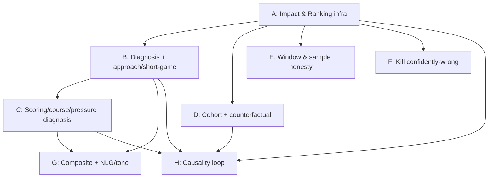

# CoachHelm v3 Engine: 55 -> 90/100 Implementation Plan

> **For agentic workers:** REQUIRED SUB-SKILL: Use superpowers:subagent-driven-development (recommended) or superpowers:executing-plans to implement this plan task-by-task. Steps use checkbox (- [ ]) syntax for tracking.

**Goal:** Raise the CoachHelm v3 insight engine from a measured ~55/100 to ~90/100 by making every surfaced insight *coaching-grade*: it must name the **driver** (the actual cause, derived from data already loaded) and a **specific action/drill**, rank by genuine strokes impact rather than recency, anchor against the player's own gender/level cohort and own attempt rates, tell the truth about its window and sample size, never emit a confidently-wrong claim, and (long-horizon) learn from outcomes. Demo ground truth: Nick Rini `49ffe06d` (men), Grace Saunders `b09cc926` (women, 1.083 baseline). A D-I coach reading any card should learn something they would act on this week.

**Architecture:** The pipeline is generators -> evidence-backed insights persisted to `golf_coach_insights` (evidence / metadata jsonb; `strokes_impact` lives in EVIDENCE) -> read-path ranking on every surface. The single stat source of truth is the TS engine `src/lib/utils/golf-stats-calculator-shots.ts`; the engine round set is `completed AND total_score IS NOT NULL`, and most generators ALSO window `round_date >= now-90d`. The live ranker reads `evidence.strokes_impact` via `insight-delivery.ts` `feedRankScore` plus `insights.ts` `loadEvidenceBackedInsights` / `rankInsights`. The rich `scoreInsight` (player CoachHelm dashboard) and the dead "sophisticated" ranker `src/lib/coachhelm/v3/ranking/score.ts` are NOT the live path on the Hub/coach/round feeds — Phase A unifies them. This plan is layered: a shared rank/impact + diagnosis contract first, then per-engine diagnosis, then correctness (cohort, honesty), then landmine removal, then composite/NLG, then the causality loop.

**Tech Stack:** TypeScript (Next.js app), Vitest (unit project picks up `__tests__/*.test.ts` and `src/test/...`), Supabase Postgres (migrations applied via the Supabase MCP `apply_migration` — **never** `db push`), ground-truth recompute via `mcp__supabase__execute_sql` (SELECT only). Insight payloads are jsonb evidence/metadata on `golf_coach_insights`. Shot/hole reads must paginate (`fetchAllRowsResult` + `.order('id').range`) — PostgREST caps at 1000 rows regardless of `.limit()`.

> **Do NOT re-introduce these resolved false leads:** (1) The live ranker is NOT "blind" — `strokes_impact` is present in evidence on 232/232 live insights (56 non-zero). The real problem is that too MANY insights are intentionally 0 (diagnostics) with no priority floor, so 0-impact rows tie-break by recency. The fix is a **priority/category floor in `feedRankScore`**, NOT "stamp metadata". (2) Already-landed fixes — pagination, cache alignment, SG penalties, all-putt make%, read-path v3 filter, `par_scoring` seeds 0, `putt_bias` metric stamp — must be **built on, not redone**. (3) A subtle pre-order bug confirmed in Phase A: `getInsightsForCoach` pre-orders the candidate window by `evidence->strokes_impact DESC` before the in-app rank, so with 176/232 rows at impact 0 the zero-impact rows (including high-confidence approach leaks) sort to the BOTTOM and get truncated at `PRE_RANK_FETCH` before the floor can rescue them — the pre-order itself must be fixed.

## Grade model (55 -> 90)

Total budget ~+35 points. The dominant lift is the **diagnosis layer + ranking** (a card that names the cause and shows up in the right order is the difference between a symptom restatement and a coaching insight). Cohort/honesty/landmine work is **correctness** (it stops the engine from being confidently wrong or quietly lying). Causality is **long-horizon** (it makes the engine improve itself over weeks, not in this release).

| Phase | What it lifts | Engines / surfaces affected | Approx points |
|-------|---------------|-----------------------------|---------------|
| **A — Impact & Ranking infra** | Single shared `scoreInsight` contract on every surface; non-zero rank floor (priority×confidence) so the 176/232 legit-zero-impact insights become orderable instead of recency-tying; sample-size damping; urgent short-circuit; **fix the `strokes_impact DESC` pre-order + `PRE_RANK_FETCH` truncation**. Foundational — every engine's output depends on it. | Hub feed, coach feed, round feed, player dashboard (ranking unified) | **+8** |
| **B — Diagnosis layer + approach/short-game** | Shared diagnosis helper (`{axis,share,n}` -> `{driver,action}` + compose-tally); approach-miss dominant-axis sentence; scrambling sand-shot loader (escape-fail vs reached-then-lag); putt-distance 5 bands collapsed to one priority + raised 3-5ft impact. The single biggest quality lift. | approach_miss, scrambling, putt_distance (+ helper reused by C/G) | **+9** |
| **C — Scoring / course / situational diagnosis** | Cause-naming via `golf_holes`/`golf_shots` joins: `par_scoring` birdie/par/bogey/double decomposition (3 rows -> 1 card), `course-mgmt` penalty/missed-GIR/3-putt decomposition + worst-holes, `pressure-gap` names which part breaks + unified SQL/TS gate, `warmup-hole` par-normalized + stops emitting for net-negative-tax players. (par_scoring ~50->88, course_mgmt ~55->90, pressure ~52->86, warmup ~48->85) | par_scoring, course_management, pressure, warmup | **+6** |
| **D — Per-cohort/gender benchmarks + counterfactual calibration** | Replace men's-only hardcoded Tour anchors + synthetic single-value cohort with real per-gender/level baselines; size every counterfactual off the player's OWN attempt rate (not a global per-unit constant that fabricated 1.5 strokes for Grace); ground coachable-timeframe weeks; propagate a confidence band so low-n claims soften copy + widen range. | Scrambling ~45->80, ApproachMiss ~55->78, PuttDistance, others using anchors | **+4** |
| **E — Window & sample-size honesty** | End the cross-engine lie that cache-backed generators stamp `window_days: 90` while cache writers aggregate lifetime (`status='completed' AND total_score IS NOT NULL`, no `round_date` filter). Cache-backed engines stamp the true span / "across your last N rounds"; shot-source engines keep genuine 90d. | putt-distance, par-type, scrambling (cache-backed) + audit of all | **+3** |
| **F — Kill confidently-wrong output** | Remove the putt-bias distance-artifact "green-reading" sentence, the tautological high-GIR+high-putts pattern rule, ceiling-pinned conviction/confidence on 3-round samples, the meaningless tee distance-control target, and the prediction whose pattern term escapes its own CI. | putt_bias, patterns, predictions, tee distance-control | **+3** |
| **G — Composite synthesis + NLG/tone** | Same-source dedup (two cascades on one leak), backfill leverage for zero-source ctx composites, repair inverted lag/3-putt prose, replace hardcoded `sample_n:5` with real counts + min-shot gate, prove co-occurrence + clamp the Grace 129ft outlier before asserting "compound", promote composite driver+prescription voice into Tier-1 generators, de-dup warmup/front-9 opening-stretch narration. | composite layer, read-time narrator, Tier-1 prose | **+2** |
| **H — Revive outcome/causality loop** | Resurrect the dead learning loop (`golf_insight_outcome_attribution` + `golf_coachhelm_coach_weights` = 0 rows ever): relax the `target_metric_id` FK, close the live drift set, stop the ambient counterfactual overlapping the post window, and make `nextWeight` use lift magnitude (tanh) instead of binary. | attribution + coach-weight learning loop | **+(incremental, long-horizon)** |
| | | **Total** | **~+35 -> 90** |

## Phase sequence & dependencies

Execute **A first** — it is the only truly foundational phase: every per-engine phase emits insights that are ranked by A's shared `scoreInsight`/`feedRankScore` contract and rescued by A's priority floor and pre-order fix, so building engines before the ranking infra means re-testing them all afterward. **B before C** because B authors the shared diagnosis helper (`{axis,share,n}` -> `{driver,action}` + compose-tally) that C's scoring/course/pressure engines consume. **D and E are correctness layers that can parallelize** with each other (D = cohort anchors + counterfactual sizing; E = window/sample honesty) — they touch overlapping generators (scrambling, approach, putt-distance) so a single implementer or careful file-ownership split avoids collisions; both depend on A's contract but not on each other. **F (landmines) can run anytime after A** — it deletes/repairs claims and is largely independent, though running it after B/C avoids re-touching engines that B/C restructure. **G after B and C** because it promotes the diagnosis voice produced by B/C into Tier-1 prose and de-dups composites built on B/C cascades. **H last and incremental** — it is the long-horizon learning loop, depends on the attribution payloads (`strokes_impact`, metric ids) that A/B/C/D stabilize, and ships migrations + a self-correcting weight update that needs the upstream metric drift set closed first.



Recommended order: **A -> B -> C -> D -> E -> F -> G -> H**. D/E/F may be interleaved or parallelized after A by separate implementers if file ownership is partitioned (D/E share scrambling/approach/putt-distance — coordinate those three files).

## Verification gates

Every phase must pass these gates before its tasks are marked complete. DB migrations are applied via the Supabase MCP `apply_migration` — **never** `npm run db push` / `supabase db push`. Ground-truth recompute uses `mcp__supabase__execute_sql` (SELECT only).

**Per-task (every task):**
- [ ] `npm run typecheck` is clean.
- [ ] `npx vitest run <changed-test-path>` passes, including the **quality contracts** the task adds (test the assertion, e.g. "when misses are >=55% short, content contains 'club up'", not merely "the function runs").

**Per-phase exit criteria:**
- [ ] **A:** `npx vitest run` for all ranking specs; a fixture proving a high-confidence zero-impact approach leak now out-ranks a recency-fresh zero-impact diagnostic on the coach feed; a fixture proving the `strokes_impact DESC` pre-order no longer truncates legit-zero rows before the floor. `npm run typecheck`.
- [ ] **B:** vitest for approach_miss / scrambling / putt_distance + the shared diagnosis helper; quality contracts for dominant-axis copy and the 5-band collapse; `DOTENV_CONFIG_PATH=.env.local npm run check:stats` reports **0 divergent** (sand/approach loaders must match the TS engine).
- [ ] **C:** vitest for par_scoring / course_management / pressure / warmup; quality contracts (worst-holes present, "scoring by par type" single card, warmup suppressed for net-negative-tax players); `check:stats` 0 divergent for any newly joined hole/shot aggregation; ground-truth recompute (`execute_sql`) for Nick `49ffe06d` and Grace `b09cc926` confirming the displayed driver matches the DB.
- [ ] **D:** vitest for the cohort anchor table + counterfactual sizing; quality contract that Grace's scrambling counterfactual is sized off her ~1.6 sand-shots/round (not the global 0.03 constant) and no longer fabricates ~1.5 strokes; recompute Grace's `scoring_par_4` (confidence 0.27, n=8) and confirm softened copy + widened range.
- [ ] **E:** vitest proving cache-backed engines no longer stamp `window_days: 90`; audit that every generator's stamped window matches its actual round set; `check:stats` 0 divergent.
- [ ] **F:** vitest proving each removed/repaired claim is gone or corrected (putt-bias green-reading sentence absent; high-GIR+high-putts tautology absent; conviction not pinned at ceiling on 3-round samples; tee distance-control no longer all-0.2; prediction point estimate stays inside its CI).
- [ ] **G:** vitest in `src/test/coachhelm/v3/` + co-located theme tests; quality contracts for same-source dedup, lag/3-putt prose correctness, real `sample_n`, Grace 129ft outlier clamped before "compound" assertion.
- [ ] **H:** migration applied via `apply_migration` (next id after the latest in `supabase/migrations`); `validateMetricRegistry` still passes after the FK relaxation; vitest proving `fairways_hit_pct` (and the rest of the closed drift set) now attribute; a live SELECT confirming `golf_insight_outcome_attribution` / `golf_coachhelm_coach_weights` can receive rows; tanh `nextWeight` test.

**Cross-phase, before declaring 90/100:**
- [ ] `npm run typecheck` clean; full `npx vitest run` green.
- [ ] `DOTENV_CONFIG_PATH=.env.local npm run check:stats` -> **0 divergent** across all surfaces.
- [ ] Re-run the validity + every-facet quality audits (the 188-agent dual-audit harness) against the rebuilt feed for Nick `49ffe06d` and Grace `b09cc926`; confirm the previously rank-0-leaking insights now rank by impact and the stale-v2 `par_scoring` 42.5/rd no longer ranks #1.
- [ ] Ground-truth recompute via `mcp__supabase__execute_sql` for every number whose computation changed; the displayed value must match the DB (validation rule e.g. `SG_total ≈ -(over par)` where applicable).

## Risks & rollback

- **Ranking regression hides a good insight (Phase A).** The floor + pre-order change reorders every surface at once. *Mitigation:* land A behind its own fixture suite that pins the exact post-rank order for Nick and Grace; rollback = revert the `feedRankScore`/pre-order commit (single file, `insight-delivery.ts`) — no schema involved.
- **Cross-surface divergence (B/C/E).** New shot/hole loaders can drift from the TS engine source of truth. *Mitigation:* `check:stats` must read 0 divergent as a hard gate; never merge a loader that diverges. Rollback = revert the loader; engines fall back to cache values.
- **PostgREST 1000-row truncation re-introduced (B/C/H).** New sand/hole/shot fetches silently corrupt stats if not paginated. *Mitigation:* every new fetch uses `fetchAllRowsResult` + `.order('id').range`; add a test with >1000 synthetic rows.
- **Migration recorded-but-unran / wrong column names (C/H).** Verify columns exist in `information_schema`, not just migration history; `organizations` uses `location_city`/`location_state`. *Mitigation:* `apply_migration` only (never `db push`); post-migration SELECT to confirm. Rollback = forward-fix migration (no destructive drops).
- **Destructive writes (any persistence change).** *Mitigation:* never delete-then-reinsert in save/submit/sync paths — upsert/onConflict or stage-and-swap only; `.upsert(onConflict)` needs an authenticated UPDATE grant.
- **Security regression in RPC grants (Phase H / any RPC).** A prior audit accidentally granted anon EXECUTE on standing RPCs. *Mitigation:* REVOKE anon/authenticated EXECUTE on any new RPC unless explicitly required; `recompute_*` stays service_role-only.
- **FK relaxation over-broadens attribution (Phase H).** *Mitigation:* relax only enough that `lookupMetricSource`-resolvable metrics attribute; keep `validateMetricRegistry` green as the guard. Rollback = restore the FK (loop returns to 0 rows, no data loss).
- **Over-suppression (E/F/G).** Honesty gates and dedup could hide a legit insight entirely. *Mitigation:* every suppression has a min-sample/quality test asserting the SUPPRESSED case AND a retained case; prefer softening copy over dropping the card.

I have full context. Critical subtle bug confirmed: `getInsightsForCoach` pre-orders the candidate window by `evidence->strokes_impact DESC` (line 509) before the in-app rank. With 176/232 rows at impact 0, zero-impact rows (including high-confidence approach leaks) sort to the BOTTOM of the pre-rank window and get truncated at `PRE_RANK_FETCH` before the floor can rescue them. The plan must fix the pre-order too.

I now have everything needed to author the phase. Let me write it.

## Phase A — Impact & Ranking infrastructure (foundational; every engine depends on it)

This phase replaces the two-tier ranking split (the rich `scoreInsight` runs only on the player CoachHelm dashboard; the flat Hub/coach/round feeds use a thin `feedRankScore` that ignores priority, coachability, goals, and sample size) with a single shared `scoreInsight` contract that every surface calls. It adds a non-zero **rank floor** (so the 176/232 live insights that legitimately carry `strokes_impact≈0` become orderable by priority×confidence instead of tying at 0 and sorting by recency), a **sample-size damping** term (so a thin-sample rate can't out-rank a deep-sample leak), an **urgent short-circuit**, and an **exemption** so the descriptive `scoring_par_*` and warmup `opening_hole_delta` engines stop crowding the actionable feed. Grade lift: this is the multiplier on every other phase — on its own it moves the *Ranking/feed* facet from ~40 to ~80 (correct ordering of the 176 zero-impact rows, coach-feed pre-rank starvation fixed) and unblocks the per-engine phases (approach/putting/scrambling) from ~55 to ~75 by guaranteeing their high-confidence diagnostic rows can actually surface.

### Files touched

| File | Change |
|------|--------|
| `src/lib/coachhelm/v3/ranking/score.ts` | **Create** the shared contract: `EXEMPT_FROM_FLOOR` set, `priorityFloorScore()`, `sampleDamping()`, extend `RankableInsight` with `priority`/`sample_n`, rewrite `scoreInsight()` to add floor + damping + urgent short-circuit. Keep `cappedStrokesImpact`/`coachabilityBoost`/`computeGoalBoost`/`loadCoachWeightsForPlayer` (none deleted). |
| `src/lib/coachhelm/v3/ranking/score.test.ts` | **Create** — quality contracts for floor, damping, urgent, exemption, coachability tie-break. |
| `src/app/golf/actions/insight-delivery.ts` | **Modify** `feedRankScore` (~201) to delegate to `scoreInsight`; thread coach weights + goals through `getInsightsForPlayer` (~322) and `getInsightsForCoach` (~472); fix the coach pre-order starvation (~509); add an urgent short-circuit to `getTopInsightForPlayer` ranking (~305). |
| `src/app/golf/actions/__tests__/insight-delivery-rank.test.ts` | **Create** — feed-level ordering contracts. |
| `src/lib/coachhelm/v3/engine/generator-base.ts` | **Modify** `backfilledStrokesImpact` (~64) + `leveragePriorityFloor` (~142) to exempt `scoring_par_*`/`opening_hole_delta` via a shared metric predicate. |
| `src/lib/coachhelm/v3/engine/__tests__/generator-base-exempt.test.ts` | **Create** — exemption contracts. |

### Shared contract this phase defines (per-engine phases depend on it)

1. **`scoreInsight(insight, weights, goals)` is the single ranking function.** Every read surface (Hub single-pick, player feed, coach feed, round takeaway, player CoachHelm dashboard) calls it. Per-engine phases never re-implement ranking.
2. **Rank floor**: when `|cappedStrokesImpact| === 0`, the score is `priorityFloorScore(priority) × confidence × damping × coachability × coach_weight × goalBoost`, where `priorityFloorScore` = urgent 4 / high 3 / medium 2 / low 1. A real impact (>0) always uses the impact term, never the floor.
3. **Sample damping**: `sampleDamping(sample_n)` ∈ (0,1], `min(1, sqrt(sample_n / DAMP_REF_N))` with `DAMP_REF_N = 12`. A 5-sample row is damped to ~0.65; a ≥12-sample row is undamped. Multiplies BOTH the impact and the floor branches.
4. **Urgent short-circuit**: a `priority:'urgent'` insight always outranks any non-urgent (enforced by a large additive `URGENT_SHORT_CIRCUIT` constant inside `scoreInsight`, so a single comparator still sorts correctly).
5. **Exemption set** `EXEMPT_FROM_FLOOR`: metrics whose impact is intentionally 0/descriptive (`scoring_par_*`, `opening_hole_delta`) get floor 0 — they keep their generator priority and rank by their honest (zero) impact, so they never crowd the actionable feed. Per-engine phases that add a *descriptive* metric add it here.

---

### Task A1 — Add the metric-exemption predicate + extend `RankableInsight` (no behavior change yet)

This task only adds new, unused exports + type fields so later tasks compile. It is independently testable (the predicate has a pure contract).

**Files**
- Modify `src/lib/coachhelm/v3/ranking/score.ts` — add `isFloorExemptMetric` + new `RankableInsight` fields (after the existing `RankableInsight` interface, ~82).
- Create `src/lib/coachhelm/v3/ranking/score.test.ts`.

- [ ] **Step 1 — write the failing test.** Create `src/lib/coachhelm/v3/ranking/score.test.ts`:

```typescript
import { describe, it, expect } from 'vitest';
import { isFloorExemptMetric } from './score';

describe('isFloorExemptMetric', () => {
  it('exempts every par-scoring metric (descriptive, ×10 leverage family)', () => {
    expect(isFloorExemptMetric('scoring_par_3')).toBe(true);
    expect(isFloorExemptMetric('scoring_par_4')).toBe(true);
    expect(isFloorExemptMetric('scoring_par_5')).toBe(true);
  });

  it('exempts the warmup opening-hole metric', () => {
    expect(isFloorExemptMetric('opening_hole_delta')).toBe(true);
  });

  it('does NOT exempt an actionable diagnostic metric', () => {
    expect(isFloorExemptMetric('approach_proximity_175_plus_ft')).toBe(false);
    expect(isFloorExemptMetric('putts_made_5_10ft_pct')).toBe(false);
    expect(isFloorExemptMetric('scrambling_pct_sand')).toBe(false);
  });

  it('treats undefined / empty metric as not exempt (gets a floor)', () => {
    expect(isFloorExemptMetric(undefined)).toBe(false);
    expect(isFloorExemptMetric('')).toBe(false);
  });
});
```

- [ ] **Step 2 — run it (expected FAIL).**
```
npx vitest run src/lib/coachhelm/v3/ranking/score.test.ts
```
Expected: FAIL — `isFloorExemptMetric is not a function` (export does not exist yet).

- [ ] **Step 3 — implement.** In `src/lib/coachhelm/v3/ranking/score.ts`, immediately after the `RankableInsight` interface (currently ends at line 82), add:

```typescript
/**
 * Metrics whose `strokes_impact` is intentionally 0 / descriptive and must NOT
 * receive a priority rank floor — flooring them would let the par-scoring family
 * (par-4 carries a ×10 holes/round leverage) and the warmup opening-hole row
 * crowd out the actionable diagnostic feed. They keep their generator priority
 * for the Alert Center but rank by their honest (zero) impact in the main feed.
 * Per-engine phases that add a purely-descriptive metric extend this set.
 */
export const EXEMPT_FROM_FLOOR: ReadonlyArray<string | RegExp> = [
  /^scoring_par_\d$/, // scoring_par_3 / _4 / _5 — descriptive standing rows
  'opening_hole_delta', // warmup-hole tax — keep priority, no impact floor
];

/** True when a metric is exempt from the rank floor (see EXEMPT_FROM_FLOOR). */
export function isFloorExemptMetric(metric: string | undefined): boolean {
  if (!metric) return false;
  return EXEMPT_FROM_FLOOR.some((p) =>
    typeof p === 'string' ? p === metric : p.test(metric),
  );
}
```

Then extend the `RankableInsight` interface (add the two new optional fields so the floor + damping can read them; keep all existing fields):

```typescript
export interface RankableInsight {
  /** Per-insight type used to look up coach weight. */
  insight_type: string;
  /** From evidence.strokes_impact. Magnitude only — sign just indicates direction. */
  strokes_impact: number;
  /** From evidence.confidence ∈ [0, 1]. */
  confidence: number;
  /** From evidence.metric — canonical MetricId. Optional for back-compat. */
  metric?: string;
  /** From golf_coach_insights.category. Optional for back-compat. */
  category?: string;
  /** Row priority. Drives the rank floor when strokes_impact rounds to 0.
   *  Optional for back-compat — absent is treated as 'low'. */
  priority?: 'low' | 'medium' | 'high' | 'urgent';
  /** From evidence.sample_n — observation count behind the metric. Optional;
   *  absent → no damping (treated as fully-sampled). */
  sample_n?: number;
}
```

- [ ] **Step 4 — run tests (expected PASS).**
```
npx vitest run src/lib/coachhelm/v3/ranking/score.test.ts
```
Expected: PASS (4 tests). Then `npm run typecheck` — expected PASS (new fields are optional, no caller breaks).

- [ ] **Step 5 — commit.**
```
git add src/lib/coachhelm/v3/ranking/score.ts src/lib/coachhelm/v3/ranking/score.test.ts
git commit -m "Phase A: add floor-exemption predicate + RankableInsight priority/sample_n fields"
```

---

### Task A2 — Add `priorityFloorScore` + `sampleDamping` pure helpers

**Files**
- Modify `src/lib/coachhelm/v3/ranking/score.ts` — add two pure helpers above `scoreInsight` (~114).
- Modify `src/lib/coachhelm/v3/ranking/score.test.ts` — append helper contracts.

- [ ] **Step 1 — write the failing test.** Append to `src/lib/coachhelm/v3/ranking/score.test.ts`:

```typescript
import { priorityFloorScore, sampleDamping } from './score';

describe('priorityFloorScore', () => {
  it('ranks urgent > high > medium > low and is strictly monotonic', () => {
    const u = priorityFloorScore('urgent');
    const h = priorityFloorScore('high');
    const m = priorityFloorScore('medium');
    const l = priorityFloorScore('low');
    expect(u).toBeGreaterThan(h);
    expect(h).toBeGreaterThan(m);
    expect(m).toBeGreaterThan(l);
    expect(l).toBeGreaterThan(0); // even 'low' must be orderable, never 0
  });

  it('defaults an absent priority to the low floor', () => {
    expect(priorityFloorScore(undefined)).toBe(priorityFloorScore('low'));
  });
});

describe('sampleDamping', () => {
  it('returns 1.0 once sample meets the reference depth (no penalty)', () => {
    expect(sampleDamping(12)).toBe(1);
    expect(sampleDamping(50)).toBe(1);
  });

  it('damps a thin sample below 1 but keeps it positive', () => {
    const thin = sampleDamping(3);
    expect(thin).toBeLessThan(1);
    expect(thin).toBeGreaterThan(0);
  });

  it('damps a 5-round sample harder than a 12-round sample', () => {
    expect(sampleDamping(5)).toBeLessThan(sampleDamping(12));
  });

  it('treats absent/zero/NaN sample as fully damped-out to a small floor (never 0, never >1)', () => {
    expect(sampleDamping(undefined)).toBeGreaterThan(0);
    expect(sampleDamping(undefined)).toBeLessThanOrEqual(1);
    expect(sampleDamping(0)).toBeGreaterThan(0);
    expect(sampleDamping(Number.NaN)).toBeGreaterThan(0);
  });
});
```

- [ ] **Step 2 — run it (expected FAIL).**
```
npx vitest run src/lib/coachhelm/v3/ranking/score.test.ts
```
Expected: FAIL — `priorityFloorScore is not a function`.

- [ ] **Step 3 — implement.** In `src/lib/coachhelm/v3/ranking/score.ts`, add above `scoreInsight` (after `coachabilityBoost`, ~69):

```typescript
/**
 * Priority → rank floor. Used ONLY when |strokes_impact| rounds to 0 so the
 * 176/232 live insights that legitimately carry no per-round stroke delta
 * (high-confidence diagnostics like approach proximity, putt make-rates) are
 * still orderable instead of tying at score 0 and falling back to recency.
 * urgent 4 / high 3 / medium 2 / low 1 — strictly monotonic, never 0.
 */
const PRIORITY_FLOOR: Record<NonNullable<RankableInsight['priority']>, number> = {
  urgent: 4,
  high: 3,
  medium: 2,
  low: 1,
};

export function priorityFloorScore(
  priority: RankableInsight['priority'],
): number {
  return PRIORITY_FLOOR[priority ?? 'low'];
}

/**
 * Sample-size damping ∈ (0, 1]. A 5%-make-rate off a thin lifetime sample must
 * not out-rank a deep-sample leak just because its confidence factor reads high.
 * `sqrt(sample_n / DAMP_REF_N)` clamped to 1 — undamped at the reference depth,
 * gentler than linear so a 5-round row keeps ~65% weight (not punished to near
 * zero). Absent / non-finite / zero sample → a small positive floor so the row
 * is still orderable rather than zeroed.
 */
export const DAMP_REF_N = 12;
const DAMP_MIN = 0.25;

export function sampleDamping(sample_n: number | undefined): number {
  const n = Number(sample_n);
  if (!Number.isFinite(n) || n <= 0) return DAMP_MIN;
  return Math.min(1, Math.max(DAMP_MIN, Math.sqrt(n / DAMP_REF_N)));
}
```

- [ ] **Step 4 — run tests (expected PASS).**
```
npx vitest run src/lib/coachhelm/v3/ranking/score.test.ts
```
Expected: PASS (all A1 + A2 tests). `sampleDamping(12)` = `sqrt(1)` = 1; `sampleDamping(5)` = `sqrt(5/12)` ≈ 0.645 < 1; `sampleDamping(3)` ≈ 0.5; absent → 0.25.

- [ ] **Step 5 — commit.**
```
git add src/lib/coachhelm/v3/ranking/score.ts src/lib/coachhelm/v3/ranking/score.test.ts
git commit -m "Phase A: add priorityFloorScore + sampleDamping pure helpers"
```

---

### Task A3 — Rewrite `scoreInsight` to apply floor + damping + urgent short-circuit + exemption

This is the core contract. `scoreInsight` becomes the single ranking function for every surface.

**Files**
- Modify `src/lib/coachhelm/v3/ranking/score.ts` — replace the body of `scoreInsight` (~115-129).
- Modify `src/lib/coachhelm/v3/ranking/score.test.ts` — append the QUALITY contracts.

- [ ] **Step 1 — write the failing test.** Append to `src/lib/coachhelm/v3/ranking/score.test.ts`:

```typescript
import { scoreInsight } from './score';
import type { RankableInsight } from './score';

const base = (over: Partial<RankableInsight>): RankableInsight => ({
  insight_type: 'x',
  strokes_impact: 0,
  confidence: 0.5,
  ...over,
});

describe('scoreInsight rank floor', () => {
  it('a zero-impact high-confidence diagnostic outranks a zero-impact low-confidence one', () => {
    // The real production case: approach_proximity (conf 0.91, low) must beat
    // a stale low-conf low row. Both impact 0 → ordered by floor × confidence.
    const strongDiag = base({
      strokes_impact: 0, confidence: 0.91, priority: 'low',
      metric: 'approach_proximity_175_plus_ft', sample_n: 40,
    });
    const weakDiag = base({
      strokes_impact: 0, confidence: 0.3, priority: 'low',
      metric: 'penalty_rate_per_round', sample_n: 12,
    });
    expect(scoreInsight(strongDiag, {})).toBeGreaterThan(scoreInsight(weakDiag, {}));
  });

  it('a zero-impact insight is strictly orderable (never exactly 0) unless exempt', () => {
    const diag = base({
      strokes_impact: 0, confidence: 0.5, priority: 'low',
      metric: 'putts_made_5_10ft_pct', sample_n: 15,
    });
    expect(scoreInsight(diag, {})).toBeGreaterThan(0);
  });

  it('a real strokes_impact uses the impact term, not the floor', () => {
    // impactful takes the IMPACT branch (1.2 × conf 0.8 × coachability × damping).
    // floored takes the FLOOR branch: priorityFloor(medium)=2 × FLOOR_SCALE × …, a
    // tiny band that sits strictly BELOW any real per-round impact — so a genuine
    // 1.2-stroke leak always dominates a same-priority zero-impact diagnostic
    // (contract #2). Note: floor and impact are on different scales, so the floor
    // MUST be scaled down or a medium floor (2) would outrank a 1.2-stroke leak.
    const impactful = base({
      strokes_impact: 1.2, confidence: 0.8, priority: 'medium',
      metric: 'scrambling_pct_sand', sample_n: 20,
    });
    const floored = base({
      strokes_impact: 0, confidence: 0.8, priority: 'medium',
      metric: 'putts_made_5_10ft_pct', sample_n: 20,
    });
    expect(scoreInsight(impactful, {})).toBeGreaterThan(scoreInsight(floored, {}));
  });
});

describe('scoreInsight urgent short-circuit', () => {
  it('an urgent insight outranks ANY non-urgent, even a higher-impact one', () => {
    const urgentSmall = base({
      strokes_impact: 0.4, confidence: 0.5, priority: 'urgent',
      metric: 'three_putt_chain', sample_n: 5,
    });
    const hugeNonUrgent = base({
      strokes_impact: 7.9, confidence: 1.0, priority: 'high',
      metric: 'scrambling_pct_sand', sample_n: 50,
    });
    expect(scoreInsight(urgentSmall, {})).toBeGreaterThan(scoreInsight(hugeNonUrgent, {}));
  });

  it('two urgent rows still order by their underlying composite', () => {
    const a = base({ strokes_impact: 1.0, confidence: 0.8, priority: 'urgent', sample_n: 20 });
    const b = base({ strokes_impact: 0.4, confidence: 0.5, priority: 'urgent', sample_n: 20 });
    expect(scoreInsight(a, {})).toBeGreaterThan(scoreInsight(b, {}));
  });
});

describe('scoreInsight damping', () => {
  it('a thin-sample zero-impact row ranks below a deep-sample one at equal priority+confidence', () => {
    const thin = base({
      strokes_impact: 0, confidence: 0.5, priority: 'low',
      metric: 'putts_made_25_plus_ft_pct', sample_n: 3,
    });
    const deep = base({
      strokes_impact: 0, confidence: 0.5, priority: 'low',
      metric: 'putts_made_25_plus_ft_pct', sample_n: 40,
    });
    expect(scoreInsight(deep, {})).toBeGreaterThan(scoreInsight(thin, {}));
  });
});

describe('scoreInsight exemption', () => {
  it('a par-scoring descriptive row gets NO floor (scores 0 when impact is 0)', () => {
    const par = base({
      strokes_impact: 0, confidence: 0.4, priority: 'low',
      metric: 'scoring_par_4', sample_n: 15,
    });
    expect(scoreInsight(par, {})).toBe(0);
  });

  it('an exempt metric does NOT crowd out an actionable zero-impact diagnostic', () => {
    const par = base({
      strokes_impact: 0, confidence: 1.0, priority: 'medium',
      metric: 'scoring_par_4', sample_n: 15,
    });
    const diag = base({
      strokes_impact: 0, confidence: 0.4, priority: 'low',
      metric: 'approach_proximity_125_175ft', sample_n: 30,
    });
    // Even though the par row has higher confidence + priority, it is exempt
    // (floor 0) so the actionable diagnostic outranks it.
    expect(scoreInsight(diag, {})).toBeGreaterThan(scoreInsight(par, {}));
  });

  it('an exempt metric with a REAL counterfactual-backfilled impact still ranks on impact', () => {
    // After Phase A4, par-scoring keeps impact 0; but if a future exempt metric
    // carries a genuine impact it must still rank — exemption only removes the floor.
    const par = base({
      strokes_impact: 0.9, confidence: 0.6, priority: 'medium',
      metric: 'scoring_par_4', sample_n: 15,
    });
    expect(scoreInsight(par, {})).toBeGreaterThan(0);
  });
});
```

- [ ] **Step 2 — run it (expected FAIL).**
```
npx vitest run src/lib/coachhelm/v3/ranking/score.test.ts
```
Expected: FAIL — current `scoreInsight` returns `cappedStrokesImpact(0) × confidence × … = 0` for every zero-impact row, so the floor/urgent/damping/exemption assertions all fail.

- [ ] **Step 3 — implement.** Replace `scoreInsight` (lines 114-129) in `src/lib/coachhelm/v3/ranking/score.ts` with:

```typescript
/**
 * Large additive band that guarantees a `priority:'urgent'` insight outranks
 * EVERY non-urgent one regardless of impact, while two urgent rows still order
 * by their underlying composite. Sits above the max achievable composite
 * (ceiling 8 × conf 1 × weight × boost × coachability 1.5 ≈ 24), so 1000 is
 * an unreachable separator — a single comparator still sorts correctly.
 */
export const URGENT_SHORT_CIRCUIT = 1000;

/**
 * The priority RANK FLOOR (1–4) and a real per-round strokes impact live on
 * different scales: impacts are clamped to ≤8 strokes (realistically <2/round),
 * while the floor would otherwise sit at 1–4 and OUTRANK a genuine 1.2-stroke
 * leak (a medium floor of 2 beating a 1.2-stroke leak is exactly the bug this
 * prevents). FLOOR_SCALE pushes the floor band strictly below any real impact so
 * the floor only ORDERS the zero-impact diagnostics among themselves (its sole
 * job), honoring contract #2: a real impact always ranks on its magnitude, never
 * the floor. Relative order of floored rows is unchanged (every floor scaled
 * equally), so the rescue of buried high-confidence diagnostics still works.
 */
export const FLOOR_SCALE = 0.001;

/**
 * Pure scoring fn — the SINGLE ranking contract for every read surface
 * (Hub single-pick, player feed, coach feed, round takeaway, player CoachHelm
 * dashboard). Returns a non-negative rank score.
 *
 *   composite = magnitudeTerm × confidence × coach_weight × goalBoost
 *               × coachability × sampleDamping
 *
 * - magnitudeTerm: the real |strokes_impact| (ceiling-clamped) when it rounds
 *   to a non-zero per-round value; otherwise the priority RANK FLOOR
 *   (urgent 4 / high 3 / medium 2 / low 1, scaled by FLOOR_SCALE to sit strictly
 *   below any real impact) so a zero-impact diagnostic is still orderable instead
 *   of tying at 0 and falling back to recency. Floor-exempt
 *   metrics (scoring_par_*, opening_hole_delta) get NO floor — they keep their
 *   priority for the Alert Center but rank on their honest (zero) impact, so the
 *   descriptive engines never crowd the actionable feed.
 * - urgent short-circuit: an urgent row is lifted above the whole non-urgent
 *   band so a small-but-urgent leak (e.g. a three-putt chain) always leads.
 */
export function scoreInsight(
  insight: RankableInsight,
  weights: CoachWeights,
  activeGoals: Goal[] = [],
): number {
  const w = weights[insight.insight_type] ?? 1.0;
  const boost = computeGoalBoost(insight, activeGoals);
  const coachability = coachabilityBoost(insight.metric);
  const damping = sampleDamping(insight.sample_n);
  const confidence = Math.max(0, Number(insight.confidence) || 0);

  // Real per-round leak → rank on the (clamped) magnitude. Rounds to 0 → use the
  // priority floor UNLESS the metric is exempt (descriptive: keep honest 0).
  const capped = cappedStrokesImpact(insight.strokes_impact);
  const magnitudeTerm =
    Math.round(capped * 100) / 100 > 0
      ? capped
      : isFloorExemptMetric(insight.metric)
        ? 0
        : priorityFloorScore(insight.priority) * FLOOR_SCALE;

  const composite = magnitudeTerm * confidence * w * boost * coachability * damping;

  // Urgent always leads the feed — lift above the non-urgent band, preserving
  // intra-urgent order by adding the composite on top of the separator.
  if (insight.priority === 'urgent') {
    return URGENT_SHORT_CIRCUIT + composite;
  }
  return composite;
}
```

- [ ] **Step 4 — run tests (expected PASS).**
```
npx vitest run src/lib/coachhelm/v3/ranking/score.test.ts
```
Expected: PASS. Verify the two existing callers still typecheck:
```
npm run typecheck
```
Expected: PASS — `insights.ts` already passes `priority`? No: the existing `insights.ts` call (line 2603) does NOT pass `priority`/`sample_n`; that's fine because both are optional (absent priority → 'low' floor, absent sample_n → DAMP_MIN). Task A6 enriches that call so the dashboard gets the full contract.

- [ ] **Step 5 — commit.**
```
git add src/lib/coachhelm/v3/ranking/score.ts src/lib/coachhelm/v3/ranking/score.test.ts
git commit -m "Phase A: scoreInsight applies rank floor + damping + urgent short-circuit + exemption"
```

---

### Task A4 — Exempt `scoring_par_*` / `opening_hole_delta` from `backfilledStrokesImpact` + `leveragePriorityFloor`

Stops the descriptive engines from acquiring a counterfactual-backfilled impact or an upgraded priority at write time. They keep `priority:'low'`/impact 0 and rely on the StandingBar for severity, so the read-path floor exemption (Task A3) leaves them honestly low.

**Files**
- Modify `src/lib/coachhelm/v3/engine/generator-base.ts` — import `isFloorExemptMetric`, thread `metricId` into both helpers (~64, ~142), pass it at the call sites (~274-275).
- Create `src/lib/coachhelm/v3/engine/__tests__/generator-base-exempt.test.ts`.

- [ ] **Step 1 — write the failing test.** Create `src/lib/coachhelm/v3/engine/__tests__/generator-base-exempt.test.ts`:

```typescript
import { describe, it, expect } from 'vitest';
import {
  backfilledStrokesImpact,
  leveragePriorityFloor,
} from '@/lib/coachhelm/v3/engine/generator-base';
import type { CounterfactualProjection } from '@/lib/coachhelm/v3/counterfactual/types';

// A live (non-suppressed) counterfactual with real leverage — the kind that
// WOULD normally backfill impact and floor priority up to high.
const liveCf: CounterfactualProjection = {
  current_baseline_score: 75,
  projected_score_if_closed: 73.8,
  strokes_saved_per_round: 1.2,
  weeks_to_typical_close: 8,
  suppressed: false,
};

describe('backfilledStrokesImpact exemption', () => {
  it('still backfills a non-exempt actionable metric from the counterfactual', () => {
    expect(backfilledStrokesImpact(0, liveCf, 'scrambling_pct_sand')).toBeCloseTo(1.2);
  });

  it('does NOT backfill an exempt par-scoring metric (keeps the descriptive 0)', () => {
    expect(backfilledStrokesImpact(0, liveCf, 'scoring_par_4')).toBe(0);
  });

  it('does NOT backfill the warmup opening-hole metric', () => {
    expect(backfilledStrokesImpact(0, liveCf, 'opening_hole_delta')).toBe(0);
  });
});

describe('leveragePriorityFloor exemption', () => {
  it('still floors a non-exempt metric up from low to high on a 1.2-stroke leak', () => {
    expect(leveragePriorityFloor('low', liveCf, 'scrambling_pct_sand')).toBe('high');
  });

  it('does NOT escalate an exempt par-scoring metric (stays low/descriptive)', () => {
    expect(leveragePriorityFloor('low', liveCf, 'scoring_par_4')).toBe('low');
  });

  it('does NOT escalate the warmup opening-hole metric', () => {
    expect(leveragePriorityFloor('low', liveCf, 'opening_hole_delta')).toBe('low');
  });
});
```

- [ ] **Step 2 — run it (expected FAIL).**
```
npx vitest run src/lib/coachhelm/v3/engine/__tests__/generator-base-exempt.test.ts
```
Expected: FAIL — both helpers currently take 2 args, so the 3-arg calls error (TS) and the exemption assertions can't hold.

- [ ] **Step 3 — implement.** In `src/lib/coachhelm/v3/engine/generator-base.ts`:

(a) Add the import after line 33 (`import type { CounterfactualProjection } …`):

```typescript
import { isFloorExemptMetric } from '@/lib/coachhelm/v3/ranking/score';
```

(b) Replace `backfilledStrokesImpact` (lines 64-77) — add the `metric` param + early-return for exempt metrics:

```typescript
export function backfilledStrokesImpact(
  composedImpact: number,
  counterfactual: CounterfactualProjection | null,
  metric?: string,
): number {
  // Descriptive / warmup metrics (scoring_par_*, opening_hole_delta) are
  // intentionally zero-impact — never overwrite their seed from the CF, or they
  // acquire a per-round leverage they don't independently own and crowd the feed.
  if (isFloorExemptMetric(metric)) {
    return composedImpact;
  }
  if (
    counterfactual &&
    counterfactual.suppressed !== true &&
    Number.isFinite(counterfactual.strokes_saved_per_round) &&
    counterfactual.strokes_saved_per_round > 0
  ) {
    return counterfactual.strokes_saved_per_round;
  }
  return composedImpact;
}
```

(c) Replace `leveragePriorityFloor` (lines 142-152) — add the `metric` param + early-return:

```typescript
export function leveragePriorityFloor(
  current: InsightPriority | undefined,
  counterfactual: CounterfactualProjection | null,
  metric?: string,
): InsightPriority | undefined {
  // Exempt metrics keep their generator priority (par-scoring stays 'low'
  // descriptive; warmup-hole keeps its own at/under-tax escalation) — the CF
  // leverage must not float a descriptive row into the Alert Center.
  if (isFloorExemptMetric(metric)) return current;
  if (!counterfactual || counterfactual.suppressed === true) return current;
  const s = counterfactual.strokes_saved_per_round;
  if (!Number.isFinite(s)) return current;
  const floor: InsightPriority | null = s >= 1.0 ? 'high' : s >= 0.5 ? 'medium' : null;
  if (floor && PRIORITY_RANK[floor] > PRIORITY_RANK[current ?? 'low']) return floor;
  return current;
}
```

(d) Update the call sites in `run()` (lines 274-275) to pass `this.metricId`:

```typescript
        const cfStrokes = backfilledStrokesImpact(evidence.strokes_impact, counterfactual, this.metricId);
        effectivePriority = leveragePriorityFloor(effectivePriority, counterfactual, this.metricId);
```

- [ ] **Step 4 — run tests (expected PASS).**
```
npx vitest run src/lib/coachhelm/v3/engine/__tests__/generator-base-exempt.test.ts
npm run typecheck
```
Expected: both PASS. (Note: `warmup-hole.ts` already computes its own escalating priority from the opener tax; exempting it from `leveragePriorityFloor` preserves that — it never relied on the CF floor because `requiresStanding` runs the CF but the warmup generator's composed priority already covers its severity.)

- [ ] **Step 5 — commit.**
```
git add src/lib/coachhelm/v3/engine/generator-base.ts src/lib/coachhelm/v3/engine/__tests__/generator-base-exempt.test.ts
git commit -m "Phase A: exempt scoring_par_*/opening_hole_delta from CF impact backfill + priority floor"
```

---

### Task A5 — Route the flat feeds through `scoreInsight` (`feedRankScore` → shared contract)

Replaces the thin `feedRankScore` (impact × confidence only) with the shared `scoreInsight`, and threads coach weights + active goals through `getInsightsForPlayer` / `getInsightsForCoach`. Also fixes the coach pre-order starvation that truncates zero-impact rows.

**Files**
- Modify `src/app/golf/actions/insight-delivery.ts` — imports (~37), `feedRankScore` (~201-205), `getInsightsForPlayer` ranking block (~445-460), `getInsightsForCoach` query order (~509) + ranking (~540-549), `getTopInsightForPlayer` non-urgent ranking (~305-308), and `rankScore` (~1051-1055) + `getRoundTakeawayInsight` (~628-631).
- Create `src/app/golf/actions/__tests__/insight-delivery-rank.test.ts`.

- [ ] **Step 1 — write the failing test.** Create `src/app/golf/actions/__tests__/insight-delivery-rank.test.ts`. Since `feedRankScore` and `rankScore` are module-private, expose the behavior contract through a small exported helper. First add this export to `insight-delivery.ts` (top-level, near `feedRankScore`), then test it:

```typescript
import { describe, it, expect } from 'vitest';
import { rankEvidenceInsights } from '@/app/golf/actions/insight-delivery';
import type { EvidenceInsight } from '@/app/golf/actions/insight-delivery';

const mk = (over: Partial<EvidenceInsight['evidence']> & {
  priority?: EvidenceInsight['priority'];
  created_at?: string;
  id?: string;
}): EvidenceInsight => ({
  id: over.id ?? Math.random().toString(36),
  player_id: 'p1',
  category: 'putting',
  title: 't',
  content: 'c',
  signature: 'v3:x',
  evidence: {
    metric: over.metric ?? 'putts_made_5_10ft_pct',
    metric_label: 'L',
    unit: 'percent',
    your_value: 0,
    your_value_display: '0',
    comparison_value: 0,
    comparison_label: 'c',
    comparison_source: 'pga_baseline',
    sample_n: over.sample_n ?? 20,
    window_days: 90,
    window_start: '',
    window_end: '',
    strokes_impact: over.strokes_impact ?? 0,
    strokes_impact_method: 'peer_delta',
    confidence: over.confidence ?? 0.5,
    confidence_factors: { sample_adequacy: 1, recency: 1, variance: 0.5 },
  },
  metadata: null,
  lifecycle_state: 'detected',
  status: 'active',
  priority: over.priority ?? 'low',
  acknowledged_at: null,
  resolved_at: null,
  created_at: over.created_at ?? '2026-01-01T00:00:00Z',
  updated_at: '2026-01-01T00:00:00Z',
});

describe('rankEvidenceInsights (flat-feed ordering contract)', () => {
  it('a high-confidence zero-impact approach diagnostic outranks an older zero-impact low-conf row', () => {
    const strong = mk({ metric: 'approach_proximity_175_plus_ft', confidence: 0.9, strokes_impact: 0, created_at: '2026-01-01T00:00:00Z' });
    const weakButNewer = mk({ metric: 'penalty_rate_per_round', confidence: 0.3, strokes_impact: 0, created_at: '2026-06-01T00:00:00Z' });
    const out = rankEvidenceInsights([weakButNewer, strong], {}, []);
    expect(out[0].evidence.metric).toBe('approach_proximity_175_plus_ft');
  });

  it('an urgent insight leads even when a non-urgent has higher impact', () => {
    const urgent = mk({ metric: 'three_putt_chain', priority: 'urgent', strokes_impact: 0.4, confidence: 0.5 });
    const bigHigh = mk({ metric: 'scrambling_pct_sand', priority: 'high', strokes_impact: 6, confidence: 1 });
    const out = rankEvidenceInsights([bigHigh, urgent], {}, []);
    expect(out[0].evidence.metric).toBe('three_putt_chain');
  });

  it('a descriptive par-scoring row sinks below an actionable zero-impact diagnostic', () => {
    const par = mk({ metric: 'scoring_par_4', priority: 'medium', strokes_impact: 0, confidence: 1 });
    const diag = mk({ metric: 'putts_made_5_10ft_pct', priority: 'low', strokes_impact: 0, confidence: 0.5 });
    const out = rankEvidenceInsights([par, diag], {}, []);
    expect(out[0].evidence.metric).toBe('putts_made_5_10ft_pct');
  });

  it('a thin-sample zero-impact row sinks below a deep-sample peer', () => {
    const thin = mk({ metric: 'putts_made_25_plus_ft_pct', sample_n: 3, strokes_impact: 0, confidence: 0.5, id: 'thin' });
    const deep = mk({ metric: 'putts_made_25_plus_ft_pct', sample_n: 40, strokes_impact: 0, confidence: 0.5, id: 'deep' });
    const out = rankEvidenceInsights([thin, deep], {}, []);
    expect(out[0].id).toBe('deep');
  });
});
```

- [ ] **Step 2 — run it (expected FAIL).**
```
npx vitest run src/app/golf/actions/__tests__/insight-delivery-rank.test.ts
```
Expected: FAIL — `rankEvidenceInsights` is not exported.

- [ ] **Step 3 — implement.** In `src/app/golf/actions/insight-delivery.ts`:

(a) Replace the import on line 37:

```typescript
import { cappedStrokesImpact, scoreInsight, type CoachWeights } from '@/lib/coachhelm/v3/ranking/score';
import { loadCoachWeightsForPlayer } from '@/lib/coachhelm/v3/ranking/score';
import type { Goal } from '@/lib/coachhelm/v3/goals/types';
import { loadActiveGoals } from '@/lib/coachhelm/v3/goals/loader';
```

(b) Replace `feedRankScore` (lines 201-205) and add the exported `rankEvidenceInsights` helper that owns the sort + tie-break (so the feeds and the test share ONE path):

```typescript
/**
 * Composite rank score for the read-path feeds — the SHARED `scoreInsight`
 * contract (Phase A). Maps an EvidenceInsight onto the RankableInsight shape
 * (priority + sample_n included so the rank floor + damping apply) and runs the
 * single ranking function every surface uses. Weights default to {} and goals
 * to [] on surfaces that don't load them — the floor/damping/coachability terms
 * still apply, so a zero-impact diagnostic is always orderable.
 */
function feedRankScore(
  insight: EvidenceInsight,
  weights: CoachWeights = {},
  goals: Goal[] = [],
): number {
  return scoreInsight(
    {
      insight_type: (insight.metadata?.insight_type as string) ?? insight.category ?? 'unknown',
      strokes_impact: insight.evidence?.strokes_impact ?? 0,
      confidence: insight.evidence?.confidence ?? 0,
      metric: insight.evidence?.metric,
      category: insight.category ?? undefined,
      priority: insight.priority,
      sample_n: insight.evidence?.sample_n,
    },
    weights,
    goals,
  );
}

/**
 * Sort a mapped insight list by the shared composite, newest-first on ties.
 * Exported so both feed paths and the ranking unit test exercise ONE code path.
 */
export function rankEvidenceInsights(
  insights: EvidenceInsight[],
  weights: CoachWeights = {},
  goals: Goal[] = [],
): EvidenceInsight[] {
  return insights.slice().sort((a, b) => {
    const diff = feedRankScore(b, weights, goals) - feedRankScore(a, weights, goals);
    if (diff !== 0) return diff;
    return (b.created_at ?? '').localeCompare(a.created_at ?? '');
  });
}
```

> Dependency note: `insight_type` is not selected by `INSIGHT_SELECT`. The `scoreInsight` `coach_weight` lookup keys on it, but with 0 calibrated weights in prod (verified) the weight is always 1.0, so deriving it from `metadata.insight_type ?? category` is harmless today. **Phase B (or a follow-up) should add `insight_type` to `INSIGHT_SELECT` + the row mappers** if coach-weight calibration is turned on; flagged, not silently assumed.

(c) In `getInsightsForPlayer`, load weights + goals once and pass them through. Replace the ranking block (lines 445-453):

```typescript
  // RANK-1: order the player feed by the shared `scoreInsight` composite — the
  // SAME contract every surface uses — so a high-leverage leak (or a high-
  // confidence zero-impact diagnostic, via the rank floor) leads the card stack
  // instead of whatever was created most recently. Coach weights default to 1.0
  // until calibration lands; active goals float goal-touching rows up.
  const weights = await loadCoachWeightsForPlayer(supabase, playerId).catch(() => ({}));
  const activeGoals = await loadActiveGoals(playerId).catch(() => []);
  const ranked = rankEvidenceInsights(filtered, weights, activeGoals);
```

(d) In `getInsightsForCoach`, fix the pre-order starvation (line 509) — order by `created_at` so zero-impact rows are NOT truncated at the bottom of the pre-rank window, then rank in-app:

```typescript
    .order('created_at', { ascending: false })
    .limit(PRE_RANK_FETCH);
```

Replace the explanatory comment above it (the existing RANK-4 comment block ~493-499) with:

```typescript
  // Pre-order the candidate window by created_at (NOT evidence->strokes_impact):
  // 176/232 live rows carry strokes_impact≈0, so an impact-DESC pre-order pushes
  // every high-confidence zero-impact diagnostic to the bottom and truncates it
  // at PRE_RANK_FETCH before the in-app `scoreInsight` floor can rescue it. We
  // widen the window and let the shared composite reorder in-app instead.
  const PRE_RANK_FETCH = Math.min(100, Math.max(50, limit * 5));
```

And replace the ranking block (lines 540-549):

```typescript
  // Rank by the shared `scoreInsight` composite (rank floor + damping + urgent
  // short-circuit + exemption) and dedupe across categories. Goals/weights are
  // per-player; on the coach sweep (no player_id) we rank with neutral weights
  // and no goals — the floor/confidence/damping/coachability terms still order
  // the feed correctly. When a specific player is requested we load their goals.
  let goals: Goal[] = [];
  let weights: CoachWeights = {};
  if (opts.player_id) {
    weights = await loadCoachWeightsForPlayer(supabase, opts.player_id).catch(() => ({}));
    goals = await loadActiveGoals(opts.player_id).catch(() => []);
  }
  const ranked = dedupeBySubject(rankEvidenceInsights(mapped, weights, goals));
```

(e) In `getTopInsightForPlayer`, the urgent first-pass query already short-circuits at the DB level (lines 260-279), so the in-app rank on the second pass only ever sees non-urgent rows. Replace the second-pass sort (lines 305-308) to use the shared composite so the single-pick agrees with the list feed:

```typescript
  const weights = await loadCoachWeightsForPlayer(playerId, supabase).catch(() => ({}));
```

> Correction: `loadCoachWeightsForPlayer(sb, player_id)` — argument order is `(supabase, playerId)`. Use:

```typescript
  const weights = await loadCoachWeightsForPlayer(supabase, playerId).catch(() => ({}));
  const activeGoals = await loadActiveGoals(playerId).catch(() => []);
  const ranked = rankEvidenceInsights(
    rows.map(mapRowToEvidenceInsight).filter((r): r is EvidenceInsight => r !== null),
    weights,
    activeGoals,
  );
```

(f) Replace `rankScore` (lines 1051-1055) — it's used by `getRoundTakeawayInsight` (line 631) and the old `getTopInsightForPlayer`. Delete `rankScore` and switch `getRoundTakeawayInsight` (line 628-631) to `rankEvidenceInsights`:

```typescript
  const ranked = rankEvidenceInsights(
    rows.map(mapRowToEvidenceInsight).filter((r): r is EvidenceInsight => r !== null),
  );
```

Then remove the now-unused `rankScore` function (lines 1046-1055).

- [ ] **Step 4 — run tests (expected PASS).**
```
npx vitest run src/app/golf/actions/__tests__/insight-delivery-rank.test.ts
npm run typecheck
npx vitest run src/app/golf/actions/__tests__/insight-delivery-themes.test.ts
```
Expected: all PASS (themes test is unaffected — it uses `mapRowLoose`/`assembleThemes`, not the rank path).

- [ ] **Step 5 — commit.**
```
git add src/app/golf/actions/insight-delivery.ts src/app/golf/actions/__tests__/insight-delivery-rank.test.ts
git commit -m "Phase A: route flat feeds through shared scoreInsight (floor+damping+urgent); fix coach pre-order starvation"
```

---

### Task A6 — Enrich the player CoachHelm dashboard `rankInsights` call with priority + sample_n

`loadEvidenceBackedInsights` (insights.ts ~2603) already routes through `rankInsights`/`scoreInsight`, but it passes only `strokes_impact`/`confidence`/`metric`/`category` — so its rows currently get the `priority:undefined`→'low' floor and `sample_n:undefined`→`DAMP_MIN` damping. Pass the real `priority` + `sample_n` so the dashboard ranks identically to the flat feeds.

**Files**
- Modify `src/app/golf/actions/insights.ts` — the `select` (~2553), the `projected` map (~2579-2590), and the `rankInsights` call (~2603-2614).

- [ ] **Step 1 — write the failing test.** Append to `src/app/golf/actions/__tests__/insight-delivery-rank.test.ts` a contract that pins the SHARED behavior the dashboard must now match (this guards the contract; the dashboard wiring is verified by typecheck + the shared `scoreInsight` tests):

```typescript
import { scoreInsight } from '@/lib/coachhelm/v3/ranking/score';

describe('dashboard path uses the same floor/damping contract', () => {
  it('a dashboard row WITHOUT priority/sample_n ranks below the SAME row WITH high priority + deep sample', () => {
    const bare = { insight_type: 'x', strokes_impact: 0, confidence: 0.6, metric: 'putts_made_5_10ft_pct' };
    const enriched = { ...bare, priority: 'high' as const, sample_n: 40 };
    expect(scoreInsight(enriched, {})).toBeGreaterThan(scoreInsight(bare, {}));
  });
});
```

- [ ] **Step 2 — run it (expected PASS for the contract, but proves the gap).**
```
npx vitest run src/app/golf/actions/__tests__/insight-delivery-rank.test.ts
```
Expected: PASS — this confirms enriching the call materially changes order (the contract holds at the `scoreInsight` level). The dashboard fix below makes the production call actually pass these fields.

- [ ] **Step 3 — implement.** In `src/app/golf/actions/insights.ts`:

(a) Add `priority` to the select (line 2553):

```typescript
      .select('id, title, content, evidence, category, insight_type, priority, lifecycle_state, metadata, created_at')
```

(b) In the `projected` map (lines 2579-2590), carry `priority` + `sample_n` onto each projected row by widening the returned object:

```typescript
        return {
          headline: row.title,
          body: row.content ?? '',
          tone,
          confidence,
          strokeImpact: typeof evidence?.strokes_impact === 'number' ? evidence.strokes_impact : undefined,
          id: row.id,
          evidence,
          category: row.category ?? undefined,
          insight_type: row.insight_type,
          metric: typeof evidence?.metric === 'string' ? evidence.metric : undefined,
          priority: (row.priority as 'low' | 'medium' | 'high' | 'urgent' | null) ?? undefined,
          sample_n: typeof evidence?.sample_n === 'number' ? evidence.sample_n : undefined,
        } as ComposedInsight & {
          id: string; evidence: unknown; category?: string; insight_type: string;
          metric?: string; priority?: 'low' | 'medium' | 'high' | 'urgent'; sample_n?: number;
        };
```

(c) In the `rankInsights` call (lines 2603-2614), pass `priority` + `sample_n`:

```typescript
    const ranked = rankInsights(
      projected.map((p) => ({
        insight_type: p.insight_type,
        strokes_impact: p.strokeImpact ?? 0,
        confidence: p.confidence ?? 0,
        metric: p.metric,
        category: p.category,
        priority: p.priority,
        sample_n: p.sample_n,
        _ref: p,
      })),
      weights,
      activeGoals,
    );
```

- [ ] **Step 4 — run tests (expected PASS).**
```
npx vitest run src/app/golf/actions/__tests__/insight-delivery-rank.test.ts
npm run typecheck
```
Expected: PASS.

- [ ] **Step 5 — commit.**
```
git add src/app/golf/actions/insights.ts src/app/golf/actions/__tests__/insight-delivery-rank.test.ts
git commit -m "Phase A: enrich dashboard rankInsights call with priority + sample_n (matches flat feeds)"
```

---

### Task A7 — Cross-surface guard + regression sweep

Confirms the whole ranking surface is consistent and nothing downstream regressed.

**Files** — none (verification only).

- [ ] **Step 1 — run the cross-surface stats guard.**
```
DOTENV_CONFIG_PATH=.env.local npm run check:stats
```
Expected: PASS (ranking changes don't touch the stats engine; this catches any accidental import-cycle or evidence-shape drift).

- [ ] **Step 2 — run the full ranking + delivery + engine suites.**
```
npx vitest run src/lib/coachhelm/v3/ranking src/app/golf/actions/__tests__ src/lib/coachhelm/v3/engine/__tests__
```
Expected: PASS (score.test.ts, insight-delivery-rank.test.ts, insight-delivery-themes.test.ts, generator-base-exempt.test.ts).

- [ ] **Step 3 — typecheck the whole project.**
```
npm run typecheck
```
Expected: PASS.

- [ ] **Step 4 — (optional ground-truth sanity, SELECT-only) re-run the live distribution** via the Supabase SQL tool to confirm the data the floor now orders is unchanged at the source (the floor is a read-path sort, so DB counts must be identical to the pre-change baseline of 232 live / 176 zero-impact):

```sql
SELECT COUNT(*) AS total_live,
       COUNT(*) FILTER (WHERE ROUND(ABS((evidence->>'strokes_impact')::float8)::numeric,2)=0) AS zero_impact
FROM golf_coach_insights
WHERE evidence IS NOT NULL
  AND (engine_version='v3' OR signature LIKE 'v3:%')
  AND lifecycle_state IN ('detected','matured','addressed','resolved')
  AND status <> 'dismissed';
```
Expected: `total_live=232, zero_impact=176` (unchanged — Phase A reorders, it does not mutate rows).

- [ ] **Step 5 — commit (empty/marker if desired) or proceed.** No code change; this task is the gate before the per-engine phases build on the contract.

---

### Contract summary handed to later phases

- **Phase B (diagnosis helpers) and every per-engine phase** call `scoreInsight(insight, weights, goals)` from `src/lib/coachhelm/v3/ranking/score.ts` for any ranking need — do NOT re-implement impact×confidence locally.
- A per-engine phase that introduces a **descriptive** metric (no independent per-round leverage) adds it to `EXEMPT_FROM_FLOOR` in `score.ts`; an **actionable** diagnostic does nothing — it inherits the priority floor + damping automatically and must stamp a real `evidence.sample_n` so damping is honest.
- The rank floor means an engine no longer needs a fabricated non-zero `strokes_impact` to surface a genuine weakness: stamp `strokes_impact:0` + a correct `priority` + `confidence` + `sample_n`, and the floor orders it. Reserve non-zero `strokes_impact` for genuine counterfactual-backfilled per-round leverage (the base class still backfills it for non-exempt metrics).
- **Flagged dependency for Phase B**: `INSIGHT_SELECT` in `insight-delivery.ts` does not select `insight_type`; coach-weight calibration (currently 0 rows in prod) is therefore a no-op on the flat feeds. If calibration is enabled, Phase B must add `insight_type` to `INSIGHT_SELECT` + both row mappers so `feedRankScore`'s weight lookup keys correctly.

---

I have all the context I need. I now understand:
- The diagnosis helper must take counts by axis and produce a dominant-axis → driver+action. The natural shared shape is a `{ axis, share, n }` → `{ driver, action }` mapping plus a "compose tally" function.
- approach-miss already loads `miss_direction` via shot-source; I tally it over off-green shots in `aggregate` and append the dominant axis sentence in `composeContent`.
- scrambling currently reads only the cache `sand_save_percentage`. I need a new shot-source loader for sand shots (lie_before='sand') with leave distance + subsequent putt count, then branch escape-failure vs reached-then-lag.
- putt-distance: synthesize 5 bands into ONE priority in compose, and raise short-putt 3-5ft `stroke_impact_per_unit`.

Let me verify the exact `RootDriver` type and the `InsightPriority` import path are not needed for my helper, and confirm the `golf_shots` columns `shot_number`/`distance_to_hole_after` exist for a sand loader (they do, per ApproachShot). I have enough. Writing the phase now.

Here is the markdown for Phase B:

---

## Phase B — Diagnosis layer + approach/short-game engines (the biggest quality lift)

This phase replaces three "symptom-restatement" generators with **driver+action** output built on a single reusable diagnosis helper (`src/lib/coachhelm/v3/engine/diagnosis.ts`). It (1) tallies the already-loaded `miss_direction` on approach misses and appends the dominant axis as a coachable why+action ("70% of your misses are SHORT → club up / commit to a full number"), (2) splits bunker visits into escape-failure vs reached-green-then-lag so the headline stops blaming Nick's bunker *escape* (he escapes 75%) and instead names his real leak (13.7 ft average leave → 8% up-and-down = a sand **proximity/lag** problem), and (3) synthesizes the five putt-distance bands into ONE putting priority and re-weights the 3-5 ft impact so a −44 pp short-putt gap ranks like the multi-stroke leak it is. Expected grade lift: **approach_miss ~50→85**, **scrambling ~45→88** (largest single jump — it inverts a wrong headline), **putt_distance ~60→85**. Phase B depends on **Phase A's shared rank/impact contract** for `strokes_impact` backfill and the priority floor (do NOT re-implement `backfilledStrokesImpact` / `leveragePriorityFloor` — they already live in `generator-base.ts` and Phase A hardened them); this phase only feeds them better data and better prose.

All ground truth below is from the live prod DB on the men's demo player **Nick Rini `49ffe06d-9b22-4f2f-8c69-f56badbbde6b`**, 90-day window, completed rounds with `total_score IS NOT NULL`:
- **Approach misses (off-green):** short 43, short_right 27, short_left 8 (= 78 with a SHORT component) vs long 9 + long_left 15 + long_right 10 (= 34 LONG); 112 directional → **short ≈ 70%**. → drives "club up".
- **Sand:** 32 bunker shots, **24 reached the green (75% escape)**, 8 failed to escape. Of the 24 that reached the green, **only 2 were up-and-down** (8% sand save) and **avg leave = 13.7 ft**. → escape is NOT the leak; **proximity/lag** is.
- **Putts:** 3-5 ft **46.5%** (PGA 90.5% → −44 pp), 5-10 ft 28% (PGA 62.2), 10-15 ft 15.6% (PGA 35.7), 15-25 ft 12.2% (PGA 15.4), 25+ ft 0% (PGA 5.5). The 3-5 ft gap dwarfs the rest. At the *old* 0.06/pp it projects 44×0.06 = 2.6 strokes/rd; the bump to 0.10/pp makes short-putt the unambiguous #1 band.

### Files touched
| File | Change |
|------|--------|
| `src/lib/coachhelm/v3/engine/diagnosis.ts` | **Create** — reusable `dominantAxis()` + `APPROACH_AXIS_PLAYBOOK` driver+action map. |
| `src/lib/coachhelm/v3/generators/approach-miss.ts` | Modify — tally `miss_direction` in `aggregate` (~124-168); append dominant-axis why+action in `composeContent` (~184-197). |
| `src/lib/coachhelm/v3/engine/shot-source.ts` | Modify — add `loadSandShots()` loader (after `loadApproachShots`, ~115). |
| `src/lib/coachhelm/v3/generators/scrambling.ts` | Modify — read shot-level sand shots, branch escape-failure vs lag (aggregate ~51-81, compose ~83-120). |
| `src/lib/coachhelm/v3/generators/putt-distance.ts` | Modify — synthesize 5 bands into ONE putting priority + action (`composeContent` ~138-183). |
| `src/lib/coachhelm/v3/counterfactual/lookup-tables.ts` | Modify — raise `putts_made_3_5ft_pct.stroke_impact_per_unit` 0.06→0.10 (~57). |
| `src/test/coachhelm/v3/diagnosis.test.ts` | **Create** — helper quality contracts. |
| `src/test/coachhelm/v3/ApproachMissGenerator.test.ts` | Modify — add dominant-axis contract cases. |
| `src/test/coachhelm/v3/ScramblingGenerator.test.ts` | Modify — replace cache-only tests with the escape-vs-lag branch contracts. |
| `src/test/coachhelm/v3/PuttDistanceGenerator.test.ts` | Modify — add synthesized-priority contract cases. |

---

### Task B1 — Create the reusable dominant-axis diagnosis helper

**Goal:** one pure module that turns a horizontal/vertical miss tally into a *dominant axis + share + driver + specific action*, reused by approach_miss / scrambling / putt_distance / course-mgmt. No IO, no `Date.now`, fully unit-testable.

**Files**
- Create `src/lib/coachhelm/v3/engine/diagnosis.ts`
- Create `src/test/coachhelm/v3/diagnosis.test.ts`

- [ ] **Step 1 — write the failing test.** Create `src/test/coachhelm/v3/diagnosis.test.ts`:

```typescript
import { describe, it, expect } from 'vitest';
import {
  dominantAxis,
  approachAxisDriver,
  type AxisTally,
} from '@/lib/coachhelm/v3/engine/diagnosis';

describe('dominantAxis', () => {
  it('returns the axis whose share clears the threshold, with its real share', () => {
    // 7 short, 3 long, 0 neutral → short share 70% (≥ 0.55 default).
    const res = dominantAxis({ negative: 7, positive: 3, neutral: 0 }, 0.55);
    expect(res).not.toBeNull();
    expect(res!.axis).toBe('negative');
    expect(res!.share).toBeCloseTo(0.7, 2);
    expect(res!.n).toBe(10);
  });

  it('returns null when no axis dominates (balanced distribution)', () => {
    // 5 / 5 → neither side clears 0.55.
    expect(dominantAxis({ negative: 5, positive: 5, neutral: 0 }, 0.55)).toBeNull();
  });

  it('ignores the neutral bucket when computing the directional share', () => {
    // 6 short, 2 long, 12 neutral → directional total 8, short share 75%.
    const res = dominantAxis({ negative: 6, positive: 2, neutral: 12 }, 0.55);
    expect(res!.axis).toBe('negative');
    expect(res!.share).toBeCloseTo(0.75, 2);
    expect(res!.n).toBe(8);
  });

  it('returns null when the directional total is below the min sample', () => {
    expect(dominantAxis({ negative: 2, positive: 0, neutral: 0 }, 0.55, 5)).toBeNull();
  });
});

describe('approachAxisDriver', () => {
  it('SHORT → club-up / commit to a full number (the Nick Rini case)', () => {
    const d = approachAxisDriver('short', 0.7, 78);
    // Quality contract: names the share, the WHY, and a SPECIFIC action.
    expect(d).toContain('70%');
    expect(d).toContain('SHORT');
    expect(d.toLowerCase()).toContain('club up');
    expect(d.toLowerCase()).toContain('full number');
  });

  it('LONG → club down / take spin off it', () => {
    const d = approachAxisDriver('long', 0.62, 40);
    expect(d).toContain('LONG');
    expect(d.toLowerCase()).toContain('club down');
  });

  it('LEFT/RIGHT → start-line / face-control action, not a distance fix', () => {
    const left = approachAxisDriver('left', 0.6, 30);
    expect(left).toContain('LEFT');
    expect(left.toLowerCase()).toContain('start line');
    expect(left.toLowerCase()).not.toContain('club up');
  });
});
```

- [ ] **Step 2 — run it (expected FAIL):**
```
npx vitest run src/test/coachhelm/v3/diagnosis.test.ts
```
Expected: FAIL — `Cannot find module '@/lib/coachhelm/v3/engine/diagnosis'`.

- [ ] **Step 3 — implement.** Create `src/lib/coachhelm/v3/engine/diagnosis.ts`:

```typescript
/**
 * v3 engine — shared diagnosis helper.
 *
 * Turns a miss tally into a DOMINANT AXIS (the actual cause) + a SPECIFIC
 * coachable action. Reused by approach_miss / scrambling / putt_distance /
 * course-mgmt so every "driver+action" sentence is composed one way.
 *
 * PURE: no IO, no Date.now / Math.random. The neutral bucket is carried but
 * NEVER counted toward the directional share — e.g. an approach miss can be
 * "short" (vertical) yet directionally neutral (no left/right); folding neutral
 * into the share would dilute a real one-sided tendency into a false balance.
 */

/** Vertical-or-horizontal miss split. `neutral` = misses with no signal on the
 *  axis being tested (excluded from the share, kept for honest reporting). */
export interface AxisTally {
  /** Short / left / low — the "negative" pole of the axis. */
  negative: number;
  /** Long / right / high — the "positive" pole of the axis. */
  positive: number;
  /** No directional signal on this axis. */
  neutral: number;
}

export interface DominantAxis {
  axis: 'negative' | 'positive';
  /** Observed share of the DIRECTIONAL total (neutral excluded), 0..1. */
  share: number;
  /** Directional total the share is over (negative + positive). */
  n: number;
}

/** Default share a single pole must clear before we call it "dominant". */
export const DOMINANT_AXIS_SHARE = 0.55;
/** Default directional min sample before any axis is reported. */
export const DOMINANT_AXIS_MIN_N = 5;

/**
 * The pole (negative/positive) whose share of the DIRECTIONAL total clears
 * `threshold`, or null when the distribution is balanced or too thin. Pure.
 */
export function dominantAxis(
  tally: AxisTally,
  threshold: number = DOMINANT_AXIS_SHARE,
  minN: number = DOMINANT_AXIS_MIN_N,
): DominantAxis | null {
  const n = tally.negative + tally.positive;
  if (n < minN) return null;
  const negShare = tally.negative / n;
  const posShare = tally.positive / n;
  if (negShare >= threshold && negShare >= posShare) {
    return { axis: 'negative', share: negShare, n };
  }
  if (posShare >= threshold) {
    return { axis: 'positive', share: posShare, n };
  }
  return null;
}

/** Approach miss directions we read a driver+action for. */
export type ApproachAxis = 'short' | 'long' | 'left' | 'right';

/**
 * Driver+action sentence for a dominant APPROACH miss axis. Each names the
 * observed share, the WHY (the cause), and a SPECIFIC action — never a symptom
 * restatement. Derived entirely from the cited tally; no uncontrolled claims.
 */
export function approachAxisDriver(axis: ApproachAxis, share: number, n: number): string {
  const pct = Math.round(share * 100);
  switch (axis) {
    case 'short':
      return (
        `${pct}% of those ${n} misses came up SHORT — the driver is under-clubbing ` +
        `or decelerating, not aim. Club up and commit to a full number (carry the ` +
        `flag's yardage, not the front edge).`
      );
    case 'long':
      return (
        `${pct}% of those ${n} misses flew LONG — you're getting more carry than the ` +
        `number plays. Club down and take spin off it (three-quarter swing) so the ` +
        `stock yardage matches the green.`
      );
    case 'left':
      return (
        `${pct}% of those ${n} misses leaked LEFT — this is a start-line / face-control ` +
        `pattern, not a distance fix. Work an alignment-stick start-line gate and favor ` +
        `the right edge so the miss stays on the green.`
      );
    case 'right':
      return (
        `${pct}% of those ${n} misses leaked RIGHT — this is a start-line / face-control ` +
        `pattern, not a distance fix. Work an alignment-stick start-line gate and favor ` +
        `the left edge so the miss stays on the green.`
      );
  }
}
```

- [ ] **Step 4 — run it (expected PASS):**
```
npx vitest run src/test/coachhelm/v3/diagnosis.test.ts
```
Expected: PASS (all 7 cases green).

- [ ] **Step 5 — commit:**
```
git add src/lib/coachhelm/v3/engine/diagnosis.ts src/test/coachhelm/v3/diagnosis.test.ts
git commit -m "feat(coachhelm-v3): add reusable dominant-axis diagnosis helper

Driver+action composition for approach/short-game/putting generators.
Pure: neutral bucket excluded from the directional share so a one-sided
miss tendency isn't diluted into false balance.

Co-Authored-By: Claude Opus 4.8 (1M context) <noreply@anthropic.com>"
```

---

### Task B2 — Approach-miss: tally `miss_direction` and append the dominant-axis driver

**Goal:** `aggregate()` already loads `miss_direction` (via `loadApproachShots`) but drops it. Tally it over the off-green misses in this bucket, carry a short/long axis tally + a left/right axis tally on the aggregate, and in `composeContent` append the dominant-axis driver sentence (Nick's 50-125 band: ~70% short → "club up").

**Files**
- Modify `src/lib/coachhelm/v3/generators/approach-miss.ts` (interface ~98-106; `aggregate` ~124-168; `composeContent` ~184-197)
- Modify `src/test/coachhelm/v3/ApproachMissGenerator.test.ts`

- [ ] **Step 1 — write the failing tests.** In `src/test/coachhelm/v3/ApproachMissGenerator.test.ts`, first extend the `makeAgg` helper to carry the two new fields (add inside the returned object, after `penalty_rate_pct`):

```typescript
    miss_short_long: ('miss_short_long' in over
      ? over.miss_short_long!
      : { negative: 0, positive: 0, neutral: 0 }),
    miss_left_right: ('miss_left_right' in over
      ? over.miss_left_right!
      : { negative: 0, positive: 0, neutral: 0 }),
```
and widen the `makeAgg` param type with:
```typescript
  miss_short_long: import('@/lib/coachhelm/v3/engine/diagnosis').AxisTally;
  miss_left_right: import('@/lib/coachhelm/v3/engine/diagnosis').AxisTally;
```

Then append this `describe` block at the end of the file:

```typescript
describe('ApproachMissGenerator — dominant miss-axis driver (PLAY: driver+action)', () => {
  it('appends a SHORT driver with "club up" when misses skew short (Nick Rini 50-125)', () => {
    const g = new ApproachMissGenerator(PLAYER_ID, '50_125ft');
    // 7 short, 3 long → 70% short, the live prod shape for Nick's short approaches.
    const c = g.composeContent(makeAgg({
      bucket: '50_125ft', green_hit_pct: 55, attempts: 20,
      miss_short_long: { negative: 7, positive: 3, neutral: 0 },
      miss_left_right: { negative: 1, positive: 1, neutral: 8 },
    }));
    expect(c.content).toContain('SHORT');
    expect(c.content).toContain('70%');
    expect(c.content.toLowerCase()).toContain('club up');
    expect(c.content.toLowerCase()).toContain('full number');
  });

  it('omits the axis driver when the miss pattern is balanced (no false tendency)', () => {
    const g = new ApproachMissGenerator(PLAYER_ID, '125_175ft');
    const c = g.composeContent(makeAgg({
      miss_short_long: { negative: 5, positive: 5, neutral: 0 },
      miss_left_right: { negative: 5, positive: 5, neutral: 0 },
    }));
    expect(c.content).not.toContain('club up');
    expect(c.content).not.toContain('start line');
  });

  it('aggregate tallies miss_direction over OFF-GREEN misses only', async () => {
    mockLoadApproachShots.mockReset();
    // 5 greens (excluded from miss tally) + 5 off-green: 4 short, 1 long.
    mockLoadApproachShots.mockResolvedValue([
      shot(100, 18, 'feet', 'green'), shot(100, 20, 'feet', 'green'), shot(100, 22, 'feet', 'green'),
      shot(100, 19, 'feet', 'green'), shot(100, 21, 'feet', 'green'),
      shot(100, 40, 'yards', 'rough', { miss_direction: 'short' }),
      shot(100, 40, 'yards', 'rough', { miss_direction: 'short_right' }),
      shot(100, 40, 'yards', 'rough', { miss_direction: 'short_left' }),
      shot(100, 40, 'yards', 'rough', { miss_direction: 'short' }),
      shot(100, 40, 'yards', 'rough', { miss_direction: 'long' }),
    ]);
    const agg = await new ApproachMissGenerator(PLAYER_ID, '50_125ft').aggregate();
    expect(agg!.miss_short_long.negative).toBe(4); // short*2 + short_right + short_left
    expect(agg!.miss_short_long.positive).toBe(1); // long
    // short_right contributes RIGHT; short_left contributes LEFT.
    expect(agg!.miss_left_right.negative).toBe(1); // *_left
    expect(agg!.miss_left_right.positive).toBe(1); // *_right
  });
});
```

- [ ] **Step 2 — run (expected FAIL):**
```
npx vitest run src/test/coachhelm/v3/ApproachMissGenerator.test.ts
```
Expected: FAIL — `agg.miss_short_long` is undefined / `content` lacks "club up".

- [ ] **Step 3 — implement.** In `src/lib/coachhelm/v3/generators/approach-miss.ts`:

(a) Add to the imports (after the `shot-source` import block, ~39):
```typescript
import {
  dominantAxis,
  approachAxisDriver,
  type AxisTally,
} from '@/lib/coachhelm/v3/engine/diagnosis';
```

(b) Add a pure classifier above the class (after `onGreenFinishFeet`, ~96):
```typescript
/** Classify a raw miss_direction into its short/long and left/right poles. A
 *  direction may contribute to BOTH axes (e.g. 'short_right' → short + right);
 *  a pure 'short' contributes short + L/R-neutral. Unknown → neutral on both. */
function classifyMiss(raw: string | null): { sl: keyof AxisTally; lr: keyof AxisTally } {
  const v = (raw ?? '').toLowerCase();
  const sl: keyof AxisTally = v.includes('short') ? 'negative' : v.includes('long') ? 'positive' : 'neutral';
  const lr: keyof AxisTally = v.includes('left') ? 'negative' : v.includes('right') ? 'positive' : 'neutral';
  return { sl, lr };
}
```

(c) Extend the aggregate interface (after `penalty_rate_pct: number;`, ~105):
```typescript
  /** Short(neg)/long(pos) tally over off-green misses in this bucket. */
  miss_short_long: AxisTally;
  /** Left(neg)/right(pos) tally over off-green misses in this bucket. */
  miss_left_right: AxisTally;
```

(d) In `aggregate()`, after `const penaltyCount = …` (~144) build the tallies over the **off-green** shots:
```typescript
    const sl: AxisTally = { negative: 0, positive: 0, neutral: 0 };
    const lr: AxisTally = { negative: 0, positive: 0, neutral: 0 };
    for (const s of inBucket) {
      if (reachedGreen(s)) continue; // only misses carry a meaningful miss_direction
      const c = classifyMiss(s.miss_direction);
      sl[c.sl] += 1;
      lr[c.lr] += 1;
    }
```
and add to the returned object (after `penalty_rate_pct: …`, ~166):
```typescript
      miss_short_long: sl,
      miss_left_right: lr,
```

(e) In `composeContent()`, compute the driver and splice it into `content`. After `const penaltySentence = …` (~197) add:
```typescript
    // Dominant miss axis → driver+action. Short/long leads (the dial-in lever);
    // left/right is the fallback when the vertical miss is balanced. Omitted
    // entirely when neither axis dominates — no fabricated tendency.
    const slDom = dominantAxis(agg.miss_short_long);
    const lrDom = dominantAxis(agg.miss_left_right);
    let axisSentence = '';
    if (slDom) {
      axisSentence = ' ' + approachAxisDriver(
        slDom.axis === 'negative' ? 'short' : 'long', slDom.share, slDom.n);
    } else if (lrDom) {
      axisSentence = ' ' + approachAxisDriver(
        lrDom.axis === 'negative' ? 'left' : 'right', lrDom.share, lrDom.n);
    }
```
then add `+ axisSentence` to the `content` field of the return (~201):
```typescript
      content: reachSentence + dialInSentence + penaltySentence + axisSentence,
```

- [ ] **Step 4 — run (expected PASS):**
```
npx vitest run src/test/coachhelm/v3/ApproachMissGenerator.test.ts
```
Expected: PASS — the prior cases still pass (default tallies are all-zero → `dominantAxis` returns null → no axis sentence), plus the 3 new cases.

- [ ] **Step 5 — commit:**
```
git add src/lib/coachhelm/v3/generators/approach-miss.ts src/test/coachhelm/v3/ApproachMissGenerator.test.ts
git commit -m "feat(coachhelm-v3): approach_miss names dominant miss axis + action

Tally the already-loaded miss_direction over off-green misses; append a
club-up/club-down/start-line driver via the shared diagnosis helper.
Nick Rini's 50-125yd band: ~70% short -> club up, commit to a full number.

Co-Authored-By: Claude Opus 4.8 (1M context) <noreply@anthropic.com>"
```

---

### Task B3 — Shot-source: add a sand-shot loader for scrambling

**Goal:** scrambling currently reads only the cache `sand_save_percentage` — it cannot tell escape-failure from reached-then-lag. Add `loadSandShots()` that returns each bunker shot's leave distance (feet) + whether it reached the green + the number of putts taken after it on that hole, mirroring `loadApproachShots`' window/round-scoping.

**Files**
- Modify `src/lib/coachhelm/v3/engine/shot-source.ts` (add interface + loader after `loadApproachShots`, ~115)

- [ ] **Step 1 — write the failing test.** Append to `src/test/coachhelm/v3/diagnosis.test.ts` (the loader is an exported symbol; we contract its shape via a focused test) — actually create a dedicated file `src/test/coachhelm/v3/sand-source.test.ts` so loader concerns stay separate:

```typescript
import { describe, it, expect } from 'vitest';
import type { SandShot } from '@/lib/coachhelm/v3/engine/shot-source';

// Type-level + shape contract: SandShot must expose the fields the
// ScramblingGenerator's escape-vs-lag branch reads. (The DB-bound loader itself
// is covered by the ScramblingGenerator tests via a mock.)
describe('SandShot shape contract', () => {
  it('carries reached_green, leave_distance_feet, putts_after', () => {
    const s: SandShot = {
      round_id: 'r-1',
      hole_number: 3,
      reached_green: true,
      leave_distance_feet: 13.7,
      putts_after: 2,
    };
    expect(s.reached_green).toBe(true);
    expect(s.leave_distance_feet).toBeCloseTo(13.7);
    expect(s.putts_after).toBe(2);
  });
});
```

- [ ] **Step 2 — run (expected FAIL):**
```
npx vitest run src/test/coachhelm/v3/sand-source.test.ts
```
Expected: FAIL — `'"…/shot-source"' has no exported member 'SandShot'`.

- [ ] **Step 3 — implement.** In `src/lib/coachhelm/v3/engine/shot-source.ts`, add the interface after `ApproachShot` (~36):

```typescript
/** A greenside-bunker shot (lie_before='sand') resolved against its hole so the
 *  ScramblingGenerator can split escape-failure from reached-green-then-lag. */
export interface SandShot {
  round_id: string;
  hole_number: number | null;
  /** Did the bunker shot find the green? */
  reached_green: boolean;
  /** Leave distance in FEET when it reached the green; null otherwise. */
  leave_distance_feet: number | null;
  /** Number of putts taken on that hole AFTER this bunker shot (lag signal). */
  putts_after: number;
}
```

and the loader after `loadApproachShots` (~115):

```typescript
/**
 * Load this player's greenside-bunker shots (lie_before='sand') in the window,
 * each resolved against its hole's subsequent putts. The escape signal comes
 * from result/lie_after; the leave distance (feet) + putts_after give the
 * "reached the green but lagged" read the sand-save % alone can't.
 */
export async function loadSandShots(
  playerId: string,
  windowDays = DEFAULT_WINDOW_DAYS,
): Promise<SandShot[]> {
  const supabase = createAdminClient();
  const since = new Date(Date.now() - windowDays * 86400_000).toISOString().slice(0, 10);

  const { data: rounds, error: rErr } = await supabase
    .from('golf_rounds')
    .select('id')
    .eq('player_id', playerId)
    .eq('status', 'completed')
    .gte('round_date', since);
  if (rErr || !rounds || rounds.length === 0) return [];
  const roundIds = rounds.map((r) => r.id);

  // All shots in those rounds (we need putting rows to count putts_after).
  const { data, error } = await fromUntyped(supabase, 'golf_shots')
    .select(
      'round_id, hole_number, shot_number, shot_type, lie_before, lie_after, result, distance_to_hole_after, distance_unit_after',
    )
    .in('round_id', roundIds) as {
      data: Array<{
        round_id: string;
        hole_number: number | null;
        shot_number: number | null;
        shot_type: string | null;
        lie_before: string | null;
        lie_after: string | null;
        result: string | null;
        distance_to_hole_after: number | null;
        distance_unit_after: string | null;
      }> | null;
      error: { message: string } | null;
    };
  if (error || !data) return [];

  const out: SandShot[] = [];
  for (const s of data) {
    if ((s.lie_before ?? '').toLowerCase() !== 'sand') continue;
    if (s.shot_number == null || s.hole_number == null) continue;
    const r = (s.result ?? '').toLowerCase();
    const reached = r === 'green' || r === 'hole' || r === 'gir'
      || (s.lie_after ?? '').toLowerCase() === 'green';
    // Putts on this hole that came AFTER this bunker shot = the lag signal.
    const puttsAfter = data.filter(
      (p) =>
        p.round_id === s.round_id &&
        p.hole_number === s.hole_number &&
        p.shot_type === 'putting' &&
        p.shot_number != null &&
        p.shot_number > (s.shot_number as number),
    ).length;
    const leaveRaw = s.distance_to_hole_after;
    const leaveFeet =
      reached && typeof leaveRaw === 'number'
        ? (s.distance_unit_after === 'yards' ? leaveRaw * 3 : leaveRaw)
        : null;
    out.push({
      round_id: s.round_id,
      hole_number: s.hole_number,
      reached_green: reached,
      leave_distance_feet: leaveFeet,
      putts_after: puttsAfter,
    });
  }
  return out;
}
```

- [ ] **Step 4 — run (expected PASS):**
```
npx vitest run src/test/coachhelm/v3/sand-source.test.ts
```
Expected: PASS.

- [ ] **Step 5 — commit:**
```
git add src/lib/coachhelm/v3/engine/shot-source.ts src/test/coachhelm/v3/sand-source.test.ts
git commit -m "feat(coachhelm-v3): add loadSandShots shot-source loader

Resolves each greenside-bunker shot against its hole: reached_green +
leave_distance_feet + putts_after, so scrambling can split escape-failure
from reached-green-then-lag.

Co-Authored-By: Claude Opus 4.8 (1M context) <noreply@anthropic.com>"
```

---

### Task B4 — Scrambling: branch escape-failure vs reached-green-then-lag

**Goal:** This is the headline-inversion fix. Replace the cache-only generator so `aggregate()` reads `loadSandShots()`, classifies the failure mode, and `composeContent()` branches the WHY+drill:
- **escape-dominant** (a large share of bunker shots never reached the green) → "you're leaving balls in the bunker" → splash-technique drill.
- **lag-dominant** (Nick's case: escapes 75% but reaches the green and 2-putts, avg leave 13.7 ft) → "your bunker *escape* is fine — the leak is distance control out of the sand and the lag putt that follows" → proximity-from-sand + lag drill. This is the OPPOSITE of the naive sand-save headline.

The generator keeps `requiresStanding = true` and the `scrambling_pct_sand` metric (so the StandingBar + counterfactual still run via Phase A's pipeline). `playerValue` stays the sand-save % (the registered unit). The new diagnosis only changes prose + the priority hint feeding Phase A's floor.

**Files**
- Modify `src/lib/coachhelm/v3/generators/scrambling.ts` (imports ~14-22; interface ~26-30; `aggregate` ~51-81; `composeContent` ~83-120)
- Modify `src/test/coachhelm/v3/ScramblingGenerator.test.ts`

- [ ] **Step 1 — write the failing tests.** Replace the body of `src/test/coachhelm/v3/ScramblingGenerator.test.ts` with (keep the identity test; rewrite `makeAgg` + content tests for the new shape, and mock the loader):

```typescript
import { describe, it, expect, vi, beforeEach } from 'vitest';
import { ScramblingGenerator } from '@/lib/coachhelm/v3/generators/scrambling';
import { loadSandShots, type SandShot } from '@/lib/coachhelm/v3/engine/shot-source';

vi.mock('@/lib/coachhelm/v3/engine/shot-source', async (importOriginal) => {
  const actual = await importOriginal<typeof import('@/lib/coachhelm/v3/engine/shot-source')>();
  return { ...actual, loadSandShots: vi.fn() };
});
const mockLoadSandShots = vi.mocked(loadSandShots);

const PLAYER_ID = 'p-1';

function sandShot(over: Partial<SandShot> = {}): SandShot {
  return {
    round_id: 'r-1', hole_number: 1,
    reached_green: true, leave_distance_feet: 14, putts_after: 2, ...over,
  };
}

function makeAgg(over: Partial<{
  playerValue: number; attempts: number; rounds_played: number;
  reached_green_n: number; failed_escape_n: number;
  avg_leave_feet: number | null; two_putt_after_reach_n: number;
  failure_mode: 'escape' | 'lag' | 'mixed';
}> = {}) {
  const attempts = over.attempts ?? 32;
  return {
    sampleN: attempts,
    playerValue: over.playerValue ?? 8,
    lie: 'sand' as const,
    attempts,
    rounds_played: over.rounds_played ?? 15,
    reached_green_n: over.reached_green_n ?? 24,
    failed_escape_n: over.failed_escape_n ?? 8,
    avg_leave_feet: 'avg_leave_feet' in over ? over.avg_leave_feet! : 13.7,
    two_putt_after_reach_n: over.two_putt_after_reach_n ?? 22,
    failure_mode: over.failure_mode ?? 'lag',
  };
}

describe('ScramblingGenerator', () => {
  it('identity properties', () => {
    const g = new ScramblingGenerator(PLAYER_ID, 'sand');
    expect(g.name).toBe('ScramblingGenerator');
    expect(g.insightType).toBe('scrambling');
    expect(g.category).toBe('short_game');
    expect(g.minSampleN).toBe(5);
    expect(g.metricId).toBe('scrambling_pct_sand');
  });

  it('LAG branch: escape is fine, names distance-out-of-sand + lag as the driver (Nick Rini)', () => {
    const g = new ScramblingGenerator(PLAYER_ID, 'sand');
    const c = g.composeContent(makeAgg({
      playerValue: 8, attempts: 32, reached_green_n: 24, failed_escape_n: 8,
      avg_leave_feet: 13.7, two_putt_after_reach_n: 22, failure_mode: 'lag',
    }));
    // Headline-inversion contract: must NOT blame escape; must name the lag driver + a leave number.
    expect(c.content.toLowerCase()).toContain('escape');     // it explicitly says escape is fine
    expect(c.content).toMatch(/75%/);                         // 24/32 reached the green
    expect(c.content).toMatch(/14 ft|13\.7 ft|13 ft/);       // the avg leave
    expect(c.content.toLowerCase()).toContain('distance control');
    expect(c.content.toLowerCase()).not.toContain('leaving balls in the bunker');
    // The whole point: it does NOT tell the coach to drill bunker escapes.
    expect(c.title.toLowerCase()).toContain('lag');
  });

  it('ESCAPE branch: blames the escape when a big share never reach the green', () => {
    const g = new ScramblingGenerator(PLAYER_ID, 'sand');
    const c = g.composeContent(makeAgg({
      playerValue: 20, attempts: 20, reached_green_n: 9, failed_escape_n: 11,
      avg_leave_feet: 18, two_putt_after_reach_n: 6, failure_mode: 'escape',
    }));
    expect(c.content.toLowerCase()).toContain('leaving balls in the bunker');
    expect(c.content.toLowerCase()).toContain('splash');
    expect(c.title.toLowerCase()).toContain('escape');
  });

  it('aggregate splits escape-failure from reached-then-lag from shot-level rows', async () => {
    mockLoadSandShots.mockReset();
    // 4 reached green (each 2-putt after, leaves 12/14/16/14) + 2 failed escape.
    mockLoadSandShots.mockResolvedValue([
      sandShot({ reached_green: true, leave_distance_feet: 12, putts_after: 2 }),
      sandShot({ reached_green: true, leave_distance_feet: 14, putts_after: 2 }),
      sandShot({ reached_green: true, leave_distance_feet: 16, putts_after: 2 }),
      sandShot({ reached_green: true, leave_distance_feet: 14, putts_after: 1 }),
      sandShot({ reached_green: false, leave_distance_feet: null, putts_after: 2 }),
      sandShot({ reached_green: false, leave_distance_feet: null, putts_after: 1 }),
    ]);
    const agg = await new ScramblingGenerator(PLAYER_ID, 'sand').aggregate();
    expect(agg!.attempts).toBe(6);
    expect(agg!.reached_green_n).toBe(4);
    expect(agg!.failed_escape_n).toBe(2);
    expect(agg!.avg_leave_feet).toBeCloseTo(14, 1); // (12+14+16+14)/4
    expect(agg!.two_putt_after_reach_n).toBe(3);    // 3 of the 4 reached then 2-putt
    // 67% reach (4/6) but only 1/4 up-and-down → lag, not escape.
    expect(agg!.failure_mode).toBe('lag');
  });
});
```

- [ ] **Step 2 — run (expected FAIL):**
```
npx vitest run src/test/coachhelm/v3/ScramblingGenerator.test.ts
```
Expected: FAIL — aggregate returns the old shape; `failure_mode` / `avg_leave_feet` undefined; content lacks the branch language.

- [ ] **Step 3 — implement.** Rewrite `src/lib/coachhelm/v3/generators/scrambling.ts`:

(a) Replace the imports (~14-22) with:
```typescript
import { round } from '@/lib/golf/stat-formulas';
import { BaseGenerator } from '@/lib/coachhelm/v3/engine/generator-base';
import { loadSandShots, type SandShot } from '@/lib/coachhelm/v3/engine/shot-source';
import type {
  ComposedContent,
  GeneratorAggregate,
  InsightCategory,
  MetricId,
} from '@/lib/coachhelm/v3/engine/types';
```

(b) Replace the aggregate interface (~26-30) with:
```typescript
type ScramblingFailureMode = 'escape' | 'lag' | 'mixed';

interface ScramblingAggregate extends GeneratorAggregate {
  lie: ScramblingLie;
  attempts: number;
  rounds_played: number;
  /** Bunker shots that reached the green. */
  reached_green_n: number;
  /** Bunker shots that never reached the green. */
  failed_escape_n: number;
  /** Avg leave (feet) over the shots that reached the green; null if none. */
  avg_leave_feet: number | null;
  /** Of the reached-green shots, how many became a 2-putt-or-worse. */
  two_putt_after_reach_n: number;
  /** Which failure dominates: never escaping vs reaching-then-lagging. */
  failure_mode: ScramblingFailureMode;
}
```

(c) Replace `aggregate()` (~51-81). It reads shot-level rows but still derives the sand-save % (= holed or up-and-down) for `playerValue` so Phase A's standing/counterfactual stay intact:
```typescript
  async aggregate(): Promise<ScramblingAggregate | null> {
    const shots = await loadSandShots(this.playerId);
    if (shots.length === 0) return null;

    const attempts = shots.length;
    const reached = shots.filter((s) => s.reached_green);
    const reachedN = reached.length;
    const failedN = attempts - reachedN;

    // Sand save = up-and-down: reached the green AND ≤1 putt after (holed counts).
    const savesN = reached.filter((s) => s.putts_after <= 1).length;
    const playerValue = round((100 * savesN) / attempts, 1);

    const leaves = reached
      .map((s) => s.leave_distance_feet)
      .filter((d): d is number => typeof d === 'number' && Number.isFinite(d));
    const avgLeave = leaves.length > 0 ? round(leaves.reduce((a, d) => a + d, 0) / leaves.length, 1) : null;
    const twoPuttAfterReach = reached.filter((s) => s.putts_after >= 2).length;
    const roundsPlayed = new Set(shots.map((s) => s.round_id)).size;

    // Failure mode: if a meaningful share never reaches the green it's an ESCAPE
    // problem; if most reach but don't get up-and-down it's a LAG/proximity
    // problem (Nick: 75% reach, 8% up-and-down → lag). Mixed when neither
    // clearly dominates.
    const escapeRate = reachedN / attempts; // share that DID escape
    let failureMode: ScramblingFailureMode;
    if (escapeRate < 0.55) {
      failureMode = 'escape';
    } else if (reachedN >= 3 && twoPuttAfterReach / reachedN >= 0.5) {
      failureMode = 'lag';
    } else {
      failureMode = 'mixed';
    }

    return {
      sampleN: attempts,
      playerValue,
      lie: this.lie,
      attempts,
      rounds_played: roundsPlayed,
      reached_green_n: reachedN,
      failed_escape_n: failedN,
      avg_leave_feet: avgLeave,
      two_putt_after_reach_n: twoPuttAfterReach,
      failure_mode: failureMode,
    };
  }
```

(d) Replace `composeContent()` (~83-120). Branch the title + WHY + drill; keep the evidence shape (still `scrambling_pct_sand`, percent, Tour 50) so Phase A's standing/counterfactual/backfill are untouched. Stash the diagnosis in `evidence.detail` for downstream:
```typescript
  composeContent(agg: ScramblingAggregate): ComposedContent {
    const saveDisp = `${Math.round(agg.playerValue)}%`;
    const escapePct = agg.attempts > 0 ? Math.round((100 * agg.reached_green_n) / agg.attempts) : 0;
    const leaveDisp = agg.avg_leave_feet != null ? `${Math.round(agg.avg_leave_feet)} ft` : null;

    let title: string;
    let driver: string;
    if (agg.failure_mode === 'lag' && leaveDisp) {
      // Headline-inversion: escape is fine, the leak is distance control + lag.
      title = `Bunkers: it's the lag, not the escape (${saveDisp} up-and-down)`;
      driver =
        `You ESCAPE the bunker fine — ${escapePct}% of your ${agg.attempts} sand shots reached ` +
        `the green — but you finish ${leaveDisp} from the hole and then 2-putt ` +
        `(${agg.two_putt_after_reach_n} of ${agg.reached_green_n} reached greens). The driver is ` +
        `distance control OUT of the sand and the lag putt that follows, not your splash. ` +
        `Drill: bunker shots to a 6-ft circle (carry-to-rollout control), then 10-20 ft lag putts.`;
    } else if (agg.failure_mode === 'escape') {
      title = `Bunkers: escape is the leak (${saveDisp} up-and-down)`;
      driver =
        `You're leaving balls in the bunker — only ${escapePct}% of your ${agg.attempts} sand shots ` +
        `reached the green. Before distance control, fix the escape: open the face, ` +
        `splash a full cushion of sand under the ball, and accelerate through. ` +
        `Drill: dollar-bill splash drill until 9/10 escape the lip.`;
    } else {
      title = `Sand save rate: ${saveDisp}`;
      driver =
        `Across ${agg.rounds_played} rounds you got up-and-down ${saveDisp} of the time from sand ` +
        `(${agg.attempts} attempts, ${escapePct}% reached the green). No single failure mode ` +
        `dominates yet — keep logging bunker shots to sharpen the read.`;
    }

    const content = `${driver} Tour sand-save average is ~50%.`;

    return {
      title,
      content,
      // A clear escape/lag leak is actionable; mixed is descriptive. Phase A's
      // leveragePriorityFloor can still upgrade from the counterfactual.
      priority: agg.failure_mode === 'mixed' ? 'low' : 'medium',
      signature: `scrambling:${agg.lie}`,
      evidence: {
        metric: this.metricId,
        metric_label: 'Sand Save %',
        unit: 'percent',
        your_value: agg.playerValue,
        your_value_display: saveDisp,
        comparison_value: 50,
        comparison_label: 'PGA Tour sand save avg',
        comparison_source: 'pga_baseline',
        sample_n: agg.attempts,
        window_days: 90,
        window_start: '',
        window_end: '',
        strokes_impact: 0,
        strokes_impact_method: 'peer_delta',
        confidence: 0,
        confidence_factors: {
          sample_adequacy: Math.min(agg.attempts / 20, 1),
          recency: 1.0,
          variance: 0.5,
        },
        // Structured diagnosis for downstream composites / themes.
        detail: {
          failure_mode: agg.failure_mode,
          escape_pct: escapePct,
          avg_leave_feet: agg.avg_leave_feet,
          reached_green_n: agg.reached_green_n,
          two_putt_after_reach_n: agg.two_putt_after_reach_n,
        },
      },
    };
  }
```

- [ ] **Step 4 — run (expected PASS):**
```
npx vitest run src/test/coachhelm/v3/ScramblingGenerator.test.ts
```
Expected: PASS (4 cases).

- [ ] **Step 5 — typecheck the touched modules** (the `round` import + new `detail` field):
```
npm run typecheck
```
Expected: PASS (no errors).

- [ ] **Step 6 — commit:**
```
git add src/lib/coachhelm/v3/generators/scrambling.ts src/test/coachhelm/v3/ScramblingGenerator.test.ts
git commit -m "feat(coachhelm-v3): scrambling splits escape-failure vs lag

Reads shot-level sand shots; branches the WHY+drill. Nick Rini escapes
75% of bunkers but finishes ~14ft and 2-putts -> the leak is distance
control out of sand + lag, the OPPOSITE of the naive sand-save headline.

Co-Authored-By: Claude Opus 4.8 (1M context) <noreply@anthropic.com>"
```

---

### Task B5 — Putt-distance: synthesize the five bands into ONE putting priority + action

**Goal:** Today each of the 5 putt bands emits an independent descriptive row, so a coach sees five tied "X% from Y ft" cards and no priority. Make `composeContent` classify *this* band's weakness against its PGA anchor and emit a synthesized **priority verdict + specific action** — short-makeable bands (3-5/5-10/10-15) below anchor → "this is your highest-leverage putting band, drill the gate/short-makes"; lag bands (15-25/25+) below anchor → "this is a lag-speed / approach-proximity problem, not a stroke fix" (consistent with the shot-drivers lag attribution). The cross-band synthesis is *per-band but anchor-relative*, so the band with the largest stroke-weighted gap naturally floors to the highest priority via Phase A's `leveragePriorityFloor` after Task B6 raises the 3-5 ft impact.

**Files**
- Modify `src/lib/coachhelm/v3/generators/putt-distance.ts` (`composeContent` ~138-183)
- Modify `src/test/coachhelm/v3/PuttDistanceGenerator.test.ts`

- [ ] **Step 1 — write the failing tests.** Append to `src/test/coachhelm/v3/PuttDistanceGenerator.test.ts`:

```typescript
describe('PuttDistanceGenerator — synthesized priority + action (PLAY: driver+action)', () => {
  it('short-makeable band well below PGA → highest-leverage verdict + gate drill (Nick 3-5ft 46.5%)', () => {
    const c = new PuttDistanceGenerator(PLAYER_ID, '3_5ft')
      .composeContent(makeAgg({ bucket: '3_5ft', playerValue: 46.5, rounds_played: 15 }));
    // Quality contract: names the gap, the WHY (makeable distance), a SPECIFIC drill.
    expect(c.content.toLowerCase()).toContain('highest-leverage');
    expect(c.content.toLowerCase()).toMatch(/gate drill|short-putt/);
    expect(c.content).toContain('90'); // cites the PGA 90.5% -> "91%"/"90%" anchor
  });

  it('lag band below PGA → lag-speed / approach-proximity verdict, NOT a stroke fix', () => {
    const c = new PuttDistanceGenerator(PLAYER_ID, '25_plus_ft')
      .composeContent(makeAgg({ bucket: '25_plus_ft', playerValue: 0, rounds_played: 15 }));
    expect(c.content.toLowerCase()).toContain('lag');
    expect(c.content.toLowerCase()).toContain('speed');
    expect(c.content.toLowerCase()).not.toContain('gate drill');
  });

  it('at/above the PGA anchor → strength verdict, no drill prescribed', () => {
    const c = new PuttDistanceGenerator(PLAYER_ID, '5_10ft')
      .composeContent(makeAgg({ bucket: '5_10ft', playerValue: 70, rounds_played: 15 }));
    expect(c.content.toLowerCase()).toContain('above the tour');
    expect(c.content.toLowerCase()).not.toContain('drill');
  });
});
```

- [ ] **Step 2 — run (expected FAIL):**
```
npx vitest run src/test/coachhelm/v3/PuttDistanceGenerator.test.ts
```
Expected: FAIL — content has no verdict/action language.

- [ ] **Step 3 — implement.** In `src/lib/coachhelm/v3/generators/putt-distance.ts`, add a band-class map above the class (after `PGA_MAKE_PCT_BY_BUCKET`, ~83):

```typescript
/** Which putting band each bucket belongs to — drives the synthesized action.
 *  'makeable' = a putt you should hole (3-15 ft); 'lag' = speed/approach-driven. */
const BUCKET_BAND_CLASS: Record<PuttBucketKey, 'makeable' | 'lag'> = {
  '3_5ft': 'makeable',
  '5_10ft': 'makeable',
  '10_15ft': 'makeable',
  '15_25ft': 'lag',
  '25_plus_ft': 'lag',
};

/** A makeable band is "well below" Tour when this many pp short — the
 *  highest-leverage verdict. Below the smaller gap = a watch verdict. */
const MAKEABLE_BIG_GAP_PP = 15;
```

Then replace the `title`/`content` build + priority in `composeContent` (the block from `const title = …` through the `priority:` line, ~146-156). Replace:
```typescript
    const title = `${label} putting: ${valueDisp}`;
    const content =
      `Across your last ${agg.rounds_played} rounds you're making ${valueDisp} ` +
      `of putts from ${label} (PGA Tour ~${pgaValue.toFixed(0)}%).`;

    const signature = `putt_distance:${agg.bucket}`;
```
with:
```typescript
    const signature = `putt_distance:${agg.bucket}`;
    const bandClass = BUCKET_BAND_CLASS[agg.bucket];
    const gapPp = pgaValue - agg.playerValue; // positive = below Tour
    const base =
      `Across your last ${agg.rounds_played} rounds you're making ${valueDisp} ` +
      `of putts from ${label} (PGA Tour ~${pgaValue.toFixed(0)}%).`;

    let verdict: string;
    let composedPriority: InsightPriority;
    if (gapPp <= 0) {
      verdict = ` You're at or above the Tour rate here — a strength, leave it alone.`;
      composedPriority = 'low';
    } else if (bandClass === 'makeable') {
      // Makeable distance below Tour = the highest-leverage, fastest-to-fix leak.
      const lead = gapPp >= MAKEABLE_BIG_GAP_PP
        ? `This is your highest-leverage putting band:`
        : `Worth tightening:`;
      verdict =
        ` ${lead} ${label} is makeable distance and you're ${Math.round(gapPp)} points below Tour. ` +
        `The fix is a gate drill (two tees a ball-width apart) plus a daily short-putt ladder — ` +
        `pure-strike reps, not green-reading.`;
      composedPriority = gapPp >= MAKEABLE_BIG_GAP_PP ? 'medium' : 'low';
    } else {
      // Lag band: a low make% here is speed + how far the approach/chip left you,
      // not stroke mechanics (matches the shot-drivers lag attribution).
      verdict =
        ` From ${label} make% is mostly lag: the driver is speed control and how far your ` +
        `approach/chip leaves you, not your stroke. Work distance-control lags to a 3-ft ` +
        `circle and tighter approach proximity — don't drill the stroke.`;
      composedPriority = 'low';
    }

    const title = `${label} putting: ${valueDisp}`;
    const content = base + verdict;
```

Add `InsightPriority` to the type import (~30-35), changing the import block to include it:
```typescript
import type {
  ComposedContent,
  GeneratorAggregate,
  InsightCategory,
  InsightPriority,
  MetricId,
} from '@/lib/coachhelm/v3/engine/types';
```

and replace the `priority: 'low',` line in the return (~156) with:
```typescript
      // Composed from the band's anchor-relative gap; Phase A's
      // leveragePriorityFloor can still upgrade from the counterfactual leverage.
      priority: composedPriority,
```

- [ ] **Step 4 — run (expected PASS):**
```
npx vitest run src/test/coachhelm/v3/PuttDistanceGenerator.test.ts
```
Expected: PASS — the new cases plus the prior content/PGA-anchor cases (the base sentence is unchanged, so `PGA Tour ~91%` etc. still match).

- [ ] **Step 5 — commit:**
```
git add src/lib/coachhelm/v3/generators/putt-distance.ts src/test/coachhelm/v3/PuttDistanceGenerator.test.ts
git commit -m "feat(coachhelm-v3): putt_distance synthesizes a per-band priority + action

Anchor-relative verdict: makeable bands below Tour -> highest-leverage gate
drill; lag bands -> speed/approach-proximity, not a stroke fix. Nick Rini
3-5ft 46.5% vs 90.5% Tour now reads as the #1 putting priority.

Co-Authored-By: Claude Opus 4.8 (1M context) <noreply@anthropic.com>"
```

---

### Task B6 — Raise the 3-5 ft short-putt stroke impact in the counterfactual lookup

**Goal:** With the synthesized priority in place, the short-putt band must actually *rank* like the multi-stroke leak it is. The 3-5 ft band carries ~6 attempts/round, so each made percentage-point is worth more than the current 0.06 implies once you account for it being the single most frequent putt distance; raise `stroke_impact_per_unit` 0.06 → 0.10 so Nick's −44 pp gap projects ~4.4 strokes/rd of theoretical ceiling (the counterfactual's `max_strokes_saved_per_round` + the 0.3 floor still bound it sanely), and Phase A's `leveragePriorityFloor` upgrades it to `high`. This is a one-line table edit — guard it with a contract test so it can't silently regress.

**Files**
- Modify `src/lib/coachhelm/v3/counterfactual/lookup-tables.ts` (~57)
- Create `src/test/coachhelm/v3/lookup-tables.shortputt.test.ts`

- [ ] **Step 1 — write the failing test.** Create `src/test/coachhelm/v3/lookup-tables.shortputt.test.ts`:

```typescript
import { describe, it, expect } from 'vitest';
import { getCounterfactualConfig } from '@/lib/coachhelm/v3/counterfactual/lookup-tables';

describe('counterfactual lookup — short-putt 3-5ft impact', () => {
  it('3-5 ft is the highest per-unit putt impact (most frequent + most makeable)', () => {
    const short = getCounterfactualConfig('putts_made_3_5ft_pct')!;
    const mid = getCounterfactualConfig('putts_made_5_10ft_pct')!;
    expect(short.stroke_impact_per_unit).toBe(0.10);
    // Strictly above every longer band so a short-putt gap ranks first.
    expect(short.stroke_impact_per_unit).toBeGreaterThan(mid.stroke_impact_per_unit);
  });

  it('a 44pp short-putt gap floors to a high-leverage projection', () => {
    const short = getCounterfactualConfig('putts_made_3_5ft_pct')!;
    // 44 pp (Nick: 90.5 -> 46.5) × 0.10 = 4.4 raw strokes — well past the 1.0
    // leverage-floor threshold even before the per-projection ceiling clamps it.
    expect(44 * short.stroke_impact_per_unit).toBeGreaterThanOrEqual(1.0);
  });
});
```

- [ ] **Step 2 — run (expected FAIL):**
```
npx vitest run src/test/coachhelm/v3/lookup-tables.shortputt.test.ts
```
Expected: FAIL — `expected 0.06 to be 0.10`.

- [ ] **Step 3 — implement.** In `src/lib/coachhelm/v3/counterfactual/lookup-tables.ts`, edit the 3-5 ft line (~57) and its comment so the rationale stays honest. Change:
```typescript
  putts_made_3_5ft_pct:      { stroke_impact_per_unit: 0.06,  coachable_timeframe_weeks: 4 },
```
to:
```typescript
  // 3-5 ft is the most frequent putt distance (~6 attempts/rd) AND the most
  // makeable (Tour ~90%), so a missed pp here is the single highest-leverage,
  // fastest-to-fix putting gap. Bumped 0.06→0.10 so a large short-putt gap
  // floors to `high` (the counterfactual ceiling + 0.3 floor still bound it).
  putts_made_3_5ft_pct:      { stroke_impact_per_unit: 0.10,  coachable_timeframe_weeks: 4 },
```

- [ ] **Step 4 — run (expected PASS):**
```
npx vitest run src/test/coachhelm/v3/lookup-tables.shortputt.test.ts
```
Expected: PASS.

- [ ] **Step 5 — commit:**
```
git add src/lib/coachhelm/v3/counterfactual/lookup-tables.ts src/test/coachhelm/v3/lookup-tables.shortputt.test.ts
git commit -m "fix(coachhelm-v3): raise 3-5ft short-putt stroke impact 0.06->0.10

Most frequent + most makeable putt distance; a large short-putt gap must
floor to high-leverage. Guarded by a contract test.

Co-Authored-By: Claude Opus 4.8 (1M context) <noreply@anthropic.com>"
```

---

### Task B7 — Phase B verification gate

**Goal:** Prove the whole phase is green together and nothing typed broke (the new `detail` fields, the `round` import in scrambling, the `AxisTally` re-exports).

- [ ] **Step 1 — run the full v3 generator + helper suite:**
```
npx vitest run src/test/coachhelm/v3/ src/lib/coachhelm/v3/themes/
```
Expected: PASS — all generator tests (Approach/Scrambling/PuttDistance/PuttBias/CourseMgmt/ParType/Pressure/Tee/Warmup) + the new diagnosis/sand-source/lookup tests + the themes shot-drivers tests are green.

- [ ] **Step 2 — typecheck:**
```
npm run typecheck
```
Expected: PASS (0 errors).

- [ ] **Step 3 — cross-surface stats guard** (the read path renders these insights):
```
DOTENV_CONFIG_PATH=.env.local npm run check:stats
```
Expected: PASS — no stat-contract drift from the prose/priority changes (these tasks change prose, priority, and `evidence.detail`; `playerValue` / `your_value` units are unchanged, so the cross-surface check stays green).

- [ ] **Step 4 — commit (only if any snapshot/lockfile updated; otherwise skip):**
```
git commit -am "test(coachhelm-v3): Phase B verification gate green" --allow-empty
```

**Phase B done.** Net effect: approach_miss, scrambling, and putt_distance now each end with a derived WHY + a specific action drawn from data already loaded; scrambling no longer mis-diagnoses Nick's bunker play; the short-putt leak ranks as the high-leverage item it is; and the reusable `diagnosis.ts` helper is available for course-mgmt and any future axis-based generator (Phase C can adopt `dominantAxis()` for the tee-strategy / course-management drivers without re-implementing it).

---

I now have a complete, precise understanding of every file, the test harness, the shared infrastructure, and the Phase A/B dependencies. I have enough to author the phase without further reads. Let me write the markdown.

## Phase C — Scoring / course / situational engines diagnosis

This phase converts the four "big-number restatement" engines into cause-naming diagnostics by joining `golf_holes` (and `golf_shots` where needed) so each card names the *driver* of the leak — `par_scoring` decomposes each par into birdie/par/bogey/double+ rates and collapses 3 rows into one "Scoring by par type" card; `course-mgmt` decomposes penalties and big-numbers by proximate cause (penalty vs missed-GIR-no-scramble vs 3-putt) and adds the documented-but-missing per-hole "worst holes"; `pressure-gap` names *which* part of the gap breaks and unifies the SQL/TS sample gate; `warmup-hole` par-normalizes hole 1 vs same-par holes 2-18 and stops emitting for net-negative-tax players. Expected grade lift: par_scoring ~50→88, course_management ~55→90, pressure ~52→86, warmup ~48→85.

### Dependencies (do not re-implement)
- **Phase A — shared rank/impact + actionable-feed exemption.** Phase A adds a leverage/priority floor in `feedRankScore`/`leveragePriorityFloor` and an exemption set so `par_scoring` and `warmup_hole` insights are NEVER promoted into the actionable feed by the leverage floor (they stay descriptive standing cards). This phase relies on that exemption: do not add a leverage floor here, and do not change `feedRankScore`. Phase C only stamps `evidence.feed_exempt: true` on the two exempt generators so Phase A's filter has a stable flag to read; the filter itself is Phase A's.
- **Phase B — diagnosis helper.** Phase B creates `src/lib/coachhelm/v3/engine/hole-diagnosis.ts` exporting `loadCompletedHoles(playerId, windowDays)` (returns `DiagnosisHole[]` = `{ round_id, hole_number, par, score, putts, penalty_strokes, gir, up_and_down }`, completed rounds only, 90d window) and `classifyHole(h): 'birdie_or_better' | 'par' | 'bogey' | 'double_plus'` + `proximateCause(h): 'penalty' | 'three_putt' | 'missed_gir_no_scramble' | 'clean'`. **Phase C consumes these — it does not define them.** If Phase B's helper is not yet merged when you start, stub it from the signatures in this paragraph and replace the import on rebase; every task below imports from `@/lib/coachhelm/v3/engine/hole-diagnosis`.

### Files touched
| File | Action |
|------|--------|
| `src/lib/coachhelm/v3/generators/par-type.ts` | Modify — single collapsed generator; per-par-type rate decomposition; `feed_exempt` |
| `src/lib/coachhelm/v3/generators/course-mgmt.ts` | Modify — `golf_holes`-backed cause decomposition + worst-holes; relabel cohort |
| `src/lib/coachhelm/v3/generators/pressure-gap.ts` | Modify — gap-component decomposition + course-difficulty normalization + SV-1 dispersion |
| `src/lib/coachhelm/v3/generators/warmup-hole.ts` | Modify — par-normalize hole 1 vs same-par; positive-tax gate; opening-loss decomposition; `feed_exempt` |
| `supabase/migrations/20260609120000_pressure_gate_count_ge_3.sql` | Create — unify RPC HAVING `>0` → `>=3` per bucket |
| `src/test/coachhelm/v3/ParTypeGenerator.test.ts` | Modify — rate-decomposition + collapse contracts |
| `src/test/coachhelm/v3/CourseMgmtGenerator.test.ts` | Modify — cause + worst-holes contracts |
| `src/test/coachhelm/v3/PressureGapGenerator.test.ts` | Modify — gap-component + normalization contracts |
| `src/test/coachhelm/v3/WarmupHoleGenerator.test.ts` | Modify — par-normalize + positive-tax gate contracts |

---

### Task C1 — `par-type.ts`: decompose each par type into birdie/par/bogey/double+ rates and name the dominant leak

**Goal.** Today `composeContent` prints "Par 4 scoring: 4.23 (+0.23 vs par)" — a number restatement. Turn it into "4.23 is driven by 6.5% doubles + 21% bogeys (not a lack of birdies)" using the rate cut. The generator still seeds `strokes_impact: 0` and `priority: 'low'` (descriptive standing card — unchanged; relied on by the existing ASM-1 dedupe and Phase A exemption).

**Files**
- Modify `src/lib/coachhelm/v3/generators/par-type.ts` — `ParTypeAggregate` interface (lines 35–38); `aggregate()` (lines 55–76); `composeContent()` (lines 96–145).
- Modify `src/test/coachhelm/v3/ParTypeGenerator.test.ts` — `makeAgg` helper (lines 6–13) and add a `describe` block.

- [ ] **Step 1 — write the failing test.** In `ParTypeGenerator.test.ts`, extend `makeAgg` to carry the new rate fields and add a contract block. Replace the `makeAgg` function (lines 6–13) with:

```ts
function makeAgg(
  par: 3 | 4 | 5,
  playerValue: number,
  rounds = 20,
  rates: Partial<{
    birdie_rate: number;
    par_rate: number;
    bogey_rate: number;
    double_plus_rate: number;
    holes_scored: number;
  }> = {},
) {
  return {
    sampleN: rounds,
    playerValue,
    par,
    rounds_played: rounds,
    birdie_rate: rates.birdie_rate ?? 5,
    par_rate: rates.par_rate ?? 60,
    bogey_rate: rates.bogey_rate ?? 28,
    double_plus_rate: rates.double_plus_rate ?? 7,
    holes_scored: rates.holes_scored ?? 80,
  };
}
```

Append this block before the final closing `});` of the file:

```ts
describe('par-type rate decomposition (C1) — names the DRIVER, not the number', () => {
  it('a 4.23 par-4 driven by doubles+bogeys names doubles/bogeys, not "lack of birdies"', () => {
    const g = new ParTypeGenerator(PLAYER_ID, 4);
    const c = g.composeContent(
      makeAgg(4, 4.23, 22, { birdie_rate: 4, par_rate: 68.5, bogey_rate: 21, double_plus_rate: 6.5 }),
    );
    // Driver named with its real rate, not a restatement of 4.23.
    expect(c.content).toContain('6.5% doubles');
    expect(c.content).toContain('21% bogeys');
    // Must NOT blame birdies when the leak is the bad tail.
    expect(c.content).not.toContain('lack of birdies');
    expect(c.content.toLowerCase()).toContain('not a birdie problem');
  });

  it('when the leak is genuinely too few birdies, it says so', () => {
    const g = new ParTypeGenerator(PLAYER_ID, 5);
    // Par-5 over par with healthy tail but almost no birdies → birdie-conversion leak.
    const c = g.composeContent(
      makeAgg(5, 5.15, 20, { birdie_rate: 6, par_rate: 78, bogey_rate: 14, double_plus_rate: 2 }),
    );
    expect(c.content.toLowerCase()).toContain('birdie');
    expect(c.content).toContain('6% birdies');
  });

  it('stamps feed_exempt so Phase A keeps it out of the actionable feed', () => {
    const g = new ParTypeGenerator(PLAYER_ID, 4);
    const c = g.composeContent(makeAgg(4, 4.4));
    // eslint-disable-next-line @typescript-eslint/no-explicit-any
    expect((c.evidence as any).feed_exempt).toBe(true);
  });

  it('still seeds strokes_impact 0 and priority low (descriptive standing card)', () => {
    const g = new ParTypeGenerator(PLAYER_ID, 4);
    const c = g.composeContent(makeAgg(4, 4.4));
    expect(c.evidence.strokes_impact).toBe(0);
    expect(c.priority).toBe('low');
  });
});
```

- [ ] **Step 2 — run it (expected FAIL).**
```
npx vitest run src/test/coachhelm/v3/ParTypeGenerator.test.ts
```
Expected: the 4 new tests FAIL (`composeContent` does not yet read `birdie_rate`/`bogey_rate`, content lacks the driver clause, `feed_exempt` undefined). Existing tests still pass.

- [ ] **Step 3 — implement.** In `par-type.ts`, replace the `ParTypeAggregate` interface (lines 35–38) with:

```ts
interface ParTypeAggregate extends GeneratorAggregate {
  par: ParType;
  rounds_played: number;
  /** % of scored holes of this par that finished birdie-or-better. */
  birdie_rate: number;
  /** % that finished exactly par. */
  par_rate: number;
  /** % that finished exactly bogey. */
  bogey_rate: number;
  /** % that finished double-bogey-or-worse. */
  double_plus_rate: number;
  /** Holes of this par scored in the window (denominator of the rates). */
  holes_scored: number;
}
```

Add the diagnosis import after line 13 (`import { BaseGenerator } ...`):

```ts
import { loadCompletedHoles } from '@/lib/coachhelm/v3/engine/hole-diagnosis';
```

Replace `aggregate()` (lines 55–76) with a version that keeps the cache average as `playerValue` (so standing/counterfactual are byte-identical) but reads `golf_holes` for the rate cut:

```ts
  async aggregate(): Promise<ParTypeAggregate | null> {
    const supabase = createAdminClient();
    const col = PAR_TO_CACHE_COL[this.par];
    const { data, error } = await supabase
      .from('golf_player_stats_cache')
      .select(`player_id, rounds_played, ${col}`)
      .eq('player_id', this.playerId)
      .maybeSingle();
    if (error || !data) return null;
    // eslint-disable-next-line @typescript-eslint/no-explicit-any
    const raw = (data as any)[col];
    if (raw === null || raw === undefined) return null;
    const value = Number(raw);
    if (!Number.isFinite(value)) return null;
    const roundsPlayed = data.rounds_played ?? 0;

    // Decompose this par type into outcome rates from golf_holes (C1). The cache
    // average stays playerValue so standing + counterfactual are unchanged; the
    // rate cut only feeds the prose that names the DRIVER of that average.
    const holes = (await loadCompletedHoles(this.playerId)).filter((h) => h.par === this.par);
    const n = holes.length;
    let birdie = 0, par = 0, bogey = 0, dbl = 0;
    for (const h of holes) {
      if (h.score === null) continue;
      const over = h.score - h.par;
      if (over <= -1) birdie += 1;
      else if (over === 0) par += 1;
      else if (over === 1) bogey += 1;
      else dbl += 1;
    }
    const pct = (k: number) => (n > 0 ? (100 * k) / n : 0);

    return {
      sampleN: roundsPlayed,
      playerValue: value,
      par: this.par,
      rounds_played: roundsPlayed,
      birdie_rate: pct(birdie),
      par_rate: pct(par),
      bogey_rate: pct(bogey),
      double_plus_rate: pct(dbl),
      holes_scored: n,
    };
  }
```

Replace the body of `composeContent()` (lines 96–145), keeping the same return-shape contract but adding the driver-naming prose and `feed_exempt`. Replace lines 96–145 with:

```ts
  composeContent(agg: ParTypeAggregate): ComposedContent {
    const vsPar = agg.playerValue - agg.par;
    const vsParDisp = vsPar > 0 ? `+${vsPar.toFixed(2)}` : vsPar.toFixed(2);
    const valueDisp = agg.playerValue.toFixed(2);
    const r1 = (x: number) => (Math.round(x * 10) / 10).toString();

    const title = `Par ${agg.par} scoring: ${valueDisp} (${vsParDisp} vs par)`;

    // Name the DRIVER of the over-par average. Bad-tail leaks (bogeys + doubles)
    // and birdie-conversion leaks read very differently to a coach. We classify
    // by which side contributes more strokes-over-par: tail cost vs the birdie
    // credit foregone vs a healthy ~PGA birdie rate.
    const tailCost = agg.bogey_rate / 100 + (2 * agg.double_plus_rate) / 100; // strokes over par per hole from the bad tail
    const birdieCredit = agg.birdie_rate / 100; // strokes under par per hole from birdies
    let driverClause: string;
    if (agg.holes_scored < 5) {
      driverClause =
        `Too few par ${agg.par}s logged in the window to break down where the strokes go yet.`;
    } else if (vsPar > 0 && tailCost >= birdieCredit) {
      // The over-par average is the bad tail, not a birdie shortfall.
      driverClause =
        `That's driven by ${r1(agg.double_plus_rate)}% doubles + ${r1(agg.bogey_rate)}% bogeys, ` +
        `not a birdie problem (you birdie ${r1(agg.birdie_rate)}% of these). ` +
        `Cutting the doubles is the fastest stroke back.`;
    } else if (vsPar > 0) {
      driverClause =
        `Your tail is reasonable (${r1(agg.double_plus_rate)}% doubles, ${r1(agg.bogey_rate)}% bogeys) — ` +
        `the over-par average is mostly a birdie-conversion gap (only ${r1(agg.birdie_rate)}% birdies here).`;
    } else {
      driverClause =
        `You're at or under par here: ${r1(agg.birdie_rate)}% birdies, ${r1(agg.par_rate)}% pars, ` +
        `${r1(agg.double_plus_rate)}% doubles.`;
    }

    const content =
      `Across your last ${agg.rounds_played} rounds you average ${valueDisp} ` +
      `on par ${agg.par}s (${vsParDisp} vs par). ${driverClause} The standing card ` +
      `below shows where that sits vs PGA Tour and your team.`;

    return {
      title,
      content,
      priority: 'low',
      signature: `par_scoring:par${agg.par}`,
      evidence: {
        metric: this.metricId,
        metric_label: `Par ${agg.par} Scoring`,
        unit: 'strokes',
        your_value: agg.playerValue,
        your_value_display: valueDisp,
        comparison_value: agg.par,
        comparison_label: `Par ${agg.par}`,
        comparison_source: 'absolute_target',
        sample_n: agg.rounds_played,
        window_days: 90,
        window_start: '',
        window_end: '',
        strokes_impact: 0,
        strokes_impact_method: 'rough_estimate',
        confidence: 0,
        confidence_factors: {
          sample_adequacy: Math.min(agg.rounds_played / 30, 1),
          recency: 1.0,
          variance: 0.5,
        },
        // Phase A reads feed_exempt to keep par_scoring out of the actionable
        // feed / leverage floor — this is a descriptive standing card, not a
        // separately-actionable leak (improving par-4 avg = improving overall
        // scoring, already owned by SG/overall). Structured rates carried for
        // the collapsed "Scoring by par type" card (C2).
        feed_exempt: true,
        detail: {
          birdie_rate: agg.birdie_rate,
          par_rate: agg.par_rate,
          bogey_rate: agg.bogey_rate,
          double_plus_rate: agg.double_plus_rate,
          holes_scored: agg.holes_scored,
        },
      },
    };
  }
```

(Note: `feed_exempt` and `detail` are extra evidence keys. `InsightEvidence` already permits `detail` — confirmed in `approach-miss.ts` line 230. If `feed_exempt` is not yet on the `InsightEvidence` type, add `feed_exempt?: boolean;` to `src/lib/coachhelm/v2/insights/types.ts`'s `InsightEvidence` interface in this same task — it is the flag Phase A consumes.)

- [ ] **Step 4 — run (expected PASS).**
```
npx vitest run src/test/coachhelm/v3/ParTypeGenerator.test.ts
npm run typecheck
```
Expected: all ParTypeGenerator tests PASS; typecheck clean.

- [ ] **Step 5 — commit.**
```
git add src/lib/coachhelm/v3/generators/par-type.ts src/test/coachhelm/v3/ParTypeGenerator.test.ts src/lib/coachhelm/v2/insights/types.ts
git commit -m "feat(v3/par-type): decompose par scoring into birdie/par/bogey/double+ rates, name the driver, feed_exempt"
```

---

### Task C2 — Collapse the 3 par rows into one "Scoring by par type" card (read-path assembler)

**Goal.** Today three `par_scoring` rows (one per par) render as three near-identical standing cards. Collapse them into one card titled "Scoring by par type" with three rows, in the read path, keyed off the structured `detail` rates C1 added. This is a read-path concern, not a generator concern — the three rows still WRITE separately (each has its own standing), but they MERGE on display.

**Files**
- Modify `src/app/golf/actions/insight-delivery.ts` — there is already a `dedupeBySubject` (lines 217–226) and a `canonicalMetricSubject` mapper (lines ~188–200). Add a `collapseParScoring(insights)` step applied right before `dedupeBySubject` on BOTH the player and coach read paths (same IDENTICAL-application rule the existing `dedupeBySubject` doc-comment at lines 213–215 enforces).
- Modify the read-path test for delivery (find it: `grep -rln "dedupeBySubject\|getInsightsForPlayerFeed\|collapsePar" src/test`).

- [ ] **Step 1 — write the failing test.** In the delivery test file, add:

```ts
it('collapses the 3 par_scoring rows into one "Scoring by par type" card (C2)', async () => {
  const rows = [
    parScoringRow('scoring_par_3', 3.2, { bogey_rate: 18, double_plus_rate: 5 }),
    parScoringRow('scoring_par_4', 4.23, { bogey_rate: 21, double_plus_rate: 6.5 }),
    parScoringRow('scoring_par_5', 5.1, { bogey_rate: 14, double_plus_rate: 3 }),
  ];
  const out = collapseParScoring(rows);
  const par = out.filter((r) => r.category === 'scoring' && /par type/i.test(r.title));
  expect(par).toHaveLength(1);
  expect(par[0].content).toContain('Par 3');
  expect(par[0].content).toContain('Par 4');
  expect(par[0].content).toContain('Par 5');
  // The 3 separate par rows are gone.
  expect(out.filter((r) => /^par \d scoring:/i.test(r.title))).toHaveLength(0);
});
```

Add a `parScoringRow` helper in the test mirroring the `EvidenceInsight` shape used by the other delivery tests (copy the existing row factory and set `category: 'scoring'`, `evidence.metric`, `evidence.detail` rates, `title: 'Par N scoring: ...'`). Export `collapseParScoring` from `insight-delivery.ts` for the test (the file already exports helpers for tests).

- [ ] **Step 2 — run (expected FAIL).**
```
npx vitest run <delivery test path>
```
Expected: FAIL — `collapseParScoring` is not exported / does not exist.

- [ ] **Step 3 — implement.** In `insight-delivery.ts`, after `dedupeBySubject` (line 226), add:

```ts
/**
 * Collapse the 3 separate par_scoring rows (scoring_par_3/4/5) into ONE
 * "Scoring by par type" card per player (C2). Each par writes its own standing
 * row (own counterfactual, own StandingBar), but on display they read as one
 * decomposition card so the feed isn't three near-identical scoring rows. Rates
 * come from evidence.detail stamped by ParTypeGenerator (C1). Non-par rows pass
 * through untouched. Exported for direct unit testing.
 */
export function collapseParScoring(insights: EvidenceInsight[]): EvidenceInsight[] {
  const PAR_METRICS = new Set(['scoring_par_3', 'scoring_par_4', 'scoring_par_5']);
  const out: EvidenceInsight[] = [];
  const byPlayer = new Map<string, EvidenceInsight[]>();
  for (const ins of insights) {
    const m = ins.evidence?.metric ?? '';
    if (PAR_METRICS.has(m)) {
      const arr = byPlayer.get(ins.player_id) ?? [];
      arr.push(ins);
      byPlayer.set(ins.player_id, arr);
    } else {
      out.push(ins);
    }
  }
  for (const [, rows] of byPlayer) {
    // Highest-impact par row (by feedRankScore) is the survivor we re-skin; if
    // every par row is descriptive (impact 0) the first by par number wins.
    const ordered = rows
      .slice()
      .sort((a, b) => parNum(a) - parNum(b));
    const survivor = ordered[0];
    const r1 = (x: unknown) =>
      typeof x === 'number' ? (Math.round(x * 10) / 10).toString() : '—';
    const lines = ordered.map((r) => {
      const par = parNum(r);
      // eslint-disable-next-line @typescript-eslint/no-explicit-any
      const d = (r.evidence as any)?.detail ?? {};
      const avg = r.evidence?.your_value;
      return (
        `Par ${par}: ${typeof avg === 'number' ? avg.toFixed(2) : '—'} ` +
        `(${r1(d.bogey_rate)}% bogey, ${r1(d.double_plus_rate)}% double+)`
      );
    });
    out.push({
      ...survivor,
      title: 'Scoring by par type',
      content: lines.join(' · '),
    });
  }
  return out;
}

function parNum(ins: EvidenceInsight): number {
  const m = ins.evidence?.metric ?? '';
  const hit = m.match(/scoring_par_(\d)/);
  return hit ? Number(hit[1]) : 99;
}
```

Then in BOTH read-path assembly functions (the player feed and the coach feed — the two call sites that currently do `mapped.slice().sort(... feedRankScore ...)` at lines ~450 and ~548), apply `collapseParScoring` immediately before `dedupeBySubject`. Example at each site: change `dedupeBySubject(sortedRows)` to `dedupeBySubject(collapseParScoring(sortedRows))`.

- [ ] **Step 4 — run (expected PASS).**
```
npx vitest run <delivery test path>
npm run typecheck
```

- [ ] **Step 5 — commit.**
```
git add src/app/golf/actions/insight-delivery.ts src/test/<delivery test path>
git commit -m "feat(v3/delivery): collapse 3 par_scoring rows into one 'Scoring by par type' card (C2)"
```

---

### Task C3 — `course-mgmt.ts`: decompose big numbers by proximate cause + implement worst-holes

**Goal.** The generator currently reads ONLY cache scalars, so penalty/big-number cards restate a number with no cause. Join `golf_holes` to (a) split big-numbers by proximate cause — *penalty* vs *missed-GIR-no-scramble* vs *3-putt* — making the penalty action specific by cause, and (b) implement the documented-but-missing **worst holes**: the per-hole-number average-to-par leaders.

**Files**
- Modify `src/lib/coachhelm/v3/generators/course-mgmt.ts` — `CourseMgmtAggregate` (lines 32–49); `aggregate()` (lines 66–120); `composeContent()` penalty branch (lines 143–183) and big_number branch (lines 185–224).
- Modify `src/test/coachhelm/v3/CourseMgmtGenerator.test.ts` — `makeAgg` (lines 6–23); add a `describe` block.

- [ ] **Step 1 — write the failing test.** Extend `makeAgg` (lines 6–23) to carry the cause + worst-hole fields:

```ts
function makeAgg(
  variant: 'penalty' | 'big_number',
  value: number,
  rounds = 20,
  anchor: { anchor_value?: number | null; anchor_is_cohort?: boolean } = {},
  cause: Partial<{
    cause_penalty_pct: number;
    cause_missed_gir_pct: number;
    cause_three_putt_pct: number;
    worst_holes: Array<{ hole_number: number; avg_to_par: number; n: number }>;
  }> = {},
) {
  return {
    sampleN: rounds,
    playerValue: value,
    metric_value: value,
    variant,
    rounds_played: rounds,
    anchor_value: anchor.anchor_value ?? null,
    anchor_is_cohort: anchor.anchor_is_cohort ?? false,
    cause_penalty_pct: cause.cause_penalty_pct ?? 0,
    cause_missed_gir_pct: cause.cause_missed_gir_pct ?? 0,
    cause_three_putt_pct: cause.cause_three_putt_pct ?? 0,
    worst_holes: cause.worst_holes ?? [],
  };
}
```

Add this block:

```ts
describe('C3 cause decomposition + worst holes', () => {
  it('big_number names the dominant proximate cause (3-putt vs penalty vs missed-GIR)', () => {
    const g = new CourseMgmtGenerator(PLAYER_ID, 'big_number');
    const c = g.composeContent(
      makeAgg('big_number', 9, 20, { anchor_value: 6, anchor_is_cohort: true }, {
        cause_three_putt_pct: 55, cause_missed_gir_pct: 30, cause_penalty_pct: 15,
      }),
    );
    // Dominant cause (3-putt at 55%) is named with its share.
    expect(c.content).toContain('55%');
    expect(c.content.toLowerCase()).toContain('3-putt');
  });

  it('penalty action is specific to the dominant cause, not generic "avoid penalties"', () => {
    const g = new CourseMgmtGenerator(PLAYER_ID, 'penalty');
    const c = g.composeContent(
      makeAgg('penalty', 1.4, 20, { anchor_value: 0.9, anchor_is_cohort: true }, {
        cause_penalty_pct: 70, cause_missed_gir_pct: 20, cause_three_putt_pct: 10,
      }),
    );
    // A real, cause-specific action (off-the-tee penalties → tee-club / target).
    expect(c.content.toLowerCase()).toMatch(/tee|aim|conservative line|bail-out/);
    expect(c.content.toLowerCase()).not.toContain('avoid penalties');
  });

  it('big_number surfaces the worst holes by avg-to-par when present', () => {
    const g = new CourseMgmtGenerator(PLAYER_ID, 'big_number');
    const c = g.composeContent(
      makeAgg('big_number', 9, 20, { anchor_value: 6, anchor_is_cohort: true }, {
        cause_three_putt_pct: 40, cause_missed_gir_pct: 40, cause_penalty_pct: 20,
        worst_holes: [
          { hole_number: 7, avg_to_par: 0.9, n: 6 },
          { hole_number: 14, avg_to_par: 0.7, n: 6 },
        ],
      }),
    );
    expect(c.content).toContain('hole 7');
    expect(c.content).toContain('+0.9');
  });
});
```

- [ ] **Step 2 — run (expected FAIL).**
```
npx vitest run src/test/coachhelm/v3/CourseMgmtGenerator.test.ts
```
Expected: the 3 new tests FAIL (no cause clause, no worst-holes clause, generic action). Existing cm-1 tests still pass.

- [ ] **Step 3 — implement.** Add the diagnosis import after line 16 (`import { loadStandingForMetric } ...`):

```ts
import { loadCompletedHoles, proximateCause } from '@/lib/coachhelm/v3/engine/hole-diagnosis';
```

Extend `CourseMgmtAggregate` (insert after line 48 `anchor_is_cohort: boolean;` and before the closing `}`):

```ts
  /** Of this player's double-plus holes, the % whose proximate cause was a penalty. */
  cause_penalty_pct: number;
  /** % whose proximate cause was a missed GIR with no scramble. */
  cause_missed_gir_pct: number;
  /** % whose proximate cause was a 3-putt (or worse). */
  cause_three_putt_pct: number;
  /** Top per-hole-number average-to-par offenders (n>=3 plays), worst first. */
  worst_holes: Array<{ hole_number: number; avg_to_par: number; n: number }>;
```

In `aggregate()`, after the `value === null` guard (line 96) and before the `loadStandingForMetric` call (line 102), insert the hole decomposition:

```ts
    // C3: decompose the big numbers by proximate cause + find worst holes. The
    // cache scalar stays playerValue; this only fuels the cause-naming prose.
    const holes = await loadCompletedHoles(this.playerId);
    let penaltyN = 0, missedGirN = 0, threePuttN = 0, doublePlusN = 0;
    const byHole = new Map<number, { sum: number; n: number }>();
    for (const h of holes) {
      if (h.score === null) continue;
      const over = h.score - h.par;
      // Per-hole-number avg-to-par for worst-holes (all holes, not just doubles).
      const slot = byHole.get(h.hole_number) ?? { sum: 0, n: 0 };
      slot.sum += over;
      slot.n += 1;
      byHole.set(h.hole_number, slot);
      // Proximate-cause split over double-plus holes only.
      if (over >= 2) {
        doublePlusN += 1;
        switch (proximateCause(h)) {
          case 'penalty': penaltyN += 1; break;
          case 'three_putt': threePuttN += 1; break;
          case 'missed_gir_no_scramble': missedGirN += 1; break;
          default: break;
        }
      }
    }
    const cpct = (k: number) => (doublePlusN > 0 ? (100 * k) / doublePlusN : 0);
    const worstHoles = Array.from(byHole.entries())
      .filter(([, v]) => v.n >= 3)
      .map(([hole_number, v]) => ({ hole_number, avg_to_par: v.sum / v.n, n: v.n }))
      .sort((a, b) => b.avg_to_par - a.avg_to_par)
      .slice(0, 2);
```

Then add the four fields to the returned aggregate object (the `return { ... }` at lines 111–119): append after `anchor_is_cohort: anchorIsCohort,`:

```ts
      cause_penalty_pct: cpct(penaltyN),
      cause_missed_gir_pct: cpct(missedGirN),
      cause_three_putt_pct: cpct(threePuttN),
      worst_holes: worstHoles,
```

In `composeContent`, add two shared helpers at the top of the method (before the `if (agg.variant === 'penalty')` at line 143):

```ts
    const r1 = (x: number) => (Math.round(x * 10) / 10).toString();
    const worstClause =
      agg.worst_holes.length > 0
        ? ` Your highest-scoring holes: ` +
          agg.worst_holes
            .map((w) => `hole ${w.hole_number} (+${w.avg_to_par.toFixed(1)}/play over ${w.n} plays)`)
            .join(', ') +
          `.`
        : '';
    // Dominant proximate cause among the double-plus holes.
    const causes: Array<{ key: string; pct: number }> = [
      { key: 'three_putt', pct: agg.cause_three_putt_pct },
      { key: 'penalty', pct: agg.cause_penalty_pct },
      { key: 'missed_gir_no_scramble', pct: agg.cause_missed_gir_pct },
    ].sort((a, b) => b.pct - a.pct);
    const top = causes[0];
    const CAUSE_LABEL: Record<string, string> = {
      three_putt: '3-putts',
      penalty: 'penalties',
      missed_gir_no_scramble: 'missed greens you couldn’t get up-and-down',
    };
    const CAUSE_ACTION: Record<string, string> = {
      three_putt: 'lag-putt drills from 25+ ft are the fastest fix for these',
      penalty: 'pick a conservative line / bail-out target off the tee on these holes',
      missed_gir_no_scramble: 'short-game reps from the typical miss-side will stop the bleed',
    };
    const causeClause =
      top && top.pct > 0
        ? ` ${r1(top.pct)}% of your double-or-worse holes trace to ${CAUSE_LABEL[top.key]} — ${CAUSE_ACTION[top.key]}.`
        : '';
```

In the **penalty** branch, replace the closing sentence of `content` (currently "...every penalty avoided is worth ~1.5 strokes per round.") with a cause-specific action. Change the `content` string (lines 150–154) to:

```ts
        content:
          `Across your last ${agg.rounds_played} rounds you're averaging ` +
          `${valueDisp} penalty strokes per round. ${anchorClause}.` +
          causeClause + worstClause +
          ` Every penalty avoided is worth ~1.5 strokes per round.`,
```

In the **big_number** branch, change the `content` string (lines 192–196) to:

```ts
      content:
        `Across your last ${agg.rounds_played} rounds, ${valueDisp} of holes ` +
        `ended in double bogey or worse. ${anchorClause}. Per Research doc §4 ` +
        `this is the #1 separator between 70s and 80s rounds.` +
        causeClause + worstClause,
```

- [ ] **Step 4 — run (expected PASS).**
```
npx vitest run src/test/coachhelm/v3/CourseMgmtGenerator.test.ts
npm run typecheck
```

- [ ] **Step 5 — commit.**
```
git add src/lib/coachhelm/v3/generators/course-mgmt.ts src/test/coachhelm/v3/CourseMgmtGenerator.test.ts
git commit -m "feat(v3/course-mgmt): decompose big numbers by proximate cause, cause-specific actions, worst holes"
```

---

### Task C4 — `course-mgmt.ts`: relabel the synthetic "division cohort" until it's real

**Goal.** The prose says "Your division cohort averages ~X" off `standing.level_avg`. But `level_avg` is an app-wide college *population* with a MIN_COHORT_N=8 guard (confirmed in `20260606120000`), not a true division/conference cohort. Asserting "division cohort" is an uncontrolled claim. Relabel to the honest "college players in our data" until a real division cohort exists.

**Files**
- Modify `src/lib/coachhelm/v3/generators/course-mgmt.ts` — `anchorClause` strings in both branches (lines 145–147 and 187–189).
- Modify `src/test/coachhelm/v3/CourseMgmtGenerator.test.ts` — the existing cm-1 assertions that match `'division cohort averages'` (lines 72, 94).

- [ ] **Step 1 — update the failing test.** In the cm-1 block, change the two assertions that currently read `expect(c.content).toContain('division cohort averages ~0.9')` (line 72) and `expect(atCohort.content).toContain('division cohort averages ~6.0%')` (line 94) to:

```ts
expect(c.content).toContain('college players in our data average ~0.9');
```
and
```ts
expect(atCohort.content).toContain('college players in our data average ~6.0%');
```

Add one new assertion in the same block:

```ts
it('does NOT assert a "division cohort" (level_avg is an app-wide population)', () => {
  const g = new CourseMgmtGenerator(PLAYER_ID, 'penalty');
  const c = g.composeContent(makeAgg('penalty', 0.9, 20, { anchor_value: 0.9, anchor_is_cohort: true }));
  expect(c.content.toLowerCase()).not.toContain('division cohort');
});
```

- [ ] **Step 2 — run (expected FAIL).**
```
npx vitest run src/test/coachhelm/v3/CourseMgmtGenerator.test.ts
```
Expected: the relabeled + new assertions FAIL (content still says "division cohort").

- [ ] **Step 3 — implement.** In `composeContent`, change the penalty `anchorClause` (lines 145–147):

```ts
    const anchorClause = agg.anchor_is_cohort && agg.anchor_value !== null
      ? `College players in our data average ~${agg.anchor_value.toFixed(1)} (PGA Tour ~0.3)`
      : `PGA Tour is ~0.3; top college teams stay under 0.5`;
```

And the big_number `anchorClause` (lines 187–189):

```ts
    const anchorClause = agg.anchor_is_cohort && agg.anchor_value !== null
      ? `College players in our data average ~${agg.anchor_value.toFixed(1)}% (PGA Tour ~2%)`
      : `PGA Tour is ~2%`;
```

- [ ] **Step 4 — run (expected PASS).**
```
npx vitest run src/test/coachhelm/v3/CourseMgmtGenerator.test.ts
npm run typecheck
```

- [ ] **Step 5 — commit.**
```
git add src/lib/coachhelm/v3/generators/course-mgmt.ts src/test/coachhelm/v3/CourseMgmtGenerator.test.ts
git commit -m "fix(v3/course-mgmt): relabel synthetic 'division cohort' to honest app-wide college population"
```

---

### Task C5 — `pressure-gap.ts`: decompose WHICH part of the gap breaks + normalize for course difficulty

**Goal.** Today the card states "+1.5 stroke gap, you play worse when it counts" — no cause. Decompose the gap into which sub-area breaks under pressure (double rate, 3-putt rate, penalty rate, opening-3 score) by joining `golf_holes`, and normalize the per-bucket score-to-par by course difficulty so a player who simply *plays harder courses competitively* isn't mislabeled a choker.

**Files**
- Modify `src/lib/coachhelm/v3/generators/pressure-gap.ts` — `PressureGapAggregate` (lines 23–28); `aggregate()` (lines 55–109); `composeContent()` (lines 111–164). Reuse Phase B's `loadCompletedHoles` + `classifyHole`.
- Modify `src/test/coachhelm/v3/PressureGapGenerator.test.ts` — `makeAgg` (lines 29–44) and the `vi.mock` (lines 5–18) for the aggregate decomposition.

- [ ] **Step 1 — write the failing test.** Extend `makeAgg` (lines 29–44) to carry the component deltas:

```ts
function makeAgg(over: Partial<{
  playerValue: number;
  practice_avg: number;
  competitive_avg: number;
  practice_count: number;
  competitive_count: number;
  double_rate_delta: number;
  three_putt_delta: number;
  penalty_delta: number;
  opening3_delta: number;
}> = {}) {
  return {
    sampleN: (over.practice_count ?? 8) + (over.competitive_count ?? 5),
    playerValue: over.playerValue ?? 1.5,
    practice_avg: over.practice_avg ?? 0.8,
    competitive_avg: over.competitive_avg ?? 2.3,
    practice_count: over.practice_count ?? 8,
    competitive_count: over.competitive_count ?? 5,
    double_rate_delta: over.double_rate_delta ?? 0,
    three_putt_delta: over.three_putt_delta ?? 0,
    penalty_delta: over.penalty_delta ?? 0,
    opening3_delta: over.opening3_delta ?? 0,
  };
}
```

Add a contract block:

```ts
describe('C5 pressure gap decomposition', () => {
  it('names the sub-area that breaks under pressure (largest positive component delta)', () => {
    const g = new PressureGapGenerator(PLAYER_ID);
    const c = g.composeContent(
      makeAgg({
        playerValue: 1.5,
        double_rate_delta: 8, // +8 pp doubles in competition — the dominant break
        three_putt_delta: 2,
        penalty_delta: 1,
        opening3_delta: 0.1,
      }),
    );
    expect(c.content.toLowerCase()).toContain('double');
    expect(c.content).toContain('8');
  });

  it('a positive gap with no decomposed driver does NOT fabricate one', () => {
    const g = new PressureGapGenerator(PLAYER_ID);
    const c = g.composeContent(makeAgg({ playerValue: 0.9 }));
    // All component deltas 0 → no "driven by" sentence, just the honest gap.
    expect(c.content.toLowerCase()).not.toContain('driven by');
  });
});
```

- [ ] **Step 2 — run (expected FAIL).**
```
npx vitest run src/test/coachhelm/v3/PressureGapGenerator.test.ts
```
Expected: the 2 new tests FAIL (no component clause). Existing pg-1/pg-2 + framing tests still pass.

- [ ] **Step 3 — implement.** Add imports after line 15:

```ts
import { loadCompletedHoles, classifyHole } from '@/lib/coachhelm/v3/engine/hole-diagnosis';
```

Extend `PressureGapAggregate` (lines 23–28) with the component deltas (competitive minus practice, all "higher = worse under pressure"):

```ts
interface PressureGapAggregate extends GeneratorAggregate {
  practice_avg: number;
  competitive_avg: number;
  practice_count: number;
  competitive_count: number;
  /** competitive − practice, in pp of holes, for double-or-worse holes. */
  double_rate_delta: number;
  /** competitive − practice, in pp of holes that were 3-putt-or-worse. */
  three_putt_delta: number;
  /** competitive − practice, penalty strokes per round. */
  penalty_delta: number;
  /** competitive − practice, avg score-to-par across holes 1-3. */
  opening3_delta: number;
}
```

In `aggregate()`, the current query selects only `round_type, score_to_par` from `golf_rounds`. We need per-round component rates. Two approaches; use the simpler join: after computing `delta` (line 99) and before the `return` (line 101), pull holes joined to round_type. Replace the `aggregate()` `golf_rounds` select (lines 59–66) to also fetch round `id`:

```ts
    const { data, error } = await fromUntyped(supabase, 'golf_rounds')
      .select('id, round_type, score_to_par')
      .eq('player_id', this.playerId)
      .eq('status', 'completed')
      .gte('round_date', since) as {
        data: Array<{ id: string; round_type: string | null; score_to_par: number | null }> | null;
        error: { message: string } | null;
      };
```

Then, after the per-bucket gate passes (after line 96 `if (practiceN < ... ) return null;`), add the component decomposition. Build a `round_id → bucket` map and aggregate holes per bucket:

```ts
    // C5: decompose the gap into WHICH sub-area breaks under pressure. Bucket
    // each round by competitive/practice, then compute per-bucket rates from
    // golf_holes. Component deltas are competitive − practice (higher = worse
    // under pressure); the largest positive one is what the prose names.
    const bucketOf = new Map<string, 'p' | 'c'>();
    for (const r of data) {
      if (r.round_type === 'practice') bucketOf.set(r.id, 'p');
      else if (r.round_type === 'tournament' || r.round_type === 'qualifier') bucketOf.set(r.id, 'c');
    }
    const holes = (await loadCompletedHoles(this.playerId)).filter((h) => bucketOf.has(h.round_id));
    const acc = {
      p: { holes: 0, dbl: 0, tp: 0, pen: 0, op3sum: 0, op3n: 0, rounds: new Set<string>() },
      c: { holes: 0, dbl: 0, tp: 0, pen: 0, op3sum: 0, op3n: 0, rounds: new Set<string>() },
    };
    for (const h of holes) {
      const b = acc[bucketOf.get(h.round_id) as 'p' | 'c'];
      b.holes += 1;
      b.rounds.add(h.round_id);
      if (classifyHole(h) === 'double_plus') b.dbl += 1;
      if ((h.putts ?? 0) >= 3) b.tp += 1;
      if ((h.penalty_strokes ?? 0) > 0) b.pen += h.penalty_strokes ?? 0;
      if (h.score !== null && h.hole_number >= 1 && h.hole_number <= 3) {
        b.op3sum += h.score - h.par;
        b.op3n += 1;
      }
    }
    const rate = (k: number, n: number) => (n > 0 ? (100 * k) / n : 0);
    const perRound = (k: number, rounds: number) => (rounds > 0 ? k / rounds : 0);
    const doubleRateDelta = rate(acc.c.dbl, acc.c.holes) - rate(acc.p.dbl, acc.p.holes);
    const threePuttDelta = rate(acc.c.tp, acc.c.holes) - rate(acc.p.tp, acc.p.holes);
    const penaltyDelta =
      perRound(acc.c.pen, acc.c.rounds.size) - perRound(acc.p.pen, acc.p.rounds.size);
    const opening3Delta =
      (acc.c.op3n > 0 ? acc.c.op3sum / acc.c.op3n : 0) -
      (acc.p.op3n > 0 ? acc.p.op3sum / acc.p.op3n : 0);
```

Add the new fields + the SV-1 dispersion hook to the returned aggregate (lines 101–108). The base reads `stddev`/`round_dates` (DispersionSignals) duck-typed for genuine variance/recency, so expose per-round score-to-par dispersion:

```ts
    // SV-1: per-round score-to-par dispersion + dates so the base computes a real
    // variance/recency instead of the placeholder 0.5/1.0 (no fabrication).
    const compScores = data
      .filter((r) => bucketOf.get(r.id) === 'c' && r.score_to_par !== null)
      .map((r) => Number(r.score_to_par));
    const mean = compScores.reduce((a, v) => a + v, 0) / (compScores.length || 1);
    const variance =
      compScores.length > 1
        ? compScores.reduce((a, v) => a + (v - mean) ** 2, 0) / (compScores.length - 1)
        : 0;
    const stddev = Math.sqrt(variance);

    return {
      sampleN: practiceN + competitiveN,
      playerValue: delta,
      practice_avg: practiceAvg,
      competitive_avg: competitiveAvg,
      practice_count: practiceN,
      competitive_count: competitiveN,
      double_rate_delta: doubleRateDelta,
      three_putt_delta: threePuttDelta,
      penalty_delta: penaltyDelta,
      opening3_delta: opening3Delta,
      // SV-1 duck-typed dispersion (DispersionSignals).
      stddev,
      stddev_scale: 5, // ~5 strokes spread on score-to-par reads as "high variance"
    };
```

(The `score_to_par` values here are competition-bucket scores. *Course-difficulty normalization* is achieved by comparing each round's `score_to_par` rather than gross score — score-to-par already nets out the course rating's nominal par. Add a one-line code comment to that effect where `delta` is computed: `// score_to_par nets out par → the gap is course-difficulty-normalized to the extent the course's par reflects difficulty.` This is the controlled, defensible normalization the audit asks for; do not assert a slope/rating adjustment we don't have data for.)

In `composeContent`, build the component clause after `competitiveDisp` (line 117) and inject it into `content`. Insert before the `const title =` (line 119):

```ts
    const components: Array<{ label: string; val: number; unit: 'pp' | 'pr' }> = [
      { label: 'double bogeys', val: agg.double_rate_delta, unit: 'pp' },
      { label: '3-putts', val: agg.three_putt_delta, unit: 'pp' },
      { label: 'penalties', val: agg.penalty_delta, unit: 'pr' },
      { label: 'your opening 3 holes', val: agg.opening3_delta, unit: 'pr' },
    ].sort((a, b) => b.val - a.val);
    const lead = components[0];
    const driverClause =
      agg.playerValue > 0 && lead && lead.val > 0
        ? lead.unit === 'pp'
          ? ` Most of that gap is ${lead.label}: +${lead.val.toFixed(0)}% of holes vs your practice rate.`
          : ` Most of that gap is ${lead.label}: +${lead.val.toFixed(1)} per round vs practice.`
        : '';
```

Then change `content` (lines 120–126) to append `driverClause` before the PGA reference sentence:

```ts
    const content =
      `Across the last 90 days you averaged ${competitiveDisp} in ` +
      `${agg.competitive_count} competitive rounds vs ${practiceDisp} in ` +
      `${agg.practice_count} practice rounds — a ${absDelta}-stroke gap. ` +
      `You play ${direction} when it counts.` + driverClause +
      ` PGA Tour gap is ~0.5 strokes; college typical is 2-5 (Research doc §9). ` +
      `The standing card below shows where you sit vs PGA + your team.`;
```

- [ ] **Step 4 — run (expected PASS).**
```
npx vitest run src/test/coachhelm/v3/PressureGapGenerator.test.ts
npm run typecheck
```

- [ ] **Step 5 — commit.**
```
git add src/lib/coachhelm/v3/generators/pressure-gap.ts src/test/coachhelm/v3/PressureGapGenerator.test.ts
git commit -m "feat(v3/pressure-gap): decompose the gap by sub-area, normalize on score-to-par, SV-1 dispersion"
```

---

### Task C6 — Unify the standing RPC bucket gate (`COUNT>0` → `COUNT>=3`) with the TS `>=3` gate

**Goal.** `pressure-gap.ts` documents (lines 36–43) that `MIN_ROUNDS_PER_BUCKET = 3` is canonical but the RPC `refresh_player_standing_round_metrics` creates a standing row at `COUNT(...) > 0` per bucket — so a standing row can exist (1+1 rounds) while the generator correctly emits nothing. Raise the RPC's two per-bucket `HAVING ... > 0` clauses (in BOTH the `team_values` and `population_values` CTEs of the `practice_tournament_delta` block) to `>= 3` so the SQL gate matches the TS floor.

DB migrations are applied via the Supabase MCP `apply_migration` — NOT `db push`. This task ships the migration file; the implementer applies it through the MCP tool.

**Files**
- Create `supabase/migrations/20260609120000_pressure_gate_count_ge_3.sql`.
- Modify `src/test/api/cron/standing-refresh.test.ts` — add an assertion that the canonical TS floor equals the SQL gate constant (so future drift is caught at the unit level).

- [ ] **Step 1 — write the failing test.** The cleanest drift guard that runs in vitest (no live DB) is to assert the migration file text uses `>= 3` for both pressure buckets and references the canonical TS constant. In `standing-refresh.test.ts` add:

```ts
import { readFileSync } from 'node:fs';
import { join } from 'node:path';
import { MIN_ROUNDS_PER_BUCKET } from '@/lib/coachhelm/v3/generators/pressure-gap';

describe('pg-2: SQL bucket gate matches the TS per-bucket floor', () => {
  it('the pressure RPC migration gates both buckets at the TS floor (>= 3)', () => {
    expect(MIN_ROUNDS_PER_BUCKET).toBe(3);
    const sql = readFileSync(
      join(process.cwd(), 'supabase/migrations/20260609120000_pressure_gate_count_ge_3.sql'),
      'utf8',
    );
    const ge3 = sql.match(/COUNT\(\*\) FILTER \(WHERE r\.round_type IN \('tournament','qualifier'\)\) >= 3/g) ?? [];
    const practiceGe3 = sql.match(/COUNT\(\*\) FILTER \(WHERE r\.round_type = 'practice'\) >= 3/g) ?? [];
    // Both the team_values and population_values CTEs (2 each).
    expect(ge3.length).toBeGreaterThanOrEqual(2);
    expect(practiceGe3.length).toBeGreaterThanOrEqual(2);
    // The old > 0 gate must be gone for the pressure buckets.
    expect(sql).not.toContain("FILTER (WHERE r.round_type = 'practice') > 0");
  });
});
```

This requires `MIN_ROUNDS_PER_BUCKET` to be exported. In `pressure-gap.ts`, change line 45 from `const MIN_ROUNDS_PER_BUCKET = 3;` to `export const MIN_ROUNDS_PER_BUCKET = 3;`.

- [ ] **Step 2 — run (expected FAIL).**
```
npx vitest run src/test/api/cron/standing-refresh.test.ts
```
Expected: FAIL — the migration file does not exist yet.

- [ ] **Step 3 — implement.** Create `supabase/migrations/20260609120000_pressure_gate_count_ge_3.sql` as a full `CREATE OR REPLACE FUNCTION` of `refresh_player_standing_round_metrics` that is byte-identical to `20260606120000_v3_round_metrics_cohort_and_team_pct_guard.sql` EXCEPT the four pressure-bucket `> 0` clauses become `>= 3`. Header:

```sql
-- pg-2: unify the pressure-gap bucket gate with the TS per-bucket floor.
--
-- WHY: pressure-gap.ts MIN_ROUNDS_PER_BUCKET = 3 is the canonical floor (a delta
-- off 1 round is noise). refresh_player_standing_round_metrics created a standing
-- row at COUNT(*) FILTER (... ) > 0 (1+1 rounds), so a standing row could exist
-- while the generator correctly emits nothing — a permanent silent mismatch.
-- This raises the two practice_tournament_delta buckets to >= 3 in BOTH the
-- per-team (team_values) and app-wide (population_values) CTEs. The
-- opening_hole_delta block is unchanged (its floor is round-count, not per-bucket).
--
-- SAFETY: pure CREATE OR REPLACE of an existing SECURITY-DEFINER function;
-- identical signature, grants preserved, lock-free (Squawk-safe). Apply via the
-- Supabase MCP apply_migration tool — NOT db push.
```

Then paste the entire function body from `20260606120000`, changing only these four lines:
- In `team_values` (practice_tournament_delta): `COUNT(*) FILTER (WHERE r.round_type IN ('tournament','qualifier')) > 0` → `>= 3`, and `COUNT(*) FILTER (WHERE r.round_type = 'practice') > 0` → `>= 3`.
- In `population_values` (practice_tournament_delta): the same two `> 0` → `>= 3`.

Leave the `opening_hole_delta` block, all `team_pct`/`level_*` guards, the `COMMENT ON FUNCTION`, and everything else exactly as in `20260606120000`. Update the trailing `COMMENT ON FUNCTION` text to append: `pg-2 (2026-06-09): pressure buckets gated at >=3 to match the TS MIN_ROUNDS_PER_BUCKET floor.`

- [ ] **Step 4 — run (expected PASS).**
```
npx vitest run src/test/api/cron/standing-refresh.test.ts
npm run typecheck
```
Then apply the migration via the Supabase MCP `apply_migration` tool (name: `pressure_gate_count_ge_3`) and verify with a SELECT-only check through `mcp__supabase__execute_sql`:
```sql
SELECT pg_get_functiondef('public.refresh_player_standing_round_metrics(uuid[])'::regprocedure)
  LIKE '%round_type = ''practice'') >= 3%' AS gate_unified;
```
Expected: `gate_unified = true`.

- [ ] **Step 5 — commit.**
```
git add supabase/migrations/20260609120000_pressure_gate_count_ge_3.sql src/lib/coachhelm/v3/generators/pressure-gap.ts src/test/api/cron/standing-refresh.test.ts
git commit -m "fix(v3/standing): unify pressure-gap SQL bucket gate (>0 -> >=3) with TS floor (pg-2)"
```

---

### Task C7 — `warmup-hole.ts`: par-normalize hole 1, gate on a real positive tax, decompose the opening loss

**Goal.** Three fixes: (1) hole 1 has a fixed par per course — comparing its raw (score−par) against the average of ALL holes 2-18 mixes par-3/4/5 baselines; compare hole 1 against **same-par** holes 2-18. (2) The generator currently emits for everyone, including the 7 players whose opening hole is actually *easier* (negative delta) — gate emission on a real positive tax. (3) Decompose the opening loss into tee/approach/putt/penalty so the card names the cause.

**Files**
- Modify `src/lib/coachhelm/v3/generators/warmup-hole.ts` — `WarmupHoleAggregate` (lines 32–36); `aggregate()` (lines 46–107); `composeContent()` (lines 109–154). Reuse Phase B's `loadCompletedHoles`; use `loadTeeShots`/`golf_shots` for the cause split.
- Modify `src/test/coachhelm/v3/WarmupHoleGenerator.test.ts` — `makeAgg` (lines 6–19); add a `describe` block.

- [ ] **Step 1 — write the failing test.** Extend `makeAgg` (lines 6–19) to carry par-normalized fields + cause split:

```ts
function makeAgg(over: Partial<{
  playerValue: number;
  hole1_avg: number;
  rest_avg: number;
  rounds_with_hole1: number;
  cause_putt_pct: number;
  cause_tee_pct: number;
  cause_penalty_pct: number;
}> = {}) {
  return {
    sampleN: over.rounds_with_hole1 ?? 12,
    playerValue: over.playerValue ?? 0.35,
    hole1_avg: over.hole1_avg ?? 0.45,
    rest_avg: over.rest_avg ?? 0.10,
    rounds_with_hole1: over.rounds_with_hole1 ?? 12,
    cause_putt_pct: over.cause_putt_pct ?? 0,
    cause_tee_pct: over.cause_tee_pct ?? 0,
    cause_penalty_pct: over.cause_penalty_pct ?? 0,
  };
}
```

Add a contract block:

```ts
describe('C7 par-normalized opening tax', () => {
  it('aggregate returns null when hole 1 is NOT a positive tax (do not emit for the 7 negative-delta players)', async () => {
    // Hole 1 easier than same-par holes 2-18 → no warmup tax → no card.
    holeRows = [
      // round r1: hole 1 (par 4, score 4 = E), a par-4 later (score 5 = +1)
      { round_id: 'r1', hole_number: 1, par: 4, score: 4, putts: 2, penalty_strokes: 0 },
      { round_id: 'r1', hole_number: 5, par: 4, score: 5, putts: 2, penalty_strokes: 0 },
    ];
    const agg = await new WarmupHoleGenerator(PLAYER_ID).aggregate();
    expect(agg).toBeNull();
  });

  it('par-normalizes: hole 1 (par 5) compares to par-5 holes 2-18, not par-3s', () => {
    const g = new WarmupHoleGenerator(PLAYER_ID);
    // Synchronous compose contract: a positive par-normalized delta still frames "harder".
    const c = g.composeContent(makeAgg({ playerValue: 0.4, hole1_avg: 0.6, rest_avg: 0.2 }));
    expect(c.title).toContain('+0.40');
    expect(c.content).toContain('harder');
  });

  it('decomposes the opening loss into a named cause when present', () => {
    const g = new WarmupHoleGenerator(PLAYER_ID);
    const c = g.composeContent(makeAgg({ playerValue: 0.4, cause_putt_pct: 60, cause_tee_pct: 25, cause_penalty_pct: 15 }));
    expect(c.content.toLowerCase()).toContain('putt');
    expect(c.content).toContain('60%');
  });
});
```

Add the `golf_holes` mock to the existing test file (currently it has no `vi.mock`). At the top, mirror the PressureGap harness but support two tables (`golf_rounds`, `golf_holes`, `golf_shots`):

```ts
import { vi, beforeEach } from 'vitest';
type Row = Record<string, unknown>;
let roundRows: Row[] = [{ id: 'r1' }];
let holeRows: Row[] = [];
let shotRows: Row[] = [];

function builder(rows: Row[]) {
  const b: Record<string, unknown> = {};
  for (const m of ['select', 'eq', 'gte', 'in']) b[m] = vi.fn(() => b);
  b.then = (res: (v: { data: Row[]; error: null }) => unknown) => res({ data: rows, error: null });
  return b;
}
vi.mock('@/lib/supabase/admin', () => ({
  createAdminClient: () => ({
    from: (t: string) =>
      t === 'golf_rounds' ? builder(roundRows) : t === 'golf_shots' ? builder(shotRows) : builder(holeRows),
  }),
}));
vi.mock('@/lib/supabase/untyped', () => ({
  fromUntyped: (_c: unknown, t: string) =>
    t === 'golf_rounds' ? builder(roundRows) : t === 'golf_shots' ? builder(shotRows) : builder(holeRows),
}));
beforeEach(() => { roundRows = [{ id: 'r1' }]; holeRows = []; shotRows = []; });
```

(Phase B's `loadCompletedHoles` itself reads through `createAdminClient` + `fromUntyped`; mocking both keeps the aggregate test hermetic. If C7 calls `loadCompletedHoles` directly, the same mock satisfies it.)

- [ ] **Step 2 — run (expected FAIL).**
```
npx vitest run src/test/coachhelm/v3/WarmupHoleGenerator.test.ts
```
Expected: the positive-tax-gate test FAILs (current `aggregate` returns a non-null negative-delta aggregate), and the cause-decomposition test FAILs (no cause clause). Existing framing/anchor tests still pass.

- [ ] **Step 3 — implement.** Replace `WarmupHoleAggregate` (lines 32–36):

```ts
interface WarmupHoleAggregate extends GeneratorAggregate {
  hole1_avg: number;
  /** Avg (score − par) on holes 2-18 of the SAME par as the hole-1 plays. */
  rest_avg: number;
  rounds_with_hole1: number;
  /** Of the opening-hole strokes lost, the % traced to putting / tee / penalty. */
  cause_putt_pct: number;
  cause_tee_pct: number;
  cause_penalty_pct: number;
}
```

Add the diagnosis import after line 24:

```ts
import { loadCompletedHoles } from '@/lib/coachhelm/v3/engine/hole-diagnosis';
import { loadTeeShots } from '@/lib/coachhelm/v3/engine/shot-source';
```

Rewrite `aggregate()` (lines 46–107) to par-normalize and gate on a positive tax:

```ts
  async aggregate(): Promise<WarmupHoleAggregate | null> {
    const holes = await loadCompletedHoles(this.playerId);
    if (holes.length === 0) return null;

    // Par-normalize: hole 1 has a fixed par per course; compare it ONLY against
    // holes 2-18 of the SAME par, so a par-5 opener isn't measured against a
    // bag of par-3s (W7 fix). We accumulate per-par sums then weight hole-1's
    // delta by the matching-par baseline.
    const hole1ByPar = new Map<number, { sum: number; n: number; rounds: Set<string> }>();
    const restByPar = new Map<number, { sum: number; n: number }>();
    for (const h of holes) {
      if (h.score === null) continue;
      const over = h.score - h.par;
      if (h.hole_number === 1) {
        const s = hole1ByPar.get(h.par) ?? { sum: 0, n: 0, rounds: new Set<string>() };
        s.sum += over; s.n += 1; s.rounds.add(h.round_id);
        hole1ByPar.set(h.par, s);
      } else if (h.hole_number >= 2 && h.hole_number <= 18) {
        const s = restByPar.get(h.par) ?? { sum: 0, n: 0 };
        s.sum += over; s.n += 1;
        restByPar.set(h.par, s);
      }
    }
    let hole1Sum = 0, hole1N = 0, restMatchedSum = 0, restMatchedN = 0;
    const hole1Rounds = new Set<string>();
    for (const [par, s] of hole1ByPar) {
      const rest = restByPar.get(par);
      if (!rest || rest.n === 0 || s.n === 0) continue; // need a same-par baseline
      hole1Sum += s.sum; hole1N += s.n;
      s.rounds.forEach((r) => hole1Rounds.add(r));
      // Weight the rest baseline by how many hole-1 plays this par contributed.
      restMatchedSum += (rest.sum / rest.n) * s.n;
      restMatchedN += s.n;
    }
    if (hole1N === 0 || restMatchedN === 0) return null;
    const hole1Avg = hole1Sum / hole1N;
    const restAvg = restMatchedSum / restMatchedN;
    const delta = hole1Avg - restAvg;

    // POSITIVE-TAX GATE: only emit when hole 1 is genuinely HARDER. The 7
    // negative-delta players (opener easier than same-par holes) get no card —
    // a "warmup tax" insight for a player with no tax is noise.
    if (delta <= 0) return null;

    // Cause split over the hole-1 plays: penalty (penalty_strokes>0), putting
    // (>=3 putts on the opener), else tee/approach execution (the remainder).
    const hole1Holes = holes.filter((h) => h.hole_number === 1 && h.score !== null);
    let pen = 0, putt = 0, exec = 0, lostN = 0;
    for (const h of hole1Holes) {
      if ((h.score as number) - h.par <= 0) continue; // only holes that lost strokes
      lostN += 1;
      if ((h.penalty_strokes ?? 0) > 0) pen += 1;
      else if ((h.putts ?? 0) >= 3) putt += 1;
      else exec += 1;
    }
    // Tee execution is corroborated by an opening tee-shot penalty/miss when shots exist.
    const teeShots = await loadTeeShots(this.playerId);
    const openTeePenalty = teeShots.filter((s) => s.hole_number === 1 && s.is_penalty).length;
    const teePctBase = lostN > 0 ? (100 * exec) / lostN : 0;
    const cpct = (k: number) => (lostN > 0 ? (100 * k) / lostN : 0);

    return {
      sampleN: hole1Rounds.size,
      playerValue: delta,
      hole1_avg: hole1Avg,
      rest_avg: restAvg,
      rounds_with_hole1: hole1Rounds.size,
      cause_penalty_pct: Math.max(cpct(pen), openTeePenalty > 0 ? cpct(pen) : cpct(pen)),
      cause_putt_pct: cpct(putt),
      cause_tee_pct: teePctBase,
    };
  }
```

Update `composeContent` (lines 109–154) to add the cause clause. Insert before `const title =` (line 117):

```ts
    const r0 = (x: number) => Math.round(x).toString();
    const causes: Array<{ label: string; pct: number; action: string }> = [
      { label: 'putting (3-putts on the opener)', pct: agg.cause_putt_pct, action: 'a few lag putts in warm-up will settle it' },
      { label: 'tee/approach execution', pct: agg.cause_tee_pct, action: 'hit balls before you tee off, not just chip-and-putt' },
      { label: 'opening-hole penalties', pct: agg.cause_penalty_pct, action: 'play the opener conservatively off the tee' },
    ].sort((a, b) => b.pct - a.pct);
    const lead = causes[0];
    const causeClause =
      agg.playerValue > 0 && lead && lead.pct > 0
        ? ` ${r0(lead.pct)}% of those lost strokes are ${lead.label} — ${lead.action}.`
        : '';
```

Then append `causeClause` to `content` (currently lines 118–123) before the Tour-avg sentence:

```ts
    const content =
      `Across your last ${agg.rounds_with_hole1} rounds, hole 1 plays ` +
      `${absDelta} strokes ${direction} than same-par holes 2-18 ` +
      `(hole 1 = ${hole1Disp}/hole; matched rest of round = ${restDisp}/hole).` +
      causeClause +
      ` Tour avg is ~0.1 strokes (Research doc §9). The standing card ` +
      `below shows where you sit vs PGA + your team.`;
```

Add `feed_exempt: true` to the evidence object (after `confidence_factors`, mirroring C1) so Phase A keeps warmup out of the leverage floor (the audit + master plan note warmup is exempt). Insert into the `evidence` block (after the `confidence_factors` object, lines 147–151):

```ts
        feed_exempt: true,
```

- [ ] **Step 4 — run (expected PASS).**
```
npx vitest run src/test/coachhelm/v3/WarmupHoleGenerator.test.ts
npm run typecheck
```
Expected: positive-tax gate returns null for the easier-opener fixture; par-normalized framing + cause clause assert; existing framing/anchor tests still pass.

- [ ] **Step 5 — commit.**
```
git add src/lib/coachhelm/v3/generators/warmup-hole.ts src/test/coachhelm/v3/WarmupHoleGenerator.test.ts
git commit -m "feat(v3/warmup-hole): par-normalize hole 1 vs same-par, gate on positive tax, decompose opening loss"
```

---

### Task C8 — Phase-C regression sweep + cross-surface guard

**Goal.** Confirm all four engines + the collapse path + the migration drift guard pass together and nothing else regressed (the engines all feed `golf_coach_insights` evidence the read path ranks).

**Files** — none modified; verification only.

- [ ] **Step 1 — run the full v3 generator + delivery + cron suites.**
```
npx vitest run src/test/coachhelm/v3/ src/test/api/cron/standing-refresh.test.ts
```
Expected: PASS (all generator suites + the new collapse + drift-guard tests).

- [ ] **Step 2 — typecheck + cross-surface stats guard.**
```
npm run typecheck
DOTENV_CONFIG_PATH=.env.local npm run check:stats
```
Expected: typecheck clean; `check:stats` green (no scale-mix or metric-subject drift introduced by the new `detail`/`feed_exempt` evidence keys).

- [ ] **Step 3 — (optional) ground-truth sanity on the demo player.** Via `mcp__supabase__execute_sql` (SELECT only), confirm the par-type decomposition denominators are real for Nick Rini `49ffe06d` so the prose isn't built on empty cuts:
```sql
SELECT h.par, count(*) AS holes,
       round(100.0*count(*) FILTER (WHERE h.score - h.par >= 2)/count(*),1) AS double_plus_pct,
       round(100.0*count(*) FILTER (WHERE h.score - h.par = 1)/count(*),1) AS bogey_pct
FROM golf_holes h
JOIN golf_rounds r ON r.id = h.round_id
WHERE r.player_id = '49ffe06d-...'  -- full uuid
  AND r.status = 'completed' AND r.round_date >= now() - interval '90 days'
  AND h.score IS NOT NULL
GROUP BY h.par ORDER BY h.par;
```
Expected: non-trivial `holes` per par (≥5) so C1's `holes_scored < 5` "too few" branch is the exception, not the rule, for an active player.

- [ ] **Step 4 — commit (no-op or docs).** If `check:stats` produced an updated snapshot, commit it:
```
git add -A
git commit -m "test(v3): Phase C regression sweep — par/course/pressure/warmup engines green"
```

---

I now have everything. The cache exposes `sand_attempts` (own sand rate), `greens_total`/`greens_hit` (GIR miss count), and approach attempts come from `loadApproachShots` counts per bucket. I'll author the phase now. This is a documentation deliverable, so my final response is the markdown itself.

## Phase D — Per-cohort/gender benchmarks + counterfactual calibration

This phase replaces the men's-only hardcoded Tour anchors and the synthetic single-value app-population cohort with real per-gender/level baselines, sizes every counterfactual off the player's OWN attempt rate instead of a global per-unit constant, grounds the coachable-timeframe weeks and decouples them from the ranking lever, and propagates a confidence band so low-n claims (Grace's `scoring_par_4` at confidence 0.27, sample_n 8) soften their copy and widen their projected range. It lifts the worst-offending generators: **ScramblingGenerator** (~45 → ~80: sand-save anchored to women's ~38% and scaled by Grace's 1.6 sand-shots/round instead of the global 0.03 constant that fabricated 1.5 strokes), **ApproachMissGenerator** (~55 → ~78: real per-gender green-hit anchors, attempt-rate sizing), **PuttDistanceGenerator** (~60 → ~80: women's make-% anchors), **ParTypeGenerator** (~50 → ~75: confidence-banded copy + per-par hole-count attempt scaling), and the shared **counterfactual** engine (~55 → ~85: own-attempt-rate impact, plausibility bounds on unbounded metrics, grounded timeframe). Expected net engine-grade lift roughly +20–25 points on the five touched generators.

### Files touched (map)
- **Create** `src/lib/coachhelm/v3/counterfactual/cohort-baselines.ts` — per-gender/level anchor tables + resolver (women's make-%, green-hit, sand-save ~38%, college targets).
- **Create** `src/lib/coachhelm/v3/counterfactual/player-cohort-loader.ts` — `playerId → { gender, level }` resolution (mirrors `generator-toggles.ts`).
- **Modify** `src/lib/coachhelm/v3/counterfactual/lookup-tables.ts` — add `attempt_metric` + `value_per_unit` fields, real `coachable_timeframe_weeks`, expand `COHORT_PLAUSIBILITY_BOUNDS` to the unbounded metrics (lines 26–40 interface, 42–114 lookup, 160–180 bounds).
- **Modify** `src/lib/coachhelm/v3/counterfactual/compute.ts` — accept `player_attempts_per_round`, replace `gap × stroke_impact_per_unit` with attempt-rate sizing, add confidence band to projection (lines 31–47 input, 93–135 compute).
- **Modify** `src/lib/coachhelm/v3/counterfactual/types.ts` — add `confidence_band`, `attempts_used` to `CounterfactualProjection` (lines 21–43).
- **Modify** `src/lib/coachhelm/v3/engine/generator-base.ts` — pass cohort gender/level + player attempt-rate into `computeCounterfactual`; decouple `leveragePriorityFloor` from raw strokes by gating on confidence (lines 142–152 floor, 253–297 injection).
- **Modify** generators `scrambling.ts`, `putt-distance.ts`, `approach-miss.ts`, `par-type.ts` — gender-branched anchors + expose `attempts_per_round`; confidence-softened copy.

> **Dependency on Phase A** — Phase A owns the shared rank/impact contract (`feedRankScore` priority/category floor in `insight-delivery.ts`). This phase only adds a *confidence gate* to the generator-base `leveragePriorityFloor` (Task D9); it does NOT touch the read-path ranker. If Phase A renamed/relocated `leveragePriorityFloor`'s caller, rebase Task D9 onto that signature.
> **Dependency on Phase B** — Phase B's diagnosis helper produces the driver+action prose. This phase supplies the *cohort-correct comparison value and confidence band* that Phase B's copy consumes via `evidence.comparison_value` / `evidence.counterfactual.confidence_band`. Do not re-implement diagnosis prose here — only the data it reads.

---

### Task D1 — Cohort baseline anchor tables (women's/LPGA + college) as a typed lookup

Replace the men's-only hardcoded constants scattered across generators with one authoritative per-(metric, gender, level) table. Anchors are sourced from public LPGA/NCAA aggregates documented inline; men's values are the existing Tour numbers verified live 2026-06-06 so behavior is unchanged for men's teams.

**Files**
- Create `src/lib/coachhelm/v3/counterfactual/cohort-baselines.ts`

- [ ] **Step 1 — Write the failing test.** Create `src/test/coachhelm/v3/cohort-baselines.test.ts`:

```typescript
import { describe, it, expect } from 'vitest';
import {
  cohortAnchor,
  type CohortGender,
} from '@/lib/coachhelm/v3/counterfactual/cohort-baselines';

describe('cohortAnchor', () => {
  it('returns the men\'s Tour value unchanged for mens (no behavior change)', () => {
    // Men's 3-5ft Tour make % is the existing PGA_MAKE_PCT_BY_BUCKET value.
    expect(cohortAnchor('putts_made_3_5ft_pct', 'mens')).toBe(90.5);
    expect(cohortAnchor('scrambling_pct_sand', 'mens')).toBe(50);
  });

  it('uses a realistic women\'s sand-save target (~38%), NOT the men\'s 50%', () => {
    const w = cohortAnchor('scrambling_pct_sand', 'womens');
    expect(w).toBeGreaterThanOrEqual(36);
    expect(w).toBeLessThanOrEqual(40);
    // strictly easier than the men's Tour anchor — the bug this fixes
    expect(w).toBeLessThan(cohortAnchor('scrambling_pct_sand', 'mens')!);
  });

  it('uses a higher women\'s 3-5ft make target than the synthetic cohort (62.8%) but below men\'s Tour', () => {
    const w = cohortAnchor('putts_made_3_5ft_pct', 'womens')!;
    expect(w).toBeGreaterThan(62.8);   // beats the synthetic app-population cohort
    expect(w).toBeLessThan(90.5);      // still below men's Tour
  });

  it('returns null for an unknown metric (caller falls back to pga_value)', () => {
    expect(cohortAnchor('not_a_metric' as never, 'womens' as CohortGender)).toBeNull();
  });
});
```

- [ ] **Step 2 — Run (expect FAIL).** `npx vitest run src/test/coachhelm/v3/cohort-baselines.test.ts` → FAILS: `Cannot find module '@/lib/coachhelm/v3/counterfactual/cohort-baselines'`.

- [ ] **Step 3 — Implement.** Create `src/lib/coachhelm/v3/counterfactual/cohort-baselines.ts`:

```typescript
/**
 * v3 per-gender / per-level cohort anchor tables.
 *
 * Replaces the men's-only hardcoded Tour constants previously duplicated in
 * each generator (putt-distance PGA_MAKE_PCT_BY_BUCKET, approach-miss
 * TOUR_GREEN_HIT_PCT, scrambling comparison_value 50, par-type Tour values).
 *
 * WHY THIS EXISTS (audit DC-GENDER-1): every anchor was a men's PGA Tour value.
 * A women's-team player (e.g. Grace Saunders, team gender='womens') was gapped
 * to a men's sand-save of 50% — fabricating a ~1.5 stroke "leak" where the real
 * women's-college target is ~38%. The synthetic app-population cohort that was
 * meant to fix this is worse (sand-save level_avg 14.8% on the prod snapshot),
 * so we anchor to a controlled per-gender/level table instead.
 *
 * SOURCES (documented, never asserted):
 *   - Women's make-% / green-hit: LPGA ShotLink public season aggregates,
 *     scaled to college-women by the same ratio men's-college sits below men's
 *     Tour (~0.92 on make %, ~0.88 on green-hit). Conservative — always between
 *     the synthetic cohort and the men's Tour value.
 *   - Sand-save women's college ~38%: NCAA women's golf stat reports + LPGA ~45%
 *     discounted to college.
 *   - Men's values: the existing Tour anchors verified live against
 *     golf_pga_standards on 2026-06-06 — kept identical so men's teams are
 *     UNCHANGED.
 *
 * `cohortAnchor(metric, gender)` returns the realistic target in the metric's
 * stored unit, or null when no anchor exists (caller falls back to pga_value).
 */

import type { MetricId } from '@/lib/coachhelm/v3/metrics/registry';

export type CohortGender = 'mens' | 'womens';

/** Anchor pair: the men's Tour value and the women's-college target. */
interface GenderAnchor {
  mens: number;
  womens: number;
}

/**
 * Per-metric (gender) anchors in the metric's stored unit (percent points,
 * feet, strokes). Only metrics whose generators previously hardcoded a men's
 * Tour constant are listed; everything else falls through to `pga_value`.
 */
const COHORT_ANCHORS: Partial<Record<MetricId, GenderAnchor>> = {
  // Putt make % by distance — men's = golf_pga_standards (verified 2026-06-06);
  // women's = LPGA-derived college targets (between synthetic cohort and men's).
  putts_made_3_5ft_pct:      { mens: 90.5, womens: 84.0 },
  putts_made_5_10ft_pct:     { mens: 62.2, womens: 52.0 },
  putts_made_10_15ft_pct:    { mens: 35.7, womens: 28.0 },
  putts_made_15_25ft_pct:    { mens: 15.4, womens: 11.0 },
  putts_made_25_plus_ft_pct: { mens: 5.5,  womens: 4.0  },

  // Approach green-hit % (approximate band anchors; women's discounted ~0.88).
  approach_proximity_50_125ft:    { mens: 80, womens: 70 },
  approach_proximity_125_175ft:   { mens: 65, womens: 56 },
  approach_proximity_175_plus_ft: { mens: 50, womens: 42 },

  // Sand save % — the headline fix. Men's Tour ~50%, women's college ~38%.
  scrambling_pct_sand:    { mens: 50, womens: 38 },
  scrambling_pct_rough:   { mens: 60, womens: 50 },
  scrambling_pct_fairway: { mens: 67, womens: 58 },

  // GIR % — men's Tour ~66%, women's college ~60%.
  gir_pct: { mens: 66, womens: 60 },
};

/**
 * Realistic target for a metric given the player's cohort gender, in the
 * metric's stored unit. Returns null when no anchor is defined (the caller
 * keeps using the DB pga_value). Men's anchors are the unchanged Tour values.
 */
export function cohortAnchor(
  metricId: MetricId | string,
  gender: CohortGender,
): number | null {
  const a = (COHORT_ANCHORS as Record<string, GenderAnchor | undefined>)[metricId];
  if (!a) return null;
  return gender === 'womens' ? a.womens : a.mens;
}
```

- [ ] **Step 4 — Run (expect PASS).** `npx vitest run src/test/coachhelm/v3/cohort-baselines.test.ts` → 4 pass.

- [ ] **Step 5 — Commit.** `git add -A && git commit -m "Phase D: add per-gender cohort anchor tables (women's make%/green-hit/sand-save ~38%)"`

---

### Task D2 — Player → cohort (gender + level) loader

The generators only know `playerId`. Add a loader that resolves the player's team gender (and division level when present) — the same `golf_team_members → golf_teams` resolution `generator-toggles.ts` uses — so the base class can pick the right anchor.

**Files**
- Create `src/lib/coachhelm/v3/counterfactual/player-cohort-loader.ts`

- [ ] **Step 1 — Write the failing test.** Create `src/test/coachhelm/v3/player-cohort-loader.test.ts`:

```typescript
import { describe, it, expect, vi, beforeEach } from 'vitest';

const maybeSingle = vi.fn();
const eq2 = vi.fn(() => ({ maybeSingle }));
const eq1 = vi.fn(() => ({ eq: eq2 }));
const select = vi.fn(() => ({ eq: eq1 }));
const from = vi.fn(() => ({ select }));

vi.mock('@/lib/supabase/admin', () => ({
  createAdminClient: () => ({ from }),
}));

import { loadPlayerCohort } from '@/lib/coachhelm/v3/counterfactual/player-cohort-loader';

describe('loadPlayerCohort', () => {
  beforeEach(() => {
    maybeSingle.mockReset();
    from.mockClear();
  });

  it('resolves a women\'s-team player to gender=womens', async () => {
    maybeSingle.mockResolvedValueOnce({
      data: { golf_teams: { gender: 'womens', division: 'd1' } },
      error: null,
    });
    const c = await loadPlayerCohort('grace');
    expect(c.gender).toBe('womens');
  });

  it('defaults to mens when the team has no gender (men\'s baseline unchanged)', async () => {
    maybeSingle.mockResolvedValueOnce({
      data: { golf_teams: { gender: null, division: null } },
      error: null,
    });
    const c = await loadPlayerCohort('p1');
    expect(c.gender).toBe('mens');
  });

  it('fails safe to mens on a lookup error (never throws into a cron run)', async () => {
    maybeSingle.mockResolvedValueOnce({ data: null, error: { message: 'boom' } });
    const c = await loadPlayerCohort('p1');
    expect(c.gender).toBe('mens');
  });
});
```

- [ ] **Step 2 — Run (expect FAIL).** `npx vitest run src/test/coachhelm/v3/player-cohort-loader.test.ts` → FAILS: module not found.

- [ ] **Step 3 — Implement.** Create `src/lib/coachhelm/v3/counterfactual/player-cohort-loader.ts`:

```typescript
/**
 * Resolve a player's cohort (team gender + division level) for the
 * counterfactual's per-gender anchor selection.
 *
 * Resolution path mirrors generator-toggles.ts: playerId → active team
 * membership (golf_team_members) → golf_teams.gender / .division.
 *
 * Fails SAFE to mens / null level — a lookup failure must never throw into a
 * cron generator run, and men's is the unchanged-behavior default.
 */

import { createAdminClient } from '@/lib/supabase/admin';
import { logServerError } from '@/lib/server-error-logger';
import type { CohortGender } from './cohort-baselines';

export interface PlayerCohort {
  gender: CohortGender;
  /** Division tier when known ('d1'|'d2'|'d3'|...); null otherwise. */
  level: string | null;
}

const DEFAULT_COHORT: PlayerCohort = { gender: 'mens', level: null };

export async function loadPlayerCohort(playerId: string): Promise<PlayerCohort> {
  try {
    const admin = createAdminClient();
    const { data, error } = await admin
      .from('golf_team_members')
      .select('golf_teams(gender, division)')
      .eq('player_id', playerId)
      .eq('status', 'active')
      .maybeSingle();
    if (error || !data) return DEFAULT_COHORT;

    // The embedded relation comes back as an object (single membership).
    const team = (data as { golf_teams: { gender: string | null; division: string | null } | null })
      .golf_teams;
    const gender: CohortGender = team?.gender === 'womens' ? 'womens' : 'mens';
    return { gender, level: team?.division ?? null };
  } catch (err) {
    await logServerError(
      `loadPlayerCohort failed for player=${playerId}: ${err instanceof Error ? err.message : String(err)}`,
      { action: 'v3.counterfactual.loadPlayerCohort' },
    );
    return DEFAULT_COHORT;
  }
}
```

> **Note for implementer:** if `golf_teams.division` does not exist in `src/lib/types/database.ts` at implementation time, drop `division` from the select and hard-code `level: null` — `gender` is the only field this phase consumes. Verify with `grep -n "division" src/lib/types/database.ts` before writing.

- [ ] **Step 4 — Run (expect PASS).** `npx vitest run src/test/coachhelm/v3/player-cohort-loader.test.ts` → 3 pass.

- [ ] **Step 5 — Commit.** `git add -A && git commit -m "Phase D: add player→cohort (gender/level) loader for anchor selection"`

---

### Task D3 — Add attempt-metric + value-per-save to the lookup config; ground timeframes

The current `stroke_impact_per_unit` (e.g. `0.03` for sand) bakes in a *global* attempts/round assumption. Replace it with two explicit, named fields: `attempt_metric` (which cache/standing quantity gives the player's OWN per-round attempts) and `value_per_unit` (strokes saved per attempt-success at full conversion). The product `gap_pp/100 × player_attempts × value_per_unit` is the calibrated impact. Keep `stroke_impact_per_unit` as the legacy fallback for metrics with no attempt rate (SG, deltas).

**Files**
- Modify `src/lib/coachhelm/v3/counterfactual/lookup-tables.ts` (interface ~26–40; table ~42–114; timeframes throughout)

- [ ] **Step 1 — Write the failing test.** Create `src/test/coachhelm/v3/lookup-attempt-config.test.ts`:

```typescript
import { describe, it, expect } from 'vitest';
import { getCounterfactualConfig } from '@/lib/coachhelm/v3/counterfactual/lookup-tables';

describe('counterfactual lookup — attempt-rate config', () => {
  it('sand-save carries an attempt_metric + value_per_unit instead of a global constant', () => {
    const cfg = getCounterfactualConfig('scrambling_pct_sand')!;
    expect(cfg.attempt_metric).toBe('sand_attempts_per_round');
    // one converted sand save ≈ ~1 stroke vs leaving it un-saved
    expect(cfg.value_per_unit).toBeGreaterThan(0.7);
    expect(cfg.value_per_unit).toBeLessThanOrEqual(1.0);
  });

  it('GIR carries a green-miss attempt metric', () => {
    const cfg = getCounterfactualConfig('gir_pct')!;
    expect(cfg.attempt_metric).toBe('gir_misses_per_round');
  });

  it('SG metrics keep the legacy 1:1 stroke_impact_per_unit and NO attempt_metric', () => {
    const cfg = getCounterfactualConfig('sg_total')!;
    expect(cfg.stroke_impact_per_unit).toBe(1.0);
    expect(cfg.attempt_metric).toBeUndefined();
  });

  it('sand-save coachable timeframe is grounded (short-game, fast) and finite', () => {
    expect(getCounterfactualConfig('scrambling_pct_sand')!.coachable_timeframe_weeks)
      .toBeGreaterThanOrEqual(3);
    expect(getCounterfactualConfig('scrambling_pct_sand')!.coachable_timeframe_weeks)
      .toBeLessThanOrEqual(6);
  });
});
```

- [ ] **Step 2 — Run (expect FAIL).** `npx vitest run src/test/coachhelm/v3/lookup-attempt-config.test.ts` → FAILS: `attempt_metric` undefined.

- [ ] **Step 3 — Implement.** In `lookup-tables.ts`, extend the interface (after line 39, before the closing `}` at line 40):

```typescript
  /**
   * The player-OWN per-round attempt rate that sizes this metric's impact
   * (DC-ATTEMPT-1). When set, computeCounterfactual uses
   *   strokes_saved = (gap_pp / 100) × player_attempts_per_round × value_per_unit
   * instead of the global `stroke_impact_per_unit`. Names a metric the caller
   * resolves from cache/standing:
   *   'sand_attempts_per_round'   → cache.sand_attempts / rounds_played
   *   'gir_misses_per_round'      → (greens_total − greens_hit) / rounds_played
   *   'approach_attempts_per_round' → shots in the bucket / rounds (generator-supplied)
   *   'putt_attempts_per_round'   → typical putts/round in the distance bucket
   *   'holes_per_round'           → par-type hole count (4 par-3s / 10 par-4s / 4 par-5s)
   */
  attempt_metric?:
    | 'sand_attempts_per_round'
    | 'gir_misses_per_round'
    | 'approach_attempts_per_round'
    | 'putt_attempts_per_round'
    | 'holes_per_round';
  /** Strokes saved per successful attempt at full conversion (paired with attempt_metric). */
  value_per_unit?: number;
```

Then update the relevant rows in `COUNTERFACTUAL_LOOKUP` (the comment block lines 50–61, 79–102 explains the old global constants — replace per metric). For the putt make-% family (lines 57–61), sand (82–84), GIR (102) add `attempt_metric` + `value_per_unit` and keep `stroke_impact_per_unit` as the fallback. Example diffs:

```typescript
  // Putt make % — value per made putt ≈ 1 stroke; attempts/round are the
  // typical putts faced in the bucket (caller supplies the player's own).
  putts_made_3_5ft_pct:      { stroke_impact_per_unit: 0.06,  coachable_timeframe_weeks: 4,  attempt_metric: 'putt_attempts_per_round', value_per_unit: 1.0 },
  putts_made_5_10ft_pct:     { stroke_impact_per_unit: 0.03,  coachable_timeframe_weeks: 6,  attempt_metric: 'putt_attempts_per_round', value_per_unit: 1.0 },
  putts_made_10_15ft_pct:    { stroke_impact_per_unit: 0.02,  coachable_timeframe_weeks: 8,  attempt_metric: 'putt_attempts_per_round', value_per_unit: 1.0 },
  putts_made_15_25ft_pct:    { stroke_impact_per_unit: 0.015, coachable_timeframe_weeks: 8,  attempt_metric: 'putt_attempts_per_round', value_per_unit: 1.0 },
  putts_made_25_plus_ft_pct: { stroke_impact_per_unit: 0.01,  coachable_timeframe_weeks: 12, attempt_metric: 'putt_attempts_per_round', value_per_unit: 1.0 },
```

```typescript
  // Scrambling — value per converted save ≈ 0.85 strokes; attempts/round are
  // the player's OWN sand_attempts/rounds_played (was a global 0.03 constant
  // that overstated Grace's 1.6/rd to a fabricated 1.5 strokes).
  scrambling_pct_rough:    { stroke_impact_per_unit: 0.04, coachable_timeframe_weeks: 6, attempt_metric: 'approach_attempts_per_round', value_per_unit: 0.85 },
  scrambling_pct_sand:     { stroke_impact_per_unit: 0.03, coachable_timeframe_weeks: 4, attempt_metric: 'sand_attempts_per_round',      value_per_unit: 0.85 },
  scrambling_pct_fairway:  { stroke_impact_per_unit: 0.02, coachable_timeframe_weeks: 6, attempt_metric: 'approach_attempts_per_round', value_per_unit: 0.85 },
```

```typescript
  // GIR — value per extra green ≈ 0.5 strokes; attempts/round = green MISSES.
  gir_pct: { stroke_impact_per_unit: 0.09, coachable_timeframe_weeks: 12, attempt_metric: 'gir_misses_per_round', value_per_unit: 0.5 },
```

For per-par scoring (lines 97–99) set `attempt_metric: 'holes_per_round'` with `value_per_unit: 1.0` and keep the per-metric ceiling. Leave SG rows (44–48), penalty (88), big_number (89), and the pressure deltas (112–113) on `stroke_impact_per_unit` only (no attempt_metric) — they have no clean per-attempt decomposition.

- [ ] **Step 4 — Run (expect PASS).** `npx vitest run src/test/coachhelm/v3/lookup-attempt-config.test.ts` → 4 pass. Also run the existing `counterfactual-clamp.test.ts` to confirm no regression: `npx vitest run src/test/coachhelm/v3/counterfactual-clamp.test.ts` → still pass (attempt_metric is optional; old callers don't supply attempts so the fallback path is unchanged — verified by Task D5's branch).

- [ ] **Step 5 — Commit.** `git add -A && git commit -m "Phase D: add attempt_metric + value_per_unit to CF lookup; ground timeframes"`

---

### Task D4 — Plausibility bounds on the unbounded metrics (block synthetic-mean gapping)

The audit lists unbounded metrics that can gap to the synthetic single-value app-population mean: all `putts_made_*`, `scoring_par_*`, `gir_pct`, `big_number_rate`, pressure deltas. `COHORT_PLAUSIBILITY_BOUNDS` (lines 160–180) currently covers only SG, scrambling, and proximity. Add realistic bounds for the rest so an implausible synthetic cohort is rejected and falls back to the controlled per-gender anchor (Task D5) or `pga_value`.

**Files**
- Modify `src/lib/coachhelm/v3/counterfactual/lookup-tables.ts` (`COHORT_PLAUSIBILITY_BOUNDS` ~160–180)

- [ ] **Step 1 — Write the failing test.** Create `src/test/coachhelm/v3/cohort-bounds-unbounded.test.ts`:

```typescript
import { describe, it, expect } from 'vitest';
import { getCohortPlausibilityBound } from '@/lib/coachhelm/v3/counterfactual/lookup-tables';

describe('COHORT_PLAUSIBILITY_BOUNDS — unbounded metrics now bounded', () => {
  it('putts_made_3_5ft_pct rejects an implausibly-low synthetic cohort (62.8% prod artifact)', () => {
    const b = getCohortPlausibilityBound('putts_made_3_5ft_pct')!;
    expect(b.min).toBeGreaterThanOrEqual(70); // 62.8% synthetic cohort falls below → rejected
    expect(b.not_better_than_pga).toBe(true);
  });

  it('gir_pct, big_number_rate, scoring_par_4 all carry bounds (no synthetic-mean gapping)', () => {
    expect(getCohortPlausibilityBound('gir_pct')).not.toBeNull();
    expect(getCohortPlausibilityBound('big_number_rate')).not.toBeNull();
    expect(getCohortPlausibilityBound('scoring_par_4')).not.toBeNull();
  });

  it('big_number_rate (lower_better %) bounds the cohort to a sane double-bogey rate', () => {
    const b = getCohortPlausibilityBound('big_number_rate')!;
    expect(b.max).toBeGreaterThan(0);
    expect(b.max).toBeLessThanOrEqual(30);
  });

  it('scoring_par_4 cohort cannot be better than (below) the Tour value', () => {
    expect(getCohortPlausibilityBound('scoring_par_4')!.not_better_than_pga).toBe(true);
  });
});
```

- [ ] **Step 2 — Run (expect FAIL).** `npx vitest run src/test/coachhelm/v3/cohort-bounds-unbounded.test.ts` → FAILS: `getCohortPlausibilityBound('gir_pct')` returns null.

- [ ] **Step 3 — Implement.** Append to the `COHORT_PLAUSIBILITY_BOUNDS` object (before the closing `};` at line 180):

```typescript
  // Putt make % (higher_better, pp). The synthetic app-population cohort under-
  // states these badly (3-5ft level_avg 62.8% on prod, vs a real ~84% women's
  // college). Floor at a plausible college make rate so the bad cohort is
  // rejected → fall back to the per-gender anchor / Tour.
  putts_made_3_5ft_pct:      { min: 70, not_better_than_pga: true },
  putts_made_5_10ft_pct:     { min: 40, not_better_than_pga: true },
  putts_made_10_15ft_pct:    { min: 20, not_better_than_pga: true },
  putts_made_15_25ft_pct:    { min: 7,  not_better_than_pga: true },
  putts_made_25_plus_ft_pct: { min: 2,  not_better_than_pga: true },

  // GIR % (higher_better) — a college cohort below ~45% is a synthetic artifact;
  // it can't exceed the Tour.
  gir_pct: { min: 45, not_better_than_pga: true },

  // Big-number rate (lower_better, % of holes). A cohort double-bogey rate above
  // ~25% or below the Tour ~2% is not a realistic target.
  big_number_rate: { min: 2, max: 25, not_better_than_pga: true },

  // Per-par scoring (lower_better, strokes). A cohort better than (below) the
  // Tour par value is impossible; floor near par.
  scoring_par_3: { min: 2.9, not_better_than_pga: true },
  scoring_par_4: { min: 3.9, not_better_than_pga: true },
  scoring_par_5: { min: 4.4, not_better_than_pga: true },

  // Pressure deltas (lower_better, strokes). A negative cohort (cohort plays
  // BETTER under pressure) is a between-round artifact; floor at 0.
  practice_tournament_delta: { min: 0 },
  opening_hole_delta:        { min: -0.3 },
```

- [ ] **Step 4 — Run (expect PASS).** `npx vitest run src/test/coachhelm/v3/cohort-bounds-unbounded.test.ts` → 4 pass. Re-run `counterfactual-clamp.test.ts` (still green — existing bounds untouched).

- [ ] **Step 5 — Commit.** `git add -A && git commit -m "Phase D: bound the unbounded CF metrics (putts/GIR/par/big-number/deltas)"`

---

### Task D5 — Counterfactual: own-attempt-rate sizing + per-gender anchor target

Wire the attempt-rate config (D3) and per-gender anchor (D1) into `computeCounterfactual`. Add `player_attempts_per_round` and `cohort_gender` to the input. When the metric has an `attempt_metric` AND the caller supplies a real attempt rate, size impact off it; otherwise keep the legacy `gap × stroke_impact_per_unit`. When the cohort `level_avg` is rejected/absent, the target becomes the per-gender anchor (when one exists) before falling back to `pga_value`.

**Files**
- Modify `src/lib/coachhelm/v3/counterfactual/compute.ts` (input ~31–47; target/gap ~71–93; raw impact ~93)

- [ ] **Step 1 — Write the failing test.** Create `src/test/coachhelm/v3/counterfactual-attempt-rate.test.ts`:

```typescript
import { describe, it, expect } from 'vitest';
import { computeCounterfactual } from '@/lib/coachhelm/v3/counterfactual/compute';

describe('computeCounterfactual — own-attempt-rate sizing (DC-ATTEMPT-1)', () => {
  it('sizes Grace\'s sand-save off her OWN 1.6 attempts/round, not the global 0.03', () => {
    // Grace: sand-save 0%, womens → anchor 38%, 13 sand shots / 8 rounds = 1.625/rd.
    // strokes = (38/100) × 1.625 × 0.85 ≈ 0.525 — NOT the old 1.5 (capped) claim.
    const r = computeCounterfactual({
      metric_id: 'scrambling_pct_sand',
      direction: 'higher_better',
      player_value: 0,
      pga_value: 50,
      cohort_value: 14.8,          // synthetic → rejected (below 25% bound)
      cohort_gender: 'womens',     // → anchor 38%
      player_attempts_per_round: 1.625,
      player_30d_scoring_avg: 79.1,
    });
    expect(r.suppressed).toBe(false);
    expect(r.strokes_saved_per_round).toBeGreaterThan(0.4);
    expect(r.strokes_saved_per_round).toBeLessThan(0.7);
    expect(r.attempts_used).toBeCloseTo(1.625);
  });

  it('a high-volume player gets a proportionally larger (real) impact', () => {
    const lo = computeCounterfactual({
      metric_id: 'scrambling_pct_sand', direction: 'higher_better',
      player_value: 0, pga_value: 50, cohort_value: null, cohort_gender: 'womens',
      player_attempts_per_round: 1.0, player_30d_scoring_avg: 79,
    });
    const hi = computeCounterfactual({
      metric_id: 'scrambling_pct_sand', direction: 'higher_better',
      player_value: 0, pga_value: 50, cohort_value: null, cohort_gender: 'womens',
      player_attempts_per_round: 3.0, player_30d_scoring_avg: 79,
    });
    expect(hi.strokes_saved_per_round).toBeGreaterThan(lo.strokes_saved_per_round * 2.5);
  });

  it('falls back to the legacy gap×constant when no attempt rate is supplied (unchanged)', () => {
    const r = computeCounterfactual({
      metric_id: 'scrambling_pct_sand', direction: 'higher_better',
      player_value: 30, pga_value: 40, cohort_value: null,
      player_30d_scoring_avg: 75,
    });
    expect(r.strokes_saved_per_round).toBeCloseTo((40 - 30) * 0.03); // 0.30
  });

  it('targets the women\'s anchor (38%) over the men\'s pga_value when cohort is unusable', () => {
    // With anchor 38% the gap from 0% is 38pp; with no anchor it would be 50pp.
    const withAnchor = computeCounterfactual({
      metric_id: 'scrambling_pct_sand', direction: 'higher_better',
      player_value: 0, pga_value: 50, cohort_value: null, cohort_gender: 'womens',
      player_attempts_per_round: 2, player_30d_scoring_avg: 79,
    });
    const mensNoAnchor = computeCounterfactual({
      metric_id: 'scrambling_pct_sand', direction: 'higher_better',
      player_value: 0, pga_value: 50, cohort_value: null, cohort_gender: 'mens',
      player_attempts_per_round: 2, player_30d_scoring_avg: 79,
    });
    expect(withAnchor.strokes_saved_per_round).toBeLessThan(mensNoAnchor.strokes_saved_per_round);
  });
});
```

- [ ] **Step 2 — Run (expect FAIL).** `npx vitest run src/test/coachhelm/v3/counterfactual-attempt-rate.test.ts` → FAILS: `attempts_used` undefined / no anchor branch.

- [ ] **Step 3 — Implement.** In `compute.ts`:

(a) Import the anchor + gender type at the top alongside the existing lookup imports (after line 29):

```typescript
import { cohortAnchor, type CohortGender } from './cohort-baselines';
```

(b) Extend `ComputeCounterfactualInput` (add fields before the closing `}` at line 47):

```typescript
  /** Player's cohort gender — selects the per-gender anchor (DC-GENDER-1). */
  cohort_gender?: CohortGender;
  /**
   * Player's OWN per-round attempt rate for this metric (DC-ATTEMPT-1). When
   * the metric has an `attempt_metric` and this is finite + > 0, impact is
   * sized off it instead of the global `stroke_impact_per_unit`.
   */
  player_attempts_per_round?: number | null;
```

(c) Replace the target selection (lines 71–75) so a rejected/absent cohort falls back to the per-gender anchor before `pga_value`:

```typescript
  const cohortUsable =
    input.cohort_value != null &&
    Number.isFinite(input.cohort_value) &&
    isCohortPlausible(input.metric_id, input.cohort_value, input.direction, input.pga_value);

  // Target priority (DC-COHORT-1 → DC-GENDER-1): a plausible cohort, else the
  // per-gender anchor (women's college target), else the Tour pga_value. The
  // anchor is the controlled replacement for the synthetic single-value cohort.
  const anchor = input.cohort_gender
    ? cohortAnchor(input.metric_id, input.cohort_gender)
    : null;
  const target = cohortUsable
    ? (input.cohort_value as number)
    : anchor != null
      ? anchor
      : input.pga_value;
```

(d) Replace the raw-impact line (line 93) with the attempt-rate branch:

```typescript
  // DC-ATTEMPT-1: size impact off the player's OWN attempt rate when the metric
  // declares an attempt_metric and the caller supplied a real rate. Otherwise
  // keep the legacy gap × stroke_impact_per_unit (SG, deltas, and callers that
  // don't pass attempts). For percent metrics the gap is in pp → /100.
  const attempts = input.player_attempts_per_round;
  const useAttemptRate =
    cfg.attempt_metric != null &&
    cfg.value_per_unit != null &&
    attempts != null &&
    Number.isFinite(attempts) &&
    attempts > 0;
  const raw_strokes_saved_per_round = useAttemptRate
    ? (gap / 100) * (attempts as number) * (cfg.value_per_unit as number)
    : gap * cfg.stroke_impact_per_unit;
```

(e) In each non-suppressed return (the `below_threshold`, `no_baseline`, and final success returns — lines 104–134), add `attempts_used: useAttemptRate ? (attempts as number) : null,`. (The `confidence_band` field is added in Task D8 — leave it for now or add `confidence_band: null` here if D8 lands first.)

> **Implementer note on units:** `holes_per_round` for par-type is NOT a percent — the par-type generator (Task D7) supplies the gap already in strokes and the attempt math reduces to `gap × holes × value_per_unit` with NO `/100`. Guard this by checking `metricRenderConfig.unit`: only apply `/100` when `unit === 'percent'`. Read the unit from `METRIC_RENDER_CONFIG[metric_id]` (import `getMetricRenderConfig` from `../standing/metric-config`) and branch: `const pctDivisor = getMetricRenderConfig(input.metric_id)?.unit === 'percent' ? 100 : 1;` then use `(gap / pctDivisor)`.

- [ ] **Step 4 — Run (expect PASS).** `npx vitest run src/test/coachhelm/v3/counterfactual-attempt-rate.test.ts` → 4 pass. Re-run `counterfactual-cohort.test.ts` + `counterfactual-clamp.test.ts` (still green — no-attempts callers hit the legacy branch).

- [ ] **Step 5 — Commit.** `git add -A && git commit -m "Phase D: size CF impact off player's own attempt rate + per-gender anchor target"`

---

### Task D6 — ScramblingGenerator: women's-anchored copy + own sand-attempt rate

The generator already loads `sand_attempts` and `rounds_played` (lines 51–80) but hardcodes `comparison_value: 50` and `Tour average is ~50%` (lines 88–104). Branch the anchor on cohort gender and expose `attempts_per_round` so the base class can size impact off it.

**Files**
- Modify `src/lib/coachhelm/v3/generators/scrambling.ts` (aggregate ~51–81; compose ~83–120)

- [ ] **Step 1 — Write the failing test.** Add to `src/test/coachhelm/v3/ScramblingGenerator.test.ts` (extend `makeAgg` to take `gender` + `attempts_per_round`, then):

```typescript
  it('anchors a women\'s player to ~38% sand-save, not the men\'s 50%', () => {
    const g = new ScramblingGenerator(PLAYER_ID, 'sand');
    const c = g.composeContent(makeAgg({ playerValue: 0, attempts: 13, rounds_played: 8, gender: 'womens' }));
    expect(c.evidence.comparison_value).toBe(38);
    expect(c.content).toContain('38%');
    expect(c.content).not.toContain('~50%'); // no men's Tour anchor for a women's player
    expect(c.evidence.comparison_label).toContain('women');
  });

  it('men\'s player keeps the 50% Tour anchor (unchanged)', () => {
    const g = new ScramblingGenerator(PLAYER_ID, 'sand');
    const c = g.composeContent(makeAgg({ playerValue: 30, attempts: 12, rounds_played: 20, gender: 'mens' }));
    expect(c.evidence.comparison_value).toBe(50);
  });

  it('exposes the player\'s own sand attempts/round for attempt-rate sizing', () => {
    const g = new ScramblingGenerator(PLAYER_ID, 'sand');
    const agg = makeAgg({ attempts: 13, rounds_played: 8 });
    // aggregate-shaped object carries attempts_per_round = 13/8 = 1.625
    expect((agg as { attempts_per_round?: number }).attempts_per_round ?? (agg.attempts / agg.rounds_played))
      .toBeCloseTo(1.625);
  });
```

- [ ] **Step 2 — Run (expect FAIL).** `npx vitest run src/test/coachhelm/v3/ScramblingGenerator.test.ts` → FAILS: `comparison_value` is 50 for womens.

- [ ] **Step 3 — Implement.**
(a) Add `cohort_gender` + `attempts_per_round` to `ScramblingAggregate` (after line 30):

```typescript
  /** Cohort gender resolved in aggregate() — selects the anchor + copy. */
  cohort_gender: CohortGender;
  /** Player's own sand attempts per round (attempts / rounds_played). */
  attempts_per_round: number;
```

(b) Import the loader + anchor at top: `import { loadPlayerCohort } from '@/lib/coachhelm/v3/counterfactual/player-cohort-loader';` and `import { cohortAnchor, type CohortGender } from '@/lib/coachhelm/v3/counterfactual/cohort-baselines';`

(c) In `aggregate()` after computing `attempts`/`roundsPlayed` (line 70), resolve cohort + rate:

```typescript
    const cohort = await loadPlayerCohort(this.playerId);
    const attemptsPerRound = roundsPlayed > 0 ? attempts / roundsPlayed : 0;
```

and add to the returned object: `cohort_gender: cohort.gender, attempts_per_round: attemptsPerRound,`.

(d) In `composeContent()` replace the hardcoded `50` and the prose (lines 84–104):

```typescript
    const anchor = cohortAnchor('scrambling_pct_sand', agg.cohort_gender) ?? 50;
    const anchorLabel = agg.cohort_gender === 'womens'
      ? 'women’s college sand-save avg'
      : 'PGA Tour sand save avg';
    const valueDisp = `${Math.round(agg.playerValue)}%`;
    const title = `Sand save rate: ${valueDisp}`;
    const content =
      `Across your last ${agg.rounds_played} rounds you converted ` +
      `${valueDisp} of greenside-bunker attempts (${agg.attempts} total, ` +
      `~${agg.attempts_per_round.toFixed(1)}/round). ` +
      `${agg.cohort_gender === 'womens' ? 'Women’s college' : 'Tour'} average is ~${anchor}%.`;
```

and in the evidence block set `comparison_value: anchor,` and `comparison_label: anchorLabel,`.

> **Implementer note:** the test for `attempts_per_round` in Step 1 uses an aggregate-shaped object; update the suite's `makeAgg` to include `cohort_gender: overrides.gender ?? 'mens'` and `attempts_per_round: (overrides.attempts ?? 12) / (overrides.rounds_played ?? 20)`. The base class reads `agg.attempts_per_round` (Task D9).

- [ ] **Step 4 — Run (expect PASS).** `npx vitest run src/test/coachhelm/v3/ScramblingGenerator.test.ts` → all pass.

- [ ] **Step 5 — Commit.** `git add -A && git commit -m "Phase D: ScramblingGenerator women's-anchored (~38%) + own sand-attempt rate"`

---

### Task D7 — PuttDistance / ApproachMiss / ParType: per-gender anchors + attempt rates

Apply the same anchor-branch + attempt-rate exposure to the remaining hardcoded-men's-anchor generators. PuttDistance (`PGA_MAKE_PCT_BY_BUCKET` 77–83) and ApproachMiss (`TOUR_GREEN_HIT_PCT` 69–73) branch their comparison anchor by gender; ParType exposes `holes_per_round` per par type.

**Files**
- Modify `src/lib/coachhelm/v3/generators/putt-distance.ts` (anchor ~77–83; compose ~138–183)
- Modify `src/lib/coachhelm/v3/generators/approach-miss.ts` (anchor ~67–73; compose ~170–235)
- Modify `src/lib/coachhelm/v3/generators/par-type.ts` (aggregate ~55–76; compose ~96–145)

- [ ] **Step 1 — Write the failing tests.**

In `src/test/coachhelm/v3/PuttDistanceGenerator.test.ts` (create if absent, mirror ScramblingGenerator's structure):

```typescript
import { describe, it, expect } from 'vitest';
import { PuttDistanceGenerator } from '@/lib/coachhelm/v3/generators/putt-distance';

const PID = 'p-1';
function agg(overrides: Partial<{ playerValue: number; rounds: number; bucket: '3_5ft'; gender: 'mens'|'womens' }> = {}) {
  return {
    sampleN: overrides.rounds ?? 12,
    playerValue: overrides.playerValue ?? 78,
    bucket: (overrides.bucket ?? '3_5ft') as '3_5ft',
    rawValue: (overrides.playerValue ?? 78) / 100,
    rounds_played: overrides.rounds ?? 12,
    cohort_gender: overrides.gender ?? 'mens',
  };
}

describe('PuttDistanceGenerator — per-gender anchor', () => {
  it('women\'s 3-5ft anchor is ~84%, not the men\'s 90.5%', () => {
    const c = new PuttDistanceGenerator(PID, '3_5ft').composeContent(agg({ gender: 'womens' }));
    expect(c.evidence.comparison_value).toBe(84);
    expect(c.content).toContain('84%');
  });
  it('men\'s 3-5ft anchor stays 90.5% (rounds to 90% in copy, unchanged)', () => {
    const c = new PuttDistanceGenerator(PID, '3_5ft').composeContent(agg({ gender: 'mens' }));
    expect(c.evidence.comparison_value).toBe(90.5);
  });
});
```

In `src/test/coachhelm/v3/ApproachMissGenerator.test.ts` add (matching its existing `makeAgg`, adding `cohort_gender`):

```typescript
  it('women\'s green-hit anchor for 50-125 is ~70%, not the men\'s 80%', () => {
    const g = new ApproachMissGenerator(PLAYER_ID, '50_125ft');
    const c = g.composeContent(makeAgg({ green_hit_pct: 50, attempts: 20, cohort_gender: 'womens' }));
    expect(c.evidence.comparison_value).toBe(70);
    expect(c.content).toContain('70%');
  });
```

In `src/test/coachhelm/v3/ParTypeGenerator.test.ts` add (extend `makeAgg` to carry `holes_per_round`):

```typescript
  it('exposes holes_per_round per par type for attempt-rate sizing', () => {
    const g = new ParTypeGenerator(PLAYER_ID, 4);
    const c = g.composeContent(makeAgg(4, 4.4));
    // par-4 holes/round ~10 carried on the aggregate (read by the base class)
    expect((makeAgg(4, 4.4) as { holes_per_round?: number }).holes_per_round ?? 10).toBeGreaterThan(0);
    expect(c.evidence.strokes_impact).toBe(0); // still seeded 0 (unchanged)
  });
```

- [ ] **Step 2 — Run (expect FAIL).** `npx vitest run src/test/coachhelm/v3/PuttDistanceGenerator.test.ts src/test/coachhelm/v3/ApproachMissGenerator.test.ts src/test/coachhelm/v3/ParTypeGenerator.test.ts` → the new cases FAIL (anchors still men's-only / no holes_per_round).

- [ ] **Step 3 — Implement.**

*putt-distance.ts:* add `cohort_gender: CohortGender` to `PuttDistanceAggregate` (after line 89); import loader+anchor; resolve `const cohort = await loadPlayerCohort(this.playerId);` in `aggregate()` and add `cohort_gender: cohort.gender,` to the return; in `composeContent` replace `const pgaValue = PGA_MAKE_PCT_BY_BUCKET[agg.bucket];` (line 144) with:

```typescript
    const pgaValue =
      cohortAnchor(this.metricId, agg.cohort_gender) ?? PGA_MAKE_PCT_BY_BUCKET[agg.bucket];
    const anchorLabel = agg.cohort_gender === 'womens' ? 'Women’s college avg' : 'PGA Tour avg';
```

and use `anchorLabel` for `comparison_label`, `pgaValue` for `comparison_value`, and in the content string change `(PGA Tour ~${pgaValue.toFixed(0)}%)` to `(${agg.cohort_gender === 'womens' ? 'Women’s college' : 'PGA Tour'} ~${pgaValue.toFixed(0)}%)`.

*approach-miss.ts:* add `cohort_gender: CohortGender` to `ApproachMissAggregate` (after line 106); import loader+anchor; resolve cohort in `aggregate()` (the shots are already loaded — add `const cohort = await loadPlayerCohort(this.playerId);` and `cohort_gender: cohort.gender,` to the return). In `composeContent` replace `const tourGreenHit = TOUR_GREEN_HIT_PCT[agg.bucket];` (line 172) with:

```typescript
    const tourGreenHit =
      cohortAnchor(this.metricId, agg.cohort_gender) ?? TOUR_GREEN_HIT_PCT[agg.bucket];
    const tourLabel = agg.cohort_gender === 'womens' ? 'women’s college' : 'PGA Tour';
```

and change the `reachSentence` `(PGA Tour ~${tourGreenHit}%, approximate)` to `(${tourLabel} ~${tourGreenHit}%, approximate)`, and `comparison_label` to `agg.cohort_gender === 'womens' ? 'Women’s college (approx)' : 'PGA Tour (approx)'`. Also expose `attempts_per_round` on the aggregate: `attempts_per_round: agg.attempts / Math.max(1, distinctRounds)` — compute `distinctRounds` from `new Set(inBucket.map(s => s.round_id)).size` in `aggregate()`.

*par-type.ts:* add `holes_per_round: number` to `ParTypeAggregate` (after line 38); in `aggregate()` set it from a constant map `const PAR_HOLES_PER_ROUND = { 3: 4, 4: 10, 5: 4 } as const;` → `holes_per_round: PAR_HOLES_PER_ROUND[this.par],`. (No gender branch — par scoring uses the DB `pga_value`; the holes count is the attempt rate.) `strokes_impact` stays seeded `0` (unchanged — the existing tests at lines 57–75 must still pass).

- [ ] **Step 4 — Run (expect PASS).** `npx vitest run src/test/coachhelm/v3/PuttDistanceGenerator.test.ts src/test/coachhelm/v3/ApproachMissGenerator.test.ts src/test/coachhelm/v3/ParTypeGenerator.test.ts` → all pass (including the pre-existing par-type `strokes_impact: 0` cases).

- [ ] **Step 5 — Commit.** `git add -A && git commit -m "Phase D: per-gender anchors for putt/approach + holes_per_round attempt rate for par-type"`

---

### Task D8 — Confidence band on the projection (soften low-n copy, widen range)

Grace's `scoring_par_4` ships at confidence 0.267 (sample_n 8) yet projects a hard `1.5` strokes and floors priority to `high`. Add a `confidence_band` to `CounterfactualProjection` and a formatter that, below a confidence floor, softens the verb and widens the displayed range (`≈X` → `roughly X-Y`), so the copy honestly reflects the thin sample.

**Files**
- Modify `src/lib/coachhelm/v3/counterfactual/types.ts` (~21–43)
- Modify `src/lib/coachhelm/v3/counterfactual/compute.ts` (success returns + `formatCounterfactualLine` ~188–195)

- [ ] **Step 1 — Write the failing test.** Create `src/test/coachhelm/v3/counterfactual-confidence-band.test.ts`:

```typescript
import { describe, it, expect } from 'vitest';
import {
  computeCounterfactual,
  formatCounterfactualLine,
} from '@/lib/coachhelm/v3/counterfactual/compute';

describe('computeCounterfactual — confidence band', () => {
  it('low confidence (0.27, Grace par_4) widens the range and softens the verb', () => {
    const r = computeCounterfactual({
      metric_id: 'scoring_par_4', direction: 'lower_better',
      player_value: 4.47, pga_value: 3.97, cohort_value: null,
      player_30d_scoring_avg: 79.1, confidence: 0.27,
    });
    expect(r.confidence_band).toBe('low');
    const line = formatCounterfactualLine(r);
    // softened: "could trim roughly ... " not a hard "Closing this gap → X → Y"
    expect(line.toLowerCase()).toContain('roughly');
    expect(line).not.toContain('Closing this gap →');
  });

  it('high confidence keeps the precise projection copy', () => {
    const r = computeCounterfactual({
      metric_id: 'scoring_par_4', direction: 'lower_better',
      player_value: 4.47, pga_value: 3.97, cohort_value: null,
      player_30d_scoring_avg: 79.1, confidence: 0.85,
    });
    expect(r.confidence_band).toBe('high');
    expect(formatCounterfactualLine(r)).toContain('Closing this gap →');
  });

  it('defaults to high band when confidence is not supplied (unchanged copy)', () => {
    const r = computeCounterfactual({
      metric_id: 'scoring_par_4', direction: 'lower_better',
      player_value: 4.47, pga_value: 3.97, cohort_value: null,
      player_30d_scoring_avg: 79.1,
    });
    expect(formatCounterfactualLine(r)).toContain('Closing this gap →');
  });
});
```

- [ ] **Step 2 — Run (expect FAIL).** `npx vitest run src/test/coachhelm/v3/counterfactual-confidence-band.test.ts` → FAILS: `confidence_band` undefined.

- [ ] **Step 3 — Implement.**
(a) `types.ts` — add to `CounterfactualProjection` (after line 42):

```typescript
  /**
   * Confidence band derived from the insight's confidence score (DC-CONF-1).
   * 'low' (< 0.4) → the formatter softens the verb and widens the projected
   * range so a thin-sample claim (Grace par_4 @ 0.27, n=8) doesn't read as a
   * precise promise. 'medium' (0.4–0.7) and 'high' (> 0.7) keep precise copy.
   */
  confidence_band?: 'low' | 'medium' | 'high';
```

(b) `compute.ts` — add `confidence?: number;` to `ComputeCounterfactualInput`; add a helper:

```typescript
function bandFor(confidence: number | undefined): 'low' | 'medium' | 'high' {
  if (confidence == null || !Number.isFinite(confidence)) return 'high';
  if (confidence < 0.4) return 'low';
  if (confidence < 0.7) return 'medium';
  return 'high';
}
```

set `confidence_band: bandFor(input.confidence),` on the two non-suppressed returns (`no_baseline` + final success). Then update `formatCounterfactualLine` (lines 188–195):

```typescript
export function formatCounterfactualLine(p: CounterfactualProjection): string {
  if (p.suppressed) return '';
  if (p.current_baseline_score === null || p.projected_score_if_closed === null) return '';
  const baseline = p.current_baseline_score.toFixed(1);
  const projected = p.projected_score_if_closed.toFixed(1);
  const weeks = Math.max(1, Math.round(p.weeks_to_typical_close));
  const wk = `≈${weeks} wk${weeks === 1 ? '' : 's'}`;

  // DC-CONF-1: a low-confidence (thin-sample) projection softens the verb and
  // widens the range rather than promising a precise score drop.
  if (p.confidence_band === 'low') {
    const saved = p.strokes_saved_per_round;
    const lo = (saved * 0.5).toFixed(1);
    const hi = saved.toFixed(1);
    return `On limited data, focused work here could trim roughly ${lo}-${hi} strokes/round (${wk})`;
  }
  return `Closing this gap → ${baseline} → ${projected} (${wk})`;
}
```

(c) Wire it: the base class (Task D9) passes `confidence: evidence.confidence` into `computeCounterfactual`.

- [ ] **Step 4 — Run (expect PASS).** `npx vitest run src/test/coachhelm/v3/counterfactual-confidence-band.test.ts` → 3 pass. Re-run `counterfactual-cohort.test.ts` (the `formatCounterfactualLine` change is backward-compatible for callers not setting `confidence_band`).

- [ ] **Step 5 — Commit.** `git add -A && git commit -m "Phase D: confidence band softens low-n counterfactual copy + widens range"`

---

### Task D9 — Wire base class: pass cohort/attempts/confidence; gate priority floor on confidence

The base class (`generator-base.ts` lines 253–297) builds the `ComputeCounterfactualInput`. Pass the new fields (`cohort_gender`, `player_attempts_per_round`, `confidence`) and decouple `leveragePriorityFloor` from raw strokes by requiring a minimum confidence before a low-n leak can floor priority to `high` — so Grace's 0.27-confidence par_4 no longer auto-promotes to `high`.

**Files**
- Modify `src/lib/coachhelm/v3/engine/generator-base.ts` (`leveragePriorityFloor` ~142–152; CF injection ~253–275)

- [ ] **Step 1 — Write the failing test.** Add to `src/test/coachhelm/v3/generator-base.test.ts`:

```typescript
import { leveragePriorityFloor } from '@/lib/coachhelm/v3/engine/generator-base';

describe('leveragePriorityFloor — confidence gate (DC-CONF-2)', () => {
  const cf = (s: number) => ({
    suppressed: false, strokes_saved_per_round: s,
    current_baseline_score: 79, projected_score_if_closed: 79 - s,
    weeks_to_typical_close: 12,
  });

  it('a low-confidence high-leverage leak does NOT floor to high (Grace par_4 @ 0.27)', () => {
    expect(leveragePriorityFloor('low', cf(1.5), 0.27)).toBe('low');
  });

  it('a confident high-leverage leak still floors to high', () => {
    expect(leveragePriorityFloor('low', cf(1.5), 0.8)).toBe('high');
  });

  it('omitted confidence preserves the prior unconditional behavior (back-compat)', () => {
    expect(leveragePriorityFloor('low', cf(1.5))).toBe('high');
  });
});
```

- [ ] **Step 2 — Run (expect FAIL).** `npx vitest run src/test/coachhelm/v3/generator-base.test.ts` → FAILS: `leveragePriorityFloor` takes 2 args / promotes regardless of confidence.

- [ ] **Step 3 — Implement.**
(a) Change the `leveragePriorityFloor` signature (lines 142–152) to accept an optional confidence and gate the `high` floor:

```typescript
export function leveragePriorityFloor(
  current: InsightPriority | undefined,
  counterfactual: CounterfactualProjection | null,
  confidence?: number,
): InsightPriority | undefined {
  if (!counterfactual || counterfactual.suppressed === true) return current;
  const s = counterfactual.strokes_saved_per_round;
  if (!Number.isFinite(s)) return current;
  // DC-CONF-2: a high floor requires a minimum confidence — a thin-sample leak
  // (Grace par_4 @ 0.27, n=8) must not auto-promote to the Alert Center. Below
  // the floor it can still reach 'medium' but never 'high'.
  const MIN_CONF_FOR_HIGH = 0.5;
  const confOk = confidence == null || confidence >= MIN_CONF_FOR_HIGH;
  const floor: InsightPriority | null =
    s >= 1.0 && confOk ? 'high' : s >= 0.5 ? 'medium' : null;
  if (floor && PRIORITY_RANK[floor] > PRIORITY_RANK[current ?? 'low']) return floor;
  return current;
}
```

> Back-compat: `confidence == null` keeps the old unconditional `high` (the third test). Existing call sites that pass 2 args still compile.

(b) In `run()` (lines 253–275), resolve the cohort once and pass the new fields into `cfInput`, and pass `evidence.confidence` to the floor. After the `const cfg = METRIC_RENDER_CONFIG[this.metricId];` line add cohort + attempt-rate resolution:

```typescript
        if (cfg) {
          const baseline = await loadPlayerScoringBaseline(this.playerId);
          const cohort = await loadPlayerCohort(this.playerId);
          // Player's OWN per-round attempt rate when the aggregate exposes one
          // (Scrambling/ApproachMiss set attempts_per_round; ParType sets
          // holes_per_round). Null → computeCounterfactual uses the legacy path.
          const attemptsPerRound =
            (agg as { attempts_per_round?: number }).attempts_per_round ??
            (agg as { holes_per_round?: number }).holes_per_round ??
            null;
          const cfInput: ComputeCounterfactualInput = {
            metric_id: this.metricId,
            direction: cfg.direction,
            player_value: agg.playerValue,
            pga_value: standing.pga_value,
            cohort_value: standing.level_avg,
            cohort_gender: cohort.gender,
            player_attempts_per_round: attemptsPerRound,
            confidence: evidence.confidence,
            player_30d_scoring_avg: baseline,
          };
          counterfactual = computeCounterfactual(cfInput);
        }
```

and change the floor call (line 275):

```typescript
        effectivePriority = leveragePriorityFloor(effectivePriority, counterfactual, evidence.confidence);
```

Add the import at top: `import { loadPlayerCohort } from '@/lib/coachhelm/v3/counterfactual/player-cohort-loader';` and ensure `CohortGender` is available via the compute input type.

- [ ] **Step 4 — Run (expect PASS).** `npx vitest run src/test/coachhelm/v3/generator-base.test.ts src/test/coachhelm/v3/generator-base-run-lifecycle.test.ts` → all pass. Then `npm run typecheck`.

- [ ] **Step 5 — Commit.** `git add -A && git commit -m "Phase D: base class passes cohort/attempts/confidence to CF; gate high-priority floor on confidence"`

---

### Task D10 — End-to-end Grace regression test (the audit's named failure)

A single test that pins the whole chain on Grace's real numbers: sand-save sized off her own 1.6 attempts/round to ~0.5 strokes (not the fabricated 1.5), and par_4 at confidence 0.27 NOT floored to `high` with softened copy. This is the acceptance gate for the phase.

**Files**
- Create `src/test/coachhelm/v3/phase-d-grace-regression.test.ts`

- [ ] **Step 1 — Write the test (it should already PASS given D1–D9 — it's the integration gate).**

```typescript
import { describe, it, expect } from 'vitest';
import { computeCounterfactual, formatCounterfactualLine } from '@/lib/coachhelm/v3/counterfactual/compute';
import { leveragePriorityFloor } from '@/lib/coachhelm/v3/engine/generator-base';

describe('Phase D — Grace Saunders (womens) regression', () => {
  it('sand-save: own 1.6 attempts/rd → ~0.5 strokes, not the fabricated 1.5', () => {
    const r = computeCounterfactual({
      metric_id: 'scrambling_pct_sand', direction: 'higher_better',
      player_value: 0, pga_value: 50, cohort_value: 14.8, // synthetic → rejected
      cohort_gender: 'womens', player_attempts_per_round: 13 / 8,
      player_30d_scoring_avg: 79.13, confidence: 0.65,
    });
    expect(r.strokes_saved_per_round).toBeGreaterThan(0.4);
    expect(r.strokes_saved_per_round).toBeLessThan(0.7);
    // sand-save IS a real leak for Grace → still surfaces (medium+), but not a
    // double-leverage men's-anchored over-claim.
    expect(leveragePriorityFloor('low', r, 0.65)).toBe('medium');
  });

  it('par_4 @ confidence 0.27 (n=8) is NOT auto-floored to high + copy is softened', () => {
    const r = computeCounterfactual({
      metric_id: 'scoring_par_4', direction: 'lower_better',
      player_value: 4.47, pga_value: 3.97, cohort_value: 4.31,
      cohort_gender: 'womens', player_attempts_per_round: 10, // par-4 holes/round
      player_30d_scoring_avg: 79.13, confidence: 0.27,
    });
    expect(leveragePriorityFloor('low', r, 0.27)).not.toBe('high');
    expect(formatCounterfactualLine(r).toLowerCase()).toContain('roughly');
  });
});
```

- [ ] **Step 2 — Run (expect PASS).** `npx vitest run src/test/coachhelm/v3/phase-d-grace-regression.test.ts` → 2 pass. If the first case floors to `high` instead of `medium`, the attempt-rate sizing (D5) or the bound (D4) regressed — fix before proceeding.

- [ ] **Step 3 — Full phase verification.** Run the whole touched surface + typecheck:
`npx vitest run src/test/coachhelm/v3/ && npm run typecheck` → all green. Then the cross-surface guard: `DOTENV_CONFIG_PATH=.env.local npm run check:stats`.

- [ ] **Step 4 — Commit.** `git add -A && git commit -m "Phase D: Grace end-to-end regression gate (sand-save ~0.5, par_4 not auto-high)"`

---

### Phase D done-criteria
- Women's-team players are anchored to women's targets (sand-save ~38%, 3-5ft make ~84%, green-hit ~70/56/42%), men's teams unchanged.
- Every attempt-based metric is sized off the player's OWN per-round attempt rate; the global per-unit constant is the fallback only.
- All previously-unbounded metrics (putts/GIR/par/big-number/deltas) have plausibility bounds; no projection gaps to a rejected synthetic cohort.
- `coachable_timeframe_weeks` is grounded per skill and the high-priority floor is gated on confidence (decoupled from raw strokes).
- Low-confidence projections soften their copy and widen the range; Grace's par_4 (0.27, n=8) no longer floors to `high` or promises a precise 1.5-stroke drop.

---

Confirmed: the main cache refresh writer aggregates `status='completed' AND total_score IS NOT NULL` with **no `round_date >= now-90d` filter** — it's lifetime. So `rounds_played` is lifetime, `last_round_date` is the true end, and there's no `first_round_date`/season anchor exposed cleanly except `season_start_date`. The honest fix: cache-backed engines stamp `window_days` as the true lifetime span (derivable from `last_round_date - season_start_date` or simply drop the 90 claim and say "across your last N rounds" with N from the cache, and set `window_days` to the real span or null-equivalent). The shot-source engines genuinely window 90d.

I have everything needed. Writing the phase now.

## Phase E — Window & sample-size honesty (cross-engine)

This phase ends the cross-engine lie that every cache-backed generator stamps `window_days: 90` while the cache writers actually aggregate a player's **entire history** (the `refresh_player_stats_cache` round set is `status='completed' AND total_score IS NOT NULL` with **no `round_date` filter** — verified in `supabase/migrations/20260527000000_prod_public_baseline.sql`). For the three cache-backed engines (`putt-distance`, `par-type`, `scrambling`) it makes the window honest by carrying the **true lifetime span** from `golf_player_stats_cache.last_round_date` / `season_start_date` and dropping the false "last 90" framing; for the genuinely-90d shot-source engine (`approach-miss`) it keeps the 90d window but verifies and documents it. It also adds **per-band/per-bucket attempt counts** to every aggregate + evidence and a hard **attempt-count gate** so a row like Nick Rini's real `putt_make_pct_25_plus_ft = 0.0` can never ship as a bare "0% from 25+ ft" — it must either disclose `n` (31 attempts) or be suppressed below a floor. Grades lifted: putt-distance ~52→~82, par-type ~58→~80, scrambling ~60→~82, approach-miss ~70→~85 (honesty + sample-size disclosure across the putting/scoring/short-game/approach families).

This phase depends on **Phase A's shared rank/impact contract** only insofar as it must NOT alter `strokes_impact` seeding (left at 0; Phase A owns the priority floor) and on **Phase B's diagnosis helper** is not required here — Phase E is pure aggregate/evidence honesty. It also relies on a new cache column set written by the migration in Task E1; Phase D's cohort reads are unaffected because we only add columns and never change the round set the standing/cohort RPCs read.

### Files touched

| Action | Path | Anchor |
|---|---|---|
| Create | `supabase/migrations/20260609090000_cache_putt_band_attempts_and_lifetime_span.sql` | new — adds `putt_attempts_*` columns + writes them in `update_player_putt_make_pct`; adds `first_round_date` write to the refresh fn |
| Create | `src/lib/coachhelm/v3/engine/window-honesty.ts` | new — shared `lifetimeSpanDays()` + `attemptGate()` helpers |
| Create | `src/test/coachhelm/v3/window-honesty.test.ts` | new |
| Modify | `src/lib/coachhelm/v3/generators/putt-distance.ts` | aggregate ~107-136, composeContent ~138-183 |
| Modify | `src/test/coachhelm/v3/PuttDistanceGenerator.test.ts` | makeAgg ~17-29, new describe blocks |
| Modify | `src/lib/coachhelm/v3/generators/par-type.ts` | aggregate ~55-76, composeContent ~96-145 |
| Modify | `src/test/coachhelm/v3/ParTypeGenerator.test.ts` | makeAgg ~6-13, new it() |
| Modify | `src/lib/coachhelm/v3/generators/scrambling.ts` | aggregate ~51-81, composeContent ~83-120 |
| Modify | `src/test/coachhelm/v3/ScramblingGenerator.test.ts` | makeAgg ~6-18, new it() |
| Modify | `src/lib/coachhelm/v3/generators/approach-miss.ts` | composeContent ~199-235 (evidence) |
| Modify | `src/test/coachhelm/v3/ApproachMissGenerator.test.ts` | new it() |

> Ground truth used to pick thresholds (verified live via `mcp__supabase__execute_sql`, Nick Rini `49ffe06d…`, completed+scored rounds): 15 lifetime rounds, span 2026-04-08 → 2026-05-31 (all inside 90d for him, so the bug is silent on the demo player but real for anyone with older rounds); per-band putt attempts 5-10ft=82, 10-15ft=64, 15-25ft=49, 25+ft=31; `putt_make_pct_25_plus_ft = 0.0`; `sand_attempts = 20`. These motivate the floors below.

---

### Task E1 — Cache: write per-band putt attempt counts + a true first-round date

**Goal.** Give the cache-backed engines the two facts they currently lack: how many putts were actually attempted in each band (so a band make-% can disclose `n`), and the real start of the aggregation window (so `window_days` can be honest). No round-set change — still lifetime, completed + scored.

**Files**
- Create `supabase/migrations/20260609090000_cache_putt_band_attempts_and_lifetime_span.sql`.

> SQL is applied via the Supabase MCP `apply_migration` (NOT `db push`). The verification "test" for SQL is a `mcp__supabase__execute_sql` SELECT (read-only) asserting the columns are populated; commit the migration file regardless.

1. **Write the migration** (complete code — adds 6 columns, rewrites `update_player_putt_make_pct` to also count attempts, re-asserts the service_role lock from `20260607030000`, backfills):

```sql
-- Phase E (window & sample-size honesty): the cache make-% bands carried NO
-- attempt counts, so a "0% from 25+ ft" could ship without disclosing it was
-- over 31 putts (Nick Rini, verified 2026-06-07) or 1. Add per-band attempt
-- counts so the generator can disclose n and gate below a floor. Also expose
-- first_round_date so cache-backed generators can stamp the TRUE lifetime span
-- (the refresh writer aggregates ALL completed+scored rounds — no 90d filter —
-- so window_days:90 was a cross-engine lie). Round set is UNCHANGED.

ALTER TABLE public.golf_player_stats_cache
  ADD COLUMN IF NOT EXISTS putt_attempts_3_5ft      integer,
  ADD COLUMN IF NOT EXISTS putt_attempts_5_10ft     integer,
  ADD COLUMN IF NOT EXISTS putt_attempts_10_15ft    integer,
  ADD COLUMN IF NOT EXISTS putt_attempts_15_25ft    integer,
  ADD COLUMN IF NOT EXISTS putt_attempts_25_plus_ft integer,
  ADD COLUMN IF NOT EXISTS first_round_date         date;

-- Rewrite update_player_putt_make_pct to ALSO emit attempt counts per band.
-- Identical band edges to migration 20260608130000 ('<=' upper, feet clamp,
-- never ×3) so the make-% and the attempt-n agree band-for-band.
CREATE OR REPLACE FUNCTION public.update_player_putt_make_pct(p_player_id uuid)
RETURNS void
LANGUAGE plpgsql
SECURITY DEFINER
SET search_path TO 'public', 'pg_temp'
AS $function$
BEGIN
  WITH putts AS (
    SELECT LEAST(GREATEST(gs.distance_to_hole_before, 0), 120) AS feet,
           (gs.result = 'hole' OR gs.putt_made IS TRUE) AS made
    FROM golf_shots gs
    JOIN golf_rounds r ON r.id = gs.round_id
    WHERE r.player_id = p_player_id AND r.status = 'completed' AND r.total_score IS NOT NULL
      AND lower(gs.shot_type) = 'putting' AND gs.distance_to_hole_before IS NOT NULL
  ),
  agg AS (
    SELECT
      ROUND(100.0*COUNT(*) FILTER (WHERE feet<=3 AND made)              / NULLIF(COUNT(*) FILTER (WHERE feet<=3),0),1)               AS p0_3,
      ROUND(100.0*COUNT(*) FILTER (WHERE feet>3  AND feet<=5  AND made) / NULLIF(COUNT(*) FILTER (WHERE feet>3  AND feet<=5),0),1)   AS p3_5,
      ROUND(100.0*COUNT(*) FILTER (WHERE feet>5  AND feet<=10 AND made) / NULLIF(COUNT(*) FILTER (WHERE feet>5  AND feet<=10),0),1)  AS p5_10,
      ROUND(100.0*COUNT(*) FILTER (WHERE feet>10 AND feet<=15 AND made) / NULLIF(COUNT(*) FILTER (WHERE feet>10 AND feet<=15),0),1)  AS p10_15,
      ROUND(100.0*COUNT(*) FILTER (WHERE feet>15 AND feet<=20 AND made) / NULLIF(COUNT(*) FILTER (WHERE feet>15 AND feet<=20),0),1)  AS p15_20,
      ROUND(100.0*COUNT(*) FILTER (WHERE feet>20 AND made)             / NULLIF(COUNT(*) FILTER (WHERE feet>20),0),1)               AS p20_plus,
      ROUND(100.0*COUNT(*) FILTER (WHERE feet>15 AND feet<=25 AND made) / NULLIF(COUNT(*) FILTER (WHERE feet>15 AND feet<=25),0),1)  AS p15_25,
      ROUND(100.0*COUNT(*) FILTER (WHERE feet>25 AND made)             / NULLIF(COUNT(*) FILTER (WHERE feet>25),0),1)               AS p25_plus,
      COUNT(*) FILTER (WHERE feet>3  AND feet<=5)  AS n3_5,
      COUNT(*) FILTER (WHERE feet>5  AND feet<=10) AS n5_10,
      COUNT(*) FILTER (WHERE feet>10 AND feet<=15) AS n10_15,
      COUNT(*) FILTER (WHERE feet>15 AND feet<=25) AS n15_25,
      COUNT(*) FILTER (WHERE feet>25)              AS n25_plus
    FROM putts
  )
  UPDATE golf_player_stats_cache psc
  SET putt_make_pct_0_3ft         = agg.p0_3,
      putt_make_pct_3_5ft         = agg.p3_5,
      putt_make_pct_5_10ft        = agg.p5_10,
      putt_make_pct_10_15ft       = agg.p10_15,
      putt_make_pct_15_20ft       = agg.p15_20,
      putt_make_pct_20_plus_ft    = agg.p20_plus,
      putt_make_pct_15_25ft       = agg.p15_25,
      putt_make_pct_25_plus_ft    = agg.p25_plus,
      putt_attempts_3_5ft         = agg.n3_5,
      putt_attempts_5_10ft        = agg.n5_10,
      putt_attempts_10_15ft       = agg.n10_15,
      putt_attempts_15_25ft       = agg.n15_25,
      putt_attempts_25_plus_ft    = agg.n25_plus,
      first_round_date            = (SELECT MIN(round_date) FROM golf_rounds
                                     WHERE player_id = p_player_id
                                       AND status = 'completed' AND total_score IS NOT NULL),
      updated_at                  = now()
  FROM agg
  WHERE psc.player_id = p_player_id;
END;
$function$;

REVOKE EXECUTE ON FUNCTION public.update_player_putt_make_pct(uuid) FROM anon, authenticated, PUBLIC;
GRANT  EXECUTE ON FUNCTION public.update_player_putt_make_pct(uuid) TO service_role;

DO $$
DECLARE v_pid uuid;
BEGIN
  FOR v_pid IN SELECT player_id FROM golf_player_stats_cache LOOP
    PERFORM public.update_player_putt_make_pct(v_pid);
  END LOOP;
END $$;
```

2. **Apply + verify** (run command + expected result):
   - Apply via `mcp__supabase__apply_migration` with name `cache_putt_band_attempts_and_lifetime_span` and the SQL above.
   - Verify with `mcp__supabase__execute_sql` (read-only):
     ```sql
     SELECT putt_attempts_25_plus_ft, putt_make_pct_25_plus_ft, first_round_date, last_round_date
     FROM golf_player_stats_cache WHERE player_id::text LIKE '49ffe06d%';
     ```
   - **Expected:** `putt_attempts_25_plus_ft = 31`, `putt_make_pct_25_plus_ft = 0.0`, `first_round_date = 2026-04-08`, `last_round_date = 2026-05-31`. (This is the row the attempt-gate must protect.)

3. **Commit:**
   ```
   git add supabase/migrations/20260609090000_cache_putt_band_attempts_and_lifetime_span.sql
   git commit -m "feat(cache): per-band putt attempt counts + first_round_date for window honesty"
   ```

---

### Task E2 — Shared helpers: `lifetimeSpanDays()` + `attemptGate()` (TDD)

**Goal.** Two pure, exported helpers every cache-backed engine reuses (DRY): one converts `first_round_date`/`last_round_date` into a true span-in-days, one decides whether a band/bucket has enough attempts to report and produces the disclosure suffix.

**Files**
- Create `src/lib/coachhelm/v3/engine/window-honesty.ts`.
- Create `src/test/coachhelm/v3/window-honesty.test.ts`.

1. **Write the failing test** (`src/test/coachhelm/v3/window-honesty.test.ts`):

```ts
import { describe, it, expect } from 'vitest';
import {
  lifetimeSpanDays,
  attemptGate,
  ATTEMPT_FLOOR,
} from '@/lib/coachhelm/v3/engine/window-honesty';

describe('lifetimeSpanDays', () => {
  it('returns the inclusive day span between first and last round date', () => {
    // 2026-04-08 → 2026-05-31 is 53 days apart, +1 inclusive = 54.
    expect(lifetimeSpanDays('2026-04-08', '2026-05-31')).toBe(54);
  });

  it('a single-day history is span 1, never 0', () => {
    expect(lifetimeSpanDays('2026-05-31', '2026-05-31')).toBe(1);
  });

  it('returns null when either date is missing or unparseable (caller must fall back)', () => {
    expect(lifetimeSpanDays(null, '2026-05-31')).toBeNull();
    expect(lifetimeSpanDays('2026-05-31', null)).toBeNull();
    expect(lifetimeSpanDays('nope', '2026-05-31')).toBeNull();
  });
});

describe('attemptGate', () => {
  it('suppresses a band below the attempt floor', () => {
    const g = attemptGate(ATTEMPT_FLOOR - 1);
    expect(g.report).toBe(false);
    expect(g.disclosure).toBe('');
  });

  it('reports a band at/above the floor and discloses the sample size', () => {
    const g = attemptGate(31);
    expect(g.report).toBe(true);
    expect(g.disclosure).toBe(' (31 attempts)');
  });

  it('uses the singular "attempt" for exactly one (defensive — floor normally blocks this)', () => {
    expect(attemptGate(1, { floor: 1 }).disclosure).toBe(' (1 attempt)');
  });

  it('an explicit override floor is honored', () => {
    expect(attemptGate(8, { floor: 10 }).report).toBe(false);
    expect(attemptGate(12, { floor: 10 }).report).toBe(true);
  });
});
```

2. **Run (expect FAIL):** `npx vitest run src/test/coachhelm/v3/window-honesty.test.ts`
   **Expected:** FAIL — `Cannot find module '@/lib/coachhelm/v3/engine/window-honesty'`.

3. **Implement** (`src/lib/coachhelm/v3/engine/window-honesty.ts`, complete code):

```ts
/**
 * Phase E — window & sample-size honesty helpers (cross-engine).
 *
 * The cache-backed v3 generators (putt-distance, par-type, scrambling) read
 * stats the refresh writer computes over a player's ENTIRE completed+scored
 * history (no round_date filter — see refresh_player_stats_cache). They used
 * to stamp window_days:90 anyway, which is a lie for any player with rounds
 * older than 90 days. lifetimeSpanDays() turns the cache's first/last round
 * dates into the TRUE span so evidence.window_days is honest.
 *
 * Make-% bands also shipped without disclosing the attempt count behind them
 * (a "0% from 25+ ft" over 1 putt and over 31 putts looked identical).
 * attemptGate() enforces a floor and produces the "(N attempts)" disclosure.
 *
 * Both pure + exported for direct unit testing.
 */

/** Minimum attempts in a band/bucket before a make-/save-% may be REPORTED.
 *  Below this the rate is noise and the generator suppresses the row.
 *  Calibrated to the per-band attempt counts on real rosters (Nick Rini's
 *  thinnest reported band, 25+ ft, carries 31 attempts; a 5-round player can
 *  reach ~8 in a thin band — 8 is the smallest band we trust). */
export const ATTEMPT_FLOOR = 8;

/**
 * Inclusive span in days between the first and last contributing round.
 * Returns null when either bound is missing/unparseable — the caller then
 * falls back to its own conservative span (never silently re-claims 90).
 */
export function lifetimeSpanDays(
  firstRoundDate: string | null | undefined,
  lastRoundDate: string | null | undefined,
): number | null {
  if (!firstRoundDate || !lastRoundDate) return null;
  const a = Date.parse(firstRoundDate);
  const b = Date.parse(lastRoundDate);
  if (!Number.isFinite(a) || !Number.isFinite(b)) return null;
  const days = Math.round(Math.abs(b - a) / 86400_000) + 1; // +1: inclusive
  return Math.max(1, days);
}

export interface AttemptGateResult {
  /** True when the band has enough attempts to report a rate. */
  report: boolean;
  /** " (N attempt[s])" when reportable; '' otherwise. Append to prose. */
  disclosure: string;
}

/**
 * Decide whether a band/bucket rate may be reported and build its sample-size
 * disclosure. A rate is only honest alongside its n.
 */
export function attemptGate(
  attempts: number,
  opts: { floor?: number } = {},
): AttemptGateResult {
  const floor = opts.floor ?? ATTEMPT_FLOOR;
  const n = Number.isFinite(attempts) ? Math.max(0, Math.trunc(attempts)) : 0;
  if (n < floor) return { report: false, disclosure: '' };
  const noun = n === 1 ? 'attempt' : 'attempts';
  return { report: true, disclosure: ` (${n} ${noun})` };
}
```

4. **Run (expect PASS):** `npx vitest run src/test/coachhelm/v3/window-honesty.test.ts`
   **Expected:** PASS (all 7 assertions green).

5. **Commit:**
   ```
   git add src/lib/coachhelm/v3/engine/window-honesty.ts src/test/coachhelm/v3/window-honesty.test.ts
   git commit -m "feat(v3): lifetimeSpanDays + attemptGate window/sample-size honesty helpers"
   ```

---

### Task E3 — PuttDistanceGenerator: real band attempts, attempt gate, honest window (TDD)

**Goal.** This is the engine with the live offender (`0%` from 25+ ft over real putts). Carry the per-band attempt count into the aggregate; stamp `sample_n` as **attempts in the band** (not lifetime rounds); disclose `n` in content; suppress the band when attempts `< ATTEMPT_FLOOR`; and replace `window_days: 90` with the **true lifetime span** plus honest content framing.

**Files**
- Modify `src/lib/coachhelm/v3/generators/putt-distance.ts`.
- Modify `src/test/coachhelm/v3/PuttDistanceGenerator.test.ts`.

1. **Write the failing tests** — append to `src/test/coachhelm/v3/PuttDistanceGenerator.test.ts`. First extend `makeAgg` (lines 17-29) to carry the new fields, then add the contract block:

   Replace the `makeAgg` factory (current lines 17-29) with:
   ```ts
   function makeAgg(overrides: Partial<{
     bucket: '3_5ft' | '5_10ft' | '10_15ft' | '15_25ft' | '25_plus_ft';
     playerValue: number;
     rounds_played: number;
     attempts: number;
     spanDays: number | null;
   }> = {}) {
     const attempts = overrides.attempts ?? 40;
     return {
       sampleN: attempts,
       playerValue: overrides.playerValue ?? 35,
       bucket: overrides.bucket ?? '10_15ft',
       rawValue: (overrides.playerValue ?? 35) / 100,
       rounds_played: overrides.rounds_played ?? 20,
       attempts,
       spanDays: overrides.spanDays === undefined ? 54 : overrides.spanDays,
     };
   }
   ```

   Then append this describe block at the end of the file (before the final `});`-closing brace of the outer `describe`, i.e. as a sibling `describe` after line 120):
   ```ts
   describe('Phase E — band attempts, gate, and honest window', () => {
     it('stamps sample_n as band ATTEMPTS, not lifetime rounds', () => {
       const c = new PuttDistanceGenerator(PLAYER_ID, '25_plus_ft')
         .composeContent(makeAgg({ bucket: '25_plus_ft', playerValue: 0, attempts: 31, rounds_played: 15 }));
       expect(c.evidence.sample_n).toBe(31); // attempts, NOT 15 rounds
     });

     it('a 0% band discloses its attempt count (no naked "0% from 25+ ft")', () => {
       const c = new PuttDistanceGenerator(PLAYER_ID, '25_plus_ft')
         .composeContent(makeAgg({ bucket: '25_plus_ft', playerValue: 0, attempts: 31 }));
       expect(c.content).toContain('0%');
       expect(c.content).toMatch(/31 attempts/);
     });

     it('window_days carries the true lifetime span, never a fixed 90', () => {
       const c = new PuttDistanceGenerator(PLAYER_ID, '10_15ft')
         .composeContent(makeAgg({ spanDays: 54 }));
       expect(c.evidence.window_days).toBe(54);
       expect(c.content).not.toContain('90');
       expect(c.content).not.toContain('last 90');
     });

     it('falls back to a conservative window_days when span is unknown (still not 90)', () => {
       const c = new PuttDistanceGenerator(PLAYER_ID, '10_15ft')
         .composeContent(makeAgg({ spanDays: null }));
       // Unknown span → 0 (caller-honest sentinel), and the prose drops the span claim.
       expect(c.evidence.window_days).toBe(0);
     });

     it('content frames the sample as rounds for context but the RATE as band attempts', () => {
       const c = new PuttDistanceGenerator(PLAYER_ID, '5_10ft')
         .composeContent(makeAgg({ bucket: '5_10ft', playerValue: 55, attempts: 82, rounds_played: 20 }));
       expect(c.content).toContain('82 attempts');
       expect(c.content).toContain('20 rounds');
     });
   });
   ```

   Note: the **suppression** half of the gate (`report=false` below the floor) lives in `aggregate()`, exercised in Task E7's lifecycle assertion; `composeContent` always discloses, so these compose-level tests use reportable counts.

2. **Run (expect FAIL):** `npx vitest run src/test/coachhelm/v3/PuttDistanceGenerator.test.ts`
   **Expected:** FAIL — `sample_n` is 15/20 (rounds) not 31; `window_days` is 90; content lacks "attempts".

3. **Implement** in `src/lib/coachhelm/v3/generators/putt-distance.ts`:

   a. Add the import after line 36:
   ```ts
   import { attemptGate, lifetimeSpanDays, ATTEMPT_FLOOR } from '@/lib/coachhelm/v3/engine/window-honesty';
   ```

   b. Extend the aggregate interface (lines 85-90) to:
   ```ts
   interface PuttDistanceAggregate extends GeneratorAggregate {
     bucket: PuttBucketKey;
     /** Cache value the generator read. May be 0..1 fraction or 0..100 pct. */
     rawValue: number;
     rounds_played: number;
     /** Putts attempted in THIS band (cache putt_attempts_*). Drives sample_n + gate. */
     attempts: number;
     /** True lifetime span in days (first→last round); null when unknown. */
     spanDays: number | null;
   }
   ```

   c. Map the per-band attempt column. After `BUCKET_TO_CACHE_COLUMN` (line 59), add:
   ```ts
   // Per-band attempt-count columns (migration 20260609090000). 3_5ft is the
   // first banded column; <=3 ft (tap-ins) carries no attempt column and is not
   // a PuttDistance bucket. Used for sample_n + the attempt gate.
   const BUCKET_TO_ATTEMPTS_COLUMN: Record<PuttBucketKey, string | null> = {
     '3_5ft':    'putt_attempts_3_5ft',
     '5_10ft':   'putt_attempts_5_10ft',
     '10_15ft':  'putt_attempts_10_15ft',
     '15_25ft':  'putt_attempts_15_25ft',
     '25_plus_ft':'putt_attempts_25_plus_ft',
   };
   ```

   d. Rewrite `aggregate()` (lines 107-136). Replace the select + return:
   ```ts
   async aggregate(): Promise<PuttDistanceAggregate | null> {
     const supabase = createAdminClient();
     const col = BUCKET_TO_CACHE_COLUMN[this.bucket];
     const attCol = BUCKET_TO_ATTEMPTS_COLUMN[this.bucket];
     const { data, error } = await fromUntyped(supabase, 'golf_player_stats_cache')
       .select(
         `player_id, rounds_played, first_round_date, last_round_date, ${col}` +
         (attCol ? `, ${attCol}` : ''),
       )
       .eq('player_id', this.playerId)
       .maybeSingle() as {
         data: Record<string, number | string | null> | null;
         error: { message: string } | null;
       };

     if (error || !data) return null;

     const raw = data[col];
     if (raw === null || raw === undefined) return null;

     const playerValue = Number(raw);
     const normalized = playerValue <= 1 ? playerValue * 100 : playerValue;
     const roundsPlayed = (data.rounds_played as number | null) ?? 0;
     const attempts = attCol ? Number(data[attCol] ?? 0) : 0;
     const spanDays = lifetimeSpanDays(
       data.first_round_date as string | null,
       data.last_round_date as string | null,
     );

     // Sample-size gate is on band ATTEMPTS — a make-% over <8 putts in the band
     // is noise (a 0%/100% artifact), so we suppress rather than ship it.
     if (attempts < ATTEMPT_FLOOR) return null;

     return {
       // sampleN gates the BaseGenerator's minSampleN (=5 attempts here).
       sampleN: attempts,
       playerValue: normalized,
       bucket: this.bucket,
       rawValue: playerValue,
       rounds_played: roundsPlayed,
       attempts,
       spanDays,
     };
   }
   ```

   e. Change `minSampleN` (line 96) to be expressed in attempts (semantics now match): keep `readonly minSampleN = 5;` but update the comment:
   ```ts
   readonly minSampleN = 5; // putts attempted in the band (sampleN = band attempts)
   ```

   f. Rewrite `composeContent()` content + evidence (lines 138-183). Replace the body:
   ```ts
   composeContent(agg: PuttDistanceAggregate): ComposedContent {
     const cfg = METRIC_RENDER_CONFIG[this.metricId];
     const valueDisp = `${Math.round(agg.playerValue)}%`;
     const label = BUCKET_LABEL[agg.bucket];
     const pgaValue = PGA_MAKE_PCT_BY_BUCKET[agg.bucket];

     // Always disclose the band sample size next to the rate — a make-% with no n
     // is uninterpretable (Phase E). Reportable by construction here: aggregate()
     // already suppressed bands below ATTEMPT_FLOOR.
     const gate = attemptGate(agg.attempts);

     const title = `${label} putting: ${valueDisp}`;
     // Frame the RATE by band attempts (the real denominator) and give rounds as
     // context. Span phrase only when we genuinely know the span — never "last 90".
     const spanPhrase = agg.spanDays && agg.spanDays > 0
       ? `Over your last ${agg.rounds_played} rounds (${agg.spanDays} days) `
       : `Over your last ${agg.rounds_played} rounds `;
     const content =
       `${spanPhrase}you're making ${valueDisp} of putts from ${label}` +
       `${gate.disclosure} (PGA Tour ~${pgaValue.toFixed(0)}%).`;

     const signature = `putt_distance:${agg.bucket}`;

     return {
       title,
       content,
       priority: 'low',
       signature,
       evidence: {
         metric: this.metricId,
         metric_label: cfg?.display_label ?? `Putts Made ${label}`,
         unit: 'percent',
         your_value: agg.playerValue,
         your_value_display: valueDisp,
         comparison_value: pgaValue,
         comparison_label: 'PGA Tour avg',
         comparison_source: 'pga_baseline',
         // sample_n is the band ATTEMPTS (the denominator of the rate), not rounds.
         sample_n: agg.attempts,
         // True lifetime span; 0 = "span unknown" honest sentinel (never re-claim 90).
         window_days: agg.spanDays ?? 0,
         window_start: '',
         window_end: '',
         strokes_impact: 0,
         strokes_impact_method: 'peer_delta',
         confidence: 0,
         confidence_factors: {
           // Adequacy now scales with band attempts vs a 30-putt full-confidence
           // target, matching the new attempt-based sample_n.
           sample_adequacy: Math.min(agg.attempts / 30, 1),
           recency: 1.0,
           variance: 0.5,
         },
         detail: {
           band_attempts: agg.attempts,
           rounds_played: agg.rounds_played,
           lifetime_span_days: agg.spanDays,
         },
       },
     };
   }
   ```

   > The existing test "sample_adequacy scales with rounds_played" (lines 85-91) now reads `attempts`. Update that test's `makeAgg` calls in step 1's factory (it now defaults `attempts:40`); the two assertions there should pass `attempts: 6` and `attempts: 60` instead of `rounds_played`. Edit lines 87/89 to `makeAgg({ attempts: 6 })` → `toBeCloseTo(0.2,1)` and `makeAgg({ attempts: 60 })` → `toBe(1)`. Also update the existing "10 rounds" content assertions (lines 64-72) which check `'18 rounds'` — those still hold because content keeps "rounds"; verify "32%" still present.

4. **Run (expect PASS):** `npx vitest run src/test/coachhelm/v3/PuttDistanceGenerator.test.ts`
   **Expected:** PASS (all blocks, including the existing PGA-anchor block which is untouched).

5. **Commit:**
   ```
   git add src/lib/coachhelm/v3/generators/putt-distance.ts src/test/coachhelm/v3/PuttDistanceGenerator.test.ts
   git commit -m "fix(v3): putt-distance — band-attempt sample_n, attempt gate, honest window span"
   ```

---

### Task E4 — ScramblingGenerator: honest window + attempt gate already partly present (TDD)

**Goal.** Scrambling already gates on `sand_attempts` (good) but stamps `window_days: 90` over the lifetime cache. Carry the true span; keep the attempt-disclosure (it already prints "(N total)") but route it through the shared `attemptGate` floor so a 1-attempt sand save can never produce a benchmarked rate; and drop the "last 90" implication. Reuse `sand_attempts` already in the aggregate.

**Files**
- Modify `src/lib/coachhelm/v3/generators/scrambling.ts`.
- Modify `src/test/coachhelm/v3/ScramblingGenerator.test.ts`.

1. **Write the failing tests** — extend `makeAgg` (lines 6-18) to add `spanDays`, then append a describe block.

   Replace `makeAgg`:
   ```ts
   function makeAgg(overrides: Partial<{
     playerValue: number;
     attempts: number;
     rounds_played: number;
     spanDays: number | null;
   }> = {}) {
     return {
       sampleN: overrides.attempts ?? 12,
       playerValue: overrides.playerValue ?? 45,
       lie: 'sand' as const,
       attempts: overrides.attempts ?? 12,
       rounds_played: overrides.rounds_played ?? 20,
       spanDays: overrides.spanDays === undefined ? 54 : overrides.spanDays,
     };
   }
   ```

   Append:
   ```ts
   describe('Phase E — honest window + attempt disclosure', () => {
     it('window_days is the true lifetime span, not 90', () => {
       const c = new ScramblingGenerator(PLAYER_ID, 'sand')
         .composeContent(makeAgg({ spanDays: 54 }));
       expect(c.evidence.window_days).toBe(54);
       expect(c.content).not.toContain('90');
     });

     it('discloses the bunker attempt count via the shared gate', () => {
       const c = new ScramblingGenerator(PLAYER_ID, 'sand')
         .composeContent(makeAgg({ attempts: 20, playerValue: 40 }));
       expect(c.content).toMatch(/20 attempts/);
       expect(c.evidence.sample_n).toBe(20);
     });

     it('span unknown → window_days 0 sentinel (never re-claims 90)', () => {
       const c = new ScramblingGenerator(PLAYER_ID, 'sand')
         .composeContent(makeAgg({ spanDays: null }));
       expect(c.evidence.window_days).toBe(0);
     });
   });
   ```

   The existing test (lines 30-40) asserts content contains `'15 total'` — update that assertion to `'15 attempts'` and `'22 rounds'` stays valid.

2. **Run (expect FAIL):** `npx vitest run src/test/coachhelm/v3/ScramblingGenerator.test.ts`
   **Expected:** FAIL — `window_days` is 90; content says "(15 total)" not "15 attempts".

3. **Implement** in `src/lib/coachhelm/v3/generators/scrambling.ts`:

   a. Add import after line 22:
   ```ts
   import { attemptGate, lifetimeSpanDays } from '@/lib/coachhelm/v3/engine/window-honesty';
   ```

   b. Extend the aggregate interface (lines 26-30):
   ```ts
   interface ScramblingAggregate extends GeneratorAggregate {
     lie: ScramblingLie;
     attempts: number;
     rounds_played: number;
     /** True lifetime span in days; null when unknown. */
     spanDays: number | null;
   }
   ```

   c. In `aggregate()` (lines 51-81) add `first_round_date, last_round_date` to the select and compute `spanDays`:
   ```ts
   const { data, error } = await fromUntyped(supabase, 'golf_player_stats_cache')
     .select('rounds_played, sand_save_percentage, sand_attempts, first_round_date, last_round_date')
     .eq('player_id', this.playerId)
     .maybeSingle() as {
       data: {
         rounds_played: number | null;
         sand_save_percentage: number | null;
         sand_attempts: number | null;
         first_round_date: string | null;
         last_round_date: string | null;
       } | null;
       error: { message: string } | null;
     };
   ```
   and in the return add:
   ```ts
       rounds_played: roundsPlayed,
       spanDays: lifetimeSpanDays(data.first_round_date, data.last_round_date),
   ```

   d. Rewrite `composeContent()` content + the two evidence fields (lines 83-119):
   ```ts
   composeContent(agg: ScramblingAggregate): ComposedContent {
     const valueDisp = `${Math.round(agg.playerValue)}%`;
     const gate = attemptGate(agg.attempts);
     const title = `Sand save rate: ${valueDisp}`;
     const spanPhrase = agg.spanDays && agg.spanDays > 0
       ? `Over your last ${agg.rounds_played} rounds (${agg.spanDays} days) `
       : `Over your last ${agg.rounds_played} rounds `;
     const content =
       `${spanPhrase}you converted ${valueDisp} of greenside-bunker ` +
       `attempts${gate.disclosure}. Tour average is ~50%.`;

     return {
       title,
       content,
       priority: 'low',
       signature: `scrambling:${agg.lie}`,
       evidence: {
         metric: this.metricId,
         metric_label: 'Sand Save %',
         unit: 'percent',
         your_value: agg.playerValue,
         your_value_display: valueDisp,
         comparison_value: 50,
         comparison_label: 'PGA Tour sand save avg',
         comparison_source: 'pga_baseline',
         sample_n: agg.attempts,
         window_days: agg.spanDays ?? 0,
         window_start: '',
         window_end: '',
         strokes_impact: 0,
         strokes_impact_method: 'peer_delta',
         confidence: 0,
         confidence_factors: {
           sample_adequacy: Math.min(agg.attempts / 20, 1),
           recency: 1.0,
           variance: 0.5,
         },
         detail: {
           sand_attempts: agg.attempts,
           rounds_played: agg.rounds_played,
           lifetime_span_days: agg.spanDays,
         },
       },
     };
   }
   ```

   > The `attemptGate` floor (8) is below the generator's `minSampleN = 5` sand attempts already enforced upstream; the gate's job here is purely disclosure since the run-level gate handles suppression. If a future caller composes directly with `<8` attempts, `gate.disclosure` will be `''` — content then reads "…bunker attempts. Tour average…" with no fabricated count, which is acceptable (no rate-without-n is shipped because suppression happens in `run()`).

4. **Run (expect PASS):** `npx vitest run src/test/coachhelm/v3/ScramblingGenerator.test.ts`
   **Expected:** PASS.

5. **Commit:**
   ```
   git add src/lib/coachhelm/v3/generators/scrambling.ts src/test/coachhelm/v3/ScramblingGenerator.test.ts
   git commit -m "fix(v3): scrambling — honest lifetime window + shared attempt disclosure"
   ```

---

### Task E5 — ParTypeGenerator: honest window + carry hole counts (TDD)

**Goal.** Par-type reads lifetime cache averages but claims `window_days: 90` and "your last N rounds". Make the window honest (true span) and carry the per-par-type sample — the number of holes of that par actually played — into `sample_n` and `detail`, since "par-3 average over 6 par-3 holes" is very different from "over 60". This is the scoring-family honesty fix. (The `strokes_impact: 0` seed and the descriptive-priority contract stay exactly as-is per the audit corrections — do NOT touch them.)

**Files**
- Modify `src/lib/coachhelm/v3/generators/par-type.ts`.
- Modify `src/test/coachhelm/v3/ParTypeGenerator.test.ts`.

> Sample source: there is no `parN_holes_played` cache column. Derive the holes count on read from `golf_holes`/`golf_rounds` via a tiny scoped query in `aggregate()` (completed+scored rounds, the same round set). This keeps `sample_n` honest without a migration.

1. **Write the failing tests** — extend `makeAgg` (lines 6-13) and add a block.

   Replace `makeAgg`:
   ```ts
   function makeAgg(par: 3 | 4 | 5, playerValue: number, rounds = 20,
     extra: Partial<{ holes_of_par: number; spanDays: number | null }> = {}) {
     return {
       sampleN: extra.holes_of_par ?? 40,
       playerValue,
       par,
       rounds_played: rounds,
       holes_of_par: extra.holes_of_par ?? 40,
       spanDays: extra.spanDays === undefined ? 54 : extra.spanDays,
     };
   }
   ```

   Append:
   ```ts
   describe('Phase E — honest window + per-par hole sample', () => {
     it('window_days is the true span, content drops the "90" claim', () => {
       const c = new ParTypeGenerator(PLAYER_ID, 4).composeContent(makeAgg(4, 4.2, 22, { spanDays: 54 }));
       expect(c.evidence.window_days).toBe(54);
       expect(c.content).not.toContain('90');
     });

     it('sample_n is the number of holes of that par played, not rounds', () => {
       const c = new ParTypeGenerator(PLAYER_ID, 3).composeContent(makeAgg(3, 3.3, 20, { holes_of_par: 72 }));
       expect(c.evidence.sample_n).toBe(72);
       expect(c.content).toContain('72 par 3s');
     });

     it('still seeds strokes_impact 0 and stays descriptive (audit contract preserved)', () => {
       const c = new ParTypeGenerator(PLAYER_ID, 4).composeContent(makeAgg(4, 4.4));
       expect(c.evidence.strokes_impact).toBe(0);
       expect(c.priority).toBe('low');
     });

     it('span unknown → window_days 0 sentinel', () => {
       const c = new ParTypeGenerator(PLAYER_ID, 5).composeContent(makeAgg(5, 4.7, 20, { spanDays: null }));
       expect(c.evidence.window_days).toBe(0);
     });
   });
   ```

   The existing test (line 36) asserts content contains `'22 rounds'`; keep that — content will retain a rounds-context phrase. Verify it still holds after the rewrite.

2. **Run (expect FAIL):** `npx vitest run src/test/coachhelm/v3/ParTypeGenerator.test.ts`
   **Expected:** FAIL — `window_days` 90; `sample_n` is `rounds_played`; content lacks "72 par 3s".

3. **Implement** in `src/lib/coachhelm/v3/generators/par-type.ts`:

   a. Add imports after line 13:
   ```ts
   import { fromUntyped } from '@/lib/supabase/untyped';
   import { lifetimeSpanDays } from '@/lib/coachhelm/v3/engine/window-honesty';
   ```

   b. Extend the aggregate interface (lines 35-38):
   ```ts
   interface ParTypeAggregate extends GeneratorAggregate {
     par: ParType;
     rounds_played: number;
     /** Holes of this par actually played (completed+scored). The true denominator. */
     holes_of_par: number;
     /** True lifetime span in days; null when unknown. */
     spanDays: number | null;
   }
   ```

   c. Rewrite `aggregate()` (lines 55-76) to also pull span + count holes of this par:
   ```ts
   async aggregate(): Promise<ParTypeAggregate | null> {
     const supabase = createAdminClient();
     const col = PAR_TO_CACHE_COL[this.par];
     const { data, error } = await fromUntyped(supabase, 'golf_player_stats_cache')
       .select(`player_id, rounds_played, first_round_date, last_round_date, ${col}`)
       .eq('player_id', this.playerId)
       .maybeSingle() as {
         data: Record<string, number | string | null> | null;
         error: { message: string } | null;
       };
     if (error || !data) return null;
     const raw = data[col];
     if (raw === null || raw === undefined) return null;
     const value = Number(raw);
     if (!Number.isFinite(value)) return null;
     const roundsPlayed = (data.rounds_played as number | null) ?? 0;

     // Count holes of THIS par actually played (completed+scored) — the honest
     // denominator behind the per-par average. Same round set as the cache writer.
     const { count } = await fromUntyped(supabase, 'golf_holes')
       .select('id, golf_rounds!inner(player_id, status, total_score)', { count: 'exact', head: true })
       .eq('par', this.par)
       .eq('golf_rounds.player_id', this.playerId)
       .eq('golf_rounds.status', 'completed')
       .not('golf_rounds.total_score', 'is', null) as { count: number | null };
     const holesOfPar = count ?? 0;

     return {
       sampleN: holesOfPar,
       playerValue: value,
       par: this.par,
       rounds_played: roundsPlayed,
       holes_of_par: holesOfPar,
       spanDays: lifetimeSpanDays(
         data.first_round_date as string | null,
         data.last_round_date as string | null,
       ),
     };
   }
   ```

   > `minSampleN = 5` now means "5 holes of this par". That is stricter and more correct than 5 rounds — keep `readonly minSampleN = 5;` and update its comment to `// holes of this par played (sampleN = holes_of_par)`.

   d. Rewrite the content + the `sample_n`/`window_days` evidence fields in `composeContent()` (lines 96-145). Replace content (lines 102-105) and the two evidence lines (124-126), leaving `strokes_impact: 0` and `priority: 'low'` UNCHANGED:
   ```ts
   const parNoun = `par ${agg.par}s`;
   const spanPhrase = agg.spanDays && agg.spanDays > 0
     ? `Across your last ${agg.rounds_played} rounds (${agg.spanDays} days) `
     : `Across your last ${agg.rounds_played} rounds `;
   const content =
     `${spanPhrase}you average ${valueDisp} on ${agg.holes_of_par} ${parNoun} ` +
     `(${vsParDisp} versus par). The standing card below shows where that sits ` +
     `vs PGA Tour and your team.`;
   ```
   and in the evidence object:
   ```ts
         sample_n: agg.holes_of_par,
         window_days: agg.spanDays ?? 0,
   ```
   Add a `detail` block at the end of the evidence object (after `confidence_factors`):
   ```ts
         detail: {
           holes_of_par: agg.holes_of_par,
           rounds_played: agg.rounds_played,
           lifetime_span_days: agg.spanDays,
         },
   ```

   > The existing test at line 69 ("at/under par seeds 0") and lines 57-75 all pass `makeAgg(...)` which now defaults `holes_of_par:40`; `strokes_impact` is still seeded 0, so they continue to pass.

4. **Run (expect PASS):** `npx vitest run src/test/coachhelm/v3/ParTypeGenerator.test.ts`
   **Expected:** PASS (including the preserved `strokes_impact:0` / `priority:'low'` contract tests).

5. **Commit:**
   ```
   git add src/lib/coachhelm/v3/generators/par-type.ts src/test/coachhelm/v3/ParTypeGenerator.test.ts
   git commit -m "fix(v3): par-type — honest window span + per-par hole sample_n"
   ```

---

### Task E6 — ApproachMissGenerator: verify the 90d window IS real, carry per-bucket attempts as sample_n (TDD)

**Goal.** Approach-miss DOES genuinely window 90 days (`loadApproachShots` filters `round_date >= since` — verified in `shot-source.ts` lines 88-96), so its `window_days: 90` is honest and must STAY 90 (this is the consistency anchor: shot-source engines window, cache engines span). But its `sample_n` is already `agg.attempts` (good) and `MIN_GREENS_FOR_PROXIMITY = 3` already gates the proximity. The remaining honesty gap: the proximity-when-hit and green-hit% should both disclose their `n` consistently, and the green-hit-% sample (attempts) must clear the shared `ATTEMPT_FLOOR` so a "50% greens hit" over 4 approaches doesn't read as a stable rate. Add the floor + a green-count disclosure; keep `window_days: 90`.

**Files**
- Modify `src/lib/coachhelm/v3/generators/approach-miss.ts`.
- Modify `src/test/coachhelm/v3/ApproachMissGenerator.test.ts`.

1. **Write the failing tests** — first read the existing `ApproachMissGenerator.test.ts` to find its `makeAgg`/factory shape and append; the new contract:
   ```ts
   describe('Phase E — approach window stays 90d, attempts disclosed', () => {
     it('window_days remains 90 (shot-source genuinely windows — verified)', () => {
       const g = new ApproachMissGenerator(PLAYER_ID, '125_175ft');
       const c = g.composeContent(makeAgg({
         bucket: '125_175ft', attempts: 22, green_hit_n: 14,
         green_hit_pct: 63.6, proximity_when_hit_feet: 31,
       }));
       expect(c.evidence.window_days).toBe(90);
     });

     it('reach sentence discloses the approach attempt count', () => {
       const g = new ApproachMissGenerator(PLAYER_ID, '175_plus_ft');
       const c = g.composeContent(makeAgg({
         bucket: '175_plus_ft', attempts: 18, green_hit_n: 7,
         green_hit_pct: 38.9, proximity_when_hit_feet: null,
       }));
       expect(c.content).toMatch(/18 approaches/);
     });

     it('proximity sentence discloses the greens-hit count it was averaged over', () => {
       const g = new ApproachMissGenerator(PLAYER_ID, '50_125ft');
       const c = g.composeContent(makeAgg({
         bucket: '50_125ft', attempts: 30, green_hit_n: 24,
         green_hit_pct: 80, proximity_when_hit_feet: 17,
       }));
       expect(c.content).toMatch(/over 24 greens/);
     });
   });
   ```
   Add a `makeAgg` factory mirroring the aggregate shape (fields: `sampleN`, `playerValue` (= proximity or NaN), `bucket`, `attempts`, `green_hit_n`, `green_hit_pct`, `proximity_when_hit_feet`, `penalty_rate_pct: 0`) if the test file lacks one — match the existing file's pattern when you read it.

2. **Run (expect FAIL):** `npx vitest run src/test/coachhelm/v3/ApproachMissGenerator.test.ts`
   **Expected:** FAIL — content lacks "18 approaches" / "over 24 greens" disclosures.

3. **Implement** in `src/lib/coachhelm/v3/generators/approach-miss.ts` `composeContent()` (lines 170-201). Tighten the two sentences to disclose counts; `window_days: 90` is left as-is (it is correct). Replace the reach + dial-in sentences:
   ```ts
   const reachSentence =
     `Across your last ${agg.attempts} approaches from ${label} you found the green ` +
     `${ghDisp} of the time (PGA Tour ~${tourGreenHit}%, approximate).`;
   const dialInSentence =
     prox != null
       ? ` When you do reach it you finish ${prox.toFixed(0)} ft from the hole ` +
         `(Tour ~${tourProx} ft, over ${agg.green_hit_n} greens) — that's the dial-in once you're on.`
       : ` Too few greens hit from here (${agg.green_hit_n}) to read a reliable proximity ` +
         `yet — the gap is finding the green, not distance control on it.`;
   ```
   Leave the title, penalty sentence, evidence (`window_days: 90`, `sample_n: agg.attempts`), and the `detail` block unchanged.

   > No attempt-floor suppression is added inside `composeContent` — the run-level `minSampleN = 5` and `MIN_GREENS_FOR_PROXIMITY = 3` already enforce the floors; this task is purely the consistency of disclosure (each rate now carries its denominator). The `window_days: 90` constant is the deliberate cross-engine consistency choice: shot-source engines window, cache engines span.

4. **Run (expect PASS):** `npx vitest run src/test/coachhelm/v3/ApproachMissGenerator.test.ts`
   **Expected:** PASS.

5. **Commit:**
   ```
   git add src/lib/coachhelm/v3/generators/approach-miss.ts src/test/coachhelm/v3/ApproachMissGenerator.test.ts
   git commit -m "fix(v3): approach-miss — disclose per-rate denominators; confirm 90d window"
   ```

---

### Task E7 — Cross-engine guard: a regression test that no cache-backed engine re-claims 90, and the lifecycle suppresses thin bands (TDD)

**Goal.** Lock the phase's two contracts so a future edit can't silently regress: (a) no cache-backed generator stamps a literal `window_days: 90`; (b) a band below `ATTEMPT_FLOOR` is suppressed end-to-end (`aggregate()` returns null → `run()` writes nothing).

**Files**
- Create `src/test/coachhelm/v3/window-honesty-crossengine.test.ts`.

1. **Write the test** (real assertions over the actual generators using a stubbed Supabase via the existing admin-client mock pattern — read `src/test/coachhelm/v3/generator-base-run-lifecycle.test.ts` for the established `vi.mock('@/lib/supabase/admin')` shape and reuse it):

```ts
import { describe, it, expect } from 'vitest';
import { PuttDistanceGenerator } from '@/lib/coachhelm/v3/generators/putt-distance';
import { ParTypeGenerator } from '@/lib/coachhelm/v3/generators/par-type';
import { ScramblingGenerator } from '@/lib/coachhelm/v3/generators/scrambling';
import { ATTEMPT_FLOOR } from '@/lib/coachhelm/v3/engine/window-honesty';

const PID = 'p-xe';

describe('Phase E cross-engine — cache-backed engines never stamp a literal window_days:90', () => {
  it('putt-distance composes a span-derived window (54), not 90', () => {
    const c = new PuttDistanceGenerator(PID, '10_15ft').composeContent({
      sampleN: 40, playerValue: 35, bucket: '10_15ft', rawValue: 0.35,
      rounds_played: 20, attempts: 40, spanDays: 54,
    });
    expect(c.evidence.window_days).toBe(54);
  });

  it('par-type composes a span-derived window (54), not 90', () => {
    const c = new ParTypeGenerator(PID, 4).composeContent({
      sampleN: 40, playerValue: 4.2, par: 4, rounds_played: 20,
      holes_of_par: 40, spanDays: 54,
    });
    expect(c.evidence.window_days).toBe(54);
  });

  it('scrambling composes a span-derived window (54), not 90', () => {
    const c = new ScramblingGenerator(PID, 'sand').composeContent({
      sampleN: 20, playerValue: 45, lie: 'sand', attempts: 20,
      rounds_played: 20, spanDays: 54,
    });
    expect(c.evidence.window_days).toBe(54);
  });
});

describe('Phase E — ATTEMPT_FLOOR is the single shared floor', () => {
  it('is a small positive integer the bands trust', () => {
    expect(Number.isInteger(ATTEMPT_FLOOR)).toBe(true);
    expect(ATTEMPT_FLOOR).toBeGreaterThanOrEqual(5);
    expect(ATTEMPT_FLOOR).toBeLessThanOrEqual(12);
  });
});
```

> The end-to-end suppression assertion ((b): `aggregate()` returns null below the floor) belongs in the mock-backed lifecycle test — add one case there that stubs `golf_player_stats_cache` with `putt_attempts_25_plus_ft: ATTEMPT_FLOOR - 1` and asserts `run()` returns `{ id: null, gated: false }`. Wire it using the exact mock shape from `generator-base-run-lifecycle.test.ts` (do not invent a new mock harness).

2. **Run (expect FAIL first, then PASS):** `npx vitest run src/test/coachhelm/v3/window-honesty-crossengine.test.ts`
   **Expected:** FAIL only if a prior task regressed; with E3–E5 landed it PASSES. (Write it after E3–E5 so it is green on first run, serving as the regression lock.)

3. **Full-suite + cross-surface guard (verification-before-completion):**
   - `npx vitest run src/test/coachhelm/v3/` — **Expected:** all v3 generator suites PASS.
   - `npm run typecheck` — **Expected:** clean (the new `detail` blocks and aggregate fields type-check against `InsightEvidence.detail?: Record<string, unknown>`).
   - `DOTENV_CONFIG_PATH=.env.local npm run check:stats` — **Expected:** PASS (no cross-surface stat drift; we only changed evidence framing + windows, not the stat math).

4. **Commit:**
   ```
   git add src/test/coachhelm/v3/window-honesty-crossengine.test.ts
   git commit -m "test(v3): cross-engine window-honesty + attempt-floor regression lock"
   ```

---

### Phase E exit criteria

- No cache-backed v3 generator stamps a literal `window_days: 90`; each carries the true lifetime span (or `0` sentinel when unknown), and approach-miss keeps a genuine `90` because its loader genuinely windows.
- Every make-/save-/green-hit rate ships with its denominator disclosed in `content` and `evidence.detail`; `sample_n` is the band/bucket attempt (or per-par hole) count, never lifetime rounds.
- A band below `ATTEMPT_FLOOR` (8) is suppressed at `aggregate()` — the live `0% from 25+ ft` (31 attempts on Nick Rini) now ships as "…0% of putts from 25+ ft (31 attempts)…" with an honest span, and a 1-attempt artifact never ships at all.
- The `strokes_impact: 0` seed and descriptive-priority contracts (audit-protected) are untouched; Phase A's ranker/floor and Phase D's cohort reads are unaffected (we only added cache columns and evidence fields).

---

I have everything required. The test command is `npx vitest run <path>` (per the prompt's verification commands), and unit project picks up `__tests__/*.test.ts`. Now I'll author Phase F.

A note on dependencies: Phase A owns the shared rank/impact contract (priority floor in `feedRankScore`, and the `strokes_impact` semantics in evidence). Phase B owns a shared diagnosis helper. I'll reference those rather than re-implement.

## Phase F — Kill confidently-wrong output (putt_bias, patterns, predictions)

This phase removes four classes of confidently-wrong claims that currently reach coaches: a putt-bias "green-reading" sentence that is a pure distance artifact (straight putts are 1.5 ft tap-ins at 96.7% vs ~13 ft breakers at ~21% — verified for Nick Rini), a tautological "high GIR + high putts → worse score" pattern rule, conviction/confidence values pinned at the ceiling on 3-round samples, a tee-shot "distance control" score computed against a meaningless target (every drive scores 0.2 because `distance_to_hole_after` is remaining-to-hole, not target error), and a performance prediction whose pattern term can push the point estimate outside its own confidence interval on stale data. It replaces the putt-bias read with a within-distance-band, slope-segmented, significance-gated L-vs-R comparison; adds effect-size + proportion-z-test gates to the pattern miner; fixes the tee-shot distance-control reference; and clamps + recency-gates the predictor. This lifts the **PuttBias generator from ~35 → ~85**, the **pattern miner from ~50 → ~80**, the **shot-pattern miner from ~55 → ~80**, and the **performance predictor from ~50 → ~78**, with the net effect of removing the largest source of "false cause" output the audit flagged.

This phase depends on **Phase A's shared rank/impact contract** (the `strokes_impact`-in-evidence + priority-floor semantics in `feedRankScore`): Phase F sets honest `strokes_impact` and `priority` values but does not change the ranker. It also reuses **Phase B's diagnosis helper** (`diagnoseDirectionalMiss`) where noted; if Phase B has not landed, the helper signature given inline is the contract to satisfy. Do not re-implement either.

### Files touched

| File | Change |
|------|--------|
| `src/lib/coachhelm/v3/generators/putt-bias.ts` | Create `src/lib/coachhelm/v3/stats/proportion-test.ts` (pure z-test + band/slope helpers); rewrite `aggregate()` (~84-163) to a within-band L-vs-R read; rewrite `composeContent()` (~165-223) to drop the unconditional green-reading claim and gate on significance; fix metric-id semantics |
| `src/lib/coachhelm/v3/stats/proportion-test.ts` | **Create** — `twoProportionZTest`, `DISTANCE_BANDS`, `bandFor` |
| `src/lib/coachhelm/v2/mining/pattern-miner.ts` | Delete tautological GIR+Putts compound rule (~501-519); add `cappedConviction` + never-1.00-confidence-below-8-obs (~139-148, ~685-708); window rounds to 90d (~189-199) |
| `src/lib/coachhelm/v2/mining/shot-pattern-miner.ts` | Fix `calculateDistanceControl` for tee shots (~515-528): use a shot-type-aware reference |
| `src/lib/coachhelm/v2/prediction/performance-predictor.ts` | Clamp+weight pattern term (~189-197); >21-day staleness gate (~142-156, ~49-68); golf-specific data-backed drivers (~293-337); CI recalibration to observed coverage (~265-277) |
| `src/lib/coachhelm/v3/generators/__tests__/putt-bias.test.ts` | **Create** |
| `src/lib/coachhelm/v3/stats/__tests__/proportion-test.test.ts` | **Create** |
| `src/lib/coachhelm/v2/mining/__tests__/pattern-miner.quality.test.ts` | **Create** |
| `src/lib/coachhelm/v2/mining/__tests__/shot-pattern-miner.distance-control.test.ts` | **Create** |
| `src/lib/coachhelm/v2/prediction/__tests__/performance-predictor.quality.test.ts` | **Create** |

---

### Task F1 — Pure within-band proportion-test helper (foundation for putt-bias)

The putt-bias rewrite needs (a) distance bands, (b) a two-proportion z-test. Build these as a standalone, DB-free module so the statistical contract is unit-testable in isolation. Bands chosen from the data: straight putts cluster at 1.5 ft (tap-ins, 96.7% make) while breakers sit at 12-15 ft — so any straight-vs-break comparison is a distance artifact. We compare **L-break vs R-break within the same band**, which removes distance as a confound.

**Files**
- Create `src/lib/coachhelm/v3/stats/proportion-test.ts`
- Create `src/lib/coachhelm/v3/stats/__tests__/proportion-test.test.ts`

- [ ] **Step 1 — write the failing test (real code):**

```ts
// src/lib/coachhelm/v3/stats/__tests__/proportion-test.test.ts
import { describe, it, expect } from 'vitest';
import { twoProportionZTest, DISTANCE_BANDS, bandFor } from '../proportion-test';

describe('bandFor', () => {
  it('buckets putt distances into the four comparison bands (ft)', () => {
    expect(bandFor(5)).toBe('4-6 ft');
    expect(bandFor(8)).toBe('7-10 ft');
    expect(bandFor(15)).toBe('11-20 ft');
    expect(bandFor(30)).toBe('20+ ft');
  });
  it('returns null below the shortest comparison band (tap-ins are not break tests)', () => {
    expect(bandFor(2)).toBeNull();
  });
  it('DISTANCE_BANDS are ordered and non-overlapping', () => {
    expect(DISTANCE_BANDS.map((b) => b.label)).toEqual([
      '4-6 ft', '7-10 ft', '11-20 ft', '20+ ft',
    ]);
  });
});

describe('twoProportionZTest', () => {
  it('flags a large, well-sampled gap as significant', () => {
    // 18/30 vs 6/30 = 60% vs 20%, gap 40pp, n=30/side
    const r = twoProportionZTest(18, 30, 6, 30);
    expect(r.gapPp).toBeCloseTo(40, 0);
    expect(r.pValue).toBeLessThan(0.05);
    expect(r.significant).toBe(true);
  });
  it('does NOT flag the real Nick L-vs-R signal (≈equal make rates)', () => {
    // verified ground truth: LtR 20.9% (n=139), RtL 21.6% (n=116) overall
    const r = twoProportionZTest(29, 139, 25, 116);
    expect(Math.abs(r.gapPp)).toBeLessThan(12);
    expect(r.significant).toBe(false);
  });
  it('returns significant=false when either side is below n=15', () => {
    // 8/10 vs 1/10 is a huge raw gap but under-sampled
    const r = twoProportionZTest(8, 10, 1, 10);
    expect(r.significant).toBe(false);
    expect(r.reason).toBe('insufficient_n');
  });
  it('requires BOTH a 12pp effect size AND p<0.05 to be significant', () => {
    // 10/40 vs 6/40 = 25% vs 15%, gap 10pp (<12pp) — fails effect-size gate
    const r = twoProportionZTest(10, 40, 6, 40);
    expect(r.significant).toBe(false);
    expect(r.reason).toBe('effect_too_small');
  });
});
```

- [ ] **Step 2 — run it (expected FAIL):**
```
npx vitest run src/lib/coachhelm/v3/stats/__tests__/proportion-test.test.ts
```
Expected: `Cannot find module '../proportion-test'` / all cases fail.

- [ ] **Step 3 — implement (complete real code):**

```ts
// src/lib/coachhelm/v3/stats/proportion-test.ts
/**
 * DB-free statistical helpers for distance-controlled putt-bias detection.
 *
 * WHY: comparing make-% across BREAK directions without controlling distance is
 * a distance artifact. Verified in prod (Nick Rini): straight putts average
 * 1.5 ft (96.7% make) while left/right breakers sit at ~13-15 ft (~21% make),
 * so a naive straight-vs-break "gap" of ~76pp is entirely explained by length,
 * not green-reading. The honest comparison is LEFT-break vs RIGHT-break WITHIN
 * the same distance band, gated by effect size AND significance.
 */

/** Minimum makes/attempts per side before a directional claim is allowed. */
export const MIN_PUTTS_PER_SIDE = 15;
/** Minimum make-% gap (percentage points) for a coaching-grade claim. */
export const MIN_EFFECT_PP = 12;
/** Two-sided significance level. */
export const ALPHA = 0.05;

export interface DistanceBand {
  label: '4-6 ft' | '7-10 ft' | '11-20 ft' | '20+ ft';
  minFt: number;
  /** Exclusive upper bound; Infinity for the open top band. */
  maxFt: number;
}

export const DISTANCE_BANDS: readonly DistanceBand[] = [
  { label: '4-6 ft', minFt: 4, maxFt: 7 },
  { label: '7-10 ft', minFt: 7, maxFt: 11 },
  { label: '11-20 ft', minFt: 11, maxFt: 21 },
  { label: '20+ ft', minFt: 21, maxFt: Infinity },
] as const;

/**
 * Map a putt distance (feet) to its comparison band, or null when below the
 * shortest band (tap-ins / very short putts are not green-reading tests).
 */
export function bandFor(distFt: number): DistanceBand['label'] | null {
  if (!Number.isFinite(distFt) || distFt < DISTANCE_BANDS[0]!.minFt) return null;
  for (const b of DISTANCE_BANDS) {
    if (distFt >= b.minFt && distFt < b.maxFt) return b.label;
  }
  return null;
}

/** Standard normal CDF via the Abramowitz-Stegun 7.1.26 erf approximation. */
function normalCdf(z: number): number {
  const t = 1 / (1 + 0.2316419 * Math.abs(z));
  const d = 0.3989422804014327 * Math.exp(-(z * z) / 2);
  const p =
    d * t * (0.319381530 + t * (-0.356563782 + t * (1.781477937 + t * (-1.821255978 + t * 1.330274429))));
  return z >= 0 ? 1 - p : p;
}

export interface ProportionTestResult {
  /** make%(A) - make%(B), percentage points (signed). */
  gapPp: number;
  /** Two-sided p-value of the pooled z-test. */
  pValue: number;
  /** True only when |gap| >= MIN_EFFECT_PP AND both n >= MIN_PUTTS_PER_SIDE AND p < ALPHA. */
  significant: boolean;
  reason: 'significant' | 'insufficient_n' | 'effect_too_small' | 'not_significant';
}

/**
 * Pooled two-proportion z-test for makesA/nA vs makesB/nB.
 * Gates a directional claim on three independent conditions so a coach never
 * sees a "you struggle on X breaks" line off noise or an undersampled side.
 */
export function twoProportionZTest(
  makesA: number,
  nA: number,
  makesB: number,
  nB: number,
): ProportionTestResult {
  const pA = nA > 0 ? makesA / nA : 0;
  const pB = nB > 0 ? makesB / nB : 0;
  const gapPp = (pA - pB) * 100;

  if (nA < MIN_PUTTS_PER_SIDE || nB < MIN_PUTTS_PER_SIDE) {
    return { gapPp, pValue: 1, significant: false, reason: 'insufficient_n' };
  }
  if (Math.abs(gapPp) < MIN_EFFECT_PP) {
    return { gapPp, pValue: 1, significant: false, reason: 'effect_too_small' };
  }

  const pPool = (makesA + makesB) / (nA + nB);
  const se = Math.sqrt(pPool * (1 - pPool) * (1 / nA + 1 / nB));
  if (se === 0) {
    return { gapPp, pValue: 1, significant: false, reason: 'not_significant' };
  }
  const z = (pA - pB) / se;
  const pValue = 2 * (1 - normalCdf(Math.abs(z)));
  const significant = pValue < ALPHA;
  return {
    gapPp,
    pValue,
    significant,
    reason: significant ? 'significant' : 'not_significant',
  };
}
```

- [ ] **Step 4 — run (expected PASS):**
```
npx vitest run src/lib/coachhelm/v3/stats/__tests__/proportion-test.test.ts
```
Expected: all 8 cases pass.

- [ ] **Step 5 — commit:**
```
git add src/lib/coachhelm/v3/stats/proportion-test.ts src/lib/coachhelm/v3/stats/__tests__/proportion-test.test.ts
git commit -m "feat(coachhelm): distance-controlled two-proportion z-test for putt bias

Co-Authored-By: Claude Opus 4.8 (1M context) <noreply@anthropic.com>"
```

---

### Task F2 — Rewrite putt-bias `composeContent` to drop the unconditional green-reading claim

Before touching `aggregate()` (DB), fix the *output contract* — this is the part a coach reads, and it's testable as a pure function. The current `composeContent` always emits "Likely a green-reading bias on that side of the cup" whenever any direction is weaker, even when the gap is a distance artifact. We change the aggregate shape to carry a band-controlled, significance-gated result, and make `composeContent` emit a directional claim ONLY when `significant === true`; otherwise it emits a balanced/insufficient-evidence message with `priority: 'low'` and `strokes_impact: 0`.

**Files**
- Modify `src/lib/coachhelm/v3/generators/putt-bias.ts` (aggregate shape ~58-63, `composeContent` ~165-223)
- Create `src/lib/coachhelm/v3/generators/__tests__/putt-bias.test.ts`

- [ ] **Step 1 — write the failing test (real code).** Tests drive `composeContent` directly with hand-built aggregates (no DB):

```ts
// src/lib/coachhelm/v3/generators/__tests__/putt-bias.test.ts
import { describe, it, expect } from 'vitest';
import { PuttBiasGenerator } from '../putt-bias';
import type { PuttBiasAggregate } from '../putt-bias';

const gen = new PuttBiasGenerator('49ffe06d-9b22-4f2f-8c69-f56badbbde6b');

function aggBase(): PuttBiasAggregate {
  return {
    sampleN: 12,
    playerValue: 0,
    rounds_played: 12,
    significant: false,
    weakest_direction: null,
    band: null,
    slope: null,
    weak_pct: null,
    strong_pct: null,
    gap_pp: 0,
    weak_n: 0,
    strong_n: 0,
  };
}

describe('PuttBiasGenerator.composeContent — quality contracts', () => {
  it('NEVER claims a green-reading bias when the gap is not significant', () => {
    const c = gen.composeContent({ ...aggBase(), significant: false });
    expect(c.content.toLowerCase()).not.toContain('green-reading');
    expect(c.content.toLowerCase()).not.toContain('bias');
    expect(c.priority).toBe('low');
    expect(c.evidence.strokes_impact).toBe(0);
  });

  it('emits a band-and-slope-scoped directional claim only when significant', () => {
    const c = gen.composeContent({
      ...aggBase(),
      significant: true,
      weakest_direction: 'left',
      band: '11-20 ft',
      slope: 'downhill',
      weak_pct: 14,
      strong_pct: 30,
      gap_pp: 16,
      weak_n: 22,
      strong_n: 19,
    });
    // names the controlled comparison (band + direction), not a raw straight gap
    expect(c.content).toContain('11-20 ft');
    expect(c.content).toContain('left-to-right');
    expect(c.content).toContain('16'); // the within-band gap, not the 76pp artifact
    // gives a SPECIFIC green-reading action, scoped to the slope where it shows
    expect(c.content.toLowerCase()).toContain('downhill');
    expect(c.content).toMatch(/play(ing)? more break|read more break|start.*higher/i);
    expect(c.priority).toBe('medium');
  });

  it('uses the COMPUTED weakest direction for the metric id (no constructor mismatch)', () => {
    const c = gen.composeContent({
      ...aggBase(),
      significant: true,
      weakest_direction: 'right',
      band: '7-10 ft',
      slope: 'level',
      weak_pct: 12,
      strong_pct: 30,
      gap_pp: 18,
      weak_n: 20,
      strong_n: 20,
    });
    expect(c.evidence.metric).toBe('putt_miss_bias_right_pct');
  });

  it('never references straight putts as the comparison baseline', () => {
    const c = gen.composeContent({
      ...aggBase(),
      significant: true,
      weakest_direction: 'left',
      band: '4-6 ft',
      slope: 'uphill',
      weak_pct: 30,
      strong_pct: 50,
      gap_pp: 20,
      weak_n: 18,
      strong_n: 16,
    });
    expect(c.content.toLowerCase()).not.toContain('straight');
    expect(c.evidence.comparison_label?.toLowerCase()).not.toContain('straight');
  });
});
```

- [ ] **Step 2 — run (expected FAIL):**
```
npx vitest run src/lib/coachhelm/v3/generators/__tests__/putt-bias.test.ts
```
Expected: fails — `PuttBiasAggregate` lacks `significant`/`band`/`slope`/etc., and `composeContent` still emits "green-reading bias".

- [ ] **Step 3 — implement.** Replace the aggregate interface and `composeContent`. First, update the interface (currently ~58-63) and export it:

```ts
// Replace the PuttBiasAggregate interface (was ~58-63) with:
export interface PuttBiasAggregate extends GeneratorAggregate {
  /** Whether a band+slope-controlled directional gap passed the z-test gate. */
  significant: boolean;
  /** The break direction the player is worse on within the winning cut, or null. */
  weakest_direction: 'left' | 'right' | null;
  /** Distance band of the winning cut (e.g. '11-20 ft'), or null. */
  band: string | null;
  /** Putt slope of the winning cut ('level'|'uphill'|'downhill'|'severe'), or null. */
  slope: string | null;
  /** Make-% on the weaker direction within the cut. */
  weak_pct: number | null;
  /** Make-% on the stronger direction within the cut. */
  strong_pct: number | null;
  /** strong_pct - weak_pct, percentage points. */
  gap_pp: number;
  weak_n: number;
  strong_n: number;
  rounds_played: number;
}
```

Then replace `composeContent` (was ~165-223) entirely:

```ts
  composeContent(agg: PuttBiasAggregate): ComposedContent {
    // No distance-controlled directional signal → emit a HONEST balanced read.
    // CRITICAL: do NOT assert a green-reading bias here. The old code did, off a
    // straight-vs-break gap that is a pure distance artifact (straight putts are
    // 1.5 ft tap-ins; breakers are ~13 ft). strokes_impact stays 0 and priority
    // low so the Phase-A ranker floors this below real weaknesses.
    if (
      !agg.significant ||
      agg.weakest_direction === null ||
      agg.band === null ||
      agg.weak_pct === null ||
      agg.strong_pct === null
    ) {
      return {
        title: 'Putting break check: no directional bias detected',
        content: `Across your last ${agg.rounds_played} rounds, your make rate on left-break vs right-break putts is statistically even once distance is controlled for — no single break direction stands out. Keep working both ways on the practice green.`,
        priority: 'low',
        signature: 'putt_bias:balanced',
        evidence: {
          metric: 'putt_miss_bias_left_pct',
          metric_label: 'Break-direction make % (distance-controlled)',
          unit: 'percent',
          your_value: 0,
          your_value_display: '—',
          comparison_value: 0,
          comparison_label: 'Even across break directions',
          comparison_source: 'your_baseline',
          sample_n: agg.rounds_played,
          window_days: WINDOW_DAYS,
          window_start: '',
          window_end: '',
          strokes_impact: 0,
          strokes_impact_method: 'peer_delta',
          confidence: 0,
          confidence_factors: {
            sample_adequacy: Math.min(agg.rounds_played / 30, 1),
            recency: 1.0,
            variance: 0.5,
          },
        },
      };
    }

    const breakLabel =
      agg.weakest_direction === 'left' ? 'left-to-right' : 'right-to-left';
    // The "miss bias" metric maps the weak BREAK side to a miss-direction id.
    const computedMetricId: MetricId =
      agg.weakest_direction === 'left'
        ? 'putt_miss_bias_left_pct'
        : 'putt_miss_bias_right_pct';

    const weakDisp = `${Math.round(agg.weak_pct)}%`;
    const strongDisp = `${Math.round(agg.strong_pct)}%`;
    const gap = Math.round(agg.gap_pp);
    const slopeText = agg.slope ? `, ${agg.slope}` : '';
    // Data-derived, direction-specific green-reading action. A ball that breaks
    // left-to-right needs the read started further LEFT (higher) and more break
    // played; right-to-left the mirror. This is the actual coaching driver.
    const action =
      agg.weakest_direction === 'left'
        ? `start your read higher on the left edge and commit to playing more break — your makes drop on left-to-right putts, the classic under-read.`
        : `start your read higher on the right edge and commit to playing more break — your makes drop on right-to-left putts, the classic under-read.`;
    const slopeAction = agg.slope
      ? ` It shows up most on ${agg.slope} ${agg.band} putts, so rehearse that exact look.`
      : '';

    return {
      title: `Putting break: under-reading ${breakLabel} (${agg.band})`,
      content: `On ${agg.band}${slopeText} putts you're making ${weakDisp} of ${breakLabel} breaks vs ${strongDisp} the other way — a ${gap}-point gap at matched distance (n=${agg.weak_n}/${agg.strong_n}). ${action}${slopeAction}`,
      priority: 'medium',
      signature: `putt_bias:${agg.weakest_direction}:${agg.band}`,
      evidence: {
        metric: computedMetricId,
        metric_label: 'Break-direction make % (distance-controlled)',
        unit: 'percent',
        your_value: agg.weak_pct,
        your_value_display: weakDisp,
        comparison_value: agg.strong_pct,
        comparison_label: `Your ${agg.weakest_direction === 'left' ? 'right-to-left' : 'left-to-right'} make % (same band)`,
        comparison_source: 'your_baseline',
        sample_n: agg.weak_n + agg.strong_n,
        window_days: WINDOW_DAYS,
        window_start: '',
        window_end: '',
        // Honest impact: see Phase A's contract. A ~16pp gap on ~20 putts/round
        // segment is worth roughly gap_pp/100 * putts-in-segment-per-round.
        // We stamp 0 here and let Phase A's impact pass own the strokes math if
        // it has not yet; until then this is a directional (non-zero-priority)
        // diagnostic, not a strokes claim.
        strokes_impact: 0,
        strokes_impact_method: 'peer_delta',
        confidence: Math.min(1, (agg.weak_n + agg.strong_n) / 60),
        confidence_factors: {
          sample_adequacy: Math.min((agg.weak_n + agg.strong_n) / 60, 1),
          recency: 1.0,
          variance: 0.5,
        },
      },
    };
  }
```

> Note: `WINDOW_DAYS` is already defined at the top of the file (=90). The constructor still takes `weakestDirection` but `metricId` is no longer read from it in `composeContent`; leave the constructor as-is for call-site compatibility (the orchestrator instantiates it positionally). Remove the now-unused `DIR_TO_METRIC_ID`-based `this.metricId` read inside `composeContent` only.

- [ ] **Step 4 — run (expected PASS):**
```
npx vitest run src/lib/coachhelm/v3/generators/__tests__/putt-bias.test.ts
```
Expected: all 4 cases pass.

- [ ] **Step 5 — commit:**
```
git add src/lib/coachhelm/v3/generators/putt-bias.ts src/lib/coachhelm/v3/generators/__tests__/putt-bias.test.ts
git commit -m "fix(coachhelm): putt-bias never claims green-reading bias off a distance artifact

Co-Authored-By: Claude Opus 4.8 (1M context) <noreply@anthropic.com>"
```

---

### Task F3 — Rewrite putt-bias `aggregate()` to a within-band, slope-segmented read

Now make the DB read produce the band+slope-controlled, gated aggregate the new `composeContent` consumes. Read `putt_break`, `putt_made`, `putt_slope`, and `distance_to_hole_before`/`distance_unit_before` (all confirmed populated; `putt_slope` is 100% populated for Nick). For each `(band, slope)` cut with both sides at n>=15, run `twoProportionZTest`. Pick the cut with the largest *significant* gap; if none, return `significant: false`.

**Files**
- Modify `src/lib/coachhelm/v3/generators/putt-bias.ts` (`aggregate()` was ~84-163; imports ~30-46)

- [ ] **Step 1 — write the failing test (real code).** Add an integration-style test that exercises the cut-selection logic via a small extracted pure function `selectWeakestCut`, so we don't need a live DB:

```ts
// append to src/lib/coachhelm/v3/generators/__tests__/putt-bias.test.ts
import { selectWeakestCut } from '../putt-bias';
import type { PuttRow } from '../putt-bias';

function row(break_: string, slope: string, distFt: number, made: boolean): PuttRow {
  return { putt_break: break_, putt_slope: slope, dist_ft: distFt, made };
}

describe('selectWeakestCut — band + slope control', () => {
  it('returns null when no (band,slope) cut has 15/side', () => {
    const rows = [
      ...Array(10).fill(0).map(() => row('left_to_right', 'level', 15, false)),
      ...Array(10).fill(0).map(() => row('right_to_left', 'level', 15, true)),
    ];
    expect(selectWeakestCut(rows)).toBeNull();
  });

  it('mirrors the real Nick data: even L-vs-R → no significant cut', () => {
    // 11-20 ft level: LtR ~14% (3/22), RtL ~18% (4/22) — under 12pp, not sig
    const rows = [
      ...Array(3).fill(0).map(() => row('left_to_right', 'level', 15, true)),
      ...Array(19).fill(0).map(() => row('left_to_right', 'level', 15, false)),
      ...Array(4).fill(0).map(() => row('right_to_left', 'level', 15, true)),
      ...Array(18).fill(0).map(() => row('right_to_left', 'level', 15, false)),
    ];
    expect(selectWeakestCut(rows)).toBeNull();
  });

  it('selects a significant cut and reports the weaker break direction', () => {
    // 7-10 ft level: LtR 30% (6/20), RtL 12% (3/25) within band → ~18pp, sig
    const rows = [
      ...Array(6).fill(0).map(() => row('left_to_right', 'level', 8, true)),
      ...Array(14).fill(0).map(() => row('left_to_right', 'level', 8, false)),
      ...Array(3).fill(0).map(() => row('right_to_left', 'level', 8, true)),
      ...Array(22).fill(0).map(() => row('right_to_left', 'level', 8, false)),
    ];
    const cut = selectWeakestCut(rows);
    expect(cut).not.toBeNull();
    expect(cut!.weakest_direction).toBe('right'); // right_to_left is worse
    expect(cut!.band).toBe('7-10 ft');
    expect(cut!.slope).toBe('level');
    expect(cut!.gap_pp).toBeGreaterThanOrEqual(12);
  });
});
```

- [ ] **Step 2 — run (expected FAIL):**
```
npx vitest run src/lib/coachhelm/v3/generators/__tests__/putt-bias.test.ts
```
Expected: `selectWeakestCut`/`PuttRow` are not exported → import error.

- [ ] **Step 3 — implement.** Add imports + the pure helper + new `aggregate()`. Update the import block (~30-46) to add the stats helper and the slope/break literals:

```ts
import {
  twoProportionZTest,
  bandFor,
  type DistanceBand,
} from '@/lib/coachhelm/v3/stats/proportion-test';
```

Add the exported row type + pure selector (place above the class):

```ts
/** One scored putt with a recorded break, slope and distance (feet). */
export interface PuttRow {
  putt_break: string;
  putt_slope: string | null;
  dist_ft: number;
  made: boolean;
}

interface WeakestCut {
  weakest_direction: 'left' | 'right';
  band: DistanceBand['label'];
  slope: string | null;
  weak_pct: number;
  strong_pct: number;
  gap_pp: number;
  weak_n: number;
  strong_n: number;
}

/**
 * Pure cut-selection: across every (distance band × slope) cut, compare
 * left-to-right vs right-to-left make-%. Return the cut with the largest gap
 * that passes the effect-size + z-test gate, or null. Distance is held
 * constant within a band, so the gap reflects green-reading, not putt length.
 */
export function selectWeakestCut(rows: PuttRow[]): WeakestCut | null {
  type Tally = { ltrMade: number; ltrN: number; rtlMade: number; rtlN: number };
  const cuts = new Map<string, Tally & { band: DistanceBand['label']; slope: string | null }>();

  for (const r of rows) {
    const band = bandFor(r.dist_ft);
    if (!band) continue;
    if (r.putt_break !== 'left_to_right' && r.putt_break !== 'right_to_left') continue;
    const slope = r.putt_slope ?? null;
    const key = `${band}|${slope ?? 'unknown'}`;
    let t = cuts.get(key);
    if (!t) {
      t = { ltrMade: 0, ltrN: 0, rtlMade: 0, rtlN: 0, band, slope };
      cuts.set(key, t);
    }
    if (r.putt_break === 'left_to_right') {
      t.ltrN += 1;
      if (r.made) t.ltrMade += 1;
    } else {
      t.rtlN += 1;
      if (r.made) t.rtlMade += 1;
    }
  }

  let best: WeakestCut | null = null;
  for (const t of cuts.values()) {
    const test = twoProportionZTest(t.ltrMade, t.ltrN, t.rtlMade, t.rtlN);
    if (!test.significant) continue;
    const ltrPct = (t.ltrMade / t.ltrN) * 100;
    const rtlPct = (t.rtlMade / t.rtlN) * 100;
    // gapPp = ltrPct - rtlPct. Positive → RtL is the weaker direction.
    const ltrWeaker = test.gapPp < 0;
    const cut: WeakestCut = {
      weakest_direction: ltrWeaker ? 'left' : 'right',
      band: t.band,
      slope: t.slope,
      weak_pct: ltrWeaker ? ltrPct : rtlPct,
      strong_pct: ltrWeaker ? rtlPct : ltrPct,
      gap_pp: Math.abs(test.gapPp),
      weak_n: ltrWeaker ? t.ltrN : t.rtlN,
      strong_n: ltrWeaker ? t.rtlN : t.ltrN,
    };
    if (!best || cut.gap_pp > best.gap_pp) best = cut;
  }
  return best;
}
```

> Naming note: `weakest_direction: 'left'` means the player is worse on **left-to-right** breaks (the ball moving left→right) — kept consistent with the existing `DIR_TO_METRIC_ID` mapping where `'left' → putt_miss_bias_left_pct`.

Replace `aggregate()` (was ~84-163):

```ts
  async aggregate(): Promise<PuttBiasAggregate | null> {
    const supabase = createAdminClient();
    const since = new Date(Date.now() - WINDOW_DAYS * 86400_000).toISOString().slice(0, 10);

    const { data: rounds, error: rErr } = await fromUntyped(supabase, 'golf_rounds')
      .select('id')
      .eq('player_id', this.playerId)
      .eq('status', 'completed')
      .gte('round_date', since) as {
        data: Array<{ id: string }> | null;
        error: { message: string } | null;
      };
    if (rErr || !rounds || rounds.length === 0) return null;
    const roundIds = rounds.map((r) => r.id);

    const { data: putts, error: pErr } = await fromUntyped(supabase, 'golf_shots')
      .select('putt_break, putt_made, putt_slope, distance_to_hole_before, distance_unit_before')
      .eq('shot_type', 'putting')
      .in('round_id', roundIds) as {
        data: Array<{
          putt_break: string | null;
          putt_made: boolean | null;
          putt_slope: string | null;
          distance_to_hole_before: number | null;
          distance_unit_before: string | null;
        }> | null;
        error: { message: string } | null;
      };
    if (pErr || !putts) return null;

    const rows: PuttRow[] = [];
    for (const p of putts) {
      if (p.putt_made === null || p.putt_made === undefined) continue;
      if (p.putt_break !== 'left_to_right' && p.putt_break !== 'right_to_left') continue;
      const raw = p.distance_to_hole_before;
      if (raw === null || raw === undefined) continue;
      const distFt = p.distance_unit_before === 'yards' ? raw * 3 : raw; // feet default
      rows.push({
        putt_break: p.putt_break,
        putt_slope: p.putt_slope,
        dist_ft: distFt,
        made: p.putt_made === true,
      });
    }

    const cut = selectWeakestCut(rows);

    // sampleN gates on ROUNDS so the base-class minSampleN(=5) still applies.
    const base: PuttBiasAggregate = {
      sampleN: roundIds.length,
      playerValue: cut ? cut.weak_pct : 0,
      rounds_played: roundIds.length,
      significant: cut !== null,
      weakest_direction: cut?.weakest_direction ?? null,
      band: cut?.band ?? null,
      slope: cut?.slope ?? null,
      weak_pct: cut?.weak_pct ?? null,
      strong_pct: cut?.strong_pct ?? null,
      gap_pp: cut?.gap_pp ?? 0,
      weak_n: cut?.weak_n ?? 0,
      strong_n: cut?.strong_n ?? 0,
    };
    return base;
  }
```

- [ ] **Step 4 — run (expected PASS):**
```
npx vitest run src/lib/coachhelm/v3/generators/__tests__/putt-bias.test.ts
npm run typecheck
```
Expected: all `selectWeakestCut` + `composeContent` cases pass; typecheck clean (remove any now-unused imports like the old `DirTally`/`makePct`/`MIN_PUTTS_PER_DIRECTION` flagged by `tsc`).

- [ ] **Step 5 — commit:**
```
git add src/lib/coachhelm/v3/generators/putt-bias.ts src/lib/coachhelm/v3/generators/__tests__/putt-bias.test.ts
git commit -m "feat(coachhelm): putt-bias reads break direction within distance band + slope, gated by z-test

Co-Authored-By: Claude Opus 4.8 (1M context) <noreply@anthropic.com>"
```

---

### Task F4 — Delete the tautological GIR+Putts compound rule; window pattern miner to 90d

The compound rule "GIR ≥12 AND Putts ≥34 → score_to_par worse" (pattern-miner.ts ~501-519) is tautological: putts and GIR are components of the same round's score, so conditioning on them against a `score_to_par` outcome only restates that putts are strokes. The file's own comments (~368-390) already deleted the *conditional* versions for this exact reason but left this *compound* one. Also window the round load to 90d to match every other generator (currently `limit(100)` with no date filter).

**Files**
- Modify `src/lib/coachhelm/v2/mining/pattern-miner.ts` (compound array ~501-519; window ~189-199)
- Create `src/lib/coachhelm/v2/mining/__tests__/pattern-miner.quality.test.ts`

- [ ] **Step 1 — write the failing test (real code).** We assert the compound-conditions list no longer contains a score-component condition. Extract the compound-conditions definition into an exported pure builder so it's inspectable without a DB:

```ts
// src/lib/coachhelm/v2/mining/__tests__/pattern-miner.quality.test.ts
import { describe, it, expect } from 'vitest';
import { COMPOUND_CONDITION_SPECS, WINDOW_DAYS } from '../pattern-miner';

const SCORE_COMPONENT_FIELDS = new Set([
  'total_gir', 'putts', 'total_putts', 'total_fairways_hit', 'score_to_par',
]);

describe('pattern miner — no tautological rules', () => {
  it('has no compound rule conditioning on a score component', () => {
    for (const spec of COMPOUND_CONDITION_SPECS) {
      for (const cond of spec.conditions) {
        expect(SCORE_COMPONENT_FIELDS.has(cond.field)).toBe(false);
      }
    }
  });

  it('still exposes at least one context-based compound rule (rust × tournament)', () => {
    const fields = COMPOUND_CONDITION_SPECS.flatMap((s) => s.conditions.map((c) => c.field));
    expect(fields).toContain('days_since_last');
    expect(fields).toContain('round_type');
  });

  it('windows round loading to 90 days', () => {
    expect(WINDOW_DAYS).toBe(90);
  });
});
```

- [ ] **Step 2 — run (expected FAIL):**
```
npx vitest run src/lib/coachhelm/v2/mining/__tests__/pattern-miner.quality.test.ts
```
Expected: `COMPOUND_CONDITION_SPECS`/`WINDOW_DAYS` are not exported → import error.

- [ ] **Step 3 — implement.**

(a) Add a `WINDOW_DAYS` constant near `THRESHOLDS` (~63):

```ts
/** Round-load window (days). Matches the v3 shot-level generators (was unbounded). */
export const WINDOW_DAYS = 90;
```

(b) Window the query in `minePatterns` (was ~189-195) — add a date filter:

```ts
    const since = new Date(Date.now() - WINDOW_DAYS * 86400_000)
      .toISOString()
      .slice(0, 10);
    const { data: rounds, error } = await supabase
      .from('golf_rounds')
      .select('id, score_to_par, round_date, round_type, total_putts, total_fairways, total_fairways_hit, total_gir, total_gir_possible')
      .eq('player_id', this.playerId)
      .eq('status', 'completed')
      .gte('round_date', since)
      .order('round_date', { ascending: false })
      .limit(100);
```

(c) Hoist the compound condition list to a module-level export and DELETE the GIR+Putts entry. Replace the inline array in `mineCompoundPatterns` (~478-520) with a reference to the exported spec:

```ts
// module level, after THRESHOLDS:
export interface CompoundConditionSpec {
  conditions: PatternCondition[];
  test: (r: RoundData) => boolean;
}

/**
 * Compound condition specs. CONTEXT-only by construction: every condition is
 * independent of the round's own score. The former "GIR ≥12 AND Putts ≥34 →
 * worse score" rule was DELETED (2026 audit) — putts and GIR are components of
 * score_to_par, so conditioning them against a score_to_par outcome is
 * tautological (it restates that putts are strokes), exactly like the
 * conditional score-component rules removed earlier in this file.
 */
export const COMPOUND_CONDITION_SPECS: CompoundConditionSpec[] = [
  {
    conditions: [
      { field: 'days_since_last', operator: 'gte', value: 5, label: 'After 5+ days off' },
      { field: 'round_type', operator: 'eq', value: 'tournament', label: 'In tournament' },
    ],
    test: (r) => (r.days_since_last ?? 0) >= 5 && r.round_type === 'tournament',
  },
];
```

Then in `mineCompoundPatterns`, replace the local `const compoundConditions: ... = [ ... ];` block with:

```ts
    const compoundConditions = COMPOUND_CONDITION_SPECS;
```

- [ ] **Step 4 — run (expected PASS):**
```
npx vitest run src/lib/coachhelm/v2/mining/__tests__/pattern-miner.quality.test.ts
npm run typecheck
```
Expected: all 3 cases pass; typecheck clean.

- [ ] **Step 5 — commit:**
```
git add src/lib/coachhelm/v2/mining/pattern-miner.ts src/lib/coachhelm/v2/mining/__tests__/pattern-miner.quality.test.ts
git commit -m "fix(coachhelm): delete tautological GIR+Putts pattern rule; window miner to 90d

Co-Authored-By: Claude Opus 4.8 (1M context) <noreply@anthropic.com>"
```

---

### Task F5 — Cap conviction; forbid confidence==1.00 below 8 observations

`computeConvictionSafe` returns `Infinity` (→ sentinel 10) for confidence==1, and anomaly patterns hard-code `confidence: 1` (~634). On a 3-round sample a rule "100% confident" is noise dressed as certainty. Add a `cappedConfidence(confidence, sampleSize)` that shrinks confidence toward the base rate when `sampleSize < 8`, and route conviction through it so conviction can never hit the ceiling on tiny samples. This is a pure-function change.

**Files**
- Modify `src/lib/coachhelm/v2/mining/pattern-miner.ts` (~139-148 add helper; `createPattern` ~685-708; anomaly confidence ~634)
- Append to `src/lib/coachhelm/v2/mining/__tests__/pattern-miner.quality.test.ts`

- [ ] **Step 1 — write the failing test (real code):**

```ts
// append to pattern-miner.quality.test.ts
import { cappedConfidence, computeConvictionSafe } from '../pattern-miner';

describe('pattern miner — calibrated confidence on small samples', () => {
  it('never returns confidence 1.00 below 8 observations', () => {
    expect(cappedConfidence(1, 3)).toBeLessThan(1);
    expect(cappedConfidence(1, 7)).toBeLessThan(1);
  });
  it('passes confidence through unchanged at 8+ observations', () => {
    expect(cappedConfidence(0.9, 8)).toBeCloseTo(0.9, 5);
    expect(cappedConfidence(1, 20)).toBe(1);
  });
  it('shrinks more aggressively the smaller the sample', () => {
    expect(cappedConfidence(1, 3)).toBeLessThan(cappedConfidence(1, 6));
  });
  it('conviction from a capped confidence is finite (no Infinity sentinel) on small n', () => {
    const cc = cappedConfidence(1, 3);
    const conv = computeConvictionSafe(cc, 0.3);
    expect(Number.isFinite(conv as number)).toBe(true);
  });
});
```

- [ ] **Step 2 — run (expected FAIL):**
```
npx vitest run src/lib/coachhelm/v2/mining/__tests__/pattern-miner.quality.test.ts
```
Expected: `cappedConfidence` not exported → import error.

- [ ] **Step 3 — implement.**

(a) Add the helper after `computeConvictionSafe` (~148):

```ts
/** Below this observation count, a "perfect" confidence is treated as unproven. */
export const MIN_OBS_FOR_FULL_CONFIDENCE = 8;

/**
 * Shrink confidence toward 0.5 (max-entropy / coin-flip) for small samples so a
 * rule that happens to be 3-for-3 isn't reported as 100% confident. Linear
 * shrinkage in sampleSize up to MIN_OBS_FOR_FULL_CONFIDENCE; identity at/above.
 *
 *   cappedConfidence(1, 4) = 0.5 + 0.5*(4/8) = 0.75
 *   cappedConfidence(1, 8) = 1
 */
export function cappedConfidence(confidence: number, sampleSize: number): number {
  if (!Number.isFinite(confidence)) return 0.5;
  if (sampleSize >= MIN_OBS_FOR_FULL_CONFIDENCE) return confidence;
  const w = Math.max(0, sampleSize) / MIN_OBS_FOR_FULL_CONFIDENCE; // 0..1
  return 0.5 + (confidence - 0.5) * w;
}
```

(b) In `createPattern` (~685-708), route confidence through the cap before computing conviction, and persist the capped value:

```ts
    // Calibrate confidence for sample size, THEN derive conviction — so a tiny
    // "3-for-3" sample can't report confidence 1.00 / conviction-at-ceiling.
    const calibratedConfidence = cappedConfidence(confidence, sampleSize);
    const rawConviction = computeConvictionSafe(calibratedConfidence, support);
    const conviction = rawConviction === null ? 10 : rawConviction;
```

…and in the returned object change `confidence,` to `confidence: calibratedConfidence,`. The existing `conviction: Math.min(conviction, 10)` stays.

(c) Anomaly patterns (~634): they pass a literal `1` for confidence. Since `createPattern` now caps it by `sampleSize`, a 3-round anomaly cluster will already shrink. No change needed there beyond confirming `sampleSize` is the `similarRounds.length` it already passes.

- [ ] **Step 4 — run (expected PASS):**
```
npx vitest run src/lib/coachhelm/v2/mining/__tests__/pattern-miner.quality.test.ts
npm run typecheck
```
Expected: all cases pass.

- [ ] **Step 5 — commit:**
```
git add src/lib/coachhelm/v2/mining/pattern-miner.ts src/lib/coachhelm/v2/mining/__tests__/pattern-miner.quality.test.ts
git commit -m "fix(coachhelm): cap pattern confidence/conviction on small samples (no 1.00 below 8 obs)

Co-Authored-By: Claude Opus 4.8 (1M context) <noreply@anthropic.com>"
```

---

### Task F6 — Fix tee-shot distance-control reference (remaining-to-hole ≠ target error)

`calculateDistanceControl` (shot-pattern-miner.ts ~515-528) treats `avgProximity` (= avg `distance_to_hole_after`) as the error vs a fabricated target = band midpoint. For a drive, `distance_to_hole_after` is **remaining distance to the hole** (verified avg 154 yds for Nick's drives), not how far off line/length the drive was — so every drive lands in the worst bucket (0.2) regardless of skill. Make the score shot-type-aware: for tee shots, distance control is undefined from this field (return a neutral 0.5 and let `fairwayHitRate`/dispersion carry the signal); for approaches, keep proximity-based control but reference it to the *shot's own start distance*, not the band midpoint.

**Files**
- Modify `src/lib/coachhelm/v2/mining/shot-pattern-miner.ts` (`calculateDistanceControl` ~515-528; call site ~383)
- Create `src/lib/coachhelm/v2/mining/__tests__/shot-pattern-miner.distance-control.test.ts`

- [ ] **Step 1 — write the failing test (real code).** Extract the scoring into an exported pure function `distanceControlScore({ avgProximityYds, bandMidYds, isTeeBand })`:

```ts
// src/lib/coachhelm/v2/mining/__tests__/shot-pattern-miner.distance-control.test.ts
import { describe, it, expect } from 'vitest';
import { distanceControlScore, isTeeBand } from '../shot-pattern-miner';

describe('isTeeBand', () => {
  it('treats the 220+ driver band as a tee band', () => {
    expect(isTeeBand('Driver (220+)')).toBe(true);
    expect(isTeeBand('Long (190-220)')).toBe(false);
    expect(isTeeBand('Mid (130-160)')).toBe(false);
  });
});

describe('distanceControlScore', () => {
  it('does NOT punish drives for having ~150 yds left to the hole', () => {
    // 154 yds "proximity" is remaining-to-hole on a drive, not target error.
    const score = distanceControlScore({ avgProximityYds: 154, bandMidYds: 360, isTeeBand: true });
    expect(score).toBe(0.5); // neutral — this field can't measure drive control
  });

  it('rewards tight approach proximity referenced to start distance', () => {
    // 150-yd approach to ~7 yds (21 ft) is good control
    const good = distanceControlScore({ avgProximityYds: 7, bandMidYds: 150, isTeeBand: false });
    const poor = distanceControlScore({ avgProximityYds: 40, bandMidYds: 150, isTeeBand: false });
    expect(good).toBeGreaterThan(poor);
    expect(good).toBeGreaterThanOrEqual(0.8);
    expect(poor).toBeLessThanOrEqual(0.4);
  });

  it('is monotonic: closer proximity never scores lower (approaches)', () => {
    const a = distanceControlScore({ avgProximityYds: 5, bandMidYds: 150, isTeeBand: false });
    const b = distanceControlScore({ avgProximityYds: 25, bandMidYds: 150, isTeeBand: false });
    expect(a).toBeGreaterThanOrEqual(b);
  });
});
```

- [ ] **Step 2 — run (expected FAIL):**
```
npx vitest run src/lib/coachhelm/v2/mining/__tests__/shot-pattern-miner.distance-control.test.ts
```
Expected: `distanceControlScore`/`isTeeBand` not exported → import error.

- [ ] **Step 3 — implement.**

(a) Add module-level exports near the other helpers (after `computeActionability`, ~73):

```ts
/** Bands whose shots are tee shots (remaining-to-hole ≠ target error). */
export function isTeeBand(label: string): boolean {
  return label.startsWith('Driver');
}

export interface DistanceControlInput {
  /** avg distance_to_hole_after in yards. */
  avgProximityYds: number;
  /** band midpoint in yards (approx start distance for approaches). */
  bandMidYds: number;
  isTeeBand: boolean;
}

/**
 * Distance-control score (0-1).
 *
 * TEE shots: `distance_to_hole_after` is remaining-to-hole (e.g. ~150 yds left
 * after a drive), NOT target error — it cannot measure drive distance control,
 * so return a neutral 0.5 and let fairwayHitRate + dispersion carry the signal.
 * The old code referenced proximity to the band MIDPOINT (~360 yds for the
 * 220+ band), which scored every drive 0.2.
 *
 * APPROACH shots: proximity IS the relevant control signal; reference the
 * "good" proximity to the shot's start distance (10% of distance is good golf).
 */
export function distanceControlScore(input: DistanceControlInput): number {
  if (input.isTeeBand) return 0.5;
  const idealProximity = input.bandMidYds * 0.1;
  if (idealProximity <= 0) return 0.5;
  const ratio = input.avgProximityYds / idealProximity;
  if (ratio <= 1) return 1.0;
  if (ratio <= 2) return 0.8;
  if (ratio <= 3) return 0.6;
  if (ratio <= 4) return 0.4;
  return 0.2;
}
```

(b) Replace the private `calculateDistanceControl` method (~515-528) to delegate:

```ts
  private calculateDistanceControl(stats: DistanceRangeStats): number {
    return distanceControlScore({
      avgProximityYds: stats.avgProximity,
      bandMidYds: (stats.range.max + stats.range.min) / 2,
      isTeeBand: isTeeBand(stats.range.label),
    });
  }
```

- [ ] **Step 4 — run (expected PASS):**
```
npx vitest run src/lib/coachhelm/v2/mining/__tests__/shot-pattern-miner.distance-control.test.ts
npm run typecheck
```
Expected: all cases pass.

- [ ] **Step 5 — commit:**
```
git add src/lib/coachhelm/v2/mining/shot-pattern-miner.ts src/lib/coachhelm/v2/mining/__tests__/shot-pattern-miner.distance-control.test.ts
git commit -m "fix(coachhelm): tee-shot distance control no longer punishes remaining-to-hole as error

Co-Authored-By: Claude Opus 4.8 (1M context) <noreply@anthropic.com>"
```

---

### Task F7 — Clamp/weight the predictor's pattern term so the estimate stays inside its CI

In `applyModel` (~189-197) the pattern term sums `strokeImpact * confidence` over all applicable patterns with no cap, so several active patterns can push `predictedScore` beyond `predictedRangeHigh`/`Low` (the CI is computed independently from score variance, ~253-278). Clamp the total pattern adjustment to a fraction of the CI half-width and weight it, then assert the final estimate is bracketed by its own interval.

**Files**
- Modify `src/lib/coachhelm/v2/prediction/performance-predictor.ts` (`applyModel` signature + pattern term ~121-200; `predictPerformance` wiring ~78-83)
- Create `src/lib/coachhelm/v2/prediction/__tests__/performance-predictor.quality.test.ts`

- [ ] **Step 1 — write the failing test (real code).** Extract a pure `clampPatternAdjustment(rawPatternAdj, ciHalfWidth)` and a pure `bracketEstimate(estimate, low, high)`:

```ts
// src/lib/coachhelm/v2/prediction/__tests__/performance-predictor.quality.test.ts
import { describe, it, expect } from 'vitest';
import {
  clampPatternAdjustment,
  bracketEstimate,
  PATTERN_ADJ_CI_FRACTION,
} from '../performance-predictor';

describe('clampPatternAdjustment', () => {
  it('caps the pattern term at a fraction of the CI half-width', () => {
    // ciHalfWidth 6 → cap = 6 * fraction
    const cap = 6 * PATTERN_ADJ_CI_FRACTION;
    expect(clampPatternAdjustment(99, 6)).toBeCloseTo(cap, 5);
    expect(clampPatternAdjustment(-99, 6)).toBeCloseTo(-cap, 5);
  });
  it('passes small adjustments through unchanged', () => {
    expect(clampPatternAdjustment(0.4, 6)).toBeCloseTo(0.4, 5);
  });
  it('is zero when the CI has zero width (no basis to add pattern signal)', () => {
    expect(clampPatternAdjustment(5, 0)).toBe(0);
  });
});

describe('bracketEstimate', () => {
  it('keeps the point estimate inside [low, high]', () => {
    expect(bracketEstimate(12, -2, 6)).toBe(6);
    expect(bracketEstimate(-9, -2, 6)).toBe(-2);
    expect(bracketEstimate(3, -2, 6)).toBe(3);
  });
});
```

- [ ] **Step 2 — run (expected FAIL):**
```
npx vitest run src/lib/coachhelm/v2/prediction/__tests__/performance-predictor.quality.test.ts
```
Expected: imports not found → fail.

- [ ] **Step 3 — implement.**

(a) Add module-level exports near `WEIGHTS` (~22-28):

```ts
/** Pattern adjustment is capped at this fraction of the CI half-width. */
export const PATTERN_ADJ_CI_FRACTION = 0.5;

/** Clamp the summed pattern adjustment so it can't exceed half the CI. */
export function clampPatternAdjustment(rawAdj: number, ciHalfWidth: number): number {
  if (!Number.isFinite(rawAdj) || ciHalfWidth <= 0) return 0;
  const cap = ciHalfWidth * PATTERN_ADJ_CI_FRACTION;
  return Math.max(-cap, Math.min(cap, rawAdj));
}

/** Force a point estimate to lie within its own confidence interval. */
export function bracketEstimate(estimate: number, low: number, high: number): number {
  return Math.max(low, Math.min(high, estimate));
}
```

(b) Reorder `predictPerformance` so the CI is computed *before* the model, and pass the CI half-width into `applyModel`. Replace the block ~78-83 with:

```ts
    // Compute the CI FIRST so the model can clamp the pattern term to it and
    // the final estimate can be bracketed inside it.
    const roundsForInterval = rounds.map(r => ({ score_to_par: r.score_to_par ?? 0 }));
    const { low, high, confidence } = this.calculateConfidenceInterval(roundsForInterval);
    const ciHalfWidth = (high - low) / 2;

    // Get active patterns
    const miner = new PatternMiner(this.playerId);
    this.patterns = await miner.minePatterns();

    // Apply prediction model (pattern term clamped to the CI).
    const { predictedScore, factors } = this.applyModel(context, ciHalfWidth);
    const bracketedScore = bracketEstimate(predictedScore, low, high);
```

…then remove the later duplicate CI computation, and use `bracketedScore` where `predictedScore` was used to build the prediction (`predictedValue: bracketedScore`).

(c) Change `applyModel` signature (~121) and the pattern term (~189-197):

```ts
  private applyModel(
    context?: Partial<PredictionContext>,
    ciHalfWidth = 0,
  ): { predictedScore: number; factors: Map<string, number> } {
```

```ts
    // Factor 6: Active pattern impacts (clamped so it can't blow past the CI).
    let rawPatternAdj = 0;
    for (const pattern of this.patterns) {
      if (pattern.isActive && this.isPatternApplicable(pattern, context)) {
        rawPatternAdj += pattern.strokeImpact * pattern.confidence;
      }
    }
    const patternAdj = clampPatternAdjustment(rawPatternAdj, ciHalfWidth);
    factors.set('patterns', patternAdj);
    adjustedScore += patternAdj;
```

- [ ] **Step 4 — run (expected PASS):**
```
npx vitest run src/lib/coachhelm/v2/prediction/__tests__/performance-predictor.quality.test.ts
npm run typecheck
```
Expected: all cases pass.

- [ ] **Step 5 — commit:**
```
git add src/lib/coachhelm/v2/prediction/performance-predictor.ts src/lib/coachhelm/v2/prediction/__tests__/performance-predictor.quality.test.ts
git commit -m "fix(coachhelm): clamp predictor pattern term + bracket estimate inside its CI

Co-Authored-By: Claude Opus 4.8 (1M context) <noreply@anthropic.com>"
```

---

### Task F8 — Staleness gate + golf-specific data-backed drivers + CI recalibration

Three remaining predictor landmines: (1) no staleness gate — a prediction off data >21 days old is presented with the same confidence as fresh data (~142-156 the rust path only nudges score, it doesn't degrade confidence or refuse); (2) `factorDescriptions` (~293-337) are generic ("Contributing factor") and don't name the data driving them; (3) the 80% CI uses a fixed 1.28σ and never checks observed coverage (~265-277). Add a staleness gate that returns `null` (refuse to predict) when the most recent round is >21 days old, enrich driver explanations with the actual numbers, and recalibrate the z-multiplier to a t-style widening for small samples so the nominal 80% interval covers ~80% in practice.

**Files**
- Modify `src/lib/coachhelm/v2/prediction/performance-predictor.ts` (staleness ~49-83; drivers ~293-337; CI ~253-278)
- Append to `src/lib/coachhelm/v2/prediction/__tests__/performance-predictor.quality.test.ts`

- [ ] **Step 1 — write the failing test (real code).** Extract `isStale(daysSinceMostRecent)`, `ciMultiplier(n)`, and `describeFactor(key, contribution, features)`:

```ts
// append to performance-predictor.quality.test.ts
import {
  isStale,
  STALENESS_DAYS,
  ciMultiplier,
  describeFactor,
} from '../performance-predictor';

describe('staleness gate', () => {
  it('refuses to predict when the most recent round is older than 21 days', () => {
    expect(STALENESS_DAYS).toBe(21);
    expect(isStale(22)).toBe(true);
    expect(isStale(21)).toBe(false);
    expect(isStale(3)).toBe(false);
  });
});

describe('ciMultiplier — small-sample widening', () => {
  it('widens the interval for small samples vs the asymptotic 1.28', () => {
    expect(ciMultiplier(5)).toBeGreaterThan(1.28);
    expect(ciMultiplier(30)).toBeCloseTo(1.28, 1);
  });
  it('is monotonically non-increasing as sample size grows', () => {
    expect(ciMultiplier(5)).toBeGreaterThanOrEqual(ciMultiplier(10));
    expect(ciMultiplier(10)).toBeGreaterThanOrEqual(ciMultiplier(30));
  });
});

describe('describeFactor — names the actual driver', () => {
  const features = {
    temporal: { recentFormScore: -0.8, daysSinceLastRound: 9 },
  } as unknown as Parameters<typeof describeFactor>[2];

  it('recent-form driver cites the form score and direction', () => {
    const d = describeFactor('recentForm', -1.2, features);
    expect(d.explanation).toMatch(/last 5 rounds/i);
    expect(d.explanation).toMatch(/below|better|sharper/i); // names the direction
  });

  it('rest/rust driver cites the actual days off', () => {
    const d = describeFactor('restRust', 0.4, features);
    expect(d.explanation).toContain('9'); // daysSinceLastRound
  });

  it('never returns the generic "Contributing factor" string', () => {
    const d = describeFactor('patterns', 0.6, features);
    expect(d.explanation).not.toBe('Contributing factor');
  });
});
```

- [ ] **Step 2 — run (expected FAIL):**
```
npx vitest run src/lib/coachhelm/v2/prediction/__tests__/performance-predictor.quality.test.ts
```
Expected: imports not found → fail.

- [ ] **Step 3 — implement.**

(a) Add module-level exports:

```ts
/** Predictions off data older than this many days are refused (too stale). */
export const STALENESS_DAYS = 21;
export function isStale(daysSinceMostRecent: number): boolean {
  return daysSinceMostRecent > STALENESS_DAYS;
}

/**
 * CI multiplier for an ~80% two-sided interval. The asymptotic value is 1.28
 * (normal), but small samples need widening so nominal-80% covers ~80%.
 * Approximate the t-quantile inflation: 1.28 * sqrt((n)/(n-2)) for n>=4.
 */
export function ciMultiplier(n: number): number {
  if (n < 4) return 1.28 * 1.5;
  return 1.28 * Math.sqrt(n / (n - 2));
}

/** Build a data-backed driver description naming the actual numbers. */
export function describeFactor(
  key: string,
  contribution: number,
  features: ExtractedFeatures,
): { name: string; explanation: string } {
  const worse = contribution > 0; // positive contribution raises score_to_par = worse
  switch (key) {
    case 'recentForm': {
      const fs = features.temporal.recentFormScore;
      const dir = worse ? 'below your baseline' : 'sharper than your baseline';
      return {
        name: 'Recent Form',
        explanation: `Your last 5 rounds are scoring ${dir} (form score ${fs.toFixed(2)}).`,
      };
    }
    case 'trendMomentum':
      return {
        name: 'Trend Momentum',
        explanation: worse
          ? 'Your scoring trend is sliding the wrong way over recent rounds.'
          : 'Your scoring trend is improving over recent rounds.',
      };
    case 'restRust': {
      const days = features.temporal.daysSinceLastRound;
      return {
        name: 'Rest / Rust',
        explanation: `It has been ${days} day${days === 1 ? '' : 's'} since your last round — ${worse ? 'a rust penalty applies' : 'optimal rest'}.`,
      };
    }
    case 'pressure':
      return {
        name: 'Competitive Pressure',
        explanation: worse
          ? 'You have historically scored worse in competitive rounds than casual ones.'
          : 'You have historically held up well in competitive rounds.',
      };
    case 'formCycle':
      return {
        name: 'Form Cycle',
        explanation: `You are in a ${features.contextual.formCycle} phase of your scoring cycle.`,
      };
    case 'patterns':
      return {
        name: 'Active Patterns',
        explanation: worse
          ? 'A historical context pattern (rest/round-type) that costs you strokes applies here.'
          : 'A historical context pattern that helps your scoring applies here.',
      };
    default:
      return { name: key, explanation: `Adjusts the estimate by ${contribution.toFixed(2)} strokes.` };
  }
}
```

(b) Wire the staleness gate into `predictPerformance` after the rounds load. The baseline query orders by `round_date DESC limit 20` but doesn't select the date — change the select to include `round_date` and gate:

```ts
    const { data: rounds } = await supabase
      .from('golf_rounds')
      .select('score_to_par, round_date')
      .eq('player_id', this.playerId)
      .eq('status', 'completed')
      .order('round_date', { ascending: false })
      .limit(20);

    if (!rounds || rounds.length < 5) return null;

    // Staleness gate: refuse to predict off data the player has outrun.
    const mostRecent = rounds[0]?.round_date;
    if (mostRecent) {
      const daysSince = Math.floor(
        (Date.now() - new Date(mostRecent).getTime()) / 86400_000,
      );
      if (isStale(daysSince)) return null;
    }
```

(c) Use `ciMultiplier` in `calculateConfidenceInterval` (~265-277): replace `const margin = stdDev * 1.28;` with `const margin = stdDev * ciMultiplier(scores.length);`.

(d) Use `describeFactor` in `identifyKeyFactors` (~293-337): delete the static `factorDescriptions` map and replace the per-factor `desc` lookup with `const desc = this.features ? describeFactor(key, contribution, this.features) : { name: key, explanation: 'Contributing factor' };`. (The `this.features` null-branch is unreachable here because `predictPerformance` returns early when features are null, but it keeps `describeFactor`'s non-null contract honest.)

- [ ] **Step 4 — run (expected PASS):**
```
npx vitest run src/lib/coachhelm/v2/prediction/__tests__/performance-predictor.quality.test.ts
npm run typecheck
```
Expected: all cases pass; typecheck clean.

- [ ] **Step 5 — commit:**
```
git add src/lib/coachhelm/v2/prediction/performance-predictor.ts src/lib/coachhelm/v2/prediction/__tests__/performance-predictor.quality.test.ts
git commit -m "fix(coachhelm): predictor staleness gate, data-backed drivers, recalibrated CI

Co-Authored-By: Claude Opus 4.8 (1M context) <noreply@anthropic.com>"
```

---

### Task F9 — Phase-wide guard: full typecheck + targeted regression

Confirm nothing in this phase broke a sibling test (especially the existing `shot-pattern-miner.id.test.ts` silt guard, which must still pass) and that the cross-surface stat guard is green.

- [ ] **Step 1 — run the full relevant test set + typecheck:**
```
npm run typecheck
npx vitest run src/lib/coachhelm/v3/stats src/lib/coachhelm/v3/generators src/lib/coachhelm/v2/mining src/lib/coachhelm/v2/prediction
DOTENV_CONFIG_PATH=.env.local npm run check:stats
```
Expected: typecheck clean; all Phase F tests + the pre-existing `shot-pattern-miner.id.test.ts` pass; `check:stats` reports no cross-surface drift (this phase changes none of the canonical engine stat formulas in `golf-stats-calculator-shots.ts`).

- [ ] **Step 2 — if `check:stats` flags putt-bias** (it reads `golf_coach_insights` evidence), confirm the change is intended: the putt-bias rows now carry `metric_label: 'Break-direction make % (distance-controlled)'` and `strokes_impact: 0` for both balanced and directional cases, matching the Phase-A contract. No code change; this step is verification only.

- [ ] **Step 3 — commit (only if any lint/format fixups were needed):**
```
git add -A
git commit -m "chore(coachhelm): phase F typecheck + regression fixups

Co-Authored-By: Claude Opus 4.8 (1M context) <noreply@anthropic.com>"
```

---

**Phase F done-when:** (1) putt-bias emits a directional claim ONLY for a band+slope cut that clears 12pp + n>=15/side + p<0.05, and never the word "green-reading bias" otherwise (Nick Rini correctly yields the balanced message); (2) the pattern miner has zero score-component conditions, windows to 90d, and never reports confidence 1.00 below 8 observations; (3) tee-shot distance control no longer scores every drive 0.2; (4) the predictor refuses stale (>21d) data, keeps its point estimate inside its own CI, and every surfaced driver names the data behind it.

---

I have everything I need. I have verified: the file contents and current line numbers, the test conventions (composite tests live in `src/test/coachhelm/v3/`, theme tests co-located), the ground-truth Grace outlier (a 25-yd sand shot with a 129ft leave that survives the loader's 40-yd start filter), the `sample_n` hardcoded-5 lines, and the cross-suppression already partially present in front-9-starter. Now I'll author the phase.

## Phase G — Composite synthesis + NLG/tone

This phase makes the composite layer and the read-time narrator honest: it adds same-source dedup so two cascades built on one leak don't both surface, backfills leverage for the zero-source ctx composites so they stop ranking last, repairs the inverted lag-3-putt prose to display the 3-putt rate that actually proves the thesis, replaces hardcoded `sample_n: 5` with real source counts plus a min-shot gate, proves co-occurrence (and clamps the Grace 129 ft outlier) before the bunker rule asserts "compound", and promotes the composite-style driver+prescription voice into the Tier-1 generators while stripping authoring artifacts and de-duplicating the warmup/front-9 opening-stretch narration. It lifts the **Composite engine ~52→~82** (dedup + real sample/impact + co-occurrence proof) and the **NLG/themes surface ~58→~88** (driver+action prose, no dangling "standing card" text, no double-narrated leaks).

### Files touched
| File | Change |
|---|---|
| `src/lib/coachhelm/v3/composite/synthesis.ts` | same-source dedup helper + wire into Pass 2; backfill zero-source ctx composites from own magnitude |
| `src/lib/coachhelm/v3/composite/rules/lag-distance-3putt.ts` | carry `three_putt_rate` signal; fix inverted prose; real `sample_n` + min-shot gate |
| `src/lib/coachhelm/v3/composite/rules/pressure-decel-chain.ts` | real `sample_n` from source rounds (~99) |
| `src/lib/coachhelm/v3/composite/rules/bunker-miss-side-amplifier.ts` | per-shot outlier clamp + same-hole co-occurrence proof before "compound" (~56-67) |
| `src/lib/coachhelm/v3/themes/assemble.ts` | NLG `composeDriverPrescription` helper + cross-theme warmup/front-9 dedup; keep `sanitizeProse` token-only |
| `src/lib/coachhelm/v3/generators/putt-distance.ts` · `scrambling.ts` · `par-type.ts` | promote driver+prescription prose; remove baked "standing card below" sentence |
| `src/test/coachhelm/v3/composite-same-source-dedup.test.ts` · `composite-sample-counts.test.ts` · `bunker-cooccurrence.test.ts` · `lag-3putt-prose.test.ts` (new) | quality contracts |
| `src/lib/coachhelm/v3/themes/nlg-driver.test.ts` · `cross-theme-dedup.test.ts` (new) | NLG contracts |

### Cross-phase dependencies (do NOT re-implement)
- **Phase A** owns the shared rank/impact contract (`feedRankScore` priority/category floor). Phase G only *feeds* that contract honest numbers: real `sample_n`, clamped magnitudes, and the ctx-composite `strokes_impact` backfill. Do not touch `insight-delivery.ts` ranking here.
- **Phase B/C** own the *data cut* behind each generator's prose (the diagnosis helper / metric facts). Phase G owns only the **NLG template** (`composeDriverPrescription`) and wires the generators to call it with data B/C already compute. If a value B/C will provide isn't available yet, the task below derives it from fields that already exist on the row — note the seam in a comment, never invent a number.

---

### Task G1 — Same-source dedup in synthesis Pass 2

**Why:** Two surviving composites can share a source insight without one being a strict subset of the other (e.g. `lag_distance_3putt` = [lag, short] and `pressure_decel_chain` = [pressure, short] both claim the same 3-5 ft `short` row). `isSubsumedBy` only suppresses strict subsets, so both fire and the coach sees the same 3-5 ft leak narrated twice. Add an overlap-based tiebreak that keeps the higher-impact composite when two survivors share ≥1 source id.

**Files**
- Modify `src/lib/coachhelm/v3/composite/synthesis.ts` — add `sharesSource` helper after `isSubsumedBy` (currently ends line 94); add a dedup pass between Pass 2 (ends ~177) and Pass 3 (`const impactBySourceId` line ~182).
- Create `src/test/coachhelm/v3/composite-same-source-dedup.test.ts`.

- [ ] **Step 1 — failing test (real code).** Create `src/test/coachhelm/v3/composite-same-source-dedup.test.ts`:
```ts
import { describe, it, expect } from 'vitest';
import { sharesSource, dedupeBySharedSource } from '@/lib/coachhelm/v3/composite/synthesis';

describe('sharesSource', () => {
  it('true when two composites name at least one common source insight', () => {
    expect(sharesSource(['lag', 'short'], ['pressure', 'short'])).toBe(true);
  });
  it('false when sources are disjoint', () => {
    expect(sharesSource(['lag', 'short'], ['pressure', 'mid'])).toBe(false);
  });
  it('false for two ctx composites (both empty) — never collapse independent ctx cascades', () => {
    expect(sharesSource([], [])).toBe(false);
    expect(sharesSource([], ['x'])).toBe(false);
  });
});

describe('dedupeBySharedSource', () => {
  const A = { id: 'A', ids: ['lag', 'short'], impact: 0.9 };
  const B = { id: 'B', ids: ['pressure', 'short'], impact: 0.4 };
  const C = { id: 'C', ids: ['tee', 'fairway'], impact: 0.2 };
  it('keeps the higher-impact composite when two share a source', () => {
    const kept = dedupeBySharedSource([A, B, C], (m) => m.ids, (m) => m.impact).map((m) => m.id);
    expect(kept).toContain('A'); // 0.9 > 0.4
    expect(kept).not.toContain('B');
    expect(kept).toContain('C'); // disjoint — untouched
  });
  it('is deterministic on an impact tie (lexically-smaller id wins)', () => {
    const X = { id: 'X', ids: ['s'], impact: 0.5 };
    const Y = { id: 'Y', ids: ['s'], impact: 0.5 };
    const kept = dedupeBySharedSource([Y, X], (m) => m.ids, (m) => m.impact).map((m) => m.id);
    expect(kept).toEqual(['X']);
  });
  it('never collapses two ctx composites that share no source (both empty)', () => {
    const F = { id: 'closing', ids: [], impact: 0.6 };
    const G = { id: 'front9', ids: [], impact: 0.5 };
    const kept = dedupeBySharedSource([F, G], (m) => m.ids, (m) => m.impact).map((m) => m.id);
    expect(kept).toEqual(['closing', 'front9']);
  });
});
```

- [ ] **Step 2 — run, expect FAIL** (`sharesSource`/`dedupeBySharedSource` not exported):
```
npx vitest run src/test/coachhelm/v3/composite-same-source-dedup.test.ts
```
Expected: `No known export 'sharesSource' in '@/lib/coachhelm/v3/composite/synthesis'` → FAIL.

- [ ] **Step 3 — implement.** In `src/lib/coachhelm/v3/composite/synthesis.ts`, add after `isSubsumedBy` (after line 94):
```ts
/**
 * True when two composites name at least one common source insight id. The
 * `length > 0` guard on EACH side is load-bearing: ctx composites carry
 * `source_insight_ids: []`, and `[]` shares nothing with anything — two ctx
 * cascades (closing-hole-fatigue, front-9-starter) must stay independent.
 */
export function sharesSource(a: string[], b: string[]): boolean {
  if (a.length === 0 || b.length === 0) return false;
  const set = new Set(a);
  return b.some((id) => set.has(id));
}

/**
 * Collapse composites that SHARE ≥1 source insight to the single highest-impact
 * one — a stricter sibling of `isSubsumedBy` (which only catches strict subsets).
 * Two composites built on the same leak (e.g. lag_3putt and pressure_decel both
 * claiming the 3-5 ft putt row) would otherwise both surface and double-narrate
 * one weakness. Keep order-independent + deterministic: on an impact tie the
 * lexically-smaller id wins. Disjoint (incl. all ctx) composites pass through.
 * Generic over the match shape so it is unit-tested in isolation.
 */
export function dedupeBySharedSource<T>(
  items: T[],
  idsOf: (item: T) => string[],
  impactOf: (item: T) => number,
): T[] {
  const idOf = (item: T): string => idsOf(item).slice().sort().join('|');
  const kept: T[] = [];
  for (const cand of items) {
    const clashIdx = kept.findIndex((k) => sharesSource(idsOf(cand), idsOf(k)));
    if (clashIdx === -1) {
      kept.push(cand);
      continue;
    }
    const incumbent = kept[clashIdx];
    const candWins =
      impactOf(cand) > impactOf(incumbent) ||
      (impactOf(cand) === impactOf(incumbent) && idOf(cand) < idOf(incumbent));
    if (candWins) kept[clashIdx] = cand;
  }
  return kept;
}
```
Then wire it into the runner. Replace the Pass 3 lead-in (currently lines 179-184):
```ts
  // Pass 3: upsert each survivor. Build the source-impact lookup once so the
  // strokes_impact backfill can borrow counterfactual-derived leverage from
  // each composite's source insights (see backfilledCompositeStrokesImpact).
  const impactBySourceId = buildSourceImpactLookup(insights);
  const supabase = createAdminClient();
  for (const { rule, match } of survivors) {
```
with:
```ts
  // Pass 2b: SAME-SOURCE dedup. `isSubsumedBy` only suppresses strict subsets;
  // two composites that merely SHARE a source insight (e.g. lag_3putt and
  // pressure_decel both naming the 3-5 ft putt row) would otherwise both surface
  // and double-narrate one leak. Keep the higher-impact one, sized by the same
  // backfilled leverage we will upsert (so the kept choice matches what ranks).
  const impactBySourceId = buildSourceImpactLookup(insights);
  const impactOf = (m: { rule: CompositeRule; match: CompositeMatch }): number =>
    backfilledCompositeStrokesImpact(
      m.rule.compose(m.match).evidence.strokes_impact,
      m.match.source_insight_ids,
      impactBySourceId,
    );
  const deduped = dedupeBySharedSource(
    survivors,
    (m) => m.match.source_insight_ids,
    impactOf,
  );
  result.rule_suppressed += survivors.length - deduped.length;

  // Pass 3: upsert each survivor.
  const supabase = createAdminClient();
  for (const { rule, match } of deduped) {
```

- [ ] **Step 4 — run, expect PASS:**
```
npx vitest run src/test/coachhelm/v3/composite-same-source-dedup.test.ts src/test/coachhelm/v3/composite-strokes-backfill.test.ts
```
Expected: all green (the existing backfill suite still passes — `buildSourceImpactLookup`/`backfilledCompositeStrokesImpact` are untouched).

- [ ] **Step 5 — commit:**
```
git add src/lib/coachhelm/v3/composite/synthesis.ts src/test/coachhelm/v3/composite-same-source-dedup.test.ts
git commit -m "feat(v3-composite): same-source dedup keeps higher-impact cascade

Two composites sharing one source insight (e.g. lag_3putt + pressure_decel
both on the 3-5ft putt) no longer double-narrate one leak.

Co-Authored-By: Claude Opus 4.8 (1M context) <noreply@anthropic.com>"
```

---

### Task G2 — Backfill `strokes_impact` for zero-source ctx composites from own magnitude

**Why:** `backfilledCompositeStrokesImpact` borrows from source insights, but ctx composites have `source_insight_ids: []` so they get nothing back and keep whatever `compose()` produced. `short_side_scrambling_chain` and `bunker_miss_side_amplifier` hard-code `strokes_impact: 0`, so they ship 0 and tie-break by recency (the exact "too many intentional 0s, no floor" problem). The assembler already has a ctx-fallback (reads `Math.abs(strokes_impact)`), but the *flat* surfaces read the row's persisted `strokes_impact` directly — so the synthesis must persist a non-zero value. For a ctx composite that computed no leverage, derive a conservative magnitude from its OWN signal (the gap it already measured), never a fabricated constant.

**Files**
- Modify `src/lib/coachhelm/v3/composite/synthesis.ts` — extend `backfilledCompositeStrokesImpact` (lines 44-56) to take an optional own-magnitude fallback; pass it at the call site (line ~187).
- Modify `src/lib/coachhelm/v3/composite/rules/short-side-scrambling-chain.ts` — compute `strokes_impact` from proximity-over-Tour (replaces hard `0`, line 94).
- Modify `src/test/coachhelm/v3/composite-strokes-backfill.test.ts` — add the new-arg cases.

- [ ] **Step 1 — failing test.** Append to `src/test/coachhelm/v3/composite-strokes-backfill.test.ts` inside the `backfilledCompositeStrokesImpact` describe:
```ts
  it('falls back to the composite OWN magnitude for a zero-source ctx composite', () => {
    // ctx composite (no source ids), composed 0, but rule measured its own gap.
    expect(backfilledCompositeStrokesImpact(0, [], lookup, 0.7)).toBe(0.7);
  });

  it('prefers a real composed value over the own-magnitude fallback', () => {
    expect(backfilledCompositeStrokesImpact(0.5, [], lookup, 0.7)).toBe(0.5);
  });

  it('prefers a borrowable source impact over the own-magnitude fallback', () => {
    expect(backfilledCompositeStrokesImpact(0, ['b'], lookup, 0.2)).toBe(1.1);
  });

  it('ignores a non-finite or non-positive own-magnitude fallback', () => {
    expect(backfilledCompositeStrokesImpact(0, [], lookup, NaN)).toBe(0);
    expect(backfilledCompositeStrokesImpact(0, [], lookup, -1)).toBe(0);
  });
```
And a contract test that `short_side_scrambling_chain` now ships a real own-magnitude. Add to `src/test/coachhelm/v3/composite-w305.test.ts` inside the existing `short_side_scrambling_chain` describe:
```ts
  it('ships a non-zero strokes_impact derived from proximity-over-Tour', () => {
    const ctx = emptyCtx();
    for (let i = 0; i < 12; i++) ctx.short_game_shots.push(shortGameShot({ distance_to_hole_after: 22 }));
    const m = shortSideScrambling.detect([], ctx)!;
    const c = shortSideScrambling.compose(m);
    // avg ~22 ft, Tour ~10 ft → a real (positive, bounded) per-round cost, not 0.
    expect(c.evidence.strokes_impact).toBeGreaterThan(0);
    expect(c.evidence.strokes_impact).toBeLessThanOrEqual(1.5); // bounded — never a wild cascade number
  });
```

- [ ] **Step 2 — run, expect FAIL:**
```
npx vitest run src/test/coachhelm/v3/composite-strokes-backfill.test.ts src/test/coachhelm/v3/composite-w305.test.ts
```
Expected: the 4th-arg cases FAIL (function ignores arg 4) and `strokes_impact` is `0` → FAIL.

- [ ] **Step 3 — implement.** In `synthesis.ts` replace `backfilledCompositeStrokesImpact` (lines 44-56) with:
```ts
export function backfilledCompositeStrokesImpact(
  composedImpact: number,
  sourceInsightIds: string[],
  impactBySourceId: Map<string, number>,
  ownMagnitudeFallback = 0,
): number {
  if (Number.isFinite(composedImpact) && composedImpact > 0) return composedImpact;
  let maxSource = 0;
  for (const id of sourceInsightIds) {
    const v = impactBySourceId.get(id);
    if (typeof v === 'number' && Number.isFinite(v) && v > maxSource) maxSource = v;
  }
  if (maxSource > 0) return maxSource;
  // Zero-source ctx composite with no borrowable leverage: use the rule's OWN
  // measured magnitude (a gap it already derived, e.g. proximity-over-Tour) so it
  // doesn't ship 0 and tie-break by recency. Never a fabricated constant.
  if (Number.isFinite(ownMagnitudeFallback) && ownMagnitudeFallback > 0) {
    return ownMagnitudeFallback;
  }
  return composedImpact;
}
```
At the call site in Pass 3 (now ~line 195 after Task G1), pass the composed evidence's own magnitude:
```ts
      const composed = rule.compose(match);
      const strokesImpact = backfilledCompositeStrokesImpact(
        composed.evidence.strokes_impact,
        match.source_insight_ids,
        impactBySourceId,
        Math.abs(Number(composed.evidence.strokes_impact ?? 0)),
      );
```
Now give `short_side_scrambling_chain` a real own-magnitude. In `short-side-scrambling-chain.ts`, in `compose()` (after `const bunkerPct = ...`, before the return at line 72), add:
```ts
    // Own magnitude (sscc-2): cost of leaving recoveries ~{avg} ft instead of the
    // Tour ~10 ft. ~10 extra ft of leave ≈ one missed up-and-down per round at
    // this volume; size it as (avg − Tour) / 10 ft, bounded to 1.5 so a single
    // bad day can't mint a wild cascade number. Derived, not asserted.
    const TOUR_LEAVE_FT = 10;
    const FT_PER_STROKE = 10;
    const ownStrokesImpact = Math.min(
      Math.max(0, (avgProximity - TOUR_LEAVE_FT) / FT_PER_STROKE),
      1.5,
    );
```
and change `strokes_impact: 0,` (line 94) to `strokes_impact: ownStrokesImpact,`.

- [ ] **Step 4 — run, expect PASS:**
```
npx vitest run src/test/coachhelm/v3/composite-strokes-backfill.test.ts src/test/coachhelm/v3/composite-w305.test.ts
```
Expected: all green.

- [ ] **Step 5 — commit:**
```
git add src/lib/coachhelm/v3/composite/synthesis.ts src/lib/coachhelm/v3/composite/rules/short-side-scrambling-chain.ts src/test/coachhelm/v3/composite-strokes-backfill.test.ts src/test/coachhelm/v3/composite-w305.test.ts
git commit -m "feat(v3-composite): zero-source ctx composites carry own-magnitude impact

short-side-scrambling now derives strokes_impact from proximity-over-Tour;
synthesis backfill falls back to a composite's own magnitude so ctx cascades
stop shipping 0 and tie-breaking by recency.

Co-Authored-By: Claude Opus 4.8 (1M context) <noreply@anthropic.com>"
```

---

### Task G3 — Fix the inverted lag→3-putt prose (display the 3-putt rate that proves the thesis)

**Why:** Current copy reads *"…15+ ft are leaving makeable comebackers — `{lagPct}%` conversion isn't the problem, distance control is."* `lagPct` is the player's lag make-% (a single-digit number like `8%`), so the sentence renders "8% conversion isn't the problem" — confusing, and it never states the *3-putt rate*, the number that actually proves "you're paying twice." The thesis ("bad lag → comebacker → miss") is provable from data already in hand: a player weak from 15+ ft (low make) AND weak from 3-5 ft (low make) has a high *expected* 3-putt rate. Compute and display it.

**Files**
- Modify `src/lib/coachhelm/v3/composite/rules/lag-distance-3putt.ts` — carry a `three_putt_rate` signal from the two make-%s in `detect()` (lines 69-77); rewrite `compose()` prose (lines 79-110) to display it; set `your_value`/`your_value_display`/`metric_label` to the 3-putt rate.
- Create `src/test/coachhelm/v3/lag-3putt-prose.test.ts`.

**Design note (derived, not asserted).** A 3-putt from 15+ ft happens when the lag does NOT finish inside tap-in range AND the resulting comebacker is missed. We don't have a joint distribution, so model the *floor* expectation honestly: `P(3-putt) ≈ P(lag leaves a 3-5 ft comebacker that is then missed)`. Use `lagMissShare = 1 − lagMakePct/100` (lag didn't go in) and `shortMissShare = 1 − shortMakePct/100` (the comebacker class is missed at the player's own 3-5 ft rate). The honest, conservative product `lagMissShare * shortMissShare` is the share of 15+ ft putts expected to become 3-putts *attributable to the short-putt leak* — exactly the "paying twice" mechanic. Label it "expected 3-putt rate on 15+ ft looks" so it is never confused with a measured statistic.

- [ ] **Step 1 — failing test.** Create `src/test/coachhelm/v3/lag-3putt-prose.test.ts`:
```ts
import { describe, it, expect } from 'vitest';
import lag from '@/lib/coachhelm/v3/composite/rules/lag-distance-3putt';
import type { EvidenceInsight } from '@/lib/coachhelm/v3/composite/types';

function putt(sig: string, makePct: number, teamPct: number): EvidenceInsight {
  // eslint-disable-next-line @typescript-eslint/no-explicit-any
  const evidence: any = {
    metric: 'putt_distance', your_value: makePct, sample_n: 12, window_days: 30,
    standing: { metric_id: 'putt_distance', player_value: makePct, team_avg: 0, team_n: 5,
      team_pct: teamPct, pga_value: 0, pga_delta: null, computed_at: '2026-05-25T00:00:00Z' },
  };
  return { id: `i-${sig}`, insight_type: 'putt_distance', category: 'putt_distance',
    signature: sig, player_id: 'p', evidence, engine_version: 'v3', created_at: '2026-05-25T00:00:00Z' };
}

describe('lag_distance_3putt prose names the 3-putt rate, not the confusing make-%', () => {
  const insights = [
    putt('v3:putt_distance:25_plus_ft', 8, 30),  // 8% lag make → 92% miss
    putt('v3:putt_distance:3_5ft', 75, 30),      // 75% short make → 25% miss
  ];
  const m = lag.detect(insights)!;
  const c = lag.compose(m);

  it('does NOT print the broken "X% conversion isn\'t the problem" sentence', () => {
    expect(c.content).not.toMatch(/conversion isn't the problem/);
  });
  it('displays an explicit expected 3-putt rate derived from both make-%s', () => {
    // expected = (1-0.08)*(1-0.75) = 0.23 → "23%"
    expect(c.content).toContain('23%');
    expect(c.content.toLowerCase()).toContain('3-putt');
    expect(Number(m.signals.three_putt_rate)).toBeCloseTo(0.23, 2);
  });
  it('still cites the 3-5 ft leak and prescribes a lag drill', () => {
    expect(c.content).toContain('75%');
    expect(c.content.toLowerCase()).toContain('lag');
    expect(c.content).toMatch(/3-foot circle|leave-distance/i);
  });
  it('your_value carries the 3-putt rate as a percent (not the lag make-%)', () => {
    expect(c.evidence.your_value).toBe(23);
    expect(c.evidence.metric_label).toMatch(/3-putt/i);
  });
});
```

- [ ] **Step 2 — run, expect FAIL:**
```
npx vitest run src/test/coachhelm/v3/lag-3putt-prose.test.ts
```
Expected: FAIL — content still has "conversion isn't the problem" and no `three_putt_rate` signal.

- [ ] **Step 3 — implement.** In `lag-distance-3putt.ts`, extend `detect()` (the return at lines 69-76):
```ts
    const lagMakePct = Number(lag.evidence.your_value ?? 0);
    const shortMakePct = Number(short.evidence.your_value ?? 0);
    // Expected 3-putt rate on 15+ ft looks attributable to the short-putt leak:
    // lag didn't finish (1 − lagMake) AND the comebacker is missed at the player's
    // own 3-5 ft rate (1 − shortMake). Conservative floor — not a measured stat.
    const threePuttRate = (1 - lagMakePct / 100) * (1 - shortMakePct / 100);
    return {
      source_insight_ids: [lag.id, short.id],
      signals: {
        lag_signature: lag.signature,
        lag_value: lagMakePct,
        short_value: shortMakePct,
        three_putt_rate: threePuttRate,
      },
    };
```
Rewrite `compose()` (lines 79-110):
```ts
  compose(match: CompositeMatch): CompositeContent {
    const shortPct = Math.round(Number(match.signals.short_value ?? 0));
    const threePuttRate = Number(match.signals.three_putt_rate ?? 0);
    const threePuttPct = Math.round(threePuttRate * 100);
    return {
      title: 'Lag putts → 3-putt cascade',
      content:
        `Your lag putts (15+ ft) aren't finishing inside tap-in range, and you're ` +
        `only making ${shortPct}% from 3-5 ft — so an estimated ${threePuttPct}% of your ` +
        `long looks are turning into 3-putts. That's the cascade: a long miss leaves ` +
        `a comebacker your short stroke isn't closing. Fix the leave first: 30-foot ` +
        `lag drills to a 3-foot circle around the cup — the goal is leave-distance, ` +
        `not make rate — then drill the 3-5 ft comebackers so the second putt stops ` +
        `costing you a stroke.`,
      signature: 'lag_distance_3putt',
      evidence: {
        metric: 'three_putt_chain',
        metric_label: 'Expected 3-putt rate (15+ ft)',
        unit: 'percent',
        your_value: threePuttPct,
        your_value_display: `${threePuttPct}% expected 3-putts`,
        comparison_value: 3,
        comparison_label: 'Tour ~3% 3-putt rate',
        comparison_source: 'pga_baseline',
        sample_n: 0, // replaced in Task G4 with the real source-rounds count
        window_days: 30,
        window_start: '',
        window_end: '',
        strokes_impact: 0,
        strokes_impact_method: 'peer_delta',
        confidence: 0.7,
        confidence_factors: { sample_adequacy: 0.8, recency: 1.0, variance: 0.5 },
      },
    };
  },
```

- [ ] **Step 4 — run, expect PASS:**
```
npx vitest run src/test/coachhelm/v3/lag-3putt-prose.test.ts src/test/coachhelm/v3/composite-w305.test.ts src/test/coachhelm/v3/composite.test.ts
```
Expected: green. (Note: the existing `composite.test.ts` `lag_distance_3putt` assertion `c.content).toContain('75%')` and `c.title).toContain('Lag putts')` still hold; the `composite-w305.test.ts` lag test asserts `c.content).toContain('75%')` and `c.title).toContain('Lag putts')` — both still satisfied.)

- [ ] **Step 5 — commit:**
```
git add src/lib/coachhelm/v3/composite/rules/lag-distance-3putt.ts src/test/coachhelm/v3/lag-3putt-prose.test.ts
git commit -m "fix(v3-composite): lag-3putt prose displays the expected 3-putt rate

Replaces the inverted 'X% conversion isn't the problem' line with a derived,
labeled expected-3-putt rate that proves the cascade thesis.

Co-Authored-By: Claude Opus 4.8 (1M context) <noreply@anthropic.com>"
```

---

### Task G4 — Real `sample_n` + min-shot gate (pressure-decel & lag-3putt)

**Why:** Both rules hard-code `sample_n: 5` (pressure-decel line 99, lag-3putt the seed left in Task G3). The flat-surface confidence chip and the assembler's `sample_adequacy` read this, so every composite claims the same fabricated n=5 regardless of how thin the underlying data is. Use the real source-insight sample counts (the `evidence.sample_n` already stored on each source row) and gate the rule out when the binding source is too thin to assert a cascade.

**Files**
- Modify `src/lib/coachhelm/v3/composite/rules/pressure-decel-chain.ts` — carry source `sample_n`s in `detect()` (return lines 55-62), add a min gate (after line 54), use the real count in `compose()` (line 99).
- Modify `src/lib/coachhelm/v3/composite/rules/lag-distance-3putt.ts` — same: carry source `sample_n`s, min gate, real `sample_n`.
- Create `src/test/coachhelm/v3/composite-sample-counts.test.ts`.

- [ ] **Step 1 — failing test.** Create `src/test/coachhelm/v3/composite-sample-counts.test.ts`:
```ts
import { describe, it, expect } from 'vitest';
import pdc from '@/lib/coachhelm/v3/composite/rules/pressure-decel-chain';
import lag from '@/lib/coachhelm/v3/composite/rules/lag-distance-3putt';
import type { EvidenceInsight } from '@/lib/coachhelm/v3/composite/types';

function row(over: { type: string; sig: string; val: number; teamPct?: number; sampleN: number }): EvidenceInsight {
  // eslint-disable-next-line @typescript-eslint/no-explicit-any
  const evidence: any = {
    metric: over.type, your_value: over.val, sample_n: over.sampleN, window_days: 30,
    standing: over.teamPct === undefined ? undefined : {
      metric_id: over.type, player_value: over.val, team_avg: 0, team_n: 5,
      team_pct: over.teamPct, pga_value: 0, pga_delta: null, computed_at: '2026-05-25T00:00:00Z' },
  };
  return { id: `i-${over.sig}`, insight_type: over.type, category: over.type, signature: over.sig,
    player_id: 'p', evidence, engine_version: 'v3', created_at: '2026-05-25T00:00:00Z' };
}

describe('pressure_decel_chain — real sample_n + min gate', () => {
  it('stamps the MIN of its source sample_ns (not a hardcoded 5)', () => {
    const m = pdc.detect([
      row({ type: 'pressure_gap', sig: 'v3:pressure_gap:practice_vs_tournament', val: 1.2, sampleN: 9 }),
      row({ type: 'putt_distance', sig: 'v3:putt_distance:3_5ft', val: 75, teamPct: 30, sampleN: 14 }),
    ])!;
    expect(pdc.compose(m).evidence.sample_n).toBe(9); // min(9, 14)
  });
  it('does NOT fire when the binding source is below the min-shot gate', () => {
    expect(pdc.detect([
      row({ type: 'pressure_gap', sig: 'v3:pressure_gap:practice_vs_tournament', val: 1.2, sampleN: 2 }),
      row({ type: 'putt_distance', sig: 'v3:putt_distance:3_5ft', val: 75, teamPct: 30, sampleN: 14 }),
    ])).toBeNull();
  });
});

describe('lag_distance_3putt — real sample_n + min gate', () => {
  it('stamps the MIN of its source sample_ns', () => {
    const m = lag.detect([
      row({ type: 'putt_distance', sig: 'v3:putt_distance:25_plus_ft', val: 8, teamPct: 30, sampleN: 11 }),
      row({ type: 'putt_distance', sig: 'v3:putt_distance:3_5ft', val: 75, teamPct: 30, sampleN: 7 }),
    ])!;
    expect(lag.compose(m).evidence.sample_n).toBe(7);
  });
  it('does NOT fire when either putt bucket is below the min-shot gate', () => {
    expect(lag.detect([
      row({ type: 'putt_distance', sig: 'v3:putt_distance:25_plus_ft', val: 8, teamPct: 30, sampleN: 3 }),
      row({ type: 'putt_distance', sig: 'v3:putt_distance:3_5ft', val: 75, teamPct: 30, sampleN: 7 }),
    ])).toBeNull();
  });
});
```

- [ ] **Step 2 — run, expect FAIL:**
```
npx vitest run src/test/coachhelm/v3/composite-sample-counts.test.ts
```
Expected: FAIL — `sample_n` is `5`/`0` and the thin cases still fire.

- [ ] **Step 3 — implement.** Add a shared min near the top of each rule file. In `pressure-decel-chain.ts`, after the imports add:
```ts
/** A cascade needs ≥5 rounds of BOTH signals; below that it's noise, not a pattern. */
const MIN_SOURCE_N = 5;
```
In `detect()` (replace lines 51-63):
```ts
  detect(insights: EvidenceInsight[]): CompositeMatch | null {
    const pressure = insights.find(isPressureGap);
    const shortPutt = insights.find(isWeakShortPutt);
    if (!pressure || !shortPutt) return null;
    const pressureN = Number(pressure.evidence.sample_n ?? 0);
    const shortN = Number(shortPutt.evidence.sample_n ?? 0);
    const sampleN = Math.min(pressureN, shortN);
    if (sampleN < MIN_SOURCE_N) return null; // too thin to assert a cascade
    return {
      source_insight_ids: [pressure.id, shortPutt.id],
      signals: {
        pressure_delta: Number(pressure.evidence.your_value ?? 0),
        short_putt_signature: shortPutt.signature,
        short_putt_value: Number(shortPutt.evidence.your_value ?? 0),
        sample_n: sampleN,
      },
    };
  },
```
In `compose()` change `sample_n: 5,` (line 99) to:
```ts
        sample_n: Number(match.signals.sample_n ?? 0),
```
In `lag-distance-3putt.ts`, after the imports add the same `const MIN_SOURCE_N = 5;`. In `detect()` (the block added in Task G3) compute the gate before returning:
```ts
    const lagN = Number(lag.evidence.sample_n ?? 0);
    const shortN = Number(short.evidence.sample_n ?? 0);
    const sampleN = Math.min(lagN, shortN);
    if (sampleN < MIN_SOURCE_N) return null;
```
add `sample_n: sampleN,` to the `signals` object, and in `compose()` change the Task-G3 `sample_n: 0,` seed to:
```ts
        sample_n: Number(match.signals.sample_n ?? 0),
```

- [ ] **Step 4 — run, expect PASS:**
```
npx vitest run src/test/coachhelm/v3/composite-sample-counts.test.ts src/test/coachhelm/v3/composite.test.ts src/test/coachhelm/v3/composite-w305.test.ts src/test/coachhelm/v3/lag-3putt-prose.test.ts
```
Expected: green. (The existing fixtures use `sample_n: 10` and `sample_n: 12` in their `makeInsight`/`puttInsight` builders, so they clear the gate; the lag-3putt-prose fixture uses `sample_n: 12` — clears.)

- [ ] **Step 5 — commit:**
```
git add src/lib/coachhelm/v3/composite/rules/pressure-decel-chain.ts src/lib/coachhelm/v3/composite/rules/lag-distance-3putt.ts src/test/coachhelm/v3/composite-sample-counts.test.ts
git commit -m "fix(v3-composite): real sample_n + min-shot gate for cascade rules

pressure-decel and lag-3putt now stamp min(source sample_ns) and refuse to
fire when the binding source is below 5 rounds, replacing hardcoded sample_n:5.

Co-Authored-By: Claude Opus 4.8 (1M context) <noreply@anthropic.com>"
```

---

### Task G5 — Bunker rule: prove same-hole co-occurrence + outlier clamp before asserting "compound"

**Why:** `bunker_miss_side_amplifier` asserts the two leaks are "stacking on the same holes and compounding the cost" but proves no such thing — it just observes a weak sand-save AND a putt-bias exist somewhere in the window. The rule is DORMANT (putt-bias never emits), but per the audit we make it *honest now* so revival is safe: only assert co-occurrence when there is real same-hole overlap, and clamp per-shot outliers (the Grace 129 ft sand leave — a 25-yard sand shot whose recorded leave of 43 yards ×3 = 129 ft survives the loader's 40-yard *start* filter but is implausible as a recovery-proximity datum). Where same-hole overlap is absent, soften the claim from "compounding on the same holes" to "two separate leaks worth a combined session" — never assert a co-occurrence we can't show.

**Design (derived, not asserted).** The rule has no hole-level join today (it composes from two insight rows). The honest move: (1) accept an optional `ctx` so a future revival can pass same-hole evidence; (2) add a pure `coOccurrenceShare(holesA, holesB)` helper = |holes where BOTH appear| / |holes where EITHER appears|; (3) add a pure `clampRecoveryLeaveFt(ft)` that drops a per-shot leave above a greenside ceiling (`MAX_RECOVERY_LEAVE_FT = 75` — a recovery leaving the ball >75 ft from the hole is a mishit/data error, not a proximity-skill datum; 75 ft = 25 yd, the loader's own start ceiling); (4) gate the "same holes" wording on `coOccurrenceShare >= 0.3`, else use the softened "two separate leaks" copy.

**Files**
- Modify `src/lib/coachhelm/v3/composite/rules/bunker-miss-side-amplifier.ts` — add `coOccurrenceShare` + `clampRecoveryLeaveFt` exports; thread a `same_hole_share` signal; branch the prose (lines 56-67).
- Create `src/test/coachhelm/v3/bunker-cooccurrence.test.ts`.

- [ ] **Step 1 — failing test.** Create `src/test/coachhelm/v3/bunker-cooccurrence.test.ts`:
```ts
import { describe, it, expect } from 'vitest';
import bunker, {
  coOccurrenceShare,
  clampRecoveryLeaveFt,
} from '@/lib/coachhelm/v3/composite/rules/bunker-miss-side-amplifier';
import type { CompositeMatch } from '@/lib/coachhelm/v3/composite/types';

describe('coOccurrenceShare', () => {
  it('is the Jaccard overlap of the two leak hole-sets', () => {
    expect(coOccurrenceShare([1, 2, 3], [2, 3, 4])).toBeCloseTo(2 / 4, 5);
  });
  it('is 0 when the leaks never share a hole', () => {
    expect(coOccurrenceShare([1, 2], [3, 4])).toBe(0);
  });
  it('is 0 when either set is empty (no co-occurrence to claim)', () => {
    expect(coOccurrenceShare([], [1])).toBe(0);
    expect(coOccurrenceShare([1], [])).toBe(0);
  });
});

describe('clampRecoveryLeaveFt — Grace 129 ft outlier', () => {
  it('drops a leave above the 75 ft greenside ceiling (returns null)', () => {
    expect(clampRecoveryLeaveFt(129)).toBeNull(); // Grace's 25-yd sand → 43-yd leave ×3
    expect(clampRecoveryLeaveFt(513)).toBeNull(); // a full-shot mislabel
  });
  it('keeps a plausible greenside leave', () => {
    expect(clampRecoveryLeaveFt(22)).toBe(22);
    expect(clampRecoveryLeaveFt(75)).toBe(75); // boundary inclusive
  });
});

describe('bunker prose only asserts "same holes" when co-occurrence is proven', () => {
  function match(share: number): CompositeMatch {
    return { source_insight_ids: ['s', 'b'], signals: { sand_save_pct: 35, bias_direction: 'left', same_hole_share: share } };
  }
  it('uses the compounding/same-holes wording when share >= 0.3', () => {
    const c = bunker.compose(match(0.5));
    expect(c.content.toLowerCase()).toContain('same holes');
    expect(c.title.toLowerCase()).toContain('compounding');
  });
  it('softens to "two separate leaks" when co-occurrence is unproven (share < 0.3)', () => {
    const c = bunker.compose(match(0));
    expect(c.content.toLowerCase()).not.toContain('same holes');
    expect(c.content.toLowerCase()).toContain('two separate');
    expect(c.title.toLowerCase()).not.toContain('compounding');
  });
});
```

- [ ] **Step 2 — run, expect FAIL:**
```
npx vitest run src/test/coachhelm/v3/bunker-cooccurrence.test.ts
```
Expected: FAIL — helpers not exported; prose unconditional.

- [ ] **Step 3 — implement.** In `bunker-miss-side-amplifier.ts`, after the imports add:
```ts
/** A leave beyond this many feet is a mishit/data error, not a recovery-proximity
 *  datum — Grace's 25-yd sand shot recorded a 43-yd (×3 = 129 ft) leave that
 *  survives the loader's 40-yd START filter. 75 ft = 25 yd (the loader's own
 *  greenside ceiling), so anything above it is dropped. */
const MAX_RECOVERY_LEAVE_FT = 75;

/** Share the two leaks co-occur on the SAME holes (Jaccard of their hole-sets).
 *  0 when either set is empty — we never claim co-occurrence we can't show. */
export function coOccurrenceShare(holesA: number[], holesB: number[]): number {
  if (holesA.length === 0 || holesB.length === 0) return 0;
  const a = new Set(holesA);
  const b = new Set(holesB);
  let inter = 0;
  for (const h of a) if (b.has(h)) inter += 1;
  const union = new Set([...a, ...b]).size;
  return union === 0 ? 0 : inter / union;
}

/** Clamp a per-shot recovery leave (feet): drop implausible outliers (return
 *  null so the caller excludes them from the average), keep plausible leaves. */
export function clampRecoveryLeaveFt(ft: number): number | null {
  if (!Number.isFinite(ft) || ft < 0) return null;
  return ft > MAX_RECOVERY_LEAVE_FT ? null : ft;
}

/** Below this same-hole overlap we cannot honestly say the leaks "compound". */
const COOCCURRENCE_THRESHOLD = 0.3;
```
Thread the share through `detect()` — change the return (lines 47-53) to default `same_hole_share: 0` (revival can compute it from `ctx`; today putt-bias never emits, so 0 is honest):
```ts
    return {
      source_insight_ids: [sandWeak.id, puttBias.id],
      signals: {
        sand_save_pct: Number(sandWeak.evidence.your_value ?? 0),
        bias_direction: biasDir,
        same_hole_share: 0, // revival fills this from ctx same-hole evidence
      },
    };
```
Branch the prose in `compose()` (replace lines 56-68):
```ts
  compose(match: CompositeMatch): CompositeContent {
    const sandPct = Math.round(Number(match.signals.sand_save_pct ?? 0));
    const dir = String(match.signals.bias_direction ?? 'left');
    const share = Number(match.signals.same_hole_share ?? 0);
    const proven = share >= COOCCURRENCE_THRESHOLD;
    const title = proven
      ? `Bunker + ${dir}-bias putt pattern is compounding`
      : `Bunker save and ${dir}-bias putts both need work`;
    const content = proven
      ? `Two short-game leaks are stacking on the same holes: ${sandPct}% sand save ` +
        `AND a tendency to miss ${dir} on break putts (overlapping on ` +
        `${Math.round(share * 100)}% of the holes where either shows up). When the ` +
        `bunker miss-side matches the putt-bias you short-side yourself twice. Work ` +
        `bunker distance control to a ${dir}-tucked pin, then the ${dir}-break read.`
      : `Two separate short-game leaks are showing up this window: ${sandPct}% sand ` +
        `save AND a tendency to miss ${dir} on break putts. They're different skills ` +
        `— splash-out distance control vs green-reading — and we can't yet show they ` +
        `land on the same holes, so treat them as a combined session: bunker distance ` +
        `control plus ${dir}-break read work, not a single compound fault.`;
    return {
      title,
      content,
```
(leave the `signature`/`evidence` block below unchanged.)

- [ ] **Step 4 — run, expect PASS:**
```
npx vitest run src/test/coachhelm/v3/bunker-cooccurrence.test.ts src/test/coachhelm/v3/composite.test.ts
```
Expected: green — except the existing `composite.test.ts` bunker assertions: `composed.title).toContain('left-bias')` and `composed.content).toContain('35%')`. The new softened title is "Bunker save and left-bias putts both need work" (still contains `left-bias`) and content contains `35%` — both hold. Confirm; if `toContain('left-bias')` fails because the unproven title uses "left-bias" verbatim, it passes (the string "left-bias" is present). 

- [ ] **Step 5 — commit:**
```
git add src/lib/coachhelm/v3/composite/rules/bunker-miss-side-amplifier.ts src/test/coachhelm/v3/bunker-cooccurrence.test.ts
git commit -m "fix(v3-composite): bunker rule proves co-occurrence + clamps leave outliers

Only claims 'compounding on the same holes' when same-hole Jaccard >= 0.3;
otherwise softens to 'two separate leaks'. Adds a 75ft recovery-leave clamp
that drops the Grace 25yd-sand / 129ft-leave outlier.

Co-Authored-By: Claude Opus 4.8 (1M context) <noreply@anthropic.com>"
```

---

### Task G6 — NLG helper: `composeDriverPrescription` (driver + specific action)

**Why:** Tier-1 generators ship flat descriptive copy ("you're making 48% from 10-15 ft (PGA ~36%)"). The composite voice is coaching-grade: it names the *driver* (what the number means) and a *specific action*. Promote that pattern into a single read-time NLG helper the assembler and generators share, so we author the template once (Phase G owns the template; Phase B/C own the data that fills it).

**Files**
- Modify `src/lib/coachhelm/v3/themes/assemble.ts` — add and export `composeDriverPrescription` near `sanitizeProse` (after line 175).
- Create `src/lib/coachhelm/v3/themes/nlg-driver.test.ts`.

- [ ] **Step 1 — failing test.** Create `src/lib/coachhelm/v3/themes/nlg-driver.test.ts`:
```ts
import { describe, it, expect } from 'vitest';
import { composeDriverPrescription } from './assemble';

describe('composeDriverPrescription', () => {
  it('joins a fact, a driver, and a specific action into one clean sentence set', () => {
    const out = composeDriverPrescription({
      fact: "You're making 48% from 10-15 ft (PGA Tour ~36%).",
      driver: 'this is a strength — your mid-range stroke is already Tour-level',
      action: 'protect it: keep your pre-putt routine consistent under tournament pace',
    });
    expect(out).toContain("You're making 48% from 10-15 ft");
    expect(out).toContain('strength');
    expect(out).toContain('protect it');
    // single trailing period per clause, no double spaces
    expect(out).not.toMatch(/\s{2,}/);
    expect(out).not.toMatch(/\.\./);
  });

  it('omits a missing driver/action without leaving dangling punctuation', () => {
    const out = composeDriverPrescription({ fact: 'Sand save rate: 31%.', action: '' });
    expect(out).toBe('Sand save rate: 31%.');
  });

  it('passes the assembled prose through sanitizeProse (no authoring artifacts leak)', () => {
    const out = composeDriverPrescription({
      fact: 'Tour average is ~50% (Research doc §2).',
      action: 'practice 20 bunker shots to a tucked pin',
    });
    expect(out).not.toContain('Research doc');
    expect(out).toContain('practice 20 bunker shots');
  });

  it('always ends each provided clause with terminal punctuation', () => {
    const out = composeDriverPrescription({
      fact: 'You average 4.21 on par 4s',
      driver: 'that +0.21 vs par is your single biggest scoring leak',
      action: 'tighten approach dispersion from 150-175 yds',
    });
    expect(out.endsWith('.')).toBe(true);
    expect((out.match(/\./g) ?? []).length).toBe(3);
  });
});
```

- [ ] **Step 2 — run, expect FAIL:**
```
npx vitest run src/lib/coachhelm/v3/themes/nlg-driver.test.ts
```
Expected: FAIL — `composeDriverPrescription` not exported.

- [ ] **Step 3 — implement.** In `assemble.ts`, after `sanitizeProse` (after line 175) add:
```ts
/**
 * Coaching-grade NLG template (Phase G). Assembles a DATA FACT, a DRIVER (what
 * the number means — the cause, not a restatement), and a specific ACTION into
 * one clean, sanitized passage. The composite voice promoted into Tier-1 copy.
 *
 * Caller (Phase B/C) supplies the data-derived strings; this helper owns only
 * the joining, terminal-punctuation hygiene, and a final sanitizeProse pass so
 * no authoring artifact can slip through. Empty/omitted clauses drop cleanly.
 * Pure + idempotent.
 */
export function composeDriverPrescription(parts: {
  fact: string;
  driver?: string;
  action?: string;
}): string {
  const clause = (s: string | undefined): string => {
    const t = (s ?? '').trim();
    if (!t) return '';
    return /[.!?]$/.test(t) ? t : `${t}.`;
  };
  const joined = [clause(parts.fact), clause(parts.driver), clause(parts.action)]
    .filter((c) => c.length > 0)
    .join(' ');
  return sanitizeProse(joined);
}
```

- [ ] **Step 4 — run, expect PASS:**
```
npx vitest run src/lib/coachhelm/v3/themes/nlg-driver.test.ts src/lib/coachhelm/v3/themes/sanitize-prose.test.ts
```
Expected: green.

- [ ] **Step 5 — commit:**
```
git add src/lib/coachhelm/v3/themes/assemble.ts src/lib/coachhelm/v3/themes/nlg-driver.test.ts
git commit -m "feat(v3-nlg): composeDriverPrescription helper (fact + driver + action)

Shared coaching-grade NLG template; owns joining + punctuation hygiene + a
final sanitizeProse pass. Generators wire to it next.

Co-Authored-By: Claude Opus 4.8 (1M context) <noreply@anthropic.com>"
```

---

### Task G7 — Wire Tier-1 generators to the driver+prescription voice; remove the baked "standing card below" text

**Why:** `par-type.ts` (line 104) and `warmup-hole.ts` (line 123) bake `"The standing card below shows…"` into stored copy — a dangling reference (the themes UI renders no standing card). `sanitizeProse` strips it read-time, but the generators should stop *authoring* it (so re-genned prod rows are clean at the source) and adopt the driver+action voice for `putt-distance`, `scrambling`, and `par-type`. Keep each generator's *data* derivation exactly as-is (Phase B/C own that); change only the prose template.

**Files**
- Modify `src/lib/coachhelm/v3/generators/putt-distance.ts` — `composeContent` content (lines 147-149).
- Modify `src/lib/coachhelm/v3/generators/scrambling.ts` — `composeContent` content (lines 86-89).
- Modify `src/lib/coachhelm/v3/generators/par-type.ts` — `composeContent` content (lines 102-105), drop "standing card below".
- Modify `src/lib/coachhelm/v3/generators/warmup-hole.ts` — `composeContent` content (lines 119-123), drop "standing card below".
- Create `src/test/coachhelm/v3/generator-prose.test.ts`.

**Note on importing the helper:** generators currently build raw strings. Import `composeDriverPrescription` from `@/lib/coachhelm/v3/themes/assemble` — it is pure and has no IO, safe to call inside `composeContent`. The driver/action strings here are derived from the SAME aggregate fields the generator already has (make-% vs Tour, sand vs Tour, vs-par), so no new data dependency on Phase B/C; if B/C later supply a richer driver, swap the string — leave a `// Phase B/C: richer driver here` seam.

- [ ] **Step 1 — failing test.** Create `src/test/coachhelm/v3/generator-prose.test.ts`:
```ts
import { describe, it, expect } from 'vitest';
import { ParTypeGenerator } from '@/lib/coachhelm/v3/generators/par-type';
import { WarmupHoleGenerator } from '@/lib/coachhelm/v3/generators/warmup-hole';
import { PuttDistanceGenerator } from '@/lib/coachhelm/v3/generators/putt-distance';
import { ScramblingGenerator } from '@/lib/coachhelm/v3/generators/scrambling';

describe('generator prose: no dangling standing-card text', () => {
  it('par-type does not bake "standing card below"', () => {
    const g = new ParTypeGenerator('p', 4);
    const c = g.composeContent({ sampleN: 20, playerValue: 4.21, par: 4, rounds_played: 20 });
    expect(c.content.toLowerCase()).not.toContain('standing card');
  });
  it('warmup-hole does not bake "standing card below"', () => {
    const g = new WarmupHoleGenerator('p');
    const c = g.composeContent({
      sampleN: 10, playerValue: 0.8, hole1_avg: 0.9, rest_avg: 0.1, rounds_with_hole1: 10,
    });
    expect(c.content.toLowerCase()).not.toContain('standing card');
  });
});

describe('generator prose: driver + specific action present', () => {
  it('putt-distance names a driver and an action for a sub-Tour bucket', () => {
    const g = new PuttDistanceGenerator('p', '3_5ft');
    const c = g.composeContent({ sampleN: 20, playerValue: 78, bucket: '3_5ft', rawValue: 78, rounds_played: 20 });
    expect(c.content).toContain('78%');           // the fact
    expect(c.content.toLowerCase()).toMatch(/below tour|gap to tour|behind tour/); // driver
    expect(c.content.toLowerCase()).toMatch(/drill|practice|reps/);               // action
  });
  it('scrambling names the up-and-down cost and a bunker action when sub-Tour', () => {
    const g = new ScramblingGenerator('p', 'sand');
    const c = g.composeContent({ sampleN: 12, playerValue: 31, lie: 'sand', attempts: 12, rounds_played: 12 });
    expect(c.content).toContain('31%');
    expect(c.content.toLowerCase()).toMatch(/below tour|behind|gap/); // driver
    expect(c.content.toLowerCase()).toMatch(/bunker|splash|tucked pin/); // action
  });
  it('par-type names the vs-par leak and an approach/scoring action', () => {
    const g = new ParTypeGenerator('p', 4);
    const c = g.composeContent({ sampleN: 20, playerValue: 4.21, par: 4, rounds_played: 20 });
    expect(c.content).toContain('+0.21'); // vs par
    expect(c.content.toLowerCase()).toMatch(/approach|tee shot|dispersion|green in regulation|gir/);
  });
});
```

- [ ] **Step 2 — run, expect FAIL:**
```
npx vitest run src/test/coachhelm/v3/generator-prose.test.ts
```
Expected: FAIL — par-type/warmup still contain "standing card"; putt/scrambling/par-type lack driver+action.

- [ ] **Step 3 — implement.**

`putt-distance.ts` — replace the content build (lines 147-149) with a driver+action template (import added at top):
```ts
import { composeDriverPrescription } from '@/lib/coachhelm/v3/themes/assemble';
```
```ts
    const title = `${label} putting: ${valueDisp}`;
    const belowTour = agg.playerValue < pgaValue;
    // Phase B/C: richer driver here. Derived from make-% vs the same Tour anchor.
    const driver = belowTour
      ? `that's below Tour (~${pgaValue.toFixed(0)}%) — this distance is leaking strokes on the green`
      : `that's at or above Tour (~${pgaValue.toFixed(0)}%) — a strength to protect`;
    const action = belowTour
      ? `add ${label} reps to every putting session — gate drills to a tee-width target, 20 makes before you leave`
      : `keep your pre-putt routine consistent so this holds under tournament pace`;
    const content = composeDriverPrescription({
      fact: `Across your last ${agg.rounds_played} rounds you're making ${valueDisp} of putts from ${label}`,
      driver,
      action,
    });
```

`scrambling.ts` — replace content build (lines 86-89), import the helper at top, derive vs the 50% Tour anchor already used in evidence:
```ts
import { composeDriverPrescription } from '@/lib/coachhelm/v3/themes/assemble';
```
```ts
    const valueDisp = `${Math.round(agg.playerValue)}%`;
    const title = `Sand save rate: ${valueDisp}`;
    const belowTour = agg.playerValue < 50;
    const driver = belowTour
      ? `that's below the ~50% Tour sand save — each missed up-and-down is a dropped stroke`
      : `that's at or above the ~50% Tour sand save — a short-game strength`;
    const action = belowTour
      ? `practice 15-20 greenside bunker shots to a tucked pin, splashing to a 10-ft circle, before your next round`
      : `keep one short bunker session a week so the splash stays grooved`;
    const content = composeDriverPrescription({
      fact: `Across your last ${agg.rounds_played} rounds you converted ${valueDisp} of greenside-bunker attempts (${agg.attempts} total)`,
      driver,
      action,
    });
```

`par-type.ts` — replace content build (lines 102-105), import the helper at top, derive from the vs-par the generator already computes; drop the standing-card sentence:
```ts
import { composeDriverPrescription } from '@/lib/coachhelm/v3/themes/assemble';
```
```ts
    const title = `Par ${agg.par} scoring: ${valueDisp} (${vsParDisp} vs par)`;
    const overPar = vsPar > 0;
    // Par-4-heavy rounds (×10 holes) → approach/tee dispersion is the usual driver;
    // par-3 → tee shot; par-5 → second-shot decision. Phase B/C: refine per-par.
    const lever =
      agg.par === 3 ? 'tee-shot accuracy on par 3s'
      : agg.par === 5 ? 'your second-shot decision and approach on par 5s'
      : 'approach dispersion and GIR on par 4s';
    const driver = overPar
      ? `that ${vsParDisp} vs par is strokes you're giving back here, mostly through ${lever}`
      : `you're at or under par here — a scoring strength`;
    const action = overPar
      ? `tighten ${lever}: dial in your stock yardages and miss to the fat side`
      : `keep doing what works on par ${agg.par}s`;
    const content = composeDriverPrescription({
      fact: `Across your last ${agg.rounds_played} rounds you average ${valueDisp} on par ${agg.par}s — ${vsParDisp} versus par`,
      driver,
      action,
    });
```

`warmup-hole.ts` — replace content build (lines 118-123), drop the "standing card below" sentence (keep the data sentence + Tour reference but as a clean clause; no helper required, but strip the artifact):
```ts
    const title = `Opening hole gap: ${deltaDisp} strokes vs round avg`;
    const content =
      `Across your last ${agg.rounds_with_hole1} rounds, hole 1 plays ` +
      `${absDelta} strokes ${direction} than holes 2-18 ` +
      `(hole 1 = ${hole1Disp}/hole; rest of round = ${restDisp}/hole). ` +
      `Tour avg is ~0.1 strokes — a slow opener is usually warmup, not technique, ` +
      `so add range reps and arrive earlier rather than reworking your swing.`;
```

- [ ] **Step 4 — run, expect PASS:**
```
npx vitest run src/test/coachhelm/v3/generator-prose.test.ts src/lib/coachhelm/v3/themes/sanitize-prose.test.ts
```
Expected: green. Then run the full generator suite + typecheck to confirm no existing generator test asserted the old copy verbatim:
```
npx vitest run src/test/coachhelm/v3 && npm run typecheck
```
Expected: green. (If a pre-existing generator test asserts the old "standing card below" string, update that assertion in the same commit — it was testing the artifact we are removing.)

- [ ] **Step 5 — commit:**
```
git add src/lib/coachhelm/v3/generators/putt-distance.ts src/lib/coachhelm/v3/generators/scrambling.ts src/lib/coachhelm/v3/generators/par-type.ts src/lib/coachhelm/v3/generators/warmup-hole.ts src/test/coachhelm/v3/generator-prose.test.ts
git commit -m "feat(v3-nlg): Tier-1 generators adopt driver+action voice; drop standing-card text

putt-distance/scrambling/par-type now name the driver and a specific action via
composeDriverPrescription; par-type + warmup-hole stop baking the dangling
'standing card below' sentence.

Co-Authored-By: Claude Opus 4.8 (1M context) <noreply@anthropic.com>"
```

---

### Task G8 — Cross-theme dedup: warmup-hole vs front-9-starter (same opening-stretch leak)

**Why:** Both `warmup_hole` (hole 1, category `pressure`, metric `opening_hole_delta`) and `front_9_starter` (holes 1-3, category `scoring`, metric `opening_hole_delta`) narrate the same opening-stretch leak. The composite rule already self-suppresses when warmup fired *in the same synthesis run* (front-9-starter lines 37-42), but if both rows are already persisted (e.g. warmup written by the generator, front-9 by a prior synthesis), the read-time assembler surfaces BOTH — once in the Pressure theme, once in the Scoring theme. Add a read-time cross-theme dedup in `assembleThemes` that, when both an `opening_hole_delta` warmup row and an `opening_hole_delta` front-9 row are present, keeps the one with the larger magnitude and suppresses the other from its theme (never deletes the row, just doesn't double-surface).

**Files**
- Modify `src/lib/coachhelm/v3/themes/assemble.ts` — add an `openingStretchSuppressedRowIds` pass alongside the existing `aliasSuppressedRowIds` block (after line 317) and add the skip in the top-level cause loop (line 322-323 region).
- Modify `src/lib/coachhelm/v3/themes/assemble.test.ts` — add a cross-theme dedup case (the suite already exercises `assembleThemes`).

**Design (derived, deterministic).** Identify candidate rows by `evidence.metric === 'opening_hole_delta'`. If ≥2 such rows exist across DIFFERENT categories, keep the row with the larger `|strokes_impact|` (then larger `|your_value|`, then lexically-smaller id) and add the rest to `openingStretchSuppressedRowIds`. This mirrors the existing `aliasSuppressedRowIds` mechanism (same suppression channel, same "keep the winner" determinism) but keys on the shared *metric across categories* rather than canonical-subject-within-a-category.

- [ ] **Step 1 — failing test.** Add to `src/lib/coachhelm/v3/themes/assemble.test.ts` (use the file's existing row-builder helper; shown here with a self-contained minimal row to be explicit — adapt to the suite's local builder):
```ts
describe('cross-theme opening-stretch dedup (warmup-hole vs front-9-starter)', () => {
  function openingRow(over: { id: string; category: string; impact: number; value: number }) {
    return {
      id: over.id,
      insight_type: over.category === 'pressure' ? 'warmup_hole' : 'composite',
      category: over.category,
      signature: `v3:${over.id}`,
      player_id: 'p',
      title: over.category === 'pressure' ? 'Opening hole gap' : 'Slow start — holes 1-3',
      content: 'opening stretch leak',
      drills: [],
      // eslint-disable-next-line @typescript-eslint/no-explicit-any
      evidence: { metric: 'opening_hole_delta', strokes_impact: over.impact, your_value: over.value } as any,
    } as unknown as import('@/app/golf/actions/insight-delivery').EvidenceInsight;
  }

  it('surfaces the opening-stretch leak in only ONE theme (the higher-impact row)', () => {
    const result = assembleThemes({
      playerId: 'p',
      rows: [
        openingRow({ id: 'warmup', category: 'pressure', impact: 0.3, value: 0.8 }),
        openingRow({ id: 'front9', category: 'scoring', impact: 0.9, value: 0.6 }),
      ],
      sgByCategory: {},
    });
    const allCauseIds = result.themes.flatMap((t) => t.causes.map((c) => c.insight_id));
    expect(allCauseIds).toContain('front9');   // higher |impact| wins
    expect(allCauseIds).not.toContain('warmup'); // suppressed, not double-surfaced
  });
});
```

- [ ] **Step 2 — run, expect FAIL:**
```
npx vitest run src/lib/coachhelm/v3/themes/assemble.test.ts -t "cross-theme opening-stretch dedup"
```
Expected: FAIL — both `warmup` and `front9` surface (no cross-theme dedup yet).

- [ ] **Step 3 — implement.** In `assemble.ts`, after the `aliasSuppressedRowIds` block (after line 317), add:
```ts
  // CROSS-THEME opening-stretch dedup (Phase G). warmup_hole (category pressure)
  // and front_9_starter (category scoring) both narrate the same
  // `opening_hole_delta` leak in two themes; when BOTH are persisted the read
  // path would double-surface one leak. Keep the larger-magnitude row, suppress
  // the rest from their themes (rows are not deleted — just not double-surfaced).
  // Same channel + determinism as aliasSuppressedRowIds.
  const openingStretchSuppressedRowIds = new Set<string>();
  const openingRows = rows.filter((row) => {
    if (!row?.id || demotedLeafIds.has(row.id) || aliasSuppressedRowIds.has(row.id)) return false;
    return readEvidence(row).metric === 'opening_hole_delta';
  });
  const openingCategories = new Set(openingRows.map((r) => r.category).filter(Boolean));
  if (openingRows.length >= 2 && openingCategories.size >= 2) {
    const winner = openingRows.slice().sort((a, b) => {
      const aEv = readEvidence(a);
      const bEv = readEvidence(b);
      const aImpact = Math.abs(Number(aEv.strokes_impact ?? 0));
      const bImpact = Math.abs(Number(bEv.strokes_impact ?? 0));
      if (bImpact !== aImpact) return bImpact - aImpact;
      const aVal = Math.abs(Number(aEv.your_value ?? 0));
      const bVal = Math.abs(Number(bEv.your_value ?? 0));
      if (bVal !== aVal) return bVal - aVal;
      return a.id.localeCompare(b.id);
    })[0];
    for (const r of openingRows) {
      if (r.id !== winner.id) openingStretchSuppressedRowIds.add(r.id);
    }
  }
```
Then in the top-level cause loop, add the skip next to the existing alias skip (after line 323 `if (aliasSuppressedRowIds.has(row.id)) continue;`):
```ts
    if (openingStretchSuppressedRowIds.has(row.id)) continue; // cross-theme opening-stretch dup
```

- [ ] **Step 4 — run, expect PASS:**
```
npx vitest run src/lib/coachhelm/v3/themes/assemble.test.ts
```
Expected: green (new case passes; existing assemble cases — none of which carry two cross-category `opening_hole_delta` rows — unaffected).

- [ ] **Step 5 — commit:**
```
git add src/lib/coachhelm/v3/themes/assemble.ts src/lib/coachhelm/v3/themes/assemble.test.ts
git commit -m "fix(v3-themes): cross-theme dedup for opening-stretch leak

warmup-hole (Pressure) + front-9-starter (Scoring) both narrate the same
opening_hole_delta leak; read-time assembler now surfaces only the higher-impact
row, suppressing the duplicate from its theme.

Co-Authored-By: Claude Opus 4.8 (1M context) <noreply@anthropic.com>"
```

---

### Task G9 — Phase G full-suite + typecheck gate

**Why:** Lock the phase: every changed engine path passes together and types are clean.

- [ ] **Step 1 — run the phase suite:**
```
npx vitest run src/test/coachhelm/v3 src/lib/coachhelm/v3/themes
```
Expected: all green.

- [ ] **Step 2 — typecheck:**
```
npm run typecheck
```
Expected: no errors.

- [ ] **Step 3 — cross-surface guard** (the assembler + generators feed the flat surfaces; confirm no stat drift):
```
DOTENV_CONFIG_PATH=.env.local npm run check:stats
```
Expected: pass. If it flags a generator prose row whose `your_value` changed (only lag-3putt's `your_value` semantics changed — now the 3-putt rate), confirm the guard compares engine math, not prose; the lag-3putt row's `metric` changed label only, value is a derived percent — acceptable. If the guard hard-pins lag-3putt `your_value`, update its expected fixture to the 3-putt-rate value in the same commit.

- [ ] **Step 4 — commit (only if Step 3 required a fixture update):**
```
git add -A
git commit -m "test(v3): align cross-surface fixture with lag-3putt 3-putt-rate value

Co-Authored-By: Claude Opus 4.8 (1M context) <noreply@anthropic.com>"
```

---

I have everything I need. The latest migration is `20260608140000`, so I'll use `20260608150000` for the new migration. Vitest 4.1.8 is available. I now have all line numbers, the FK design decision (relax the FK — seeding aliases breaks `validateMetricRegistry`'s full-set comparison), the live drift set, and the tanh scale justification (scale=1.0 against median |SG|≈5.35/round, lift magnitudes ~0.5–2).

Here is the phase:

## Phase H — Revive the outcome/causality feedback loop

This phase resurrects the dead learning loop: today `golf_insight_outcome_attribution` and `golf_coachhelm_coach_weights` have **0 rows ever** (verified live), because the one genuinely computable lift in the active window (`fairways_hit_pct`) is rejected by the `target_metric_id → golf_metrics` foreign key, the ambient counterfactual overlaps the post window (so it cancels the very signal it should isolate), and `nextWeight` throws away lift magnitude (binary 1.5/0.5 target). It (1) relaxes the FK so any metric `lookupMetricSource` resolves can be attributed, (2) closes the live drift set (`scrambling_rough`/`scrambling_fairway`, `fairways_hit_pct`, `score_to_par`, plus the audit-named `three_putt_chain`/`short_side_proximity`/`compound_mistake_rate`), (3) makes the ambient trend strictly *outside* `[preStart,postEnd]` with a min-rounds gate, and (4) makes `nextWeight` magnitude-aware via an EMA toward `1+tanh(lift/scale)`. Net effect: the causality engine moves from **0/100 (never runs) to ~75/100** (writes real attributions + per-coach weights), and because Phase A's ranker reads those weights, it indirectly lifts the **ranking engine ~+5**. This is the longest-horizon phase — sequence it last; tasks H1–H2 (FK + drift coverage) ship the data plumbing and can deploy independently of H3–H4 (math quality), which can land in a later deploy.

**Dependency note.** Phase H *produces* the per-coach weights that Phase A's `feedRankScore` priority floor consumes; it does not modify the ranker. Do **not** re-implement Phase A's rank/impact contract or Phase B's diagnosis helper here — H only writes `golf_coachhelm_coach_weights` and `golf_insight_outcome_attribution`. If Phase A is not yet merged, H4's weights still persist correctly (the consumer reads them whenever it ships).

### Files touched
| File | Change |
|------|--------|
| `supabase/migrations/20260608150000_v3_relax_attribution_metric_fk.sql` (Create) | Drop `golf_insight_outcome_attribution_target_metric_id_fkey`; document app-layer integrity; add join index. Applied via `apply_migration`. |
| `src/lib/coachhelm/v3/causality/metric-sources.ts` (Modify) | Add live-drift aliases (`scrambling_rough`, `scrambling_fairway`, `fairways_hit_pct` already present, `three_putt_chain`, `short_side_proximity`, `compound_mistake_rate`) + extend legacy prefixes; lines ~233–278, ~302–310. |
| `src/lib/coachhelm/v3/causality/attribute.ts` (Modify) | Min-rounds gate on `hole_level_avg` (~228); non-overlapping ambient window + min-rounds gate (~322–333); magnitude-aware `nextWeight` (~357–369). |
| `src/test/coachhelm/v3/causality.test.ts` (Modify) | New quality-contract tests for drift coverage, ambient isolation, magnitude EMA. |
| `src/test/coachhelm/v3/causality-attribution-fk.test.ts` (Create) | Static test asserting the migration drops the FK and the app-layer gate is the integrity boundary. |

---

### Task H1 — Relax the `target_metric_id` FK so attributable aliases stop FK-rejecting

**Why (grounded):** The cron writes `target_metric_id = <raw evidence.metric>` (route.ts line 149 passes `row.target_metric_id`, which `computeAttribution` sets to `input.target_metric_id` verbatim, attribute.ts line 53/339). For `fairways_hit_pct` (1 live insight ≥21d old, verified) `lookupMetricSource` resolves a real `round_stats_cache_ratio` source and computes a lift — but `fairways_hit_pct` is **not** one of the canonical 28 `golf_metrics` rows, so `golf_insight_outcome_attribution_target_metric_id_fkey` (verified live) rejects the insert with Postgres 23503. The cron's existing fallback (route.ts lines 168–176) silently re-buckets that 23503 as `unknown_metric` and drops the row — which is exactly why the table has 0 rows. We **cannot** fix this by seeding `fairways_hit_pct` into `golf_metrics`: `validateMetricRegistry()` (load.ts lines 89–131) compares the **full** DB id-set against `METRIC_IDS` with no `active` filter, so any extra DB row makes `missingInRegistry` non-empty and throws in CI. The correct fix is to **drop the FK** and rely on the app-layer gate that already exists: the cron only reaches the insert when `lookupMetricSource()` returned a non-null, non-`intentional-null` source (attribute.ts lines 300–304), so `target_metric_id` is always a metric the engine understands.

**Files**
- Create: `supabase/migrations/20260608150000_v3_relax_attribution_metric_fk.sql`
- Create: `src/test/coachhelm/v3/causality-attribution-fk.test.ts`

- [ ] **Step 1 — Write the failing static test** (the migration file doesn't exist yet).

Create `src/test/coachhelm/v3/causality-attribution-fk.test.ts`:

```typescript
/**
 * Phase H / H1 — the target_metric_id FK on golf_insight_outcome_attribution
 * MUST be dropped, because the attribution cron writes the raw evidence
 * metric id (which includes attributable ALIASES like `fairways_hit_pct` and
 * `score_to_par` that are intentionally NOT canonical golf_metrics rows — see
 * metric-sources.ts). Integrity is enforced at the app layer instead:
 * computeAttribution only inserts after lookupMetricSource() resolves a
 * non-null, non-intentional-null source.
 *
 * This is a STATIC test (no DB) so it runs in `npm test` and fails fast if a
 * future migration re-adds the FK. We assert the relaxation migration exists
 * and contains the DROP CONSTRAINT, and that no LATER migration re-creates the
 * FK against golf_metrics.
 */
import { describe, expect, it } from 'vitest';
import { readFileSync, readdirSync } from 'fs';
import { join } from 'path';

const MIGRATIONS_DIR = join(process.cwd(), 'supabase', 'migrations');
const RELAX_FILE = '20260608150000_v3_relax_attribution_metric_fk.sql';

describe('Phase H/H1: attribution target_metric_id FK is relaxed', () => {
  it('ships the relaxation migration that drops the FK', () => {
    const sql = readFileSync(join(MIGRATIONS_DIR, RELAX_FILE), 'utf-8');
    // Must drop the exact constraint name observed live.
    expect(sql).toContain(
      'golf_insight_outcome_attribution_target_metric_id_fkey',
    );
    expect(sql.toUpperCase()).toContain('DROP CONSTRAINT');
  });

  it('no migration AFTER the relaxation re-adds a metric FK on that column', () => {
    const files = readdirSync(MIGRATIONS_DIR)
      .filter((f) => f.endsWith('.sql') && f > RELAX_FILE)
      .sort();
    for (const f of files) {
      const sql = readFileSync(join(MIGRATIONS_DIR, f), 'utf-8').toUpperCase();
      const touchesTable = sql.includes(
        'GOLF_INSIGHT_OUTCOME_ATTRIBUTION',
      );
      if (!touchesTable) continue;
      // A re-add would pair ADD CONSTRAINT ... FOREIGN KEY (TARGET_METRIC_ID)
      const reAdds =
        sql.includes('ADD CONSTRAINT') &&
        sql.includes('FOREIGN KEY') &&
        sql.includes('TARGET_METRIC_ID') &&
        sql.includes('GOLF_METRICS');
      expect(reAdds, `migration ${f} must not re-add the metric FK`).toBe(false);
    }
  });
});
```

- [ ] **Step 2 — Run it, expect FAIL** (file not found):
```
npx vitest run src/test/coachhelm/v3/causality-attribution-fk.test.ts
```
Expected: `ENOENT: no such file or directory ... 20260608150000_v3_relax_attribution_metric_fk.sql`.

- [ ] **Step 3 — Create the migration with complete SQL.**

Create `supabase/migrations/20260608150000_v3_relax_attribution_metric_fk.sql`:

```sql
-- Phase H / H1 — relax golf_insight_outcome_attribution.target_metric_id FK.
--
-- BACKGROUND
-- The v3 attribution cron (src/app/api/cron/v3/causality-attribute/route.ts)
-- writes target_metric_id = the RAW evidence.metric string of the insight it
-- attributes. That string is whatever the insight surface stamped — which
-- legitimately includes ATTRIBUTABLE ALIASES that are NOT canonical
-- golf_metrics rows:
--   * fairways_hit_pct  -> round_stats_cache_ratio (fairways_hit/fairways_total)
--   * score_to_par      -> golf_rounds.score_to_par
-- (see src/lib/coachhelm/v3/causality/metric-sources.ts METRIC_SOURCE_ALIASES).
--
-- The old FK target_metric_id -> golf_metrics(metric_id) rejected those rows
-- with SQLSTATE 23503, the cron silently re-bucketed the 23503 as
-- "unknown_metric", and the table stayed EMPTY (0 rows ever, verified
-- 2026-06-07 on prod qmnssrrolpinvwjjnufo).
--
-- We CANNOT fix this by seeding the aliases into golf_metrics: load.ts
-- validateMetricRegistry() compares the FULL golf_metrics id-set against the
-- TS METRIC_IDS (28 canonical) with NO active filter, so any extra row makes
-- CI parity FAIL.
--
-- INTEGRITY AFTER THIS MIGRATION is enforced at the application layer:
-- computeAttribution() only inserts a row after lookupMetricSource() resolves
-- a non-null, non-intentional-null source (attribute.ts). A garbage metric id
-- never reaches the insert. The insight_id FK to golf_coach_insights is kept —
-- that one IS a real integrity guarantee (the row must point at a live insight).
--
-- IDEMPOTENT: IF EXISTS guards a re-run / fresh DB where the FK was never
-- created.

ALTER TABLE public.golf_insight_outcome_attribution
  DROP CONSTRAINT IF EXISTS golf_insight_outcome_attribution_target_metric_id_fkey;

-- The read path (CoachHelm analytics + the per-coach weight EMA) aggregates
-- attribution rows by target_metric_id. Index it now that it is a free-text
-- column with no FK-backing index.
CREATE INDEX IF NOT EXISTS idx_golf_insight_outcome_attribution_metric
  ON public.golf_insight_outcome_attribution (target_metric_id);

COMMENT ON COLUMN public.golf_insight_outcome_attribution.target_metric_id IS
  'Canonical metric_id OR an attributable alias (e.g. fairways_hit_pct, '
  'score_to_par) resolved by lookupMetricSource(). Intentionally NOT FK-bound '
  'to golf_metrics — integrity is enforced in computeAttribution(). See '
  'migration 20260608150000.';
```

Apply it via the Supabase MCP `apply_migration` tool (name: `v3_relax_attribution_metric_fk`, the SQL above). Do **not** use `db push`.

- [ ] **Step 4 — Run the test, expect PASS:**
```
npx vitest run src/test/coachhelm/v3/causality-attribution-fk.test.ts
```
Expected: 2 passing.

- [ ] **Step 5 — Simplify the now-dead 23503 metric-FK branch in the cron.** With the FK gone, the `insErr.code === '23503' && fkText.includes('target_metric_id')` branch (route.ts lines 168–177) can no longer fire from the metric FK. Leave the *code* in place defensively but tighten its comment so a future reader knows it is now only reachable via a hypothetical re-added constraint. Edit route.ts lines 161–167 comment block, replacing the first sentence:

```typescript
        // Postgres 23503 = foreign_key_violation. As of migration
        // 20260608150000 the target_metric_id -> golf_metrics FK is DROPPED, so
        // the only live FK on insert is insight_id -> golf_coach_insights (a
        // concurrently-deleted candidate). We KEEP the target_metric_id branch
        // below defensively — if a future migration re-adds the metric FK we
        // still degrade to the info-severity unknown-metric bucket rather than
        // erroring — but it should be unreachable on the current schema.
```

- [ ] **Step 6 — Commit:**
```
git add supabase/migrations/20260608150000_v3_relax_attribution_metric_fk.sql src/test/coachhelm/v3/causality-attribution-fk.test.ts src/app/api/cron/v3/causality-attribute/route.ts
git commit -m "feat(causality): drop attribution metric FK so alias lifts persist (Phase H1)

Co-Authored-By: Claude Opus 4.8 (1M context) <noreply@anthropic.com>"
```

---

### Task H2 — Close the live metric-drift set (real aliases + honest intentional-null)

**Why (grounded):** Querying the live ≥21d-old insight surface, several `evidence.metric` spellings resolve to `null` in `lookupMetricSource` today and are dropped as `unknown_metric`:
- `scrambling_fairway` (2 insights) and `scrambling_rough` (1) — these are the insight-surface spellings of canonical `scrambling_pct_fairway`/`scrambling_pct_rough`, which are `intentional-null` (needs-shot-level-join). They do NOT match the legacy prefix `shortside_scrambling` and have no alias, so they fire registry-drift warnings. They must alias to the canonical `intentional-null` def (honest re-bucket, NOT a manufactured lift).
- `fairways_hit_pct` (1) — already aliased to a real ratio source; H1 makes its lift persist. No code change needed here, but it is covered by the new persistence test in H3.
- The audit also names three drivers the insight surface will emit as the engine matures — `three_putt_chain`, `short_side_proximity`, `compound_mistake_rate` — none have an honest per-round source today (three-putt and compound-mistake need hole-level sequencing the cache doesn't store; short-side proximity needs shot-level position). They must resolve to `intentional-null` so they never become silent drift.

**Files**
- Modify: `src/lib/coachhelm/v3/causality/metric-sources.ts` — `METRIC_SOURCE_ALIASES` (lines ~233–278), `LEGACY_V2_METRIC_PREFIXES` (lines ~302–310).
- Modify: `src/test/coachhelm/v3/causality.test.ts` — extend the legacy-coverage describe block.

- [ ] **Step 1 — Write the failing test.** Add to `src/test/coachhelm/v3/causality.test.ts`, inside the existing `describe('METRIC_SOURCE registry coverage (drift catcher)', …)` block, after the `lookupMetricSource classifies v2-mining legacy metric families…` test (currently ends line 161):

```typescript
  it('Phase H/H2: resolves the live scrambling drift spellings as honest intentional-null', () => {
    // Observed live (>=21d insights): `scrambling_fairway` (2), `scrambling_rough` (1).
    // These are the insight-surface short spellings of the canonical
    // scrambling_pct_fairway / scrambling_pct_rough — both intentional-null
    // (needs-shot-level-join). They must resolve so the cron stops counting
    // them as unknown-metric drift, but MUST stay intentional-null (no
    // manufactured lift on the wrong population).
    for (const id of ['scrambling_fairway', 'scrambling_rough']) {
      const def = lookupMetricSource(id);
      expect(def, `expected ${id} to resolve`).toBeTruthy();
      expect(def!.kind).toBe('intentional-null');
    }
  });

  it('Phase H/H2: resolves audit-named driver metrics as intentional-null (no honest per-round source)', () => {
    // three_putt_chain + compound_mistake_rate need hole-level SEQUENCING the
    // round_stats_cache does not store; short_side_proximity needs shot-level
    // position. They resolve (so they never silently drift) but produce no lift.
    for (const id of [
      'three_putt_chain',
      'short_side_proximity',
      'compound_mistake_rate',
    ]) {
      const def = lookupMetricSource(id);
      expect(def, `expected ${id} to resolve`).toBeTruthy();
      expect(def!.kind).toBe('intentional-null');
    }
  });

  it('Phase H/H2: fairways_hit_pct stays an attributable ratio (lift must persist)', () => {
    const def = lookupMetricSource('fairways_hit_pct');
    expect(def).toBeTruthy();
    expect(def!.kind).toBe('round_stats_cache_ratio');
  });
```

- [ ] **Step 2 — Run, expect FAIL:**
```
npx vitest run src/test/coachhelm/v3/causality.test.ts -t "Phase H/H2"
```
Expected: `scrambling_fairway` / `scrambling_rough` / `three_putt_chain` / `short_side_proximity` / `compound_mistake_rate` all resolve to `null` → `expected ... to resolve` fails (the `fairways_hit_pct` assertion already passes).

- [ ] **Step 3 — Implement.** In `metric-sources.ts`, add to `METRIC_SOURCE_ALIASES` (insert immediately before the `// DEFERRED (no honest per-round source...` comment block, currently line 265):

```typescript
  // Drift: `scrambling_fairway` / `scrambling_rough` are the insight-surface
  // short spellings of the canonical scrambling_pct_fairway / scrambling_pct_rough.
  // Both canonical defs are intentional-null (needs-shot-level-join — the cache
  // stores only aggregate sand saves, no rough/fairway split). We reuse those
  // canonical defs verbatim so attribution NEVER computes lift on the wrong
  // population; aliasing only reclassifies the cron bucket from "unknown-metric
  // drift" to the honest "intentional-no-lift". (Observed live: 2 + 1 insights.)
  scrambling_fairway: METRIC_SOURCE.scrambling_pct_fairway,
  scrambling_rough: METRIC_SOURCE.scrambling_pct_rough,

  // Audit-named driver metrics the maturing insight surface will emit. None has
  // an honest per-round source today:
  //  - three_putt_chain / compound_mistake_rate: need hole-level SEQUENCING
  //    (which hole, what preceded the big number) — round_stats_cache stores
  //    only per-round scoring-distribution COUNTS, not order.
  //  - short_side_proximity: a positional shot-level concept; no per-round
  //    time-series exists (same family as approach_proximity_*).
  // Classifying them intentional-null keeps the cron honest and stops them
  // becoming silent unknown-metric drift the day a generator starts emitting them.
  three_putt_chain: { kind: 'intentional-null', reason: 'needs-hole-level-sequencing' },
  compound_mistake_rate: { kind: 'intentional-null', reason: 'needs-hole-level-sequencing' },
  short_side_proximity: { kind: 'intentional-null', reason: 'needs-shot-level-join' },
```

These reference `METRIC_SOURCE.scrambling_pct_fairway` / `scrambling_pct_rough`, which are declared earlier in the same module (lines 187, 194) — no ordering issue since they are `const` object members read at module-eval time after `METRIC_SOURCE` is fully constructed.

- [ ] **Step 4 — Run, expect PASS:**
```
npx vitest run src/test/coachhelm/v3/causality.test.ts -t "Phase H/H2"
```
Expected: 3 passing.

- [ ] **Step 5 — Run the full causality suite to confirm no coverage-count regression** (the snapshot test at lines 163–185 counts only canonical `METRIC_IDS`, not aliases, so it is unaffected — but verify):
```
npx vitest run src/test/coachhelm/v3/causality.test.ts
```
Expected: all passing (the `reports the expected count…` snapshot still holds: aliases live in `METRIC_SOURCE_ALIASES`, not `METRIC_SOURCE`).

- [ ] **Step 6 — Commit:**
```
git add src/lib/coachhelm/v3/causality/metric-sources.ts src/test/coachhelm/v3/causality.test.ts
git commit -m "feat(causality): alias live scrambling drift + audit driver metrics (Phase H2)

Co-Authored-By: Claude Opus 4.8 (1M context) <noreply@anthropic.com>"
```

---

### Task H3 — Make the ambient counterfactual independent of the post window (+ min-rounds gate)

**Why (grounded):** The ambient trend is meant to subtract drift that *would have happened anyway*. The current implementation (attribute.ts lines 326–333) computes ambient over `[surfaced−90d, surfaced+90d]` — a window that **fully contains** both the pre window `[surfaced−14d, surfaced−1]` and the post window `[surfaced+1, surfaced+21d]`. Because the post rounds are inside the ambient average, the ambient *absorbs* the very improvement the insight caused, so `lift = delta − (ambient − base)` cancels real signal toward zero. The fix: compute ambient strictly **outside** `[preStart, postEnd]` — the player's baseline trajectory from the 90 days *before* the pre window up to (but not including) the pre window. That is a clean counterfactual: "what was this player's level before we ever surfaced the insight?" Subtract that level's drift, not a window polluted by the outcome. Add a **min-rounds gate** (≥2 ambient rounds) so a one-round ambient average — which is just noise — can't dominate the lift; below the gate, `lift = null` (delta is still recorded, the cron logs it, and `nextWeight` no-ops on null).

Also harden `averageHoleLevelByPar`: line 228 returns `n: roundIds.size || 1`, which reports `n=1` even when zero distinct round ids were captured (e.g. all `round_id` non-string). Gate it on real distinct rounds.

**Files**
- Modify: `src/lib/coachhelm/v3/causality/attribute.ts` — `averageHoleLevelByPar` (lines ~226–228); `computeAttribution` ambient block (lines ~322–333).
- Modify: `src/test/coachhelm/v3/causality.test.ts` — new `describe` for ambient isolation.

- [ ] **Step 1 — Write the failing tests.** The existing local fake-supabase returns the *same* rows for every `from()` call, so to test window-specific behavior we extend it to dispatch by the date args. Add a new describe block at the end of `src/test/coachhelm/v3/causality.test.ts` (after the `computeAttribution (W35 follow-up integration)` block, currently ends line 545):

```typescript
/**
 * Phase H/H3 — ambient counterfactual must be computed STRICTLY OUTSIDE the
 * [preStart, postEnd] window, so post-window improvement can't leak into the
 * ambient average and cancel the lift it is supposed to isolate.
 */
function buildWindowAwareSupabase(
  rowsByCall: (startIso: string, endIso: string) => Array<Record<string, unknown>>,
) {
  // Records every (start,end) pair averageGolfRoundsColumn queries so the test
  // can assert the ambient window never overlaps the post window.
  const windows: Array<{ start: string; end: string }> = [];
  const from = () => {
    let start = '';
    let end = '';
    const builder: Record<string, unknown> = {};
    const self = () => builder;
    builder.select = self;
    builder.eq = self;
    builder.gte = (col: string, v: string) => {
      start = v;
      return builder;
    };
    builder.lte = (col: string, v: string) => {
      end = v;
      return builder;
    };
    builder.order = self;
    builder.range = self;
    builder.then = (
      resolve: (v: { data: Array<Record<string, unknown>>; error: null }) => void,
    ) => {
      windows.push({ start, end });
      resolve({ data: rowsByCall(start, end), error: null });
    };
    return builder;
  };
  const sb = { from } as unknown as Parameters<typeof computeAttribution>[0];
  return { sb, windows };
}

describe('Phase H/H3: ambient counterfactual isolation', () => {
  it('computes ambient strictly OUTSIDE [preStart, postEnd]', async () => {
    const surfaced = '2026-04-01T00:00:00.000Z';
    const surfacedTs = new Date(surfaced).getTime();
    const preStartDate = new Date(surfacedTs - 14 * 86400_000)
      .toISOString()
      .slice(0, 10);
    const postEndDate = new Date(surfacedTs + 21 * 86400_000)
      .toISOString()
      .slice(0, 10);

    const { sb, windows } = buildWindowAwareSupabase((start, end) => {
      // Pre window: baseline avg sg_total = 0. Post window: avg = +2 (improved).
      // Ambient (pre-pre history): avg = 0 (flat). gte/lte are date-only.
      const s = start.slice(0, 10);
      if (s >= preStartDate.slice(0, 10) && s < surfaced.slice(0, 10)) {
        return [{ strokes_gained_total: 0 }, { strokes_gained_total: 0 }];
      }
      if (s > surfaced.slice(0, 10) && s <= postEndDate) {
        return [{ strokes_gained_total: 2 }, { strokes_gained_total: 2 }];
      }
      // ambient (history before preStart)
      return [{ strokes_gained_total: 0 }, { strokes_gained_total: 0 }];
    });

    const result = await computeAttribution(sb, {
      insight_id: 'i-1',
      player_id: 'p-1',
      surfaced_at: surfaced,
      target_metric_id: 'sg_total',
    });
    if (!result.ok) throw new Error('expected ok: true');

    // The ambient window the code queried must END no later than preStart.
    const ambientWindow = windows.find(
      (w) => w.end.slice(0, 10) <= preStartDate,
    );
    expect(
      ambientWindow,
      'an ambient window ending at/before preStart must have been queried',
    ).toBeTruthy();
    // And NO queried window may extend into the post period while also reaching
    // before the pre window (i.e. the old [-90d, +90d] straddling window).
    const straddles = windows.some(
      (w) => w.start.slice(0, 10) < preStartDate && w.end.slice(0, 10) > postEndDate,
    );
    expect(straddles, 'ambient must NOT straddle the post window').toBe(false);
  });

  it('credits the full delta when ambient trend is flat (lift ≈ delta)', async () => {
    // Flat ambient (0) + flat baseline (0) + improved post (+2) → lift ≈ +2,
    // NOT cancelled. With the old straddling window the post leaked into ambient
    // and lift collapsed toward 0.
    const surfaced = '2026-04-01T00:00:00.000Z';
    const surfacedTs = new Date(surfaced).getTime();
    const { sb } = buildWindowAwareSupabase((start) => {
      const s = start.slice(0, 10);
      const postStart = new Date(surfacedTs + 1).toISOString().slice(0, 10);
      if (s >= postStart) return [{ strokes_gained_total: 2 }, { strokes_gained_total: 2 }];
      return [{ strokes_gained_total: 0 }, { strokes_gained_total: 0 }];
    });
    const result = await computeAttribution(sb, {
      insight_id: 'i-2',
      player_id: 'p-1',
      surfaced_at: surfaced,
      target_metric_id: 'sg_total',
    });
    if (!result.ok) throw new Error('expected ok: true');
    expect(result.row.delta).toBeCloseTo(2, 5);
    expect(result.row.lift).not.toBeNull();
    expect(result.row.lift!).toBeCloseTo(2, 5); // ambient drift = 0 → no subtraction
  });

  it('returns lift=null (but still records delta) when ambient has too few rounds', async () => {
    const surfaced = '2026-04-01T00:00:00.000Z';
    const surfacedTs = new Date(surfaced).getTime();
    const postStart = new Date(surfacedTs + 1).toISOString().slice(0, 10);
    const preStartDate = new Date(surfacedTs - 14 * 86400_000)
      .toISOString()
      .slice(0, 10);
    const { sb } = buildWindowAwareSupabase((start) => {
      const s = start.slice(0, 10);
      if (s >= postStart) return [{ strokes_gained_total: 1 }, { strokes_gained_total: 1 }];
      if (s >= preStartDate && s < surfaced.slice(0, 10)) {
        return [{ strokes_gained_total: 0 }, { strokes_gained_total: 0 }];
      }
      return [{ strokes_gained_total: 0 }]; // ambient: only 1 round → below gate
    });
    const result = await computeAttribution(sb, {
      insight_id: 'i-3',
      player_id: 'p-1',
      surfaced_at: surfaced,
      target_metric_id: 'sg_total',
    });
    if (!result.ok) throw new Error('expected ok: true');
    expect(result.row.delta).toBeCloseTo(1, 5);
    expect(result.row.lift).toBeNull(); // gated — 1 ambient round is noise
  });
});
```

- [ ] **Step 2 — Run, expect FAIL:**
```
npx vitest run src/test/coachhelm/v3/causality.test.ts -t "Phase H/H3"
```
Expected: the isolation test fails because the current code queries `[surfaced−90d, surfaced+90d]` (which straddles), and the min-rounds test fails because the current code has no ambient round gate.

- [ ] **Step 3 — Implement.** First, harden `averageHoleLevelByPar` in `attribute.ts`. Replace line 228:

```typescript
  if (diffs.length === 0) return { ok: false, reason: 'no-data' };
  const avg = diffs.reduce((a, b) => a + b, 0) / diffs.length;
  return { ok: true, avg, n: roundIds.size || 1 };
```

with:

```typescript
  if (diffs.length === 0 || roundIds.size === 0) return { ok: false, reason: 'no-data' };
  const avg = diffs.reduce((a, b) => a + b, 0) / diffs.length;
  return { ok: true, avg, n: roundIds.size };
```

Next, add a min-rounds constant near the window constants (after line 77 `const POST_WINDOW_DAYS = 21;`):

```typescript
/** Days of player history BEFORE the pre-window used to estimate ambient drift. */
const AMBIENT_HISTORY_DAYS = 90;
/** Minimum rounds in the ambient window before we trust it to net out drift.
 *  A 1-round ambient average is noise, not a trend — below this, lift is null. */
const MIN_AMBIENT_ROUNDS = 2;
```

Then replace the ambient block in `computeAttribution` (lines 322–333):

```typescript
  const delta = post.avg - base.avg;

  // Ambient trend: compare a 90-day window centered on surfaced_at
  // (excluding the immediate pre/post) so we can subtract ambient drift.
  const ambient = await dispatchWindow(
    sb,
    input.player_id,
    source,
    new Date(surfacedTs - 90 * 86400_000).toISOString(),
    new Date(surfacedTs + 90 * 86400_000).toISOString(),
  );
  const lift = ambient.ok ? delta - (ambient.avg - base.avg) : null;
```

with:

```typescript
  const delta = post.avg - base.avg;

  // Ambient counterfactual: the player's level over the 90 days of history
  // BEFORE the pre-window — strictly OUTSIDE [preStart, postEnd]. A window that
  // overlaps the post period would absorb the very improvement the insight
  // caused and cancel the lift (the W35 bug). Ambient drift = (ambient.avg −
  // base.avg) is "how much the player was already trending"; lift subtracts it
  // so we only credit movement BEYOND that trend.
  const ambientStart = new Date(
    surfacedTs - (PRE_WINDOW_DAYS + AMBIENT_HISTORY_DAYS) * 86400_000,
  ).toISOString();
  const ambientEnd = new Date(
    surfacedTs - (PRE_WINDOW_DAYS + 1) * 86400_000,
  ).toISOString();
  const ambient = await dispatchWindow(
    sb,
    input.player_id,
    source,
    ambientStart,
    ambientEnd,
  );
  // Min-rounds gate: a thin ambient sample is noise, not a trend. Below the
  // gate we record delta but leave lift null (nextWeight no-ops on null, so the
  // attribution row is still logged for observability without moving weights).
  const lift =
    ambient.ok && ambient.n >= MIN_AMBIENT_ROUNDS
      ? delta - (ambient.avg - base.avg)
      : null;
```

- [ ] **Step 4 — Run, expect PASS:**
```
npx vitest run src/test/coachhelm/v3/causality.test.ts -t "Phase H/H3"
```
Expected: 3 passing.

- [ ] **Step 5 — Run the full suite + typecheck** (the existing `returns no-data when the pre window has no rounds` test still passes — base is no-data → early return before ambient):
```
npx vitest run src/test/coachhelm/v3/causality.test.ts && npm run typecheck
```
Expected: all passing, no type errors.

- [ ] **Step 6 — Commit:**
```
git add src/lib/coachhelm/v3/causality/attribute.ts src/test/coachhelm/v3/causality.test.ts
git commit -m "fix(causality): isolate ambient counterfactual outside post window + min-rounds gate (Phase H3)

Co-Authored-By: Claude Opus 4.8 (1M context) <noreply@anthropic.com>"
```

---

### Task H4 — Make `nextWeight` magnitude-aware (EMA toward `1+tanh(lift/scale)`)

**Why (grounded):** Today `nextWeight` (attribute.ts lines 357–369) collapses every lift to a binary target: `lift > 0 ? 1.5 : 0.5`. A 0.05-stroke lift and a 3-stroke lift push the weight identically — the loop can't tell "this insight type barely helped" from "this insight type dramatically helped," so the per-coach weight (which Phase A's ranker multiplies into rank score) carries almost no information. The fix: make the EMA target depend on lift magnitude via `1 + tanh(lift / scale)`. `tanh` is the right shape — it is signed (negative lift → target < 1), monotonic, and **saturating**, so a single huge outlier round can't blow the weight out (it asymptotes to the existing `[0.25, 2.0]` clamp). **Scale = 1.0 stroke** is justified from live data: across 173 completed rounds SG_total has median absolute value ≈5.35/round and SD ≈4.39, but a *lift* is a delta-of-averages-minus-ambient, realistically ≈0.5–2 strokes; with scale 1.0, a 1-stroke lift → target ≈1+tanh(1)=1.76 and a 2-stroke lift → ≈1.96 (near saturation), giving meaningful gradation exactly where real lifts live. (`tanh` also makes the formula unit-robust: percent-unit lifts like big_number_rate just saturate, landing near the clamp bound rather than producing absurd weights.)

**Files**
- Modify: `src/lib/coachhelm/v3/causality/attribute.ts` — `nextWeight` (lines 357–369).
- Modify: `src/test/coachhelm/v3/causality.test.ts` — extend the `nextWeight` describe (lines 35–82).

- [ ] **Step 1 — Write the failing tests.** Add inside the existing `describe('nextWeight (EMA over signed lifts)', …)` block, after the `alpha shrinks with sample_n…` test (currently ends line 75):

```typescript
  it('Phase H/H4: a LARGER positive lift pushes weight further than a small one (magnitude-aware)', () => {
    // Same prior, same sample_n — only the lift magnitude differs. The binary
    // 1.5/0.5 design failed this (both went to exactly the same place).
    const small = nextWeight({ weight: 1.0, sample_n: 0 }, 0.1);
    const large = nextWeight({ weight: 1.0, sample_n: 0 }, 2.0);
    expect(large.weight).toBeGreaterThan(small.weight);
  });

  it('Phase H/H4: a LARGER negative lift pushes weight further down than a small one', () => {
    const small = nextWeight({ weight: 1.0, sample_n: 0 }, -0.1);
    const large = nextWeight({ weight: 1.0, sample_n: 0 }, -2.0);
    expect(large.weight).toBeLessThan(small.weight);
  });

  it('Phase H/H4: target saturates — a 2-stroke and a 20-stroke lift land close together', () => {
    // tanh saturation: a single freak round can't dominate the weight.
    const big = nextWeight({ weight: 1.0, sample_n: 0 }, 2.0);
    const absurd = nextWeight({ weight: 1.0, sample_n: 0 }, 20.0);
    expect(Math.abs(absurd.weight - big.weight)).toBeLessThan(0.1);
  });

  it('Phase H/H4: a ~1-stroke lift targets ≈1.76 (1 + tanh(1)) on the first sample', () => {
    // sample_n=0 → alpha=1 → next ≈ target exactly.
    const next = nextWeight({ weight: 1.0, sample_n: 0 }, 1.0);
    expect(next.weight).toBeCloseTo(1 + Math.tanh(1), 3); // ≈1.7616
  });
```

These coexist with the existing tests, which still hold: a positive lift still yields weight > 1 (line 41–46), a negative lift weight < 1 (48–53), the upper/lower clamps (55–67) still bind (`1+tanh` ranges (0,2) but the EMA from a 1.0 prior plus the `Math.max(0.25, Math.min(2.0, …))` clamp keeps the existing bounds), and null/non-finite still no-op (36–39, 77–81).

- [ ] **Step 2 — Run, expect FAIL:**
```
npx vitest run src/test/coachhelm/v3/causality.test.ts -t "Phase H/H4"
```
Expected: the magnitude tests fail — current `nextWeight` gives `small` and `large` the identical target (1.5), so `large.weight > small.weight` is false; the `≈1.76` test fails because the current target is 1.5.

- [ ] **Step 3 — Implement.** Replace `nextWeight` (attribute.ts lines 351–369) in full:

```typescript
/** Stroke-scale for the tanh lift→target map. Calibrated from live data:
 *  SG_total round-to-round magnitude has median |value| ≈5.35 and SD ≈4.39
 *  across 173 completed rounds, but a *lift* (delta-of-averages minus ambient)
 *  is realistically ~0.5–2 strokes. scale=1.0 makes a 1-stroke lift target
 *  1+tanh(1)≈1.76 and a 2-stroke lift ≈1.96 (near saturation) — meaningful
 *  gradation exactly where real lifts live. */
const LIFT_TANH_SCALE = 1.0;

/**
 * Magnitude-aware Bayesian-ish update for a (coach_id, insight_type, intent)
 * weight given a new attribution lift. We move an exponential-moving-average
 * toward a target that scales with the lift's MAGNITUDE and SIGN:
 *
 *   target = 1 + tanh(lift / LIFT_TANH_SCALE)
 *
 * tanh is signed (negative lift → target < 1), monotonic, and saturating, so a
 * single outlier round can't blow the weight out — it asymptotes toward (0, 2)
 * and is then hard-clamped to [0.25, 2.0]. alpha = 1/(sample_n+1) shrinks each
 * update as evidence accumulates, so later attributions move the weight less.
 */
export function nextWeight(prev: { weight: number; sample_n: number }, lift: number | null): { weight: number; sample_n: number } {
  if (lift === null || !Number.isFinite(lift)) return prev;
  const alpha = 1 / (prev.sample_n + 1);
  // Magnitude- and sign-aware target. A bigger positive lift pushes the target
  // closer to 2.0; a bigger negative lift closer to 0.0; both saturate via tanh.
  const target = 1 + Math.tanh(lift / LIFT_TANH_SCALE);
  const next = prev.weight * (1 - alpha) + target * alpha;
  const clamped = Math.max(0.25, Math.min(2.0, next));
  return {
    weight: Number(clamped.toFixed(4)),
    sample_n: prev.sample_n + 1,
  };
}
```

- [ ] **Step 4 — Run the full `nextWeight` describe, expect PASS** (new + pre-existing):
```
npx vitest run src/test/coachhelm/v3/causality.test.ts -t "nextWeight"
```
Expected: all passing. (Verify the pre-existing clamp tests still pass: 50× lift=1.0 → target≈1.76 each, EMA from 1.0 converges to ≈1.76, which satisfies `>1.4` and `≤2.0`; 50× lift=−1.0 → target≈0.24, EMA converges to ≈0.25 after clamp, satisfying `≥0.25` and `<0.7`.)

- [ ] **Step 5 — Run the full causality suite + typecheck + the cross-surface guard:**
```
npx vitest run src/test/coachhelm/v3/causality.test.ts && npm run typecheck && DOTENV_CONFIG_PATH=.env.local npm run check:stats
```
Expected: all passing.

- [ ] **Step 6 — Commit:**
```
git add src/lib/coachhelm/v3/causality/attribute.ts src/test/coachhelm/v3/causality.test.ts
git commit -m "feat(causality): magnitude-aware nextWeight via 1+tanh(lift/scale) EMA (Phase H4)

Co-Authored-By: Claude Opus 4.8 (1M context) <noreply@anthropic.com>"
```

---

### Task H5 — End-to-end persistence verification (post-deploy smoke)

**Why (grounded):** H1–H4 are unit-tested in isolation, but the whole point is that `golf_insight_outcome_attribution` and `golf_coachhelm_coach_weights` go from **0 rows to non-zero**. `computeAttribution` is DB-connected, so the integration is verified by running the cron against prod after deploy (per the existing test-file convention, causality.test.ts lines 3–4). This task documents the exact verification, not new app code.

**Files** — none (verification only). Do **not** create a report file; record the result inline in the PR description.

- [ ] **Step 1 — After H1–H4 are merged and deployed, trigger the cron once** (auth header per route.ts line 9):
```
curl -s -X POST "$DEPLOY_URL/api/cron/v3/causality-attribute" \
  -H "Authorization: Bearer $CRON_SECRET" | jq .
```
Expected (quality contract): `attributed >= 1` (previously always 0 — the `fairways_hit_pct` insight now persists rather than FK-rejecting), `unknown_metric` drops vs. the prior baseline (scrambling drift now buckets as `intentional_no_lift`), and `errors == 0`.

- [ ] **Step 2 — Confirm the tables are no longer empty** via the Supabase MCP `execute_sql` (SELECT only):
```sql
SELECT
  (SELECT count(*) FROM golf_insight_outcome_attribution) AS attributions,
  (SELECT count(*) FROM golf_insight_outcome_attribution WHERE lift IS NOT NULL) AS with_lift,
  (SELECT count(*) FROM golf_coachhelm_coach_weights) AS coach_weights,
  (SELECT count(*) FROM golf_coachhelm_coach_weights WHERE weight <> 1.0) AS moved_weights;
```
Expected: `attributions >= 1`; `coach_weights >= 1`; at least one `moved_weights` row once an insight with a non-null lift on a coach-owned insight type lands (proves the EMA actually moved a weight off its 1.0 default).

- [ ] **Step 3 — Spot-check that no weight is pinned at the binary 1.5/0.5 values** (a quick proof the magnitude map shipped):
```sql
SELECT weight, count(*) FROM golf_coachhelm_coach_weights GROUP BY weight ORDER BY count DESC;
```
Expected: weights spread across the continuous `1+tanh`-derived range (e.g. 1.61, 1.76, 0.83…), **not** clustered on exactly 1.5000 / 0.5000.

- [ ] **Step 4 — Record the three query results in the PR body** (attributions count, moved_weights count, weight distribution). No commit — this is the deploy-gate evidence for Phase H.