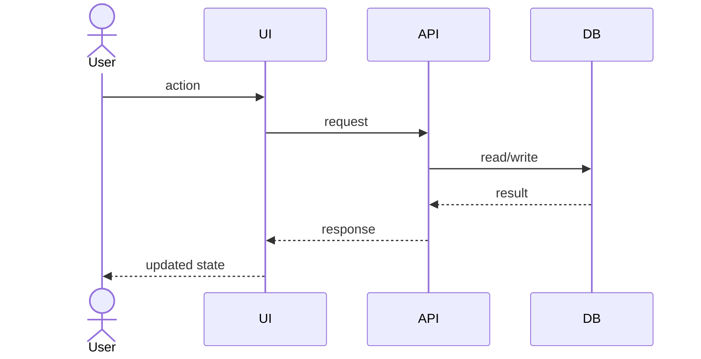

# Flow: <Flow Name>

## Purpose

What this flow accomplishes.

## Trigger

What starts the flow.

## Preconditions

What must be true before it begins.

## End State

What should be true after completion.

## Step-By-Step Flow

1. User or system action:
2. UI behavior:
3. Server action or API request:
4. Backend validation:
5. Authorization check:
6. Database operation:
7. Background job or integration:
8. Cache invalidation:
9. Analytics or observability event:
10. UI update:

## Diagram

## Business Rules Involved

- <rule>

## UI States Involved

- <state>

## Failure Points

- <failure>

## Retry / Idempotency Behavior

- <behavior>

## Tests Required

- <test>
